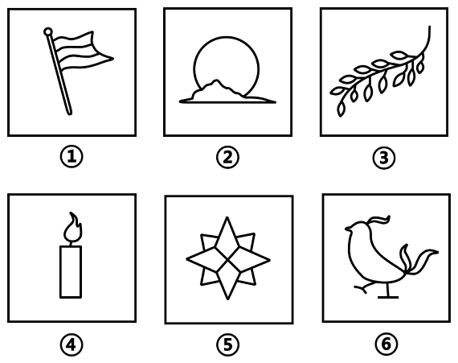
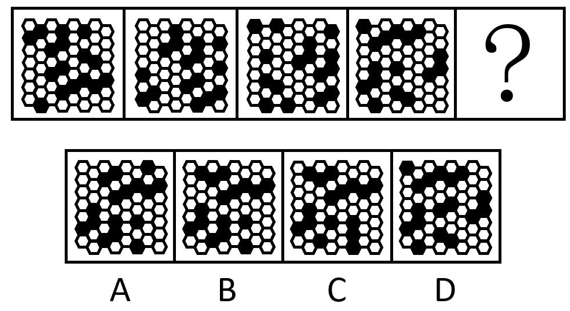
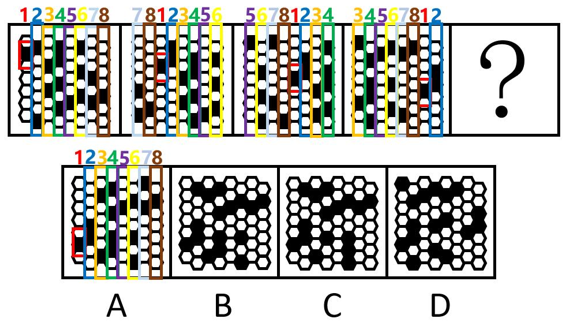
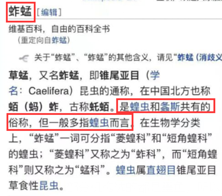
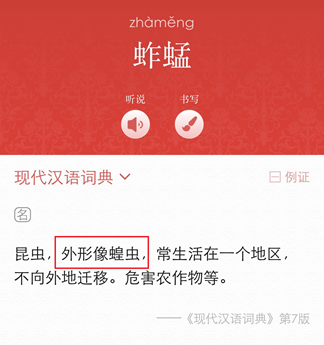

# 2022年辽宁省公务员录用考试《行测》题（网友回忆版）

> 判断推理 · 30 题 · 辽宁 2022

## 第 1 题　qid 5102238 · 图形推理

下图右框内纸盒的外表面中，不能折叠成左框内所示的纸盒的是：

- **A**. A
- **B**. B　✅
- **C**. C
- **D**. D

**答案**：B

**官方解析**

本题考查六面体的空间重构。将题干立体图中的面依次标注为面a、面b、面c，如下图所示。

A项：选项与题干立体图一致，排除；

B项：题干立体图中面a与面b的公共边靠近面a中云朵的底部，而选项中面a与面b的公共边靠近面a中云朵的顶部，选项与题干立体图不一致，当选；

C项：选项与题干立体图一致，排除；

D项：选项与题干立体图一致，排除。

本题为选非题，故正确答案为B。

备注：本题作图不严谨，C项中面b与面a的公共边所对应的图形与题干立体图有差别，云朵的细节与立体图形不同，但对比B、C两项，B项错误更加明显，因此小粉笔建议选择B项。

---

## 第 2 题　qid 5102354 · 图形推理

把下面的六个图形分为两类，使每一类图形都有各自的共同特征或规律，分类正确的一项是：

- **A**. ①②③，④⑤⑥
- **B**. ①③⑤，②④⑥
- **C**. ①④⑤，②③⑥
- **D**. ①⑤⑥，②③④　✅

**答案**：D

**官方解析**

元素组成不同，且无明显属性规律，考虑数量规律。观察发现，题干图形分割明显，考虑面数量。图①⑤⑥均有6个面，图②③④均有9个面，即图①⑤⑥一组，图②③④一组。
故正确答案为D。

---

## 第 3 题　qid 5102168 · 图形推理

把下面的六个图形分为两类，使每一类图形都有各自的共同特征或规律，分类正确的一项是：

- **A**. ①②③，④⑤⑥
- **B**. ①③⑤，②④⑥
- **C**. ①②⑤，③④⑥　✅
- **D**. ①④⑤，②③⑥

**答案**：C

**官方解析**

本题为分组分类题目。元素组成不同，且题干图形出现多个封闭面连在一起，考虑图形间关系。观察发现，图①②⑤的图形间关系为相交于线，图③④⑥的图形间关系为相交于点。即图①②⑤一组，图③④⑥一组。
故正确答案为C。

---

## 第 4 题　qid 5102227 · 图形推理

把下面的六个图形分为两类，使每一类图形都有各自的共同特征或规律，分类正确的一项是：

- **A**. ①②③，④⑤⑥
- **B**. ①③⑤，②④⑥
- **C**. ①④⑤，②③⑥　✅
- **D**. ①⑤⑥，②③④

**答案**：C

**官方解析**

本题为分组分类题目。元素组成不同，且属性规律无法分为两组，考虑数量规律。题干每幅图形均为25宫格内出现的一个由黑粗线条构成的多边形封闭区域。观察发现，图①④⑤中多边形的面积相同，均占7.5个格子，图②③⑥中多边形的面积相同，均占10.5个格子。即图①④⑤为一组，图②③⑥为一组。
故正确答案为C。

---

## 第 5 题　qid 5102356 · 图形推理

所给的四个选项中，哪一项填入问号处，不能使之呈现一定的规律性：

- **A**. A
- **B**. B
- **C**. C
- **D**. D　✅

**答案**：D

**官方解析**

元素组成不同，且无明显属性规律，考虑数量规律。观察发现，图一、图三和图四均为多端点图形，图二为多圆相交图形，可以考虑笔画数。题干图形均为一笔画，而本题为选非题，故？处应选择不是一笔画的图形。A、B、C三项均为一笔画图形，D项为两笔画图形。只有D项不符合规律。
本题为选非题，故正确答案为D。

---

## 第 6 题　qid 5102237 · 图形推理

从所给的四个选项中，选择最合适的一个填入问号处，使之呈现一定的规律性：

- **A**. A　✅
- **B**. B
- **C**. C
- **D**. D

**答案**：A

**官方解析**

元素组成相同，优先考虑位置规律。观察发现，若将每列的元素分别标号后，如上图所示，每列的元素整体依次向右平移2列，且向右平移后又整体依次向下平移1格，只有A项符合此规律。

故正确答案为A。

---

## 第 7 题　qid 5102250 · 图形推理

从所给的四个选项中，选择最合适的一个填入问号处，使之呈现一定的规律性：

- **A**. A
- **B**. B　✅
- **C**. C
- **D**. D

**答案**：B

**官方解析**

元素组成相同，优先考虑位置规律。观察发现，第一组图形中，第一个图形上下翻转并保留原图形后得到第二个图形，第一个图形保持不变放置在下方，然后对第一个图形分别进行上下翻转后放置在上方、顺时针旋转后放置在左侧、逆时针旋转后放置在右侧得到第三个图形。第二组图形应用此规律，对应B项。

故正确答案为B。

---

## 第 8 题　qid 5102239 · 定义判断

替代性满足指当欲望能量在最初对象上遇到阻碍时，就会向其他对象转移；如果再次遇阻，就再次转移，直到寻找到一个替代对象以消除紧张、满足欲望为止。
根据上述定义，下列选项不属于替代性满足的是：

- **A**. 小李很喜欢旅游，因此经常利用自己的假期到全国各地旅游　✅
- **B**. 小王将自己不愉快的生活经历倾注于笔下，完成了一些作品
- **C**. 小刘的小超市经营状况不佳，所以他一直有着天降横财的幻想
- **D**. 小林梦想成为一个叱咤风云的英雄，他特别喜欢上网打战争游戏

**答案**：A

**官方解析**

第一步：找出定义关键词。
“欲望能量在最初对象上遇到阻碍”、“不断转移直到寻找到替代对象”。
第二步：逐一分析选项。
A项：小李喜欢旅游，这是他的“欲望能量”，他经常利用假期旅游，说明小李的“欲望能量”得到了满足，不符合“欲望能量在最初对象上遇到阻碍”，不符合定义，当选；
B项：愉快的生活是小王的“欲望能量”，小王有不愉快的生活经历，说明其“欲望能量”没有得到满足，符合“欲望能量在最初对象上遇到阻碍”；他利用不愉快的生活经历完成了一些作品，说明小王将写作作为最初欲望的替代，符合“不断转移直到寻找到替代对象”，符合定义，排除；
C项：经营好小超市是小刘的“欲望能量”，小刘的小超市经营状况不佳，说明其“欲望能量”没有得到满足，符合“欲望能量在最初对象上遇到阻碍”；他一直有天降横财的幻想，说明小刘将幻想作为最初欲望的替代，符合“不断转移直到寻找到替代对象”，符合定义，排除；
D项：做一个叱咤风云的英雄是小林的“欲望能量”，因此他特别喜欢上网打战争游戏，说明其“欲望能量”在现实中没有得到满足，符合“欲望能量在最初对象上遇到阻碍”；同时将网络游戏作为最初欲望的替代，符合“不断转移直到寻找到替代对象”，符合定义，排除。
本题为选非题，故正确答案为A。

---

## 第 9 题　qid 5102230 · 定义判断

过滤气泡是指以大数据与算法推荐为底层架构，根据用户的使用时间、地区以及浏览习惯生成用户画像，并通过算法技术为其呈现独一无二的界面体验。网络上这种针对个人化搜索而提供筛选后结果的推荐算法，被称为过滤气泡。
根据上述定义，下列不属于过滤气泡的是：

- **A**. 赵先生准备买车，上网看了很多汽车测评类的文章，买完车之后，浏览器上的内容几乎全是汽车类的资讯
- **B**. 李先生经常网购图书，平台特意为他推送购书清单，打造个性化书店，让他在第一时间能得到新书的信息
- **C**. 刘先生经常去某网络贴吧发帖，得到了很多人的关注，一些与他有相同爱好的人还建立了一个微信群进行交流　✅
- **D**. 王先生和张先生分别在各自手机上搜索某公司，王先生的搜索结果多为该公司的招聘信息，张先生的却多为该公司的投资信息

**答案**：C

**官方解析**

第一步：找出定义关键词。
“针对个人化搜索，提供筛选后结果”。
第二步：逐一分析选项。
A项：赵先生上网看测评类的文章后，浏览器为其推送相关内容，符合“针对个人化搜索，提供筛选后结果”，符合定义，排除；
B项：李先生经常网购图书，平台针对性推送购书清单，符合“针对个人化搜索，提供筛选后结果”，符合定义，排除；
C项：刘先生经常去某网络贴吧发帖，建立微信群的过程，没有体现出“针对个人化搜索，提供筛选后结果”，不符合定义，当选；
D项：两位先生分别在各自手机上搜索某公司后，搜索结果的不同，符合“针对个人化搜索，提供筛选后结果”，符合定义，排除。
本题为选非题，故正确答案为C。

---

## 第 10 题　qid 5102247 · 定义判断

乡情治理是指乡情作用于基层社会治理主体和治理体系，在基层社会的意见整合、利益协调、矛盾化解、服务供给等治理过程中发挥重要作用的一种治理形态。“乡情”是一种基于地域以及附着在经济、社会、文化纽带上的特殊情感，体现为认同感、归属感、荣誉感及在此基础上的回馈意愿和公共精神。乡情治理的核心是存在一个由情感和认同构筑的场域，这个场域通过一些微观机制影响个体动机和群体行为，从而影响社会治理体系和过程。
根据上述定义，下列属于乡情治理的是：

- **A**. 顺德人都以顺德是“世界美食之都”而自豪
- **B**. 敢拼会赢的精神一直激励着闽南人勇闯南洋
- **C**. 海外华侨华人一直有着爱国爱乡的光荣传统
- **D**. 北岸乡贤成立妈祖慈善基金会服务当地桑梓　✅

**答案**：D

**官方解析**

第一步：找出定义关键词。
“乡情作用于基层社会治理主体和治理体系”、“在基层社会的治理过程中发挥重要作用”、“由情感和认同构筑的场域”、“影响社会治理体系和过程”。
第二步：逐一分析选项。
A项：“以顺德是‘世界美食之都’而自豪”只表明顺德人对当地的情感和认同，但是没有体现出对基层社会的治理，不符合“乡情作用于基层社会治理主体和治理体系”、“在基层社会的治理过程中发挥作用”，不符合定义，排除；
B项：“敢拼会赢的精神”只表明这是闽南人的一种精神，并不是对于某地域的乡情，所以不存在由情感和认同构筑的场域，不符合“由情感和认同构筑的场域”，同时并没有体现出治理，不符合“乡情作用于基层社会治理主体和治理体系”，不符合定义，排除；
C项：“爱国爱乡的光荣传统”只是海外华侨华人的品格，并不是对于某地域的乡情，所以不存在由情感和认同构筑的场域，不符合“由情感和认同构筑的场域”，同时并没有体现出治理，不符合“乡情作用于基层社会治理主体和治理体系”，不符合定义，排除；
D项：“乡贤成立妈祖慈善基金会”说明当地人认同本地区的文化，存在由情感和认同构筑的场域，符合“由情感和认同构筑的场域”，而且“服务当地桑梓”是一种基层社会治理，符合“乡情作用于基层社会治理主体和治理体系”、“影响社会治理体系和过程”，符合定义，当选。
故正确答案为D。

---

## 第 11 题　qid 5102197 · 定义判断

衰老通常分为生理性衰老和病理性衰老。生理性衰老是指随着年龄增长出现的衰老，也就是自然老化。病理性衰老是指衰老速度由于负面情绪、物理创伤、营养匮乏、身体疾病等各种因素的作用而加快。
根据上述定义，下列诗词所描述的现象最符合病理性衰老的是：

- **A**. 白头搔更短，浑欲不胜簪　✅
- **B**. 寒暑迭变，不觉渐成衰老
- **C**. 惟草木之零落兮，恐美人之迟暮
- **D**. 人生不得长欢乐，年少须臾老到来

**答案**：A

**官方解析**

第一步：找出定义关键词。
病理性衰老：“由于负面情绪、物理创伤、营养匮乏、身体疾病”、“衰老速度加快”；
生理性衰老：“随着年龄增长出现的衰老”、“自然老化”。
第二步：逐一分析选项。
A项：“白头搔更短，浑欲不胜簪”意思为“愁闷心烦只有搔首而已，致使白发疏稀插不上簪”，愁闷心烦符合“由于负面情绪、物理创伤、营养匮乏、身体疾病”，白发稀疏是衰老的明显特征之一，而更稀疏符合“衰老速度加快”，符合“病理性衰老”定义，当选；
B项：“寒暑迭变，不觉渐成衰老”意思为“冬天和夏天交替变化，没有感觉就已渐渐衰老”，时间的变化导致的衰老，不符合“由于负面情绪、物理创伤、营养匮乏、身体疾病”，也未体现“衰老速度加快”，不符合“病理性衰老”定义，排除；
C项：“惟草木之零落兮，恐美人之迟暮”意思为“想到树上黄叶纷纷飘零，而害怕美人头上也添上丝丝霜鬓”，诗人只是表达了害怕美人衰老，而不是描写美人已经衰老，又为何衰老，不符合“由于负面情绪、物理创伤、营养匮乏、身体疾病”，也未体现“衰老速度加快”，不符合“病理性衰老”定义，排除；
D项：“人生不得长欢乐，年少须臾老到来”意思为“人的一生得不到长久的欢乐，青春年少的时光总是过的很快，老年很快就来了”，诗人感叹的是时光飞逝，是由于时间的原因导致衰老，不符合“由于负面情绪、物理创伤、营养匮乏、身体疾病”，也未体现“衰老速度加快”，不符合“病理性衰老”定义，排除。
故正确答案为A。
注——本题出处如下：
https://baike.baidu.com/item/%E8%A1%B0%E8%80%81/1169838?fr=aladdin

---

## 第 12 题　qid 5102199 · 定义判断

最小干预原则是指在保证文物安全的基本前提下，通过最小程度的介入来最大限度地维系文物的原本面貌，保留文物的历史、文化价值，以实现延续现状、降低保护性破坏的目标。
根据上述定义，下列选项不属于最小干预原则的是：

- **A**. 某博物馆在修复古籍时不拆开原线绳，只修补蛀洞严重的书页，而不修补强度未受蛀洞影响的书页
- **B**. 某博物馆的一幅雕塑作品中的人物手臂缺失，专家们查阅了原始资料，根据资料将其复原如初　✅
- **C**. 某古城墙修缮时，保留其残损的现状，在靠近边墙的一侧恢复了很窄的台阶供游人安全通过
- **D**. 某古塔倾斜，专家们在研究后最终决定只纠偏一度，它看上去依旧是倾斜的状态

**答案**：B

**官方解析**

第一步：找出定义关键词。
“保证文物安全”、“最小程度的介入”、“最大限度地维系文物的原本面貌”、“延续现状、降低保护性破坏”。
第二步：逐一分析选项。
A项：某博物馆在修复古籍时不拆开原线绳，只修补蛀洞严重的书页，符合“最小程度的介入”，不修补强度未受蛀洞影响的书页，符合“最大限度地维系文物的原本面貌”，符合定义，排除；
B项：雕塑作品中的人物手臂缺失，根据资料将其复原如初，并没有保留现状，也没有体现是不是最小程度的改变，不符合“最小程度的介入”、“最大限度地维系文物的原本面貌”，不符合定义，当选；
C项：某古城墙修缮时，保留其残损的现状，符合“最大限度地维系文物的原本面貌”，在靠近边墙的一侧恢复了很窄的台阶，说明修复的地方很少，符合“最小程度的介入”，符合定义，排除；
D项：某古塔倾斜，专家们只纠偏一度，说明修复的很少，符合“最小程度的介入”，依旧保留倾斜的状态，符合“最大限度地维系文物的原本面貌”，符合定义，排除。
本题为选非题，故正确答案为B。

---

## 第 13 题　qid 5102235 · 定义判断

薄膜干涉，指的是不同颜色的光波有不同的波长，当一束光波照射于薄膜，由于折射率不同，光波会被薄膜的上界面与下界面分别反射后再相遇，发生相互干涉而形成新的光波。对这一现象的研究可以用于计算薄膜的厚度、折射率等。
根据上述定义，下列不属于薄膜干涉的是：

- **A**. 一片普通薄玻璃镶嵌在窗框里，屋外灿烂的阳光穿透玻璃，照在屋内镜子上也能产生强烈反光　✅
- **B**. 汽车玻璃上的贴膜会改变折射光线和反射光线的能量分配比例，增加对某一光波的反射光强度
- **C**. 汽车在有积水的柏油路上驶过时，积水面会形成一层油膜，这层油膜在阳光下呈现出美丽的色彩
- **D**. 自然环境中，两块干净平整的玻璃片紧紧压叠形成极薄空间，出现一些平行条纹，手指用力压紧玻璃时，条纹随之发生改变

**答案**：A

**官方解析**

第一步：找出定义关键词。
“一束光波照射于薄膜”、“薄膜使其形成新的光波”。
第二步：逐一分析选项。
A项：阳光穿透玻璃，照在屋内镜子上产生强烈反光，说明镜子对光进行了反射，但镜子上是否有薄膜并不清楚，不符合“一束光波照射于薄膜”，不符合定义，当选；
B项：光线照射在汽车玻璃上的贴膜上，符合“一束光波照射于薄膜”，改变折射光线和反射光线的能量分配比例，增加对某一光波的反射光强度，说明光波经过贴膜后形成了新的光波，符合“薄膜使其形成新的光波”，符合定义，排除；
C项：积水面形成的油膜在阳光下呈现出美丽的色彩，符合“一束光波照射于薄膜”，“美丽的色彩”说明肉眼看不到颜色的阳光经过油膜后形成了新的光波，符合“薄膜使其形成新的光波”，符合定义，排除；
D项：两块干净平整的玻璃片紧紧压叠形成极薄空间时，出现平行条纹，说明周围环境有光，符合“一束光波照射于薄膜”，手指用力压紧玻璃时，条纹随之发生改变，说明出现了新的光波，符合“薄膜使其形成新的光波”，符合定义，排除。
本题为选非题，故正确答案为A。

---

## 第 14 题　qid 5102357 · 定义判断

欺诈行为是指经营者采用虚构假象、隐瞒真相、心理引导等方式，使消费者对客观事实产生错误认识，并因此作出购买决定。评价行为则是一种主观的价值判断，会随着评价主体的不同而发生变化，这属于正常的商业宣传。
根据上述定义，下列属于欺诈行为的是：

- **A**. 李某卖的鲤鱼都是饲养的，却告诉张某说是野生的，张某并不在意鲤鱼是否野生，但念及李某谋生不易，心中不忍便买了一条
- **B**. 王某看到一幅字帖落款为“启功”，指着这两个字问“真迹否？”店家笑而不语，王某遂以为真，以低价买得，欢喜回家　✅
- **C**. 服装店老板极尽推销之能事，说某件外套能够衬托赵某的身材气质，赵某购买后感觉并不好看，认为自己被骗了
- **D**. 店家拿出一瓶贴牌假酒当真酒卖，黄某认出这是假酒，但心想可以据此索赔，就买回去了

**答案**：B

**官方解析**

第一步：找出定义关键词。
欺诈行为：“采用虚构假象、隐瞒真相、心理引导等方式”、“对客观事实产生错误认识而作出购买决定”；
评价行为：“主观的价值判断”、“随着评价主体的不同而发生变化”。
第二步：逐一分析选项。
A项：张某购买鲤鱼的理由是念及李某谋生不易，且并不在意鲤鱼是否野生，不符合“对客观事实产生错误认识而作出购买决定”，不符合“欺诈行为”的定义，排除；
B项：对于王某的疑问，店家笑而不语，符合“采用虚构假象、隐瞒真相、心理引导等方式”，王某遂以为真，以低价买得字帖，“遂以为真”说明字帖很大程度上是假的，符合“对客观事实产生错误认识而作出购买决定”，符合“欺诈行为”的定义，当选；
C项：服装店老板认为外套可以衬托赵某的身材气质，这只是推销过程中的主观认知，不符合“采用虚构假象、隐瞒真相、心理引导等方式”，不符合“欺诈行为”的定义，排除；
D项：黄某认出假酒，仍选择购买，说明没有对此酒产生错误认识，不符合“对客观事实产生错误认识而作出购买决定”，不符合“欺诈行为”的定义，排除。
故正确答案为B。

---

## 第 15 题　qid 5102358 · 类比推理

帛书：简牍

- **A**. 日晷：秒表
- **B**. 熊猫：银杏
- **C**. 青铜：礼器
- **D**. 牛车：轿子　✅

**答案**：D

**官方解析**

第一步：判断题干词语间逻辑关系。
帛书是指中国古代写在绢帛上的文书；简牍是指中国古代书写在竹简或木片上的文书，二者是两种不同的书，为并列关系。
第二步：判断选项词语间逻辑关系。
A项：日晷和秒表是两种不同的计时器，二者为并列关系，与题干逻辑关系一致，保留；
B项：熊猫是动物，银杏是植物，二者不是并列关系，与题干逻辑关系不一致，排除；
C项：青铜是制作礼器的原材料之一，二者为原材料与成品的对应关系，与题干逻辑关系不一致，排除；
D项：牛车和轿子是两种不同的交通工具，二者为并列关系，与题干逻辑关系一致，保留。
对比A、D两项，题干中的帛书和简牍都是古代出现的事物，A项中的日晷是古代出现的事物，但秒表是现代出现的事物，D项中的牛车起源于商代，牛车和轿子都是古代出现的事物，故D项与题干的关系更近。
故正确答案为D。

---

## 第 16 题　qid 5102228 · 类比推理

姹紫：嫣红

- **A**. 嘉言：懿行　✅
- **B**. 风刀：霜剑
- **C**. 小家：碧玉
- **D**. 疾首：蹙额

**答案**：A

**官方解析**

第一步：判断题干词语间逻辑关系。
姹紫嫣红形容各种颜色的花卉艳丽、好看，“姹紫”指美丽的紫色，“嫣红”指鲜艳的红色，二者为并列关系。
第二步：判断选项词语间逻辑关系。
A项：嘉言懿行指有教育意义的好言语和好行为，“嘉言”指有益的言论，“懿行”指高尚的行为，二者为并列关系，与题干逻辑关系一致，保留；
B项：风刀霜剑指寒风像刀子，严霜像剑一样刺人的肌肤，形容气候寒冷，也比喻世态险恶，“风刀”指风如刀，“霜剑”指霜似剑，二者为并列关系，与题干逻辑关系一致，保留；
C项：小家碧玉指小户人家的年轻美貌的女子，“小家”指小户人家，“碧玉”指年轻美貌的女子，二者不是并列关系，与题干逻辑关系不一致，排除；
D项：疾首蹙额形容厌恶、痛恨的样子，“疾首”指头痛，“蹙额”指皱眉，二者为并列关系，与题干逻辑关系一致，保留。
对比A、B、D三项，题干中，“姹”修饰“紫”，“嫣”修饰 “红”，“姹紫”和“嫣红”均为偏正结构；A项的“嘉言”和“懿行”均为偏正结构，B项的“风刀”和“霜剑”不是偏正结构，D项的“蹙额”是动宾结构，所以A项与题干的逻辑关系更加一致。

故正确答案为A。

---

## 第 17 题　qid 5102353 · 类比推理

考拉：树袋熊

- **A**. 墨鱼：乌贼　✅
- **B**. 蜜蜂：黄蜂
- **C**. 蚱蜢：蝗虫
- **D**. 金龟子：天牛

**答案**：A

**官方解析**

第一步：判断题干词语间逻辑关系。

考拉和树袋熊是同一种动物，二者为全同关系。

第二步：判断选项词语间逻辑关系。

A项：墨鱼和乌贼是同一种动物，二者为全同关系，与题干逻辑关系一致，保留；

B项：黄蜂属于胡蜂科，蜜蜂属于蜜蜂科，二者为并列关系，与题干逻辑关系不一致，排除；

C项：蚱蜢和蝗虫的关系较有争议，部分资料显示二者为全同关系，与题干逻辑关系一致，保留；

D项：金龟子是鞘翅目金龟总科的通称，天牛是多食亚目天牛科昆虫的总称，二者为并列关系，与题干逻辑关系不一致，排除。

对比A、C两项，C项中蚱蜢和蝗虫的关系较有争议，如下图所示，维基百科和百度百科都表明二者是全同关系，但现代汉语词典表明二者并不是同一种动物，目前无法确定出题人对二者的关系是如何判定的，相对来说，A项中的墨鱼和乌贼是没有争议的全同关系，因此，小粉笔更倾向于将正确答案给到A项。

故正确答案为A。

---

## 第 18 题　qid 5102209 · 类比推理

马匹：船只：车辆

- **A**. 银两：金钱：银币
- **B**. 纸张：试卷：画册
- **C**. 水杯：油瓶：饭碗　✅
- **D**. 官员：武将：首领

**答案**：C

**官方解析**

第一步：判断题干词语间逻辑关系。
马匹、船只和车辆都有运输的功能，三者在功能上是并列关系。
第二步：判断选项词语间逻辑关系。
A项：银两是以银锭为主要形式的一种秤量货币单位，金钱多指用金属铸成的钱，后泛指货币财富，银两是金钱，二者是种属关系，与题干逻辑关系不一致，排除；
B项：纸张是制作试卷的原材料，二者是原材料与成品的对应关系，与题干逻辑关系不一致，排除；
C项：水杯、油瓶和饭碗都有盛装物品的功能，三者在功能上是并列关系，与题干逻辑关系一致，当选；
D项：武将是古代的军事将领或部队军官，武将是官员，二者是种属关系，与题干逻辑关系不一致，排除。
故正确答案为C。

---

## 第 19 题　qid 5102165 · 类比推理

肥：瘦：挑肥拣瘦

- **A**. 上：下：欺上瞒下　✅
- **B**. 来：去：翻来覆去
- **C**. 黑：白：黑白分明
- **D**. 是：非：口是心非

**答案**：A

**官方解析**

第一步：判断题干词语间逻辑关系。
肥与瘦为反义词，且肥在第三个词语中的2号位，瘦在第三个词语中的4号位，第三个词语拆分之后，挑肥与拣瘦均为动宾结构。
第二步：判断选项词语间逻辑关系。
A项：上与下为反义词，上在第三个词语中的2号位，下在第三个词语中的4号位，第三个词语拆分之后，欺上与瞒下均为动宾结构，与题干逻辑关系一致，当选；
B项：来与去为反义词，来在第三个词语中的2号位，去在第三个词语中的4号位，第三个词语拆分之后，翻来与覆去不是动宾结构，与题干逻辑关系不一致，排除；
C项：黑与白为反义词，黑在第三个词语中的1号位，白在第三个词语中的2号位，与题干逻辑关系不一致，排除；
D项：是与非为反义词，是在第三个词语中的2号位，非在第三个词语中的4号位，第三个词语拆分之后，口是与心非不是动宾结构，与题干逻辑关系不一致，排除。
故正确答案为A。

---

## 第 20 题　qid 5102171 · 类比推理

征稿：评选：颁奖

- **A**. 运动：热身：放松
- **B**. 节能：减排：环保
- **C**. 设计：施工：监理
- **D**. 麻醉：切开：缝合　✅

**答案**：D

**官方解析**

第一步：判断题干词语间逻辑关系。
先征稿，再评选，最后颁奖，三者为动作上的先后顺序的对应关系。
第二步：判断选项词语间逻辑关系。
A项：先热身，再运动，两词顺序与题干相反，与题干逻辑关系不一致，排除；
B项：节能和减排是并列关系，不分先后，且节能和减排都属于环保措施，与题干逻辑关系不一致，排除；
C项：先设计，再施工，监理是指对工程项目等进行监督管理，监理的主要内容是熟悉所监理项目的合同条款、规范、设计图纸，有效开展现场监理工作，及时报告施工过程中出现的问题等，所以施工和监理可以同时发生，没有一定的先后顺序，与题干逻辑关系不一致，排除；
D项：先麻醉，再切开，最后缝合，三者为动作上的先后顺序的对应关系，与题干逻辑关系一致，当选。
故正确答案为D。

---

## 第 21 题　qid 5102192 · 类比推理

入木三分 对于 （    ） 相当于 （    ） 对于 音乐

- **A**. 绘画；珠圆玉润
- **B**. 雕刻；黄钟大吕
- **C**. 建筑；高山流水
- **D**. 书法；余音绕梁　✅

**答案**：D

**官方解析**

逐一代入选项。
A项：入木三分形容书法刚劲有力，也用来形容议论、见解深刻，与绘画无明显逻辑关系；珠圆玉润形容歌声婉转优美或文字流畅明快，用来形容音乐，二者为对应关系。前后逻辑关系不一致，排除；
B项：入木三分形容书法刚劲有力，也用来形容议论、见解深刻，与雕刻无明显逻辑关系；黄钟大吕形容正大、庄严、高妙的音乐或文辞，用来形容音乐，二者为对应关系。前后逻辑关系不一致，排除；
C项：入木三分形容书法刚劲有力，也用来形容议论、见解深刻，与建筑无明显逻辑关系；高山流水指知音难觅或乐曲高妙，用来形容音乐，二者为对应关系。前后逻辑关系不一致，排除；
D项：入木三分形容书法刚劲有力，也用来形容议论、见解深刻，用来形容书法，二者构成对应关系；余音绕梁形容歌声或音乐优美，耐人回味，用来形容音乐，二者构成对应关系。前后逻辑关系一致，当选。
故正确答案为D。

---

## 第 22 题　qid 5102173 · 类比推理

晴空万里 对于 （    ） 相当于 （    ） 对于 识文断字

- **A**. 天干物燥；才高八斗
- **B**. 雨后春笋；妙笔生花
- **C**. 阴云密布；胸无点墨　✅
- **D**. 倾盆大雨；味同嚼蜡

**答案**：C

**官方解析**

逐一代入选项。
A项：“晴空万里”形容天空晴朗，没有一点云彩，“天干物燥”意思是天气太干，物品也干燥，极易起火，二者无明显逻辑关系；“才高八斗”比喻才学极高，“识文断字”意思是能识字读书，指有一点文化知识，二者无明显逻辑关系，前后逻辑关系不一致，排除；
B项：“晴空万里”形容天空晴朗，没有一点云彩，“雨后春笋”指春天下大雨后，发出来的竹笋一下子就长出来很多，比喻新生事物迅速大量地涌现出来，二者无明显逻辑关系；“妙笔生花”比喻写作能力大有进步，或形容文章写得很出色，“识文断字”意思是能识字读书，指有一点文化知识，二者无明显逻辑关系，前后逻辑关系不一致，排除；
C项：“晴空万里”形容天空晴朗，没有一点云彩，“阴云密布”形容浓厚的云层或空气中的大量的烟尘遮蔽天日，二者为反义关系；“胸无点墨”意思是肚子里没有一点墨水，指没有文化，“识文断字”意思是能识字读书，指有一点文化知识，二者为反义关系，前后逻辑关系一致，当选；
D项：“晴空万里”形容天空晴朗，没有一点云彩，“倾盆大雨”形容雨大势急，二者为反义关系；“味同嚼蜡”意思是像吃蜡一样，没有一点儿味，形容语言或文章枯燥无味，“识文断字”意思是能识字读书，指有一点文化知识，二者无明显逻辑关系，前后逻辑关系不一致，排除。
故正确答案为C。

---

## 第 23 题　qid 5102359 · 逻辑判断

有些人的心情比较容易受到外界影响，比如飞行员担心遇到雷暴，虽然没有什么奇招，但有些食物的确能让大脑更好地运作，可可就是其中之一。这是因为可可含有大量的茶碱和咖啡因，它们可以有效的减轻压力和缓解疼痛。
以下哪项如果为真，最能支持上述观点？

- **A**. 虽然可可富含咖啡因，但咖啡因只有在特定条件下才能发挥其减压作用
- **B**. 据研究显示，可可中含有的茶碱和咖啡因可以刺激大脑分泌内啡肽，而内啡肽对减轻压力和缓解疼痛非常有效　✅
- **C**. 每天摄入主要原料为可可的黑巧克力对情绪会有一定影响
- **D**. 每天至少30分钟的运动，有助于大脑产生缓解压力和焦虑所需的激素

**答案**：B

**官方解析**

第一步：找出论点和论据。
论点：有些食物的确能让大脑更好地运作，可可就是其中之一。
论据：可可含有大量的茶碱和咖啡因，它们可以有效的减轻压力和缓解疼痛。
本题论点说的是“可可”让“大脑更好地运作”，论据说的是“可可”中的“茶碱和咖啡因”可以“减轻压力和缓解疼痛”，“减轻压力和缓解疼痛”有助于“大脑更好地运作”，二者关系紧密，可以认为话题一致，加强可以考虑补充论据，即解释原因或举例。
第二步：逐一分析选项。
A项：指出可可中的咖啡因需要在“特定条件”下才能发挥减压作用，但无法确定食用可可时是否满足特定条件，也就无法判断减压作用是否能实现，属于不明确项，无法加强，排除；
B项：指出可可中含有的茶碱和咖啡因是通过刺激大脑分泌内啡肽来起到减轻压力和缓解疼痛作用的，进而能让大脑更好地运作，解释原因，补充论据，当选；
C项：指出用可可制作的黑巧克力对情绪有影响，但无法判断是好影响还是坏影响，能否让大脑更好的运作，属于不明确项，无法加强，排除；
D项：指出“运动”对于大脑的作用，而论点说的是“可可”对于大脑的作用，话题不一致，属于无关项，无法加强，排除。
故正确答案为B。

---

## 第 24 题　qid 5102362 · 逻辑判断

传统理论认为恐龙的灭绝是小行星撞击地球导致的，科学家表示，恐龙的多样性是从7600万年前开始下降。研究人员研究了六大恐龙群体的进化趋势，发现在6600万年白垩纪末期物种大灭绝之前的大约1000万年里，食草恐龙和食肉恐龙都在衰落。
由此可以推出：

- **A**. 在小行星撞击地球并最终使恐龙灭绝之前恐龙就已经处境不佳　✅
- **B**. 在恐龙时代的最后1000万年里，六大恐龙的新物种形成速度下降，灭绝速度急剧上升
- **C**. 在恐龙时代最后4000万年中的不同时期，六大恐龙的多样性都出现了下降，尽管降幅不一
- **D**. 恐龙在小行星撞地球之前就面临危机，由于它们的灭绝速度超过新物种的速度，因此“尤其容易灭绝”

**答案**：A

**官方解析**

日常结论题，根据题干信息逐一分析选项。
A项：根据题干可知，恐龙的多样性从7600万年前就开始下降，食草恐龙和食肉恐龙都在衰落，这些发生在6600万年白垩纪末期物种大灭绝（小行星撞击地球的时间）之前的大约1000万年里，可以推出在小行星撞击地球并最终使恐龙灭绝之前恐龙就已经处境不佳，当选；
B项：题干只是指出在恐龙时代的最后1000万年里，食草恐龙和食肉恐龙都在衰落，并没有提及新物种形成速度和灭绝速度的情况，无中生有，无法推出，排除；
C项：题干中没有提及在恐龙时代“最后4000万年中的不同时期”，六大恐龙多样性的降幅问题，无中生有，无法推出，排除；
D项：题干中没有提及恐龙和新物种灭绝速度的比较，无中生有，无法推出，排除。
故正确答案为A。

---

## 第 25 题　qid 5102164 · 逻辑判断

研究者发现，蚕挑选桑叶要经过类似于计算机安全系统的验证。蚕口器下方的下颚须在触碰叶片时会先轻轻咬一口，下颚须中的味觉神经能以极高的灵敏度识别叶片表面的-谷甾醇、绿原酸、异槲皮苷这三种物质；接着，它会用口器上的须形外颚叶来尝一下叶片叶汁中的糖分，须形外颚叶上的味觉神经比较迟钝，只有高浓度的糖才能激活；在确认是桑叶后它才开始大肆咀嚼。

由此可以推出：

- **A**. 桑叶会分泌适合蚕生长的糖分和物质，故而它几乎只吃桑叶
- **B**. 通过不同的器官感受不同的味道，这就是蚕判断桑叶的秘诀　✅
- **C**. 蚕在演化过程中，它的口器具备了通过触碰感知桑叶的能力
- **D**. 这项研究有助于改进蚕的人工饲料，可在没有桑树的环境下养蚕

**答案**：B

**官方解析**

日常结论题，根据题干信息逐一分析选项。

A项：题干指出蚕是通过高浓度糖分激活须形外颚叶上的味觉神经来确认桑叶，没有提及蚕只吃桑叶的原因，无中生有，无法推出，排除；

B项：题干指出蚕口器下方的下颚须中的味觉神经能识别-谷甾醇、绿原酸、异槲皮苷，接着，蚕会用口器上的须形外颚叶来尝一下叶片叶汁中的糖分，可以推出蚕通过不同的器官感受不同的味道来判断是否是桑叶，可以推出，当选；

C项：题干指出蚕依靠下颚须中的“味觉神经”识别叶片表面的一些物质，用口器上的须形外颚叶来“尝”糖分，因此蚕是依靠“味觉”来感知桑叶，而非依靠“碰触”，无法推出，排除；

D项：题干中没有提及蚕的饲养，也没有提及改进蚕的人工饲料，无中生有，无法推出，排除。

故正确答案为B。

---

## 第 26 题　qid 5102179 · 逻辑判断

科学家在金星大气层中探测到了磷化氢的踪迹，浓度极高，是地球大气层中磷化氢浓度的1000倍至100万倍。在地球上，磷化氢仅见于工业生产领域或由厌氧微生物所产生。对于金星上磷化氢的来源，研究团队进行了大量分析，推断是否来自光照、闪电、火山或者从金星表面向上吹至大气层中的矿物质等，但根据已有知识的计算结果均不支持这些来源。研究人员因此表示有磷化氢意味着没有充足的氧气存在，但有可能证明是存在厌氧生物的，故而金星大气层中的磷化氢有可能是某种生物留下的印记。
以下哪项如果为真，最能削弱上述研究人员的观点？

- **A**. 金星大气中含有大量二氧化碳以及浓硫酸云层，温室效应非常严重
- **B**. 科学家们发现了“不需要呼吸”的动物，比较符合金星的大气条件
- **C**. 金星上存在某些未知的光化学过程，这些光化学过程能够释放大量的磷化氢　✅
- **D**. 磷化氢需要很多能量来制作，且任何行星上都不太可能存在太多磷，因此一颗行星产生大量磷化氢的可能性很低

**答案**：C

**官方解析**

第一步：找出论点和论据。
论点：金星大气层中的磷化氢有可能是某种生物留下的印记。
论据：有磷化氢意味着没有充足的氧气存在，但有可能证明是存在厌氧生物的。
本题论点说的是“金星大气层中的磷化氢”与“某种生物”之间的关系，论据说的是“磷化氢”与可能存在“厌氧生物”之间的关系，论点论据话题一致，削弱优先考虑削弱论点。
第二步：逐一分析选项。
A项：该项说金星大气中含有大量二氧化碳以及浓硫酸云层，温室效应非常严重，而论点讨论的是金星大气层中的磷化氢是否来自于某种生物，话题不一致，无法削弱，排除；
B项：该项说的是存在比较符合金星上大气条件的“不需要呼吸”的动物，说明在金星上可能在没有充足氧气的情况下存在生物，即厌氧生物，补充论据说明这些生物可能是磷化氢的来源，为加强项，无法削弱，排除；
C项：该项说的是金星上存在某些未知的光化学过程，这些光化学过程能够释放大量的磷化氢，说明金星大气层中的磷化氢是来自于光化学过程，而不是来自于厌氧生物，削弱论点，可以削弱，当选；
D项：该项说的是任何行星上都不太可能存在太多磷，因此一颗行星产生大量磷化氢的可能性很低，而题干论点讨论的是金星大气层中的磷化氢的来源问题，话题不一致，无法削弱，排除。
故正确答案为C。

---

## 第 27 题　qid 5102232 · 逻辑判断

研究人员对人的“头骨突起”进行了一项研究。在这项研究中，调查对象包括1200名年龄在18岁至86岁的普通人群，研究发现，颅骨底部出现骨质突起的情况在年轻人中比在老年人中更为普遍，尤其是在18岁至30岁年龄组的男性当中，研究者认为，一些人颅骨底部出现的奇怪的“头骨突起”与他们长时间弯下脖子看智能手机时的奇怪角度有关。
以下各项如果为真，最能质疑上述结论的是：

- **A**. 网上销售的塑形枕头深受“头骨突起”的年轻消费者欢迎
- **B**. 该研究样本人群是随机抽取，它的结论适用于普通人群
- **C**. 研究人员对年轻人更容易出现头骨突起的分析过程存在瑕疵
- **D**. 研究者并未对调查对象每日弯下脖子看智能手机的时间进行记录　✅

**答案**：D

**官方解析**

第一步：找出论点和论据。
论点：一些人颅骨底部出现的奇怪的“头骨突起”与他们长时间弯下脖子看智能手机时的奇怪角度有关。
论据：研究发现颅骨底部出现骨质突起的情况在年轻人中比在老年人中更为普遍，尤其是在18岁至30岁年龄组的男性当中。
本题论据在分析“年龄”与“头骨突起”的关系，论点在分析“长时间弯下脖子看智能手机时的奇怪角度”和“头骨突起”的关系，论据和论点话题不一致，优先考虑拆桥，即不能通过“年龄”推出“不良姿势看手机的时长”。
第二步：逐一分析选项。
A项：指出塑形枕头受到“头骨突起”的年轻消费者欢迎，是在强调部分头骨突起人群的购物偏好，但论点是在分析“头骨突起”产生的具体原因，话题不一致，无法削弱，排除；
B项：指出研究样本选取很科学，结论具有普适性，进一步说明了结论成立的科学性，为加强项，无法削弱，排除；
C项：指出研究中对年轻人更容易出现头骨突起的分析过程存在瑕疵，即论据中的研究过程是存在瑕疵的，可以削弱，保留；
D项：指出该研究未统计过不同年龄段的受访者用不良姿势看智能手机的时长，那就不能通过“年龄”推出“不良姿势看手机的时长”，可以削弱，保留；
比较C、D两项，C项只说分析过程存在瑕疵，但具体是什么瑕疵，是否会影响实验结论，表述并不明确，故D项更为明确。
故正确答案为D。

---

## 第 28 题　qid 5102200 · 逻辑判断

伤害感受神经能够对造血干细胞动员进行调控，增强造血干细胞的黏附或迁移，降钙素基因相关肽（CGRP）是伤害感受神经元主要分泌的神经递质分子。研究者发现，给予CGRP可以显著增强造血干细胞动员。CGRP可以直接影响造血干细胞，诱导细胞表面形成CALCRL和RAMP1蛋白形成的二聚体受体，并促进造血干细胞进入血管。研究专家认为，吃辣可以促进造血干细胞动员。
如果上述结论为真，需要补充的前提是：

- **A**. 骨髓神经纤维中高达77%都是伤害感受神经元
- **B**. 辛辣食物导致的“辣味”是一种痛觉，会激活伤害感受神经　✅
- **C**. 辣的食物能够促进消化液的分泌，增加消化酶的活性，加速胃肠道蠕动
- **D**. 造血干细胞会在神经的调控之下，从骨髓释放进入循环，对损失的血细胞进行补充

**答案**：B

**官方解析**

第一步：找出论点和论据。
论点：吃辣可以促进造血干细胞动员。
论据：伤害感受神经能够对造血干细胞动员进行调控，增强造血干细胞的黏附或迁移，降钙素基因相关肽（CGRP）是伤害感受神经元主要分泌的神经递质分子。研究者发现，给予CGRP可以显著增强造血干细胞动员。CGRP可以直接影响造血干细胞，诱导细胞表面形成CALCRL和RAMP1蛋白形成的二聚体受体，并促进造血干细胞进入血管。
本题论点说的是“吃辣”与“造血干细胞动员”之间的关系，论据说的是“伤害感受神经”与“造血干细胞动员”之间的关系，话题不一致，且提问方式为“前提”，加强优先考虑搭桥，即建立“吃辣”与“伤害感受神经”之间的联系。
第二步：逐一分析选项。
A项：指出骨髓神经纤维中的伤害感受神经元占比高，不能说明“吃辣”与“造血干细胞动员”之间的关系，话题不一致，无法加强，排除；
B项：指出“辣味”会激活神经纤维中的伤害感受神经，这说明吃辣可以影响伤害感受神经，进而影响造血干细胞动员，在“吃辣”与“伤害感受神经”之间建立了联系，搭桥项，可以加强，当选；
C项：指出辣的食物能够促进消化液的分泌、加速胃肠道蠕动，与造血干细胞无关，属于无关项，无法加强，排除；
D项：指出造血干细胞能够对损失的血细胞进行补充，未提及吃辣对其的影响，属于无关项，无法加强，排除。
故正确答案为B。

---

## 第 29 题　qid 5102177 · 逻辑判断

要控制冰川的退缩，一劳永逸的方法只有节能减排、减少温室气体排放、遏制地球气温升高。只有这样，冰川的加速退缩才能从根本上得到控制。如果不减少温室气体的排放，欧洲阿尔卑斯山将有94％的冰川会在100年内消失掉，也许人们只能在冷库中看到一点剩余的冰川冰。
由此可以推出：

- **A**. 如果节能减排、减少温室气体排放、遏制地球气温升高，就能够控制冰川的退缩
- **B**. 如果欧洲阿尔卑斯山有94％的冰川在100年内消失掉，那就说明温室气体排放没有减少
- **C**. 除非减少温室气体排放，否则欧洲阿尔卑斯山将有94％的冰川在100年内消失掉　✅
- **D**. 只要节能减排、减少温室气体排放、遏制地球气温升高，就能控制冰川退缩

**答案**：C

**官方解析**

第一步：翻译题干。

①冰川的退缩得到控制节能减排、减少温室气体排放、遏制地球气温升高

②减少温室气体排放欧洲阿尔卑斯山将有94％的冰川会在100年内消失掉

第二步：逐一分析选项。

A项：翻译为“节能减排、减少温室气体排放、遏制地球气温升高冰川的退缩得到控制”，是对①的肯后，但肯后得不到确定性的结论，无法推出，排除；

B项：翻译为“欧洲阿尔卑斯山将有94％的冰川在100年内消失掉减少温室气体排放”，是对②的肯后，但肯后得不到确定性的结论，无法推出，排除；

C项：翻译为“欧洲阿尔卑斯山将有94％的冰川在100年内消失掉减少温室气体排放”，是对②的否后，否后必否前，可以推出，当选；

D项：翻译为“节能减排、减少温室气体排放、遏制地球气温升高冰川的退缩得到控制”，是对①的肯后，但肯后得不到确定性的结论，无法推出，排除。

故正确答案为C。

---

## 第 30 题　qid 5102163 · 逻辑判断

欧洲杯比赛期间，小赵、小钱、小孙、小李预测甲、乙两支队伍能否进入决赛。他们的对话如下：
小赵：如果甲进入决赛，则乙也能进入决赛。
小钱：我看甲进入决赛没有问题。
小孙：在我看来，甲能够进入决赛，但乙进不了。
小李：我的看法是，如果甲不能进入决赛，则乙进决赛。
结果出来后，他们四人的预测有两个真、两个假，关于甲和乙是否进入决赛，以下推论正确的是：

- **A**. 甲和乙都进入决赛
- **B**. 甲和乙都没有进入决赛
- **C**. 甲进入决赛，乙没有进入决赛
- **D**. 甲没有进入决赛，乙进入决赛　✅

**答案**：D

**官方解析**

第一步：分析题干找关系。

①小赵：甲乙；

②小钱：甲；

③小孙：甲 且 乙；

④小李：甲乙。

分析题干条件，①、③为矛盾关系，必有一真一假。

第二步：看其余。

根据题干推理可知，四人预测为两真两假，故②、④也必有一真一假。由“AB”=“A 或 B”可知，④“甲乙”=“甲 或 乙”，此时，若②“甲”为真，则④“甲 或 乙”为真，与②、④必有一真一假矛盾，故②“甲”为假，即甲没有进入决赛，此时④“甲 或 乙”为真，根据或关系的否一推一，可知乙进入决赛。

故正确答案为D。

---
