# 2022年重庆市选调优秀大学生到基层工作考试《行测》题

> 判断推理 · 30 题 · 选调 2022

## 第 1 题　qid 4927986 · 图形推理

从所给四个选项中，选择最合适的一个填入问号处，使之呈现一定的规律性：

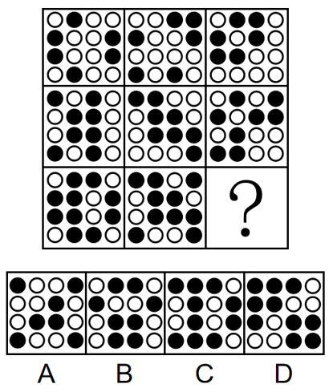

- **A**. A
- **B**. B
- **C**. C
- **D**. D　✅

**答案**：D

**官方解析**

元素组成不同，优先考虑数量规律。本题为九宫格题目，优先横着看，第一行每个图形均有六个小黑球，第二行每个图形均有八个小黑球，第三行前两个图形均有十个小黑球，那么问号处图形应有十个小黑球，排除A、B两项；继续观察发现，题干所有图形均由小黑球和小白球组成，整体均构成轴对称图形，且对称轴只有一条，观察对称轴方向可知，每列图形对称轴方向相同，只有D项符合。

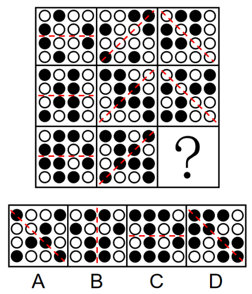

故正确答案为D。

---

## 第 2 题　qid 4927978 · 图形推理

把下面的六个图形分为两类，使每一类都有各自的共同特征或规律，分类正确的一项是：

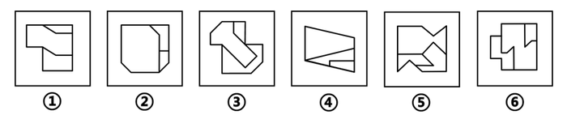

- **A**. ①②③，④⑤⑥
- **B**. ①②④，③⑤⑥
- **C**. ①②⑥，③④⑤　✅
- **D**. ①③⑥，②④⑤

**答案**：C

**官方解析**

本题为分组分类题目。观察发现，多边形内部被线条分割，优先考虑面数量，但题干图形的面数量都是3，无法分组。继续观察发现，所有图形均明显存在最大面且最大面出现等腰元素，可优先考虑最大面的对称性，其中图①②⑥最大面均为中心对称图形，图③④⑤最大面均为轴对称图形，故图①②⑥一组，图③④⑤一组。
故正确答案为C。

---

## 第 3 题　qid 4928010 · 图形推理

左边是给定纸盒的外表面，右边哪项能由它折叠而成？

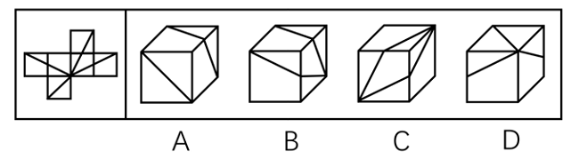

- **A**. A
- **B**. B
- **C**. C　✅
- **D**. D

**答案**：C

**官方解析**

将原展开图标上序号如下图，逐一进行分析。

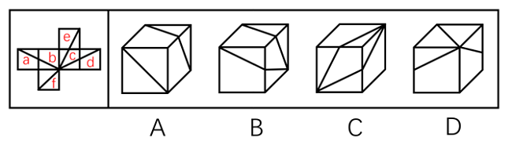

A项：选项正面是面f，因为面f与面e为相对面，面b与面d为相对面，相对面不能同时出现，因此选项由面f、面a和面b或面f、面a和面d构成。当选项由面f、面a和面b构成时，题干展开图中（如下图1所示），三个面的公共点分别挨着面a中的梯形和面b中的三角形，而选项中，三个面的公共点挨着面a和面b中的梯形，选项与题干展开图不一致；

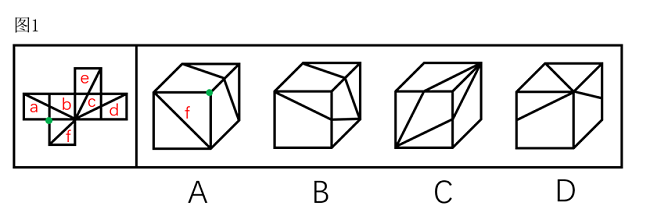

当选项由面f、面a和面d构成时，题干展开图中（如下图2所示），面a与面d的公共边与两个面中的直角梯形的长底边相邻，而选项中，面a与面d的公共边与两个面中的直角梯形的短底边相邻，选项与题干展开图不一致，排除；

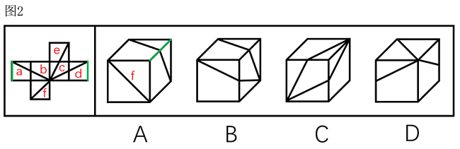

B项：选项侧面是面c，因为面c与面a为相对面，面b与面d为相对面，相对面不能同时出现，因此选项由面c、面b和面e或面c、面d和面e构成。当选项由面c、面b和面e构成时，题干展开图中（如下图3所示），面c中的三角形的顶点在三个面的公共点上，而选项中，面c中的四边形的顶点在三个面的公共点上，选项与题干展开图不一致；

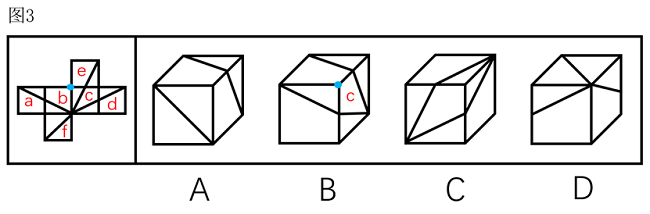

当选项由面c、面d和面e构成时，题干展开图中（如下图4所示），三个面的公共点在面e和面d中两个直角三角形的直角顶点上，而选项中，三个面的公共点只在一个直角三角形的直角顶点，选项与题干展开图不一致，排除；

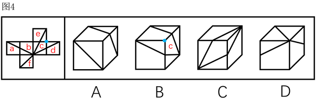

C项：选项由面c、面d和面e构成，选项与题干展开图一致，当选；

D项：选项顶面是面f，因为面f与面e为相对面，面b与面d为相对面，相对面不能同时出现，因此选项由面f、面a和面b或面f、面a和面d构成。当选项由面f、面a和面b构成时，题干展开图中（如下图5所示），三个面的公共点没有散发出直线，而选项中，三个面的公共点散发出三个面中的直线，选项与题干展开图不一致；

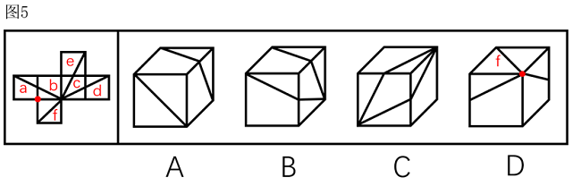

当选项由面f、面a和面d构成时，题干展开图中（如下图6所示），面a与面f的公共边挨着面a中的梯形，而选项中，面f与两个面的公共边均挨着面中的三角形，选项与题干展开图不一致，排除。

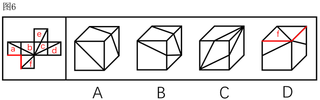

故正确答案为C。

---

## 第 4 题　qid 4927982 · 图形推理

从所给的四个选项中，选择最合适的一个填入问号处，使之呈现一定的规律性：

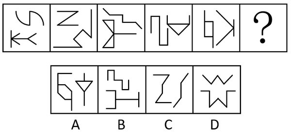

- **A**. A
- **B**. B　✅
- **C**. C
- **D**. D

**答案**：B

**官方解析**

元素组成不同，优先考虑属性规律。观察发现，题干图形出现箭头、“Z”字变形图等，优先考虑对称性。继续观察发现，题干图形均由一个中心对称图形和一个轴对称图形组成，只有B项符合。
故正确答案为B。

---

## 第 5 题　qid 4927995 · 图形推理

左边的立体图形是由①、②和③组成的，下列哪项可以填入问号处？

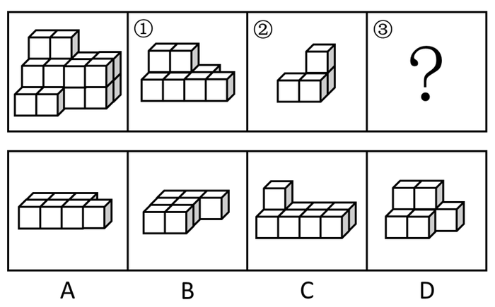

- **A**. A
- **B**. B　✅
- **C**. C
- **D**. D

**答案**：B

**官方解析**

本题考查立体拼合。观察题干给出的图形可知，图形可分为3层，由上至下第一层有2个小立方体，第二层有8个小立方体，共2排，第三层有10个小立方体，共3排。图①共有2层，最上层有2个小立方体，可以拼在多面体的第一层和第二层（如下图所示），则题干多面体第二层还剩余1个小立方体，第三层还剩余10个小立方体。图②共有2层，可以拼在多面体的第二层和第三层（如下图所示），则题干多面体仅第三层还剩余7个小立方体。根据凹凸一致原则对立体图形进行拼合可知，第三层应有3排，对应B项。具体拼合方式如下图所示，左侧立体图形可以由图①、②以及B项拼合而成。

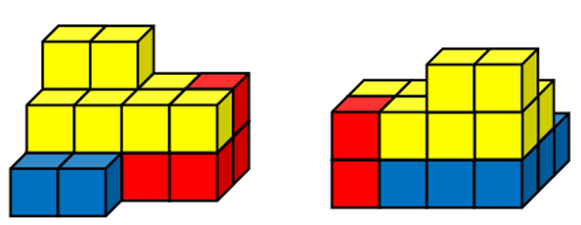

故正确答案为B。

---

## 第 6 题　qid 4927980 · 定义判断

乞题指以需要证明的命题作为证明的前提，也就是说，一个问题被用来支持结论，结论的理由是问题自身（A推出A），这样的错误称之为乞题错误。
根据上述定义，下列属于乞题的有几个？
①氯仿为什么会使人意识模糊？因为氯仿能够催眠，自然能够使人的直觉麻痹
②中国古代的科学技术是高度发达的，因为当时中国有世界上最先进的发明创造
③抽象艺术算不上是艺术，那些图片和雕塑并不代表什么，这就是为什么它算不上艺术的原因
④火星上是有人的，因为用望远镜观察火星，可以发现上面有不少有规则的条状阴影，这是火星人开凿的运河

- **A**. 1　✅
- **B**. 2
- **C**. 3
- **D**. 4

**答案**：A

**官方解析**

第一步：找出定义关键词。
“以需要证明的命题作为证明的前提”、“一个问题被用来支持结论，结论的理由是问题自身（A推出A）”。
第二步：逐一进行分析。
①通过氯仿能够催眠，来证明氯仿会使人意识模糊，不符合“一个问题被用来支持结论，结论的理由是问题自身（A推出A）”，不符合定义；
②通过古代中国有世界上最先进的发明创造，来证明中国古代科学技术高度发达，不符合“一个问题被用来支持结论，结论的理由是问题自身（A推出A）”，不符合定义；
③通过图片和雕塑不代表什么，算不上艺术，来证明抽象艺术算不上艺术，抽象艺术是指对真实自然物象的描绘予以简化或完全抽离的艺术，图片和雕塑属于抽象艺术，即通过证明部分抽象艺术算不上艺术，来证明抽象艺术算不上艺术，符合“一个问题被用来支持结论，结论的理由是问题自身（A推出A）”，符合定义；
④通过火星上有开凿的运河，来证明火星上有人，不符合“一个问题被用来支持结论，结论的理由是问题自身（A推出A）”，不符合定义。
综上，属于乞题的有1个。
故正确答案为A。

---

## 第 7 题　qid 4927987 · 定义判断

碳中和指国家、地区、企业、团体或个人测算出自己在一定时间内，直接或间接排放的温室气体总量，然后通过植树造林、节能减排等形式，抵消掉自身产生的二氧化碳排放量，实现二氧化碳“零排放”。
根据上述定义，下列属于碳中和的是：

- **A**. 通过植树造林，恢复生态，利用可再生能源，少用化石能源，减少温室气体排放总量
- **B**. 截至2019年底，我国碳排放比2015年下降18.2%，提前完成向国际社会承诺的2020年目标
- **C**. 我国将于2060年前通过植树造林、碳捕集和封存利用等形式吸收自身产生的二氧化碳排放　✅
- **D**. 2035年前，我国积极推进交通行业和工业减排，发展二氧化碳捕集、利用、封存等技术

**答案**：C

**官方解析**

第一步：找出定义关键词。
“国家、地区、企业、团体或个人”、“测算出自己在一定时间内，直接或间接排放的温室气体总量”、“通过植树造林、节能减排等形式”、“抵消掉自身产生的二氧化碳排放量，实现二氧化碳‘零排放’”。
第二步：逐一分析选项。
A项：该项指出通过植树造林等方式减少温室气体排放总量，仅涉及减排，未涉及抵消产生的二氧化碳排放量，不符合“抵消掉自身产生的二氧化碳排放量，实现二氧化碳‘零排放’”，不符合定义，排除；
B项：该项指出我国提前完成向国际社会承诺的2020年碳排放目标，仅涉及减排，未涉及抵消产生的二氧化碳排放量，不符合“抵消掉自身产生的二氧化碳排放量，实现二氧化碳‘零排放’”，不符合定义，排除；
C项：该项指出我国将在2060年前通过植树造林等形式吸收自身产生的二氧化碳排放，符合“国家、地区、企业、团体或个人”、“通过植树造林、节能减排等形式”、“抵消掉自身产生的二氧化碳排放量，实现二氧化碳‘零排放’”，符合定义，当选；
D项：该项指出我国积极推进交通行业和工业减排，仅涉及减排，未涉及抵消产生的二氧化碳排放量，不符合“抵消掉自身产生的二氧化碳排放量，实现二氧化碳‘零排放’”，不符合定义，排除。
故正确答案为C。

---

## 第 8 题　qid 4927984 · 定义判断

人为分类法是按照人们的目的和方法，以植物一个或几个特征或经济意义作为分类依据的分类方法。这种方法简单易懂、便于掌握，但不能反映植物类群的进化规律和亲缘关系。
根据上述定义，下列不属于人为分类法的是：

- **A**. 土豆和西红柿都来源于美洲，归为美洲作物
- **B**. 香樟、雪松因其四季常青，为常绿类植物
- **C**. 大豆、豌豆均含有蛋白质、脂肪等营养物质，归为粮食作物
- **D**. 萝卜和芥菜的花朵形态为四瓣、十字状分布，归为十字花科植物　✅

**答案**：D

**官方解析**

第一步：找出定义关键词。

“按照人们的目的和方法”、“以植物一个或几个特征或经济意义作为分类依据的分类方法”、“不能反映植物类群的进化规律和亲缘关系”。

第二步：逐一分析选项。

A项：该项根据植物的原产地进行分类，且没有反映植物类群的进化规律和亲缘关系，符合“按照人们的目的和方法”、“以植物一个或几个特征或经济意义作为分类依据的分类方法”、“不能反映植物类群的进化规律和亲缘关系”，符合定义，排除；

B项：该项根据植物四季常青的特点进行分类，且没有反映植物类群的进化规律和亲缘关系，符合“按照人们的目的和方法”、“以植物一个或几个特征或经济意义作为分类依据的分类方法”、“不能反映植物类群的进化规律和亲缘关系”，符合定义，排除；

C项：该项根据植物含有的营养成分进行分类，属于根据经济意义分类，符合“按照人们的目的和方法”、“以植物一个或几个特征或经济意义作为分类依据的分类方法”、“不能反映植物类群的进化规律和亲缘关系”，符合定义，排除；

D项：该项根据萝卜和芥菜的花朵形态特点，将其归为十字花科植物，显示了植物间的亲缘关系，不符合“不能反映植物类群的进化规律和亲缘关系”，不符合定义，当选。

本题为选非题，故正确答案为D。

注意：本题D项采用的是“自然分类法”，如下图所示：

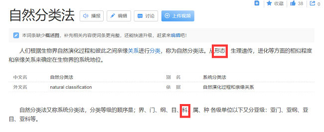

---

## 第 9 题　qid 4927981 · 定义判断

饱和心理是指人们在工作、学习和生活等方面，因为长期面对、从事重复或缺乏新意的事情，而感到无聊和无奈，以致内心不能再承受下去的心理现象。
根据上述定义，下列属于饱和心理现象的是：

- **A**. 心理实验证明，人们的注意通常先会随着某种刺激增加而增强。但相关刺激反复出现并达到一定程度时，注意力就会逐渐下降
- **B**. 妈妈为给小明做榜样，每天用更多时间看书学习。开始小明能学习妈妈看书学习的样子，时间一长，小明对此感到腻烦和不可忍耐　✅
- **C**. 条件反射实验证明，铃响后给实验动物一份美食，当这种组合刺激重复多次后，只要响铃，实验动物就会做出期待美食的条件反射
- **D**. 妈妈以为小轩爱吃红烧肉，隔三差五做一碗香喷喷的红烧肉给他吃。小轩悄悄对爸爸说，其实是看到妈妈做得辛苦才装得特别爱吃

**答案**：B

**官方解析**

第一步：找出定义关键词。
“人们在工作、学习和生活等方面”、“长期面对、从事重复或缺乏新意的事情”、“感到无聊和无奈，以致内心不能再承受下去”。
第二步：逐一分析选项。
A项：人们的注意会随着刺激增加而增强，在达到一定程度后注意力下降，不存在无聊和无奈、内心不能再承受的情况，不符合“感到无聊和无奈，以致内心不能再承受下去”，不符合定义，排除；
B项：小明在长时间学习妈妈看书学习的样子后，感到腻烦和不可忍耐，符合“人们在工作、学习和生活等方面”、“长期面对、从事重复或缺乏新意的事情”、“感到无聊和无奈，以致内心不能再承受下去”，符合定义，当选；
C项：动物在铃声和美食的重复刺激后形成的条件反射，不符合“人们在工作、学习和生活等方面”，也不存在内心不能再承受的情况，不符合“感到无聊和无奈，以致内心不能再承受下去”，不符合定义，排除；
D项：小轩对爸爸说是看到妈妈做红烧肉辛苦才装得特别爱吃，没有体现出其它的心理状态，不符合“感到无聊和无奈，以致内心不能再承受下去”，不符合定义，排除。
故正确答案为B。

---

## 第 10 题　qid 4927991 · 定义判断

司法文书是指侦查、检察、审判、公证等司法机关在处理各类案件的各个环节、步骤上形成与使用的专用文书，司法文书主要包括具有法律效力的文书，也包括不直接发生法律效力，但对执行法律有切实保证作用的文书。
根据上述定义，下列不属于司法文书的是：

- **A**. 犯罪现场中遗留的受害人亲笔题写的书信　✅
- **B**. 小宋针对自己的犯罪行为向司法机关自首时写出的材料
- **C**. 小王收到的人民法院送达的要求其准时到庭的开庭通知书
- **D**. 侦查人员为搜集犯罪证据，去被害人住处搜查后据有关情况写成的笔录

**答案**：A

**官方解析**

第一步：找出定义关键词。
“侦查、检察、审判、公证等司法机关”、“在处理各类案件的各个环节、步骤上形成与使用的专用文书”。
第二步：逐一分析选项。
A项：受害人写的书信是在案发前写的，不是司法机关在处理案件时形成的，不符合“侦查、检察、审判、公证等司法机关”、“在处理各类案件的各个环节、步骤上形成与使用的专用文书”，不符合定义，当选；
B项：小宋向司法机关自首时写出的材料，是侦查机关在处理案件时形成与使用的文书，符合“侦查、检察、审判、公证等司法机关”、“在处理各类案件的各个环节、步骤上形成与使用的专用文书”，符合定义，排除；
C项：人民法院是司法机关，开庭通知书是人民法院在处理案件时形成与使用的文书，符合“侦查、检察、审判、公证等司法机关”、“在处理各类案件的各个环节、步骤上形成与使用的专用文书”，符合定义，排除；
D项：侦查人员在被害人住处搜查后写的笔录，是侦查过程中形成的文书，符合“侦查、检察、审判、公证等司法机关”、“在处理各类案件的各个环节、步骤上形成与使用的专用文书”，符合定义，排除。
本题为选非题，故正确答案为A。

---

## 第 11 题　qid 4927990 · 类比推理

斗拱：古建筑：荷载重量

- **A**. 尾灯：汽车：照明搜索
- **B**. 船舵：帆船：控制航向　✅
- **C**. 剧场：舞台：提供演出
- **D**. 芯片：手机：结构保护

**答案**：B

**官方解析**

第一步：判断题干词语间逻辑关系。
斗拱是我国木结构建筑中的支承构件，在立柱和横梁交接处。斗拱是古建筑的一部分，二者为组成关系，斗拱的主要作用是荷载重量，二者为功能对应关系。
第二步：判断选项词语间逻辑关系。
A项：尾灯是汽车的一部分，二者为组成关系，但是尾灯的主要作用是安全警示，不是照明搜索，与题干逻辑关系不一致，排除；
B项：船舵是帆船的一部分，二者为组成关系，船舵的主要作用是控制航向，二者为功能对应关系，与题干逻辑关系一致，当选；
C项：舞台是剧场的一部分，二者为组成关系，但两词顺序与题干相反，与题干逻辑关系不一致，排除；
D项：芯片是手机的一部分，二者为组成关系，芯片的主要作用是运算存储，不是结构保护，与题干逻辑关系不一致，排除。
故正确答案为B。

---

## 第 12 题　qid 4928007 · 类比推理

紫外线灯：消毒

- **A**. 真菌：致病
- **B**. 风扇：散热　✅
- **C**. 植树：造林
- **D**. 敷料：创伤

**答案**：B

**官方解析**

第一步：判断题干词语间逻辑关系。
紫外线灯可以用来消毒，二者为功能的对应关系。
第二步：判断选项词语间逻辑关系。
A项：真菌可能是致病的原因，二者为因果的对应关系，与题干逻辑关系不一致，排除；
B项：风扇可以用来散热，二者为功能的对应关系，与题干逻辑关系一致，当选；
C项：植树的目的是造林，二者为方式目的对应关系，与题干逻辑关系不一致，排除；
D项：敷料可以用来包扎创伤，与创伤本身为作用对象的对应关系，与题干逻辑关系不一致，排除。
故正确答案为B。

---

## 第 13 题　qid 4928013 · 类比推理

糯米：汤圆：小吃

- **A**. 枣泥：月饼：粽子
- **B**. 椰汁：椰肉：椰油
- **C**. 化纤：风衣：服装　✅
- **D**. 玻璃：陶瓷：茶杯

**答案**：C

**官方解析**

第一步：判断题干词语间逻辑关系。
糯米是制作汤圆的原材料，二者为原材料的对应关系；汤圆是一种小吃，二者为种属关系。
第二步：判断选项词语间逻辑关系。
A项：枣泥是制作月饼的原材料，二者为原材料的对应关系；月饼和粽子为并列关系，与题干逻辑关系不一致，排除；
B项：椰汁和椰肉都是椰子的组成部分，二者为并列关系，椰油是椰肉晒干后榨的油，二者为原材料的对应关系，与题干逻辑关系不一致，排除；
C项：化纤是制作风衣的原材料，二者为原材料的对应关系；风衣是一种服装，二者为种属关系，与题干逻辑关系一致，当选；
D项：玻璃和陶瓷为并列关系，都是制作茶杯的原材料，与题干逻辑关系不一致，排除。
故正确答案为C。

---

## 第 14 题　qid 4928005 · 类比推理

地壳运动：峡谷：高原

- **A**. 温度骤降：冰雹：大气环境
- **B**. 原油泄漏：爆炸：事故调查
- **C**. 风力侵蚀：戈壁：沙漠　✅
- **D**. 暖湿气流：降水：干旱

**答案**：C

**官方解析**

第一步：判断题干词语间逻辑关系。
峡谷和高原为并列关系，均可能由地壳运动导致，后两词均与第一词为因果的对应关系。
第二步：判断选项词语间逻辑关系。
A项：冰雹和大气环境不是并列关系，且温度骤降是大气环境发生变化的一种情况，二者不是因果的对应关系，与题干逻辑关系不一致，排除；
B项：爆炸和事故调查不是并列关系，与题干逻辑关系不一致，排除；
C项：戈壁和沙漠为并列关系，均可能由风力侵蚀导致，后两词均与第一词为因果的对应关系，与题干逻辑关系一致，当选；
D项：降水和干旱不是并列关系，且暖湿气流不可能导致干旱，二者不是因果的对应关系，与题干逻辑关系不一致，排除。
故正确答案为C。

---

## 第 15 题　qid 4928001 · 类比推理

灾害预警：减少损失

- **A**. 寒风凛冽：树木凋零
- **B**. 演出彩排：顺利演出　✅
- **C**. 调解纠纷：劳动仲裁
- **D**. 次贷危机：股市震荡

**答案**：B

**官方解析**

第一步：判断题干词语间逻辑关系。
灾害预警是为了减少损失，二者为方式目的的对应关系。
第二步：判断选项词语间逻辑关系。
A项：寒风凛冽会导致树木凋零，二者为因果的对应关系，与题干逻辑关系不一致，排除；
B项：演出彩排是为了顺利演出，二者为方式目的的对应关系，与题干逻辑关系一致，当选；
C项：劳动仲裁是为了调解纠纷，二者为方式目的的对应关系，但两词顺序与题干相反，与题干逻辑关系不一致，排除；
D项：次贷危机会导致股市震荡，二者为因果的对应关系，与题干逻辑关系不一致，排除。
故正确答案为B。

---

## 第 16 题　qid 4928000 · 类比推理

儿童读物：启蒙读物

- **A**. 连续变量：离散变量
- **B**. 刑事诉讼：民事诉讼
- **C**. 生产资料：生活资料
- **D**. 一类疫苗：麻疹疫苗　✅

**答案**：D

**官方解析**

第一步：判断题干词语间逻辑关系。
启蒙读物指教育儿童的读物，是使初学者获得基本的入门知识的读物，启蒙读物是儿童读物的一种，二者为种属关系。
第二步：判断选项词语间逻辑关系。
A项：在统计学中，变量根据变量值是否连续可分为连续变量与离散变量。连续变量是指在一定区间内可以任意取值的变量，其数值是连续不断的；离散变量可以按一定顺序一一列举，通常指以整数位取值的变量。二者为并列关系，与题干逻辑关系不一致，排除；
B项：根据诉讼的内容和形式，诉讼可以分为刑事诉讼、民事诉讼和行政诉讼。其中，刑事诉讼是解决被追诉者刑事责任问题的诉讼活动；民事诉讼是解决民事争议的诉讼活动。二者为并列关系，与题干逻辑关系不一致，排除；
C项：生产资料是从事生产时所必需的物质条件，生活资料是指供人们物质文化生活需要的社会产品。二者不是种属关系，与题干逻辑关系不一致，排除；
D项：一类疫苗是指政府免费向公民提供，公民应当依照政府的规定接种的疫苗，麻疹疫苗是一类疫苗的一种，二者为种属关系，与题干逻辑关系一致，当选。
故正确答案为D。

---

## 第 17 题　qid 4927997 · 类比推理

过河拆桥：饮水思源

- **A**. 江心补漏：未雨绸缪　✅
- **B**. 不名一钱：一贫如洗
- **C**. 了如指掌：一窍不通
- **D**. 浮光掠影：走马观花

**答案**：A

**官方解析**

第一步：判断题干词语间逻辑关系。
“过河拆桥”比喻达到目的以后，就把曾经帮助过自己的人一脚踢开；“饮水思源”比喻人在幸福的时候不忘幸福的来源，二者为反义关系，且过河拆桥为贬义词，饮水思源为褒义词。
第二步：判断选项词语间逻辑关系。
A项：“江心补漏”比喻补救已迟，无法挽回差错或败局；“未雨绸缪”比喻事先做好准备，二者为反义关系，且江心补漏为贬义词，未雨绸缪为褒义词，与题干逻辑关系一致，当选；
B项：“不名一钱”指没有一文钱，形容极其贫困；“一贫如洗”形容十分贫穷，二者为近义关系，与题干逻辑关系不一致，排除；
C项：“了如指掌”形容对情况非常清楚；“一窍不通”比喻一点儿也不懂，二者为反义关系，但了如指掌为褒义词，一窍不通为贬义词，与题干逻辑关系不一致，排除；
D项：“浮光掠影”指像水面的光和掠过的影子一样，一晃就消逝，形容印象不深刻；“走马观花”比喻粗略地观察事物，二者为近义关系，与题干逻辑关系不一致，排除。
故正确答案为A。

---

## 第 18 题　qid 4928009 · 类比推理

苦尽：甘来

- **A**. 冷嘲：热讽　✅
- **B**. 大街：小巷
- **C**. 异口：同声
- **D**. 内忧：外患

**答案**：A

**官方解析**

第一步：判断题干词语间逻辑关系。
苦尽甘来指艰苦的境况过去，美好的境况到来，“苦”和“甘”为反义关系，“尽”和“来”均为动词。
第二步：判断选项词语间逻辑关系。
A项：冷嘲热讽指用尖酸刻薄的语言进行讥笑及讽刺，“冷”和“热”为反义关系，“嘲”和“讽”均为动词，与题干逻辑关系一致，当选；
B项：大街小巷指城镇里的街道，形容都市里的各处地方，“大”和“小”为反义关系，但“街”和“巷”均为名词，与题干逻辑关系不一致，排除；
C项：异口同声指不同的嘴说同样的话，形容大家说的完全一致，“异”和“同”为反义关系，但“口”和“声”均为名词，与题干逻辑关系不一致，排除；
D项：内忧外患指国内不安定，并有外来侵略，形势危急，“内”和“外”为反义关系，但“忧”和“患”均为名词，与题干逻辑关系不一致，排除。
故正确答案为A。

---

## 第 19 题　qid 4928011 · 类比推理

眼镜镜片 对于 （    ） 相当于 （    ） 对于 铝合金

- **A**. 视力；坚固
- **B**. 树脂；易拉罐　✅
- **C**. 凹透镜；重金属
- **D**. 眼镜镜架；不锈钢

**答案**：B

**官方解析**

逐一代入选项。

A项：“眼镜镜片”可以用来矫正“视力”，二者是对应关系；“铝合金”具有“坚固”的属性，二者是属性对应关系，前后逻辑关系不一致，排除；

B项：“树脂”是制作“眼镜镜片”的一种原材料，二者是原材料的对应关系；“铝合金”是制作“易拉罐”的一种原材料，二者是原材料的对应关系，前后逻辑关系一致，当选；

C项：有的“眼镜镜片”是“凹透镜”，有的“眼镜镜片”不是“凹透镜”，有的“凹透镜”是“眼镜镜片”，有的“凹透镜”不是“眼镜镜片”，二者是交叉关系；“重金属”是指密度大于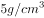的金属，“铝合金”不是“重金属”，二者是反向种属关系，前后逻辑关系不一致，排除；

D项：“眼镜镜片”和“眼镜镜架”是组成眼镜的两个部分，二者是并列关系；“铝合金”和“不锈钢”是两种不同的材质，二者是并列关系，但二者是独立存在的，前后逻辑关系不一致，排除。

故正确答案为B。

---

## 第 20 题　qid 4928021 · 类比推理

（    ） 对于 兰花 相当于 螃蟹 对于 （    ）

- **A**. 兰草；蟹钳
- **B**. 蝴蝶兰；花蟹
- **C**. 蕙兰；甲壳动物　✅
- **D**. 丁香；水生动物

**答案**：C

**官方解析**

逐一代入选项。
A项：兰花的一个别名是兰草，二者是全同关系，蟹钳是螃蟹的组成部分，二者是组成关系，前后逻辑关系不一致，排除；
B项：蝴蝶兰是一种兰花，二者是种属关系，花蟹是一种螃蟹，二者是种属关系，但前后顺序相反，前后逻辑关系不一致，排除；
C项：蕙兰是一种兰花，二者是种属关系，螃蟹是一种甲壳动物，二者是种属关系，前后逻辑关系一致，当选；
D项：丁香和兰花是两种不同的植物，二者是并列关系，螃蟹是一种水生动物，二者是种属关系，前后逻辑关系不一致，排除。
故正确答案为C。

---

## 第 21 题　qid 4928019 · 逻辑判断

日前，研究人员在30个国家开展了近65项研究，涉及包括6万多名年龄在6岁到79岁之间的研究对象，目的是调查社会经济地位与牙齿磨损之间的联系。他们发现，在上私立学校且父母收入较高的青少年中，牙齿磨损似乎要严重得多。因此研究人员认为，富易伤牙。
以下哪项如果为真，最能支持上述研究者的观点?

- **A**. 良好的口腔卫生习惯是保持一口好牙齿的秘诀
- **B**. 富裕家庭的孩子有更多的机会进行定期牙齿护理
- **C**. 社会经济地位低的成年人更容易因饮食不当、潜在疾病而出现牙齿磨损
- **D**. 相较于贫困家庭的孩子，富人的孩子更容易买到碳酸饮料，多喝碳酸饮料会增加牙齿磨损程度　✅

**答案**：D

**官方解析**

第一步：找出论点和论据。
论点：富易伤牙。
论据：在上私立学校且父母收入较高的青少年中，牙齿磨损似乎要严重得多。
论点和论据均讨论的是 “富裕家庭的孩子的牙齿磨损程度更严重”，二者话题一致，加强优先考虑补充论据，即解释富裕家庭的孩子的牙齿磨损程度更严重的原因或举例证明。
第二步：逐一分析选项。
A项：该项说的是保持一口好牙齿的秘诀，而论点说的是富裕家庭的孩子的牙齿磨损程度更严重，话题不一致，无法加强，排除；
B项：该项说的是富裕家庭的孩子有更多的机会进行定期牙齿护理，但并未说明富与牙齿磨损之间的联系，无法加强，排除；
C项：该项说的是社会经济地位低的成年人更容易出现牙齿磨损，说明富人比穷人的牙齿更不易磨损，属于削弱论点，无法加强，排除； 
D项：该项说的是富裕家庭的孩子比贫困家庭的孩子更容易买到碳酸饮料，多喝碳酸饮料会增加牙齿磨损程度，解释了富裕家庭的孩子的牙齿磨损程度更严重的原因，属于补充论据，可以加强，当选。
故正确答案为D。

---

## 第 22 题　qid 4928025 · 逻辑判断

近日，研究人员利用胡萝卜渣以及蔬菜渣成功生产出了经济实惠的原纤化纤维素纳米纤维，并用其制备成了一种特殊的喷雾，结果证实，这种喷雾可以在果蔬表面形成保护性纤维涂层，将果蔬的保质期延长7天。研究人员认为，这种喷雾有望成为食物保鲜的重要材料。
以下哪项如果为真，最能支持上述研究者的观点？

- **A**. 利用胡萝卜渣中提取的原纤化纤维素制备而成的生物塑料可以轻松被土壤中的细菌和真菌降解
- **B**. 胡萝卜年产量可达4500万吨，其中大部分被用于榨汁，而榨汁剩下的胡萝卜渣中含有80%的纤维素
- **C**. 用胡萝卜渣以及蔬菜渣制备原纤化纤维素纳米纤维时，无论胡萝卜渣及蔬菜渣是否新鲜，均不会影响原纤化纤维素纳米纤维的性能　✅
- **D**. 使用漂白预处理可以成功去除胡萝卜渣中的木质素和其他残留物，显著降低纤维化所需的能量，且不会影响原纤化纤维素纳米纤维的质量

**答案**：C

**官方解析**

第一步：找出论点和论据。
论点：这种喷雾有望成为食物保鲜的重要材料。
论据：喷雾可以在果蔬表面形成保护性纤维涂层，将果蔬的保质期延长7天。
本题论点和论据说的都是胡萝卜渣以及蔬菜渣制成的喷雾可以用于食物保鲜，论点和论据话题一致，加强优先考虑补充论据，也可以考虑必要条件。
第二步：逐一分析选项。
A项：选项只是说降解问题，没有提及是否能保鲜，话题不一致，无法加强，排除；
B项：选项只是说胡萝卜年产量和胡萝卜渣中纤维素含量，没有提到制成这种喷雾的另一原材料蔬菜渣，也没有提及是否能保鲜，无法加强，排除；
C项：如果两种原材料的新鲜度会影响纤维的性能，那么这种喷雾就不能成为食物保鲜的重要材料，该项是论点成立的必要条件，可以加强，当选；
D项：选项说的是使用漂白预处理这一种方法的具体影响，如果不使用这种方法，可能也能做成这种纤维，该方法对论点是否成立没有明显影响，无法加强，排除。
故正确答案为C。

---

## 第 23 题　qid 4928026 · 逻辑判断

一旦侵害个人信息权益造成损害，就要求承担法律责任。
上述说法如果为真，以下哪项也一定为真？

- **A**. 虽然未侵害个人信息权益造成损害，但也要承担法律责任
- **B**. 如果未侵害个人信息权益造成损害，不承担法律责任
- **C**. 要么侵害个人信息权益造成损害，要么不承担法律责任
- **D**. 只有未侵害个人信息权益造成损害，才不承担法律责任　✅

**答案**：D

**官方解析**

第一步：翻译题干。

侵害个人信息权益造成损害承担法律责任。

第二步：逐一分析选项。

A项：翻译为“侵害个人信息权益造成损害 且 承担法律责任”，但“侵害个人信息权益造成损害”和“承担法律责任”不是必然同时存在的，无法推出，排除；

B项：翻译为“侵害个人信息权益造成损害承担法律责任”，是对题干翻译的否前，否前无法得出确定结论，无法推出，排除；

C项：“要么A，要么B”为A和B二者有且只有一个满足，但题干为推出关系，无法确定这两者必然有且只有一个满足，无法推出，排除；

D项：翻译为“承担法律责任侵害个人信息权益造成损害”，是对题干翻译的否后，否后必否前，可以推出，当选。

故正确答案为D。

---

## 第 24 题　qid 4928029 · 逻辑判断

仿佛就是在一夜之间，“万物皆可元宇宙”。在元宇宙之中，人们似乎可以不再受到肉体的束缚，时空的限制也已经不是问题，人们在其中以光速移动，就连外表也可以随意选择，可选择一款“虚拟化身”与亲朋好友相聚······元宇宙的超现实不禁让人们担忧，数亿人的“数字生活”可能会被几家大公司所控制，元宇宙的出现会让这种情况继续恶化。
以下哪项如果为真，最能削弱上述观点？

- **A**. 元宇宙会让人类满足于虚拟现实所带来的快感，进而让人类故步自封
- **B**. 元宇宙允许现实以碎片的形式进入，但前提条件是现实必须被操纵我们感知、干预我们行为的数字准则所覆盖
- **C**. 实现元宇宙需要虚拟现实设备，虚拟现实设备只有在系统测量到了人体的动作时才能够工作，并且给出相应的画面　✅
- **D**. 人们在虚拟现实系统中留下的数据会成为算法的训练数据，把人的身体语言与接下来的行为结果进行配对，让人们随后在现实中做出可以预期的行为

**答案**：C

**官方解析**

第一步：找出论点和论据。
论点：数亿人的“数字生活”可能会被几家大公司所控制，元宇宙的出现会让这种情况继续恶化。
论据：无。
本题只有论点，没有论据，削弱优先考虑削弱论点，即数亿人的“数字生活”不会被几家大公司所控制，元宇宙的出现不会让这种情况继续恶化。
第二步：逐一分析选项。
A项：该项指出了元宇宙会让人类故步自封，与论点讨论的人们的“数字生活”是否会被控制无关，话题不一致，无法削弱，排除；
B项：该项指出了现实必须被操纵我们感知、干预我们行为的数字准则所覆盖，讲述的是现实进入元宇宙的前提条件，与论点讨论的人们的“数字生活”是否会被控制无关，话题不一致，无法削弱，排除；
C项：该项指出了元宇宙需要虚拟现实设备，虚拟现实设备只有在系统测量到人体动作时才会工作，说明在元宇宙中人们可以自行操控自己，不会被外界所控制，削弱论点，可以削弱，当选；
D项：该项指出了虚拟现实系统可以让人们在现实中做出可以预期的行为，讲述的是虚拟现实系统运行的原理，与论点讨论的人们的“数字生活”是否会被控制无关，话题不一致，无法削弱，排除。
故正确答案为C。

---

## 第 25 题　qid 4928027 · 逻辑判断

一些研究人员以859名初中生为被试者，连续三年在每年5月测量被试者的抑郁水平、自我伤害度以及父母心理控制程度，研究人员根据被试者三次测量后抑郁和自伤程度的发展轨迹，将被试者分为“低抑郁-低自伤-稳定组”“中抑郁-中自伤-降低组”“低抑郁-低自伤-增长组”3组，经过对照发现，父母心理控制水平越高的青少年属于“低抑郁-低自伤-增长组”的可能性越大，因此，父母心理控制是造成青少年抑郁和自伤的主要人际因素。
以下哪项如果为真，最能支持上述观点？

- **A**. 三年中青少年感知到的父母心理控制并没有下降　✅
- **B**. 青少年抑郁和自伤的发展轨迹在男女生中没有差异
- **C**. 师生关系和同伴关系不能显著预测青少年抑郁和自伤的发展轨迹
- **D**. 青少年个体的抑郁水平持续增强时也会随之提高其自伤行为的频率

**答案**：A

**官方解析**

第一步：找出论点和论据。
论点：父母心理控制是造成青少年抑郁和自伤的主要人际因素。
论据：研究人员根据被试者三次测量后抑郁和自伤程度的发展轨迹，将被试者分为“低抑郁-低自伤-稳定组”“中抑郁-中自伤-降低组”“低抑郁-低自伤-增长组”3组，经过对照发现，父母心理控制水平越高的青少年属于“低抑郁-低自伤-增长组”的可能性越大。
本题论点和论据都在讨论父母心理控制会导致青少年抑郁和自伤，二者话题一致，加强优先考虑补充论据。
第二步：逐一分析选项。
A项：该项说的是三年中青少年感知到的父母心理控制并没有下降，若对于父母心理控制的感知下降，则父母心理控制水平再高青少年也较难感知到，继而也不会抑郁和自伤，论点讨论的父母心理控制是造成青少年抑郁和自伤的主要人际因素就无法成立，该项是论点成立的必要条件，可以加强，当选；
B项：该项说的是青少年抑郁和自伤的发展轨迹在男女生中没有差异，但男女生性别差异与论点讨论的父母心理控制是造成青少年抑郁和自伤的主要人际因素无关，为无关项，无法加强，排除；
C项：该项说的是师生关系和同伴关系不能显著预测青少年抑郁和自伤的发展轨迹，但排除师生关系和同伴关系后，不明确是否还有别的因素影响预测青少年抑郁和自伤，无法据此确定父母心理控制就是造成青少年抑郁和自伤的主要人际因素，无法加强，排除；
D项：该项说的是青少年个体自伤行为频率会随抑郁水平增强而提高，说的是自伤行为与抑郁水平之间的关系，与论点讨论的父母心理控制是造成青少年抑郁和自伤的主要人际因素无关，为无关项，无法加强，排除。
故正确答案为A。

---

## 第 26 题　qid 2051822 · 逻辑判断

为了确定压力对毛发生长的影响，研究人员详细分析了皮质酮（小鼠在长期慢性压力下释放的一种激素）如何调节小鼠毛囊的活动，小鼠实验显示，当皮质酮水平升高时，毛囊的休止期会延长，无法再生；反过来，如果皮质酮水平降低，毛囊干细胞会被激活，开始生长新的毛发，因此有人认为：降低人体皮质酮，就可治疗长期压力导致的脱发。
以下哪项如果为真，最能削弱上述观点？

- **A**. 皮质酮会通过抑制一种名为GAS6的蛋白的产生，控制毛囊干细胞的激活
- **B**. 慢性压力应激引起的脱发可能是由减少毛囊锚定和抑制进入生长期的机制相互促进的
- **C**. 小鼠和人类的毛发生长周期不太一样，这或许会影响对应激性毛发干细胞抑制进行逆转的有效性
- **D**. 啮齿动物的皮质酮被认为对应人类的皮质酮，但目前尚并不清楚人体内的皮质酮是否也能对毛囊产生类似作用　✅

**答案**：D

**官方解析**

第一步：找出论点和论据。
论点：降低人体皮质酮，就可治疗长期压力导致的脱发。
论据：小鼠实验显示，当皮质酮水平升高时，毛囊的休止期会延长，无法再生；反过来，如果皮质酮水平降低，毛囊干细胞会被激活，开始生长新的毛发。
本题论据讨论的是“小鼠”皮质酮水平与毛囊的关系，论点讨论的是“人类”皮质酮水平与毛囊的关系，二者主体不一致，削弱优先考虑拆桥。
第二步：逐一分析选项。
A项：该项解释了皮质酮如何作用于毛囊，有加强的力度，无法削弱，排除；
B项：该项指出压力脱发可能是两种因素“相互促进”的过程，那么即便降低皮质酮能解决“抑制毛囊生长期”这一问题，可能也无法解决“毛囊锚定减少”的问题，因此仅靠降低皮质酮不一定能治疗该类脱发，可以削弱，保留；
C项：该项指出小鼠与人类在“毛发生长周期”上存在差异，而且可能会影响有效性，即使小鼠可以通过激活毛囊干细胞改善脱发，该效果在人类身上也未必成立，可以削弱，保留；
D项：该项指出目前尚不清楚人体内的皮质酮是否会对毛囊产生与小鼠类似的作用，说明从小鼠实验直接推广到人体缺乏充分依据，可以削弱，保留。
对比B、C、D三项，B项中的“可能”与C项中的“或许”证明二者均为可能性削弱，且题干话题围绕皮质酮与毛囊的关系展开，但B项与C项均未直接提及“皮质酮”，而D项质疑的是皮质酮对毛囊的作用，与题干话题更一致。而且D项从根源上切断了实验主体，啮齿动物和人类之间的联系，从根源上削弱了从小鼠实验推广到人体的合理性，削弱力度强于B、C两项。
故正确答案为D。

---

## 第 27 题　qid 4928031 · 逻辑判断

评估读写障碍学生的传统方式是当一个孩子在读写方面遭遇了异常困难，其家长和老师坐到一起，通过纸质测试收集信息并评估孩子的优势和劣势，以确诊和制定适当的干预方案。目前某科技公司发明了一种读写障碍筛查工具，即通过电脑和眼动追踪摄像机，对每一个学生进行测试，以此找出少部分可能有读写障碍倾向的孩子，该公司市场管销人员表示，这种眼动追踪技术潜力无限，有望在学校得到普及。
以下哪项如果为真，最能削弱上述观点？

- **A**. 单纯通过纸笔测试，很难直接读取结果，要花费大量时间
- **B**. 教育工作者不一定都是科学家或研究者，他们可能没有足够的资源去理解该如何充分利用测试的结果　✅
- **C**. 此技术只是一个筛查工具，主要目的是在早期就能找到那些有阅读障碍倾向的孩子，而不是一个诊断工具
- **D**. 眼动仪可分辨出读写障碍者和非读写障碍者之间的阅读差异，但这些差异很可能只是阅读障碍的结果而非原因

**答案**：B

**官方解析**

第一步：找出论点和论据。
论点：这种眼动追踪技术潜力无限，有望在学校得到普及。
论据：目前某科技公司发明了一种读写障碍筛查工具，即通过电脑和眼动追踪摄像机，对每一个学生进行测试，以此找出少部分可能有读写障碍倾向的孩子。
本题的论点讨论的是这种眼动追踪技术有潜力，有希望在学校得到普及，论据讨论的是该种技术能够找出少部分可能有读写障碍倾向的孩子，二者话题一致，削弱优先考虑削弱论点。
第二步：逐一分析选项。
A项：该项说的是纸笔测试有很难直接读取结果、耗时久的弊端，但是没有提及眼动追踪技术潜力如何，能否在学校得到普及，话题不一致，无法削弱，排除；
B项：该项说的是教育工作者可能无法理解和利用该技术的检测结果，说明该技术可能很难在学校得到普及，直接削弱论点，当选；
C项：该项说的是眼动追踪技术是筛查出有阅读障碍倾向的孩子的工具，论据讨论的是眼动追踪可以筛查少部分可能有读写障碍倾向的孩子，也并未提及这个技术有诊断功能，故两者并不矛盾，且该项未提及该技术能否在学校普及，无关项，无法削弱，排除；
D项：该项说的是眼动仪分辨出的差异很可能只是阅读障碍的结果而非原因，但未提及能否对有阅读障碍倾向的孩子有所帮助，也未提及眼动仪能否在学校普及，话题不一致，无法削弱，排除。
故正确答案为B。

---

## 第 28 题　qid 4928030 · 逻辑判断

有人说玩是孩子的天性，多玩玩具能够开发他们的智力，但研究人员做了一项实验：将三岁以下的儿童分成两组，一组提供4种玩具，另一组提供16种玩具。结果发现，玩具种类越多，孩子的智力越差。
以下哪项如果为真，最能解释上述发现？

- **A**. 过多的玩具会让孩子无法集中于某个玩具，不利于注意力的培养
- **B**. 玩具过多容易使孩子大脑形成各种“兴奋灶”，互相影响、干扰和制约，阻碍神经系统发育　✅
- **C**. 高难度玩具完全超出了孩子的认知发展水平，容易产生挫败感和无力感，对玩具失去兴趣和探索欲
- **D**. 玩具较少的孩子在看到新玩具时会更加珍惜，由衷地产生幸福感，而玩具较多的孩子则容易形成不懂得满足的性格

**答案**：B

**官方解析**

第一步：找出题干矛盾。
孩子拥有的玩具种类越多，智力却越差。
第二步：逐一分析选项。
A项：该项说的是玩具过多不利于培养孩子的注意力，但注意力与智力不同，不能解释为什么孩子拥有的玩具种类越多，智力却越差，不能解释题干矛盾，排除；
B项：该项说的是玩具过多会阻碍神经系统发育，神经系统发育不良会影响孩子的智力，可以解释为什么孩子拥有的玩具种类越多，智力却越差，可以解释题干矛盾，当选；
C项：该项说的是高难度的玩具会让孩子失去对玩具的兴趣和探索欲，但失去对玩具的兴趣和探索欲并不代表智力差，不能解释为什么孩子拥有的玩具种类越多，智力却越差，不能解释题干矛盾，排除；
D项：该项说的是玩具多的孩子容易不满足，但不满足并不代表智力差，不能解释为什么孩子拥有的玩具种类越多，智力却越差，不能解释题干矛盾，排除。
故正确答案为B。

---

## 第 29 题　qid 4928035 · 逻辑判断

最近一项研究探讨了女性产品代言人性别如何影响女性消费者对该产品的评价，这个实验分为4组，分别邀请不同数量的女性参与，进入实验后，给她们分别看男性和女性代言的场景描述以及产品图片，接下来被试者会完成有关产品评价的量表，即“您如何评价这个产品？”结果显示：与女性代言女性产品相比，男性代言时女性消费者对该产品的评价会显著降低。因此，广告商使用男性代言无法达到预期效果。
以下哪项如果为真，最能支持上述观点？

- **A**. 代言女性产品时，男性代言人扮演关心女性朋友的暖男角色可以让女性消费者更好地接受这种新颖的产品代言方式
- **B**. 对自我认同缺乏信心的部分女性消费者面对男性代言女性产品时，会激活强烈的身份威胁感，采取消极的应对方式
- **C**. 对于男性代言而言，随着私密性的提高，男性代言的负面效应随之增强，但这种加强效应达到一定程度后不再提升
- **D**. 男性代言人代言很多女性产品时无法亲身体验，只是简单拿产品做摆拍，略显突兀的展示效果远远不及女性代言人　✅

**答案**：D

**官方解析**

第一步：找出论点和论据。
论点：广告商使用男性代言无法达到预期效果。
论据：与女性代言女性产品相比，男性代言时女性消费者对该产品的评价会显著降低。
本题论点论据都是在说相比于女性代言女性产品，男性代言的效果并不好，论点和论据话题一致，因此加强优先考虑补充论据（举例子或解释原因）。
第二步：逐一分析选项。
A项：该项说的是男性代言人扮演暖男角色会让女性消费者更好地接受产品，说明男性代言女性产品可以起到较好效果，该项是对论点的削弱，无法加强，排除；
B项：该项说的是部分女性消费者会消极应对男性代言的女性产品，举例说明男性代言女性产品时确实可能起到反效果，举例加强，可以加强，保留；
C项：该项说的是随着私密性的提高，男性代言的负面效应随之增强，但这个负面效应是有限的，负面效应到底有多大不明确，不明确项，无法加强，排除；
D项：该项说的是男性代言人无法亲身体验产品，只能摆拍，效果远不如女性代言人好，解释了为什么在代言女性产品时，男性代言人确实不如女性代言人的效果好，解释原因，可以加强，保留。
对比B、D两项，D项解释原因的力度大于B项举例加强的力度。
故正确答案为D。

---

## 第 30 题　qid 4928034 · 逻辑判断

研究人员分别用麦克斯韦望远镜和阿塔卡马大型毫米/亚毫米波阵观测了金星。他们探测到一个只属于磷化氢的光谱特征，并估算出金星云层中的磷化氢浓度，研究团队研究了所有磷化氢产生的可能性：火山、雷击、坠落到大气中的陨石，并最后将它们逐个排除。他们发现，金星上的任何活动都不能产生足以解释他们检测到的磷化氢数量。研究人员表示：磷化氢很容易在生物代谢中生成，因此金星大气中存在的某种生命形式，产生了我们探测到的磷化氢。
以下哪项如果为真，最能质疑研究人员的观点?

- **A**. 磷化氢的光谱特征与二氧化硫的光谱特征十分相似，而金星的大气中存在大量的二氧化硫
- **B**. 产生光谱线的云层位于金星大气层的中高层，那里环境十分恶劣，磷化氢根本不可能存在　✅
- **C**. 金星大气存在某种人类还从来没有认识到的自然现象，比如某种行星地质级别的化学反应
- **D**. 研究组重新分析探测数据后估计，磷化氢的平均浓度为1ppb，约为先前预估值的七分之一

**答案**：B

**官方解析**

第一步：找出定义关键词。
论点：金星大气中存在的某种生命形式，产生了我们探测到的磷化氢。
论据：研究团队探测到一个只属于磷化氢的光谱特征，并估算出金星云层中的磷化氢浓度，研究团队研究了所有磷化氢产生的可能性：火山、雷击、坠落到大气中的陨石，并最后将它们逐个排除。他们发现，金星上的任何活动都不能产生足以解释他们检测到的磷化氢数量。同时，磷化氢很容易在生物代谢中生成。
本题的论据说的是金星大气层中存在磷化氢，且探测到的数量不可能是非生物（火山、雷击、陨石）生成的，另一方面，磷化氢很容易由生物代谢生成，即说明是生物代谢产生了金星大气层中的磷化氢，而论点说的是金星大气中的某种生命形式产生了磷化氢，所以，二者讨论话题一致，削弱可以考虑削弱论点，也可以考虑削弱论据。
第二步：逐一分析选项。
A项：该项说明二氧化硫与磷化氢的光谱特征十分相似，但论据明确说明，研究人员观察到的光谱特征只属于磷化氢，因此不存在混淆二氧化硫和磷化氢的可能，无法削弱，排除；
B项：该项说明在金星大气层的中高层中不可能存在磷化氢，说明研究团队的其观测结果并不准确，而研究团队的推测结果是基于金星大气层存在磷化氢而得，该项可以质疑研究团队的分析结果，削弱论据，可以削弱，当选；
C项：该项讨论的是金星大气的其他自然现象，而论点讨论的是产生磷化氢的来源，二者讨论的话题不一致，无法削弱，排除；
D项：该项说明磷化氢的探测数据有误，实际数据约为原数据的七分之一，但非生物（火山、雷击、陨石）因素是否可以产生该平均浓度的磷化氢并不明确，不明确项，无法削弱，排除。
故正确答案为B。

---
