# 2022年青海省公务员录用考试《行测》题（网友回忆版）

> 判断推理 · 35 题 · 青海 2022

## 第 1 题　qid 4817912 · 图形推理

把下面的6个图形分为两类，使每一类图形都有各自的共同规律，分类正确的是：

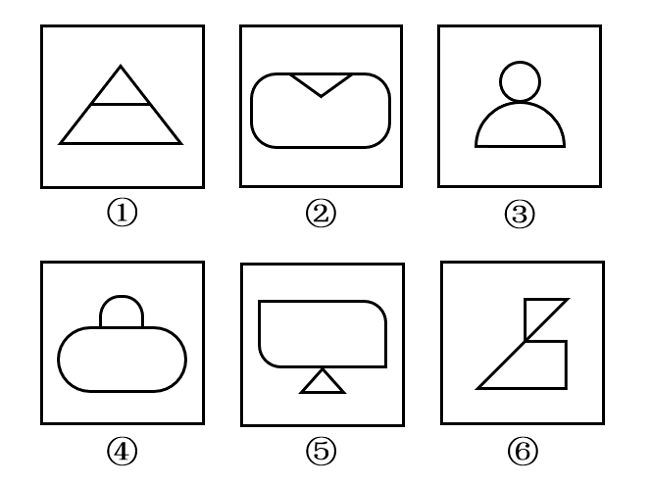

- **A**. ①②⑥，③④⑤
- **B**. ①②④，③⑤⑥　✅
- **C**. ①③④，②⑤⑥
- **D**. ①③⑤，②④⑥

**答案**：B

**官方解析**

本题为分组分类题目。观察发现，题干每幅图形均由两个面相交而成，考虑图形间关系。图①②④中两个图形均相交于边，图③⑤⑥中两个图形均相交于点，即图①②④为一组，图③⑤⑥为一组。
故正确答案为B。

---

## 第 2 题　qid 4818255 · 图形推理

从所给的四个选项中，选择最合适的一个填入问号处，使之呈现一定的规律性：

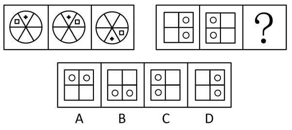

- **A**. A
- **B**. B
- **C**. C　✅
- **D**. D

**答案**：C

**官方解析**

元素组成相同，优先考虑位置规律。观察发现，第一组图形中，图1经左右翻转后得到图2，图2经上下翻转后得到图3；第二组图形也应符合相同的规律，图1经左右翻转后得到图2，图2经上下翻转后得到？处图形，只有C项符合。
故正确答案为C。

---

## 第 3 题　qid 4818247 · 图形推理

从所给的四个选项中，选择最合适的一个填入问号处，使之呈现一定的规律性：

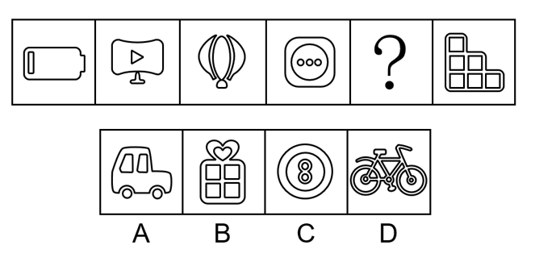

- **A**. A
- **B**. B　✅
- **C**. C
- **D**. D

**答案**：B

**官方解析**

元素组成不同，且无明显属性规律，考虑数量规律。题干出现生活化图形且空白面多，可以考虑面数量。题干图形的面数量依次为2、3、4、5、？、7，故“？”处应填入一个有6个面的图形，只有B项符合。
故正确答案为B。

---

## 第 4 题　qid 4818229 · 图形推理

从所给的四个选项中，选择最合适的一个填入问号处，使之呈现一定的规律性：

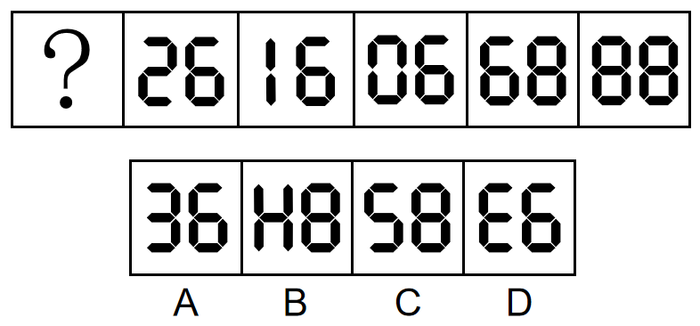

- **A**. A
- **B**. B
- **C**. C
- **D**. D　✅

**答案**：D

**官方解析**

解法一：元素组成不同，且无明显属性规律和数量规律。观察发现，“？”在题干的第一幅图，选项中出现旋转后的数字，且题干的数字旋转后可得到新的数字，故将题干图形均旋转进行观察，此时从右向左看，每幅图中的数字依次为：88、89、90、91、92，故“？”处图形旋转之后为数字93，只有D项符合。

故正确答案为D。

解法二：元素组成不同，且无明显属性规律，优先考虑数量规律。观察发现，题干出现“日”字变形图，考虑笔画数。题干均为两笔画图形，故“？”处为两笔画图形，选项的笔画数分别为：3、4、2、3，只有C项符合。

故正确答案为C。

注：观察题目特征，根据A、D两项中的数字“3”互为旋转的图形，说明可能会考查旋转，另外根据“？”在题干的第一幅图，说明可能需要将题干图形从右向左看，而根据解法一将题干图形从右向左看时，数字恰好呈递增规律，故解法一相比解法二更贴近题目特征，因此粉笔更倾向于选D。

---

## 第 5 题　qid 4818065 · 图形推理

左边给定的是纸盒外表面的展开图，右边哪一项能由它折叠而成？ 

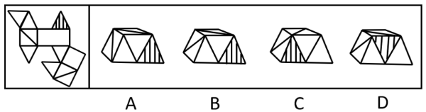

- **A**. A
- **B**. B　✅
- **C**. C
- **D**. D

**答案**：B

**官方解析**

本题为空间重构类题目，将展开图标上序号如下图，逐一进行分析。

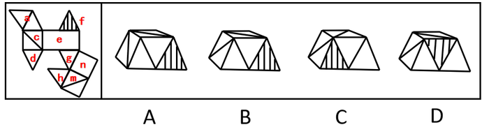

A项：题干展开图中，面a与面c公共点为点1，面a与面c中对角线相交于点1，立体图形中面a与面c中对角线没有相交于点1，与题干展开图不一致，排除；

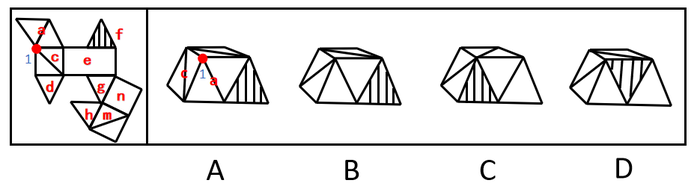

B项：该项的立体图形与题干展开图一致，当选；

C项：根据题干展开图所示，面a应在面f的左侧，立体图形中面a在面f的右侧，与题干展开图不一致，排除；

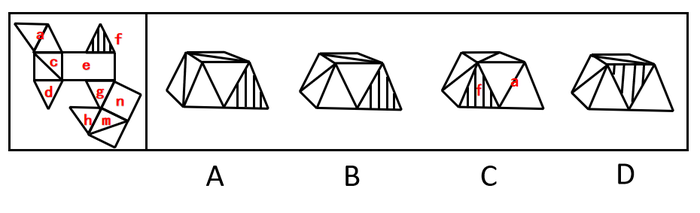

D项：根据题干展开图所示，面f与面e有公共边，立体图形中面f与面e没有公共边，与题干展开图不一致，排除。

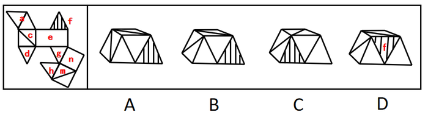

故正确答案为B。

---

## 第 6 题　qid 4817969 · 定义判断

机械团结是在社会组织中由于成员之间按彼此相似或相同的劳动形成的团结，个体保持着强烈的认同感和归属感。
根据上述定义，下列哪项是机械团结？

- **A**. 家庭里，各个成员有着共同的道德伦理观念，相亲相爱、互帮互助，营造活泼有爱的氛围
- **B**. 乡村中，村民们在生产时从事相类似的工作，共同的经验和共享的信念使他们团结在一起　✅
- **C**. 企业里，所有员工都认可共同的企业文化，每个人都各司其职，在各自的岗位上积极奋进
- **D**. 社团中，大多数年轻人都乐于尝试新鲜事物，基于个人的特色，协同完成共同的任务

**答案**：B

**官方解析**

第一步：找出定义关键词。
“按彼此相似或相同的劳动形成的团结”、“保持着强烈的认同感和归属感”。
第二步：逐一分析选项。
A项：家庭里，各个成员从事的不一定是相似或相同的劳动，不符合“按彼此相似或相同的劳动形成的团结”，不符合定义，排除；
B项：村民从事相类似的工作，符合“按彼此相似或相同的劳动形成的团结”，共同的经验和共享的信念使村民团结，符合“保持着强烈的认同感和归属感”，符合定义，当选；
C项：员工各司其职，在各自岗位上奋进，不符合“按彼此相似或相同的劳动形成的团结”，不符合定义，排除；
D项：社团中的年轻人协同完成任务，不符合“按彼此相似或相同的劳动形成的团结”，不符合定义，并且选项并未明确这些年轻人是否保持强烈的认同感和归属感，排除。
故正确答案为B。

---

## 第 7 题　qid 4817991 · 定义判断

知识流程外包是指把所获得的信息经过即时、综合的分析研究，最终把研究报告呈现给客户，作为决策的借鉴，其核心是通过提供业务专业知识而不是流程专业知识来为客户创造价值。
根据上述定义，下列哪项是知识流程外包？

- **A**. 某置业公司业务员受雇于某纺织公司，为后者新购买的土地及厂房等办理抵押贷款事项
- **B**. 某知名动漫画家受雇于某软件公司，为后者新开发的游戏软件打造多个性格迥异的角色形象
- **C**. 某知识产权专家受雇于某科技公司，跟踪比对全球数据库信息，为该公司起草专利申请的内容　✅
- **D**. 某优秀大学毕业生受雇于某测绘公司，负责整理公司多年的测绘数据分析，分类做好档案管理工作

**答案**：C

**官方解析**

第一步：找出定义关键词。
“把所获得的信息经过即时、综合的分析研究”、“把研究报告呈现给客户”、“作为决策的借鉴”、“通过提供业务专业知识而不是流程专业知识来为客户创造价值”。
第二步：逐一分析选项。
A项：某置业公司业务员为纺织公司办理抵押贷款事项，不符合“把研究报告呈现给客户”，也不符合“作为决策的借鉴”，不符合定义，排除；
B项：某知名动漫画家为软件公司打造多个性格迥异的角色形象，不符合“把研究报告呈现给客户”，也不符合“作为决策的借鉴”，不符合定义，排除；
C项：某知识产权专家为科技公司跟踪比对全球数据库信息，符合“把所获得的信息经过即时、综合的分析研究”，为该公司起草专利申请的内容，符合“把研究报告呈现给客户”、“作为决策的借鉴”，符合定义，当选；
D项：某大学毕业生为测绘公司分类做好档案管理工作，不符合“把研究报告呈现给客户”，也不符合“作为决策的借鉴”，不符合定义，排除。
故正确答案为C。

---

## 第 8 题　qid 4818049 · 定义判断

道德推脱是指个体对不道德行为产生的一种特定的认知倾向，以重新界定自己的行为和认知，最大程度地减少在不道德行为中的责任，降低对受害者痛苦感受的认同。道德推脱包括道德辩护、委婉标签、有利比较、责任转移、责任分散、忽视或扭曲结果、非人性化、责备归因等，这八个相互关联和相互作用的心理要素构成了心理联结机制，使道德自我调节功能减弱甚至失效。高水平道德推脱的个体在摆脱了内疚和自责后，更可能做出不道德的行为。
根据上述定义，下列不属于道德推脱的是：

- **A**. 老王看到每个领导都在为患病的小赵捐款，自己不敢不捐款　✅
- **B**. 小孟看到众多同行都往辣条里掺苏丹红，自己不再感到不安
- **C**. 小明发现主管将公司打印纸带回家，认为自己也可以这么做
- **D**. 小陈觉得做假账是老板强制要求的，自己身为会计无需自责

**答案**：A

**官方解析**

第一步：找出定义关键词。
“最大程度地减少在不道德行为中的责任”、“降低对受害者痛苦感受的认同”、“使道德自我调节功能减弱甚至失效”。
第二步：逐一分析选项。
A项：看到领导为患病的小赵捐款，老王不敢不捐款，为他人捐款的行为不属于不道德行为，不符合“最大程度地减少在不道德行为中的责任”，不符合定义，当选；
B项：往辣条里掺苏丹红是一种不道德的行为，因为“苏丹红”是一种化学染色剂，并非食品添加剂，小孟看到同行这样做后自己也不再感到不安，符合“最大程度地减少在不道德行为中的责任”、“降低对受害者痛苦感受的认同”、“使道德自我调节功能减弱甚至失效”，符合定义，排除；
C项：将公司打印纸带回家是一种不道德的行为，小明发现主管这样做后认为自己也可以这么做，符合“最大程度地减少在不道德行为中的责任”、“降低对受害者痛苦感受的认同”、“使道德自我调节功能减弱甚至失效”，符合定义，排除；
D项：做假账是一种不道德的行为，会计小陈认为自己做假账是被老板强制要求的，无需为此自责，符合“最大程度地减少在不道德行为中的责任”、“降低对受害者痛苦感受的认同”、“使道德自我调节功能减弱甚至失效”，符合定义，排除。
本题为选非题，故正确答案为A。

---

## 第 9 题　qid 4818000 · 定义判断

吸引力梯度是指目标达成的差异会让目标吸引力发生变化的现象。当一个人面临两个同等吸引力的目标，并在一些因素的影响下开始向其中的一个目标移动时，这时较近的那个目标就开始增强它的吸引力，而远离的那个目标的吸引力就开始下降，这就出现了心理学上的目标梯度效应。即当目标越来越接近时，该目标的激励作用和吸引力也会越来越强。
根据上述定义，下列选项体现吸引力梯度现象的是：

- **A**. 小丁不喜欢吃药，但与其打针，他还是选择吃药
- **B**. 小明和小丽谈婚论嫁后，越来越觉得小丽比小芳好　✅
- **C**. 小李坚信吸烟有害，但因戒烟失败，反而更爱吸烟
- **D**. 小华离家已多年，近乡情怯，离家越近越忐忑不安

**答案**：B

**官方解析**

第一步：找出定义关键词。
“当一个人面临两个同等吸引力的目标”、“当目标越来越接近时”、“该目标的激励作用和吸引力也会越来越强”。
第二步：逐一分析选项。
A项：小丁比起打针，还是选择吃药，说明对于小丁来说，更不喜欢打针，所以打针和吃药对于小丁来说并不是两个有同等吸引力的目标，不符合“当一个人面临两个同等吸引力的目标”，不符合定义，排除；
B项：小明和小丽谈婚论嫁后，符合“当目标越来越接近时”，此时越来越觉得小丽更好，说明现在小丽对于小明来说吸引力更强，符合“该目标的激励作用和吸引力也会越来越强”，符合定义，当选；
C项：相比戒烟，小李更爱吸烟，说明戒烟和吸烟对于小李来说并不是两个有同等吸引力的目标，不符合“当一个人面临两个同等吸引力的目标”，不符合定义，排除；
D项：小华离家越近越忐忑不安，说明当目标越来越近时，目标的吸引力对于小华来说并没有更强，不符合“该目标的激励作用和吸引力也会越来越强”，不符合定义，排除。
故正确答案为B。

---

## 第 10 题　qid 4818001 · 定义判断

社会固有脆弱性是指风险发生前系统已经存在的脆弱性，由社会系统内在特征及与系统潜在风险密切相关的自然环境要素决定。
根据上述定义，下列属于社会固有脆弱性的是：

- **A**. 东南沿海地区是我国泥石流灾害多发区　✅
- **B**. 长期围湖造田使湖泊生态环境日趋恶化
- **C**. 突如其来的疫情使部分群众陷入贫困状态
- **D**. 人类的捕猎活动导致玉带海雕成为濒危物种

**答案**：A

**官方解析**

第一步：找出定义关键词。
“风险发生前系统已经存在的脆弱性”、“由社会系统内在特征及与系统潜在风险密切相关的自然环境要素决定”。 
第二步：逐一分析选项。
A项：东南沿海地区具有泥石流多发的气候、土壤等自然因素，符合“风险发生前系统已经存在的脆弱性”、“由社会系统内在特征及与系统潜在风险密切相关的自然环境要素决定”，符合定义，当选；
B项：长期围湖造田使湖泊生态环境日趋恶化，强调的是围湖造田带来的不利影响，不符合“风险发生前系统已经存在的脆弱性”，也不符合“自然环境要素决定”，不符合定义，排除；
C项：突如其来的疫情使部分群众陷入贫困状态，强调的是疫情带来的不利影响，不符合“风险发生前系统已经存在的脆弱性”，也不符合“自然环境要素决定”，不符合定义，排除；
D项：人类的捕猎活动导致玉带海雕成为濒危物种，强调的是人类捕猎带来的不利影响，不符合“风险发生前系统已经存在的脆弱性”，也不符合“自然环境要素决定”，不符合定义，排除。
故正确答案为A。
注：发生泥石流常常会冲毁公路、铁路等交通设施甚至村镇等，造成巨大损失，对应着社会系统和社会脆弱性。

---

## 第 11 题　qid 4818006 · 定义判断

食育行动是指通过科学的营养知识普及活动，以适合一国国情的方式，让居民渐渐养成良好的饮食生活习惯，其意义在于提升公民的营养知识，继承传统饮食文化，培养良好饮食习惯，倡导低碳消费，并最终实现人与自然的和谐相处。
根据上述定义，下列属于食育行动的是：

- **A**. 烹饪学校要求学生安全地使用工具处理食材
- **B**. 社区开展帮助居民改善健康状况的体育锻炼活动
- **C**. 有关部门颁布了《国民营养计划（2017-2030年）》　✅
- **D**. 某食品学院培养学生能够分辨天然食材与加工食材

**答案**：C

**官方解析**

第一步：找出定义关键词。
“科学的营养知识普及活动”、“适合一国国情”、“让居民渐渐养成良好的饮食生活习惯”。 
第二步：逐一分析选项。
A项：烹饪学校要求学生安全地使用工具处理食材，是针对特定学生的要求，不符合“科学的营养知识普及活动”、“适合一国国情”、“让居民渐渐养成良好的饮食生活习惯”，不符合定义，排除；
B项：社区开展体育锻炼活动帮助居民改善健康状况，不符合“科学的营养知识普及活动”、“适合一国国情”、“让居民渐渐养成良好的饮食生活习惯”，不符合定义，排除；
C项：有关部门颁布了《国民营养计划（2017-2030年）》，针对的是本国国民的饮食生活，符合“科学的营养知识普及活动”、“适合一国国情”、“让居民渐渐养成良好的饮食生活习惯”，符合定义，当选；
D项：某食品学院培养学生能够分辨食材，是针对特定学生的要求，不符合“科学的营养知识普及活动”、“适合一国国情”、“让居民渐渐养成良好的饮食生活习惯”，不符合定义，排除。
故正确答案为C。

---

## 第 12 题　qid 4818040 · 定义判断

顺行性遗忘和逆行性遗忘是遗忘的两种形式，可能与外伤、脑震荡、脑血管疾病等有关，应该针对病因进行治疗，顺行性遗忘指的是回忆不起疾病发生以后某一段时间内所经历的事件，逆行性遗忘指的是回忆不起疾病发生之前某一时间段的事件。
根据上述定义，下列属于逆行性遗忘的是：

- **A**. 某患者摔伤之后，记得自己的生活习惯、节气习俗等，但出门经常不记得带手机
- **B**. 某患者摔伤之后，记得自己的乳名、家乡，但对各种生活习惯、节气习俗等的记忆越来越模糊
- **C**. 某患者摔伤之后，记得自己是哪里人，父母叫什么名字，但不记得受伤前他在哪里、在做什么事情　✅
- **D**. 某患者摔伤之后，记得自己的职业、自己的单位，但不记得自己如何来到医院，到医院后经历过哪些事情

**答案**：C

**官方解析**

第一步：找出定义关键词。
顺行性遗忘：“回忆不起疾病发生以后某一段时间内所经历的事件”；
逆行性遗忘：“回忆不起疾病发生之前某一时间段的事件”。
第二步：逐一分析选项。
A项：某患者摔伤之后，出门经常不记得带手机，不符合“回忆不起疾病发生之前某一时间段的事件”，不符合“逆行性遗忘”定义，排除；
B项：某患者摔伤之后，对各种生活习惯、节气习俗等的记忆越来越模糊，没有体现出疾病发生之前某一段时间的记忆，不符合“回忆不起疾病发生之前某一时间段的事件”，不符合“逆行性遗忘”定义，排除；
C项：某患者摔伤之后，不记得受伤前他在哪里、在做什么事情，符合“回忆不起疾病发生之前某一时间段的事件”，符合“逆行性遗忘”定义，当选；
D项：某患者摔伤之后，不记得自己如何来到医院，到医院后经历过哪些事情，符合“回忆不起疾病发生以后某一段时间内所经历的事件”，符合“顺行性遗忘”定义，不符合“逆行性遗忘”定义，排除。
故正确答案为C。

---

## 第 13 题　qid 4818042 · 定义判断

医共体是指一个区域内的医院与其他医疗服务机构或组织联系在一起，重新组合构建的一个整体性的全新医疗组织架构，它运用的是核心医院的家族式管理方式。以大家长身份来整合与统筹集团内的医疗资源、同时重建集团内部的管理架构、组织系统和医疗服务的体系以及相互之间的组织构成等。
根据上述定义，下列选项属于医共体的是：

- **A**. 若干市属医院与社区卫生服务中心联合起来为居民提供健康服务，解决百姓看病难的问题
- **B**. 全国著名的皮肤病院和研究所的知名专家们利用周末联合开展义诊，为百姓提供咨询服务
- **C**. 某医药公司配合“基层呼吸疾病防治联盟”，以县为单位建立“县城肺炎防控能力指导中心”
- **D**. 以区级医院为龙头成立医疗管理委员会，建立卫生服务体系，实现区乡两级医疗卫生资源共享　✅

**答案**：D

**官方解析**

第一步：找出定义关键词。
“一个区域内的医院与其他医疗服务机构或组织联系在一起”、“重新组合构建的一个整体性的全新医疗组织架构”、“核心医院的家族式管理方式”。
第二步：逐一分析选项。
A项：若干市属医院与社区卫生服务中心联合起来为居民提供健康服务，没有体现核心大家长，不符合“核心医院的家族式管理方式”，不符合定义，排除；
B项：皮肤病院和研究所的专家们联合开展义诊，不符合“重新组合构建的一个整体性的全新医疗组织架构”，不符合定义，排除；
C项：某医药公司配合“基层呼吸疾病防治联盟”，医药公司不属于医院、医疗服务机构或组织，不符合“一个区域内的医院与其他医疗服务机构或组织联系在一起”，不符合定义，排除；
D项：以区级医院为龙头成立医疗管理委员会，龙头强调了区级医院的位置，符合“一个区域内的医院与其他医疗服务机构或组织联系在一起”、“核心医院的家族式管理方式”，建立卫生服务体系，实现区乡两级医疗卫生资源共享，符合“重新组合构建的一个整体性的全新医疗组织架构”，符合定义，当选。
故正确答案为D。

---

## 第 14 题　qid 4818259 · 定义判断

城市生产空间优化是指通过城市产业发展空间规模与布局的调整促进生产优化的过程；城市生活空间优化是指通过调整城市不同类型生活空间的分布及相对距离，在提高城市居民就业、服务、公园绿地等各类活动空间可达性的基础上提高居民生活便捷度，改善居民生活环境，提高居民生活质量。
根据上述定义，下列不属于城市生活空间优化的是：

- **A**. 某市今年结合新一轮城市品质提升工程，统筹实施拆墙透绿，继续建成一批精品项目。共完成拆墙透绿点位978个，拆除围墙总长度83510米
- **B**. 某省会城市将原有的客车厂、玻璃厂、轧钢厂等工厂搬迁到同一个工业园区，不仅节约了企业的物流成本，而且形成了完整的产业链　✅
- **C**. 某市计划在其老城区及新开发片区建设完善公共停车设施，弥补停车短板，共计划新增停车场13座，泊位3327个
- **D**. 长期以来，某市内河两岸集聚了很多脏乱差的小作坊，在河运整治的过程中，该市将这些小作坊拆除

**答案**：B

**官方解析**

第一步：找出定义关键词。
城市生产空间优化：“城市产业发展空间规模与布局的调整”、“促进生产优化”；
城市生活空间优化：“调整城市不同类型生活空间的分布及相对距离”、“提高城市居民各类活动空间可达性”、“提高居民生活质量”。
第二步：逐一分析选项。
A项：某市拆墙透绿，是从城市绿地的角度进行调整，符合“调整城市不同类型生活空间的分布及相对距离”，且该工程有效地美化了城市居民生活环境，符合“提高居民生活质量”，符合“城市生活空间优化”定义，排除；
B项：将客车厂、玻璃厂等工厂搬迁到同一个工业园区，是从产业分布空间方面进行调整，符合“城市产业发展空间规模与布局的调整”，调整后节省了企业的物流成本，符合“促进生产优化”，符合“城市生产空间优化”定义，不符合“城市生活空间优化”定义，当选；
C项：在老城区及新开发片区新增停车场、增设停车位是在居民活动空间中的基础设施方面进行优化调整，符合“调整城市不同类型生活空间的分布及相对距离”，新增车位能使居民日常生活中停车更方便，符合“提高居民生活质量”，符合“城市生活空间优化”定义，排除；
D项：拆除市区中内河两岸聚集的脏乱差小作坊，能够改善市区环境，符合“调整城市不同类型生活空间的分布及相对距离”、“提高居民生活质量”，符合“城市生活空间优化”定义，排除。
本题为选非题，故正确答案为B。

---

## 第 15 题　qid 4818051 · 定义判断

危机学习是指政府受危机触发，有目标地不断调整、改变与创新理念和行为来解决问题，从而适应新时代社会治理需要的学习全过程。它可以分为单环危机学习和双环危机学习。前者是指在不改变组织目标和价值观的前提下，将组织的行为策略与结果联系起来并对其修正。使组织功效保持在组织规范与目标规定的范围内；后者是指重新评价组织的本质、价值观和基本目标继而改变行动。因此也被称作是变革型学习。
根据上述定义，下列属于双环危机学习的是：

- **A**. 某县政府在转变治理理念后实施山水田林生态综合整治　✅
- **B**. 某地环保站能源项目因建设资金补偿争议而被政府叫停
- **C**. 某教育类慈善基金会响应政府号召主动停止超范围募捐
- **D**. 某社区应上级要求开展“垃圾分类屋”建设协调工作会

**答案**：A

**官方解析**

第一步：找出定义关键词。
危机学习：“政府”、“有目标地不断调整、改变与创新理念和行为来解决问题”、“适应新时代社会治理”；
单环危机学习：“在不改变组织目标和价值观的前提下”、“将组织的行为策略与结果联系起来并对其修正”、“使组织功效保持在组织规范与目标规定的范围内”；
双环危机学习：“重新评价组织的本质、价值观和基本目标”、“改变行动”。
第二步：逐一分析选项。
A项：某县政府主动转变了治理理念，符合“政府”、“有目标地不断调整、改变与创新理念和行为来解决问题”，最后该县政府实施山水田林生态综合整治，符合“改变行动”，符合双环危机学习定义，当选； 
B项：政府因建设资金补偿争议叫停环保站能源项目，虽然叫停项目的是政府，符合“政府”，但该项中政府只是因争议而暂停项目，并没有体现出政府对该项目进行重新评估，不符合“重新评价组织的本质、价值观和基本目标”，另外该项也没有体现出政府采取新的办法解决问题，不符合“改变行动”，不符合双环危机学习定义，排除；
C项：某教育类慈善基金会响应政府号召主动停止超范围募捐，慈善基金会是一个社会组织，而非政府，不符合“政府”，不符合双环危机学习定义，排除；
D项：某社区开展建设协调工作会，社区属于群众组织，只是协助政府部门进行社会管理，不属于政府部门，不符合“政府”，不符合双环危机学习定义，排除。
故正确答案为A。

---

## 第 16 题　qid 4818054 · 类比推理

连理枝：玫瑰

- **A**. 梧桐雨：明月
- **B**. 丁香结：鸿雁
- **C**. 昆山玉：松柏
- **D**. 杨柳枝：长亭　✅

**答案**：D

**官方解析**

第一步：判断题干词语间逻辑关系。
连理枝与玫瑰都可以用来象征爱情，具有相同的象征义。
第二步：判断选项词语间逻辑关系。
A项：梧桐雨象征坚贞不渝的爱情，明月象征思乡之情，与题干逻辑关系不一致，排除；
B项：丁香结象征生活中解不开的愁怨，鸿雁比喻书信和传递书信的人，与题干逻辑关系不一致，排除；
C项：昆山玉象征人才，松柏象征坚贞，与题干逻辑关系不一致，排除；
D项：杨柳枝与长亭都是象征离别，与题干逻辑关系一致，当选。
故正确答案为D。

---

## 第 17 题　qid 4818044 · 类比推理

化险为夷：转危为安

- **A**. 异曲同工：深入浅出
- **B**. 承前启后：继往开来　✅
- **C**. 除旧布新：空前绝后
- **D**. 畏首畏尾：瞻前顾后

**答案**：B

**官方解析**

第一步：判断题干词语间逻辑关系。
化险为夷，指的是使危险的处境或者情况变为平安。转危为安，指的是从危险转为平安。两者是近义关系，且两者皆为褒义词。
第二步：判断选项词语间逻辑关系。
A项：异曲同工，也说同工异曲，指曲调虽然不同，却都同样美妙，后比喻不同的说法或做法都收到同样的效果。深入浅出，指讲话或文章的内容深刻，语言文字却浅显易懂。两者不是近义关系，与题干逻辑关系不一致，排除；
B项：承前启后，指承接过去的，开创未来的，继承前人事业，为后人开辟道路。继往开来，指继承前人的事业，并为将来开辟道路。两者是近义关系，且两者均含褒义词性，与题干逻辑关系一致，当选；
C项：除旧布新，指除去旧的，建立新的。空前绝后，指从前没有过，此后也不会有，多用来形容某种成就或盛况，带有夸张赞叹的意味。两者不是近义关系，与题干逻辑关系不一致，排除；
D项：畏首畏尾，指前也怕，后也怕，比喻胆小、做事顾虑重重。瞻前顾后，指看看前面再看看后面，形容做事谨慎，考虑周密，也形容顾虑太多，犹豫不决。两者是近义关系，但是畏首畏尾是贬义词，与题干逻辑关系不一致，排除。
故正确答案为B。

---

## 第 18 题　qid 4817887 · 类比推理

开水瓶：保温

- **A**. 密码锁：加密
- **B**. 体温计：测温　✅
- **C**. 热水器：洗澡
- **D**. 保险箱：安全

**答案**：B

**官方解析**

第一步：判断题干词语间逻辑关系。
开水瓶的功能是保温，二者是功能对应关系。
第二步：判断选项词语间逻辑关系。
A项：密码锁的功能是防盗，具有加密的属性，二者不是功能对应关系，与题干逻辑关系不一致，排除；
B项：体温计的功能是测温，二者是功能对应关系，与题干逻辑关系一致，当选；
C项：热水器的功能是加热，不是洗澡，二者不是功能对应关系，与题干逻辑关系不一致，排除；
D项：保险箱的功能是防火防盗，具有安全性，二者不是功能对应关系，与题干逻辑关系不一致，排除。
故正确答案为B。

---

## 第 19 题　qid 4817947 · 逻辑判断

鹬蚌相争，渔翁得利

- **A**. 兼听则明，偏信则暗
- **B**. 塞翁失马，焉知非福
- **C**. 户枢不蠹，流水不腐
- **D**. 城门失火，殃及池鱼　✅

**答案**：D

**官方解析**

第一步：判断题干词语间逻辑关系。
鹬蚌相争，渔翁得利，比喻双方争执不下，两败俱伤，让第三者占了便宜。鹬蚌相争为因，渔翁得利为果，二者为因果对应关系。
第二步：判断选项词语间逻辑关系。
A项：兼听则明，偏信则暗，指听取双方或多方面的意见就能明辨是非，只相信单方面的话，必然会犯片面性的错误。二者均单独存在因果对应关系，但二者之间为并列关系，与题干逻辑关系不一致，排除；
B项：塞翁失马，焉知非福，比喻一时虽然受到损失，反而因此能得到好处。二者间无明显逻辑关系，与题干逻辑关系不一致，排除；
C项：户枢不蠹，流水不腐，指经常转动的门轴不会被虫蛀，流动的水不会腐臭，比喻经常运动的东西不易受腐蚀，二者为并列关系，与题干逻辑关系不一致，排除；
D项：城门失火，殃及池鱼，指城门着了火，大家都用护城河的水救火，水用尽了，鱼也就干死了，比喻因牵连而受祸患或损失。城门失火为因，殃及池鱼为果，二者为因果对应关系，与题干逻辑关系一致，当选。
故正确答案为D。

---

## 第 20 题　qid 4818276 · 类比推理

刷脸支付：人脸识别：人工智能

- **A**. 自动驾驶：环保汽车：清洁能源
- **B**. 语音助手：翻译软件：5G网络
- **C**. 山地车：自行车：滑板车
- **D**. 网络家电：智能家居：物联技术　✅

**答案**：D

**官方解析**

第一步：判断题干词语间逻辑关系。
刷脸支付需要用到人脸识别技术，二者为对应关系，人脸识别需要用到人工智能技术，二者为对应关系。
第二步：判断选项词语间逻辑关系。
A项：自动驾驶与环保汽车之间没有明显的逻辑关系，与题干逻辑关系不一致，排除；
B项：语音助手可能需要使用翻译软件，翻译软件可能需要使用5G网络，二者为对应关系，但均为可能性的需要，与题干逻辑关系不一致，排除；
C项：山地车是自行车的一种，二者为种属关系，与题干逻辑关系不一致，排除；
D项：网络家电需要用到智能家居，二者为对应关系，智能家居需要用到物联技术，二者为对应关系，与题干逻辑关系一致，当选。
故正确答案为D。

---

## 第 21 题　qid 4818059 · 类比推理

屈驾：赐教：斧正

- **A**. 芳龄：寒舍：令堂
- **B**. 敬候：光临：笑纳　✅
- **C**. 久仰：留步：拙见
- **D**. 敢问：俯就：包涵

**答案**：B

**官方解析**

第一步：判断题干词语间逻辑关系。
“屈驾”是邀请人的敬词，“赐教”是请求对方给予指教的敬词，“斧正”是请别人修改文章的敬词，三个词语均为敬词，即都是对他人表示尊敬的礼貌用语， 为并列关系。
第二步：判断选项词语间逻辑关系。
A项：“芳龄”指女子的年龄，是敬词；“寒舍”指自己的家，是谦词；“令堂”指对别人母亲的尊称，是敬词，三个词语并非都是敬词，与题干逻辑关系不一致，排除；
B项：“敬候”指恭敬地等候，是敬词；“光临”指含恭敬口吻地欢迎宾客到来，是敬词；“笑纳”指请人收下礼物，是敬词，三个词语都是敬词，为并列关系，与题干逻辑关系一致，当选；
C项：“久仰”指仰慕他人已久，是敬词；“留步”指送客时客人辞让之语，是敬词；“拙见”指自己的见解，是谦词，三个词语并非都是敬词，与题干逻辑关系不一致，排除；
D项：“敢问”指向对方提出问题，附带自谦的姿态，是谦词；“俯就”指请求别人同意担任某种职务，是敬词；“包涵”指请人原谅，是敬词，三个词语并非都是敬词，与题干逻辑关系不一致，排除。
故正确答案为B。

---

## 第 22 题　qid 4818464 · 类比推理

酉时：戌时：亥时

- **A**. 立春：立秋：立冬
- **B**. 颔联：颈联：尾联　✅
- **C**. 口琴：古琴：胡琴
- **D**. 吴语：粤语：软语

**答案**：B

**官方解析**

第一步：判断题干词语间逻辑关系。
地支是中国传统用作表示次序的符号，其包括：子、丑、寅、卯、辰、巳、午、未、申、酉、戌、亥，被称为“十二地支”。中国古代用十二地支纪时，将一日均分为十二个时段，“酉时”“戌时”“亥时”是“十二时辰”中的最后三个，三者是并列关系，且三者在十二地支纪时中排列紧密连续。
第二步：判断选项词语间逻辑关系。
A项：立春、立秋、立冬是我国二十四节气中的三个，三者是并列关系，但没有紧密相连，与题干逻辑关系不一致，排除；
B项：律诗一共四联，一二句叫首联，三四句叫颔联，五六句叫颈联，七八句叫尾联。颔联、颈联、尾联分别是律诗的第二联、第三联、第四联，三者是并列关系，且在律诗中排列紧密连续，与题干逻辑关系一致，当选；
C项：口琴、古琴、胡琴是三种不同的乐器，三者是并列关系，但三者在乐器中不存在排列关系，与题干逻辑关系不一致，排除；
D项：吴语又称吴越语、江南话、江浙话，与粤语同为方言，二者是并列关系；软语指温和而委婉的话语，与前两者无关，与题干逻辑关系不一致，排除。
故正确答案为B。

---

## 第 23 题　qid 4818020 · 类比推理

五音：商：徵

- **A**. 五经：易：乐
- **B**. 五谷：麦：稷　✅
- **C**. 五金：金：铝
- **D**. 五行：火：雷

**答案**：B

**官方解析**

第一步：判断题干词语间逻辑关系。
五音指五声音阶，依次为宫、商、角、徵、羽。“商”和“徵”构成反对关系，二者分别和“五音”构成组成关系。
第二步：判断选项词语间逻辑关系。
A项：五经指《诗经》《尚书》《礼记》《周易》《春秋》，简称为“诗、书、礼、易、春秋”。“乐”指《乐经》，“五经”当中不包括“乐”，二者不构成组成关系，与题干逻辑关系不一致，排除；
B项：五谷指五种谷物，古代有多种不同说法，最主要的有两种：一种指稻、黍、稷、麦、菽；另一种指麻、黍、稷、麦、菽。“麦”和“稷”构成反对关系，二者分别和“五谷”构成组成关系，与题干逻辑关系一致，当选；
C项：五金指金、银、铜、铁、锡五种金属。“五金”当中不包括“铝”，二者不构成组成关系，与题干逻辑关系不一致，排除；
D项：五行也叫五行学说，指金、木、水、火、土。“五行”当中不包括“雷”，二者不构成组成关系，与题干逻辑关系不一致，排除。
故正确答案为B。

---

## 第 24 题　qid 4818113 · 类比推理

银杏 对于 （    ） 相当于 （    ） 对于 黑管

- **A**. 大乔木；克拉管
- **B**. 五角枫；管乐器
- **C**. 公孙木；单簧管　✅
- **D**. 中草药；双簧管

**答案**：C

**官方解析**

逐一代入选项。
A项：银杏是一种大乔木，二者为种属关系；克拉管又称黑管、单簧管，二者为全同关系，前后逻辑关系不一致，排除；
B项：银杏和五角枫是不同的树木，二者为并列关系；黑管是管乐器的一种，二者为种属关系，前后逻辑关系不一致，排除；
C项：银杏又称白果、公孙木、鸭掌树等等，二者为全同关系；单簧管又称克拉管、黑管，二者为全同关系，前后逻辑关系一致，当选；
D项：银杏可以作为一种中草药，二者为种属关系；双簧管和黑管是两种不同的乐器，二者为并列关系，前后逻辑关系不一致，排除。
故正确答案为C。

---

## 第 25 题　qid 4818128 · 类比推理

安居乐业 对于 （    ） 相当于 （    ） 对于 抱残守缺

- **A**. 安土重迁；墨守成规
- **B**. 颠沛流离；革故鼎新
- **C**. 丰衣足食；独辟蹊径
- **D**. 背井离乡；推陈出新　✅

**答案**：D

**官方解析**

逐一代入选项。
A项：安居乐业指人们生活美满的样子，比喻安定地生活，愉快地工作；安土重迁指在家乡住惯了，很不愿意搬迁，二者无明显逻辑关系。抱残守缺指守着残缺的东西不放，形容思想守旧，不知变革；墨守成规比喻固执地按老一套办，不求改进，二者是近义关系，前后逻辑关系不一致，排除；
B项：安居乐业指人们生活美满的样子，比喻安定地生活，愉快地工作；颠沛流离形容生活穷困，到处流浪，二者是反义关系。抱残守缺指守着残缺的东西不放，形容思想守旧，不知变革；革故鼎新指革除旧弊，创立新制，二者是反义关系，前后逻辑关系一致，保留；
C项：安居乐业指人们生活美满的样子，比喻安定地生活，愉快地工作；丰衣足食形容生活宽裕，二者都可以用来形容人民生活的美好，二者是近义关系。抱残守缺指守着残缺的东西不放，形容思想守旧，不知变革；独辟蹊径比喻独创一种全新的与人迥异的风格、手法，二者是反义关系，前后逻辑关系不一致，排除；
D项：安居乐业指人们生活美满的样子，比喻安定地生活，愉快地工作；背井离乡常指被迫远离家乡到外地谋生，二者是反义关系。抱残守缺指守着残缺的东西不放，形容思想守旧，不知变革；推陈出新指事物的除旧更新，二者是反义关系，前后逻辑关系一致，保留。
比较B、D两项，题干中的安居和乐业，抱残和守缺都是并列结构，B项中颠沛和流离不是并列结构，排除；D项中的背井和离乡，推陈和出新都是并列结构，当选。
故正确答案为D。

---

## 第 26 题　qid 4818454 · 逻辑判断

一项最新研究指出，可以根据大脑血清素系统的变化提前20年发现帕金森病的早期发病征兆。在该跟踪研究中，研究人员招募了14名携带一种极为罕见的突变基因的志愿者。这些志愿者的这种突变基因几乎肯定会在他们一生中的某个阶段诱发帕金森病。研究人员表示，血清素系统功能是判断帕金森病前兆的一个很好指标，因为在尚未确诊的参与者体内发现了血清素系统的可检测变化。
以下各项如果为真，最能支持上述研究的是：

- **A**. 全球已知只有约100人携带这种突变基因
- **B**. 医生可以在最常见的症状出现之前诊断出帕金森病
- **C**. 研究人员指出，血清素系统变化是迄今发现的帕金森病最早信号　✅
- **D**. 因志愿者都携带有极罕见的突变基因，该研究结论无法覆盖其他患者

**答案**：C

**官方解析**

第一步：找出论点和论据。
论点：可以根据大脑血清素系统的变化提前20年发现帕金森病的早期发病征兆。
论据：研究人员招募了14名携带一种极为罕见的突变基因的志愿者。这些志愿者的这种突变基因几乎肯定会在他们一生中的某个阶段诱发帕金森病。研究人员表示，血清素系统功能是判断帕金森病前兆的一个很好指标，因为在尚未确诊的参与者体内发现了血清素系统的可检测变化。
本题的论点论据讨论的均为大脑血清素系统的变化与提前发现帕金森病早期发病征兆之间的关系，论点论据话题一致，优先考虑补充论据的形式进行加强。
第二步：逐一分析选项。
A项：该项指出全球已知只有约100人携带这种突变基因，有多少人携带这种突变基因与大脑血清素系统的变化是否可以提前发现帕金森病的早期发病征兆无关，无法加强，排除；
B项：该项表明医生可以在最常见的症状出现之前诊断出帕金森病，医生可以诊断与大脑血清素系统的变化是否可以提前发现帕金森病的早期发病征兆无关，无法加强，排除；
C项：该项指出血清素系统变化是帕金森病的最早的信号，说明血清素系统变化是最早的信号，确实能够提前发现帕金森病的早期发病征兆，补充论据，可以加强，当选；
D项：该项指出研究中的志愿者均具有极罕见的突变基因，研究结果没有办法覆盖其他患者，说明此次研究的结果无法覆盖所有人，为削弱项，无法加强，排除。
故正确答案为C。

---

## 第 27 题　qid 4818236 · 逻辑判断

研究发现，每天保持三顿正餐的时间表大致稳定，对于保持良好的身体状况非常重要，这是因为保持规律的用餐时间能够改善新陈代谢和身心状态，更具体地说，遵循并保持固定的饮食时间表与肥胖、代谢综合征、心血管疾病和情绪改善的风险降低有关，这种习惯也有利于我们自身生物钟的良好运行，从而使我们以良好的身心状态应对日常工作和生活。
以下各项如果为真，最能支持上述研究的是：

- **A**. 一些著名的医学家呼吁公众不仅要考虑每天的饮食健康和保持适当体育锻炼，还要注意饮食规律
- **B**. 某生物医药研究中心去年发布的一项研究结果表明，周末不规律的饮食可能与体重指数的增加有关
- **C**. 如果我们不经常参加体育运动，那么罹患II型糖尿病等代谢性疾病以及心血管疾病的风险就会有所增加
- **D**. 当我们的用餐时间与正常时间相差三小时以上时，对体重指数的影响最大，而代谢性疾病与肥胖密不可分　✅

**答案**：D

**官方解析**

第一步：找出论点和论据。
论点：每天保持三顿正餐的时间表大致稳定，对于保持良好的身体状况非常重要。
论据：保持规律的用餐时间能够改善新陈代谢和身心状态，更具体地说，遵循并保持固定的饮食时间表与肥胖、代谢综合征、心血管疾病和情绪改善的风险降低有关，这种习惯也有利于我们自身生物钟的良好运行，从而使我们以良好的身心状态应对日常工作和生活。
论点论据都在讨论的是保持规律的用餐时间和身体状况的关系，论点论据话题一致，加强考虑补充论据。
第二步：逐一分析选项。
A项：该项说的是医学家呼吁要注意饮食规律，论点讨论的是三顿正餐时间稳定对于保持良好的身体状况是否重要，话题不一致，无法加强，排除；
B项：该项说的是周末不规律的饮食可能与体重指数的增加有关，说明不规律饮食和身体状况有关系，可以加强，但是属于可能性加强，力度较弱，保留；
C项：该项说的是不经常参加体育运动，罹患代谢性疾病和心血管疾病的风险会增加，论点讨论的是三顿正餐时间稳定对于保持良好的身体状况是否重要，话题不一致，无法加强，排除； 
D项：该项说的是用餐时间与正常时间相差三小时以上时，对体重指数的影响最大，补充论据说明三顿正餐的时间表稳定跟身体状况有关，保留。
对比B、D两项，B项是可能性加强，D项是补充确定的论据，可能性加强力度较弱，D项当选。
故正确答案为D。

---

## 第 28 题　qid 4818463 · 逻辑判断

某研究机构通过的一项实验证明喜欢阅读文学名著的人理解他人的能力更强。该实验让参与者阅读古典名著、通俗小说和纪实文学。然后进行一项“从眼睛中读懂别人心思"的测试。结果发现，读名著的参与者更容易读懂别人的感情。研究者认为，文学名著更注重人物角色的刻画而不是情节的描述，从而要求读者对人物角色进行细致思考和推理，因此文学名著有助于人们更好地感知他人。
以下各项如果为真，最能削弱上述结论的是：

- **A**. “从眼睛中读懂别人心思”测试本身的设计缺乏科学性
- **B**. 相较于人物角色的刻画，许多文学名著更注重情节描述　✅
- **C**. 许多善解人意的人具有理工科背景，很少阅读文学名著
- **D**. 另有研究证明，理解他人能力强的人更喜欢读科技著作

**答案**：B

**官方解析**

第一步：找出论点和论据。
论点：文学名著有助于人们更好地感知他人。
论据：文学名著更注重人物角色的刻画而不是情节的描述，从而要求读者对人物角色进行细致思考和推理。
论点和论据都提到了文学名著有助于人们更好地理解、感知他人，所以讨论的话题是一致的，削弱优先考虑否论点，其次可以考虑否论据。
第二步：逐一分析选项。
A项：提到测试本身缺少科学性，说明测试可能存在一些问题，可以削弱，保留；
B项：许多文学名著更注重情节描述而非角色刻画，举例削弱论据，可以削弱，保留；
C项：许多善解人意的人很少阅读文学名著无法说明文学名著能否帮助人们更好地感知他人，无关项，无法削弱，排除；
D项：理解他人能力强的人更喜欢读科技著作，说的是能力强后喜欢做什么，而论点讨论的是文学名著对于感知他人的作用，话题不一致，无关项，无法削弱，排除。
比较A、B两项，A项说明测试设计缺乏科学性，但未明确说明设计缺陷对实验结果的影响，而B项直接削弱题干论据，力度更强，因此择优选B项。
故正确答案为B。

---

## 第 29 题　qid 4818186 · 逻辑判断

有学者指出：在经济新常态背景下，我国“特殊逆城镇化”现象正大量发生，即在城镇化总体上尚未完成人口由乡村向城市集中的阶段和郊区化阶段的时候，“逆城镇化”现象已经开始涌现，在特有制度约束下形成“走入乡村”“走向小城”的人口活动趋势，并且，这一趋势预示着未来的发展潮流。
以下各项如果为真，不能支持上述学者观点的是：

- **A**. 近年来，异地养老是许多老年人改善生活品质的自发选择，城市老年人结伙搭伴到农村养老，成为一种潮流
- **B**. 进城农民工、大中专毕业生、退役士兵和科技人员等返乡下乡创业和就业，推动了农村一二三产业融合发展
- **C**. 城市居民到城镇、乡村长期居住，带动当地重新繁荣，在部分乡村出现一些来自全国各地不同人们的聚居点
- **D**. 据某研究机构不完全统计，城市居民平均每人每年深入农村体验生活3次，大大促进了农村的经济社会发展　✅

**答案**：D

**官方解析**

第一步：找出论点和论据。
论点：在经济新常态背景下，我国“特殊逆城镇化”现象正大量发生，并且这一趋势预示着未来的发展潮流。
论据：无。
本题只有论点，没有论据，优先考虑补充论据的方式进行加强。
第二步：逐一分析选项。
A项：该项说的是近年来城市老年人结伙搭伴到农村养老成为一种潮流，举例子说明“特殊逆城镇化”正在发生，可以加强，排除；
B项：该项说的是部分人群返乡下乡创业和就业，推动了农村产业发展，举例子说明“特殊逆城镇化”正在发生，可以加强，排除；
C项：该项说的是城市居民到城镇、乡村长期居住，使得部分乡村出现一些来自全国各地不同人们的聚居点，举例子说明“特殊逆城镇化”正在发生，可以加强，排除；
D项：该项说的是城市居民每年深入农村体验生活会促进农村的经济社会发展，但城市居民只是去农村游玩，与论点所说的“特殊逆城镇化”现象无关，为无关项，无法加强，当选。
本题为选非题，故正确答案为D。

---

## 第 30 题　qid 4818205 · 逻辑判断

俗话说：吃饭不吃蒜，香味少一半；吃肉不吃蒜，营养减一半。然而，某养生专家却说：“大蒜炝锅致癌”。因为大蒜在炝锅时，其所含氨基酸和糖类在高温烹调过程中会发生“美拉德反应”，从而产生丙烯酰胺。如果大蒜切的越薄、受热温度越高、受热时间越长，烹调时的“美拉德反应”就会越剧烈，产生的丙烯酰胺也就越多。丙烯酰胺属于2A级致癌物。
以下各项如果为真，最能削弱上述结论的是：

- **A**. 对健康饮食的重视使大部分人很少采用炝锅的方式烹饪
- **B**. 高温的煎炸和漂烫会对大蒜素产生破坏损失大蒜的营养
- **C**. 所谓的2A级致癌物是指对人类致癌性证据有限的物质
- **D**. 丙烯酰胺致癌临界点为短时间内使用炝锅蒜32.7公斤　✅

**答案**：D

**官方解析**

第一步：找出论点和论据。
论点：大蒜炝锅致癌。
论据：大蒜在炝锅时，其所含氨基酸和糖类在高温烹调过程中会发生“美拉德反应”，从而产生丙烯酰胺。如果大蒜切的越薄、受热温度越高、受热时间越长，烹调时的“美拉德反应”就会越剧烈，产生的丙烯酰胺也就越多，丙烯酰胺是致癌物。
本题论点说的是大蒜炝锅致癌，论据说的是大蒜在高温烹调时会产生致癌物丙烯酰胺，不能脱离致癌物的“数量”谈致癌的“效果”，故可以通过“数量”进行拆桥。
第二步：逐一分析选项。
A项：指出重视健康饮食使大部分人很少采用炝锅的方式烹饪，与大蒜炝锅能否致癌无关，无法削弱，排除；
B项：指出高温烹饪会对大蒜素产生破坏，而论点讨论的是大蒜炝锅能否致癌，话题不一致，无法削弱，排除；
C项：指出2A级致癌物是指对人类致癌性证据有限的物质，致癌性证据有限不代表不能致癌，因此不明确丙烯酰胺能否致癌，不明确选项，无法削弱，排除；
D项：指出丙烯酰胺致癌临界点为短时间内使用炝锅蒜32.7公斤，说明炝锅使用的大蒜要超过32.7公斤才能致癌，而日常炝锅使用的大蒜远低于这个量，即通过不现实的数量拆掉丙烯酰胺与致癌之间的关系，拆桥项，当选。
故正确答案为D。

---

## 第 31 题　qid 4818462 · 逻辑判断

研究表明，我们口腔中大约有700种细菌驻扎，其中12种被认为是“坏细菌”，也就是致病细菌。在已知引起和发展牙周炎的所有细菌种类中，有一种叫牙龈卟啉单胞菌的细菌，它是一种主要的牙周病原体，也是臭名昭著的“免疫逃避大王”，极具侵略性。某研究发现，感染牙龈卟啉单胞菌的动物模型显示出海马体损伤。海马体是与记忆最相关的大脑区域。
由此可以推出：

- **A**. 加强口腔健康就能改善大脑记忆功能
- **B**. 从口腔到大脑的病程过渡始于牙周炎的发展
- **C**. 没有口腔问题的人都不太可能出现思维问题或痴呆
- **D**. 患严重牙周炎的人患认知障碍或痴呆症的风险较大　✅

**答案**：D

**官方解析**

日常结论题，根据题干信息逐一分析选项。
A项：题干指出感染牙龈卟啉单胞菌的动物模型显示出与记忆最相关的海马体损伤，即口腔不健康会对记忆有消极影响，但并没有涉及加强口腔健康是否能改善大脑记忆功能，无中生有，排除；
B项：题干并没有涉及从口腔到大脑的病程过渡开始于哪里，无中生有，排除；
C项：题干指出感染牙龈卟啉单胞菌的动物模型显示出与记忆最相关的海马体损伤，即口腔不健康会对记忆有消极影响，但没有涉及没有口腔问题的人是否出现思维问题或痴呆，无中生有，排除；
D项：题干指出感染牙龈卟啉单胞菌的动物模型显示出与记忆最相关的海马体损伤，而牙龈卟啉单胞菌是引起和发展牙周炎的主要牙周病原体，可以推出当牙周炎严重时感染牙龈卟啉单胞菌较为严重，从而对海马体损伤较为严重，即记忆可能受损，最后患认知障碍或痴呆症的风险较大，可以推出，当选。
故正确答案为D。

---

## 第 32 题　qid 4818027 · 定义判断

人们在唱歌时身体会发生一系列变化，如压力荷尔蒙水平下降以及内啡肽水平变化等，而内啡肽荷尔蒙会直接影响个人情绪的变化。科学研究还发现，脑部血流量增加会显著提升老年痴呆症患者的记忆能力。生活中许多人喜欢音乐和唱歌，不要小看这一爱好，因为越来越多的研究发现，唱歌可以帮助患有老年痴呆症的人更好地克服记忆障碍。
以下各项如果为真，属于上述结论必要前提的是：

- **A**. 唱歌会显著改善患有肺部疾病的患者的呼吸
- **B**. 患有老年痴呆症的人比其他老年人更加喜爱唱歌
- **C**. 参加集体合唱可以帮助人们提升自我价值和自信心
- **D**. 老年痴呆症病人在唱歌时大脑皮质区的血流量会显著增加　✅

**答案**：D

**官方解析**

第一步：找出论点和论据。
论点：唱歌可以帮助患有老年痴呆症的人更好地克服记忆障碍。
论据：脑部血流量增加会显著提升老年痴呆症患者的记忆能力。
本题论点讨论的是唱歌与老年痴呆症患者记忆的关系，论据讨论的是脑部血流量增加与老年痴呆症患者记忆的关系，论点论据话题不一致，加强优先考虑搭桥，即建立“唱歌”和“脑部血流量增加”的联系。
第二步：逐一分析选项。
A项：该项说的是唱歌可以改善患有肺部疾病患者的呼吸，而论点讨论的是唱歌对老年痴呆症患者记忆力的影响，话题不一致，无法加强，排除；
B项：该项说的是老年痴呆症患者比其他老年人更喜欢唱歌，没有体现出唱歌对老年痴呆症患者记忆力的影响，无关选项，无法加强，排除；
C项：该项说的是参加合唱可以帮助提升自我价值和自信心，但没有说明自我价值和自信心的提升对记忆力的影响，与论点讨论的唱歌对老年痴呆症患者记忆力的影响无关，无法加强，排除；
D项：该项说的是老年痴呆症患者在唱歌时大脑皮质区的血流量会增加，在“唱歌”和“脑部血流量增加”之间建立了联系，属于搭桥项，可以加强，当选。
故正确答案为D。

---

## 第 33 题　qid 4818029 · 逻辑判断

在面向我国科技强国和现代化强国建设目标的背景下，要满足经济社会发展科技的要求，就要不断强化科技创新对经济社会发展的战略支撑。只有大力促进科技治理体系和治理能力现代化，才能充分发挥科技创新对经济社会发展的促进作用。
由此可以推出：

- **A**. 只要不断强化科技创新对经济社会发展的战略支撑，就能满足经济社会发展科技的要求
- **B**. 如果不能满足经济社会发展科技的要求，就不能强化科技创新对经济社会发展的战略支撑
- **C**. 如果不大力促进科技治理体系与治理能力现代化，就不能充分发挥科技创新对经济社会发展的促进作用　✅
- **D**. 除非充分发挥科技创新对经济社会发展的促进作用，否则不能大力促进科技治理体系与治理能力的现代化

**答案**：C

**官方解析**

第一步：翻译题干。

①满足经济社会发展科技的要求不断强化科技创新对经济社会发展的战略支撑

②充分发挥科技创新对经济社会发展的促进作用大力促进科技治理体系和治理能力现代化

第二步：逐一分析选项。

A项：翻译为：不断强化科技创新对经济社会发展的战略支撑满足经济社会发展科技的要求，是对①的肯后，但肯后得不到确定性结论，无法推出，排除；

B项：翻译为：满足经济社会发展科技的要求强化科技创新对经济社会发展的战略支撑，是对①的否前，但否前得不到确定性结论，无法推出，排除；

C项：翻译为：大力促进科技治理体系与治理能力现代化充分发挥科技创新对经济社会发展的促进作用，是对②的否后，否后必否前，可以推出，当选；

D项：翻译为：大力促进科技治理体系与治理能力的现代化充分发挥科技创新对经济社会发展的促进作用，是对②的肯后，但肯后得不到确定性结论，无法推出，排除。

故正确答案为C。

---

## 第 34 题　qid 4818028 · 类比推理

球赛即将进入决赛阶段，五个球迷对决赛队伍做了预测。
甲：如果法国无法进入决赛，那么意大利也不会进入决赛；
乙：法国没戏，意大利会进决赛；
丙：或者法国进入决赛，或者葡萄牙进入决赛；
丁：法国和葡萄牙都不可能进入决赛；
戊：意大利和葡萄牙进入了决赛。
结果只有两个球迷预测错误，那么预测错误的球迷是：

- **A**. 甲和丁　✅
- **B**. 甲和丙
- **C**. 丙和戊
- **D**. 丁和戊

**答案**：A

**官方解析**

第一步：分析题干找关系。

甲：法国意大利；

乙：法国 且 意大利；

丙：法国 或 葡萄牙；

丁：法国 且 葡萄牙；

戊：意大利 且 葡萄牙。

分析题干条件，甲与乙、丙与丁均为矛盾关系，均必有一真一假。

第二步：看其余，根据题干推理。

根据题干条件可知，只有两个球迷预测错误，说明五句话中有三句真话，两句假话，又因甲与乙、丙与丁均必有一真一假，故戊必然说真话，排除C、D两项；既然戊说真话，那么进入决赛的两支队伍为意大利和葡萄牙，即法国没有进入决赛，故乙和丙预测正确，可知甲和丁预测错误，A项当选。

故正确答案为A。

---

## 第 35 题　qid 4818036 · 逻辑判断

某超市对甲和乙两种饮料进行特价促销，促销时间为周三到周六共4天。活动结束后发现，每天饮料销售数量均为整箱，甲饮料每天的销售量为1到4箱不等，乙饮料每天的销售量为1至5箱不等，且销售量还符合以下规律：
①甲饮料每天销售的量并不相同，乙也如此
②甲、乙销售数量总和随着日期推移每天增加1箱
③星期三销售了3箱甲饮料，星期四销售了1箱甲饮料，星期六销售了5箱乙饮料
由此可以推出：

- **A**. 星期三甲、乙共销售了4箱　✅
- **B**. 星期四甲、乙共销售了6箱
- **C**. 星期五甲、乙共销售了8箱
- **D**. 星期六甲、乙共销售了10箱

**答案**：A

**官方解析**

本题为组合排列题。题干涉及排序，可优先考虑列表。

根据条件③可知：

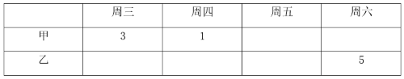

根据题干“甲饮料每天的销售量为整箱且为1到4箱不等”和条件①可知：周五、周六销售甲饮料的数量为2或4，有如下两种假设：

假设一：

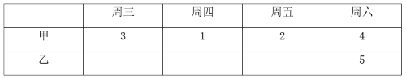

根据条件②，可知：周五甲、乙饮料销售数量总和为8，故周五乙饮料销售数量为6，与题干“乙饮料每天的销售量为1至5箱不等”矛盾，故此假设不成立；

假设二：

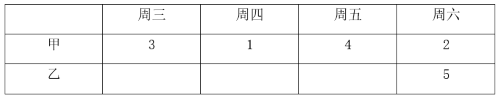

根据条件②，可知：周五甲、乙饮料销售数量总和为6，周四甲、乙饮料销售数量总和为5，周三甲、乙饮料销售数量总和为4，故此时乙饮料周三至周五的销售量如下：

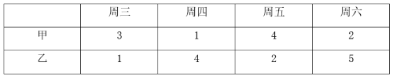

此时符合题干全部条件。

故正确答案为A。

---
