# 2023年上海市公务员录用考试《行测》题（A类）（网友回忆版）

> 判断推理 · 35 题 · 上海 2023

## 材料 1

年终某单位评优，拟从所属甲、乙、丙、丁、戊、己、庚、辛8个部门中推选出12名候选人。要求：

（1）甲、乙、丁、辛4部门人数较少，4部门合计推选出2名候选人；

（2）没有合适人选的部门不必勉强推荐，有合适人选的部门至多可以推选出4名候选人；

（3）若甲、丙两部门至少有1个部门推选出候选人，则戊、己、庚3部门至多有1个部门可推选出候选人。

### 第 1 题　qid 5423815 · 类比推理

根据上述信息，可以得出下列        项中的两个部门均推选出了候选人。

- **A**. 戊和己　✅
- **B**. 庚和辛
- **C**. 乙和丙
- **D**. 戊和丁

**答案**：A

**官方解析**

第一步：分析题干条件。

（1）甲、乙、丙、丁、戊、己、庚、辛8个部门共推选12名候选人；

（2）甲、乙、丁、辛4部门合计推选2名候选人；

（3）每个部门可以推选0-4名候选人；

（4）甲 或 丙推选候选人戊、己、庚中至多有1个部门推选候选人。

第二步：根据题干条件进行推理。

根据条件（1）（2）可知，丙、戊、己、庚4部门合计推选10名候选人；此时根据条件（3）可知，丙、戊、己、庚4部门至少有3个部门推选候选人；再结合条件（4）的逆否等价可知，甲部门和丙部门均没有推出候选人，故戊、己、庚3部门均推选出了候选人，只有A项符合。

故正确答案为A。

---

### 第 2 题　qid 5423818 · 类比推理

若丙和戊两部门合计推选出2名候选人，则可以得出下列        项。

- **A**. 甲和乙两部门合计推选出2名候选人
- **B**. 戊和辛两部门合计推选出3名候选人
- **C**. 丙和己两部门合计推选出4名候选人　✅
- **D**. 己和辛两部门合计推选出5名候选人

**答案**：C

**官方解析**

第一步：分析题干条件。

（1）甲、乙、丙、丁、戊、己、庚、辛8个部门共推选12名候选人；

（2）甲、乙、丁、辛4部门合计推选2名候选人；

（3）每个部门可以推选0-4名候选人；

（4）甲 或 丙推选候选人戊、己、庚中至多有1个部门推选候选人；

（5）丙和戊合计推选2名候选人。

第二步：根据题干条件进行推理。

由上一题可知，甲部门和丙部门均没有推选出候选人，此时根据条件（2）和（5）可知，戊部门推选出2名候选人，乙、丁、辛3部门共推选出2名候选人，还剩己部门和庚部门合计推选出8名候选人；根据条件（3）可知，己部门和庚部门各推选出4名候选人。此时可知丙和己两部门合计推选出4名候选人，C项正确。

故正确答案为C。

---

### 第 3 题　qid 5423705 · 逻辑判断

催化加氢可制取汽油，转化过程示意图如下（括号内是汽油中某些成分的球棍模型），根据图中的信息下列判断错误的是：

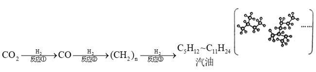

- **A**. 
反应①的生成物中，除了一氧化碳，可能还有水

- **B**. 
反应①②③过程中，元素的化合价不发生改变
　✅
- **C**. 
球棍模型中的小球代表氢原子，大球代表碳原子

- **D**. 
推广制取汽油的技术，有利于实现“碳中和”的目标

**答案**：B

**官方解析**

A项：能与在高温的条件下，反应生成和，因此反应①的生成物中有水，正确；

B项：通过反应①生成，碳元素的化合价由+4价变为+2价，因此碳元素的化合价发生了变化，错误；

C项：在球棍模型中，球的大小表示原子的大小，氢原子比碳原子小，因此小球代表氢原子，大球代表碳原子，正确；

D项：碳中和是指国家、企业、产品、活动或个人在一定时间内直接或间接产生的二氧化碳或温室气体排放总量，通过植树造林、节能减排等形式，以抵消自身产生的二氧化碳或温室气体排放量，达到相对“零排放”。利用制取汽油，可以消耗，抵消人们在生产、生活中排放的部分，有利于实现“碳中和”的目标，正确。

本题为选非题，故正确答案为B。

---

### 第 4 题　qid 5423728 · 逻辑判断

氢气是一种可持续发展的新能源和工业原料。利用太阳能将水转化为氢气是一种理想途径。某种光分解水技术的反应过程如图所示，下列判断错误的是：

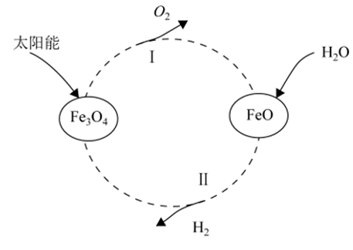

- **A**. 
的作用是作催化剂

- **B**. 
产物除外，还有和
　✅
- **C**. 
该反应机理Ⅱ为与反应生成和

- **D**. 
与电解水相比，该方法的优点是能耗低

**答案**：B

**官方解析**

A项：由图可知，过程Ⅰ的反应为在太阳光的作用下分解生成和，过程Ⅱ的反应为和生成和，由过程Ⅰ和过程Ⅱ的反应可知，整个过程的反应为：水在太阳光和的作用下分解生成了和，因此为整个过程的催化剂，正确；

B项：由A项的分析可知，整个过程的反应产物为和，错误；

C项：由图可知，过程Ⅱ的反应为和生成和，正确；

D项：电解水是指水通电后生成氢气和氧气，此过程需要消耗电能。而光分解水技术是利用太阳能将水转化为氢气和氧气，此过程只需要太阳光的照射，不需要消耗电能，因此光分解水技术比电解水的能耗更低，正确。

本题为选非题，故正确答案为B。

---

### 第 5 题　qid 5423687 · 类比推理

国务院印发《2030年前碳达峰行动方案》，我国向世界承诺，2030年前实现碳达峰，2060年前实现碳中和。“碳中和”是指一定时间内排放的碳总量与吸收的碳总量相互抵消，实现碳“零排放”，下列化学变化能够实现降碳目标的是：

- **A**. 
甲烷燃烧：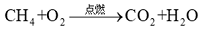

- **B**. 
活泼金属镁在CO₂中燃烧：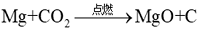

- **C**. 
用煤炭制水煤气：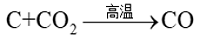

- **D**. 
光催化还原二氧化碳为甲酸：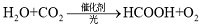
　✅

**答案**：D

**官方解析**

“碳中和”指的是排出的二氧化碳或温室气体被植树造林、节能减排等绿色可持续发展的形式抵消，从而达到相对“零排放”。
A项：甲烷燃烧不但没有减少二氧化碳的排放，反而会产生更多的二氧化碳，不符合“碳中和”的理念，错误；
B项：镁在二氧化碳中燃烧会造成金属镁的消耗和浪费，不符合节能和绿色可持续发展的理念，错误；
C项：用煤炭制水煤气虽然可以消耗二氧化碳，但是需要在高温条件下进行反应，会存在能耗大等问题，并且生成的一氧化碳有毒，因此不符合节能和可持续发展的理念，错误；
D项：利用光催化将二氧化碳还原为甲酸不仅可以消耗二氧化碳，同时还可以生产甲酸和氧气，且反应条件温和，原料简单，能在工业中普及，符合节能和可持续发展的理念，正确。
故正确答案为D。

---

### 第 6 题　qid 5423758 · 类比推理

纯碱是化工之母，实验室中通过以下实验模拟工业制纯碱。向饱和NaCl溶液中先通入氨气再通入二氧化碳：

发生反应的化学方程式为①，

加热得到纯碱的反应方程式为②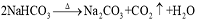

下列判断错误的是：

- **A**. 
纯碱工业的副产品氯化铵可以用作化肥

- **B**. 
反应②生成的可以为①循环使用

- **C**. 
从溶液中分离的方法是过滤

- **D**. 
得到的固体是纯净物
　✅

**答案**：D

**官方解析**

由题干信息可知，本题是侯氏制碱法的制碱流程，其原理是降温结晶。其具体过程为：在饱和食盐水中通入氨气，形成饱和氨盐水。随后通入二氧化碳，故而溶液中会存在大量的钠离子、铵根离子、氯离子和碳酸氢根离子，由于降温后的溶解度最小，所以是主要析出物，其余生成物处理后可作肥料或循环使用。

A项：氯化铵的含氮量为24%-25%，适用于小麦、水稻、玉米、油菜等作物，尤其对棉麻类作物有增强纤维韧性和拉力并提高品质的功效，故氯化铵可以用作化肥，正确；

B项：反应①消耗，而反应②生成，因此可以循环使用，正确；

C项：过滤法是常用的分离溶液与沉淀的操作方法，主要用于分离溶液中难溶于水的固体颗粒，由上述分析可知，降温结晶后是主要析出物，故可以利用过滤来分离，正确；

D项：纯净物指的是由单一物质组成的物质，由上述分析可知，降温结晶后是主要析出物，同时还伴随着少量的NaCl和等固体析出，故不是纯净物而是混合物，错误。

本题为选非题，故正确答案为D。

---

### 第 7 题　qid 5423686 · 类比推理

工业上经常需要研究和控制反应的速度，如通过添加抗氧化剂来减缓橡胶轮胎的老化速度；通过添加催化剂来加快反应速度。以下为探究外界因素对化学反应速度影响的实验方案，下列五组实验无法研究的影响因素是：

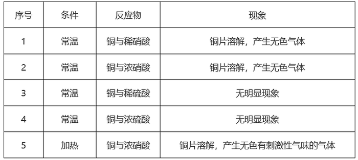

- **A**. 酸的浓度
- **B**. 反应温度
- **C**. 金属的属性　✅
- **D**. 酸的种类

**答案**：C

**官方解析**

影响化学反应速率的因素有很多，为研究某一因素对反应速率的影响，通常采用控制变量法，即每次实验只改变一个要研究的因素，其余因素不变的实验方法。
A项：若研究酸的浓度对反应速率的影响，则应选择酸的浓度不同，但温度、金属的种类和酸的种类相同的一组实验进行对比，所以1和2、3和4这两组实验均符合条件，正确；
B项：若研究反应温度对反应速率的影响，则应选择温度不同，但反应物相同的一组实验进行对比，所以2和5这一组实验符合条件，正确；
C项：若研究金属的属性对反应速率的影响，则应选择金属的种类不同，但温度、酸的种类及浓度均相同的一组实验进行对比，本题五组实验中的金属均为铜，故不存在符合条件的一组实验，错误；
D项：若研究酸的种类对反应速率的影响，则应选择酸的种类不同，但温度、金属的种类和酸的浓度均相同的一组实验进行对比，所以1和3、2和4这两组实验均符合条件，正确。
本题为选非题，故正确答案为C。

---

### 第 8 题　qid 5423715 · 逻辑判断

下表中所示为部分燃料的热值。若要将10℃的水加热至60℃，假设燃料燃烧释放的能量全部给了水。已知水的比热容为J/kg·℃。下列判断正确的是：

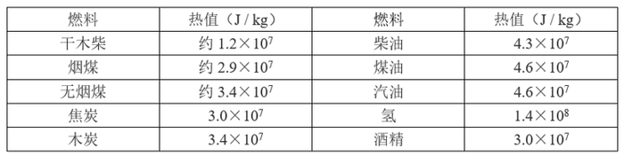

- **A**. 消耗相同质量的焦炭和汽油，能加热水的质量比约为3：2
- **B**. 分别加热等质量的水，消耗的木炭质量与煤油质量的比约为5：7
- **C**. 2g氢可以加热约1.3kg的水　✅
- **D**. 加热1.5kg的水需要约3g的汽油

**答案**：C

**官方解析**

A项：由题可知，水的比热容已知，且均从10℃升高至60℃（温度改变量=60℃-10℃=50℃），所以根据吸收热量的计算公式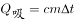可知，水吸收的热量（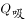）越大，则可加热的水的质量（m）越大，由于燃料燃烧的热量全部被水吸收，所以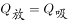，根据热量计算公式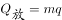可知，相同质量的焦炭和汽油燃烧所释放的热量之比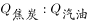，所以能加热水的质量比约为2：3，错误；

B项：由A项分析可知，加热相同质量的水所需的热量相同，由于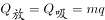，则木炭和煤油的质量之比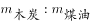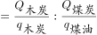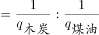，错误；

C项：2g氢气燃烧释放的能量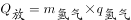J，由于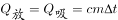，所以加热水的质量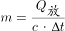kg，正确；

D项：加热1.5kg的水需要的热量J，则所需汽油的质量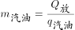kgg，错误。

故正确答案为C。

---

### 第 9 题　qid 5423724 · 逻辑判断

“蹦极”是一项惊险刺激的娱乐项目。下列v-t图能基本正确反映出蹦极中人在到达最低点之前的速度随时间变化关系的是：

- **A**. 
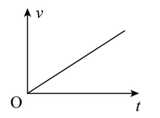

- **B**. 
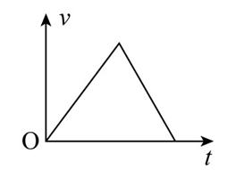

- **C**. 
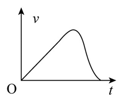

- **D**. 
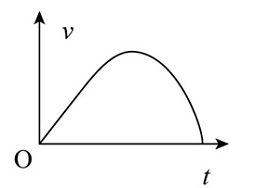
　✅

**答案**：D

**官方解析**

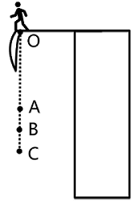

蹦极的过程如上图所示，在人下落的过程中，记O点为人从平台由静止开始下落的位置，A点为弹性绳的原长位置，B点为人受到弹性绳的弹力与自身重力相等的位置，C点为人到达的最低点。

人从O点运动到A点的过程中，只受重力的作用，加速度方向向下，大小恒为g；

从A点运动到B点的过程中，人受到竖直向下的重力和弹性绳对人向上的弹力，由于在B点处人所受弹力与重力相等，故在B点之前人所受弹力始终小于自身的重力，则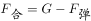，方向向下，由于人自身的重力保持不变，弹性绳不断被拉长，弹力逐渐增大，即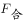逐渐减小，根据牛顿第二定律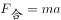可知，人的加速度方向向下，且逐渐减小；在B点处人所受弹力与重力相等，即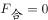，人的加速度为0；

从B点运动到C点的过程中，人受到竖直向下的重力和向上的弹力，且弹力大于重力，即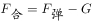，方向向上，由于弹性绳继续被拉长，弹力逐渐增大，即逐渐增大，根据牛顿第二定律可知，人的加速度方向向上，且逐渐增大。

因此在整个过程中，人的加速度先保持不变，然后减小到0，再增大，由于v-t图像中，图像的斜率代表加速度，所以图像的斜率先保持不变，然后减小到0，再增大，故只有D项正确，A、B、C三项错误。

故正确答案为D。

---

### 第 10 题　qid 5423738 · 逻辑判断

如图所示是一种测定风速的装置，压力传感器固定在竖直墙上，弹簧一端固定在传感器上的M点，另一端N与迎风板相连，弹簧穿在光滑水平放置的电阻率较大的金属细杆上。根据以上信息推断下面说法正确的是：

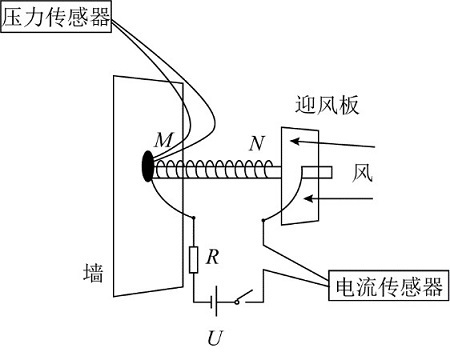

- **A**. 弹簧宜选用导电性良好的金属丝制成
- **B**. 迎风板应选用不导电的材料制成
- **C**. 压力传感器读数越大，电流传感器读数就越小
- **D**. 压力传感器读数越大，电流传感器读数就越大　✅

**答案**：D

**官方解析**

此装置测风速的原理是：金属杆与迎风板紧密接触，并接入电路中，当风将迎风板吹向左侧时，金属杆接入电路的长度变化，引起电阻变化，从而导致电流传感器的读数发生变化，进而确定风速。

A项：若弹簧选用导电性良好的金属丝制成，电阻会非常小，相当于导线，由于金属细杆的电阻率较大，所以弹簧会将金属细杆短路，此时整个电路的电流不会随着风速的改变而改变，即电流传感器的示数不变，此时电流传感器失去作用，错误；

B项：若迎风板选用不导电的材料制成，电流从电源的正极出发后无法回到电源的负极，即无法形成闭合回路，此时电流传感器无示数，错误；

C、D两项：当风速大时，迎风板会在风力的作用下向左移动并压缩弹簧，此时弹簧由于形变量变大，所以弹力也会变大，压力传感器所受压力也会变大，所以压力传感器的读数会变大，但此时金属细杆接入电路部分的长度变小，根据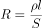可知，当金属细杆的电阻率和横截面积保持不变时，接入电路的长度越小，电阻越小，故金属细杆的接入电路的电阻变小，电路的总电阻也会变小，根据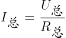可知，电路的总电流变大，即电流传感器的读数会变大，D项正确，C项错误。

故正确答案为D。

---

### 第 11 题　qid 5423670 · 逻辑判断

均热板是一个内壁具有微细结构的真空腔体，通常由铜制成。当热量由热源传导至蒸发区时，腔体里的冷却液吸收热能且体积迅速膨胀，气相的冷却介质迅速充满整个腔体，当气相介质接触到一个比较冷的区域时便会产生凝结的现象。借由凝结的现象释放出在蒸发时累积的热量，凝结后的冷却液会借由微结构的毛细管道再回到蒸发热源处，从而起到散热作用。
根据以上信息下列判断错误的是：

- **A**. 均热板适合手机这样小体积需快速散高热的场合
- **B**. 均热板在工作中涉及到物理中的汽化现象
- **C**. 均热板在工作中涉及到物理中的液化现象
- **D**. 均热板在工作中不涉及到物理中的热对流现象　✅

**答案**：D

**官方解析**

由题干可知，均热板由导热性较强的铜制成，是一种内部具有微细结构的填充有冷却液的真空腔体，一般做成扁平的片状，其体积一般较小，而均热板的特殊结构，又使其导热效率极高，因此可用于小体积需快速散高热的场合，A项正确；均热板的工作原理包括了传导、蒸发、对流、液化四个主要步骤，热由外部高温区传导进入板内，热源附近的水会迅速地吸收热量汽化成水蒸气，带走大量的热能，涉及汽化现象，B项正确；当板内蒸气由高压区（即高温区）扩散到低压区（即低温区）时，蒸气接触到温度较低的内壁，就会迅速地液化成液体并放出热能，涉及液化现象，C项正确；液化形成的水靠微结构的毛细作用流回热源点，完成一个热传循环，形成一个水与水蒸气并存的双相循环系统，涉及热对流现象（热对流是指靠液体或气体流动，将热量由一处传到另一处的传热过程），D项错误。
本题为选非题，故正确答案为D。

---

### 第 12 题　qid 5423671 · 类比推理

2021年6月11日，国家航天局公布了由祝融号火星车拍摄的着陆点全景、火星地形地貌、“中国印迹”和“着巡合影”等影像图。首批科学影像图的发布，标志着我国首次火星探测任务取得圆满成功。自祝融号2021年5月15日着陆火星开始，截至2022年5月1日，祝融号火星车累计行驶1921米，在火星表面工作342个火星日。
根据以上信息下列判断正确的是：

- **A**. 1个火星日比1个地球日略短
- **B**. 1个火星日比1个地球日略长　✅
- **C**. 1个火星日与1个地球日的时长完全相等
- **D**. 1个火星年比1个地球年略短

**答案**：B

**官方解析**

由题干可知，祝融号由2021年5月15日至2022年5月1日，一共工作了351个地球日，而这351个地球日对应342个火星日，则每个火星日对应个地球日，即1个火星日比1个地球日略长，B项正确，A、C两项错误；要对比1个火星年与1个地球年的长短，需要知道火星的公转周期，但题中并无此信息，因此无法比较，D项错误。

故正确答案为B。

---

### 第 13 题　qid 5423766 · 类比推理

气压是作用在单位面积上的大气压力。气压不仅随温度变化，也因海拔高度而异。2022年7月的一天，测出三地（当天天气均为晴天）的气压分别为100.6KPa、87.4KPa、60.3KPa，则这三个地方最有可能依次是：

- **A**. 广西北海、云南大理古城、重庆仙女山
- **B**. 四川峨眉山、海南三亚、甘肃兰州
- **C**. 海南三亚、重庆仙女山、西藏拉萨　✅
- **D**. 西藏拉萨、四川峨眉山、广西北海

**答案**：C

**官方解析**

由题干信息可知，气压与海拔高度有关，海拔高度越高，气压越低。
A项：广西北海（海拔约10-15m），云南大理古城（约2052m）与重庆仙女山（约2033m）中，广西北海海拔最低，气压最高，云南大理古城与重庆仙女山海拔高度相近，气压近似相等，而题干中三个地方的气压有明显差异，错误；
B项：四川峨眉山（海拔约3099m），海南三亚（约7m）与甘肃兰州（约1520m），气压由高到低为海南三亚，甘肃兰州，四川峨眉山，错误；
C项：海南三亚（海拔约7m），重庆仙女山（约2033m）与西藏拉萨（约4000m），气压由高到低为海南三亚，重庆仙女山，西藏拉萨，正确；
D项：西藏拉萨（海拔约4000m），四川峨眉山（约3099m）与广西北海（约10-15m），气压由高到低为广西北海，四川峨眉山，西藏拉萨，错误。
故正确答案为C。

---

### 第 14 题　qid 5423771 · 图形推理

下列选项中，符合所给图形的变化规律的是<u>        </u>。

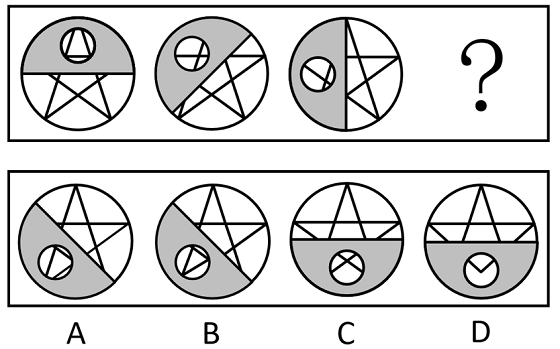

- **A**. A　✅
- **B**. B
- **C**. C
- **D**. D

**答案**：A

**官方解析**

元素组成相同，优先考虑位置规律。观察发现，题干图形均由上下叠加的两层组成，下层是一个圆内切一个五角星，上层是一个灰色半圆挖掉一个空心小圆，下层图形不发生变化，上层的图形依次逆时针旋转，？处图形上层的挖掉小圆的灰色半圆应在左下角位置，排除C、D两项，对比A、B两项，观察发现，由于下层的五角星内切于大圆，故透过上层被挖掉的小圆不可能看到五角星的整个角，排除B项，只有A项符合规律。

故正确答案为A。

---

### 第 15 题　qid 5423773 · 图形推理

下列选项中，符合所给图形的变化规律的是<u>        </u>。

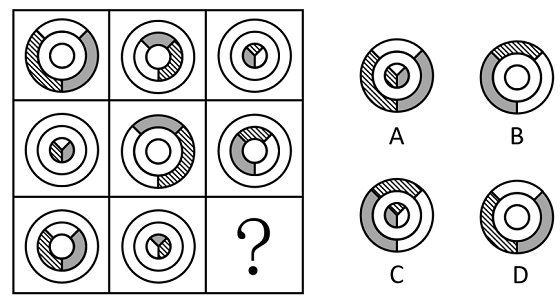

- **A**. A
- **B**. B　✅
- **C**. C
- **D**. D

**答案**：B

**官方解析**

九宫格图形优先看横行，元素组成相似，优先考虑样式规律。观察发现，题干每幅图形都可分为内圈、中圈、外圈，每幅图形都满足一个圈是白色、灰色和阴影构成的混合色，另外两个圈是纯白色，且第一行的三个图形中，混合色分别出现在了外圈、中圈和内圈，第二行图形混合色也是分别在内圈、外圈和中圈各出现一次，第三行图形应用此规律，？处的混合色应仅出现在外圈，排除A、C两项；再次观察发现，题干前两行图形均满足混合色中的白色、灰色和阴影三个颜色从图一至图三依次逆时针旋转一格，第三行应用此规律，只有B项满足。
故正确答案为B。

---

### 第 16 题　qid 5423776 · 图形推理

下列选项中，符合所给图形的变化规律的是<u>        </u>。

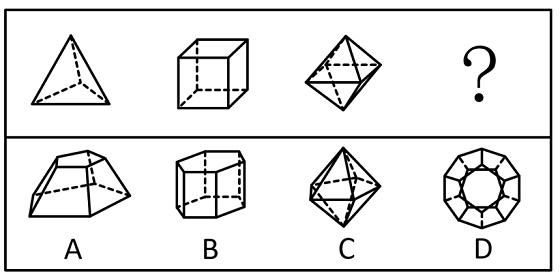

- **A**. A
- **B**. B
- **C**. C　✅
- **D**. D

**答案**：C

**官方解析**

元素组成不同，且无明显属性规律，优先考虑数量规律。观察发现，题干图形存在明显的封闭区域，且所给图形均为立体图形，故考虑立体图形外表面的数量。题干立体图形外表面的数量依次为4、6、8、？，故问号处应为外表面的数量为10的立体图形，只有C项符合。
故正确答案为C。

---

### 第 17 题　qid 5423778 · 图形推理

下列选项中，符合所给图形的变化规律的是<u>        </u>。

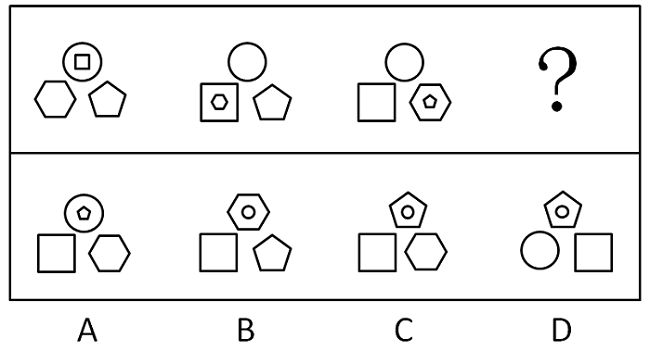

- **A**. A
- **B**. B
- **C**. C　✅
- **D**. D

**答案**：C

**官方解析**

元素组成基本相同，优先考虑位置规律。观察发现，图1和图2相比，图1左下角的六边形到了图2变到了相同位置图形的内部；图2和图3相比，图2右下角的五边形到了图3变成了相同位置图形的内部，故前一幅图形与后一幅图形相比，某个图形要变到下一个相同位置图形的内部，排除A项。继续观察发现，图1和图2相比，只有左下角图形的外框发生变化，图2和图3相比，只有右下角图形的外框发生了变化，？处与前一幅图形相比只有一个位置图形的外框发生了变化，只有C项符合。
故正确答案为C。

---

### 第 18 题　qid 5423823 · 图形推理

下列选项中，符合所给图形的变化规律的是<u>        </u>。

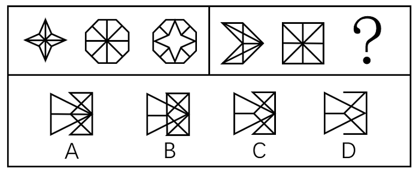

- **A**. A
- **B**. B
- **C**. C　✅
- **D**. D

**答案**：C

**官方解析**

图形组成相似，优先考虑样式规律。观察第一组图形发现，图三由图一和图二求异后得到。将规律代入第二组图形中，将图一和图二求异后，得到的图形对应C项。
故正确答案为C。

---

### 第 19 题　qid 5423831 · 图形推理

下列选项中，符合所给图形的变化规律的是<u>        </u>。

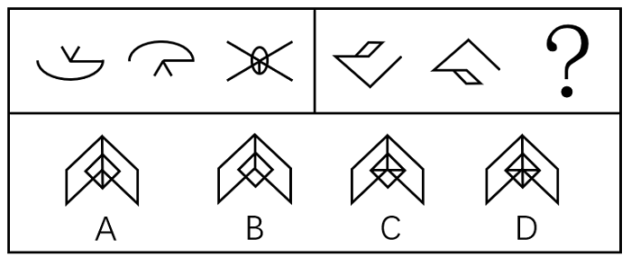

- **A**. A
- **B**. B　✅
- **C**. C
- **D**. D

**答案**：B

**官方解析**

元素组成相似，优先考虑加减同异。观察发现，第一组图形中，图1与图2线条相加，再顺时针旋转，如下图所示：

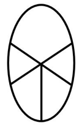

然后外框线条及第一幅图、第二幅图的重合线条缩短，其余线条延长，即得第三幅图。第二组图形遵循此规律，即图1与图2线条相加，再顺时针旋转，如下图所示：

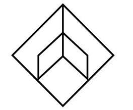

然后外框线条及第一幅图、第二幅图的重合线条缩短，其余线条延长，即得第三幅图。只有B项符合。

故正确答案为B。

---

### 第 20 题　qid 5423842 · 图形推理

下列选项中，可以由左图给定的平面图折叠而成的是<u>        </u>。

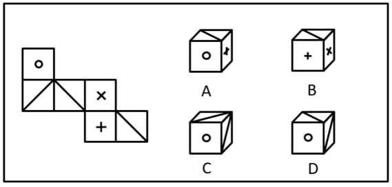

- **A**. A
- **B**. B　✅
- **C**. C
- **D**. D

**答案**：B

**官方解析**

将原展开图标上序号如下图，逐一进行分析。

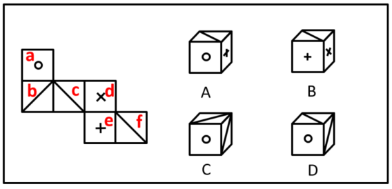

A项：选项必然由面a、面e构成，其中面a和面e为相对面，不能同时出现，选项与题干展开图不一致，排除；

B项：选项由面c、面d和面e构成，选项与题干展开图一致，当选；

C项：选项由面a、面b和面c或面a、面b和面f构成，根据选项可知3个面内没有任何线条经过公共点，若由面a、面b和面c构成，在题干展开图中面b和面c内的两条斜线相交于公共点（如下图标记点1），选项与题干展开图不一致，若由面a、面b和面f构成，在题干展开图中面f中的斜线经过公共点（如下图标记点2），选项与题干展开图不一致，排除；

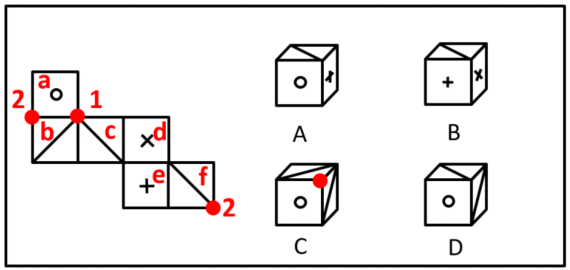

D项：选项由面a、面b和面c或面a、面b和面f构成，但由于面b和面c中的线相交于面a、面b和面c的公共点，而选项中只有一个面中的斜线交于这3个面的公共点，选项与题干展开图不一致，所以该项只能由面a、面b和面f构成，以面a、面b和面f三个面的公共点作为起始点，在面a上沿顺时针方向画边，选项中边1所对应的两个端点分别和面b和面f中的斜线相交，而题干展开图中边1只有一个端点与面f中的斜线相交，另一个端点不与面b中的斜线相交，选项与题干展开图不一致，排除。

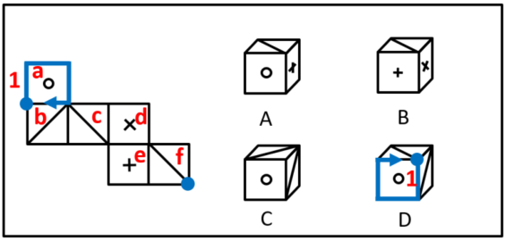

故正确答案为B。

---

### 第 21 题　qid 5423859 · 图形推理

下列选项中，符合所给图形的规律的是<u>        </u>。

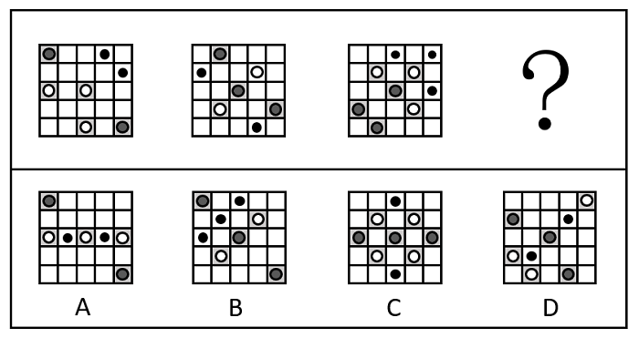

- **A**. A
- **B**. B
- **C**. C
- **D**. D　✅

**答案**：D

**官方解析**

元素组成不同，优先考虑属性规律。题干图形整体比较规整，优先考虑对称性。观察发现，题干图形均为轴对称图形且只存在一条对称轴，排除A、C两项。继续观察发现，题干图形对称轴的方向均为左下-右上，只有D项符合。

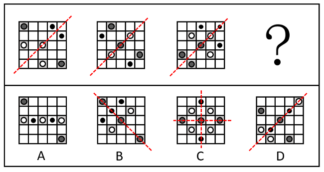

故正确答案为D。

---

### 第 22 题　qid 5423865 · 图形推理

下列选项中，符合所给图形的变化规律的是<u>        </u>。

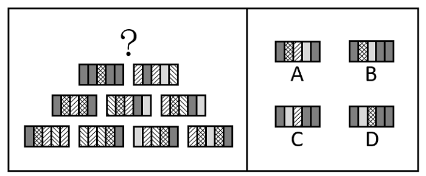

- **A**. A
- **B**. B
- **C**. C
- **D**. D　✅

**答案**：D

**官方解析**

元素组成相似，且图形的轮廓和分割区域相同，优先考虑样式规律中的黑白运算。本题为金字塔类题目，要从下到上找规律，即下层相邻的两幅图之间进行运算得到上面的一幅图，则问号处图形应由第二行的两幅图运算得到（详见下图）。

每幅图都由横向的5个区域构成，每个区域内的图案存在5种可能性：、、、和。将第二行两幅图的对应区域进行运算可知，问号处图形从左至右每个区域分别对应+、+、+、+、+的运算结果，在下面三行的运算中找到以上运算对应的结果即可。观察下面三行的图形，根据第三行后两幅图中右侧第二个区域的运算可知：+=，则问号处左侧第二个区域应为，排除A、B两项；根据第四行前两幅图中左侧第二个区域的运算可知：+=，则问号处中间区域应为，排除C项。

故正确答案为D。

注：本题不严谨，因为问号处左侧第一个区域+的运算结果在下面三行中无法验证，但四个选项中左侧第一个区域内的图案均相同，且根据其他区域的运算结果可以排除明显错误的A、B、C三项，因此，根据对比择优的原则，小粉笔建议选择D项。

---

### 第 23 题　qid 5423808 · 类比推理

下列选项中，与其他三项不同的是<u>        </u>。

- **A**. A
- **B**. B　✅
- **C**. C
- **D**. D

**答案**：B

**官方解析**

图形元素组成不同，且无明显属性规律，考虑数量规律。观察发现，题干图形均为封闭区域被分割，优先考虑数面。观察发现，总体面数量没有规律，且其他数量均无规律。再分析各个面的特征，发现A、C、D三项的图形中面的形状均为三角形，只有B项中面的形状为四边形。
本题为选非题，故正确答案为B。

---

### 第 24 题　qid 5423824 · 图形推理

下列选项中，符合所给图形的变化规律的是<u>        </u>。

- **A**. A
- **B**. B
- **C**. C
- **D**. D　✅

**答案**：D

**官方解析**

元素组成相同，优先考虑位置规律。将每行中左侧小元素由左到右标号（如下图所示），可知小元素在每行的右侧进行位置变动。第一行中，左侧标号为1、2、3、4、5、6、7的元素，变为右侧5、1、3/6、4/7、4/7、2、3/6。其中不确定的元素由第二行观察可知，左侧位置变动到右侧后应为5、1、6、4、7、2、3，故第三行也符合该规律，只有D项符合。

故正确答案为D。

---

### 第 25 题　qid 5423829 · 图形推理

下列选项中，符合所给图形的变化规律的是<u>        </u>。

- **A**. A
- **B**. B
- **C**. C　✅
- **D**. D

**答案**：C

**官方解析**

九宫格优先横行看，第一行中图1、图2和图3的线条可以组成一个完整的六面体；第二行规律验证成立；因此第三行中图1、图2和图3的线条可以组成一个完整的六面体（如下图所示），只有C项符合。

故正确答案为C。

---

### 第 26 题　qid 5423839 · 逻辑判断

约2.3万至2.1万年前，一位年轻人在一处远古湖泊旁潮湿的沙滩上走过，这里如今是美国新墨西哥州白沙国家公园，多年前那位年轻人留下的足迹已变成了化石。大约在这些足迹形成的同一时期，人类从亚洲走到美洲的路线被巨大的冰盖所阻挡。关于人类何时首次踏足美洲，科学家一直争论不休。许多专家认为，人类直到1.3万年前才首次出现在美洲。而此次在白沙国家公园发现的足迹有力地证明，人类早在2.1万年前便已开始在北美生活了。
下列    项最可能是以上论述的前提假设。

- **A**. 美洲最初没有人类。
- **B**. 美洲最早的人类是从别处迁移过去的，早期陆地旅行是可行的。
- **C**. 一位年轻人的足迹化石就足以证明人类其时已踏足美洲。　✅
- **D**. 在从亚洲走到美洲的路线被巨大的冰盖所阻挡之前，人类就已经到达美洲。

**答案**：C

**官方解析**

第一步：找出论点和论据。
论点：人类早在2.1万年前便已开始在北美生活了。
论据：约2.3万至2.1万年前，一位年轻人在一处远古湖泊旁潮湿的沙滩上走过，这里如今是美国新墨西哥州白沙国家公园，多年前那位年轻人留下的足迹已变成了化石。
本题论据讨论的是“在美洲发现2.1万年前的人类足迹”，论点讨论的是“人类在2.1万年前已开始在美洲生活”，论据和论点话题不一致，且提问方式为“前提假设”，加强优先考虑搭桥，即在“足迹”和“生活”之间建立联系。
第二步：逐一分析选项。
A项：该项讨论的是美洲最初是否有人类，与论点讨论的人类早在2.1万年前便已开始在北美生活了，话题不一致，也不明确“最初”到底是什么时间节点，排除；
B项：该项讨论的是美洲最早的人类是否为从别处迁移过去的，与论点讨论的人类早在2.1万年前便已开始在北美生活了，话题不一致，排除；
C项：该项指出一位年轻人的足迹化石就足以证明人类其时已踏足美洲，说明年轻人已在美洲生活，即在“足迹”和“生活”之间建立联系，为搭桥项，保留；
D项：该项指出在从亚洲走到美洲的路线被巨大的冰盖所阻挡之前，人类就已经到达美洲，说明确实早在2.1万年前，人类已经登上美洲了，补充论据，可以加强，保留。
对比C、D两项，搭桥的力度比补充论据的力度强，C项当选。
故正确答案为C。

---

### 第 27 题　qid 5423843 · 逻辑判断

甲：交警不能无缘无故拦截私家车。
乙：你看视频了吗？女子高速闯卡，逃逸途中被警察拦截，要接受处理。
甲：我看了视频，附近根本没有高速公路，哪里有高速闯卡？
以下各项如果为真，最能质疑甲的观点的是（    ）项。

- **A**. 交警可以对正常行驶的私家车进行例行检查
- **B**. 对闯卡逃逸的驾驶人可以处警告或者二百元以下罚款
- **C**. 高速闯卡既可能指在高速公路上闯卡，也可能指车速过快闯卡　✅
- **D**. 个人拍摄下来的交通违法行为，一旦核实是真实的也可成为重要的处罚证据

**答案**：C

**官方解析**

第一步：找出论点和论据。
论点：交警不能无缘无故拦截私家车，即认为视频里面的交警无缘无故拦截了私家车。
论据：甲看了视频，附近根本没有高速公路，不会有高速闯卡。
本题论点和论据都在讨论交警能否无缘无故拦截私家车，二者话题一致，削弱优先考虑削弱论点，其次考虑削弱论据。
第二步：逐一分析选项。
A项：该项指出交警在执行例行检查任务时可以拦截私家车，举了一个例子说明交警可以在有缘由（例行检查）的情况下拦截私家车，有加强作用，无法削弱，排除；
B项：该项指出对闯卡逃逸的驾驶人的处罚，与题干讨论的交警能否无缘无故拦截私家车无关，无法削弱，排除；
C项：该项指出高速闯卡可以指在高速公路上闯卡，也可以指车速过快闯卡，削弱了甲认为的“没有高速公路就不会有高速闯卡行为”，削弱论据，可以削弱，当选；
D项：该项指出个人拍摄的交通违法行为可以成为处罚证据，与题干讨论的交警能否无缘无故拦截私家车无关，无法削弱，排除。
故正确答案为C。

---

### 第 28 题　qid 5423807 · 逻辑判断

美国马萨诸塞州的防疫部门最近发表了一份检测报告，在该州境内接受检疫的野生白尾鹿里面，有70%感染上了某种病毒。据研究，该病毒最初是从人传播到鹿身上的，随后发生变异，可在鹿群中间传播。目前防疫部门只对和人类有过接触的白尾鹿进行检疫。防疫部门的专家由此推测，州内的野生白尾鹿中感染了此种病毒的比例将显著地小于70%。
下列各项如果为真，哪项最能够支持上述论点？

- **A**. 在马萨诸塞州境内，感染了这种病毒的人只占全部人数的0.2%
- **B**. 马萨诸塞州内与人有过接触的野生白尾鹿，只占其总数的20%
- **C**. 感染此种病毒的白尾鹿远比健康的白尾鹿表现得更愿意与人类接触　✅
- **D**. 在附近的几个州并未出现大量关于白尾鹿感染病毒的报告

**答案**：C

**官方解析**

第一步：找出论点和论据。
论点：州内的野生白尾鹿中感染了此种病毒的比例将显著地小于70%。
论据：在该州境内接受检疫的野生白尾鹿里面，有70%感染上了某种病毒。据研究，该病毒最初是从人传播到鹿身上的，随后发生变异，可在鹿群中间传播。目前防疫部门只对和人类有过接触的白尾鹿进行检疫。
本题论据讨论的是州内接受检疫的的白尾鹿感染该病毒的比例，论点讨论的是州内白尾鹿感染该病毒的“整体比例”，论据和论点范围不一致，考虑搭桥。
第二步：逐一分析选项。
A项：该项讨论的是马萨诸塞州境内感染该病毒的人占全部人数的比例，而论点讨论的是野生白尾鹿感染该病毒的比例，主体不一致，无法加强，排除；
B项：20%的白尾鹿与人接触过，而题干已知这个群体的感染率是70%，那么剩下未与人接触过的白尾鹿，它们的感染率不得而知，是否小于70%也不确定，无法加强，排除；
C项：感染此种病毒的白尾鹿更愿意与人类接触，说明题干论据中检疫的大部分都是感染病毒的白尾鹿，所以“70%感染率”这个数据实际是偏高的，即未被检疫的白尾鹿感染率应该是小于70%的，那么可以推出白尾鹿整体的感染率是小于70%，建立了论据和论点之间的联系，搭桥项，当选；
D项：该项讨论的是附近几个州没有大量出现白尾鹿感染病毒的报告，而论点讨论的是“马萨诸塞州内”的白尾鹿感染病毒的情况，主体不一致，无法加强，排除。
故正确答案为C。

---

### 第 29 题　qid 5423814 · 逻辑判断

只要引进知名教练并投入充足的运营费用，就能够使一个俱乐部的球队在联赛的排名显著提升。只有对现行的买卖球员制度和奖金分配制度进行改革，才能引进到知名教练并获得充足的运营经费。某俱乐部经过几年的建设，其球队在联赛的排名并未得到显著提升。
上述断定如果为真，可以推出下列哪项为真？

- **A**. 过去几年，该俱乐部由于招商不利，未能获得充足的运营经费
- **B**. 过去几年，该俱乐部更换了多名教练，没有一位是知名教练
- **C**. 过去几年，该俱乐部可能没有引进到知名教练，也可能没有获得充足的运营经费　✅
- **D**. 过去几年，该俱乐部继续沿用了原来的买卖球员制度和奖金分配制度

**答案**：C

**官方解析**

第一步：翻译题干。

①引进知名教练 且 充足运营费用球队在联赛的排名提升；

②引进知名教练 且 充足运营费用对现行制度进行改革；

③某球队在联赛的排名提升。

从确定信息进行推理，条件③是对条件①的“否后”，根据“否后必否前”和德摩根定律可得④：引进知名教练 或 充足运营费用。

第二步：逐一分析选项。

A项：该项是“充足运营费用”，是结论④或关系中可能出现的一种情况，无法确定是否运营费用不充足，无法推出，排除；

B项：该项是“引进知名教练”，是结论④或关系中可能出现的一种情况，无法确定是否引进知名教练，无法推出，排除；

C项：该项是“可能没有引进知名教练”“可能没有充足运营费用”，是结论④或关系可能出现的两种情况，可以推出，当选；

D项：该项是“对现行制度进行改革”，题干推出的结论④是对条件②的否前，否前无必然，无法确定是否对现行制度进行改革，无法推出，排除。

故正确答案为C。

---

### 第 30 题　qid 5423820 · 逻辑判断

有研究团队使用小鼠模型，发现敲除ASGR1基因会在肝细胞中抑制mTORC1信号通路，同时激活AMPK信号通路，最终导致胆固醇通过胆汁排出，并且通过粪便排泄到体外，从而降低了血液和肝脏中胆固醇水平。为了探索这一基因突变在治疗方面的应用，研究人员开发了靶向ASGR1的抗体疗法。实验结果显示，抗ASGR1抗体成功复制了ASGR1基因敲除对下游信号通路的影响，将小鼠的血清总胆固醇水平降低50%，同时将血清甘油三酯水平降低22%。这一抗体同时降低了肝脏中的总胆固醇水平和甘油三酯水平。
根据以上陈述，可以得出下列哪项结论？

- **A**. 使用AMPK激动剂可导致胆固醇排出
- **B**. ASGR1基因会导致体内胆固醇水平升高
- **C**. 使用抗ASGR1抗体可激活AMPK信号通路　✅
- **D**. 胆固醇水平的降低将伴随甘油三酯水平的降低

**答案**：C

**官方解析**

日常结论题，根据题干信息逐一分析选项。
A项：题干中并没有提到“AMPK激动剂”，无中生有，无法推出，排除；
B项：题干中只是指出敲除ASGR1基因会降低血液和肝脏中胆固醇水平，但无法因此得出“ASGR1基因会导致体内胆固醇水平升高”，无法推出，排除；
C项：题干中指出敲除ASGR1基因会激活AMPK信号通路，且抗ASGR1抗体成功复制了ASGR1基因敲除对下游信号通路的影响，因此抗ASGR1抗体也会激活AMPK信号通路，可以推出，当选；
D项：题干中只是指出抗ASGR1抗体同时降低了肝脏中的总胆固醇水平和甘油三酯水平，但没有涉及“胆固醇水平”和“甘油三酯水平”之间的关系，无中生有，无法推出，排除。
故正确答案为C。

---

### 第 31 题　qid 5423822 · 类比推理

你若活着，则不可能知道自己已经死了；你若死了，则也不可能知道自己已经死了。你或者活着，或者死了，总之，你都不可能知道自己已经死了。
以下选项与上述论证方式最为相似的是哪项？

- **A**. 这酒若真是“不死之酒”，则您杀不死我；这酒若不是“不死之酒”，则您何必为假酒而杀我。这酒或者是真酒或者是假酒。总之，您或者杀不死我或者不必杀我。
- **B**. 你若工作，则整日忙碌而不得安闲；你若不工作，则没有收入，也不得安闲。你或者工作或者不工作，总之，你都不得安闲。　✅
- **C**. 若他的盾最坚固，则他的矛将不能刺穿他的盾；若他的矛最锋利，则他的矛将能刺穿他的盾。他的矛或者能够刺穿他的盾，或者不能刺穿他的盾。总之，他互相矛盾。
- **D**. 若某人是罪犯，则他有作案动机；若某人是罪犯，则他有作案时间。某人或者没有作案动机，或者没有作案时间。总之，某人不是罪犯。

**答案**：B

**官方解析**

第一步：分析题干推理形式。

题干翻译为：活着不可能知道自己已经死了；死了不可能知道自己已经死了，不论活着或死了，你都不可能知道自己已经死了。

题干的论证方式为：AB，AB；不论A 或 A，一定得到B。

第二步：逐一分析选项。

A项：翻译为：“不死之酒”杀不死我，“不死之酒”不必杀我，不论真酒或假酒，一定得到杀不死我或不必杀我，论证方式为：AB，AC，不论A 或 A，一定得到B 或 C，与题干论证方式不一致，排除；

B项：翻译为：工作不得安闲，工作不得安闲，不论工作或不工作，一定不得安闲，论证方式为：AB，AB；不论A 或 A，一定得到B，与题干论证方式一致，当选；

C项：翻译为：盾最坚固矛刺穿盾，矛最锋利矛刺穿盾，矛刺穿盾 或 矛刺穿盾，一定互相矛盾，论证方式为：AB，CB，不论B 或 B，一定得到D，与题干论证方式不一致，排除；

D项：翻译为：某人是罪犯有作案动机，某人是罪犯有作案时间，作案动机 或 作案时间，某人不是罪犯，论证方式为：AB，AC，不论B 或 C，一定得到A，与题干论证方式不一致，排除。

故正确答案为B。

---

### 第 32 题　qid 5423825 · 类比推理

某单位购买了一批影像资料，有科幻片、故事片、战争片等；有国内的、欧美的、印度的；有中文的，也有英文原版的。其中，所有的科幻片都不是英文原版的，所有的故事片都是英文原版的，所有的故事片都是印度的。战争片既有印度的，也有欧美的；既有中文的，也有英文原版的。
根据以上陈述，关于这批影像资料可以得出        项。

- **A**. 有些印度片不是科幻片　✅
- **B**. 有些战争片也是故事片
- **C**. 有些科幻片不是欧美的
- **D**. 有些故事片是中文的

**答案**：A

**官方解析**

第一步：翻译题干。

①科幻片英文原版；

②故事片英文原版；

③故事片印度的；

④有的战争片印度的；

⑤有的战争片欧美的；

⑥有的战争片中文的；

⑦有的战争片英文原版。

①②串联得到：⑧科幻片英文原版故事片。

第二步：逐一分析选项。

A项：翻译为有的印度片科幻片，根据条件③可以推出“有的故事片印度的”，换位可以得到“有的印度片故事片”，“故事片”是对条件⑧的否后，否后推否前，可以得到“故事片科幻片”，即“有的印度片科幻片”，可以推出，当选；

B项：翻译为有的战争片故事片，根据条件④可知“有的战争片印度的”，“印度的”是对条件③的肯后，根据条件⑦可知“有的战争片英文原版”，“英文原版”是对条件②的肯后，肯后无必然结论，无法推出，排除；

C项：翻译为有的科幻片欧美的，根据条件⑧可知“科幻片英文原版故事片”，无法与“欧美的”建立起联系，无法推出，排除；

D项：翻译为有的故事片中文的，即“有的故事片英文原版”，与条件②矛盾，无法推出，排除。

故正确答案为A。

---

### 第 33 题　qid 5423751 · 逻辑判断

休谟的实践推理理论，是否具有实践推理能力对回答智能机器是否具有道德权利和道德地位等问题具有启发性。因为，根据休谟的理论，人类、非人类的智能机器都能够进行实践推理，尽管智能机器的信念和欲望相较于人类的非常有限，它们的实践推理能力也相对有限。但是，如果智能机器能够像人一样具有道德情感或自利概念等，那么它们也能做出像人一样的实践推理，拥有像人一样的道德权利和道德地位。
以下选项最准确地概括了上述论证的基本结构的是        项。

- **A**. 甲和丙之间存在相关性，因为，有甲；若甲，则乙，若乙则丙
- **B**. 乙和丙之间存在相关性，因为，有乙；若甲，则乙且丙　✅
- **C**. 甲和丙之间存在相关性，因为，有甲；若甲，则乙且丙
- **D**. 乙和丙之间存在相关性，因为，有乙；若甲，则乙，若乙则丙

**答案**：B

**官方解析**

第一步：分析题干论证过程。
先提出理论：是否具有实践推理能力和智能机器是否具有道德权利和道德地位有关。然后阐述原因：因为，智能机器都能够进行实践推理；若智能机器具有道德情感或自利概念，则它们能像人一样实践推理，而且拥有道德权利和道德地位。
故论证方式为：A（实践推理能力）和B（道德权利和道德地位）存在相关性，因为，有A（实践推理能力）；若C（道德情感或自利概念），则A（实践推理能力） 且 B（道德权利和道德地位）。
第二步：逐一对照选项并判断正确答案。
根据上述论证方式可知，只有B项准确概括了题干论证的基本结构，B项当选。
故正确答案为B。

---

### 第 34 题　qid 5423772 · 类比推理

某处室共有李、王、陈、宋、文5人，办公室就该处室是否购买打印机和投影仪征询5人意见。5人表示如下：
李：不管买不买打印机，都要买投影仪；
王：两样都买；
陈：两样至少买一样；
宋：若买投影仪，则一定也买打印机；
文：两样至多买一样。
办公室经过综合考虑，最终完成了采购工作。
根据以上信息，可知办公室最终的采购不可能        。

- **A**. 与其中4人的意见不冲突
- **B**. 与其中3人的意见不冲突
- **C**. 与其中2人的意见不冲突
- **D**. 与其中1人的意见不冲突　✅

**答案**：D

**官方解析**

第一步：分析题干条件。

李：投影仪；

王：投影仪 且 打印机；

陈：投影仪 或 打印机；

宋：投影仪打印机；

文：投影仪 或 打印机。

第二步：根据题干条件进行推理。

问题为“不可能”，且根据题干条件无法判断满足了几个人的意见，优先考虑假设法。

采购情况共分为4种，分别是投影仪 且 打印机，投影仪 且 打印机，投影仪 且 打印机，打印机 且 投影仪。分情况代入判断5个人意见的真假，其中王与文为矛盾关系，必有一真必有一假，可同步判断；宋的意见“投影仪打印机”为条件关系，无法直接判断，可先判断其矛盾“投影仪 且 打印机”的真假，再判断宋的意见的真假。

第一种情况：投影仪 且 打印机，具体情况如下表所示，此时购买情况与其中4人的意见不冲突，故A项可能成立，排除A项；

第二种情况：投影仪 且 打印机，具体情况如下表所示，此时购买情况与其中2人的意见不冲突，故C项可能成立，排除C项；

第三种情况：投影仪 且 打印机，具体情况如下表所示，此时购买情况与其中3人的意见不冲突，故B项可能成立，排除B项；

第四种情况：打印机 且 投影仪，具体情况如下表所示，此时购买情况与其中3人的意见不冲突，与第三种情况相同，可排除B项。

综合上述四种情况可知，A、B、C三项都是可能的，只有D项不可能。

本题为选非题，故正确答案为D。

---

### 第 35 题　qid 5423804 · 类比推理

某国际会议期间，会务组招聘了张、王、李、陈、宋、孔、何7名志愿者，拟将他们分配至甲、乙、丙3个工作组，每组分配2至3人。已知：
（1）若王、李和孔中至少有一人分配在甲组或者丙组，则分配至乙组的是张和宋；
（2）若宋、何中至少有一人分配在乙组或者丙组，则分配至甲组的是张和李。
根据上述信息，下列        项中的两人是分配至丙组的。

- **A**. 张和陈　✅
- **B**. 宋和孔
- **C**. 陈和何
- **D**. 张和宋

**答案**：A

**官方解析**

第一步：分析题干条件。

（1）（王在甲组或丙组）或（李在甲组或丙组）或（孔在甲组或丙组）张和宋在乙组；

（2）（宋在乙组或丙组）或（何在乙组或丙组）张和李在甲组。

第二步：根据题干条件进行推理。

题干条件均为不确定信息，考虑采用假设法。

假设条件（1）的前面“（王在甲组或丙组）或（李在甲组或丙组）或（孔在甲组或丙组）”为真，肯前必肯后，可以推出张和宋在乙组；

根据“宋在乙组”，可知条件（2）的前面“（宋在乙组或丙组）或（何在乙组或丙组）”为真，肯前必肯后，可以推出张和李在甲组；

此时张既在甲组又在乙组，前后矛盾，不满足题干条件，故假设不成立，即“（王在甲组或丙组）或（李在甲组或丙组）或（孔在甲组或丙组）”为假，可以推出王、李、孔不在甲组和丙组，那么王、李、孔在乙组；

根据“李在乙组”，可知条件（2）的后面“张和李在甲组”为假，否后必否前，可以推出“（宋在乙组或丙组）或（何在乙组或丙组）”为假，可以推出宋、何不在乙组和丙组，那么宋、何在甲组。

根据上述推理，王、李、孔在乙组，宋、何在甲组，可以推出张和陈在丙组。

故正确答案为A。

---
