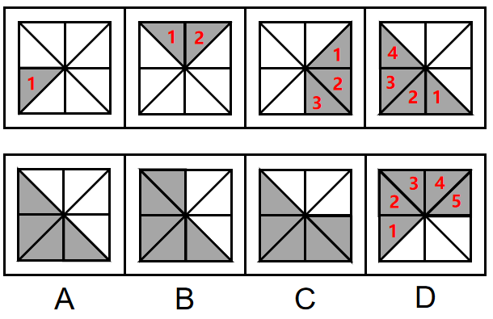
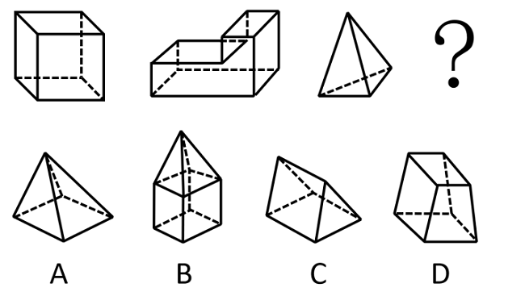

# 2023年云南公务员录用考试《行测》题（网友回忆版）

> 判断推理 · 30 题 · 云南 2023

## 第 1 题　qid 5509554 · 图形推理

从所给的四个选项中，选择最合适的一个填入问号处，使之呈现一定的规律性：

- **A**. A
- **B**. B
- **C**. C
- **D**. D　✅

**答案**：D

**官方解析**

观察发现，题干图形均存在灰色三角形，且灰色三角形数量依次递增，数量分别为1、2、3、4，故？处图形灰色三角形数量应为5，排除A项。继续观察发现，灰色三角形有明显的位置移动，故考虑灰色三角形的位置规律。题干图形灰色三角形每次顺时针移动2格且在最前面增加一个灰色三角形，只有D项符合。

故正确答案为D。

---

## 第 2 题　qid 5509801 · 图形推理

把下面的六个图形分为两类，使每一类图形都有各自的共同特征或规律，分类正确的一项是：

- **A**. ①②③，④⑤⑥
- **B**. ①②⑤，③④⑥
- **C**. ①②⑥，③④⑤
- **D**. ①④⑥，②③⑤　✅

**答案**：D

**官方解析**

本题为分组分类题目。元素组成不同，无明显属性规律，考虑数量规律。观察发现，题干图①、图⑤存在端点，图③为“田”字变形图，图⑥为“日”字变形图，考虑笔画数，图①④⑥均为一笔画图形，图②③⑤均为两笔画图形。即图①④⑥为一组，图②③⑤为一组。
故正确答案为D。

---

## 第 3 题　qid 5509937 · 图形推理

从所给四个选项中，选择最合适的一个填入问号处，使之呈现一定的规律性：

- **A**. A
- **B**. B
- **C**. C
- **D**. D　✅

**答案**：D

**官方解析**

元素组成不同，无明显属性规律，考虑数量规律。题干图形均为多面体，优先考虑数面数量，图1至图3的面数量分别为6、8、4，均为偶数，故？处图形面数量也应为偶数，A项面数量为5，B项面数量为9，C项面数量为5，D项面数量为6，只有D项满足。
故正确答案为D。

---

## 第 4 题　qid 5509671 · 图形推理

下面四个正方体纸盒的外表面展开图中，与其他三个折叠成的纸盒不相同的是：

- **A**. A
- **B**. B　✅
- **C**. C
- **D**. D

**答案**：B

**官方解析**

将选项展开图中的面标上序号，如下图所示（各选项包含的面都相同，故相同的面用相同字母表示），选项存在相同面，可以通过相同面公共边解题，逐一分析选项。

A项：面a、面b是相邻面，存在公共边（如上图所示），公共边紧邻面a白色多边形长边、面b黑色直角梯形上底边；

B项：面a、面b是相邻面，存在公共边（如上图所示），公共边紧邻面a白色多边形长边、面b白色矩形长边；

C项：面a、面b存在公共边（如上图所示），公共边紧邻面a白色多边形长边、面b黑色直角梯形上底边；

D项：面a、面b存在公共边（如上图所示），公共边紧邻面a白色多边形长边、面b黑色直角梯形上底边。

综上，只有B项与其他三项不同。

本题为选非题，故正确答案为B。

---

## 第 5 题　qid 5509593 · 图形推理

从所给的四个选项中，选择最合适的一个填入问号处，使之呈现一定规律性：

- **A**. A
- **B**. B　✅
- **C**. C
- **D**. D

**答案**：B

**官方解析**

元素组成相同，优先考虑位置规律。观察上方第一组图形发现，图1以图2为轴经过左右翻转得到图3，图3再以图4为轴经过上下翻转得到图5。下方第二组图形应用此规律，图1以图2为轴经过上下翻转得到图3，图3再以图4为轴经过左右翻转得到？处图形。只有B项符合。
故正确答案为B。

---

## 第 6 题　qid 5509661 · 定义判断

环境知觉是人们在环境外观感觉的基础上对地理环境的整体认识和综合解释的过程，是环境刺激与个体已有知识经验相互作用的结果。环境认知是人们对环境信息再现大脑后的认识，它是人们对地理环境识记再现的一种形态，当人们对以前识记的地理环境再度感知的时候，觉得熟悉，仍能认识，经过进一步分析思考后能够做出知觉判断。
根据上述定义，下列涉及环境认知的是：

- **A**. 老杨是生活在一座超大城市的老居民，经常在没有地图导航的情况下从城市北边开车到南边去爬山　✅
- **B**. 小周是建筑设计师，认为红砖建筑直接暴露建筑材料是“纯粹”的表现，但小李却认为建筑物不加装修，外观蹩脚
- **C**. 小朱平时喜欢观看介绍风景名胜的纪录片，特别是关于九寨沟的反复看了好多遍。当她第一次去九寨沟看到那些美景时，一种强烈的熟悉感涌上心头
- **D**. 小王是专业的地图测绘员，工作时开着装有摄像头和激光雷达的测绘车，对所到之处的街景进行测绘后获得测绘数据，最终形成一份高精度的数字化地图

**答案**：A

**官方解析**

第一步：找出定义关键词。
环境知觉：“在环境外观感觉的基础上”、“对地理环境的整体认识和综合解释”、“环境刺激与个体已有知识经验相互作用”；
环境认知：“人们对环境信息再现大脑后的认识”、“对以前识记的地理环境再度感知”、“觉得熟悉，仍能认识，经过进一步分析思考后能够做出知觉判断”。
第二步：逐一进行分析。
A项：老杨是一座超大城市的老居民，经常在没有地图导航的情况下从北边开车到南边去爬山，符合“对以前识记的地理环境再度感知”、“觉得熟悉，仍能认识，经过进一步分析能做出知觉判断”，符合“环境认知”定义，当选；
B项：小周是建筑设计师，认为红砖建筑应该暴露建筑材料，但小李却认为建筑物不加装修，外观蹩脚，小周和小李对于建筑物是否加装修都有自己的看法，符合“在环境外观感觉的基础上”、“对地理环境的整体认识和综合解释”、“环境刺激与个体已有知识经验相互作用”，符合“环境知觉”定义，不符合“环境认知”定义，排除；
C项：小朱看了很多遍九寨沟的纪录片，当她第一次去九寨沟看到那些美景时，觉得很熟悉，只能说明因为之前总是看九寨沟的纪录片，这一次身临其境了觉得很熟悉，但并没有提到熟悉了之后进一步分析做出知觉判断，不符合“经过进一步分析能做出知觉判断”，不符合“环境认知”定义，排除；
D项：小王对所到之处的街景进行测绘后获得测绘数据，最终形成数字化地图，不符合“人们对环境信息再现大脑后的认识”、“对以前识记的地理环境再度感知”、“觉得熟悉，仍能认识，经过进一步分析能做出知觉判断”，不符合“环境认知”定义，排除。
故正确答案为A。

---

## 第 7 题　qid 5509609 · 定义判断

认识性好奇心是由新颖的知识、复杂的概念、晦涩难懂的理论或尚未解决的难题引起的个体想要探究知识的渴望，进而引起探索的行为。
根据上述定义，下列属于认识性好奇心的是：

- **A**. 小朋友被空中飞舞的雪花所吸引，试着伸手去抓
- **B**. 孩子看到父亲在房间打游戏，不由自主凑了上去
- **C**. 二年级的小学生遇到不认识的字会主动去查字典　✅
- **D**. 老师通过课堂提问的方式督促学生进行自主思考

**答案**：C

**官方解析**

第一步：找出定义关键词。
“由新颖的知识、复杂的概念、晦涩难懂的理论或尚未解决的难题”、“引起个体想要探究知识的渴望，进而引起探索的行为”。
第二步：逐一分析选项。
A项：小朋友被飞舞的雪花吸引，试着伸手去抓雪花，“飞舞的雪花”不符合“由新颖的知识、复杂的概念、晦涩难懂的理论或尚未解决的难题”，不符合定义，排除；
B项：孩子看到父亲打游戏不由自主凑上去，这里只是孩子对父亲玩的游戏感兴趣，“游戏”不符合“由新颖的知识、复杂的概念、晦涩难懂的理论或尚未解决的难题”，且不由自主说明孩子是无意识的行为，不符合“引起个体想要探究知识的渴望，进而引起探索的行为”，不符合定义，排除；
C项：小学生遇到自己不认识的字主动去查字典，“不认识的字”属于新颖的知识，符合“由新颖的知识、复杂的概念、晦涩难懂的理论或尚未解决的难题”，“主动查字典”符合“引起个体想要探究知识的渴望，进而引起探索的行为”，符合定义，当选；
D项：老师通过课堂提问的方式督促学生自主思考，说明是老师引起学生思考，而学生是否想要探究，不得而知，不符合“引起个体想要探究知识的渴望，进而引起探索的行为”，不符合定义，排除。
故正确答案为C。

---

## 第 8 题　qid 5509578 · 定义判断

生物多样性评估是指以生物多样性保护和可持续利用为目的而开展的基因、物种和生态系统多样性调查和评价活动。由于生物多样性评估依赖于数据的可获取性，许多情况下受直接测定的限制，人们不得不采取代理指标评估方法，即运用一类与生物多样性及其时空分布具有统计相关性的特殊生物类群或环境因子进行评估的方法。
根据上述定义，下列体现了生物多样性代理指标评估方法的是：

- **A**. 利用遥感数据绘制景观图像，评估某地区物种组成的丰富度
- **B**. 采用野生鸟类（或蝴蝶）指数判断某区域生态系统的保护状态　✅
- **C**. 建立物种-面积关系模型，评估某栖息地丧失对特定生物种群的影响
- **D**. 选择地理因子将某区域划分为5个生物大区、7个生物亚区和18个生物群区

**答案**：B

**官方解析**

第一步：找出定义关键词。
生物多样性评估：“以生物多样性保护和可持续利用为目的”、“基因、物种和生态系统多样性调查和评价活动”；
代理指标评估方法：“与生物多样性及其时空分布具有统计相关性”、“特殊生物类群或环境因子”、“进行评估的方法”。
第二步：逐一分析选项。
A项：利用遥感数据绘制景观图，不符合“与生物多样性及其时空分布具有统计相关性”、“特殊生物类群或环境因子”，不符合“生物多样性代理指标评估方法”定义，排除；
B项：采用野生鸟类（或蝴蝶）指数判断某区域生态系统的保护状态，符合“与生物多样性及其时空分布具有统计相关性”、“特殊生物类群或环境因子”，符合“生物多样性代理指标评估方法”定义，当选；
C项：评估某栖息地丧失对特定生物种群的影响，不符合“与生物多样性及其时空分布具有统计相关性”、“特殊生物类群或环境因子”，不符合“生物多样性代理指标评估方法”定义，排除；
D项：选择地理因子将某区域划分，不符合“与生物多样性及其时空分布具有统计相关性”、“特殊生物类群或环境因子”，不符合“生物多样性代理指标评估方法”定义，排除。
故正确答案为B。

---

## 第 9 题　qid 5509588 · 定义判断

结构性进入壁垒是指企业自身无法支配的、外生的，由产品技术特点、资源供给条件、社会法律制度、政府行为以及消费者偏好等因素所形成的壁垒。策略性进入壁垒是指产业内的企业为保持在市场上的主导地位，获取垄断利润，利用自身的优势通过一系列的有意识的策略性行为构筑起的防止潜在进入者进入的壁垒。
根据上述定义，下列属于策略性进入壁垒的是：

- **A**. 我国拍摄一部动画片动辄需上百万、数千万人民币资金，且产业链尚未完善，使得规模较小的甲动画投资公司只能望而却步
- **B**. 乙国汽车厂商在推出一款新车型之前，必须先由政府指定机构对车辆性能进行严格检验，未经检验或未通过检验的车型不得生产
- **C**. 丙公司在疫情期间看到线上卖菜的商机，在某市设置了多个卖点。但因许多行业巨头已在该城市运营多年，导致丙公司迟迟打不开市场
- **D**. 丁乳制品公司在某地方市场占有量极大，随着该地乳制品消费量增加，小公司纷纷试水。在此情况下，丁公司经常靠低价促销来巩固市场地位　✅

**答案**：D

**官方解析**

第一步：找出定义关键词。
结构性进入壁垒：“企业自身无法支配的、外生的”、“由产品技术特点、资源供给条件、社会法律制度、政府行为以及消费者偏好等因素所形成的壁垒”；
策略性进入壁垒：“产业内的企业为保持在市场上的主导地位，获取垄断利润”、“利用自身的优势”、“通过有意识的策略性行为”、“构筑防止潜在进入者进入的壁垒”。
第二步：逐一分析选项。
A项：动画片成本高、产业链尚未完善等问题是“产品技术特点、资源供给条件等形成的壁垒”，符合“结构性进入壁垒”定义，不符合“策略性进入壁垒”定义，排除；
B项：推出新车型前需先由政府指定机构对车辆性能进行严格检验，属于由“政府行为形成的壁垒”，符合“结构性进入壁垒”定义，不符合“策略性进入壁垒”定义，排除；
C项：丙公司难以打开市场是因为许多行业巨头已在该城市运营多年，这说明丙公司不是行业巨头，不具备在市场上的主导地位，不符合“产业内的企业为保持在市场上的主导地位，获取垄断利润”，不符合“策略性进入壁垒”定义，排除；
D项：丁公司市场占有量极大，符合“产业内的企业为保持在市场上的主导地位，获取垄断利润”，经常靠低价促销来巩固市场地位，符合“利用自身的优势”、“通过有意识的策略性行为”、“构筑防止潜在进入者进入的壁垒”，符合“策略性进入壁垒”定义，当选。
故正确答案为D。

---

## 第 10 题　qid 5509555 · 定义判断

数字产业化，就是通过现代信息技术的市场化应用，将数字化的知识和信息转化为生产要素，通过信息技术创新、管理创新和商业模式创新融合，不断催生新产业、新业态、新模式，最终形成数字产业链和产业集群。
根据上述定义，下列属于数字产业化的是：

- **A**. 当下各类打车软件的推出，极大方便了人们的出行　✅
- **B**. 人工智能在汽车生产线中得到广泛应用，极大提升了生产效率
- **C**. 物流公司运用仓储机器人分拣包裹，既减少了人力成本又提升了效率
- **D**. 故宫博物院推出的“数字故宫”，让世界各地观众身临其境体验到参观故宫的乐趣

**答案**：A

**官方解析**

第一步：找出定义关键词。

“现代信息技术的市场化应用”、“将数字化的知识和信息转化为生产要素”、“信息技术创新、管理创新和商业模式创新融合”、“形成数字产业链和产业集群”。

第二步：逐一分析选项。

A项：各类打车软件的推出方便人们出行，打车软件符合“现代信息技术的市场化应用”、“将数字化的知识和信息转化为生产要素”，符合定义，当选；

B项：人工智能在汽车生产线中得到广泛使用，说明在现代产业中运用到了人工智能，并非是运用人工智能而创新产业链，不符合“将数字化的知识和信息转化为生产要素”、“形成数字产业链和产业集群”，不符合定义，排除；

C项：物流公司运用仓储机器人分拣包裹，说明在物流产业中运用到了智能机器，并非是运用人工智能而创新产业链，不符合“将数字化的知识和信息转化为生产要素”、“形成数字产业链和产业集群”，不符合定义，排除；

D项：故宫博物院推出“数字故宫”，“数字故宫”是传统旅游业融入信息技术而做的创新，是对传统行业的创新和升级，不符合“将数字化的知识和信息转化为生产要素”、“形成数字产业链和产业集群”，不符合定义，排除。

故正确答案为A。

---

## 第 11 题　qid 5509549 · 类比推理

报纸编辑：期刊编辑：编辑

- **A**. 小学教师：民办教师：教师
- **B**. 青年律师：民事律师：律师
- **C**. 影视导演：网剧导演：导演
- **D**. 城市规划：乡村规划：规划　✅

**答案**：D

**官方解析**

第一步：判断题干词语间逻辑关系。
报纸编辑和期刊编辑是两种不同的编辑，二者为并列关系，与编辑为包容关系中的种属关系。
第二步：判断选项词语间逻辑关系。
A项：有的小学教师是民办教师，有的小学教师不是民办教师，有的民办教师是小学教师，有的民办教师不是小学教师，二者为交叉关系，与教师为种属关系，与题干逻辑关系不一致，排除；
B项：有的青年律师是民事律师，有的青年律师不是民事律师，有的民事律师是青年律师，有的民事律师不是青年律师，二者为交叉关系，与律师为种属关系，与题干逻辑关系不一致，排除；
C项：网剧导演是影视导演的一种，二者是种属关系，与题干逻辑关系不一致，排除；
D项：城市规划和乡村规划是两种不同的规划，二者为并列关系，与规划为种属关系，与题干逻辑关系一致，当选。
故正确答案为D。

---

## 第 12 题　qid 5509553 · 类比推理

斤：两：钱

- **A**. 眼：口：手
- **B**. 年：月：日　✅
- **C**. 天：时：秒
- **D**. 孟：仲：季

**答案**：B

**官方解析**

第一步：判断题干词语间逻辑关系。
重量单位包括：斤、两、钱、分。斤、两、钱是重量单位中的三个，三者是并列关系，且三者在重量单位中排列紧密连续。
第二步：判断选项词语间逻辑关系。
A项：眼、口、手是身体中的一部分，三者是并列关系，但是三者不存在紧密连续的关系，与题干逻辑关系不一致，排除；
B项：年、月、日是计时单位中的三个，三者是并列关系，且三者在计时单位中排列紧密连续，与题干逻辑关系一致，当选；
C项：天、时、秒是计时单位中的三个，三者是并列关系，但是三者在计时单位中的排列并不是紧密连续的（一般连续的顺序是天、时、分、秒），与题干逻辑关系不一致，排除；
D项：孟、仲、季为兄弟间的长幼排名顺序，三者是并列关系，但是三者在长幼排名顺序上并不是紧密连续的（一般连续的顺序是孟、仲、叔、季），与题干逻辑关系不一致，排除。
故正确答案为B。

---

## 第 13 题　qid 5509621 · 类比推理

春兰：墨兰：兰花

- **A**. 凤蝶：粉蝶：蝴蝶　✅
- **B**. 春茶：秋茶：茶馆
- **C**. 蔬菜：水果：果蔬
- **D**. 菊花：梅花：花卉

**答案**：A

**官方解析**

第一步：判断题干词语间逻辑关系。
春兰和墨兰都是兰花的一种，二者为并列关系，与兰花均为种属关系。
第二步：判断选项词语间逻辑关系。
A项：凤蝶和粉蝶都是蝴蝶的一种，二者为并列关系，与蝴蝶均为种属关系，与题干逻辑关系一致，保留；
B项：春茶一般指由越冬后茶树在春天里萌发的芽叶采制而成的茶叶，秋茶一般指由秋天采集的芽叶制成的茶叶，二者为并列关系，但二者与茶馆均不构成种属关系，与题干逻辑关系不一致，排除；
C项：蔬菜和水果都是食物，二者为并列关系，果蔬包括水果和蔬菜，水果、蔬菜与果蔬均为组成关系，与题干逻辑关系不一致，排除；
D项：菊花和梅花都是花卉，二者为并列关系，与花卉均为种属关系，与题干逻辑关系一致，保留。
比较A、D两项，题干中春兰和墨兰均是兰花的细分，A项中凤蝶和粉蝶均是蝴蝶的细分，兰花和蝴蝶范围更小，D项中的花卉范围较大，故A项与题干逻辑关系更一致，当选。
故正确答案为A。

---

## 第 14 题　qid 5509580 · 类比推理

提纲挈领 对于 （    ） 相当于 德才兼备 对于 （    ）

- **A**. 网之一孔；德高望重
- **B**. 中流砥柱；达士通人
- **C**. 以一持万；才高行洁　✅
- **D**. 毛举细故；以德报怨

**答案**：C

**官方解析**

逐一代入选项。
A项：“提纲挈领”指提起渔网的总绳，拎起衣服的领子，比喻抓住事物的关键和要领，“网之一孔”比喻局部在整体中才能起作用，二者无明显逻辑关系；“德才兼备”指既有好的品德，又具有才能，“德高望重”指品德高尚，很有声望，二者是近义关系，前后逻辑关系不一致，排除；
B项：“提纲挈领”指提起渔网的总绳，拎起衣服的领子，比喻抓住事物的关键和要领，“中流砥柱”比喻能担当重任，在艰难环境中起支柱作用的集体或个人，二者无明显逻辑关系；“德才兼备”指既有好的品德，又具有才能，“达士通人”指学识渊博，心胸豁达的人，二者无明显逻辑关系，前后逻辑关系不一致，排除；
C项：“提纲挈领”指提起渔网的总绳，拎起衣服的领子，比喻抓住事物的关键和要领，“以一持万”形容抓住关键，可以控制全局，二者是近义关系；“德才兼备”指既有好的品德，又具有才能，“才高行洁”指才智高超，操行纯洁，二者是近义关系，前后逻辑关系一致，当选；
D项：“提纲挈领”指提起渔网的总绳，拎起衣服的领子，比喻抓住事物的关键和要领，“毛举细故”意思是烦琐地列举像毫毛一样细小轻微的事情，多指用小事情攻击或责难别人，二者无明显逻辑关系；“德才兼备”指既有好的品德，又具有才能，“以德报怨”指用恩惠回报与别人之间的仇恨，二者无明显逻辑关系，前后逻辑关系不一致，排除。
故正确答案为C。

---

## 第 15 题　qid 5509546 · 类比推理

花匠：修剪：花草

- **A**. 渔民：捕捞：渔船
- **B**. 医生：住院：病人
- **C**. 农民：播种：土地
- **D**. 学生：阅读：课本　✅

**答案**：D

**官方解析**

第一步：判断题干词语间逻辑关系。
题干可以造句为：花匠修剪花草，三个词构成主谓宾结构。
第二步：判断选项词语间逻辑关系。
A项：渔民在渔船上捕捞，三个词不是主谓宾结构，与题干逻辑关系不一致，排除；
B项：病人住院，后两个词构成主谓宾结构，医生治疗病人，第一个词和第三个词构成主宾结构，与题干逻辑关系不一致，排除；
C项：农民在土地上播种，三个词不是主谓宾结构，与题干逻辑关系不一致，排除；
D项：学生阅读课本，三个词构成主谓宾结构，与题干逻辑关系一致，当选。
故正确答案为D。

---

## 第 16 题　qid 5510156 · 类比推理

（    ） 对于 明辨是非 相当于 清正廉洁 对于 （    ）

- **A**. 公正公平；树立威信　✅
- **B**. 独立思考；风清气正
- **C**. 热爱真理；口碑声望
- **D**. 修身养性；政治生态

**答案**：A

**官方解析**

逐一代入选项。

A项：古语有云“公生明，廉生威”，意思是为官公正公平，才能明辨是非；为官清正廉洁，才能在百姓中树立威信，前者是后者的必要条件，前后逻辑关系一致，保留；

B项：要想能明辨是非，需要独立思考；要想保持风清气正的政治环境，需要清正廉洁，前者是后者的条件，前后逻辑关系一致，保留；

C项：热爱真理与明辨是非无明显逻辑关系；因为做官清正廉洁所以获得了口碑声望，二者为因果关系，前后逻辑关系不一致，排除；

D项：修身养性是指通过自我反省体察，使身心达到完美的境界，与明辨是非无明显逻辑关系；清正廉洁是指为官正直廉洁，政治生态是指各类政治主体生存发展的环境和状态，二者无明显逻辑关系，前后逻辑关系不一致，排除。

对比A、B两项，A项有明显的历史出处，且如下图所示，“公生明，廉生威”是习近平总书记在中央政法工作会议上指出的原话，故粉笔教研团队一致认为，本题择优选择A项。

故正确答案为A。

---

## 第 17 题　qid 5509939 · 类比推理

（    ） 对于 有所作为 相当于 知行合一 对于 （    ）

- **A**. 拼搏向上；学而不思
- **B**. 勤奋进取；空谈误国
- **C**. 自强不息；成就事业　✅
- **D**. 勇于开拓；温故知新

**答案**：C

**官方解析**

逐一代入选项。
A项：拼搏向上是形容一个人努力向上，有所作为是指可以做事情，并能取得较大的成绩，拼搏向上可能会有所作为，二者为因果对应关系；知行合一是指认识事物的道理与实行其事，是密不可分的一回事，学而不思是指只知道学习不知道思考，二者无明显逻辑关系，前后逻辑关系不一致，排除； 
B项：勤奋进取是指努力前进，有所作为是指可以做事情，并能取得较大的成绩，勤奋进取可能会有所作为，二者为因果对应关系；知行合一是指认识事物的道理与实行其事，是密不可分的一回事，空谈误国是指只泛泛而谈地讨论国家大事、不联系实际解决问题，会耽误国家的发展，二者无明显逻辑关系，前后逻辑关系不一致，排除；
C项：自强不息指自己努力上进，永不懈怠，有所作为是指可以做事情，并能取得较大的成绩，自强不息可能会有所作为。二者为因果对应关系；知行合一是指认识事物的道理与实行其事，是密不可分的一回事，成就事业是指取得事业上的成功，做到知行合一可能会让人事业成功，二者为因果对应关系，前后逻辑关系一致，当选；
D项：勇于开拓是指有勇气进入新的领域，有所作为是指可以做事情，并能取得较大的成绩，勇于开拓可能会有所作为，二者为因果对应关系；知行合一是指认识事物的道理与实行其事，是密不可分的一回事，温故知新指复习已学过的知识，会有新的体会和理解或者指通过回忆过去，吸取历史经验，给认识现在提供参考，二者无明显逻辑关系，前后逻辑关系不一致，排除。
故正确答案为C。

---

## 第 18 题　qid 5509594 · 类比推理

道路：桥梁：市政设施

- **A**. 教育：医疗：社会服务　✅
- **B**. 养老：托育：社区工作
- **C**. 足球：球场：体育设施
- **D**. 防汛：抗震：应急管理

**答案**：A

**官方解析**

第一步：判断题干词语间逻辑关系。
道路和桥梁是两种不同的设施，二者为并列关系，且均与市政设施构成包容关系中的种属关系。
第二步：判断选项词语间逻辑关系。
A项：教育和医疗是两种不同的社会服务，二者为并列关系，且均与社会服务构成种属关系，与题干逻辑关系一致，保留；
B项：养老和托育是两种不同的社会保障，二者为并列关系，但与社区工作不构成种属关系，与题干逻辑关系不一致，排除；
C项：在球场踢足球，前两个词为运动与地点的对应关系，足球不是体育设施，足球与体育设施不构成种属关系，与题干逻辑关系不一致，排除；
D项：防汛和抗震是两种不同的应急管理，二者为并列关系，且均与应急管理构成种属关系，与题干逻辑关系一致，保留。
比较A、D两项，题干道路和桥梁、A项教育和医疗均为名词，而D项防汛和抗震均为动宾关系，A项与题干逻辑关系更为一致，当选。
故正确答案为A。

---

## 第 19 题　qid 5509556 · 类比推理

奋斗：锤炼：本领

- **A**. 磨砺：增长：才干　✅
- **B**. 实践：奉献：社会
- **C**. 知识：获取：阅读
- **D**. 思考：智慧：启迪

**答案**：A

**官方解析**

第一步：判断题干词语间逻辑关系。
通过奋斗来锤炼本领，第一个词与后两个词构成方式目的的对应关系。
第二步：判断选项词语间逻辑关系。
A项：通过磨砺来增长才干，第一个词与后两个词构成方式目的的对应关系，与题干逻辑关系一致，保留；
B项：通过实践来奉献社会，第一个词与后两个词构成方式目的的对应关系，与题干逻辑关系一致，保留；
C项：通过阅读来获取知识，词语顺序与题干不同，与题干逻辑关系不一致，排除；
D项：通过思考来启迪智慧，词语顺序与题干不同，与题干逻辑关系不一致，排除。
对比A、B两项，题干的锤炼本领属于个人能力的提升，A项的增长才干也属于个人能力的提升，而B项的奉献社会不属于个人能力的提升，故A项与题干逻辑关系更一致，当选。
故正确答案为A。

---

## 第 20 题　qid 5509577 · 类比推理

国家发展：民族进步：社会和谐

- **A**. 农村美丽：民风淳朴：农家幸福
- **B**. 榜样力量：鼓舞人心：引导征程
- **C**. 智慧增长：信心增强：干劲增大　✅
- **D**. 传统习惯：文化底蕴：历史传承

**答案**：C

**官方解析**

第一步：判断题干词语间逻辑关系。
国家发展、民族进步、社会和谐，三者构成并列关系。
第二步：判断选项词语间逻辑关系。
A项：民风淳朴是指民间的风尚，风气朴素贴近自然，与农村美丽不构成并列关系，与题干逻辑关系不一致，排除；
B项：榜样力量能够鼓舞人心，二者不构成并列关系，与题干逻辑关系不一致，排除；
C项：智慧增长、信心增强、干劲增大，三者构成并列关系，与题干逻辑关系一致，当选；
D项：传统习惯承载了文化底蕴，二者不构成并列关系，与题干逻辑关系不一致，排除。
故正确答案为C。

---

## 第 21 题　qid 5509591 · 逻辑判断

有研究表明，睡眠不足会导致人在社交上消极，从而变得更加孤立，导致孤独感倍增。而且睡眠不足的影响不仅局限于个体，还会影响到周围的人——损害了人的基本社会良知，放弃了帮助他人的意愿，因此，鉴于目前睡眠不足的普遍性，以及人类互帮互助维持合作对于社会的重要性，睡眠对现实世界的影响不可小觑。
以下哪项如果为真，最能加强上述论证？

- **A**. 有证据表明，为确保人类具有亲社会、有同情心、善良和慷慨的行为，睡眠是一个不可或缺的润滑剂
- **B**. 睡眠不足会让人更缺乏同情心，更不慷慨，在社交上更孤独与孤僻，而孤独感是会传染的　✅
- **C**. 被试者在睡眠不足条件下，其大脑中的社会认知网络变得不活跃，且助人意愿也显著下降
- **D**. 在与他人进行互助时，那些睡眠不足的人几乎像病毒一样将自己的孤独感传染给了其他人

**答案**：B

**官方解析**

第一步：找出论点和论据。
论点：鉴于目前睡眠不足的普遍性，以及人类互帮互助维持合作对于社会的重要性，睡眠对现实世界的影响不可小觑。
论据：睡眠不足会导致人在社交上消极，从而变得更加孤立，导致孤独感倍增。还会影响到周围的人——损害了人的基本社会良知，放弃了帮助他人的意愿。
本题论点和论据话题一致，都在讨论“睡眠不足的影响”，加强优先考虑补充论据。
第二步：逐一分析选项。
A项：该项说的是睡眠在确保人类具有亲社会、有同情心、善良和慷慨的行为方面是一个“不可或缺”的润滑剂，通过证据表明睡眠对现实世界的影响确实“不可小觑”，补充论据，能够加强，保留；
B项：该项说的是睡眠不足会让人更缺乏同情心，更不慷慨，在社交上更孤独与孤僻，而孤独感是会传染的，说的是睡眠不足的不利影响，说明睡眠确实很重要，补充论据，能够加强，保留；
C项：该项说的是睡眠不足的人，其大脑中的社会认知网络变得不活跃，且助人意愿也显著下降，说的是睡眠不足在助人方面的不利影响，说明睡眠确实很重要，补充论据，能够加强，保留；
D项：该项说的是在与他人进行互助时，睡眠不足的人将自己的孤独感传染给了其他人，说的是睡眠不足在与人互助方面的不利影响，说明睡眠确实很重要，补充论据，能够加强，保留。
对比四个选项，论点虽然说的是“睡眠”对现实世界的影响不可小觑，但是这里的“睡眠”联系上下文，其实应该是“睡眠不足”对现实世界的影响不可小觑，论点和论据都是在强调睡眠不足不仅对自己有影响，也会影响别人。
只有B项同时提到了“睡眠不足”、“让人更缺乏同情心，更不慷慨（即对自己的影响）”、“孤独感是会传染的（即对别人的影响）”；
A项说睡眠是润滑剂，就是强调一定要睡觉，但是“睡多睡少”的具体影响并不清楚；
C项只说自己不想帮别人（即对自己的影响），没有涉及对别人的影响；
D项更侧重“孤独感是会传染的（即对别人的影响）”，没有B项全面；
综上，从与题干关键词对应更全面的角度，B项优于其他选项。
故正确答案为B。

---

## 第 22 题　qid 5509584 · 逻辑判断

地球上水来自哪里？有研究认为彗星或小行星是主要来源。研究数据表明，彗星上的水分与地球水分并不匹配，而去年坠落在英国温奇科姆镇上的陨石中的水分与地球水分更匹配，这意味着小行星可能是太阳系内部和地球的主要水源。
以下哪项如果为真，最能削弱上述论证？

- **A**. 温奇科姆镇的陨石被发现的时候，当地正是雨季并且当天刚下过雨　✅
- **B**. 温奇科姆镇的陨石较少部分由水组成，这些水的组成与地球海洋中水的组成较为相似
- **C**. 温奇科姆镇发现的陨石是英国已知的第一颗碳质球粒陨石，碳质球粒陨石含水可能性较小
- **D**. 温奇科姆镇这块陨石来自木星附近的一颗小行星，它形成于大约50亿年前，比地球的形成要早

**答案**：A

**官方解析**

第一步：找出论点和论据。
论点：小行星可能是太阳系内部和地球的主要水源。
论据：有研究认为地球上水主要来自于彗星或小行星，但是彗星上的水分与地球水分并不匹配，而去年坠落在英国温奇科姆镇上的陨石中的水分与地球水分更匹配。
本题论据和论点都是在讨论地球上水主要来自于哪儿，论据通过排除法，彗星上的水分与地球水分并不匹配，所以得出论点“小行星可能是主要水源”，论据和论点话题一致，削弱优先考虑削弱论点，即“小行星可能不是主要水源”。
第二步：逐一分析选项。
A项：该项说陨石被发现的时候当天刚下过雨，说明陨石身上有地球自身水分存在，那么小行星可能不是主要水源，可以削弱，当选；
B项：该项说陨石上水的组成与地球海洋中水的组成较为相似，可以进一步说明陨石中的水分与地球水分更匹配，补充论据加强，无法削弱，排除；
C项：该项说该陨石属于碳质球粒陨石，而碳质球粒陨石含水可能性较小，但不明确该陨石是否一定不存在水，即使能削弱，也是针对的论据，没有A项削弱力度强，排除；
D项：该项说该陨石的来源及形成时间，与论点讨论的太阳系内部和地球的主要水源的话题无关，无法削弱，排除。
故正确答案为A。

---

## 第 23 题　qid 5509581 · 逻辑判断

“饿怒”是“饥饿”和“愤怒”两个词的合成词。最近，研究人员在欧洲招募了64位自愿受试者，在21天里，对他们在日常工作和生活环境中，处于饥饿状态时的情绪变化数据进行了收集整理分析。得出的结论是，愤怒和易恼等情绪与饥饿之间存在被诱导的关系，也就是说，饥饿会使人们“饿怒”。
以下哪项如果为真，最能支持上述结论?

- **A**. 受试者在饥饿状态下，能保持情绪愉悦的只有不到10%
- **B**. 饥饿与更强烈的愤怒和易恼情绪以及更低的愉悦感有关
- **C**. 饥饿状态下的受试者，47%出现易恼情绪，44%出现愤怒情绪　✅
- **D**. 科学家早已知道饥饿会影响人的情绪，但才发现会导致“饿怒”

**答案**：C

**官方解析**

论点：愤怒和易恼等情绪与饥饿之间存在被诱导的关系，也就是说，饥饿会使人们“饿怒”。
论据：无。
本题只有论点，没有论据，加强优先考虑补充论据，即解释原因或举例子。
A项：该项说的是饥饿很难使人保持情绪愉悦，而论点说的是饥饿会使人们“饿怒”，话题不一致，无法加强，排除；
B项：该项说的是饥饿与愤怒和易恼情绪以及更低的愉悦感有关，与论点表述一致，可以加强，保留；
C项：该项说的是饥饿状态下的受试者出现易恼、愤怒情绪的概率，说明饥饿会导致愤怒和易恼，补充了题干的实验数据，可以加强，保留；
D项：该项说的是科学家才发现饥饿会导致“饿怒”，科学家发现的时间早晚与论点讨论的饥饿会使人们“饿怒”无关，无法加强，排除。
对比B、C两项，B项只说了饥饿和愤怒的情绪相关，属于重复论点，而C项在原有论证的基础上补充了明确的实验数据来支持论点，故C项的力度更强。
故正确答案为C。

---

## 第 24 题　qid 5509582 · 逻辑判断

为减少不断增长的人口规模对气候的影响，全球人类饮食要在更具营养价值的同时降低温室气体排放。有研究指出，海产品可以为人类提供比牛肉、猪肉和鸡肉更多的营养。这项研究表明，促进海产品替代其他动物蛋白，可改善未来食品安全，帮助应对气候变化。
以下哪项如果为真，最能加强上述论证？

- **A**. 基于植物的“绿色”饮食是能够有效降低温室气体排放的未来饮食策略
- **B**. 渔业应采用节能高效的捕捞技术，同时找出更多对气候友好的鱼饲料来源
- **C**. 有一半海产品的营养价值高于牛肉、猪肉和鸡肉，而温室气体排放较之更低　✅
- **D**. 野外捕捞的鲑鱼、鲱鱼和鲭鱼等海产品，在相同营养价值下对气候影响更低

**答案**：C

**官方解析**

第一步：找出论点和论据。
论点：促进海产品替代其他动物蛋白，可改善未来食品安全，帮助应对气候变化。
论据：海产品可以为人类提供比牛肉、猪肉和鸡肉更多的营养。
本题论点和论据都在对海产品和牛肉、猪肉和鸡肉这些其他动物蛋白进行比较，二者话题一致，加强优先考虑补充论据，即说明海产品比牛肉、猪肉和鸡肉这些其他动物蛋白更营养、对气候更友好。
第二步：逐一分析选项。
A项：该项说明基于植物的“绿色”饮食能够有效降低温室气体排放，但不明确海产品里面有多少属于基于植物的“绿色”饮食，不明确海产品能否帮助应对气候变化，属于不明确项，不能加强，排除；
B项：该项说的是渔业具体如何做才能对气候友好，是具体的措施，未提到目前的海产品是否对气候友好，属于无关项，不能加强，排除；
C项：该项说明有一半的海产品相比牛肉、猪肉和鸡肉这些饮食更营养且少排放温室气体，说明海产品从营养上可以替代其他动物蛋白，并且能帮助应对气候变化，补充论据，可以加强，当选；
D项：该项说的是野外捕捞的鲑鱼、鲱鱼和鲭鱼在相同营养价值下对气候影响更低，但不明确这些野外捕捞的海产品具体与哪些食品对比，不明确这些野外捕捞的海产品是否比牛肉、猪肉和鸡肉这些其他动物蛋白对气候更友好，属于不明确项，不能加强，排除。
故正确答案为C。

---

## 第 25 题　qid 5509560 · 逻辑判断

有研究小组通过分析145名12岁儿童的核磁共振成像扫描结果，并基于儿童的住址信息评估他们近期接触的大气污染情况，其中包括细颗粒物质等。研究人员还将人口统计信息纳入分析，从而分析社会经济地位和种族因素是否会对研究结果造成影响。研究小组对比分析儿童近期与交通相关的空气污染暴露指数、报告的焦虑症和脑成像数据之后，发现生活在空气污染暴露指数较高区域的儿童出现广泛性焦虑症。
以下哪项如果为真，最能加强上述论证？

- **A**. 出生前接触多环芳烃等污染颗粒较多的儿童，其左脑白质体积较少，白质是一种白色脂肪物质，它能使神经元绝缘
- **B**. 焦虑症是一种复杂的疾病，肌醇异常引起的大脑功能紊乱与交通污染和焦虑症之间关联性不高
- **C**. 多环芳烃暴露水平较高的儿童，常缺乏营养食物，相应的住房条件和享用的公共设施也较差
- **D**. 有充分理由表明空气污染会直接影响大脑，这些细微污染颗粒会对人类精神健康产生影响　✅

**答案**：D

**官方解析**

第一步：找出论点和论据。
论点：生活在空气污染暴露指数较高区域的儿童出现广泛性焦虑症。
论据：无。
本题讨论的是空气污染和焦虑症之间的关系，且只有论点，因此可预设到补充论据的方式加强，要么解释空气污染和焦虑症之间的关系，要么通过举例子说明空气污染和焦虑症之间有关。
第二步：逐一分析选项。
A项：出生前接触污染的儿童，左脑白质体积较少，白质会使神经元绝缘，但白质体积减少与题干所说的广泛性焦虑症有什么关系是不明确的，因此属于不明确项，无法加强，排除；
B项：肌醇异常引起的大脑功能紊乱与交通污染和焦虑症之间关联性不高，但题干讨论的是空气污染和焦虑症之间的关系，话题不一致，无法加强，排除；
C项：多环芳烃暴露水平较高的儿童也会存在其他一些不利的情况，但多环芳烃与空气污染之间的关系无从得知，所存在的这些不利情况与焦虑症的关系也不明确，因此属于不明确项，无法加强，排除；
D项：空气污染会影响大脑，污染颗粒会对精神健康产生影响，而焦虑症也是与大脑精神健康相关，补充论据，解释了为什么生活在空气污染较高的区域会出现焦虑症，解释原因，可以加强，当选。
故正确答案为D。

---

## 第 26 题　qid 5509576 · 逻辑判断

国外有纳米工程师已开发出抗肺炎微型机器人，其由藻类细胞制成，表面点缀着抗生素填充的纳米颗粒，由藻类提供运动能力，使微型机器人能够四处游动，并将抗生素直接输送到肺部的更多细菌中，通过提供的药物清除危及生命的细菌性肺炎感染。研究结果表明，靶向药物递送与微型机器人的主动运动相结合可提高治疗效果。
以下哪项如果为真，最能加强上述论证？

- **A**. 在小鼠试验中，微型机器人安全地消除了引起肺炎的细菌，小鼠存活率达100%
- **B**. 微型机器人会将药物运输到需要的地方，而不是扩散到身体其他部位　✅
- **C**. 微型机器人能够减少有害炎症，从而更有效地对抗肺部感染
- **D**. 使用微型机器人进行治疗比静脉注射抗生素更快产生药效

**答案**：B

**官方解析**

第一步：找出论点和论据。
论点：靶向药物递送与微型机器人的主动运动相结合可提高治疗效果。
论据：抗肺炎微型机器人由藻类细胞制成，表面点缀着抗生素填充的纳米颗粒，由藻类提供运动能力，使微型机器人能够四处游动，并将抗生素直接输送到肺部的更多细菌中，通过提供的药物清除危及生命的细菌性肺炎感染。
本题论点和论据均在讨论“微型机器人输送药物”与“肺炎感染治疗效果”之间的关系，论点论据话题一致，加强优先考虑补充论据。
第二步：逐一分析选项。
A项：该项通过举小鼠试验的例子，指出微型机器人安全地消除了引起肺炎的细菌，小鼠存活率达100%，说明微型机器人确实能通过提供的药物清除危及生命的细菌性肺炎感染，举例支持，可以加强，保留；
B项：该项指出微型机器人会将药物运输到需要的地方，而不是扩散到身体其他部位，如果微型机器人无法将药物运输到需要的地方，那么就无法起到相应的治疗效果，该项是论点成立的必要条件，可以加强，保留；
C项：该项指出微型机器人能够减少有害炎症，从而更有效地对抗肺部感染，与论点讨论的靶向药物递送与微型机器人的主动运动相结合无关，话题不一致，无法加强，排除；
D项：该项指出使用微型机器人进行治疗比静脉注射抗生素更快产生药效，强调的是产生药效的时间，与论点讨论的微型机器人对肺炎的治疗效果无关，话题不一致，无法加强，排除。
对比A、B两项，A项为举例子，B项为必要条件，必要条件的力度大于举例子，故B项当选。
故正确答案为B。

---

## 第 27 题　qid 5509805 · 逻辑判断

快速暴汗、狂甩赘肉、不胖勿点······近期暴汗服可谓火爆网络。商家直播时声称，穿暴汗服运动半小时，所流的汗水超过不穿暴汗服状态下运动2小时所流的汗水。因此能帮助运动者加快新陈代谢，降低体重，迅速减肥。以下哪几项如果为真，最能质疑商家宣传？
①暴汗后的即时体重下降，减少的是身体里的水分，没有减少脂肪
②暴汗服是利用衣服材质不透气性和隔热性，让人运动时出更多汗
③大量出汗使人体水分大量流失，易造成脱水，严重时会危及生命
④脂肪分解主要产生二氧化碳，通过肺呼出，出汗多不等于减脂肪

- **A**. ①④　✅
- **B**. ②③
- **C**. ①③④
- **D**. ①②③④

**答案**：A

**官方解析**

第一步：找出论点和论据。
论点：穿暴汗服能帮助运动者加快新陈代谢，降低体重，迅速减肥。
论据：穿暴汗服运动半小时，所流的汗水超过不穿暴汗服状态下运动2小时所流的汗水。
本题论点讨论的是穿暴汗服可以减肥，论据讨论的是穿暴汗服运动流汗多。要求从选项中选择有削弱力度的多项，可以先不预设。
第二步：逐一进行分析。
①暴汗服只是减少了水分，不能减少脂肪，也就不能达到减肥的结果，拆断了出汗和减肥之间的关系，可以削弱；
②暴汗服是由于衣服的材质可以让人更多的出汗，解释了穿暴汗服出汗多的原理，有加强的力度，无法削弱，排除；
③大量出汗会有不利的结果，但与穿暴汗服运动之后能不能迅速减肥无关，话题不一致，排除；
④脂肪分解产生的二氧化碳是通过肺呼出，出汗多不等于减脂肪，拆断了穿暴汗服出汗与减肥之间的必然联系，可以削弱。
综上，能削弱的为①④。
故正确答案为A。

---

## 第 28 题　qid 5509790 · 逻辑判断

哈佛大学最近的一项研究选取了权威数据库中的五十多万名年龄介于40-69岁之间的参与者，并且所有参与者均完成了食物加盐频率的问题，研究人员还考虑了年龄、性别、吸烟、饮酒、饮食和医疗状况等综合因素。该研究显示在50岁时与很少摄入盐的参与者相比，吃的咸的男性预期寿命减少1.5岁，吃的咸的女性预期寿命减少2.28岁。吃的咸的参与者过早死亡的风险增加了28%，因此食物中添加盐的频率越高，过早死亡风险越高，预期寿命也越低。
以下哪项如果为真，最能加强上述论证？

- **A**. 孙先生患有胃癌，医生发现他有吃咸泡菜的习惯，延续了30多年，医生建议孙先生妻子前来检查，其妻子也被检查出胃癌
- **B**. 高盐食物容易破坏胃粘膜，腌制类食物中含有的亚硝酸盐，还会在胃部产生亚硝胺等高致癌之物，增加了患癌的风险
- **C**. 日常生活中保持低盐饮食，减少钠摄入量，可以降低生物生病住院风险或者降低死亡风险，提高人们的整体生活质量　✅
- **D**. 钠是人体重要的阳离子，长期低盐体内钠元素不足，易造成潜在的低血钠，会引起恶心，内分泌紊乱

**答案**：C

**官方解析**

第一步：找出论点和论据。

论点：食物中添加盐的频率越高，过早死亡风险越高，预期寿命也越低。

论据：在50岁时与很少摄入盐的参与者相比，吃的咸的男性预期寿命减少1.5岁，吃的咸的女性预期寿命减少2.28岁。吃的咸的参与者过早死亡的风险增加了28%。

论点和论据都在讨论“高盐”与“死亡风险高、预期寿命低”之间的关系，论点论据话题一致，加强优先考虑补充论据。

第二步：逐一分析选项。

本题AB项都是在讨论 “高盐”与“患癌”之间的关系，题干论点是在讨论“高盐”与“死亡风险高、预期寿命低”之间的关系，AB项的话题与论点不算完全一致；

另外本题问的是“加强论证”，题干论据是通过研究“高盐人群的预期寿命会减少、过早死亡的风险会增加”，但并没有给到“低盐人群预期寿命和死亡风险的情况”，现在C项补充对比论据“低盐人群的死亡风险低”，比AB项更能证明“高盐”与“死亡风险高”之间的关系；

最后小粉笔也去查询了相关文献，如下图所示，在原文中，作者也是用“低盐人群的死亡风险低”这样的结论来佐证的，即本题的C项。

D项：长期低盐会引起内分泌紊乱，说明一直低盐不好，但并不知道高盐是否死亡风险高，也不是题干实验需要的对比论据，无法加强，排除。

故正确答案为C。

---

## 第 29 题　qid 5509863 · 逻辑判断

目前，手机及大多数电动汽车内使用的锂离子电池都由一个阴极和一个阳极组成，使用传统方式生产的阴极材料对稀土元素钴有强烈的依赖。研究人员开发了一种水热合成法，制造出一款新型无钴高容量阴极材料。此外，新方法使用溶解在乙醇中的金属使阴极结晶，而传统方式使用的是氨。研究人员认为，这种方法制造出的阴极材料更清洁、更具成本竞争力，同时也提升了生产效率。
以下除哪项外，均能支持上述结论？

- **A**. 与氨相比，乙醇的储存和处理更安全，且可重复使用
- **B**. 新方法制备阴极材料的时间从几天缩减到12小时
- **C**. 使用新方法制造的锂离子电池完全可以匹配现有手机和汽车　✅
- **D**. 新方法使用毒性更低、价格更低廉的材料制备阴极材料

**答案**：C

**官方解析**

第一步：找出论点和论据。
论点：这种方法制造出的阴极材料更清洁、更具成本竞争力，同时也提升了生产效率。
论据：研究人员开发了一种水热合成法，制造出一款新型无钴高容量阴极材料。此外，新方法使用溶解在乙醇中的金属使阴极结晶，而传统方式使用的是氨。
本题论点论据均讨论新方法制造的材料优于传统方法，二者话题一致，本题为选非题，找出可以加强的选项排除即可。
第二步：逐一分析选项。
A项：说明乙醇相比于氨更安全且可重复使用，而乙醇是水热合成法中使用的原料之一，即新方法更有竞争力，补充论据，可以加强，排除；
B项：说明新方法制备材料的时间变得更短，提升制造的生产效率，补充论据，可以加强，排除；
C项：说明新方法制造的锂离子电池完全可以匹配现有的手机和汽车，而题干论点讨论的是新方法比传统方法更具优势，话题不一致，无法加强，当选；
D项：说明新方法使用毒性更低、价格更低廉的材料制备阴极材料，即新方法成本更低且更安全，补充论据，可以加强，排除。
本题为选非题，故正确答案为C。

---

## 第 30 题　qid 5509579 · 逻辑判断

周末，甲、乙、丙、丁在商场偶遇，一阵寒暄过后得知，他们几人在商场要么只看了电影，要么只购了物：
①丁有购物
②如果甲有购物，那么乙去看了电影
③如果丁没有购物，那么丙去看了电影
④甲和乙都有购物
如果以上陈述只有一项为真，可以推出：

- **A**. 乙有购物，甲看了电影
- **B**. 丙有购物，乙看了电影
- **C**. 丙有购物，丁看了电影　✅
- **D**. 甲和乙都看了电影

**答案**：C

**官方解析**

第一步：找出题干矛盾命题。

①丁购物；

②甲购物乙电影；

③丁购物丙电影；

④甲购物 且 乙购物。

根据题干条件甲、乙、丙、丁四人要么只看电影，要么只购物可知，条件④等价于“甲购物 且 乙电影”，与条件②为矛盾关系，必有一真一假。

第二步：根据题干条件进行推理。

根据题干条件可知，四个条件中只有一项为真，故条件①和条件③为假；根据条件①和条件③为假可知，其矛盾命题“丁购物”和“丁购物 且 丙电影”为真，因此丁看了电影，丙有购物，对应C项。

故正确答案为C。

---
