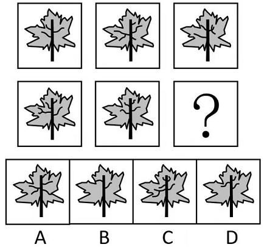
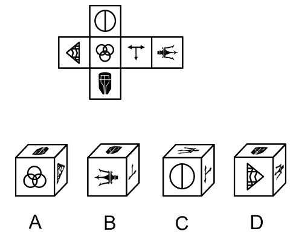
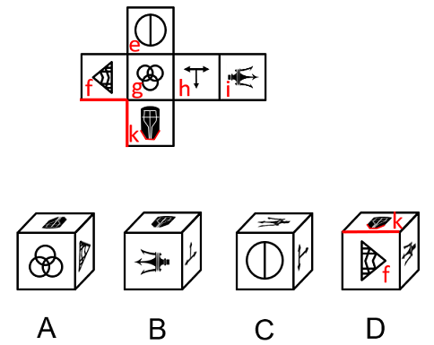
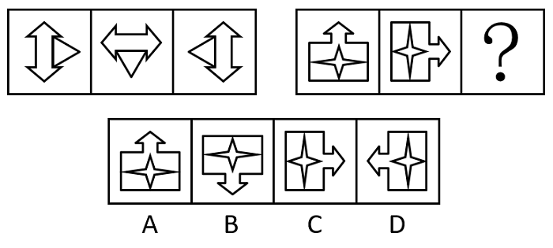
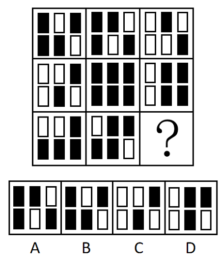
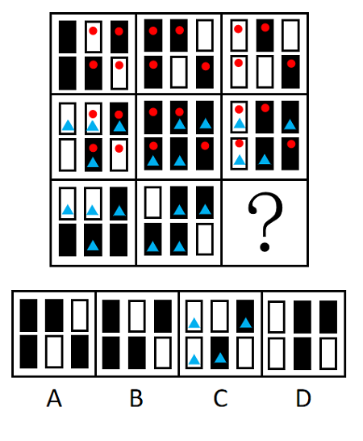
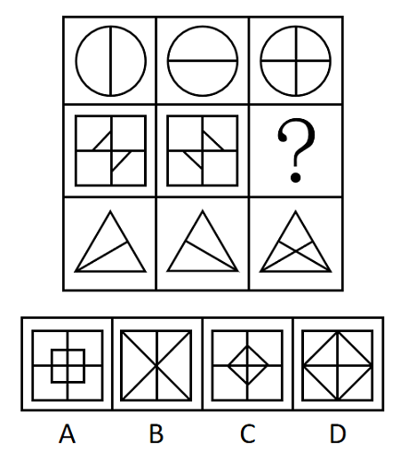

# 2023年内蒙古公务员录用考试《行测》题（网友回忆版）

> 判断推理 · 40 题 · 内蒙古 2023

## 第 1 题　qid 5510161 · 图形推理

从所给四个选项中，选择最合适的一个填入问号处，使之呈现一定的规律性：

- **A**. A
- **B**. B
- **C**. C
- **D**. D　✅

**答案**：D

**官方解析**

元素组成不同，且无明显属性规律，考虑数量规律。观察图形，题干每幅图的树叶和叶柄均相同，而内部叶柄上的线条数量不同，优先考虑叶柄上的线条数。第一行图形中，图1树叶中的叶柄上存在3根线条，图2树叶中的叶柄上存在5根线条，图3树叶中的叶柄上存在4根线条，第一行中三个图形树叶中的叶柄上共存在12根线条。第二行中，图1树叶中的叶柄上存在5根线条，图2树叶中的叶柄上存在4根线条。所以，“？”处图形叶柄上应存在12-5-4=3根线条，只有D项符合。
故正确答案为D。

---

## 第 2 题　qid 5509906 · 图形推理

从所给的四个选项中，选择最合适的一个填入问号处，使之呈现一定的规律性：

- **A**. A
- **B**. B
- **C**. C　✅
- **D**. D

**答案**：C

**官方解析**

元素组成相同，优先考虑位置规律。观察发现，每幅图形均有三个小元素，考虑分开看。其中沿着正方形外框每次逆时针平移一条边，到？处时应移动到上面那条边，排除B、D两项。和两个图形的相对位置交替出现，可利用时针法，从向画时针（如下图所示），依次是逆时针、顺时针、逆时针、顺时针，因此？处应该是逆时针，只有C项符合。

故正确答案为C。

---

## 第 3 题　qid 5510169 · 图形推理

左边给定的是纸盒外表面的展开图，下面哪一项不能由它折叠而成？请把它找出来。

- **A**. A
- **B**. B
- **C**. C
- **D**. D　✅

**答案**：D

**官方解析**

将原展开图标上序号如下图，逐一进行分析。

A项：选项由面f、面g和面k构成，选项与题干一致，排除；

B项：选项由面h、面i和面k构成，选项与题干一致，排除；

C项：选项由面e、面h和面i构成，选项与题干一致，排除；

D项：选项由面f、面i和面k构成，选项中面k中的盾牌尖角指向面f与面k的公共边，题干展开图中面k中的盾牌尖角未指向面f与面k的公共边，选项与题干不一致，当选。

本题为选非题，故正确答案为D。

---

## 第 4 题　qid 5509887 · 图形推理

从所给四个选项中，选择最合适的一个填入问号处，使之呈现一定的规律性：

- **A**. A
- **B**. B　✅
- **C**. C
- **D**. D

**答案**：B

**官方解析**

方法一：

元素组成不同，优先考虑属性规律。观察发现，将黑色长条从高到低进行标号，如下图所示：

在两个黑色长条②中间画一条线，左右呈现对称性；在两个黑色长条①中间画一条线，左右也呈现对称性，故“？”填入黑色长条后，应使左边8块黑色长条和右边8块黑色长条的左右两边分别呈现对称性，具体如下图：

故正确答案为B。

方法二：

元素组成不同，且无明显属性规律，考虑数量规律。观察发现，题干图形由多个高低不一的黑色长条组成，且每种长度的黑色长条都出现了两次。将黑色长条从高到低进行标号，如下图所示，“？”处的黑色长条应该分别与③④⑤⑧号黑色长条的长度相等。只有B项符合。 

故正确答案为B。

注：本题不管是看对称性还是不同长度方块出现的次数，都可以选到唯一答案B。大家主要学习解题思维即可，考场上根据图形特征优先想到哪个规律选哪个，无需纠结。

---

## 第 5 题　qid 5509864 · 图形推理

把下面的六个图形分为两类，使每一类图形都有各自的共同特征或规律，分类正确的一项是：

- **A**. ①②④，③⑤⑥
- **B**. ①③④，②⑤⑥　✅
- **C**. ①③⑤，②④⑥
- **D**. ①④⑥，②③⑤

**答案**：B

**官方解析**

思路一：元素组成不同，且无明显属性规律，考虑数量规律。观察发现，题干图形出现多个独立小元素，优先考虑元素的个数和种类，继续观察发现，题干每幅图形均出现一个外框，考虑内外分开看。其中，框外元素的数量依次为1、2、1、1、1、1，框内元素的数量依次为2、2、2、2、1、1，单独看数量无规律，但图①③④中，框内元素数-框外元素数=1，图②⑤⑥中，框内元素数=框外元素数。即图①③④一组，图②⑤⑥一组。
故正确答案为B。
思路二：元素组成不同，且无明显属性规律，考虑数量规律。观察发现，题干出现明显多边形，优先考虑直线数，继续观察发现，题干每幅图形均出现一个外框，考虑内外分开看。图①④⑥框外直线数为4，图②③⑤框外直线数为10。即图①④⑥一组，图②③⑤一组。
故正确答案为D。
注：观察图形规律时，应优先观察整体性规律，框外直线数只关注到图形中的局部，相比框外直线数的规律，考虑框内外元素数量间的运算更全面更严谨，故粉笔更倾向于思路一。

---

## 第 6 题　qid 5509866 · 图形推理

从所给的四个选项中，选择最合适的一个填入问号处，使之呈现一定的规律性：

- **A**. A
- **B**. B　✅
- **C**. C
- **D**. D

**答案**：B

**官方解析**

图形元素组成相同，优先考虑位置规律。观察发现，题干中第一组图的三幅图依次顺时针旋转；第二组图也按此规律进行旋转，所以问号处图形应为该组第二幅图顺时针旋转后所得，只有B项符合。

故正确答案为B。

---

## 第 7 题　qid 5509912 · 图形推理

从所给的四个选项中，选择最合适的一个填入问号处，使之呈现一定的规律性：

- **A**. A
- **B**. B
- **C**. C　✅
- **D**. D

**答案**：C

**官方解析**

观察发现，题干图形均出现黑块与白块，但数量、位置等均无规律，九宫格横行看无规律时，考虑纵向观察。将第一列的图1和图2相邻比较发现，两幅图中含有四个相同的图形和两个不同的图形（如下图标红处所示），将第一列的图2和图3相邻比较发现，两幅图中也含有四个相同的图形和两个不同的图形（如下图标蓝处所示）。在第二列进行验证，符合此规律。故？处图形应与第三列的图2含有四个相同的图形和两个不同的图形，只有C项符合。

故正确答案为C。

---

## 第 8 题　qid 5509911 · 图形推理

从所给的四个选项中，选择最合适的一个填入问号处，使之呈现一定的规律性：

- **A**. A
- **B**. B　✅
- **C**. C
- **D**. D

**答案**：B

**官方解析**

元素组成不同，且属性规律无唯一答案，考虑数量规律。观察发现，题干图形均有形状相同的元素，且每幅图形都有一组形状相同的元素。继续观察发现，题干相同形状的元素分别是八边形、七边形、六边形、五边形、？、三角形，因此？处图形相同形状的元素应为四边形，只有B项符合。
故正确答案为B。

---

## 第 9 题　qid 5510174 · 图形推理

从所给四个选项中选择最合适的一个填入问号处，使之呈现一定的规律性：

- **A**. A
- **B**. B
- **C**. C　✅
- **D**. D

**答案**：C

**官方解析**

图形元素组成相似，且相同线条重复出现，优先考虑样式规律中的加减同异。九宫格优先按行看，观察发现，第一行中的图1和图2相加得到图3，经验证第三行满足此规律；故第二行应用此规律，图1和图2相加，只有C项符合。
故正确答案为C。

---

## 第 10 题　qid 5509907 · 图形推理

把下面的六个图形分为两类，使每一类图形都有各自的共同特征或规律，分类正确的一项是：

- **A**. ①②⑥，③④⑤　✅
- **B**. ①③④，②⑤⑥
- **C**. ①③⑥，②④⑤
- **D**. ①④⑤，②③⑥

**答案**：A

**官方解析**

元素组成不同，且无明显属性规律，优先考虑数量规律。观察发现，题干汉字中横线出现较多，优先考虑横线数量。题干图形中横线数量分别为：4、4、6、6、6、4，因此图①②⑥为一组，图③④⑤为一组。
故正确答案为A。

---

## 第 11 题　qid 5509857 · 类比推理

寥寥无几：数不胜数

- **A**. 恒河沙数：一星半点
- **B**. 独一无二：所剩无几
- **C**. 荡然无存：不计其数
- **D**. 屈指可数：比比皆是　✅

**答案**：D

**官方解析**

第一步：判断题干词语间逻辑关系。
“寥寥无几”形容数量很少，没有几个；“数不胜数”形容数量极多，很难计算，二者是反义关系。
第二步：判断选项词语间逻辑关系。
A项：“恒河沙数”指像恒河里的沙粒一样，无法计算，形容数量很多；“一星半点”形容极少，二者是反义关系，与题干逻辑关系一致，保留；
B项：“独一无二”指没有相同的或没有可以相比的，形容十分稀少；“所剩无几”意思是剩下的没有多少了，二者不是反义关系，与题干逻辑关系不一致，排除；
C项：“荡然无存”形容原来有的东西全部消失，完全不复存在了；“不计其数”指没有办法计算它的数目，表示极多，二者不是反义关系，与题干逻辑关系不一致，排除；
D项：“屈指可数”形容数目很少；“比比皆是”指到处都是，形容很多，二者是反义关系，与题干逻辑关系一致，保留。
对比A、D两项，A项中第一个词形容数量多，第二个词形容数量少，而题干和D项中第一个词均形容数量少，第二个词均形容数量多，因此D项与题干逻辑关系更为一致，当选。
故正确答案为D。

---

## 第 12 题　qid 5510153 · 类比推理

奔：跑：快

- **A**. 崎：岖：路
- **B**. 飞：翔：高　✅
- **C**. 写：字：好
- **D**. 督：促：严

**答案**：B

**官方解析**

第一步：判断题干词语间逻辑关系。
奔指奔走、急跑；跑指两只脚或四条腿迅速前进，二者为近义关系。快是奔和跑的属性，与二者为属性对应关系。
第二步：判断选项词语间逻辑关系。
A项：崎和岖用来形容山路不平，二者为近义关系。崎和岖都是路的属性，与题干逻辑关系不一致，排除；
B项：飞指飞行；翔指像鸟飞一样，二者为近义关系。高是飞和翔的属性，与二者为属性对应关系，与题干逻辑关系一致，当选；
C项：写字构成动宾关系，与题干逻辑关系不一致，排除；
D项：督指察看；促指时间紧迫，二者不是近义关系，与题干逻辑关系不一致，排除。
故正确答案为B。

---

## 第 13 题　qid 5510122 · 类比推理

洗脸盆：代步车

- **A**. 招待所：降压药　✅
- **B**. 木版画：制冷剂
- **C**. 节能灯：传染病
- **D**. 计算器：液压机

**答案**：A

**官方解析**

第一步：判断题干词语间逻辑关系。
洗脸盆和代步车之间无直接逻辑关系，考虑拆分，两词均是从功能角度命名的。
第二步：判断选项词语间逻辑关系。
A项：招待所和降压药之间无直接逻辑关系，两词均是从功能角度命名的，与题干逻辑关系一致，当选；
B项：木版画和制冷剂之间无直接逻辑关系，制冷剂是从功能角度来命名的，但木版画是从材料角度来命名的，与题干逻辑关系不一致，排除；
C项：节能灯和传染病之间无明显逻辑关系，两词均是从属性角度来命名的，与题干逻辑关系不一致，排除；
D项：计算器和液压机之间无明显逻辑关系，计算器是从功能角度命名的，但液压机是从工作原理角度来命名的，与题干逻辑关系不一致，排除。
故正确答案为A。

---

## 第 14 题　qid 5510127 · 类比推理

全球：北半球：南半球

- **A**. 全身：躯干：四肢
- **B**. 全价：优惠价：打折价
- **C**. 全集：短篇：长篇
- **D**. 全程：上半程：下半程　✅

**答案**：D

**官方解析**

第一步：判断题干词语间逻辑关系。
北半球和南半球均为全球的组成部分，后两词为并列关系，且各占全球的一半。
第二步：判断选项词语间逻辑关系。
A项：躯干和四肢均为全身的组成部分，后两词为并列关系，但不是各占全身的一半，还有头颅，与题干逻辑关系不一致，排除；
B项：全价和优惠价是两种不同的价格，二者为并列关系，与题干逻辑关系不一致，排除；
C项：短篇和长篇不是全集的组成部分，与题干逻辑关系不一致，排除；
D项：上半程和下半程均为全程的组成部分，后两词为并列关系，且各占全程的一半，与题干逻辑关系一致，当选。
故正确答案为D。

---

## 第 15 题　qid 5509861 · 类比推理

草根：草：平民百姓

- **A**. 曙光：光：美好前景
- **B**. 鸿毛：雁：轻微的事物　✅
- **C**. 骨肉：人：紧密相连
- **D**. 水分：水：不真实成分

**答案**：B

**官方解析**

第一步：判断题干词语间逻辑关系。
草根是草的组成部分，二者为组成关系；草根一般指平民百姓，二者为比喻象征关系，且草根是一种具体的东西。
第二步：判断选项词语间逻辑关系。
A项：曙光指破晓时的阳光，是光的一种，二者为种属关系，与题干逻辑关系不一致，排除；
B项：鸿毛指鸿雁的毛，是雁的组成部分，二者为组成关系；鸿毛比喻极轻，微不足道的事物，与轻微的事物构成比喻象征关系，且鸿毛是一种具体的东西，与题干逻辑关系一致，当选；
C项：骨肉是人的组成部分，二者为组成关系；骨肉比喻父母、兄弟、子女等亲人，也比喻紧密相连、不可分割的关系，但骨与肉是两种东西，与题干逻辑关系不一致，排除；
D项：水分指物体内所含的水，是水的一种，二者为种属关系，与题干逻辑关系不一致，排除。
故正确答案为B。

---

## 第 16 题　qid 5509862 · 类比推理

钾盐：钾肥：氯化钾

- **A**. 磁铁矿：赤铁矿：铁元素　✅
- **B**. 砂石路：混凝土路：水泥
- **C**. 工程塑料：层压塑料：树脂
- **D**. 酒精：医用酒精：乙醇

**答案**：A

**官方解析**

第一步：判断题干词语间逻辑关系。
“氯化钾”是“钾盐”和“钾肥”的成分之一，前两词是并列关系，且第一词和第二词都与第三词构成组成关系。
第二步：判断选项词语间逻辑关系。
A项：“铁元素”是“磁铁矿”和“赤铁矿”的成分之一，前两词是并列关系，且第一词和第二词都与第三词构成组成关系，与题干逻辑关系一致，当选；
B项：“水泥”不是“砂石路”的成分，与题干逻辑关系不一致，排除；
C项：塑料按用途分类可分为通用、工程、特种三种类型，按成型方法可分为模压、层压、注射等多种类型，故有的工程塑料是层压塑料，有的工程塑料不是层压塑料，有的层压塑料是工程塑料，有的层压塑料不是工程塑料，前两词是交叉关系，与题干逻辑关系不一致，排除；
D项：“乙醇”俗称“酒精”，二者是全同关系，与题干逻辑关系不一致，排除。
故正确答案为A。

---

## 第 17 题　qid 5509865 · 类比推理

色厉内荏 对于 （    ） 相当于 （    ） 对于 重整旗鼓

- **A**. 外刚内柔；另起炉灶
- **B**. 表里如一；背水一战
- **C**. 心慈手软；一蹶不振
- **D**. 外强中干；东山再起　✅

**答案**：D

**官方解析**

逐一代入选项。
A项：色厉内荏意思是外表强硬而内心怯懦，外刚内柔指的是表面刚强，内心柔弱，二者没有明显逻辑关系；另起炉灶比喻重新做起，重整旗鼓指的是失败之后，重新集合力量再干，二者是近义关系，前后逻辑关系不一致，排除；
B项：色厉内荏意思是外表强硬而内心怯懦，表里如一指思想和言行完全一致，二者没有明显逻辑关系；背水一战指在不利情况下和敌人做最后决战，比喻面临绝境，为求得出路而做最后一次努力，重整旗鼓指的是失败之后，重新集合力量再干，二者没有明显逻辑关系，前后逻辑关系不一致，排除；
C项：色厉内荏意思是外表强硬而内心怯懦，心慈手软意思是心地善良，不忍下手（惩治），二者没有明显逻辑关系；一蹶不振比喻一遭到挫折就不能再振作起来，重整旗鼓指的是失败之后，重新集合力量再干，二者是反义关系，前后逻辑关系不一致，排除；
D项：色厉内荏意思是外表强硬而内心怯懦，外强中干指外表上好像很强大，实际上很空虚，二者是近义关系；东山再起指再度出任要职，也比喻失势之后重新恢复地位，重整旗鼓指的是失败之后，重新集合力量再干，二者是近义关系，前后逻辑关系一致，当选。
故正确答案为D。

---

## 第 18 题　qid 5509860 · 类比推理

（    ） 对于 妙手回春 相当于 军人 对于 （    ）

- **A**. 华佗再世；军官
- **B**. 悬壶济世；百姓
- **C**. 医生；戎马倥偬　✅
- **D**. 大夫；视死如归

**答案**：C

**官方解析**

逐一代入选项。
A项：华佗再世指医术就像华佗一样高明，形容医术高超，妙手回春指称赞医生医道高明，能把垂危的病人治愈，二者是近义关系；军官是军人，二者是种属关系，前后逻辑关系不一致，排除；
B项：悬壶济世指颂誉医者救人于病痛，妙手回春指称赞医生医道高明，能把垂危的病人治愈，二者是近义关系；百姓是指军人和官员以外的人，二者不是近义关系，前后逻辑关系不一致，排除；
C项：妙手回春指称赞医生医道高明，能把垂危的病人治愈，可以用来形容医生，二者是偏正关系；戎马倥偬形容军务繁忙，可以来形容军人，二者是偏正关系，前后逻辑关系一致，保留；
D项：妙手回春指称赞医生医道高明，能把垂危的病人治愈，可以用来形容医生，而大夫就是医生，二者是偏正关系；视死如归形容为了正义的事业，不怕死，视死如归可以用来形容军人，二者是偏正关系，前后逻辑关系一致，保留。
对比C项和D项，C项中妙手回春只能用来形容医生，戎马倥偬只能用来形容军人，但D项中妙手回春只能用来形容大夫，视死如归并不是只能用来形容军人，C项前后逻辑关系更为一致，当选。
故正确答案为C。

---

## 第 19 题　qid 5509867 · 类比推理

起重机 对于 （    ） 相当于 （    ） 对于 平整土地

- **A**. 吊车；播撒种子
- **B**. 搬运重物；旋耕机　✅
- **C**. 挖掘机；拖拉机
- **D**. 工程机械；农业活动

**答案**：B

**官方解析**

逐一代入选项。
A项：“起重机”的通称为“吊车”，二者为全同关系；先“平整土地”，再“播撒种子”，二者为动作先后对应，前后逻辑关系不一致，排除；
B项：“起重机”有“搬运重物”的功能，二者为功能对应关系；“旋耕机”有“平整土地”的功能，二者为功能对应关系，前后逻辑关系一致，当选；
C项：“起重机”与“挖掘机”是不同的机械，二者为并列关系；“拖拉机”是“平整土地”时用到的设备，前后逻辑关系不一致，排除；
D项：“起重机”是“工程机械”，二者为种属关系；“平整土地”是“农业活动”，二者为种属关系，但前后词语顺序不一致，前后逻辑关系不一致，排除。
故正确答案为B。

---

## 第 20 题　qid 5510134 · 类比推理

臭氧 对于 （    ） 相当于 （    ） 对于 万花筒

- **A**. 
；望远镜

- **B**. 
吸收紫外线；光的反射

- **C**. 
大气；三棱镜
　✅
- **D**. 
二氧化碳；光学玩具

**答案**：C

**官方解析**

逐一代入选项。

A项：臭氧化学式为，二者为全同关系；望远镜和万花筒是两种不同的光学器具，二者为并列关系，前后逻辑关系不一致，排除；

B项：臭氧有吸收紫外线的作用，二者为功能对应关系；万花筒的原理在于光的反射，二者为原理对应关系，前后逻辑关系不一致，排除；

C项：臭氧是大气的组成成分，二者为组成关系；万花筒中间放置了三棱镜，二者为组成关系，前后逻辑关系一致，当选；

D项：臭氧和二氧化碳是两种不同的气体，二者为并列关系；万花筒属于光学玩具，二者为种属关系，前后逻辑关系不一致，排除。

故正确答案为C。

---

## 第 21 题　qid 5509869 · 定义判断

价值工程是指通过对设施、产品、服务或流程等进行功能和全寿命成本分析，谋求创新改进方案，以提高项目或产品价值为目的的方法。价值工程的公式为：价值=功能/成本。
根据上述定义，下列做法能够达到价值工程要求的有：
①某建筑防水施工项目使用一种新型防水卷材，在成本、防水效果不变的情况下，既降低了施工难度，又具备了耐高温功能
②某洗发水生产企业在产品物流环节加强管理，使企业的经营成本有所下降
③某日用塑料制品生产企业改进了生产工艺，虽然塑料制品的抗压能力有所下降，但成本大幅度降低
④某款手机游戏将原来的固定场景改进为玩家可根据个性化需求自行设计，虽然游戏开发成本略有提高，但游戏的可玩性大幅增加

- **A**. 1项
- **B**. 2项
- **C**. 3项
- **D**. 4项　✅

**答案**：D

**官方解析**

第一步：找出定义关键词。
“通过对设施、产品、服务或流程等进行功能和全寿命成本分析”、“谋求创新改进方案”、“提高项目或产品价值”、“价值=功能/成本”。
第二步：逐一判断例证。
①使用新型防水卷材，符合“谋求创新改进方案”，在成本、防水效果不变的情况下，具备了耐高温功能，结合公式“价值=功能/成本”可知，提高了产品的价值，符合“提高项目或产品价值”，符合定义；
②企业在产品物流环节加强管理，属于在某一个环节“谋求创新改进方案”，使经营成本有所下降，结合公式“价值=功能/成本”可知，在功能不变的情况下，降低成本，可以提高产品的价值，符合“提高项目或产品价值”，符合定义；
③企业改进了生产工艺，符合“谋求创新改进方案”，虽然抗压能力有所下降，但是成本大幅度降低，说明成本下降的幅度比较大，抗压能力下降的幅度比较小，结合公式“价值=功能/成本”可知，提高了产品的价值，符合“提高项目或产品价值”，符合定义；
④将固定场景改为玩家可根据个性化需求自行设计，符合“谋求改进创新方案”，虽然开发成本略有提升，但是可玩性大幅增加，说明开发成本提升的幅度比较小，可玩性功能提升的幅度比较大，结合公式“价值=功能/成本”可知，能够提高产品的价值，符合“提高项目或产品价值”，符合定义。
综上，能够达到价值工程要求的有4项。
故正确答案为D。

---

## 第 22 题　qid 5509871 · 定义判断

海洋地球物理调查是指利用各种物理学方法和仪器，测量海底地球物理的性质及其变化特征，从而得出海底地质构造或矿产分布的调查方法。
根据上述定义，下列属于海洋地球物理调查的是：

- **A**. 将重力仪安放在船上进行观测，以确定海底地壳各种岩层质量分布的不均匀性　✅
- **B**. 用深海钻探法从海底采集富钴结壳矿样品，分析其中锰、铁氧化物成分及氧化程度
- **C**. 用硝酸银滴定氯化物的方法检测海底沉积物的成分，以确定海底矿产资源的情况
- **D**. 用抛弃式探温仪测定海水温度，计算出海洋平均温度，分析近60年来海洋变暖速率

**答案**：A

**官方解析**

第一步：找出定义关键词。
“利用物理学方法和仪器”、“测量海底地球物理的性质及其变化特征”、“得出海底地质构造或矿产分布”。
第二步：逐一分析选项。
A项：该项利用重力仪进行观测，符合“利用物理学方法和仪器”，观测目的是确定海底地壳各种岩层质量分布的情况，符合“测量海底地球物理的性质及其变化特征”、“得出海底地质构造或矿产分布”，符合定义，当选；
B项：该项先使用深海钻探法采集样品，再对样品进行分析，但没有体现分析过程，不明确是否符合“利用物理学方法和仪器”，分析矿样品中锰、铁氧化物成分及氧化程度，且其中“氧化程度”属于化学变化的结果，不符合“测量海底地球物理的性质及其变化特征”，也无法得知“海底矿产分布”，不符合定义，排除；
C项：该项利用硝酸银滴定氯化物的方法进行检测，具体就是根据氯化物和硝酸银发生化学反应后的结果进行检测，该方法为“化学方法”，不符合“利用物理学方法和仪器”，不符合定义，排除；
D项：该项用抛弃式探温仪进行测量，符合“利用物理学方法和仪器”，测量目的是计算出海洋平均温度，进而分析海洋变暖速率，不符合“测量海底地球物理的性质及其变化特征”、“得出海底地质构造或矿产分布”，不符合定义，排除。
故正确答案为A。

---

## 第 23 题　qid 5509874 · 定义判断

生物刺激是通过采用可促进微生物繁殖与生长的手段，来增加本土微生物活动从而增强土壤对污染物降解能力的一种技术。生物强化是应用一种有高效降解能力的菌株或者由几种菌株组成的有降解能力的微生物组群来增强土壤污染物降解能力的技术。
根据上述定义，下列属于生物刺激的是：

- **A**. 采用通气法改善被石油污染土壤的通气情况，可促进石油中分子量较小的成分挥发，使分子量较大的片段断裂而被土壤中的微生物降解
- **B**. 将玉米棒碎片添加到被多环芳烃污染的土壤中，能够促进土壤中可以降解芳香烃的微生物的生长，使多环芳烃的降解率提高　✅
- **C**. 在被石油污染的土壤中引入白腐菌，其与本土微生物可联合发挥作用，降解多种石油烃成分，降解率可达到60.5%
- **D**. 从被石油污染的土壤中分离出具有石油降解能力的本土微生物，达到一定数量后将其重新投入到被石油污染的土壤中，以增强土壤的降解能力

**答案**：B

**官方解析**

第一步：找出定义关键词。
生物刺激：“通过采用可促进微生物繁殖与生长的手段”、“增加本土微生物活动从而增强土壤对污染物降解能力”；
生物强化：“应用一种有高效降解能力的菌株或者由几种菌株组成的有降解能力的微生物组群来增强土壤污染物降解能力的技术”。
第二步：逐一分析选项。
A项：利用通气法可促进石油中分子量较小的成分挥发，使分子量较大的片段断裂而被土壤中的微生物降解，并没有增加本土微生物活动，不符合“增加本土微生物活动从而增强土壤对污染物降解能力”，不符合“生物刺激”定义，排除；
B项：将玉米棒碎片添加到被多环芳烃污染的土壤中，能够促进土壤中可以降解芳香烃的微生物的生长，说明通过采用促进微生物繁殖与生长的手段来增加本土微生物活动，而“使多环芳烃的降解率提高”，说明最终增强了土壤对污染物的降解能力，符合“生物刺激”定义，当选；
C项：在被石油污染的土壤中引入白腐菌，其与本土微生物可联合发挥作用，符合“应用一种有高效降解能力的菌株或者由几种菌株组成的有降解能力的微生物组群”，符合“生物强化”定义，不符合“生物刺激”定义，排除；
D项：从被石油污染的土壤中分离出具有石油降解能力的本土微生物，是分离提取本土微生物，未提及促进微生物繁殖与生长的手段，不符合“通过采用可促进微生物繁殖与生长的手段”，不符合“生物刺激”定义，排除。
故正确答案为B。

---

## 第 24 题　qid 5510139 · 定义判断

探索性学习是指突破现有规范、标准及惯例，不断搜寻、试验和创造全新知识的学习模式。挖掘性学习是指基于对现有技术、能力和范式的提炼和深化来进行学习的模式。
根据上述定义，下列最适宜描述探索性学习的一组词是：

- **A**. 筛选、尝试
- **B**. 风险、延伸
- **C**. 发现、创新　✅
- **D**. 变化、选择

**答案**：C

**官方解析**

第一步：找出定义关键词。
探索性学习：“突破现有规范、标准及惯例”、“不断搜寻、试验和创造全新知识的学习模式”；
挖掘性学习：“基于对现有技术、能力和范式的提炼和深化来进行学习的模式”。
第二步：逐一分析选项。
A项：筛选泛指通过淘汰的方法挑选，不符合“突破现有规范、标准及惯例”、“不断搜寻、试验和创造全新知识的学习模式”，不符合“探索性学习”的定义，排除；
B项：延伸指延长、伸展，不符合“突破现有规范、标准及惯例”、“不断搜寻、试验和创造全新知识的学习模式”，不符合“探索性学习”的定义，排除；
C项：发现和创新，符合“突破现有规范、标准及惯例”、“不断搜寻、试验和创造全新知识的学习模式”，符合“探索性学习”的定义，当选；
D项：选择，不符合“突破现有规范、标准及惯例”、“不断搜寻、试验和创造全新知识的学习模式”，不符合“探索性学习”的定义，排除。
故正确答案为C。

---

## 第 25 题　qid 5509859 · 定义判断

不确定型决策是指决策者在可能出现不同的客观状态，且每种客观状态的发生概率于他而言为未知的条件下做出的决策。风险型决策是指决策者面临可能出现的两种或两种以上的自然状态，每种状态发生的概率于他而言为已知的条件下做出的决策。
根据上述定义，下列属于不确定型决策的是：

- **A**. 有甲乙两类盲盒，甲类盲盒三个，乙类盲盒一个，从中任取一盒，猜其是哪类盲盒。猜其是甲类的正确率是75%，猜其是乙类的正确率是25%，因而决定猜其是甲类
- **B**. 小孙是炒股新手，决定将一笔钱投入到股市中，但是并不确定应该购买哪支股票。后来他听说近期医药板块的股票行情好，于是购买了几支医药板块龙头企业的股票　✅
- **C**. 小张到超市购买大米，发现该超市只售卖一种品牌的大米，尽管他并不知道这个品牌的大米口感如何，但因家里急用，他仍然决定购买该品牌的大米
- **D**. 小新在考试时遇到一道难题，题目有A、B、C、D四个选项，他完全不知道应该选择哪一个，他认为答案是“C”的概率比较高，于是他选择了“C”

**答案**：B

**官方解析**

第一步：找出定义关键词。
不确定型决策：“可能出现不同的客观状态”、“每种客观状态的发生概率未知”；
风险型决策：“可能出现两种或两种以上的自然状态”、“每种状态发生的概率已知”。
第二步：逐一分析选项。
A项：猜盲盒时有甲乙两类盲盒，符合“可能出现两种或两种以上的自然状态”，猜甲类的正确率是75%，乙类的正确率是25%，符合“每种状态发生的概率已知”，符合“风险型决策”定义，不符合“不确定型决策”定义，排除；
B项：小孙将一笔钱投入到股市中，不确定应该购买哪支股票，符合“可能出现不同的客观状态”，购买股票后涨跌未知，符合“每种客观状态的发生概率未知”，符合“不确定型决策”定义，当选；
C项：小张到超市购买大米，该超市只售卖一种品牌的大米，对小张而言没有其他选择，不符合“可能出现不同的客观状态”，不符合“不确定型决策”定义，排除；
D项：小新在考试时遇到一道难题，题目有A、B、C、D四个选项，符合“可能出现两种或两种以上的自然状态”，选每个选项的正确率都是25%，符合“每种状态发生的概率已知”，符合“风险型决策”定义，不符合“不确定型决策”定义，排除。
故正确答案为B。

---

## 第 26 题　qid 5510136 · 定义判断

离合词是指合起来表示一个词，中间插入其他成分后可扩展为短语的双音合成词。例如“洗澡-洗个热水澡”。
根据上述定义，下列不属于离合词的是：

- **A**. 睡觉
- **B**. 鞠躬
- **C**. 得罪　✅
- **D**. 唱歌

**答案**：C

**官方解析**

第一步：找出定义关键词。
“合起来表示一个词”、“中间插入其他成分后可扩展为短语”。
第二步：逐一分析选项。
A项：词语“睡觉”的中间可插入其他成分扩展为短语，如“睡个好觉”，符合定义，排除；
B项：词语“鞠躬”的中间可插入其他成分扩展为短语，如“鞠了一个躬”，符合定义，排除；
C项：词语“得罪”的中间无法插入其他成分，不符合“中间插入其他成分后可扩展为短语”，不符合定义，当选；
D项：词语“唱歌”的中间可插入其他成分扩展为短语，如“唱了一首歌”，符合定义，排除。
本题为选非题，故正确答案为C。

---

## 第 27 题　qid 5509872 · 定义判断

同抗素是一种生物释放的化学物质，这种物质对释放者和接受者均有不利反应。
根据上述定义，下列情形中体现了同抗素影响的是：

- **A**. 丁香假单胞菌在侵染植物的过程中会释放冠菌素，高浓度的冠菌素可以破坏植物叶片的先天性免疫机能
- **B**. 鸡的尾脂腺会分泌醇、烷烃和烯烃，这些物质可以吸引鸡皮刺螨寄生到鸡身上，鸡被寄生后会诱发炎症
- **C**. 病毒是一种微生物，有些病毒会在寄主体内释放毒素杀死寄主，但是一旦寄主死亡，病毒也会随即灭亡　✅
- **D**. 玉米会产生一种酶，这种酶会破坏啃食玉米的毛虫的肠道，让细菌可以轻易入侵到毛虫的肠道，从而将其杀死

**答案**：C

**官方解析**

第一步：找出定义关键词。
“生物释放的化学物质”、“对释放者和接受者均有不利反应”。
第二步：逐一分析选项。
A项：丁香假单胞菌在侵染植物的过程中会释放冠菌素，高浓度的冠菌素可以破坏植物叶片的先天性免疫机能。只能说明丁香假单胞菌释放的冠菌素对植物不利，不符合“对释放者和接受者均有不利反应”，不符合定义，排除；
B项：鸡的尾脂腺会分泌醇、烷烃和烯烃，这些物质可以吸引鸡皮刺螨寄生到鸡身上，鸡被寄生后会诱发炎症。只能说明鸡分泌的醇、烷烃和烯烃最终对鸡自身不利，不符合“对释放者和接受者均有不利反应”，不符合定义，排除；
C项：病毒是一种微生物，有些病毒会在寄主体内释放毒素杀死寄主，但是一旦寄主死亡，病毒也会随即灭亡。病毒在寄主体内释放毒素，杀死寄主，病毒也随之死亡，即对于病毒和寄主均不利，符合“生物释放的化学物质”、“对释放者和接受者均有不利反应”，符合定义，当选；
D项：玉米会产生一种酶，这种酶会破坏啃食玉米的毛虫的肠道，让细菌可以轻易入侵到毛虫的肠道，从而将其杀死。只能说明玉米产生的酶对毛虫不利，不符合“对释放者和接受者均有不利反应”，不符合定义，排除。
故正确答案为C。

---

## 第 28 题　qid 5509868 · 定义判断

法律事件是指由法律规范规定的，不以当事人的意志为转移而引起法律关系形成，变更或消灭的客观事实。法律行为是指行为人所实施的，能够发生法律效力，产生一定法律效果的行为。有这样一种情形：王某与张某签订加工承揽合同，合同约定王某在一个月内为张某加工某种石料，在遇有自然灾害等不可抗力的情形下，王某可延期交付。合同签订后第二天，当地即发生洪涝灾害，但王某仍如期完成，并将石料交付给张某。
根据上述定义，下列属于法律事件的是：

- **A**. 王某和张某签订合同
- **B**. 当地发生洪涝灾害　✅
- **C**. 王某如期完成加工
- **D**. 王某将石料交付给张某

**答案**：B

**官方解析**

第一步：找出定义关键词。
法律事件：“不以当事人的意志为转移而引起法律关系形成，变更或消灭的客观事实”；
法律行为：“行为人所实施的，能够发生法律效力，产生一定法律效果的行为”。
第二步：逐一分析选项。
A项：王某与张某签订合同的行为能够产生法律效力和一定法律效果，符合“行为人所实施的，能够发生法律效力，产生一定法律效果的行为”，符合法律行为定义，不符合法律事件定义，排除；
B项：洪涝灾害属于自然灾害，洪涝是不会以任何人的意志为转移的客观事实，且这一事实符合二人签订合同中的不可抗力情形，王某可因此情形而延期交付，即变更合同约定的交付时间，符合“不以当事人的意志为转移而引起法律关系形成，变更或消灭的客观事实”，符合法律事件定义，当选；
C项：王某如期完成加工的行为能够产生法律效力和一定法律效果，符合“行为人所实施的，能够发生法律效力，产生一定法律效果的行为”，符合法律行为定义，不符合法律事件定义，排除；
D项：王某交付石料的行为能够产生法律效力和一定法律效果，符合“行为人所实施的，能够发生法律效力，产生一定法律效果的行为”，符合法律行为定义，不符合法律事件定义，排除。
故正确答案为B。

---

## 第 29 题　qid 5509876 · 逻辑判断

研究人员基于生物库大样本队列，采用生物电阻抗测量脂肪含量，分析其与死亡风险的关系，结果显示脂肪含量过少与死亡风险增高存在关联。研究人员认为，脂肪含量过少的人，死亡风险会增高。
以下哪项如果为真，最能削弱上述结论？

- **A**. 在生活方式不健康的人群中，脂肪含量过多或过少均会增加死亡风险
- **B**. 脂肪含量过多给人带来的死亡风险，高于脂肪含量过少带来的死亡风险
- **C**. 脂肪含量过少和死亡风险高都是由疾病带来的，疾病是二者的共同原因　✅
- **D**. 低脂肪的饮食可以改善血脂的代谢、降低胆固醇、降低低密度脂蛋白的水平

**答案**：C

**官方解析**

第一步：找出论点和论据。
论点：脂肪含量过少的人，死亡风险会增高。
论据：脂肪含量过少与死亡风险增高存在关联。
本题论点和论据都在讨论脂肪含量过少和死亡风险增高的关系，二者话题一致，可以考虑削弱论点。
第二步：逐一分析选项。
A项：该项说的是在生活方式不健康的人群中，脂肪含量过多或过少均会增加死亡风险，也就是说确实有一部分脂肪含量过少的人，死亡风险增高了，有举例支持的意思，无法削弱，排除；
B项：该项说的是脂肪含量过多带来的死亡风险高于脂肪含量过少带来的死亡风险，意在进行脂肪含量多少对于死亡风险比较，而论点讨论的是脂肪含量过少会不会增高死亡风险，话题不一致，无法削弱，排除；
C项：该项说的是疾病同时导致了脂肪含量过少和死亡风险高，也就是说脂肪含量过少和死亡风险高之间不存在因果关系，而论点说的是脂肪含量过少导致死亡风险增高，直接削弱论点，当选；
D项：该项说的是低脂肪饮食带来的好处，而论点讨论的是脂肪含量过少和死亡风险增高的关系，话题不一致，无法削弱，排除。
故正确答案为C。

---

## 第 30 题　qid 5509873 · 逻辑判断

混合动力电动汽车拥有两种不同动力源，这两种动力源在汽车不同的行驶状态下分别或者同时工作，通过这种组合达到最少的燃油消耗和尾气排放状态。目前市场上的混合动力电动汽车有两种主流车型，一种是普通混合动力（简称HEV），一种是插电式混合动力（简称PHEV）。前者不需要外接电源，操作更便捷；后者纯电行驶续航能力更强。近年来的销售数据显示，HEV汽车的销量总体高于PHEV，可见，消费者更愿意购买操作更便捷的混合动力电动汽车。
以下哪项如果为真，最能削弱上述结论？

- **A**. PHEV车型能够实现零排放行驶，很多注重环保的人都愿意购买这种车型
- **B**. 虽然HEV车型减少了对化石燃料的需求，但是它并不属于新能源汽车
- **C**. 与PHEV车型相比，HEV车型通常来说制造成本更低，因此售价更便宜　✅
- **D**. 无论是HEV还是PHEV车型，都具有噪声小、驾驶舒适性强的优点

**答案**：C

**官方解析**

第一步：找出论点和论据。
论点：消费者更愿意购买操作更便捷的混合动力电动汽车。
论据：HEV不需要外接电源，操作更便捷；PHEV纯电行驶续航能力更强。近年来的销售数据显示，HEV汽车的销量总体高于PHEV。
论点和论据都在讨论操作便捷的混合动力电动汽车销量更高，二者话题一致，削弱优先考虑削弱论点。且论点可理解为消费者因为操作更便捷而更愿意购买，隐含因果关系，还可以考虑他因削弱。
第二步：逐一分析选项。
A项：选项说的是很多注重环保的人都愿意购买PHEV车型，这部分人群的数量并不确定，因此无法明确两种车型购买数量的多少，无法削弱，排除；
B项：选项说的是HEV车型并不属于新能源汽车，与消费者是否更愿意购买操作更便捷的混合动力电动汽车无关，无法削弱，排除；
C项：选项说的是HEV车型的售价更便宜，说明消费者更愿意购买HEV车型不一定是操作更便捷导致的，也有可能是价格更低导致的，他因削弱，当选；
D项：选项说的是HEV和PHEV车型都具有噪声小、驾驶舒适性强的优点，说明两车型在噪音、驾驶舒适性角度不存在差异，排除了其他影响销量的因素，为加强项，无法削弱，排除。
故正确答案为C。

---

## 第 31 题　qid 5510157 · 逻辑判断

随着网络文学的兴盛，近年来传统文学开始主动汲取网络文学叙事资源，出现了小说叙事上的文类融合现象。传统文学之所以进行自我革新，其原因在于传统文学寻求自身的突破。可见，直面全新的社会现实，表现新时代的精神是传统文学自我革新的根本原因。
上述论证的成立需要补充以下哪项作为前提？

- **A**. 传统文学借鉴网络文学叙事资源，强调现实感和可读性，会获得更多的读者
- **B**. 一直以来，传统文学都将直面社会现实，表现时代精神作为自身努力的方向
- **C**. 传统文学的市场空间不断被网络文学所挤压，使得传统文学寻求自身的突破
- **D**. 直面全新的社会现实，表现新时代的精神使得传统文学不断寻求自身的突破　✅

**答案**：D

**官方解析**

第一步：找出论点和论据。
论点：直面全新的社会现实，表现新时代的精神是传统文学自我革新的根本原因。
论据：传统文学之所以进行自我革新，其原因在于传统文学寻求自身的突破。
本题论点讨论的是传统文学自我革新的原因是“直面全新的社会现实，表现新时代的精神”，论据讨论的是传统文学自我革新的原因是“寻求自身的突破”，话题不一致，加强优先考虑搭桥，即建立“直面全新的社会现实，表现新时代的精神”与“寻求自身的突破”之间的联系。
第二步：逐一分析选项。
A项：该项说的是传统文学借鉴网络文学的好处，论点说的是传统文学自我革新的根本原因，话题不一致，无法加强，排除；
B项：该项说的是传统文学的努力方向，论点说的是传统文学自我革新的根本原因，话题不一致，无法加强，排除；
C项：该项说的是传统文学寻求自身突破的原因，论点说的是传统文学自我革新的根本原因，话题不一致，无法加强，排除；
D项：该项说的是直面全新的社会现实，表现新时代的精神使得传统文学不断寻求自身的突破，搭桥项，可以加强，当选。
故正确答案为D。

---

## 第 32 题　qid 5509878 · 逻辑判断

近期的一项研究从机理上揭示了经常喝咖啡对大脑内在功能网络的影响。在实验中，研究人员将受试者分为经常喝咖啡、偶尔喝咖啡和不喝咖啡三组，然后利用功能磁共振成像技术，比较了经常喝咖啡的人和不喝咖啡的人在休息时、工作时、喝咖啡不久后的大脑连接和结构。研究人员发现，经常喝咖啡的人小脑和皮层下区域的动态活动增加，这与提高注意力、警觉以及增强学习和记忆的效果相一致。研究人员认为，与不喝咖啡相比，经常喝咖啡有利于学习和记忆。
以下哪项如果为真，最能支持上述结论？

- **A**. 咖啡中含有咖啡因、单宁酸、油和氮化合物等100多种物质，经常饮用咖啡有助于缓解大脑疲劳
- **B**. 与不喝咖啡的受试者相比，经常喝咖啡的受试者小脑和丘脑之间的连接模式表现出更高的效率　✅
- **C**. 研究证实，咖啡容易通过血脑屏障，刺激中枢神经，经常喝咖啡对于抑制焦虑有很好的作用
- **D**. 上述改变不仅出现在那些经常喝咖啡的受试者身上，偶尔喝咖啡的受试者也表现出了这种特征

**答案**：B

**官方解析**

第一步：找出论点和论据。
论点：与不喝咖啡相比，经常喝咖啡有利于学习和记忆。
论据：在实验中，研究人员将受试者分为经常喝咖啡、偶尔喝咖啡和不喝咖啡三组，然后利用功能磁共振成像技术，比较了经常喝咖啡的人和不喝咖啡的人在休息时、工作时、喝咖啡不久后的大脑连接和结构。研究人员发现，经常喝咖啡的人小脑和皮层下区域的动态活动增加，这与提高注意力、警觉以及增强学习和记忆的效果相一致。
论据讨论的是“经常喝咖啡的人脑部动态活动增加，与增强学习和记忆的效果相一致”，论点说的是“经常喝咖啡有利于学习和记忆”，从论据可以合理推出论点，故论据和论点话题一致，加强优先考虑补充论据。
第二步：逐一分析选项。
A项：该项说明经常喝咖啡有助于“缓解大脑疲劳”，而论点说的是经常喝咖啡有利于“学习和记忆”，话题不一致，无法加强，排除；
B项：该项说明经常喝咖啡的受试者小脑和丘脑之间的连接模式表现出更高的效率，而论据说明经常喝咖啡的人小脑和皮层下区域的动态活动增加，与提高注意力、警觉以及增强学习和记忆的效果相一致，意味着经常喝咖啡确实能够让大脑更高效，有利于学习和记忆，补充论据，可以加强，当选；
C项：该项说明经常喝咖啡可以“抑制焦虑”，而论点说的是经常喝咖啡有利于“学习和记忆”，话题不一致，无法加强，排除；
D项：该项说明“偶尔喝咖啡的受试者”也有上述改变，而论点说的是“经常喝咖啡”，主体不一致，无法加强，排除。
故正确答案为B。

---

## 第 33 题　qid 5510186 · 逻辑判断

X病毒是一种可以造成人体呼吸道感染的致病性病毒。研究发现，该病毒对酒精较为敏感。只需要29.3%浓度的酒精溶液就可以使该病毒的感染性滴度降低99%，36.2%浓度的酒精溶液就可以使其感染性滴度降低99.99%。这就意味着，酒精浓度只要达到36%以上就可以在30秒内灭活该病毒，而高度白酒完全可以达到这种酒精浓度。有人因此认为，喝高度白酒可以起到预防X病毒感染的作用。
以下除哪项外，均能削弱上述结论（    ）。

- **A**. X病毒主要通过呼吸道飞沫直接进入鼻腔造成呼吸道感染
- **B**. 喝白酒只能非常小程度地减少经由口腔进入呼吸道造成感染的风险　✅
- **C**. 手接触被X病毒污染的物体表面，污染的手再接触鼻、眼也会导致感染
- **D**. 喝酒会降低人体免疫力，从而增加被任何病毒感染的可能

**答案**：B

**官方解析**

第一步：找出论点和论据。
论点：喝高度白酒可以起到预防X病毒感染的作用。
论据：酒精浓度只要达到36%以上就可以在30秒内灭活X病毒，而高度白酒完全可以达到这种酒精浓度。
本题论点论据都在讨论高度白酒可以消灭X病毒，话题一致，且本题为选非题，排除能削弱的选项即可。
第二步：逐一分析选项。
A项：该项说的是X病毒主要通过飞沫进入鼻腔感染，说明喝高度白酒无法起到预防X病毒感染的作用，因为还有其他的传播途径，削弱论点，可以削弱，排除；
B项：该项说的是喝白酒可以非常小程度地减少病毒由口腔造成的感染，说明喝白酒确实有预防病毒的作用，只是作用非常小，相比其他选项来说，削弱力度最弱，当选；
C项：该项说的是手接触X病毒后接触鼻、眼也会导致感染，说明喝高度白酒无法起到预防X病毒的作用，因为还有其他的传播途径，削弱论点，可以削弱，排除；
D项：该项说的是喝酒会增加人体被任何病毒感染的可能，说明喝酒会增加被X病毒感染的可能，无法起到预防X病毒的作用，削弱论点，可以削弱，排除。
本题为选非题，故正确答案为B。

---

## 第 34 题　qid 5509856 · 逻辑判断

某高校为加强对学生综合素质的培养，增设创新学分。学生参加社会服务表现积极和参与学术活动均可以获得创新学分。机电工程专业的学生都参与了学术活动。大多数机电工程专业的学生参加社会服务的时间都超过了80小时，其余学生参加社会服务的时间均不足60小时。参加社会服务时间达到60小时以上被认为表现积极，同时还可以获得优秀社会实践奖。
由此可以推出：

- **A**. 所有参与学术活动的机电工程专业学生都参加了社会服务
- **B**. 与其他专业的学生相比，获得创新学分的机电工程专业的学生更多
- **C**. 有些获得优秀社会实践奖的机电工程专业学生获得了创新学分　✅
- **D**. 除参加社会服务时间达到60小时以上外，没有其他途径可以获得优秀社会实践奖

**答案**：C

**官方解析**

第一步：翻译题干。

①学生参加社会服务表现积极获得创新学分

②参与学术活动获得创新学分

③机电工程专业的学生参与学术活动

④有的机电工程专业的学生参加社会服务的时间超过80小时，有的参加社会服务的时间不足60小时

⑤参加社会服务时间达到60小时被认为表现积极 且 可以获得优秀社会实践奖

第二步：逐一分析选项。

A项：由③可知所有机电工程专业的学生都参与了学术活动，而非社会服务，由③无法推出。由④可知其余学生参加社会服务的时间不足60小时，其余学生不明确是否为机电工程专业，不能推出所有机电工程专业的学生都参加了社会服务，排除；

B项：题干没有提及其他专业学生参加学术活动的情况，无法比较其他专业学生和机电工程专业学生的创新学分情况，无法推出，排除；

C项：串联条件②③可以得到“所有机电专业的学生获得了创新学分”，故可以推出“有的获得优秀社会实践奖的机电工程专业学生获得了创新学分”，当选；

D项：题干未提及有没有其他途径可以获得优秀社会实践奖，无法推出，排除。

故正确答案为C。

---

## 第 35 题　qid 5510140 · 逻辑判断

所有志愿文学作品都以志愿者为表现内容，而任何以志愿者为表现内容的文学作品都无法脱离现实生活，因此，这本小说不是志愿文学作品。
上述论证需要补充以下哪项作为前提？

- **A**. 这本小说脱离了现实生活　✅
- **B**. 脱离现实生活的文学作品都不是以志愿者为表现内容的
- **C**. 所有以志愿者为表现内容的都是志愿文学作品
- **D**. 这本小说部分内容涉及志愿者

**答案**：A

**官方解析**

第一步：找出论点和论据。
论点：这本小说不是志愿文学作品。
论据：所有志愿文学作品都以志愿者为表现内容，而任何以志愿者为表现内容的文学作品都无法脱离现实生活。
论点和论据话题不一致，且提问方式为“补充前提”，优先考虑搭桥，即建立“这本小说”和“脱离现实生活”之间的关系。
第二步：逐一分析选项。
A项：该项指出这本小说脱离现实生活，即在“这本小说”和“脱离现实生活”之间建立了联系，为搭桥项，可以加强，当选；
B项：该项指出脱离现实生活的文学作品都不是以志愿者为表现内容的，与论据的表述一致，属于重复论据，不是上述论证成立的前提，排除；
C项：该项指出所有以志愿者为表现内容的都是志愿文学作品，而论点讨论的是这本小说不是志愿文学作品，话题不一致，无法加强，排除；
D项：该项指出这本小说部分内容涉及志愿者，但不清楚这本小说是否为志愿文学作品，为不明确项，无法加强，排除。
故正确答案为A。

---

## 第 36 题　qid 5509863 · 逻辑判断

目前，手机及大多数电动汽车内使用的锂离子电池都由一个阴极和一个阳极组成，使用传统方式生产的阴极材料对稀土元素钴有强烈的依赖。研究人员开发了一种水热合成法，制造出一款新型无钴高容量阴极材料。此外，新方法使用溶解在乙醇中的金属使阴极结晶，而传统方式使用的是氨。研究人员认为，这种方法制造出的阴极材料更清洁、更具成本竞争力，同时也提升了生产效率。
以下除哪项外，均能支持上述结论？

- **A**. 与氨相比，乙醇的储存和处理更安全，且可重复使用
- **B**. 新方法制备阴极材料的时间从几天缩减到12小时
- **C**. 使用新方法制造的锂离子电池完全可以匹配现有手机和汽车　✅
- **D**. 新方法使用毒性更低、价格更低廉的材料制备阴极材料

**答案**：C

**官方解析**

第一步：找出论点和论据。
论点：这种方法制造出的阴极材料更清洁、更具成本竞争力，同时也提升了生产效率。
论据：研究人员开发了一种水热合成法，制造出一款新型无钴高容量阴极材料。此外，新方法使用溶解在乙醇中的金属使阴极结晶，而传统方式使用的是氨。
本题论点论据均讨论新方法制造的材料优于传统方法，二者话题一致，本题为选非题，找出可以加强的选项排除即可。
第二步：逐一分析选项。
A项：说明乙醇相比于氨更安全且可重复使用，而乙醇是水热合成法中使用的原料之一，即新方法更有竞争力，补充论据，可以加强，排除；
B项：说明新方法制备材料的时间变得更短，提升制造的生产效率，补充论据，可以加强，排除；
C项：说明新方法制造的锂离子电池完全可以匹配现有的手机和汽车，而题干论点讨论的是新方法比传统方法更具优势，话题不一致，无法加强，当选；
D项：说明新方法使用毒性更低、价格更低廉的材料制备阴极材料，即新方法成本更低且更安全，补充论据，可以加强，排除。
本题为选非题，故正确答案为C。

---

## 第 37 题　qid 5510149 · 类比推理

阅读传统教科书比使用电子书进行学习效果好，因为教材形式展现材料比电子版更有利于学习。
与题干所犯逻辑错误相似的是：

- **A**. 读这本书能够让你提高分数，因为能让考试表现更好　✅
- **B**. 我考试前一天晚上不睡觉了，因为我同学考试前一天没睡觉考的很好
- **C**. 我们班同学大多数都爱运动，所以运动有助于健康，我也爱运动
- **D**. 高血压一定会导致情绪不稳，因为有高血压的人都情绪不稳

**答案**：A

**官方解析**

第一步：分析题干逻辑错误。
题干结论为：阅读传统教科书比使用电子书进行学习效果好。条件为：教材形式展现材料比电子版更有利于学习。结论强调传统教科书比电子书的学习效果好，条件强调传统教科书比电子书有利于学习，条件中的“有利于学习”本身需要依靠结论中的“学习效果好”证明，但同时“学习效果好”的真实性要依靠条件中的“有利于学习”证明，即用来证明结论的条件，其本身的真实性要依靠结论来证明，题干犯了“循环论证”的逻辑错误。
第二步：逐一分析选项。
A项：结论：读这本书能够让你提高分数，条件：能让考试表现更好。结论中“提高分数”需要依靠条件中“考试表现更好”证明，但是“考试表现更好”的真实性同时需要结论中“提高分数”证明，犯了“循环论证”的逻辑错误，与题干所犯逻辑错误一致，当选；
B项：结论：我考试前一天晚上不睡觉了，条件：我同学考试前一天没睡觉考的很好。条件说的是同学的情况，结论说“我”的情况，由同学不睡觉考的好的结果，推出我不睡觉也可能考的好，属于“不当类比”的逻辑错误，与题干所犯逻辑错误不同，排除；
C项：条件：我们班同学大多数都爱运动，结论：运动有助于健康，我也爱运动。结论和条件位置与题干不一致，且条件描述同学爱运动，结论描述运动有助于健康，缺少内在联系，与题干所犯逻辑错误不同，排除；
D项：结论：高血压一定会导致情绪不稳，条件：有高血压的人都情绪不稳。通过有的患高血压的人情绪不稳推出高血压一定导致情绪不稳，属于“以偏概全”的逻辑错误，与题干所犯逻辑错误不同，排除。
故正确答案为A。

---

## 第 38 题　qid 5509870 · 逻辑判断

某公司正在开展招聘活动，拟招聘出纳、采购、网管、销售4种岗位，经过层层筛选，从应聘者中挑出甲乙丙丁4人。已知，每人只选择一种岗位应聘，且每种岗位都有其中一人应聘。另外，还知道：
（1）如果丁应聘网管，那么甲应聘采购；
（2）如果乙不应聘出纳，那么甲应聘出纳且丙应聘销售；
（3）如果乙应聘出纳，那么丙应聘销售，丁也应聘出纳。
根据以上陈述，可以得出以下哪项？

- **A**. 甲应聘采购岗位
- **B**. 乙应聘网管岗位　✅
- **C**. 丙应聘出纳岗位
- **D**. 丁应聘销售岗位

**答案**：B

**官方解析**

第一步：分析题干条件。

（1）丁网管甲采购；

（2）乙出纳甲出纳 且 丙销售；

（3）乙出纳丙销售 且 丁出纳；

（4）每人只选择一种岗位应聘，且每种岗位都有其中一人应聘。

第二步：根据题干条件进行推理。

由于对象和信息较多，可以考虑从提到次数最多的“出纳”开始推理。根据条件（4）可知，每人只选择一种岗位应聘，且每种岗位都有一人应聘，再结合条件（3）可知，如果乙应聘出纳，那么丁也应聘出纳，因此，应聘出纳的不能是乙。再根据条件（2）可推出，甲应聘出纳，丙应聘销售；又根据条件（1）的逆否可知，甲不应聘采购，则丁不应聘网管，即丁应聘采购，乙应聘网管，对应B项。

故正确答案为B。

---

## 第 39 题　qid 5510142 · 逻辑判断

从种植面积来看，近三年我国甘蔗播种面积大体呈下降趋势。然而，尽管甘蔗价格在过去三年内都保持平稳，去年我国甘蔗种植者的利润却比前年提高了10%。
以下关于去年的说法中，不能解释甘蔗种植者利润提高原因的是：

- **A**. 我国甘蔗单位面积产量大幅上涨
- **B**. 我国甘蔗的进口量远大于出口量　✅
- **C**. 甘蔗种植者采用了联合机收模式，节约了收割成本
- **D**. 许多小规模甘蔗种植者通过组织团购低价购买化肥

**答案**：B

**官方解析**

第一步：找出题干矛盾。
近三年我国甘蔗播种面积大体呈下降趋势，甘蔗价格在过去三年内都保持平稳，但去年我国甘蔗种植者的利润却比前年提高了10%。
第二步：逐一分析选项。
A项：该项说的是我国甘蔗单位面积产量大幅上涨，说明虽然甘蔗播种面积下降，但单位面积产量的大幅上涨，有可能带来甘蔗整体产量增加，那么在甘蔗价格保持平稳的情况下，去年我国甘蔗种植者的利润有可能比前年提高10%，可以解释题干矛盾，排除；
B项：该项说的是我国甘蔗的进口量远大于出口量，比较了我国甘蔗进出口的数量，并未提及去年我国甘蔗种植者的利润为什么比前年提高了10%，不能解释题干矛盾，当选；
C项：该项说的是甘蔗种植者采用了联合机收模式，节约了收割成本，收割成本的降低可能使得去年我国甘蔗种植者的利润比前年提高10%，可以解释题干矛盾，排除；
D项：该项说的是许多小规模甘蔗种植者通过组织团购低价购买化肥，说明小规模甘蔗种植者可以通过低价购买化肥来降低成本，所以有可能使得去年我国甘蔗种植者的利润比前年提高10%，可以解释题干矛盾，排除。
本题为选非题，故正确答案为B。

---

## 第 40 题　qid 5510150 · 逻辑判断

很多人慢跑可以跑很长时间，可一旦提高速度，就会很快感到双腿像灌了铅一样沉，肌肉酸痛、疲劳不已，这就是因为身体内堆积了太多的乳酸。在低强度的运动比如慢跑的时候，身体主要以有氧代谢为主，当速度提高以后，肌肉运动强度增加，身体开始以无氧代谢为主，糖和脂肪剧烈燃烧之后就会产生大量乳酸，你的肌肉就会酸痛。
上述论证的假设是：

- **A**. 进行以有氧代谢为主的运动时，身体不会产生乳酸
- **B**. 长期不运动的人突然开始运动，更容易产生肌肉酸痛
- **C**. 高强度运动时，乳酸的产生速度超过身体的清除速度　✅
- **D**. 一些肌肉酸痛可能是由运动中肌肉的微细损伤造成的

**答案**：C

**官方解析**

第一步：找出论点和论据。
论点：很多人慢跑可以跑很长时间，可一旦提高速度，就会很快感到双腿像灌了铅一样沉，肌肉酸痛、疲劳不已，这就是因为身体内堆积了太多的乳酸。
论据：在低强度的运动比如慢跑的时候，身体主要以有氧代谢为主，当速度提高以后，肌肉运动强度增加，身体开始以无氧代谢为主，糖和脂肪剧烈燃烧之后就会产生大量乳酸，你的肌肉就会酸痛。
本题论点和论据都在讨论运动速度提高后肌肉酸痛的原因，二者话题一致，且问题为“前提假设”，优先考虑必要条件。
第二步：逐一分析选项。
A项：该项说的是在进行以有氧代谢为主的运动时，身体不会产生乳酸，但是论点说的是运动速度提高后，也就是身体开始以无氧代谢为主的情况下肌肉酸痛的原因，话题不一致，无法加强，排除；
B项：该项说的是长期不运动的人突然开始运动，更容易肌肉酸痛，但论点说的是运动速度提高后肌肉酸痛的原因，话题不一致，无法加强，排除；
C项：该项说的是提高运动速度时，乳酸的产生速度超过身体的清除速度，如果提高运动速度后，乳酸的产生速度没有超过身体的清除速度，则乳酸无法在身体内堆积，肌肉便不会因乳酸堆积而酸痛，即选项不成立，题干论证不成立，故该项是论证成立的必要条件，可以加强，当选；
D项：该项说的是肌肉酸痛也可能是由肌肉的微细损伤造成的，提出了肌肉酸痛的另一个原因，属于削弱项，无法加强，排除。
故正确答案为C。

---
