# 2023年北京市公务员录用考试《行测》题（网友回忆版）

> 判断推理 · 30 题 · 北京 2023

## 第 1 题　qid 5484009 · 图形推理

每道题包含两套图形和可供选择的4个图形。这两套图形具有某种相似性，也存在某种差异。要求你从四个选项中选择最适合取代问号的一个。正确的答案不仅使两套图形表现出最大的相似性，而且使第二套图形也表现出自己的特征。

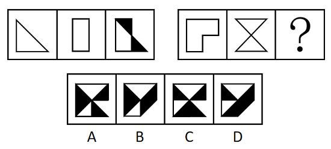

- **A**. A　✅
- **B**. B
- **C**. C
- **D**. D

**答案**：A

**官方解析**

元素组成相似，且相同线条重复出现，优先考虑样式规律中的加减同异。观察发现，第一组图形中图一与图二相加，相加后不同的地方变成黑色，得到图三。第二组图形也应遵循此规律，图一与图二相加，相加后不同的地方变成黑色，只有A项符合。
故正确答案为A。

---

## 第 2 题　qid 5484010 · 图形推理

每道题包含两套图形和可供选择的4个图形。这两套图形具有某种相似性，也存在某种差异。要求你从四个选项中选择最适合取代问号的一个。正确的答案不仅使两套图形表现出最大的相似性，而且使第二套图形也表现出自己的特征。

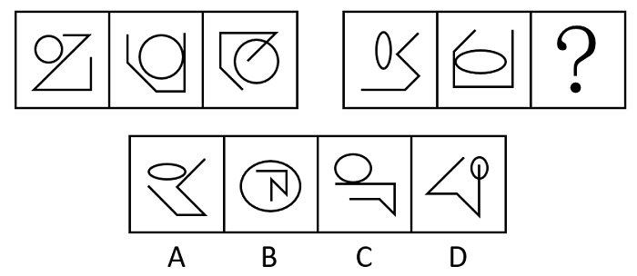

- **A**. A
- **B**. B
- **C**. C
- **D**. D　✅

**答案**：D

**官方解析**

观察发现，题干每幅图均由1个圆和1条折线构成，可以考虑图形间关系。第一组的图形间关系为：圆和折线分别相离、相切、相交。第二组前两幅图的图形间关系也符合该规律，故“？”处图形的圆和折线应相交，只有D项符合。
故正确答案为D。

---

## 第 3 题　qid 5484013 · 图形推理

每道题包含两套图形和可供选择的4个图形。这两套图形具有某种相似性，也存在某种差异。要求你从四个选项中选择最适合取代问号的一个。正确的答案不仅使两套图形表现出最大的相似性，而且使第二套图形也表现出自己的特征。

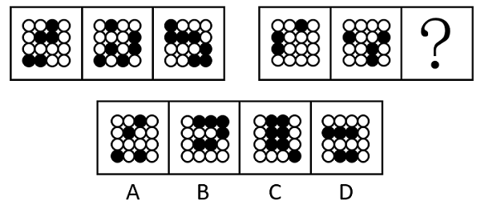

- **A**. A
- **B**. B
- **C**. C
- **D**. D　✅

**答案**：D

**官方解析**

图形组成不同，且无属性规律，优先考虑数量规律。观察发现，题干图形均由黑球和白球构成，其中第一组图黑球数量分别是5、6、7，第二组图前两个图形的黑球数量分别是3、4，故？处图形应有5个黑球，只有D项满足。
故正确答案为D。

---

## 第 4 题　qid 5484014 · 图形推理

每道题包含两套图形和可供选择的4个图形。这两套图形具有某种相似性，也存在某种差异。要求你从四个选项中选择最适合取代问号的一个。正确的答案不仅使两套图形表现出最大的相似性，而且使第二套图形也表现出自己的特征。

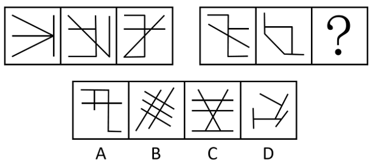

- **A**. A
- **B**. B　✅
- **C**. C
- **D**. D

**答案**：B

**官方解析**

解法一：图形元素组成不同，且无明显属性规律，考虑数量规律。观察发现，题干图形存在明显的封闭区域，故考虑面数量。第一组图形面数量依次为0、1、2，第二组前两个图形面数量依次为0、1，因此？处图形的面数量应为2，只有B项符合。
故正确答案为B。

解法二：图形元素组成不同，且无明显属性规律，考虑数量规律。观察发现，题干图形均由多条直线构成，且存在较多横线，故考虑横线数，第一组横线数分别为1、2、3，第二组前两个图形横线数为3、2，故问号处图形横线数应为1，只有D项符合。
故正确答案为D。
注：本题不严谨，存在两种规律，考场上根据图形特征优先想到哪个选哪个。

---

## 第 5 题　qid 5484015 · 图形推理

每道题包含两套图形和可供选择的4个图形。这两套图形具有某种相似性，也存在某种差异。要求你从四个选项中选择最适合取代问号的一个。正确的答案不仅使两套图形表现出最大的相似性，而且使第二套图形也表现出自己的特征。

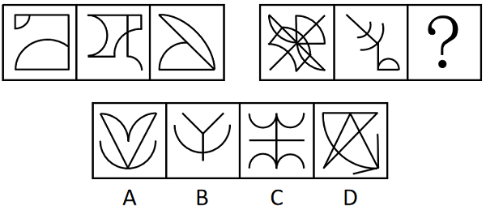

- **A**. A　✅
- **B**. B
- **C**. C
- **D**. D

**答案**：A

**官方解析**

图形元素组成不同，无明显属性规律，考虑数量规律。题干每幅图形均出现圆弧，且圆弧数量较多，考虑数曲线。第一组图形的曲线数量依次为2、3、2，第二组图形的曲线数量依次为5、3，没有规律。继续观察发现，题干每幅图形均出现直线，且直线数量较多，考虑数直线。第一组图形的直线数量依次为4、4、2，第二组图形的直线数量依次为6、3。第一组图形的直线数和曲线数相减，差依次为2、1、0，呈等差数列递减规律，第二组图形的直线数和曲线数相减，差依次为1、0，因此问号处需要选择一个直线数和曲线数的差为-1的图形，只有A项符合。
故正确答案为A。

---

## 第 6 题　qid 5484001 · 图形推理

每道题包含一套图形和四个选项，请从四个选项中选出最恰当的一项填在问号处，使图形呈现一定的规律性。

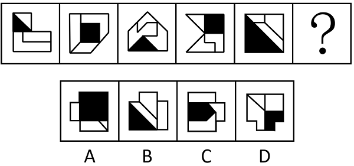

- **A**. A　✅
- **B**. B
- **C**. C
- **D**. D

**答案**：A

**官方解析**

元素组成不同，且无明显属性规律，考虑数量规律。观察发现题干每个图形中均存在一个黑色面和三个白色面，且黑色面的形状分别为三角形、四边形交替出现，故？处图形的黑色面应该是四边形，只有A项符合。
故正确答案为A。

---

## 第 7 题　qid 5484002 · 图形推理

每道题包含一套图形和四个选项，请从四个选项中选出最恰当的一项填在问号处，使图形呈现一定的规律性。

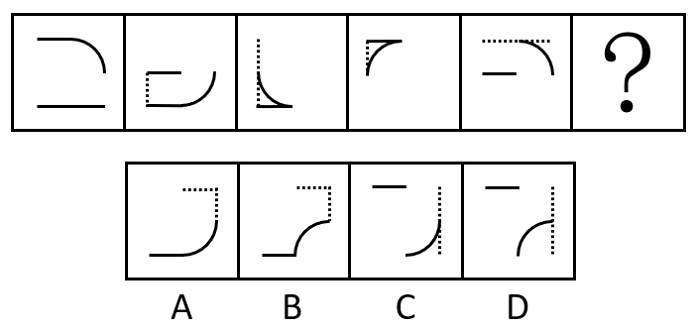

- **A**. A　✅
- **B**. B
- **C**. C
- **D**. D

**答案**：A

**官方解析**

元素组成基本相同，优先考虑位置规律。观察发现，题干图形中有多种元素，考虑分开看，弧线每次顺时针旋转，故？处图形的弧线旋转至右下角，且弧线朝向图形内部，排除B、D两项。虚线每次顺时针平移半条边的距离，其中图1、图2和图4的部分虚线被实线覆盖，故？处图形的虚线平移至上边框的右侧和右边框的上侧，排除C项，A项当选。另外，图1上边框的短实线每次向下平移一格，循环走，故？处图形的短实线平移至下边框的左侧；其次，图1下边框的长实线到图2减少半条边，图2到图3再减少半条边，即图3之后不再考虑该实线。

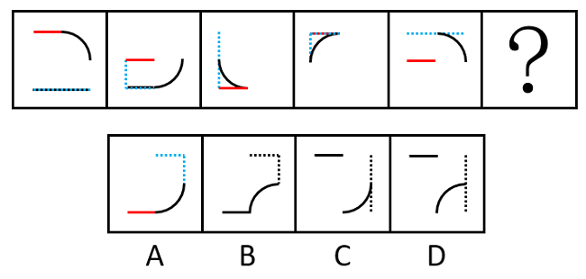

故正确答案为A。

---

## 第 8 题　qid 5484003 · 图形推理

每道题包含一套图形和四个选项，请从四个选项中选出最恰当的一项填在问号处，使图形呈现出一定的规律性。

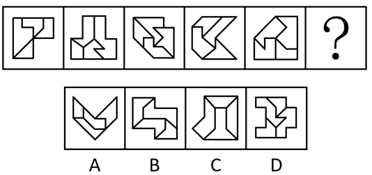

- **A**. A　✅
- **B**. B
- **C**. C
- **D**. D

**答案**：A

**官方解析**

元素组成不同，优先考虑属性规律。题干图形的外框都比较规整，且出现了明显的等腰元素，考虑对称性。观察发现，题干图形的外框都是轴对称图形，且对称轴的方向依次顺时针旋转，因此？处应选择图形外框的对称轴为竖直方向的，只有A项符合。

故正确答案为A。

---

## 第 9 题　qid 5484004 · 图形推理

每道题包含一套图形和四个选项，请从四个选项中选出最恰当的一项填在问号处，使图形呈现出一定的规律性。

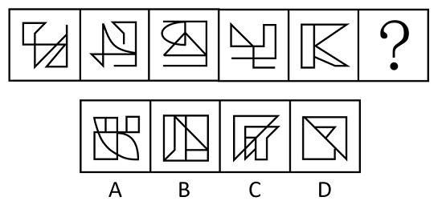

- **A**. A
- **B**. B
- **C**. C　✅
- **D**. D

**答案**：C

**官方解析**

图形元素组成不同，且无明显属性规律，考虑数量规律。观察发现，题干图形出现明显的出头端点，优先考虑笔画数。题干图形均为一笔画图形，所以？处图形也应该是一笔画图形。A、B、D三项均为两笔画图形，只有C项符合。
故正确答案为C。

---

## 第 10 题　qid 5484005 · 图形推理

每道题包含一套图形和四个选项，请从四个选项中选出最恰当的一项填在问号处，使图形呈现出一定的规律性。

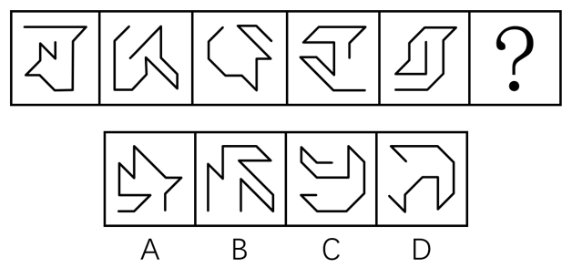

- **A**. A　✅
- **B**. B
- **C**. C
- **D**. D

**答案**：A

**官方解析**

元素组成不同，且无明显属性规律，优先考虑数量规律。观察发现，每幅图均由直线构成，且每幅图中均由横线和竖线构成一个直角，且直角位置顺时针旋转，分别位于右下、左下、左上、右上、右下（如图1所示），故？处直角位置应在左下（见图2）。

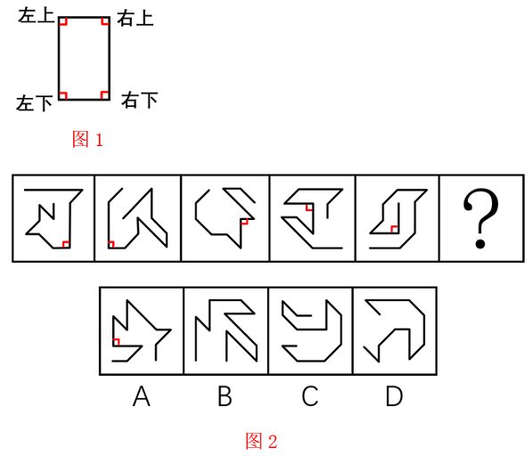

故正确答案为A。

---

## 第 11 题　qid 5484007 · 逻辑判断

所有的五星级志愿者都受到表彰，有的教师是五星级志愿者，于老师是教师。
若以上陈述为真，则以下哪项也一定为真？

- **A**. 于老师是五星级志愿者
- **B**. 于老师受到表彰
- **C**. 有的教师受到表彰　✅
- **D**. 所有受到表彰的都是五星级志愿者

**答案**：C

**官方解析**

第一步：翻译题干。

①五星级志愿者受到表彰；

②有的教师五星级志愿者；

③于老师教师；

①②串联可得：④有的教师五星级志愿者受到表彰。

第二步：逐一分析选项。

A项：翻译为“于老师五星级志愿者”，虽然已知条件③“于老师教师”，但他是否属于条件②中的“有的教师”并不确定，因此无法推出，排除；

B项：翻译为“于老师受到表彰”，虽然已知条件③“于老师教师”，但他是否属于条件④中的“有的教师”并不确定，因此无法推出，排除；

C项：翻译为“有的教师受到表彰”，根据条件④可以推出，当选；

D项：翻译为“受到表彰五星级志愿者”，“受到表彰”是对条件①的肯后，肯后得不到必然结论，因此无法推出，排除。

故正确答案为C。

---

## 第 12 题　qid 5484008 · 逻辑判断

乐乐的体育成绩一直不太好。四年级第一学期体育考试，乐乐成绩不及格。为提高乐乐的体育成绩，乐乐妈妈给他报了一个课外体能训练班，每周上课一个半小时。一个学期过去了，在期末考试中，乐乐的体育成绩依然不及格。于是，乐乐妈妈认为：课外体能训练班对提高乐乐的体育成绩没起什么作用。
以下哪项如果为真，最能削弱乐乐妈妈的结论？

- **A**. 体育成绩的提高非常缓慢，仅仅一个学期的训练确实起不了什么作用
- **B**. 如果不报这个课外体能训练班，乐乐期末考试的体育成绩会更差　✅
- **C**. 乐乐的体能教练毕业于某著名体育大学，有着丰富的体育教学经验
- **D**. 同年级的小刘和乐乐参加了同一个体能训练班，期末体育成绩及格了

**答案**：B

**官方解析**

第一步：找出论点和论据。
论点：课外体能训练班对提高乐乐的体育成绩没起什么作用。
论据：为提高乐乐的体育成绩，乐乐妈妈给他报了一个课外体能训练班，每周上课一个半小时。一个学期过去了，在期末考试中，乐乐的体育成绩依然不及格。
论点和论据讨论的都是课外体能训练班对提高乐乐的体育成绩的作用，二者话题一致，削弱优先考虑削弱论点。
第二步：逐一分析选项。
A项：一个学期的训练对提高体育成绩起不了什么作用，而乐乐恰好只上了一个学期的课外体能训练班，说明这段时间的课外体能训练确实不能提高乐乐的体育成绩，为加强项，无法削弱，排除；
B项：如果不报这个课外体能训练班，乐乐期末考试的体育成绩会更差，说明尽管乐乐的体育成绩仍然未及格，但已经变得比预期更好了，课外体能训练班可以提高乐乐的体育成绩，直接否定论点，可以削弱，当选；
C项：乐乐的体能教练有着丰富的体育教学经验，但其能否帮助乐乐提高体育成绩并不清楚，为不明确项，无法削弱，排除；
D项：小刘参加同一个体能训练班后期末体育成绩及格了，而论点讨论的是课外体能训练班对提高乐乐的体育成绩没起什么作用，主体不一致，为无关项，无法削弱，排除。
故正确答案为B。

---

## 第 13 题　qid 5484012 · 逻辑判断

有人认为，蛋黄中含有较多胆固醇，每天吃的蛋黄过多，会使人体的胆固醇升高，从而增加患心脏病的风险。
若以下选项为真，除哪项外均能对这一观点构成反驳？

- **A**. 哈佛大学教授通过对12万人的饮食与心肌病情形进行调查，发现蛋黄的摄入量与心脏病之间没有具体关联
- **B**. 人体中的大部分胆固醇来源于自身的合成，小部分来源于食物。实验表明，吃再多的蛋黄，人体的总胆固醇含量都没有明显的变化
- **C**. 2013年刊登在《英国医学期刊》的一项对多达308万人的研究发现，鸡蛋的摄入量与心脏病的发病无关
- **D**. 不良的饮食习惯，比如，摄入烘焙饼干或者爆米花中的反式脂肪会提高人体胆固醇含量，患心脏病的风险随之增加　✅

**答案**：D

**官方解析**

第一步：找出论点和论据。
论点：蛋黄中含有较多胆固醇，每天吃的蛋黄过多，会使人体的胆固醇升高，从而增加患心脏病的风险。
论据：无。
本题只有论点，且为削弱选非题，排除能够削弱的选项即可。
第二步：逐一分析选项。
A项：该项说的是通过调查发现蛋黄的摄入量与心脏病之间没有具体关联，削弱论点，可以削弱，排除；
B项：该项说的是多吃蛋黄后人体的总胆固醇含量都没有明显的变化，说明吃蛋黄与胆固醇升高无关，削弱论点，可以削弱，排除；
C项：该项说的是通过研究发现鸡蛋的摄入量与心脏病的发病无关，而鸡蛋中包含蛋黄，说明吃蛋黄与心脏病之间无关，削弱论点，可以削弱，排除；
D项：该项说的是不良的饮食习惯会提高人体胆固醇含量，增加患心脏病的风险，而论点讨论的是吃蛋黄与心脏病之间的关系，话题不一致，无法削弱，当选。
本题为选非题，故正确答案为D。

---

## 第 14 题　qid 5484016 · 逻辑判断

如果小明是优秀的程序员，那么小明对数据结构与算法一定很熟悉。
上述论证基于以下哪个前提？

- **A**. 一个程序员除非不是优秀的，否则对数据结构与算法一定很熟悉　✅
- **B**. 一个程序员只要对数据结构与算法很熟悉，那么一定是优秀的程序员
- **C**. 一个程序员如果不是优秀的，那么一定对数据结构与算法不是很熟悉
- **D**. 一个程序员如果对数据结构与算法很熟悉，那么一定是优秀的程序员

**答案**：A

**官方解析**

第一步：找出论点和论据。

论点：小明对数据结构与算法一定很熟悉。

论据：小明是优秀的程序员。

本题论点讨论的是小明对数据结构与算法很熟悉，论据讨论的是小明是优秀的程序员，二者讨论的话题不一致，且问法为“基于以下哪个前提”，优先考虑搭桥，即建立“优秀的程序员”与“对数据结构与算法一定很熟悉”之间的联系。

第二步：逐一分析选项。

A项：选项可翻译为对数据结构与算法一定很熟悉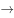优秀的程序员，根据逆否等价的推理规则可得，优秀的程序员对数据结构与算法一定很熟悉，建立“优秀的程序员”与“对数据结构与算法一定很熟悉”之间的联系，且方向为从论据到论点，是题干推理的前提，可以加强，当选；

B项：选项可翻译为对数据结构与算法很熟悉优秀的程序员，在论点与论据之间建立联系，但方向为从论点到论据，搭桥方向相反，无法成为题干推理的前提，排除；

C项：选项可翻译为优秀的程序员对数据结构与算法一定很熟悉，根据逆否等价的推理规则可得，对数据结构与算法一定很熟悉优秀的程序员，在论点与论据之间建立联系，但方向为从论点到论据，搭桥方向相反，无法成为题干推理的前提，排除；

D项：选项可翻译为对数据结构与算法很熟悉优秀的程序员，在论点与论据之间建立联系，但方向为从论点到论据，搭桥方向相反，无法成为题干推理的前提，排除。

故正确答案为A。

---

## 第 15 题　qid 5484017 · 逻辑判断

有研究团队收集蜘蛛网进行微塑料实验测试，发现所有的蜘蛛网都被微塑料污染过。有些蜘蛛网中，微塑料可达蜘蛛网总重量的十分之一。该团队研究员认为，可以通过特定区域的蜘蛛网来快速了解该区域的微塑料污染情况。
以下陈述如果为真，哪项可以支持上述观点？

- **A**. 微塑料可以有许多来源，包括纺织品、水瓶、外卖容器和食品包装
- **B**. 漂浮在空气中的微塑料有可能被人类吸入并进入血液，从而造成健康风险
- **C**. 蜘蛛网可有效粘着空气中漂浮的微塑料，其含量与空气中的微塑料浓度成正比　✅
- **D**. 目前有多种方法可对微塑料含量进行检测，但准确度和灵敏度并不一致

**答案**：C

**官方解析**

第一步：找出论点和论据。
论点：可以通过特定区域的蜘蛛网来快速了解该区域的微塑料污染情况。
论据：有研究团队收集蜘蛛网进行微塑料实验测试，发现所有的蜘蛛网都被微塑料污染过。有些蜘蛛网中，微塑料可达蜘蛛网总重量的十分之一。
本题论点和论据讨论的都是蜘蛛网和微塑料污染之间的关系，论点论据话题一致，加强可以优先考虑补充论据，即解释原因或者举例子。
第二步：逐一分析选项。
A项：该项说的是微塑料都有哪些来源，但是没有提及蜘蛛网，所以无法得知是否可以通过特定区域的蜘蛛网来快速了解该区域的微塑料污染情况，该项与论点话题不一致，无法加强，排除；
B项：该项说空气中的微塑料有可能对人类造成健康风险，但论点讨论的是是否可以通过蜘蛛网来了解相应区域的微塑料污染情况，该项与论点话题不一致，无法加强，排除；
C项：该项说蜘蛛网可以有效粘着空气中的微塑料，并且蜘蛛网上的微塑料含量与空气中的微塑料浓度成正比，说明可以通过测量蜘蛛网上的微塑料含量来了解相应区域的空气中的微塑料浓度，解释原因，可以加强，当选；
D项：该项说目前有多种方法来检测微塑料的含量，但论点讨论的是是否可以通过蜘蛛网来了解相应区域的微塑料污染情况，该项与论点话题不一致，无法加强，排除。
故正确答案为C。

---

## 第 16 题　qid 5484018 · 逻辑判断

激光技术可用于辅助演示、制造灯光效果等，但激光笔作为一种高能量设备，潜在的危险不容忽视。因此专家呼吁出台法律禁止激光笔的销售和使用。
以下陈述如果为真，哪项无法支持专家的呼吁？

- **A**. 某国多架飞机曾遭到高功率激光笔的攻击，飞行员瞬间出现了视觉障碍
- **B**. 有些国家未禁止激光笔的销售，但对使用方式做了严格的规定　✅
- **C**. 用激光笔照射火柴或香烟，短时间内可以将火柴或香烟点燃
- **D**. 激光笔的功率越高，亮度越高，5毫瓦的激光笔3秒内可照瞎眼睛

**答案**：B

**官方解析**

第一步：找出论点和论据。
论点：专家呼吁出台法律禁止激光笔的销售和使用。
论据：激光技术可用于辅助演示、制造灯光效果等，但激光笔作为一种高能量设备，潜在的危险不容忽视。
本题论点和论据话题一致，加强优先考虑补充论据，本题为选非题，将可以加强的选项排除即可。
第二步：逐一分析选项。
A项：该项说的是曾有飞机被激光笔攻击，使飞行员出现了视觉障碍，说明高功率激光笔确实影响过飞航安全，举例子补充论据，可以加强，排除；
B项：该项说的是未禁止销售激光笔的国家严格规定了其使用方式，而论点讨论的是应该出台法律禁止销售和使用激光笔，二者讨论的话题不一致，无关项，无法加强，当选；
C项：该项说的是激光笔可在短时间内点燃火柴或香烟，说明使用激光笔确实存在着潜在的危险，补充论据，可以加强，排除；
D项：该项说的是激光笔的原理及危害，激光笔可能会照瞎眼睛，说明使用激光笔确实存在着潜在的危险，补充论据，可以加强，排除。
本题为选非题，故正确答案为B。

---

## 第 17 题　qid 5484019 · 逻辑判断

不少人喜欢拍摄照片后上传到各种社交平台，但专家警告这些照片有可能泄露个人隐私，给用户带来潜在的安全风险，因为每一张数码照片中都包含一组在拍摄时自动生成的可交换图像文件格式的信息（简称Exif），建议用户上传图片时尽量避免“原图”上传。
以下陈述如果为真，哪项是上述观点的前提？

- **A**. Exif信息包括拍摄时的准确位置和时间，以及拍摄设备的唯一ID号　✅
- **B**. 主流社交平台会默认对上传照片进行裁剪或压缩处理，原始的Exif信息会被修改
- **C**. 数码照片在进行后期的数字化编辑时，Exif记录的专业数据可辅助摄影爱好者做专业调试
- **D**. Exif是一种标准信息，它可帮助用户在查找、管理、使用照片的过程中进行分类处理

**答案**：A

**官方解析**

第一步：找出论点和论据。
论点：上传到各种社交平台的照片有可能泄露个人隐私，给用户带来潜在的安全风险。
论据：每一张数码照片中都包含一组在拍摄时自动生成的可交换图像文件格式的信息（简称Exif）。
本题论点讨论的是上传到社交平台的照片有可能泄露个人隐私，给用户带来安全风险，而论据讨论的是照片中包含Exif信息，论点和论据话题不一致，且问法为“前提”，加强优先考虑搭桥，即建立“Exif信息”和“泄露个人隐私，给用户带来安全风险”之间的联系。
第二步：逐一分析选项。
A项：该项指出Exif信息包括拍摄时的准确位置和时间，以及拍摄设备的唯一ID号，说明通过“Exif信息”会“泄露个人隐私，给用户带来安全风险”，即建立了论点和论据的联系，属于搭桥项，可以加强，当选；
B项：该项指出主流社交平台会对照片中原始的Exif信息进行修改，说明上传至社交平台上的照片不会“泄露个人隐私，给用户带来安全风险”，属于削弱项，无法加强，排除；
C项：该项指出数码照片在进行后期的数字化编辑时，Exif记录的专业数据可辅助摄影爱好者做专业调试，说的是Exif记录的作用，而论点讨论的是上传到各种社交平台的照片是否有可能“泄露个人隐私，给用户带来安全风险”，话题不一致，无法加强，排除；
D项：该项指出Exif是一种标准信息，它可帮助用户在查找、管理、使用照片的过程中进行分类处理，说的是Exif信息的作用，而论点讨论的是上传到各种社交平台的照片是否有可能“泄露个人隐私，给用户带来安全风险”，话题不一致，无法加强，排除。
故正确答案为A。

---

## 第 18 题　qid 5484020 · 逻辑判断

维生素D是人体必需的脂溶性维生素。人通过暴露于阳光下、膳食摄入和维生素D补充等途径补充维生素D。不断有研究提示，补充维生素D可降低癌症发生风险、保护血管、预防糖尿病、保护肝肾。但最近的一项包括2.6万人的随机对照实验显示，补充维生素D在降低心血管事件发生率、死亡率，以及预防癌症、降低癌症死亡率方面，与安慰剂无异。因此，有研究者认为，补充维生素D不会产生积极作用。
以下各项如果为真，哪项最能支持该研究者的观点？

- **A**. 维生素D可直接影响人类229个基因的活性，缺乏维生素D会增加患上各种免疫性疾病的风险
- **B**. 针对大量研究的综述显示，身体中维生素D水平不佳的人群的死亡率会增加
- **C**. 补充维生素D的价值视情况而定，体重指数低的人补充维生素D，对自身免疫性疾病有预防作用
- **D**. 研究显示，口服维生素D和钙补充剂会使轻度和中度动脉粥样硬化患者的全因死亡风险增加38%　✅

**答案**：D

**官方解析**

第一步：找出论点和论据。
论点：补充维生素D不会产生积极作用。
论据：最近的一项包括2.6万人的随机对照实验显示，补充维生素D在降低心血管事件发生率、死亡率，以及预防癌症、降低癌症死亡率方面，与安慰剂无异。
本题论点说的是“补充维生素D没有积极作用”，论据通过实验指出在降低心血管事件发生率、死亡率，以及预防癌症、降低癌症死亡率方面，补充维生素D的作用和安慰剂相同，由论据可以合理得到论点，故论据和论点话题一致，加强优先考虑补充论据。
第二步：逐一分析选项。
A项：该项指出缺乏维生素D会增加患上各种免疫性疾病的风险，说明补充维生素D有积极作用，而论点说的是补充维生素D没有积极作用，为削弱项，无法加强，排除；
B项：该项指出身体中维生素D水平不佳的人群死亡率会增加，说明补充维生素D有积极作用，而论点说的是补充维生素D没有积极作用，为削弱项，无法加强，排除；
C项：该项指出体重指数低的人补充维生素D，对自身免疫性疾病有预防作用，说明补充维生素D有积极作用，而论点说的是补充维生素D没有积极作用，为削弱项，无法加强，排除；
D项：该项指出补充维生素D会使部分动脉粥样硬化患者的全因死亡风险增加，举例说明补充维生素D对部分人群没有积极作用，补充论据，可以加强，当选。
故正确答案为D。

---

## 第 19 题　qid 5484021 · 逻辑判断

某研究测量了幼儿的血液和尿液中多氟烷基物质（PFAS，是一种被广泛应用于造纸、纺织、包装、皮革等领域的有机化合物）和邻苯二甲酸盐（存在于肥皂、洗发水等）的水平，然后利用粪便样本研究了这些幼儿的肠道微生物群。结果发现，血液中PFAS含量较高的幼儿其肠道细菌数量和多样性均低于平均水平，而邻苯二甲酸盐含量较高跟真菌数量减少有关。研究还发现，血液中这两种物质含量较高的幼儿，其肠道中含有几种用于清除有毒化学物质的细菌，而这些细菌通常不会在人类肠道中发现。
由此，可以推出：

- **A**. 家用化学品跟幼儿肠道微生物存在关联性　✅
- **B**. 多氟烷基物质导致了幼儿肠道的菌群失调
- **C**. 幼儿摄入有毒有害的化学物质之后，可以经由消化系统排出体外
- **D**. 幼儿有自我保护机制，可以避免肠道受到有毒化学物质的侵袭

**答案**：A

**官方解析**

日常结论题，根据题干信息逐一分析选项。
A项：根据题干可知，多氟烷基物质和邻苯二甲酸盐在皮革纺织或肥皂洗发水等家用化学品中广泛存在，血液中多氟烷基物质含量较高的幼儿其肠道细菌数量和多样性均低于平均水平，而邻苯二甲酸盐含量较高跟真菌数量减少有关，可以推出家用化学品跟幼儿肠道微生物存在关联性，当选；
B项：题干中指出血液中多氟烷基物质含量较高的幼儿其肠道细菌数量和多样性均低于平均水平，但没有说明二者是否存在因果关系，因此无法得出多氟烷基物质导致了幼儿肠道的菌群失调，无法推出，排除；
C项：题干中指出血液中这两种物质含量较高的幼儿，其肠道中含有几种用于清除有毒化学物质的细菌，但并未提到幼儿摄入有毒有害的化学物质之后，能否经由消化系统排出体外，无中生有，无法推出，排除；
D项：题干中指出血液中这两种物质含量较高的幼儿，其肠道中含有几种用于清除有毒化学物质的细菌，但并没有提到自我保护机制，无中生有，无法推出，排除。
故正确答案为A。

---

## 第 20 题　qid 5484022 · 逻辑判断

一款小程序宣称，可以通过将部分字母加粗（大部分为单词首字母或冠词），人为制造阅读注视，从而帮助读者阅读英文等字母语言时集中精神，提高阅读效率。该程序的官网将未经该程序加工和经过该程序加工的同一个文本对照，让读者进行阅读体验。有些人表示，用了该程序后阅读“快到飞起”；也有人认为，感觉读得快，不过是一种心理暗示，该程序对阅读没有帮助。
以下各项如果为真，哪项不能驳斥该程序有助于阅读的观点？

- **A**. 在官网看对比图时，读者看过原文再看加工过的文本，已是第二遍阅读，更熟悉内容，自然速度会变快
- **B**. 人们看到加粗的字母，会主动调动以往的经验，“脑补”出剩下的字母，设想下文中的主要内容，提高阅读速度　✅
- **C**. 年龄较大的读者在阅读字母语言时会采取跳读策略，更频繁地跳过某些不认识的单词，加粗的字词会影响阅读速度
- **D**. 阅读是一件非常消耗脑力的任务，过快的速度会让人的工作记忆快速消耗殆尽，难以理解文本，阅读质量必然受到影响

**答案**：B

**官方解析**

第一步：找出论点和论据。
论点：该程序有助于阅读。
论据：该程序通过将部分字母加粗（大部分为单词首字母或冠词），人为制造阅读注视，从而帮助读者阅读英文等字母语言时集中精神，提高阅读效率。
本题为选非题，找出三个削弱项排除，剩下的选项即正确答案。
第二步：逐一分析选项。
A项：该项说的是读者看过原文再看加工过的文本，已是第二遍阅读，更熟悉内容，阅读速度自然会变快，说明阅读速度的提升并非是因为使用了该程序，而是因为熟悉，能够削弱论点，排除；
B项：该项说的是人们看到加粗的字母，会主动调动以往的经验，“脑补”出剩下的字母，设想下文中的主要内容，提高阅读速度，解释了为什么该程序能提高阅读效率，补充论据，不能削弱，当选；
C项：该项说的是对于年龄较大的读者而言，加粗的字体会影响阅读速度，举例子来说明该程序影响阅读速度，能够削弱，排除；
D项：该项说的是过快的阅读速度会影响阅读质量，说明该程序提高了阅读效率会降低阅读质量，能够削弱，排除。
本题为选非题，故正确答案为B。

---

## 第 21 题　qid 5484032 · 类比推理

学中国语言文学的学生不是理科学生，所有理科的学生都要学习高等数学，因此中国语言文学专业的学生不用学习高等数学。
以下哪项论证与题干中的论证犯了同样的逻辑错误?

- **A**. 波斯猫不是狗，狗不是植物，因此波斯猫不是植物
- **B**. 哈士奇不是大象，大象喜欢玩耍，因此哈士奇不喜欢玩耍　✅
- **C**. 所有会拉小提琴的人都懂五线谱，我懂五线谱，因此我会拉小提琴
- **D**. 所有喜欢古典音乐的人都不喜欢嘻哈音乐，我不喜欢古典音乐，因此我喜欢嘻哈音乐

**答案**：B

**官方解析**

第一步，分析题干。

题干翻译为：学中国语言文学的学生不是理科学生，理科学生学习高等数学，因此，学中国语言文学的学生不用学习高等数学。即：AB，BC，AC。

第二步：逐一分析选项。

A项：翻译为：波斯猫不是狗，狗不是植物，因此，波斯猫不是植物，即AB，BC，AC，与题干推理形式不同，排除；

B项：翻译为：哈士奇不是大象，大象喜欢玩耍，因此，哈士奇不喜欢玩耍，即AB，BC，AC，与题干推理形式相同，当选；

C项：翻译为：会拉小提琴懂五线谱，我懂五线谱，因此，我会拉小提琴，即AB，CB，CA，与题干推理形式不同，排除；

D项：翻译为：喜欢古典音乐都不喜欢嘻哈音乐，我不喜欢古典音乐，因此，我喜欢嘻哈音乐，即AB，CA，CB，与题干推理形式不同，排除。

故正确答案为B。

---

## 第 22 题　qid 5484034 · 逻辑判断

某中学的编程社团成员互帮互助，共同学习和进步。刚加入该社团不久的张悦多次向社团成员请教，得到过好几位社团成员的帮助。帮助过张悦的社团成员均得到过黄晶的帮助。元老级社团成员刘健帮助过该社团所有人。得到过黄晶帮助的社团成员也都得到过社团成员李青的帮助。
若以上陈述为真，则以下哪项也一定为真?

- **A**. 黄晶帮助过李青
- **B**. 李青帮助过黄晶
- **C**. 黄晶帮助过张悦
- **D**. 李青帮助过刘健　✅

**答案**：D

**官方解析**

日常结论题，根据题干信息逐一分析选项。
A项：根据题干“帮助过张悦的社团成员均得到过黄晶的帮助”和“元老级社团成员刘健帮助过该社团所有人”可知，在题干涉及的几人中，只能确定黄晶帮助过刘建，不确定是否帮助过李青，无中生有，排除；
B项：根据题干“得到过黄晶帮助的社团成员也都得到过社团成员李青的帮助”可知，只确定李青帮助过得到黄晶帮助的社团成员，但并不清楚李青有没有帮助过黄晶，无法推出，排除；
C项：根据题干“帮助过张悦的社团成员均得到过黄晶的帮助”可知，只确定黄晶帮助过帮助张悦的社团成员，但并不清楚黄晶有没有帮助过张悦，无法推出，排除；
D项：根据“帮助过张悦的社团成员均得到过黄晶的帮助”和“元老级社团成员刘健帮助过该社团所有人”可知，黄晶帮助过刘健，再根据“得到过黄晶帮助的社团成员也都得到过社团成员李青的帮助”可知，李青也帮助过刘健，可以推出，当选。
故正确答案为D。

---

## 第 23 题　qid 5484036 · 逻辑判断

研究人员发现荔枝的某段特定DNA序列在不同品种荔枝中的缺失情况不同。来源于云南的特早熟品种基因组有该DNA序列的缺失，但来源于海南的晚熟品种中没有缺失。而“妃子笑”作为特早熟和晚熟的杂交种，则是“杂合”的缺失，即“妃子笑”的两条同源染色体中一条（来源于特早熟的父本）有这个缺失，而另外一条（来源于晚熟的母本）没有。这也正好与“妃子笑”的开花期在特早熟和晚熟之间相对应。
以下陈述如果为真，哪项最可能是研究人员的结论?

- **A**. 特定DNA序列的缺失情况，可能是导致荔枝不同花期形成和成熟早晚的重要因素　✅
- **B**. 解码荔枝基因组，研发相应的育种和栽培调控技术，造就不同品种荔枝的不同特色
- **C**. “妃子笑”荔枝的花期和成熟期介于不同品种荔枝之间，有助于提高其对市场的占有度
- **D**. 荔枝的某段特定DNA序列是决定荔枝品种与口味的关键因子

**答案**：A

**官方解析**

日常结论题，根据题干信息逐一分析选项。
A项：题干中列举了有特定DNA序列缺失、“杂合”缺失和无DNA序列缺失的荔枝的成熟期逐渐变晚，说明缺失特定DNA序列与荔枝的成熟期相关，因此特定DNA序列缺失情况不同可能导致荔枝成熟期不同，可以推出，当选；
B项：选项说的是解码荔枝基因组，研发相应的育种和栽培调控技术能造就不同品种荔枝的不同特色，题干中并未提及荔枝的育种和栽培调控技术，无中生有，无法推出，排除；
C项：选项说的是“妃子笑”荔枝的成熟期特点有助于提高其市场占有度，题干中并未提及“妃子笑”荔枝的市场占有度，无中生有，无法推出，排除；
D项：选项说的是荔枝的某段特定DNA序列决定荔枝品种与口味，题干中并未提及DNA序列与口味的关系，无中生有，无法推出，排除。
故正确答案为A。

---

## 第 24 题　qid 5484037 · 逻辑判断

小刘是某大学计算机科学专业的大四学生。
小张说：如果小刘喜欢离散数学，那么他会报考计算机科学专业的研究生。
小王说：如果小刘不喜欢离散数学，那么他会成为算法程序员。
小赵说：如果小刘不报考计算机科学专业的研究生，那么他不能成为算法程序员。
如果小张、小王、小赵的论断均为真，那么以下哪项一定为真？

- **A**. 小刘报考了计算机科学专业的研究生　✅
- **B**. 小刘没有报考计算机科学专业的研究生
- **C**. 小刘喜欢离散数学
- **D**. 小刘不喜欢离散数学

**答案**：A

**官方解析**

第一步：翻译题干。

①小张：喜欢离散数学报考计算机科学专业的研究生；

②小王：喜欢离散数学成为算法程序员；

③小赵：报考计算机科学专业的研究生成为算法程序员。

将③逆否可得，成为算法程序员报考计算机科学专业的研究生，和②串联可得：喜欢离散数学成为算法程序员报考计算机科学专业的研究生。

结合①可知，喜欢离散数学报考计算机科学专业的研究生，如果AB，AB，那么B一定为真（即无论A是否成立，B一定成立），无论小刘是否喜欢离散数学，都会报考计算机科学专业的研究生，A项当选。

故正确答案为A。

---

## 第 25 题　qid 5484038 · 类比推理

有7名到大美公司应聘的人员：甲、乙、丙、丁、戊、己和庚，他们被安排在同一天的不同时段进行面试。每个人进行面试的时段各不相同，而且每人只进行一次面试。所有应聘人员不是硕士，就是博士。还知道如下条件：
（1）不存在面试顺序相邻两人都是硕士的情况；
（2）己的面试先于乙和丁；在己之前进行面试的人中恰好有两名硕士；
（3）甲是第6个进行面试的；
（4）庚的面试在丙之前进行。
据此可以得出，以下哪两人的面试不可能相邻？

- **A**. 戊和己
- **B**. 戊和丙
- **C**. 己和乙
- **D**. 己和庚　✅

**答案**：D

**官方解析**

第一步：分析题干条件。

（1）不存在面试顺序相邻两人都是硕士的情况；

（2）己的面试先于乙和丁；在己之前进行面试的人中恰好有两名硕士；

（3）甲是第6个进行面试的；

（4）庚的面试在丙之前进行。

第二步：根据题干条件进行推理。

由于条件（2）中的己和其他人的联系较多，优先从条件（2）入手进行推理。根据条件（1）和条件（2）在己之前进行面试的人中恰好有两名硕士可知，己之前应至少有三人进行面试，结合条件（3）和条件（2）己的面试先于乙和丁可知，甲、乙、丁均在己之后面试，故己是第4个进行面试的。此时剩余的丙、戊和庚均应在己之前进行面试，再结合条件（4）可得三者的面试顺序如下表所示：

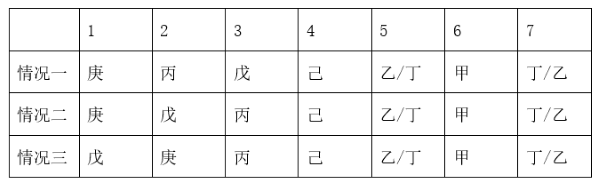

综上，己和庚始终无法相邻。

本题为选非题，故正确答案为D。

---

## 第 26 题　qid 5484039 · 定义判断

演出，指演出单位或个人在特定的时间、特定的环境下所举办的文艺表演活动，把戏曲、舞蹈、曲艺、杂技等才艺在观众面前表演出来。详细地说就是演员通过某种艺术表演形式和服装道具、舞美、灯光、音响的特殊艺术效果，现场把舞台艺术品展现给观众的过程。
根据上述定义，以下属于演出的是：

- **A**. 某艺术剧院在话剧《雷雨》每次正式公演前，都要进行一次彩排
- **B**. 某演员在水下跳舞的视频，经过多次剪辑后在电视台播放
- **C**. 某人在和朋友聚餐时利用餐桌上的餐具为大家即兴表演一个魔术
- **D**. 某高校舞蹈学院举办毕业生汇报表演时正赶上期末考试，观众寥寥　✅

**答案**：D

**官方解析**

第一步：找出定义关键词。
“演员”、“通过某种艺术表演形式和服装道具、舞美、灯光、音响的特殊艺术效果”、“现场把舞台艺术品展现给观众”。
第二步：逐一分析选项。
A项：艺术剧院在正式公演前进行彩排一般是为了让演员熟悉场地、流程等，不符合“现场把舞台艺术品展现给观众”，不符合定义，排除；
B项：演员在水下跳舞的视频经过多次剪辑后在电视台播放，不是现场呈现给观众，不符合“现场把舞台艺术品展现给观众”，不符合定义，排除；
C项：某人在和朋友聚餐时利用餐桌道具为大家即兴表演魔术，不涉及服装道具、舞美、灯光、音响等特殊艺术效果，不符合“通过某种艺术表演形式和服装道具、舞美、灯光、音响的特殊艺术效果”，不符合定义，排除；
D项：高校舞蹈学院举办的毕业生汇报表演，毕业生作为表演者，符合“演员”、“通过某种艺术表演形式和服装道具、舞美、灯光、音响的特殊艺术效果”、“现场把舞台艺术品展现给观众”，符合定义，当选。
故正确答案为D。

---

## 第 27 题　qid 5484041 · 定义判断

儿童经济，常指以3-14岁孩子为需求主体，围绕包括儿童用品、儿童玩具、亲子娱乐、亲子服务、亲子教育、亲子医疗等在内的儿童整体消费需求的经济活动。
根据上述定义，以下属于儿童经济的是：

- **A**. 小林开了一家创意DIY亲子小店，孩子可以在父母的陪伴下完成剪纸泥塑、手工花束的设计及制作　✅
- **B**. 小金开了一家婴儿游泳馆，提供婴儿游泳、抚触等服务，很多妈妈带孩子来游泳
- **C**. 小曹在培训机构集中的某大厦开了一家咖啡馆，带孩子来上课的父母是主要客源
- **D**. 小美开了一家摄影室，专门做孕妇摄影，为妈妈和未出世的宝宝留下特殊的亲子照

**答案**：A

**官方解析**

第一步：找出定义关键词。
“以3-14岁孩子为需求主体”、“围绕儿童用品、儿童玩具、亲子娱乐、亲子服务、亲子教育、亲子医疗等的经济活动”。
第二步：逐一分析选项。
A项：孩子在父母的陪伴下进行DIY设计及制作，符合“围绕儿童用品、儿童玩具、亲子娱乐、亲子服务、亲子教育、亲子医疗等的经济活动”，且可以完成手工的孩子可能符合“以3-14岁孩子为需求主体”，符合定义，当选；
B项：“婴儿”不符合“以3-14岁孩子为需求主体”，不符合定义，排除；
C项：该咖啡馆的主要客源为“父母”，不符合“以3-14岁孩子为需求主体”，不符合定义，排除；
D项：为孕妇摄影，“孕妇”不符合“以3-14岁孩子为需求主体”，不符合定义，排除。
故正确答案为A。

---

## 第 28 题　qid 5484042 · 定义判断

风险知觉，是指消费者在购买产品时，对他所意识到的风险（而非实际存在的风险）的知觉。知觉风险的程度因消费者的个性、商品的性质、购买的情境和方式的不同而变化。因此，广告宣传除传播商品信息外，还应当主动参与购买决策，帮助消费者克服风险感，即进行风险知觉干预。
根据上述定义，以下广告语中未涉及风险知觉干预的是：

- **A**. “手中有房，心中不慌”
- **B**. “两年内只退不换，五年内免费保修”
- **C**. “xx汽水，带给你儿时的味道”　✅
- **D**. “xx牛奶，好在天然，贵在品质”

**答案**：C

**官方解析**

第一步：找出定义关键词。
风险知觉：“消费者在购买产品时”、“所意识到的风险（而非实际存在的风险）的知觉”；
风险知觉干预：“帮助消费者克服风险感”。
第二步：逐一分析选项。
A项：广告语“手中有房，心中不慌”通过对买房即可获得安全感进行解释，说明房子是保值产品，解决了消费者购买房子时对前景的担忧，符合“帮助消费者克服风险感”，符合定义，排除；
B项：广告语“两年内只退不换，五年内免费保修”通过对售后服务的保证，解决了消费者对购买产品后出现问题的担忧，符合“帮助消费者克服风险感”，符合定义，排除；
C项：广告语“xx汽水，带给你儿时的味道”只对产品味道进行了介绍，无法消除消费者购买产品时意识到的风险，不符合“帮助消费者克服风险感”，不符合定义，当选；
D项：广告语“xx牛奶，好在天然，贵在品质”通过对产品品质进行介绍，解决了消费者购买牛奶时对品质的担忧，符合“帮助消费者克服风险感”，符合定义，排除。
本题为选非题，故正确答案为C。

---

## 第 29 题　qid 5484043 · 定义判断

院外急救，是指在医院之外的环境中对各种危及生命的急症、创伤、中毒、灾难事故等伤病者进行现场救护、转运及途中救护的统称，即在病人发病或受伤开始到医院就医之前这一阶段的救护。
根据上述定义，以下个体的行为符合院外急救的是：

- **A**. 小方在公园看到一个孩子被呛住了，面容青紫，小方立刻采用海姆立克急救法施救，一粒花生喷了出来，孩子很快恢复正常
- **B**. 小蒋在火车上听到广播，说有乘客突发疾病，情况危急，请求帮助，小蒋立刻赶去实施救治，直到下一站医护人员上车接走病人　✅
- **C**. 小李的同学打篮球时脚踝扭了一下，小李帮助同学进行了冷敷，第二天同学感觉还是有些疼痛，小李送同学去了医院
- **D**. 小金是出租车司机，他开车拉着一位心脏病发作的患者赶往医院，但没到医院患者就去世了

**答案**：B

**官方解析**

第一步：找出定义关键词。
“在医院之外的环境中”、“对各种危及生命的急症、创伤、中毒、灾难事故等伤病者进行现场救护、转运及途中救护”、“病人发病或受伤开始到医院就医之前这一阶段的救护”。
第二步：逐一分析选项。
A项：小方在公园对孩子进行海姆利克急救法施救，虽然是在院外进行施救，但孩子很快恢复了正常，并没有送往医院，不符合“病人发病或受伤开始到医院就医之前这一阶段的救护”，不符合定义，排除；
B项：小蒋在火车上对病人进行救治，直到下一站医护人员接走病人，符合“病人发病或受伤开始到医院就医之前这一阶段的救护”，符合定义，当选；
C项：小李帮助脚踝扭伤的同学冷敷，脚踝扭伤并不危及生命，不符合“对各种危及生命的急症、创伤、中毒、灾难事故等伤病者进行现场救护、转运及途中救护”，不符合定义，排除；
D项：出租车司机小金开车将心脏病发作的患者送往医院，小金并没有对患者进行救治，不符合“病人发病或受伤开始到医院就医之前这一阶段的救护”，不符合定义，排除。
故正确答案为B。

---

## 第 30 题　qid 5484044 · 定义判断

道德情绪，是一种社会性的情绪体验，这种体验主要发生于当个体根据已有的道德标准对自己或他人的思想和行为进行评价时。道德情绪是一种复合情绪，可以分为消极道德情绪（如愤怒、羞耻、内疚等）和积极道德情绪（如同情、崇敬、自豪等）。
根据上述定义，以下体现出道德情绪的是：

- **A**. 小齐很怕老鼠，看到同学的松鼠挂件吓得叫起来，发现是个挂件后，觉得很羞耻
- **B**. 小沫得知自己的高考分数超过录取分数线150分，高兴地跳了起来，觉得非常自豪
- **C**. 肖先生的儿子因英勇救人获得“见义勇为先进个人”称号，但肖先生只觉得后怕
- **D**. 小菲在研究中随机抽到“欺骗者”角色，研究结束后，她还是为欺骗他人感到内疚　✅

**答案**：D

**官方解析**

第一步：找出定义关键词。
“当个体根据已有的道德标准对自己或他人的思想和行为进行评价时”、“消极道德情绪（如愤怒、羞耻、内疚等）”、“积极道德情绪（如同情、崇敬、自豪等）”。
第二步：逐一分析选项。
A项：小齐看到同学的松鼠挂件吓得叫起来，觉得很羞耻，“害怕松鼠挂件”不涉及“道德标准”，不符合“当个体根据已有的道德标准对自己或他人的思想和行为进行评价时”，不符合定义，排除；
B项：小沫因为高考分数超过录取分数线150分，觉得非常自豪，“高考分数超过录取分数线150分”不涉及“道德标准”，不符合“当个体根据已有的道德标准对自己或他人的思想和行为进行评价时”，不符合定义，排除；
C项：肖先生的儿子英勇救人后，肖先生觉得后怕，“英勇救人”是一种道德行为，但“后怕”是因为肖先生担心儿子的安全，该情绪不是出于自身的“道德标准”，不符合“当个体根据已有的道德标准对自己或他人的思想和行为进行评价时”，不符合定义，排除；
D项：“欺骗他人”违背了自身已有的“道德标准”，因此小菲产生“内疚”的情绪，符合“当个体根据已有的道德标准对自己或他人的思想和行为进行评价时”、“消极道德情绪（如愤怒、羞耻、内疚等）”，符合定义，当选。
故正确答案为D。

---
