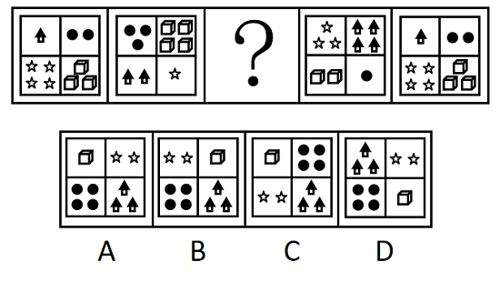
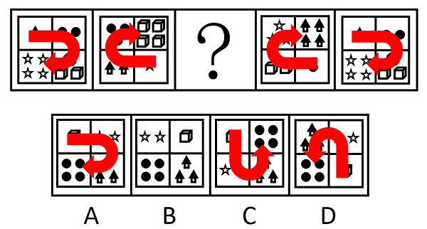
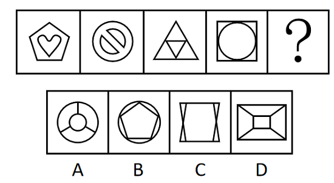
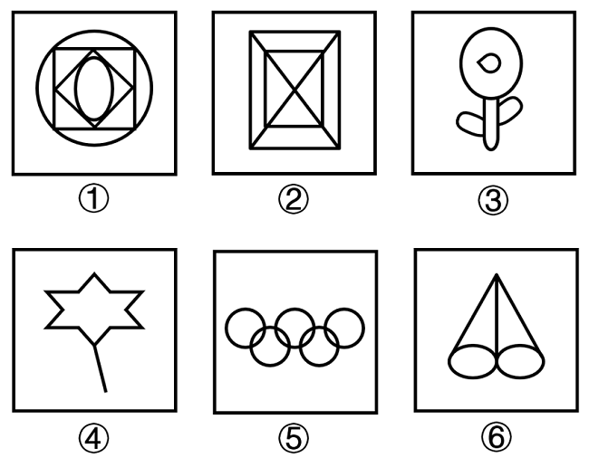
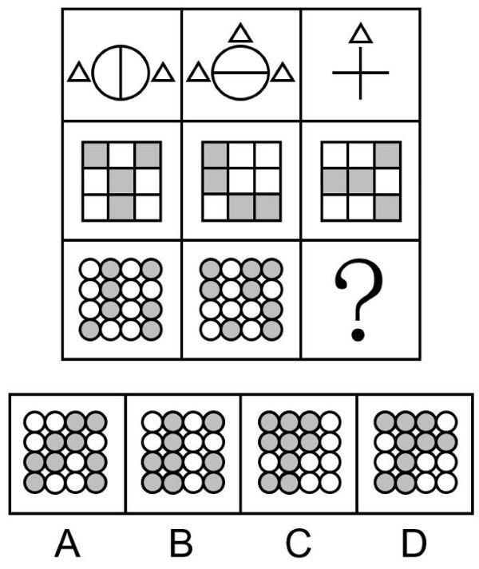
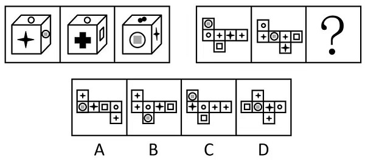
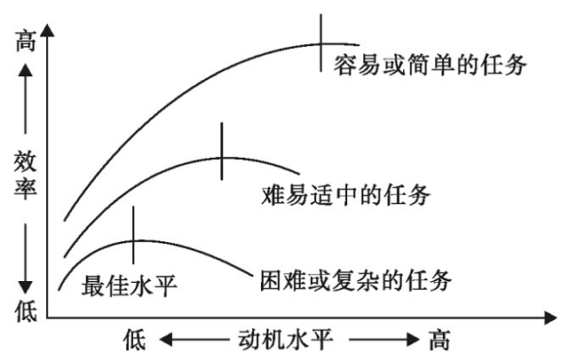
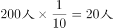

# 2023年吉林省公务员录用考试《行测》题（网友回忆版）

> 判断推理 · 30 题 · 吉林 2023

## 第 1 题　qid 5509720 · 图形推理

从所给的四个选项中，选择最合适的一个填入问号处，使之呈现一定的规律性：

- **A**. A　✅
- **B**. B
- **C**. C
- **D**. D

**答案**：A

**官方解析**

思路一：观察发现，题干图形均由四种元素组成，且选项图形之间同种元素的个数相同，区别在于同种元素的位置不同，故考虑元素的位置规律。继续观察发现，题干每种元素依次逆时针平移1格，排除B、C、D三项；此时，每种元素的数量为1、2、3、4循环出现，对应A项。

思路二：观察发现，题干图形均由四种元素组成，且图中每种元素的个数均为1、2、3、4，可以考虑不同数量元素之间的位置排布规律。继续观察发现，按照从元素数量依次为1、2、3、4的顺序画时针，题干图形均为顺指针方向，只有A项符合。

故正确答案为A。

---

## 第 2 题　qid 5509727 · 图形推理

从所给的四个选项中，选择最合适的一个填入问号处，使之呈现一定的规律性：

- **A**. A
- **B**. B　✅
- **C**. C
- **D**. D

**答案**：B

**官方解析**

思路一：元素组成不同，优先考虑属性规律。题干图形出现明显的等腰图形，优先考虑对称性。观察发现，题干图形均为轴对称图形，画出每个图形的对称轴，对称轴数量分别是1、2、3、4。因此？处图形应有5条对称轴，只有B项符合。
思路二：元素组成不同，且出现多个封闭区域，可以考虑数量规律。题干图形出现明显的窟窿，考虑面数量。观察发现，题干图形的面数量分别是2、3、4、5。因此？处图形应有6个面，只有B项符合。
故正确答案为B。
注：本题不管是看对称性还是面数量都可以选到B，大家主要学习解题思维即可，考场上根据图形特征优先想到哪个规律选哪个，无需纠结。

---

## 第 3 题　qid 5509730 · 图形推理

把下面的六个图形分为两类，使每一类图形都有各自的共同特征或规律，分类正确的一项是：

- **A**. ①③⑤，②④⑥
- **B**. ①②③，④⑤⑥
- **C**. ①④⑤，②③⑥　✅
- **D**. ①②⑤，③④⑥

**答案**：C

**官方解析**

本题为分组分类题目，元素组成不同，且无明显属性规律，考虑数量规律。观察题干图形发现，图④为多端点图形，图⑤为多圆相交图形，优先考虑笔画数，图①④⑤为一笔画图形，图②③⑥为多笔画图形，即图①④⑤为一组，图②③⑥为一组。
故正确答案为C。

---

## 第 4 题　qid 5509732 · 图形推理

从所给的四个选项中，选择最合适的一个填入问号处，使之呈现一定的规律性：

- **A**. A
- **B**. B
- **C**. C　✅
- **D**. D

**答案**：C

**官方解析**

元素组成相似，优先考虑样式规律。九宫格中优先横向看，第一行中，图一和图二求异得到图三；经验证，第二行三幅图形框架保持不变，内部灰色方块也满足此规律；第三行应用此规律，图形框架保持不变，图一和图二中灰色圆形求异得到问号处图形，只有C项符合。
故正确答案为C。

---

## 第 5 题　qid 5509762 · 图形推理

从所给的四个选项中，选择最合适的一个填入问号处，使之呈现一定的规律性：

- **A**. A　✅
- **B**. B
- **C**. C
- **D**. D

**答案**：A

**官方解析**

观察发现，题干两组图形均与六面体及其展开面有关，优先考虑六面体。第一组图中3个六面体图形为同一六面体，第二组图也应遵循此规律，三个六面体的展开面为同一六面体的展开面，根据第二组前两幅图可知，“正方形”与“含有正方形的圆”为相对面，两个“小四角星”为相对面，“大四角星”与“空心圆”为相对面，问号处的图形应该符合此规律，对应A项。
故正确答案为A。

---

## 第 6 题　qid 5509765 · 定义判断

动机-效率定律是心理学家提出的反映动机水平与工作效率关系的定律。心理学家认为动机水平的强度和工作效率之间的关系不是一种正比例关系，而是形成一种倒U形曲线，如下图所示。

根据上述定义，下列说法错误的是：

- **A**. 动机水平在达到一定强度的时候，工作效率最高
- **B**. 在一定范围内，工作效率随着动机的提高而上升
- **C**. 随着任务难度的增加，动机的最佳水平逐渐上升　✅
- **D**. 对学习来说，如果动机过强，会使学习效率降低

**答案**：C

**官方解析**

第一步：找出定义关键词。
根据题干倒U形曲线图可知：“相同任务难度下，随着动机增强，效率先上升后下降”、“不同任务难度下，随着任务难度降低，效率最佳水平逐渐升高”。
第二步：逐一分析选项。
A项：根据题干倒U形曲线可知，前期随着“动力水平”的升高，“工作效率”也在升高，并达到“效率最佳水平”，因此，动机水平在达到一定强度的时候，工作效率最高，符合定义，排除；
B项：根据题干倒U形曲线可知，前期随着“动力水平”的升高，“工作效率”也在升高，后期随着“动力水平”的升高，“工作效率”开始下降，因此在“一定范围内”即倒U形曲线前期，工作效率随动机提高而上升，符合定义，排除；
C项：根据题干三条倒U形曲线可知，任务难度越大，“动机的最佳水平”逐渐下降，不符合定义，当选；
D项：根据题干倒U形曲线后期走向可知，无论学习属于哪一类难度的任务，“动机过强”均会出现效率降低的情况，符合定义，排除。
本题为选非题，故正确答案为C。

---

## 第 7 题　qid 5509721 · 定义判断

分层比例抽样是指按各个层级的单位数量占调查总体单位数量的比例分配各层的样本数量的方法。某社区有居民20000人，从中抽取200人进行阅读状况调查。该社区居民中本科及以上学历者2000人，高中学历者6000人，初中及以下学历者12000人，用分层比例抽样法确定各层的样本数目。
根据上述定义，如果对该社区居民不同学历者采用分层比例抽样法进行调查，下列正确应用了该方法的是：

- **A**. 从不同学历者中分别抽取10人、30人、160人
- **B**. 从不同学历者中分别抽取20人、60人、120人　✅
- **C**. 从不同学历者中分别抽取30人、80人、110人
- **D**. 从不同学历者中分别抽取40人、60人、100人

**答案**：B

**官方解析**

第一步：找出定义关键词。

“按各个层级的单位数量占调查总体单位数量的比例分配各层的样本数量”、“某社区有居民20000人，从中抽取200人进行阅读状况调查”、“该社区居民中本科及以上学历者2000人，高中学历者6000人，初中及以下学历者12000人”。

第二步：分析选项。

提问要求“对该社区居民不同学历者采用分层比例抽样法进行调查”，即按各学历的人数占该社区居民总数的比例分配各学历的样本数量，因此需先计算各学历人数所占比例，再结合抽样总数，计算各学历样本数量。

（1）根据题干“某社区有居民20000人”与“该社区居民中本科及以上学历者2000人，高中学历者6000人，初中及以下学历者12000人”可知，各学历占社区居民总数的比例如下：

本科及以上：；

高中：；

初中及以下：。

（2）题干要求从该社区中抽取200人进行阅读状况调查，结合各学历所占比例可知：

本科及以上：；

高中：；

初中及以下：。

综上，应从不同学历者中分别抽取20人、60人、120人，只有B项符合。

故正确答案为B。

---

## 第 8 题　qid 5509745 · 定义判断

技术转移是指先进的科学技术和技术创新成果在不同国家之间、地区之间、各种机构和单位之间、科研与生产之间以及个人之间输入与输出的过程。
根据上述定义，下列属于技术转移的是：

- **A**. 刘教授向学生传授科技论文的写作规范与技巧
- **B**. 小张通过培训熟练掌握多媒体教室的使用方法
- **C**. 王工程师赴德国学习新的轴承生产与维护技术　✅
- **D**. 李技术员下乡为农民解决虫害防治的实际问题

**答案**：C

**官方解析**

第一步：找出定义关键词。
“先进的科学技术和技术创新成果”、“在不同国家之间、地区之间、各种机构和单位之间、科研与生产之间以及个人之间输入与输出”。
第二步：逐一分析选项。
A项：刘教授向学生传授科技论文的写作规范与技巧，不符合“先进的科学技术和技术创新成果”，不符合定义，排除；
B项：小张通过培训熟练掌握多媒体教室的使用方法，不符合“先进的科学技术和技术创新成果”，不符合定义，排除；
C项：王工程师赴德国学习新的轴承生产与维护技术，符合“先进的科学技术和技术创新成果”、“在不同国家之间输入与输出”，符合定义，当选；
D项：李技术员下乡为农民解决虫害防治的实际问题，虫害防治的实际问题未体现是先进的科学技术和技术创新成果，不符合“先进的科学技术和技术创新成果”，不符合定义，排除。
故正确答案为C。

---

## 第 9 题　qid 5509723 · 定义判断

地貌学是研究地球表面形态的特征、成因、内部结构分布及其演变规律的学科。构造地貌学是研究构造运动、地质构造与地貌形态之间关系的学科。气候地貌学是研究受气候控制的地表形态特征及其发生、发展规律的学科。动力地貌学是研究各种外动力在地貌形成中的作用及其形成的地貌形态特征的学科。外动力包括流水、冰川、波浪、风、溶解和热力冻融等。构造地貌学、气候地貌学和动力地貌学都属于地貌学的分支学科。
根据上述定义，下列不属于地貌学上述三个分支学科研究范畴的是：

- **A**. 研究灾变性地貌，如山崩、泥石流等的基础上，进行预测，提出防护措施　✅
- **B**. 研究同为喀斯特地貌，在不同纬度地区不同水、热条件下，其不同的表现
- **C**. 研究各种外营力和地表间经过长期的相互作用后，达到的稳定的地貌形态
- **D**. 研究地貌在各种地质构造下的形态和不同岩石组成的地层在地貌上的表现

**答案**：A

**官方解析**

第一步：找出定义关键词。
地貌学：研究地球表面形态的特征、成因、内部结构分布及其演变规律的学科；
构造地貌学：研究构造运动、地质构造与地貌形态之间关系的学科；
气候地貌学：研究受气候控制的地表形态特征及其发生、发展规律的学科；
动力地貌学：研究各种外动力在地貌形成中的作用及其形成的地貌形态特征的学科。
第二步：逐一分析选项。
A项：研究灾变性地貌是为了进行预测，提出防护措施，属于“应用地貌学”研究范畴，具体应用在题干所述地貌学及其三个分支学科中均未提及，故不属于地貌学上述三个分支学科研究范畴，当选；
B项：研究同为喀斯特地貌，在不同纬度地区不同水、热条件下，其不同的表现，“不同纬度地区不同水、热条件”即不同气候的影响，符合“研究受气候控制的地表形态特征及其发生、发展规律”，属于气候地貌学研究范畴，排除；
C项：研究各种外营力和地表间经过长期的相互作用后，达到的稳定的地貌形态，“外营力”即外动力，符合“研究各种外动力在地貌形成中的作用及其形成的地貌形态特征”，属于动力地貌学研究范畴，排除；
D项：研究地貌在各种“地质构造”下的形态和不同岩石组成的地层在地貌上的表现，符合“研究构造运动、地质构造与地貌形态之间关系”，属于构造地貌学研究范畴，排除。
本题为选非题，故正确答案为A。

---

## 第 10 题　qid 5509724 · 定义判断

假说是根据已观察到的事实和已有的科学原理，对尚未认识到的现象的性质或发生原因作出的推测性解释。依据提出假说的目的不同，假说分为：①定律假说，是关于一类事物或现象的性质或发生原因的推测性解释，目的在于通过这样的解释指导探索某类事物的性质或发生原因，得出具有普遍意义的、规律性命题；②作业假说，是关于某个特定事物或现象的性质或发生原因的推测性解释，其目的不在于获得定律性认识，而在于通过对事物或现象的性质或发生原因的试探性解释，以指导人们有目的有计划地展开工作。
根据上述定义，下列说法正确的是：

- **A**. 石油勘探人员通过重力勘探法，认为某盆地的下方富含石油，这属于定律假说
- **B**. 侦查人员通过对案发现场的侦查，推测是单位内部人员作案，这属于定律假说
- **C**. 牛顿根据苹果落地等现象，提出物体之间都具有引力的解释，这属于作业假说
- **D**. 医生通过检查、化验，对一位腹痛患者的病症作出了初步诊断，这属于作业假说　✅

**答案**：D

**官方解析**

第一步：找出定义关键词。
假说：“根据已观察到的事实和已有的科学原理，对尚未认识到的现象的性质或发生原因作出的推测性解释”；
定律假说：“关于一类事物或现象的性质或发生原因的推测性解释”、“通过推测性解释得出具有普遍意义的、规律性命题”；
作业假说：“关于某个特定事物或现象的性质或发生原因的推测性解释”、“不在于获得定律性认识”、“而在于通过推测性解释指导人们有目的有计划地展开工作”。
第二步：逐一分析选项。
A项：该项指出勘探人员通过勘探认为某盆地下方富含石油，是为了指导下一步石油开采工作的开展，符合“关于某个特定事物或现象的性质或发生原因的推测性解释”、“不在于获得定律性认识”、“而在于通过推测性解释指导人们有目的有计划地展开工作”，符合作业假说定义，不符合定律假说定义，说法错误，排除；
B项：该项指出侦查人员通过侦查推测是单位内部人员作案，是为了指导下一步破案工作的开展，符合“关于某个特定事物或现象的性质或发生原因的推测性解释”、“不在于获得定律性认识”、“而在于通过推测性解释指导人们有目的有计划地展开工作”，符合作业假说定义，不符合定律假说定义，说法错误，排除；
C项：该项指出牛顿通过苹果落地等现象提出物体之间都具有引力的解释，得到了一个具有普遍意义、规律性的命题，符合“关于一类事物或现象的性质或发生原因的推测性解释”、“通过推测性解释得出具有普遍意义的、规律性命题”，符合定律假说定义，不符合作业假说定义，说法错误，排除；
D项：该项指出医生通过检查、化验对腹痛患者作出初步诊断，其初步诊断是为后续疾病治疗提供参考，符合“关于某个特定事物或现象的性质或发生原因的推测性解释”、“不在于获得定律性认识”、“而在于通过推测性解释指导人们有目的有计划地展开工作”，符合作业假说定义，说法正确，当选。
故正确答案为D。

---

## 第 11 题　qid 5509739 · 定义判断

合理化作用是指在某些具体情境下，当事人以自己需要的理由来解释自己不能实现某种目标的一种心理防御机制。合理化作用一般分为三种形式：①酸葡萄心理，即自己得不到的东西就是不好的；②柠檬酸心理，即总觉得自己做成的或拥有的东西都是好的；③推诿，即将个人的缺点和失败归因于其他理由或找人承担错误，以保持个人内心平衡。
根据上述定义，下列不属于合理化作用的是：

- **A**. 某足球队在客场输掉一场比赛后称，裁判的判罚明显偏向主队
- **B**. 同事在教学竞赛中夺得一等奖，小杨认为这一奖项含金量不足
- **C**. 由于营销策略的失误，某销售公司第一季度的销售量直线下降　✅
- **D**. 竞争对手当上了车间主任，王组长声称还是当个组长逍遥自在

**答案**：C

**官方解析**

第一步：找出定义关键词。
“以自己需要的理由”、“解释自己不能实现某种目标”、“自己得不到的东西就是不好的”、“自己做成的或拥有的东西都是好的”、“将个人的缺点和失败归因于其他理由或找人承担错误”。
第二步：逐一分析选项。
A项：某足球队在客场输掉一场比赛后称，裁判的判罚明显偏向主队，该足球队将比赛失败归因于裁判的判罚，符合“将个人的缺点和失败归因于其他理由或找人承担错误”，符合定义，排除；
B项：同事在教学竞赛中夺得一等奖，小杨认为这一奖项含金量不足，小杨认为自己没有得到的奖项含金量不足，符合“自己得不到的东西就是不好的”，符合定义，排除；
C项：由于营销策略的失误，某销售公司第一季度的销售量直线下降，直接指出公司销售量下降的原因是营销策略失误，不符合“以自己需要的理由”、“解释自己不能实现某种目标”、“自己得不到的东西就是不好的”、“自己做成的或拥有的东西都是好的”、“将个人的缺点和失败归因于其他理由或找人承担错误”，不符合定义，当选；
D项：竞争对手当上了车间主任，王组长声称还是当个组长逍遥自在，王组长在对手当上主任时，声称做组长更自在，符合“自己做成的或拥有的东西都是好的”，符合定义，排除。
本题为选非题，故正确答案为C。

---

## 第 12 题　qid 5509719 · 定义判断

价格歧视是指销售方对具有相同成本的同一种商品或者服务的不同购买者索取不同的价格，或者对相同的购买者因购买数量不同而索取不同价格的定价行为。
根据上述定义，下列属于价格歧视的是：

- **A**. 某著名家电销售平台推出买二赠一的活动　✅
- **B**. 某百货商场推出消费满五千元抽奖活动
- **C**. 某服饰卖场推出春节购物六折优惠活动
- **D**. 某商场推出购物满五百元免费观影活动

**答案**：A

**官方解析**

第一步：找出定义关键词。
“销售方”、“同一种商品或服务，不同购买者不同价格”或“相同的购买者购买数量不同价格不同”。
第二步：逐一分析选项。
A项：某著名家电销售平台，符合“销售方”，买二赠一，虽未直接提到价格，但实则是两件商品的钱购买了三件商品，商品实际均价降低，符合“相同的购买者购买数量不同价格不同”，符合定义，当选；
B项：消费满五千元抽奖活动，只是花钱多可以额外抽奖，并未提到商品本身价格是否有不同，不符合“不同购买者不同价格”或“相同的购买者购买数量不同价格不同”，不符合定义，排除；
C项：春节购物六折优惠，只是不同时间不同价格，不符合“不同购买者不同价格”或“相同的购买者购买数量不同价格不同”，不符合定义，排除；
D项：购物满五百元免费观影，只是花钱多可以额外观影，并未提到商品本身价格是否有不同，不符合“不同购买者不同价格”或“相同的购买者购买数量不同价格不同”，不符合定义，排除。
故正确答案为A。

---

## 第 13 题　qid 5509744 · 定义判断

法的评价作用是指法律作为一种行为的标准和尺度，具有判断、衡量人的行为的法律意义的作用。法的预测作用是指根据法律规定，人们可以预先估计到行为结果的作用。法的强制作用是指法律通过国家强制力保障其得以充分实现的作用。法的教育作用是指通过法律的规定和实施而对一般人今后的行为发生影响的作用。
根据上述定义，下列古代关于法的名言，与其所表达的法的作用对应错误的是：

- **A**. “以至详之法晓天下，使天下明知其所避”——法的预测作用
- **B**. “有法而不循法，法虽善与无法等”——法的评价作用　✅
- **C**. “言行而不轨于法令者必禁”——法的强制作用
- **D**. “法令所以导民也”——法的教育作用

**答案**：B

**官方解析**

第一步：找出定义关键词。
法的评价作用：“法律具有判断、衡量人的行为的法律意义的作用”；
法的预测作用：“根据法律规定，人们可以预先估计到行为结果”；
法的强制作用：“法律通过国家强制力保障其得以充分实现”；
法的教育作用：“法律的规定和实施对一般人今后的行为发生影响”。
第二步：逐一进行分析选项。
A项：把极为详细的法令昭告天下百姓，让他们清楚地知道哪些事是不能去干的，而法令本身包括具体要求及相应惩罚，说明民众可以据此预测违法行为的后果，符合“根据法律规定，人们可以预先估计到行为结果”，符合“法的预测作用”的定义，排除；
B项：虽然有法律，但是不遵守法律，即使法律很好，但和没有法律是一样的，说明法律需要所有人遵守，但未提及用法律进行判断、衡量，不符合“法律具有判断、衡量人的行为的法律意义的作用”，不符合“法的评价作用”的定义，当选；
C项：言论和行动不合乎法律的必须禁止，说明法律通过强制措施得以实现，符合“法律通过国家强制力保障其得以充分实现”，符合“法的强制作用”的定义，排除；
D项：法令用以引导民众向善，说明法律可以影响民众的思想和行为，使其向善，符合“法律的规定和实施对一般人今后的行为发生影响”，符合“法的教育作用”的定义，排除。
本题为选非题，故正确答案为B。

---

## 第 14 题　qid 5509725 · 定义判断

发病率是指一定时期（一般为一年）内，特定风险人群中某病新病例所占的比例。罹患率是指在某一局限范围内短时间的发病率。观察时间单位通常是日、周、旬、月。患病率是指特定时间内一定范围总人口中某病新旧病例所占的比例。感染率是指在某个时间内接受检查的人群样本中，某病现有感染者人数所占的比例。
根据上述定义，下列说法错误的是：

- **A**. 某医院统计十一月份确诊为流感的患者人数在该县人口中的比例，属于感染率　✅
- **B**. 某化工厂统计此次食物中毒的职工在职工总人数中的比例，属于罹患率
- **C**. 某村统计上一年度新增高血压患者在六十周岁以上人口中的比例，属于发病率
- **D**. 某乡统计近十年内克山病患者的人数在该乡人口中的比例，属于患病率

**答案**：A

**官方解析**

第一步：找出定义关键词。
发病率：“一定时期（一般为一年）内”、“特定风险人群中某病新病例所占的比例”；
罹患率：“某一局限范围内短时间的发病率”；
患病率：“特定时间内”、“一定范围总人口中某病新旧病例所占的比例”；
感染率：“在某个时间内接受检查的人群样本中”、“某病现有感染者人数所占的比例”。
第二步：逐一分析选项。
A项：某医院统计十一月份确诊为流感的患者人数在该县人口中的比例，其中该县总人口不属于接受检查的人群，不符合“在某个时间内接受检查的人群样本中”，不符合感染率的定义，当选；
B项：某化工厂统计此次食物中毒的职工在职工总人数中的比例，其中食物中毒（摄入了含有生物性,化学性,有毒有害物质的食品后出现的急性疾病）一般在短时间内发生，符合“某一局限范围内短时间的发病率”，符合罹患率的定义，排除；
C项：某村统计上一年度新增高血压患者在六十周岁以上人口中的比例，符合“一定时期（一般为一年）内”、“特定风险人群中某病新病例所占的比例”，符合发病率的定义，排除；
D项：某乡统计近十年内克山病患者的人数在该乡人口中的比例，符合“特定时间内”、“一定范围总人口中某病新旧病例所占的比例”，符合患病率的定义，排除。
本题为选非题，故正确答案为A。

---

## 第 15 题　qid 5509736 · 定义判断

动作技能是指经过学习，个体自主完成某个目标的动作操作能力。依据动作连贯与否。分为：（1）连续性动作技能。是指以连续、不间断的方式完成一系列动作的技能。其持续时间较长。动作与动作间没有明显可以直接感知到的新的起始点；（2）非连续性动作技能。是指由突然爆发的动作组成的技能。其持续时间较短。精确性可以计数。动作起点与终点都是清晰可辨的。依据动作对外部刺激的利用程度。分为（1）封闭性动作技能。是指相对来说可以不参照外部条件变化进行的动作技能；（2）开放性动作技能。是指动作需要随外部情境变化做相应变化的动作技能。
根据上述定义，下列属于连续且开放性动作技能的是：

- **A**. 驾驶　✅
- **B**. 收割
- **C**. 投篮
- **D**. 射击

**答案**：A

**官方解析**

第一步：找出定义关键词。
连续性动作技能：“以连续、不间断的方式完成一系列动作”、“持续时间较长”、“动作与动作间没有明显可以直接感知到的新的起始点”；
非连续性动作技能：“由突然爆发的动作组成的技能”、“持续时间较短、精确性可以计数”、“动作起点与终点都是清晰可辨的”；
封闭性动作技能：“相对来说可以不参照外部条件变化”；
开放性动作技能：“动作需要随外部情境变化做相应变化”。
第二步：逐一分析选项。
A项：“驾驶”的过程是连续的，一般驾驶的时间相对较长，且驾驶动作之间没有明显的起始点，符合“以连续、不间断的方式完成一系列动作”、“持续时间较长”、“动作与动作间没有明显可以直接感知到的新的起始点”，符合“连续性动作技能”的定义；且驾驶需要结合路况随时调整，符合“动作需要随外部情境变化做相应变化”，也符合“开放性动作技能”的定义，因此属于连续且开放性动作技能，当选；
B项：“收割”的过程是连续的，收割的时间相对较长，且收割中各项动作没有明显的起始点，符合“以连续、不间断的方式完成一系列动作”、“持续时间较长”、“动作与动作间没有明显可以直接感知到的新的起始点”，符合“连续性动作技能”的定义；但收割主要靠自我调节，动作一般不需要随外部情境而变化，不符合“动作需要随外部情境变化做相应变化”，不符合“开放性动作技能”的定义，排除；
C项：“投篮”是突然爆发的动作且可以计数，符合“由突然爆发的动作组成的技能”、“持续时间较短、精确性可以计数”、“动作起点与终点都是清晰可辨的”，符合“非连续性动作技能”的定义，不符合“连续性动作技能”的定义，排除；
D项：“射击”是突然爆发的动作且可以计数，符合“由突然爆发的动作组成的技能”、“持续时间较短、精确性可以计数”、“动作起点与终点都是清晰可辨的”，符合“非连续性动作技能”的定义，不符合“连续性动作技能”的定义，排除。
故正确答案为A。

---

## 第 16 题　qid 5509722 · 类比推理

面食：素食

- **A**. 界石：基石
- **B**. 彩照：玉照　✅
- **C**. 宿疾：旧疾
- **D**. 年会：集会

**答案**：B

**官方解析**

第一步：判断题干词语间逻辑关系。
面食是指“主要”以面粉制成的食物，除了面粉外还可以有其他材料。有的面食是素食，有的面食不是素食，有的素食是面食，有的素食不是面食，二者为交叉关系。
第二步：判断选项词语间逻辑关系。
A项：界石指标志地界的石碑或石块，基石指做建筑物基础的石头，二者均是有不同功能的石头，二者为并列关系，与题干逻辑关系不一致，排除；
B项：彩照指彩色照片，玉照指对别人照片的敬称，有的彩照是玉照，有的彩照不是玉照，有的玉照是彩照，有的玉照不是彩照，二者为交叉关系，与题干逻辑关系一致，当选；
C项：宿疾是指久治不愈的疾病，旧病，与旧疾为全同关系，与题干逻辑关系不一致，排除；
D项：年会是一种集会，二者为种属关系，与题干逻辑关系不一致，排除。
故正确答案为B。

---

## 第 17 题　qid 5509764 · 类比推理

火：火急：火警

- **A**. 虎：虎将：虎劲
- **B**. 蛇：蛇行：蛇胆　✅
- **C**. 牛：牛毛：牛饮
- **D**. 鹊：鹊桥：鹊起

**答案**：B

**官方解析**

第一步：判断题干词语间逻辑关系。
“火急”指像着了火一样的紧急，其中“火”指像火一样，是“火”的引申义；“火警”指着火的警讯，其中“火”指着火，是火的本义，二者含义不同，且第二个词语为引申义，第三个词语为本义。
第二步：判断选项词语间逻辑关系。
A项：“虎将”和“虎劲”中的“虎”指的都是像虎一样，二者含义相同，与题干逻辑关系不一致，排除；
B项：“蛇行”指像蛇一样蜿蜒曲折地前进，其中的“蛇”是“蛇”的引申义；“蛇胆”指蛇的胆囊，其中的“蛇”是“蛇”的本义，二者含义不同，且第二个词语为引申义，第三个词语为本义，与题干逻辑关系一致，当选；
C项：“牛毛”指牛身上的毛，其中的“牛”是“牛”的本义；“牛饮”指像牛一样俯身而饮，其中的“牛”是“牛”的引申义，二者含义不同，但第二个词语为本义，第三个词语为引申义，词语顺序相反，与题干逻辑关系不一致，排除；
D项：“鹊桥”指喜鹊搭的桥，其中的“鹊”是“喜鹊”的本义；“鹊起”指像喜鹊一样飞起，其中的“鹊”是“喜鹊”的引申义，二者含义不同，但第二个词语为本义，第三个词语为引申义，词语顺序相反，与题干逻辑关系不一致，排除。
故正确答案为B。

---

## 第 18 题　qid 5509726 · 类比推理

学习菜谱：下厨烹饪：总结经验

- **A**. 通过安检：车站候车：登上列车　✅
- **B**. 投寄稿件：编辑排版：读者阅读
- **C**. 发布公告：制作标书：签订合同
- **D**. 撰写邮件：发送邮件：回复邮件

**答案**：A

**官方解析**

第一步：判断题干词语间逻辑关系。
首先“学习菜谱”，其次“下厨烹饪”，最后“总结经验”，满足时间先后顺序的对应关系，且三者的主体一致，均为下厨者。
第二步：判断选项词语间逻辑关系。
A项：首先“通过安检”，其次“车站候车”，最后“登上列车”，满足时间先后顺序的对应关系，且三者的主体一致，均为乘客，与题干逻辑关系一致，当选；
B项：首先“投寄稿件”，其次“编辑排版”，最后“读者阅读”，满足时间先后顺序的对应关系，但是“投寄稿件”的主体为作者，“编辑排版”的主体是编辑，“读者阅读”的主体为读者，三者主体不同，与题干逻辑关系不一致，排除； 
C项：首先“发布公告”，其次“制作标书”，最后“签订合同”，满足时间先后顺序的对应关系，但是“发布公告”的主体为招标者，“制作标书”的主体为投标者，“签订合同”是双方共同签订，三者主体不同，与题干逻辑关系不一致，排除； 
D项：首先“撰写邮件”，其次“发送邮件”，最后“回复邮件”，满足时间先后顺序的对应关系，但是“撰写邮件”与“发送邮件”的主体是发件人，“回复邮件”的主体是收件人，三者主体不同，与题干逻辑关系不一致，排除。
故正确答案为A。

---

## 第 19 题　qid 5509728 · 类比推理

生产设备 对于（    ） 相当于 （    ）对于 展台

- **A**. 一线工人；展商
- **B**. 运输设备；展会
- **C**. 生产车间；展品　✅
- **D**. 生产资料；展柜

**答案**：C

**官方解析**

逐一代入选项。
A项：一线工人利用生产设备从事生产活动，二者是工具与人物的对应关系；展商将产品放在展台进行展示，二者是人物与地点的对应关系，前后逻辑关系不一致，排除；
B项：生产设备和运输设备是两类不同的设备，二者是并列关系；展会是展示作品、技术等的宣传活动，展台是展会中会用到的物品，二者是组成关系，前后逻辑关系不一致，排除；
C项：生产设备在生产车间中运行，二者是物品与地点的对应关系；展品在展台上展示，二者也是物品与地点的对应关系，前后逻辑关系一致，当选；
D项：生产资料指劳动者进行生产时所需要使用的资源或工具，生产设备是生产资料，二者是种属关系；展柜和展台都是用来展示、陈列产品的载体，二者是并列关系，前后逻辑关系不一致，排除。
故正确答案为C。

---

## 第 20 题　qid 5509729 · 类比推理

旌旗 对于 （    ） 相当于 （    ） 对于 船只

- **A**. 武器；船桨
- **B**. 锣鼓；船夫
- **C**. 军队；孤帆　✅
- **D**. 旗帜；汽车

**答案**：C

**官方解析**

逐一代入选项。
A项：旌旗指旗帜的总称，也借指军士，和武器没有明显逻辑关系；船桨是船只的组成部分，二者为组成关系，前后逻辑关系不一致，排除；
B项：旌旗指旗帜的总称，也借指军士，锣鼓是乐器，二者没有明显逻辑关系；船夫在船只上工作，二者为对应关系，前后逻辑关系不一致，排除；
C项：旌旗指旗帜的总称，也借指军士，是军队的象征，二者为比喻象征义；孤帆指一艘小船，可代指船只，二者为比喻象征义，前后逻辑关系一致，当选；
D项：旌旗指旗帜的总称，二者为全同关系；汽车和船只都是交通工具，二者为并列关系，前后逻辑关系不一致，排除。
故正确答案为C。

---

## 第 21 题　qid 5509738 · 逻辑判断

土地荒漠化是人为因素和自然因素综合作用的结果，想要在土地退化的地区恢复人与自然和谐共生的状态，必须提高土地荒漠化防治的科学性。一方面，把握积极作为和有所不为的平衡，即一手抓人工治理，一手抓自然修复；另一方面，提高防治精细化水平。如果同时做到上述两个方面，土地荒漠化防治的科学性自然得到了提高。
由此可推出：

- **A**. 只有在土地退化的地区恢复人与自然和谐共生的状态，才能提高土地荒漠化防治的科学性
- **B**. 如果土地荒漠化防治的科学性得到了提高，则说明在土地退化的地区恢复了人与自然和谐共生的状态
- **C**. 如果土地荒漠化防治的科学性没有得到提高，则说明或者没有把握积极作为和有所不为的平衡，或者没有提升防治精细化水平　✅
- **D**. 如果土地荒漠化防治的科学性得到了提高，则说明把握积极作为和有所不为的平衡，以及提升防治精细化水平一定同时得以实现

**答案**：C

**官方解析**

第一步：翻译题干。

①在土地退化的地区恢复人与自然和谐共生的状态提高土地荒漠化防治的科学性；

②把握积极作为和有所不为的平衡 且 提高防治精细化水平提高土地荒漠化防治的科学性。

第二步：逐一分析选项。

A项：该项翻译为“提高土地荒漠化防治的科学性在土地退化的地区恢复人与自然和谐共生的状态”，是对①的肯后，肯后得不到确定性结论，无法推出，排除；

B项：该项翻译为“提高土地荒漠化防治的科学性在土地退化的地区恢复了人与自然和谐共生的状态”，是对①的肯后，肯后得不到确定性结论，无法推出，排除；

C项：该项翻译为“提高土地荒漠化防治的科学性把握积极作为和有所不为的平衡 或 提升防治精细化水平”，是对②的否后，否后必否前，可以推出，当选；

D项：该项翻译为“提高土地荒漠化防治的科学性把握积极作为和有所不为的平衡 且 提升防治精细化水平”，是对②的肯后，肯后得不到确定性结论，无法推出，排除。

故正确答案为C。

---

## 第 22 题　qid 5509740 · 逻辑判断

距今约2.52亿年前的二叠纪末大灭绝，让超过八成的海洋物种和约九成的陆地物种消失。近期，研究人员运用红外光谱，定量测量了我国西藏南部二叠纪、三叠纪过渡期1000多粒陆地植物花粉粒的物质含量。结果显示，在二叠纪大灭绝期间，花粉外壁中香豆酸和阿魏酸的含量明显升高。研究人员据此认为，在二叠纪末大灭绝期间，大气紫外线辐射的强度明显增强。
上述论证的成立须补充以下哪项作为前提？

- **A**. 植物体内的香豆酸和阿魏酸含量升高，导致食草动物和昆虫大量灭绝
- **B**. 植物通过调节体内香豆酸和阿魏酸的含量来抵抗紫外线对其造成的伤害　✅
- **C**. 2.52亿年前地球臭氧层被破坏，导致大气紫外线辐射的强度明显增强
- **D**. 大气紫外线辐射的强度增强，给地球上的海洋和陆地物种带来巨大的灾难

**答案**：B

**官方解析**

第一步：找出论点和论据。
论点：在二叠纪末大灭绝期间，大气紫外线辐射的强度明显增强。
论据：研究人员运用红外光谱，定量测量了我国西藏南部二叠纪、三叠纪过渡期1000多粒陆地植物花粉粒的物质含量。结果显示，在二叠纪大灭绝期间，花粉外壁中香豆酸和阿魏酸的含量明显升高。
本题论点讨论的是“大气紫外线辐射的强度明显增强”，论据讨论的是“花粉外壁中香豆酸和阿魏酸的含量明显升高”，话题不一致，加强优先考虑搭桥，即建立“紫外线辐射”与“香豆酸和阿魏酸的含量”的关系。
第二步：逐一分析选项。
A项：指出植物体内的香豆酸和阿魏酸含量升高，导致食草动物和昆虫大量灭绝，但没提到“紫外线辐射”，无法说明在二叠纪末大灭绝期间，大气紫外线辐射的强度是否明显增强，话题不一致，无法加强，排除；
B项：指出植物通过调节体内香豆酸和阿魏酸的含量来抵抗紫外线对其造成的伤害，建立了“紫外线辐射”与“香豆酸和阿魏酸的含量”的关系，属于搭桥项，可以加强，当选；
C项：指出2.52亿年前地球臭氧层被破坏，导致大气紫外线辐射的强度明显增强，解释了为什么在二叠纪末大灭绝期间大气紫外线辐射的强度会增强，具有加强作用，但不是上述论证成立的前提，排除；
D项：指出大气紫外线辐射的强度增强给物种带来巨大的灾难，但没有提及是否发生在二叠纪末大灭绝期间，无法加强，排除。
故正确答案为B。

---

## 第 23 题　qid 5509749 · 逻辑判断

人类是起源于热带的物种，在进化史的大部分时间里，人类都生活在温暖的气候中。而向北扩散到更高纬度的古人类最初不得不应对寒冷，人类究竟是如何适应寒冷的？有学者认为，古人类身体的进化使人类能够适应寒冷，如粗壮的体型，从而最大限度地产生和保持热量，但是，反对者则认为，即便存在上述进化，但是古人类在当时已发展出较为复杂的文化。有考古证据表明，他们曾用动物的兽皮制作衣服和搭建庇护所以抵御寒冷。因此，文化才是古人类能够适应寒冷的真正原因。
以下哪项最为恰当的概括了反对者在反驳时所使用的方法？

- **A**. 通过质疑上述学者的论据以反驳他的观点
- **B**. 对上述学者援引的论据提出一种新的解释
- **C**. 在承认上述学者的观点的基础上展开论证
- **D**. 提出一个新的论据以反驳上述学者的观点　✅

**答案**：D

**官方解析**

第一步：找出论点和论据。
学者观点：粗壮的体型能最大限度地产生和保持热量，所以古人类身体的进化使人类能够适应寒冷。
反对者观点：有考古证据表明，古人类曾用动物的兽皮制作衣服和搭建庇护所以抵御寒冷。因此，文化才是古人类能够适应寒冷的真正原因。
学者认为“身体的进化”使古人类能够适应寒冷，而反对者则认为“不是身体的进化，而是文化”才是古人类适应寒冷的真正原因，提出了一个新的论据来反驳学者的观点。
第二步：逐一分析选项。
A项：学者的论据为粗壮的体型能最大限度地产生和保持热量，而反对者通过古人类曾用动物的兽皮制作衣服和搭建庇护所以抵御寒冷，认为文化才是古人类能够适应寒冷的真正原因，没有体现质疑粗壮的体型与产生和保持热量间的联系，排除；
B项：反对者认为文化才是古人类能够适应寒冷的真正原因，没有体现解释粗壮的体型与产生和保持热量间的联系，没有对上述学者援引的论据提出一种新的解释，排除；
C项：学者的观点说的是古人类身体的进化使人类能够适应寒冷，而反对者认为文化才是古人类能够适应寒冷的真正原因，直接反驳了学者的观点，并没有承认上述学者的观点，排除；
D项：反对者通过补充新的论据即古人类曾用动物的兽皮制作衣服和搭建庇护所以抵御寒冷，来说明文化才是古人类能够适应寒冷的真正原因，通过补充新的论据来反驳学者的观点，当选。
故正确答案为D。

---

## 第 24 题　qid 5509751 · 逻辑判断

随着人口老龄化程度加剧，慢性病患者和失能、半失能老人数量与日俱增。近年来某市不少医院推出“互联网+护理”服务，老人们在家通过手机APP下单，医护人员就可以上门提供服务。省去了老人们频繁跑医院的烦恼。但是，自该项服务推出以来，“成交量”始终不温不火。不少医院表示，去年一年的接单量不足50单。可见，该市老人对“互联网+护理”服务的需求并不高。
以下除哪项外，均能削弱上述结论？

- **A**. 只有符合条件的护士才能从事这一服务，但其中有时间上门服务的护士数量有限
- **B**. 医护人员上门服务的费用需要病人自理，医保不予报销，不少老人认为费用太高
- **C**. 多数老人对手机操作不熟悉，不会通过手机APP下单预约医护人员上门提供服务
- **D**. 不少老人还没有形成“花钱买服务”的消费观念，他们更愿意到医院排队、挂号　✅

**答案**：D

**官方解析**

第一步：找出论点和论据。
论点：该市老人对“互联网+护理”服务的需求并不高。
论据：自“互联网+护理”服务推出以来，“成交量”始终不温不火。不少医院表示，去年一年的接单量不足50单。
第二步：逐一分析选项。
A项：指出有时间上门服务的护士数量有限，说明成交量低可能是因为护士数量有限，而不是老人需求不高，拆除了成交量和需求的联系，可以削弱，排除；
B项：指出不少老人认为费用太高，说明成交量低可能是价格因素的影响，而不是老人对“互联网+护理”服务的需求少，拆除了成交量和需求的联系，可以削弱，排除；
C项：指出多数老人对手机操作不熟悉，不会通过手机APP下单预约，说明成交量低可能是因为老人不会操作，而不是没有需求，拆除了成交量和需求的联系，可以削弱，排除；
D项：老年人更愿意到医院排队、挂号，说明老年人确实对“互联网+护理”服务的需求不高，为加强项，无法削弱，当选。
本题为选非题，故正确答案为D。

---

## 第 25 题　qid 5509754 · 逻辑判断

S国的通胀率近年来持续走高，今年1月，该国的通胀率达到30年以来的新高，有研究人员表示，高企的通胀率会影响人们的心理健康，研究发现，高企的通胀率加深了S国经济不平等程度。尽管经济不平等是S国一直以来存在的问题，但其程度将随着通胀率的走高而持续加深，而经济不平等程度的加深会导致患有抑郁症、焦虑症等心理疾病的人数增加。
以下哪项如果为真，最能支持上述论证？

- **A**. 对于S国深陷债务危机的人来说，虽然高通胀率意味着他们的债务缩水了，但他们的收入并没有增加，他们的财务状况可能变得更差
- **B**. 对于S国低收入家庭来说，高企的通胀率致使商品价格上涨，而商品价格上涨是导致生活得不到保障的一个因素
- **C**. 在S国高通胀率之下，低收入者难以负担生活必需品，高收入者由于有更多的财务储备，能缓冲不断上涨的生活成本　✅
- **D**. 高企的通胀率使得S国货币贬值，人们的实际收入水平降低，这也就意味同等数量货币的购买水平下降

**答案**：C

**官方解析**

第一步：找出论点和论据。
论点：高企的通胀率会影响人们的心理健康。
论据：高企的通胀率加深了S国经济不平等程度。尽管经济不平等是S国一直以来存在的问题，但其程度将随着通胀率的走高而持续加深，而经济不平等程度的加深会导致患有抑郁症、焦虑症等心理疾病的人数增加。
本题论点论据讨论的话题一致，均讨论高通胀率会导致经济不平等，进而影响人们的心理健康，加强优先考虑补充论据，即解释高通胀率如何使经济不平等，进而影响心理健康或举例论证。
第二步：逐一分析选项。
A项：说明对于S国深陷财务危机的人而言，高通胀率让其财务状况变得更差，但不明确深陷财务危机以外的人受到高通胀率影响的状况如何，无法体现高通胀率带来的经济不平等，为不明确项，无法加强，排除；
B项：说明对于S国低收入家庭来说，高通胀率让其生活得不到保障，但题干讨论的是高通胀率是否会加深经济不平等，进而影响人们心理健康，话题不一致，无法加强，排除；
C项：说明在高通胀率下，低收入者难以负担生活必需品，而高收入者能够缓冲生活成本，即高低收入者之间的经济差距在逐步拉大，解释了高通胀率如何使经济不平等，进而引发人们的心理问题，补充论据，可以加强，当选；
D项：说明高通胀率让S国货币贬值，人们的实际收入水平降低，但题干讨论的是高通胀率是否会加深经济不平等，进而影响人们心理健康，话题不一致，无法加强，排除。
故正确答案为C。

---

## 第 26 题　qid 5509743 · 逻辑判断

以昆虫为原料研发动物饲料正在成为一种潮流。一家生产动物饲料的公司正在开发将黑水虻幼虫磨碎，进而加工成鱼饲料的技术。黑水虻是产卵后4天就孵化、14天变为成虫的一种昆虫，其幼虫除富含蛋白质外，还富含生物生长不可缺少的钙和必需的氨基酸。这种昆虫可以在短时间内大量繁殖，成为谷物饲料的替代品。该公司认为，以黑水虻幼虫等昆虫生产动物饲料，有助于减少粮食浪费。
以下哪项如果为真，最能支持上述结论？

- **A**. 该公司从当地的啤酒厂采购废弃的麦芽壳，作为黑水虻幼虫的饲料
- **B**. 耗费大量的粮食生产饲料，是传统的动物饲料生产受到批评的原因
- **C**. 正在开发的用昆虫作为原料的宠物零食产品，受到环保人士的好评
- **D**. 用谷物等粮食饲料来喂养家畜，被认为是造成粮食浪费的原因之一　✅

**答案**：D

**官方解析**

第一步：找出论点和论据。
论点：以黑水虻幼虫等昆虫生产动物饲料，有助于减少粮食浪费。
论据：黑水虻幼虫除富含蛋白质外，还富含生物生长不可缺少的钙和必需的氨基酸。这种昆虫可以在短时间内大量繁殖，成为谷物饲料的替代品。
论据说的是黑水虻幼虫可以成为“谷物饲料的替代品”，即减少谷物饲料，论点说的是以黑水虻幼虫等昆虫生产的动物饲料有助于“减少粮食浪费”，论据“减少谷物饲料”和论点“减少粮食浪费”二者话题不一致，加强优先考虑搭桥，即在“谷物饲料”与“粮食浪费”之间建立联系。
第二步：逐一分析选项。
A项：该项说的是黑水虻幼虫饲料的来源，与论点讨论的以黑水虻幼虫等昆虫生产动物饲料是否有助于减少粮食浪费无关，话题不一致，无法加强，排除；
B项：该项讨论的是传统动物饲料生产受到批评的原因，与论点讨论的以黑水虻幼虫等昆虫生产动物饲料是否有助于减少粮食浪费无关，话题不一致，无法加强，排除；
C项：该项说的是正在开发的用昆虫作为原料的宠物零食产品受到环保人士的好评，但不清楚该昆虫是否为黑水虻，也不明确环保人士的好评是否与减少粮食浪费有关，无法加强，排除；
D项：该项说用谷物等粮食饲料来喂养家畜是造成粮食浪费的原因之一，建立了“谷物饲料”与“粮食浪费”之间的联系，搭桥项，可以加强，当选。
故正确答案为D。

---

## 第 27 题　qid 5509747 · 逻辑判断

由于温室气体排放量逐年增加，近些年全球气温呈显著上升趋势。最近一篇研究论文指出，气温升高的气候变化加剧了人们感染传染病的风险。因此，减少温室气体排放对于人们抵制传染病的侵袭是一种重要手段。
以下哪项如果为真，不能支持上述结论？

- **A**. 全球已知的375种人类传染病中，有一半以上因气候变暖而危害加重
- **B**. 相关研究表明，温室气体排放导致的气温上升是全球变暖的主要因素
- **C**. 一些传染病病原体在温度高、湿度高的环境下繁殖和传播的能力更强
- **D**. 生态失衡导致的森林减少、土地沙化、荒漠化是气温升高的重要原因　✅

**答案**：D

**官方解析**

第一步：找出论点和论据。
论点：减少温室气体排放是抵制传染病侵袭的一种重要手段。
论据：由于温室气体排放量逐年增加，近些年全球气温呈显著上升趋势，气温升高的气候变化加剧了人们感染传染病的风险。
本题论点说的是减少温室气体排放是抵制传染病侵袭的手段，论据说的是温室气体排放导致气温上升进而加剧感染传染病风险，论点论据都在说减少温室气体排放能抵制传染病侵袭，二者话题一致，加强优先考虑补充论据，本题为选非题，排除可以加强的选项即可。
第二步：逐一分析选项。
A项：该项说的是全球375种传染病中有一半以上因为气候变暖而危害加重，通过举例子的方式说明温室气体排放确实是传染病危害加重的原因，补充论据，可以加强，排除；
B项：该项说的是温室气体排放导致的气温上升是全球变暖的主要因素，说明温室气体排放确实是气温上升的原因，补充论据，可以加强，排除；
C项：该项说的是一些传染病病原体在温度高的环境下繁殖和传播能力更强，说明温度上升确实能提高病原体繁殖和传播的能力，补充论据，可以加强，排除；
D项：该项说的是导致气温升高的三个原因，而题干讨论的是气温上升能不能加剧传染病的感染风险，话题不一致，不能加强，当选。
本题为选非题，故正确答案为D。

---

## 第 28 题　qid 5509750 · 逻辑判断

某段时间内，在经历了较长时间的持续下跌后，全球范围内的原油价格出现了明显的反弹，但是原油价格在突破了每桶70美元大关后，其反弹势头突然中止了。对于此次原油价格反弹中止的原因，有学者认为，这是由主要市场需求疲软造成的。但是，有反对人士指出，并非是主要市场需求疲软导致了此次原油价格反弹中止，而是由全球原油库存增加导致的。
以下哪项如果为真，最能削弱反对人士的观点？

- **A**. 主要市场需求疲软是导致原油库存增加的原因　✅
- **B**. 随着经济提振，原油库存增加不可能持续下去
- **C**. 部分国家实际上正面临着原油库存不足的局面
- **D**. 主要生产国的产能过剩导致全球原油库存增加

**答案**：A

**官方解析**

第一步：找出论点和论据。
论点：并非是主要市场需求疲软导致了此次原油价格反弹中止，而是由全球原油库存增加导致的。
论据：无。
本题只有论点，没有论据，要想削弱，优先考虑否定论点。
第二步：逐一分析选项。
A项：论点说此次原油价格反弹中止的原因是全球原油库存增加而不是主要市场需求疲软。该项说明主要市场需求疲软会导致原油库存增加进而导致此次原油价格反弹中止，因此导致此次原油价格反弹中止的根本原因还是主要市场需求疲软，否定论点，可以削弱，当选；
B项：该项讨论的内容为原油库存增加是否能持续下去，论点讨论的内容为此次原油价格反弹中止的原因，话题不一致，无法削弱，排除；
C项：该项讨论的内容为部分国家面临的局面，论点讨论的内容为此次原油价格反弹中止的原因，话题不一致，无法削弱，排除；
D项：该项讨论的内容为全球原油库存增加的原因，论点讨论的内容为此次原油价格反弹中止的原因，话题不一致，无法削弱，排除。
故正确答案为A。

---

## 第 29 题　qid 5509752 · 逻辑判断

地球的生命起源一直是个谜。在地球岩浆期之前，地球上已经具备氨基酸生成的条件，但高温岩浆的普遍覆盖可能将它们全部消灭。因此，地球生命源于外太空的说法逐渐占据主导地位。近日，研究人员从来自“龙宫”小行星的砂土中发现了20多种氨基酸，其中包括不能在体内产生的异亮氨酸，也包括我们熟知的谷氨酸。研究人员认为，这为地球生命起源于外太空提供了强有力的佐证。
以下哪项如果为真，最能质疑上述结论？

- **A**. 实验证明，氨基酸在岩浆的高温条件下无法存活
- **B**. 此前检测出氨基酸的陨石是从某深海打捞上来的
- **C**. 有相关研究表明，地球表面并未被岩浆完全覆盖　✅
- **D**. 其它小行星和月球表面未发现氨基酸存在的痕迹

**答案**：C

**官方解析**

第一步：找出论点和论据。
论点：地球生命起源于外太空。
论据：在地球岩浆期之前，地球上已经具备氨基酸生成的条件，但高温岩浆的普遍覆盖可能将它们全部消灭。近日，研究人员从来自“龙宫”小行星的砂土中发现了20多种氨基酸，其中包括不能在体内产生的异亮氨酸，也包括我们熟知的谷氨酸。
本题论点和论据均在讨论“地球的生命起源”，论点论据话题一致，削弱优先考虑削弱论点，其次考虑削弱论据。
第二步：逐一分析选项。
A项：该项指出氨基酸在岩浆的高温条件下无法存活，说明高温岩浆的普遍覆盖可能将氨基酸全部消灭，补充论据，可以加强，无法削弱，排除；
B项：该项指出此前检测出氨基酸的“陨石”是从某深海打捞上来的，但论据研究的是来自小行星的“砂土”，二者并不是同一物质，无法削弱，排除；
C项：该项指出地球表面并未被岩浆完全覆盖，说明高温岩浆没有普遍覆盖从而将氨基酸全部消灭，地球仍具备生命起源的条件，否定论据，可以削弱，当选；
D项：该项指出其它小行星和月球表面未发现氨基酸存在的痕迹，而论点讨论的是地球生命起源于外太空，话题不一致，无法削弱，排除。
故正确答案为C。

---

## 第 30 题　qid 5509753 · 逻辑判断

手臂疼痛是接种所有疫苗都会产生的副作用。实际上，手臂疼痛是人体对体内注入异物的正常反应。这种反应与抗原呈递细胞有关，这些细胞通常存在于人体肌肉、皮肤和其他组织中。当它们检测到外来入侵者时，就会引发连锁反应，最终产生抗体并针对特定病原体提供长期保护，这一过程被称为适应性免疫反应。因此，当在手臂上接种疫苗时，免疫细胞因子刺激神经是导致手臂疼的原因。
上述论证的成立须补充以下哪项作为前提？

- **A**. 人体接种疫苗后，抗原呈递细胞会产生反应
- **B**. 不同的疫苗所引发的手臂疼痛反应程度不同
- **C**. 适应性免疫反应是产生免疫细胞因子的原因　✅
- **D**. 免疫细胞因子能够召集更多的免疫细胞聚集

**答案**：C

**官方解析**

第一步：找出论点和论据。
论点：当在手臂上接种疫苗时，免疫细胞因子刺激神经是导致手臂疼的原因。
论据：实际上，手臂疼痛是人体对体内注入异物的正常反应。这种反应与抗原呈递细胞有关，这些细胞通常存在于人体肌肉、皮肤和其他组织中。当存在于人体肌肉、皮肤和其他组织中的抗原呈递细胞检测到外来入侵者时，就会引发连锁反应，最终产生抗体并针对特定病原体提供长期保护，这一过程被称为适应性免疫反应。
本题论点说的是在手臂上接种疫苗时“免疫细胞因子”刺激神经是导致“手臂疼”的原因，论据说的是“手臂疼痛”与“适应性免疫反应”有关，二者话题不一致，且提问方式为“前提”，加强优先考虑搭桥，即在“免疫细胞因子”与“适应性免疫反应”之间建立联系。
第二步：逐一分析选项。
A项：选项说接种疫苗后抗原呈递细胞会产生反应，重复了论据，与论点中免疫细胞因子刺激神经无关，不是论点成立的前提条件，排除；
B项：选项说不同疫苗引发的手臂疼痛反应程度不同，与造成手臂疼痛的原因无关，话题不一致，无法加强，排除；
C项：选项说适应性免疫反应是产生免疫细胞因子的原因，建立了适应性免疫反应和免疫细胞因子之间的联系，搭桥项，当选；
D项：选项说免疫细胞因子能够召集更多的免疫细胞聚集，但无法确定是否会造成手臂疼痛，无法加强，排除。
故正确答案为C。

---
