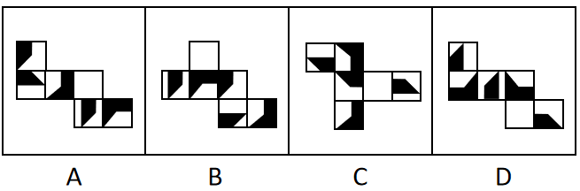
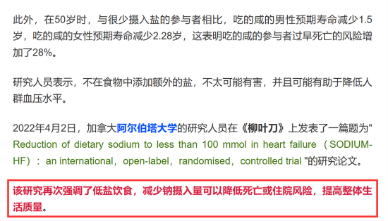

# 2023年四川省公务员录用考试《行测》试题（网友回忆版）

> 判断推理 · 30 题 · 四川 2023

## 第 1 题　qid 5509799 · 图形推理

从所给四个选项中，选择最合适的一个填入问号处，使之呈现一定的规律性：

- **A**. A　✅
- **B**. B
- **C**. C
- **D**. D

**答案**：A

**官方解析**

解法一：元素组成不同，且无明显属性规律，优先考虑数量规律。观察发现，题干图形均由和2种小元素构成，但整体小元素的种类和数量无规律，考虑元素换算。根据换算公式“图1+图3=2×图2”得出：1个=2个，换算后题干图形的数量分别为1、2、3、4、5，故“？”处图形应有6个，换算后只有A项符合。

解法二：元素组成不同，且无明显属性规律，优先考虑数量规律。观察发现，题干出现多个箭头，考虑箭头数量，题干图形箭头数量依次为2、3、4、5、6，故“？”处图形应有7个箭头，只有D项符合。

注：解法一的元素换算针对的是图形整体，解法二的箭头数量针对的是部分图形，在图形规律中整体规律优于部分规律，且解法二的部分箭头可看作箭头重合，故粉笔更倾向于解法一。

故正确答案为A。

---

## 第 2 题　qid 5509593 · 图形推理

从所给的四个选项中，选择最合适的一个填入问号处，使之呈现一定规律性：

- **A**. A
- **B**. B　✅
- **C**. C
- **D**. D

**答案**：B

**官方解析**

元素组成相同，优先考虑位置规律。观察上方第一组图形发现，图1以图2为轴经过左右翻转得到图3，图3再以图4为轴经过上下翻转得到图5。下方第二组图形应用此规律，图1以图2为轴经过上下翻转得到图3，图3再以图4为轴经过左右翻转得到？处图形。只有B项符合。
故正确答案为B。

---

## 第 3 题　qid 5509800 · 图形推理

从所给四个选项中，选择最合适的一个填入问号处，使之呈现一定的规律性：

- **A**. 254　✅
- **B**. 235
- **C**. 432
- **D**. 215

**答案**：A

**官方解析**

题干图形分为上下两组，观察发现，第一组图形均为字母，且沿箭头方向前一个图形中最右边的字母都在相邻的后一个图形的最左边。第二组图形均为数字，且沿箭头方向前一个图形中最右边的数字都在相邻的后一个图形的最左边，依此规律，？处所填数字最左边应为2，最右边应为4，只有A项符合。
故正确答案为A。

---

## 第 4 题　qid 5509552 · 图形推理

把下面的六个图形分为两类，使每一类图形都有各自的共同特征或规律，分类正确的一项是：

- **A**. ①②③，④⑤⑥
- **B**. ①②⑥，③④⑤　✅
- **C**. ①②④，③⑤⑥
- **D**. ①④⑥，②③⑤

**答案**：B

**官方解析**

本题为分组分类题目。元素组成不同，无明显属性规律，考虑数量规律。每个图形均由黑圆和白圆构成，且有部分黑圆和白圆被分隔开，因此考虑数部分数。发现图①②⑥白圆部分均为两部分，图③④⑤白圆部分均为三部分，故图①②⑥为一组，图③④⑤为一组。
故正确答案为B。

---

## 第 5 题　qid 5509801 · 图形推理

把下面的六个图形分为两类，使每一类图形都有各自的共同特征或规律，分类正确的一项是：

- **A**. ①②③，④⑤⑥
- **B**. ①②⑤，③④⑥
- **C**. ①②⑥，③④⑤
- **D**. ①④⑥，②③⑤　✅

**答案**：D

**官方解析**

本题为分组分类题目。元素组成不同，无明显属性规律，考虑数量规律。观察发现，题干图①、图⑤存在端点，图③为“田”字变形图，图⑥为“日”字变形图，考虑笔画数，图①④⑥均为一笔画图形，图②③⑤均为两笔画图形。即图①④⑥为一组，图②③⑤为一组。
故正确答案为D。

---

## 第 6 题　qid 5509671 · 图形推理

下面四个正方体纸盒的外表面展开图中，与其他三个折叠成的纸盒不相同的是：

- **A**. A
- **B**. B　✅
- **C**. C
- **D**. D

**答案**：B

**官方解析**

将选项展开图中的面标上序号，如下图所示（各选项包含的面都相同，故相同的面用相同字母表示），选项存在相同面，可以通过相同面公共边解题，逐一分析选项。

A项：面a、面b是相邻面，存在公共边（如上图所示），公共边紧邻面a白色多边形长边、面b黑色直角梯形上底边；

B项：面a、面b是相邻面，存在公共边（如上图所示），公共边紧邻面a白色多边形长边、面b白色矩形长边；

C项：面a、面b存在公共边（如上图所示），公共边紧邻面a白色多边形长边、面b黑色直角梯形上底边；

D项：面a、面b存在公共边（如上图所示），公共边紧邻面a白色多边形长边、面b黑色直角梯形上底边。

综上，只有B项与其他三项不同。

本题为选非题，故正确答案为B。

---

## 第 7 题　qid 5509789 · 定义判断

草地土壤是草原、草甸和草坪等草地植被下发育成的土壤。林地土壤是天然林、次生林和人工林等林地植被下发育成的土壤。农田土壤是人类开垦利用，通过耕种、施肥、灌排等措施长期种植农作物的土壤。
根据上述定义，下列属于农田土壤的是：

- **A**. 牧民甲今年把自家承包草场的部分土地深翻了一遍以期牧草丰收
- **B**. 农户乙在自家屋后的荒坡上挖土开凿了一个水池，用于积蓄雨水
- **C**. 果农丙利用自家承包的苹果山林土地播种枸杞，产量较为可观
- **D**. 牧民丁在其草场一处湖边垦荒近千亩土地，年年种植小麦和玉米　✅

**答案**：D

**官方解析**

第一步：找出定义关键词。
草地土壤：“草原、草甸和草坪等”、“草地植被下发育成的土壤”；
林地土壤：“天然林、次生林和人工林等”、“林地植被下发育成的土壤”；
农田土壤：“人类开垦利用”、“通过耕种、施肥、灌排等措施”、“长期种植农作物的土壤”。
第二步：逐一分析选项。
A项：牧民将承包的草场深翻后以期牧草丰收，符合“草原、草甸和草坪等”、“草地植被下发育成的土壤”，符合“草地土壤”定义，不符合“农田土壤”定义，排除；
B项：农户在自家屋后的荒坡挖水池用来蓄水，荒坡不符合“通过耕种、施肥、灌排等措施”、“长期种植农作物的土壤”，不符合“农田土壤”定义，排除；
C项：果农利用自家承包的苹果山林土地播种枸杞，苹果山林土地符合“天然林、次生林和人工林等”、“林地植被下发育成的土壤”，符合“林地土壤”定义，不符合“农田土壤”定义，排除；
D项：牧民在草场一处湖边垦荒土地，年年种植小麦和玉米，垦荒土地符合“人类开垦利用”，年年种植小麦和玉米符合“通过耕种、施肥、灌排等措施”、“长期种植农作物的土壤”，符合“农田土壤”定义，当选。
故正确答案为D。

---

## 第 8 题　qid 5509661 · 定义判断

环境知觉是人们在环境外观感觉的基础上对地理环境的整体认识和综合解释的过程，是环境刺激与个体已有知识经验相互作用的结果。环境认知是人们对环境信息再现大脑后的认识，它是人们对地理环境识记再现的一种形态，当人们对以前识记的地理环境再度感知的时候，觉得熟悉，仍能认识，经过进一步分析思考后能够做出知觉判断。
根据上述定义，下列涉及环境认知的是：

- **A**. 老杨是生活在一座超大城市的老居民，经常在没有地图导航的情况下从城市北边开车到南边去爬山　✅
- **B**. 小周是建筑设计师，认为红砖建筑直接暴露建筑材料是“纯粹”的表现，但小李却认为建筑物不加装修，外观蹩脚
- **C**. 小朱平时喜欢观看介绍风景名胜的纪录片，特别是关于九寨沟的反复看了好多遍。当她第一次去九寨沟看到那些美景时，一种强烈的熟悉感涌上心头
- **D**. 小王是专业的地图测绘员，工作时开着装有摄像头和激光雷达的测绘车，对所到之处的街景进行测绘后获得测绘数据，最终形成一份高精度的数字化地图

**答案**：A

**官方解析**

第一步：找出定义关键词。
环境知觉：“在环境外观感觉的基础上”、“对地理环境的整体认识和综合解释”、“环境刺激与个体已有知识经验相互作用”；
环境认知：“人们对环境信息再现大脑后的认识”、“对以前识记的地理环境再度感知”、“觉得熟悉，仍能认识，经过进一步分析思考后能够做出知觉判断”。
第二步：逐一进行分析。
A项：老杨是一座超大城市的老居民，经常在没有地图导航的情况下从北边开车到南边去爬山，符合“对以前识记的地理环境再度感知”、“觉得熟悉，仍能认识，经过进一步分析能做出知觉判断”，符合“环境认知”定义，当选；
B项：小周是建筑设计师，认为红砖建筑应该暴露建筑材料，但小李却认为建筑物不加装修，外观蹩脚，小周和小李对于建筑物是否加装修都有自己的看法，符合“在环境外观感觉的基础上”、“对地理环境的整体认识和综合解释”、“环境刺激与个体已有知识经验相互作用”，符合“环境知觉”定义，不符合“环境认知”定义，排除；
C项：小朱看了很多遍九寨沟的纪录片，当她第一次去九寨沟看到那些美景时，觉得很熟悉，只能说明因为之前总是看九寨沟的纪录片，这一次身临其境了觉得很熟悉，但并没有提到熟悉了之后进一步分析做出知觉判断，不符合“经过进一步分析能做出知觉判断”，不符合“环境认知”定义，排除；
D项：小王对所到之处的街景进行测绘后获得测绘数据，最终形成数字化地图，不符合“人们对环境信息再现大脑后的认识”、“对以前识记的地理环境再度感知”、“觉得熟悉，仍能认识，经过进一步分析能做出知觉判断”，不符合“环境认知”定义，排除。
故正确答案为A。

---

## 第 9 题　qid 5509558 · 定义判断

无效运输指的是没有任何经济社会效益的运输，具体是指物资中所包含的无使用价值的那部分杂质的运输，这种运输不仅浪费交通运力，而且消费该物资的单位或企业也得不到保质保量的产品。
根据上述定义，下列属于无效运输的是：

- **A**. 某国矿产资源分布不均，由此形成北矿南运、西矿东调的长距离运输
- **B**. 原油中掺杂有超量水分并投入使用时，会增加机器设备被磨损腐蚀风险
- **C**. 运输的原煤中有25%是不能用于燃烧的矸石和灰分，造成铁路运力的耗费　✅
- **D**. 向海外运送瓷器时，选择了成本较高的航空运输，没有发挥出水路运输的优势

**答案**：C

**官方解析**

第一步：找出定义关键词。
“没有任何经济社会效益的运输”、“物资中所包含的无使用价值的那部分杂质”、“浪费交通运力”。
第二步：逐一分析选项。
A项：北矿南运、西矿东调的长距离运输，体现了矿产资源的空间调配，有利于社会经济发展，不符合“没有任何经济社会效益的运输”，不符合定义，排除；
B项：原油中掺杂有超量水分会增加机器设备被磨损腐蚀风险，但没有体现对原油中掺杂的超量水分的运输，不符合“没有任何经济社会效益的运输”，不符合定义，排除；
C项：运输的原煤中有25%是不能用于燃烧的矸石和灰分，符合“物资中所包含的无使用价值的那部分杂质”，造成铁路运力的耗费，符合“浪费交通运力”，也符合“没有任何经济社会效益的运输”，符合定义，当选；
D项：向海外运送瓷器时，选择了成本较高的航空运输，没有发挥出水路运输的优势，但不管选择哪种运输方式，运送的瓷器会带来经济或社会效益，不符合“没有任何经济社会效益的运输”，不符合定义，排除。
故正确答案为C。

---

## 第 10 题　qid 5509588 · 定义判断

结构性进入壁垒是指企业自身无法支配的、外生的，由产品技术特点、资源供给条件、社会法律制度、政府行为以及消费者偏好等因素所形成的壁垒。策略性进入壁垒是指产业内的企业为保持在市场上的主导地位，获取垄断利润，利用自身的优势通过一系列的有意识的策略性行为构筑起的防止潜在进入者进入的壁垒。
根据上述定义，下列属于策略性进入壁垒的是：

- **A**. 我国拍摄一部动画片动辄需上百万、数千万人民币资金，且产业链尚未完善，使得规模较小的甲动画投资公司只能望而却步
- **B**. 乙国汽车厂商在推出一款新车型之前，必须先由政府指定机构对车辆性能进行严格检验，未经检验或未通过检验的车型不得生产
- **C**. 丙公司在疫情期间看到线上卖菜的商机，在某市设置了多个卖点。但因许多行业巨头已在该城市运营多年，导致丙公司迟迟打不开市场
- **D**. 丁乳制品公司在某地方市场占有量极大，随着该地乳制品消费量增加，小公司纷纷试水。在此情况下，丁公司经常靠低价促销来巩固市场地位　✅

**答案**：D

**官方解析**

第一步：找出定义关键词。
结构性进入壁垒：“企业自身无法支配的、外生的”、“由产品技术特点、资源供给条件、社会法律制度、政府行为以及消费者偏好等因素所形成的壁垒”；
策略性进入壁垒：“产业内的企业为保持在市场上的主导地位，获取垄断利润”、“利用自身的优势”、“通过有意识的策略性行为”、“构筑防止潜在进入者进入的壁垒”。
第二步：逐一分析选项。
A项：动画片成本高、产业链尚未完善等问题是“产品技术特点、资源供给条件等形成的壁垒”，符合“结构性进入壁垒”定义，不符合“策略性进入壁垒”定义，排除；
B项：推出新车型前需先由政府指定机构对车辆性能进行严格检验，属于由“政府行为形成的壁垒”，符合“结构性进入壁垒”定义，不符合“策略性进入壁垒”定义，排除；
C项：丙公司难以打开市场是因为许多行业巨头已在该城市运营多年，这说明丙公司不是行业巨头，不具备在市场上的主导地位，不符合“产业内的企业为保持在市场上的主导地位，获取垄断利润”，不符合“策略性进入壁垒”定义，排除；
D项：丁公司市场占有量极大，符合“产业内的企业为保持在市场上的主导地位，获取垄断利润”，经常靠低价促销来巩固市场地位，符合“利用自身的优势”、“通过有意识的策略性行为”、“构筑防止潜在进入者进入的壁垒”，符合“策略性进入壁垒”定义，当选。
故正确答案为D。

---

## 第 11 题　qid 5509592 · 定义判断

情绪智力是指个体察觉、处理自我及他人情绪，并利用情绪信息指导行动的能力。
根据上述定义，下列属于情绪智力的是：

- **A**. 考试时由于过度紧张，小张脑子一片空白，经过一番调整，终于可以平静地答题了
- **B**. 小赵在路上遇到一条恶狗，吓得她浑身冒冷汗，还好她强装镇定，恶狗终于走开了
- **C**. 小钱与室友发生了矛盾并心生不满，但当她了解到事情原委后，立即主动向室友诚恳道歉
- **D**. 列车乘务员小李被旅客无端指责后，仍然克制地向旅客耐心解释，最终帮旅客解决了问题　✅

**答案**：D

**官方解析**

第一步：找出定义关键词。
“个体察觉、处理自我及他人情绪”、“利用情绪信息指导行动”。
第二步：逐一分析选项。
A项：小张平复自己紧张的情绪后答题，只是小张对自己情绪的处理，没有体现如何处理他人的情绪，不符合“个体察觉、处理自我及他人情绪”，不符合定义，排除；
B项：小赵遇到恶狗后强装镇定，只是小赵对自己情绪的处理，没有体现如何处理他人的情绪，不符合“个体察觉、处理自我及他人情绪”，不符合定义，排除；
C项：小钱是在得知事情原委后，才向室友道歉，并没有体现出小钱如何处理自己和他人的情绪，不符合“个体察觉、处理自我及他人情绪”，不符合定义，排除；
D项：小李被旅客无端指责后，仍能克制地向其耐心解释，“克制”是对自己情绪的处理，利用克制住的情绪耐心地向旅客解释，符合“利用情绪信息指导行动”，最终问题得以解决，是对旅客情绪的处理，符合“个体察觉、处理自我及他人情绪”，符合定义，当选。
故正确答案为D。

---

## 第 12 题　qid 5509578 · 定义判断

生物多样性评估是指以生物多样性保护和可持续利用为目的而开展的基因、物种和生态系统多样性调查和评价活动。由于生物多样性评估依赖于数据的可获取性，许多情况下受直接测定的限制，人们不得不采取代理指标评估方法，即运用一类与生物多样性及其时空分布具有统计相关性的特殊生物类群或环境因子进行评估的方法。
根据上述定义，下列体现了生物多样性代理指标评估方法的是：

- **A**. 利用遥感数据绘制景观图像，评估某地区物种组成的丰富度
- **B**. 采用野生鸟类（或蝴蝶）指数判断某区域生态系统的保护状态　✅
- **C**. 建立物种-面积关系模型，评估某栖息地丧失对特定生物种群的影响
- **D**. 选择地理因子将某区域划分为5个生物大区、7个生物亚区和18个生物群区

**答案**：B

**官方解析**

第一步：找出定义关键词。
生物多样性评估：“以生物多样性保护和可持续利用为目的”、“基因、物种和生态系统多样性调查和评价活动”；
代理指标评估方法：“与生物多样性及其时空分布具有统计相关性”、“特殊生物类群或环境因子”、“进行评估的方法”。
第二步：逐一分析选项。
A项：利用遥感数据绘制景观图，不符合“与生物多样性及其时空分布具有统计相关性”、“特殊生物类群或环境因子”，不符合“生物多样性代理指标评估方法”定义，排除；
B项：采用野生鸟类（或蝴蝶）指数判断某区域生态系统的保护状态，符合“与生物多样性及其时空分布具有统计相关性”、“特殊生物类群或环境因子”，符合“生物多样性代理指标评估方法”定义，当选；
C项：评估某栖息地丧失对特定生物种群的影响，不符合“与生物多样性及其时空分布具有统计相关性”、“特殊生物类群或环境因子”，不符合“生物多样性代理指标评估方法”定义，排除；
D项：选择地理因子将某区域划分，不符合“与生物多样性及其时空分布具有统计相关性”、“特殊生物类群或环境因子”，不符合“生物多样性代理指标评估方法”定义，排除。
故正确答案为B。

---

## 第 13 题　qid 5509792 · 定义判断

再造性想象是指根据言语的描述或图解的示意在头脑中形成相应的形象的过程，主体的知识经验越丰富、理解力越强，再造性想象的形成就越完善；创造性想象是指根据一定的目的，在头脑中独立地创造出某种新形象的过程。与再造性想象不同，创造性想象不是依据任何现成的描述形成的，而是以有关的记忆表象为基础按照自己的创见来创造新形象。
据上述定义，下列对应关系错误的是：
①苹果砸在牛顿头上，由此牛顿发现了万有引力
②建筑师根据图纸，想象出建筑物的具体形象
③鲁班因为受到茅草划破手背的启发，发明了锯子

- **A**. ①属于创造性想象
- **B**. ①②属于再造性想象　✅
- **C**. ②属于再造性想象
- **D**. ①③属于创造性想象

**答案**：B

**官方解析**

第一步：找出定义关键词。
再造性想象：“根据言语的描述或图解的示意”、“在头脑中形成相应的形象”；
创造性想象：“在头脑中独立地创造出某种新形象”、“不是依据任何现成的描述形成的”。
第二步：逐一进行分析。
①：牛顿因为苹果砸在头上，发现了万有引力，万有引力属于某种新形象，符合“在头脑中独立地创造出某种新形象”、“不是依据任何现成的描述形成的”，符合“创造性想象”的定义；
②：建筑师根据图纸，符合“根据言语的描述或图解的示意”，想象出建筑物的具体形象，符合“在头脑中形成相应的形象”，符合“再造性想象”定义；
③：鲁班根据茅草划破手背，想象出锯子，锯子属于某种新形象，符合“不是依据任何现成的描述形成的”，符合“在头脑中独立地创造出某种新形象”，符合“创造性想象”定义。
综上，对应关系错误的是B项。
本题为选非题，故正确答案为B。

---

## 第 14 题　qid 5509557 · 类比推理

霜降：秋季

- **A**. 雨水：春季
- **B**. 大暑：夏季　✅
- **C**. 清明：雨季
- **D**. 冬至：冬季

**答案**：B

**官方解析**

第一步：判断题干词语间逻辑关系。
霜降是二十四节气中的秋季节气，且是秋季的最后一个节气，二者是对应关系。
第二步：判断选项词语间逻辑关系。
A项：雨水是二十四节气中的春季节气，但春季的最后一个节气是谷雨，而雨水是春季的第二个节气，与题干逻辑关系不一致，排除；
B项：大暑是二十四节气中的夏季节气，且大暑是夏季的最后一个节气，与题干逻辑关系一致，当选；
C项：清明是二十四节气中的春季节气，与雨季无关，与题干逻辑关系不一致，排除；
D项：冬至是二十四节气中的冬季节气，但冬季最后一个节气是大寒，而冬至是冬季的第四个节气，与题干逻辑关系不一致，排除。
故正确答案为B。

---

## 第 15 题　qid 5509803 · 类比推理

中医：望闻问切

- **A**. 诗人：推敲琢磨
- **B**. 厨师：麻辣鲜香
- **C**. 京剧：唱念做打　✅
- **D**. 小品：说学逗唱

**答案**：C

**官方解析**

第一步：判断题干词语间逻辑关系。
望闻问切是中医用来诊断疾病的四种基本方法。望：指观气色，闻：指听声息，问：指询问症状，切：指摸脉象。中医与望闻问切之间为对应关系。
第二步：判断选项词语间逻辑关系。
A项：推敲琢磨是指对某件事认真思考，论证的过程，主体可以是任何人，诗人写诗时可能会进行推敲琢磨，但其并不是诗人写诗的四种基本方法，与题干逻辑关系不一致，排除；
B项：麻辣鲜香是指食物的四种味道，并不是厨师做菜时的四种基本方法，与题干逻辑关系不一致，排除；
C项：唱念做打是京剧表演的四种基本功。唱：指唱功，念：指音乐性念白，做：指做功，也就是表演，打：指武功。京剧与唱念做打之间为对应关系，与题干逻辑关系一致，当选；
D项：说学逗唱是相声的四个基本功，与小品没有明显的逻辑关系，与题干逻辑关系不一致，排除。
故正确答案为C。

---

## 第 16 题　qid 5509798 · 类比推理

书籍：书桌：读书

- **A**. 月圆：中秋：赏月
- **B**. 纸张：纸篓：废纸
- **C**. 蔬菜：菜篮：买菜　✅
- **D**. 净水：水杯：饮水

**答案**：C

**官方解析**

第一步：判断题干词语间逻辑关系。
“书籍”可以放在“书桌”上，二者构成物体与其空间的对应关系，“书桌”可以用来“读书”，二者为工具对应关系。
第二步：判断选项词语间逻辑关系。
A项：“月圆”是“中秋”的一种现象，二者为节日与其现象的对应关系，“赏月”是“中秋”的一种习俗，二者为节日与其习俗的对应关系，与题干逻辑关系不一致，排除；
B项：“废纸”可以放在“纸篓”里，二者构成物体与其空间的对应关系，但“废纸”是“纸张”的一种，二者为种属关系，与题干逻辑关系不一致，排除；
C项：“蔬菜”可以放在“菜篮”里，二者构成物体与其空间的对应关系，“菜篮”可以用来“买菜”，二者为工具对应关系，与题干逻辑关系一致，保留；
D项：“净水”可以放在“水杯”里，二者构成物体与其空间的对应关系，“水杯”可以用来“饮水”，二者为工具对应关系，与题干逻辑关系一致，保留。
对比C、D两项，题干中的“书籍”与C项中的“蔬菜”均为统称，而“净水”是“水”的一种，不是统称，因此C项与题干的逻辑关系更一致，当选。
故正确答案为C。

---

## 第 17 题　qid 5509804 · 类比推理

旱田作物：粮食作物：玉米

- **A**. 新闻媒体：广播电视：电台
- **B**. 陆地动物：软体动物：蚯蚓　✅
- **C**. 女性法官：外国法官：法官
- **D**. 国有企业：大型企业：集团

**答案**：B

**官方解析**

第一步：判断题干词语间逻辑关系。
旱田作物是从生长环境的角度对作物分类，粮食作物是从用途的角度对作物分类，二者为交叉关系，玉米既是旱田作物，也是粮食作物，与前两者构成种属关系。
第二步：判断选项词语间逻辑关系。
A项：新闻媒体包括纸质媒体（报刊）和电子媒体（广播、电视）两种，与广播电视构成种属关系，电台应用于广播电视，与广播电视构成对应关系，与题干逻辑关系不一致，排除；
B项：陆地动物是从生长环境的角度对动物分类，软体动物是从动物类群的角度对动物分类，二者为交叉关系，蚯蚓是陆地动物，但不是软体动物，而是环节动物，蚯蚓与第二词不构成种属关系，与题干逻辑关系不一致，排除；
C项：女性法官是从性别的角度对法官分类，外国法官是从国籍的角度对法官分类，二者为交叉关系，女性法官是法官，外国法官是法官，法官与前两者构成种属关系，但词语顺序与题干相反，与题干逻辑关系不一致，排除；
D项：国有企业是从所有制性质的角度对企业分类，大型企业是从规模的角度对企业分类，二者是交叉关系，有的集团是国有企业，有的集团不是国有企业，有的国有企业是集团，有的国有企业不是集团，集团与国有企业构成交叉关系，与题干逻辑关系不一致，排除。
备注：选项中没有与题干关系完全一致的，故本题可能为错题，无需纠结题目答案，重点了解词语间的关系。
故正确答案为B。

---

## 第 18 题　qid 5509802 · 类比推理

锅碗瓢盆 对于 （    ） 相当于 （    ） 对于 琴棋书画

- **A**. 亭台楼阁；花鸟鱼虫
- **B**. 油盐酱醋；梅兰竹菊
- **C**. 王侯将相；山川河岳
- **D**. 衣食住行；笔墨纸砚　✅

**答案**：D

**官方解析**

逐一代入选项。
A项：锅碗瓢盆是四种厨房日常生活用品，四字为并列关系，亭台楼阁是四种不同的建筑，四字为并列关系，二者无明显逻辑关系；花鸟鱼虫是观赏用的花草、鸟儿、鱼儿、爬虫，四字为并列关系，琴棋书画指古琴、围棋、书法、国画，四字为并列关系，但二者无明显逻辑关系，前后逻辑关系不一致，排除；
B项：锅碗瓢盆是四种厨房日常生活用品，四字为并列关系，油盐酱醋是四种烹调佐料，四字为并列关系，且二者均属于生活范畴；梅兰竹菊指梅花、兰花、竹、菊花，四字为并列关系，琴棋书画指古琴、围棋、书法、国画，四字为并列关系，但二者无明显逻辑关系，前后逻辑关系不一致，排除；
C项：锅碗瓢盆是四种厨房日常生活用品，四字为并列关系，王侯将相为贵族的四种称谓，四字为并列关系，二者无明显逻辑关系；山川河岳四字不是并列关系，琴棋书画指古琴、围棋、书法、国画，四字为并列关系，但二者无明显逻辑关系，前后逻辑关系不一致，排除；
D项：锅碗瓢盆是四种厨房日常生活用品，四字为并列关系，衣食住行泛指穿衣、吃饭、住房、行路四种日常生活中的基本需要，四字为并列关系，且二者均属于生活范畴；笔墨纸砚是四种书画用具，四字为并列关系，琴棋书画原指古琴、围棋、书法、国画，后泛指弹琴、弈棋、写字、绘画，用来表示个人的文化素养，四字为并列关系，且二者均属于文化范畴，前后逻辑关系一致，当选。
故正确答案为D。

---

## 第 19 题　qid 5509791 · 类比推理

（    ） 对于 空调 相当于 秒针 对于 （    ）

- **A**. 外挂机；钟表　✅
- **B**. 通风口；表链
- **C**. 净化器；时间
- **D**. 小家电；时针

**答案**：A

**官方解析**

逐一代入选项。
A项：外挂机是空调的组成部分，二者是组成关系；秒针是钟表的组成部分，二者是组成关系，前后逻辑关系一致，当选；
B项：通风口是空调的组成部分，二者是组成关系；秒针和表链是并列关系，前后逻辑关系不一致，排除；
C项：净化器和空调是两种不同的家电，二者是并列关系；秒针转动可以体现时间的流动，二者是对应关系，前后逻辑关系不一致，排除；
D项：小家电指除了大功率输出的电器以外的家电，空调不是小家电，二者为反向种属关系；秒针和时针是并列关系，前后逻辑关系不一致，排除。
故正确答案为A。

---

## 第 20 题　qid 5509581 · 逻辑判断

“饿怒”是“饥饿”和“愤怒”两个词的合成词。最近，研究人员在欧洲招募了64位自愿受试者，在21天里，对他们在日常工作和生活环境中，处于饥饿状态时的情绪变化数据进行了收集整理分析。得出的结论是，愤怒和易恼等情绪与饥饿之间存在被诱导的关系，也就是说，饥饿会使人们“饿怒”。
以下哪项如果为真，最能支持上述结论?

- **A**. 受试者在饥饿状态下，能保持情绪愉悦的只有不到10%
- **B**. 饥饿与更强烈的愤怒和易恼情绪以及更低的愉悦感有关
- **C**. 饥饿状态下的受试者，47%出现易恼情绪，44%出现愤怒情绪　✅
- **D**. 科学家早已知道饥饿会影响人的情绪，但才发现会导致“饿怒”

**答案**：C

**官方解析**

论点：愤怒和易恼等情绪与饥饿之间存在被诱导的关系，也就是说，饥饿会使人们“饿怒”。
论据：无。
本题只有论点，没有论据，加强优先考虑补充论据，即解释原因或举例子。
A项：该项说的是饥饿很难使人保持情绪愉悦，而论点说的是饥饿会使人们“饿怒”，话题不一致，无法加强，排除；
B项：该项说的是饥饿与愤怒和易恼情绪以及更低的愉悦感有关，与论点表述一致，可以加强，保留；
C项：该项说的是饥饿状态下的受试者出现易恼、愤怒情绪的概率，说明饥饿会导致愤怒和易恼，补充了题干的实验数据，可以加强，保留；
D项：该项说的是科学家才发现饥饿会导致“饿怒”，科学家发现的时间早晚与论点讨论的饥饿会使人们“饿怒”无关，无法加强，排除。
对比B、C两项，B项只说了饥饿和愤怒的情绪相关，属于重复论点，而C项在原有论证的基础上补充了明确的实验数据来支持论点，故C项的力度更强。
故正确答案为C。

---

## 第 21 题　qid 5509794 · 逻辑判断

当前，智能客服广泛应用于各类场景，给人们带来了诸多便利的同时，也常出现读不懂关键词、回答呆板、答非所问等不够智能的现象，成为很多人消费维权要闯的“第一道关”。其痛点多影响消费体验，也在一定程度上成为阻碍消费需求释放的“拦路虎”。因此，人工客服不能缺位。
以下哪项如果为真，最能支持上述结论？

- **A**. 智能客服的痛点问题除技术因素外，还在于一些企业过于重视智能化、低成本，忽视了便利化和消费者满意度
- **B**. 智能客服的发展受限于底层技术，智能客服的“语义解析”工作属于自然语言处理，是目前人工智能领域最具挑战性的问题
- **C**. 一项调查显示，有52.9%的消费者遇到过客服沟通障碍问题，其中71.2%是由于智能客服不够智能、“答非所问”引起的
- **D**. 智能客服与人工客服并非互相取代的关系，智能客服需要通过学习人工客服逐步完善，人机协同也能更好地回应消费者诉求　✅

**答案**：D

**官方解析**

第一步：找出论点和论据。
论点：人工客服不能缺位。
论据：智能客服广泛应用于各类场景，给人们带来了诸多便利的同时，也常出现读不懂关键词、回答呆板、答非所问等不够智能的现象，成为很多人消费维权要闯的“第一道关”。其痛点多影响消费体验，也在一定程度上成为阻碍消费需求释放的“拦路虎”。
本题论点说的是人工客服不能缺位，论据说的是智能客服的缺点，论点论据话题不一致，加强优先考虑搭桥，其次考虑补充论据。
第二步：逐一分析选项。
A项：该项说的是智能客服的痛点，补充论据，说明智能客服的其他缺点，可以加强，保留；
B项：该项说的是智能客服的发展还存在技术限制，说明智能客服还存在不足，补充论据，说明智能客服的其他缺点，可以加强，保留；
C项：该项用数据说明智能客服与消费者之间确实存在一些沟通障碍，补充论据，说明智能客服的其他缺点，可以加强，保留；
D项：该项说的是智能客服与人工客服之间的关系是相辅相成的，人机协同能更好地回应消费者诉求，由此可以得出人工客服不能缺位，补充论据，可以加强，保留。
对比A、B、C、D四项，A、B、C三项均从“智能客服的缺点”的角度补充论据，并没有直接提到“人工客服”，而D项提到了人工客服，且由该项内容和论据可以推出人工客服不能缺位，因此，D项的加强力度更强，当选。
故正确答案为D。

---

## 第 22 题　qid 5509805 · 逻辑判断

快速暴汗、狂甩赘肉、不胖勿点······近期暴汗服可谓火爆网络。商家直播时声称，穿暴汗服运动半小时，所流的汗水超过不穿暴汗服状态下运动2小时所流的汗水。因此能帮助运动者加快新陈代谢，降低体重，迅速减肥。以下哪几项如果为真，最能质疑商家宣传？
①暴汗后的即时体重下降，减少的是身体里的水分，没有减少脂肪
②暴汗服是利用衣服材质不透气性和隔热性，让人运动时出更多汗
③大量出汗使人体水分大量流失，易造成脱水，严重时会危及生命
④脂肪分解主要产生二氧化碳，通过肺呼出，出汗多不等于减脂肪

- **A**. ①④　✅
- **B**. ②③
- **C**. ①③④
- **D**. ①②③④

**答案**：A

**官方解析**

第一步：找出论点和论据。
论点：穿暴汗服能帮助运动者加快新陈代谢，降低体重，迅速减肥。
论据：穿暴汗服运动半小时，所流的汗水超过不穿暴汗服状态下运动2小时所流的汗水。
本题论点讨论的是穿暴汗服可以减肥，论据讨论的是穿暴汗服运动流汗多。要求从选项中选择有削弱力度的多项，可以先不预设。
第二步：逐一进行分析。
①暴汗服只是减少了水分，不能减少脂肪，也就不能达到减肥的结果，拆断了出汗和减肥之间的关系，可以削弱；
②暴汗服是由于衣服的材质可以让人更多的出汗，解释了穿暴汗服出汗多的原理，有加强的力度，无法削弱，排除；
③大量出汗会有不利的结果，但与穿暴汗服运动之后能不能迅速减肥无关，话题不一致，排除；
④脂肪分解产生的二氧化碳是通过肺呼出，出汗多不等于减脂肪，拆断了穿暴汗服出汗与减肥之间的必然联系，可以削弱。
综上，能削弱的为①④。
故正确答案为A。

---

## 第 23 题　qid 5509797 · 逻辑判断

在人类进化过程中，到底是什么因素引起了人脑生长增大呢？一项研究指出，人类祖先最初主要捕食非洲大陆上最大、行动速度最慢的猎物。但在约460万年前，大型动物开始消失或减少，人类转而捕食体型较小的动物。研究结论是，这种转变让人脑承受进化压力，使其生长变大，因为较小的猎物更难跟踪和捕捉，捕猎小型动物的过程也更复杂。
以下哪项如果为真，最能质疑上述结论？

- **A**. 研究证明，人脑的生长增大是由诸多因素引起的，而非由单一因素造成的　✅
- **B**. 在距今约百万年前的人类遗址中还遍布大象骨头，表明大象仍是捕食对象
- **C**. 脑组织完善，脑细胞数量增多，这是人类长期改造自然界和人自身的结果
- **D**. 哲学家认为，生产劳动促进了人脑生长增大及大脑形成和组织结构的完善

**答案**：A

**官方解析**

第一步：找出论点和论据。
论点：人类转而捕食体型较小的动物让人脑承受进化压力，使其生长变大。
论据：较小的猎物更难跟踪和捕捉，捕猎小型动物的过程也更复杂。
本题论点讨论的是“人类捕食体型较小的动物使人脑生长变大”，论据讨论的是“捕捉较小的猎物更难也更复杂”，二者讨论的话题一致，削弱优先考虑削弱论点，即说明捕食体型较小的动物不能使人脑生长变大。
第二步：逐一分析选项。
A项：说明单一因素无法促使人脑的生长增大，因此，仅靠捕食动物体型大小的改变这一因素无法得出可以促使人脑生长变大的结论，否定论点，可以削弱，当选；
B项：只能说明百万年前大象仍是人类的捕食对象，但无法说明此时人类不捕食体型较小的动物，以及脑部进化与人类捕食体型较小动物的关系，无法削弱，排除；
C项：说明脑部进化是长期改造自然界和人自身的结果，但论点讨论的是脑部进化与人类捕食体型较小动物的关系，二者话题不一致，无法削弱，排除；
D项：生产劳动促进了人脑生长增大及大脑形成和组织结构的完善，这只是哲学家的想法，但是否符合实际不明确，为不明确项，无法削弱，排除。
故正确答案为A。

---

## 第 24 题　qid 5509560 · 逻辑判断

有研究小组通过分析145名12岁儿童的核磁共振成像扫描结果，并基于儿童的住址信息评估他们近期接触的大气污染情况，其中包括细颗粒物质等。研究人员还将人口统计信息纳入分析，从而分析社会经济地位和种族因素是否会对研究结果造成影响。研究小组对比分析儿童近期与交通相关的空气污染暴露指数、报告的焦虑症和脑成像数据之后，发现生活在空气污染暴露指数较高区域的儿童出现广泛性焦虑症。
以下哪项如果为真，最能加强上述论证？

- **A**. 出生前接触多环芳烃等污染颗粒较多的儿童，其左脑白质体积较少，白质是一种白色脂肪物质，它能使神经元绝缘
- **B**. 焦虑症是一种复杂的疾病，肌醇异常引起的大脑功能紊乱与交通污染和焦虑症之间关联性不高
- **C**. 多环芳烃暴露水平较高的儿童，常缺乏营养食物，相应的住房条件和享用的公共设施也较差
- **D**. 有充分理由表明空气污染会直接影响大脑，这些细微污染颗粒会对人类精神健康产生影响　✅

**答案**：D

**官方解析**

第一步：找出论点和论据。
论点：生活在空气污染暴露指数较高区域的儿童出现广泛性焦虑症。
论据：无。
本题讨论的是空气污染和焦虑症之间的关系，且只有论点，因此可预设到补充论据的方式加强，要么解释空气污染和焦虑症之间的关系，要么通过举例子说明空气污染和焦虑症之间有关。
第二步：逐一分析选项。
A项：出生前接触污染的儿童，左脑白质体积较少，白质会使神经元绝缘，但白质体积减少与题干所说的广泛性焦虑症有什么关系是不明确的，因此属于不明确项，无法加强，排除；
B项：肌醇异常引起的大脑功能紊乱与交通污染和焦虑症之间关联性不高，但题干讨论的是空气污染和焦虑症之间的关系，话题不一致，无法加强，排除；
C项：多环芳烃暴露水平较高的儿童也会存在其他一些不利的情况，但多环芳烃与空气污染之间的关系无从得知，所存在的这些不利情况与焦虑症的关系也不明确，因此属于不明确项，无法加强，排除；
D项：空气污染会影响大脑，污染颗粒会对精神健康产生影响，而焦虑症也是与大脑精神健康相关，补充论据，解释了为什么生活在空气污染较高的区域会出现焦虑症，解释原因，可以加强，当选。
故正确答案为D。

---

## 第 25 题　qid 5509790 · 逻辑判断

哈佛大学最近的一项研究选取了权威数据库中的五十多万名年龄介于40-69岁之间的参与者，并且所有参与者均完成了食物加盐频率的问题，研究人员还考虑了年龄、性别、吸烟、饮酒、饮食和医疗状况等综合因素。该研究显示在50岁时与很少摄入盐的参与者相比，吃的咸的男性预期寿命减少1.5岁，吃的咸的女性预期寿命减少2.28岁。吃的咸的参与者过早死亡的风险增加了28%，因此食物中添加盐的频率越高，过早死亡风险越高，预期寿命也越低。
以下哪项如果为真，最能加强上述论证？

- **A**. 孙先生患有胃癌，医生发现他有吃咸泡菜的习惯，延续了30多年，医生建议孙先生妻子前来检查，其妻子也被检查出胃癌
- **B**. 高盐食物容易破坏胃粘膜，腌制类食物中含有的亚硝酸盐，还会在胃部产生亚硝胺等高致癌之物，增加了患癌的风险
- **C**. 日常生活中保持低盐饮食，减少钠摄入量，可以降低生物生病住院风险或者降低死亡风险，提高人们的整体生活质量　✅
- **D**. 钠是人体重要的阳离子，长期低盐体内钠元素不足，易造成潜在的低血钠，会引起恶心，内分泌紊乱

**答案**：C

**官方解析**

第一步：找出论点和论据。

论点：食物中添加盐的频率越高，过早死亡风险越高，预期寿命也越低。

论据：在50岁时与很少摄入盐的参与者相比，吃的咸的男性预期寿命减少1.5岁，吃的咸的女性预期寿命减少2.28岁。吃的咸的参与者过早死亡的风险增加了28%。

论点和论据都在讨论“高盐”与“死亡风险高、预期寿命低”之间的关系，论点论据话题一致，加强优先考虑补充论据。

第二步：逐一分析选项。

本题AB项都是在讨论 “高盐”与“患癌”之间的关系，题干论点是在讨论“高盐”与“死亡风险高、预期寿命低”之间的关系，AB项的话题与论点不算完全一致；

另外本题问的是“加强论证”，题干论据是通过研究“高盐人群的预期寿命会减少、过早死亡的风险会增加”，但并没有给到“低盐人群预期寿命和死亡风险的情况”，现在C项补充对比论据“低盐人群的死亡风险低”，比AB项更能证明“高盐”与“死亡风险高”之间的关系；

最后小粉笔也去查询了相关文献，如下图所示，在原文中，作者也是用“低盐人群的死亡风险低”这样的结论来佐证的，即本题的C项。

D项：长期低盐会引起内分泌紊乱，说明一直低盐不好，但并不知道高盐是否死亡风险高，也不是题干实验需要的对比论据，无法加强，排除。

故正确答案为C。

---

## 第 26 题　qid 5509591 · 逻辑判断

有研究表明，睡眠不足会导致人在社交上消极，从而变得更加孤立，导致孤独感倍增。而且睡眠不足的影响不仅局限于个体，还会影响到周围的人——损害了人的基本社会良知，放弃了帮助他人的意愿，因此，鉴于目前睡眠不足的普遍性，以及人类互帮互助维持合作对于社会的重要性，睡眠对现实世界的影响不可小觑。
以下哪项如果为真，最能加强上述论证？

- **A**. 有证据表明，为确保人类具有亲社会、有同情心、善良和慷慨的行为，睡眠是一个不可或缺的润滑剂
- **B**. 睡眠不足会让人更缺乏同情心，更不慷慨，在社交上更孤独与孤僻，而孤独感是会传染的　✅
- **C**. 被试者在睡眠不足条件下，其大脑中的社会认知网络变得不活跃，且助人意愿也显著下降
- **D**. 在与他人进行互助时，那些睡眠不足的人几乎像病毒一样将自己的孤独感传染给了其他人

**答案**：B

**官方解析**

第一步：找出论点和论据。
论点：鉴于目前睡眠不足的普遍性，以及人类互帮互助维持合作对于社会的重要性，睡眠对现实世界的影响不可小觑。
论据：睡眠不足会导致人在社交上消极，从而变得更加孤立，导致孤独感倍增。还会影响到周围的人——损害了人的基本社会良知，放弃了帮助他人的意愿。
本题论点和论据话题一致，都在讨论“睡眠不足的影响”，加强优先考虑补充论据。
第二步：逐一分析选项。
A项：该项说的是睡眠在确保人类具有亲社会、有同情心、善良和慷慨的行为方面是一个“不可或缺”的润滑剂，通过证据表明睡眠对现实世界的影响确实“不可小觑”，补充论据，能够加强，保留；
B项：该项说的是睡眠不足会让人更缺乏同情心，更不慷慨，在社交上更孤独与孤僻，而孤独感是会传染的，说的是睡眠不足的不利影响，说明睡眠确实很重要，补充论据，能够加强，保留；
C项：该项说的是睡眠不足的人，其大脑中的社会认知网络变得不活跃，且助人意愿也显著下降，说的是睡眠不足在助人方面的不利影响，说明睡眠确实很重要，补充论据，能够加强，保留；
D项：该项说的是在与他人进行互助时，睡眠不足的人将自己的孤独感传染给了其他人，说的是睡眠不足在与人互助方面的不利影响，说明睡眠确实很重要，补充论据，能够加强，保留。
对比四个选项，论点虽然说的是“睡眠”对现实世界的影响不可小觑，但是这里的“睡眠”联系上下文，其实应该是“睡眠不足”对现实世界的影响不可小觑，论点和论据都是在强调睡眠不足不仅对自己有影响，也会影响别人。
只有B项同时提到了“睡眠不足”、“让人更缺乏同情心，更不慷慨（即对自己的影响）”、“孤独感是会传染的（即对别人的影响）”；
A项说睡眠是润滑剂，就是强调一定要睡觉，但是“睡多睡少”的具体影响并不清楚；
C项只说自己不想帮别人（即对自己的影响），没有涉及对别人的影响；
D项更侧重“孤独感是会传染的（即对别人的影响）”，没有B项全面；
综上，从与题干关键词对应更全面的角度，B项优于其他选项。
故正确答案为B。

---

## 第 27 题　qid 5509793 · 逻辑判断

某消费导向杂志在读者中做了一项调查，以预测明年的消费趋势。在被调查者中，有57%的人在明年有奢侈品项目消费的计划。该杂志由此推测：明年消费者的消费能力会很强。
以下哪项如果为真，最能削弱该杂志的推测？

- **A**. 该刊物的读者要比一般消费者富有　✅
- **B**. 并非所有该刊物的读者都对调查作了回答
- **C**. 大多没有奢侈品项目消费计划的人都打算存钱买房
- **D**. 计划购买的奢侈品大多是进口的，并不能刺激国内市场

**答案**：A

**官方解析**

第一步：找出论点和论据。
论点：明年消费者的消费能力会很强。
论据：杂志读者的被调查者中有57%的人在明年有奢侈品项目消费的计划。
本题的论点讨论的是明年消费者的消费能力，论据强调的是某消费导向杂志的读者中，参与调查的人中有57%的人在明年有奢侈品项目消费的计划，论点和论据讨论的话题不一致，削弱优先考虑拆桥。
第二步：逐一分析选项。
A项：选项表述的是该刊物的读者要比一般消费者富有，说明该刊物的读者样本不具有代表性，切断了论据与论点的必然联系，为拆桥项，可以削弱，当选;
B项：选项表述的是并非所有该刊物的读者都对调查作了回答，说明有的读者没有给出明确的回答，但这部分读者的人数并不明确，无法削弱，排除;
C项：选项表述的是没有打算购买奢侈品的人打算存钱买房，但不明确这部分人明年到底是否会买房，明年的消费能力无法确定，为不明确项，无法削弱，排除;
D项：选项表述的是计划购买的奢侈品大多是进口的，并不能刺激国内市场，与论点讨论的消费者消费能力的变化无关，为无关项，无法削弱，排除。
故正确答案为A。

---

## 第 28 题　qid 5509584 · 逻辑判断

地球上水来自哪里？有研究认为彗星或小行星是主要来源。研究数据表明，彗星上的水分与地球水分并不匹配，而去年坠落在英国温奇科姆镇上的陨石中的水分与地球水分更匹配，这意味着小行星可能是太阳系内部和地球的主要水源。
以下哪项如果为真，最能削弱上述论证？

- **A**. 温奇科姆镇的陨石被发现的时候，当地正是雨季并且当天刚下过雨　✅
- **B**. 温奇科姆镇的陨石较少部分由水组成，这些水的组成与地球海洋中水的组成较为相似
- **C**. 温奇科姆镇发现的陨石是英国已知的第一颗碳质球粒陨石，碳质球粒陨石含水可能性较小
- **D**. 温奇科姆镇这块陨石来自木星附近的一颗小行星，它形成于大约50亿年前，比地球的形成要早

**答案**：A

**官方解析**

第一步：找出论点和论据。
论点：小行星可能是太阳系内部和地球的主要水源。
论据：有研究认为地球上水主要来自于彗星或小行星，但是彗星上的水分与地球水分并不匹配，而去年坠落在英国温奇科姆镇上的陨石中的水分与地球水分更匹配。
本题论据和论点都是在讨论地球上水主要来自于哪儿，论据通过排除法，彗星上的水分与地球水分并不匹配，所以得出论点“小行星可能是主要水源”，论据和论点话题一致，削弱优先考虑削弱论点，即“小行星可能不是主要水源”。
第二步：逐一分析选项。
A项：该项说陨石被发现的时候当天刚下过雨，说明陨石身上有地球自身水分存在，那么小行星可能不是主要水源，可以削弱，当选；
B项：该项说陨石上水的组成与地球海洋中水的组成较为相似，可以进一步说明陨石中的水分与地球水分更匹配，补充论据加强，无法削弱，排除；
C项：该项说该陨石属于碳质球粒陨石，而碳质球粒陨石含水可能性较小，但不明确该陨石是否一定不存在水，即使能削弱，也是针对的论据，没有A项削弱力度强，排除；
D项：该项说该陨石的来源及形成时间，与论点讨论的太阳系内部和地球的主要水源的话题无关，无法削弱，排除。
故正确答案为A。

---

## 第 29 题　qid 5509583 · 逻辑判断

小张想利用三天假期自驾川西小环线，去过的同事给出了如下建议：
①如果去四姑娘山，就不去墨石公园
②塔公草原和墨石公园去一个就好
③塔公草原和墨石公园都不去
小张犹豫了一下，对于同事的建议都没采纳，那么小张游玩了哪些景点?

- **A**. 去了四姑娘山、塔公草原、墨石公园　✅
- **B**. 去了塔公草原、墨石公园，没去四姑娘山
- **C**. 去了四姑娘山，没去塔公草原、墨石公园
- **D**. 没去四姑娘山、塔公草原，去了墨石公园

**答案**：A

**官方解析**

第一步：分析题干条件。

①去四姑娘山去墨石公园；

②要么去塔公草原，要么去墨石公园；

③去塔公草原 且 去墨石公园。

第二步：根据题干条件进行推理。

根据题干可知，三个建议都没采纳，则三个命题均为假，其矛盾命题均为真，由此可以推出：

④去四姑娘山 且 去墨石公园；

⑤去塔公草原和墨石公园，或不去塔公草原和墨石公园；

⑥去塔公草原 或 去墨石公园。

根据确定信息，即条件④和条件⑥可以直接确定去四姑娘山和墨石公园，要想符合条件⑤，只能同时也去塔公草原，即去了四姑娘山、塔公草原和墨石公园。

故正确答案为A。

---

## 第 30 题　qid 5509579 · 逻辑判断

周末，甲、乙、丙、丁在商场偶遇，一阵寒暄过后得知，他们几人在商场要么只看了电影，要么只购了物：
①丁有购物
②如果甲有购物，那么乙去看了电影
③如果丁没有购物，那么丙去看了电影
④甲和乙都有购物
如果以上陈述只有一项为真，可以推出：

- **A**. 乙有购物，甲看了电影
- **B**. 丙有购物，乙看了电影
- **C**. 丙有购物，丁看了电影　✅
- **D**. 甲和乙都看了电影

**答案**：C

**官方解析**

第一步：找出题干矛盾命题。

①丁购物；

②甲购物乙电影；

③丁购物丙电影；

④甲购物 且 乙购物。

根据题干条件甲、乙、丙、丁四人要么只看电影，要么只购物可知，条件④等价于“甲购物 且 乙电影”，与条件②为矛盾关系，必有一真一假。

第二步：根据题干条件进行推理。

根据题干条件可知，四个条件中只有一项为真，故条件①和条件③为假；根据条件①和条件③为假可知，其矛盾命题“丁购物”和“丁购物 且 丙电影”为真，因此丁看了电影，丙有购物，对应C项。

故正确答案为C。

---
