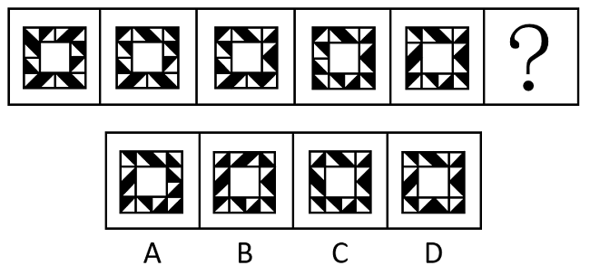
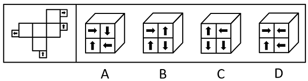
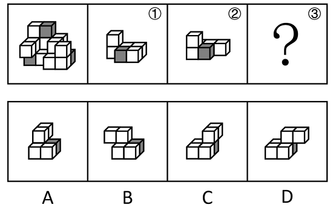
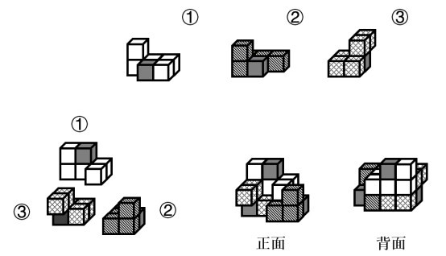
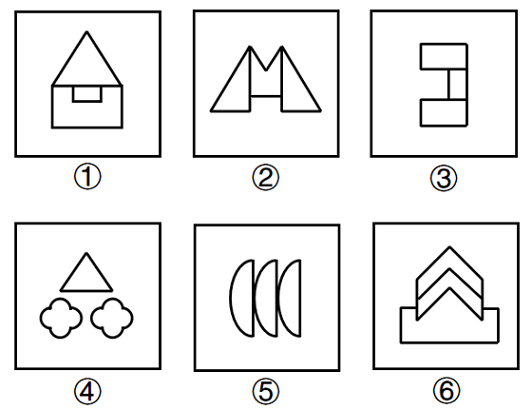
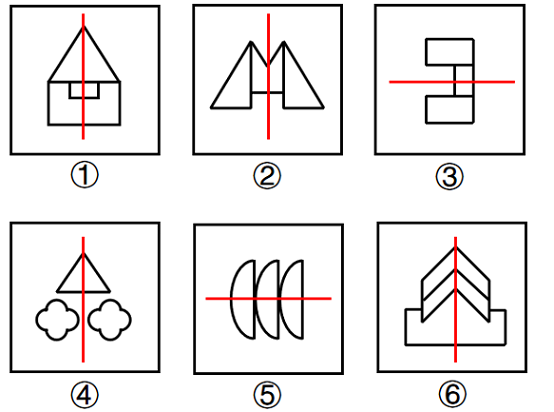

# 2023年国家公务员录用考试《行测》题（副省级网友回忆版）

> 判断推理 · 40 题 · 国考 2023

## 第 1 题　qid 5445797 · 图形推理

从所给的四个选项中，选择最合适的一个填入问号处，使之呈现一定的规律性：

- **A**. A
- **B**. B
- **C**. C　✅
- **D**. D

**答案**：C

**官方解析**

图形元素组成不同，无明显属性规律，考虑数量规律。题干图形明显被分割，优先考虑面数量，发现题干图形均为4个面，据此排除A项；继续观察发现题干图形均由几个图形拼接而成，还可以考虑图形间关系。题干图形均有一个黑块，观察发现题干图形中黑块均与3个白块存在公共边，选项中只有C项符合。
故正确答案为C。

---

## 第 2 题　qid 5445802 · 图形推理

从所给的四个选项中，选择最合适的一个填入问号处，使之呈现一定的规律性：

- **A**. A
- **B**. B　✅
- **C**. C
- **D**. D

**答案**：B

**官方解析**

元素组成相同，优先考虑位置规律。题干图形由黑色三角形构成，且数量较多、角度也较乱，考虑相邻比较。观察发现：从图1到图2，最上方一行相同位置上的黑色三角形均顺时针旋转了，其余位置的黑色三角形保持不变；从图2到图3，最右侧一列相同位置上的黑色三角形均顺时针旋转了，其余位置的黑色三角形保持不变；从图3到图4，最下方一行相同位置上的黑色三角形均顺时针旋转了，其余位置的黑色三角形保持不变；从图4到图5，最左侧一列相同位置上的黑色三角形均顺时针旋转了，其余位置的黑色三角形保持不变。因此，？处图形与图5相比，应为只有最上方一行相同位置上的黑色三角形顺时针旋转，其余位置的黑色三角形均保持不变，只有B项符合。

故正确答案为B。

---

## 第 3 题　qid 5445855 · 图形推理

从所给的四个选项中，选择最合适的一个填入问号处，使之呈现一定的规律性：

- **A**. A　✅
- **B**. B
- **C**. C
- **D**. D

**答案**：A

**官方解析**

元素组成不同，优先考虑属性规律。观察发现，整体无规律，题干所有图形均由黑球和白球构成，考虑黑白分开看，继续观察发现，每幅图形的白色区域均为轴对称图形，且对称轴每次顺时针旋转，因此？处图形的白色区域应为轴对称图形，且对称轴应为竖直方向。B项图形的白色区域为轴对称图形，但对称轴为水平方向，C、D两项图形的白色区域为非对称图形，均排除。只有A项符合。

故正确答案为A。

---

## 第 4 题　qid 5445842 · 图形推理

从所给的四个选项中，选择最合适的一个填入问号处，使之呈现一定的规律性：

- **A**. A
- **B**. B
- **C**. C　✅
- **D**. D

**答案**：C

**官方解析**

题干每行图形元素组成相似，优先考虑样式规律。九宫格中优先横向看，第一行中，图一和图二求异得到图三；经验证，第二行也满足此规律；第三行应用此规律，图一和图二求异，只有C项符合。
故正确答案为C。

---

## 第 5 题　qid 5445843 · 图形推理

下图是给定的立体图形（大圆柱内的虚线部分为挖空部分），将其从任一面剖开，下面哪一项不可能是该立体图形的截面？

- **A**. A　✅
- **B**. B
- **C**. C
- **D**. D

**答案**：A

**官方解析**

本题考查截面图。逐一分析选项。

A项：无法截出，当选；

B项：如下图所示，从上方圆柱向下经过空心圆柱竖切，可以截出，排除；

C项：如下图所示，从上方圆柱向下经过空心圆柱斜切，可以截出，排除；

D项：如下图所示，斜切下方圆柱同时经过空心部分，可以截出，排除。

本题为选非题，故正确答案为A。

---

## 第 6 题　qid 5445923 · 图形推理

左边给定的是正方体的外表面展开图，下面哪一项能由它折叠而成？

- **A**. A
- **B**. B　✅
- **C**. C
- **D**. D

**答案**：B

**官方解析**

本题为空间重构题。对展开图进行编号，如下图所示：

面a、面d和面2为具有唯一公共点的三个面，面a和面2中加粗（标蓝）的两条线构成直角，为公共边，可知折成立体图形后，面2中箭头与面1中箭头平行，且方向相反，只有B项符合。

故正确答案为B。

---

## 第 7 题　qid 5445914 · 图形推理

左图为等大的3个灰色正方体和15个白色正方体所组成的多面体，其可以切割为①、②和③三个小多面体，则③代表的多面体可能是：

- **A**. A
- **B**. B
- **C**. C　✅
- **D**. D

**答案**：C

**官方解析**

本题考查立体拼合。如下图所示，立体图可以由①、②以及C项拼合而成。

故正确答案为C。

---

## 第 8 题　qid 5445917 · 图形推理

把下面的六个图形分为两类，使每一类图形都有各自的共同特征或规律，分类正确的一项是：

- **A**. ①③⑥，②④⑤
- **B**. ①③⑤，②④⑥
- **C**. ①②⑥，③④⑤
- **D**. ①⑤⑥，②③④　✅

**答案**：D

**官方解析**

元素组成不同，优先考虑属性规律。观察发现，题干图形均为轴对称图形，画出题干中每个图形的对称轴发现，图①⑤⑥的对称轴穿过图形的三个面，图②③④的对称轴穿过图形的一个面，即图①⑤⑥为一组，图②③④为一组。

故正确答案为D。

---

## 第 9 题　qid 5445852 · 图形推理

把下面的六个图形分为两类，使每一类图形都有各自的共同特征或规律，分类正确的一项是：

- **A**. ①⑤⑥，②③④
- **B**. ①④⑥，②③⑤　✅
- **C**. ①②⑥，③④⑤
- **D**. ①③④，②⑤⑥

**答案**：B

**官方解析**

本题为分组分类题目。元素组成相同，但无明显位置规律和属性规律，考虑数量规律。观察发现，题干每个图形均存在黑球或白球被分隔开的情况，考虑部分数。图①④⑥中，黑球的部分数均为1，白球的部分数均为3；图②③⑤中，黑球的部分数均为3，白球的部分数均为1。即图①④⑥为一组，图②③⑤为一组。
故正确答案为B。

---

## 第 10 题　qid 5445911 · 图形推理

把下面的六个图形分为两类，使每一类图形都有各自的共同特征或规律，分类正确的一项是：

- **A**. ①③⑥，②④⑤
- **B**. ①④⑤，②③⑥
- **C**. ①②⑥，③④⑤　✅
- **D**. ①③④，②⑤⑥

**答案**：C

**官方解析**

本题为分组分类题目。元素组成不同，无明显属性规律，考虑数量规律。观察发现，题干图形封闭面较多，可优先考虑数面数量，但面数量无规律。继续观察发现，题干图形存在多个封闭面相交，均为“多圆相切”的变形图，考虑笔画数，图①②⑥均为一笔画图形，图③④⑤均为两笔画图形。即图①②⑥为一组，图③④⑤为一组。
故正确答案为C。

---

## 第 11 题　qid 5445913 · 定义判断

化学动力学是研究化学反应速率和反应机理的化学分支学科，主要内容包括：（1）确定化学反应的速率以及温度、压力、催化剂、溶剂和光照等外界因素对反应速率的影响；（2）研究化学反应机理，揭示化学反应速率本质；（3）探求物质结构与反应能力之间的关系和规律。
根据上述定义，下列没有体现化学动力学研究的是：

- **A**. 研究表面积不同的各类煤块在相同温度条件下燃烧速率的变化
- **B**. 研究不同光照和温湿度条件下植物叶片蒸腾作用的强度和效率　✅
- **C**. 在馒头制作的过程中，研究酵母菌对面粉发酵的催化反应模型
- **D**. 在铁制品表面喷涂不同种类油漆，研究铁与水、氧气的反应情况，判断防锈效果

**答案**：B

**官方解析**

第一步：找出定义关键词。
“研究化学反应速率和反应机理的化学分支学科”、“确定化学反应的速率以及温度、压力、催化剂、溶剂和光照等外界因素对反应速率的影响”、“研究化学反应机理，揭示化学反应速率本质”、“探求物质结构与反应能力之间的关系和规律”。
第二步：逐一分析选项。
A项：研究的是外界温度对不同煤块燃烧速率的影响，燃烧是化学变化，符合“研究化学反应速率和反应机理的化学分支学科”、“确定化学反应的速率以及温度、压力、催化剂、溶剂和光照等外界因素对反应速率的影响”，符合定义，排除；
B项：研究的是不同光照和温湿度条件下植物叶片蒸腾作用的强度和效率，植物叶片的蒸腾作用是指植物体内的水通过叶片上的气孔散发出去的过程，也就是水从液态变成了气态，没有生成新的物质，所以是物理变化，不符合“研究化学反应速率和反应机理的化学分支学科”，不符合定义，当选；
C项：研究的是酵母菌对面粉发酵的催化反应模型，发酵是化学变化，符合“研究化学反应速率和反应机理的化学分支学科”、“研究化学反应机理，揭示化学反应速率本质”，符合定义，排除；
D项：研究的是铁与水、氧气的反应情况，判断防锈效果，生锈是化学变化，符合“研究化学反应速率和反应机理的化学分支学科”、“确定化学反应的速率以及温度、压力、催化剂、溶剂和光照等外界因素对反应速率的影响”，符合定义，排除。
本题为选非题，故正确答案为B。

---

## 第 12 题　qid 5445845 · 定义判断

政策工具是指实现政策目标所要运用的手段与方法。政策工具可分为以下三种：
（1）供给型政策工具，对政策目标起直接促进作用，通常体现政府的重要政策导向，包含资金、人才、设施、技术、信息等方面的有效支持；（2）需求型政策工具，对政策目标起到拉动作用，释放对政策目标的需求，减少外部干扰，包括服务外包、直接采购、国际交流与贸易管制等；（3）环境型政策工具，对政策目标起到间接促进作用，通常体现为通过目标、计划、法规、金融与税收等方式提供有利的政策环境，包括目标规划、金融服务、税收优惠、法规管制以及策略性措施等。
根据上述定义，下列属于促进养老服务的需求型政策工具的是：

- **A**. 政府向养老机构购买居家养老服务，为低保家庭60周岁以上失能老人提供服务　✅
- **B**. 政府提供资金建设社区食堂，解决失能、独居、空巢等老年人“舌尖养老”难题
- **C**. 政府鼓励技工院校开设老年服务与管理、健康服务与管理、护理等养老服务相关专业
- **D**. 商务部发布《关于推动养老服务产业发展的指导意见》，提出打造养老服务品牌

**答案**：A

**官方解析**

第一步：找出定义关键词。
供给型政策工具：“对政策目标起直接促进作用”、“通常体现政府的重要政策导向”、“包含资金、人才、设施、技术、信息等方面的有效支持”；
需求型政策工具：“对政策目标起到拉动作用，释放对政策目标的需求，减少外部干扰”、“包括服务外包、直接采购、国际交流与贸易管制等”；
环境型政策工具：“对政策目标起到间接促进作用”、“通常体现为通过目标、计划、法规、金融与税收等方式提供有利的政策环境”、“包括目标规划、金融服务、税收优惠、法规管制以及策略性措施等”。
第二步：逐一分析选项。
A项：政府向养老机构购买居家养老服务，体现了将服务外包给养老机构，符合“对政策目标起到拉动作用，释放对政策目标的需求，减少外部干扰”、“包括服务外包、直接采购、国际交流与贸易管制等”，符合“需求型政策工具”定义，当选；
B项：政府提供资金建设社区食堂，说明政府直接提供资金支持，不符合“包括服务外包、直接采购、国际交流与贸易管制等”，不符合“需求型政策工具”定义，符合“供给型政策工具”定义，排除；
C项：政府鼓励技工院校开设养老服务相关专业，说明进行人才培养，提供人才支持，不符合“包括服务外包、直接采购、国际交流与贸易管制等”，不符合“需求型政策工具”定义，符合“供给型政策工具”定义，排除；
D项：国务院发布《关于推动养老服务产业发展的指导意见》，说明提供有利的政策环境，提出目标规划，不符合“包括服务外包、直接采购、国际交流与贸易管制等”，不符合“需求型政策工具”定义，符合“环境型政策工具”定义，排除。
故正确答案为A。

---

## 第 13 题　qid 5445862 · 定义判断

背信规避是指当风险来源为另一个体而不是自然条件时，人们普遍更不愿意冒险，即在同等条件下，人们对于人为风险的规避程度高于对客观风险的规避程度，体现在人们面对人为风险时比面对客观风险时表现得更保守。
根据上述定义，下列没有体现背信规避的是：

- **A**. 在对客观题阅卷方式意愿的调查中，学生更愿意选择机器阅卷而非人工阅卷
- **B**. 决定谁先开球时，双方球员都倾向于由裁判抛硬币决定而非裁判随机指定
- **C**. 在老师打算指派一个人多承担一项任务时，同学们纷纷表示要抽签决定
- **D**. 与老司机相比，坐新手司机开的车时，后排座上的乘客主动系安全带的更多　✅

**答案**：D

**官方解析**

第一步：找出定义关键词。
定义中比较易懂的关键词在于：“风险来源为另一个体而不是自然条件时”、“人为风险的规避程度高于对客观风险的规避程度”。
第二步：逐一分析选项。
A项：在客观题阅卷方式中，学生更愿意选择机器阅卷而非人工阅卷，机器阅卷对应客观风险，人工阅卷对应人为风险，“学生更愿意选择机器阅卷而非人工阅卷”，符合“人为风险的规避程度高于对客观风险的规避程度”，符合定义，排除；
B项：在决定谁先开球时，双方球员都倾向于由裁判抛硬币决定而非裁判随机指定，抛硬币对应客观风险，裁判指定对应人为风险，“双方球员都倾向于由裁判抛硬币决定而不是裁判指定”，符合“人为风险的规避程度高于对客观风险的规避程度”，符合定义，排除；
C项：在老师打算指派一个人多承担一项任务时，同学们纷纷表示要抽签决定，抽签对应客观风险，老师指派对应人为风险，“同学们纷纷表示要抽签决定”，符合“人为风险的规避程度高于对客观风险的规避程度”，符合定义，排除；
D项：与老司机相比，坐新手司机开的车时，后排座上的乘客主动系安全带的更多，老司机开车与新手司机开车都对应人为风险，没有体现客观风险，“坐新手司机开的车时后排座上的乘客主动系安全带的更多”，只是人为风险规避程度的比较，不符合“人为风险的规避程度高于对客观风险的规避程度”，不符合定义，当选。
本题为选非题，故正确答案为D。

---

## 第 14 题　qid 5445856 · 定义判断

植物病害分为侵染性病害和非侵染性病害。侵染性病害是由病原物引起的，可以在植物个体间互相传染的病害；非侵染性病害是由于环境不良、营养元素不足等非生物因素造成的病害，由于没有病原物的侵袭，所以不会在植物间相互传染。
根据上述定义，下列属于非侵染性病害的是：
①需要微酸性生长环境的杜鹃花，种植在偏碱性土壤中，叶片会黄化
②植株浇水过多，盆土积水后，由于植株根系缺氧，会导致植株萎蔫
③除草剂使用不当会引起西瓜苗嫩叶黄化，叶片枯焦，植株萎缩
④灰葡萄孢真菌会引起番茄灰霉病，发病后造成番茄大量烂果

- **A**. 仅①④
- **B**. 仅①②
- **C**. 仅①②③　✅
- **D**. 仅②③④

**答案**：C

**官方解析**

第一步：找出定义关键词。
侵染性病害：“由病原物引起”、“可以在植物个体间互相传染”；
非侵染性病害：“由于环境不良、营养元素不足等非生物因素造成”、“不会在植物间相互传染”。
第二步：逐一进行分析。
①：杜鹃花由于生长在偏碱性土壤环境中而导致其叶片黄化，其中偏碱性土壤属于环境因素，符合“由于环境不良、营养元素不足等非生物因素造成”、“不会在植物间相互传染”，符合“非侵染性病害”的定义；
②：植株由于盆土积水后，根系缺氧导致其萎蔫，其中盆土积水属于环境因素，符合“由于环境不良、营养元素不足等非生物因素造成”、“不会在植物间相互传染”，符合“非侵染性病害”的定义；
③：西瓜苗由于除草剂使用不当而导致其嫩叶黄化等后果，其中除草剂使用不当属于非生物因素，符合“由于环境不良、营养元素不足等非生物因素造成”、“不会在植物间相互传染”，符合“非侵染性病害”的定义；
④：番茄大量烂果是由灰葡萄孢真菌引起的，其中灰葡萄孢真菌属于病原物，而不是非生物因素，并且番茄因感染灰霉病而大量烂果，符合“由病原物引起”、“可以在植物个体间互相传染”，符合“侵染性病害”定义，不符合“非侵染性病害”的定义。
综上，仅①②③符合“非侵染性病害”的定义。
故正确答案为C。

---

## 第 15 题　qid 5445787 · 定义判断

单元素导语是指在撰写新闻导语（即消息的开头）时，突出表现一个新闻事实的导语。单元素导语按新闻五要素可分为：①何人导语，突出报道显要或影响大的新闻人物；②何事导语，突出报道新闻事实本身；③何时导语，突出报道读者关心的事情什么时候会发生或进行；④何地导语，突出报道一些重要或有特殊意义的地方发生重大变化的消息；⑤为什么导语，突出报道一个事件的起因。
根据上述定义，下列导语与其分类对应正确的是：

- **A**. 亲爱的读者，你知道为什么夏天夜空里看到的星星比冬天夜空里看到的多？——④
- **B**. 1964年10月16日，我国第一颗原子弹爆炸成功——②　✅
- **C**. 杨先生带着2岁的女儿到市医院看病，没想到看一个“咳嗽”就要花1000多元——①
- **D**. 谁是高考状元？这个一年一度的热门话题，今年却在XX省消失了——③

**答案**：B

**官方解析**

第一步：找出定义关键词。
单元素导语：“在撰写新闻导语（即消息的开头）时，突出表现一个新闻事实”；
何人导语：“突出报道显要或影响大的新闻人物”；
何事导语：“突出报道新闻事实本身”；
何时导语：“突出报道读者关心的事情什么时候会发生或进行”；
何地导语：“突出报道一些重要或有特殊意义的地方发生重大变化的消息”；
为什么导语：“突出报道一个事件的起因”。
第二步：逐一分析选项。
A项：为什么夏天夜空看到的星星比冬天夜空里看到的多是想要表现事件的起因，符合“突出报道一个事件的起因”，符合“为什么导语”定义，不符合“何地导语”定义，对应错误，排除；
B项：1964年10月16日，第一颗原子弹爆炸成功是新闻事实本身，符合“突出报道新闻事实本身”，符合“何事导语”定义，对应正确，当选；
C项：杨先生带着女儿到医院看病，一个“咳嗽”花费1000多元是新闻事实本身，符合“突出报道新闻事实本身”，符合“何事导语”定义，不符合“何人导语”定义，对应错误，排除；
D项：高考状元今年在XX省消失了，报道该省发生的重大变化，符合“突出报道一些重要或有特殊意义的地方发生重大变化的消息”，符合“何地导语”定义，不符合“何时导语”定义，对应错误，排除。
故正确答案为B。

---

## 第 16 题　qid 5445915 · 定义判断

数字农业是指用数字化技术，按人类需要的目标，对农业所涉及的对象和全过程进行数字化和可视化表达、设计、控制、管理等的农业。
根据上述定义，下列没有体现数字农业的是：

- **A**. 在大数据平台，点击任一块田地，就可以看到这块田地的土壤酸碱度、肥水条件、环境温度湿度等指标，农民可以根据这些信息进行田地管理
- **B**. 某柑橘生产大省建立“柑橘产业大数据中心”，以数据驱动柑橘产业结构性改革和高质量发展
- **C**. 通过电子标签等技术，对单个产品赋予身份编码及认证信息，在生产管理、仓储、物流、销售等环节实现信息追溯
- **D**. 遇到连绵阴雨天，果蔬容易滋生病害，需要及时喷药，采用轻型直升机几个小时就可以完成传统作业方式十多人几天才能完成的工作　✅

**答案**：D

**官方解析**

第一步：找出定义关键词。
“用数字化技术”、“对农业所涉及的对象和全过程进行数字化和可视化表达、设计、控制、管理等的农业”。
第二步：逐一分析选项。
A项：在大数据平台，点击任一块田地就可以看到田地的一系列指标，符合“用数字化技术”，农民可以根据这些信息进行田地管理，符合“对农业所涉及的对象和全过程进行数字化和可视化表达、设计、控制、管理等的农业”，符合定义，排除；
B项：建立“柑橘产业大数据中心”，符合“用数字化技术”，以数据驱动柑橘产业结构性改革和高质量发展，符合“对农业所涉及的对象和全过程进行数字化和可视化表达、设计、控制、管理等的农业”，符合定义，排除；
C项：通过电子标签等技术对单个产品赋予身份编码及认证信息，符合“用数字化技术”，在各种环节实现信息追溯，符合“对农业所涉及的对象和全过程进行数字化和可视化表达、设计、控制、管理等的农业”，符合定义，排除；
D项：采用轻型直升机对果蔬进行喷药，只是提高了工作效率，没有体现利用数字化技术以及全程数字化和可视化表达等，不符合“用数字化技术”、“对农业所涉及的对象和全过程进行数字化和可视化表达、设计、控制、管理等的农业”，不符合定义，当选。
本题为选非题，故正确答案为D。

---

## 第 17 题　qid 5445859 · 定义判断

小中取大法是指在决策时，首先计算各方案在不同自然状态下的收益，并找出各方案在最差自然状态下的收益，然后进行比较，选择在最差自然状态下收益最大或损失最小的方案作为最终方案的一种决策方法。大中取大法是指在决策时，首先计算各方案在不同自然状态下的收益，并找出各方案在最好自然状态下的收益，然后进行比较，选择在最好自然状态下收益最大的方案作为最终方案的一种决策方法。

根据上述定义，分别使用小中取大法和大中取大法对上述方案进行决策，所选择的方案依次是：

- **A**. 方案二和方案二
- **B**. 方案二和方案一
- **C**. 方案三和方案一
- **D**. 方案三和方案二　✅

**答案**：D

**官方解析**

第一步：找出定义关键词。
小中取大法：“找出各方案在最差自然状态下的收益”、“选择在最差自然状态下收益最大或损失最小的方案”；
大中取大法：“找出各方案在最好自然状态下的收益”、“选择在最好自然状态下收益最大的方案作为最终方案”。
第二步：逐一分析选项。
依据设问使用“小中取大法”，需要符合“找出各方案在最差自然状态下的收益”、“选择在最差自然状态下收益最大或损失最小的方案”，表格中销路差此列对应的数据就是最差自然状态下的收益，方案三是销路差中收益最大的方案，因此根据“小中取大法”应选择方案三；
依据设问使用“大中取大法”，需要符合“找出各方案在最好自然状态下的收益”、“选择在最好自然状态下收益最大的方案作为最终方案”，表格中销路好此列对应的数据就是最好自然状态下的收益，方案二是销路好中收益最大的方案，因此根据“大中取大法”应选择方案二，只有D项符合。
故正确答案为D。

---

## 第 18 题　qid 5445924 · 定义判断

对称推断法是辨析文言词义的一种方法，是指通过对运用了对偶修辞格或排比修辞格的句子内部已知词语词义的分析，推断其位置相对的文言词义的一种方法。
根据上述定义，下列使用了对称推断法的是：

- **A**. 归有光《项脊轩志》：“项脊轩，旧南阁子也。”其中的“也”，表判断的语气词，可不译
- **B**. 吴均《与朱元思书》：“急湍甚箭，猛浪若奔。”其中的“箭”为名词，可据此推断“奔”也为名词，为“奔马”的意思　✅
- **C**. 《荀子·劝学》：“故木受绳则直，金就砺则利。”其中的“砺”，形旁为“石”，说明“砺”与“石”有关，意思是磨刀石
- **D**. 《旧五代史·冯道传》：“臣所陈虽小，可以喻大。”成语“不言而喻”中的“喻”为“知晓”的意思，可据此推断此句中的“喻”为“知晓”的意思

**答案**：B

**官方解析**

第一步：找出定义关键词。
“通过对运用了对偶修辞格或排比修辞格的句子内部已知词语词义的分析”、“推断其位置相对的文言词义”。
第二步：逐一分析选项。
A项：“项脊轩，旧南阁子也。”的意思是项脊轩，是过去的南阁楼，这句话没有运用对偶修辞格或排比修辞格，不符合“通过对运用了对偶修辞格或排比修辞格的句子内部已知词语词义的分析”，不符合定义，排除；
B项：“急湍甚箭，猛浪若奔。”的意思是湍急的水流比箭还快，凶猛的巨浪就像奔腾的骏马，这句话运用了对偶修辞格，“箭”和“奔”是位置相对的词语，可用“箭”推断“奔”的含义为“奔马”，符合“通过对运用了对偶修辞格或排比修辞格的句子内部已知词语词义的分析”、“推断其位置相对的文言词义”，符合定义，当选；
C项：“故木受绳则直，金就砺则利。”的意思是所以木材经墨线比量过就变得笔直，金属制的刀剑拿到磨刀石上去磨就能变得锋利，选项根据“砺”与“石”有关，推断其意思是磨刀石，但“石”并不是句子内部的词语，不符合“通过对运用了对偶修辞格或排比修辞格的句子内部已知词语词义的分析”，不符合定义，排除；
D项：“臣所陈虽小，可以喻大。”的意思是臣所说的这件事虽小，却可以说明大道理，这句话没有运用对偶修辞格或排比修辞格，不符合“通过对运用了对偶修辞格或排比修辞格的句子内部已知词语词义的分析”，不符合定义，排除。
故正确答案为B。

---

## 第 19 题　qid 5445919 · 定义判断

分布区是指某生物的活动、生存范围。如下图所示，用黑色方块表示该生物已知、推断或预计出现的位点。分布区的划定是环绕所有已知、推断或预计出现的位点的最短连续边界所包含的面积，经常用最小凸边形来表示。该最小凸边形的每个内角不能超过180度，并要包含所有出现的位点。

根据上述定义，对于下列位点所划定的分布区正确的是：

- **A**. A　✅
- **B**. B
- **C**. C
- **D**. D

**答案**：A

**官方解析**

第一步：找出定义关键词。
“环绕所有已知、推断或预计出现的位点的最短连续边界所包含的面积”、“用最小凸边形来表示”、“该最小凸边形的每个内角不能超过180度，并要包含所有出现的位点”。
第二步：逐一分析选项。
A项：该项所示的区域划定范围为所有位点的最短连续边界，且范围的形状为每个内角不超过180度的凸边形，同时包含所有出现的位点，符合定义，当选；
B项：该项所示的区域划定范围内包含超过180度的内角，不符合“该最小凸边形的每个内角不能超过180度，并要包含所有出现的位点”，不符合定义，排除；
C项：该项所示的区域划定范围外存在位点，不符合“该最小凸边形的每个内角不能超过180度，并要包含所有出现的位点”，不符合定义，排除；
D项：该项所示的区域划定范围左下角及右侧未连接位点，不属于最短连续边界，不符合“环绕所有已知、推断或预计出现的位点的最短连续边界所包含的面积”，不符合定义，排除。
故正确答案为A。

---

## 第 20 题　qid 5445858 · 定义判断

细胞学检查是指对患者病变部位脱落、刮取或穿刺抽取的细胞，进行病理形态学的观察并做出定性诊断的检查方式。细胞学检查主要应用于肿瘤的诊断，也可用于某些疾病的检查和诊断，如内部器官炎症性疾病的诊断和激素水平的判定等。
根据上述定义，下列属于细胞学检查的是：

- **A**. 采集患者血液样本，分析血细胞比例变化，判断患者是否出现感染
- **B**. 针对外伤患者皮肤纤维细胞的过度增生，实行激光打磨法，抑制炎性细胞浸润，修复再生皮肤组织
- **C**. 通过拉网法收集食道癌患者的食道脱落细胞，鉴定细胞形态，明确癌变性质　✅
- **D**. 对脑疝患者脑室穿刺，放出脑室液以降低脑压，后再次穿刺注入造影剂，诊断其颅内占位病变的情况

**答案**：C

**官方解析**

第一步：找出定义关键词。
“患者病变部位脱落、刮取或穿刺抽取的细胞”、“进行病理形态学的观察”、“做出定性诊断的检查方式”。
第二步：逐一分析选项。
A项：采集患者血液样本，分析血细胞比例变化，不涉及病变部位的细胞，不符合“患者病变部位脱落、刮取或穿刺抽取的细胞”，不符合定义，排除；
B项：激光打磨抑制炎性细胞浸润，修复再生皮肤组织，属于一种治疗方法，而不是定性诊断的检查方式，不符合“做出定性诊断的检查方式”，不符合定义，排除；
C项：食道癌患者的食道脱落细胞，符合“患者病变部位脱落的细胞”，鉴定细胞形态，符合“进行病理形态学的观察”，明确癌变性质，符合“做出定性诊断的检查方式”，符合定义，当选；
D项：放出脑室液以降低脑压，后再次穿刺注入造影剂，诊断其颅内占位病变的情况，是通过注入造影剂进行观察诊断，而不是对细胞进行观察诊断，不符合“患者病变部位脱落、刮取或穿刺抽取的细胞”，不符合定义，排除。
故正确答案为C。

---

## 第 21 题　qid 5445920 · 类比推理

花海：书山

- **A**. 怒火：苦雨
- **B**. 车流：人潮　✅
- **C**. 雪白：麦浪
- **D**. 龙舟：木马

**答案**：B

**官方解析**

第一步：判断题干词语间逻辑关系。
花海指的是像海洋般广阔的花群，书山指的是像山峰般高耸的书籍，二者为并列关系，且后一个字修饰前一个字。
第二步：判断选项词语间逻辑关系。
A项：怒火和苦雨不是并列关系，并且是“苦”修饰“雨”，前一个字修饰后一个字，与题干顺序不一致，排除；
B项：车流指的是像河流般连续不断的车辆，人潮指的是像潮水一样的人群，二者为并列关系，且“流”修饰“车”，“潮”修饰“人”，与题干逻辑关系一致，当选；
C项：雪白和麦浪无明显逻辑关系，与题干逻辑关系不一致，排除；
D项：龙舟和木马为并列关系，但龙舟是指龙形船，“龙”修饰“舟”，“木”修饰“马”，都是前一个字修饰后一个字，与题干顺序不一致，排除。
故正确答案为B。

---

## 第 22 题　qid 5445863 · 类比推理

猛药去疴：重典治乱

- **A**. 民生在勤：勤则不匮
- **B**. 从善如登：从恶如崩
- **C**. 静以修身：俭以养德　✅
- **D**. 名非天造：必从其实

**答案**：C

**官方解析**

第一步：判断题干词语间逻辑关系。
“猛药去疴”意思是通过威力大的药达到去除疾病的目的，“重典治乱”意思是通过严酷的刑罚达到惩治坏人的目的，二者都可指问题很严重，必须采取有力的措施来处理，二者是近义关系，但选项没有近义关系，考虑拆词看结构，“猛药去疴”和“重典治乱”拆词后都能构成方式目的对应关系。
第二步：判断选项词语间逻辑关系。
A项：“民生在勤”的意思是人民的生计在于勤劳，“勤则不匮”意思是勤劳就不会缺乏财物，二者拆词之后不存在方式目的对应关系，与题干逻辑关系不一致，排除；
B项：“从善如登”意思是顺随良善像登山一样难，比喻学好向善很难，“从恶如崩”意思是顺随恶行像山崩一样容易，比喻学坏很容易，二者拆词之后不存在方式目的对应关系，与题干逻辑关系不一致，排除；
C项：“静以修身”意思是通过内心安静精力集中来修养身心，“俭以养德”意思是通过俭朴的作风来培养品德，二者拆词后都能构成方式目的对应关系，与题干逻辑关系一致，当选；
D项：“名非天造”的意思是名称不是天生就有的，“必从其实”的意思是必须依据其客观现实，二者拆词之后不存在方式目的对应关系，与题干逻辑关系不一致，排除。
故正确答案为C。

---

## 第 23 题　qid 5445873 · 类比推理

强光照射：视力损伤

- **A**. 台风过境：渔业停产　✅
- **B**. 网络招聘：业务扩张
- **C**. 原油进口：能源紧缺
- **D**. 风险防范：消防演练

**答案**：A

**官方解析**

第一步：判断题干词语间逻辑关系。
“强光照射”会导致“视力损伤”，二者为因果对应关系。
第二步：判断选项词语间逻辑关系。
A项：“台风过境”会导致“渔业停产”，二者为因果对应关系，与题干逻辑关系一致，当选；
B项：“业务扩张”会导致“网络招聘”，二者为因果对应关系，但词语顺序与题干相反，与题干逻辑关系不一致，排除；
C项：“能源紧缺”会导致“原油进口”，二者为因果对应关系，但词语顺序与题干相反，与题干逻辑关系不一致，排除；
D项：“风险防范”是“消防演练”的目的，二者为方式与目的对应关系，与题干逻辑关系不一致，排除。
故正确答案为A。

---

## 第 24 题　qid 5445912 · 类比推理

一望无垠：辽阔

- **A**. 人云亦云：重复
- **B**. 耳提面命：教导　✅
- **C**. 方兴未艾：失败
- **D**. 厉兵秣马：战斗

**答案**：B

**官方解析**

第一步：判断题干词语间逻辑关系。
“一望无垠”意思是宽广、辽阔，一眼望去看不到边际，与“辽阔”是近义关系。
第二步：判断选项词语间逻辑关系。
A项：“人云亦云”意思是人家怎么说，自己也跟着怎么说，指没有主见，随声附和别人，是贬义词；“重复”指相同的事物又一次出现，“重复”并不局限于重复他人的观点，且是中性的词语，二者不是近义关系，与题干逻辑关系不一致，排除；
B项：“耳提面命”意思是拉着耳朵，面对面地教导，形容恳切地教诲，与“教导”是近义关系，与题干逻辑关系一致，当选；
C项：“方兴未艾”意思是事物正在兴起、发展，一时不会终止，与“失败”是反义关系，与题干逻辑关系不一致，排除；
D项：“厉兵秣马”意思是把兵器磨快，把战马喂饱，形容做好战前准备，强调的是事前做好准备工作，与“战斗”不是近义关系，与题干逻辑关系不一致，排除。
故正确答案为B。

---

## 第 25 题　qid 5445916 · 类比推理

特征提取：模式匹配：语音识别

- **A**. 接诊病人：网上挂号：健康宣教
- **B**. 提交资料：资格审核：报名成功　✅
- **C**. 询问证人：勘验现场：接到报警
- **D**. 海事损害：请求赔偿：租赁船只

**答案**：B

**官方解析**

第一步：判断题干词语间逻辑关系。
先特征提取，再模式匹配，最后语音识别，三者为时间先后顺序的对应关系。
第二步：判断选项词语间逻辑关系。
A项：先网上挂号，再接诊病人，第一词与第二词的顺序与题干相反，与题干逻辑关系不一致，排除；
B项：先提交资料，再资格审核，最后报名成功，与题干逻辑关系一致，当选；
C项：先接到报警，再询问证人和勘验现场，与题干逻辑关系不一致，排除；
D项：先租赁船只，再海事损害，最后请求赔偿，与题干逻辑关系不一致，排除。
故正确答案为B。

---

## 第 26 题　qid 5445779 · 类比推理

春季过敏：花粉：喷嚏

- **A**. 肺炎：咳嗽：支原体
- **B**. 乙型脑炎：病毒：发热　✅
- **C**. 失眠：恐惧：噩梦
- **D**. 秋季腹泻：饮食：脱水

**答案**：B

**官方解析**

第一步：判断题干词语间逻辑关系。
花粉可能会导致春季过敏，前两词为因果关系；打喷嚏是春季过敏的症状，第一词和第三词为对应关系。
第二步：判断选项词语间逻辑关系。
A项：咳嗽是肺炎的症状，前两词为对应关系；支原体感染可能会导致肺炎，第一词和第三词为因果关系，与题干逻辑关系不一致，排除；
B项：病毒感染可能会导致乙型脑炎，前两词为因果关系；发热是乙型脑炎的症状，第一词和第三词为对应关系，与题干逻辑关系一致，当选；
C项：恐惧可能会导致失眠，前两词为因果关系；噩梦不是失眠的症状，与题干逻辑关系不一致，排除；
D项：秋季腹泻指发生在秋冬季的腹泻病，原因可能是饮食不当或饮食不洁，而非饮食，前两词不是因果关系，与题干逻辑关系不一致，排除。
故正确答案为B。

---

## 第 27 题　qid 5445868 · 类比推理

片剂：散剂：气雾剂

- **A**. 边塞诗：山水诗：抒情诗
- **B**. 口头契约：君子协定：书面协议
- **C**. 泉水：湖水：天然水
- **D**. 头部理疗：腰部理疗：腿部理疗　✅

**答案**：D

**官方解析**

第一步：判断题干词语间逻辑关系。
片剂是药物与辅料均匀混合后压制而成的片状或异形片状的固体制剂，散剂是指药物或与适宜的辅料经粉碎、均匀混合制成的干燥粉末状制剂，气雾剂是指药物和抛射剂共同封装于带有阀门的耐压容器中，使用时借抛射剂气化所产生的压力，定量或非定量地将药物以雾状喷出的制剂。三者是根据药物的剂型划分的，为并列关系中的反对关系。
第二步：判断选项词语间逻辑关系。
A项：边塞诗是以边疆地区军民生活和自然风光为题材的诗，山水诗是描写山水风景的诗，抒情诗是抒发诗人思想感情的诗，三者互为交叉关系，与题干逻辑关系不一致，排除；
B项：口头契约是指不用书面的形式，通过口头达成的协议，书面协议指以书面形式达成的协议，二者均以协议形式进行划分，为并列关系，但君子协定是借指彼此之间互相信任的约定，并不是以协议形式进行划分，与另外两词不构成并列关系，与题干逻辑关系不一致，排除；
C项：泉水是指从地下流出来的水，一般是天然水，二者为种属关系，与题干逻辑关系不一致，排除；
D项：头部理疗、腰部理疗和腿部理疗是根据理疗的身体部位划分的，三者为并列关系中的反对关系，与题干逻辑关系一致，当选。
故正确答案为D。

---

## 第 28 题　qid 5445790 · 类比推理

标清：高清：超清

- **A**. 亚音速：音速：超音速　✅
- **B**. 厅级：市级：省级
- **C**. 迁怒：愤怒：暴怒
- **D**. 幽静：寂静：安静

**答案**：A

**官方解析**

第一步：判断题干词语间逻辑关系。
三者均对清晰度进行分类，构成并列关系，且清晰度依次递增。
第二步：判断选项词语间逻辑关系。
A项：三者均对速度进行分类，构成并列关系，且速度依次递增，与题干逻辑关系一致，当选；
B项：厅级是我国的一个行政级别，而市级和省级属于我国的行政区划，三者不构成并列关系，与题干逻辑关系不一致，排除；
C项：迁怒为动词，指把怒气发泄到别人身上，愤怒为形容词，指因极度不满而情绪激动，暴怒指极端愤怒，三者不构成并列关系，与题干逻辑关系不一致，排除；
D项：幽静指清幽寂静，寂静指没有声音、很静，安静指安稳平静、没有声音，三者均是对静的描述，构成并列关系，但不是静的程度从低到高的依次递增，与题干逻辑关系不一致，排除。
故正确答案为A。

---

## 第 29 题　qid 5445791 · 类比推理

刑事警察 对于 （    ） 相当于 （    ） 对于 对外交涉

- **A**. 公安机关；维护主权
- **B**. 刑事案件；驻外武官
- **C**. 打击犯罪；外交人员　✅
- **D**. 交通警察；外交领事

**答案**：C

**官方解析**

逐一代入选项。
A项：刑事警察是构成公安机关的一部分，二者为组成关系；对外交涉的目的是为了维护主权，二者为方式目的对应关系，前后逻辑关系不一致，排除；
B项：刑事警察的主要任务是侦查刑事案件，刑事案件本身是一个名词，只是刑事警察的工作对象，二者为职业与工作对象的对应关系；驻外武官的主要任务是对外交涉，二者为职业与工作内容的对应关系，前后逻辑关系不一致，排除；
C项：刑事警察的工作内容是打击犯罪，二者为职业与工作内容的对应关系；外交人员的工作内容是对外交涉，二者为职业与工作内容的对应关系，前后逻辑关系一致，当选；
D项：刑事警察和交通警察都是警察，二者为并列关系中的反对关系；外交领事是一国根据协议派驻他国某城市或某地区的代表，是进行对外交涉的代表人物，二者是职业与工作内容的对应关系，前后逻辑关系不一致，排除。
故正确答案为C。

---

## 第 30 题　qid 5445853 · 类比推理

缄口不言 对于 （    ） 相当于 （    ） 对于 虚怀若谷

- **A**. 三缄其口；大智若愚
- **B**. 畅所欲言；放荡不羁
- **C**. 守口如瓶；礼贤下士
- **D**. 口若悬河；矜功伐善　✅

**答案**：D

**官方解析**

逐一代入选项。
A项：缄口不言意思是封住嘴巴，不开口说话，形容畏惧权势，言语谨慎，怕招惹是非，应当说的而不敢说或不愿意说。三缄其口形容说话极其谨慎、不轻易开口，二者为近义关系；大智若愚指有智慧有才能的人，看起来好像很愚笨，也比喻有智慧的人极有涵养，不露锋芒。虚怀若谷指胸怀像山谷一样深广，形容十分谦虚，能容纳别人的意见，二者不是近义关系，前后逻辑关系不一致，排除；
B项：缄口不言意思是封住嘴巴，不开口说话，形容畏惧权势，言语谨慎，怕招惹是非，应当说的而不敢说或不愿意说。畅所欲言指尽情地说出想说的话，没有约束地把心里话吐露出来，二者为反义关系；放荡不羁意思是放纵任性，不加检点，不受约束。虚怀若谷指胸怀像山谷一样深广，形容十分谦虚，能容纳别人的意见，二者不是反义关系，前后逻辑关系不一致，排除；
C项：缄口不言意思是封住嘴巴，不开口说话，形容畏惧权势，言语谨慎，怕招惹是非，应当说的而不敢说或不愿意说。守口如瓶意思是闭口不谈，像瓶口塞紧了一般，形容说话谨慎，严守秘密，二者为近义关系；礼贤下士形容重视人才。虚怀若谷指胸怀像山谷一样深广，形容十分谦虚，能容纳别人的意见，二者不是近义关系，前后逻辑关系不一致，排除；
D项：缄口不言意思是封住嘴巴，不开口说话，形容畏惧权势，言语谨慎，怕招惹是非，应当说的而不敢说或不愿意说。口若悬河意为说话滔滔不绝，像河水倾泄一样，形容能说善辩，话语不断，二者为反义关系；矜功伐善意思是夸耀自己的功劳和才能，形容极不虚心。虚怀若谷指胸怀像山谷一样深广，形容十分谦虚，能容纳别人的意见，二者为反义关系，前后逻辑关系一致，当选。
故正确答案为D。

---

## 第 31 题　qid 5445794 · 逻辑判断

人们感受气味通过嗅觉受体实现。研究发现：随着人类的演化，编码人类嗅觉受体的基因不断突变，许多在过去能强烈感觉气味的嗅觉受体已经突变为对气味不敏感的受体，与此同时，人类嗅觉受体的总体数目也随时间推移逐渐变少。由此可以认为，人类的嗅觉经历着不断削弱、逐渐退化的过程。
以下哪项如果为真，最能支持上述结论？

- **A**. 随着人类进化，嗅觉中枢在大脑皮层中所占面积逐渐减少　✅
- **B**. 相对于视觉而言，嗅觉在人类感觉系统中的重要性较低
- **C**. 人类有大约1000个嗅觉受体相关基因，其中只有390个可以编码嗅觉受体
- **D**. 不同人群之间嗅觉存在很大差异，老年人的嗅觉敏感性明显低于年轻人

**答案**：A

**官方解析**

第一步：找出论点和论据。
论点：人类的嗅觉经历着不断削弱、逐渐退化的过程。
论据：随着人类的演化，编码人类嗅觉受体的基因不断突变，许多在过去能强烈感觉气味的嗅觉受体已经突变为对气味不敏感的受体，与此同时，人类嗅觉受体的总体数目也随时间推移逐渐变少。
本题论点论据均在讨论人类的嗅觉在逐渐退化，二者话题一致，加强优先考虑补充论据。
第二步：逐一分析选项。
A项：该项指出嗅觉中枢在大脑皮层中所占面积逐渐减少，说明嗅觉能力在降低，补充论据，可以加强，当选；
B项：该项比较了视觉和嗅觉在人类感觉系统中的重要性，而论点讨论的是人类的嗅觉是否退化，话题不一致，无法加强，排除；
C项：该项指出了人类的1000个嗅觉受体相关基因中有390个可以编码嗅觉受体，没有体现出数量变化的多少，而题干讨论的是嗅觉逐渐退化的过程，话题不一致，无法加强，排除；
D项：该项讨论的是老年人和年轻人的嗅觉敏感性，而论点讨论的是人类的嗅觉是否退化，话题不一致，无法加强，排除。
故正确答案为A。

---

## 第 32 题　qid 5445803 · 逻辑判断

R行星是位于太阳系的一颗小行星，质量不大，平均直径不足500米。在对R行星进行长达一年的观测后，人们发现其表面长期漂浮着砂粒，且砂粒在漂浮一段时间后，还会重新落在行星表面。由于R行星表面没有稳定的大气层，因此人们认为砂粒漂浮的现象主要来自静电，原因是太阳风进入行星表面产生电场时，砂粒会因静电力的作用离开行星表面漂浮游动起来，当没有太阳风时，砂粒又会回落下来。
以下哪项如果为真，没有质疑上述观点？

- **A**. R行星与彗星组成类似，彗星靠近太阳时，受太阳风产生的静电影响，其表面砂粒将会漂浮　✅
- **B**. R行星表面存在一氧化碳、干冰等挥发性物质，其升华会带动砂粒的释放与漂浮
- **C**. R行星质量小，静电作用只能扬起毫米级的砂粒，但目前其表面漂浮的砂粒尺寸都很大
- **D**. R行星自转速度快，星球上的物体受到离心作用强，其表面尘埃与石块会脱离引力束缚，剥落散逸

**答案**：A

**官方解析**

第一步：找出论点和论据。
论点：R行星砂粒漂浮的现象主要来自静电。
论据：R行星表面没有稳定的大气层，太阳风进入行星表面产生电场时，砂粒会因静电力的作用离开行星表面漂浮游动起来，当没有太阳风时，砂粒又会回落下来。
本题论点和论据讨论的都是砂粒漂浮和静电的关系，论点论据话题一致，本题为削弱选非题，排除能够削弱的选项即可。
第二步：逐一分析选项。
A项：该项指出R行星与彗星组成类似，彗星表面砂粒漂浮的原因是静电，所以R行星表面砂粒漂浮的原因也可能是静电，属于类比加强，无法削弱，当选；
B项：该项指出R行星表面的一氧化碳、干冰等挥发性物质升华会带动砂粒漂浮，说明R行星砂粒漂浮存在其他原因，他因削弱，可以削弱，排除；
C项：该项指出R行星的静电只能扬起毫米级的砂粒，但其表面漂浮的砂粒尺寸很大，因此R行星的静电无法使R行星砂粒漂浮，说明R行星砂粒漂浮的现象并非主要来自静电，削弱论点，可以削弱，排除；
D项：该项指出R行星自转速度快导致砂粒漂浮，说明R行星砂粒漂浮存在其他原因，他因削弱，可以削弱，排除。
本题为选非题，故正确答案为A。

---

## 第 33 题　qid 5445857 · 逻辑判断

调查显示，某地区第二产业从业人员与五年前相比减少了10.4%，对于第二产业从业人员减少的原因，一种观点认为，产业优化升级是第二产业从业人员减少的原因，第二产业在实现产业规模快速扩大的同时，不断加快技术改造，实现“机器换工”，客观上降低了工业企业的用工需求。另一种观点则认为，这与第二产业的优化升级无关，第三产业的蓬勃发展发挥了就业“蓄水池”的功能，吸纳了大量第二产业从业人员。
以下哪项如果为真，最能削弱第二种观点？

- **A**. 第二产业优化升级拉动了第三产业蓬勃发展　✅
- **B**. 该地区第三产业的整体规模比第二产业要小
- **C**. 第三产业的发展得益于持续优化的营商环境
- **D**. 第二产业和第三产业都对吸纳就业作出贡献

**答案**：A

**官方解析**

第一步：找出论点和论据。
论点：第二产业从业人员减少的原因，与第二产业的优化升级无关，第三产业的蓬勃发展发挥了就业“蓄水池”的功能，吸纳了大量第二产业从业人员。
论据：无。
本题只有论点没有论据，削弱优先考虑直接否定论点。
第二步：逐一分析选项。
A项：该项说的是第二产业优化升级拉动了第三产业蓬勃发展，进而导致第二产业从业人员减少，也就是说，导致第二产业从业人员减少的根本原因还是第二产业优化升级，直接削弱了论点，可以削弱，当选；
B项：该项说的是该地区第三产业的整体规模比第二产业要小，与题干讨论的第二产业从业人员减少的原因无关，话题不一致，无法削弱，排除；
C项：该项说的是第三产业发展的原因，与题干讨论的第二产业从业人员减少的原因无关，话题不一致，无法削弱，排除；
D项：该项说的是第二产业和第三产业都对吸纳就业作出贡献，与题干讨论的第二产业从业人员减少的原因无关，话题不一致，无法削弱，排除。
故正确答案为A。

---

## 第 34 题　qid 5445918 · 逻辑判断

杂草稻是稻田里不种自生、伴随栽培稻生长的一种“杂草型稻”。研究者在杂草稻基因组中发现了与干旱胁迫下叶片干枯程度显著相关的基因——PAPH1。消除该基因后的株系，其叶肉细胞膜内外钙离子和钾离子流速降低；而PAPH1基因过度表达的株系，其叶肉细胞膜内外钙离子和钾离子流速增加。因此研究者指出，PAPH1基因在杂草稻抗旱性中发挥关键作用。
上述论证的成立须补充以下哪项作为前提？

- **A**. 正常状态下的栽培稻长期生长在有水的环境中，不含PAPH1基因
- **B**. 叶肉细胞膜内外钙离子和钾离子的流速也促进PAPH1基因的表达
- **C**. 叶肉细胞膜内外钙离子和钾离子流速越高，杂草稻的抗旱性越强　✅
- **D**. 杂草稻与栽培稻存在基因交流，其演化与栽培稻选育品种密切相关

**答案**：C

**官方解析**

第一步：找出论点和论据。
论点：PAPH1基因在杂草稻抗旱性中发挥关键作用。
论据：研究者在杂草稻基因组中发现了与干旱胁迫下叶片干枯程度显著相关的基因——PAPH1。消除该基因后的株系，其叶肉细胞膜内外钙离子和钾离子流速降低；而PAPH1基因过度表达的株系，其叶肉细胞膜内外钙离子和钾离子流速增加。
本题的论点谈论的是“PAPH1基因”与“杂草稻抗旱性”的关系，论据谈论的是“PAPH1基因”与“钙离子和钾离子流速”的关系，话题不一致，加强优先考虑搭桥，即建立“杂草稻抗旱性”与“钙离子和钾离子流速”的关系。
第二步：逐一分析选项。
A项：指出“栽培稻”生长在有水环境下且不含PAPH1基因，但没提到“杂草稻”是否具有抗旱性，无法说明PAPH1基因在“杂草稻抗旱性”中是否发挥关键作用，主体不一致，无法加强，排除；
B项：指出“钙离子和钾离子的流速”可以“促进PAPH1基因的表达”，是对论据的因果倒置，可以削弱，无法加强，排除；
C项：指出“钙离子和钾离子流速”越高，“杂草稻的抗旱性”越强，建立了“杂草稻抗旱性”与“钙离子和钾离子流速”的关系，属于搭桥项，可以加强，当选；
D项：指出杂草稻与栽培稻存在“基因交流”，且杂草稻的演化与栽培稻选育品种密切相关，但没提到“抗旱性”，无法说明PAPH1基因在“杂草稻抗旱性”中是否发挥关键作用，话题不一致，无法加强，排除。
故正确答案为C。

---

## 第 35 题　qid 2579001 · 逻辑判断

汞在环境中有三种存在形态：金属汞、无机汞、有机汞。这三种形态下的汞均有毒性，其毒性由小到大依次为：无机汞＜金属汞＜有机汞。其中，金属汞是常温下唯一的液态金属。烷基汞是已知毒性最大的汞化合物，甲基汞毒性比无机汞大50~100倍。
由此不能推出的是：

- **A**. 烷基汞属于有机汞
- **B**. 甲基汞不是无机汞
- **C**. 有机汞和无机汞不能呈现出液态　✅
- **D**. 常温下的金属，除汞外均不呈液态

**答案**：C

**官方解析**

日常结论题，根据题干信息逐一分析选项。
A项：题干指出汞在环境中三种存在形态的毒性大小为：无机汞＜金属汞＜有机汞，且烷基汞是已知毒性最大的汞化合物，说明烷基汞是有机汞，可以推出，排除；
B项：题干指出甲基汞毒性比无机汞大50~100倍，说明甲基汞不是无机汞，可以推出，排除；
C项：题干只指出金属汞是常温下唯一的液态“金属”，而有机汞和无机汞均不是金属，因此无法推出“有机汞和无机汞不能呈现出液态”，当选；
D项：题干指出金属汞是常温下唯一的液态金属，说明在常温下其他金属都不呈现出液态，可以推出，排除。
本题为选非题，故正确答案为C。

---

## 第 36 题　qid 5445884 · 逻辑判断

传统污水处理，或通过重力沉降、混凝澄清、浮力浮上、离心力分离、磁力分离等物理方法对不溶态污染物进行分离，或通过酸碱中和法、化学沉淀法、氧化还原法等化学方法让污染物发生转化，而新兴的微生物治理技术则是通过水体微生物来净化污水。有专家认为，与传统手段相比，微生物治理技术是一种处理污水的更佳手段。
以下哪项如果为真，不能支持上述观点？

- **A**. 近年来，微生物技术的科研投入持续扩大，相关技术成果在土壤改良等领域已经得到了有效转化　✅
- **B**. 物理方法进行污水治理的处理厂，通常占地面积大，基建费、运行费高，能耗大，易出现污泥膨胀现象
- **C**. 化学方法进行污水治理运行成本高，需消耗大量的化学试剂，易产生二次污染
- **D**. 微生物技术污水治理的能耗低，效率高，剩余污泥量少，操作管理方便

**答案**：A

**官方解析**

第一步：找出论点和论据。
论点：与传统手段相比，微生物治理技术是一种处理污水的更佳手段。
论据：传统污水处理，或通过重力沉降、混凝澄清、浮力浮上、离心力分离、磁力分离等物理方法对不溶态污染物进行分离，或通过酸碱中和法、化学沉淀法、氧化还原法等化学方法让污染物发生转化，而新兴的微生物治理技术则是通过水体微生物来净化污水。
本题论点和论据话题一致，都是在对传统手段和微生物治理技术进行比较，加强优先考虑补充论据，本题为选非题，将可以加强的选项排除即可。
第二步：逐一分析选项。
A项：该项指出近年来微生物技术的科研投入持续扩大，相关技术成果在土壤改良等领域已经得到了有效转化，仅说明微生物技术对土壤改良的作用，没有提及对污水处理的作用，为无关项，无法加强，当选；
B项：该项指出物理方法进行污水治理的处理厂，通常占地面积大，基建费、运行费高，能耗大，易出现污泥膨胀现象，补充说明传统手段具有成本高、能耗高、污染环境等缺点，补充论据，可以加强，排除；
C项：该项指出化学方法进行污水治理运行成本高，需消耗大量的化学试剂，易产生二次污染，补充说明传统手段存在成本高、污染环境等缺点，补充论据，可以加强，排除；
D项：该项指出微生物技术污水治理的能耗低，效率高，剩余污泥量少，操作管理方便，补充说明微生物技术治理污水有优势，补充论据，可以加强，排除。
本题为选非题，故正确答案为A。

---

## 第 37 题　qid 5445883 · 逻辑判断

近来，国际大宗商品市场中，原油和天然气价格达到近十年以来的高位，锌矿价格也上涨了7%左右，有分析人士认为，大宗商品市场将进入“超级周期”（大宗商品价格高于长期平均价格的时期）。从宏观层面看，大宗商品进入“超级周期”是全球经济出现新的增长动力的结果。历史上大宗商品进入“超级周期”往往会带动全球经济复苏，这也预示着当下全球经济正在复苏。
以下哪项如果为真，最能削弱上述论证？

- **A**. 地缘政治的风险加剧了大宗商品供应的紧张局势，引发本轮大宗商品价格上涨　✅
- **B**. 飙升的天然气价格推高了化肥的主要成分——氨的价格，进而推高全球粮食价格
- **C**. 全球经济将更注重环保，碳中和与碳达峰将改变能源产业格局，进而影响金属和原油产业的发展远景
- **D**. 全球主要经济体正在加紧出台强有力的救市计划，以寻求本国新的经济增长动力

**答案**：A

**官方解析**

第一步：找出论点和论据。
论点：大宗商品市场将进入“超级周期”（大宗商品价格高于长期平均价格的时期）。从宏观层面看，大宗商品进入“超级周期”是全球经济出现新的增长动力的结果。历史上大宗商品进入“超级周期”往往会带动全球经济复苏，这也预示着当下全球经济正在复苏。
论据：无。
本题的论点的逻辑是“全球经济出现新的增长动力”导致大宗商品市场将进入“超级周期”，进而预示当下全球经济正在复苏，本题只有论点，没有论据，削弱优先考虑削弱论点。
第二步：逐一分析选项。
A项：论点的逻辑是“全球经济新的增长动力导致大宗商品价格上涨”，该项给出了导致“大宗商品价格上涨”的另一个原因，削弱论点，可以削弱，当选；
B项：该项说的是天然气价格推高了氨的价格，进而推高全球粮食价格，只说明了部分商品之间的价格关联度，而论点讨论的是大宗商品价格高于平均的原因以及产生的结果，话题不一致，无法削弱，排除；
C项：该项说的是全球经济将更注重环保，碳中和与碳达峰将改变能源产业格局，而论点讨论的是大宗商品价格高于平均的原因以及产生的结果，话题不一致，无法削弱，排除；
D项：该项说的是全球主要经济体为寻求本国新的经济增长动力而出台救市计划，而论点讨论的是大宗商品价格高于平均的原因以及产生的结果，话题不一致，无法削弱，排除。
故正确答案为A。

---

## 第 38 题　qid 5445925 · 逻辑判断

考古人员对岳阳新墙河流域的大马古城址及其相关东周遗存进行调查研究，推测这里是东周时期麋子国城的遗址。东周时期麋子国被楚灭亡后迁徙江南，最后定居在今岳阳新墙河流域，因此大马古城址应是麋子国遗民南迁后所筑的麋子国城遗址。凤形嘴山、将军潭、尧岭山所在的这一区域应是麋子国遗民生产活动和生活栖息的地方。
以下哪项如果为真，不能支持考古人员的推测？

- **A**. 据明隆庆《岳州府志》记载，先秦时期被楚灭国后迁来岳州的有罗、麋、许三国遗民，其中麋子国遗民定居在巴陵（今湖南岳阳）境内
- **B**. 大马古城址、凤形嘴山、将军潭、尧岭山墓地均为楚系，而麋与楚本来同源同祖同姓，二者在文化上相通是顺理成章的
- **C**. 麋子国原为周初的一个子爵小国，与楚国同姓。它最早居于今山东梁山县，又辗转多地，后定居锡穴（今陕西白河县）　✅
- **D**. 大马古城位于今岳阳市东南，与《读史方舆纪要》中记载的岳州“府东三十里，相传古麋子国”所记位置大体一致

**答案**：C

**官方解析**

第一步：找出论点和论据。
论点：大马古城址应是麋子国遗民南迁后所筑的麋子国城遗址。
论据：东周时期麋子国被楚灭亡后迁徙江南，最后定居在今岳阳新墙河流域。凤形嘴山、将军潭、尧岭山所在的这一区域应是麋子国遗民生产活动和生活栖息的地方。
本题为选非题，可以使用排除法，将可以加强的选项排除，选择无法加强的选项。且本题论点、论据讨论的都是麋子国的遗址，二者讨论的话题一致，可以通过补充论据的方式进行加强。
第二步：逐一分析选项。
A项：《岳州府志》记载，先秦时期被楚灭国后的麋子国遗民定居在巴陵（今湖南岳阳）境内，通过列举史书记载，说明麋子国遗民确实定居在今岳阳境内，补充论据，可以加强，排除；
B项：大马古城址、凤形嘴山、将军潭、尧岭山墓地均为楚系，而麋与楚在文化上相通，说明大马城址、凤形嘴山、将军潭、尧岭山墓地等区域确实有可能是麋子国遗民生产活动和生活栖息的地方，补充论据，可以加强，排除；
C项：麋子国最早居于今山东梁山县，又辗转多地，后定居在今陕西白河县，讨论的是麋子国曾经的定居地点，但这些地点中是否包含大马古城址并不明确，为不明确项，无法加强，当选；
D项：大马古城的位置与《读史方舆纪要》中所记关于麋子国的位置大体一致，说明大马古城址确实可能是麋子国的遗址，补充论据，可以加强，排除。
本题为选非题，故正确答案为C。

---

## 第 39 题　qid 5445921 · 逻辑判断

面对需求收缩、供给冲击、预期转弱三重压力，要想实现国内经济发展稳中求进，关键是要稳住市场主体。只有围绕市场主体需求实施更大力度减税降费，才能帮助其渡过资金难关。除了减税降费外，还需继续深化“放管服”改革，才能为市场主体营造更加市场化、法治化的营商环境。只有营商环境更加市场化、法治化，市场主体才会获得内生动力，从而进一步增强国内经济的吸引力、创造力、竞争力。
由此可以推出：

- **A**. 实施更大力度减税降费，是帮助市场主体渡过资金难关的必要举措　✅
- **B**. 只要稳住市场主体，就能实现国内经济发展稳中求进
- **C**. 如果深化“放管服”改革，就能营造更加市场化、法治化的营商环境
- **D**. 若市场主体不具有内生动力，国内经济就不会有吸引力、创造力、竞争力

**答案**：A

**官方解析**

第一步：翻译题干。

①实现国内经济发展稳中求进稳住市场主体；

②帮助市场主体渡过资金难关围绕市场主体需求实施更大力度减税降费；

③为市场主体营造更加市场化、法治化的营商环境减税降费 且 继续深化“放管服”改革；

④市场主体获得内生动力营商环境更加市场化、法治化；

⑤进一步增强国内经济的吸引力、创造力、竞争力市场主体获得内生动力。

第二步：逐一分析选项。

A项：该项翻译为“帮助市场主体渡过资金难关实施更大力度减税降费”，是对②的肯前，肯前必肯后，可以推出，当选；

B项：该项翻译为“稳住市场主体实现国内经济发展稳中求进”，是对①的肯后，但肯后得不到确定性的结论，无法推出，排除；

C项：该项翻译为“深化‘放管服’改革营造更加市场化、法治化的营商环境”，肯定了③后“且”关系中的一项，得不到确定性的结论，无法推出，排除；

D项：该项翻译为“市场主体不具有内生动力国内经济就不会有吸引力、创造力、竞争力”，是对⑤的否后，否后必否前，得到“进一步增强国内经济的吸引力、创造力、竞争力”，但进一步增强即“本来就有”且需要增强，否后得到的“不会进一步增强”国内经济的吸引力、创造力、竞争力与选项的“不会有”吸引力、创造力、竞争力，不是同义替换，无法推出，排除。

故正确答案为A。

---

## 第 40 题　qid 5445922 · 逻辑判断

石、方、白、于、叶5人参加单板滑雪、跳台滑雪、越野滑雪和高山滑雪4个项目的比赛，每人参加一个项目，每个项目均有1-2人参加。
已知：（1）如果石和白至少有一人参加高山滑雪，则方参加单板滑雪，而于参加高山滑雪；
（2）如果于和方至少有一人参加高山滑雪，则白和叶均参加单板滑雪。
如果叶未参加高山滑雪，则可以得出以下哪项？

- **A**. 方参加了越野滑雪
- **B**. 叶未参加单板滑雪
- **C**. 石参加了高山滑雪
- **D**. 白未参加跳台滑雪　✅

**答案**：D

**官方解析**

第一步：分析题干条件。

（1）每人参加一个项目，每个项目均有1-2人参加；

（2）石高山滑雪 或 白高山滑雪方单板滑雪 且 于高山滑雪；

（3）于高山滑雪 或 方高山滑雪白单板滑雪 且 叶单板滑雪；

（4）叶高山滑雪；

将（2）和（3）串联得到条件（5）石高山滑雪 或 白高山滑雪方单板滑雪 且 于高山滑雪白单板滑雪 且 叶单板滑雪。

第二步：根据题干条件进行推理。

题干条件（4）为确定信息，根据条件（4）叶高山滑雪可知，其余4人均可能参加高山滑雪，考虑采用假设法做题。根据条件（5）假设石高山滑雪 或 白高山滑雪，能够推出方参加单板滑雪，进而得出白和叶都参加单板滑雪，此时有3人参加单板滑雪，明显违背条件（1）每人参加一个项目，每个项目均有1-2人参加，因此石和白均不参加高山滑雪，排除C项；此时再结合条件（4）可知，叶、石和白均不参加高山滑雪，故而得出于高山滑雪 或 方高山滑雪，代入条件（3）可知白和叶均参加单板滑雪，排除B项；结合条件（1）每人参加一个项目，因此白不可能再参加跳台滑雪，D项正确。

故正确答案为D。

---
