# 2023年国家公务员录用考试《行测》题（地市级网友回忆版）

> 判断推理 · 40 题 · 国考 2023

## 材料 1

6天休假期间，单位需要每天安排一人值班。财务、研发、人事、后勤、法务和销售6个部门各推荐了2人，值班人员从这12人中选择，每人至多值班一天。安排要求：

（1）第二天和第四天不安排法务部门的人值班；

（2）若安排后勤部门的人值班，则只能安排在法务部门的人值班的前一天；

（3）若安排研发部门的人值班，则只能安排在后勤部门的人值班的前一天。

### 第 1 题　qid 5445782 · 逻辑判断

关于6天中的人选，以下哪项安排符合上述条件？

- **A**. 财务、人事、后勤、法务、财务、人事
- **B**. 销售、财务、法务、人事、财务、销售　✅
- **C**. 人事、财务、法务、研发、法务、后勤
- **D**. 法务、销售、人事、后勤、财务、销售

**答案**：B

**官方解析**

第一步：分析题干条件。

6天假期每天需安排一人值班，6个部门各推荐2人，从12人中选择6人，每人值班一天。安排要求如下：

（1）法务部第二、四天；

（2）后勤值班后勤安排在法务前一天；

（3）研发值班研发安排在后勤前一天。

第二步：根据题干条件进行推理。

本题题干信息确定，选项信息充分，优先考虑排除法。

根据条件（1）“法务部第二、四天”，排除A项。

根据条件（2）“后勤值班后勤安排在法务前一天”，排除C、D两项。

经验证，B项满足题干所有条件，当选。

故正确答案为B。

---

### 第 2 题　qid 5445805 · 类比推理

后勤部门的人可以安排在哪几天值班？

- **A**. 只有第二天、第四天、第五天　✅
- **B**. 只有第一天、第三天、第五天
- **C**. 只有第二天、第六天
- **D**. 只有第一天、第三天

**答案**：A

**官方解析**

第一步：分析题干条件。

6天假期每天需安排一人值班，6个部门各推荐2人，从12人中选择6人，每人值班一天。安排要求如下：

（1）法务部第二、四天；

（2）后勤值班后勤安排在法务前一天；

（3）研发值班研发安排在后勤前一天。

第二步：根据题干条件进行推理。

提问为“可以”，优先考虑代入选项。因为选项表述均为“只有”，说明是要列举后勤部门值班的所有可能情况，此时可以从选项中只出现一次的情况入手，即A项中的“后勤部门的人是否可以安排在第四天”，如果可以，即A项当选，如果不可以，即排除A项。

如果后勤部门安排在第四天，根据条件（2）可知，法务部门安排在第五天，题干所有条件均可满足，即后勤部门可以安排在第四天，排除B、C、D三项。

故正确答案为A。

---

### 第 3 题　qid 5445808 · 逻辑判断

如果安排后勤部门的两人值班，则以下哪项一定是错误的？

- **A**. 第一天安排研发部门的人值班
- **B**. 第六天安排人事部门的人值班
- **C**. 第三天安排财务部门的人值班　✅
- **D**. 第五天安排法务部门的人值班

**答案**：C

**官方解析**

第一步：分析题干条件。

6天假期每天需安排一人值班，6个部门各推荐2人，从12人中选择6人，每人值班一天。安排要求如下：

（1）法务部第二、四天；

（2）后勤值班后勤安排在法务前一天；

（3）研发值班研发安排在后勤前一天；

（4）后勤有两人值班。

第二步：根据题干条件进行推理。

条件（4）表明后勤有两人值班，结合条件（2）可知，法务也应有两人值班，且后勤紧挨在法务值班的前一天，据此可知，法务不能安排在第一天。

再结合条件（1）可知，法务的两人只能安排在第三天、第五天、第六天这三天中的两天。由于法务两人值班的前一天均应是后勤的人在值班，所以法务的两人不能同时安排在第五天和第六天，因此法务一定有一人是安排在第三天的，则C项第三天安排财务部门的人值班是错误的。

本题为选非题，故正确答案为C。

---

### 第 4 题　qid 5445817 · 类比推理

如果在第三天、第五天分别安排两个财务部门的人值班，则第一天、第六天可安排的值班人员可能分别来自：

- **A**. 后勤部门和法务部门
- **B**. 法务部门和销售部门　✅
- **C**. 财务部门和销售部门
- **D**. 研发部门和人事部门

**答案**：B

**官方解析**

第一步：分析题干条件。

6天假期每天需安排一人值班，6个部门各推荐2人，从12人中选择6人，每人值班一天。安排要求如下：

（1）法务部第二、四天；

（2）后勤值班后勤安排在法务前一天；

（3）研发值班研发安排在后勤前一天；

（4）在第三天、第五天分别安排两个财务部门的人值班。

第二步：根据题干条件进行推理。

提问方式为“可能”，优先使用代入法。

代入A项：如果第一天、第六天安排的值班人员分别来自后勤部门和法务部门，根据条件（2）后勤值班后勤安排在法务前一天，可知第二天为法务，不满足条件（1），排除；

代入B项：如果第一天、第六天安排的值班人员分别来自法务部门和销售部门，根据条件（4）在第三天、第五天分别安排财务，根据条件（2）后勤值班后勤安排在法务前一天，可知第二天和第四天不能安排后勤，根据条件（1），可知第二天和第四天不能安排法务，根据条件（3）研发值班研发安排在后勤前一天，可知第二天和第四天不能安排研发，所以第二天和第四天可以安排人事或者销售，可进行如下安排，满足题干条件，当选；

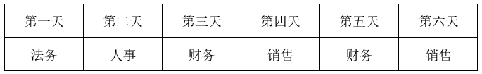

代入C项：如果第一天、第六天安排的值班人员分别来自财务部门和销售部门，此时第一天、第三天和第五天安排的值班人员均来自财务部门，不符合题干条件“6个部门各推荐2人”，不满足题干条件，排除；

代入D项：如果第一天、第六天安排的值班人员分别来自研发部门和人事部门，根据条件（3）研发值班研发安排在后勤前一天，可知第二天的值班人员来自后勤部门，根据条件（2）后勤值班后勤安排在法务前一天，可知第三天的值班人员来自法务部门，此时不符合条件（4）“第三天安排财务部门的人值班”，不满足题干条件，排除。

故正确答案为B。

---

### 第 5 题　qid 5445818 · 逻辑判断

如果没有安排财务和后勤部门的人值班，则以下哪项一定是正确的？

- **A**. 第四天安排销售部门的人值班
- **B**. 第五天安排法务部门的人值班
- **C**. 第二天安排销售部门或者人事部门的人值班　✅
- **D**. 第三天安排法务部门或者人事部门的人值班

**答案**：C

**官方解析**

第一步：分析题干条件。

6天假期每天需安排一人值班，6个部门各推荐2人，从12人中选择6人，每人值班一天。安排要求如下：

（1）法务部第二、四天；

（2）后勤值班后勤安排在法务前一天；

（3）研发值班研发安排在后勤前一天；

（4）没有安排财务和后勤部门的人值班。

第二步：根据题干条件进行推理。

根据条件（4）没有安排后勤部门的人值班，可知研发部门不可能安排在后勤部门的前一天，结合条件（3）可知，没有安排研发部门的人值班。此时已知没有安排研发、财务和后勤这3个部门的人值班，结合题干开头给出的信息可知，值班人员只能从剩下的人事、法务、销售这3个部门中选择。再结合条件（1）可知，第二天不能安排法务部门的人值班，所以第二天只能安排销售部门或者人事部门的人值班。

故正确答案为C。

---

### 第 6 题　qid 5445855 · 图形推理

从所给的四个选项中，选择最合适的一个填入问号处，使之呈现一定的规律性：

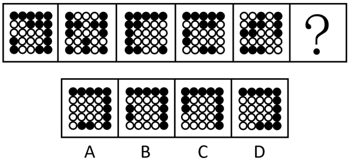

- **A**. A　✅
- **B**. B
- **C**. C
- **D**. D

**答案**：A

**官方解析**

元素组成不同，优先考虑属性规律。观察发现，整体无规律，题干所有图形均由黑球和白球构成，考虑黑白分开看，继续观察发现，每幅图形的白色区域均为轴对称图形，且对称轴每次顺时针旋转，因此？处图形的白色区域应为轴对称图形，且对称轴应为竖直方向。B项图形的白色区域为轴对称图形，但对称轴为水平方向，C、D两项图形的白色区域为非对称图形，均排除。只有A项符合。

故正确答案为A。

---

### 第 7 题　qid 5445797 · 图形推理

从所给的四个选项中，选择最合适的一个填入问号处，使之呈现一定的规律性：

- **A**. A
- **B**. B
- **C**. C　✅
- **D**. D

**答案**：C

**官方解析**

图形元素组成不同，无明显属性规律，考虑数量规律。题干图形明显被分割，优先考虑面数量，发现题干图形均为4个面，据此排除A项；继续观察发现题干图形均由几个图形拼接而成，还可以考虑图形间关系。题干图形均有一个黑块，观察发现题干图形中黑块均与3个白块存在公共边，选项中只有C项符合。
故正确答案为C。

---

### 第 8 题　qid 5445839 · 图形推理

从所给的四个选项中，选择最合适的一个填入问号处，使之呈现一定的规律性：

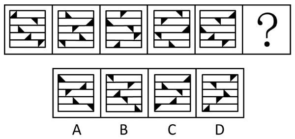

- **A**. A　✅
- **B**. B
- **C**. C
- **D**. D

**答案**：A

**官方解析**

题干图形均由相同数量的黑色三角形和被分成5行的矩形框架组成，元素组成相同，优先考虑位置规律。观察发现，每幅图形分行明显，优先按行看。黑色三角形于其所在行内每次向右移动一格，且移动到最右侧时循环走，回到最左侧从头 再来，方向不变继续向右移动，排 C、D两项。继续观察发现，黑色三角形在移动的过程中依次顺时针旋转 90°，排除B项，只有A项符合。
故正确答案为A。

---

### 第 9 题　qid 5445842 · 图形推理

从所给的四个选项中，选择最合适的一个填入问号处，使之呈现一定的规律性：

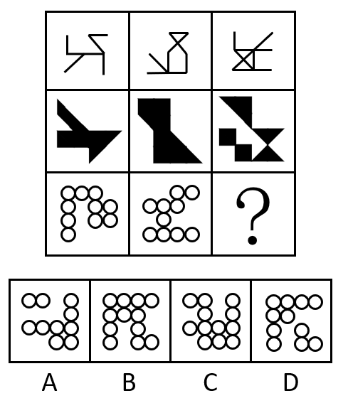

- **A**. A
- **B**. B
- **C**. C　✅
- **D**. D

**答案**：C

**官方解析**

题干每行图形元素组成相似，优先考虑样式规律。九宫格中优先横向看，第一行中，图一和图二求异得到图三；经验证，第二行也满足此规律；第三行应用此规律，图一和图二求异，只有C项符合。
故正确答案为C。

---

### 第 10 题　qid 5445843 · 图形推理

下图是给定的立体图形（大圆柱内的虚线部分为挖空部分），将其从任一面剖开，下面哪一项不可能是该立体图形的截面？

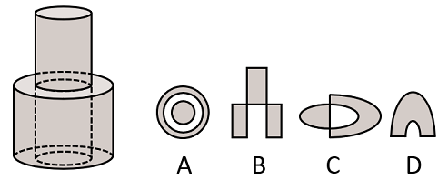

- **A**. A　✅
- **B**. B
- **C**. C
- **D**. D

**答案**：A

**官方解析**

本题考查截面图。逐一分析选项。

A项：无法截出，当选；

B项：如下图所示，从上方圆柱向下经过空心圆柱竖切，可以截出，排除；

C项：如下图所示，从上方圆柱向下经过空心圆柱斜切，可以截出，排除；

D项：如下图所示，斜切下方圆柱同时经过空心部分，可以截出，排除。

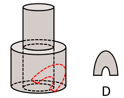

本题为选非题，故正确答案为A。

---

### 第 11 题　qid 5445822 · 图形推理

将一张直角三角形形状的纸片进行两次折叠，展开后的折痕将该三角形分成如图所示的a、b、c、d四个部分，则两次折叠后的纸片投影面积为：

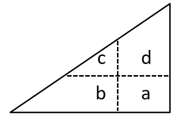

- **A**. b+d+c-a
- **B**. b+d-c
- **C**. b+c-a
- **D**. b+d-a　✅

**答案**：D

**官方解析**

第一步，将直角三角形先沿水平折痕进行折叠，即将面c和面d向下折叠，覆盖面b和面a，得到如下图形，此时折叠后面积为：b+d；

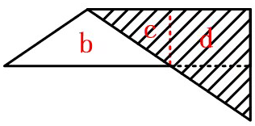

第二步，将直角三角形沿着竖直折痕进行折叠，即将面b和面c向右折叠，覆盖面d和面a，得到如下图形，此时折叠后面积为：d+b-a。

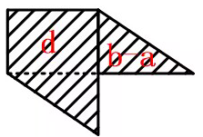

故正确答案为D。

---

### 第 12 题　qid 5445798 · 图形推理

左图为等大的3个灰色正方体和15个白色正方体组合成的多面体，其可以切割为①、②和③三个小多面体，问③代表的多面体可能是：

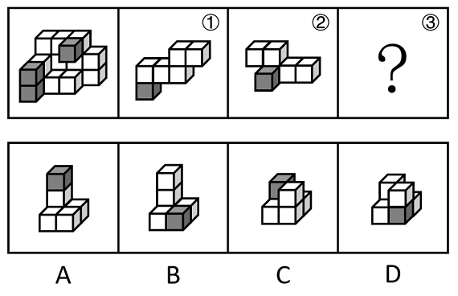

- **A**. A　✅
- **B**. B
- **C**. C
- **D**. D

**答案**：A

**官方解析**

本题考查立体拼合。如下图所示，将图①、图②进行旋转，结合A项，即可拼合成为左图的多面体。

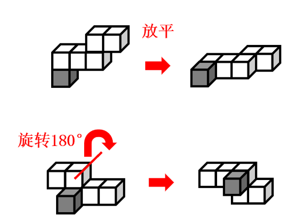

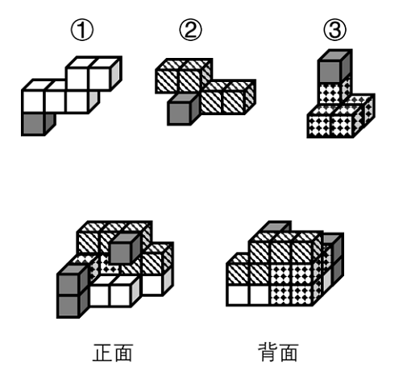

故正确答案为A。

---

### 第 13 题　qid 5445768 · 图形推理

把下面的六个图形分为两类，使每一类图形都有各自的共同特征或规律，分类正确的一项是：

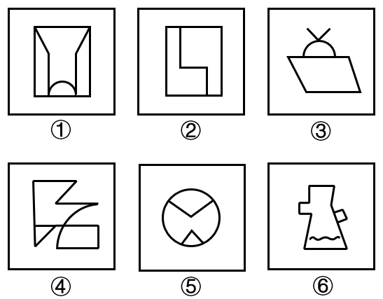

- **A**. ①③⑤，②④⑥
- **B**. ①④⑥，②③⑤
- **C**. ①③④，②⑤⑥
- **D**. ①②④，③⑤⑥　✅

**答案**：D

**官方解析**

本题为分组分类题目。元素组成不同，且无明显属性规律，考虑数量规律。观察发现，图2为“日”字变形图，图3为多端点图形，优先考虑笔画数。图①②④为一笔画图形，图③⑤⑥为两笔画图形，即图①②④为一组，图③⑤⑥为一组。
故正确答案为D。

---

### 第 14 题　qid 5445852 · 图形推理

把下面的六个图形分为两类，使每一类图形都有各自的共同特征或规律，分类正确的一项是：

- **A**. ①⑤⑥，②③④
- **B**. ①④⑥，②③⑤　✅
- **C**. ①②⑥，③④⑤
- **D**. ①③④，②⑤⑥

**答案**：B

**官方解析**

本题为分组分类题目。元素组成相同，但无明显位置规律和属性规律，考虑数量规律。观察发现，题干每个图形均存在黑球或白球被分隔开的情况，考虑部分数。图①④⑥中，黑球的部分数均为1，白球的部分数均为3；图②③⑤中，黑球的部分数均为3，白球的部分数均为1。即图①④⑥为一组，图②③⑤为一组。
故正确答案为B。

---

### 第 15 题　qid 5445799 · 图形推理

把下面六个图形分为两类，使每一类图形都有各自的共同特征或规律，分类正确的一项是：

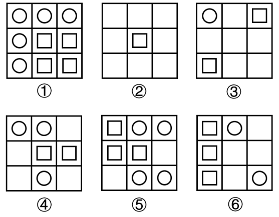

- **A**. ①②⑤，③④⑥
- **B**. ①②④，③⑤⑥
- **C**. ①④⑤，②③⑥　✅
- **D**. ①③⑤，②④⑥

**答案**：C

**官方解析**

本题为分组分类题目。元素组成不同，且无明显属性规律，考虑数量规律。观察发现，题干图形基本都由圆和正方形构成，优先考虑元素的个数，圆的数量依次为5、0、1、3、4、2，正方形的数量依次为4、1、2、2、3、3，单独看数量无规律，考虑二者运算图①④⑤中，圆的数量-正方形的数量=1；图②③⑥中，正方形的数量-圆的数量=1。故图①④⑤为一组，图②③⑥为一组。
故正确答案为C。

---

### 第 16 题　qid 5445804 · 定义判断

微量鉴定是指运用物理学、化学和仪器分析等方法，通过对案件现场有关物质材料（材料特点多为体小量微、不易注意）的成分及其结构进行定性、定量分析，对检材的种类、检材和嫌疑样本的同类性和同一性进行鉴定。
根据以上定义，下列涉及交通事故的鉴定属于微量鉴定的是：

- **A**. 对车辆驾驶人采血，分析血液中的酒精含量，判断驾驶人是否存在酒后驾车嫌疑
- **B**. 现场提取、检验受害人毛发、衣物纤维，认定受害人是否与嫌疑人车辆存在接触　✅
- **C**. 拆解车辆特定部位，查明车辆故障原因，用以鉴定其属于人为责任还是机械故障
- **D**. 通过人体损伤程度检验，确定伤害损伤部位与交通事故伤害后果的关联程度

**答案**：B

**官方解析**

第一步：找出定义关键词。
“对案件现场体小量微、不易注意的物质材料成分及其结构进行分析”、“对检材的种类、检材和嫌疑样本的同类性和同一性进行鉴定”。
第二步：逐一分析选项。
A项：对车辆驾驶人采血，分析血液中的酒精含量，“血液”不符合“体小量微、不易注意的物质材料”，并且也不涉及与嫌疑样本的比对，不符合定义，排除；
B项：现场提取、检验受害人毛发、衣物纤维，“毛发，衣物纤维”符合“体小量微、不易注意的物质材料”，认定受害人是否与嫌疑人车辆存在接触，符合“对检材的种类、检材和嫌疑样本的同类性和同一性进行鉴定”，符合定义，当选；
C项：拆解车辆特定部位，查明车辆故障原因，“车辆特定部位”不符合“体小量微、不易注意的物质材料”，并且也不涉及与嫌疑样本的比对，不符合定义，排除；
D项：通过人体损伤程度检验，确定伤害损伤部位与交通事故伤害后果的关联程度，“人体”不符合“体小量微、不易注意的物质材料”，并且也不涉及与嫌疑样本的比对，不符合定义，排除。
故正确答案为B。

---

### 第 17 题　qid 5445845 · 定义判断

政策工具是指实现政策目标所要运用的手段与方法。政策工具可分为以下三种：
（1）供给型政策工具，对政策目标起直接促进作用，通常体现政府的重要政策导向，包含资金、人才、设施、技术、信息等方面的有效支持；（2）需求型政策工具，对政策目标起到拉动作用，释放对政策目标的需求，减少外部干扰，包括服务外包、直接采购、国际交流与贸易管制等；（3）环境型政策工具，对政策目标起到间接促进作用，通常体现为通过目标、计划、法规、金融与税收等方式提供有利的政策环境，包括目标规划、金融服务、税收优惠、法规管制以及策略性措施等。
根据上述定义，下列属于促进养老服务的需求型政策工具的是：

- **A**. 政府向养老机构购买居家养老服务，为低保家庭60周岁以上失能老人提供服务　✅
- **B**. 政府提供资金建设社区食堂，解决失能、独居、空巢等老年人“舌尖养老”难题
- **C**. 政府鼓励技工院校开设老年服务与管理、健康服务与管理、护理等养老服务相关专业
- **D**. 商务部发布《关于推动养老服务产业发展的指导意见》，提出打造养老服务品牌

**答案**：A

**官方解析**

第一步：找出定义关键词。
供给型政策工具：“对政策目标起直接促进作用”、“通常体现政府的重要政策导向”、“包含资金、人才、设施、技术、信息等方面的有效支持”；
需求型政策工具：“对政策目标起到拉动作用，释放对政策目标的需求，减少外部干扰”、“包括服务外包、直接采购、国际交流与贸易管制等”；
环境型政策工具：“对政策目标起到间接促进作用”、“通常体现为通过目标、计划、法规、金融与税收等方式提供有利的政策环境”、“包括目标规划、金融服务、税收优惠、法规管制以及策略性措施等”。
第二步：逐一分析选项。
A项：政府向养老机构购买居家养老服务，体现了将服务外包给养老机构，符合“对政策目标起到拉动作用，释放对政策目标的需求，减少外部干扰”、“包括服务外包、直接采购、国际交流与贸易管制等”，符合“需求型政策工具”定义，当选；
B项：政府提供资金建设社区食堂，说明政府直接提供资金支持，不符合“包括服务外包、直接采购、国际交流与贸易管制等”，不符合“需求型政策工具”定义，符合“供给型政策工具”定义，排除；
C项：政府鼓励技工院校开设养老服务相关专业，说明进行人才培养，提供人才支持，不符合“包括服务外包、直接采购、国际交流与贸易管制等”，不符合“需求型政策工具”定义，符合“供给型政策工具”定义，排除；
D项：国务院发布《关于推动养老服务产业发展的指导意见》，说明提供有利的政策环境，提出目标规划，不符合“包括服务外包、直接采购、国际交流与贸易管制等”，不符合“需求型政策工具”定义，符合“环境型政策工具”定义，排除。
故正确答案为A。

---

### 第 18 题　qid 5445821 · 定义判断

民宿是指利用当地民居等相关闲置资源，经营用客房不超过4层、建筑面积不超过800平方米，主人参与接待，为游客提供体验当地自然、文化与生产生活方式的小型住宿设施。
根据上述定义，下列属于民宿的是：

- **A**. 王某在市中心有一套两居室的房子，过了马路就是知名的景区公园。王某将闲置房间租给那些节假日来旅游的家庭，并提供导游服务　✅
- **B**. 某家庭农场开发亲子休闲旅游业务，建设了农业科普、亲子游玩场所，为孩子和家长营造一处寓教于乐的乡村乐园
- **C**. 李某通过某网上平台找到心仪城市的会员“交换”旅行，即双方各自为对方提供住宿，住在对方家中深入体验当地的风土人情
- **D**. 张某在古镇上有一所老宅。他和某平台签订合同，将老宅租给该平台运营。该平台将老宅装修，并提供完善的酒店式服务机制

**答案**：A

**官方解析**

第一步：找出定义关键词。
“利用当地民居等相关闲置资源”、“经营用客房不超过4层、建筑面积不超过800平方米”、“主人参与接待，为游客提供体验当地自然、文化与生产生活方式”。
第二步：逐一分析选项。
A项：王某有一套两居室的房子，将闲置房间租给旅游家庭，符合“利用当地民居等相关闲置资源”、“经营用客房不超过4层、建筑面积不超过800平方米”，并提供导游服务，符合“主人参与接待，为游客提供体验当地自然、文化与生产生活方式”，符合定义，当选；
B项：某家庭农场开发亲子休闲旅游业务，未提及该农场是否为闲置资源，不符合“利用当地民居等相关闲置资源”，也未提及该农场是否有经营用客房，不符合“经营用客房不超过4层、建筑面积不超过800平方米”，建设了农业科普、亲子游玩场所，不符合“主人参与接待，为游客提供体验当地自然、文化与生产生活方式”，不符合定义，排除；
C项：李某与心仪城市的会员“交换”旅行，双方各自为对方提供住宿，说明双方是互相为对方提供住宿，而非用于经营，不符合“经营用客房”，不符合定义，排除；
D项：张某将古镇的老宅租给某平台，符合“利用当地民居等相关闲置资源”，将老宅租给该平台运营，由该平台提供完善的酒店式服务机制，说明该老宅的主人张某并不提供接待服务，不符合“主人参与接待，为游客提供体验当地自然、文化与生产生活方式”，不符合定义，排除。
故正确答案为A。

---

### 第 19 题　qid 5445862 · 定义判断

背信规避是指当风险来源为另一个体而不是自然条件时，人们普遍更不愿意冒险，即在同等条件下，人们对于人为风险的规避程度高于对客观风险的规避程度，体现在人们面对人为风险时比面对客观风险时表现得更保守。
根据上述定义，下列没有体现背信规避的是：

- **A**. 在对客观题阅卷方式意愿的调查中，学生更愿意选择机器阅卷而非人工阅卷
- **B**. 决定谁先开球时，双方球员都倾向于由裁判抛硬币决定而非裁判随机指定
- **C**. 在老师打算指派一个人多承担一项任务时，同学们纷纷表示要抽签决定
- **D**. 与老司机相比，坐新手司机开的车时，后排座上的乘客主动系安全带的更多　✅

**答案**：D

**官方解析**

第一步：找出定义关键词。
定义中比较易懂的关键词在于：“风险来源为另一个体而不是自然条件时”、“人为风险的规避程度高于对客观风险的规避程度”。
第二步：逐一分析选项。
A项：在客观题阅卷方式中，学生更愿意选择机器阅卷而非人工阅卷，机器阅卷对应客观风险，人工阅卷对应人为风险，“学生更愿意选择机器阅卷而非人工阅卷”，符合“人为风险的规避程度高于对客观风险的规避程度”，符合定义，排除；
B项：在决定谁先开球时，双方球员都倾向于由裁判抛硬币决定而非裁判随机指定，抛硬币对应客观风险，裁判指定对应人为风险，“双方球员都倾向于由裁判抛硬币决定而不是裁判指定”，符合“人为风险的规避程度高于对客观风险的规避程度”，符合定义，排除；
C项：在老师打算指派一个人多承担一项任务时，同学们纷纷表示要抽签决定，抽签对应客观风险，老师指派对应人为风险，“同学们纷纷表示要抽签决定”，符合“人为风险的规避程度高于对客观风险的规避程度”，符合定义，排除；
D项：与老司机相比，坐新手司机开的车时，后排座上的乘客主动系安全带的更多，老司机开车与新手司机开车都对应人为风险，没有体现客观风险，“坐新手司机开的车时后排座上的乘客主动系安全带的更多”，只是人为风险规避程度的比较，不符合“人为风险的规避程度高于对客观风险的规避程度”，不符合定义，当选。
本题为选非题，故正确答案为D。

---

### 第 20 题　qid 5445859 · 定义判断

小中取大法是指在决策时，首先计算各方案在不同自然状态下的收益，并找出各方案在最差自然状态下的收益，然后进行比较，选择在最差自然状态下收益最大或损失最小的方案作为最终方案的一种决策方法。大中取大法是指在决策时，首先计算各方案在不同自然状态下的收益，并找出各方案在最好自然状态下的收益，然后进行比较，选择在最好自然状态下收益最大的方案作为最终方案的一种决策方法。

根据上述定义，分别使用小中取大法和大中取大法对上述方案进行决策，所选择的方案依次是：

- **A**. 方案二和方案二
- **B**. 方案二和方案一
- **C**. 方案三和方案一
- **D**. 方案三和方案二　✅

**答案**：D

**官方解析**

第一步：找出定义关键词。
小中取大法：“找出各方案在最差自然状态下的收益”、“选择在最差自然状态下收益最大或损失最小的方案”；
大中取大法：“找出各方案在最好自然状态下的收益”、“选择在最好自然状态下收益最大的方案作为最终方案”。
第二步：逐一分析选项。
依据设问使用“小中取大法”，需要符合“找出各方案在最差自然状态下的收益”、“选择在最差自然状态下收益最大或损失最小的方案”，表格中销路差此列对应的数据就是最差自然状态下的收益，方案三是销路差中收益最大的方案，因此根据“小中取大法”应选择方案三；
依据设问使用“大中取大法”，需要符合“找出各方案在最好自然状态下的收益”、“选择在最好自然状态下收益最大的方案作为最终方案”，表格中销路好此列对应的数据就是最好自然状态下的收益，方案二是销路好中收益最大的方案，因此根据“大中取大法”应选择方案二，只有D项符合。
故正确答案为D。

---

### 第 21 题　qid 5445848 · 定义判断

异业合作是指两个或两个以上不同行业的企业，通过分享市场营销中的资源，以达到降低成本、提高效率、增强市场竞争力等目的的一种营销策略。
根据上述定义，下列体现了异业合作的是：

- **A**. 某集团下属的两家餐饮公司通过公众号互推产品信息，提升了各自的品牌影响力
- **B**. 某互联网公司和商业银行共同发行联名信用卡，办卡成员将享受更大购物优惠　✅
- **C**. 某日用品企业将不同尺寸的收纳盒组成套装促销，销量剧增，其他企业也纷纷效仿
- **D**. 某运动品牌在奥运会期间推出绘有奥运标志的限量款球鞋，搭配赠送新奥运吉祥物

**答案**：B

**官方解析**

第一步：找出定义关键词。
“两个或两个以上不同行业的企业”、“分享市场营销中的资源”、“降低成本、提高效率、增强市场竞争力”。
第二步：逐一分析选项。
A项：某集团下属的两家餐饮公司，都是餐饮行业，不符合“两个或两个以上不同行业的企业”，不符合定义，排除；
B项：某互联网公司和商业银行，分属两个不同的行业，符合“两个或两个以上不同行业的企业”，共同发行联名信用卡，符合“分享市场营销中的资源”，办卡成员将享受更大购物优惠，说明可以通过更大的购物优惠来吸引客户办卡，增强市场竞争力，符合“降低成本、提高效率、增强市场竞争力”，符合定义，当选；
C项：某日用品企业将不同尺寸的收纳盒组成套装促销的行为被其他企业效仿，说明其他企业也卖收纳盒，没有体现出是不同的行业，不符合“两个或两个以上不同行业的企业”，且其他企业只是效仿该企业的做法，并没有涉及到“分享市场营销中的资源”，不符合定义，排除；
D项：某运动品牌在奥运会期间推出绘有奥运标志的限量款球鞋，搭配赠送新奥运吉祥物，只涉及某运动品牌一个企业，不符合“两个或两个以上不同行业的企业”，不符合定义，排除。
故正确答案为B。

---

### 第 22 题　qid 5445856 · 定义判断

植物病害分为侵染性病害和非侵染性病害。侵染性病害是由病原物引起的，可以在植物个体间互相传染的病害；非侵染性病害是由于环境不良、营养元素不足等非生物因素造成的病害，由于没有病原物的侵袭，所以不会在植物间相互传染。
根据上述定义，下列属于非侵染性病害的是：
①需要微酸性生长环境的杜鹃花，种植在偏碱性土壤中，叶片会黄化
②植株浇水过多，盆土积水后，由于植株根系缺氧，会导致植株萎蔫
③除草剂使用不当会引起西瓜苗嫩叶黄化，叶片枯焦，植株萎缩
④灰葡萄孢真菌会引起番茄灰霉病，发病后造成番茄大量烂果

- **A**. 仅①④
- **B**. 仅①②
- **C**. 仅①②③　✅
- **D**. 仅②③④

**答案**：C

**官方解析**

第一步：找出定义关键词。
侵染性病害：“由病原物引起”、“可以在植物个体间互相传染”；
非侵染性病害：“由于环境不良、营养元素不足等非生物因素造成”、“不会在植物间相互传染”。
第二步：逐一进行分析。
①：杜鹃花由于生长在偏碱性土壤环境中而导致其叶片黄化，其中偏碱性土壤属于环境因素，符合“由于环境不良、营养元素不足等非生物因素造成”、“不会在植物间相互传染”，符合“非侵染性病害”的定义；
②：植株由于盆土积水后，根系缺氧导致其萎蔫，其中盆土积水属于环境因素，符合“由于环境不良、营养元素不足等非生物因素造成”、“不会在植物间相互传染”，符合“非侵染性病害”的定义；
③：西瓜苗由于除草剂使用不当而导致其嫩叶黄化等后果，其中除草剂使用不当属于非生物因素，符合“由于环境不良、营养元素不足等非生物因素造成”、“不会在植物间相互传染”，符合“非侵染性病害”的定义；
④：番茄大量烂果是由灰葡萄孢真菌引起的，其中灰葡萄孢真菌属于病原物，而不是非生物因素，并且番茄因感染灰霉病而大量烂果，符合“由病原物引起”、“可以在植物个体间互相传染”，符合“侵染性病害”定义，不符合“非侵染性病害”的定义。
综上，仅①②③符合“非侵染性病害”的定义。
故正确答案为C。

---

### 第 23 题　qid 5445786 · 定义判断

联合式构词法是由两个意义相同、相反或相对的词根联合起来构成新词的方法，在词内两个词根是平等的，没有主从、正副之分。
根据上述定义，下列使用了联合式构词法的是：

- **A**. “叮当”，因摹拟动作的声音而构成的词
- **B**. “椅子”，在单字“椅”后面附加“子”而构成的词
- **C**. “蹉跎”，由韵母相同的两个单字组合构成意义与单字无关的词
- **D**. “开关”，由“开”和“关”两个单字组合而构成的词　✅

**答案**：D

**官方解析**

第一步：找出定义关键词。
“由两个意义相同、相反或相对的词根联合起来构成新词”、“两个词根是平等的，没有主从、正副之分”。
第二步：逐一分析选项。
A项：“叮”和“当”代表两个不同的声音，二者不符合“由两个意义相同、相反或相对的词根联合起来构成新词”，不符合定义，排除；
B项：“椅子”中侧重于“椅”，即“椅”为主，“子”为从，不符合“两个词根是平等的，没有主从、正副之分”，不符合定义，排除；
C项：“蹉”的意思有失足、差错等，而“跎”的意思有背负、驼背等，二者不符合“由两个意义相同、相反或相对的词根联合起来构成新词”，不符合定义，排除；
D项：“开关”是指电器装置上接通和截断电路的设备，“开”有打开的意思，“关”有关闭的意思，二者意思相反且无主从之分，符合“由两个意义相同、相反或相对的词根联合起来构成新词”、“两个词根是平等的，没有主从、正副之分”，符合定义，当选。
故正确答案为D。

---

### 第 24 题　qid 5445858 · 定义判断

细胞学检查是指对患者病变部位脱落、刮取或穿刺抽取的细胞，进行病理形态学的观察并做出定性诊断的检查方式。细胞学检查主要应用于肿瘤的诊断，也可用于某些疾病的检查和诊断，如内部器官炎症性疾病的诊断和激素水平的判定等。
根据上述定义，下列属于细胞学检查的是：

- **A**. 采集患者血液样本，分析血细胞比例变化，判断患者是否出现感染
- **B**. 针对外伤患者皮肤纤维细胞的过度增生，实行激光打磨法，抑制炎性细胞浸润，修复再生皮肤组织
- **C**. 通过拉网法收集食道癌患者的食道脱落细胞，鉴定细胞形态，明确癌变性质　✅
- **D**. 对脑疝患者脑室穿刺，放出脑室液以降低脑压，后再次穿刺注入造影剂，诊断其颅内占位病变的情况

**答案**：C

**官方解析**

第一步：找出定义关键词。
“患者病变部位脱落、刮取或穿刺抽取的细胞”、“进行病理形态学的观察”、“做出定性诊断的检查方式”。
第二步：逐一分析选项。
A项：采集患者血液样本，分析血细胞比例变化，不涉及病变部位的细胞，不符合“患者病变部位脱落、刮取或穿刺抽取的细胞”，不符合定义，排除；
B项：激光打磨抑制炎性细胞浸润，修复再生皮肤组织，属于一种治疗方法，而不是定性诊断的检查方式，不符合“做出定性诊断的检查方式”，不符合定义，排除；
C项：食道癌患者的食道脱落细胞，符合“患者病变部位脱落的细胞”，鉴定细胞形态，符合“进行病理形态学的观察”，明确癌变性质，符合“做出定性诊断的检查方式”，符合定义，当选；
D项：放出脑室液以降低脑压，后再次穿刺注入造影剂，诊断其颅内占位病变的情况，是通过注入造影剂进行观察诊断，而不是对细胞进行观察诊断，不符合“患者病变部位脱落、刮取或穿刺抽取的细胞”，不符合定义，排除。
故正确答案为C。

---

### 第 25 题　qid 5445800 · 定义判断

预判设计是一种能够引导用户、缩短用户行为路径的有效设计手段。它可以根据用户的行为或用户所在的场景，让功能“主动找到”用户，并让用户与之产生自然的交互，为用户提供更好的使用体验，本质就是为用户多想一步，让用户使用起来尽量简单。
根据上述定义，下列不属于预判设计的是：

- **A**. 某购物软件，根据用户输入的搜索关键词，将商品按与关键词的相关性排列　✅
- **B**. 某翻译软件，用户第一次点击播放，语音速度正常；再次点击，语音速度变慢
- **C**. 某外卖软件，当用户对店家给出差评，系统自动勾选“将评价设为匿名评价”
- **D**. 某购物软件，所选商品缺货时，出现“找相似”按钮，点击可看到同款、相似商品

**答案**：A

**官方解析**

第一步：找出定义关键词。
“引导用户、缩短用户行为路径”、“让功能‘主动找到’用户”、“为用户多想一步，让用户使用起来尽量简单”。
第二步：逐一分析选项。
A项：用户在购物软件输入搜索关键词以后，购物软件列出与用户搜索关键词相关的商品，此时仅仅是该软件配合了用户的搜索行为，并没有对其下一步行为进行预判，更没有引导用户，不符合“引导用户、缩短用户行为路径”、“让功能‘主动找到’用户”、“为用户多想一步，让用户使用起来尽量简单”，不符合定义，当选；
B项：某翻译软件第一次点击播放，语速正常，再次点击，语速变慢，体现了产品会预判用户可能是刚刚没听清楚、或者想听清某个词的念法等，从而不用等用户自行操作，而主动将语音播放速度变慢，符合“引导用户、缩短用户行为路径”、“让功能‘主动找到’用户”、“为用户多想一步，让用户使用起来尽量简单”，符合定义，排除；
C项：某外卖软件，当用户给差评时，系统自动勾选“匿名评价”，因为绝大多数用户给商家差评时都不希望商家看到自己的身份，所以该软件不等用户自行勾选匿名评价，而自动帮用户勾选，缩短了用户行为路径，为用户多想一步，符合“引导用户、缩短用户行为路径”、“让功能‘主动找到’用户”、“为用户多想一步，让用户使用起来尽量简单”，符合定义，排除；
D项：大多数用户在购物软件上遇到想要的商品缺货时，接下来最可能的就是去找一些相似的商品，所以某购物软件为用户多想了一步，不用等用户自行搜索相似商品，而是当所选商品缺货时，自动出现“找相似”按钮，点击可看到同款、相似商品，符合“引导用户、缩短用户行为路径”、“让功能‘主动找到’用户”、“为用户多想一步，让用户使用起来尽量简单”，符合定义，排除。
本题为选非题，故正确答案为A。

---

### 第 26 题　qid 5445781 · 类比推理

小计：总计

- **A**. 平均值：总值
- **B**. 被乘数：总数
- **C**. 单科分：总分　✅
- **D**. 分目录：总目

**答案**：C

**官方解析**

第一步：判断题干词语间逻辑关系。
“小计”是数字列表中一部分数字的总和，“总计”是数字列表中所有数字的总和，因此，所有“小计”相加可以得到“总计”，二者是对应关系。
第二步：判断选项词语间逻辑关系。
A项：“平均值”乘以群体总个数等于“总值”，与题干逻辑关系不一致，排除；
B项：“被乘数”指乘法中被乘的数字，一般放在算式的前面，“总数”是所有数的总和，二者无明显逻辑关系，与题干逻辑关系不一致，排除；
C项：所有“单科分”相加可以得到“总分”，二者是对应关系，与题干逻辑关系一致，当选；
D项：“分目录”指在各部分之前的目录，“总目”指在整个文档之前的目录，“总目”是对“分目录”的汇总，不存在相加的计算关系，与题干逻辑关系不一致，排除。
故正确答案为C。

---

### 第 27 题　qid 5445863 · 类比推理

猛药去疴：重典治乱

- **A**. 民生在勤：勤则不匮
- **B**. 从善如登：从恶如崩
- **C**. 静以修身：俭以养德　✅
- **D**. 名非天造：必从其实

**答案**：C

**官方解析**

第一步：判断题干词语间逻辑关系。
“猛药去疴”意思是通过威力大的药达到去除疾病的目的，“重典治乱”意思是通过严酷的刑罚达到惩治坏人的目的，二者都可指问题很严重，必须采取有力的措施来处理，二者是近义关系，但选项没有近义关系，考虑拆词看结构，“猛药去疴”和“重典治乱”拆词后都能构成方式目的对应关系。
第二步：判断选项词语间逻辑关系。
A项：“民生在勤”的意思是人民的生计在于勤劳，“勤则不匮”意思是勤劳就不会缺乏财物，二者拆词之后不存在方式目的对应关系，与题干逻辑关系不一致，排除；
B项：“从善如登”意思是顺随良善像登山一样难，比喻学好向善很难，“从恶如崩”意思是顺随恶行像山崩一样容易，比喻学坏很容易，二者拆词之后不存在方式目的对应关系，与题干逻辑关系不一致，排除；
C项：“静以修身”意思是通过内心安静精力集中来修养身心，“俭以养德”意思是通过俭朴的作风来培养品德，二者拆词后都能构成方式目的对应关系，与题干逻辑关系一致，当选；
D项：“名非天造”的意思是名称不是天生就有的，“必从其实”的意思是必须依据其客观现实，二者拆词之后不存在方式目的对应关系，与题干逻辑关系不一致，排除。
故正确答案为C。

---

### 第 28 题　qid 5445873 · 类比推理

强光照射：视力损伤

- **A**. 台风过境：渔业停产　✅
- **B**. 网络招聘：业务扩张
- **C**. 原油进口：能源紧缺
- **D**. 风险防范：消防演练

**答案**：A

**官方解析**

第一步：判断题干词语间逻辑关系。
“强光照射”会导致“视力损伤”，二者为因果对应关系。
第二步：判断选项词语间逻辑关系。
A项：“台风过境”会导致“渔业停产”，二者为因果对应关系，与题干逻辑关系一致，当选；
B项：“业务扩张”会导致“网络招聘”，二者为因果对应关系，但词语顺序与题干相反，与题干逻辑关系不一致，排除；
C项：“能源紧缺”会导致“原油进口”，二者为因果对应关系，但词语顺序与题干相反，与题干逻辑关系不一致，排除；
D项：“风险防范”是“消防演练”的目的，二者为方式与目的对应关系，与题干逻辑关系不一致，排除。
故正确答案为A。

---

### 第 29 题　qid 5445780 · 类比推理

铜镜：化妆镜

- **A**. 门帘：纱帘
- **B**. 木碗：汤碗　✅
- **C**. 金簪：发簪
- **D**. 瓷瓶：古瓶

**答案**：B

**官方解析**

第一步：判断题干词语间逻辑关系。
铜镜一般是指由含锡量较高的青铜铸造的镜子，化妆镜一般指专门用于化妆的镜子。有的铜镜是化妆镜，有的铜镜不是化妆镜，有的化妆镜是铜镜，有的化妆镜不是铜镜，二者为交叉关系，且前者是根据材质命名，后者是根据功能命名。
第二步：判断选项词语间逻辑关系。
A项：有的门帘是纱帘，有的门帘不是纱帘，有的纱帘是门帘，有的纱帘不是门帘，二者为交叉关系，但前者是根据悬挂的位置命名，与题干逻辑关系不一致，排除；
B项：有的木碗是汤碗，有的木碗不是汤碗，有的汤碗是木碗，有的汤碗不是木碗，二者为交叉关系，且前者是根据材质命名，后者是根据功能命名，与题干逻辑关系一致，当选；
C项：金簪是发簪的一种，二者为种属关系，与题干逻辑关系不一致，排除；
D项：古瓶可指古董瓶子或古代的瓶子，有的瓷瓶是古瓶，有的瓷瓶不是古瓶，有的古瓶是瓷瓶，有的古瓶不是瓷瓶，二者为交叉关系，但后者是根据历史时代命名，与题干逻辑关系不一致，排除。
故正确答案为B。

---

### 第 30 题　qid 5445868 · 类比推理

片剂：散剂：气雾剂

- **A**. 边塞诗：山水诗：抒情诗
- **B**. 口头契约：君子协定：书面协议
- **C**. 泉水：湖水：天然水
- **D**. 头部理疗：腰部理疗：腿部理疗　✅

**答案**：D

**官方解析**

第一步：判断题干词语间逻辑关系。
片剂是药物与辅料均匀混合后压制而成的片状或异形片状的固体制剂，散剂是指药物或与适宜的辅料经粉碎、均匀混合制成的干燥粉末状制剂，气雾剂是指药物和抛射剂共同封装于带有阀门的耐压容器中，使用时借抛射剂气化所产生的压力，定量或非定量地将药物以雾状喷出的制剂。三者是根据药物的剂型划分的，为并列关系中的反对关系。
第二步：判断选项词语间逻辑关系。
A项：边塞诗是以边疆地区军民生活和自然风光为题材的诗，山水诗是描写山水风景的诗，抒情诗是抒发诗人思想感情的诗，三者互为交叉关系，与题干逻辑关系不一致，排除；
B项：口头契约是指不用书面的形式，通过口头达成的协议，书面协议指以书面形式达成的协议，二者均以协议形式进行划分，为并列关系，但君子协定是借指彼此之间互相信任的约定，并不是以协议形式进行划分，与另外两词不构成并列关系，与题干逻辑关系不一致，排除；
C项：泉水是指从地下流出来的水，一般是天然水，二者为种属关系，与题干逻辑关系不一致，排除；
D项：头部理疗、腰部理疗和腿部理疗是根据理疗的身体部位划分的，三者为并列关系中的反对关系，与题干逻辑关系一致，当选。
故正确答案为D。

---

### 第 31 题　qid 5445779 · 类比推理

春季过敏：花粉：喷嚏

- **A**. 肺炎：咳嗽：支原体
- **B**. 乙型脑炎：病毒：发热　✅
- **C**. 失眠：恐惧：噩梦
- **D**. 秋季腹泻：饮食：脱水

**答案**：B

**官方解析**

第一步：判断题干词语间逻辑关系。
花粉可能会导致春季过敏，前两词为因果关系；打喷嚏是春季过敏的症状，第一词和第三词为对应关系。
第二步：判断选项词语间逻辑关系。
A项：咳嗽是肺炎的症状，前两词为对应关系；支原体感染可能会导致肺炎，第一词和第三词为因果关系，与题干逻辑关系不一致，排除；
B项：病毒感染可能会导致乙型脑炎，前两词为因果关系；发热是乙型脑炎的症状，第一词和第三词为对应关系，与题干逻辑关系一致，当选；
C项：恐惧可能会导致失眠，前两词为因果关系；噩梦不是失眠的症状，与题干逻辑关系不一致，排除；
D项：秋季腹泻指发生在秋冬季的腹泻病，原因可能是饮食不当或饮食不洁，而非饮食，前两词不是因果关系，与题干逻辑关系不一致，排除。
故正确答案为B。

---

### 第 32 题　qid 5445790 · 类比推理

标清：高清：超清

- **A**. 亚音速：音速：超音速　✅
- **B**. 厅级：市级：省级
- **C**. 迁怒：愤怒：暴怒
- **D**. 幽静：寂静：安静

**答案**：A

**官方解析**

第一步：判断题干词语间逻辑关系。
三者均对清晰度进行分类，构成并列关系，且清晰度依次递增。
第二步：判断选项词语间逻辑关系。
A项：三者均对速度进行分类，构成并列关系，且速度依次递增，与题干逻辑关系一致，当选；
B项：厅级是我国的一个行政级别，而市级和省级属于我国的行政区划，三者不构成并列关系，与题干逻辑关系不一致，排除；
C项：迁怒为动词，指把怒气发泄到别人身上，愤怒为形容词，指因极度不满而情绪激动，暴怒指极端愤怒，三者不构成并列关系，与题干逻辑关系不一致，排除；
D项：幽静指清幽寂静，寂静指没有声音、很静，安静指安稳平静、没有声音，三者均是对静的描述，构成并列关系，但不是静的程度从低到高的依次递增，与题干逻辑关系不一致，排除。
故正确答案为A。

---

### 第 33 题　qid 5445777 · 类比推理

资产评估：审核通过：股票发售

- **A**. 预定新车：加装内饰：购买车险
- **B**. 修剪草坪：设备检修：园林养护
- **C**. 选购家电：上门安装：维修保养　✅
- **D**. 收看节目：视频连线：观众互动

**答案**：C

**官方解析**

第一步：判断题干词语间逻辑关系。
先资产评估，再审核通过，最后股票发售，三者为时间先后顺序的对应关系。
第二步：判断选项词语间逻辑关系。
A项：先预定新车，但购买车险和加装内饰并无固定的先后顺序，与题干逻辑关系不一致，排除；
B项：修剪草坪是园林养护的一部分，与题干逻辑关系不一致，排除；
C项：先选购家电，再上门安装，最后维修保养，三者为时间先后顺序的对应关系，与题干逻辑关系一致，当选；
D项：视频连线是观众互动的一种方式，与题干逻辑关系不一致，排除。
故正确答案为C。

---

### 第 34 题　qid 5445788 · 类比推理

深空探测 对于 （    ） 相当于 （    ） 对于 公益组织

- **A**. 无人采样；慈善捐款
- **B**. 遥感技术；红十字会
- **C**. 宇宙空间；公益事业
- **D**. 火星探测；社会组织　✅

**答案**：D

**官方解析**

逐一代入选项。
A项：深空探测是指脱离地球引力场，进入太阳系空间和宇宙空间的探测。探测方式上，一般包括飞越、硬着陆（撞击）、环绕、软着陆（+巡视）、无人采样返回、载人探测等形式，无人采样是一种深空探测的方式，二者为种属关系；公益组织一般为组织慈善捐款的主体，二者为对应关系，前后逻辑关系不一致，排除；
B项：遥感技术是从人造卫星、飞机或其他飞行器上收集地物目标的电磁辐射信息，判认地球环境和资源的技术，在深空探测中会应用到遥感技术，二者为对应关系；红十字会是公益组织，二者为种属关系，前后逻辑关系不一致，排除；
C项：深空探测的对象之一是宇宙空间，二者为工作对象的对应关系；公益组织是致力于社会公益事业和解决各种社会性问题的民间志愿性的社会中介组织，公益组织的工作对象之一是公益事业，二者为工作对象的对应关系，但前后顺序相反，前后逻辑关系不一致，排除；
D项：火星探测是一种深空探测，二者为种属关系；公益组织是一种社会组织，二者为种属关系，前后逻辑关系一致，当选。
故正确答案为D。

---

### 第 35 题　qid 5445853 · 类比推理

缄口不言 对于 （    ） 相当于 （    ） 对于 虚怀若谷

- **A**. 三缄其口；大智若愚
- **B**. 畅所欲言；放荡不羁
- **C**. 守口如瓶；礼贤下士
- **D**. 口若悬河；矜功伐善　✅

**答案**：D

**官方解析**

逐一代入选项。
A项：缄口不言意思是封住嘴巴，不开口说话，形容畏惧权势，言语谨慎，怕招惹是非，应当说的而不敢说或不愿意说。三缄其口形容说话极其谨慎、不轻易开口，二者为近义关系；大智若愚指有智慧有才能的人，看起来好像很愚笨，也比喻有智慧的人极有涵养，不露锋芒。虚怀若谷指胸怀像山谷一样深广，形容十分谦虚，能容纳别人的意见，二者不是近义关系，前后逻辑关系不一致，排除；
B项：缄口不言意思是封住嘴巴，不开口说话，形容畏惧权势，言语谨慎，怕招惹是非，应当说的而不敢说或不愿意说。畅所欲言指尽情地说出想说的话，没有约束地把心里话吐露出来，二者为反义关系；放荡不羁意思是放纵任性，不加检点，不受约束。虚怀若谷指胸怀像山谷一样深广，形容十分谦虚，能容纳别人的意见，二者不是反义关系，前后逻辑关系不一致，排除；
C项：缄口不言意思是封住嘴巴，不开口说话，形容畏惧权势，言语谨慎，怕招惹是非，应当说的而不敢说或不愿意说。守口如瓶意思是闭口不谈，像瓶口塞紧了一般，形容说话谨慎，严守秘密，二者为近义关系；礼贤下士形容重视人才。虚怀若谷指胸怀像山谷一样深广，形容十分谦虚，能容纳别人的意见，二者不是近义关系，前后逻辑关系不一致，排除；
D项：缄口不言意思是封住嘴巴，不开口说话，形容畏惧权势，言语谨慎，怕招惹是非，应当说的而不敢说或不愿意说。口若悬河意为说话滔滔不绝，像河水倾泄一样，形容能说善辩，话语不断，二者为反义关系；矜功伐善意思是夸耀自己的功劳和才能，形容极不虚心。虚怀若谷指胸怀像山谷一样深广，形容十分谦虚，能容纳别人的意见，二者为反义关系，前后逻辑关系一致，当选。
故正确答案为D。

---

### 第 36 题　qid 5445784 · 逻辑判断

深度学习是一系列复杂的算法，使计算机能够识别数据中的模式并作出预测。研究人员利用深度学习技术训练AI系统自动读取视网膜扫描数据，并识别那些在接下来的一年中患心脏病风险较高的人。研究人员认为该项技术有可能彻底改变传统的心脏病筛查方式。
上述论证的成立须补充以下哪项作为前提？

- **A**. 视网膜扫描数据反映的微小血管变化是预测心脏疾病较为灵敏的指标　✅
- **B**. 心脏病筛查需要进行复杂且昂贵的超声心动图或心脏磁共振成像检查
- **C**. 视网膜扫描相对便宜，并且在许多配镜服务中被使用
- **D**. AI系统是解开自然界中存在的复杂模式的绝佳工具

**答案**：A

**官方解析**

第一步：找出论点和论据。
论点：深度学习技术有可能彻底改变传统的心脏病筛查方式。
论据：研究人员利用深度学习技术训练AI系统自动读取视网膜扫描数据，并识别那些在接下来的一年中患心脏病风险较高的人。
本题提问为“须补充以下哪项作为前提”，优先考虑搭桥和必要条件。论点讨论的是深度学习技术有可能彻底改变传统的心脏病筛查方式，而论据讨论的是利用深度学习技术可以训练AI系统自动读取视网膜扫描数据，二者话题不一致，优先考虑搭桥，即建立“视网膜扫描数据”和“心脏病筛查”的联系。
第二步：逐一分析选项。
A项：该项说的是视网膜扫描数据反映的微小血管变化可以用来预测心脏疾病，将“视网膜扫描数据”和“心脏病筛查”建立了联系，属于搭桥项，可以加强，当选；
B项：该项说的是心脏病筛查需要进行复杂且昂贵的超声心动图或心脏磁共振成像检查，而论点讨论的是深度学习技术有可能彻底改变传统的心脏病筛查方式，话题不一致，无法加强，排除；
C项：该项说的是视网膜扫描相对便宜且在配镜中使用很多，而论点讨论的是深度学习技术有可能彻底改变传统的心脏病筛查方式，话题不一致，无法加强，排除；
D项：该项说的是AI系统是解开自然界中存在的复杂模式的绝佳工具，而论点讨论的是深度学习技术有可能彻底改变传统的心脏病筛查方式，话题不一致，无法加强，排除。
故正确答案为A。

---

### 第 37 题　qid 5445857 · 逻辑判断

调查显示，某地区第二产业从业人员与五年前相比减少了10.4%，对于第二产业从业人员减少的原因，一种观点认为，产业优化升级是第二产业从业人员减少的原因，第二产业在实现产业规模快速扩大的同时，不断加快技术改造，实现“机器换工”，客观上降低了工业企业的用工需求。另一种观点则认为，这与第二产业的优化升级无关，第三产业的蓬勃发展发挥了就业“蓄水池”的功能，吸纳了大量第二产业从业人员。
以下哪项如果为真，最能削弱第二种观点？

- **A**. 第二产业优化升级拉动了第三产业蓬勃发展　✅
- **B**. 该地区第三产业的整体规模比第二产业要小
- **C**. 第三产业的发展得益于持续优化的营商环境
- **D**. 第二产业和第三产业都对吸纳就业作出贡献

**答案**：A

**官方解析**

第一步：找出论点和论据。
论点：第二产业从业人员减少的原因，与第二产业的优化升级无关，第三产业的蓬勃发展发挥了就业“蓄水池”的功能，吸纳了大量第二产业从业人员。
论据：无。
本题只有论点没有论据，削弱优先考虑直接否定论点。
第二步：逐一分析选项。
A项：该项说的是第二产业优化升级拉动了第三产业蓬勃发展，进而导致第二产业从业人员减少，也就是说，导致第二产业从业人员减少的根本原因还是第二产业优化升级，直接削弱了论点，可以削弱，当选；
B项：该项说的是该地区第三产业的整体规模比第二产业要小，与题干讨论的第二产业从业人员减少的原因无关，话题不一致，无法削弱，排除；
C项：该项说的是第三产业发展的原因，与题干讨论的第二产业从业人员减少的原因无关，话题不一致，无法削弱，排除；
D项：该项说的是第二产业和第三产业都对吸纳就业作出贡献，与题干讨论的第二产业从业人员减少的原因无关，话题不一致，无法削弱，排除。
故正确答案为A。

---

### 第 38 题　qid 5445896 · 逻辑判断

太平洋中部的海底，散落着大量的矿石，这些矿石名为“多金属结核”，是镍、钴、锰等稀有金属的混合物。支持深海开采的人认为，多金属结核可以提供开发清洁能源所需的矿物，同时海洋每年吸收约四分之一的全球碳排放量，开采结核的过程本身对海洋的碳吸收能力影响不大，反对者则认为海洋本就已经受到过度捕捞、工业污染和塑料垃圾等人类活动的威胁，在这种情况下，深海开采将加剧人类活动对海洋产生不利的影响。
以下哪项如果为真，最能支持反对者的观点？

- **A**. 目前人类对深海生物及环境的研究还不够深入，还不足以支持对深海进行大规模开采矿物的活动
- **B**. 即使海洋开采活动能够为日益增加的能源需求提供更多的金属，人类对金属的需求仍然得不到满足，只会与日俱增
- **C**. 地球上的海洋彼此相连，并共享一个环绕地球的洋流系统，开采活动的评估应该进行全局考虑
- **D**. 深海开采过程中释放的泥浆会威胁矿区之上深海中层水域的生态环境，还会产生很大的噪音向上层水域扩散　✅

**答案**：D

**官方解析**

第一步：找出论点和论据。
论点：海洋本就已经受到过度捕捞、工业污染和塑料垃圾等人类活动的威胁，在这种情况下，深海开采将加剧人类活动对海洋产生不利的影响。
论据：无。
本题只有论点，没有论据，加强优先考虑补充论据，即解释原因或举例。
第二步：逐一分析选项。
A项：该项讨论的是已有研究还不够深入，无法支持在深海大规模开采矿物，但不清楚深海开采后会不会对海洋环境产生不利影响，为不明确项，不能加强，排除；
B项：该项讨论的是深海开采的金属能否满足人类的需要，和论点讨论的深海开采对海洋环境的影响无关，话题不一致，不能加强，排除；
C项：该项讨论的是地球上的海洋彼此相连并相互影响，开采活动的评估应该进行全局考虑，但是没有明确说明是否开采深海，以及深海开采后会不会对海洋环境产生不利影响，为不明确项，不能加强，排除；
D项：该项指出深海开采中释放的泥浆影响中层水域，噪音污染向上层水域扩散，补充说明深海开采会影响海洋水域、造成噪音污染等不利影响，解释原因，可以加强，当选。
故正确答案为D。

---

### 第 39 题　qid 5445884 · 逻辑判断

传统污水处理，或通过重力沉降、混凝澄清、浮力浮上、离心力分离、磁力分离等物理方法对不溶态污染物进行分离，或通过酸碱中和法、化学沉淀法、氧化还原法等化学方法让污染物发生转化，而新兴的微生物治理技术则是通过水体微生物来净化污水。有专家认为，与传统手段相比，微生物治理技术是一种处理污水的更佳手段。
以下哪项如果为真，不能支持上述观点？

- **A**. 近年来，微生物技术的科研投入持续扩大，相关技术成果在土壤改良等领域已经得到了有效转化　✅
- **B**. 物理方法进行污水治理的处理厂，通常占地面积大，基建费、运行费高，能耗大，易出现污泥膨胀现象
- **C**. 化学方法进行污水治理运行成本高，需消耗大量的化学试剂，易产生二次污染
- **D**. 微生物技术污水治理的能耗低，效率高，剩余污泥量少，操作管理方便

**答案**：A

**官方解析**

第一步：找出论点和论据。
论点：与传统手段相比，微生物治理技术是一种处理污水的更佳手段。
论据：传统污水处理，或通过重力沉降、混凝澄清、浮力浮上、离心力分离、磁力分离等物理方法对不溶态污染物进行分离，或通过酸碱中和法、化学沉淀法、氧化还原法等化学方法让污染物发生转化，而新兴的微生物治理技术则是通过水体微生物来净化污水。
本题论点和论据话题一致，都是在对传统手段和微生物治理技术进行比较，加强优先考虑补充论据，本题为选非题，将可以加强的选项排除即可。
第二步：逐一分析选项。
A项：该项指出近年来微生物技术的科研投入持续扩大，相关技术成果在土壤改良等领域已经得到了有效转化，仅说明微生物技术对土壤改良的作用，没有提及对污水处理的作用，为无关项，无法加强，当选；
B项：该项指出物理方法进行污水治理的处理厂，通常占地面积大，基建费、运行费高，能耗大，易出现污泥膨胀现象，补充说明传统手段具有成本高、能耗高、污染环境等缺点，补充论据，可以加强，排除；
C项：该项指出化学方法进行污水治理运行成本高，需消耗大量的化学试剂，易产生二次污染，补充说明传统手段存在成本高、污染环境等缺点，补充论据，可以加强，排除；
D项：该项指出微生物技术污水治理的能耗低，效率高，剩余污泥量少，操作管理方便，补充说明微生物技术治理污水有优势，补充论据，可以加强，排除。
本题为选非题，故正确答案为A。

---

### 第 40 题　qid 5445883 · 逻辑判断

近来，国际大宗商品市场中，原油和天然气价格达到近十年以来的高位，锌矿价格也上涨了7%左右，有分析人士认为，大宗商品市场将进入“超级周期”（大宗商品价格高于长期平均价格的时期）。从宏观层面看，大宗商品进入“超级周期”是全球经济出现新的增长动力的结果。历史上大宗商品进入“超级周期”往往会带动全球经济复苏，这也预示着当下全球经济正在复苏。
以下哪项如果为真，最能削弱上述论证？

- **A**. 地缘政治的风险加剧了大宗商品供应的紧张局势，引发本轮大宗商品价格上涨　✅
- **B**. 飙升的天然气价格推高了化肥的主要成分——氨的价格，进而推高全球粮食价格
- **C**. 全球经济将更注重环保，碳中和与碳达峰将改变能源产业格局，进而影响金属和原油产业的发展远景
- **D**. 全球主要经济体正在加紧出台强有力的救市计划，以寻求本国新的经济增长动力

**答案**：A

**官方解析**

第一步：找出论点和论据。
论点：大宗商品市场将进入“超级周期”（大宗商品价格高于长期平均价格的时期）。从宏观层面看，大宗商品进入“超级周期”是全球经济出现新的增长动力的结果。历史上大宗商品进入“超级周期”往往会带动全球经济复苏，这也预示着当下全球经济正在复苏。
论据：无。
本题的论点的逻辑是“全球经济出现新的增长动力”导致大宗商品市场将进入“超级周期”，进而预示当下全球经济正在复苏，本题只有论点，没有论据，削弱优先考虑削弱论点。
第二步：逐一分析选项。
A项：论点的逻辑是“全球经济新的增长动力导致大宗商品价格上涨”，该项给出了导致“大宗商品价格上涨”的另一个原因，削弱论点，可以削弱，当选；
B项：该项说的是天然气价格推高了氨的价格，进而推高全球粮食价格，只说明了部分商品之间的价格关联度，而论点讨论的是大宗商品价格高于平均的原因以及产生的结果，话题不一致，无法削弱，排除；
C项：该项说的是全球经济将更注重环保，碳中和与碳达峰将改变能源产业格局，而论点讨论的是大宗商品价格高于平均的原因以及产生的结果，话题不一致，无法削弱，排除；
D项：该项说的是全球主要经济体为寻求本国新的经济增长动力而出台救市计划，而论点讨论的是大宗商品价格高于平均的原因以及产生的结果，话题不一致，无法削弱，排除。
故正确答案为A。

---
