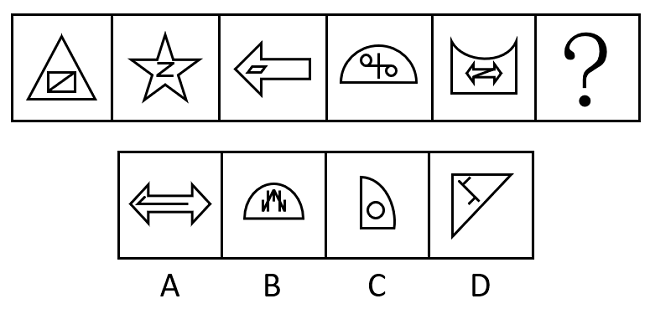
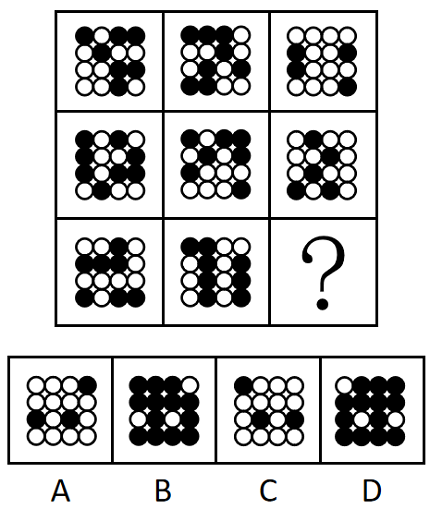
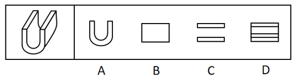
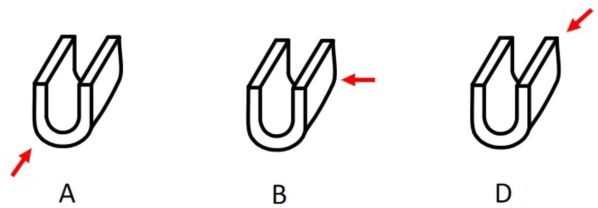
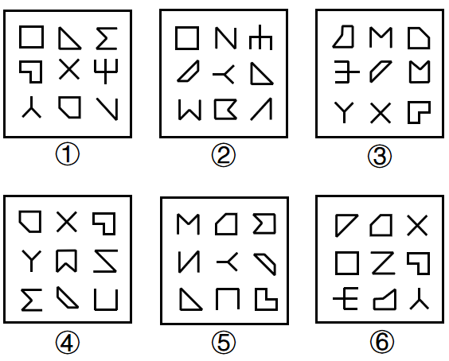
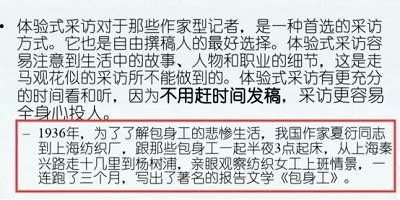
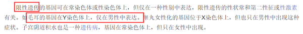
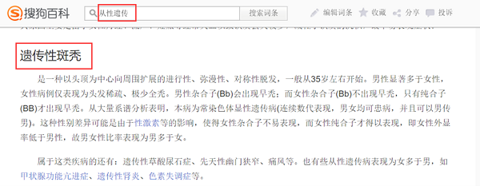

# 2023年国家公务员录用考试《行测》题（行政执法卷网友回忆版）

> 判断推理 · 40 题 · 国考 2023

## 材料 1

6天休假期间，单位需要每天安排一人值班。财务、研发、人事、后勤、法务和销售6个部门各推荐了2人，值班人员从这12人中选择，每人至多值班一天。安排要求：

（1）第二天和第四天不安排法务部门的人值班；

（2）若安排后勤部门的人值班，则只能安排在法务部门的人值班的前一天；

（3）若安排研发部门的人值班，则只能安排在后勤部门的人值班的前一天。

### 第 1 题　qid 5445782 · 逻辑判断

关于6天中的人选，以下哪项安排符合上述条件？

- **A**. 财务、人事、后勤、法务、财务、人事
- **B**. 销售、财务、法务、人事、财务、销售　✅
- **C**. 人事、财务、法务、研发、法务、后勤
- **D**. 法务、销售、人事、后勤、财务、销售

**答案**：B

**官方解析**

第一步：分析题干条件。

6天假期每天需安排一人值班，6个部门各推荐2人，从12人中选择6人，每人值班一天。安排要求如下：

（1）法务部第二、四天；

（2）后勤值班后勤安排在法务前一天；

（3）研发值班研发安排在后勤前一天。

第二步：根据题干条件进行推理。

本题题干信息确定，选项信息充分，优先考虑排除法。

根据条件（1）“法务部第二、四天”，排除A项。

根据条件（2）“后勤值班后勤安排在法务前一天”，排除C、D两项。

经验证，B项满足题干所有条件，当选。

故正确答案为B。

---

### 第 2 题　qid 5445805 · 类比推理

后勤部门的人可以安排在哪几天值班？

- **A**. 只有第二天、第四天、第五天　✅
- **B**. 只有第一天、第三天、第五天
- **C**. 只有第二天、第六天
- **D**. 只有第一天、第三天

**答案**：A

**官方解析**

第一步：分析题干条件。

6天假期每天需安排一人值班，6个部门各推荐2人，从12人中选择6人，每人值班一天。安排要求如下：

（1）法务部第二、四天；

（2）后勤值班后勤安排在法务前一天；

（3）研发值班研发安排在后勤前一天。

第二步：根据题干条件进行推理。

提问为“可以”，优先考虑代入选项。因为选项表述均为“只有”，说明是要列举后勤部门值班的所有可能情况，此时可以从选项中只出现一次的情况入手，即A项中的“后勤部门的人是否可以安排在第四天”，如果可以，即A项当选，如果不可以，即排除A项。

如果后勤部门安排在第四天，根据条件（2）可知，法务部门安排在第五天，题干所有条件均可满足，即后勤部门可以安排在第四天，排除B、C、D三项。

故正确答案为A。

---

### 第 3 题　qid 5445808 · 逻辑判断

如果安排后勤部门的两人值班，则以下哪项一定是错误的？

- **A**. 第一天安排研发部门的人值班
- **B**. 第六天安排人事部门的人值班
- **C**. 第三天安排财务部门的人值班　✅
- **D**. 第五天安排法务部门的人值班

**答案**：C

**官方解析**

第一步：分析题干条件。

6天假期每天需安排一人值班，6个部门各推荐2人，从12人中选择6人，每人值班一天。安排要求如下：

（1）法务部第二、四天；

（2）后勤值班后勤安排在法务前一天；

（3）研发值班研发安排在后勤前一天；

（4）后勤有两人值班。

第二步：根据题干条件进行推理。

条件（4）表明后勤有两人值班，结合条件（2）可知，法务也应有两人值班，且后勤紧挨在法务值班的前一天，据此可知，法务不能安排在第一天。

再结合条件（1）可知，法务的两人只能安排在第三天、第五天、第六天这三天中的两天。由于法务两人值班的前一天均应是后勤的人在值班，所以法务的两人不能同时安排在第五天和第六天，因此法务一定有一人是安排在第三天的，则C项第三天安排财务部门的人值班是错误的。

本题为选非题，故正确答案为C。

---

### 第 4 题　qid 5445817 · 类比推理

如果在第三天、第五天分别安排两个财务部门的人值班，则第一天、第六天可安排的值班人员可能分别来自：

- **A**. 后勤部门和法务部门
- **B**. 法务部门和销售部门　✅
- **C**. 财务部门和销售部门
- **D**. 研发部门和人事部门

**答案**：B

**官方解析**

第一步：分析题干条件。

6天假期每天需安排一人值班，6个部门各推荐2人，从12人中选择6人，每人值班一天。安排要求如下：

（1）法务部第二、四天；

（2）后勤值班后勤安排在法务前一天；

（3）研发值班研发安排在后勤前一天；

（4）在第三天、第五天分别安排两个财务部门的人值班。

第二步：根据题干条件进行推理。

提问方式为“可能”，优先使用代入法。

代入A项：如果第一天、第六天安排的值班人员分别来自后勤部门和法务部门，根据条件（2）后勤值班后勤安排在法务前一天，可知第二天为法务，不满足条件（1），排除；

代入B项：如果第一天、第六天安排的值班人员分别来自法务部门和销售部门，根据条件（4）在第三天、第五天分别安排财务，根据条件（2）后勤值班后勤安排在法务前一天，可知第二天和第四天不能安排后勤，根据条件（1），可知第二天和第四天不能安排法务，根据条件（3）研发值班研发安排在后勤前一天，可知第二天和第四天不能安排研发，所以第二天和第四天可以安排人事或者销售，可进行如下安排，满足题干条件，当选；

代入C项：如果第一天、第六天安排的值班人员分别来自财务部门和销售部门，此时第一天、第三天和第五天安排的值班人员均来自财务部门，不符合题干条件“6个部门各推荐2人”，不满足题干条件，排除；

代入D项：如果第一天、第六天安排的值班人员分别来自研发部门和人事部门，根据条件（3）研发值班研发安排在后勤前一天，可知第二天的值班人员来自后勤部门，根据条件（2）后勤值班后勤安排在法务前一天，可知第三天的值班人员来自法务部门，此时不符合条件（4）“第三天安排财务部门的人值班”，不满足题干条件，排除。

故正确答案为B。

---

### 第 5 题　qid 5445818 · 逻辑判断

如果没有安排财务和后勤部门的人值班，则以下哪项一定是正确的？

- **A**. 第四天安排销售部门的人值班
- **B**. 第五天安排法务部门的人值班
- **C**. 第二天安排销售部门或者人事部门的人值班　✅
- **D**. 第三天安排法务部门或者人事部门的人值班

**答案**：C

**官方解析**

第一步：分析题干条件。

6天假期每天需安排一人值班，6个部门各推荐2人，从12人中选择6人，每人值班一天。安排要求如下：

（1）法务部第二、四天；

（2）后勤值班后勤安排在法务前一天；

（3）研发值班研发安排在后勤前一天；

（4）没有安排财务和后勤部门的人值班。

第二步：根据题干条件进行推理。

根据条件（4）没有安排后勤部门的人值班，可知研发部门不可能安排在后勤部门的前一天，结合条件（3）可知，没有安排研发部门的人值班。此时已知没有安排研发、财务和后勤这3个部门的人值班，结合题干开头给出的信息可知，值班人员只能从剩下的人事、法务、销售这3个部门中选择。再结合条件（1）可知，第二天不能安排法务部门的人值班，所以第二天只能安排销售部门或者人事部门的人值班。

故正确答案为C。

---

### 第 6 题　qid 5445797 · 图形推理

从所给的四个选项中，选择最合适的一个填入问号处，使之呈现一定的规律性：

- **A**. A
- **B**. B
- **C**. C　✅
- **D**. D

**答案**：C

**官方解析**

图形元素组成不同，无明显属性规律，考虑数量规律。题干图形明显被分割，优先考虑面数量，发现题干图形均为4个面，据此排除A项；继续观察发现题干图形均由几个图形拼接而成，还可以考虑图形间关系。题干图形均有一个黑块，观察发现题干图形中黑块均与3个白块存在公共边，选项中只有C项符合。
故正确答案为C。

---

### 第 7 题　qid 5445778 · 图形推理

从所给的四个选项中，选择最合适的一个填入问号处，使之呈现一定的规律性：

- **A**. A
- **B**. B
- **C**. C
- **D**. D　✅

**答案**：D

**官方解析**

图形元素组成不同，优先考虑属性规律。观察发现，题干图形均由内外两部分组成，考虑分内外看，且题干出现等腰三角形、平行四边形等特征图形，考虑对称性。题干图形外部均为轴对称图形，内部均为中心对称图形，故？处图形也应满足此规律，只有D项符合。
故正确答案为D。

---

### 第 8 题　qid 5445802 · 图形推理

从所给的四个选项中，选择最合适的一个填入问号处，使之呈现一定的规律性：

- **A**. A
- **B**. B　✅
- **C**. C
- **D**. D

**答案**：B

**官方解析**

元素组成相同，优先考虑位置规律。题干图形由黑色三角形构成，且数量较多、角度也较乱，考虑相邻比较。观察发现：从图1到图2，最上方一行相同位置上的黑色三角形均顺时针旋转了，其余位置的黑色三角形保持不变；从图2到图3，最右侧一列相同位置上的黑色三角形均顺时针旋转了，其余位置的黑色三角形保持不变；从图3到图4，最下方一行相同位置上的黑色三角形均顺时针旋转了，其余位置的黑色三角形保持不变；从图4到图5，最左侧一列相同位置上的黑色三角形均顺时针旋转了，其余位置的黑色三角形保持不变。因此，？处图形与图5相比，应为只有最上方一行相同位置上的黑色三角形顺时针旋转，其余位置的黑色三角形均保持不变，只有B项符合。

故正确答案为B。

---

### 第 9 题　qid 5445769 · 图形推理

从所给的四个选项中，选择最合适的一个填入问号处，使之呈现一定的规律性：

- **A**. A　✅
- **B**. B
- **C**. C
- **D**. D

**答案**：A

**官方解析**

图形元素组成相似，优先考虑样式规律。观察发现，题干图形均由黑球和白球构成，考虑黑白运算。九宫格优先横向观察，第一行图形的黑白运算规律为：黑+黑=白，黑+白=白，白+黑=白，白+白=黑，第二行图形经验证符合此规律，第三行图形应用此规律，只有A项符合。
故正确答案为A。

---

### 第 10 题　qid 5445822 · 图形推理

将一张直角三角形形状的纸片进行两次折叠，展开后的折痕将该三角形分成如图所示的a、b、c、d四个部分，则两次折叠后的纸片投影面积为：

- **A**. b+d+c-a
- **B**. b+d-c
- **C**. b+c-a
- **D**. b+d-a　✅

**答案**：D

**官方解析**

第一步，将直角三角形先沿水平折痕进行折叠，即将面c和面d向下折叠，覆盖面b和面a，得到如下图形，此时折叠后面积为：b+d；

第二步，将直角三角形沿着竖直折痕进行折叠，即将面b和面c向右折叠，覆盖面d和面a，得到如下图形，此时折叠后面积为：d+b-a。

故正确答案为D。

---

### 第 11 题　qid 5445823 · 图形推理

左图为给定的立体图形，从任一角度观看，下面哪项不可能是该立体图形的视图？

- **A**. A
- **B**. B
- **C**. C　✅
- **D**. D

**答案**：C

**官方解析**

本题考查三视图。如下图所示，A、B、D三项按图中箭头方向观察，均可看到，排除；C项为从上往下观察图形，则左右两侧应有两条竖线，当选。

本题为选非题，故正确答案为C。

---

### 第 12 题　qid 5445798 · 图形推理

左图为等大的3个灰色正方体和15个白色正方体组合成的多面体，其可以切割为①、②和③三个小多面体，问③代表的多面体可能是：

- **A**. A　✅
- **B**. B
- **C**. C
- **D**. D

**答案**：A

**官方解析**

本题考查立体拼合。如下图所示，将图①、图②进行旋转，结合A项，即可拼合成为左图的多面体。

故正确答案为A。

---

### 第 13 题　qid 5445799 · 图形推理

把下面六个图形分为两类，使每一类图形都有各自的共同特征或规律，分类正确的一项是：

- **A**. ①②⑤，③④⑥
- **B**. ①②④，③⑤⑥
- **C**. ①④⑤，②③⑥　✅
- **D**. ①③⑤，②④⑥

**答案**：C

**官方解析**

本题为分组分类题目。元素组成不同，且无明显属性规律，考虑数量规律。观察发现，题干图形基本都由圆和正方形构成，优先考虑元素的个数，圆的数量依次为5、0、1、3、4、2，正方形的数量依次为4、1、2、2、3、3，单独看数量无规律，考虑二者运算图①④⑤中，圆的数量-正方形的数量=1；图②③⑥中，正方形的数量-圆的数量=1。故图①④⑤为一组，图②③⑥为一组。
故正确答案为C。

---

### 第 14 题　qid 5445768 · 图形推理

把下面的六个图形分为两类，使每一类图形都有各自的共同特征或规律，分类正确的一项是：

- **A**. ①③⑤，②④⑥
- **B**. ①④⑥，②③⑤
- **C**. ①③④，②⑤⑥
- **D**. ①②④，③⑤⑥　✅

**答案**：D

**官方解析**

本题为分组分类题目。元素组成不同，且无明显属性规律，考虑数量规律。观察发现，图2为“日”字变形图，图3为多端点图形，优先考虑笔画数。图①②④为一笔画图形，图③⑤⑥为两笔画图形，即图①②④为一组，图③⑤⑥为一组。
故正确答案为D。

---

### 第 15 题　qid 5445793 · 图形推理

把下面的六个图形分为两类，使每一类图形都有各自的共同特征或规律，分类正确的一项是：

- **A**. ①③④，②⑤⑥
- **B**. ①②④，③⑤⑥　✅
- **C**. ①②⑥，③④⑤
- **D**. ①⑤⑥，②③④

**答案**：B

**官方解析**

解析一：本题为分组分类题目。元素组成不同，且封闭面明显，考虑数面。观察发现，图①②④中有4个面；图③⑤⑥中有5个面，即图①②④为一组，图③⑤⑥为一组。
故正确答案为B。
解析二：本题为分组分类题目。元素组成不同，优先考虑属性规律。观察发现，题干每幅图中均出现多个全开放图形，优先考虑开闭性。图①②④中有5个全开放图形、4个全封闭图形；图③⑤⑥中有4个全开放图形、5个全封闭图形，即图①②④为一组，图③⑤⑥为一组。
故正确答案为B。

---

### 第 16 题　qid 5445804 · 定义判断

微量鉴定是指运用物理学、化学和仪器分析等方法，通过对案件现场有关物质材料（材料特点多为体小量微、不易注意）的成分及其结构进行定性、定量分析，对检材的种类、检材和嫌疑样本的同类性和同一性进行鉴定。
根据以上定义，下列涉及交通事故的鉴定属于微量鉴定的是：

- **A**. 对车辆驾驶人采血，分析血液中的酒精含量，判断驾驶人是否存在酒后驾车嫌疑
- **B**. 现场提取、检验受害人毛发、衣物纤维，认定受害人是否与嫌疑人车辆存在接触　✅
- **C**. 拆解车辆特定部位，查明车辆故障原因，用以鉴定其属于人为责任还是机械故障
- **D**. 通过人体损伤程度检验，确定伤害损伤部位与交通事故伤害后果的关联程度

**答案**：B

**官方解析**

第一步：找出定义关键词。
“对案件现场体小量微、不易注意的物质材料成分及其结构进行分析”、“对检材的种类、检材和嫌疑样本的同类性和同一性进行鉴定”。
第二步：逐一分析选项。
A项：对车辆驾驶人采血，分析血液中的酒精含量，“血液”不符合“体小量微、不易注意的物质材料”，并且也不涉及与嫌疑样本的比对，不符合定义，排除；
B项：现场提取、检验受害人毛发、衣物纤维，“毛发，衣物纤维”符合“体小量微、不易注意的物质材料”，认定受害人是否与嫌疑人车辆存在接触，符合“对检材的种类、检材和嫌疑样本的同类性和同一性进行鉴定”，符合定义，当选；
C项：拆解车辆特定部位，查明车辆故障原因，“车辆特定部位”不符合“体小量微、不易注意的物质材料”，并且也不涉及与嫌疑样本的比对，不符合定义，排除；
D项：通过人体损伤程度检验，确定伤害损伤部位与交通事故伤害后果的关联程度，“人体”不符合“体小量微、不易注意的物质材料”，并且也不涉及与嫌疑样本的比对，不符合定义，排除。
故正确答案为B。

---

### 第 17 题　qid 5445820 · 定义判断

架构创新是指组成产品的基本元件不变，但是整体结构布局改变，即将相同元件进行整体结构的重新调整，进而产生新功能的创新。
根据上述定义，下列属于架构创新的是：

- **A**. 陶瓷底板电熨斗与传统不锈钢底板电熨斗相比，其底板的耐磨性更强，具有更高的光滑度，使用起来更顺畅
- **B**. 某款手机聊天软件增加了拜年红包功能，用户可以在给亲朋好友发送红包时，编辑拜年吉祥语、自定义红包图片，满足个性化需求
- **C**. 可拆卸手柄锅将原手柄设计成可从锅具上拆卸下来，并提供多个手柄可安装在锅具边缘的任意位置上，满足烹饪需要　✅
- **D**. 某板材厂改良制作工艺，将原来的轧制工序分成两步进行，同时增加砂光工序，生产出满足市场需要的薄板

**答案**：C

**官方解析**

第一步：找出定义关键词。
“组成产品的基本元件不变”、“重新调整相同元件的整体结构”、“产生新功能的创新”。
第二步：逐一分析选项。
A项：陶瓷底板电熨斗与传统不锈钢底板电熨斗，二者的底板分别为陶瓷和不锈钢，说明二者的基本元件不同，不符合“组成产品的基本元件不变”，不符合定义，排除；
B项：手机聊天软件增加了拜年红包功能，用户可以在红包上编辑拜年吉祥语、自定义红包图片，但是以前发红包不能自定义红包图片，现在能自己选择了，其实是新开发的功能，不是因整体结构布局改变而产生的功能，不符合“重新调整相同元件的整体结构”、“产生新功能的创新”，不符合定义，排除；
C项：可拆卸手柄锅提供多个手柄可安装在锅具边缘的任意位置上，说明安装手柄的结构布局改变，符合“重新调整相同元件的整体结构”，但有同学觉得 “提供多个手柄”，数量多了，不符合“组成产品的基本元件不变”，此处确实是C项纠结的地方，但宏观来看其实基本原件还是锅和手柄，但是商家给了多个手柄，其实就是提供了更多结构调整时的功能选择，比如一个手柄可以做炒锅，两个手柄可以做汤锅，取下手柄还可以当盘子用等，产生了很多的新功能（注：烹饪功能也可以细化成炒煮蒸炸等，不同的手柄带来了不同的功能），整体来说，比B项更符合关键词“重新调整相同元件的整体结构”、“产生新功能的创新”，择优选择C项；
D项：板材厂将原来的轧制工序分成两步进行，同时增加砂光工序，说明是产品的制作工艺改变，不符合“重新调整相同元件的整体结构”，不符合定义，排除。
故正确答案为C。

---

### 第 18 题　qid 5445821 · 定义判断

民宿是指利用当地民居等相关闲置资源，经营用客房不超过4层、建筑面积不超过800平方米，主人参与接待，为游客提供体验当地自然、文化与生产生活方式的小型住宿设施。
根据上述定义，下列属于民宿的是：

- **A**. 王某在市中心有一套两居室的房子，过了马路就是知名的景区公园。王某将闲置房间租给那些节假日来旅游的家庭，并提供导游服务　✅
- **B**. 某家庭农场开发亲子休闲旅游业务，建设了农业科普、亲子游玩场所，为孩子和家长营造一处寓教于乐的乡村乐园
- **C**. 李某通过某网上平台找到心仪城市的会员“交换”旅行，即双方各自为对方提供住宿，住在对方家中深入体验当地的风土人情
- **D**. 张某在古镇上有一所老宅。他和某平台签订合同，将老宅租给该平台运营。该平台将老宅装修，并提供完善的酒店式服务机制

**答案**：A

**官方解析**

第一步：找出定义关键词。
“利用当地民居等相关闲置资源”、“经营用客房不超过4层、建筑面积不超过800平方米”、“主人参与接待，为游客提供体验当地自然、文化与生产生活方式”。
第二步：逐一分析选项。
A项：王某有一套两居室的房子，将闲置房间租给旅游家庭，符合“利用当地民居等相关闲置资源”、“经营用客房不超过4层、建筑面积不超过800平方米”，并提供导游服务，符合“主人参与接待，为游客提供体验当地自然、文化与生产生活方式”，符合定义，当选；
B项：某家庭农场开发亲子休闲旅游业务，未提及该农场是否为闲置资源，不符合“利用当地民居等相关闲置资源”，也未提及该农场是否有经营用客房，不符合“经营用客房不超过4层、建筑面积不超过800平方米”，建设了农业科普、亲子游玩场所，不符合“主人参与接待，为游客提供体验当地自然、文化与生产生活方式”，不符合定义，排除；
C项：李某与心仪城市的会员“交换”旅行，双方各自为对方提供住宿，说明双方是互相为对方提供住宿，而非用于经营，不符合“经营用客房”，不符合定义，排除；
D项：张某将古镇的老宅租给某平台，符合“利用当地民居等相关闲置资源”，将老宅租给该平台运营，由该平台提供完善的酒店式服务机制，说明该老宅的主人张某并不提供接待服务，不符合“主人参与接待，为游客提供体验当地自然、文化与生产生活方式”，不符合定义，排除。
故正确答案为A。

---

### 第 19 题　qid 5445801 · 定义判断

体验式采访是指直接投入到所要报道的新闻事件中去体验生活，以获得新闻报道所需要的素材，以及对新闻事件的认识。
根据上述定义，下列不属于体验式采访的是：

- **A**. 某报社要求年轻记者沉入生活，了解基层，以改变写官话、说套话的文风　✅
- **B**. 某作家为了解包身工的悲惨遭遇，深入到工厂中，写出报告文学《包身工》
- **C**. 某记者为了解传销组织的真面目，打入到传销组织内部，揭示传销组织的骗局
- **D**. 某电视台推出专栏《体验三百六十行》，派记者体验各职业一周并进行系列报道

**答案**：A

**官方解析**

第一步：找出定义关键词。

“直接投入到所要报道的新闻事件中”、“以获得新闻素材及认识”。

第二步：逐一分析选项。

A项：某报社要求年轻记者深入基层以改变写官话、说套话的文风，其目的是改变文风，而非获得新闻素材及认识，不符合“以获得新闻素材及认识”，不符合定义，当选；

B项：某作家深入到工厂中，符合“直接投入到所要报道的新闻事件中”，其目的是了解包身工的悲惨遭遇，之后写出报告文学《包身工》，而报告文学兼有新闻和文学的特点，用文学手段处理新闻题材，符合“以获得新闻素材及认识”，符合定义，排除；

C项：某记者打入到传销组织内部，符合“直接投入到所要报道的新闻事件中”，其目的是了解传销组织的真面目以揭示其骗局，符合“以获得新闻素材及认识”，符合定义，排除；

D项：记者体验各职业一周，符合“直接投入到所要报道的新闻事件中”，其目的是了解各行业以完成专栏《体验三百六十行》，符合“以获得新闻素材及认识”，符合定义，排除。

本题为选非题，故正确答案为A。

---

### 第 20 题　qid 5445814 · 定义判断

伴性遗传是指控制性状的基因位于性染色体上，遗传总是与性别相关联，不同性别出现某一性状的概率不同的遗传。限性遗传是指控制性状的基因位于性染色体上，性状只在一种性别上得以表现，而在另一性别上完全不能表现的遗传。从性遗传是指控制性状的基因位于常染色体上，但由于受到性激素的作用，基因在不同性别中表达不同的遗传。
根据上述定义，下列属于限性遗传的是：

- **A**. 抗维生素D佝偻病是伴X染色体显性遗传病，女性发病率高，常表现为世代遗传
- **B**. 人类外耳道多毛症为伴Y染色体遗传病，在家族男性亲属中代代遗传　✅
- **C**. 遗传性斑秃为常染色体显性遗传病，男性会出现早秃，而女性则不会出现
- **D**. 红绿色盲症是伴X染色体隐性遗传病，男性发病率高，表现出交叉遗传和隔代遗传

**答案**：B

**官方解析**

第一步：找出定义关键词。

伴性遗传：“控制性状的基因位于性染色体上”、“不同性别出现某一性状的概率不同”；

限性遗传：“控制性状的基因位于性染色体上”、“只在一种性别上得以表现，而在另一性别上完全不能表现”；

从性遗传：“控制性状的基因位于常染色体上”、“由于受到性激素的作用，基因在不同性别中表达不同”。

第二步：逐一分析选项。

A项：抗维生素D佝偻病在女性中的发病率高，说明在女性中出现的概率高，符合“不同性别出现某一性状的概率不同”，符合伴性遗传定义，不符合“性状只在一种性别上得以表现，而在另一性别上完全不能表现”，不符合限性遗传定义，排除；

B项：人类外耳道多毛症为伴Y染色体遗传病，在家族男性亲属中代代遗传，说明该病仅在家族男性中遗传，符合“性状只在一种性别上得以表现，而在另一性别上完全不能表现”，符合限性遗传定义，当选；

C项：遗传性斑秃为常染色体显性遗传病，说明其控制性状的基因位于常染色体上，不符合“控制性状的基因位于性染色体上”，不符合限性遗传定义，下面资料显示，遗传性斑秃属于从性遗传，排除； 

D项：红绿色盲症在男性中发病率高，说明在男性中出现的概率高，符合“不同性别出现某一性状的概率不同”，符合伴性遗传定义，不符合“性状只在一种性别上得以表现，而在另一性别上完全不能表现”，不符合限性遗传定义，排除。

故正确答案为B。

---

### 第 21 题　qid 5445800 · 定义判断

预判设计是一种能够引导用户、缩短用户行为路径的有效设计手段。它可以根据用户的行为或用户所在的场景，让功能“主动找到”用户，并让用户与之产生自然的交互，为用户提供更好的使用体验，本质就是为用户多想一步，让用户使用起来尽量简单。
根据上述定义，下列不属于预判设计的是：

- **A**. 某购物软件，根据用户输入的搜索关键词，将商品按与关键词的相关性排列　✅
- **B**. 某翻译软件，用户第一次点击播放，语音速度正常；再次点击，语音速度变慢
- **C**. 某外卖软件，当用户对店家给出差评，系统自动勾选“将评价设为匿名评价”
- **D**. 某购物软件，所选商品缺货时，出现“找相似”按钮，点击可看到同款、相似商品

**答案**：A

**官方解析**

第一步：找出定义关键词。
“引导用户、缩短用户行为路径”、“让功能‘主动找到’用户”、“为用户多想一步，让用户使用起来尽量简单”。
第二步：逐一分析选项。
A项：用户在购物软件输入搜索关键词以后，购物软件列出与用户搜索关键词相关的商品，此时仅仅是该软件配合了用户的搜索行为，并没有对其下一步行为进行预判，更没有引导用户，不符合“引导用户、缩短用户行为路径”、“让功能‘主动找到’用户”、“为用户多想一步，让用户使用起来尽量简单”，不符合定义，当选；
B项：某翻译软件第一次点击播放，语速正常，再次点击，语速变慢，体现了产品会预判用户可能是刚刚没听清楚、或者想听清某个词的念法等，从而不用等用户自行操作，而主动将语音播放速度变慢，符合“引导用户、缩短用户行为路径”、“让功能‘主动找到’用户”、“为用户多想一步，让用户使用起来尽量简单”，符合定义，排除；
C项：某外卖软件，当用户给差评时，系统自动勾选“匿名评价”，因为绝大多数用户给商家差评时都不希望商家看到自己的身份，所以该软件不等用户自行勾选匿名评价，而自动帮用户勾选，缩短了用户行为路径，为用户多想一步，符合“引导用户、缩短用户行为路径”、“让功能‘主动找到’用户”、“为用户多想一步，让用户使用起来尽量简单”，符合定义，排除；
D项：大多数用户在购物软件上遇到想要的商品缺货时，接下来最可能的就是去找一些相似的商品，所以某购物软件为用户多想了一步，不用等用户自行搜索相似商品，而是当所选商品缺货时，自动出现“找相似”按钮，点击可看到同款、相似商品，符合“引导用户、缩短用户行为路径”、“让功能‘主动找到’用户”、“为用户多想一步，让用户使用起来尽量简单”，符合定义，排除。
本题为选非题，故正确答案为A。

---

### 第 22 题　qid 5445785 · 定义判断

负性偏向是指负性信息比其他信息得到优先的注意和加工，这是人类在先天遗传和后天经验基础上存在的一种普遍性认知倾向，即给予负性事物更大的权重，并在注意、记忆、情绪、决策等方面遵循“坏比好重要”的心理原则。
根据上述定义，下列没有体现负性偏向的是：

- **A**. “3·15”晚会报道侵犯消费者权益的违法行为，以期政府各级管理部门有效管理　✅
- **B**. 被试对负面词汇的再认正确率比正面词汇高，能更精准识别某负面词汇是否在语料中
- **C**. 新闻传播过程中，模糊信息中的一些负面细节更容易被人们关注并作进一步负面解读
- **D**. 应聘者的优缺点与职位具有同等相关性，但招聘者往往更关注应聘者的缺点

**答案**：A

**官方解析**

第一步：找出定义关键词。
“负性信息比其他信息得到优先的注意和加工”、“坏比好重要”。
第二步：逐一分析选项。
A项：“3·15”晚会报道违法行为，该项仅提及了“负性信息”，没有提到“其他信息”，也不存在“负性信息”与“其他信息”之间的比较，不符合“负性信息比其他信息得到优先的注意和加工”、“坏比好重要”，不符合定义，当选；
B项：该项说被试对负面词汇的再认正确率比正面词汇高，能更精准识别负面词汇，体现了被试对负性信息更加注意，“比”和“更”体现了“负性信息”和“其他信息”之间的比较，符合“负性信息比其他信息得到优先的注意和加工”、“坏比好重要”，符合定义，排除；
C项：该项说模糊信息中的一些负面细节更容易被人们关注并作进一步负面解读，说明相较于“其他信息”，人们更优先注意和加工“负性信息”，符合“负性信息比其他信息得到优先的注意和加工”、“坏比好重要”，符合定义，排除；
D项：该项说在应聘者的优缺点中，招聘者更关注其缺点，说明相较于“其他信息”，招聘者更优先注意“负性信息”，符合“负性信息比其他信息得到优先的注意和加工”、“坏比好重要”，符合定义，排除。
本题为选非题，故正确答案为A。

---

### 第 23 题　qid 5445787 · 定义判断

单元素导语是指在撰写新闻导语（即消息的开头）时，突出表现一个新闻事实的导语。单元素导语按新闻五要素可分为：①何人导语，突出报道显要或影响大的新闻人物；②何事导语，突出报道新闻事实本身；③何时导语，突出报道读者关心的事情什么时候会发生或进行；④何地导语，突出报道一些重要或有特殊意义的地方发生重大变化的消息；⑤为什么导语，突出报道一个事件的起因。
根据上述定义，下列导语与其分类对应正确的是：

- **A**. 亲爱的读者，你知道为什么夏天夜空里看到的星星比冬天夜空里看到的多？——④
- **B**. 1964年10月16日，我国第一颗原子弹爆炸成功——②　✅
- **C**. 杨先生带着2岁的女儿到市医院看病，没想到看一个“咳嗽”就要花1000多元——①
- **D**. 谁是高考状元？这个一年一度的热门话题，今年却在XX省消失了——③

**答案**：B

**官方解析**

第一步：找出定义关键词。
单元素导语：“在撰写新闻导语（即消息的开头）时，突出表现一个新闻事实”；
何人导语：“突出报道显要或影响大的新闻人物”；
何事导语：“突出报道新闻事实本身”；
何时导语：“突出报道读者关心的事情什么时候会发生或进行”；
何地导语：“突出报道一些重要或有特殊意义的地方发生重大变化的消息”；
为什么导语：“突出报道一个事件的起因”。
第二步：逐一分析选项。
A项：为什么夏天夜空看到的星星比冬天夜空里看到的多是想要表现事件的起因，符合“突出报道一个事件的起因”，符合“为什么导语”定义，不符合“何地导语”定义，对应错误，排除；
B项：1964年10月16日，第一颗原子弹爆炸成功是新闻事实本身，符合“突出报道新闻事实本身”，符合“何事导语”定义，对应正确，当选；
C项：杨先生带着女儿到医院看病，一个“咳嗽”花费1000多元是新闻事实本身，符合“突出报道新闻事实本身”，符合“何事导语”定义，不符合“何人导语”定义，对应错误，排除；
D项：高考状元今年在XX省消失了，报道该省发生的重大变化，符合“突出报道一些重要或有特殊意义的地方发生重大变化的消息”，符合“何地导语”定义，不符合“何时导语”定义，对应错误，排除。
故正确答案为B。

---

### 第 24 题　qid 5445764 · 定义判断

子弹时间即计算机辅助的摄影技术模拟变速特效，是一种使用在电影、电视节目或电脑游戏等领域的摄影技术模拟变速特效，例如强化的慢镜头、时间静止等效果。
根据上述定义，下列描述符合子弹时间的是：

- **A**. 电视剧中，男主角因车祸去世，女主角目睹了这个过程，此后很多年，她的眼前无数次闪现出车祸发生的过程
- **B**. 江阿姨的丈夫去世之后，她每天的大部分时间都用来反复看他们以前拍摄的视频，时间在她身上似乎静止了
- **C**. 科幻小说中，小明因考试结束时还没有答完卷子，祈祷时间暂停，然后他发现时间真的静止了，只有他可以答卷
- **D**. 通过电视转播，观众们看到滑雪运动员的身体缓慢地在空中划出优美的曲线，翻转瞬间的每个动作都无比清晰　✅

**答案**：D

**官方解析**

第一步：找出定义关键词。
“使用在电影、电视节目或电脑游戏等领域的摄影技术模拟变速特效”。
第二步：逐一分析选项。
A项：电视剧中女主角的眼前无数次闪现出男主角车祸发生的过程，并没有涉及摄影技术模拟变速特效，不符合“使用在电影、电视节目或电脑游戏等领域的摄影技术模拟变速特效”，不符合定义，排除；
B项：江阿姨反复看以前拍摄的视频，并未涉及到电影、电视节目或电脑游戏等领域，时间在她身上似乎静止了，也没有使用摄影技术模拟变速特效，不符合“使用在电影、电视节目或电脑游戏等领域的摄影技术模拟变速特效”，不符合定义，排除；
C项：科幻小说中的时间静止，并没有涉及摄影技术模拟变速特效，不符合“使用在电影、电视节目或电脑游戏等领域的摄影技术模拟变速特效”，不符合定义，排除；
D项：通过电视转播，观众们看到滑雪运动员在滑雪过程中的一些慢动作，符合“使用在电影、电视节目或电脑游戏等领域的摄影技术模拟变速特效”，符合定义，当选。
故正确答案为D。

---

### 第 25 题　qid 5445786 · 定义判断

联合式构词法是由两个意义相同、相反或相对的词根联合起来构成新词的方法，在词内两个词根是平等的，没有主从、正副之分。
根据上述定义，下列使用了联合式构词法的是：

- **A**. “叮当”，因摹拟动作的声音而构成的词
- **B**. “椅子”，在单字“椅”后面附加“子”而构成的词
- **C**. “蹉跎”，由韵母相同的两个单字组合构成意义与单字无关的词
- **D**. “开关”，由“开”和“关”两个单字组合而构成的词　✅

**答案**：D

**官方解析**

第一步：找出定义关键词。
“由两个意义相同、相反或相对的词根联合起来构成新词”、“两个词根是平等的，没有主从、正副之分”。
第二步：逐一分析选项。
A项：“叮”和“当”代表两个不同的声音，二者不符合“由两个意义相同、相反或相对的词根联合起来构成新词”，不符合定义，排除；
B项：“椅子”中侧重于“椅”，即“椅”为主，“子”为从，不符合“两个词根是平等的，没有主从、正副之分”，不符合定义，排除；
C项：“蹉”的意思有失足、差错等，而“跎”的意思有背负、驼背等，二者不符合“由两个意义相同、相反或相对的词根联合起来构成新词”，不符合定义，排除；
D项：“开关”是指电器装置上接通和截断电路的设备，“开”有打开的意思，“关”有关闭的意思，二者意思相反且无主从之分，符合“由两个意义相同、相反或相对的词根联合起来构成新词”、“两个词根是平等的，没有主从、正副之分”，符合定义，当选。
故正确答案为D。

---

### 第 26 题　qid 5445780 · 类比推理

铜镜：化妆镜

- **A**. 门帘：纱帘
- **B**. 木碗：汤碗　✅
- **C**. 金簪：发簪
- **D**. 瓷瓶：古瓶

**答案**：B

**官方解析**

第一步：判断题干词语间逻辑关系。
铜镜一般是指由含锡量较高的青铜铸造的镜子，化妆镜一般指专门用于化妆的镜子。有的铜镜是化妆镜，有的铜镜不是化妆镜，有的化妆镜是铜镜，有的化妆镜不是铜镜，二者为交叉关系，且前者是根据材质命名，后者是根据功能命名。
第二步：判断选项词语间逻辑关系。
A项：有的门帘是纱帘，有的门帘不是纱帘，有的纱帘是门帘，有的纱帘不是门帘，二者为交叉关系，但前者是根据悬挂的位置命名，与题干逻辑关系不一致，排除；
B项：有的木碗是汤碗，有的木碗不是汤碗，有的汤碗是木碗，有的汤碗不是木碗，二者为交叉关系，且前者是根据材质命名，后者是根据功能命名，与题干逻辑关系一致，当选；
C项：金簪是发簪的一种，二者为种属关系，与题干逻辑关系不一致，排除；
D项：古瓶可指古董瓶子或古代的瓶子，有的瓷瓶是古瓶，有的瓷瓶不是古瓶，有的古瓶是瓷瓶，有的古瓶不是瓷瓶，二者为交叉关系，但后者是根据历史时代命名，与题干逻辑关系不一致，排除。
故正确答案为B。

---

### 第 27 题　qid 5445781 · 类比推理

小计：总计

- **A**. 平均值：总值
- **B**. 被乘数：总数
- **C**. 单科分：总分　✅
- **D**. 分目录：总目

**答案**：C

**官方解析**

第一步：判断题干词语间逻辑关系。
“小计”是数字列表中一部分数字的总和，“总计”是数字列表中所有数字的总和，因此，所有“小计”相加可以得到“总计”，二者是对应关系。
第二步：判断选项词语间逻辑关系。
A项：“平均值”乘以群体总个数等于“总值”，与题干逻辑关系不一致，排除；
B项：“被乘数”指乘法中被乘的数字，一般放在算式的前面，“总数”是所有数的总和，二者无明显逻辑关系，与题干逻辑关系不一致，排除；
C项：所有“单科分”相加可以得到“总分”，二者是对应关系，与题干逻辑关系一致，当选；
D项：“分目录”指在各部分之前的目录，“总目”指在整个文档之前的目录，“总目”是对“分目录”的汇总，不存在相加的计算关系，与题干逻辑关系不一致，排除。
故正确答案为C。

---

### 第 28 题　qid 5445775 · 类比推理

海棠红：南瓜橙

- **A**. 苏丹红：景泰蓝
- **B**. 孔雀蓝：柠檬黄
- **C**. 日落黄：鱼肚白
- **D**. 橄榄绿：梅子青　✅

**答案**：D

**官方解析**

第一步：判断题干词语间逻辑关系。
“海棠红”和“南瓜橙”是两种不同的颜色，二者为并列关系，且都是根据植物命名的。
第二步：判断选项词语间逻辑关系。
A项：“苏丹红”是一种化学染色剂，而“景泰蓝”正名“铜胎掐丝珐琅”，是一种在铜质的胎型上，用柔软的扁铜丝，掐成各种花纹焊上，然后把珐琅质的色釉填充在花纹内烧制而成的器物，且二者不是根据植物命名的，“景泰蓝”是因“明代景泰年间”该工艺技术制作达到巅峰而得名的，与题干逻辑关系不一致，排除；
B项：“孔雀蓝”和“柠檬黄”是两种不同的颜色，二者为并列关系，但“孔雀蓝”不是根据植物命名的，与题干逻辑关系不一致，排除；
C项：“日落黄”和“鱼肚白”是两种不同的颜色，二者为并列关系，但二者不是根据植物命名的，与题干逻辑关系不一致，排除；
D项：“橄榄绿”和“梅子青”是两种不同的颜色，二者为并列关系，且二者都是根据植物命名的，与题干逻辑关系一致，当选。
故正确答案为D。

---

### 第 29 题　qid 5445762 · 类比推理

脱脂棉：原棉

- **A**. 白酒：烧酒
- **B**. 黑陶：黏土　✅
- **C**. 摄像头：镜头
- **D**. 视力：视力表

**答案**：B

**官方解析**

第一步：判断题干词语间逻辑关系。
原棉是制造脱脂棉的原材料，二者为原材料对应关系。
第二步：判断选项词语间逻辑关系。
A项：烧酒也称白酒，二者为全同关系，与题干逻辑关系不一致，排除；
B项：黏土是制造黑陶的原材料，二者为原材料对应关系，与题干逻辑关系一致，当选；
C项：镜头是摄像头的组成部分，二者为组成关系，与题干逻辑关系不一致，排除；
D项：视力表用于测量视力，二者不是原材料对应关系，与题干逻辑关系不一致，排除。
故正确答案为B。

---

### 第 30 题　qid 5445816 · 类比推理

匿名投票：实名投票：现场投票

- **A**. 早间会议：午间会议：工作会议　✅
- **B**. 战国文字：象形文字：古代汉字
- **C**. 金融危机：粮食危机：生态危机
- **D**. 油料作物：糖料作物：经济作物

**答案**：A

**官方解析**

第一步：判断题干词语间逻辑关系。
匿名投票与实名投票是两种投票方式，二者为并列关系；有的现场投票是匿名投票，有的现场投票是实名投票，前两个词语与第三个词语均为交叉关系。
第二步：判断选项词语间逻辑关系。
A项：早间会议和午间会议是两种会议类型，二者为并列关系；有的工作会议是早间会议，有的工作会议是午间会议，前两个词语与第三个词语均为交叉关系，与题干逻辑关系一致，当选；
B项：战国文字是战国时期不同地区使用的汉字的统称；象形文字是由图画文字演化而来的一种最古老的字体，如埃及的象形文字、苏美尔文、古印度文以及中国的甲骨文。战国文字是一种古代汉字，二者为种属关系；有的象形文字是古代汉字，有的象形文字不是古代汉字，有的古代汉字是象形文字，有的古代汉字不是象形文字，二者为交叉关系，与题干逻辑关系不一致，排除；
C项：金融危机是指金融资产、金融机构、金融市场的危机；粮食危机指因粮食供应不足造成的危机；生态危机指生态环境被严重破坏使人类的生存与发展受到威胁的现象，三者是不同领域的危机，为并列关系，与题干逻辑关系不一致，排除；
D项：油料作物和糖料作物是两种经济作物，前两个词语为并列关系，与第三个词语均为种属关系，与题干逻辑关系不一致，排除。
故正确答案为A。

---

### 第 31 题　qid 5445779 · 类比推理

春季过敏：花粉：喷嚏

- **A**. 肺炎：咳嗽：支原体
- **B**. 乙型脑炎：病毒：发热　✅
- **C**. 失眠：恐惧：噩梦
- **D**. 秋季腹泻：饮食：脱水

**答案**：B

**官方解析**

第一步：判断题干词语间逻辑关系。
花粉可能会导致春季过敏，前两词为因果关系；打喷嚏是春季过敏的症状，第一词和第三词为对应关系。
第二步：判断选项词语间逻辑关系。
A项：咳嗽是肺炎的症状，前两词为对应关系；支原体感染可能会导致肺炎，第一词和第三词为因果关系，与题干逻辑关系不一致，排除；
B项：病毒感染可能会导致乙型脑炎，前两词为因果关系；发热是乙型脑炎的症状，第一词和第三词为对应关系，与题干逻辑关系一致，当选；
C项：恐惧可能会导致失眠，前两词为因果关系；噩梦不是失眠的症状，与题干逻辑关系不一致，排除；
D项：秋季腹泻指发生在秋冬季的腹泻病，原因可能是饮食不当或饮食不洁，而非饮食，前两词不是因果关系，与题干逻辑关系不一致，排除。
故正确答案为B。

---

### 第 32 题　qid 5445777 · 类比推理

资产评估：审核通过：股票发售

- **A**. 预定新车：加装内饰：购买车险
- **B**. 修剪草坪：设备检修：园林养护
- **C**. 选购家电：上门安装：维修保养　✅
- **D**. 收看节目：视频连线：观众互动

**答案**：C

**官方解析**

第一步：判断题干词语间逻辑关系。
先资产评估，再审核通过，最后股票发售，三者为时间先后顺序的对应关系。
第二步：判断选项词语间逻辑关系。
A项：先预定新车，但购买车险和加装内饰并无固定的先后顺序，与题干逻辑关系不一致，排除；
B项：修剪草坪是园林养护的一部分，与题干逻辑关系不一致，排除；
C项：先选购家电，再上门安装，最后维修保养，三者为时间先后顺序的对应关系，与题干逻辑关系一致，当选；
D项：视频连线是观众互动的一种方式，与题干逻辑关系不一致，排除。
故正确答案为C。

---

### 第 33 题　qid 5445790 · 类比推理

标清：高清：超清

- **A**. 亚音速：音速：超音速　✅
- **B**. 厅级：市级：省级
- **C**. 迁怒：愤怒：暴怒
- **D**. 幽静：寂静：安静

**答案**：A

**官方解析**

第一步：判断题干词语间逻辑关系。
三者均对清晰度进行分类，构成并列关系，且清晰度依次递增。
第二步：判断选项词语间逻辑关系。
A项：三者均对速度进行分类，构成并列关系，且速度依次递增，与题干逻辑关系一致，当选；
B项：厅级是我国的一个行政级别，而市级和省级属于我国的行政区划，三者不构成并列关系，与题干逻辑关系不一致，排除；
C项：迁怒为动词，指把怒气发泄到别人身上，愤怒为形容词，指因极度不满而情绪激动，暴怒指极端愤怒，三者不构成并列关系，与题干逻辑关系不一致，排除；
D项：幽静指清幽寂静，寂静指没有声音、很静，安静指安稳平静、没有声音，三者均是对静的描述，构成并列关系，但不是静的程度从低到高的依次递增，与题干逻辑关系不一致，排除。
故正确答案为A。

---

### 第 34 题　qid 5445788 · 类比推理

深空探测 对于 （    ） 相当于 （    ） 对于 公益组织

- **A**. 无人采样；慈善捐款
- **B**. 遥感技术；红十字会
- **C**. 宇宙空间；公益事业
- **D**. 火星探测；社会组织　✅

**答案**：D

**官方解析**

逐一代入选项。
A项：深空探测是指脱离地球引力场，进入太阳系空间和宇宙空间的探测。探测方式上，一般包括飞越、硬着陆（撞击）、环绕、软着陆（+巡视）、无人采样返回、载人探测等形式，无人采样是一种深空探测的方式，二者为种属关系；公益组织一般为组织慈善捐款的主体，二者为对应关系，前后逻辑关系不一致，排除；
B项：遥感技术是从人造卫星、飞机或其他飞行器上收集地物目标的电磁辐射信息，判认地球环境和资源的技术，在深空探测中会应用到遥感技术，二者为对应关系；红十字会是公益组织，二者为种属关系，前后逻辑关系不一致，排除；
C项：深空探测的对象之一是宇宙空间，二者为工作对象的对应关系；公益组织是致力于社会公益事业和解决各种社会性问题的民间志愿性的社会中介组织，公益组织的工作对象之一是公益事业，二者为工作对象的对应关系，但前后顺序相反，前后逻辑关系不一致，排除；
D项：火星探测是一种深空探测，二者为种属关系；公益组织是一种社会组织，二者为种属关系，前后逻辑关系一致，当选。
故正确答案为D。

---

### 第 35 题　qid 5445791 · 类比推理

刑事警察 对于 （    ） 相当于 （    ） 对于 对外交涉

- **A**. 公安机关；维护主权
- **B**. 刑事案件；驻外武官
- **C**. 打击犯罪；外交人员　✅
- **D**. 交通警察；外交领事

**答案**：C

**官方解析**

逐一代入选项。
A项：刑事警察是构成公安机关的一部分，二者为组成关系；对外交涉的目的是为了维护主权，二者为方式目的对应关系，前后逻辑关系不一致，排除；
B项：刑事警察的主要任务是侦查刑事案件，刑事案件本身是一个名词，只是刑事警察的工作对象，二者为职业与工作对象的对应关系；驻外武官的主要任务是对外交涉，二者为职业与工作内容的对应关系，前后逻辑关系不一致，排除；
C项：刑事警察的工作内容是打击犯罪，二者为职业与工作内容的对应关系；外交人员的工作内容是对外交涉，二者为职业与工作内容的对应关系，前后逻辑关系一致，当选；
D项：刑事警察和交通警察都是警察，二者为并列关系中的反对关系；外交领事是一国根据协议派驻他国某城市或某地区的代表，是进行对外交涉的代表人物，二者是职业与工作内容的对应关系，前后逻辑关系不一致，排除。
故正确答案为C。

---

### 第 36 题　qid 5445784 · 逻辑判断

深度学习是一系列复杂的算法，使计算机能够识别数据中的模式并作出预测。研究人员利用深度学习技术训练AI系统自动读取视网膜扫描数据，并识别那些在接下来的一年中患心脏病风险较高的人。研究人员认为该项技术有可能彻底改变传统的心脏病筛查方式。
上述论证的成立须补充以下哪项作为前提？

- **A**. 视网膜扫描数据反映的微小血管变化是预测心脏疾病较为灵敏的指标　✅
- **B**. 心脏病筛查需要进行复杂且昂贵的超声心动图或心脏磁共振成像检查
- **C**. 视网膜扫描相对便宜，并且在许多配镜服务中被使用
- **D**. AI系统是解开自然界中存在的复杂模式的绝佳工具

**答案**：A

**官方解析**

第一步：找出论点和论据。
论点：深度学习技术有可能彻底改变传统的心脏病筛查方式。
论据：研究人员利用深度学习技术训练AI系统自动读取视网膜扫描数据，并识别那些在接下来的一年中患心脏病风险较高的人。
本题提问为“须补充以下哪项作为前提”，优先考虑搭桥和必要条件。论点讨论的是深度学习技术有可能彻底改变传统的心脏病筛查方式，而论据讨论的是利用深度学习技术可以训练AI系统自动读取视网膜扫描数据，二者话题不一致，优先考虑搭桥，即建立“视网膜扫描数据”和“心脏病筛查”的联系。
第二步：逐一分析选项。
A项：该项说的是视网膜扫描数据反映的微小血管变化可以用来预测心脏疾病，将“视网膜扫描数据”和“心脏病筛查”建立了联系，属于搭桥项，可以加强，当选；
B项：该项说的是心脏病筛查需要进行复杂且昂贵的超声心动图或心脏磁共振成像检查，而论点讨论的是深度学习技术有可能彻底改变传统的心脏病筛查方式，话题不一致，无法加强，排除；
C项：该项说的是视网膜扫描相对便宜且在配镜中使用很多，而论点讨论的是深度学习技术有可能彻底改变传统的心脏病筛查方式，话题不一致，无法加强，排除；
D项：该项说的是AI系统是解开自然界中存在的复杂模式的绝佳工具，而论点讨论的是深度学习技术有可能彻底改变传统的心脏病筛查方式，话题不一致，无法加强，排除。
故正确答案为A。

---

### 第 37 题　qid 5445794 · 逻辑判断

人们感受气味通过嗅觉受体实现。研究发现：随着人类的演化，编码人类嗅觉受体的基因不断突变，许多在过去能强烈感觉气味的嗅觉受体已经突变为对气味不敏感的受体，与此同时，人类嗅觉受体的总体数目也随时间推移逐渐变少。由此可以认为，人类的嗅觉经历着不断削弱、逐渐退化的过程。
以下哪项如果为真，最能支持上述结论？

- **A**. 随着人类进化，嗅觉中枢在大脑皮层中所占面积逐渐减少　✅
- **B**. 相对于视觉而言，嗅觉在人类感觉系统中的重要性较低
- **C**. 人类有大约1000个嗅觉受体相关基因，其中只有390个可以编码嗅觉受体
- **D**. 不同人群之间嗅觉存在很大差异，老年人的嗅觉敏感性明显低于年轻人

**答案**：A

**官方解析**

第一步：找出论点和论据。
论点：人类的嗅觉经历着不断削弱、逐渐退化的过程。
论据：随着人类的演化，编码人类嗅觉受体的基因不断突变，许多在过去能强烈感觉气味的嗅觉受体已经突变为对气味不敏感的受体，与此同时，人类嗅觉受体的总体数目也随时间推移逐渐变少。
本题论点论据均在讨论人类的嗅觉在逐渐退化，二者话题一致，加强优先考虑补充论据。
第二步：逐一分析选项。
A项：该项指出嗅觉中枢在大脑皮层中所占面积逐渐减少，说明嗅觉能力在降低，补充论据，可以加强，当选；
B项：该项比较了视觉和嗅觉在人类感觉系统中的重要性，而论点讨论的是人类的嗅觉是否退化，话题不一致，无法加强，排除；
C项：该项指出了人类的1000个嗅觉受体相关基因中有390个可以编码嗅觉受体，没有体现出数量变化的多少，而题干讨论的是嗅觉逐渐退化的过程，话题不一致，无法加强，排除；
D项：该项讨论的是老年人和年轻人的嗅觉敏感性，而论点讨论的是人类的嗅觉是否退化，话题不一致，无法加强，排除。
故正确答案为A。

---

### 第 38 题　qid 5445773 · 逻辑判断

调查显示，84.8%的家长倾向于给孩子购买标有“儿童”字样的食品。几乎每一款“儿童食品”都宣称“无添加，适合孩子健康成长”。家长热衷于购买有“儿童”标签的食品是因为他们觉得，标有“儿童”字样的食品更加营养健康，更适合儿童。
以下哪项如果为真，最能质疑家长的观点？

- **A**. 我国目前并没有设置专门的“儿童食品”分类，“儿童食品”缺乏专门的法律法规与食品安全国家标准
- **B**. 孩子在不同年龄阶段，对各种营养物质的需求量会发生变化，而几乎所有“儿童食品”都没有明确的年龄分段和食用提示
- **C**. 所谓的“儿童食品”，成分通常与普通食品没什么区别，甚至可能因为添加过量的调味物质而有害儿童健康　✅
- **D**. 儿童食品的外包装设计和食品形状设计都更符合儿童的审美，会导致儿童因为喜欢外形而过量进食

**答案**：C

**官方解析**

第一步：找出论点和论据。
论点：家长热衷于购买有“儿童”标签的食品是因为他们觉得，标有“儿童”字样的食品更加营养健康，更适合儿童。
论据：无。
本题只有论点没有论据，削弱可以优先考虑削弱论点。
第二步：逐一分析选项。
A项：选项说的是“儿童食品”缺乏专门的法律法规与食品安全国家标准，但不明确“儿童食品”本身是否营养健康，为不明确项，无法削弱，排除；
B项：选项说的是“儿童食品”没有明确的年龄分段和食用提示，但不明确“儿童食品”是否具备不同年龄阶段所需的营养物质，为不明确项，无法削弱，排除；
C项：选项说的是“儿童食品”成分和普通食品一样，甚至可能对儿童产生危害，说明“儿童食品”并不是营养健康的，否定论点，可以削弱，当选；
D项：选项说的是儿童会因为产品的外形而过量进食，而论点讨论的是“儿童食品”是否营养健康，与论点讨论的话题不一致，为无关项，无法削弱，排除。
故正确答案为C。

---

### 第 39 题　qid 5445783 · 逻辑判断

电商直播可以为农产品的营销提供一条有效的渠道，在农产品供应链的运作上要明显优于传统的“农户批发商分销商消费者”模式。但目前在很多地方，电商直播营销模式并没有有效解决农产品卖难买难的问题。有从业者认为只要完善农产品物流配送体系，提高直播人员素质，就能有效解决这一问题。

以下哪项如果为真，不能支持上述从业者的观点？

- **A**. 直播内容重复单调，易引起消费者审美疲劳，不利于树立起良好的产品形象，影响了农产品直播的效果
- **B**. 部分地区没有对农产品的生产、包装、运输以及销售等环节制定统一的标准，对农产品的质检投入不足　✅
- **C**. 在电商直播模式下，对物流的需求会增加，现有的冷链物流水平无法满足日益增长的农产品消费需求
- **D**. 许多地区的农户居住比较分散，农产品出村进城“最先一公里”的物流运输难题，始终未能完全得到解决

**答案**：B

**官方解析**

第一步：找出论点和论据。
论点：只要完善农产品物流配送体系，提高直播人员素质，就能有效解决农产品卖难买难的问题。
论据：无。
本题只有论点没有论据，加强优先考虑补充论据，因是加强选非题，找到说明完善农产品物流配送体系或提高直播人员素质能有效解决农产品卖难买难的问题的选项排除即可。
第二步：逐一分析选项。
A项：该项说明目前直播内容重复单调，易引起消费者审美疲劳，影响了农产品直播的效果，直播内容和直播人员素质有关，也就是说提高人员素质可以有效解决农产品卖难买难的问题，可以加强，排除；
B项：该项说明部分地区还存在对农产品的质检投入不足等问题，而论点说只要“完善农产品物流配送体系”“提高直播人员素质”，就能有效解决卖难买难的问题，选项却指出“即使完善农产品物流配送体系，提高直播人员素质，因为农产品还存在其他问题，也不一定能解决卖难买难的问题”，具有削弱力度，无法加强，当选；
C项：该项说明现有的冷链物流水平无法满足农产品消费需求，即物流配送体系不完善，也就是说完善农产品物流配送体系能有效解决农产品卖难买难的问题，可以加强，排除；
D项：该项说明农产品出村进城的物流运输难题未能得到解决，即物流配送体系不完善，也就是说完善农产品物流配送体系能有效解决农产品卖难买难的问题，可以加强，排除。
本题为选非题，故正确答案为B。

---

### 第 40 题　qid 5445803 · 逻辑判断

R行星是位于太阳系的一颗小行星，质量不大，平均直径不足500米。在对R行星进行长达一年的观测后，人们发现其表面长期漂浮着砂粒，且砂粒在漂浮一段时间后，还会重新落在行星表面。由于R行星表面没有稳定的大气层，因此人们认为砂粒漂浮的现象主要来自静电，原因是太阳风进入行星表面产生电场时，砂粒会因静电力的作用离开行星表面漂浮游动起来，当没有太阳风时，砂粒又会回落下来。
以下哪项如果为真，没有质疑上述观点？

- **A**. R行星与彗星组成类似，彗星靠近太阳时，受太阳风产生的静电影响，其表面砂粒将会漂浮　✅
- **B**. R行星表面存在一氧化碳、干冰等挥发性物质，其升华会带动砂粒的释放与漂浮
- **C**. R行星质量小，静电作用只能扬起毫米级的砂粒，但目前其表面漂浮的砂粒尺寸都很大
- **D**. R行星自转速度快，星球上的物体受到离心作用强，其表面尘埃与石块会脱离引力束缚，剥落散逸

**答案**：A

**官方解析**

第一步：找出论点和论据。
论点：R行星砂粒漂浮的现象主要来自静电。
论据：R行星表面没有稳定的大气层，太阳风进入行星表面产生电场时，砂粒会因静电力的作用离开行星表面漂浮游动起来，当没有太阳风时，砂粒又会回落下来。
本题论点和论据讨论的都是砂粒漂浮和静电的关系，论点论据话题一致，本题为削弱选非题，排除能够削弱的选项即可。
第二步：逐一分析选项。
A项：该项指出R行星与彗星组成类似，彗星表面砂粒漂浮的原因是静电，所以R行星表面砂粒漂浮的原因也可能是静电，属于类比加强，无法削弱，当选；
B项：该项指出R行星表面的一氧化碳、干冰等挥发性物质升华会带动砂粒漂浮，说明R行星砂粒漂浮存在其他原因，他因削弱，可以削弱，排除；
C项：该项指出R行星的静电只能扬起毫米级的砂粒，但其表面漂浮的砂粒尺寸很大，因此R行星的静电无法使R行星砂粒漂浮，说明R行星砂粒漂浮的现象并非主要来自静电，削弱论点，可以削弱，排除；
D项：该项指出R行星自转速度快导致砂粒漂浮，说明R行星砂粒漂浮存在其他原因，他因削弱，可以削弱，排除。
本题为选非题，故正确答案为A。

---
