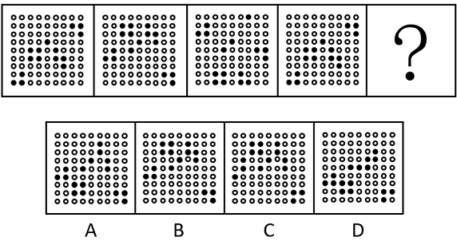
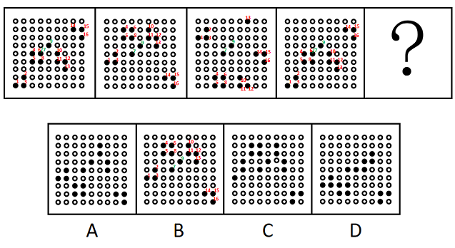
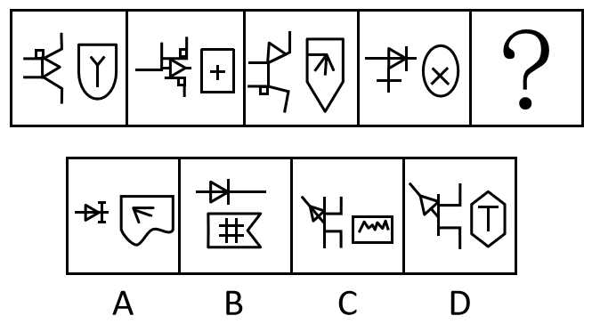
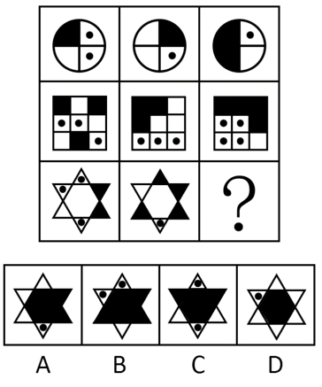
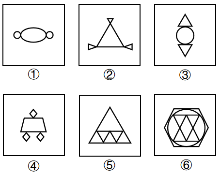
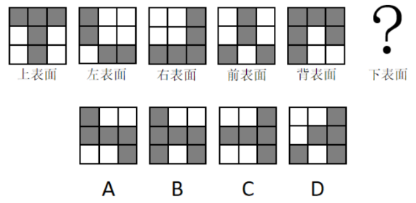
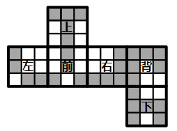

# 2023年山东省公务员录用考试《行测》试题（网友回忆版）

> 判断推理 · 30 题 · 山东 2023

## 第 1 题　qid 5510405 · 图形推理

从所给的四个选项中，选择最合适的一个填入问号处，使之呈现一定的规律性：

- **A**. A
- **B**. B　✅
- **C**. C
- **D**. D

**答案**：B

**官方解析**

元素组成相同，优先考虑位置规律。观察发现，将黑球依次标上序号后可知（如下图所示），第7个和第9个黑球保持不动，其余黑球均依次向上移动三格（循环走），只有B项符合。

故正确答案为B。

---

## 第 2 题　qid 5510402 · 图形推理

下列选项最符合所给图形规律的是：

- **A**. A
- **B**. B
- **C**. C
- **D**. D　✅

**答案**：D

**官方解析**

题干元素组成不同，观察发现，题干图形均为左右两部分，排除B项；左右分开观察发现，题干右侧图形可以分为内外两部分，考虑内外分开看，右侧图形的外框均为对称图形，且内部均只有1个交点，排除A、C两项，只有D项符合。
故正确答案为D。

---

## 第 3 题　qid 5510377 · 图形推理

下列选项最符合所给图形规律的是：

- **A**. A
- **B**. B　✅
- **C**. C
- **D**. D

**答案**：B

**官方解析**

元素组成相似，优先考虑样式规律。题干每行图形的轮廓相同，考虑黑白运算。九宫格优先横向观察，前两行黑白运算的规律为：黑+黑=黑，黑+白=黑，白+黑=黑，白+白=黑，点+黑=点，黑+点=点，点+点=白，点+白=点，白+点=点。第三行应用此规律，只有B项符合。
故正确答案为B。

---

## 第 4 题　qid 5510380 · 图形推理

把下面的六个图形分为两类，使每一类图形都有各自的共同特征或规律，分类正确的一项是：

- **A**. ①②③，④⑤⑥
- **B**. ①②⑤，③④⑥
- **C**. ①③⑤，②④⑥
- **D**. ①③⑥，②④⑤　✅

**答案**：D

**官方解析**

元素组成不同，且题干出现椭圆、三角形等明显的等腰元素，优先考虑对称性。观察发现，图①③⑥均是轴对称+中心对称图形，图②④⑤均只是轴对称图形。即图①③⑥为一组，图②④⑤为一组。
故正确答案为D。

---

## 第 5 题　qid 5510400 · 图形推理

如图所示为某立体图形的表面形状，则该立体图形的下表面是下列选项中的：

- **A**. A
- **B**. B　✅
- **C**. C
- **D**. D

**答案**：B

**官方解析**

把题干中左表面、前表面、右表面、背表面最底层的方块围成一圈即为下表面的外圈。如下图所示，从左表面开始，依次将题干的各个表面排列到六面体展开图中，按照左表面、前表面、右表面、背表面的顺序，可确定下底面的外圈依次为白、黑、黑、白、黑、黑、黑、白，外圈共有5个黑块、3个白块，对应B项。

故正确答案为B。

---

## 第 6 题　qid 5510352 · 定义判断

逃税罪是指纳税人采取欺骗、隐瞒手段进行虚假纳税申报或者不申报，逃避缴纳税款数额较大，并且占应纳税额10%以上的行为。
根据上述定义，下列可能构成逃税罪的是：

- **A**. 某上市公司做假账隐瞒实际收入，三年来少缴税款共计1000万元　✅
- **B**. 某小微企业在税务人员上门收税时，采用暴力方式抗拒征税，打伤税务人员
- **C**. 自由职业者王某为企业提供咨询服务，发现公司法人每年上缴税款比自由职业者要少2万元，于是开了一家咨询公司
- **D**. 某初创的科技企业，因对税收规定、财务会计制度不熟悉，导致少缴税款高达500万元

**答案**：A

**官方解析**

第一步：找出定义关键词。
“纳税人”、“采取欺骗、隐瞒手段进行虚假纳税申报或者不申报”、“逃避缴纳税款数额较大，并且占应纳税额10%以上”。
第二步：逐一分析选项。
A项：某上市公司做假账隐瞒实际收入，符合“纳税人”、“采取欺骗、隐瞒手段进行虚假纳税申报或者不申报”，符合定义，当选；
B项：某小微企业采用暴力方式抗拒征税，不符合“采取欺骗、隐瞒手段进行虚假纳税申报或者不申报”，不符合定义，排除；
C项：王某发现公司法人每年上缴税款比自由职业者要少2万元，未提及公司法人是否存在逃税的行为，不符合“采取欺骗、隐瞒手段进行虚假纳税申报或者不申报”，不符合定义，排除；
D项：某初创的科技企业少缴纳税款的原因是对税收规定、财务会计制度不熟悉，不符合“采取欺骗、隐瞒手段进行虚假纳税申报或者不申报”，不符合定义，排除。
故正确答案为A。

---

## 第 7 题　qid 5510390 · 定义判断

收敛式论证结构是一种常见的多前提论证结构，它是指多个前提相对独立地分别支持结论，也许这些理由独自给结论提供的支持非常有限，但它们的支持力积累起来可以给结论提供强有力的支持。
根据上述定义，下列属于收敛式论证结构的是：

- **A**. 所有理性主义者都不会超前消费，所以有些非超前消费的人是理性主义者
- **B**. 她不是四川人，因为四川人都会说四川话，但她却不会说
- **C**. 正在上小学的小李天资聪颖，能够吃苦，学习兴趣比较浓厚，小李的父亲认为他将来一定可以考上大学　✅
- **D**. 妻子生气地对丈夫说：“你若是能够戒烟，太阳会从西边出来。”显然，太阳不会从西边出来

**答案**：C

**官方解析**

第一步：找出定义关键词。
“多个前提”、“相对独立地分别支持结论”。
第二步：逐一分析选项。
A项：所有理性主义者都不会超前消费，所以有些非超前消费的人是理性主义者。包含“所有理性主义者都不会超前消费”一个前提，不符合“多个前提”，不符合定义，排除；
B项：她不是四川人，因为四川人都会说四川话，但她却不会说。包含“四川人都会说四川话”和“她不会说四川话”两个前提，但需要二者结合才能得到结论，不符合“相对独立地分别支持结论”，不符合定义，排除；
C项：正在上小学的小李天资聪颖，能够吃苦，学习兴趣比较浓厚，小李的父亲认为他将来一定可以考上大学。包含“天资聪颖”“能够吃苦”“学习兴趣比较浓厚”多个前提，且这些前提均可以单独支持结论“他将来一定可以考上大学”，符合“多个前提”“相对独立地分别支持结论”，符合定义，当选；
D项：妻子生气地对丈夫说：“你若是能够戒烟，太阳会从西边出来。”显然，太阳不会从西边出来。这句话的意思是太阳不会从西边出来，所以妻子认为丈夫不能够戒烟。包含“太阳不会从西边出来”一个前提，不符合“多个前提”，不符合定义，排除。
故正确答案为C。

---

## 第 8 题　qid 5510391 · 定义判断

征询型公关是指通过采集信息、舆论调查、民意测验等，掌握信息和舆论，为组织机构的经营管理决策提供公共关系方面的咨询的活动。宣传型公关是指利用各种传播媒介向社会公众介绍自己，以形成有利的社会舆论的公共关系活动。
根据上述定义，下列属于宣传型公关的是：

- **A**. 研究机构公布某公司的市场调查结果引起社会关注
- **B**. 将公司新开发的系列产品通过微信公众号进行推送　✅
- **C**. 收集微信公众号上用户对本公司产品的态度与评价
- **D**. 物业公司通过线上线下问卷向业主征求意见和诉求

**答案**：B

**官方解析**

第一步：找出定义关键词。
征询型公关：“通过采集信息、舆论调查、民意测验等”、“为组织机构的经营管理决策提供公共关系方面的咨询的活动”；
宣传型公关：“利用各种传播媒介向社会公众介绍自己”、“以形成有利的社会舆论的公共关系活动”。
第二步：逐一分析选项。
A项：研究机构公布某公司的市场调查结果来引起社会的关注，其中公布市场调查结果不属于利用传媒来介绍自己，不符合“利用各种传播媒介向社会公众介绍自己”，不符合“宣传型公关”的定义，排除；
B项：该公司将新开发的系列产品利用微信公众号推广，其中微信公众号属于传播媒介，推广新产品也是为了获得有利的社会反响，符合“利用各种传播媒介向社会公众介绍自己”、“以形成有利的社会舆论的公共关系活动”，符合“宣传型公关”的定义，当选；
C项：该公司收集微信公众号上用户的态度和评价，属于利用公众号进行舆论调查并收集信息，符合“通过采集信息、舆论调查、民意测验等”、“为组织机构的经营管理决策提供公共关系方面的咨询的活动”，符合“征询型公关”的定义，没有利用传媒推广、介绍自己，不符合“利用各种传播媒介向社会公众介绍自己”，不符合“宣传型公关”的定义，排除；
D项：物流公司通过问卷来调查业主的意见和诉求，是利用舆论调查并收集信息，符合“通过采集信息、舆论调查、民意测验等”、“为组织机构的经营管理决策提供公共关系方面的咨询的活动”，符合“征询型公关”的定义，没有利用传媒推广、介绍自己，不符合“利用各种传播媒介向社会公众介绍自己”，不符合“宣传型公关”的定义，排除。
故正确答案为B。

---

## 第 9 题　qid 5510356 · 逻辑判断

灰色市场是指未经商标拥有者授权而销售该品牌商品的市场。灰色市场的商品是有品牌的真品只不过其销售的渠道未经该商标拥有者授权与同意，是一种“非正式渠道”。
下列涉及灰色市场的是：

- **A**. 某品牌手机只许在甲国销售，乙国销售商从甲国大量购买回乙国销售　✅
- **B**. 某厂商用优质的材料制造高品质的皮箱，再利用国外奢侈品营销商标进行销售
- **C**. 某公司获得国外某品牌授权，制造销售旗下的商品利润大幅度增加
- **D**. 某品牌电脑在春节开展促销活动，代理商在全国各地低价销售

**答案**：A

**官方解析**

第一步：找出定义关键词。
“有品牌的真品”、“销售的渠道未经该商标拥有者授权与同意”。
第二步：逐一分析选项。
A项：某品牌手机只许在甲国销售，说明乙国的销售渠道未经授权，符合“销售的渠道未经该商标拥有者授权与同意”，乙国销售商从甲国大量购买该品牌手机并销售，说明乙国销售的手机是真品，符合“有品牌的真品”，符合定义，当选；
B项：某厂商用优质的材料制造高品质的皮箱，再利用国外奢侈品营销商标进行销售，说明该厂商制造的皮箱实际上并不具有国外奢侈品商标，不符合“有品牌的真品”，不符合定义，排除；
C项：某公司获得国外某品牌授权，制造销售旗下的商品，不符合“销售的渠道未经该商标拥有者授权与同意”，不符合定义，排除；
D项：某品牌电脑在春节开展促销活动，代理商在全国各地低价销售，“代理商”是指经过授权后买卖相关产品的商家，不符合“销售的渠道未经该商标拥有者授权与同意”，不符合定义，排除。
故正确答案为A。

---

## 第 10 题　qid 5510365 · 定义判断

利润损失保险，亦称为“营业中断保险”，是指被保险人因保险标的遭受灾害或营业中断期间的间接损失，由保险人员赔偿责任的保险。
下列不属于利润损失保险理赔范围的是：

- **A**. 某工厂机器因遭受火灾被焚毁，导致无法正常工作
- **B**. 某商店遭受水灾暂停营业而引起预期利润损失，以及待支付的工资、房租、水电等合理且必须的支出损失
- **C**. 某上市公司因股灾造成股价大跌，订单减少50%　✅
- **D**. 某渔场因台风来袭，造成所养殖鱼苗大量死亡，错过最佳养鱼期三个月

**答案**：C

**官方解析**

第一步：找出定义关键词。
“被保险人”、“因保险标的遭受灾害或营业中断期间的间接损失”、“由保险人员赔偿责任的保险”。
第二步：逐一分析选项。
A项：某工厂机器因遭受火灾被焚毁，导致无法正常工作，工厂主符合“被保险人”，机器遭受火灾被焚毁，导致无法工作，符合“因保险标的遭受灾害或营业中断期间的间接损失”，符合定义，排除；
B项：某商店因遭受水灾暂停营业而引起预期利润的损失以及必须的支出损失，商店主符合“被保险人”，商店因遭受水灾暂停营业引起的损失，符合“因保险标的遭受灾害或营业中断期间的间接损失”，符合定义，排除；
C项：某上市公司因股灾造成股价大跌，订单减少50%，股灾造成订单减少，不符合“因保险标的遭受灾害或营业中断期间的间接损失”，不符合定义，当选；
D项：某渔场因台风来袭，造成所养殖鱼苗大量死亡，渔场主符合“被保险人”，渔场遭遇台风导致鱼苗大量死亡，符合“因保险标的遭受灾害或营业中断期间的间接损失”，符合定义，排除。
本题为选非题，故正确答案为C。

---

## 第 11 题　qid 5510360 · 类比推理

安营：扎寨

- **A**. 沽名：钓誉　✅
- **B**. 亭台：楼阁
- **C**. 说学：逗唱
- **D**. 白云：苍狗

**答案**：A

**官方解析**

第一步：判断题干词语间逻辑关系。
“安营”指搭起帐篷，“扎寨”指修起栅栏，两者为并列关系，且“安营”和“扎寨”均为动宾结构。
第二步：判断选项词语间逻辑关系。
A项：“沽名”指谋取名声，“钓誉”指获取声誉，两者为并列关系，且“沽名”和“钓誉”均为动宾结构，与题干逻辑关系一致，当选；
B项：“亭”“台”“楼”“阁”为四种建筑，四者为并列关系，与题干逻辑关系不一致，排除；
C项：“说”“学”“逗”“唱”为相声的四种基本功，四者为并列关系，与题干逻辑关系不一致，排除；
D项：白云苍狗同白衣苍狗，出自杜甫《可叹》诗：“天上浮云似白衣，斯须改变如苍狗”，用以比喻世事变幻无常，故该选项中“白云”即“白衣”，指白云像白色的衣服，“苍狗”指白云像灰白色的狗，两者均是对白云形态的比喻，为并列关系，但“白云”和“苍狗”均为偏正结构，与题干逻辑关系不一致，排除。
故正确答案为A。

---

## 第 12 题　qid 5510379 · 类比推理

公共区域：市民广场

- **A**. 航空母舰：微山湖舰
- **B**. 红色地标：北大红楼　✅
- **C**. 一带一路：丝绸之路
- **D**. 报刊杂志：头版头条

**答案**：B

**官方解析**

第一步：判断题干词语间逻辑关系。
市民广场是公共区域，二者为包容关系中的种属关系。
第二步：判断选项词语间逻辑关系。
A项：微山湖舰指的是微山湖号综合补给舰，微山湖舰不是航空母舰，二者不是种属关系，与题干逻辑关系不一致，排除；
B项：北大红楼因其主体由红砖砌成而得名，是一座具有革命传统的近代建筑，北大红楼是红色地标，二者为包容关系中的种属关系，与题干逻辑关系一致，当选；
C项：一带一路是“丝绸之路经济带”和“21世纪海上丝绸之路”的简称，与丝绸之路不是种属关系，与题干逻辑关系不一致，排除；
D项：头版头条是报刊杂志的组成部分，二者为包容关系中的组成关系，与题干逻辑关系不一致，排除。
故正确答案为B。

---

## 第 13 题　qid 5510387 · 类比推理

分数：考试

- **A**. 通话：手机
- **B**. 宠物：主人
- **C**. 瑜伽：健身
- **D**. 工资：工作　✅

**答案**：D

**官方解析**

第一步：判断题干词语间逻辑关系。
考试后会有分数，二者为对应关系。
第二步：判断选项词语间逻辑关系。
A项：通话是手机的功能，二者为功能的对应关系，与题干逻辑关系不一致，排除；
B项：主人与宠物是饲养与被饲养的关系，与题干逻辑关系不一致，排除；
C项：通过瑜伽运动可以达到健身的目的，二者为方式目的的对应关系，与题干逻辑关系不一致，排除；
D项：工作后会有工资，二者为对应关系，与题干逻辑关系一致，当选。
故正确答案为D。

---

## 第 14 题　qid 5510381 · 类比推理

唯物主义：唯心主义

- **A**. 黑色金属：有色金属　✅
- **B**. 共产党员：共青团员
- **C**. 黄色人种：白色人种
- **D**. 工人阶级：农民阶级

**答案**：A

**官方解析**

第一步：判断题干词语间逻辑关系。
唯物主义与唯心主义是两种不同的世界观，二者为并列关系，且为并列关系中的矛盾关系。
第二步：判断选项词语间逻辑关系。
A项：黑色金属和有色金属是两类不同的金属，二者为并列关系，且金属从颜色和性质特征区分时，只分为黑色金属和有色金属，二者为并列关系中的矛盾关系，与题干逻辑关系一致，当选；
B项：共产党员和共青团员是两种不同的政治面貌，但二者可以在部分人身上共存，有的共产党员是共青团员，有的共产党员不是共青团员，有的共青团员是共产党员，有的共青团员不是共产党员，故二者为交叉关系，与题干逻辑关系不一致，排除；
C项：黄色人种和白色人种是两种不同的人种，二者是并列关系，但除了黄色人种和白色人种之外，还有黑色人种和棕色人种，故二者为并列关系中的反对关系，与题干逻辑关系不一致，排除；
D项：工人阶级和农民阶级是两种不同的阶级，二者是并列关系，但除了工人阶级和农民阶级之外，还有城市小资产阶级以及民族资产阶级等，故二者为并列关系中的反对关系，与题干逻辑关系不一致，排除。
故正确答案为A。

---

## 第 15 题　qid 5510383 · 类比推理

急于求成：从长计议

- **A**. 跃然纸上：栩栩如生
- **B**. 差强人意：心满意足
- **C**. 一筹莫展：稳操胜券　✅
- **D**. 茅塞顿开：豁然开朗

**答案**：C

**官方解析**

第一步：判断题干词语间逻辑关系。
“急于求成”形容急切地想取得成功或达到目的；“从长计议”形容放宽时限充分商量考虑，不急于作决定，二者为反义关系。
第二步：判断选项词语间逻辑关系。
A项：“跃然纸上”形容描写、刻画得非常逼真、生动；“栩栩如生”形容艺术形象生动逼真，像活的一样，二者为近义关系，与题干逻辑关系不一致，排除；
B项：“差强人意”指大体上还能让人满意；“心满意足”指做了某事或得到什么事物等，自己心情很愉悦高兴，让自己觉得满意，二者并非反义关系，与题干逻辑关系不一致，排除；
C项：“一筹莫展”指一点办法也没有；“稳操胜券”比喻有充分的把握取得胜利，二者为反义关系，与题干逻辑关系一致，当选；
D项：“茅塞顿开”比喻原本闭塞的思路，因为受到启发，立刻理解、明白；“豁然开朗”形容一下子领悟明白了某种道理，二者为近义关系，与题干逻辑关系不一致，排除。
故正确答案为C。

---

## 第 16 题　qid 5510382 · 类比推理

现金：购物：消费

- **A**. 课件：授课：教育　✅
- **B**. 肥料：施肥：水稻
- **C**. 电脑：上网：休闲
- **D**. 布料：剪裁：缝纫

**答案**：A

**官方解析**

第一步：判断题干词语间逻辑关系。
现金可以用来购物，二者为功能对应关系；购物是一种消费方式，二者为种属关系。
第二步：判断选项词语间逻辑关系。
A项：课件可以用来授课，二者为功能对应关系；授课是一种教育方式，二者为种属关系，与题干逻辑关系一致，当选；
B项：肥料是能供给养分使植物生长的物质，施肥不是肥料的功能，二者不是功能对应关系，与题干逻辑关系不一致，排除；
C项：电脑可以用来上网，二者为功能对应关系；但有的上网是休闲方式，有的上网不是休闲方式，比如为了工作上网；反之，有的休闲方式是上网，有的休闲方式不是上网，二者为交叉关系，与题干逻辑关系不一致，排除；
D项：剪裁布料，二者为动宾关系，与题干逻辑关系不一致，排除。
故正确答案为A。

---

## 第 17 题　qid 5510401 · 类比推理

文学：古代文学：古代小说

- **A**. 花：花苞：花蕊
- **B**. 科学：基础科学：数学　✅
- **C**. 地球：亚洲：中国
- **D**. 全日制大学生：大学生：学生

**答案**：B

**官方解析**

第一步：判断题干词语间逻辑关系。
古代文学是文学，二者为种属关系；古代小说是古代文学，二者为种属关系。
第二步：判断选项词语间逻辑关系。
A项：花苞是花的组成部分，二者为组成关系；花蕊是花的组成部分，二者为组成关系，与题干逻辑关系不一致，排除；
B项：基础科学是以自然现象和物质运动形式为研究对象，探索自然界发展规律的科学，其包括数学、物理学、化学、生物学、天文学、地球科学、逻辑学七门基础学科及其分支学科、边缘学科。所以基础科学是科学的一种，二者为种属关系；数学是基础科学的一种，二者为种属关系，与题干逻辑关系一致，当选；
C项：亚洲是地球的组成部分，二者为组成关系；中国是亚洲的组成部分，二者为组成关系，与题干逻辑关系不一致，排除；
D项：全日制大学生是大学生，二者为种属关系；大学生是学生，二者为种属关系，但是词语顺序与题干相反，与题干逻辑关系不一致，排除。
故正确答案为B。

---

## 第 18 题　qid 5510392 · 类比推理

沙发：板凳：马扎

- **A**. 书桌：饭桌：桌子
- **B**. 台灯：油灯：电灯
- **C**. 马车：飞机：摩托　✅
- **D**. 喷泉：淋浴：水井

**答案**：C

**官方解析**

第一步：判断题干词语间逻辑关系。
沙发、板凳和马扎都是能供人坐着休息的坐具，属于功能相同的并列关系。
第二步：判断选项词语间逻辑关系。
A项：书桌和饭桌是两种不同的桌子，二者为并列关系，但是二者都与桌子构成种属关系，与题干逻辑关系不一致，排除；
B项：电灯和油灯是两种不同的灯具，二者为并列关系，但是台灯是电灯的一种，二者是种属关系，与题干逻辑关系不一致，排除；
C项：马车、飞机和摩托是三种不同的运输工具，属于功能相同的并列关系，与题干逻辑关系一致，当选；
D项：喷泉是用来湿润空气、减尘降温的设施，淋浴是指洗澡时用喷头将水淋喷到身上的一种洗浴方式，水井是用于开采地下水的设施，三者功能不同，没有明显的逻辑关系，与题干逻辑关系不一致，排除。
故正确答案为C。

---

## 第 19 题　qid 5510393 · 类比推理

琵琶 对于 （    ） 相当于 （    ） 对于 体操项目

- **A**. 民族乐器；竞技体育
- **B**. 长笛；艺术体操
- **C**. 演奏乐器；跳高
- **D**. 弦乐器；高低杠　✅

**答案**：D

**官方解析**

逐一代入选项。
A项：琵琶是一种民族乐器，二者是种属关系；有的体操项目是竞技体育，有的体操项目不是竞技体育，有的竞技体育是体操项目，有的竞技体育不是体操项目，二者是交叉关系，前后逻辑关系不一致，排除；
B项：琵琶和长笛是两种不同的乐器，二者是并列关系；艺术体操是一种体操项目，二者是种属关系，前后逻辑关系不一致，排除；
C项：琵琶是一种演奏乐器，二者是种属关系；跳高是一种田径项目，与体操项目不是种属关系，前后逻辑关系不一致，排除；
D项：琵琶是一种弦乐器，二者是种属关系；高低杠是一种体操项目，二者是种属关系，前后逻辑关系一致，当选。
故正确答案为D。

---

## 第 20 题　qid 5510376 · 逻辑判断

不知自量 对于 （    ） 相对于 （    ） 对于 坚韧

- **A**. 自恋；不堪一击
- **B**. 自强；千回百转
- **C**. 自大；百折不挠　✅
- **D**. 自夸；锲而不舍

**答案**：C

**官方解析**

逐一代入选项。
A项：“不知自量”意思是没有正确估计自己的能力有多大，与“自恋”无明显逻辑关系，“不堪一击”形容力量薄弱，经不起一击，也形容论点不严密，经不起反驳，与“坚韧”是反义关系，前后逻辑关系不一致，排除；
B项：“不知自量”意思是没有正确估计自己的能力有多大，与“自强”无明显逻辑关系，“千回百转”形容反复回旋或进程曲折，与“坚韧”无明显逻辑关系，前后逻辑关系不一致，排除；
C项：“不知自量”意思是没有正确估计自己的能力有多大，和“自大”是近义关系，“百折不挠”意思是无论受到多少打击也不退缩，形容意志顽强，和“坚韧”是近义关系，前后逻辑关系一致，当选；
D项：“不知自量”意思是没有正确估计自己的能力有多大，与“自夸”不构成近义关系，“锲而不舍”意思是雕刻一件东西，一直刻下去不放手，比喻有恒心有毅力，和“坚韧”是近义关系，前后逻辑关系不一致，排除。
故正确答案为C。

---

## 第 21 题　qid 5510371 · 逻辑判断

卡塔尔世界杯期间，有球迷对比赛结果进行了下述预测：
甲：冠军是欧洲国家
乙：法国是冠军
丙：冠军是南美洲国家
丁：阿根廷不会进四强
假设上述预测中只有一句为假，可以得出以下哪项？

- **A**. 甲说了假话
- **B**. 冠军不是法国
- **C**. 冠军不是南美国家　✅
- **D**. 阿根廷会进四强

**答案**：C

**官方解析**

第一步：找关系。
甲：冠军是欧洲国家；
乙：冠军是法国；
丙：冠军是南美洲国家；
丁：阿根廷不会进四强。
甲和丙不可能同时为真，根据题干上述预测中只有一句话为假，可以推出甲和丙必有一假。
第二步：看其余。
根据甲和丙必有一假，可以推出其余的乙和丁必然为真，即冠军是法国，阿根廷不会进四强，因此甲为真，丙为假，即冠军不是南美国家，对应C项。
故正确答案为C。

---

## 第 22 题　qid 5510389 · 逻辑判断

有如下两句话，“我从来没有对她说过谎”，“我曾多次对她说谎”，下列选项中与这两句话真假情况相同的是：

- **A**. “有的同学上课很认真”，“有的同学上课不认真”
- **B**. “所有工作人员都到达了现场”，“有的工作人员没有到达现场”
- **C**. “该科室所有人都放假了”，“该科室所有人都没有放假”　✅
- **D**. “他从未成功过”，“他将来会成功”

**答案**：C

**官方解析**

第一步，分析题干。

“我从来没有对她说过谎”可以理解为“说谎话的次数=0”；“我曾多次对她说谎”可以理解为“说谎话的次数次”，当说谎话的次数为1时，则二者同时为假，故题干第一句话和第二句话互为反对关系，必有一假，可以同假。

第二步：逐一分析选项。

A项：“有的同学上课很认真”和“有的同学上课不认真”，因为“有的A是B”和“有的A不是B”是反对关系，必有一真，可以同真，故选项两句话和题干真假情况不同，排除；

B项：“所有工作人员都到达了现场”和“有的工作人员没有到达现场”，因为“所有A是B”和“有的A不是B”互为矛盾关系，必有一真一假，故选项两句话和题干真假情况不同，排除；

C项：“该科室所有人都放假了”和“该科室所有人都没有放假”，因为“所有A是B”和“所有A不是B”为反对关系，必有一假，可以同假，故选项两句话和题干真假情况相同，当选；

D项：“他从未成功过”表述的是以前是否成功，“他将来会成功”表述的是未来是否成功，二者不是反对关系，不能判断二者的真假情况，故选项两句话和题干真假情况不同，排除。

故正确答案为C。

---

## 第 23 题　qid 5510386 · 逻辑判断

所有法学专业的学生，都获得了法律职业资格证书；所有获得法律职业资格证书的学生，都获得了教师资格证书；有些法学专业的学生成为了公务员；有些逻辑学专业的学生也成为了公务员；所有逻辑学专业的学生都未获得教师资格证。
如果以上判定为真，以下哪种说法一定为假？

- **A**. 一个人获得了教师资格证书，但并非是逻辑学专业的学生
- **B**. 一个公务员，既没有获得法律职业资格证书，又不是逻辑学专业的学生
- **C**. 一个人获得了法律职业资格证书，但并非是法学专业的学生
- **D**. 一个人是逻辑学专业的学生，并且获得了法律职业资格证书　✅

**答案**：D

**官方解析**

第一步：翻译题干。

①法学专业学生法律职业资格证书；

②法律职业资格证书教师资格证书；

③有的法学专业学生公务员；

④有的逻辑学专业学生公务员；

⑤逻辑学专业学生教师资格证书；

①②⑤串联可得⑥：逻辑学专业学生教师资格证书法律职业资格证书法学专业学生。

第二步：逐一分析选项。

A项：获得了教师资格证是对⑤的否后，否后必否前，那么他不是逻辑学专业的学生，故该项表述为真，排除；

B项：将条件④等价换位为“有的公务员逻辑学专业学生”，与条件⑥进行串联，“有的公务员逻辑学专业学生教师资格证书法律职业资格证书，即有的公务员没有获得法律职业资格证书，有的公务员是逻辑学专业，由于“有的是”和“有的不是”不能互相推出，故“有的公务员不是逻辑学专业”这句话有可能为真，故该项表述不一定为假，排除；

C项：获得了法律职业资格证书是对①的肯后，肯后无必然结论，故有可能不是法学专业的学生，该项表述有可能为真，排除；

D项：逻辑学专业学生是对⑥的肯前，肯前必肯后，故逻辑学专业学生一定没有获得法律职业资格证书，该项表述一定为假，当选。

本题为选非题，故正确答案为D。

---

## 第 24 题　qid 5510388 · 逻辑判断

一项针对某高校学生的调查显示：90%考试不及格的同学喜欢打游戏。有人据此认为，打游戏更容易导致学生考试不及格。
以下哪项如果为真，最能削弱上述结论？

- **A**. 不打游戏的学生只占全体学生的一成　✅
- **B**. 有研究表明，打游戏会促进智力发展
- **C**. 小张不喜欢打游戏，但经常考试不及格
- **D**. 题目难度大，也是考试不及格的一个原因

**答案**：A

**官方解析**

第一步：找出论点和论据。
论点：打游戏更容易导致学生考试不及格。
论据：90%考试不及格的同学喜欢打游戏。
本题的论点论据讨论的均为打游戏与考试不及格的问题，论点论据话题一致，削弱优先考虑否论点。
第二步：逐一分析选项。
A项：该项说的是不打游戏的学生只占全体学生的一成，说明不打游戏的学生非常少，则不能说明学生考试不及格的原因是打游戏，削弱了题干中论点中的因果关系，可以削弱，当选；
B项：该项说的是打游戏能够促进智力发展，也就是打游戏的好处，而论点讨论的是考试不及格的原因是否是打游戏，与题干讨论话题不一致，无法削弱，排除；
C项：该项说的是小张不喜欢打游戏，但是经常考试不及格。而论点讨论的是打游戏后是否会导致不及格，与题干讨论话题不一致，无法削弱，排除；
D项：该项说的是题目难度大也是考试不及格的原因，但喜欢打游戏和不喜欢打游戏的学生都是参加该高校的考试，也就是说题目难度是一样的，不影响论点讨论的打游戏后是否会更容易不及格，无法削弱，排除。
故正确答案为A。

---

## 第 25 题　qid 5510385 · 逻辑判断

科学研究显示，一个人在一天早些或晚些时候吃最丰盛的一餐并不影响身体代谢热量的方式。但在早上吃最丰盛一餐的人在晚些时候会感觉不那么饿，这可能会让他们在现实世界中更容易实现减肥。
以下哪项是上述论证的必要前提？

- **A**. 大量摄入丰盛的早餐，可以通过更大程度的抑制食欲来帮助遵守减肥方案　✅
- **B**. 某些代谢测量只能在早餐后进行，而不能在晚餐后进行
- **C**. 饮食时间能促进人类减肥的潜在机制还不清楚
- **D**. 昼夜节律被打乱者可能会有不同的代谢反应

**答案**：A

**官方解析**

第一步：找出论点和论据。
论点：在早上吃最丰盛一餐的人在晚些时候会感觉不那么饿，这可能会让他们在现实世界中更容易实现减肥。
论据：无。
本题只有论点没有论据，且提问方式为必要前提，加强优先考虑必要条件。
第二步：逐一分析选项。
A项：该项指出大量摄入丰盛的早餐可以通过更大程度的抑制食欲来帮助遵守减肥方案，如果大量摄入丰盛的早餐对遵守减肥方案没有帮助，也就表明其无法让人更容易实现减肥，即该项不成立时论点也不成立，为论点成立的必要条件，可以加强，当选；
B项：该项指出某些代谢测量只能在早餐后进行，而不能在晚餐后进行，说明无法准确测量晚餐后的代谢情况，也就无法准确得到早上吃最丰盛一餐和晚上吃最丰盛一餐谁更容易实现减肥，有削弱论点的效果，无法加强，排除；
C项：该项指出饮食时间能促进人类减肥的潜在机制还不清楚，说明不明确早上吃最丰盛一餐是否更容易实现减肥，为不明确项，无法加强，排除；
D项：该项指出昼夜节律被打乱者可能会有不同的代谢反应，与论点讨论的早上吃最丰盛一餐更容易实现减肥无关，为无关项，无法加强，排除。
故正确答案为A。

---

## 第 26 题　qid 5510384 · 逻辑判断

“志当存高远”，远大的理想目标不仅能够帮助人生走向巅峰，还能让人更长寿，近日，一项新研究发现生活目标越高的人，死亡风险越低。
以下哪项如果为真，最能削弱上述结论？

- **A**. 拥有充足的物质财富，才能享受好的医疗条件
- **B**. 有研究表明，富人体内DHEA-S激素水平高于中低收入人群，这种激素有助于降低患心血管疾病的风险
- **C**. 有些人的远大理想根本不切实际，很容易引起失败，导致心情沮丧，郁郁寡欢　✅
- **D**. 合理的目标规划更容易实现，可以使人更加自信

**答案**：C

**官方解析**

第一步：找出论点和论据。
论点：远大的理想目标不仅能够帮助人生走向巅峰，还能让人更长寿。
论据：生活目标越高的人，死亡风险越低。
论据讨论的是生活目标越高的人，死亡风险越低，论点说的是远大的理想目标不仅能够帮助人生走向巅峰，还能让人更长寿，论据和论点都是在讨论远大的理想目标和寿命的关系，二者话题一致，削弱优先考虑削弱论点，即远大的理想目标不会让人更长寿。
第二步：逐一分析选项。
A项：论点讨论的是远大的理想目标和长寿之间的关系，该项讨论的是物质财富和医疗条件之间的关系，话题不一致，无法削弱，排除；
B项：论点讨论的是远大的理想目标和长寿之间的关系，该项说的是富人体内DHEA-S激素水平高可以降低患心血管疾病的风险，并未提及富人是否有远大的理想目标，话题不一致，无法削弱，排除；
C项：该项说的是有些人的远大理想根本不切实际，很容易引起失败，导致心情沮丧，郁郁寡欢，说明远大理想失败可能会影响心理健康，而郁郁寡欢不利于人的长寿，举反例削弱论点，可以削弱，当选；
D项：论点讨论的是远大的理想目标和长寿之间的关系，该项说的是合理的目标容易实现，会让人自信，但自信和死亡风险没有直接关系，话题不一致，无法削弱，排除。
故正确答案为C。

---

## 第 27 题　qid 5510403 · 逻辑判断

游隼会掠食黑腹滨鹂，黑腹滨鹂能持续飞行数小时。20世纪70年代，由于杀虫剂的使用游隼的数量减少，黑腹滨鹂持续飞行的时间变少，休憩时间更多；到了90年代，杀虫剂因监管而减少，游隼又回来了，黑腹滨鹂的飞行行为恢复如前。因此，有动物学家认为是对天敌的恐惧改变了黑腹滨鹂的飞行行为。
以下哪项如果为真，最能反驳动物学家的观点？

- **A**. 游隼的数量变化跟杀虫剂的使用没有关系
- **B**. 滥用杀虫剂会严重影响黑腹滨鹂的食物链
- **C**. 游隼并不是黑腹滨鹂唯一的天敌
- **D**. 杀虫剂会对黑腹滨鹂的身体机能造成伤害　✅

**答案**：D

**官方解析**

第一步：找出论点和论据。
论点：对天敌的恐惧改变了黑腹滨鹂的飞行行为。
论据：游隼会掠食黑腹滨鹂，黑腹滨鹂能持续飞行数小时。20世纪70年代，由于杀虫剂的使用游隼的数量减少，黑腹滨鹂持续飞行的时间变少，休憩时间更多；到了90年代，杀虫剂因监管而减少，游隼又回来了，黑腹滨鹂的飞行行为恢复如前。
本题论点和论据讨论的都是游隼与黑腹滨鹂飞行行为之间的关系，论点论据话题一致，削弱优先考虑削弱论点，且论点存在因果关系，削弱还可以考虑他因削弱或因果倒置。
第二步：逐一分析选项。
A项：该项讨论的是游隼的数量变化与杀虫剂的使用无关，而论点讨论的是黑腹滨鹂的飞行行为改变的原因，话题不一致，无法削弱，排除；
B项：该项讨论的是杀虫剂会影响黑腹滨鹂的食物链，而论点讨论的是黑腹滨鹂的飞行行为改变的原因，话题不一致，无法削弱，排除；
C项：该项讨论的是黑腹滨鹂的天敌并不唯一，但并未说明是否是其天敌影响了其飞行行为，无法削弱，排除；
D项：该项指出杀虫剂会对黑腹滨鹂的身体机能造成伤害，身体机能受到伤害有可能会影响其飞行行为，说明除了天敌的影响，还有其他原因可能会改变黑腹滨鹂的飞行行为，他因削弱，可以削弱，当选。
故正确答案为D。

---

## 第 28 题　qid 5510374 · 逻辑判断

为了测试婴儿如何对运动做出反应，研究小组对21名婴儿进行了监测，母亲们尝试了四种让婴儿安静下来的方法，“抱着婴儿走动”“将婴儿放在婴儿车或者摇床上来回摇动”“坐着抱住婴儿”“让婴儿躺在床上”。使用第三种和第四种方法时，哭闹的婴儿并没有平静下来；使用第一种方法时婴儿们都停止了哭泣，其中近一半在五分钟内入睡；第二种方法有与第一种方法类似的镇静效果，但程度较小。因此，科学家得出结论，抚慰婴儿的最佳方法是让其处于轻微的运动节奏中。
以下哪项如果为真，最能削弱上述结论?

- **A**. 四种方法的试验分别选在了不同的时间和地点　✅
- **B**. 如果让父亲抱着婴儿走动也能使婴儿安静下来
- **C**. 一些哺乳动物的母亲携带幼崽走动时，能使幼崽保持安静
- **D**. 摇动婴儿车或摇床会产生与行走类似的运动节奏

**答案**：A

**官方解析**

第一步：找出论点和论据。
论点：抚慰婴儿的最佳方法是让其处于轻微的运动节奏中。
论据：研究小组对21名婴儿进行了监测，母亲们尝试了四种让婴儿安静下来的方法，“抱着婴儿走动”“将婴儿放在婴儿车或者摇床上来回摇动”“坐着抱住婴儿”“让婴儿躺在床上”。使用第三种和第四种方法时，哭闹的婴儿并没有平静下来；使用第一种方法时婴儿们都停止了哭泣，其中近一半在五分钟内入睡；第二种方法有与第一种方法类似的镇静效果，但程度较小。
本题论点和论据讨论的都是抚慰婴儿和运动节奏之间的关系，论点和论据话题一致，削弱优先考虑削弱论点，即让婴儿处于轻微的运动节奏中不是最佳抚慰方式，也可以考虑削弱论据，即实验不科学。
第二步：逐一分析选项。
A项：该项指出四种方法的试验分别选在了不同的时间和地点，说明实验不科学，有别的因素影响实验结果，削弱论据，可以削弱，当选；
B项：该项指出父亲抱着婴儿走动也能使婴儿安静下来，证明婴儿安静下来和母亲无关，排除其他因素干扰，说明实验更加科学，为加强项，无法削弱，排除；
C项：该项指出一些哺乳动物的母亲携带幼崽走动时，能使幼崽保持安静，主体是一些哺乳动物，人是否在该项指出的这些哺乳动物中不明确，为不明确项，无法削弱，排除；
D项：该项指出摇动婴儿车或摇床会产生与行走类似的运动节奏，解释说明了为什么第二种方法有与第一种方法类似的镇静效果，但程度较小，为加强项，无法削弱，排除。
故正确答案为A。

---

## 第 29 题　qid 5510394 · 逻辑判断

校园欺凌是当今社会高度关注的现象。为了防止校园欺凌，有人建议在校园内显著位置张贴公布校园欺凌的求助电话，学生遭遇欺凌后，可以拨打求助电话，获得老师帮助。
以下哪项如果为真，最能削弱上述建议实施效果?

- **A**. 很多教师面对实施欺凌的学生，缺乏有效教育训诫手段
- **B**. 校园欺凌多发生在夜间，求助电话无人接听　✅
- **C**. 欺凌者会恐吓被欺凌者，不要试图向教师或家长求助
- **D**. 部分受害者认为“告状”可耻，不愿寻求成人的帮助

**答案**：B

**官方解析**

第一步：找出论点和论据。
论点：在校园内显著位置张贴公布校园欺凌的求助电话，学生遭遇欺凌后，可以拨打求助电话，获得老师帮助，从而防止校园欺凌。
论据：无。
本题只有论点，没有论据，优先考虑削弱论点，即在校园内显著位置张贴公布求助电话不能防止校园欺凌。
第二步：逐一分析选项。
A项：该项说的是教师面对实施欺凌的学生，缺乏有效教育训诫手段，与在校园内显著位置张贴公布求助电话能否防止校园欺凌无关，为无关项，无法削弱，排除；
B项：该项说的是校园欺凌多发生在夜间，求助电话无人接听，说明在校园内显著位置张贴公布求助电话不能防止校园欺凌，削弱论点，当选；
C项：该项说的是欺凌者会恐吓被欺凌者，不要试图向教师或家长求助，但被欺凌者是否会拨打求助电话向老师求助不明确，为不明确项，无法削弱，排除；
D项：该项说的是部分受害者不愿寻求成人的帮助，说明有受害者愿意寻求成人的帮助，那么张贴求助电话这一建议是有效的，可以帮助受害者获得老师帮助，从而防止校园欺凌，为加强项，无法削弱，排除。
故正确答案为B。

---

## 第 30 题　qid 5510395 · 逻辑判断

老王在小区公共绿地上自行种植了葱和韭菜，不久后，物业在小区内张贴通知，告知业主在十日内自行处理公共绿地内种植的农作物，否则将集中清理。十日后，物业将老王种植的葱和韭菜清除。老王认为，公共绿地归业主所有，其作为业主有一定的使用权。
以下哪项如果为真，最能削弱老王的观点?

- **A**. 小区内的公共绿地归业主所有，老王应该与其他业主共享其种菜所得
- **B**. 小区内的公共绿地归业主所有，老王在公共绿地上种菜应该提前告知其他业主
- **C**. 改变小区公共绿地的用途应由业主共同决定，老王私自种菜并未经过其他业主表决同意　✅
- **D**. 改变小区公共绿地的用途应由业主共同决定，只要其他业主同意，老王就可以在公共绿地上种菜

**答案**：C

**官方解析**

第一步：找出论点和论据。
论点：公共绿地归业主所有，老王作为业主有一定的使用权，可以在小区公共绿地上自行种植葱和韭菜。
论据：无。
本题论点说的是“业主对公共绿地有一定的使用权”和“可以在小区公共绿地上自行种植葱和韭菜”之间的关系，没有论据，削弱优先考虑削弱论点。
第二步：逐一分析选项。
A项：该项说的是小区内的公共绿地归业主所有，老王应该与其他业主共享其种菜所得，但论点讨论的是“业主对公共绿地有一定的使用权”和“可以在小区公共绿地上自行种植葱和韭菜”之间的关系，话题不一致，无法削弱，排除；
B项：该项说的是小区内的公共绿地归业主所有，老王在公共绿地上种菜应该提前告知其他业主，但是并不知道老王是否有提前告知其他业主，不明确项，无法削弱，排除；
C项：该项说的是改变小区公共绿地的用途应由业主共同决定，老王私自种菜并未经过其他业主表决同意，说明虽然老王对公共绿地有一定的使用权，但是现在没有经过其他业主同意，就不可以在小区公共绿地上自行种植葱和韭菜，直接削弱论点，当选；
D项：该项说的是改变小区公共绿地的用途应由业主共同决定，只要其他业主同意，老王就可以在公共绿地上种菜，但是并不知道其他业主是否同意，不明确项，无法削弱，排除。
故正确答案为C。

---
