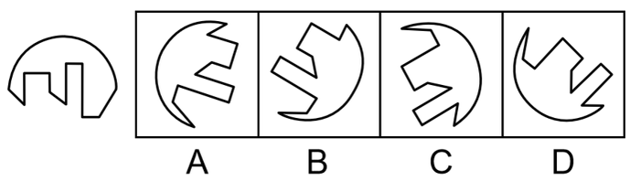
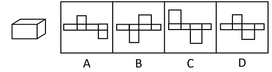
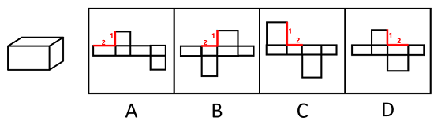
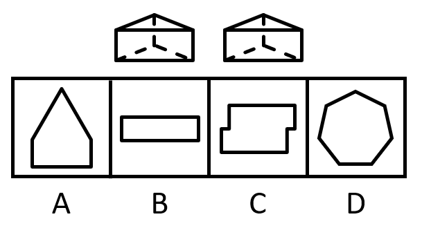
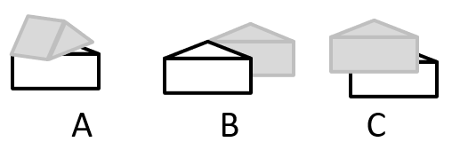
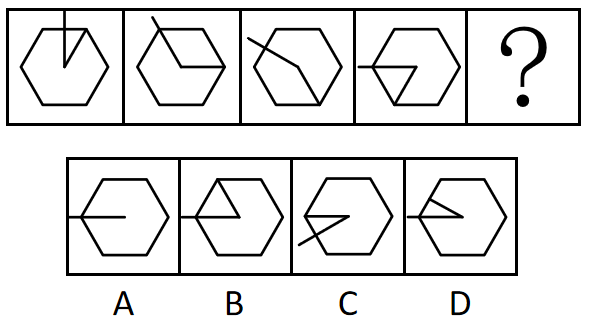
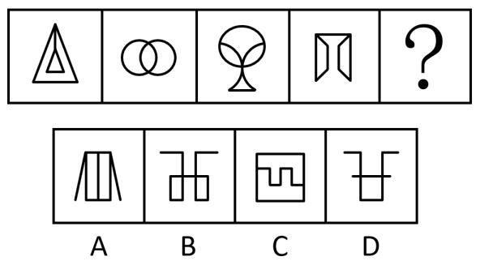
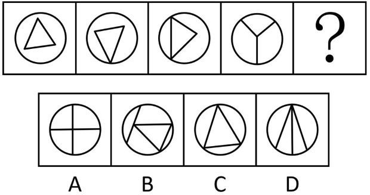
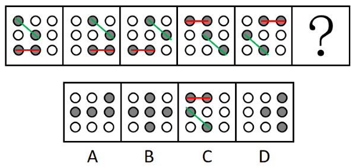
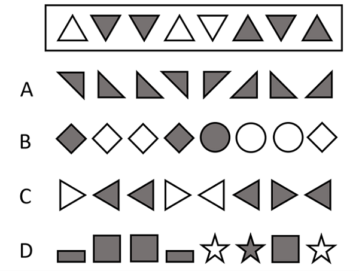

# 2023年广东省公务员录用考试《行测》题（乡镇卷）（网友回忆版）

> 判断推理 · 20 题 · 广东 2023

## 第 1 题　qid 5514824 · 图形推理

以下选项能与左侧图形组成一个完整圆形的是：

- **A**. A　✅
- **B**. B
- **C**. C
- **D**. D

**答案**：A

**官方解析**

本题考查平面拼合。观察选项所给图形的线条分布形状，应与题干图形拼合成一个完整的圆。具体拼合方式如下图所示：

故正确答案为A。

---

## 第 2 题　qid 5510240 · 图形推理

以下平面图形最可能折叠成左图所示长方体的是：

- **A**. A
- **B**. B　✅
- **C**. C
- **D**. D

**答案**：B

**官方解析**

本题为空间重构题，可以通过公共边长短进行判断，由成直角的两条边是公共边可知，要想折叠成与题干一致的封闭立体图形，需要公共边相互垂直且等长。

A项：线1、线2是平面中相互垂直的两条线，为公共边，垂直但不等长，排除；

B项：线1、线2是平面中相互垂直的两条线，为公共边，垂直且等长，当选；

C项：线1、线2是平面中相互垂直的两条线，为公共边，垂直但不等长，排除；

D项：线1、线2是平面中相互垂直的两条线，为公共边，垂直但不等长，排除；

故正确答案为B。

---

## 第 3 题　qid 5510242 · 图形推理

下列选项最可能与左侧立体图形是同一物体的是：

- **A**. A
- **B**. B　✅
- **C**. C
- **D**. D

**答案**：B

**官方解析**

本题要找与左侧立体图形一致的选项，将左侧立体图形旋转，旋转方式如下图所示，可得到B项。

故正确答案为B。

---

## 第 4 题　qid 5514834 · 类比推理

某物体由两个相同的正三棱柱组合而成，则其侧面轮廓最不可能是（    ）。

- **A**. A
- **B**. B
- **C**. C
- **D**. D　✅

**答案**：D

**官方解析**

本题考查三视图。如下图所示，A、B、C三项按图示摆放，从侧面均可看到图形轮廓，排除；D项无法看到，当选。

本题为选非题，故正确答案为D。

---

## 第 5 题　qid 5514852 · 图形推理

从所给的四个选项中，选择最合适的一个填入问号处，使之呈现一定的规律性：

- **A**. A
- **B**. B
- **C**. C　✅
- **D**. D

**答案**：C

**官方解析**

元素组成相同，优先考虑位置规律。观察发现，每幅图的长直线依次逆时针旋转，短直线依次顺时针旋转，只有C项符合。

故正确答案为C。

---

## 第 6 题　qid 5514840 · 图形推理

下列选项最符合所给图形规律的是：

- **A**. A
- **B**. B　✅
- **C**. C
- **D**. D

**答案**：B

**官方解析**

元素组成不同，优先考虑属性规律。观察发现，题干图形均为轴对称图形，排除C项；继续观察发现，题干中图2为交圆，图3为切圆变形图，因此考虑笔画数。题干图形均为一笔画图形，所以？处图形也应该是一笔画图形，只有B项符合。
故正确答案为B。

---

## 第 7 题　qid 5510241 · 图形推理

下列选项最符合所给图形规律的是：

- **A**. A　✅
- **B**. B
- **C**. C
- **D**. D

**答案**：A

**官方解析**

图形元素组成相似，所有图形轮廓相同、分割区域一致，且出现灰块、白块以及阴影区域，优先考虑黑白运算。第一组图形的运算规律为：灰+灰=白，白+白＝灰，白+灰=阴影，灰+白＝阴影，第二组图形运用此规律，只有A项符合。
故正确答案为A。

---

## 第 8 题　qid 5514853 · 图形推理

下列选项最符合所给图形规律的是：

- **A**. A
- **B**. B
- **C**. C
- **D**. D　✅

**答案**：D

**官方解析**

元素组成不同，无明显属性规律，考虑数量规律。观察发现，题干图形均由圆形外框和内部直线构成，且内部直线与外框有明显交叉，考虑框上交点数，题干图形的框上交点数依次为0、1、2、3，故？处应选择框上交点数为4的图形，排除C项；继续观察发现，题干前三幅图形中均出现三角形，考虑直线数，题干图形的直线数均为3，故？处应选择直线数为3的图形，只有D项符合。
故正确答案为D。

---

## 第 9 题　qid 5510255 · 图形推理

下列选项最符合所给图形规律的是：

- **A**. A
- **B**. B
- **C**. C　✅
- **D**. D

**答案**：C

**官方解析**

元素组成相同，且无位置规律。观察发现，题干图形中灰色的小球的数量均为4个，排除B项。图形都是由横向相邻的两个黑球和对角线相邻的两个黑球组成，即两球连线一个是横线，一个是对角线，只有C项符合规律。

故正确答案为C。

---

## 第 10 题　qid 5514851 · 类比推理

下列选项与框内字符串规律最接近的是（    ）。

- **A**. A　✅
- **B**. B
- **C**. C
- **D**. D

**答案**：A

**官方解析**

元素组成不同，且无明显属性规律，考虑数量规律。观察发现，题干图形中不同位置有相同元素重复出现，可优先考虑相同元素的位置，题干图形中位置1、4的元素相同，位置2、3、7的元素相同，位置6、8的元素相同，位置5的元素与其他位置均不相同，所以正确选项应具有相同规律。
A项，位置1、4的元素相同，位置2、3、7的元素相同，位置6、8的元素相同，位置5的元素与其他位置均不相同，符合题干规律，当选；
B项，位置2、3、7的元素不完全相同，位置6、8的元素不相同，不符合题干规律，排除；
C项，位置2、3、7的元素不完全相同，排除；
D项，位置6、8的元素不相同，位置5、8的元素相同，不符合题干规律，排除。
故正确答案为A。

---

## 第 11 题　qid 5510252 · 类比推理

章：节

- **A**. 年：月　✅
- **B**. 桌：椅
- **C**. 中考：高考
- **D**. 班主任：班长

**答案**：A

**官方解析**

第一步：判断题干词语间逻辑关系。
一章由多节组成，二者是包容关系中的组成关系。
第二步：判断选项词语间逻辑关系。
A项：一年由12个月组成，二者是组成关系，与题干逻辑关系一致，当选；
B项：桌、椅常搭配在一起使用，二者是配套使用的关系，与题干逻辑关系不一致，排除；
C项：中考和高考是不同的考试，二者是并列关系，与题干逻辑关系不一致，排除；
D项：班长在班主任的指导下管理班级，二者是对应关系，与题干逻辑关系不一致，排除。
故正确答案为A。

---

## 第 12 题　qid 5514842 · 类比推理

农作物：农民

- **A**. 草原：斑马
- **B**. 锯子：木匠
- **C**. 文章：编辑　✅
- **D**. 报纸：记者

**答案**：C

**官方解析**

第一步：判断题干词语间逻辑关系。
农民经过一系列种植活动后收获农作物，二者是职业与劳动成果的对应关系。
第二步：判断选项词语间逻辑关系。
A项：斑马在草原上生存，二者是动物与生活地点的对应关系，与题干逻辑关系不一致，排除；
B项：木匠利用锯子进行劳动，二者是职业与工具的对应关系，与题干逻辑关系不一致，排除；
C项：编辑进行一系列编写活动后作出文章，二者是职业与劳动成果的对应关系，与题干逻辑关系一致，当选；
D项：记者主要从事信息采集和新闻报道的工作，与报纸不是职业与劳动成果的对应关系，与题干逻辑关系不一致，排除。
故正确答案为C。

---

## 第 13 题　qid 5514850 · 类比推理

鱼∶渔网

- **A**. 蜜蜂∶蜂果
- **B**. 光线∶镜子
- **C**. 警察∶防弹衣
- **D**. 灰尘∶吸尘器　✅

**答案**：D

**官方解析**

第一步：判断题干词语间逻辑关系。
渔网可以捕鱼，鱼群聚集在渔网中，二者为功能对象的对应关系。
第二步：判断选项词语间逻辑关系。
A项：蜂果是一个游戏网站的名字，与蜜蜂无关，与题干逻辑关系不一致，排除；
B项：镜子可以反射光线，与题干逻辑关系不一致，排除；
C项：防弹衣可以保护警察，与题干逻辑关系不一致，排除；
D项：吸尘器可以吸灰尘，灰尘聚集在吸尘器中，二者为功能对象的对应关系，与题干逻辑关系一致，当选。
故正确答案为D。

---

## 第 14 题　qid 5514855 · 类比推理

风扇：风：电

- **A**. 火电厂：电：煤　✅
- **B**. 水龙头：水：阀门
- **C**. 篮球：球框：橡胶
- **D**. 榨汁机：果汁：水果

**答案**：A

**官方解析**

第一步：判断题干词语间逻辑关系。
风扇可以生成风，以电为动力来源，将电能转换成风能。
第二步：判断选项词语间逻辑关系。
A项：火电厂可以生成电，以煤为动力来源，将煤炭能量转换成电能，与题干逻辑关系一致，当选；
B项：水龙头可以控制水的流动，但不能生成水，且水龙头属于阀门，二者为种属关系，与题干逻辑关系不一致，排除；
C项：篮球是以橡胶为原材料制成的，篮球可以投入球框，与题干逻辑关系不一致，排除；
D项：榨汁机可以制作果汁，但水果是原材料而不是其动力来源，与题干逻辑关系不一致，排除。
故正确答案为A。

---

## 第 15 题　qid 5510275 · 类比推理

海底捞月：缘木求鱼

- **A**. 抱薪救火：釜底抽薪
- **B**. 七嘴八舌：鹦鹉学舌
- **C**. 趁火打劫：浑水摸鱼　✅
- **D**. 锦上添花：画蛇添足

**答案**：C

**官方解析**

第一步：判断题干词语间逻辑关系。
海底捞月比喻根本做不到，白费力气；缘木求鱼比喻方向、方法不对，一定达不到目的，二者为近义关系。
第二步：判断选项词语间逻辑关系。
A项：抱薪救火比喻因为方法不对，虽然有心消灭祸患，结果反而使祸患扩大；釜底抽薪指抽去锅底下的柴火，比喻从根本上解决问题，二者为反义关系，与题干逻辑关系不一致，排除；
B项：七嘴八舌形容人多口杂；鹦鹉学舌比喻别人怎样说，他也跟着怎样说（含贬义），二者不是近义关系，与题干逻辑关系不一致，排除；
C项：趁火打劫指趁紧张危急的时候侵犯别人的权益；浑水摸鱼比喻趁混乱的时机捞取利益，二者为近义关系，与题干逻辑关系一致，当选；
D项：锦上添花比喻使美好的事物更加美好；画蛇添足比喻做多余的事，反而不恰当，二者不是近义关系，与题干逻辑关系不一致，排除。
故正确答案为C。

---

## 第 16 题　qid 5510260 · 类比推理

某街道计划将3名男性干部甲、乙、丙和3名女性干部张、李、王下沉至各个社区开展工作，可供选择的社区有A、B、C、D四个。已知：
①每人只能去一个社区。
②凡是有男性去的社区就必须有女性去。
③张去A社区或者B社区，乙去D社区。
如果最终李去了C社区，则下列推论必然正确的是（    ）。

- **A**. 丙去了A社区
- **B**. 张去了B社区
- **C**. 甲去了C社区
- **D**. 王去了D社区　✅

**答案**：D

**官方解析**

第一步：分析题干条件。

（1）每人只能去一个社区；

（2）有男性去的社区有女性去；

（3）张去A社区 或 B社区、乙去D社区；

（4）李去C社区。

第二步：根据题干条件进行推理。

根据条件（3）男性乙去D社区，再结合条件（2）可知，D社区必须有女性去。女性涉及张、李、王3名干部，又根据条件（1）、条件（3）可知，张去A社区或B社区，以及条件（4）李去C社区可知，女性张和李均不能去D社区，故推出仅剩的女性王一定去D社区，只有D项正确。

故正确答案为D。

---

## 第 17 题　qid 5510325 · 逻辑判断

为推动社区养老服务建设，某社区开设了长者食堂，向社区内符合条件的老年人提供一日三餐。该食堂饭菜价格远低于市场价，且品种多样、味道极佳、分量充足，然而每天到该食堂就餐的老年人数量并不多。
以下各项如果为真，最能解释这一现象的是（    ）。

- **A**. 社区内多数老年人选择送餐上门而非到食堂用餐　✅
- **B**. 该社区内和周边有许多深受当地居民喜爱的餐馆
- **C**. 该长者食堂占地面积较大，食堂内就餐座位充足
- **D**. 符合就餐条件的老年人在社区居民中的占比不高

**答案**：A

**官方解析**

第一步：找出题干矛盾。
长者食堂饭菜价格远低于市场价，且品种多样、味道极佳、分量充足，然而每天到该食堂就餐的老年人数量并不多。
第二步：逐一分析选项。
A项：社区内多数老年人选择送餐上门而非到食堂用餐，解释了为什么长者食堂有优势但每天到该食堂就餐的老年人数量不多，可以解释题干矛盾，当选；
B项：该社区内和周边有许多深受当地居民喜爱的餐馆，但长者食堂饭菜价格远低于市场价，且品种多样、味道极佳、分量充足，明显比其他餐馆更有优势，不能解释为什么每天到该食堂就餐的老年人数量不多，不能解释题干矛盾，排除；
C项：该长者食堂占地面积较大，食堂内就餐座位充足，补充说明了该食堂的优点，不能解释为什么每天到该食堂就餐的老年人数量不多，不能解释题干矛盾，排除；
D项：符合就餐条件的老年人在社区居民中的占比不高，由于不明确社区居民的总数，所以根据占比无法判断符合就餐条件的老年人的数量，如果社区居民总数很多，那么尽管占比不高，符合就餐条件的老年人也会很多，不能解释为什么每天到该食堂就餐的老年人数量不多，不能解释题干矛盾，排除。
故正确答案为A。

---

## 第 18 题　qid 5510276 · 逻辑判断

分散的农户经营不成规模，已经远远不能适应各个城市群规模化、批量化的农产品需求，也限制了农民收入的提高。如果不解决农户的组织化这个问题，就无法推广农业机械化、规模化，也无法降低农业的经营成本。因此，可以通过推进农户的组织化，让现有的农民实现增产增收。
以下选项如果为真，最能支持上述论断的是（    ）。

- **A**. 当前分散的农户是农村的农业经营主体
- **B**. 机械化、规模化种植能有效实现农业增产　✅
- **C**. 推广农业机械化、规模化不需要花费较长时间
- **D**. 实现农业机械化生产后，劳动力投入将有所减少

**答案**：B

**官方解析**

第一步：找出论点和论据。
论点：可以通过推进农户的组织化，让现有的农民实现增产增收。
论据：如果不解决农户的组织化这个问题，就无法推广农业机械化、规模化，也无法降低农业的经营成本。
论据讨论的是实现农户的组织化有利于推广农业机械化，规模化，降低农业的经营成本，论点说的是推进农户的组织化，让现有的农民实现增产增收，论据和论点话题不一致，加强优先考虑搭桥，即在“推广农业机械化、规模化，降低农业的经营成本”和“让农民实现增产增收”之间建立联系。
第二步：逐一分析选项。
A项：论点讨论的是农户的组织化与农民增产增收的关系，而该项说的是分散的农户是农村的农业经营主体，不明确推进农户的组织化后是否可以让农民增产增收，无法加强，排除；
B项：该项说的是机械化、规模化种植能有效实现农业增产，即在推广农业机械化、规模化和让农民实现增产之间建立联系，为搭桥项，可以加强，当选；
C项：论点讨论的是农户的组织化与农民增产增收的关系，该项说的是推广农业机械化、规模化不需要花费较长时间，话题不一致，无法加强，排除；
D项：论点讨论的是农户的组织化与农民增产增收的关系，该项说的是实现农业机械化生产后对于劳动力投入的影响，话题不一致，无法加强，排除。
故正确答案为B。

---

## 第 19 题　qid 5510237 · 逻辑判断

目前，风能技术员是某国受伤率最高的职业之一，从业人员较少。但随着国家能源需求向可再生能源转变，该国将越来越需要从事这样高风险性职业的人才，以保证国家能源的正常供应。由于风能技术人才紧缺，该国此类岗位的薪酬不断提高。对此有专家建议，在加大风能技术人才培养的同时，该国还应积极引进国际风能技术人才。
要使该建议成立，必须补充的前提是（    ）。

- **A**. 风能技术员在工作中面临的风险在短期内不会下降
- **B**. 该国风能技术人才培养无法完全满足能源发展需求　✅
- **C**. 风能技术员岗位薪酬的不断提高将制约能源产业的发展
- **D**. 国际风能技术人才的技术水平不低于该国培养的风能技术人才

**答案**：B

**官方解析**

第一步：找出论点和论据。
论点：在加大风能技术人才培养的同时，该国还应积极引进国际风能技术人才。
论据：随着国家能源需求向可再生能源转变，该国将越来越需要从事这样高风险性职业的人才，以保证国家能源的正常供应。由于风能技术人才紧缺，该国此类岗位的薪酬不断提高。
本题论点和论据都在讨论风能技术人才紧缺的问题，论点和论据话题一致，且提问方式为“前提”，加强优先考虑补充必要条件。
第二步：逐一分析选项。
A项：该项讨论的是风能技术员的工作风险不会下降，而论点讨论的是加大风能技术人才培养和引进国际风能技术人才，话题不一致，无法加强，排除；
B项：该项讨论的是该国风能技术人才培养无法满足能源发展需求，所以才需要引进国际风能技术人才，是题干论点成立的必要条件，可以加强，当选；
C项：该项讨论的是风能技术员的岗位薪酬与能源产业发展的关系，而论点讨论的是引进国际风能技术人才，话题不一致，无法加强，排除；
D项：该项讨论的国际风能技术人才的技术水平不低于该国培养的风能技术人才，如果国际风能技术人才的技术水平略低于该国培养的风能技术人才，在该国对风能技术人才有需求的情况下，照样可以从海外引进风能技术人才，不是论点成立的必要条件，无法加强，排除。
故正确答案为B。

---

## 第 20 题　qid 5510327 · 类比推理

优秀的企业家既要有杰出的领导能力，也必须积极承担相应的社会责任。因此，能运用出色的领导力引领企业发展却不愿承担任何社会责任的人，一定不是优秀的企业家。
以下选项的逻辑结构与题干最为相似的是（    ）。

- **A**. 真正的“美丽”不仅体现在外表上，还体现在心灵上。因此，心灵美丽的人外表也一定出众
- **B**. 设计要源于现实生活才能发挥意义而成为真正伟大的设计。因此，脱离生活的设计是不切实际的，更是毫无现实意义的
- **C**. 优秀的学习成绩和良好的道德品质在评奖评优中缺一不可。因此，即使有优秀的学习成绩，要想评奖评优，良好的道德品质仍然不可或缺　✅
- **D**. 流量明星一定程度带动了经济发展，也带来了一些新的社会问题。因此，片面强调流量明星带来的经济效益，忽视其后来的社会问题并不可取

**答案**：C

**官方解析**

第一步：分析题干推理形式。

题干翻译为：优秀的企业家杰出的领导能力 且 积极承担相应的社会责任，因此，有出色的领导力 且 承担相应的社会责任优秀的企业家。

题干逻辑结构为：12 且 3，因此，2 且 31。

第二步：逐一分析选项。

A项：翻译为：真正的“美丽”外表美丽 且 心灵美丽，因此，心灵美丽外表出众，逻辑结构为：12 且 3，因此，32，与题干推理形式不一致，排除；

B项：翻译为：发挥意义成为真正伟大的设计源于现实生活，因此，源于生活的设计不切实际的设计 且 现实意义的设计，逻辑结构为：12，因此，23 且 1，与题干推理形式不一致，排除；

C项：翻译为：评奖评优优秀的学习成绩 且 良好的道德品质，因此，优秀的学习成绩 且 良好的道德品质评奖评优（“因此”之后的语句可以理解为：如果只有优秀的学习成绩，而没有良好的道德品质，是不能评奖评优的），逻辑结构为：12 且 3，因此，2 且 31，与题干推理形式一致，当选；

D项：翻译为：流量明星带动经济发展 且 带来社会问题，因此，片面强调经济效益 且 忽视带来社会问题不可取，逻辑结构为：12 且 3，因此，2 且 34，与题干推理形式不一致，排除。

故正确答案为C。

---
