# 2023年广东省公务员录用考试《行测》题（县级卷）（网友回忆版）

> 判断推理 · 35 题 · 广东 2023

## 第 1 题　qid 5510240 · 图形推理

以下平面图形最可能折叠成左图所示长方体的是：

- **A**. A
- **B**. B　✅
- **C**. C
- **D**. D

**答案**：B

**官方解析**

本题为空间重构题，可以通过公共边长短进行判断，由成直角的两条边是公共边可知，要想折叠成与题干一致的封闭立体图形，需要公共边相互垂直且等长。

A项：线1、线2是平面中相互垂直的两条线，为公共边，垂直但不等长，排除；

B项：线1、线2是平面中相互垂直的两条线，为公共边，垂直且等长，当选；

C项：线1、线2是平面中相互垂直的两条线，为公共边，垂直但不等长，排除；

D项：线1、线2是平面中相互垂直的两条线，为公共边，垂直但不等长，排除；

故正确答案为B。

---

## 第 2 题　qid 5510232 · 图形推理

下列选项中，能与所给图形组合成立方体的是（    ）。

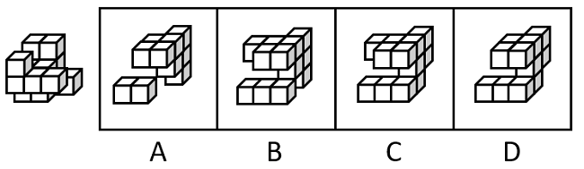

- **A**. A
- **B**. B
- **C**. C　✅
- **D**. D

**答案**：C

**官方解析**

本题考查立体拼合。根据题干及选项图形的小方块数量可知，题干与选项图形应该共同组成一个3×3×3的完整立方体。观察发现，题干图形中标“1”处（如下图所示）没有小方块，因此选项中对应位置应该有一块小方块，排除A、D两项。继续观察发现，题干图形中标“2”处（如下图所示）存在小方块，因此选项中对应位置应该没有小方块，只有C项符合。

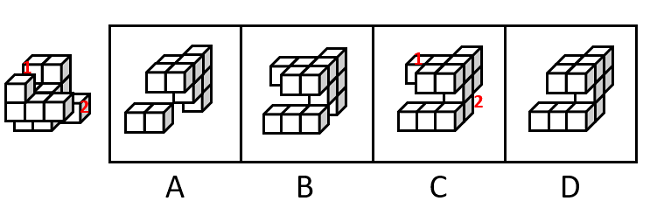

故正确答案为C。

---

## 第 3 题　qid 5510242 · 图形推理

下列选项最可能与左侧立体图形是同一物体的是：

- **A**. A
- **B**. B　✅
- **C**. C
- **D**. D

**答案**：B

**官方解析**

本题要找与左侧立体图形一致的选项，将左侧立体图形旋转，旋转方式如下图所示，可得到B项。

故正确答案为B。

---

## 第 4 题　qid 5510320 · 图形推理

左侧立体图形仅有图中所示的一个正方形面为黑色，则下列选项最不可能由三个左侧图形构成的是（    ）。

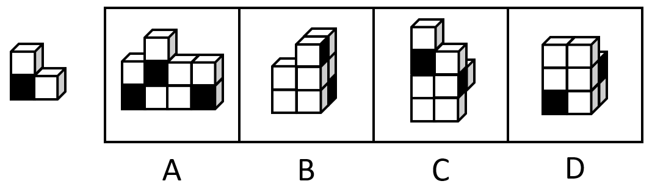

- **A**. A
- **B**. B
- **C**. C
- **D**. D　✅

**答案**：D

**官方解析**

本题考查立体拼合。题干立体图形由3个小方块组成，分别标1、2、3，如下图所示。

A项：如下图所示，左下角和中间的立体图形（分别标记为红色、绿色）可以拼成2个题干中的立体图形，右下角的立体图形（标记为蓝色）可通过位置变换得到题干中的立体图形，排除；

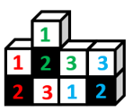

B项：如下图所示，右侧的立体图形（分别标记为蓝色、绿色）可以通过位置变换拼成2个题干中的立体图形，在第一层（从下往上数）标2（标记为红色，此时黑面朝内，无法看到）的小方块的内侧可以有另外一个小方块（标记应为3），组合拼成题干中的立体图形，排除；

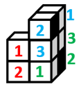

C项：如下图所示，上方的立体图形（标记为绿色）可以拼成1个题干中的立体图形，右侧的立体图形（标记为蓝色）可通过位置变换得到题干中的立体图形，在第一层（从下往上数）标2（标记为红色，此时黑面朝内，无法看到）的小方块的内侧可以有另外一个小方块（标记应为3），组合拼成题干中的立体图形，排除；

D项：如下图所示，左下角的立体图形（标记为绿色）可以拼成1个题干中的立体图形，右面的立体图形（标记为蓝色）可通过位置变换得到题干中的立体图形，但根据题干图形的特征及黑面的位置，只存在图示中唯一的拼法。此时第三层（从下往上数）的2个小方块无法和内部的其他方块拼成题干中的立体图形，当选。

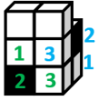

本题为选非题，故正确答案为D。

---

## 第 5 题　qid 5510236 · 图形推理

将两个左侧立体图形放置在桌面上，则某人从桌子正前方看到的图形轮廓最不可能是（    ）。

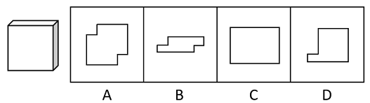

- **A**. A　✅
- **B**. B
- **C**. C
- **D**. D

**答案**：A

**官方解析**

本题考查三视图。B、C、D三项按下图所示摆放，从桌子正前方均可看到图形轮廓，排除。

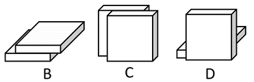

而A项按下图所示摆放，有一个小方块会悬空，无法立住，所以无法从桌子正前方看到的图形轮廓，当选。

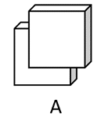

本题为选非题，故正确答案为A。

---

## 第 6 题　qid 5510261 · 图形推理

下列选项最符合所给图形规律的是：

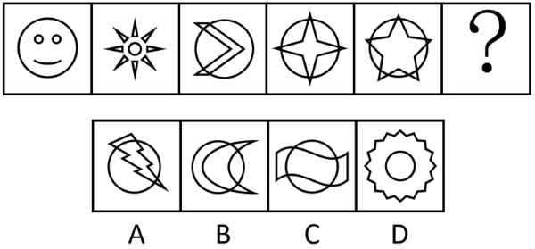

- **A**. A
- **B**. B
- **C**. C
- **D**. D　✅

**答案**：D

**官方解析**

元素组成不同，优先考虑属性规律。题干图形较规整，且出现明显的等腰元素，优先考虑对称性。观察发现，图一、图三、图五均仅为轴对称图形；图二、图四既是轴对称又是中心对称图形，故“？”处应该填入一个既是轴对称又是中心对称的图形，只有D项符合。
故正确答案为D。

---

## 第 7 题　qid 5510241 · 图形推理

下列选项最符合所给图形规律的是：

- **A**. A　✅
- **B**. B
- **C**. C
- **D**. D

**答案**：A

**官方解析**

图形元素组成相似，所有图形轮廓相同、分割区域一致，且出现灰块、白块以及阴影区域，优先考虑黑白运算。第一组图形的运算规律为：灰+灰=白，白+白＝灰，白+灰=阴影，灰+白＝阴影，第二组图形运用此规律，只有A项符合。
故正确答案为A。

---

## 第 8 题　qid 5510269 · 图形推理

下列选项最符合所给图形规律的是：

- **A**. A
- **B**. B
- **C**. C
- **D**. D　✅

**答案**：D

**官方解析**

元素组成不同，且无明显属性规律，考虑数量规律。观察发现，题干每幅图形均包含4个小元素，且相邻两幅图形存在相同的元素，考虑相邻比较。如下图所示，图一左侧一列的两个元素到图二变成了斜列，且上下位置发生互换，同理相邻图形都满足此规律。因此？处图形斜列的元素应该是前一个图形的左侧的两个元素，只有D项符合。

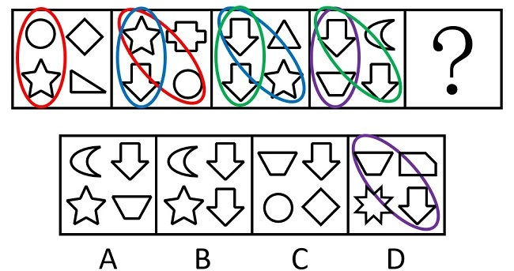

故正确答案为D。

---

## 第 9 题　qid 5510255 · 图形推理

下列选项最符合所给图形规律的是：

- **A**. A
- **B**. B
- **C**. C　✅
- **D**. D

**答案**：C

**官方解析**

元素组成相同，且无位置规律。观察发现，题干图形中灰色的小球的数量均为4个，排除B项。图形都是由横向相邻的两个黑球和对角线相邻的两个黑球组成，即两球连线一个是横线，一个是对角线，只有C项符合规律。

故正确答案为C。

---

## 第 10 题　qid 5510251 · 类比推理

下列选项与框内字符串规律最接近的是：

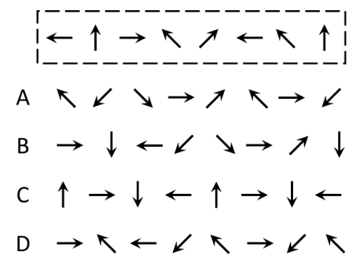

- **A**. A　✅
- **B**. B
- **C**. C
- **D**. D

**答案**：A

**官方解析**

观察发现，题干图形均由小元素组成，优先考虑元素的种类和个数。题干图形的元素个数为8，元素种类为5，且位置1、6的小元素相同；位置2、8的小元素相同；位置4、7的小元素相同；位置3、5的小元素与其他位置均不相同，只有A项符合规律。
故正确答案为A。

---

## 第 11 题　qid 5510248 · 类比推理

问：答

- **A**. 求：应　✅
- **B**. 教：学
- **C**. 来：去
- **D**. 买：卖

**答案**：A

**官方解析**

第一步：判断题干词语间逻辑关系。
“问”和“答”是问答时当事双方先后发生的行为，一方先“问”，另一方再“答”，二者是并列关系。
第二步：判断选项词语间逻辑关系。
A项：“求”和“应”是提出请求和答应要求时当事双方先后发生的行为，一方先“求”，另一方再“应”，二者是并列关系，与题干逻辑关系一致，当选；
B项：“教”和“学”是教学时当事双方同时发生的行为，一方“教”的同时另一方“学”，与题干逻辑关系不一致，排除；
C项：“来”和“去”不是同一事件中当事双方先后发生的行为，可以是单方先后发生的行为，与题干逻辑关系不一致，排除；
D项：“买”和“卖”是交易时当事双方同时发生的行为，一方“买”的同时另一方“卖”，与题干逻辑关系不一致，排除。
故正确答案为A。

---

## 第 12 题　qid 5510252 · 类比推理

章：节

- **A**. 年：月　✅
- **B**. 桌：椅
- **C**. 中考：高考
- **D**. 班主任：班长

**答案**：A

**官方解析**

第一步：判断题干词语间逻辑关系。
一章由多节组成，二者是包容关系中的组成关系。
第二步：判断选项词语间逻辑关系。
A项：一年由12个月组成，二者是组成关系，与题干逻辑关系一致，当选；
B项：桌、椅常搭配在一起使用，二者是配套使用的关系，与题干逻辑关系不一致，排除；
C项：中考和高考是不同的考试，二者是并列关系，与题干逻辑关系不一致，排除；
D项：班长在班主任的指导下管理班级，二者是对应关系，与题干逻辑关系不一致，排除。
故正确答案为A。

---

## 第 13 题　qid 5510253 · 类比推理

舍身：取义

- **A**. 摩拳：擦掌
- **B**. 含苞：欲放
- **C**. 得陇：望蜀
- **D**. 格物：致知　✅

**答案**：D

**官方解析**

第一步：判断题干词语间逻辑关系。
舍身取义是指为了正义事业不怕牺牲，“舍身”是为了“取义”，二者为方式目的对应关系。
第二步：判断选项词语间逻辑关系。
A项：摩拳擦掌形容战斗或劳动之前，人们精神振奋，跃跃欲试的样子，“摩拳”不是为了“擦掌”，二者不是方式目的对应关系，与题干逻辑关系不一致，排除；
B项：含苞欲放是形容花将开而未开时的样子，“含苞”不是为了“欲放”，二者不是方式目的对应关系，与题干逻辑关系不一致，排除；
C项：得陇望蜀原意是指已经取得陇右，还想攻取西蜀，后成为讥讽人不知道满足、总想得到更多的意思，“得陇”不是为了“望蜀”，二者不是方式目的对应关系，与题干逻辑关系不一致，排除；
D项：格物致知是指研究事物原理，从而获得知识，“格物”是为了“致知”，二者为方式目的对应关系，与题干逻辑关系一致，当选。
故正确答案为D。

---

## 第 14 题　qid 5510275 · 类比推理

海底捞月：缘木求鱼

- **A**. 抱薪救火：釜底抽薪
- **B**. 七嘴八舌：鹦鹉学舌
- **C**. 趁火打劫：浑水摸鱼　✅
- **D**. 锦上添花：画蛇添足

**答案**：C

**官方解析**

第一步：判断题干词语间逻辑关系。
海底捞月比喻根本做不到，白费力气；缘木求鱼比喻方向、方法不对，一定达不到目的，二者为近义关系。
第二步：判断选项词语间逻辑关系。
A项：抱薪救火比喻因为方法不对，虽然有心消灭祸患，结果反而使祸患扩大；釜底抽薪指抽去锅底下的柴火，比喻从根本上解决问题，二者为反义关系，与题干逻辑关系不一致，排除；
B项：七嘴八舌形容人多口杂；鹦鹉学舌比喻别人怎样说，他也跟着怎样说（含贬义），二者不是近义关系，与题干逻辑关系不一致，排除；
C项：趁火打劫指趁紧张危急的时候侵犯别人的权益；浑水摸鱼比喻趁混乱的时机捞取利益，二者为近义关系，与题干逻辑关系一致，当选；
D项：锦上添花比喻使美好的事物更加美好；画蛇添足比喻做多余的事，反而不恰当，二者不是近义关系，与题干逻辑关系不一致，排除。
故正确答案为C。

---

## 第 15 题　qid 5510279 · 类比推理

园丁：灌木：剪刀

- **A**. 医生：手术：处方
- **B**. 裁缝：衣服：针线　✅
- **C**. 渔民：捕鱼：渔网
- **D**. 司机：乘客：驾照

**答案**：B

**官方解析**

第一步：判断题干词语间逻辑关系。
园丁用剪刀修剪灌木，园丁是职业，剪刀是工具，灌木为剪刀修剪的对象，三者为职业、工具、工具作用对象的对应关系。
第二步：判断选项词语间逻辑关系。
A项：医生根据病人的病情开具处方，处方并不是工具，与题干逻辑关系不一致，排除；
B项：裁缝用针线缝补衣服，裁缝是职业，针线是工具，衣服是针线作用的对象，三者为职业、工具、工具作用对象的对应关系，与题干逻辑关系一致，当选；
C项：渔民用渔网捕鱼，渔民是职业，渔网是工具，捕鱼并不是渔网作用的对象，而是用渔网所做的行为，与题干逻辑关系不一致，排除；
D项：司机为职业，但是驾照是由主管部门颁发的驾驶资格凭证，证明持有人具备驾驶相应交通工具的资格，并不是工具，与题干逻辑关系不一致，排除。
故正确答案为B。

---

## 第 16 题　qid 5510260 · 类比推理

某街道计划将3名男性干部甲、乙、丙和3名女性干部张、李、王下沉至各个社区开展工作，可供选择的社区有A、B、C、D四个。已知：
①每人只能去一个社区。
②凡是有男性去的社区就必须有女性去。
③张去A社区或者B社区，乙去D社区。
如果最终李去了C社区，则下列推论必然正确的是（    ）。

- **A**. 丙去了A社区
- **B**. 张去了B社区
- **C**. 甲去了C社区
- **D**. 王去了D社区　✅

**答案**：D

**官方解析**

第一步：分析题干条件。

（1）每人只能去一个社区；

（2）有男性去的社区有女性去；

（3）张去A社区 或 B社区、乙去D社区；

（4）李去C社区。

第二步：根据题干条件进行推理。

根据条件（3）男性乙去D社区，再结合条件（2）可知，D社区必须有女性去。女性涉及张、李、王3名干部，又根据条件（1）、条件（3）可知，张去A社区或B社区，以及条件（4）李去C社区可知，女性张和李均不能去D社区，故推出仅剩的女性王一定去D社区，只有D项正确。

故正确答案为D。

---

## 第 17 题　qid 5510276 · 逻辑判断

分散的农户经营不成规模，已经远远不能适应各个城市群规模化、批量化的农产品需求，也限制了农民收入的提高。如果不解决农户的组织化这个问题，就无法推广农业机械化、规模化，也无法降低农业的经营成本。因此，可以通过推进农户的组织化，让现有的农民实现增产增收。
以下选项如果为真，最能支持上述论断的是（    ）。

- **A**. 当前分散的农户是农村的农业经营主体
- **B**. 机械化、规模化种植能有效实现农业增产　✅
- **C**. 推广农业机械化、规模化不需要花费较长时间
- **D**. 实现农业机械化生产后，劳动力投入将有所减少

**答案**：B

**官方解析**

第一步：找出论点和论据。
论点：可以通过推进农户的组织化，让现有的农民实现增产增收。
论据：如果不解决农户的组织化这个问题，就无法推广农业机械化、规模化，也无法降低农业的经营成本。
论据讨论的是实现农户的组织化有利于推广农业机械化，规模化，降低农业的经营成本，论点说的是推进农户的组织化，让现有的农民实现增产增收，论据和论点话题不一致，加强优先考虑搭桥，即在“推广农业机械化、规模化，降低农业的经营成本”和“让农民实现增产增收”之间建立联系。
第二步：逐一分析选项。
A项：论点讨论的是农户的组织化与农民增产增收的关系，而该项说的是分散的农户是农村的农业经营主体，不明确推进农户的组织化后是否可以让农民增产增收，无法加强，排除；
B项：该项说的是机械化、规模化种植能有效实现农业增产，即在推广农业机械化、规模化和让农民实现增产之间建立联系，为搭桥项，可以加强，当选；
C项：论点讨论的是农户的组织化与农民增产增收的关系，该项说的是推广农业机械化、规模化不需要花费较长时间，话题不一致，无法加强，排除；
D项：论点讨论的是农户的组织化与农民增产增收的关系，该项说的是实现农业机械化生产后对于劳动力投入的影响，话题不一致，无法加强，排除。
故正确答案为B。

---

## 第 18 题　qid 5510267 · 定义判断

某中学计划抽调一批骨干教师前往西部地区支教，学校计划抽调2位高一老师、1位高二老师和1位高三老师，并且这4位老师所教科目应各不相同。已知各年级候选人如下：
①高一：历史老师甲、地理老师乙、政治老师丙。
②高二：地理老师丁、语文老师戊。
③高三：政治老师己、数学老师庚。
则以下人选符合要求的是（    ）。

- **A**. 甲、乙、丁、庚
- **B**. 甲、乙、戊、己　✅
- **C**. 乙、丙、戊、己
- **D**. 乙、戊、己、庚

**答案**：B

**官方解析**

第一步：分析题干条件。
（1）2位高一老师、1位高二老师、1位高三老师；
（2）4位老师所教科目应各不相同；
（3）高一：甲历史、乙地理、丙政治；
（4）高二：丁地理、戊语文；
（5）高三：己政治、庚数学。
第二步：根据题干条件进行推理。
题干信息确定，选项信息充分，优先考虑排除法。
根据条件（1）可知只需要1位高三的老师，结合条件（5）可知己和庚均为高三的老师，排除D项；
根据条件（2）可知4位老师所教科目应各不相同，结合条件（3）（4）可知乙和丁均为地理老师，结合条件（3）（5）可知丙和己均为政治老师，排除A、C两项。
经验证，B项符合题干所有条件。
故正确答案为B。

---

## 第 19 题　qid 5510249 · 逻辑判断

甲市城区过去一直实行车辆限号通行。从去年开始，该市取消了车辆限号通行，一年后全市交通拥堵指数明显下降，平均车速提高了20%，实现了“车辆不限号，交通不拥堵”的双重效益。
下列选项如果为真，最能解释这一现象的是（    ）。

- **A**. 甲市城区打造了多个15分钟便民生活圈，居民购物出行更加便利
- **B**. 甲市加强了新能源汽车的配套设施建设，新能源汽车销量大幅提高
- **C**. 甲市交通线网优化，城区主干道和重点路段交通状况得到明显改善　✅
- **D**. 当油价上涨时，为降低出行成本，部分市民会优先选择公共交通出行

**答案**：C

**官方解析**

第一步：找出题干矛盾。
甲市城区过去一直实行车辆限号通行。从去年开始，该市取消了车辆限号通行，一年后全市交通拥堵指数明显下降。
第二步：逐一分析选项。
A项：甲市城区的15分钟便民生活圈使居民购物出行更加便利，但不意味着购物出行不需要开车，同时购物出行更加便利不能代表甲市城区整体交通顺畅，不能解释一年后全市交通拥堵指数明显下降的原因，不能解释题干矛盾，排除；
B项：甲市加强了新能源汽车的配套设施建设，新能源汽车销量大幅提高，与题干话题不一致，不能解释题干矛盾，排除；
C项：城区主干道和重点路段交通状况得到明显改善，意味着即使取消限号，主干道和重点路段等车流量较大的地段也交通顺畅，也代表着甲市城区整体交通可能顺畅，可以解释一年后全市交通拥堵指数明显下降的原因，可以解释题干矛盾，当选；
D项：当油价上涨时，为降低出行成本部分市民会优先选择公共交通出行，但是取消限号后油价是否上涨不明确，部分市民的数量能否影响整个甲市城区整体交通情况同样不明确，不能解释题干矛盾，排除。
故正确答案为C。

---

## 第 20 题　qid 5510321 · 逻辑判断

人均GDP可以基于常住人口计算，但算出的结果可能并不准确，因为流动人口同样会为城市创造GDP。当一个城市的流动人口占比较高时，只用常住人口来计算人均GDP，可能会导致对城市经济发展水平的高估。有专家因此建议，对经济发展水平相近的城市而言，用“吨均GDP”（每吨生活垃圾所对应的GDP）替代“人均GDP”，更能准确比较各个城市的发展水平。
要使该建议成立，必须补充的前提是（    ）。

- **A**. 所有城市都能准确统计本地区居民产生的生活垃圾数量
- **B**. 气候条件、城市布局等因素不会影响居民的生活垃圾产生量
- **C**. 经济发展水平相近的城市，居民的生活垃圾人均产生量相近　✅
- **D**. 各个城市中，流动人口和常住人口每人每天产生的垃圾数量相近

**答案**：C

**官方解析**

第一步：找出论点和论据。
论点：对经济发展水平相近的城市而言，用“吨均GDP”（每吨生活垃圾所对应的GDP）替代“人均GDP”，更能准确比较各个城市的发展水平。
论据：当一个城市的流动人口占比较高时，只用常住人口来计算人均GDP，可能会导致对城市经济发展水平的高估。
本题的论点和论据均在讨论准确比较各个城市发展水平的方法，二者话题一致，且问题为“前提”，优先考虑必要条件。
第二步：逐一分析选项。
A项：该项说的是所有城市都能准确统计本地区居民产生的生活垃圾数量，说明生活垃圾数量可以进行准确统计，该方法具有可行性，是论点成立的必要条件，保留；
B项：该项说的是气候条件、城市布局等因素不会影响居民的生活垃圾产生量，而论点说的是“吨均GDP”更能准确比较各个城市的发展水平，话题不一致，无法加强，排除；
C项：该项说的是经济发展水平相近的城市，居民的生活垃圾人均产生量相近，实际人口总数=垃圾总量/人均垃圾产生量，如果经济发展水平相近的城市中人均垃圾产生量不相近，也就无法根据垃圾总量来确定实际人口总数，那么就无法用垃圾来确定城市发展水平，即用“吨均GDP”就无法比较各个城市的发展水平，即选项不成立则论点不成立，因此选项可以证明该方法有效，是论点成立的必要条件，保留；
D项：该项说的是各个城市，论点针对的是“经济发展水平相近”的城市，“各个城市”范围过大，超出了论点论述的范围，且即使流动人口和常住人口每人每天产生的垃圾数量不相近，但能保证经济发展水平相近的城市人均产生量相近也可以满足论点成立的条件，选项不是论点成立的必要条件，排除。
A、C两项比较，A项证明方法具有可行性，C项证明方法具有有效性，二者都是论点成立的必要条件，需要注意的是，论点讨论的就是该方法能否用来比较城市发展水平，但A项只能证明生活垃圾可以准确统计，无法证明能否用生活垃圾来比较相近城市的发展水平，而C项能证明生活垃圾确实可以用来比较城市发展水平，因此，C项比A项更贴近论点，择优选择C项。
故正确答案为C。

---

## 第 21 题　qid 5510323 · 逻辑判断

现在，有些人开始质疑“全球变暖”理论。他们认为，人类活动并不是全球变暖的主要原因，放在地球气候漫长的演变背景中看，气候变化是正常现象，因此，近期的全球变暖远没有到需要“拯救地球”的地步。
以下选项如果为真，最能反驳上述论断的是（    ）。

- **A**. 过去20年里，全球变暖和海平面上升的速度迅速增加
- **B**. 工业革命以后人类排放的二氧化碳增多，全球气温也在上升
- **C**. 按照目前的趋势，20年后将有超三分之一的生态系统濒临崩溃　✅
- **D**. 在地球的历史中，气候变暖多次导致了人类生活环境的巨大变化

**答案**：C

**官方解析**

第一步：找出论点和论据。
论点：近期的全球变暖远没有到需要“拯救地球”的地步。
论据：人类活动并不是全球变暖的主要原因，放在地球气候漫长的演变背景中看，气候变化是正常现象。
由论据讨论的全球变暖是气候变化的正常现象，推出论点全球变暖对地球的影响不需要采取措施，题干论点论据话题一致，削弱优先考虑削弱论点。
第二步：逐一分析选项。
A项：过去20年里全球变暖和海平面上升的速度迅速增加，但并不明确这些变化对地球而言是否需要采取措施来拯救，属于不明确项，无法削弱，排除；
B项：讨论的是全球气温上升可能和工业革命后人类排放的二氧化碳增多有关，但并不明确全球气温上升对地球而言是否需要采取措施来拯救，属于不明确项，无法削弱，排除；
C项：按照目前的趋势，20年后将有超三分之一的生态系统濒临崩溃，说明全球气温持续变暖会严重危及人类的生存环境，需要人类采取措施来“拯救地球”，直接反驳了论点，可以削弱，当选；
D项：气候变暖会导致人类生活环境的巨大变化，但不明确这种巨大变化是否达到需要“拯救地球”的地步，属于不明确项，无法削弱，排除。
故正确答案为C。

---

## 第 22 题　qid 5510325 · 逻辑判断

为推动社区养老服务建设，某社区开设了长者食堂，向社区内符合条件的老年人提供一日三餐。该食堂饭菜价格远低于市场价，且品种多样、味道极佳、分量充足，然而每天到该食堂就餐的老年人数量并不多。
以下各项如果为真，最能解释这一现象的是（    ）。

- **A**. 社区内多数老年人选择送餐上门而非到食堂用餐　✅
- **B**. 该社区内和周边有许多深受当地居民喜爱的餐馆
- **C**. 该长者食堂占地面积较大，食堂内就餐座位充足
- **D**. 符合就餐条件的老年人在社区居民中的占比不高

**答案**：A

**官方解析**

第一步：找出题干矛盾。
长者食堂饭菜价格远低于市场价，且品种多样、味道极佳、分量充足，然而每天到该食堂就餐的老年人数量并不多。
第二步：逐一分析选项。
A项：社区内多数老年人选择送餐上门而非到食堂用餐，解释了为什么长者食堂有优势但每天到该食堂就餐的老年人数量不多，可以解释题干矛盾，当选；
B项：该社区内和周边有许多深受当地居民喜爱的餐馆，但长者食堂饭菜价格远低于市场价，且品种多样、味道极佳、分量充足，明显比其他餐馆更有优势，不能解释为什么每天到该食堂就餐的老年人数量不多，不能解释题干矛盾，排除；
C项：该长者食堂占地面积较大，食堂内就餐座位充足，补充说明了该食堂的优点，不能解释为什么每天到该食堂就餐的老年人数量不多，不能解释题干矛盾，排除；
D项：符合就餐条件的老年人在社区居民中的占比不高，由于不明确社区居民的总数，所以根据占比无法判断符合就餐条件的老年人的数量，如果社区居民总数很多，那么尽管占比不高，符合就餐条件的老年人也会很多，不能解释为什么每天到该食堂就餐的老年人数量不多，不能解释题干矛盾，排除。
故正确答案为A。

---

## 第 23 题　qid 5510270 · 类比推理

甲、乙、丙3人同时申请某个课题项目。评审专家组进行评审后，最终通过了其中1人的申请。专家们最初的预测如下：
①专家一：甲的申请没有通过。
②专家二：乙的申请通过了。
③专家三：丙的申请没有通过。
如果只有1名专家预测正确，则下列推论必然错误的是（    ）。

- **A**. 专家一预测正确
- **B**. 专家三预测正确
- **C**. 甲的申请通过了
- **D**. 乙的申请通过了　✅

**答案**：D

**官方解析**

第一步：分析题干找关系。

专家一：甲通过；

专家二：乙通过；

专家三：丙通过。

第二步：根据题干推理。

题干没有明显的矛盾关系和反对关系，故用假设法进行推理，专家二的预测是肯定形式，可以通过专家二的预测开始假设，假设专家二的预测为真，则乙的申请通过，结合题干条件，只有1人申请通过，可以得出专家一和专家三的预测都是正确的，此时有3名专家预测正确，与题干条件矛盾，因此，乙一定没有通过，此时，可得D项一定错误，D项当选。继续推理，当甲的申请通过时，专家一和专家二预测均错误，专家三预测正确，此时满足题干要求；当丙的申请通过时，专家一预测正确，专家二和专家三预测均错误，此时也满足题干要求，综上所述，甲、丙都有可能通过申请，A、B、C三项均为可能正确。

本题为选非题，故正确答案为D。

---

## 第 24 题　qid 5510268 · 类比推理

自其变者而观之，则天地没有一瞬间不会发生变化。历史已经不属于这片天地，所以历史是永恒不变的。
以下选项的逻辑结构与题干最为相似的是（    ）。

- **A**. 玫瑰是红色的，这朵花是白色的，所以这朵花不是玫瑰
- **B**. 羊都是有角的，被锯掉角的羊没有角，所以被锯掉角的羊不再是羊
- **C**. 地球是行星，有自己的卫星，火星是行星，所以火星也有自己的卫星
- **D**. 有明确奋斗目标的人都是幸福的，他没有明确的奋斗目标，所以他不幸福　✅

**答案**：D

**官方解析**

第一步：翻译题干。

A（天地）B（一直发生变化），C（历史）A（不属于这片天地），结论：C（历史）B（不变）。

第二步：逐一分析选项。

A项：A（玫瑰）B（红色），C（这朵花）B（不是红色），结论：C（这朵花）A（玫瑰），与题干推理形式不一致，排除；

B项：A（羊）B（有角），C（被锯掉角的羊）B（没有角），结论：C（被锯掉角的羊）A（羊），与题干推理形式不一致，排除；

C项：A（地球是行星）B（有卫星），C（火星是行星），结论：B（有卫星），与题干推理形式不一致，排除；

D项：A（有明确奋斗目标）B（幸福），C（他）A（没有明确奋斗目标），结论：C（他）B（不幸福），与题干推理形式一致，当选。

故正确答案为D。

---

## 第 25 题　qid 5510257 · 逻辑判断

某制片公司历经数年制作了一部电影，该电影上映后得到了业内专家一致好评，在各影评网站上也得到了很高的评分，然而该电影的放映厅内观众寥寥无几，其实际票房收益也很不理想。
以下各项如果为真，最不能解释这一现象的是（    ）。

- **A**. 各电影院对该电影安排的放映场次普遍较少　✅
- **B**. 该电影制作成本高，上映时设定了过高的票价
- **C**. 该电影上映期间有多部更加热门优质的电影同时上映
- **D**. 该电影题材过于小众，大部分普通观众对其缺乏兴趣

**答案**：A

**官方解析**

第一步：找出题干矛盾。
某电影受到业内专家和影评网站上大家的好评，但该电影放映厅内观众少且票房不高。
第二步：逐一分析选项。
A项：电影院安排的放映场次少，无法解释为什么已经安排的场次放映厅内观众寥寥无几，不能解释题干矛盾，当选；
B项：过高的票价会影响观看的人数，导致观看人数少，可以解释为什么该电影受到专家和影评网站上大家的好评，但放映厅内观众少且票房不高，可以解释题干矛盾，排除；
C项：该电影上映期间有多部更加热门优质的电影同时上映，导致观众更加倾向于观看更加热门的优质电影，使得该电影观众数量减少，可以解释为什么该电影受到专家和影评网站上大家的好评，但放映厅内观众少且票房不高，可以解释题干矛盾，排除；
D项：说明喜欢该电影题材的人数本来就很少，那么去电影院观看的人数也会少，可以解释为什么该电影受到专家和影评网站上大家的好评，但放映厅内观众少且票房不高，可以解释题干矛盾，排除。
本题为选非题，故正确答案为A。

---

## 第 26 题　qid 5510264 · 逻辑判断

科学家曾研究过旁观者对运动员跑步的影响。结果发现，在同一条跑道上，没有旁观者或旁观者背对跑道时，运动员的跑步速度相近；当旁观者面对跑道时，运动员的跑步速度明显提高。因此，体育竞赛的现场一定得有观众，这有助于运动员取得更好的成绩。
以下选项如果为真，最能削弱上述论断的是（    ）。

- **A**. 许多体育竞赛中运动员需要保持高度专注力，避免外界干扰　✅
- **B**. 其他参赛选手的关注也能让运动员在竞赛项目中发挥得更好
- **C**. 运动员短时间内突破自己、超常发挥可能会对其身体造成伤害
- **D**. 在没有观众的情况下，仍然有运动员在体育竞赛中打破了纪录

**答案**：A

**官方解析**

第一步：找出论点和论据。
论点：体育竞赛的现场一定得有观众，这有助于运动员取得更好的成绩。
论据：在同一条跑道上，没有旁观者或旁观者背对跑道时，运动员的跑步速度相近；当旁观者面对跑道时，运动员的跑步速度明显提高。
本题论点和论据话题一致，都在讨论“观众”与“成绩”之间的关系，削弱优先考虑削弱论点。
第二步：逐一分析选项。
A项：该项说的是许多体育竞赛中运动员需要保持高度专注力，避免外界干扰，说明观众可能会对运动员造成干扰，不利于运动员取得好成绩，直接削弱论点，当选；
B项：该项说的是其他参赛选手的关注也能让运动员在竞赛项目中发挥得更好，但其他参赛选手的关注与现场有观众是否有助于运动员取得更好的成绩无关，无法削弱，排除；
C项：该项说的是运动员短时间内突破自己、超常发挥可能会对其身体造成伤害，对身体造成伤害，与论点讨论的现场有观众是否有助于运动员取得更好的成绩无关，无法削弱，排除；
D项：该项说的是没有观众也有运动员能取得好成绩，但不能证明有观众时就不能帮助运动员取得更好的成绩，没有直接说明观众到底有没有帮助，削弱力度不如A项，排除。
故正确答案为A。

---

## 第 27 题　qid 5510273 · 逻辑判断

小王经营着一家打印店，他发现，店内员工都很忙，大部分精力都花在了文件排版上。为了节省人力，他给店里的电脑安装了能自动完成常规排版操作的新款软件。然而，软件安装几个月后，店内员工反而更忙了。
以下选项如果为真，最能解释这一现象的是（    ）。

- **A**. 部分文档有特殊的排版要求，依然需要人工操作完成
- **B**. 能自动排版文档后，该店的文印装订等业务量也因此大涨　✅
- **C**. 新软件操作有一定难度，员工需要接受培训才能熟练掌握
- **D**. 安装软件后，该店并没有相应地调整排版和打印的收费标准

**答案**：B

**官方解析**

第一步：找出题干矛盾。
小王为了节省人力，给店里的电脑安装了能自动完成常规排版操作的新款软件，但软件安装几个月后，员工反而更忙了。
第二步：逐一分析选项。
A项：该项只能说明有些工作离不开人工操作，不能解释在安装了能自动完成常规排版操作的新款软件后，员工为什么变得更忙了，不能解释题干矛盾，排除；
B项：该项说明能自动排版文档后，自动排版的工作效率虽然得到了提高，但该店文印装订等业务量大涨，增加了员工的工作量，进而能够解释员工更忙了的现象，可以解释题干矛盾，当选；
C项：该项只能说明使用自动排版软件前需要对员工进行一定的培训，才能更好地使用，不能解释在安装了能自动完成常规排版操作的新款软件后，员工为什么变得更忙了，不能解释题干矛盾，排除；
D项：该项说明安装了能自动完成常规排版操作的新款软件后，该店价格没有进行调整，与题干中的矛盾无关，不能解释题干矛盾，排除。
故正确答案为B。

---

## 第 28 题　qid 5510237 · 逻辑判断

目前，风能技术员是某国受伤率最高的职业之一，从业人员较少。但随着国家能源需求向可再生能源转变，该国将越来越需要从事这样高风险性职业的人才，以保证国家能源的正常供应。由于风能技术人才紧缺，该国此类岗位的薪酬不断提高。对此有专家建议，在加大风能技术人才培养的同时，该国还应积极引进国际风能技术人才。
要使该建议成立，必须补充的前提是（    ）。

- **A**. 风能技术员在工作中面临的风险在短期内不会下降
- **B**. 该国风能技术人才培养无法完全满足能源发展需求　✅
- **C**. 风能技术员岗位薪酬的不断提高将制约能源产业的发展
- **D**. 国际风能技术人才的技术水平不低于该国培养的风能技术人才

**答案**：B

**官方解析**

第一步：找出论点和论据。
论点：在加大风能技术人才培养的同时，该国还应积极引进国际风能技术人才。
论据：随着国家能源需求向可再生能源转变，该国将越来越需要从事这样高风险性职业的人才，以保证国家能源的正常供应。由于风能技术人才紧缺，该国此类岗位的薪酬不断提高。
本题论点和论据都在讨论风能技术人才紧缺的问题，论点和论据话题一致，且提问方式为“前提”，加强优先考虑补充必要条件。
第二步：逐一分析选项。
A项：该项讨论的是风能技术员的工作风险不会下降，而论点讨论的是加大风能技术人才培养和引进国际风能技术人才，话题不一致，无法加强，排除；
B项：该项讨论的是该国风能技术人才培养无法满足能源发展需求，所以才需要引进国际风能技术人才，是题干论点成立的必要条件，可以加强，当选；
C项：该项讨论的是风能技术员的岗位薪酬与能源产业发展的关系，而论点讨论的是引进国际风能技术人才，话题不一致，无法加强，排除；
D项：该项讨论的国际风能技术人才的技术水平不低于该国培养的风能技术人才，如果国际风能技术人才的技术水平略低于该国培养的风能技术人才，在该国对风能技术人才有需求的情况下，照样可以从海外引进风能技术人才，不是论点成立的必要条件，无法加强，排除。
故正确答案为B。

---

## 第 29 题　qid 5510280 · 类比推理

只有不间断地练习曲目，才能在音乐比赛中获奖。小李没有在音乐比赛中获奖，那么他一定没有不间断地练习曲目。
以下选项的逻辑结构与题干最为相似的是（    ）。

- **A**. 降低生产成本是实现利润上涨的必要条件。某企业今年的利润没有上涨，因此一定没有降低生产成本　✅
- **B**. 除非自身业务能力过硬，否则无法成为优秀的销售员。小张是优秀的销售员，因此他一定有过硬的业务能力
- **C**. 如果要最大程度减少碳排放，那么就要践行低碳出行的绿色理念。某国并不认可低碳出行，所以无法减少碳排放
- **D**. 如果汽车价格大幅度下降，汽车的销量就会迅速上升，当前汽车的销量没有迅速上升，因此汽车价格一定没有下降

**答案**：A

**官方解析**

第一步：分析题干推理形式。

翻译为：获奖不间断练习，小李没有获奖没有不间断练习，（即ab，ab），逻辑结构为“否前推否后”。

第二步：逐一分析选项。

A项：翻译为：利润上涨降低成本，某企业利润没有上涨没有降低成本，（即ab，ab），逻辑结构为“否前推否后”，与题干推理形式一致，当选；

B项：翻译为：优秀销售员业务能力过硬，小张是优秀销售员业务能力过硬，（即ab，ab），逻辑结构为“肯前推肯后”，与题干推理形式不一致，排除；

C项：翻译为：最大程度减少碳排放践行低碳出行理念，某国不低碳出行无法减少碳排放，（即ab，ba），逻辑结构为“否后推否前”，与题干推理形式不一致，排除；

D项：翻译为：价格下降销量上升，汽车销量没有上升价格没有下降，（即ab，ba），逻辑结构为“否后推否前”，与题干推理形式不一致，排除。

故正确答案为A。

---

## 第 30 题　qid 5510324 · 逻辑判断

为探索每周4天工作制的可行性，某集团进行了一次大规模的试验。结果表明，尽管减少了工作天数，数千名员工仍然完成了原定的工作任务，且员工的工作压力水平下降了7%，企业的办公成本如耗材、水电的消耗量也有所下降。有人因此认为，4天工作制不仅能降低企业的运营成本，还大大提高了企业员工的工作效率。
以下选项如果为真，最能质疑上述观点的是（    ）。

- **A**. 实行4天工作制后，该集团一些分公司的营业收入有所降低
- **B**. 实行4天工作制后，员工每天的工作时长从8小时变为10小时　✅
- **C**. 劳动法规制定的前提是保护劳动者权益，而非降低企业运营成本
- **D**. 由于运营维护的需要，部分岗位的工作人员并不能实行4天工作制

**答案**：B

**官方解析**

第一步：找出论点和论据。
论点：4天工作制不仅能降低企业的运营成本，还大大提高了企业员工的工作效率。
论据：尽管减少了工作天数，数千名员工仍然完成了原定的工作任务，且员工的工作压力水平下降了7%，企业的办公成本如耗材、水电的消耗量也有所下降。
本题论点论据均在讨论4天工作制能够降低企业运营成本、提高员工工作效率，论点论据话题一致，削弱优先考虑削弱论点。
第二步：逐一分析选项。
A项：该项指出实行4天工作制后营业收入有所降低，与论点讨论的企业运营成本及员工工作效率无关，为无关项，无法削弱，排除；
B项：该项指出员工的工作时长由每周工作5天每天8小时，变为每周工作4天每天10小时，说明员工每周的总工作时长依然是40小时，且论据指出员工完成了原定的工作任务，说明总工作时长和总工作量不变，即工作效率也不变，即4天工作制并没有提高员工工作效率，削弱论点，可以削弱，当选；
C项：该项指出劳动法规制定的前提不是降低企业运营成本，与论点讨论的实行4天工作制后能否降低企业运营成本无关，为无关项，无法削弱，排除；
D项：该项指出部分岗位员工不能实行4天工作制，但没有提及能够实行4天工作制的岗位实行该制度后对企业运营成本和员工工作效率的影响，为无关项，无法削弱，排除。
故正确答案为B。

---

## 第 31 题　qid 5510326 · 逻辑判断

为促进员工交流，营造积极参加体育锻炼的良好氛围，某单位组织了跑步、羽毛球、排球、篮球等多支运动队。已知：
（1）所有员工至少参加了跑步队或羽毛球队中的一个；
（2）参加了跑步队的员工都没有加入篮球队；
（3）财务部小丽加入了篮球队。
工会委员了解上述情况后推断，小丽也加入了排球队。
要使这一推断成立，可以补充的前提是（    ）。

- **A**. 小丽没有参加跑步队
- **B**. 小丽没有加入羽毛球队
- **C**. 加入了排球队的人都参加了羽毛球队
- **D**. 未加入排球队的人都没有参加羽毛球队　✅

**答案**：D

**官方解析**

第一步：找出论点和论据。

论点：小丽加入了排球队。

论据：（1）跑步队 或 羽毛球队；

（2）跑步队篮球队；

（3）小丽加入了篮球队。

论据（3）“小丽加入了篮球队”是对论据（2）“跑步队篮球队”的否后，根据“否后必否前”可知，小丽没有参加跑步队，结合论据（1）“跑步队 或 羽毛球队”，根据“或关系否一推一”可知，小丽加入了羽毛球队。

本题需要找出论点成立的前提，可优先考虑搭桥，即建立“小丽加入羽毛球队”和“小丽加入排球队”之间的联系。

第二步：逐一分析选项。

A项：“小丽没有参加跑步队”，根据论据（1）可知，小丽加入了羽毛球队，但不能推出小丽加入了排球队，不是论点成立的前提，排除；

B项：“小丽没有加入羽毛球队”，与题干论据不符，排除；

C项：该项翻译为：排球队羽毛球队，论据已经推出“小丽加入了羽毛球队”，而小丽加入了羽毛球队是对该项的肯后，无法推出小丽加入了排球队，不是论点成立的前提，排除；

D项：该项翻译为：羽毛球队排球队，论据已经推出“小丽加入了羽毛球队”，根据该项可知小丽也加入了排球队，为搭桥项，是论点成立的前提，当选。

故正确答案为D。

---

## 第 32 题　qid 5510327 · 类比推理

优秀的企业家既要有杰出的领导能力，也必须积极承担相应的社会责任。因此，能运用出色的领导力引领企业发展却不愿承担任何社会责任的人，一定不是优秀的企业家。
以下选项的逻辑结构与题干最为相似的是（    ）。

- **A**. 真正的“美丽”不仅体现在外表上，还体现在心灵上。因此，心灵美丽的人外表也一定出众
- **B**. 设计要源于现实生活才能发挥意义而成为真正伟大的设计。因此，脱离生活的设计是不切实际的，更是毫无现实意义的
- **C**. 优秀的学习成绩和良好的道德品质在评奖评优中缺一不可。因此，即使有优秀的学习成绩，要想评奖评优，良好的道德品质仍然不可或缺　✅
- **D**. 流量明星一定程度带动了经济发展，也带来了一些新的社会问题。因此，片面强调流量明星带来的经济效益，忽视其后来的社会问题并不可取

**答案**：C

**官方解析**

第一步：分析题干推理形式。

题干翻译为：优秀的企业家杰出的领导能力 且 积极承担相应的社会责任，因此，有出色的领导力 且 承担相应的社会责任优秀的企业家。

题干逻辑结构为：12 且 3，因此，2 且 31。

第二步：逐一分析选项。

A项：翻译为：真正的“美丽”外表美丽 且 心灵美丽，因此，心灵美丽外表出众，逻辑结构为：12 且 3，因此，32，与题干推理形式不一致，排除；

B项：翻译为：发挥意义成为真正伟大的设计源于现实生活，因此，源于生活的设计不切实际的设计 且 现实意义的设计，逻辑结构为：12，因此，23 且 1，与题干推理形式不一致，排除；

C项：翻译为：评奖评优优秀的学习成绩 且 良好的道德品质，因此，优秀的学习成绩 且 良好的道德品质评奖评优（“因此”之后的语句可以理解为：如果只有优秀的学习成绩，而没有良好的道德品质，是不能评奖评优的），逻辑结构为：12 且 3，因此，2 且 31，与题干推理形式一致，当选；

D项：翻译为：流量明星带动经济发展 且 带来社会问题，因此，片面强调经济效益 且 忽视带来社会问题不可取，逻辑结构为：12 且 3，因此，2 且 34，与题干推理形式不一致，排除。

故正确答案为C。

---

## 第 33 题　qid 5510328 · 类比推理

某部门有若干名干部和工勤人员。其中有多名干部是博士；并非所有的博士都是统计学专业毕业的；所有的男性都是统计学专业毕业的；由此可以推断该部门中（    ）。

- **A**. 有些男性不是博士
- **B**. 有些博士不是男性　✅
- **C**. 有些男性是工勤人员
- **D**. 有些干部不是统计学专业毕业的

**答案**：B

**官方解析**

第一步：翻译题干。

①有的干部博士；

②有的博士统计学专业毕业；

③男性统计学专业毕业。

将②③串联可得④有的博士统计学专业毕业男性。

第二步：逐一分析选项。

A项：翻译为有的男性博士，根据④可得，有的博士男性，“有的不是”无法直接换位，无法得到有的男性不是博士，无法推出，排除；

B项：翻译为有的博士男性，根据④可得，有的博士男性，可以推出，当选；

C项：翻译为有的男性工勤人员，题干中男性和工勤人员没有明显的逻辑关系，无法推出，排除；

D项：翻译为有的干部统计学专业毕业，涉及推理的式子为①和②，但是①和②无法串联，无法推出，排除。

故正确答案为B。

---

## 第 34 题　qid 5510282 · 定义判断

酿酒时，蒸馏的酒液流入酒桶，会在表面荡起泡沫状的酒花，这就是古代“看花摘酒”传统的由来。此外，还可以通过用耳朵倾听酒花爆裂的声音指导酿酒工艺，也即“听花断酒”。由于从古至今手工酿酒的工艺流程并没有大的变化，有人因此推断，如果“听花断酒”的技艺仍然存在，现在仍然可以用这一方法来判断一壶酒是否为佳酿。
以下属于上述推论暗含前提的是（    ）。

- **A**. 佳酿的酒花爆裂声音与其他酒不同　✅
- **B**. “听花断酒”这一古老的方法早已失传多年
- **C**. 通过“听花断酒”可以筛选出品质一般的酒
- **D**. 通过酒花的外形和爆裂发出的声音都能判断酒的品质

**答案**：A

**官方解析**

第一步：找出论点和论据。
论点：如果“听花断酒”的技艺仍然存在，现在仍然可以用这一方法来判断一壶酒是否为佳酿。
论据：古代可以通过用耳朵倾听酒花爆裂的声音指导酿酒工艺，也即“听花断酒”，从古至今手工酿酒的工艺流程并没有大的变化。
论点论据讨论的都是通过听酒花爆裂的声音可以判断酒的品质，二者话题一致，且问法为“前提”，加强优先考虑必要条件。
第二步：逐一分析选项。
A项：佳酿的酒花爆裂声音与其他酒不同，如果该项不成立，那么就无法通过听酒花爆裂的声音判断是否为佳酿，是论点成立的必要条件，可以加强，当选；
B项：“听花断酒”已失传多年，而论点讨论的是通过听酒花爆裂的声音可判断酒的品质，即“听花断酒”的有效性，话题不一致，为无关项，无法加强，排除；
C项：通过“听花断酒”可以筛选出品质一般的酒，但论点说的是判断酒是否为佳酿，话题不一致，无法加强，排除；
D项：通过酒花的外形和爆裂发出的声音都能判断酒的品质，补充论据，但不是论点成立的必要条件，排除。
故正确答案为A。

---

## 第 35 题　qid 5510331 · 类比推理

有人认为，短视频时代的到来并不会减少好友相互交流的时间，因为不喜欢社交的人即使在没有短视频可以“刷”的时候也不会增加与人交流的时间。
下列选项所犯的逻辑错误与题干最相似的是（    ）。

- **A**. 即便不打击犯罪，遵纪守法的人依旧很多，所以犯罪行为并不会影响人们遵纪守法
- **B**. 某个地方节约水资源意义不大，因为无论怎样加大节约力度，世界上也会有严重缺水的地区
- **C**. 不喜欢赚钱的人即使不买奢侈品也不会成为富翁，因此，购买奢侈品并不会妨碍人们成为富翁　✅
- **D**. 课外活动不会影响好学生的成绩，因为喜欢学习的人即使参加了课外活动也不会减少自己学习文化课的时间

**答案**：C

**官方解析**

第一步：分析题干逻辑关系。
题干翻译为“短视频时代的到来并不会减少好友相互交流的时间”，因为“不喜欢社交的人即使在没有短视频可以‘刷’的时候也不会增加与人交流的时间”，即“A（短视频）不影响B（相互交流的时间），因为没有A（短视频）也不影响B（相互交流的时间）”。
第二步：逐一分析选项。
A项：选项翻译为“犯罪行为并不会影响人们遵纪守法”，因为“不打击犯罪，遵纪守法的人依旧很多”，即“A（犯罪行为）不影响B（遵纪守法），因为有A（犯罪行为）也不影响B（遵纪守法）”，与题干所犯逻辑错误不一致，排除；
B项：选项翻译为“某个地方节约水资源意义不大”，因为“无论怎样加大节约力度，世界上也会有严重缺水的地区”，即“A（节约水资源）意义不大，因为有A（节约水资源）也不影响B（严重缺水）”，与题干所犯逻辑错误不一致，排除；
C项：选项翻译为“购买奢侈品并不会妨碍人们成为富翁”，因为“不喜欢赚钱的人即使不买奢侈品也不会成为富翁”，即“A（购买奢侈品）不影响B（成为富翁），因为没有A（购买奢侈品）也不影响B（成为富翁）”，与题干所犯逻辑错误一致，当选；
D项：选项翻译为“课外活动不会影响好学生的成绩”，因为“喜欢学习的人即使参加了课外活动也不会减少自己学习文化课的时间”，即“A（课外活动）不影响B（学生成绩），因为有A（课外活动）也不影响B（学生成绩）”，与题干所犯逻辑错误不一致，排除。
故正确答案为C。

---
