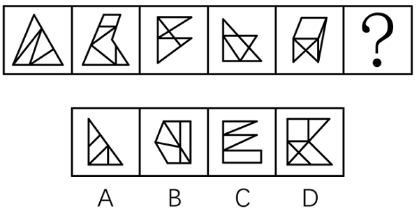
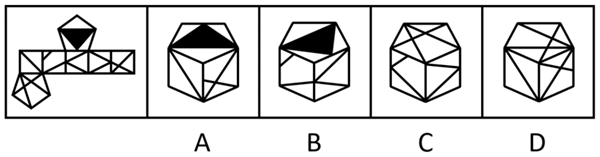
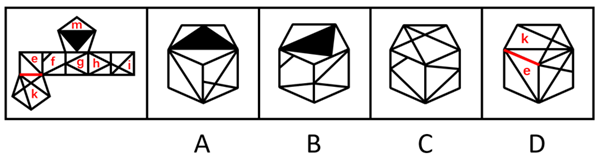

# 2023年度浙江省党政机关选调应届优秀大学毕业生《行测》题（网友回忆版）

> 判断推理 · 15 题 · 浙江 2023

## 第 1 题　qid 5797289 · 类比推理

白雪：雪白

- **A**. 爱心：心爱
- **B**. 金黄：黄金
- **C**. 刷牙：牙刷
- **D**. 名著：著名　✅

**答案**：D

**官方解析**

第一步：判断题干词语间逻辑关系。
白雪是雪白的，二者为属性对应关系。
第二步：判断选项词语间逻辑关系。
A项：爱心与心爱没有明显的逻辑关系，与题干逻辑关系不一致，排除；
B项：黄金是金黄的，二者为属性对应关系，但顺序与题干相反，与题干逻辑关系不一致，排除；
C项：刷牙需要使用牙刷，二者为工具对应关系，与题干逻辑关系不一致，排除；
D项：名著是著名的，二者为属性对应关系，与题干逻辑关系一致，当选。
故正确答案为D。

---

## 第 2 题　qid 5797306 · 类比推理

儿童玩具：益智玩具

- **A**. 航母舰队：潜艇舰队
- **B**. 艺术雕塑：宗教雕塑
- **C**. 女式西装：通勤西装　✅
- **D**. 医用棉签：化妆棉签

**答案**：C

**官方解析**

第一步：判断题干词语间逻辑关系。
有的儿童玩具是益智玩具，有的儿童玩具不是益智玩具，有的益智玩具是儿童玩具，有的益智玩具不是儿童玩具，二者为交叉关系。
第二步：判断选项词语间逻辑关系。
A项：航母舰队和潜艇舰队是两种不同的海上舰队，二者为并列关系，与题干逻辑关系不一致，排除；
B项：艺术雕塑从题材上可以分为纪念性雕塑、城市园林雕塑、宗教雕塑、陈列性雕塑等形式。宗教雕塑属于艺术雕塑，二者为种属关系，与题干逻辑关系不一致，排除；
C项：有的女式西装是通勤西装，有的女式西装不是通勤西装，有的通勤西装是女式西装，有的通勤西装不是女式西装，二者为交叉关系，与题干逻辑关系一致，当选；
D项：医用棉签和化妆棉签是两种不同用途的棉签，二者为并列关系，与题干逻辑关系不一致，排除。
故正确答案为C。

---

## 第 3 题　qid 5797314 · 类比推理

维生素：人体：蛋白质

- **A**. 质子：原子：电子　✅
- **B**. 病人：医院：病房
- **C**. 软件：手机：应用
- **D**. 气囊：汽车：油门

**答案**：A

**官方解析**

第一步：判断题干词语间逻辑关系。
维生素和蛋白质均是人体生存的必要物质，第一词和第三词均与第二词构成必要条件的对应关系。
第二步：判断选项词语间逻辑关系。
A项：质子和电子均是形成原子的必要物质，第一词和第三词均与第二词构成必要条件的对应关系，与题干逻辑关系一致，当选；
B项：病房指病人居住的房间，病房是医院的组成部分，但有的小型的医院（比如社区医院）就没有病房，因此病房不是医院的必要组成部分，与题干逻辑关系不一致，排除；
C项：软件和应用均为手机的组成部分，第一词和第三词均与第二词构成组成关系，但软件不是手机的必要组成部分，如非智能手机中不需要手机软件，与题干逻辑关系不一致，排除；
D项：气囊和油门均为汽车的组成部分，第一词和第三词均与第二词构成组成关系，但气囊不是汽车的必要组成部分，与题干逻辑关系不一致，排除。
故正确答案为A。

---

## 第 4 题　qid 5797315 · 类比推理

地震：山体滑坡：交通堵塞

- **A**. 政策支持：求贤若渴：人才引进
- **B**. 酒后驾车：交通事故：人员伤亡　✅
- **C**. 自助洗车：技术革新：经济发展
- **D**. 免费食品：人满为患：管理不当

**答案**：B

**官方解析**

第一步：判断题干词语间逻辑关系。
地震会导致山体滑坡，山体滑坡会导致交通堵塞，三者构成因果对应关系。
第二步：判断选项词语间逻辑关系。
A项：求贤若渴指慕求贤才，有如口渴急于饮水，因为求贤若渴所以进行人才引进，二者构成因果对应关系；人才引进的时候需要政策支持，二者构成对应关系，与题干逻辑关系不一致，排除；
B项：酒后驾车会导致交通事故，交通事故会导致人员伤亡，三者构成因果对应关系，与题干逻辑关系一致，当选；
C项：自助洗车是一种技术革新，二者构成种属关系；技术革新会带来经济发展，二者构成对应关系，与题干逻辑关系不一致，排除；
D项：免费食品会吸引顾客从而导致人满为患，管理不当也会导致人满为患，第一个词和第三个词均与第二个词构成因果对应关系，与题干逻辑关系不一致，排除。
故正确答案为B。

---

## 第 5 题　qid 5797357 · 类比推理

（    ）对于 保险 相当于 航天飞机 对于 (    )

- **A**. 银行  空间站
- **B**. 股票  燃料
- **C**. 医保  航天器　✅
- **D**. 理财  卫星

**答案**：C

**官方解析**

逐一代入选项。
A项：银行是保险公司销售保险产品的一种渠道，二者构成对应关系；航天飞机是指能单独进行航天活动，也能往返于地面和空间站之间运送人员或物资、设备的航天器，空间站是一种在近地轨道长时间运行、可供多名航天员巡访、长期工作和生活的载人航天器，二者都是航天器，构成并列关系，前后逻辑关系不一致，排除；
B项：股票和保险无明显逻辑关系；航天飞机需要使用燃料，二者构成对应关系，前后逻辑关系不一致，排除；
C项：医保是一种保险，二者构成种属关系；航天飞机是一种航天器，二者构成种属关系，前后逻辑关系一致，当选；
D项：通过保险可以进行理财，二者构成方式目的的对应关系；卫星是指在围绕一颗行星轨道并按闭合轨道做周期性运行的天然天体，人造卫星一般亦可称为卫星，其可以搭载航天飞机发射到太空，二者不构成方式目的的对应关系，前后逻辑关系不一致，排除。
故正确答案为C。

---

## 第 6 题　qid 5797381 · 图形推理

从所给的四个选项中，选择最合适的一个填入问号处，使之呈现一定的规律性：

- **A**. A
- **B**. B
- **C**. C
- **D**. D　✅

**答案**：D

**官方解析**

元素组成不同，且无明显属性规律，考虑数量规律。观察发现，题干每幅图都存在直线相交且出现明显的直角，优先考虑数直角数。题干图形直角数分别为1、2、3、4、5，故？处图形的直角数应为6，只有D项符合。
故正确答案为D。

---

## 第 7 题　qid 5797404 · 图形推理

从所给的四个选项中，选择最合适的一个填入问号处，使之呈现一定的规律性：

- **A**. A
- **B**. B
- **C**. C　✅
- **D**. D

**答案**：C

**官方解析**

元素组成不同，且无明显属性规律，考虑数量规律。观察发现，题干图形封闭面较多，可优先考虑面数量，但整体数面无规律。继续观察发现，题干图形存在多个封闭面相交，均为“多圆相切”的变形图，考虑笔画数，题干图形均为一笔画图形，故？处应选择一个一笔画图形，只有C项符合。
故正确答案为C。

---

## 第 8 题　qid 5797387 · 图形推理

从所给的四个选项中，选择最合适的一个填入问号处，使之呈现一定的规律性：

- **A**. A　✅
- **B**. B
- **C**. C
- **D**. D

**答案**：A

**官方解析**

元素组成相同，优先考虑位置规律。题干图形中黑球较多，单独看不易发现规律，考虑相邻比较。观察发现，从图一至图五，前一幅图中每行的黑球均整体向上平移一行（循环走），平移到第一行时均再向左平移一格（循环走），即可得到后一幅图。故？处图形应符合上述规律，如下图所示，只有A项符合。

故正确答案为A。

---

## 第 9 题　qid 5797408 · 图形推理

把下面的六个图形分为两类，使每一类都有各自的共同特征或规律，分类正确的一项是：

- **A**. ①②③，④⑤⑥
- **B**. ①③⑤，②④⑥
- **C**. ①②⑥，③④⑤
- **D**. ①③⑥，②④⑤　✅

**答案**：D

**官方解析**

本题为分组分类题目。元素组成不同，优先考虑属性规律。观察发现，题干出现多个“等腰”图形，考虑对称性。图①③⑥均为既轴对称又中心对称图形，图②④⑤均为轴对称图形。即图①③⑥为一组，图②④⑤为一组。
故正确答案为D。

---

## 第 10 题　qid 5797484 · 图形推理

左边给定的是多面体的外表面展开图，右边哪一项能由它折叠而成?

- **A**. A
- **B**. B　✅
- **C**. C
- **D**. D

**答案**：B

**官方解析**

将原展开图标上序号，如下图所示，逐一进行分析。

A项：选项由面e、面i和面m构成，展开图中面e和面i的公共边为展开图左右两端的两条边，且公共边挨着面i中较大的三角形，而选项中面e和面i的公共边没有挨着面i中较大的三角形，选项与题干展开图不一致，排除；

B项：选项由面f、面g和面m构成，选项与题干展开图一致，当选；

C项：选项中左侧面为无中生有面，选项与题干展开图不一致，排除；

D项：选项由面e、面i和面k构成，展开图中面e和面k的公共边挨着面k中的等腰三角形，而选项中面e与面k的公共边没有挨着面k中的等腰三角形，选项与题干展开图不一致，排除。

故正确答案为B。

---

## 第 11 题　qid 5797450 · 逻辑判断

妈妈对小明说：“除非你好好学习，否则你考不上理想的大学。”小明说：“那我好好学习，一定能考上北大。”
下列选项中所犯逻辑错误与上述推理最为相似的是:

- **A**. 总管：“如果你继续玩忽职守，你就等着被辞退吧。”小王：“小李每天摸鱼，为什么没被辞退？”
- **B**. 爸爸：“你只有勤于动笔，日积月累，才能写出好的文章。”小红：“太好了，我每天写随笔，就能写出好文章来啦。”　✅
- **C**. 小赵：“面对机遇，要有勇于面对的勇气，否则机会就会溜走。”小张：“只有勇气还不够，还需要前期做好充足的准备。”
- **D**. 赵大妈：“社区新建的广场真不错，空间大，设备多。”李大爷：“是啊，没有党的好政策，我们也过不上这么好的生活。”

**答案**：B

**官方解析**

第一步：分析题干。

题干两人的对话可以翻译为：

妈妈：考上理想的大学好好学习；

小明：好好学习考上北大（考上理想的大学）。

小明所犯的逻辑错误为：肯后推肯前。

第二步：逐一分析选项。

A项：翻译为：总管：继续玩忽职守被辞退；小王：每天摸鱼（每天玩忽职守） 且 被辞退，小王的回答与总管的话是矛盾关系，与题干所犯的逻辑错误不同，排除；

B项：翻译为：爸爸：写出好文章勤于动笔；小红：每天写随笔（勤于动笔）写出好文章，小红所犯的逻辑错误为：肯后推肯前，与题干所犯的逻辑错误相同，当选；

C项：翻译为：小赵：机会溜走有面对机遇的勇气；小张：有面对机遇的勇气 且 前期做好充足的准备，小张的回答只涉及肯后，未涉及肯前，与题干所犯的逻辑错误不同，排除；

D项：翻译为：赵大妈：社区广场空间大 且 设备多；李大爷：党的好政策过上好生活，李大爷的回答不是肯后推肯前，与题干所犯的逻辑错误不同，排除。

故正确答案为B。

---

## 第 12 题　qid 5797430 · 逻辑判断

甲、乙、丙3人去看画展，看到一幅画。甲说：“这不是莫奈画的，也不是梵高画的。”乙说：“这不是莫奈画的，而是达芬奇画的。”丙说：“这不是达芬奇画的，而是莫奈画的。”画展管理员说：“三人中，一个人的判断都对；一个人的判断都错；一个人的判断一对一错。”由此可知：

- **A**. 这幅画是莫奈画的　✅
- **B**. 这幅画是梵高画的
- **C**. 这幅画是达芬奇画的
- **D**. 不是上述三位画家画的

**答案**：A

**官方解析**

第一步：分析题干条件。

（1）甲：莫奈，梵高；

（2）乙：莫奈，达芬奇；

（3）丙：达芬奇，莫奈；

（4）一个人的判断都对；一个人的判断都错；一个人的判断一对一错。

第二步：根据题干条件进行推理。

代入A项：若这幅画是莫奈画的，则甲一对一错，乙全错，丙全对，符合要求，当选；

代入B项：若这幅画是梵高画的，则甲、乙、丙均为一对一错，与条件（4）矛盾，排除；

代入C项：若这幅画是达芬奇画的，则甲和乙均为全对，丙全错，与条件（4）矛盾，排除；

代入D项：若不是上述三位画家画的，则甲全对，乙和丙均为一对一错，与条件（4）矛盾，排除。

故正确答案为A。

---

## 第 13 题　qid 5797458 · 逻辑判断

营养协会发布的膳食指南告诉我们，减肥需要成年人减少从食物和饮料中获得的热量，并通过体育活动消耗更多热量。这种体重管理方法是基于具有百年历史的“能量平衡模型”，该模型指出，体重增加是由于摄入的能量多于消耗的能量。因此，暴饮暴食正在推动肥胖症的流行。
以下哪项如果为真，最能质疑上述观点?

- **A**. 低碳饮食的减肥效果比低脂饮食明显
- **B**. 部分青少年每天摄入1000卡路里的食物，是因为生长突增导致饥饿和暴饮暴食
- **C**. 几十年来公共卫生信息鼓励人们少吃多运动，但肥胖和肥胖相关疾病的发病率却稳步上升
- **D**. 多碳水化合物的现代饮食结构从根本上改变我们的新陈代谢，导致脂肪储存、体重增加和肥胖　✅

**答案**：D

**官方解析**

第一步：找出论点和论据。
论点：暴饮暴食正在推动肥胖症的流行。
论据：体重增加是由于摄入的能量多于消耗的能量。
本题论点和论据均在讨论肥胖与食物摄入量的关系，论点论据话题一致，削弱优先考虑削弱论点，且论点存在因果关系，可以考虑因果倒置和他因削弱。
第二步：逐一分析选项。
A项：该项说的是低碳饮食的减肥效果比低脂饮食明显，而论点说的是暴饮暴食是肥胖的原因，话题不一致，无法削弱，排除；
B项：该项说的是部分青少年因为生长突增导致饥饿和暴饮暴食，但没有明确是否会导致肥胖，不明确选项，无法削弱，排除；
C项：该项说的是即便鼓励人们少吃多运动，但肥胖和肥胖相关疾病的发病率却稳步上升，而论点说的是暴饮暴食是肥胖的原因，话题不一致，无法削弱，排除；
D项：论点说“暴饮暴食”推动肥胖症流行，选项说“多碳水的饮食结构”导致了肥胖，即是“多碳水”推动了肥胖症流行，直接否定了题干论点，可以削弱，当选。
故正确答案为D。

---

## 第 14 题　qid 5797433 · 逻辑判断

某城市为解决市中心乱停车的问题，出台了提高市中心公共车位停车费的政策，以此“赶”长期占用市中心公共车位的私家车，让真正有停车需求的市民能把车停进公共车位，不再乱停车。政策推出一个月后，市中心乱停车的问题并未得到缓解，反而更加严重了。
以下哪项如果为真，最能解释上述现象？

- **A**. 该市的机动车保有量和停车位数量和去年同期基本持平
- **B**. 该市近期利用市中心的闲置地块修建了多处临时停车场
- **C**. 停车费升幅较大，市民宁愿乱停车也不愿意停在公共车位　✅
- **D**. 市中心公共车位数量过少，无法满足全市市民的停车需求

**答案**：C

**官方解析**

第一步：找出题干矛盾。
某城市出台了提高市中心公共车位停车费的政策，政策推出一个月后，市中心乱停车的问题并未得到缓解，反而更加严重了。
第二步：逐一分析选项。
A项：该项说明机动车保有量和停车位数量与去年相比基本没有变化，但是不能解释为什么该市出台政策后乱停车的问题反而更加严重了，不能解释题干矛盾，排除；
B项：该项说明停车场变多了，但是不能解释为什么该市出台政策后乱停车的问题反而更加严重了，不能解释题干矛盾，排除；
C项：该项指出正是因为停车费的升幅较大，所以市民宁愿乱停车也不愿意停在公共车位，可以解释为什么该市出台政策后乱停车的问题反而更加严重了，可以解释题干矛盾，当选；
D项：该项指出市民乱停车的原因是公共车位较少，但是不能解释为什么该市出台政策后乱停车的问题反而更加严重了，不能解释题干矛盾，排除。
故正确答案为C。

---

## 第 15 题　qid 5797468 · 逻辑判断

小刘发现袋子里的米有一部分已经发霉，打算放在通风处晾晒一下继续煮食，小李急忙制止：“已经霉变的大米不能再吃了，否则会严重危害健康！”小刘笑着回应道：“没事，这些米只要晾一晾、晒一晒，就变得跟新米一样了。”
以下哪项如果为真，最能说服小刘？

- **A**. 经过阳光曝晒的大米会逐渐流失水分，影响食用口感
- **B**. 刚刚变质的大米，及时摊晾、通风、加盐淘洗后可以食用
- **C**. 霉变后的大米会滋生毒性极强的黄曲霉素，食用后会致癌
- **D**. 发霉大米中的霉菌毒素耐高温，晾晒和烹饪均不能将其裂解　✅

**答案**：D

**官方解析**

第一步：找出论点和论据。
论点：已经霉变的大米只要晾一晾、晒一晒，就变得跟新米一样了，不会严重危害健康。
论据：无。
本题提问方式为“说服”小刘，即对小刘的观点进行削弱，故小刘的观点为论点，前面小李的话与小刘的观点相反，且本题只有论点，没有论据，削弱优先考虑否定论点，即霉变的大米经过晾晒也无法变成新米，也会严重危害健康。
第二步：逐一分析选项。
A项：讨论的是经过阳光曝晒的大米会流失水分，影响食用口感，而题干讨论的是霉变后经过晾晒的大米是否会影响健康，为无关项，无法削弱，排除；
B项：讨论的是“刚刚变质的大米”，而题干讨论的是“已经霉变的大米”，主体不一致，且该项只是说可以食用，并未提及是否会影响健康，无法削弱，排除；
C项：讨论的是霉变后的大米食用后会致癌，但并未明确说明这些大米经过晾晒后是否仍会影响健康，为不明确项，无法削弱，排除；
D项：直接指出发霉大米中的霉菌毒素耐高温，晾晒和烹饪均不能将其裂解，说明发霉的大米即使经过晾晒也会影响健康，削弱论点，可以削弱，当选。
故正确答案为D。

---
