# 2023年江苏省公务员录用考试《行测》题（A类）（网友回忆版）

> 判断推理 · 50 题 · 江苏 2023

## 材料 1

赵、钱、孙、李、周、吴和郑获得某职业技能大赛的前七名，7名选手有男有女，没有并列名次。已知：

（1）赵是第六名，郑的名次在孙之前；

（2）男选手的排名不相邻；

（3）吴的名次在钱和李之前，排名在吴之前的选手中有两名男性。

### 第 1 题　qid 5697990 · 类比推理

根据以上陈述，下列选手名次不可能相邻的是（    ）。

- **A**. 孙和吴
- **B**. 吴和郑　✅
- **C**. 吴和李
- **D**. 周和吴

**答案**：B

**官方解析**

第一步：分析题干条件。

（1）赵是第六名，郑的名次在孙之前；

（2）男选手的排名不相邻；

（3）吴的名次在钱和李之前，排名在吴之前的选手中有两名男性。

第二步：根据题干条件分析选项。

根据条件（1）和（3）可知，赵是第六名，吴是第三名或第四名，再根据条件（2）可知，吴前面要至少有三个人才能保证男选手不相邻，那么吴只能是第四名，此时钱和李是第五名或第七名（如下图所示），此时第一到三名为郑、周、孙，但无法判断具体名次。

代入A项，如果孙和吴相邻，根据已知信息可知，孙是第三名，郑和周在前两名，具体名次无法确定，所有排名情况均符合题干条件（如下图所示），即孙和吴可以相邻，排除；

代入B项，如果吴和郑相邻，根据已知信息可知，郑只能是第三名，孙在前两名，即郑的名次在孙之后，与条件（1）矛盾，即吴和郑不能相邻，当选；

代入C项，如果吴和李相邻，根据已知信息可知，李是第五名，钱是第七名，郑、周、孙在前三名，具体名次无法确定，所有排名情况均符合题干条件（如下图所示），即吴和李可以相邻，排除；

代入D项，如果周和吴相邻，根据已知信息可知，周是第三名，再根据条件（1）和（3）可知，郑是第一名，孙是第二名，钱和李是第五名或第七名，具体名次无法确定，两种排名情况均符合题干条件（如下图所示），即周和吴可以相邻，排除。

本题为选非题，故正确答案为B。

---

### 第 2 题　qid 5697995 · 类比推理

如果周是第三名，以下哪位选手一定是女性？

- **A**. 赵
- **B**. 钱
- **C**. 孙　✅
- **D**. 李

**答案**：C

**官方解析**

第一步：分析题干条件。

（1）赵是第六名，郑的名次在孙之前；

（2）男选手的排名不相邻；

（3）吴的名次在钱和李之前，排名在吴之前的选手中有两名男性；

（4）周是第三名。

第二步：根据题干条件分析选项。

根据条件（1）和（4）可知，周是第三名，赵是第六名。根据条件（3）可知，吴只能是第四名，钱和李是第五名或第七名，具体名次无法确定。根据条件（1）可知，郑是第一名，孙是第二名。再根据条件（2）和（3）可知，郑和周为男选手，孙和吴为女选手，其他人的性别无法确定（如下图所示）。

故正确答案为C。

---

## 材料 2

某餐馆菜单上有芹菜肉丝、清蒸鲈鱼、毛豆仔鸡、糖醋排骨4道菜。甲、乙、丙、丁各点了其中的2道，没有一道菜四人都点，也没有一道菜四人都不点。已知：

（1）只有甲点清蒸鲈鱼，丁才点芹菜肉丝；

（2）如果丙点清蒸鲈鱼，则乙和丁也点清蒸鲈鱼；

（3）如果乙在芹菜肉丝和清蒸鲈鱼中至少点一道，则乙也点毛豆仔鸡；

（4）如果丙在芹菜肉丝和毛豆仔鸡中至少点一道，则丙也点清蒸鲈鱼。

### 第 3 题　qid 5699263 · 逻辑判断

根据以上陈述，可以推出以下哪项？

- **A**. 甲在芹菜肉丝和毛豆仔鸡中至少点一道　✅
- **B**. 乙在芹菜肉丝和糖醋排骨中至少点一道
- **C**. 丙在毛豆仔鸡和糖醋排骨中至少点一道
- **D**. 丁在芹菜肉丝和毛豆仔鸡中至少点一道

**答案**：A

**官方解析**

第一步：分析题干条件。

（1）丁（芹菜肉丝）甲（清蒸鲈鱼）；

（2）丙（清蒸鲈鱼）乙和丁（清蒸鲈鱼）；

（3）乙（芹菜肉丝 或 清蒸鲈鱼）乙（毛豆仔鸡）；

（4）丙（芹菜肉丝 或 毛豆仔鸡）丙（清蒸鲈鱼）；

（5）甲、乙、丙、丁各点了其中的2道菜；

（6）没有一道菜四人都点，也没有一道菜四人都不点。

第二步：根据题干条件进行推理。

根据条件（4）可知，丙点芹菜肉丝或毛豆仔鸡，可以推出丙点清蒸鲈鱼，但如果丙不点芹菜肉丝也不点毛豆仔鸡，那么根据条件（5），可以推出丙点清蒸鲈鱼和糖醋排骨；

综合上述两种情况，可以推出丙一定要点清蒸鲈鱼。

根据丙点清蒸鲈鱼以及条件（2），可以推出乙和丁点清蒸鲈鱼；

此时已经有3人点清蒸鲈鱼了，根据条件（6），可以推出甲不点清蒸鲈鱼，那么甲只能在芹菜肉丝、毛豆仔鸡、糖醋排骨三道菜里面点两道菜，可以推出A项一定成立，当选。

故正确答案为A。

---

### 第 4 题　qid 5699266 · 逻辑判断

如果任意两人点的菜都不完全相同，则可以推出以下哪项？

- **A**. 甲点芹菜肉丝和毛豆仔鸡
- **B**. 乙点毛豆仔鸡和糖醋排骨
- **C**. 丙点清蒸鲈鱼和芹菜肉丝　✅
- **D**. 丁点糖醋排骨和毛豆仔鸡

**答案**：C

**官方解析**

第一步：分析题干条件。

（1）丁（芹菜肉丝）甲（清蒸鲈鱼）；

（2）丙（清蒸鲈鱼）乙和丁（清蒸鲈鱼）；

（3）乙（芹菜肉丝 或 清蒸鲈鱼）乙（毛豆仔鸡）；

（4）丙（芹菜肉丝 或 毛豆仔鸡）丙（清蒸鲈鱼）；

（5）甲、乙、丙、丁各点了其中的2道；

（6）没有一道菜四人都点，也没有一道菜四人都不点；

（7）任意两人点的菜都不完全相同。

第二步：根据题干条件进行推理。

根据上题的结论可知，丙点清蒸鲈鱼，乙和丁点清蒸鲈鱼，甲不点清蒸鲈鱼。

根据乙点清蒸鲈鱼以及条件（3），可以推出乙点毛豆仔鸡；

根据甲不点清蒸鲈鱼以及条件（1），可以推出丁不点芹菜肉丝；

根据上述推理可知乙点清蒸鲈鱼和毛豆仔鸡，为了满足条件（7），要想和乙点的菜不同，丁不能点毛豆仔鸡，只能点糖醋排骨，即丁点清蒸鲈鱼和糖醋排骨；

为了满足条件（7），要想和乙、丁点的菜不同，丙不能点毛豆仔鸡和糖醋排骨，只能点芹菜肉丝，即丙点清蒸鲈鱼和芹菜肉丝，对应C项。

根据上述推理（如下图所示），甲在芹菜肉丝、毛豆仔鸡、糖醋排骨三道菜里面点两道菜均可满足条件（7）。

故正确答案为C。

---

### 第 5 题　qid 5755688 · 类比推理

宇宙：元宇宙

- **A**. 闺女：亲闺女
- **B**. 消息：假消息
- **C**. 计算：云计算
- **D**. 化石：活化石　✅

**答案**：D

**官方解析**

第一步：判断题干词语间逻辑关系。
元宇宙指人类运用数字技术构建的虚拟世界，元宇宙不是真正的宇宙，且“元宇宙”是从“宇宙”这个词衍生出来的虚拟科技词汇，二者是对应关系。
第二步：判断选项词语间逻辑关系。
A项：闺女可指女儿或年老者对女性表示慈爱的称呼，闺女的含义包括亲闺女，二者是包含关系，与题干逻辑关系不一致，排除；
B项：假消息是一种消息，二者是种属关系，与题干逻辑关系不一致，排除；
C项：云计算是计算的一种，二者是种属关系，与题干逻辑关系不一致，排除；
D项：活化石又称遗迹生物，是指相似物种只存在于化石中，而没有其他现存的相似物种的任何生物。活化石不是真正的化石，且“活化石”是从“化石”这个词衍生出来的词汇，与题干逻辑关系一致，当选。
故正确答案为D。

---

### 第 6 题　qid 5755672 · 类比推理

挑战：应战

- **A**. 报考：录取　✅
- **B**. 观察：评估
- **C**. 抚养：扶养
- **D**. 超速：限速

**答案**：A

**官方解析**

第一步：判断题干词语间逻辑关系。
先挑战，再应战，二者是动作先后顺序的对应关系，且发出这两个动作的主体不同。
第二步：判断选项词语间逻辑关系。
A项：先报考，再录取，二者是动作先后顺序的对应关系，且发出这两个动作的主体不同，与题干逻辑关系一致，当选；
B项：先观察，再评估，二者是动作先后顺序的对应关系，但观察和评估的主体相同，与题干逻辑关系不一致，排除；
C项：抚养主要指父母、祖父母、外祖父母等长辈对子女、孙子女、外孙子女等晚辈的抚育、教养，而扶养指的是对社会关系中的“弱者”所发生的经济供养和生活扶助，二者无明显逻辑关系，与题干逻辑关系不一致，排除；
D项：限速是为了预防车辆超速，二者不是动作先后顺序的对应关系，与题干逻辑关系不一致，排除。
故正确答案为A。

---

### 第 7 题　qid 5755674 · 类比推理

布衣：百姓

- **A**. 鸿雁：书信
- **B**. 枢纽：关键
- **C**. 须眉：男子
- **D**. 巾帼：女子　✅

**答案**：D

**官方解析**

第一步：判断题干词语间逻辑关系。
布衣指粗布衣服，借指平民百姓，二者构成比喻象征义。
第二步：判断选项词语间逻辑关系。
A项：鸿雁代指书信，二者构成比喻象征义，与题干逻辑关系一致，保留；
B项：枢纽比喻事物的关键，二者构成比喻象征义，与题干逻辑关系一致，保留；
C项：古时男子以胡须眉毛稠秀为美，故以须眉代指男子，二者构成比喻象征义，与题干逻辑关系一致，保留；
D项：巾帼是古代妇女戴的头巾和发饰，代指女子，二者构成比喻象征义，与题干逻辑关系一致，保留。
对比四个选项，题干中的“布衣”和D项中的“巾帼”都属于服饰，故D项和题干逻辑关系更为相似，当选。
故正确答案为D。

---

### 第 8 题　qid 5697831 · 类比推理

南极洲：企鹅：北极熊

- **A**. 空间站：种子：宇航员
- **B**. 水浒传：李逵：沙和尚　✅
- **C**. 大数据：算法：字符串
- **D**. 地雷战：工事：指战员

**答案**：B

**官方解析**

第一步：判断题干词语间逻辑关系。
企鹅和北极熊是两种不同的动物，二者为并列关系，企鹅生活在南极洲，但北极熊不是生活在南极洲的动物。
第二步：判断选项词语间逻辑关系。
A项：宇航员将种子带进空间站，种子和宇航员不是并列关系，与题干逻辑关系不一致，排除；
B项：李逵和沙和尚均是书籍中的人物，二者为并列关系，李逵是《水浒传》中的人物，但沙和尚不是《水浒传》中的人物，与题干逻辑关系一致，当选；
C项：算法指解决问题的有限运算序列，而字符串指编程语言中表示文本的数据类型，算法与字符串不是并列关系，与题干逻辑关系不一致，排除；
D项：工事指保障军队发扬火力和隐蔽安全的建筑物，工事和指战员是地雷战中涉及到的建筑物和人物，二者不是并列关系，与题干逻辑关系不一致，排除。
故正确答案为B。

---

### 第 9 题　qid 5755676 · 类比推理

友善：诚信：价值观

- **A**. 存量：增量：资产总量
- **B**. 作揖：握手：行礼方式　✅
- **C**. 机场：车站：交通枢纽
- **D**. 军舰：军机：舰载飞机

**答案**：B

**官方解析**

第一步：判断题干词语间逻辑关系。
友善和诚信都是价值观的一种，二者为并列关系，且均与价值观构成种属关系。
第二步：判断选项词语间逻辑关系。
A项：存量是指系统在某一时点时的所保有的数量，增量是指在某一段时间内系统中保有数量的变化，存量和增量均不是资产总量的一种，与题干逻辑关系不一致，排除；
B项：作揖和握手都是行礼方式的一种，二者为并列关系，且均与行礼方式构成种属关系，与题干逻辑关系一致，当选；
C项：交通枢纽是指一种或多种运输方式的交通干线相互交叉与衔接之处，以及为共同办理旅客与货物中转、发送、到达而兴建的多种运输设施的综合体，车站分为火车站、汽车站、公交车站等，有些单向且小型的公交车站不是交通枢纽，二者不是种属关系，与题干逻辑关系不一致，排除；
D项：军舰是指在海上执行战斗任务的船舶，军机是直接参加战斗、保障战斗行动和军事训练的飞机的总称，二者为并列关系，舰载飞机是以航空母舰或其他军舰为基地的海军飞机，是航空母舰的主要作战工具，舰载飞机是军机的一种，二者为种属关系，与题干逻辑关系不一致，排除。
故正确答案为B。

---

### 第 10 题　qid 5755677 · 类比推理

登高：重阳：山坡

- **A**. 赏菊：秋日：蓝天
- **B**. 跳舞：冬日：篝火
- **C**. 纳凉：夏日：庭院　✅
- **D**. 踏青：春日：细雨

**答案**：C

**官方解析**

第一步：判断题干词语间逻辑关系。
可以造句为：重阳在山坡上登高。其中登高是行为，重阳是时间，山坡是登高的地点，三者构成行为、时间和地点的对应关系。
第二步：判断选项词语间逻辑关系。
A项：可以造句为：秋日在蓝天下赏菊。其中赏菊是行为，秋日是时间，但蓝天不是赏菊的地点，与题干逻辑关系不一致，排除；
B项：可以造句为：冬日在篝火旁跳舞。其中跳舞是行为，冬日是时间，但篝火是事物，而非地点，与题干逻辑关系不一致，排除；
C项：可以造句为：夏日在庭院中纳凉。其中纳凉是行为，夏日是时间，庭院是纳凉的地点，三者构成行为、时间和地点的对应关系，与题干逻辑关系一致，当选；
D项：可以造句为：春日在细雨中踏青。其中踏青是行为，春日是时间，但细雨是天气，而非地点，与题干逻辑关系不一致，排除。
故正确答案为C。

---

### 第 11 题　qid 5755682 · 类比推理

畅销书：精装书：电子书

- **A**. 预选赛：选拔赛：友谊赛
- **B**. 自由诗：叙事诗：抒情诗　✅
- **C**. 显微镜：放大镜：望远镜
- **D**. 特效药：中成药：口服药

**答案**：B

**官方解析**

第一步：判断题干词语间逻辑关系。
有的畅销书是精装书，有的畅销书不是精装书，有的精装书是畅销书，有的精装书不是畅销书，前两词为交叉关系。精装书指装订精致的书，和电子书为反对关系。
第二步：判断选项词语间逻辑关系。
A项：预选赛是指为了进入大赛而在某个区域进行的选拔赛，前两词为种属关系，与题干逻辑关系不一致，排除；
B项：自由诗是没有规则的音节、韵律及其他正规设计的诗。有的自由诗是叙事诗，有的自由诗不是叙事诗，有的叙事诗是自由诗，有的叙事诗不是自由诗，前两词为交叉关系。诗歌按内容分为抒情诗、叙事诗、说理诗，因此叙事诗和抒情诗为反对关系，与题干逻辑关系一致，当选；
C项：显微镜、放大镜、望远镜是三种不同的光学器具，为并列关系，与题干逻辑关系不一致，排除；
D项：特效药是从药物疗效角度对药物进行的划分，中成药是从原材料角度对药物进行的划分，口服药是从用药方式的角度对药物进行的划分，三者互为交叉关系，与题干逻辑关系不一致，排除。
故正确答案为B。

---

### 第 12 题　qid 5697862 · 类比推理

蜘蛛 之于 （    ） 相当于 （    ） 之于 能力

- **A**. 螃蟹；才干
- **B**. 蛛网；成功
- **C**. 动物；仁义
- **D**. 蛛丝；人才　✅

**答案**：D

**官方解析**

逐一代入选项。
A项：蜘蛛和螃蟹是两种不同的动物，二者为并列关系；才干指才能、办事的能力，能力指能胜任某项工作或事务的主观条件，二者为近义关系，前后逻辑关系不一致，排除；
B项：蛛网是蜘蛛所织成的丝网，二者为动物和产物的对应关系；拥有能力是成功的条件之一，二者为条件的对应关系，前后逻辑关系不一致，排除；
C项：蜘蛛是动物，二者为种属关系；仁义指仁爱和正义，与能力无明显逻辑关系，前后逻辑关系不一致，排除；
D项：蜘蛛有蛛丝，二者为对应关系；人才有能力，二者为对应关系，前后逻辑关系一致，当选。
故正确答案为D。

---

### 第 13 题　qid 5755681 · 类比推理

（    ） 之于 句号 相当于 秋千 之于 （    ）

- **A**. 语气 游戏
- **B**. 问号 秋季
- **C**. 句子 绳索　✅
- **D**. 符号 玩具

**答案**：C

**官方解析**

逐一代入选项。
A项：句号用于句子末尾，表示陈述语气，二者为对应关系；秋千是一种游戏用具，二者为工具的对应关系，但句号不是工具，前后逻辑关系不一致，排除；
B项：问号和句号都是标点符号，二者为并列关系；秋千是一种游戏用具，与秋天没有明显逻辑关系，前后逻辑关系不一致，排除；
C项：句号是句子的组成部分，二者为组成关系；绳索是秋千的组成部分，二者为组成关系，前后逻辑关系一致，当选；
D项：句号是标点符号，二者为种属关系；秋千是一种玩具，二者为种属关系，但词语前后顺序相反，前后逻辑关系不一致，排除。
故正确答案为C。

---

### 第 14 题　qid 5697898 · 类比推理

无理数 整数 之于 （    ） 相当于 哲学 历史 之于 （    ）

- **A**. 数据 大学
- **B**. 理科 文科
- **C**. 数学 典籍
- **D**. 实数 学科　✅

**答案**：D

**官方解析**

逐一代入选项。
A项：数据是事实或观察的结果，是对客观事物的逻辑归纳，是用于表示客观事物的未经加工的原始素材，无理数、整数与数据无必然联系，哲学、历史是两个不同的学科门类，大学是实施高等教育的学校，大学可能会开设哲学、历史学科专业，前后逻辑关系不一致，排除；
B项：理科是指形式科学与自然科学的统称，无理数、整数与理科无必然联系，哲学和历史都是文科，哲学、历史与文科均构成种属关系，前后逻辑关系不一致，排除；
C项：数学是研究数量、结构、变化、空间以及信息等概念的一门学科，无理数、整数是数学的研究对象，典籍是记载古今法令制度的重要文献，泛指古代的图书，典籍不是研究哲学、历史，而是记载哲学、历史的相关内容，前后逻辑关系不一致，排除；
D项：无理数和整数都是实数，因此无理数、整数与实数均构成种属关系，哲学、历史都是学科门类，因此哲学、历史与学科均构成种属关系，前后逻辑关系一致，当选。
故正确答案为D。

---

### 第 15 题　qid 5755689 · 图形推理

从所给的四个选项中，选择最合适的一个填入问号处，使之呈现一定的规律性：

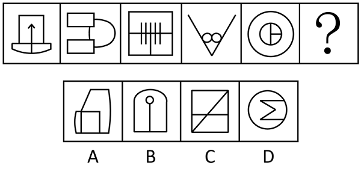

- **A**. A
- **B**. B
- **C**. C
- **D**. D　✅

**答案**：D

**官方解析**

元素组成不同，优先考虑属性规律。观察发现，题干图形均为轴对称图形，排除A、C两项；继续观察发现，图①、图③、图⑤的对称轴均与图形中的一条线重合，图②、图④的对称轴均不与图形中的线条重合，故？处应选择一个对称轴不与图形中的线条重合的图形，只有D项符合。
故正确答案为D。

---

### 第 16 题　qid 5755694 · 图形推理

从所给的四个选项中，选择最合适的一个填入问号处，使之呈现一定的规律性：

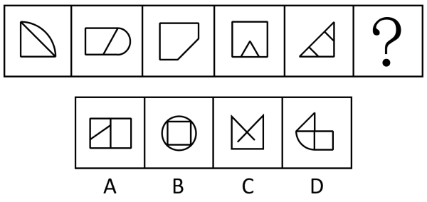

- **A**. A
- **B**. B
- **C**. C　✅
- **D**. D

**答案**：C

**官方解析**

元素组成不同，且无明显属性规律，优先考虑数量规律。观察发现，题干图形出现多个直角，优先考虑直角数，题干图形直角数依次为：1、2、3、4、5、？，故？处图形的直角数应为6。A项的直角数为8，B项的直角数为4，C项的直角数为6，D项的直角数为7，只有C项符合。
故正确答案为C。

---

### 第 17 题　qid 5697852 · 图形推理

请从四个选项中选出最恰当的一项填入问号处，使题干图形呈现一定的规律性。

- **A**. A
- **B**. B
- **C**. C　✅
- **D**. D

**答案**：C

**官方解析**

元素组成不同，且无明显属性规律，考虑数量规律。观察发现，题干图形均分为上下两部分，排除A、D两项；继续观察发现，题干多幅图中存在“田”字变形图，优先考虑笔画数。题干图形均一部分为一笔画，另一部分为两笔画，所以？处图形也应该是一部分为一笔画，另一部分为两笔画，只有C项符合规律。
故正确答案为C。

---

### 第 18 题　qid 5755690 · 图形推理

从所给的四个选项中，选择最合适的一个填入问号处，使之呈现一定的规律性：

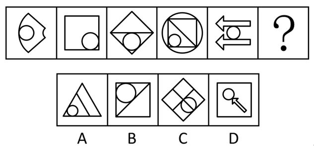

- **A**. A
- **B**. B　✅
- **C**. C
- **D**. D

**答案**：B

**官方解析**

元素组成不同，优先考虑属性规律。观察发现，题干中出现了等腰三角形、箭头等腰元素，优先考虑对称性。题干图形均只有1条对称轴，且对称轴的方向依次顺时针旋转，？处应用此规律，排除A项；继续观察发现，题干出现多个相切图形，切点数无规律，考虑笔画数。题干图形均为一笔画图形，？处应用此规律，只有B项符合。

故正确答案为B。

---

### 第 19 题　qid 5697901 · 图形推理

请从四个选项中选出最恰当的一项填入问号处，使题干图形呈现一定的规律性。

- **A**. A　✅
- **B**. B
- **C**. C
- **D**. D

**答案**：A

**官方解析**

元素组成不同，优先考虑属性规律。观察发现，题干出现全直线图形、全曲线图形，优先考虑曲直性。九宫格优先横行看，第一行依次为全曲线图形、全直线图形、既有曲线又有直线图形；经验证，第二行满足此规律；第三行应用此规律，？处图形应该为既有曲线又有直线图形，只有A项符合规律。
故正确答案为A。

---

### 第 20 题　qid 5755695 · 图形推理

请从所给的四个选项中，选出最恰当的一项填入问号处，使之呈现一定的规律性。

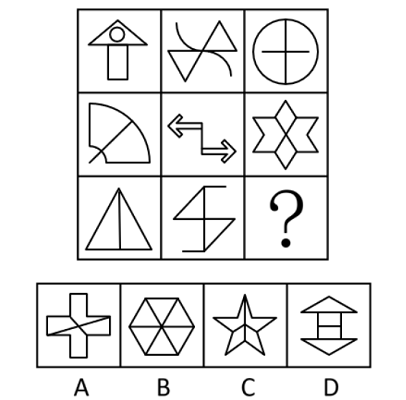

- **A**. A
- **B**. B
- **C**. C
- **D**. D　✅

**答案**：D

**官方解析**

图形元素组成不同，优先考虑属性规律。观察发现，题干出现等腰元素、S变形图等，优先考虑对称性。九宫格优先看横行，第一行中，三幅图依次为轴对称图形、中心对称图形、既轴对称又中心对称图形；经验证，第二行满足此规律；第三行应用此规律，？处应该填入一个既轴对称又中心对称图形，排除A、C两项。继续观察发现，题干中的既轴对称又中心对称图形仅有2条相互垂直的对称轴，只有D项符合。
故正确答案为D。

---

### 第 21 题　qid 5755701 · 图形推理

下边四个图形中，只有一个是由上边的四个图形拼合（只能通过上、下、左、右平移）而成的，请把它找出来。

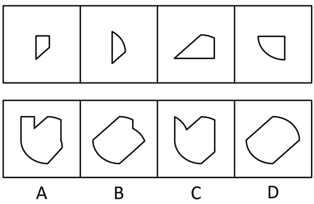

- **A**. A
- **B**. B
- **C**. C
- **D**. D　✅

**答案**：D

**官方解析**

本题考查平面拼合，可采用平行且等长相消的方式解题。消去平行且等长的线段后进行组合可得到轮廓图，即为D项。平行且等长相消的方式如下图所示：

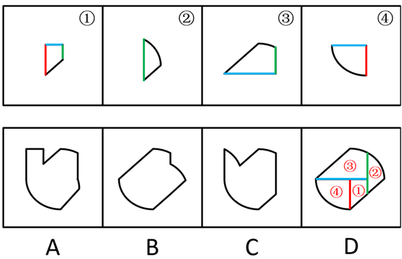

故正确答案为D。

---

### 第 22 题　qid 5755687 · 图形推理

下边四个图形中，只有一个是由上边的四个图形拼合（只能通过上、下、左、右平移）而成的，请把它找出来。

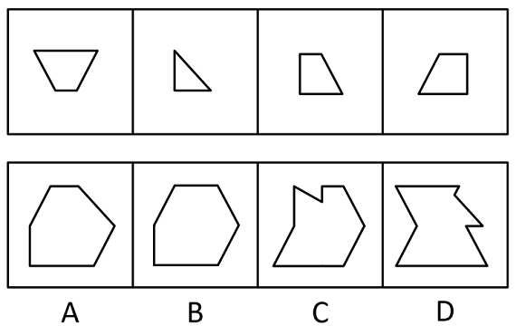

- **A**. A　✅
- **B**. B
- **C**. C
- **D**. D

**答案**：A

**官方解析**

本题考查平面拼合，可采用平行且等长相消的方式解题。消去平行且等长的线段后进行组合即可得到轮廓图，即为A项。平行且等长相消的方式如下图所示：

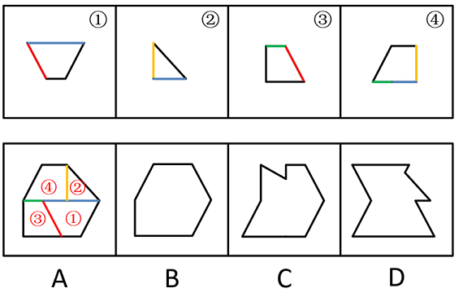

故正确答案为A。

---

### 第 23 题　qid 5697897 · 图形推理

下边四个图形中，只有一个是由上边的四个图形拼合（只能通过上、下、左、右平移）而成的，请把它找出来。

- **A**. A
- **B**. B　✅
- **C**. C
- **D**. D

**答案**：B

**官方解析**

本题考查平面拼合，消去弯曲程度一致且等长的线条后进行拼合，即可得到轮廓图，即为B项。具体拼合方式如下图所示：

故正确答案为B。

---

### 第 24 题　qid 5755699 · 图形推理

从四个选项中选出一项填入问号处，使左边四个图形可以拼合（只能通过上、下、左、右平移）成右边的图形。

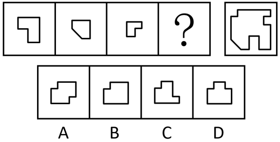

- **A**. A　✅
- **B**. B
- **C**. C
- **D**. D

**答案**：A

**官方解析**

本题考查平面拼合，可采用拆分题干所给图形的方式解题，对应A项。拆分方式如下图所示：

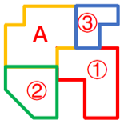

故正确答案为A。

---

### 第 25 题　qid 5755702 · 图形推理

左边四张纸片，都是一面为白色，一面为黑色，在允许平移、旋转和翻转的条件下，可以拼合成多种图形。右边哪项不能由其拼合而成？

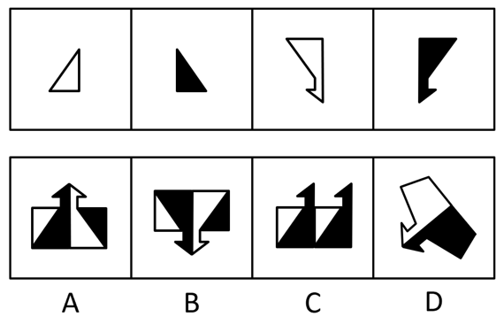

- **A**. A
- **B**. B　✅
- **C**. C
- **D**. D

**答案**：B

**官方解析**

本题考查平面拼合，可以平移、旋转、翻转，且每张纸片一面是黑色，另一面是白色，需要考虑翻转后的颜色变化。将题干图形标上序号如下图所示，逐一进行分析。

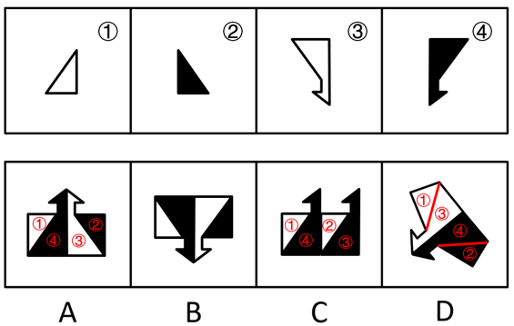

A项：可以由题干图形拼合而成，拼合方式如图所示，排除；

B项：存在多个错误，如果考虑直接平移拼合成选项图形，则四个题干图形颜色均错误；如果考虑翻转后拼合成选项图形，则四个题干图形颜色也均错误，当选；

C项：可以由题干图形拼合而成，拼合方式如图所示，排除；

D项：可以由题干图形拼合而成，拼合方式如图所示，排除。

本题为选非题，故正确答案为B。

---

### 第 26 题　qid 5755692 · 图形推理

左边给定的是一个四面体，右边哪一项可能是它的外表面展开图？

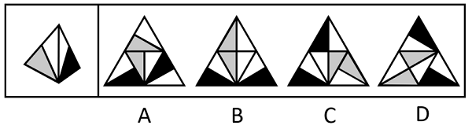

- **A**. A
- **B**. B　✅
- **C**. C
- **D**. D

**答案**：B

**官方解析**

将题干立体图形的两个面标记为e、f，以题干中面e的唯一点（灰色与白色相交的点）为起点顺时针画边，边1挨着面e中的灰色三角形；以题干中面f的唯一点（黑色与白色相交的点）为起点顺时针画边，边1挨着面f中的白色三角形。且面e和面f的公共边为面内白色三角形的斜边，如下图所示，逐一进行分析。

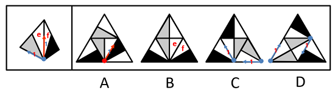

A项：以选项右下角图形的唯一点为起点顺时针画边，边1挨着面内的黑色三角形，故该面为无中生有面。不管哪个面为面e，它和面f的公共边并不都是白色三角形的斜边，选项与题干不一致，排除；

B项：如上图所示，选项与题干一致，当选；

C项：以选项灰色面中的唯一点为起点顺时针画边，边1都挨着面内的白色三角形，故选项中的2个灰色面均为无中生有面，选项与题干不一致，排除；

D项：以选项灰色面中的唯一点为起点顺时针画边，边1都挨着面内的白色三角形，故选项中的2个灰色面均为无中生有面，选项与题干不一致，排除。

故正确答案为B。

---

### 第 27 题　qid 5697878 · 图形推理

左边给定的是一个六面体的外表面展开图，右边哪一项能由它折叠而成？

- **A**. A
- **B**. B　✅
- **C**. C
- **D**. D

**答案**：B

**官方解析**

将展开图标上序号（如下图所示），逐一进行分析。

A项：选项由面e、面f与面i构成，在题干展开图中面f与面e的公共边挨着面e中的两个小正方形（如图所示），而在选项中两个面的公共边挨着面e中的一个长方形，选项与题干展开图不一致，排除；

B项：选项由面f、面h与面i构成，选项与题干展开图一致，当选；

C项：选项由面e、面g与面k构成，在题干展开图中面e中的两个小正方形挨着面f（如图所示），而在选项中面e中的两个小正方形挨着面k，选项与题干展开图不一致，排除；

D项：选项由面g、面i与面k构成，面g和面i是相对面，相对面不能同时在立体图中出现，选项与题干展开图不一致，排除。

故正确答案为B。

---

### 第 28 题　qid 5697913 · 图形推理

某立方体每个面上各有一种不同的图案，下列四个选项中有且仅有一个不是该立方体，请把它找出来。

- **A**. A　✅
- **B**. B
- **C**. C
- **D**. D

**答案**：A

**官方解析**

本题为空间重构题。将四个选项均以三角形面内三角形尖指向的边为起点，进行顺时针画边（如下图所示），逐一进行分析。

A项：此时边2对应十字面；

B项：此时边2对应圆形面；

C项：此时边2对应圆形面；

D项：此时边2对应圆形面。

综上，只有A项与其他三项不同。

本题为选非题，故正确答案为A。

---

### 第 29 题　qid 5697923 · 图形推理

下列四个立方体的外表面展开图，其中一个展开图还原成立方体后，从能同时看到3个面的任一角度看（如），都可以至少看到一个圆，请把它找出来。

- **A**. A　✅
- **B**. B
- **C**. C
- **D**. D

**答案**：A

**官方解析**

立方体共有6个面，两两一组构成3组相对面。当能同时看到3个面时，相对面能且只能出现一个，因此，要保证从能同时看到3个面的任一角度看，都可以至少看到一个圆，需要保证展开图中至少存在一组相对面中均为圆，只有A项符合。
故正确答案为A。

---

### 第 30 题　qid 5697932 · 逻辑判断

欲事立，须是心立。理想信念是中国共产党员精神上的“钙”，一个人理想信念坚定，“骨头”就硬；理想信念缺失或者不坚定，精神上就会“缺钙”，就会得“软骨病”，就容易在考验面前迷失方向。
以下哪项不能由以上陈述推出？

- **A**. 一个人若不想事立，他就无须心立　✅
- **B**. 如果一个人“骨头”不硬，就说明他的理想信念不坚定
- **C**. 一个人理想信念缺失，他就会得“软骨病”
- **D**. 若一个人不容易在考验面前迷失方向，就说明他有坚定的理想信念

**答案**：A

**官方解析**

第一步：翻译题干。

①事立心立；

②理想信念坚定“骨头”硬；

③理想信念缺失 或 理想信念不坚定精神上“缺钙”；

④理想信念缺失 或 理想信念不坚定得“软骨病”；

⑤理想信念缺失 或 理想信念不坚定容易在考验面前迷失方向。

第二步：逐一分析选项。

A项：该项翻译为“事立心立”，是对①的否前，否前得不到确定性结论，无法推出，当选；

B项：该项翻译为“‘骨头’硬理想信念坚定”，是对②的否后，否后必否前，可以推出，排除；

C项：该项翻译为“理想信念缺失得‘软骨病’”，肯定了“或关系”其中一项，是对④的肯前，肯前必肯后，可以推出，排除；

D项：该项翻译为“容易在考验面前迷失方向理想信念坚定”，是对⑤的否后，否后必否前，可以得到“理想信念缺失” 且 “理想信念不坚定”，可以推出，排除。

本题为选非题，故正确答案为A。

---

### 第 31 题　qid 5755691 · 逻辑判断

如今，利用网络检索信息、查阅资料非常方便，大多数人遇到生僻的字词需要检索、查找、求证时，第一选择是上网而不是翻检词典。有网友坦言：尽管《现代汉语词典》伴随自己的学生时代，但在互联网时代，它已经远离了我们的生活。
以下哪项如果为真，最能质疑上述网友的说法？

- **A**. 《现代汉语词典》每隔几年就会推出修订版，收录近期产生的新词语
- **B**. 网上查到的规范的字词解释是以《现代汉语词典》等工具书作为数据库提供的　✅
- **C**. 在网络流行语的冲击下，词语意义和用法的精准解释对国人尤为重要
- **D**. 有些网络提供的字词解释不够准确，检索到的内容很容易出现错误

**答案**：B

**官方解析**

第一步：找出论点和论据。
论点：尽管《现代汉语词典》伴随自己的学生时代，但在互联网时代，它已经远离了我们的生活。
论据：如今，利用网络检索信息、查阅资料非常方便，大多数人遇到生僻的字词需要检索、查找、求证时，第一选择是上网而不是翻检词典。
本题论点和论据都在讨论在互联网时代词典已经远离了人们的生活，二者话题一致，削弱优先考虑削弱论点。
第二步：逐一分析选项。
A项：选项指出《现代汉语词典》每隔几年就会推出修订版，但《现代汉语词典》的修订情况与论点在互联网时代《现代汉语词典》是否已经远离了人们的生活无关，无法削弱，排除；
B项：选项指出网上查到的规范的字词解释是以《现代汉语词典》等工具书作为数据库提供的，说明即使在互联网时代通过网络检索字词所查阅内容的最终来源依旧是《现代汉语词典》，证明《现代汉语词典》并未远离人们的生活，削弱论点，可以削弱，当选；
C项：选项指出在互联网时代词语意义和用法的精准解释对国人尤为重要，与论点在互联网时代《现代汉语词典》是否已经远离了人们的生活无关，无法削弱，排除；
D项：选项指出有些网络提供的字词解释不够准确，说的是网络检索字词存在的问题，但无法判断人们是否会因为这一问题而去使用《现代汉语词典》，无法削弱，排除。
故正确答案为B。

---

### 第 32 题　qid 5697876 · 逻辑判断

某市教育局派出由甲、乙、丙、丁、戊5名优秀教师组成的支教团支援西部。已知：
（1）有3人为青年教师，2人为中年教师；
（2）语文教师有2人，数学教师有3人；
（3）甲与丙同龄，丁与戊年龄相差最大；
（4）乙与戊所教课程相同，丙与丁所教课程不同；
（5）担任组长的是一名中年语文教师。
根据以上陈述，可以推出以下哪项？

- **A**. 甲是组长
- **B**. 乙是组长
- **C**. 丙是组长
- **D**. 丁是组长　✅

**答案**：D

**官方解析**

第一步：分析题干条件。
（1）有3人为青年教师，2人为中年教师；
（2）语文教师有2人，数学教师有3人；
（3）甲与丙同龄，丁与戊年龄相差最大；
（4）乙与戊所教课程相同，丙与丁所教课程不同；
（5）担任组长的是一名中年语文教师。
第二步：根据题干条件进行推理。
根据条件（1）（3）可知，丁和戊中有1人与甲、丙同龄，因此甲和丙一定是青年教师，再根据条件（5）可知，甲和丙不能担任组长，排除A、C两项；再根据条件（2）（4）可知，丙和丁中有1人与乙、戊所教课程相同，因此乙和戊所教课程一定是数学，再根据条件（5）可知，乙和戊不能担任组长，因此，丁是组长，排除B项，D项当选。
故正确答案为D。

---

### 第 33 题　qid 5697910 · 逻辑判断

①死海是淹不死人的。因为②死海海水含盐量很大。据统计，③死海海水中有135亿吨氯化钠，有64亿吨氯化钙，有20亿吨氯化钾······各种盐的质量加在一起占死海全部海水的23%~25%。由于④死海海水的比重超过了人体的比重，以致⑤人到死海里会自然漂起来，沉不下去。

若用“AB”表示陈述B是陈述A的论据，则题干的论证关系应表示为（    ）。

- **A**. 
⑤①②③④

- **B**. 
①⑤③④②

- **C**. 
①⑤④②③
　✅
- **D**. 
⑤①④③②

**答案**：C

**官方解析**

本题提问方式特殊，需要由论据逐步推出论点，需梳理出论证过程。

第一步：先确定论证关系最为明显的陈述。

题干的五个陈述主要围绕死海为什么淹不死人展开。论证关系比较明显的是陈述④和陈述⑤，根据“由于④死海海水的比重超过了人体的比重，以致⑤人到死海里会自然漂起来，沉不下去”，可知陈述④是陈述⑤的直接论据，二者的论证关系应为：⑤④，只有C项符合。

第二步：逐一对照选项并判断正确答案。

根据第一步的结果可以判断只有C项符合，故对C项进行验证。因为③死海海水中有135亿吨氯化钠，有64亿吨氯化钙，有20亿吨氯化钾······各种盐的质量加在一起占死海全部海水的23%~25%，得出②死海海水含盐量很大，再得出④死海海水的比重超过了人体的比重，进而得出⑤人到死海里会自然漂起来，沉不下去，最后得到①死海是淹不死人的，即论证关系表示为：①⑤④②③，C项论证关系成立。

故正确答案为C。

---

### 第 34 题　qid 5755685 · 逻辑判断

近两年，预制菜成为很多餐饮店的新宠，经过洗、切、搭配、烹制等步骤的预制菜，在餐饮店的后厨只需经过简单加工即可上桌。在这样的情形下，使用预制菜的规模化连锁餐饮店遍地开花。有专家据此指出，长此以往许多厨师将面临失业的风险。
以下哪项如果为真，最能支持上述专家的观点？

- **A**. 用餐的客人越来越心急，点完菜恨不得立刻吃上，导致很多需要慢慢烹制的菜都得厨师预先处理
- **B**. 高端的预制菜已经走进了许多家庭之中，人们不需要具备高超的厨艺即可化身大厨，为家人带来一份丰盛的大餐
- **C**. 很多连锁餐饮店开在商场，而商场由于消防要求对明火管控严格，导致这些餐饮店只能使用预制菜
- **D**. 规模化连锁餐饮店使用预制菜，方便快捷，成本比用厨师的中小餐馆要低得多，大多数中小餐馆无力与之竞争　✅

**答案**：D

**官方解析**

第一步：找出论点和论据。
论点：长此以往许多厨师将面临失业的风险。
论据：使用预制菜的规模化连锁餐饮店遍地开花。
本题的论点讨论的是长此以往（使用预制菜）许多厨师将面临失业的风险，论据讨论的是使用预制菜的规模化连锁餐饮店遍地开花，二者话题不一致，加强优先考虑搭桥，即在“使用预制菜的规模化连锁餐饮店”和“厨师面临失业风险”之间建立联系。
第二步：逐一分析选项。
A项：选项讨论的是客人的心急导致很多需要慢慢烹制的菜都得厨师预先处理，与厨师是否将面临失业的风险无关，无法加强，排除；
B项：选项讨论的是高端的预制菜能为家人带来丰盛的大餐，只涉及了“高端的预制菜”，且针对的是在家做菜的情况，没有提及厨师是否将面临失业的风险，无法加强，排除；
C项：选项讨论的是为什么很多连锁餐饮店只能使用预制菜，没有提及厨师是否将面临失业的风险，无法加强，排除；
D项：选项讨论的是规模化连锁餐饮店使用预制菜方便快捷且成本低，证明预制菜比厨师存在很多优势，使用厨师的中小餐馆无力与之竞争，进而导致厨师失业，即在“使用预制菜的规模化连锁餐饮店”和“厨师面临失业风险”之间建立联系，为搭桥项，当选。
故正确答案为D。

---

### 第 35 题　qid 5755696 · 逻辑判断

手机APP为了获得一些读取信息和修改手机设置的权限， 都会提供用户协议并要求使用者同意。然而，据权威调查显示，大部分使用者很少或从没阅读过APP提供的用户协议,也不乐意APP有超出其功能的某些权限，但他们都会点击“我已阅读并同意用户协议”。
以下哪项如果为真，最能解释上述现象？

- **A**. 如果用户不同意手机APP所提供的用户协议，就不能使用这款 APP　✅
- **B**. 通过正规平台下载的APP有平台审核其安全性，不需要下载者进行核查
- **C**. 很多手机APP的用户协议冗长复杂，用户无法在短时间内读完或读懂
- **D**. 对于某些APP来说，用户在使用过程中还能重新设定它获取的各种权限

**答案**：A

**官方解析**

第一步：找出题干矛盾。
大部分使用者很少或从没阅读过APP提供的用户协议，也不乐意APP有超出其功能的某些权限，但他们都会点击“我已阅读并同意用户协议”。
第二步：逐一分析选项。
A项：该项指出想要使用APP必须同意用户协议，因此即使使用者很少或从没阅读过APP提供的用户协议，也不乐意APP有超出其功能的某些权限，但为了能使用该款APP不得不点击“我已阅读并同意用户协议”，可以解释题干矛盾，当选；
B项：该项仅说明使用者无需担心通过正规平台下载的APP的安全性，题干中未涉及使用者下载APP的平台是否正规，也没有解释使用者为何在很少或从没阅读过APP提供的用户协议且不乐意APP有超出其功能的某些权限时会点击“我已阅读并同意用户协议”，不能解释题干矛盾，排除；
C项：该项指出用户无法在短时间内读完或读懂APP冗长复杂的用户协议，可以解释为什么大部分使用者很少或从没阅读过APP提供的用户协议，但不能解释为什么在不乐意APP有超出其功能的某些权限时，还是会点击“我已阅读并同意用户协议”，不能解释题干矛盾，排除；
D项：该项仅说明用户在使用过程中可以重新设定某些APP获取的各种权限，无法确定“某些APP”有多少，题干中针对的是手机APP这一整体，因此某些APP的情况不能解释题干矛盾，排除。
故正确答案为A。

---

### 第 36 题　qid 5755693 · 逻辑判断

据一项调查显示，对所学专业满意的大学生不到一半。某高校为了调动学生的学习主动性和积极性、提高学生对所学专业的满意度，允许在原专业中成绩名列年级前10%且不存在挂科的学生更换专业。有专家指出，这一成绩要求违背了该校制定转专业政策的初衷。
以下哪项如果为真，最能支持上述专家的观点？

- **A**. 许多学生因为对原专业不感兴趣而缺乏学习的动力，导致学习成绩差　✅
- **B**. 一些学生对所学专业很感兴趣，但因为方法不对，学习成绩不是很理想
- **C**. 不少学生考上大学后没有把心思花在学习上，即使更换专业也不会满意
- **D**. 学校出台转专业政策时不仅要考虑学生因素，更要考虑专业的平衡发展

**答案**：A

**官方解析**

第一步：找出论点和论据。
论点：这一成绩要求违背了该校制定转专业政策的初衷（初衷为调动学生的学习主动性和积极性、提高学生对所学专业的满意度）。
论据：无。
本题只有论点，没有论据，加强优先考虑补充论据，即解释原因或者举例。
第二步：逐一分析选项。
A项：该项说的是许多对原专业不感兴趣的学生成绩差，但该高校规定在原专业中成绩名列年级前10%的学生才能更换专业，这就陷入了悖论——想转专业的学生对原专业不感兴趣导致学习成绩差，自然就很难考到前几名，转专业困难，只能留在原专业，痛苦地学下去，最终学习的积极性和主动性无法被调动，也不能提高对所学专业的满意度，违背了转专业政策的初衷，解释原因，补充论据，当选；
B项：该项说的是一些对所学专业感兴趣的学生成绩不理想，这些学生对所学专业感兴趣，即使他们不满足成绩要求对转专业政策也没有影响，无法加强，排除；
C项：该项说的是一些学生无论是否更换专业都不会满意，那他们是否满足成绩要求，是否转专业，对转专业政策也没有影响，无法加强，排除；
D项：该项说的是学校出台转专业政策时要考虑什么因素，没有提及成绩要求对转专业政策的影响，话题不一致，无法加强，排除。
故正确答案为A。

---

### 第 37 题　qid 5697890 · 逻辑判断

北方某市有甲、乙两条十字交叉的马路，每年冬季都有成群的乌鸦聚集于甲路边的树上，但乙路边的树上基本没有乌鸦。有鸟类爱好者发现，甲路两旁的杨树要比乙路多数倍。据此，该鸟类爱好者断言，乌鸦更喜欢停留在杨树多的地方过冬。
以下哪项如果为真，最能削弱上述鸟类爱好者的断言？

- **A**. 在夏秋之交，甲、乙两条路旁的树上都会聚集大量的乌鸦
- **B**. 近二十年来该市特别重视道路绿化，为鸟类提供了良好的栖息环境
- **C**. 乙路是南北方向，凛冽的北风长驱直入，而甲路旁边的建筑能有效阻挡北风　✅
- **D**. 该市有一条与甲路平行的路，杨树的数量与乙路差不多，但冬季几乎没有乌鸦

**答案**：C

**官方解析**

第一步：找出论点和论据。
论点：乌鸦更喜欢停留在杨树多的地方过冬。
论据：北方某市有甲、乙两条十字交叉的马路，每年冬季都有成群的乌鸦聚集于甲路边的树上，但乙路边的树上基本没有乌鸦。有鸟类爱好者发现，甲路两旁的杨树要比乙路多数倍。
本题论点和论据都在讨论乌鸦更喜欢在杨树多的地方过冬，二者话题一致，削弱优先考虑削弱论点。且本题的论证过程可理解为：依据每年冬季乌鸦都成群聚集于杨树更多的甲路边的树上，得出乌鸦更喜欢停留在杨树多的地方过冬的论点，隐含因果关系，还可以考虑他因削弱。
第二步：逐一分析选项。
A项：选项说的是夏秋之交，甲、乙两条路旁树上的乌鸦聚集情况，而题干讨论的是乌鸦在冬季的聚集情况，话题不一致，为无关项，无法削弱，排除；
B项：选项说的是近二十年来该市特别重视道路绿化，与乌鸦是否更喜欢停留在杨树多的地方过冬无关，无法削弱，排除；
C项：选项说的是凛冽的北风能长驱直入乙路，而甲路旁边的建筑能有效阻挡北风，说明冬季乌鸦聚集于甲路旁边的树上不一定是因为甲路边杨树更多，也可能是因为甲路旁边的建筑更能避风，他因削弱，当选；
D项：选项说的是另一条与甲路平行的路，杨树的数量与乙路差不多，但冬季几乎没有乌鸦，说明在道路朝向相同的情况下，乌鸦依旧更喜欢停留在杨树多的地方过冬，排除了道路朝向对乌鸦的影响，为加强项，无法削弱，排除。
故正确答案为C。

---

### 第 38 题　qid 5697895 · 类比推理

小朱：外星人一定存在
小李：没有任何有关外星人存在的证据，所以外星人一定不存在
以下哪项中乙的论证方式与小李最为相似？

- **A**. 甲：明天可能下雨 乙：现在的天气状况特别好，所以明天很可能不下雨
- **B**. 甲：老王一家今天应该都外出散步了 乙：我一直没看到他们出去，所以老王一家应该都没有外出散步　✅
- **C**. 甲：老赵有时聪明 乙：我只见过老赵不聪明的时候，所以老赵有时不聪明
- **D**. 甲：小徐一定能晋级 乙：目前小徐在积分榜上排名靠后，所以小徐可能不会晋级

**答案**：B

**官方解析**

第一步：分析题干论证方式。
题干中小李的论证方式为：因为没有证据证明外星人存在，所以外星人一定不存在，即断定一件事物是错误的，只因为没有证据证明它是正确的，这种论证方式属于诉诸无知。
第二步：逐一分析选项。
A项：乙的论证方式为：因为现在的天气好，所以明天很可能不下雨，不是通过有无证据来证明事物正确与否，与题干论证方式不一致，排除；
B项：乙的论证方式为：因为我没看到他们，所以他们没有外出散步，即通过没有证据证明他们外出散步，来断定他们没有外出散步，属于诉诸无知的论证方式，与题干论证方式一致，当选；
C项：乙的论证方式为：因为只见过老赵不聪明的时候，所以老赵有时不聪明，即通过有证据证明老赵不聪明，来断定老赵有时不聪明，与题干论证方式不一致，排除；
D项：乙的论证方式为：因为小徐在积分榜上排名靠后，所以小徐可能不会晋级，即以小徐在积分榜上排名靠后为证据，来断定小徐可能不会晋级，与题干论证方式不一致，排除。
故正确答案为B。

---

### 第 39 题　qid 5755697 · 逻辑判断

甲对乙说：“没事，没事，我知道消费者不愿意配合。不过，我倒是很在意您对这件事的态度，请您把您的态度告诉我，因为您的态度会左右我下一步的选择。”
以下哪项不可能是甲在对话时的假设？

- **A**. 甲不太在意消费者不愿意配合
- **B**. 这件事乙是有自己态度的
- **C**. 乙会把对事情的态度告诉甲　✅
- **D**. 甲对下一步的选择是有想法的

**答案**：C

**官方解析**

第一步：找出论点和论据。
论点：甲对乙说：“没事，没事，我知道消费者不愿意配合。不过，我倒是很在意您对这件事的态度，请您把您的态度告诉我，因为您的态度会左右我下一步的选择。”
论据：无。
本题为选非题，找出可以加强的选项排除即可。
第二步：逐一分析选项。
A项：该项说的是甲不太在意消费者不愿意配合，如果甲在意消费者不愿意配合，那么就不会说出“没事，没事，我知道消费者不愿意配合”，且“我倒是很在意您对这件事的态度”证明甲在意的是态度，而不是消费者是否愿意配合，该项是甲在对话时的假设，排除；
B项：该项说的是乙有自己的态度，如果乙没有自己的态度，那么乙就无法告诉甲，也不会左右甲下一步的选择，该项是对“我倒是很在意您对这件事的态度，请您把您的态度告诉我，因为您的态度会左右我下一步的选择”的假设，排除；
C项：该项说的是乙会把自己对事情的态度告诉甲，“请您把您的态度告诉我，因为您的态度会左右我下一步的选择”这句话证明甲试图说服乙，即甲不确定乙会不会把对事情的态度告诉自己，只能尽力说服他，因此“乙会把对事情的态度告诉甲”不是甲在对话时的假设，当选；
D项：该项说的是甲对下一步的选择是有想法的，如果甲没有想法，那么就不会说出“您的态度会左右我下一步的选择”，这证明甲已预设了下一步，需要根据乙的态度做出选择，该项是甲在对话时的假设，排除。
本题为选非题，故正确答案为C。

---

### 第 40 题　qid 5697915 · 逻辑判断

有身高为1.65米、1.68米、1.70米和1.72米的四人，其中有两人体型偏瘦，两人体型偏胖。关于身高体型，这四个人有如下陈述：
甲：我身高不到1.70米；
乙：丙身高1.72米，偏瘦；
丙：丁身高1.68米，偏胖；
丁：乙身高1.65米，偏瘦。
如果体型偏瘦的说真话，体型偏胖的说假话，那么可以推出以下哪项？

- **A**. 甲身高1.65米，偏胖
- **B**. 乙身高1.70米，偏瘦
- **C**. 丙身高1.72米，偏瘦
- **D**. 丁身高1.68米，偏胖　✅

**答案**：D

**官方解析**

第一步：分析题干条件。

（1）有两人体型偏瘦，两人体型偏胖；

（2）甲：我身高不到1.70米；

（3）乙：丙身高1.72米 且 偏瘦；

（4）丙：丁身高1.68米 且 偏胖；

（5）丁：乙身高1.65米 且 偏瘦；

（6）体型偏瘦的说真话，体型偏胖的说假话。

第二步：找关系。

根据条件（1）和（6）可知，四人中两人说真话，两人说假话。

题干条件不存在矛盾和反对关系，可考虑假设法。

解法一：乙、丙、丁的话均涉及到体型胖瘦，根据（6）可知，体型偏瘦的说真话，体型偏胖的说假话，故可以优先判定乙、丙、丁是否说真话。其中乙和丁都指出其他人说了真话，且丁指出乙说了真话，故优先假设丁说真话。

如果丁说真话，根据（5）可知，乙说了真话，再根据（3）可知，丙也说了真话，可以得出“丁真乙真丙真”，此时有三个人说真话与条件（1）矛盾，所以丁一定说假话。而丁说假话只可知”乙身高1.65米 且 偏瘦“为假，得不到身高和体型具体谁为假，得不到更确切信息。

所以再将“丁真乙真丙真”逆否得到更多信息，可得“丙假乙假丁假”。如果丙说假话，那么乙和丁也说假话，此时有三个人说假话与条件（1）矛盾，所以丙一定说真话，即“丁身高1.68米 且 偏胖”为真，对应D项。

解法二：

假设乙说的话为真，根据（2）可知，丙身高1.72米 且 偏瘦，根据（6）可知，体型偏瘦的说真话，所以丙也说真话，再根据条件（1）可知，有两人体型偏瘦，两人体型偏胖，故甲和丁体型偏胖（说假话），乙和丙体型偏瘦（说真话），分析条件（2）（3）（4）（5）中提到的身高可得，那么甲身高为1.70米或1.72米、丙身高1.72米、丁身高1.68米、乙身高不是1.65米，但这四个身高要求无法同时成立，因此乙说的话为假。

由乙说的话为假可知，乙体型偏胖，根据条件（5），丁说的话也为假。再根据条件（1）可知，甲和丙说的话为真，即“丁身高1.68米 且 偏胖”为真，对应D项。

故正确答案为D。

---

### 第 41 题　qid 5697947 · 定义判断

红色研学：指以中国革命或社会主义建设时期的历史、事迹和精神为主题，以相关纪念地、标志物等为载体组织开展的旅游活动。
下列属于红色研学的是（    ）。

- **A**. 每到节假日都有很多学生来到渡江胜利纪念馆，了解新中国诞生的历史，学习革命先辈的英勇献身精神，观赏长江美景
- **B**. 某实验中学的近百名团员在老师带领下来到北大荒开发建设纪念馆，从讲解员的介绍中感受了北大荒建设的艰辛及辉煌成就　✅
- **C**. 寒假期间，市文化中心推出“培根铸魂颂中华”活动，组织青少年吟诵爱国主义诗词作品，增强对中华文化的自豪感
- **D**. 清明节前夕，某大学组织学生党员到市郊革命烈士陵园开展义务宣讲活动，为外地游客讲述烈士事迹，受到游客的广泛赞誉

**答案**：B

**官方解析**

第一步：找出定义关键词。
“以中国革命或社会主义建设时期的历史、事迹和精神为主题”、“以相关纪念地、标志物等为载体”、“组织开展的旅游活动”。
第二步：逐一分析选项。
A项：每到节假日都有很多学生来到渡江胜利纪念馆，不明确是学生自发的行为还是组织开展的旅游活动，不符合“组织开展的旅游活动”，不符合定义，排除；
B项：团员们在老师带领下来到北大荒开发建设纪念馆，符合“以相关纪念地、标志物等为载体”、“组织开展的旅游活动”，团员们从讲解员的介绍中感受了北大荒建设的艰辛及辉煌成就，符合“以中国革命或社会主义建设时期的历史、事迹和精神为主题”，符合定义，当选；
C项：青少年吟诵爱国主义诗词作品的活动场所为市文化中心，且该活动不属于旅游活动，不符合“以相关纪念地、标志物等为载体”、“组织开展的旅游活动”，不符合定义，排除；
D项：大学组织学生党员到市郊革命烈士陵园开展义务宣讲活动，为外地游客讲述烈士事迹，说明学生党员来到烈士陵园的目的不是旅游，不符合“组织开展的旅游活动”，不符合定义，排除。
故正确答案为B。

---

### 第 42 题　qid 5755703 · 定义判断

形象转移：指消费者将对某品牌特定产品的认同感转移到该品牌的新产品上，也指企业利用旗舰产品的良好形象推出相关产品，以迅速占领市场的经营策略。
下列属于形象转移的是：

- **A**. 某品牌洗衣机一直稳居市场占有率前三名。其公司乘势而上，最近又开发出了针对小件衣物的迷你型产品　✅
- **B**. 倪先生购买了某品牌的一款新手机。尽管价格很高，他还是买了经该品牌认证的耳机、充电器等配套产品
- **C**. 某知名品牌电动自行车广受欢迎，为满足需要，厂家扩大生产规模，产量大幅增长，投放市场后仍然供不应求
- **D**. 某知名玩具公司趁着世界杯的热度，推出了利用传统榫卯技艺制作、不用钉子胶水的木质足球玩具，很快就被小球迷抢购一空

**答案**：A

**官方解析**

第一步：找出定义关键词。
“企业利用旗舰产品的良好形象推出相关产品，以迅速占领市场”。
第二步：逐一分析选项。
A项：某品牌洗衣机一直稳居市场占有率前三名，说明该品牌洗衣机具有良好形象，消费者对其有认同感，该品牌由此开发出了迷你型产品，符合“企业利用旗舰产品的良好形象推出相关产品，以迅速占领市场”，符合定义，当选；
B项：倪先生购买了某品牌手机后还购买了经该品牌认证的耳机、充电器等配套产品，但并不清楚手机是否为该品牌旗舰产品、形象是否良好，不符合“企业利用旗舰产品的良好形象推出相关产品，以迅速占领市场”，不符合定义，排除；
C项：某知名电动自行车厂家只是扩大生产规模，其生产销售的产品仍然是电动自行车，没有推出相关产品，不符合“企业利用旗舰产品的良好形象推出相关产品，以迅速占领市场”，不符合定义，排除；
D项：某知名玩具公司利用的是世界杯的热度推出了足球玩具，不是利用其旗舰产品的良好形象，不符合“企业利用旗舰产品的良好形象推出相关产品，以迅速占领市场”，不符合定义，排除。
故正确答案为A。

---

### 第 43 题　qid 5698011 · 定义判断

智慧城乡建设：指在城乡建设过程中，以大数据、物联网等数字化技术为基础，通过多领域数据的互联互通，提高政府治理效能及宜居度的举措。 
下列属于智慧城乡建设的是（    ）。

- **A**. 某县小商品市场利用物联网技术，强化产品质量溯源体系建设，所有商品实现了“带证上网、带码上线、带标上市”，交易额大幅提高
- **B**. 某现代农业园采用多项“5G+农业”技术，通过上百个监测点实时监测作物生长情况，把各区域的温度、湿度等数据传输到控制中心，根据数据进行种苗选育、水肥管控
- **C**. 某公司针对城区道路上下班高峰期的拥堵问题，研发出了一套新的智能信控系统，有望实现从“车看灯”到“灯看车”的转变
- **D**. 某地依托城市洪涝数值模拟模型发布了市区积水地图，能直观展示低洼路段、下穿立交等区域的风险点位分布以及相应的避险提示。从此以后，市民雨天出行再也没有出现过安全问题　✅

**答案**：D

**官方解析**

第一步：找出定义关键词。
“以大数据、物联网等数字化技术为基础”、“提高政府治理效能及宜居度”。
第二步：逐一分析选项。
A项：某县小商品市场利用物联网技术，强化产品质量溯源体系建设，是该小商品市场的行为，不涉及政府治理、城乡宜居，不符合“提高政府治理效能及宜居度”，不符合定义，排除；
B项：某现代农业园采用“5G+农业”技术是为了方便监测作物生长情况，不涉及政府治理、城乡宜居，不符合“提高政府治理效能及宜居度”，不符合定义，排除；
C项：某公司针对城区道路上下班高峰期的拥堵问题，研发出了新的智能信控系统，是该公司的行为，不涉及政府治理、城乡宜居，不符合“提高政府治理效能及宜居度”，不符合定义，排除；
D项：某地依托城市洪涝数值模拟模型发布了市区积水地图，符合“以大数据、物联网等数字化技术为基础”，方便市民雨天出行，可以提高政府的治理效能，也让城市更宜居，符合“提高政府治理效能及宜居度”，符合定义，当选。
故正确答案为D。

---

### 第 44 题　qid 5755708 · 定义判断

野性消费：指消费者在特定情形下，为了表达对相关企业产品的支持而有意忽略产品性能、个人消费能力或需求的情感性购买行为。
下列属于野性消费的是：

- **A**. 陈女士自驾游时，看见一个孩子在路边卖土豆，得知他的父亲遭遇车祸后，毫不犹豫买下全部土豆，并开车把他送回了几公里外的家
- **B**. 某地发生自然灾害后，某服装企业低调捐赠了数百万元赈灾物资，网友深受感动，涌入其直播间下单，很多人一买就是几十件　✅
- **C**. 老马包子铺多年来一直向每位进店消费的环卫工赠送两个包子。网友拍到后顶上了热搜，许多顾客纷纷前来购买
- **D**. 刚工作的小邓喜欢“花明天的钱，圆今天的梦”，昨天手机碎屏后立马用分期付款的方式购买了一款心仪已久的折叠屏手机

**答案**：B

**官方解析**

第一步：找出定义关键词。
“消费者为了表达对相关企业产品的支持”、“有意忽略产品性能、个人消费能力或需求的情感性购买行为”。
第二步：逐一分析选项。
A项：孩子在路边卖的土豆，不属于企业产品，不符合“消费者为了表达对相关企业产品的支持”，不符合定义，排除；
B项：该服装企业的捐赠行为使网友深受感动，涌入其直播间下单，说明网友的购买行为是为了表达对该企业产品的支持，符合“消费者为了表达对相关企业产品的支持”，很多人一买就是几十件，说明在购买时有意忽略个人需求，符合“有意忽略产品性能、个人消费能力或需求的情感性购买行为”，符合定义，当选；
C项：老马包子铺不明确是否为企业，不符合“消费者为了表达对相关企业产品的支持”，且许多顾客纷纷前来购买包子不明确是否有意忽略产品性能、个人消费能力或需求，不符合“有意忽略产品性能、个人消费能力或需求的情感性购买行为”，不符合定义，排除；
D项：小邓购买了心仪已久的手机，说明是因喜爱该手机而购买，不符合“消费者为了表达对相关企业产品的支持”，且分期付款不代表有意忽视个人消费能力或需求，不符合“有意忽略产品性能、个人消费能力或需求的情感性购买行为”，不符合定义，排除。
故正确答案为B。

---

### 第 45 题　qid 5698007 · 定义判断

反向旅游：指节假日期间主动避开热点城市、景区，到消费低、游客少的冷门景点，追求个性化、高品质体验的小众旅游活动。
下列属于反向旅游的是（    ）。

- **A**. 退休工程师老周打算在五一期间重游奉献三十年青春的林区，与阔别多年的老同事、老朋友相聚
- **B**. 小陈夫妇新婚旅行没有去人挤人的热点景点，而是选择了一处幽静的民宿住了下来，结识了不少新朋友
- **C**. 春节期间，赵先生全家来到东北一个无名小镇，滑冰、滑雪、看冰灯，没有花多少钱就度过了一个难忘的假期　✅
- **D**. 张先生周末约了几个摄影爱好者一起来到湿地公园，既拍摄到了很多珍稀鸟类，也拍下了各色各样游客的身影

**答案**：C

**官方解析**

第一步：找出定义关键词。
“节假日期间”、“主动避开热点城市、景区”、“到消费低、游客少的冷门景点”、“追求个性化、高品质体验”。
第二步：逐一分析选项。
A项：退休工程师五一期间重游奉献三十年青春的林区，不明确林区是否为景点或景区，不符合“到消费低、游客少的冷门景点”，不符合定义，排除；
B项：新婚旅行的时间不明确是否在节假日期间，不符合“节假日期间”，小陈夫妇只是住在幽静的民宿，并不明确是否去冷门景点，也不符合“到消费低、游客少的冷门景点”，不符合定义，排除；
C项：春节期间，符合“节假日期间”，赵先生全家来到东北一个无名小镇，符合“主动避开热点城市、景区”，没花多少钱就度过了一个难忘的假期，说明消费低、体验好，符合“到消费低、游客少的冷门景点”、“追求个性化、高品质体验”，符合定义，当选；
D项：张先生周末到湿地公园拍摄鸟类和游客的身影，周末不是法定节假日，不符合“节假日期间”，拍下各色各样游客的身影，说明到此地游玩的游客人数不少，不符合“到消费低、游客少的冷门景点”，不符合定义，排除。
故正确答案为C。

---

### 第 46 题　qid 5697965 · 定义判断

情感预判：指文学创作中不是一味表现自我，而是以客观事实为依据，换位思考，设想对方的情感反应并作出判断的手法。
下列不属于情感预判的是（    ）。

- **A**. 欲把西湖比西子，淡妆浓抹总相宜　✅
- **B**. 遥知兄弟登高处，遍插茱萸少一人
- **C**. 洛阳亲友如相问，一片冰心在玉壶
- **D**. 何当共剪西窗烛，却话巴山夜雨时

**答案**：A

**官方解析**

第一步：找出定义关键词。
“设想对方的情感反应并作出判断”。
第二步：逐一分析选项。
A项：“欲把西湖比西子，淡妆浓抹总相宜”的意思是：如果把西湖比作美女西施，那么无论淡妆浓抹，她总是显得那么美丽。诗人苏轼把西湖之美与西施之美相比，描绘了湖山的晴光雨色，写出了西湖的神韵与灵动的生命力，并不涉及设想对方的情感反应，不符合“设想对方的情感反应并作出判断”，不符合定义，当选；
B项：“遥知兄弟登高处，遍插茱萸少一人”的意思是：远远想到兄弟们身佩茱萸登上高处，也会因为少我一人而生遗憾之情。诗人王维设想了兄弟们对自己未到的遗憾之情，符合“设想对方的情感反应并作出判断”，符合定义，排除；
C项：“洛阳亲友如相问，一片冰心在玉壶”的意思是：洛阳的亲友若是问起我来，就说我的心依然像玉壶里的冰一样纯洁，未受功名利禄等世情的玷污。诗人王昌龄设想了洛阳的亲友对自己的关心，符合“设想对方的情感反应并作出判断”，符合定义，排除；
D项：“何当共剪西窗烛，却话巴山夜雨时”的意思是：什么时候才能回到家乡，在西窗下同你共剪烛花，相互倾诉今宵巴山夜雨中的思念之情。诗人李商隐设想了亲友对自己的思念，符合“设想对方的情感反应并作出判断”，符合定义，排除。
本题为选非题，故正确答案为A。

---

### 第 47 题　qid 5755711 · 定义判断

雪糕刺客现象：指原来价格不高的大众化商品由于产品升级、成本上涨或者营销策略等因素涨价幅度过大，造成消费者心理震撼或购买不便。
下列属于雪糕刺客现象的是：

- **A**. 小张花二百多元网购了一盒网红冰淇淋。听到这个离谱的价格，心疼不已的父母足足唠叨了半个小时，直到他吃光了都没停下来
- **B**. 小刘为儿子买了两个新款汽车玩具，几乎花掉了半个月工资。想起自己童年时代几块钱就能买到玩具，不禁感叹时代真的变了　✅
- **C**. 小严到附近花店选了二十几支百合想送给妈妈作为生日礼物，结账时发现竟要五百多元，只好请朋友微信转钱解围。后来才知道这些都是今年新品
- **D**. 丁先生6年前购买了一辆小车，最近打算换车。他来到4S店后，发现同系列的最新款车价格居然是以前的2倍多，吓得赶紧从店里“逃”了出来

**答案**：B

**官方解析**

第一步：找出定义关键词。
“原来价格不高的大众化商品”、“由于产品升级、成本上涨或者营销策略等因素”、“涨价幅度过大”、“消费者心理震撼或购买不便”。
第二步：逐一分析选项。
A项：小张花二百多元网购了一盒网红冰淇淋，父母无法接受价格，购买商品的消费者是小张，而不是其父母，不符合“消费者心理震撼或购买不便”，不符合定义，排除；
B项：小刘童年时代几块钱就能买到玩具，而现在几乎花掉了半个月工资才能买到两个新款汽车玩具，不禁感叹时代真的变了，符合“原来价格不高的大众化商品”、“涨价幅度过大”、“消费者心理震撼或购买不便”，符合定义，当选；
C项：小严买花送给妈妈，结账时发现钱不够，没有体现花涨价幅度过大，不符合“涨价幅度过大”，不符合定义，排除；
D项：同系列的最新款车价格是6年前的2倍多，但车原来的价格并不低，不符合“原来价格不高的大众化商品”，不符合定义，排除。
故正确答案为B。

---

### 第 48 题　qid 5755720 · 类比推理

《现代汉语词典》（第7版）词条排列法如下：单词条目按拼音字母次序排列。同音字按笔画排列，笔画少的在前，笔画多的在后。笔画数相同的，按起笔笔形横（一）、竖（丨），撇（丿）、点（丶）、折（乛）的次序排列。起笔相同的按第二笔笔形的次序排列，以下类推。

据此，汉字：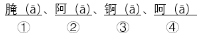在《现代汉语词典》（第7版）中的排列次序是：

- **A**. ②④①③
- **B**. ②④③①　✅
- **C**. ④②③①
- **D**. ④②①③

**答案**：B

**官方解析**

第一步：找出定义关键词。
“单词条目按拼音字母次序排列”、“同音字按笔画排列，笔画少的在前，笔画多的在后”、“笔画数相同的，按起笔笔形横（一）、竖（丨），撇（丿）、点（丶）、折（乛）的次序排列”、“起笔相同的按第二笔笔形的次序排列，以下类推”。
第二步：逐一分析题干信息。
根据“单词条目按拼音字母次序排列”分析：①腌（ā）、②阿（ā）、③锕（ā）、④呵（ā）四个字为同音字，无法直接根据拼音字母次序排列，需继续逐一分析四个字的笔画；
再根据“同音字按笔画排列，笔画少的在前，笔画多的在后”分析：①腌：12笔画；②阿：7笔画；③锕：12笔画；④呵：8笔画，故“②阿”应排在第一个，“④呵”应排在第二个，剩下的“①腌”与“③锕”笔画相同，需继续分析二者的起笔笔形；
再根据“笔画数相同的，按起笔笔形横（一）、竖（丨），撇（丿）、点（丶）、折（乛）的次序排列”分析：“①腌”与“③锕”的起笔笔形均为“撇（丿）”，无法直接根据起笔笔形排列，需继续分析二者的第二笔笔形；
再根据“起笔相同的按第二笔笔形的次序排列，以下类推”分析：“①腌”与“③锕”的第二笔笔形分别为“折（乛）”与“横（一）”，故“③锕”排在“①腌”的前面，即“③锕”排在第三个，“①腌”排在第四个。
综上所述，四个字的排列次序应为：②④③①。
故正确答案为B。

---

### 第 49 题　qid 5698013 · 定义判断

社交称谓缺位：指面对面交往过程中，由于汉语本身对交际对象没有确切、得体的称呼词语而造成尴尬的现象。
下列属于社交称谓缺位的是（    ）。

- **A**. 董先生在超市偶遇多年不见的高中同学，聊了半天也没想起他的名字，最后只好用“老同学”这个称呼混了过去
- **B**. 小赵性格内向，又不擅长推测别人的年龄，每次在电梯间碰到邻居时都不知道怎样打招呼，生怕自己得罪了人
- **C**. 刚读大学的小孙昨天在街上遇到小朋友喊她“阿姨”，听到这个称呼她当场就愣住了，因为她觉得自己也还是个孩子
- **D**. 小丁第一次到汪老师家中做客，见到她丈夫时竟然找不到合适的称呼，情急之下憋出了“师爸”这个词，窘得真想找个地缝钻进去　✅

**答案**：D

**官方解析**

第一步：找出定义关键词。
“面对面交往过程中”、“由于汉语本身对交际对象没有确切、得体的称呼词语”、“造成尴尬”。
第二步：逐一分析选项。
A项：偶遇多年不见的高中同学，没想起他的名字，只好称呼其为“老同学”，是因为时间久远忘记了如何称呼对方，不符合“由于汉语本身对交际对象没有确切、得体的称呼词语”，不符合定义，排除；
B项：小赵性格内向，又不擅长推测别人的年龄，碰到邻居时不知道怎么打招呼，是因为他个人的性格不知道如何称呼对方，不符合“由于汉语本身对交际对象没有确切、得体的称呼词语”，不符合定义，排除；
C项：小朋友喊刚读大学的小孙“阿姨”，该称呼对于二人的年龄来说是确切的，小孙听到称呼后愣住，觉得自己还是个孩子，是因为她个人心理上不适应、不习惯，不符合“由于汉语本身对交际对象没有确切、得体的称呼词语”，不符合定义，排除；
D项：小丁见到老师的丈夫时找不到合适的称呼，符合“面对面交往过程中”，情急之下称呼其为“师爸”，是因为汉语中没有专属女性老师配偶的称谓，符合“由于汉语本身对交际对象没有确切、得体的称呼词语”，窘得想找个地缝钻进去，符合“造成尴尬”，符合定义，当选。
故正确答案为D。

---

### 第 50 题　qid 5755717 · 定义判断

桔槔：指一种从井里往外打水的工具。其结构相当于普通的杠杆，横杆的中间由竖柱支撑或悬吊，横杆的一端用竖杆连接水桶，另一端悬绑重物。汲水时， 压竖杆则水桶向下灌水，灌满后压另一头，水桶就提升到井外。
下列属于桔槔的是：

- **A**. 
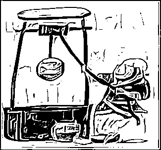

- **B**. 
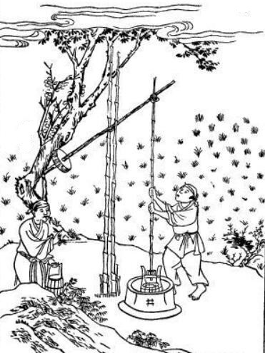
　✅
- **C**. 
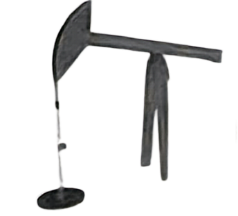

- **D**. 
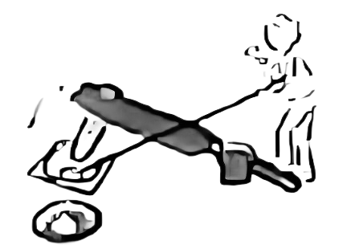

**答案**：B

**官方解析**

第一步：找出定义关键词。
“从井里往外打水的工具”、“横杆的中间由竖柱支撑或悬吊”、“横杆的一端用竖杆连接水桶，另一端悬绑重物”。
第二步：逐一分析选项。
A项：该图中的人物通过捯井绳从井中打水，符合“从井里往外打水的工具”，但该工具中横杆的两端由竖柱支撑，不符合“横杆的中间由竖柱支撑或悬吊”，且横杆的中间由井绳连接水桶，也未悬绑重物，不符合“横杆的一端用竖杆连接水桶，另一端悬绑重物”，不符合定义，排除； 
B项：该图中的人物通过工具从井中打水，符合“从井里往外打水的工具”，且该工具中横杆的中间由竖柱支撑，符合“横杆的中间由竖柱支撑或悬吊”，该工具右侧的一端用竖杆连接水桶，左侧的一端悬绑重物，符合“横杆的一端用竖杆连接水桶，另一端悬绑重物”，符合定义，当选；
C项：该图工具中横杆的一端并未悬绑重物，也不明确另一端是否连接水桶，不符合“横杆的一端用竖杆连接水桶，另一端悬绑重物”，不符合定义，排除；
D项：该图工具中横杆的一端并未连接水桶，另一端也并未悬绑重物，不符合“横杆的一端用竖杆连接水桶，另一端悬绑重物”，不符合定义，排除。
故正确答案为B。

---
