# 2023年江苏省公务员录用考试《行测》题（B类）（网友回忆版）

> 判断推理 · 50 题 · 江苏 2023

## 材料 1

赵、钱、孙、李、周、吴和郑获得某职业技能大赛的前七名，7名选手有男有女，没有并列名次。已知：

（1）赵是第六名，郑的名次在孙之前；

（2）男选手的排名不相邻；

（3）吴的名次在钱和李之前，排名在吴之前的选手中有两名男性。

### 第 1 题　qid 5697990 · 类比推理

根据以上陈述，下列选手名次不可能相邻的是（    ）。

- **A**. 孙和吴
- **B**. 吴和郑　✅
- **C**. 吴和李
- **D**. 周和吴

**答案**：B

**官方解析**

第一步：分析题干条件。

（1）赵是第六名，郑的名次在孙之前；

（2）男选手的排名不相邻；

（3）吴的名次在钱和李之前，排名在吴之前的选手中有两名男性。

第二步：根据题干条件分析选项。

根据条件（1）和（3）可知，赵是第六名，吴是第三名或第四名，再根据条件（2）可知，吴前面要至少有三个人才能保证男选手不相邻，那么吴只能是第四名，此时钱和李是第五名或第七名（如下图所示），此时第一到三名为郑、周、孙，但无法判断具体名次。

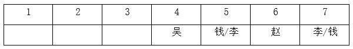

代入A项，如果孙和吴相邻，根据已知信息可知，孙是第三名，郑和周在前两名，具体名次无法确定，所有排名情况均符合题干条件（如下图所示），即孙和吴可以相邻，排除；

代入B项，如果吴和郑相邻，根据已知信息可知，郑只能是第三名，孙在前两名，即郑的名次在孙之后，与条件（1）矛盾，即吴和郑不能相邻，当选；

代入C项，如果吴和李相邻，根据已知信息可知，李是第五名，钱是第七名，郑、周、孙在前三名，具体名次无法确定，所有排名情况均符合题干条件（如下图所示），即吴和李可以相邻，排除；

代入D项，如果周和吴相邻，根据已知信息可知，周是第三名，再根据条件（1）和（3）可知，郑是第一名，孙是第二名，钱和李是第五名或第七名，具体名次无法确定，两种排名情况均符合题干条件（如下图所示），即周和吴可以相邻，排除。

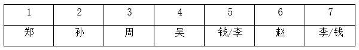

本题为选非题，故正确答案为B。

---

### 第 2 题　qid 5697995 · 类比推理

如果周是第三名，以下哪位选手一定是女性？

- **A**. 赵
- **B**. 钱
- **C**. 孙　✅
- **D**. 李

**答案**：C

**官方解析**

第一步：分析题干条件。

（1）赵是第六名，郑的名次在孙之前；

（2）男选手的排名不相邻；

（3）吴的名次在钱和李之前，排名在吴之前的选手中有两名男性；

（4）周是第三名。

第二步：根据题干条件分析选项。

根据条件（1）和（4）可知，周是第三名，赵是第六名。根据条件（3）可知，吴只能是第四名，钱和李是第五名或第七名，具体名次无法确定。根据条件（1）可知，郑是第一名，孙是第二名。再根据条件（2）和（3）可知，郑和周为男选手，孙和吴为女选手，其他人的性别无法确定（如下图所示）。

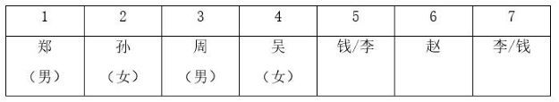

故正确答案为C。

---

## 材料 2

某餐馆菜单上有芹菜肉丝、清蒸鲈鱼、毛豆仔鸡、糖醋排骨4道菜。甲、乙、丙、丁各点了其中的2道，没有一道菜四人都点，也没有一道菜四人都不点。已知：

（1）只有甲点清蒸鲈鱼，丁才点芹菜肉丝；

（2）如果丙点清蒸鲈鱼，则乙和丁也点清蒸鲈鱼；

（3）如果乙在芹菜肉丝和清蒸鲈鱼中至少点一道，则乙也点毛豆仔鸡；

（4）如果丙在芹菜肉丝和毛豆仔鸡中至少点一道，则丙也点清蒸鲈鱼。

### 第 3 题　qid 5699263 · 逻辑判断

根据以上陈述，可以推出以下哪项？

- **A**. 甲在芹菜肉丝和毛豆仔鸡中至少点一道　✅
- **B**. 乙在芹菜肉丝和糖醋排骨中至少点一道
- **C**. 丙在毛豆仔鸡和糖醋排骨中至少点一道
- **D**. 丁在芹菜肉丝和毛豆仔鸡中至少点一道

**答案**：A

**官方解析**

第一步：分析题干条件。

（1）丁（芹菜肉丝）甲（清蒸鲈鱼）；

（2）丙（清蒸鲈鱼）乙和丁（清蒸鲈鱼）；

（3）乙（芹菜肉丝 或 清蒸鲈鱼）乙（毛豆仔鸡）；

（4）丙（芹菜肉丝 或 毛豆仔鸡）丙（清蒸鲈鱼）；

（5）甲、乙、丙、丁各点了其中的2道菜；

（6）没有一道菜四人都点，也没有一道菜四人都不点。

第二步：根据题干条件进行推理。

根据条件（4）可知，丙点芹菜肉丝或毛豆仔鸡，可以推出丙点清蒸鲈鱼，但如果丙不点芹菜肉丝也不点毛豆仔鸡，那么根据条件（5），可以推出丙点清蒸鲈鱼和糖醋排骨；

综合上述两种情况，可以推出丙一定要点清蒸鲈鱼。

根据丙点清蒸鲈鱼以及条件（2），可以推出乙和丁点清蒸鲈鱼；

此时已经有3人点清蒸鲈鱼了，根据条件（6），可以推出甲不点清蒸鲈鱼，那么甲只能在芹菜肉丝、毛豆仔鸡、糖醋排骨三道菜里面点两道菜，可以推出A项一定成立，当选。

故正确答案为A。

---

### 第 4 题　qid 5699266 · 逻辑判断

如果任意两人点的菜都不完全相同，则可以推出以下哪项？

- **A**. 甲点芹菜肉丝和毛豆仔鸡
- **B**. 乙点毛豆仔鸡和糖醋排骨
- **C**. 丙点清蒸鲈鱼和芹菜肉丝　✅
- **D**. 丁点糖醋排骨和毛豆仔鸡

**答案**：C

**官方解析**

第一步：分析题干条件。

（1）丁（芹菜肉丝）甲（清蒸鲈鱼）；

（2）丙（清蒸鲈鱼）乙和丁（清蒸鲈鱼）；

（3）乙（芹菜肉丝 或 清蒸鲈鱼）乙（毛豆仔鸡）；

（4）丙（芹菜肉丝 或 毛豆仔鸡）丙（清蒸鲈鱼）；

（5）甲、乙、丙、丁各点了其中的2道；

（6）没有一道菜四人都点，也没有一道菜四人都不点；

（7）任意两人点的菜都不完全相同。

第二步：根据题干条件进行推理。

根据上题的结论可知，丙点清蒸鲈鱼，乙和丁点清蒸鲈鱼，甲不点清蒸鲈鱼。

根据乙点清蒸鲈鱼以及条件（3），可以推出乙点毛豆仔鸡；

根据甲不点清蒸鲈鱼以及条件（1），可以推出丁不点芹菜肉丝；

根据上述推理可知乙点清蒸鲈鱼和毛豆仔鸡，为了满足条件（7），要想和乙点的菜不同，丁不能点毛豆仔鸡，只能点糖醋排骨，即丁点清蒸鲈鱼和糖醋排骨；

为了满足条件（7），要想和乙、丁点的菜不同，丙不能点毛豆仔鸡和糖醋排骨，只能点芹菜肉丝，即丙点清蒸鲈鱼和芹菜肉丝，对应C项。

根据上述推理（如下图所示），甲在芹菜肉丝、毛豆仔鸡、糖醋排骨三道菜里面点两道菜均可满足条件（7）。

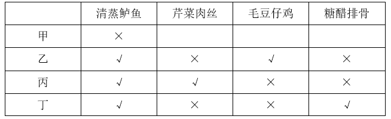

故正确答案为C。

---

### 第 5 题　qid 5697829 · 类比推理

5G：5G城市

- **A**. 匝道：匝道护栏
- **B**. 青年：青年干部
- **C**. 电子：电子邮件　✅
- **D**. 红漆：红漆大门

**答案**：C

**官方解析**

第一步：判断题干词语间逻辑关系。
5G城市利用了5G技术，二者是技术的对应关系。
第二步：判断选项词语间逻辑关系。
A项：匝道护栏位于匝道两边，主要起到保护匝道的作用，二者是地点的对应关系，与题干逻辑关系不一致，排除；
B项：青年干部是青年，二者是种属关系，与题干逻辑关系不一致，排除；
C项：电子邮件是一种利用电子手段提供信息交换的通信方式，电子邮件利用了电子技术，二者是技术的对应关系，与题干逻辑关系一致，当选；
D项：红漆大门是由红漆粉刷而成，二者是原材料的对应关系，与题干逻辑关系不一致，排除。
故正确答案为C。

---

### 第 6 题　qid 5697849 · 类比推理

一呼：百应

- **A**. 一箭：双雕　✅
- **B**. 一波：三折
- **C**. 一曝：十寒
- **D**. 一诺：千金

**答案**：A

**官方解析**

第一步：判断题干词语间逻辑关系。
先有“一呼”的动作，再有“百应”的结果，二者为时间先后顺序的对应关系。
第二步：判断选项词语间逻辑关系。
A项：先有“一箭”的动作，再有“双雕”的结果，二者为时间先后顺序的对应关系，与题干逻辑关系一致，当选；
B项：一波三折指写字的笔法曲折多变，其中“波”是指书法中的捺，“折”是指写字时转笔锋，“一波”和“三折”不是时间先后顺序的对应关系，与题干逻辑关系不一致，排除；
C项：一曝十寒指虽然是最容易生长的植物，晒一天，冻十天，也不可能生长，“一曝”不是动作，“十寒”也不是结果，与题干逻辑关系不一致，排除；
D项：一诺千金指许下的一个诺言有千金的价值，“一诺”和“千金”不是时间先后顺序的对应关系，与题干逻辑关系不一致，排除。
故正确答案为A。

---

### 第 7 题　qid 5697804 · 类比推理

吴语：汉语：藏语

- **A**. 电器：石器：木器
- **B**. 建材：耗材：钢材
- **C**. 数学：理学：农学　✅
- **D**. 壮族：民族：苗族

**答案**：C

**官方解析**

第一步：判断题干词语间逻辑关系。
吴语是汉语方言之一，分布于上海、江苏东南部和浙江大部分地区，前两词是种属关系，汉语和藏语是两种不同民族的语言，后两词是并列关系。
第二步：判断选项词语间逻辑关系。
A项：电器泛指用电的器具，石器是指以岩石为原材料制作而成的器具，木器是指由硬质草本植物制作而成的器具，三者是并列关系，与题干逻辑关系不一致，排除；
B项：有的建材是耗材，有的建材不是耗材，有的耗材是建材，有的耗材不是建材，前两词是交叉关系，钢材是建材，也是耗材，第三词与前两词均是种属关系，与题干逻辑关系不一致，排除；
C项：数学属于理学，前两词是种属关系，理学和农学是两个不同的现代教育分支学科，后两词是并列关系，与题干逻辑关系一致，当选；
D项：壮族是民族的一种，前两词是种属关系，但苗族也是民族的一种，后两词也是种属关系，与题干逻辑关系不一致，排除。
故正确答案为C。

---

### 第 8 题　qid 5697831 · 类比推理

南极洲：企鹅：北极熊

- **A**. 空间站：种子：宇航员
- **B**. 水浒传：李逵：沙和尚　✅
- **C**. 大数据：算法：字符串
- **D**. 地雷战：工事：指战员

**答案**：B

**官方解析**

第一步：判断题干词语间逻辑关系。
企鹅和北极熊是两种不同的动物，二者为并列关系，企鹅生活在南极洲，但北极熊不是生活在南极洲的动物。
第二步：判断选项词语间逻辑关系。
A项：宇航员将种子带进空间站，种子和宇航员不是并列关系，与题干逻辑关系不一致，排除；
B项：李逵和沙和尚均是书籍中的人物，二者为并列关系，李逵是《水浒传》中的人物，但沙和尚不是《水浒传》中的人物，与题干逻辑关系一致，当选；
C项：算法指解决问题的有限运算序列，而字符串指编程语言中表示文本的数据类型，算法与字符串不是并列关系，与题干逻辑关系不一致，排除；
D项：工事指保障军队发扬火力和隐蔽安全的建筑物，工事和指战员是地雷战中涉及到的建筑物和人物，二者不是并列关系，与题干逻辑关系不一致，排除。
故正确答案为B。

---

### 第 9 题　qid 5697996 · 类比推理

通例：惯例：国际惯例

- **A**. 异议：动议：紧急动议
- **B**. 预备：准备：精心准备　✅
- **C**. 笔试：面试：远程面试
- **D**. 修炼：锻炼：刻苦锻炼

**答案**：B

**官方解析**

第一步：判断题干词语间逻辑关系。
通例指一般的情况、常规、惯例，与惯例是近义关系；国际惯例是惯例，二者为种属关系。
第二步：判断选项词语间逻辑关系。
A项：异议指不同的意见，动议指会议中的建议（一般指临时的），二者没有明显的逻辑关系，与题干逻辑关系不一致，排除；
B项：预备指预先准备，与准备是近义关系；精心准备是准备，二者为种属关系，与题干逻辑关系一致，当选；
C项：笔试和面试是不同选拔的方式，二者为并列关系，与题干逻辑关系不一致，排除；
D项：修炼指道教的修道炼气、炼丹等活动，一般指修心炼身，与锻炼没有明显的逻辑关系，与题干逻辑关系不一致，排除。
故正确答案为B。

---

### 第 10 题　qid 5698004 · 类比推理

越野汽车：国产汽车：汽油

- **A**. 野生麋鹿：雄性麋鹿：野草　✅
- **B**. 口岸城市：沿海城市：浴场
- **C**. 节约行为：浪费行为：粮食
- **D**. 冰雪运动：户外运动：雪橇

**答案**：A

**官方解析**

第一步：判断题干词语间逻辑关系。
有的越野汽车是国产汽车，有的越野汽车不是国产汽车，有的国产汽车是越野汽车，有的国产汽车不是越野汽车，二者为交叉关系；汽油可以维持汽车的行驶，第三个词分别与前两个词构成动力来源的对应关系。
第二步：判断选项词语间逻辑关系。
A项：有的野生麋鹿是雄性麋鹿，有的野生麋鹿不是雄性麋鹿，有的雄性麋鹿是野生麋鹿，有的雄性麋鹿不是野生麋鹿，二者为交叉关系；野草可以维持麋鹿的行动，第三个词分别与前两个词构成动力来源的对应关系，与题干逻辑关系一致，当选；
B项：口岸城市指具有供人员、货物和交通工具出入国境的港口、机场、车站、通道的城市。有的口岸城市是沿海城市，有的口岸城市不是沿海城市，有的沿海城市是口岸城市，有的沿海城市不是口岸城市，二者为交叉关系；浴场指露天游泳场所，与前两个词不构成动力来源的对应关系，与题干逻辑关系不一致，排除；
C项：节约行为和浪费行为为并列关系，与题干逻辑关系不一致，排除；
D项：有的冰雪运动是户外运动，有的冰雪运动不是户外运动，有的户外运动是冰雪运动，有的户外运动不是冰雪运动，二者为交叉关系；雪橇是一种装在滑行装置上的交通工具，分别与前两个词构成工具的对应关系，与题干逻辑关系不一致，排除。
故正确答案为A。

---

### 第 11 题　qid 5697819 · 类比推理

人口普查：国情普查：经济普查

- **A**. 太空行走：冰上行走：自由行走
- **B**. 银行机构：支付机构：政府机构
- **C**. 数字课程：网络课程：精品课程
- **D**. 团雾天气：恶劣天气：暴雪天气　✅

**答案**：D

**官方解析**

第一步：判断题干词语间逻辑关系。
人口普查、经济普查和农业普查是我国的三项重大国情国力周期性普查，人口普查和经济普查为并列关系，二者均为国情普查的一种，均与国情普查构成种属关系。
第二步：判断选项词语间逻辑关系。
A项：太空行走和冰上行走是两种不同情景下的行走，二者为并列关系，与题干逻辑关系不一致，排除；
B项：有的银行机构是政府机构，有的银行机构不是政府机构，有的政府机构是银行机构，有的政府机构不是银行机构，二者为交叉关系，与题干逻辑关系不一致，排除；
C项：有的数字课程是精品课程，有的数字课程不是精品课程，有的精品课程是数字课程，有的精品课程不是数字课程，二者为交叉关系，与题干逻辑关系不一致，排除；
D项：团雾天气和暴雪天气是两种不同的天气状况，二者为并列关系，团雾天气和暴雪天气都是恶劣天气，均与恶劣天气构成种属关系，与题干逻辑关系一致，当选。
故正确答案为D。

---

### 第 12 题　qid 5697862 · 类比推理

蜘蛛 之于 （    ） 相当于 （    ） 之于 能力

- **A**. 螃蟹；才干
- **B**. 蛛网；成功
- **C**. 动物；仁义
- **D**. 蛛丝；人才　✅

**答案**：D

**官方解析**

逐一代入选项。
A项：蜘蛛和螃蟹是两种不同的动物，二者为并列关系；才干指才能、办事的能力，能力指能胜任某项工作或事务的主观条件，二者为近义关系，前后逻辑关系不一致，排除；
B项：蛛网是蜘蛛所织成的丝网，二者为动物和产物的对应关系；拥有能力是成功的条件之一，二者为条件的对应关系，前后逻辑关系不一致，排除；
C项：蜘蛛是动物，二者为种属关系；仁义指仁爱和正义，与能力无明显逻辑关系，前后逻辑关系不一致，排除；
D项：蜘蛛有蛛丝，二者为对应关系；人才有能力，二者为对应关系，前后逻辑关系一致，当选。
故正确答案为D。

---

### 第 13 题　qid 5697867 · 类比推理

（    ） 之于 激光水平仪 相当于 抛石机 之于 （    ）

- **A**. 水平仪 机器
- **B**. 水平尺 火炮　✅
- **C**. 建大楼 石头
- **D**. 技术员 士兵

**答案**：B

**官方解析**

逐一代入选项。
A项：激光水平仪是水平仪的一种，二者为种属关系，抛石机是利用配重物进行重力发射的机器，二者为种属关系，但词语前后顺序相反，前后逻辑关系不一致，排除；
B项：水平尺和激光水平仪都是一种测量工具，二者都可以用来测量，为并列关系，火炮是一种利用能源来抛射弹丸的武器，抛石机是利用配重物进行重力发射的机器，二者都可以用来投射，为并列关系，前后逻辑关系一致，当选；
C项：激光水平仪是建大楼的过程中需要使用的工具，二者为工具的对应关系，抛石机需要以石头作为重物来进行重力发射，二者为配套使用的对应关系，前后逻辑关系不一致，排除；
D项：激光水平仪需要技术员进行操作，抛石机需要士兵进行操作，二者均为工具与使用人员的对应关系，但词语前后顺序相反，前后逻辑关系不一致，排除。
故正确答案为B。

---

### 第 14 题　qid 5697898 · 类比推理

无理数 整数 之于 （    ） 相当于 哲学 历史 之于 （    ）

- **A**. 数据 大学
- **B**. 理科 文科
- **C**. 数学 典籍
- **D**. 实数 学科　✅

**答案**：D

**官方解析**

逐一代入选项。
A项：数据是事实或观察的结果，是对客观事物的逻辑归纳，是用于表示客观事物的未经加工的原始素材，无理数、整数与数据无必然联系，哲学、历史是两个不同的学科门类，大学是实施高等教育的学校，大学可能会开设哲学、历史学科专业，前后逻辑关系不一致，排除；
B项：理科是指形式科学与自然科学的统称，无理数、整数与理科无必然联系，哲学和历史都是文科，哲学、历史与文科均构成种属关系，前后逻辑关系不一致，排除；
C项：数学是研究数量、结构、变化、空间以及信息等概念的一门学科，无理数、整数是数学的研究对象，典籍是记载古今法令制度的重要文献，泛指古代的图书，典籍不是研究哲学、历史，而是记载哲学、历史的相关内容，前后逻辑关系不一致，排除；
D项：无理数和整数都是实数，因此无理数、整数与实数均构成种属关系，哲学、历史都是学科门类，因此哲学、历史与学科均构成种属关系，前后逻辑关系一致，当选。
故正确答案为D。

---

### 第 15 题　qid 5697836 · 图形推理

请从四个选项中选出最恰当的一项填入问号处，使题干图形呈现一定的规律性。

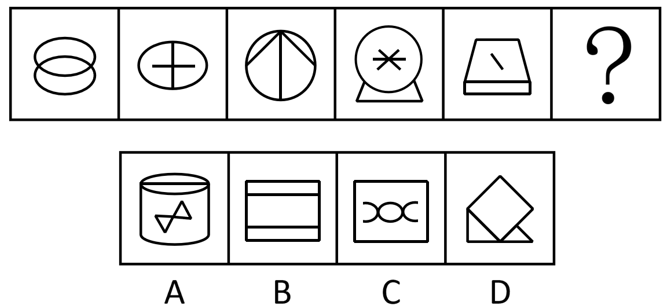

- **A**. A
- **B**. B
- **C**. C
- **D**. D　✅

**答案**：D

**官方解析**

元素组成不同，且无明显属性规律，考虑数量规律。观察发现，图形线条交叉明显，考虑交点数。题干图形的交点数分别为2、3、4、5、6、？，因此？处图形的交点数应为7，只有D项符合规律。
故正确答案为D。

---

### 第 16 题　qid 5697853 · 图形推理

请从四个选项中选出最恰当的一项填入问号处，使题干图形呈现一定的规律性。

- **A**. A
- **B**. B
- **C**. C
- **D**. D　✅

**答案**：D

**官方解析**

元素组成不同，优先考虑属性规律。观察发现，题干图形出现明显的等腰元素，优先考虑对称性。题干图形均只有1条对称轴，且对称轴方向依次顺时针旋转，？处应用规律，只有D项符合规律。

故正确答案为D。

---

### 第 17 题　qid 5697852 · 图形推理

请从四个选项中选出最恰当的一项填入问号处，使题干图形呈现一定的规律性。

- **A**. A
- **B**. B
- **C**. C　✅
- **D**. D

**答案**：C

**官方解析**

元素组成不同，且无明显属性规律，考虑数量规律。观察发现，题干图形均分为上下两部分，排除A、D两项；继续观察发现，题干多幅图中存在“田”字变形图，优先考虑笔画数。题干图形均一部分为一笔画，另一部分为两笔画，所以？处图形也应该是一部分为一笔画，另一部分为两笔画，只有C项符合规律。
故正确答案为C。

---

### 第 18 题　qid 5697866 · 图形推理

请从四个选项中选出最恰当的一项填入问号处，使题干图形呈现一定的规律性。

- **A**. A　✅
- **B**. B
- **C**. C
- **D**. D

**答案**：A

**官方解析**

解法一：元素组成不同，优先考虑属性规律。观察发现，图一、图三、图五均为全开放图形；图二、图四均为全封闭图形，故？处应该填入一个全封闭图形，排除C、D两项；继续观察发现，图二、图四均是关于竖轴对称的图形，只有A项符合规律。
故正确答案为A。
解法二：元素组成不同，优先考虑属性规律。观察发现，图一、图三、图五均为全开放图形；图二、图四均为全封闭图形，故？处应该填入一个全封闭图形，排除C、D两项；继续观察发现，图二、图四均是由直线和曲线构成的图形，只有B项符合规律。
故正确答案为B。
注：该题不是很严谨，两种解法都有合理和不合理之处，故不必太过纠结正确答案。

---

### 第 19 题　qid 5697901 · 图形推理

请从四个选项中选出最恰当的一项填入问号处，使题干图形呈现一定的规律性。

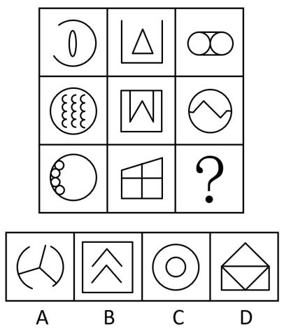

- **A**. A　✅
- **B**. B
- **C**. C
- **D**. D

**答案**：A

**官方解析**

元素组成不同，优先考虑属性规律。观察发现，题干出现全直线图形、全曲线图形，优先考虑曲直性。九宫格优先横行看，第一行依次为全曲线图形、全直线图形、既有曲线又有直线图形；经验证，第二行满足此规律；第三行应用此规律，？处图形应该为既有曲线又有直线图形，只有A项符合规律。
故正确答案为A。

---

### 第 20 题　qid 5697904 · 图形推理

请从四个选项中选出最恰当的一项填入问号处，使题干图形呈现一定的规律性。

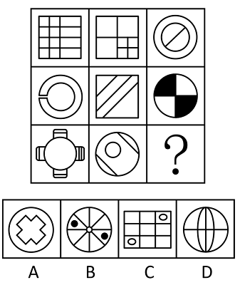

- **A**. A
- **B**. B　✅
- **C**. C
- **D**. D

**答案**：B

**官方解析**

元素组成不同，优先考虑属性规律。观察发现，题干图形较为规整，考虑对称性。九宫格优先横行看，第一行的对称轴方向依次为横向、左上-右下斜、仅有两条斜着并相互垂直；经验证，第二行满足此规律；第三行应用此规律，？处图形对称轴的方向应为仅有两条斜着并相互垂直，只有B项符合规律。
故正确答案为B。

---

### 第 21 题　qid 5697920 · 图形推理

下边四个图形中，只有一个是由上边的四个图形拼合（只能通过上、下、左、右平移）而成的，请把它找出来。

- **A**. A
- **B**. B　✅
- **C**. C
- **D**. D

**答案**：B

**官方解析**

本题考查平面拼合，可采用平行且等长相消的方式解题。消去平行且等长的线段后进行组合即可得到轮廓图，即为B项。平行且等长相消的方式如下图所示：

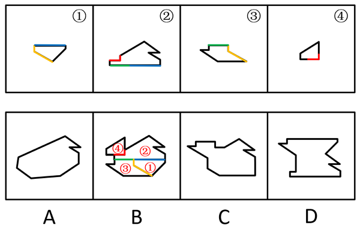

故正确答案为B。

---

### 第 22 题　qid 5697926 · 图形推理

下边四个图形中，只有一个是由上边的四个图形拼合（只能通过上、下、左、右平移）而成的，请把它找出来。

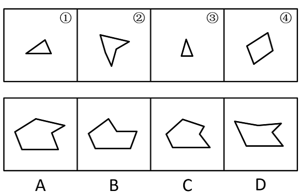

- **A**. A　✅
- **B**. B
- **C**. C
- **D**. D

**答案**：A

**官方解析**

本题考查平面拼合，可采用平行且等长相消的方式解题。消去平行且等长的线段后进行组合即可得到轮廓图，即为A项。平行且等长相消的方式如下图所示：

故正确答案为A。

---

### 第 23 题　qid 5697897 · 图形推理

下边四个图形中，只有一个是由上边的四个图形拼合（只能通过上、下、左、右平移）而成的，请把它找出来。

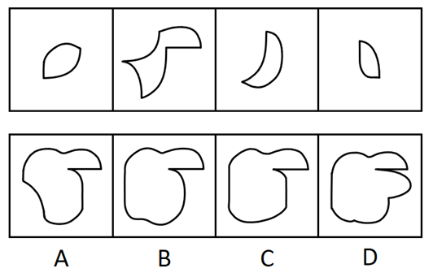

- **A**. A
- **B**. B　✅
- **C**. C
- **D**. D

**答案**：B

**官方解析**

本题考查平面拼合，消去弯曲程度一致且等长的线条后进行拼合，即可得到轮廓图，即为B项。具体拼合方式如下图所示：

故正确答案为B。

---

### 第 24 题　qid 5697916 · 图形推理

上边四张纸片，都是一面为白色，一面为黑色，在允许平移、旋转和翻转的条件下可以拼合成多种图形。下边哪项不能由其拼合而成？

- **A**. A
- **B**. B
- **C**. C
- **D**. D　✅

**答案**：D

**官方解析**

本题考查平面拼合，可以平移、旋转、翻转，且每张纸片一面为白色，另一面为黑色，需要考虑翻转后的颜色变化。将题干图形标上序号，如下图所示，逐一进行分析。

A项：可以由题干图形拼合而成，拼合方式如图所示，排除；

B项：可以由题干图形拼合而成，拼合方式如图所示，排除；

C项：可以由题干图形拼合而成，拼合方式如图所示，排除；

D项：中间上边的五边形是由图③直接平移得到，颜色应该为白色，而选项为黑色，当选。

本题为选非题，故正确答案为D。

---

### 第 25 题　qid 5697940 · 图形推理

从四个选项中选出一项填入问号处，使左边四个图形可以拼合（只能通过上、下、左、右平移）成右边的图形。 

- **A**. A
- **B**. B
- **C**. C
- **D**. D　✅

**答案**：D

**官方解析**

本题考查平面拼合，可采用平行且等长相消的方式解题。消去平行且等长的线段后进行组合即可得到轮廓图，即为D项。平行且等长相消的方式如下图所示：

故正确答案为D。

---

### 第 26 题　qid 5697963 · 图形推理

左边给定的是一个四面体，右边哪一项可能是它的外表面展开图？ 

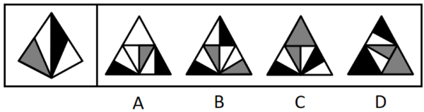

- **A**. A
- **B**. B
- **C**. C　✅
- **D**. D

**答案**：C

**官方解析**

将题干四面体的左侧面标为面e，题干面e中白色直角三角形的斜边挨着右侧面的黑色直角三角形，如下图所示，逐一分析选项。

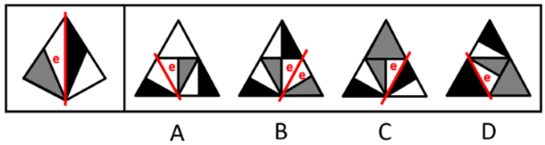

A项：选项展开图面e中白色直角三角形的斜边挨着白色直角三角形，选项展开图与题干不一致，排除；

B项：选项展开图面e中白色直角三角形的斜边挨着白色直角三角形，选项展开图与题干不一致，排除；

C项：选项展开图面e中白色直角三角形的斜边也挨着右侧面的黑色直角三角形，选项展开图与题干一致，当选；

D项：选项展开图面e中白色直角三角形的斜边挨着黑色锐角三角形，选项展开图与题干不一致，排除。

注：本题A项中间的灰白三角形面和B项右下角的灰白三角形面，实际上均与题干中的灰白三角形面不同，这是因为灰色三角形和白色三角形的相对位置反了，那也就不是同一个面了，也可以通过这点来快速排除选项。

故正确答案为C。

---

### 第 27 题　qid 5697878 · 图形推理

左边给定的是一个六面体的外表面展开图，右边哪一项能由它折叠而成？

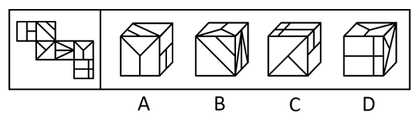

- **A**. A
- **B**. B　✅
- **C**. C
- **D**. D

**答案**：B

**官方解析**

将展开图标上序号（如下图所示），逐一进行分析。

A项：选项由面e、面f与面i构成，在题干展开图中面f与面e的公共边挨着面e中的两个小正方形（如图所示），而在选项中两个面的公共边挨着面e中的一个长方形，选项与题干展开图不一致，排除；

B项：选项由面f、面h与面i构成，选项与题干展开图一致，当选；

C项：选项由面e、面g与面k构成，在题干展开图中面e中的两个小正方形挨着面f（如图所示），而在选项中面e中的两个小正方形挨着面k，选项与题干展开图不一致，排除；

D项：选项由面g、面i与面k构成，面g和面i是相对面，相对面不能同时在立体图中出现，选项与题干展开图不一致，排除。

故正确答案为B。

---

### 第 28 题　qid 5697913 · 图形推理

某立方体每个面上各有一种不同的图案，下列四个选项中有且仅有一个不是该立方体，请把它找出来。

- **A**. A　✅
- **B**. B
- **C**. C
- **D**. D

**答案**：A

**官方解析**

本题为空间重构题。将四个选项均以三角形面内三角形尖指向的边为起点，进行顺时针画边（如下图所示），逐一进行分析。

A项：此时边2对应十字面；

B项：此时边2对应圆形面；

C项：此时边2对应圆形面；

D项：此时边2对应圆形面。

综上，只有A项与其他三项不同。

本题为选非题，故正确答案为A。

---

### 第 29 题　qid 5697923 · 图形推理

下列四个立方体的外表面展开图，其中一个展开图还原成立方体后，从能同时看到3个面的任一角度看（如），都可以至少看到一个圆，请把它找出来。

- **A**. A　✅
- **B**. B
- **C**. C
- **D**. D

**答案**：A

**官方解析**

立方体共有6个面，两两一组构成3组相对面。当能同时看到3个面时，相对面能且只能出现一个，因此，要保证从能同时看到3个面的任一角度看，都可以至少看到一个圆，需要保证展开图中至少存在一组相对面中均为圆，只有A项符合。
故正确答案为A。

---

### 第 30 题　qid 5697932 · 逻辑判断

欲事立，须是心立。理想信念是中国共产党员精神上的“钙”，一个人理想信念坚定，“骨头”就硬；理想信念缺失或者不坚定，精神上就会“缺钙”，就会得“软骨病”，就容易在考验面前迷失方向。
以下哪项不能由以上陈述推出？

- **A**. 一个人若不想事立，他就无须心立　✅
- **B**. 如果一个人“骨头”不硬，就说明他的理想信念不坚定
- **C**. 一个人理想信念缺失，他就会得“软骨病”
- **D**. 若一个人不容易在考验面前迷失方向，就说明他有坚定的理想信念

**答案**：A

**官方解析**

第一步：翻译题干。

①事立心立；

②理想信念坚定“骨头”硬；

③理想信念缺失 或 理想信念不坚定精神上“缺钙”；

④理想信念缺失 或 理想信念不坚定得“软骨病”；

⑤理想信念缺失 或 理想信念不坚定容易在考验面前迷失方向。

第二步：逐一分析选项。

A项：该项翻译为“事立心立”，是对①的否前，否前得不到确定性结论，无法推出，当选；

B项：该项翻译为“‘骨头’硬理想信念坚定”，是对②的否后，否后必否前，可以推出，排除；

C项：该项翻译为“理想信念缺失得‘软骨病’”，肯定了“或关系”其中一项，是对④的肯前，肯前必肯后，可以推出，排除；

D项：该项翻译为“容易在考验面前迷失方向理想信念坚定”，是对⑤的否后，否后必否前，可以得到“理想信念缺失” 且 “理想信念不坚定”，可以推出，排除。

本题为选非题，故正确答案为A。

---

### 第 31 题　qid 5697869 · 逻辑判断

目前，智能通信工具实现了远程面对面交流，其传输的画面和声音也能准确地传达人们的表情和情绪，然而，在通过网络进行沟通和交流时，人们更习惯用各种表情包来传达日常生活中的喜怒哀乐，表情包已从情绪符号变成了网络社交利器。
以下哪项如果为真，最能解释上述现象？

- **A**. 大多数时候，人们并不愿意在交流中表露自己的真实表情和情绪
- **B**. 使用表情包比控制自己的面部表情和声音要方便容易得多　✅
- **C**. 人们需要为远程面对面交流所消耗的流量支付更多费用
- **D**. 表情包能以一种夸张的方式传达出人们的表情和情绪

**答案**：B

**官方解析**

第一步：找出题干矛盾。
远程面对面交流传输的画面和声音也能准确地传达人们的表情和情绪，然而人们更习惯用各种表情包来传达日常生活中的喜怒哀乐。
第二步：逐一分析选项。
A项：该项仅说明大多数时候人们并不愿意在交流中表露自己的真实表情和情绪，并未提及相比远程面对面交流传输的画面和声音人们更习惯用表情包的原因，不能解释题干矛盾，排除；
B项：该项在表情包和面对面交流中传输的画面、声音之间进行对比，说明表情包相比画面、声音在传达情绪过程中所具备的优势，能够解释为什么远程面对面交流传输的画面和声音也能准确地传达人们的表情和情绪，但人们更习惯使用各种表情包来传达情绪，可以解释题干矛盾，保留；
C项：该项指出远程面对面交流需要支付更多的流量费用，侧面反映出使用表情包所需的流量费用可能较少，能够解释为什么远程面对面交流传输的画面和声音也能准确地传达人们的表情和情绪，但人们更习惯使用各种表情包来传达情绪，可以解释题干矛盾，保留；
D项：该项仅说明表情包能以一种夸张的方式传达出人们的表情和情绪，并未提及相比远程面对面交流传输的画面和声音人们更习惯用表情包的原因，不能解释题干矛盾，排除。
对比B、C两项，B项指出表情包在情绪传达过程中的优势，而C项是价格方面的优势，B项与题干的话题更接近，且B项更明确地将表情包与远程面对面交流进行了比较，因此B项解释力度更强。
故正确答案为B。

---

### 第 32 题　qid 5697886 · 逻辑判断

目前市场上有很多类型的饮用水，除了我们日常喝的矿泉水、纯净水之外，还有厂家推出了“婴儿水”，厂家宣传说，这种水针对婴幼儿免疫系统和代谢系统不成熟的特征，由无菌生产线生产，能够保证婴幼儿的饮水安全，值得每个有婴幼儿的家庭购买。
以下哪项如果为真，最能质疑上述厂家的说法？

- **A**. 在行业发布的关于包装饮用水的分类规定中不包含“婴儿水”
- **B**. “婴儿水”价格高昂，是普通饮用水的数倍，许多普通家庭望而却步
- **C**. 普通的饮用水经过严格净化处理，烧开就可以达到杀菌的效果　✅
- **D**. 婴幼儿成长所需的营养需要全面健康的饮食，仅“婴儿水”远远不够

**答案**：C

**官方解析**

第一步：找出论点和论据。
论点：“婴儿水”针对婴幼儿免疫系统和代谢系统不成熟的特征，由无菌生产线生产，能够保证婴幼儿的饮水安全，值得每个有婴幼儿的家庭购买。
论据：无。
本题只有论点，没有论据，削弱优先考虑削弱论点。
第二步：逐一分析选项。
A项：该项说的是行业发布的关于包装饮用水的分类规定中不包含“婴儿水”，而论点讨论的是“婴儿水”由无菌生产线生产，能够保证婴幼儿的饮水安全，值得每个有婴幼儿的家庭购买，话题不一致，无法削弱，排除；
B项：该项说的是“婴儿水”价格高昂，使许多普通家庭望而却步，并未说明其是否安全，是否值得每个有婴幼儿的家庭购买，为无关项，无法削弱，排除；
C项：该项说的是普通的饮用水经过处理也同样可以达到杀菌的效果，说明给水杀菌并不需要厂家的无菌生产线，即“婴儿水”并不值得每个有婴幼儿的家庭购买，直接削弱论点，当选；
D项：该项说的是“婴儿水”的营养不够，并未说明其是否安全，是否值得每个有婴幼儿的家庭购买，为无关项，无法削弱，排除。
故正确答案为C。

---

### 第 33 题　qid 5697915 · 逻辑判断

有身高为1.65米、1.68米、1.70米和1.72米的四人，其中有两人体型偏瘦，两人体型偏胖。关于身高体型，这四个人有如下陈述：
甲：我身高不到1.70米；
乙：丙身高1.72米，偏瘦；
丙：丁身高1.68米，偏胖；
丁：乙身高1.65米，偏瘦。
如果体型偏瘦的说真话，体型偏胖的说假话，那么可以推出以下哪项？

- **A**. 甲身高1.65米，偏胖
- **B**. 乙身高1.70米，偏瘦
- **C**. 丙身高1.72米，偏瘦
- **D**. 丁身高1.68米，偏胖　✅

**答案**：D

**官方解析**

第一步：分析题干条件。

（1）有两人体型偏瘦，两人体型偏胖；

（2）甲：我身高不到1.70米；

（3）乙：丙身高1.72米 且 偏瘦；

（4）丙：丁身高1.68米 且 偏胖；

（5）丁：乙身高1.65米 且 偏瘦；

（6）体型偏瘦的说真话，体型偏胖的说假话。

第二步：找关系。

根据条件（1）和（6）可知，四人中两人说真话，两人说假话。

题干条件不存在矛盾和反对关系，可考虑假设法。

解法一：乙、丙、丁的话均涉及到体型胖瘦，根据（6）可知，体型偏瘦的说真话，体型偏胖的说假话，故可以优先判定乙、丙、丁是否说真话。其中乙和丁都指出其他人说了真话，且丁指出乙说了真话，故优先假设丁说真话。

如果丁说真话，根据（5）可知，乙说了真话，再根据（3）可知，丙也说了真话，可以得出“丁真乙真丙真”，此时有三个人说真话与条件（1）矛盾，所以丁一定说假话。而丁说假话只可知”乙身高1.65米 且 偏瘦“为假，得不到身高和体型具体谁为假，得不到更确切信息。

所以再将“丁真乙真丙真”逆否得到更多信息，可得“丙假乙假丁假”。如果丙说假话，那么乙和丁也说假话，此时有三个人说假话与条件（1）矛盾，所以丙一定说真话，即“丁身高1.68米 且 偏胖”为真，对应D项。

解法二：

假设乙说的话为真，根据（2）可知，丙身高1.72米 且 偏瘦，根据（6）可知，体型偏瘦的说真话，所以丙也说真话，再根据条件（1）可知，有两人体型偏瘦，两人体型偏胖，故甲和丁体型偏胖（说假话），乙和丙体型偏瘦（说真话），分析条件（2）（3）（4）（5）中提到的身高可得，那么甲身高为1.70米或1.72米、丙身高1.72米、丁身高1.68米、乙身高不是1.65米，但这四个身高要求无法同时成立，因此乙说的话为假。

由乙说的话为假可知，乙体型偏胖，根据条件（5），丁说的话也为假。再根据条件（1）可知，甲和丙说的话为真，即“丁身高1.68米 且 偏胖”为真，对应D项。

故正确答案为D。

---

### 第 34 题　qid 5697929 · 逻辑判断

我国胆囊结石的发病率为10%左右。有研究表明，胆结石是胆囊癌的重要诱因，而保胆囊取结石手术的复发率较高，许多胆囊结石患者深受其苦，不得不多次接受手术。据此，有医生主张，在发现患有胆结石之后，应整个切除胆囊以减少罹患胆囊癌的风险。
以下哪项如果为真，最能支持上述医生的主张？

- **A**. 多次保胆囊取结石手术既给患者带来沉重的经济负担，也危害患者的身心健康
- **B**. 在一些发达国家，医生建议胆囊结石患者一律采取整体切除的治疗措施
- **C**. 保胆囊取结石手术既不能根治胆囊结石，也不能规避罹患胆囊癌的风险　✅
- **D**. 胆囊癌患者的存活率较低，仅有不到5%的胆囊癌患者能再活五年

**答案**：C

**官方解析**

第一步：找出论点和论据。
论点：在发现患有胆结石之后，应整个切除胆囊以减少罹患胆囊癌的风险。
论据：胆结石是胆囊癌的重要诱因，而保胆囊取结石手术的复发率较高，许多胆囊结石患者深受其苦，不得不多次接受手术。
本题论点说的是“为解决弊端，建议切除胆囊来减少罹患胆囊癌风险”，论据说的是“保胆囊取结石的弊端”，论点论据话题一致，加强优先考虑补充论据。
第二步：逐一分析选项。
A项：该项说的是多次保胆囊取结石手术给患者带来经济和身心的影响，而论点说的是为解决弊端，建议切除胆囊来减少罹患胆囊癌风险，话题不一致，无法加强，排除；
B项：该项说的是一些发达国家医生对胆囊结石患者的建议是采取整体切除的治疗措施，而论点说的是为解决弊端，建议切除胆囊来减少罹患胆囊癌风险，即该项未提及能否减少罹患胆囊癌风险，话题不一致，无法加强，排除；
C项：该项说的是保胆囊取结石手术不能根治胆囊结石且不能规避罹患胆囊癌风险，证明了保胆囊取结石手术的治疗方式对规避罹患胆囊癌是无效的，支持了应该用整个切除胆囊的方式来治疗，补充论据，可以加强，当选；
D项：该项说的是胆囊癌患者存活率较低，而论点说的是为解决弊端，建议切除胆囊来减少罹患胆囊癌风险，话题不一致，无法加强，排除。
故正确答案为C。

---

### 第 35 题　qid 5697876 · 逻辑判断

某市教育局派出由甲、乙、丙、丁、戊5名优秀教师组成的支教团支援西部。已知：
（1）有3人为青年教师，2人为中年教师；
（2）语文教师有2人，数学教师有3人；
（3）甲与丙同龄，丁与戊年龄相差最大；
（4）乙与戊所教课程相同，丙与丁所教课程不同；
（5）担任组长的是一名中年语文教师。
根据以上陈述，可以推出以下哪项？

- **A**. 甲是组长
- **B**. 乙是组长
- **C**. 丙是组长
- **D**. 丁是组长　✅

**答案**：D

**官方解析**

第一步：分析题干条件。
（1）有3人为青年教师，2人为中年教师；
（2）语文教师有2人，数学教师有3人；
（3）甲与丙同龄，丁与戊年龄相差最大；
（4）乙与戊所教课程相同，丙与丁所教课程不同；
（5）担任组长的是一名中年语文教师。
第二步：根据题干条件进行推理。
根据条件（1）（3）可知，丁和戊中有1人与甲、丙同龄，因此甲和丙一定是青年教师，再根据条件（5）可知，甲和丙不能担任组长，排除A、C两项；再根据条件（2）（4）可知，丙和丁中有1人与乙、戊所教课程相同，因此乙和戊所教课程一定是数学，再根据条件（5）可知，乙和戊不能担任组长，因此，丁是组长，排除B项，D项当选。
故正确答案为D。

---

### 第 36 题　qid 5697900 · 逻辑判断

近年来，露营成为最受欢迎的休闲活动之一。人们带上帐篷及食物，在城市中寻一山清水秀之处“安营扎寨”体验一段独特的露营时光。然而，露营活动既有安全隐患，还会产生破坏环境的垃圾。据此，有专家指出，应当出台政策遏制这类露营活动。
以下哪项如果为真，最能质疑上述专家的观点？

- **A**. 今年与露营有关的产业预计产值将突破350亿元，为旅游业注入新能量
- **B**. 许多地方开发出“自驾游+露营”新模式，以满足游客的个性化体验需求
- **C**. 大多数露营者都会邀请三五好友或者以家庭为单位出游，可以互相照应
- **D**. 绝大多数露营爱好者为了安全会选择在城市中管理严格的地方“安营扎寨”　✅

**答案**：D

**官方解析**

第一步：找出论点和论据。
论点：应当出台政策遏制这类露营活动。
论据：露营活动既有安全隐患，还会产生破坏环境的垃圾。
本题论点说的是应当出台政策遏制露营活动，论据说的是露营活动的负面影响，论点和论据均是围绕露营活动展开的，二者话题一致，削弱优先考虑削弱论点，也可以考虑削弱论据。
第二步：逐一分析选项。
A项：该项说的是露营相关产业的产值以及对旅游业的影响，并未提及露营活动是否存在安全和破坏环境的隐患，话题不一致，无法削弱，排除；
B项：该项说的是许多地方为了满足游客的需求开发了新的旅游模式，并未提及露营活动是否存在安全和破坏环境的隐患，话题不一致，无法削弱，排除；
C项：该项说的是大多数露营者喜欢组团出游，并未提及露营活动是否存在安全和破坏环境的隐患，话题不一致，无法削弱，排除；
D项：该项说的是绝大多数露营爱好者为了安全会选择在城市中管理严格的地方露营，削弱了论据中所提及的露营活动具有安全隐患，削弱论据，可以削弱，当选。
故正确答案为D。

---

### 第 37 题　qid 5697874 · 逻辑判断

在一些网络平台的讨论区，许多人常用“幼齿化”的语言（如“爱了”“醉了”等）来讨论严肃的问题，这种表达方式常能够引起人们的好感。然而，有专家认为，在面对严肃问题时，人们更应该使用冷静、审慎的话语来讨论。
以下哪项如果为真，最能支持上述专家的观点？

- **A**. 人在现实生活中需要舒展情绪，许多人际关系也需要情感润滑，而“幼齿化”的语言恰能表达这些情绪和情感
- **B**. 只靠情绪或情感无助于提出具体有效的解决方案，只有依靠理性的论证，才能把握问题的本质　✅
- **C**. “幼齿化”的语言表面上能引起人们的共鸣，但实际上正好是使用者不理性思考的证明
- **D**. 有些人刚开始会受到“幼齿化”语言的吸引，一旦发现问题的严肃性，这些“幼齿化”语言便远远不够了

**答案**：B

**官方解析**

第一步：找出论点和论据。
论点：在面对严肃问题时，人们更应该使用冷静、审慎的话语来讨论。
论据：无。
本题只有论点，没有论据，加强优先考虑补充论据。
第二步：逐一分析选项。
A项：该项说的是“幼齿化”的语言能够帮助人们舒展情绪和表达情感，而论点说的是在面对严肃问题时应该使用冷静、审慎的话语，二者话题不一致，无法加强，排除；
B项：该项说的是只有依靠理性的论证，才能把握问题的本质，解释了为什么要在面对严肃的问题时使用冷静、审慎的话语，补充论据，可以加强，当选；
C项：该项说的是“幼齿化”的语言只是表面能引起共鸣，实际上可以证明使用者没有理性思考，但并未提及在面对严肃问题时是否应该使用冷静、审慎的话语，为不明确项，无法加强，排除；
D项：该项说的是面对严肃的问题时，“幼齿化”语言远远不够，但并未提及在面对严肃问题时是否应该使用冷静、审慎的话语，为不明确项，无法加强，排除。
故正确答案为B。

---

### 第 38 题　qid 5697895 · 类比推理

小朱：外星人一定存在
小李：没有任何有关外星人存在的证据，所以外星人一定不存在
以下哪项中乙的论证方式与小李最为相似？

- **A**. 甲：明天可能下雨 乙：现在的天气状况特别好，所以明天很可能不下雨
- **B**. 甲：老王一家今天应该都外出散步了 乙：我一直没看到他们出去，所以老王一家应该都没有外出散步　✅
- **C**. 甲：老赵有时聪明 乙：我只见过老赵不聪明的时候，所以老赵有时不聪明
- **D**. 甲：小徐一定能晋级 乙：目前小徐在积分榜上排名靠后，所以小徐可能不会晋级

**答案**：B

**官方解析**

第一步：分析题干论证方式。
题干中小李的论证方式为：因为没有证据证明外星人存在，所以外星人一定不存在，即断定一件事物是错误的，只因为没有证据证明它是正确的，这种论证方式属于诉诸无知。
第二步：逐一分析选项。
A项：乙的论证方式为：因为现在的天气好，所以明天很可能不下雨，不是通过有无证据来证明事物正确与否，与题干论证方式不一致，排除；
B项：乙的论证方式为：因为我没看到他们，所以他们没有外出散步，即通过没有证据证明他们外出散步，来断定他们没有外出散步，属于诉诸无知的论证方式，与题干论证方式一致，当选；
C项：乙的论证方式为：因为只见过老赵不聪明的时候，所以老赵有时不聪明，即通过有证据证明老赵不聪明，来断定老赵有时不聪明，与题干论证方式不一致，排除；
D项：乙的论证方式为：因为小徐在积分榜上排名靠后，所以小徐可能不会晋级，即以小徐在积分榜上排名靠后为证据，来断定小徐可能不会晋级，与题干论证方式不一致，排除。
故正确答案为B。

---

### 第 39 题　qid 5697890 · 逻辑判断

北方某市有甲、乙两条十字交叉的马路，每年冬季都有成群的乌鸦聚集于甲路边的树上，但乙路边的树上基本没有乌鸦。有鸟类爱好者发现，甲路两旁的杨树要比乙路多数倍。据此，该鸟类爱好者断言，乌鸦更喜欢停留在杨树多的地方过冬。
以下哪项如果为真，最能削弱上述鸟类爱好者的断言？

- **A**. 在夏秋之交，甲、乙两条路旁的树上都会聚集大量的乌鸦
- **B**. 近二十年来该市特别重视道路绿化，为鸟类提供了良好的栖息环境
- **C**. 乙路是南北方向，凛冽的北风长驱直入，而甲路旁边的建筑能有效阻挡北风　✅
- **D**. 该市有一条与甲路平行的路，杨树的数量与乙路差不多，但冬季几乎没有乌鸦

**答案**：C

**官方解析**

第一步：找出论点和论据。
论点：乌鸦更喜欢停留在杨树多的地方过冬。
论据：北方某市有甲、乙两条十字交叉的马路，每年冬季都有成群的乌鸦聚集于甲路边的树上，但乙路边的树上基本没有乌鸦。有鸟类爱好者发现，甲路两旁的杨树要比乙路多数倍。
本题论点和论据都在讨论乌鸦更喜欢在杨树多的地方过冬，二者话题一致，削弱优先考虑削弱论点。且本题的论证过程可理解为：依据每年冬季乌鸦都成群聚集于杨树更多的甲路边的树上，得出乌鸦更喜欢停留在杨树多的地方过冬的论点，隐含因果关系，还可以考虑他因削弱。
第二步：逐一分析选项。
A项：选项说的是夏秋之交，甲、乙两条路旁树上的乌鸦聚集情况，而题干讨论的是乌鸦在冬季的聚集情况，话题不一致，为无关项，无法削弱，排除；
B项：选项说的是近二十年来该市特别重视道路绿化，与乌鸦是否更喜欢停留在杨树多的地方过冬无关，无法削弱，排除；
C项：选项说的是凛冽的北风能长驱直入乙路，而甲路旁边的建筑能有效阻挡北风，说明冬季乌鸦聚集于甲路旁边的树上不一定是因为甲路边杨树更多，也可能是因为甲路旁边的建筑更能避风，他因削弱，当选；
D项：选项说的是另一条与甲路平行的路，杨树的数量与乙路差不多，但冬季几乎没有乌鸦，说明在道路朝向相同的情况下，乌鸦依旧更喜欢停留在杨树多的地方过冬，排除了道路朝向对乌鸦的影响，为加强项，无法削弱，排除。
故正确答案为C。

---

### 第 40 题　qid 5697910 · 逻辑判断

①死海是淹不死人的。因为②死海海水含盐量很大。据统计，③死海海水中有135亿吨氯化钠，有64亿吨氯化钙，有20亿吨氯化钾······各种盐的质量加在一起占死海全部海水的23%~25%。由于④死海海水的比重超过了人体的比重，以致⑤人到死海里会自然漂起来，沉不下去。

若用“AB”表示陈述B是陈述A的论据，则题干的论证关系应表示为（    ）。

- **A**. 
⑤①②③④

- **B**. 
①⑤③④②

- **C**. 
①⑤④②③
　✅
- **D**. 
⑤①④③②

**答案**：C

**官方解析**

本题提问方式特殊，需要由论据逐步推出论点，需梳理出论证过程。

第一步：先确定论证关系最为明显的陈述。

题干的五个陈述主要围绕死海为什么淹不死人展开。论证关系比较明显的是陈述④和陈述⑤，根据“由于④死海海水的比重超过了人体的比重，以致⑤人到死海里会自然漂起来，沉不下去”，可知陈述④是陈述⑤的直接论据，二者的论证关系应为：⑤④，只有C项符合。

第二步：逐一对照选项并判断正确答案。

根据第一步的结果可以判断只有C项符合，故对C项进行验证。因为③死海海水中有135亿吨氯化钠，有64亿吨氯化钙，有20亿吨氯化钾······各种盐的质量加在一起占死海全部海水的23%~25%，得出②死海海水含盐量很大，再得出④死海海水的比重超过了人体的比重，进而得出⑤人到死海里会自然漂起来，沉不下去，最后得到①死海是淹不死人的，即论证关系表示为：①⑤④②③，C项论证关系成立。

故正确答案为C。

---

### 第 41 题　qid 5697947 · 定义判断

红色研学：指以中国革命或社会主义建设时期的历史、事迹和精神为主题，以相关纪念地、标志物等为载体组织开展的旅游活动。
下列属于红色研学的是（    ）。

- **A**. 每到节假日都有很多学生来到渡江胜利纪念馆，了解新中国诞生的历史，学习革命先辈的英勇献身精神，观赏长江美景
- **B**. 某实验中学的近百名团员在老师带领下来到北大荒开发建设纪念馆，从讲解员的介绍中感受了北大荒建设的艰辛及辉煌成就　✅
- **C**. 寒假期间，市文化中心推出“培根铸魂颂中华”活动，组织青少年吟诵爱国主义诗词作品，增强对中华文化的自豪感
- **D**. 清明节前夕，某大学组织学生党员到市郊革命烈士陵园开展义务宣讲活动，为外地游客讲述烈士事迹，受到游客的广泛赞誉

**答案**：B

**官方解析**

第一步：找出定义关键词。
“以中国革命或社会主义建设时期的历史、事迹和精神为主题”、“以相关纪念地、标志物等为载体”、“组织开展的旅游活动”。
第二步：逐一分析选项。
A项：每到节假日都有很多学生来到渡江胜利纪念馆，不明确是学生自发的行为还是组织开展的旅游活动，不符合“组织开展的旅游活动”，不符合定义，排除；
B项：团员们在老师带领下来到北大荒开发建设纪念馆，符合“以相关纪念地、标志物等为载体”、“组织开展的旅游活动”，团员们从讲解员的介绍中感受了北大荒建设的艰辛及辉煌成就，符合“以中国革命或社会主义建设时期的历史、事迹和精神为主题”，符合定义，当选；
C项：青少年吟诵爱国主义诗词作品的活动场所为市文化中心，且该活动不属于旅游活动，不符合“以相关纪念地、标志物等为载体”、“组织开展的旅游活动”，不符合定义，排除；
D项：大学组织学生党员到市郊革命烈士陵园开展义务宣讲活动，为外地游客讲述烈士事迹，说明学生党员来到烈士陵园的目的不是旅游，不符合“组织开展的旅游活动”，不符合定义，排除。
故正确答案为B。

---

### 第 42 题　qid 5697965 · 定义判断

情感预判：指文学创作中不是一味表现自我，而是以客观事实为依据，换位思考，设想对方的情感反应并作出判断的手法。
下列不属于情感预判的是（    ）。

- **A**. 欲把西湖比西子，淡妆浓抹总相宜　✅
- **B**. 遥知兄弟登高处，遍插茱萸少一人
- **C**. 洛阳亲友如相问，一片冰心在玉壶
- **D**. 何当共剪西窗烛，却话巴山夜雨时

**答案**：A

**官方解析**

第一步：找出定义关键词。
“设想对方的情感反应并作出判断”。
第二步：逐一分析选项。
A项：“欲把西湖比西子，淡妆浓抹总相宜”的意思是：如果把西湖比作美女西施，那么无论淡妆浓抹，她总是显得那么美丽。诗人苏轼把西湖之美与西施之美相比，描绘了湖山的晴光雨色，写出了西湖的神韵与灵动的生命力，并不涉及设想对方的情感反应，不符合“设想对方的情感反应并作出判断”，不符合定义，当选；
B项：“遥知兄弟登高处，遍插茱萸少一人”的意思是：远远想到兄弟们身佩茱萸登上高处，也会因为少我一人而生遗憾之情。诗人王维设想了兄弟们对自己未到的遗憾之情，符合“设想对方的情感反应并作出判断”，符合定义，排除；
C项：“洛阳亲友如相问，一片冰心在玉壶”的意思是：洛阳的亲友若是问起我来，就说我的心依然像玉壶里的冰一样纯洁，未受功名利禄等世情的玷污。诗人王昌龄设想了洛阳的亲友对自己的关心，符合“设想对方的情感反应并作出判断”，符合定义，排除；
D项：“何当共剪西窗烛，却话巴山夜雨时”的意思是：什么时候才能回到家乡，在西窗下同你共剪烛花，相互倾诉今宵巴山夜雨中的思念之情。诗人李商隐设想了亲友对自己的思念，符合“设想对方的情感反应并作出判断”，符合定义，排除。
本题为选非题，故正确答案为A。

---

### 第 43 题　qid 5698011 · 定义判断

智慧城乡建设：指在城乡建设过程中，以大数据、物联网等数字化技术为基础，通过多领域数据的互联互通，提高政府治理效能及宜居度的举措。 
下列属于智慧城乡建设的是（    ）。

- **A**. 某县小商品市场利用物联网技术，强化产品质量溯源体系建设，所有商品实现了“带证上网、带码上线、带标上市”，交易额大幅提高
- **B**. 某现代农业园采用多项“5G+农业”技术，通过上百个监测点实时监测作物生长情况，把各区域的温度、湿度等数据传输到控制中心，根据数据进行种苗选育、水肥管控
- **C**. 某公司针对城区道路上下班高峰期的拥堵问题，研发出了一套新的智能信控系统，有望实现从“车看灯”到“灯看车”的转变
- **D**. 某地依托城市洪涝数值模拟模型发布了市区积水地图，能直观展示低洼路段、下穿立交等区域的风险点位分布以及相应的避险提示。从此以后，市民雨天出行再也没有出现过安全问题　✅

**答案**：D

**官方解析**

第一步：找出定义关键词。
“以大数据、物联网等数字化技术为基础”、“提高政府治理效能及宜居度”。
第二步：逐一分析选项。
A项：某县小商品市场利用物联网技术，强化产品质量溯源体系建设，是该小商品市场的行为，不涉及政府治理、城乡宜居，不符合“提高政府治理效能及宜居度”，不符合定义，排除；
B项：某现代农业园采用“5G+农业”技术是为了方便监测作物生长情况，不涉及政府治理、城乡宜居，不符合“提高政府治理效能及宜居度”，不符合定义，排除；
C项：某公司针对城区道路上下班高峰期的拥堵问题，研发出了新的智能信控系统，是该公司的行为，不涉及政府治理、城乡宜居，不符合“提高政府治理效能及宜居度”，不符合定义，排除；
D项：某地依托城市洪涝数值模拟模型发布了市区积水地图，符合“以大数据、物联网等数字化技术为基础”，方便市民雨天出行，可以提高政府的治理效能，也让城市更宜居，符合“提高政府治理效能及宜居度”，符合定义，当选。
故正确答案为D。

---

### 第 44 题　qid 5698015 · 定义判断

消费暗区：指由于商家未充分提供与商品或服务相关联的信息，导致不具备专门知识或辨别能力的消费者未能得到预期的商品或服务却为之买单的现象。 
下列属于消费暗区的是（    ）。

- **A**. 高先生刚买了一组特价衣柜，按照说明书在家里折腾了半天也没有组装好，只得电话求助客服表示愿意付费请师傅上门安装
- **B**. 林先生参与有奖竞答活动，组织方宣传特等奖是名牌扫地机器人。林先生获奖后却收到一台名为“名牌”的扫地机器人
- **C**. 黎先生在导购的极力推荐下，高价购买了一款支持8K高清显示的电视机，回家后发现几乎没有8K高清的电视节目资源，只能当普通电视机使用　✅
- **D**. 赵先生到银行存钱，在大堂经理推荐下填好合同办了信用卡。一年后收到欠费通知，才发现合同上有每年消费12次才能免年费的条款

**答案**：C

**官方解析**

第一步：找出定义关键词。
“商家未充分提供与商品或服务相关联的信息”、“消费者未能得到预期的商品或服务却为之买单”。
第二步：逐一分析选项。
A项：高先生虽然没有组装好衣柜，但特价衣柜的商家已经通过说明书提供了与衣柜组装相关的信息，不符合“商家未充分提供与商品或服务相关联的信息”，不符合定义，排除；
B项：林先生获得的扫地机器人是参与有奖竞答活动的奖品，并非林先生购买的商品，他并没有为扫地机器人买单，不符合“消费者未能得到预期的商品或服务却为之买单”，不符合定义，排除；
C项：黎先生回家后发现几乎没有8K高清的电视节目资源，说明他在购买电视机时商家并没有充分提供与8K高清的电视节目资源相关的信息，符合“商家未充分提供与商品或服务相关联的信息”，黎先生花高价买的支持8K高清显示的电视机现在只能当普通电视机用，说明黎先生没有得到预期的服务却为之买单了，符合“消费者未能得到预期的商品或服务却为之买单”，符合定义，当选；
D项：赵先生一年后收到欠费通知才知道有每年消费12次才能免年费的条款，说明赵先生心里本来对于该信用卡服务的预期是信用卡是免年费的，而现在需要补交年费，符合“消费者未能得到预期的商品或服务却为之买单”，赵先生与银行大堂经理签订了信用卡合同，合同上有明确的关于信用卡年费的相应条款，说明银行提供了与商品或服务相关的信息，不符合“商家未充分提供与商品或服务相关联的信息”，不符合定义，排除。
故正确答案为C。

---

### 第 45 题　qid 5698006 · 定义判断

熵增效应：本指在一个封闭的孤立系统中，如果没有外界输入新的能量，事物就会不可逆地走向混乱无序的状态；泛指日常生活中，如果不存在外部干预，事物就必然产生消极后果的现象。
下列属于熵增效应的是（    ）。

- **A**. “五一”长假后，肖先生回到办公室发现，窗台上原本快要枯死的吊兰居然生机盎然，开出了几朵花
- **B**. 钱先生到外地出差前，把房间打扫得干干净净。半年后回来，虽然房间从来没进过人，却到处都是灰　✅
- **C**. 暑假期间学校封闭了足球场，由于养护不周，到了开学的时候已变得杂草丛生，无法正常使用
- **D**. 60岁的丁先生多年来一直保持着良好的运动习惯，外表看起来就像一个小伙子，心里却很清楚自己一天天地在变老

**答案**：B

**官方解析**

第一步：找出定义关键词。
“不存在外部干预”、“产生消极后果”。
第二步：逐一分析选项。
A项：窗台上原本快要枯死的吊兰居然生机盎然，生机盎然是积极的结果，不符合“产生消极后果”，不符合定义，排除；
B项：打扫干净的房间没有进过人，符合“不存在外部干预”，房间到处都是灰，符合“产生消极后果”，符合定义，当选；
C项：足球场因为养护不周变得杂草丛生，养护不周说明有养护，只是养护得不周到，不符合“不存在外部干预”，不符合定义，排除；
D项：60岁的丁先生多年来一直保持着良好的运动习惯，说明丁先生一直在通过运动干预自己的身体状况，不符合“不存在外部干预”，不符合定义，排除。
故正确答案为B。

---

### 第 46 题　qid 5698010 · 定义判断

限定摹状词：指通过对某一特定对象某方面特有属性的描述而指称该唯一对象的词组或短语。
下列不属于限定摹状词的是（    ）。

- **A**. 小说《阿Q正传》的作者
- **B**. 香港特别行政区第六任行政长官
- **C**. 2022年北京冬奥会首枚金牌获得者
- **D**. 电视剧《西游记》中唐僧的扮演者　✅

**答案**：D

**官方解析**

第一步：找出定义关键词。
“对某一特定对象某方面特有属性的描述”、“唯一对象”。
第二步：逐一分析选项。
A项：“小说《阿Q正传》的作者”是对鲁迅的描述，符合“对某一特定对象某方面特有属性的描述”、“唯一对象”，符合定义，排除；
B项：“香港特别行政区第六任行政长官”是对李家超的描述，符合“对某一特定对象某方面特有属性的描述”、“唯一对象”，符合定义，排除；
C项：“2022年北京冬奥会首枚金牌获得者”是对挪威选手特蕾丝·约海于格的描述，符合“对某一特定对象某方面特有属性的描述”、“唯一对象”，符合定义，排除；
D项：汪粤、徐少华、迟重瑞等演员先后在《西游记》中扮演过唐僧，因此“电视剧《西游记》中唐僧的扮演者”是对几位演员的描述，故描述的对象不是唯一的，不符合“对某一特定对象某方面特有属性的描述”、“唯一对象”，不符合定义，当选。
本题为选非题，故正确答案为D。

---

### 第 47 题　qid 5697964 · 定义判断

消费增值：指消费者在不改变原有购物需求的前提下，通过消费次数积累、积分兑换等形式，得到商家用于提高用户黏性的反馈性奖励。
下列属于消费增值的是（    ）。

- **A**. 王女士几年来经常使用某品牌护肤品，积攒了不少积分。最近她在购买该产品时用积分兑换了一张8折优惠券，省了不少钱　✅
- **B**. 小何去商城买某品牌冰箱时，另一知名品牌正在搞买新款冰箱赠送空气炸锅的活动。小何考虑了一会，就买下了这一新款冰箱
- **C**. 某电商平台最近推出一项服务：帮助消费者优选可提供更好消费权益的商家和服务机构，争取更多的“折扣优惠”
- **D**. 赵女士逛服装城时，冬装专柜正在搞促销，买同一款式的羽绒服，第二件一律半价，她毫不犹豫地买了两件

**答案**：A

**官方解析**

第一步：找出定义关键词。
“消费者在不改变原有购物需求的前提下”、“通过消费次数积累、积分兑换等形式”、“得到商家用于提高用户黏性的反馈性奖励”。
第二步：逐一分析选项。
A项：王女士经常使用某品牌护肤品，积攒了不少积分，符合“通过消费次数积累、积分兑换等形式”，最近她在购买该产品时用积分兑换了优惠券，属于商家对消费者的反馈性奖励，符合“消费者在不改变原有购物需求的前提下”、“得到商家用于提高用户黏性的反馈性奖励”，符合定义，当选；
B项：小何因买新款冰箱赠送空气炸锅的活动而购买了该新款冰箱，没有体现多次消费，不符合“通过消费次数积累、积分兑换等形式”，赠送空气炸锅是为了提高冰箱销量、增加新用户，而不是对老用户的反馈性奖励，也不符合“得到商家用于提高用户黏性的反馈性奖励”，不符合定义，排除；
C项：某电商平台帮助消费者争取更多的“折扣优惠”，没有体现消费次数积累、积分兑换等形式，不符合“通过消费次数积累、积分兑换等形式”，不符合定义，排除；
D项：赵女士因冬装专柜搞促销便买了两件羽绒服，没有体现消费次数积累、积分兑换等形式，不符合“通过消费次数积累、积分兑换等形式”，第二件半价是商家的促销手段，目的是提高商品销量，而不是提高用户黏性，不符合“得到商家用于提高用户黏性的反馈性奖励”，不符合定义，排除。
故正确答案为A。

---

### 第 48 题　qid 5697969 · 定义判断

口袋公园：指城市中供市民游憩的小绿地，具有选址灵活、离散性分布等特点，能够缓解城市中心地带人口密集、绿地不足、活动受限的矛盾。
下列属于口袋公园的是（    ）。

- **A**. 某市的步行街周围有三四块绿地，草坪上栽有玉兰、海棠、桂花等树种，前来散步的市民十分钟就能走个来回　✅
- **B**. 某大型企业的新厂区，绿树掩映，四季花香，亭台楼榭，曲径通幽，附近的居民每天早晨都可以进去晨练
- **C**. 某市把护城河两岸打造成了开放式风景带，红色的健身步道和旁边的绿色林道相互映衬，吸引了很多市民和游客
- **D**. 市政府旁边某小区的物管中心采纳业主建议，在小区多个角落增设了小片绿地，还添置了造型奇特的太湖石

**答案**：A

**官方解析**

第一步：找出定义关键词。
“城市中供市民游憩的小绿地”、“选址灵活、离散性分布”、“能够缓解城市中心地带人口密集、绿地不足、活动受限的矛盾”。
第二步：逐一分析选项。
A项：步行街周围有三四块绿地，散步的市民十分钟就能走个来回，符合“城市中供市民游憩的小绿地”、“选址灵活、离散性分布”、“能够缓解城市中心地带人口密集、绿地不足、活动受限的矛盾”，符合定义，当选；
B项：该绿地为大型企业的新厂区，不符合“城市中供市民游憩的小绿地”、“选址灵活、离散性分布”，不符合定义，排除；
C项：开放式风景带紧靠护城河两岸分布，不符合“城市中供市民游憩的小绿地”、“选址灵活、离散性分布”，不符合定义，排除；
D项：某小区多个角落增设小片绿地，只能供该小区居民使用，且该小区内的绿地无法缓解城市内人口和绿地之间的供需矛盾，不符合“能够缓解城市中心地带人口密集、绿地不足、活动受限的矛盾”，不符合定义，排除。
故正确答案为A。

---

### 第 49 题　qid 5698007 · 定义判断

反向旅游：指节假日期间主动避开热点城市、景区，到消费低、游客少的冷门景点，追求个性化、高品质体验的小众旅游活动。
下列属于反向旅游的是（    ）。

- **A**. 退休工程师老周打算在五一期间重游奉献三十年青春的林区，与阔别多年的老同事、老朋友相聚
- **B**. 小陈夫妇新婚旅行没有去人挤人的热点景点，而是选择了一处幽静的民宿住了下来，结识了不少新朋友
- **C**. 春节期间，赵先生全家来到东北一个无名小镇，滑冰、滑雪、看冰灯，没有花多少钱就度过了一个难忘的假期　✅
- **D**. 张先生周末约了几个摄影爱好者一起来到湿地公园，既拍摄到了很多珍稀鸟类，也拍下了各色各样游客的身影

**答案**：C

**官方解析**

第一步：找出定义关键词。
“节假日期间”、“主动避开热点城市、景区”、“到消费低、游客少的冷门景点”、“追求个性化、高品质体验”。
第二步：逐一分析选项。
A项：退休工程师五一期间重游奉献三十年青春的林区，不明确林区是否为景点或景区，不符合“到消费低、游客少的冷门景点”，不符合定义，排除；
B项：新婚旅行的时间不明确是否在节假日期间，不符合“节假日期间”，小陈夫妇只是住在幽静的民宿，并不明确是否去冷门景点，也不符合“到消费低、游客少的冷门景点”，不符合定义，排除；
C项：春节期间，符合“节假日期间”，赵先生全家来到东北一个无名小镇，符合“主动避开热点城市、景区”，没花多少钱就度过了一个难忘的假期，说明消费低、体验好，符合“到消费低、游客少的冷门景点”、“追求个性化、高品质体验”，符合定义，当选；
D项：张先生周末到湿地公园拍摄鸟类和游客的身影，周末不是法定节假日，不符合“节假日期间”，拍下各色各样游客的身影，说明到此地游玩的游客人数不少，不符合“到消费低、游客少的冷门景点”，不符合定义，排除。
故正确答案为C。

---

### 第 50 题　qid 5698013 · 定义判断

社交称谓缺位：指面对面交往过程中，由于汉语本身对交际对象没有确切、得体的称呼词语而造成尴尬的现象。
下列属于社交称谓缺位的是（    ）。

- **A**. 董先生在超市偶遇多年不见的高中同学，聊了半天也没想起他的名字，最后只好用“老同学”这个称呼混了过去
- **B**. 小赵性格内向，又不擅长推测别人的年龄，每次在电梯间碰到邻居时都不知道怎样打招呼，生怕自己得罪了人
- **C**. 刚读大学的小孙昨天在街上遇到小朋友喊她“阿姨”，听到这个称呼她当场就愣住了，因为她觉得自己也还是个孩子
- **D**. 小丁第一次到汪老师家中做客，见到她丈夫时竟然找不到合适的称呼，情急之下憋出了“师爸”这个词，窘得真想找个地缝钻进去　✅

**答案**：D

**官方解析**

第一步：找出定义关键词。
“面对面交往过程中”、“由于汉语本身对交际对象没有确切、得体的称呼词语”、“造成尴尬”。
第二步：逐一分析选项。
A项：偶遇多年不见的高中同学，没想起他的名字，只好称呼其为“老同学”，是因为时间久远忘记了如何称呼对方，不符合“由于汉语本身对交际对象没有确切、得体的称呼词语”，不符合定义，排除；
B项：小赵性格内向，又不擅长推测别人的年龄，碰到邻居时不知道怎么打招呼，是因为他个人的性格不知道如何称呼对方，不符合“由于汉语本身对交际对象没有确切、得体的称呼词语”，不符合定义，排除；
C项：小朋友喊刚读大学的小孙“阿姨”，该称呼对于二人的年龄来说是确切的，小孙听到称呼后愣住，觉得自己还是个孩子，是因为她个人心理上不适应、不习惯，不符合“由于汉语本身对交际对象没有确切、得体的称呼词语”，不符合定义，排除；
D项：小丁见到老师的丈夫时找不到合适的称呼，符合“面对面交往过程中”，情急之下称呼其为“师爸”，是因为汉语中没有专属女性老师配偶的称谓，符合“由于汉语本身对交际对象没有确切、得体的称呼词语”，窘得想找个地缝钻进去，符合“造成尴尬”，符合定义，当选。
故正确答案为D。

---
