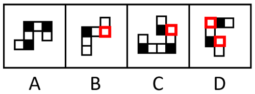
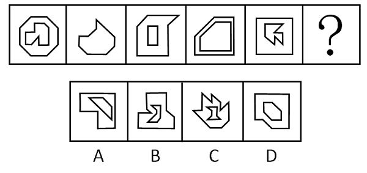
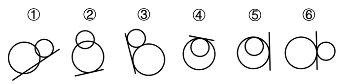
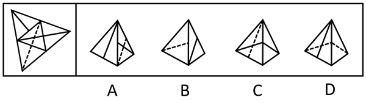
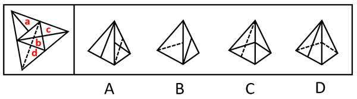
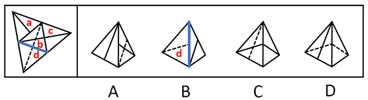
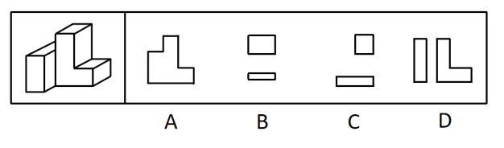
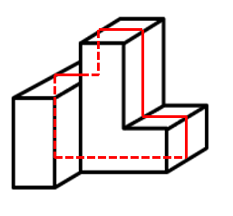
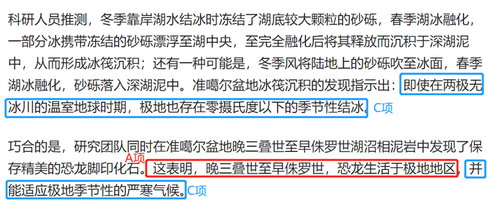

# 2023年浙江省公务员录用考试《行测》题（C类）（网友回忆版）

> 判断推理 · 35 题 · 浙江 2023

## 第 1 题　qid 5430510 · 图形推理

从所给的四个选项中选择最合适的一个填入问号处，使之呈现一定的规律性：

- **A**. A　✅
- **B**. B
- **C**. C
- **D**. D

**答案**：A

**官方解析**

观察发现，题干图形均出现黑块与白块，但数量、位置等均无规律，将两幅图相邻比较发现，黑块的位置存在规律，即题干图形的每个拐角处均为黑块，故“？”处图形的每个拐角处应均为黑块，B、C、D三项均有拐角处不是黑块（如下图所示），只有A项满足规律。

故正确答案为A。

---

## 第 2 题　qid 5430899 · 图形推理

从所给的四个选项中选择最合适的一个填入问号处，使之呈现一定的规律性：

- **A**. A
- **B**. B　✅
- **C**. C
- **D**. D

**答案**：B

**官方解析**

图形元素组成不同，且无明显属性规律，考虑数量规律。观察发现，题干每幅图都是由直线构成，存在直线相交且出现明显的直角，优先考虑数直角数。图形大多分为内、外两部分，考虑分开数直角数。外框图形直角数依次为0、1、2、3、4、“？”，所以“？”处应该选择一个外框直角数为5的图形，只有B项符合。
故正确答案为B。

---

## 第 3 题　qid 5430358 · 图形推理

从所给的四个选项中选择最合适的一个填入问号处，使之呈现一定的规律性：

- **A**. A　✅
- **B**. B
- **C**. C
- **D**. D

**答案**：A

**官方解析**

元素组成相同，优先考虑位置规律。题干图形均出现了二十五宫格，考虑内外分开看平移。观察发现，内圈的黑块每次逆时针平移1格，外圈的黑块每次顺时针平移2格，只有A项符合。

故正确答案为A。

---

## 第 4 题　qid 5430354 · 图形推理

从所给的四个选项中选择最合适的一个填入问号处，使之呈现一定的规律性：

- **A**. A
- **B**. B
- **C**. C　✅
- **D**. D

**答案**：C

**官方解析**

元素组成相似，优先考虑样式规律。观察发现，题干图形均存在黑块、白块以及空白区域，且黑块数量不成规律，优先考虑黑白运算。第一组图形的运算规律为：黑+黑=空，空+空=空，黑+白＝黑，白+白＝空，空+黑=黑，白+空=白，空+白=白，黑+空=黑，第二组图形运用此规律，只有C项符合。
故正确答案为C。

---

## 第 5 题　qid 5430505 · 图形推理

从所给的四个选项中选择最合适的一个填入问号处，使之呈现一定的规律性：

- **A**. A
- **B**. B
- **C**. C　✅
- **D**. D

**答案**：C

**官方解析**

元素组成不同，优先考虑属性规律。观察发现，题干图形出现等腰元素，优先考虑对称性。第一组图中，每个图形均只有一条纵向的对称轴，第二组图中，前两幅图形也均只有一条纵向的对称轴，所以？处应填入只有一条纵向对称轴的图形，排除B、D两项。继续观察发现，题干图形出现明显的空白面，考虑面数量。第一组图中，图形的面数量依次为2、3、4，第二组图中，图形的面数量依次为2、3、？，故？处应选择一个面数量为4的图形，只有C项符合。
故正确答案为C。

---

## 第 6 题　qid 5430356 · 图形推理

把下面的六个图形分为两类，使每一类图形都有各自的共同特征或规律，分类正确的一项是：

- **A**. ①②⑤，③④⑥　✅
- **B**. ①③④，②⑤⑥
- **C**. ①④⑤，②③⑥
- **D**. ①⑤⑥，②③④

**答案**：A

**官方解析**

本题为分组分类题目。观察发现，题干图形中明显出现相切，其中图①②⑤中直线均与1个圆相切，图③④⑥中直线均与2个圆相切，故图①②⑤一组，图③④⑥一组。
故正确答案为A。

---

## 第 7 题　qid 5430410 · 图形推理

左图给定的是纸盒的外表面，右边哪项能由它折叠而成？

- **A**. A
- **B**. B
- **C**. C　✅
- **D**. D

**答案**：C

**官方解析**

将原展开图标上序号如下图，逐一进行分析。

A项：选项右侧为面b，左侧为面a或面c，选项中左侧面上的实线与其和面b的公共边中点不相交，而展开图中面a与面c上的实线均和该面与面b的公共边中点相交，选项与展开图不一致，排除；

B项：选项左侧为面d，右侧为面a或面c，选项中面d上的虚线与其和右侧面（面a或面c）的公共边中点相交，而展开图中面d上虚线与其和面b的公共边中点相交，选项与展开图不一致，排除； 

C项：选项由面b和面c构成，与展开图一致，当选；

D项：选项由面b和面d构成，以面b中引出实线的顶点为起点，沿面b顺时针画边（如下图所示），展开图中边3对应面d，而选项中边1对应面d，选项与展开图不一致，排除。

故正确答案为C。

---

## 第 8 题　qid 5430887 · 图形推理

左图为给定的多面体，将其从任一面剖开，哪项不可能是该多面体的截面？

- **A**. A
- **B**. B
- **C**. C
- **D**. D　✅

**答案**：D

**官方解析**

本题考查截面图，逐一分析选项。

A项：如下图所示，可以截出，排除；

B项：如下图所示，可以截出，排除；

C项：如下图所示，可以截出，排除；

D项：无法截出，当选。

本题为选非题，故正确答案为D。

---

## 第 9 题　qid 5430362 · 定义判断

发现不均衡套利是指通过发现和利用市场上的资源供给和需求不一致进行调配导致的盈利机会获利。
根据上述定义，下列不属于发现不均衡套利的是：

- **A**. 孔子的门生子贡在曹国与鲁国之间通过贱买贵卖来获利
- **B**. 小王预见来年橄榄必然大获丰收，便买断了当地所有的榨油机，第二年高价出租获得巨额财富
- **C**. F汽车公司针对当时汽车价格昂贵、普通居民消费不起的状况，推出了价廉物美的T型车，迅速进入普通家庭　✅
- **D**. 20世纪80年代，中国农村出现大量富余劳动力，而工业产品又极为缺乏。因此将富余的农村劳动力组织起来生产工业产品，可以获利

**答案**：C

**官方解析**

第一步：找出定义关键词。
“通过发现和利用市场上的资源供给和需求不一致进行调配”、“导致的盈利机会获利”。
第二步：逐一分析选项。
A项：曹国与鲁国之间贱买贵卖，说明商品在两个空间上存在“市场上的资源供给和需求不一致”，通过这种商品的买卖，实现了对“供需不一致资源”的调配，从而创造“盈利机会”而获利，符合定义，排除；
B项：来年橄榄的大丰收会造成未来榨油机的供不应求，说明现在和未来两个时间上对于榨油机的供需是不一致的，符合“市场上的资源供给和需求不一致”，通过现在买断榨油机，第二年高价出租，实现了对“供需不一致资源”的调配，从而创造“盈利机会”而获利，符合定义，排除；
C项：仅提到目前汽车市场普通居民消费不起，F公司推出价廉物美的T型车，只是推出新产品，并不是对“供给和需求不一致进行调配”，不符合定义，当选；
D项：农村出现大量富余劳动力，体现出在农业方面劳动力供过于求，而工业产品极度缺乏，体现出工业方面劳动力供不应求，说明农业和工业两个领域产品市场和要素市场存在“供给和需求不一致”，通过将富余的农村劳动力组织起来生产工业产品，符合实现了对“供需不一致资源”的调配，从而创造“盈利机会”而获利，符合定义，排除。
本题为选非题，故正确答案为C。

---

## 第 10 题　qid 5430366 · 定义判断

经济学中的“公用品”并不是指大家都在使用的物品，同时“私用品”也不是一个人使用的物品。公用品指一个人使用的过程中不排斥和影响他人使用的物品；而私用品指一个人在使用过程中会排斥或者影响其他人使用的物品。
根据上述定义，下列属于公用品的是：

- **A**. 会议室
- **B**. 停车场
- **C**. 小区草坪
- **D**. 有线电视的信号　✅

**答案**：D

**官方解析**

第一步：找出定义关键词。
公用品：“使用过程中不排斥和影响他人使用”；
私用品：“使用过程中会排斥或影响他人使用”。
第二步：逐一分析选项。
A项：一个人在使用会议室时会影响其他人的使用，不符合“使用过程中不排斥和影响他人使用”，不符合“公用品”定义，排除；
B项：一个人在停车场停车时会影响其他人的使用，不符合“使用过程中不排斥和影响他人使用”，不符合“公用品”定义，排除；
C项：一个人在使用小区草坪时会影响其他人的使用，不符合“使用过程中不排斥和影响他人使用”，不符合“公用品”定义，排除；
D项：有线电视的信号可同时供多人使用，一个人使用时不会影响到其他人的使用，符合“使用过程中不排斥和影响他人使用”，符合“公用品”定义，当选。
故正确答案为D。

---

## 第 11 题　qid 5430368 · 定义判断

机器学习专门研究计算机如何模拟人类的学习行为，以获取新的知识或技能，提高学习效率。通常使用数据或以往的经验，以此优化计算机程序的性能。
根据上述定义，下列不属于机器学习的是：

- **A**. 某公司通过海量数据，不断升级门禁考勤等场景的人脸识别技术的版本，将准确率从85%提高至99%
- **B**. 科研小组分析人类学习行为，决定让计算机先选用简单的数据再选用复杂的数据依次训练，提升了计算机算法的准确率
- **C**. 某高校统计学生核酸完成情况，利用算法识别核酸报告截图特定字符，自动生成结果，统计汇总时间由一小时缩短至两分钟　✅
- **D**. 某AI算法在数据量较少的情况下，通过模拟双方对抗情况获取训练数据，不断提升技巧，最终在网络游戏中达到职业选手水平

**答案**：C

**官方解析**

第一步，找出定义关键词。
“使用数据或以往的经验”、“优化计算机程序的性能”。
第二步，逐一分析选项。
A项：某公司通过海量数据，不断升级人脸识别技术的版本，提高了准确率，符合“使用数据或以往的经验”、“优化计算机程序的性能”，符合定义，排除；
B项：科研小组让计算机选用不同难度的数据依次训练，提升了计算机算法的准确率，符合“使用数据或以往的经验”、“优化计算机程序的性能”，符合定义，排除；
C项：某高校利用算法识别核酸报告截图特定字符，缩短了统计汇总时间，并没有提升算法的性能，不符合“优化计算机程序的性能”，不符合定义，当选；
D项：某AI算法通过模拟双方对抗情况获取训练数据，不断提升技巧，符合“使用数据或以往的经验”、“优化计算机程序的性能”，符合定义，排除。
本题为选非题，故正确答案为C。

---

## 第 12 题　qid 5430370 · 定义判断

弱关系社交，指以网络平台为载体，在陌生人之间展开的、不以加强彼此关系为目的的人际交往活动。
根据上述定义，下列不属于弱关系社交的是：

- **A**. 参与中国象棋小程序自动匹配对手的游戏
- **B**. 为刚刚添加的微信好友的朋友圈动态点赞　✅
- **C**. 在网络直播平台对小视频评论进行再评论
- **D**. 网络游戏过程中为提高游戏技术相互切磋

**答案**：B

**官方解析**

第一步，找出定义关键词。
“以网络平台为载体”、“在陌生人之间展开的”、“不以加强彼此关系为目的”。
第二步，逐一分析选项。
A项：游戏对手是通过计算机程序自动匹配的，相互之间并不认识，符合“以网络平台为载体”、“在陌生人之间展开的”、“不以加强彼此关系为目的”，符合定义，排除；
B项：为刚刚添加的微信好友的朋友圈动态点赞，说明在成为微信好友前就有可能认识，不一定是陌生人，并且添加微信好友的目的就是加强相互之间的联系，不符合“在陌生人之间展开的”、“不以加强彼此关系为目的”，不符合定义，当选；
C项：在网络直播平台对小视频评论进行再评论，符合“以网络平台为载体”、“在陌生人之间展开的”、“不以加强彼此关系为目的”，符合定义，排除；
D项：网络游戏过程中为提高游戏技术相互切磋，符合“以网络平台为载体”、“在陌生人之间展开的”、“不以加强彼此关系为目的”，符合定义，排除。
本题为选非题，故正确答案为B。

---

## 第 13 题　qid 5430372 · 定义判断

审美意象是用来表达某种抽象的观念或者哲理的艺术形象，它是艺术家在构思过程中，将自己的审美情感、审美认识与客观的事物相融合，并以一定的艺术表达方式呈现出来的内心视像。
根据上述定义，下列不属于审美意象的是：

- **A**. 鲁迅作品《祝福》中的人物“祥林嫂”
- **B**. “采菊东篱下，悠然见南山”中的“南山”
- **C**. 漫画作品《三毛流浪记》中的人物“三毛”
- **D**. 日常语句“太阳出来了，该起床了”中的“太阳”　✅

**答案**：D

**官方解析**

第一步：找出定义关键词。
“艺术家在构思过程中”、“将自己的审美情感、审美认识与客观的事物相融合”、“以一定的艺术表达方式呈现出来的内心视像”。
第二步：逐一分析选项。
A项：“祥林嫂”是鲁迅作品《祝福》中的悲剧性人物，是旧中国农村劳动妇女的典型，符合“艺术家在构思过程中”、“将自己的审美情感、审美认识与客观的事物相融合”、“以一定的艺术表达方式呈现出来的内心视像”，符合定义，排除；
B项：“南山”是陶渊明诗句中的艺术形象，该句诗表现了诗人悠然闲适的生活态度，诗人将自己的情感和客观事物相融合，符合“艺术家在构思过程中”、“将自己的审美情感、审美认识与客观的事物相融合”、“以一定的艺术表达方式呈现出来的内心视像”，符合定义，排除；
C项：“三毛”是漫画作品《三毛流浪记》中一个身世凄凉、饥寒交迫、受尽欺辱、贫穷得只剩下三根头发的中国儿童形象，符合“艺术家在构思过程中”、“将自己的审美情感、审美认识与客观的事物相融合”、“以一定的艺术表达方式呈现出来的内心视像”，符合定义，排除；
D项：“太阳出来了，该起床了”中的“太阳”是用在日常语句中，没有体现艺术家创作作品的构思过程和艺术的表达方式，不符合“艺术家在构思过程中”、“将自己的审美情感、审美认识与客观的事物相融合”、“以一定的艺术表达方式呈现出来的内心视像”，不符合定义，当选。
本题为选非题，故正确答案为D。

---

## 第 14 题　qid 5430380 · 定义判断

脱敏作用是指对人重复呈现一个激发情绪的刺激，则该个体情绪化反应会逐渐消失。
根据上述定义，下列涉及脱敏作用的是：

- **A**. 小华幼年时曾被狗追咬过，成年后看到狗仍然会感到非常恐惧
- **B**. 小孙爱玩含有暴力元素的游戏，生活中偶尔会模仿游戏中人物的行为
- **C**. 小王近期经常观看犯罪题材的影片，认为外面的世界很危险，走夜路时常会担心有意外发生
- **D**. 老师发现小明与女同学交谈时总会面红耳赤，就要求他每天主动和邻座女同学进行学习讨论　✅

**答案**：D

**官方解析**

第一步：找出定义关键词。
“对人重复呈现一个激发情绪的刺激”、“该个体情绪化反应会逐渐消失”。
第二步：逐一分析选项。
A项：小华成年后看到狗仍然会感到非常恐惧，说明小华被狗追咬的恐惧没有消失，不符合“该个体情绪化反应会逐渐消失”，不符合定义，排除；
B项：小孙生活中模仿游戏中人物的暴力行为，说明含有暴力元素的游戏对他的影响并没有逐渐消失，不符合“该个体情绪化反应会逐渐消失”，不符合定义，排除；
C项：小王走夜路时常会担心有意外发生，说明看犯罪题材的影片对他的影响并没有逐渐消失，不符合“该个体情绪化反应会逐渐消失”，不符合定义，排除；
D项：小明与女同学交谈时总会面红耳赤，老师要求他每天主动和邻座女同学进行学习讨论，符合“对人重复呈现一个激发情绪的刺激”，符合定义，当选。
故正确答案为D。

---

## 第 15 题　qid 5430382 · 定义判断

群体归属感是指个人体验到自己属于或应属于某一群体成员的意识，是个人隶属于或依赖于群体的需要，是一种人类社会性的表现。有了这种意识，个体在进行自己的活动、认知和评价时，就会自觉地维护这个群体的利益，并与群体内的其他成员在情感上发生共鸣。
根据上述定义，下列没有体现群体归属感的是：

- **A**. 中秋节时小韦与几个要好的朋友一起分享月饼　✅
- **B**. 王晓峰听到别人说他所在班级的坏话时很生气
- **C**. 退役士兵小王常向他人说自己曾是某英雄连的
- **D**. 小强外出时总自豪地在外衣上佩戴学校的校徽

**答案**：A

**官方解析**

第一步：找出定义关键词。
“个人体验到自己属于或应属于某一群体成员的意识”、“个体在进行自己的活动、认知和评价时，会自觉地维护群体的利益”、“与群体内的其他成员在情感上发生共鸣”。
第二步：逐一分析选项。
A项：中秋节小韦与要好的朋友分享月饼，没有体现小韦感觉自己是某一群体的成员，也没有体现小韦自觉地维护群体的利益，不符合“个人体验到自己属于或应属于某一群体成员的意识”、“个体在进行自己的活动、认知和评价时，会自觉地维护群体的利益”，不符合定义，当选；
B项：王晓峰听到别人说他所在班级的坏话时很生气，体现了他感觉自己是班级这一群体的成员，符合“个人体验到自己属于或应属于某一群体成员的意识”、“个体在进行自己的活动、认知和评价时，会自觉地维护群体的利益”、“与群体内的其他成员在情感上发生共鸣”，符合定义，排除；
C项：退役士兵小王常向他人说自己曾是某英雄连的，体现了他感觉自己是连队这一群体的成员，符合“个人体验到自己属于或应属于某一群体成员的意识”、“个体在进行自己的活动、认知和评价时，会自觉地维护群体的利益”、“与群体内的其他成员在情感上发生共鸣”，符合定义，排除；
D项：小强外出时总自豪地在外衣上佩戴学校的校徽，体现了他感觉自己是学校这一群体的成员，符合“个人体验到自己属于或应属于某一群体成员的意识”、“个体在进行自己的活动、认知和评价时，会自觉地维护群体的利益”、“与群体内的其他成员在情感上发生共鸣”，符合定义，排除。
本题为选非题，故正确答案为A。

---

## 第 16 题　qid 5430383 · 定义判断

多重趋避式冲突是指人们面对着两个或两个以上的目标，而目标又各自分别具有吸引和排斥两方面的作用，人们无法简单地选择一个目标而回避或拒绝另一个目标时的矛盾心态。
根据上述定义，下列体现多重趋避式冲突的是：

- **A**. 张女士在二胎问题上犹豫不决，既想儿女双全，又怕无力抚养
- **B**. 周女士有一次难得的外省培训机会，可又放心不下家中年幼的孩子
- **C**. 王先生有一笔闲置资金，用于炒股担心风险大，用于储蓄又嫌收益低　✅
- **D**. 李同学在收到研究生录取通知书的同时，又得到了心仪公司的入职邀请

**答案**：C

**官方解析**

第一步：找出定义关键词。
“人们面对着两个或两个以上的目标”、“目标各自分别具有吸引和排斥两方面的作用”、“人们无法简单地选择一个目标而回避或拒绝另一个目标时的矛盾心态”。
第二步：逐一分析选项。
A项：张女士面临的只有“生二胎”一个目标，儿女双全和无力抚养分别是目标的吸引方面和排斥方面，不符合“人们面对着两个或两个以上的目标”，不符合定义，排除；
B项：周女士面临的只有“省外培训”一个目标，放心不下家中年幼的孩子是目标的排斥方面，不符合“人们面对着两个或两个以上的目标”，不符合定义，排除；
C项：王先生面临“闲置资金炒股”和“闲置资金储蓄”两个目标，收益高和风险大是“闲置资金炒股”的吸引方面和排斥方面，风险低和收益低是“闲置资金储蓄”的吸引方面和排斥方面，王先生在两个目标中感到纠结矛盾，符合“人们面对着两个或两个以上的目标”、“目标各自分别具有吸引和排斥两方面的作用”、“人们无法简单地选择一个目标而回避或拒绝另一个目标时的矛盾心态”，符合定义，当选；
D项：李同学面临“研究生录取”和“心仪公司入职”两个目标，但并没有体现他在两个目标中感到纠结矛盾，不符合“人们无法简单地选择一个目标而回避或拒绝另一个目标时的矛盾心态”，不符合定义，排除。
故正确答案为C。

---

## 第 17 题　qid 5430384 · 定义判断

功能文化区是按照人类社会的某项功能组织建立起来的，在空间结构上具有较固定的、确切的边界，其内部彼此之间因功能有一种互相联系从而确定其分布区范围的文化区。形式文化区是指不同性质的文化现象分布的范围，是某些具有相互联系的文化现象在空间分布上具有集中的核心区与模糊边界的文化地域单元。
根据上述定义，下列属于功能文化区的是：

- **A**. 城市中的外籍人员聚居区
- **B**. 城市中的行为艺术聚集区
- **C**. 城市郊区的垃圾集中处理区
- **D**. 城市中的博物馆图书馆集中区　✅

**答案**：D

**官方解析**

第一步：找出定义关键词。
功能文化区：“按照人类社会的某项功能组织建立起来的”、“在空间结构上具有较固定的、确切的边界”、“内部彼此之间因功能的互相联系而确定其分布区范围的文化区”；
形式文化区：“某些具有相互联系的文化现象”、“在空间分布上具有集中的核心区与模糊边界的文化地域单元”。
第二步：逐一分析选项。
A项：城市中的外籍人员聚居区，不符合“按照人类社会的某项功能组织建立起来的”、“内部彼此之间因功能的互相联系而确定其分布区范围的文化区”，不符合“功能文化区”定义，排除；
B项：城市中的行为艺术聚集区，不符合“按照人类社会的某项功能组织建立起来的”、“内部彼此之间因功能的互相联系而确定其分布区范围的文化区”，不符合“功能文化区”定义，排除；
C项：城市郊区的垃圾集中处理区，不是文化区，不符合“内部彼此之间因功能的互相联系而确定其分布区范围的文化区”，不符合“功能文化区”定义，排除；
D项：城市中的博物馆图书馆集中区，符合“按照人类社会的某项功能组织建立起来的”，博物馆和图书馆在空间上具有明确的边界，且功能之间有联系，又属于文化区，符合“在空间结构上具有较固定的、确切的边界”、“内部彼此之间因功能的互相联系而确定其分布区范围的文化区”，符合“功能文化区”定义，当选。
故正确答案为D。

---

## 第 18 题　qid 5430386 · 定义判断

表演型人格又称寻求注意型人格，是一种以过分情感化和夸张的言行吸引他人注意的人格。具有表演型人格的人易感情用事，自我中心，情绪多变，以致难以与周围人保持正常的社会关系。
根据上述定义，下列与表演型人格无关的是：

- **A**. 小邓喜欢穿奇装异服，希望吸引别人的注意
- **B**. 小王具有表演才能，讲话时手舞足蹈、表情丰富
- **C**. 小刘在人际交往受挫折时，表现出歇斯底里行为
- **D**. 小顾没有几个知心朋友，但他经常说自己有很多知心朋友　✅

**答案**：D

**官方解析**

第一步：找出定义关键词。
“过分情感化和夸张的言行”、“吸引他人注意”。
第二步：逐一分析选项。
A项：小邓喜欢穿奇装异服，属于夸张的行为，符合“过分情感化和夸张的言行”，希望吸引别人的注意，符合“吸引他人注意”，符合定义，排除；
B项：小王具有表演才能，讲话时手舞足蹈、表情丰富，属于夸张的行为，符合“过分情感化和夸张的言行”，符合定义，排除；
C项：小刘在人际交往受挫折时，表现出歇斯底里行为，属于过分情感化的行为，符合“过分情感化和夸张的言行”，符合定义，排除；
D项：小顾没有几个知心朋友，却说自己有很多知心朋友，这是属于夸大事实，而不是过分夸张，且其他选项均为行为上明显的夸张，D只是语言上的吹嘘，对比择优，该项最不明显，不符合“过分情感化和夸张的言行”，不符合定义，当选。
本题为选非题，故正确答案为D。

---

## 第 19 题　qid 5430381 · 类比推理

心宽：体胖

- **A**. 唇亡：齿寒　✅
- **B**. 鼻青：脸肿
- **C**. 手忙：脚乱
- **D**. 半斤：八两

**答案**：A

**官方解析**

第一步：判断题干词语间逻辑关系。
“心宽体胖”指心情愉快，无所牵挂，因而人感到舒坦，因为“心宽”，所以“体胖”，二者为因果对应关系。
第二步：判断选项词语间逻辑关系。
A项：“唇亡齿寒”指嘴唇没有了，牙齿就会觉得冷，形容关系密切，利害相关，因为“唇亡”，所以“齿寒”，二者为因果对应关系，与题干逻辑关系一致，当选；
B项：“鼻青脸肿”指鼻子青了，脸也肿了，形容面部被碰伤或打伤的样子，也形容遭到严重打击或挫折的狼狈相，二者不是因果对应关系，与题干逻辑关系不一致，排除；
C项：“手忙脚乱”形容做事慌张而没有条理，也形容惊慌失措，二者不是因果对应关系，与题干逻辑关系不一致，排除；
D项：“半斤八两”比喻彼此一样，不相上下（多含贬义），二者不是因果对应关系，与题干逻辑关系不一致，排除。
故正确答案为A。

---

## 第 20 题　qid 5430385 · 类比推理

长白山：火山

- **A**. 皇陵：古建筑
- **B**. 巢湖：淡水湖　✅
- **C**. 连衣裙：丝绸
- **D**. 火箭军：军人

**答案**：B

**官方解析**

第一步：判断题干词语间逻辑关系。
通常所说的“长白山”指长白山脉主峰，“长白山”是“火山”，且“长白山”是“火山”中的一个，二者为包容关系中的特指。
第二步：判断选项词语间逻辑关系。
A项：“皇陵”是皇帝或皇室成员的陵墓，“皇陵”是“古建筑”，但“皇陵”是“古建筑”中的一种，二者为包容关系中的种属关系，与题干逻辑关系不一致，排除。
B项：“巢湖”是“淡水湖”，且“巢湖”是“淡水湖”中的一个，二者为包容关系中的特指，与题干逻辑关系一致，当选。
C项：“丝绸”是制作“连衣裙”的原材料，二者为原材料与成品的对应关系，与题干逻辑关系不一致，排除。
D项：“火箭军”是我国解放军的一种，“军人”是“火箭军”的组成部分，二者为组成关系，与题干逻辑关系不一致，排除。
故正确答案为B。

---

## 第 21 题　qid 5430387 · 类比推理

上市公司：跨国企业

- **A**. 大专院校：高等教育
- **B**. 商业银行：金融机构
- **C**. 快捷酒店：连锁酒店　✅
- **D**. 进口产品：出口产品

**答案**：C

**官方解析**

第一步：判断题干词语间逻辑关系。
上市公司指经有关部门核准，公开发行股票并在证券交易所上市交易的股份有限公司。跨国企业指在两个或两个以上国家从事国际化经营活动的企业。有的上市公司是跨国企业，有的上市公司不是跨国企业，有的跨国企业是上市公司，有的跨国企业不是上市公司，二者为交叉关系。
第二步：判断选项词语间逻辑关系。
A项：高等教育指在完成中等教育的基础上进行的专业教育和职业教育，学历层次包括专科、本科等，因此，大专院校属于高等教育，二者为种属关系，与题干逻辑关系不一致，排除；
B项：商业银行是金融机构，二者为种属关系，与题干逻辑关系不一致，排除；
C项：快捷酒店是功能简化的经济型酒店的一种，连锁酒店是指连锁经营的酒店，有的快捷酒店是连锁酒店，有的快捷酒店不是连锁酒店，有的连锁酒店是快捷酒店，有的连锁酒店不是快捷酒店，二者为交叉关系，与题干逻辑关系一致，当选；
D项：进口产品和出口产品为并列关系，与题干逻辑关系不一致，排除。
故正确答案为C。

---

## 第 22 题　qid 5430389 · 类比推理

蚕茧：丝绸：衣服

- **A**. 矿山：矿石：螺丝
- **B**. 树木：纸张：书本　✅
- **C**. 小麦：面条：馒头
- **D**. 沙粒：珍珠：项链

**答案**：B

**官方解析**

第一步：判断题干词语间逻辑关系。
蚕茧是制作丝绸的原材料，丝绸是制作衣服的原材料，二者均为原材料的对应关系。
第二步：判断选项词语间逻辑关系。
A项：矿山是产出矿石的地点，二者为地点的对应关系，矿石是制作螺丝的原材料，二者为原材料的对应关系，与题干逻辑关系不一致，排除；
B项：树木是制作纸张的原材料，纸张是制作书本的原材料，二者均为原材料的对应关系，与题干逻辑关系一致，当选；
C项：小麦是制作面条和馒头的原材料，第一词与后两词分别为原材料的对应关系，且面条和馒头为不同的主食，二者为并列关系，与题干逻辑关系不一致，排除；
D项：蚌受到沙粒侵入的刺激会分泌珍珠质将沙粒一层层包裹起来形成珍珠，二者不是原材料的对应关系，与题干逻辑关系不一致，排除。
故正确答案为B。

---

## 第 23 题　qid 5430390 · 类比推理

白天：夜晚：夏夜

- **A**. 红色：黑色：漆黑
- **B**. 中国：外国：欧洲国家　✅
- **C**. 高山：大海：南海
- **D**. 草原：森林：原始森林

**答案**：B

**官方解析**

第一步：判断题干词语间逻辑关系。
除了白天就只有夜晚，二者为并列关系中的矛盾关系，夏夜属于夜晚，二者为种属关系。
第二步：判断选项词语间逻辑关系。
A项：红色和黑色是两种不同的颜色，除此之外还有其他颜色，二者为并列关系中的反对关系，漆黑属于黑色，二者为种属关系，与题干逻辑关系不一致，排除；
B项：除了中国就只有外国，二者为并列关系中的矛盾关系，欧洲国家属于外国，二者为种属关系，与题干逻辑关系一致，当选；
C项：高山和大海是两种不同的自然景观，除此之外还有其他自然景观，二者为并列关系中的反对关系，南海属于大海，二者为种属关系，与题干逻辑关系不一致，排除；
D项：草原和森林是两种不同的生态系统，除此之外还有其他生态系统，二者为并列关系中的反对关系，原始森林属于森林，二者为种属关系，与题干逻辑关系不一致，排除。
故正确答案为B。

---

## 第 24 题　qid 5430392 · 类比推理

售卖假货：举报维权：上门调查

- **A**. 点菜下单：烹饪菜肴：传送菜品　✅
- **B**. 发表文章：勘误声明：印刷错误
- **C**. 投递简历：考试通过：正式录取
- **D**. 赛前动员：拟定阵容：布置战术

**答案**：A

**官方解析**

第一步：判断题干词语间逻辑关系。
首先“售卖假货”，其次“举报维权”，最后“上门调查”，三者为时间先后顺序的对应关系，且“售卖假货”的主体为商家，“举报维权”的主体为消费者，“上门调查”的主体为工商局、质监局，三者主体不一致。
第二步：判断选项词语间逻辑关系。
A项：首先“点菜下单”，其次“烹饪菜肴”，最后“传送菜品”，三者为时间先后顺序的对应关系，且“点菜下单”的主体为食客，“烹饪菜肴”的主体为厨师，“传送菜品”的主体为服务员，三者主体不一致，与题干逻辑关系一致，当选；
B项：首先“发表文章”，其次“印刷错误”，最后“勘误声明”， 三者为时间先后顺序的对应关系，但顺序不一致，与题干逻辑关系不一致，排除；
C项：首先“投递简历”，其次“考试通过”，最后“正式录取”，三者为时间先后顺序的对应关系，但“投递简历”与“考试通过”的主体均为应聘者，与题干逻辑关系不一致，排除；
D项：首先“赛前动员”，其次“拟定阵容”，最后“布置战术”，三者为时间先后顺序的对应关系，但“赛前动员”“拟定阵容”“布置战术”的主体均为教练，三者主体一致，与题干逻辑关系不一致，排除。
故正确答案为A。

---

## 第 25 题　qid 5430393 · 类比推理

按揭 对于 （    ） 相当于 （    ） 对于 促销

- **A**. 银行 商场
- **B**. 抵押 打折
- **C**. 贷款 降价　✅
- **D**. 购房 商品

**答案**：C

**官方解析**

A项：在银行办理按揭手续，二者为地点对应关系；在商场进行促销活动，二者为地点对应关系，但逻辑顺序相反，前后逻辑关系不一致，排除；
B项：按揭指一种购房或购物的贷款方式，以所购房屋或物品为抵押向银行贷款，然后分期偿还，按揭需要抵押，二者为必要条件对应关系；打折是一种促销方式，二者为种属关系，前后逻辑关系不一致，排除；
C项：按揭指一种购房或购物的贷款方式，以所购房屋或物品为抵押向银行贷款，然后分期偿还，按揭是一种贷款方式，二者为种属关系；降价是一种促销方式，二者为种属关系，前后逻辑关系一致，当选；
D项：按揭指一种购房或购物的贷款方式，以所购房屋或物品为抵押向银行贷款，然后分期偿还，按揭是购房的一种方式，二者为方式目的对应关系；对商品进行促销，商品是进行促销的对象，前后逻辑关系不一致，排除。
故正确答案为C。

---

## 第 26 题　qid 5430352 · 类比推理

小明、小军、小花、小飞和小雅在学校的联欢会上表演节目，表演时他们每人手上各拿了一个不同的气球，气球分别是红色圆形、蓝色五角星形、黄色心形、蓝色圆形、红色心形。
小明说：小花和小雅的气球都不是圆形的，也不是蓝色的。
小军说：我的气球与小雅的颜色和形状都不一样。
小飞说：小雅的气球是黄色的，小明的气球是蓝色的。
小花说：小军的气球与我的是一样的颜色，小飞的气球不是五角星形的。
根据以上信息，下列说法正确的是：

- **A**. 小军的气球是红色心形的
- **B**. 小花的气球是黄色心形的
- **C**. 小飞的气球是红色圆形的
- **D**. 小明的气球是蓝色五角星形的　✅

**答案**：D

**官方解析**

第一步：整理题干条件。
①气球分别是红色圆形、蓝色五角星形、黄色心形、蓝色圆形、红色心形；
②小花和小雅的气球不是圆形的，也不是蓝色的；
③小军与小雅的气球颜色和形状都不一样；
④小雅的气球是黄色的，小明的气球是蓝色的；
⑤小军与小花的气球颜色一样，小飞的气球不是五角星形的。
第二步：根据题干条件进行推理。
由于对象和信息较多，可以考虑从提到次数最多的“小雅”开始推理。根据条件①②④可知，小雅的气球是黄色心形的，小花的气球是红色心形的。再根据条件⑤可知，小军与小花的气球颜色一样，那么小军的气球是红色圆形的，且小飞的气球不是五角星形的，那么小飞的气球是蓝色圆形的，故小明的气球是蓝色五角星形的。
故正确答案为D。

---

## 第 27 题　qid 5430353 · 逻辑判断

关于小张、小李书法学习的情况，有如下判断：（1）如果小张学习魏碑，那么小李学习汉隶；（2）小张既没有学习秦篆，也没有学习魏碑；（3）小张或者学习秦篆，或者学习魏碑。结果发现，上述判断有两项是错误的。
根据以上信息，可以得出以下哪项结论？

- **A**. 小张学习魏碑，小李学习汉隶
- **B**. 小张没有学习魏碑，小李学习汉隶
- **C**. 小张学习魏碑，小李没有学习汉隶　✅
- **D**. 小张没有学习魏碑，小李没有学习汉隶

**答案**：C

**官方解析**

第一步：找出题干矛盾命题。

（1）小张学习魏碑小李学习汉隶；

（2）小张学习秦篆 且 小张学习魏碑；

（3）小张学习秦篆 或 小张学习魏碑。

分析题干条件，（2）与（3）为矛盾关系，必有一真一假。

第二步：根据题干条件进行推理。

根据题干条件可知，3个条件中有2个是错误的，故（1）一定错误，因此其矛盾命题“小张学习魏碑 且 小李学习汉隶”一定为真，即小张学习魏碑，小李没有学习汉隶，对应C项。

故正确答案为C。

---

## 第 28 题　qid 5430355 · 逻辑判断

某地区中小学教师中，毕业于师范类院校的女教师多于毕业于非师范类院校的男教师，        ，所以，该地区中小学女教师比男教师多。
要使上述推理成立，最适合填入画横线位置的是：

- **A**. 毕业于师范类院校的教师少于毕业于非师范类院校的教师　✅
- **B**. 毕业于师范类院校的教师多于毕业于非师范类院校的教师
- **C**. 毕业于师范类院校的女教师比毕业于非师范类院校的男教师多
- **D**. 毕业于非师范类院校的女教师比毕业于非师范类院校的男教师多

**答案**：A

**官方解析**

第一步：分析题干条件。
（1）师范类（女）＞非师范类（男）。
第二步：根据题干条件进行推理。
本题提问方式类似于“补充以下哪项条件”，可以考虑代入法。
代入A项：师范类（男+女）＜非师范类（男+女），即（2）师范类（男）+师范类（女）＜非师范类（男）+非师范类（女），结合条件（1）可以得到：（3）师范类（男）＜非师范类（女），此时（1）+（3）可以得到：女（师范类+非师范类）＞男（师范类+非师范类），可以得到“该地区中小学女教师比男教师多”的结论，当选；
代入B项：师范类（男+女）＞非师范类（男+女），即（2）师范类（男）+师范类（女）＞非师范类（男）+非师范类（女），结合条件（1）无法得到“该地区中小学女教师比男教师多”的结论，排除；
代入C项：师范类（女）＞非师范类（男），与条件（1）相同，无法得到“该地区中小学女教师比男教师多”的结论，排除；
代入D项：非师范类（女）＞非师范类（男），结合条件（1）无法得到“该地区中小学女教师比男教师多”的结论，排除。
故正确答案为A。

---

## 第 29 题　qid 5430357 · 逻辑判断

一项研究通过比较某市在参与创建全国卫生城市前后的环境空气质量发现，该市在参与创建全国卫生城市之后环境空气质量明显优于之前，因此该研究得出结论，创建全国卫生城市有助于提升该市的环境空气质量。
以下哪项如果为真，最能支持上述结论？

- **A**. 参与全国卫生城市创建能够获得更多的政府专项财政补助
- **B**. 众多城市考察团常常来该市学习创建全国卫生城市的经验
- **C**. 参与全国卫生城市创建之前，该市环境空气质量长期处于较差的状况　✅
- **D**. 周边未参与全国卫生城市创建的城市在同时期环境空气质量有所下降

**答案**：C

**官方解析**

第一步：找出论点和论据。
论点：创建全国卫生城市有助于提升该市的环境空气质量。
论据：一项研究通过比较某市在参与创建全国卫生城市前后的环境空气质量发现，该市在参与创建全国卫生城市之后环境空气质量明显优于之前。
本题论点论据均在讨论创建全国卫生城市与该市环境空气质量提升之间的关系，论点论据话题一致，加强优先考虑补充论据。
第二步：逐一分析选项。
A项：该项讨论的是参与全国卫生城市创建能获得更多的财政补助，而论点讨论的是参加全国卫生城市创建可以提升环境空气质量，话题不一致，无法加强，排除；
B项：该项讨论的是其他城市常常学习该市创建全国卫生城市的经验，只能说明该市的环境空气质量优于其他城市，而论点比较的是该市创建全国卫生城市前后的环境空气质量，是自己与自己进行比较，话题不一致，无法加强，排除；
C项：该项指出参与全国卫生城市创建之前，该市的环境空气质量较差，说明该市在参与创建全国卫生城市之后环境空气质量确实更优，补充了论据，可以加强，当选；
D项：该项说的是未参与全国卫生城市创建的城市的情况，而题干讨论的是该市的情况，主体不一致，无法加强，排除。
本题出得不是特别好，如果论点不是有助于提升“该市”的空气质量，而是有助于提升空气质量，那么D项补充对比论据是可以加强的，但是论点现在强调的是“该市”，D项说“其他城市”的情况，此类选项就没那么好了，故择优给到还是在说“该市”的C项。
故正确答案为C。

---

## 第 30 题　qid 5430359 · 逻辑判断

一直以来，高楼大厦被视为城市的象征，甚至很多地方以建筑高度作为城市现代化的象征。越来越多的摩天大楼拔地而起，竞相突破城市天际线的纪录。根据我国《民用建筑设计统一标准》，建筑高度大于100米的即为超高层建筑。这些摩天大楼虽然看起来“挺拔壮观”，但背后的隐患不容忽视。因此，“限高”势在必行。
以下哪项如果为真，最能支持上述观点？

- **A**. 超高层建筑工程造价和运维成本更高，建造施工难度更大
- **B**. 中国150米、200米、300米以上建筑的数量均保持全球第一
- **C**. 超高层建筑安全风险更大，逃生疏散时间长，消防设施、抗震技术复杂，管理运维要求更高　✅
- **D**. 城市建筑风貌是城市外在形象和内质精神的有机统一，限高有利于打造更多符合城市风貌的建筑

**答案**：C

**官方解析**

第一步：找出论点和论据。
论点：“限高”势在必行。
论据：根据我国《民用建筑设计统一标准》，建筑高度大于100米的即为超高层建筑。这些摩天大楼虽然看起来“挺拔壮观”，但背后的隐患不容忽视。
本题的论点讨论的是“限高”势在必行，论据讨论的是摩天大楼背后的隐患不容忽视，可以合理推出需要“限高”，可以看作论点论据话题一致，加强优先考虑补充论据。
第二步：逐一分析选项。
A项：该项讨论的是超高层建筑工程造价和运维成本更高，施工难度更大，并没有提及它有什么隐患，进而也无法证明这些摩天大楼是否需要“限高”，话题不一致，无法加强，排除；
B项：该项讨论的是中国的超高层建筑的数量在全球保持第一，而论点讨论的是这些高层建筑背后的隐患，话题不一致，无法加强，排除；
C项：该项指出超高层建筑安全风险更大，并解释说明了这些超高层建筑确实具有安全隐患，应该“限高”，补充论据，可以加强，当选；
D项：该项指出限高有利于打造更多符合城市风貌的建筑，而论点讨论的是超高建筑因为有安全隐患所以需要限高，话题不一致，无法加强，排除。
故正确答案为C。

---

## 第 31 题　qid 5430364 · 图形推理

在戏剧史上，从三棱景柱的出现到立体布景的使用，从煤气灯照明到电脑灯的布控，都曾使戏剧演出的总体面貌产生巨大变化。剧场科技、智能舞台、多媒体、声学、光学、电学技术的广泛运用，丰富了当代舞台的表现手段和艺术面貌，并且为人们带来全新的审美体验。有文化学者据此推断，戏剧艺术对现代科技手段会越来越倚重，演员不主动适应被各种科技元素构筑起来的表演空间，就会被时代所淘汰。
以下哪项如果为真，最能削弱该学者的推断？

- **A**. 借助现代拍摄技术和传播手段，国家大剧院的演出可以实时传播到世界各地
- **B**. 中国传统戏曲“一桌二椅”的高度象征性和程式化表演方式，更有独特的艺术魅力
- **C**. 剧场科技、智能舞台等现代科技手段的广泛运用，没有实质性改变戏剧的艺术面貌　✅
- **D**. 一些演员依赖现代科技手段替代有可能损伤身体的传统危险表演动作，降低了艺术魅力

**答案**：C

**官方解析**

第一步：找出论点和论据。
论点：戏剧艺术对现代科技手段会越来越倚重，演员不主动适应被各种科技元素构筑起来的表演空间，就会被时代所淘汰。
论据：剧场科技、智能舞台、多媒体、声学、光学、电学技术的广泛运用，丰富了当代舞台的表现手段和艺术面貌，并且为人们带来全新的审美体验。
本题论点讨论的是演员不主动适应被各种科技元素构筑起来的表演空间，就会被时代所淘汰，论据讨论的是各种科技元素丰富了舞台，且为人们带来全新的审美体验。论点论据都在讨论加入科技元素的戏剧艺术，论点和论据话题一致，削弱优先考虑削弱论点。
第二步：逐一分析选项。
A项：该项讨论的是现代拍摄技术和传播手段有利于演出的传播，但是论点讨论的是如果演员不主动适应被各种科技元素构筑起来的表演空间，是否会被时代所淘汰，话题不一致，无法削弱，排除；
B项：该项讨论的是中国传统戏曲“一桌二椅”更有独特的艺术魅力，通过举例子表明传统的戏剧艺术具有独特魅力，那么就有可能不会被现代科技手段所取代，不会被时代所淘汰，具有一定的削弱力度，保留；
C项：该项指出现代科技手段的广泛运用没有实质性改变戏剧的艺术面貌，指出艺术的表现形式不是最重要的，艺术本身更为关键，而科技不会改变艺术本身，那么即使演员不主动适应各种科技元素，也不会被时代淘汰，直接否定论点，保留；
D项：该项指出加入现代科技手段后，降低了艺术魅力，讨论的是艺术魅力的高低，但是论点讨论的是如果演员不主动适应被各种科技元素构筑起来的表演空间，是否会被时代所淘汰，话题不一致，无法削弱，排除。
对比BC两项，第一，B项举出“一桌二椅”的个例，而C项从整体进行论证，整体大于部分，C项更优；第二，对比关键词，B项的例子题干并未涉及，而C项的“剧场科技、智能舞台等现代科技手段”正是题干讨论的内容，C项的关键词更贴近题干。综上，对比择优，本题答案择优为C项。
故正确答案为C。

---

## 第 32 题　qid 5430367 · 逻辑判断

研究人员开发了一种可以从指尖上的汗水中获取能量的新设备。在10小时的睡眠期间内，无需任何机械能量输入的情况下，该设备每平方厘米可产生300毫焦耳的能量；只需按一下手指，就能额外产生30毫焦耳的能量。这意味着可自我维持的可穿戴电子产品向更实用、更方便、更大众化的方向迈出了重要一步。
以下哪项如果为真，最能支持上述论述？

- **A**. 新设备产生的电能可被储存在小电容器中，并在需要时释放到其他设备
- **B**. 此前基于汗水收集能量的设备需要佩戴者大量运动出足够的汗来激活发电　✅
- **C**. 手指是身体24小时的“汗水工厂”，产生的汗量是其他部位的100到1000倍
- **D**. 一名受试者在10小时睡眠中收集了近400毫焦耳的能量，这足以为一块电子表提供24小时电力

**答案**：B

**官方解析**

第一步：找出论点和论据。

论点：可自我维持的可穿戴电子产品向更实用、更方便、更大众化的方向迈出了重要一步。

论据：在10小时的睡眠期间内，无需任何机械能量输入的情况下，该设备每平方厘米可产生300毫焦耳的能量；只需按一下手指，就能额外产生30毫焦耳的能量。

论据讨论的是睡眠期间可通过手指让新设备产生能量，论点说的是新设备的出现意味着可自我维持的可穿戴电子产品变得更实用、更方便、更大众化了，论据和论点的话题一致，加强优先考虑补充论据。

第二步：逐一分析选项。

A项：选项指出新设备产生的电能可以被储存并能释放到其他设备，但论点说的是新设备的出现意味着可自我维持的可穿戴电子产品变得更实用、更方便、更大众化了，话题不一致，为无关项，无法加强，排除；

B项：选项指出此前的设备需要大量出汗激活发电，而现有论据表明现在的设备只需要指尖上的少量汗水即可激活，说明可穿戴电子产品确实向更实用、更方便、更大众化的方向发展了，补充论据，可以加强，保留；

C项：选项指出手指产生的汗量比其他部位高，但是没有提及手指产生的汗是否能转化成能量，进而让这个设备更便携，为不明确项，无法加强，排除；

D项：选项举了一名受试者的例子证明该新设备确实可以在人们睡眠期间产生能量，补充论据，可以加强，保留。

对比B、D两项，本题论点中存在现在和以前设备之间的比较关系，B项补充了此前设备的情况，D项虽然举了一个例子但仍然在表述当前设备的情况，因此择优选择B项。注：B选项属于原文中的论述原话，用于说明可穿戴电子产品确实向更实用、更方便、更大众化的方向发展了，如下图所示。

 故正确答案为B。

---

## 第 33 题　qid 5430369 · 逻辑判断

某考古小组对发生于两千多年前维苏威火山爆发的300多名成年罗马人遗体骨骼中的氨基酸的碳和氨进行同位素分析后发现，其中的男性从海鲜中获得的蛋白质要比女性多50%。与之相对应，其中的女性的蛋白质来源主要依赖肉、蛋、奶等动物产品和当地出产的豆类与坚果。
以下哪项如果为真，最能解释这一发现？

- **A**. 相比于动物产品、豆类和坚果，海鲜中的蛋白质含量更高
- **B**. 当时罗马男性更多从事渔业和海洋活动，摄入食物以海鲜为主　✅
- **C**. 两千多年前的罗马人饮食习惯与现在的饮食习惯没有很大差异
- **D**. 男性对海鲜中蛋白质的吸收能力比对其他动物、豆类、坚果更高

**答案**：B

**官方解析**

第一步：找出题干矛盾。
男性从海鲜中获得的蛋白质要比女性多50%。与之相对应，其中的女性的蛋白质来源主要依赖肉、蛋、奶等动物产品和当地出产的豆类与坚果。
第二步：逐一分析选项。
A项：只说了海鲜的蛋白质含量比动物产品、豆类和坚果高，但是没有提及为何男性与女性之间获得蛋白质的主要食物来源不同，不能解释题干矛盾，排除；
B项：说明当时罗马男性的主要食物为海鲜，解释了为何当时罗马男性与女性相比，从海鲜中获得的蛋白质较高，可以解释题干矛盾，当选；
C项：当时的罗马人饮食习惯与现在相似，但是没有提及为何当时罗马男性与女性获得蛋白质的主要食物来源不同，不能解释题干矛盾，排除；
D项：男性对海鲜中蛋白质的吸收能力较高，但是没有提及女性对海鲜中蛋白质的吸收能力和当时罗马男性的主要食物来源是否为海鲜，不能解释题干矛盾，排除。
故正确答案为B。

---

## 第 34 题　qid 5430371 · 逻辑判断

三叠纪末期中央大西洋超级火成岩省喷发造成的火山冬天导致大量陆地生物灭绝，恐龙却避过了这一灾难，并于三叠纪末生物灭绝事件后迅速占据生态主位。恐龙为什么能在生物灭绝的天灾中得以生存，并于灾后蓬勃发展？晚三叠世至早侏罗世早期是地球历史上典型的温室时期，地球两极不存在冰川，森林覆盖到达潘吉亚大陆的南北两极。研究人员在潘吉亚大陆的北极地区准噶尔盆地晚三叠世至早侏罗世湖沼相泥岩中发现了保存精美的恐龙脚印化石，据此认为早已适应极地寒冷的气候是恐龙崛起的主要原因。
下列哪项最可能是研究人员得出结论的条件？

- **A**. 晚三叠世至早侏罗世早期恐龙生活于极地地区
- **B**. 大灭绝事件后恐龙体积迅速增加，地理分布范围迅速扩张
- **C**. 即使两极无冰川的温室地球时期，极地也存在季节性的结冰　✅
- **D**. 在大灭绝中幸存下来的大多是分布于中、高纬度地区的恐龙

**答案**：C

**官方解析**

第一步：找出论点和论据。

论点：早已适应极地寒冷的气候是恐龙崛起的主要原因。

论据：研究人员在潘吉亚大陆的北极地区准噶尔盆地晚三叠世至早侏罗世湖沼相泥岩中发现了保存精美的恐龙脚印化石。

本题论据说的是研究人员在晚三叠世至早侏罗世的北极地区发现了恐龙脚印化石，说明在该时期确实有恐龙生活在北极地区，而论点讨论的是恐龙崛起与寒冷气候之间的关系，二者话题不一致，加强优先考虑搭桥，即建立“北极地区”和“寒冷气候”之间的联系。

第二步：逐一分析选项。

A项：该项指出晚三叠世至早侏罗世早期确实有恐龙生活在极地地区，补充论据，可以加强，保留；

B项：该项指出大灭绝事件后恐龙的体积及其分布地区的变化情况，而论点讨论的是恐龙崛起与寒冷气候之间的关系，话题不一致，无法加强，排除；

C项：该项指出即使在两极无冰川的温室地球时期，极地也存在季节性的结冰，说明该时期北极地区的气候也会出现季节性的寒冷，建立了“北极地区”和“寒冷气候”之间的联系，为搭桥项，可以加强，保留；

D项：该项讨论的是在大灭绝中幸存下来的恐龙的具体分布位置，而论点讨论的是恐龙崛起与寒冷气候之间的关系，这些幸存的恐龙当时所处的位置是否寒冷并不确定，为不明确项，无法加强，排除。

对比A、C两项，A项为补充论据，C项为搭桥，搭桥的力度大于补充论据，C项当选。

故正确答案为C。

https://baijiahao.baidu.com/s?id=1737217080173007095&amp;wfr=spider&amp;for=pc（涉及题干、A项和C项，A项恐龙确实生活在北极地区是可以通过论据中的脚印直接推测出的，A项并没有讨论恐龙是否已经适应严寒，而C项讨论了恐龙是否已适应严寒，与论点话题更为一致。）

---

## 第 35 题　qid 5430373 · 逻辑判断

许多心理学家将工作记忆描述为“当你遇到其他信息或任务干扰时，继续记住一定信息的能力”。工作记忆是大脑中负责储存和处理信息，进行决策跟计划的部分。它决定了短时记忆和长时记忆中能储存、处理多少信息，还决定了这些信息的注意控制、质量和数量。工作记忆较差的人很难将注意力分给不同的信息片段，导致他们难以高效处理多重任务——尤其是当他们遇到完全陌生的话题时。因此，工作记忆在多任务处理中扮演着重要的角色。
以下哪项如果为真，最能支持上述结论？

- **A**. 噪音等外界干扰会降低人们处理多任务的能力
- **B**. 老年人或出现认知障碍的人的工作记忆会有所衰退
- **C**. 工作记忆并非一成不变，可以通过练习和训练得以加强
- **D**. 工作记忆强的人能轻松地在不同内容的网页间切换并成功找到所要的结果　✅

**答案**：D

**官方解析**

第一步：找出论点和论据。
论点：工作记忆在多任务处理中扮演着重要的角色。
论据：工作记忆较差的人很难将注意力分给不同的信息片段，导致他们难以高效处理多重任务——尤其是当他们遇到完全陌生的话题时。
论点和论据讨论的都是工作记忆与多任务处理之间的关系，二者话题一致，加强优先考虑补充论据。
第二步：逐一分析选项。
A项：该项指出噪音等外界干扰会降低人们处理多任务的能力，讨论的是外界干扰与多任务处理之间的关系，而论点讨论的是工作记忆对多任务处理是否有影响，二者讨论的话题不一致，为无关项，无法加强，排除；
B项：该项指出老年人或出现认知障碍的人的工作记忆会有所衰退，讨论的是哪些因素会影响工作记忆，而论点讨论的是工作记忆对多任务处理是否有影响，二者讨论的话题不一致，为无关项，无法加强，排除；
C项：该项指出通过练习和训练可以加强工作记忆，讨论的是哪些因素会影响工作记忆，而论点讨论的是工作记忆对多任务处理是否有影响，二者讨论的话题不一致，为无关项，无法加强，排除；
D项：该项指出工作记忆强的人面对繁多的网页内容也能成功找到结果，通过举例的方式证明了工作记忆确实可以在多任务处理中发挥重要作用，补充论据，可以加强，当选。
故正确答案为D。

---
