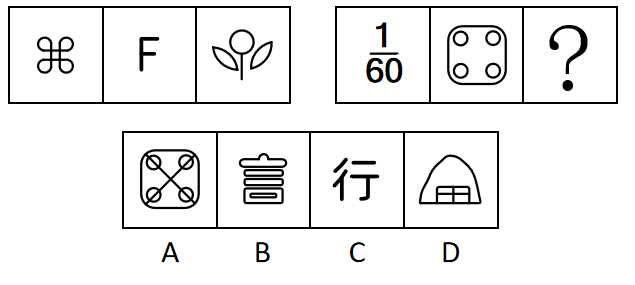
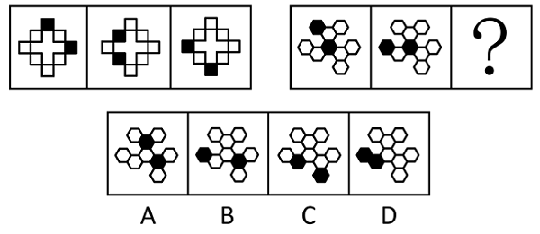
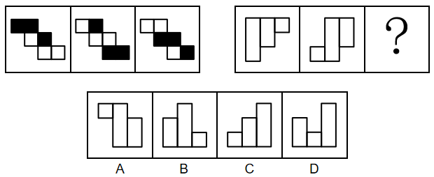
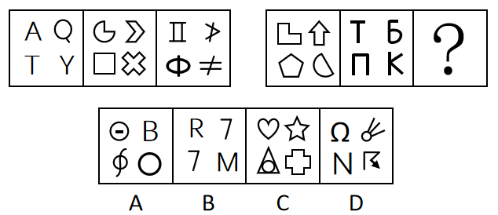
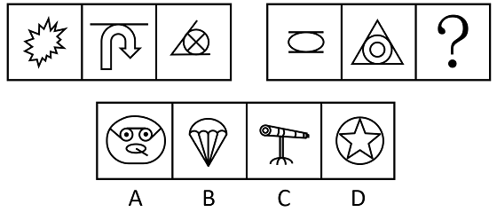
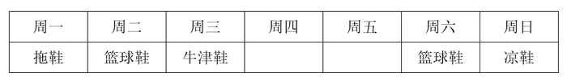

# 2023年深圳市考公务员录用考试《行测》试题（网友回忆版）

> 判断推理 · 20 题 · 深圳市考 2023

## 第 1 题　qid 5521193 · 图形推理

从所给的四个选项中，选择最合适的一个填入问号处，使之呈现一定规律性。

- **A**. A
- **B**. B
- **C**. C　✅
- **D**. D

**答案**：C

**官方解析**

元素组成不同，且无明显属性规律，考虑数量规律。第一组图2和图3中出现多端点，考虑笔画数。第一组图形的笔画数依次为1、2、3，第二组图形中前两幅图的笔画数依次为4、5，故“？”处应为笔画数为6的图形。只有C项符合。
故正确答案为C。

---

## 第 2 题　qid 5521249 · 图形推理

从所给的四个选项中，选择最合适的一个填入问号处，使之呈现一定的规律性。

- **A**. A　✅
- **B**. B
- **C**. C
- **D**. D

**答案**：A

**官方解析**

元素组成相同，但无明显位置规律。观察发现，题干前组图和后组图均出现两个黑块，且两个黑块之间均间隔一个白块，故问号处应遵循此规律，只有A项符合。
故正确答案为A。

---

## 第 3 题　qid 5521251 · 图形推理

从所给的四个选项中，选择最合适的一个填入问号处，使之呈现一定的规律。

- **A**. A
- **B**. B
- **C**. C
- **D**. D　✅

**答案**：D

**官方解析**

图形元素组成相同，优先考虑位置规律。第一组图形，图形中每行元素沿“Z”字型依次向上平移一行（循环走）；第二组图形运用此规律，图形中每列元素依次向右平移一列，只有D项符合。
故正确答案为D。

---

## 第 4 题　qid 5521257 · 图形推理

从所给的四个选项中，选择最合适的一个填入问号处，使之呈现一定规律性。

- **A**. A
- **B**. B　✅
- **C**. C
- **D**. D

**答案**：B

**官方解析**

元素组成不同，优先考虑属性规律。观察发现，第一组图中每幅图均由3个全直线的小图形和1个既有曲线也有直线的小图形组成，第二组图中前两幅图也都是由3个全直线的小图形和1个既有曲线也有直线的小图形组成，故“？”处图形也应该由3个全直线的小图形和1个既有曲线也有直线的小图形组成，只有B项符合。
故正确答案为B。

---

## 第 5 题　qid 5521250 · 图形推理

从所给四个选项中，选择最合适的一个填入问号处，使之呈现一定规律性。

- **A**. A　✅
- **B**. B
- **C**. C
- **D**. D

**答案**：A

**官方解析**

元素组成不同，且无明显属性规律，考虑数量规律。观察发现，题干图形交叉明显，且有明显切点，考虑切点数。第一组图形切点数依次为：0、1、2，第二组图形切点数依次为：2、3、？，故？处图形切点数应为4，只有A项符合。
故正确答案为A。

---

## 第 6 题　qid 5521177 · 类比推理

（1）不惑
（2）耳顺
（3）期颐
（4）知天命
（5）杖朝

- **A**. 1-4-2-5-3　✅
- **B**. 2-1-3-5-4
- **C**. 1-4-2-3-5
- **D**. 1-2-4-5-3

**答案**：A

**官方解析**

观察题干，五个事件主要围绕“年龄代称”的时间先后顺序展开。
（1）“不惑”代指四十岁；
（2）“耳顺”代指六十岁；
（3）“期颐”指一百岁老人；
（4）“知天命”代指五十岁；
（5）“杖朝”代指八十岁。
按照时间先后排序为1-4-2-5-3，对应A项。
故正确答案为A。

---

## 第 7 题　qid 5521266 · 类比推理

（1）红旗引领，人民壮志
（2）人工天河，创造奇迹
（3）劈山架槽，挖渠千里
（4）伟大精神，历久弥新
（5）千年旱魔，世代抗争

- **A**. 5-1-3-2-4　✅
- **B**. 5-2-3-4-1
- **C**. 5-3-2-1-4
- **D**. 1-3-2-5-4

**答案**：A

**官方解析**

第一步：先确定逻辑关系最为明显的逻辑顺序。
观察题干，五个事件主要围绕“抗旱挖渠造河”开展的。逻辑关系的先后顺序比较明显的是事件（5）和事件（4），要先“世代抗争旱魔”，才能彰显“伟大精神，历久弥新”，因此事件（5）是抗旱行为的起因，事件（4）是对抗旱行为的总结，故事件（5）应排在首位，事件（4）应排在最后，排除B、D两项。
第二步：逐一对照选项并判断正确答案。
根据第一步得到的结果可以判断只有A、C两项符合，通过分析事件（1）和事件（3）可得，先“红旗引领，人民壮志”，才能“劈山架槽，挖渠千里”，因此事件（1）排在事件（3）前面，排除C项。
故正确答案为A。

---

## 第 8 题　qid 5521184 · 类比推理

（1）深入调查
（2）直播炫富
（3）定罪判刑
（4）舆论哗然
（5）网友举报

- **A**. 5-2-1-3-4
- **B**. 2-5-1-4-3
- **C**. 2-5-4-1-3　✅
- **D**. 5-2-4-3-1

**答案**：C

**官方解析**

第一步：先确定逻辑关系最为明显的逻辑顺序。
题干主要围绕着“直播炫富事件”展开，逻辑关系的先后顺序比较明显的是事件（1）和事件（4），事件引发舆论轰动后才会展开深入调查，因此事件（4）应该在事件（1）前面，排除A、B两项。
第二步：逐一对照选项并判断正确答案。
根据第一步的结果可以判断只有C、D两项符合，只有深入调查之后才能根据调查内容定罪判刑，因此事件（1）应该在事件（3）前面，排除D项。
故正确答案为C。

---

## 第 9 题　qid 5521244 · 类比推理

（1）庆祝中国共产党成立100周年
（2）献礼中华人民共和国70周年华诞
（3）审核通过党的第三个历史决议
（4）宣告脱贫攻坚取得了全面胜利
（5）隆重集会回顾改革开放40年的光辉历程

- **A**. 5-2-1-4-3
- **B**. 4-2-1-5-3
- **C**. 5-2-4-1-3　✅
- **D**. 2-5-4-3-1

**答案**：C

**官方解析**

观察题干，五个事件主要是围绕着我国具有重要历史意义的事件开展的。“庆祝中国共产党成立100周年”发生在2021年7月，“献礼中华人民共和国70周年华诞”发生在2019年10月，“审核通过党的第三个历史决议”发生在2021年11月，“宣告脱贫攻坚取得了全面胜利”发生在2021年2月，“隆重集会回顾改革开放40年的光辉历程”发生在2018年12月。
根据时间先后排序应该是5-2-4-1-3，对应C项。
故正确答案为C。

---

## 第 10 题　qid 5521190 · 类比推理

（1）遥感收集信息
（2）发布天气预报
（3）信号传回地面
（4）发射气象卫星
（5）绘制气象图片

- **A**. 1-5-4-2-3
- **B**. 4-1-3-5-2　✅
- **C**. 4-3-1-5-2
- **D**. 1-3-4-2-5

**答案**：B

**官方解析**

第一步：先确定逻辑关系最为明显的逻辑顺序。
观察题干，五个事件主要是围绕着“气象信息的收集和发布”开展的。逻辑关系的先后顺序比较明显的事件是事件（1）和事件（4），先“发射气象卫星”，然后才能“遥感收集信息”，事件（4）应该在事件（1）前面，排除A、D两项。
第二步：逐一对照选项并判断正确答案。
根据第一步的结果可以判断只有B、C两项符合，通过分析事件（1）和事件（3）可知，应先“遥感收集信息”，再将收集到的信息通过“信号传回地面”，因此事件（1）应该在事件（3）前面，排除C项。
故正确答案为B。

---

## 第 11 题　qid 5521263 · 逻辑判断

疫情迫使人们保持社交距离，心理咨询师的工作方式从而也发生了改变，即由面对面疗法转为通过视频和患者见面。有人认为，疫情期间为了保证安全，心理咨询师应尽可能地采用线上远程咨询的方式为患者提供服务。
如果下列陈述为真，最能支持上述论证的是（    ）。

- **A**. 研究发现，不管是通过面对面还是线上远程，认知行为疗法对于抑郁、焦虑障碍具有同等疗效　✅
- **B**. 对某些心理障碍患者而言，如不及时满足其心理咨询需求，将极有可能产生过激行为
- **C**. 如果心理咨询师无法适应线上远程咨询的诊疗方式，将难以满足患者的心理咨询需求
- **D**. 调查显示，在疫情期间，民众心理咨询需求量暴涨

**答案**：A

**官方解析**

第一步：找出论点和论据。
论点：疫情期间为了保证安全，心理咨询师应尽可能地采用线上远程咨询的方式为患者提供服务。
论据：无。
本题论点讨论的是心理咨询师应尽可能通过线上远程咨询的方式为患者提供服务，没有论据，加强优先考虑必要条件。
第二步：逐一分析选项。
A项：线上远程的认知行为疗法对抑郁、焦虑障碍有效，说明线上远程咨询可以治疗患者，如果该项不成立，那么心理咨询师就没必要通过线上远程咨询的方式为患者提供服务，论点就无法成立，因此该项是论点成立的必要条件，可以加强，保留；
B项：某些心理障碍患者可能因心理咨询需求得不到满足而产生过激行为，说明心理咨询需求得不到满足的可能负面影响，解释了为什么心理咨询师应通过线上远程咨询的方式为患者提供服务，补充论据，可以加强，保留；
C项：心理咨询师若无法适应线上远程咨询的诊疗方式将难以满足患者的咨询需求，解释了为什么心理咨询师应通过线上远程咨询的方式为患者提供服务，补充论据，可以加强，保留；
D项：疫情期间，民众心理咨询需求量暴涨，解释了为什么心理咨询师应通过线上远程咨询的方式为患者提供服务，补充论据，可以加强，保留。
对比A、B、C、D四项，加强力度上，必要条件＞补充论据，因此优选A项。
故正确答案为A。

---

## 第 12 题　qid 5521264 · 逻辑判断

每年的夏秋之际，大草原上的牛羚都会成群结队向北方迁徙，形成非常壮观的画面。研究表明，生物运动受生存和繁殖驱动，而牛羚并非是出于繁衍的目的进行大规模迁徙，因为迁徙途中危险重重，不是被狮子猎豹追击，就是被鳄鱼埋伏，幼小牛羚往往是第一目标，非洲大草原干湿季分明，促成了特别显著的草类生长的季节性分布，显然，追逐肥美的草木和丰富的水源才是牛羚一年一度迁徙活动的推动力。
上述论证采用的论证方法是（    ）。

- **A**. 论证一个普遍规律，并用来说明某一种特殊情况
- **B**. 通过反例推翻一个一般性结论
- **C**. 在对某种现象的两种可供选择的解释中，通过排除其中的一种，来确定另一种　✅
- **D**. 通过对发生机制的适当描述，支持关于某个可能发生现象的假说

**答案**：C

**官方解析**

第一步：分析题干论证过程。
题干先是指出了牛羚迁徙的现象，提出了“生物运动受生存和繁殖驱动”的理论，其中有两个因素。紧接着又论述“牛羚并非是出于繁衍的目的进行大规模迁徙”，并解释了为什么不是出于繁衍的目的，最后得出“追逐肥美的草木和丰富的水源才是牛羚一年一度迁徙活动的推动力”，即牛羚迁徙是受生存驱动。
第二步：逐一分析选项。
A项：题干给的普遍规律是“生物运动受生存和繁殖驱动”，但题干并没有去论证这个规律，而是直接默认它是正确的，与题干论证结构不一致，排除；
B项：题干并没有举反例，与题干论证结构不一致，排除；
C项：由第一步的分析可知，题干采用的论证方法是，在对某种现象的两种可供选择的解释（生存和繁殖）中，通过排除其中的一种（繁殖），来确定另一种（生存），与题干论证结构一致，当选；
D项：题干并不是一个可能发生的现象，牛羚迁徙是实际发生的现象，与题干论证结构不一致，排除。
故正确答案为C。

---

## 第 13 题　qid 5521267 · 逻辑判断

小鲍有5双鞋，分别是篮球鞋、滑板鞋、牛津鞋、凉鞋和拖鞋，他这周（周一至周日）每天早出晚归，出门时都会从中选择1双穿着，已知：
（1）小鲍本周穿了两次篮球鞋，穿着时间相隔3天；
（2）本周穿了一次牛津鞋，时间在第一次穿篮球鞋的前一天或后一天；
（3）本周穿了一次滑板鞋，时间在第二次穿篮球鞋之前；
（4）穿凉鞋的时间与本周第一次穿篮球鞋相隔4天；
（5）第一次穿篮球鞋之前穿过拖鞋
根据以上陈述，可以推出的结论是（    ）。

- **A**. 小鲍周一穿篮球鞋
- **B**. 小鲍周三穿牛津鞋　✅
- **C**. 小鲍周四穿拖鞋
- **D**. 小鲍周五穿滑板鞋

**答案**：B

**官方解析**

第一步：分析题干条件。

（1）小鲍本周穿了两次篮球鞋，穿着时间间隔3天；

（2）本周穿了一次牛津鞋，时间在第一次穿篮球鞋的前一天或后一天；

（3）本周穿了一次滑板鞋，时间在第二次穿篮球鞋之前；

（4）穿凉鞋的时间与本周第一次穿篮球鞋相隔4天；

（5）第一次穿篮球鞋之前穿过拖鞋。

第二步：根据题干条件进行推理。

根据条件（1）（5）可知，周二或周三第一次穿篮球鞋。当周三第一次穿篮球鞋时，不满足条件（4）穿凉鞋的时间与本周第一次穿篮球鞋相隔4天，该假设不成立；当周二第一次穿篮球鞋时，根据条件（1）可知周六第二次穿篮球鞋，根据条件（5）可知周一穿拖鞋，根据条件（2）可知周三穿牛津鞋，根据条件（4）可知周日穿凉鞋，根据条件（3）可知周四或周五穿滑板鞋，满足题干条件，该假设成立。

故正确答案为B。

---

## 第 14 题　qid 5521246 · 类比推理

新一届中国科幻小说大赛“星座奖”结果发布，来自广东、上海、四川的甲、乙、丙三人位列三甲，已知：
（1）乙不来自四川；
（2）乙不是第三名；
（3）丙不是第一名；
（4）来自广东的作者不是第二名；
（5）来自四川的作者夺得第一名。
由此可推知（    ）。

- **A**. 甲不是第一名
- **B**. 乙获得第一名
- **C**. 丙来自四川
- **D**. 乙来自上海　✅

**答案**：D

**官方解析**

第一步：分析题干条件。

（1）乙：四川；

（2）乙：第三名；

（3）丙：第一名；

（4）来自广东的作者不是第二名；

（5）来自四川的作者夺得第一名。

第二步：根据题干条件进行推理。

题干条件中“乙”和“四川”被提及的次数最多，考虑优先从此处入手开始推理。根据条件（1）和条件（5）可知，乙不是第一名；又根据条件（2）可知，乙不是第三名，则乙是第二名；再结合条件（1）和条件（4）可知，乙不来自四川，也不来自广东，则乙来自上海，对应D项。

故正确答案为D。

---

## 第 15 题　qid 5521247 · 定义判断

所谓曲解，是指听话者对说话者所说的话进行故意歪曲原意的解释，包括曲解概念和曲解解释。
下列选项中，最有可能不属于曲解的是（    ）。

- **A**. 王同学把班级群聊记录中“小明发的信息可能是假的”转发给另一群组，并改为“小明发的信息是假的”
- **B**. 课上，老师让郑同学回答证据的定义，而郑同学因为不知道，所以只回答了法律证据的定义
- **C**. 小李说，小杨散了一个多小时步，小张得知后转告小杨爸爸：“小杨离开了一个多小时”
- **D**. 班长在传达班主任的话时，把其中警告的语气有所加重　✅

**答案**：D

**官方解析**

第一步：找出定义关键词。
“听话者对说话者所说的话进行故意歪曲原意的解释”。
第二步：逐一分析选项。
A项：把“信息可能是假的”转发改为“信息是假的”，存在故意歪曲原意的可能，符合“听话者对说话者所说的话进行故意歪曲原意的解释”，符合定义，排除；
B项：因为不知道证据的定义，只回答了法律证据的定义，说明郑同学故意曲解了老师问的概念，符合“听话者对说话者所说的话进行故意歪曲原意的解释”，符合定义，排除；
C项：把“小杨散了一个多小时步”转告为“小杨离开了一个多小时”，存在故意歪曲原意的可能，符合“听话者对说话者所说的话进行故意歪曲原意的解释”，符合定义，排除；
D项：在传达班主任的话时，把其中警告的语气有所加重，只是重复原意，不符合“听话者对说话者所说的话进行故意歪曲原意的解释”，不符合定义，当选。
本题为选非题，故正确答案为D。

---

## 第 16 题　qid 5521248 · 类比推理

小方说：“我这个月如果去春游，就要去梧桐山和仙湖植物园，否则就不去；只有和小雪一起出门，我才会去梧桐山或七娘山；如果要和小雪一起出门，那么我一定要和她做好约定；如果要和她做好约定，她一定有时间，但因为怀念家乡，小雪休假回北方看望家人，为期一个月。”
由此可推知，小方这个月（    ）。

- **A**. 没去春游　✅
- **B**. 去了七娘山
- **C**. 去了仙湖植物园
- **D**. 和小雪一起出门

**答案**：A

**官方解析**

第一步：翻译题干。

①小方去春游梧桐山 且 仙湖植物园；

②（梧桐山 且 仙湖植物园）小方去春游；

③梧桐山 或 七娘山小方和小雪一起；

④小方和小雪一起做好约定；

⑤做好约定小雪有时间；

⑥小雪有时间。

第二步：根据题干条件进行推理。

从确定信息条件⑥入手，“小雪有时间”是对条件⑤的否后，否后必否前，可以得出“做好约定”，是对条件④的否后，可以得出“小方和小雪一起”，排除D项；“小方和小雪一起”是对条件③的否后，可以得出“（梧桐山 或 七娘山）”，即“梧桐山 且 七娘山”，排除B项；否定且关系中的一项，即为对整体的否定，因此“梧桐山 且 七娘山”是对条件①的否后，可以得出“小方去春游”，对应A项。

故正确答案为A。

---

## 第 17 题　qid 5521261 · 逻辑判断

有人认为，人们购买电动汽车的目的是为了省钱，因为给车辆充电的成本低于加燃油的成本。然而，考虑到电动汽车使用多年后必须更换电池，以及为了安装家用充电桩而必须购买固定停车位，实际上的总支出成本要远高于传统燃油汽车，因此，人们购买电动汽车的目的并非是为了省钱。
如果下列陈述为真，最能削弱上述推论的是（    ）。

- **A**. 如今多数电动汽车车主使用公共充电桩充电，并没有购买固定停车位　✅
- **B**. 更换电池的价格比购置一辆新电动汽车要便宜很多
- **C**. 电动汽车更符合节能环保的现代生活理念
- **D**. 国际油价已经见顶，国内油价开始持续下降

**答案**：A

**官方解析**

第一步：找出论点和论据。
论点：人们购买电动汽车的目的并非是为了省钱。
论据：考虑到电动汽车使用多年后必须更换电池，以及为了安装家用充电桩而必须购买固定停车位，实际上的总支出成本要远高于传统燃油汽车。
论据和论点都说的是电动汽车并不省钱，论点论据话题一致，削弱可以考虑否定论点或者否定论据。
第二步：逐一分析选项。
A项：该项指出多数电动汽车车主使用公共充电桩充电，并没有购买固定停车位，否定论据，可以削弱，当选；
B项：该项指出更换电池的价格比购置一辆新电动汽车要便宜很多，是拿更换电池与购买新电动汽车进行价格对比，而题干讨论的是使用电动汽车与传统燃油汽车谁的成本更高，与论点话题不一致，无法削弱，排除；
C项：该项指出电动汽车更符合节能环保的现代生活理念，给出的是电动汽车的环保特性，但没提到电动汽车是否省钱，与论点话题不一致，无法削弱，排除；
D项：该项指出国内油价开始持续下降，但并没有说明电动汽车和传统燃油汽车谁更省钱，与论点话题不一致，无法削弱，排除。
故正确答案为A。

---

## 第 18 题　qid 5521265 · 类比推理

启动某实验室装置须同时接通甲、乙、丙三个电源开关，甲、乙、丙开关只能通过按压切换“开/关”状态，但都没有“开/关”状态标识，某天，实验员小朱首先按压甲开关，装置没有启动；然后按压乙开关，装置还是没有启动；接着按压丙开关，装置仍然没有启动。
接下来，下列操作不可能启动装置的是（    ）。

- **A**. 按压甲开关
- **B**. 按压乙开关
- **C**. 同时按压甲、乙开关
- **D**. 同时按压乙、丙开关　✅

**答案**：D

**官方解析**

第一步：分析题干条件。
（1）启动装置须同时接通甲、乙、丙三个电源开关；
（2）首先按压甲开关，装置没有启动；
（3）然后按压乙开关，装置没有启动；
（4）最后按压丙开关，装置没有启动。
第二步：根据题干条件进行推理。
根据条件（1）和条件（2）可知，无论是否按压甲开关，装置均没有启动，说明在初始状态中，乙和丙没有同时处于“开”状态，即乙和丙的初始状态为一开一关或两关。假设乙和丙的初始状态为“一开一关”，那么接下来实验员同时按压乙和丙开关，依旧会有电源处于“关”状态，不能启动装置；假设乙和丙的初始状态为“两关”，根据条件（3）和条件（4）可知，此时甲的初始状态一定处于“开”状态，在按压甲开关后，甲处于“关”状态，接下来无论如何按压乙和丙开关，也不能启动装置，因此接下来不可能同时按压乙、丙开关来启动装置，对应D项。
本题为选非题，故正确答案为D。

---

## 第 19 题　qid 5521258 · 逻辑判断

所谓“鳄鱼法则”是指：假设一只鳄鱼咬住你的脚，这时你用手试图掰开鳄鱼的嘴，鳄鱼便会同时咬住你的脚与手；你越挣扎，就被咬住得越多，甚至丧命。所以，假如鳄鱼咬住你的脚，你唯一的快速自救方法就是牺牲一只脚。
下列选项中的人物运用了鳄鱼法则用来解决问题的是（    ）。

- **A**. 张三辗转反侧，入睡困难，便索性起床一个人练习投篮，没想到投了一会就困了　✅
- **B**. 李巧决定这个月每天坚持跑步，然而今天整天下雨，他只得在家里原地跑
- **C**. 王玉考试时在最后一道选择题上耗时很久仍没有头绪，考试快结束时，只好在答题卡上涂了C
- **D**. 赵六在野外探险时不慎陷入沼泽，他试图自救并用力挣扎但却越陷越深，最后决定放弃自救转向大声呼救

**答案**：A

**官方解析**

第一步：找出定义关键词。
“鳄鱼咬住脚，越挣扎，咬住越多”、“唯一的快速自救方法就是牺牲一只脚”。
第二步：逐一分析选项。
A项：张三辗转反侧，入睡困难，符合“鳄鱼咬住脚”，并且“辗转反侧”也体现了“越挣扎，越睡不着”，直接不睡了，起床练习投篮，符合“唯一的快速自救方法就是先牺牲睡眠”，是在用鳄鱼法则解决问题，并且最后也成功困了，符合定义，当选；
B项：外面下雨影响了跑步，选择在家跑，只是遇到问题灵活变通，没有体现“越挣扎，咬住得越多”，不符合定义，排除；
C项：“考试时”在最后一道选择题上耗时很久仍没有头绪，符合“鳄鱼咬住脚，越挣扎，咬住越多”，但是一直纠结到“考试快结束”，实在没办法了才选答案，如果C项运用了鳄鱼法则用来解决问题，应该是在确定不会的时候，赶紧选一个答案，而不是“耗时很久”、“考试结束了没办法才选”，不符合定义，排除；
D项：陷入沼泽后试图自救并用力挣扎但却越陷越深，符合“鳄鱼咬住脚，越挣扎，咬住越多”，但题干关键词中强调唯一的“快速”自救方法就是牺牲一只脚，相比A项“索性”起床练习投篮，D项与C项同理，都是实在走投无路了，才换了个方法，没有A项更能体现“快速”自救，不符合定义，排除。
故正确答案为A。

---

## 第 20 题　qid 5521262 · 逻辑判断

近年来，我国人口出生率持续降低。有人认为，这是因为与过去相比，越来越多的女性走出家庭追求个人事业，生育和抚养子女对她们来说成为追求持续发展的桎梏。因此，想要提高人口出生率，应当鼓励女性回归家庭。
如果下列陈述为真，最有助于反驳上述推论的是（    ）。

- **A**. 在很多国家，女性婚后做全职主妇的比例很高，但这些国家的人口出生率不升反降
- **B**. 女性回归家庭会导致家庭收入锐减，无法给子女提供良好的生活环境
- **C**. 现代社会提倡男女平等，追求个人事业的男性也应当回归家庭共担照顾子女的责任
- **D**. 数据显示，近年来我国结婚率逐年下降，所以人口出生率降低是正常现象　✅

**答案**：D

**官方解析**

第一步：找出论点和论据。
论点：想要提高人口出生率，应当鼓励女性回归家庭。
论据：我国人口出生率持续降低，是因为与过去相比，越来越多的女性走出家庭追求个人事业，生育和抚养子女对她们来说成为追求持续发展的桎梏。
本题论点和论据都在讨论“人口出生率”和“女性走出家庭”之间的关系，论点论据话题一致，削弱优先考虑否定论点。
第二步：逐一分析选项。
A项：该项说的是其他国家的情况，而题干明确讨论的是我国的情况，主体不一致，无法削弱，排除；
B项：该项说的是女性回归家庭会导致家庭收入锐减，但没有明确说明无法给予子女良好的生活环境是否就不生孩子了，不明确项，无法削弱，排除；
C项：该项说的是男性也应当回归家庭，但论点讨论的是提高人口出生率是否应当鼓励“女性”回归家庭，主体不一致，无法削弱，排除；
D项:该项说的是结婚率逐年下降是人口出生率降低的原因,那么即使鼓励已婚女性回归家庭，但由于结婚率低，人口还是会一直低，说明想通过鼓励已婚女性回归家庭来提高生育率是不可行的，否定论点，当选。
故正确答案为D。

---
