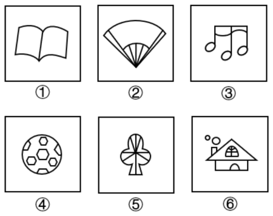
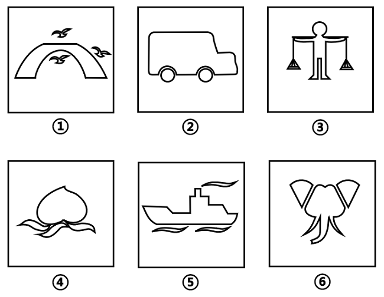
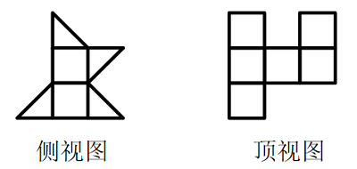

# 2023年湖北省公务员录用考试《行测》题（网友回忆版）

> 判断推理 · 35 题 · 湖北 2023

## 第 1 题　qid 5510023 · 图形推理

把下面的六个图形分为两类，使每一类图形都有各自的共同特征或规律，分类正确的一项是：

- **A**. ①②③，④⑤⑥
- **B**. ①③⑥，②④⑤　✅
- **C**. ①③④，②⑤⑥
- **D**. ①④⑤，②③⑥

**答案**：B

**官方解析**

本题为分组分类题目。元素组成不同，优先考虑属性规律。观察发现，图①③⑥均不是轴对称图形，图②④⑤均是轴对称图形，即图①③⑥为一组，图②④⑤为一组。
故正确答案为B。
注：分组分类题目优先考虑两组图形分别具有各自的规律，无法分成具有各自规律的两组时，才考虑将图形分成一组具有该规律，一组不具有该规律。

---

## 第 2 题　qid 5510176 · 图形推理

把下面的六个图形分为两类，使每一类图形都有各自的共同特征或规律，分类正确的一项是：

- **A**. ①②③，④⑤⑥
- **B**. ①②⑤，③④⑥
- **C**. ①③④，②⑤⑥　✅
- **D**. ①④⑤，②③⑥

**答案**：C

**官方解析**

元素组成不同，且无属性规律，考虑数量规律。观察发现，图形均由直线和曲线构成，且曲线和直线都有交点，考虑数曲直交点，图①③④的曲直交点数均为6，图②⑤⑥的曲直交点数均为9，故图①③④为一组，图②⑤⑥为一组。
故正确答案为C。

---

## 第 3 题　qid 5510021 · 图形推理

把下面的六个图形分为两类，使每一类图形都有各自的共同特征或规律，分类正确的一项是：

- **A**. ①②④，③⑤⑥
- **B**. ①③⑥，②④⑤
- **C**. ①④⑤，②③⑥　✅
- **D**. ①⑤⑥，②③④

**答案**：C

**官方解析**

本题为分组分类题目。元素组成不同，且无明显属性规律，考虑数量规律。题干每幅图形都有多个相同小元素，优先考虑相同元素的个数。图①④⑤中相同元素的个数均为3，图②③⑥中相同元素的个数均为2，即图①④⑤为一组，图②③⑥为一组。
故正确答案为C。

---

## 第 4 题　qid 5510018 · 图形推理

下方为某一立体图形的侧视图、正视图和顶视图，请从下列选项中选出与之符合的一项：

- **A**. A
- **B**. B
- **C**. C　✅
- **D**. D

**答案**：C

**官方解析**

A项：选项的侧视图、正视图、顶视图如下图所示，与题干不符，排除；

B项：选项的侧视图、顶视图如下图所示，与题干不符，排除；

C项：选项的侧视图、正视图和顶视图，均与题干相符，当选；

D项：选项的侧视图、顶视图如下图所示，与题干不符，排除。

故正确答案为C。

---

## 第 5 题　qid 5510027 · 图形推理

从所给四个选项中，选择最合适的一个填入问号处，使之呈现一定的规律性：

- **A**. A
- **B**. B
- **C**. C　✅
- **D**. D

**答案**：C

**官方解析**

解法一：
图形元素组成相似，优先考虑样式规律。观察发现，题干图形出现阴影、白色两种图案，考虑黑白运算。九宫格优先横向看，但是发现第一行阴影+白=阴影，第二行阴影+白=白，相同运算方式，但结果不同，考虑竖向看。观察发现，第一列：白+白=白、阴影+阴影=阴影、阴影+白=阴影、白+阴影=阴影；第二列验证此规律成立；第三列应用此规律，只有C项符合。
解法二：
图形元素组成相似，优先考虑样式规律。观察发现，九宫格横向看无规律，考虑竖向看，第一个图形与第二个图形进行叠加运算可得第三个图形，只有C项符合。
故正确答案为C。

---

## 第 6 题　qid 5510031 · 定义判断

生态恢复岸线是指通过人工直接或间接实施保护修复工程或在常年潮汐、冲淤等自然力作用下，将原来的人工岸线最大限度地恢复海岸自然形态、地貌单元，恢复和改善海岸生态功能的岸线。生态恢复岸线具有独特的地理、形态和动态特征，是海陆分界的地理要素，具有重要的生态功能和资源价值。
根据上述定义，下列属于生态恢复岸线的是：

- **A**. 将自然海岸形态改变成人工海岸形态的堤坝
- **B**. 某港口城市全力打造的生态美、人气旺的黄金旅游岸线
- **C**. 某海滨城市修复建设的具有自然岸滩形态特征和生态功能的海堤　✅
- **D**. 保持自然生态属性特征，没有因人类活动而改变形态和属性的海岸线

**答案**：C

**官方解析**

第一步：找出定义关键词。
“通过人工直接或间接实施保护修复工程或在常年潮汐、冲淤等自然力作用下”、“将原来的人工岸线最大限度地恢复海岸自然形态、地貌单元”、“恢复和改善海岸生态功能的岸线”。
第二步：逐一分析选项。
A项：该项是将自然海岸形态改变成人工海岸形态的堤坝，而不是恢复和改善海岸的生态功能，不符合“将原来的人工岸线最大限度地恢复海岸自然形态、地貌单元”、“恢复和改善海岸生态功能的岸线”，不符合定义，排除；
B项：某港口城市打造的生态美、人气旺的黄金旅游岸线，不明确是否恢复和改善了海岸的生态功能，不符合“将原来的人工岸线最大限度地恢复海岸自然形态、地貌单元”、“恢复和改善海岸生态功能的岸线”，不符合定义，排除；
C项：某海滨城市修复建设，符合“通过人工直接或间接实施保护修复工程或在常年潮汐、冲淤等自然力作用下”，修复建设具有自然岸滩形态特征和生态功能的海堤，符合“将原来的人工岸线最大限度地恢复海岸自然形态、地貌单元”、“恢复和改善海岸生态功能的岸线”，符合定义，当选；
D项：保持自然生态属性特征，没有因人类活动而改变形态和属性的海岸线，本身就是自然形态，不存在恢复和改善的过程，不符合“将原来的人工岸线最大限度地恢复海岸自然形态、地貌单元”、“恢复和改善海岸生态功能的岸线”，不符合定义，排除。
故正确答案为C。

---

## 第 7 题　qid 5510017 · 定义判断

代表性启发，是指在使用启发法时，首先会考虑借鉴要判断的事件本身或同类事件以往的经验，即以往出现的结果；可得性启发，是指在使用启发法进行判断时，人们往往会依赖最先想到的经验和信息，并认定这些容易知觉到或回想起的事件更常出现，以此作为判断的依据。
根据上述定义，下列属于可得性启发的是：

- **A**. 人们偏向于高估连续事件发生的概率，这往往会导致对某一计划的成功过分乐观
- **B**. 我们知道高质量产品一般价格不菲，因此，如果某个产品很贵，我们会认为它的质量很好
- **C**. 很多人会根据服装来判断他人社会地位的高低，看到身着高档服装的人，就认为他们更成功、社会地位更高
- **D**. 人们在判断交通工具的安全性时，都认为乘坐飞机更危险，因为首先想到的是关于飞机失事的报道，而通常想不起火车意外事故的报道　✅

**答案**：D

**官方解析**

第一步：找出定义关键词。
代表性启发：“首先借鉴要判断的事件本身或同类事件以往的出现的结果”；
可得性启发：“把最先想到的经验和信息作为判断的依据”。
第二步：逐一分析选项。
A项：高估连续事件发生的概率，即以往连续发生的预测还会发生，借鉴的是同类事件以往出现的结果，不符合“把最先想到的经验和信息作为判断的依据”，不符合“可得性启发”定义，符合“代表性启发”定义，排除；
B项：高质量产品一般贵，因此，如果某个产品很贵，我们会认为它的质量很好，借鉴的是同类事件以往出现的结果，不符合“把最先想到的经验和信息作为判断的依据”，不符合“可得性启发”定义，符合“代表性启发”定义，排除；
C项：会根据服装来判断他人社会地位的高低，看到身着高档服装的人，就认为他们更成功、社会地位更高，借鉴的是同类事件以往出现的结果，不符合“把最先想到的经验和信息作为判断的依据”，不符合“可得性启发”定义，符合“代表性启发”定义，排除；
D项：认为乘坐飞机更危险，因为首先想到的是关于飞机失事的报道，“首先想到”说明是根据最先想到的信息去判断的，符合“把最先想到的经验和信息作为判断的依据”，符合“可得性启发”定义，当选。
故正确答案为D。

---

## 第 8 题　qid 5510016 · 定义判断

不真正连带责任，是指各债务人之间基于不同的发生原因，对同一债权人负有以同一给付为标的的数个债务责任。如果一个债务人履行了全部债务，那么全体债务归于消灭。
根据上述定义，下列说法正确的是：

- **A**. 小张在医院治疗期间进行了输血，但由于血液质量不合格，导致小张病情加重，后小张起诉至法院。医院和血液提供机构属于不真正连带责任　✅
- **B**. 小赵委托小孙作为自己的代理人采购钢材10吨，小孙为获私利与销售方小李串通，故意抬高钢材销售价格。小孙与小李属于不真正连带责任
- **C**. 某有限公司股东小刘和小宋各持有50%的股份，后因经营不善欠债100万元，债权人现向小刘主张全部债权。小刘和小宋属于不真正连带责任
- **D**. 小王在路上行走突遇对面来车，小王急忙躲闪，撞伤了同在行走的周大爷，周大爷因此起诉。小王和司机属于不真正连带责任

**答案**：A

**官方解析**

第一步：找出定义关键词。

“各债务人之间基于不同的发生原因”、“对同一债权人负有以同一给付为标的的数个债务责任”、“如果一个债务人履行了全部债务，那么全体债务归于消灭”。

第二步：逐一分析选项。

A项：该项中小张在医院治疗期间由于血液质量不高病情加重起诉至法院，小张是债权人，医院和血液提供机构是债务人，其中血液提供机构没有履行好检验或安全保存的义务，医院也没有履行好再核实的义务，符合“各债务人之间基于不同的发生原因”，医院和血液提供机构在该起医疗事故中都负有责任，符合“对同一债权人负有以同一给付为标的的数个债务责任”，若医院或血液提供机构中的一方承担了责任，则另一方无需再承担，符合“如果一个债务人履行了全部债务，那么全体债务归于消灭”，符合定义，当选；

B项：该项中代理人小孙为获私利与销售方小李串通，故意抬高钢材销售价格后卖给小赵，小孙和小李是基于相同的发生原因，都是想要获得私利，不符合“各债务人之间基于不同的发生原因”，不符合定义，排除；

C项：该项中小刘和小宋各持有公司50%的股份，后因经营不善欠债，小刘和小宋作为债务人，是基于相同的发生原因，都是因为经营不善，不符合“各债务人之间基于不同的发生原因”，不符合定义，排除；

D项：该项中的交通事故里，对面来车的司机因为没有正确驾驶负有责任，但小王是否需要担责是不明确的（如果小王是正常行走，那么小王的行为属于紧急避险，则无需担责；如果小王存在违反交通法规的情况，则需要担责），故小王不一定是该起交通事故的债务人，不符合“各债务人之间基于不同的发生原因”、“对同一债权人负有以同一给付为标的的数个债务责任”，不符合定义，排除。

故正确答案为A。

注：下图是关于本定义的适用情形，其中（三）对应本题A项。

---

## 第 9 题　qid 5510013 · 定义判断

生物修复就是利用生物的生命代谢活动减少被污染的环境中的有毒有害物的浓度或使其无害化，从而使被污染了的环境能够部分地或完全地恢复到原初状态的过程。
根据上述定义，下列不属于生物修复的是：

- **A**. 在被重金属污染的土壤中种植能吸附重金属的蜈蚣草，通过收割蜈蚣草带走土壤里的部分重金属
- **B**. 用玉米等粮食作物做成的降解塑料袋替代传统塑料袋，解决丢弃传统塑料对环境造成的污染问题　✅
- **C**. 利用硝化细菌、芽孢杆菌等微生物菌降解河道有机污染物，治理被污水和垃圾污染的城市河流
- **D**. 在人工水产养殖场中投放一些藻类，利用菌藻共生关系，对池塘里的污物进行处理和净化

**答案**：B

**官方解析**

第一步：找出定义关键词。
“利用生物的生命代谢活动”、“减少被污染的环境中的有毒有害物的浓度”、“使被污染了的环境能够部分地或完全地恢复到原初状态”。
第二步：逐一分析选项。
A项：利用蜈蚣草吸收土壤中的重金属，符合“利用生物的生命代谢活动”、“减少被污染的环境中的有毒有害物的浓度”，符合定义，排除；
B项：使用玉米等粮食作物做成的降解塑料袋来减少环境污染，玉米等粮食是降解塑料袋的原材料，不涉及生物的生命代谢活动，不符合“利用生物的生命代谢活动”、“减少被污染的环境中的有毒有害物的浓度”，不符合定义，当选；
C项：利用微生物菌降解河道有机污染物，符合“利用生物的生命代谢活动”、“减少被污染的环境中的有毒有害物的浓度”，符合定义，排除；
D项：利用菌藻共生关系，处理和净化池塘里的污物，符合“利用生物的生命代谢活动”、“减少被污染的环境中的有毒有害物的浓度”，符合定义，排除。
本题为选非题，故正确答案为B。

---

## 第 10 题　qid 5510135 · 定义判断

大气中水汽直接在地面或地物表面及低空的凝结物，称为隐匿性降水。由空中降落到地面上的水汽凝结物，称为直接性降水。
根据上述定义，下列属于隐匿性降水的是：

- **A**. 夜深烟火灭，霰雪落纷纷——白居易《秦中吟》
- **B**. 广寒宫中珠径雨，狂风倾下九天来——邓肃《雹》
- **C**. 神农架景区温度大幅下降至零下3度，迎来了入秋后的雾凇奇观　✅
- **D**. 雨凇边降边冻，粘附在裸露物的外表而不流失，形成越来越厚的冰层

**答案**：C

**官方解析**

第一步：找出定义关键词。
隐匿性降水：“大气中水汽”、“直接在地面或地物表面及低空的凝结物”；
直接性降水：“由空中降落到地面上的水汽凝结物”。
第二步：逐一分析选项。
A项：夜深烟火灭，霰雪落纷纷，意思是夜深人静，烟火无痕，雨雪夹杂，纷纷飘零，雨雪属于空气中的凝结物，不符合“直接在地面或地物表面及低空的凝结物”，不符合“隐匿性降水”定义，符合“直接性降水”定义，排除；
B项：广寒宫中珠径雨，狂风倾下九天来，意思是广寒宫下的雨雹好似珍珠那么大，狂风从九天倾巢而出，描写的是雨，属于空气中的凝结物，不符合“直接在地面或地物表面及低空的凝结物”，不符合“隐匿性降水”定义，符合“直接性降水”定义，排除；
C项：雾凇是由冰晶在温度低于冰点以下的物体上形成的白色不透明粒状结构沉积物，是低温时空气中水汽直接冻结在物体上形成的，符合“直接在地面或地物表面及低空的凝结物”，符合“隐匿性降水”定义，当选；
D项：雨凇是由于降雨附着于物体表面不断聚集形成的白色沉积物，与降雨有关，不符合“直接在地面或地物表面及低空的凝结物”，不符合“隐匿性降水”定义，排除。
故正确答案为C。

---

## 第 11 题　qid 5510052 · 定义判断

环境吸收能力是指自然环境对人类在生产生活过程中产生的废弃物具有自动容纳、吸收和消化的能力。理论上，由于环境吸收能力的存在，地球自身的力量是可以将环境恢复到原有或相近的活力水平，资源环境退化并不是不可逆的。
根据上述定义，下列属于环境吸收能力的是：

- **A**. 某地开展农村人居环境整治行动，加强固体废弃物和垃圾处置
- **B**. 某县通过环境治理，提升了当地环境资源所能容纳的人口和经济规模
- **C**. 某市为高载能产业寻求发展空间，测算出该城市大气允许承载污染物的最大数量
- **D**. PM2.5能够被大自然转化为对生态系统造成危害较小的物质，甚至能进一步被分解达到无害的状态　✅

**答案**：D

**官方解析**

第一步：找出定义关键词。
“自然环境对人类产生的废弃物具有自动容纳、吸收和消化的能力”。
第二步：逐一分析选项。
A项：某地开展整治行动加强固体废弃物和垃圾处置，没有体现出自然环境自动容纳、吸收和消化人类产生的废弃物，不符合“自然环境对人类产生的废弃物具有自动容纳、吸收和消化的能力”，不符合定义，排除；
B项：某县通过环境治理提升环境资源能容纳的人口和经济规模，没有体现出自然环境自动容纳、吸收和消化人类产生的废弃物，不符合“自然环境对人类产生的废弃物具有自动容纳、吸收和消化的能力”，不符合定义，排除；
C项：某市测算出该城市大气承载污染物的最大数量，没有体现出自然环境自动容纳、吸收和消化人类产生的废弃物，不符合“自然环境对人类产生的废弃物具有自动容纳、吸收和消化的能力”，不符合定义，排除；
D项：PM2.5被大自然转化成对生态系统造成危害较小的物质，甚至达到无害的状态，是自然环境消化了人类产生的废弃物，符合“自然环境对人类产生的废弃物具有自动容纳、吸收和消化的能力”，符合定义，当选。
故正确答案为D。

---

## 第 12 题　qid 5510062 · 定义判断

被害人盲点症是指被害人出于某种迫切的需要和急切的欲望，以致注意力狭窄、判断力减弱甚至轻度丧失理智，对自己所处的危险或面临的风险视而不见的一种状态。
根据上述定义，下列不属于被害人盲点症的是：

- **A**. 王某为强身健体高价购买大量伪劣保健品
- **B**. 林某在公交车上因争抢座位不慎滑倒受伤　✅
- **C**. 为谋高额回报黄某兼职网络刷单导致经济受损
- **D**. 幻想通过理财一夜暴富的刘某给了骗子可乘之机

**答案**：B

**官方解析**

第一步：找出定义关键词。
“被害人出于某种迫切的需要和急切的欲望”、“注意力狭窄、判断力减弱甚至轻度丧失理智”、“对自己所处的危险或面临的风险视而不见”。
第二步：逐一分析选项。
A项：王某为强身健体，符合“被害人出于某种迫切的需要和急切的欲望”，高价购买大量伪劣保健品，符合“注意力狭窄、判断力减弱甚至轻度丧失理智”、“对自己所处的危险或面临的风险视而不见”，符合定义，排除； 
B项：林某不慎滑倒是林某自己不小心所致，没有人要害他，不符合“被害人”，不符合定义，当选；
C项：黄某为谋高额回报，符合“被害人出于某种迫切的需要和急切的欲望”，黄某网络刷单导致经济受损，符合“注意力狭窄、判断力减弱甚至轻度丧失理智”、“对自己所处的危险或面临的风险视而不见”，符合定义，排除；
D项：刘某幻想通过理财一夜暴富，符合“被害人出于某种迫切的需要和急切的欲望”，刘某给了骗子可乘之机，符合“注意力狭窄、判断力减弱甚至轻度丧失理智”、“对自己所处的危险或面临的风险视而不见”，符合定义，排除；
本题为选非题，故正确答案为B。

---

## 第 13 题　qid 5510020 · 定义判断

法律规范包含多种类型。授权性规范，是规定法律主体可以为一定行为或不为一定行为的法律规范。义务性规范，是规定法律主体必须为一定行为的法律规范。禁止性规范，是规定禁止法律主体为一定行为的法律规范。
根据上述定义，下列属于禁止性规范的是：

- **A**. 自然人决定、变更姓名，或者法人、非法人组织决定、变更、转让名称的，应当依法向有关机关办理登记手续，但是法律另有规定的除外
- **B**. 对亲子关系有异议且有正当理由的，父或者母可以向人民法院提起诉讼，请求确认或者否认亲子关系
- **C**. 任何组织或者个人不得以丑化、污损或者利用信息技术手段伪造等方式侵害他人肖像权　✅
- **D**. 因正当防卫造成损害的，不承担民事责任

**答案**：C

**官方解析**

第一步：找出定义关键词。
授权性规范：“法律主体可以为一定行为或不为一定行为”；
义务性规范：“法律主体必须为一定行为”；
禁止性规范：“禁止法律主体为一定行为”。
第二步：逐一分析选项。
A项：自然人决定、变更姓名，或者法人、非法人组织决定、变更、转让名称的，应当依法向有关机关办理登记手续，“应当”不符合“禁止法律主体为一定行为”，符合“义务性规范”定义，不符合“禁止性规范”定义，排除；
B项：对亲子关系有异议且有正当理由的，父或者母可以向人民法院提起诉讼，“可以诉讼”不符合“禁止法律主体为一定行为”，符合“授权性规范”定义，不符合“禁止性规范”定义，排除；
C项：任何组织或者个人不得以丑化、污损或者利用信息技术手段伪造等方式侵害他人肖像权，“不得”说明是“禁止法律主体为一定行为”，符合“禁止性规范”定义，当选；
D项：因正当防卫造成损害的，不承担民事责任，“不承担”说明是可以不用承担，不符合“禁止法律主体为一定行为”，符合“授权性规范”定义，不符合“禁止性规范”定义，排除。
故正确答案为C。

---

## 第 14 题　qid 5510010 · 定义判断

商业效用原则是商事实践中发展出来的一项交易惯例，市场主体提供的商品、服务以及其他标的物应当能够发挥基本的功能作用，如果欠缺必要的使用条件或者辅助设施导致其交易目的落空的，应当予以补足。最佳效用原则是指通过配置组合，使得资源能够最大程度地发挥效能，提高利用效率。
根据上述定义，下列选项最能体现商业效用原则的是：

- **A**. 开发商销售商品房赠送车位
- **B**. 商家促销“买桌子送椅子”
- **C**. 出售的地下酒窖附带出入通道　✅
- **D**. 购买家电享受“三包服务”

**答案**：C

**官方解析**

第一步：找出定义关键词。
商业效用原则：“发挥基本的功能作用”、“欠缺必要的使用条件或者辅助设施导致其交易目的落空的，应当予以补足”；
最佳效用原则：“通过配置组合”、“使资源能够最大程度地发挥效能，提高利用效率”。
第二步：逐一分析选项。
A项：商品房的基本功能作用是居住，赠送的车位并不是发挥居住功能的必要使用条件或辅助设施，不符合“必要的使用条件或者辅助设施”，不符合定义，排除；
B项：买的桌子可以发挥它的基本功能作用，椅子不是桌子发挥功能作用的必要使用条件，不符合“必要的使用条件或者辅助设施”，不符合定义，排除；
C项：地下酒窖想要发挥作用就要去到地下，如果缺失出入通道就会导致交易落空，符合“必要的使用条件或者辅助设施”，符合定义，当选；
D项：购买的家电可以发挥基本的功能作用，“三包服务”不是家电发挥功能作用的必要使用条件，不符合“必要的使用条件或者辅助设施”，不符合定义，排除。
故正确答案为C。

---

## 第 15 题　qid 5510061 · 定义判断

借词就是音义都借自外语的词，它不仅引入了新的外来概念，而且还引入了外语的音义结合关系。意译词指只引入新的外来概念，但用本族语的构词材料和构词规则构成新词来表达它。仿译词是意译词的一类，它的特点是构词所用的本族语的构词材料和构词规则分别与所源出的外语词具有一一对应的关系。
根据上述定义，下列属于仿译词的一组词是：

- **A**. 蜜月、足球　✅
- **B**. 激光、天使
- **C**. 雷达、可口可乐
- **D**. 黑板、高尔夫球

**答案**：A

**官方解析**

第一步：找出定义关键词。
借词：“音义都借自外语的词”、“引入新的外来概念”、“引入外语的音义结合关系”；
意译词：“引入新的外来概念”、“用本族语的构词材料和构词规则构成新词来表达”；
仿译词：“构词所用的本族语的构词材料和构词规则分别与所源出的外语词具有一一对应的关系”。
第二步：逐一分析选项。
A项：蜜月源自英文单词honeymoon，其中honey本意为蜂蜜，moon为月，足球的英文单词是football，其中foot本意为脚、足，ball为球，均符合“构词所用的本族语的构词材料和构词规则分别与所源出的外语词具有一一对应的关系”，符合仿译词定义，当选；
B项：激光的英文单词是laser，天使的英文单词是angel，均不符合“构词所用的本族语的构词材料和构词规则分别与所源出的外语词具有一一对应的关系”，不符合仿译词定义，排除；
C项：雷达的英文单词是radar，可口可乐的英文单词是coca-cola，均不符合“构词所用的本族语的构词材料和构词规则分别与所源出的外语词具有一一对应的关系”，不符合仿译词定义，排除；
D项：黑板的英文单词是blackboard，其中black本意是黑色，board为板、木板，符合“构词所用的本族语的构词材料和构词规则分别与所源出的外语词具有一一对应的关系”，符合仿译词定义，但高尔夫球的英文单词是golf，不符合“构词所用的本族语的构词材料和构词规则分别与所源出的外语词具有一一对应的关系”，不符合仿译词定义，排除。
故正确答案为A。

---

## 第 16 题　qid 5510015 · 类比推理

葡萄：葡萄酒

- **A**. 黄金：黄金档
- **B**. 香蕉：香蕉水
- **C**. 杜鹃：杜鹃花
- **D**. 枇杷：枇杷膏　✅

**答案**：D

**官方解析**

第一步：判断题干词语间逻辑关系。
葡萄是制作葡萄酒的原材料，二者构成原材料的对应关系。
第二步：判断选项词语间逻辑关系。
A项：黄金档是指电视开机观众数最广泛的时段的通称，后者是根据前者的内在特性进行类比而命名的，二者不构成原材料的对应关系，与题干逻辑关系不一致，排除；
B项：香蕉水，又名天那水、梨油，因有乙酸戊酯或乙酸异戊酯的香蕉味，故得名香蕉水，后者是根据其味道类似前者而命名的，二者不构成原材料的对应关系，与题干逻辑关系不一致，排除；
C项：杜鹃既可以指杜鹃花，也可以指杜鹃鸟，杜鹃与杜鹃花不是原材料的对应关系，与题干逻辑关系不一致，排除；
D项：枇杷是制作枇杷膏的原材料，二者构成原材料的对应关系，与题干逻辑关系一致，当选。
故正确答案为D。

---

## 第 17 题　qid 5510022 · 类比推理

天荒地老：海枯石烂

- **A**. 同心同德：反目成仇
- **B**. 披荆斩棘：斩钉截铁
- **C**. 孜孜矻矻：夙夜不懈　✅
- **D**. 望而却步：望风披靡

**答案**：C

**官方解析**

第一步：判断题干词语间逻辑关系。
“天荒地老”意思是天荒秽，地衰老，指经历的时间极久远。“海枯石烂”意思是海水干涸、石头腐烂，形容历时久远。二者均形容历时久远，二者为近义关系。
第二步：判断选项词语间逻辑关系。
A项：“同心同德”指思想行动一致。“反目成仇”指翻脸而变成仇敌。二者无明显逻辑关系，与题干逻辑关系不一致，排除；
B项：“披荆斩棘”指拨开荆丛，砍掉荆棘，比喻开创事业或在前进道路上清除障碍，艰苦奋斗。“斩钉截铁”指砍断钉子切断铁，形容说话或行动坚决果断，毫不犹豫。二者无明显逻辑关系，与题干逻辑关系不一致，排除；
C项：“孜孜矻矻”形容勤勉不懈怠的样子。“夙夜不懈”指日夜谨慎工作，勤奋不懈。二者均指勤勉不懈怠，二者为近义关系，与题干逻辑关系一致，当选；
D项：“望而却步”指看到了危险或力不能及的事而往后退缩。“望风披靡”比喻军队毫无斗志，老远看到对方的气势很盛，没有交锋就溃散了。二者无明显逻辑关系，与题干逻辑关系不一致，排除。
故正确答案为C。

---

## 第 18 题　qid 5510008 · 类比推理

全真阅读：沉浸式

- **A**. 企业销售：盈利性
- **B**. 乡村教育：均衡化
- **C**. 人工智能：数字化　✅
- **D**. 线上课程：直播性

**答案**：C

**官方解析**

第一步：判断题干词语间逻辑关系。
全真阅读具有沉浸式的属性，二者为必然属性对应关系。
第二步：判断选项词语间逻辑关系。
A项：企业销售可能具有盈利性的属性，但不是必然属性，与题干逻辑关系不一致，排除；
B项：乡村教育可能具有均衡化的属性，但不是必然属性，与题干逻辑关系不一致，排除；
C项：人工智能具有数字化的属性，二者为必然属性对应关系，与题干逻辑关系一致，当选；
D项：线上课程可能具有直播性的属性，但不是必然属性，与题干逻辑关系不一致，排除。
故正确答案为C。

---

## 第 19 题　qid 5510019 · 类比推理

龋齿：嗜食甜品

- **A**. 海鲜：食物过敏
- **B**. 缺钙：骨质疏松
- **C**. 运动：增强体质
- **D**. 塌方：地下渗水　✅

**答案**：D

**官方解析**

第一步：判断题干词语间逻辑关系。
嗜食甜品导致龋齿，二者为因果对应关系。
第二步：判断选项词语间逻辑关系。
A项：海鲜导致食物过敏，二者为因果对应关系，但顺序与题干相反，与题干逻辑关系不一致，排除；
B项：缺钙导致骨质疏松，二者为因果对应关系，但顺序与题干相反，与题干逻辑关系不一致，排除；
C项：运动可以增强体质，二者为功能对应关系，与题干逻辑关系不一致，排除；
D项：地下渗水导致塌方，二者为因果对应关系，与题干逻辑关系一致，当选。
故正确答案为D。

---

## 第 20 题　qid 5510012 · 类比推理

针灸：疏通经脉

- **A**. 慢跑：增强体质　✅
- **B**. 涅槃：化茧成蝶
- **C**. 缺铁：供血不足
- **D**. 促销：商品展示

**答案**：A

**官方解析**

第一步：判断题干词语间逻辑关系。
针灸可以疏通经脉，二者是功能对应关系。
第二步：判断选项词语间逻辑关系。
A项：慢跑可以增强体质，二者是功能对应关系，与题干逻辑关系一致，当选；
B项：涅槃原指超脱生死的境界，现用作死（多指佛或僧人）的代称，化茧成蝶原意指蝴蝶幼虫变化为成虫的过程，寓意人经历成长，蜕去丑陋的无用的，变得智慧、美丽，二者之间没有明显的逻辑关系，与题干逻辑关系不一致，排除；
C项：缺铁会导致供血不足，二者是因果对应关系，与题干逻辑关系不一致，排除；
D项：通过商品展示的方式进行促销，二者是方式目的对应关系，与题干逻辑关系不一致，排除。
故正确答案为A。

---

## 第 21 题　qid 5510057 · 类比推理

游艇：钢材：船舶

- **A**. 古玺：玉石：隶书
- **B**. 旗袍：丝绸：服饰　✅
- **C**. 版画：油画：绘画
- **D**. 砧板：厨具：木材

**答案**：B

**官方解析**

第一步：判断题干词语间逻辑关系。
游艇是船舶的一种，二者为种属关系，钢材是游艇的原材料，二者为原材料对应关系。
第二步：判断选项词语间逻辑关系。
A项：玉石是古玺的原材料，二者为原材料对应关系，隶书为雕刻古玺时所用的一种文字，二者并非种属关系，与题干逻辑关系不一致，排除；
B项：旗袍是服饰的一种，二者为种属关系，丝绸是旗袍的原材料，二者为对应关系，与题干逻辑关系一致，当选；
C项：版画和油画是两种不同的绘画形式，二者为并列关系，均与绘画构成种属关系，与题干逻辑关系不一致，排除；
D项：砧板为厨具的一种，二者为种属关系，木材是砧板的原材料，二者为对应关系，但词语顺序与题干不同，与题干逻辑关系不一致，排除。
故正确答案为B。

---

## 第 22 题　qid 5510028 · 类比推理

书柜：书籍：书页

- **A**. 花坛：花卉：花蕊　✅
- **B**. 舞池：舞蹈：舞伴
- **C**. 面粉：面条：面片
- **D**. 鞋盒：鞋子：鞋油

**答案**：A

**官方解析**

第一步：判断题干词语间逻辑关系。
书籍在书柜内，二者为位置的对应关系，书页是书籍的组成部分，二者为组成关系。
第二步：判断选项词语间逻辑关系。
A项：花卉在花坛内，二者为位置的对应关系，花蕊是花卉的组成部分，二者为组成关系，与题干逻辑关系一致，当选；
B项：在舞池内舞蹈，二者为位置的对应关系，舞伴表演舞蹈，二者为主宾关系，与题干逻辑关系不一致，排除；
C项：面粉是制作面条的原材料，二者为原材料的对应关系，面条和面片是不同的面食，二者为并列关系，与题干逻辑关系不一致，排除；
D项：鞋子在鞋盒内，二者为位置的对应关系，鞋油是擦拭鞋子的工具，二者为工具的对应关系，与题干逻辑关系不一致，排除。
故正确答案为A。

---

## 第 23 题　qid 5510060 · 类比推理

历史朝代：东汉：北宋

- **A**. 热带气旋：台风：飓风
- **B**. 敬辞称谓：家父：令尊
- **C**. 十二时辰：丑时：午时　✅
- **D**. 交通工具：火车：马车

**答案**：C

**官方解析**

第一步：判断题干词语间逻辑关系。
东汉和北宋都是中国历史朝代之一，二者是并列关系，都与历史朝代构成组成关系，且东汉在前，北宋在后。
第二步：判断选项词语间逻辑关系。
A项：台风发生在太平洋西部和南海，飓风发生大西洋西部，台风和飓风都是“一种”热带气旋，与热带气旋构成种属关系，台风与飓风也没有时间的先后，与题干逻辑关系不一致，排除；
B项：家父是对人谦称自己的父亲的称呼，不是敬辞称谓，令尊是称对方父亲的敬词，是“一种”敬辞称谓，与敬辞称谓构成种属关系，家父与令尊也没有时间的先后，与题干逻辑关系不一致，排除；
C项：十二时辰即：子、丑、寅、卯、辰、巳、午、未、申、酉、戌、亥，丑时和午时是并列关系，都与十二时辰构成组成关系，且丑时在前，午时在后，与题干逻辑关系一致，当选；
D项：火车和马车都是“一种”交通工具，与交通工具构成种属关系，通常马车更早产生，火车是工业时代产物，与题干逻辑关系不一致，排除。
故正确答案为C。

---

## 第 24 题　qid 5510141 · 类比推理

细胞核：细胞质：细胞

- **A**. 绝缘体：半导体：导电
- **B**. 碳中和：碳达峰：环保
- **C**. 真皮：表皮：皮肤　✅
- **D**. 牙冠：牙齿：牙龈

**答案**：C

**官方解析**

第一步：判断题干词语间逻辑关系。
细胞核和细胞质都是细胞的组成部分，第一词与第二词为并列关系，均与第三词为组成关系。
第二步：判断选项词语间逻辑关系。
A项：绝缘体与半导体为并列关系，绝缘体不容易导电，半导体可以导电，二者与导电不是组成关系，与题干逻辑关系不一致，排除；
B项：碳中和与碳达峰都是我国针对碳排放提出的目标，二者为并列关系，实现碳中和、碳达峰目标有利于环保，二者与环保不是组成关系，与题干逻辑关系不一致，排除；
C项：真皮和表皮都是皮肤的组成部分，第一词与第二词为并列关系，均与第三词为组成关系，与题干逻辑关系一致，当选；
D项：牙冠是牙齿的组成部分，二者为组成关系，与题干逻辑关系不一致，排除。
故正确答案为C。

---

## 第 25 题　qid 5510144 · 类比推理

佶屈聱牙 对于 （    ） 相当于 （    ） 对于 教诲

- **A**. 文句；春风化雨　✅
- **B**. 书写；和光同尘
- **C**. 表达；无微不至
- **D**. 描述；刚柔相济

**答案**：A

**官方解析**

逐一代入选项。
A项：“佶屈聱牙”形容“文句”艰涩，读起来不顺口，二者为对应关系；“春风化雨”比喻师长潜移默化的谆谆“教诲”，二者为对应关系，前后逻辑关系一致，当选；
B项：“佶屈聱牙”与“书写”无明显逻辑关系；“和光同尘”比喻随俗而处，不露锋芒，多指随波逐流，与“教诲”无明显逻辑关系，前后逻辑关系不一致，排除；
C项：“佶屈聱牙”与“表达”无明显逻辑关系；“无微不至”形容关心、照顾得非常细致、周到，与“教诲”无明显逻辑关系，前后逻辑关系不一致，排除；
D项：“佶屈聱牙”与“描述”无明显逻辑关系；“刚柔相济”是指既有刚强的一面，也有柔和的一面，二者互相补充、配合，与“教诲”无明显逻辑关系，前后逻辑关系不一致，排除。
故正确答案为A。

---

## 第 26 题　qid 5510045 · 逻辑判断

人参的生长与地理环境关系密切。一种观点认为，人参在针叶林里分布很少，而在阔叶林里分布更多、长得更好，这是因为针叶林的土壤成分相对单一，且能够透下更多光线，这对于属于半阴性植物的人参生长不利，而阔叶林的遮阳效果更好。并且，阔叶林地表的厚厚落叶，可以在冬季给人参提供保暖，有利于其存活。
以下哪项如果为真，最能削弱上述观点？

- **A**. 人参在蒙古栎下长不好，是因为蒙古栎的落叶太厚，参苗长不出来　✅
- **B**. 茫茫山区，不同类型的林地，多多少少存在不利于人参生长的因素
- **C**. 山坡的坡度太平，容易积水，导致人参烂根；坡度太陡，则人参吸收不到足够水分
- **D**. 人参在糠椴、紫椴树下生长较好，这两种树的叶子密，遮阴挡雨，风一吹动，又洒光

**答案**：A

**官方解析**

第一步：找出论点和论据。
论点：人参在针叶林里分布很少，而在阔叶林里分布更多、长得更好。
论据：针叶林的土壤成分相对单一，且能够透下更多光线，这对于属于半阴性植物的人参生长不利，而阔叶林的遮阳效果更好。并且，阔叶林地表的厚厚落叶，可以在冬季给人参提供保暖，有利于其存活。
本题论点论据讨论的都是人参在阔叶林里比在针叶林里分布更多、长得更好，论点与论据话题一致，削弱优先考虑削弱论点，其次考虑削弱论据。
第二步：逐一分析选项。
A项：该项说的是人参在蒙古栎下长不好，是因为蒙古栎的落叶太厚导致参苗长不出来，说明阔叶林地表的厚厚落叶不利于人参存活，举反例削弱论据，可以削弱，当选；
B项：该项说的是不同类型的林地都存在不利于人参生长的因素，而题干讨论的是林地的树种对于人参生长的影响，话题不一致，无法削弱，排除；
C项：该项说的是山坡的坡度对于人参生长的影响，而题干讨论的是林地的树种对于人参生长的影响，话题不一致，无法削弱，排除；
D项：该项说的是人参在糠椴、紫椴树下生长较好，而这两种树的叶子密，遮阴挡雨，说明糠椴、紫椴树应为阔叶树（二者确实是阔叶树），即人参在阔叶林里长得更好，为加强项，无法削弱，排除。
故正确答案为A。

---

## 第 27 题　qid 5510006 · 逻辑判断

牛蛙这一水产品种在过去无人问津，现今却成为人们餐桌上的美食。打工族在夜晚加班后，吃上一盘“泡椒牛蛙”或“干锅牛蛙”，顿时神清气爽，干劲十足。但随着牛蛙美食的普及，食品安全问题引发了社会关注。有报道称：牛蛙体内含有幼虫裂头蚴、广州管圆线虫等能够在人体寄生的寄生虫，食入带有这些寄生虫的牛蛙，会严重影响人体健康。
以下哪项如果为真，最能削弱上述结论？

- **A**. 经过高温烹饪，牛蛙身上的寄生虫会被全部杀死　✅
- **B**. 淡水虾蟹中含有肺吸虫，人感染肺吸虫会咳血、呼吸困难
- **C**. 实验室对生态养殖的牛蛙进行解剖，未发现任何裂头蚴寄生虫
- **D**. 牛蛙身上还存在只能在牛蛙本体内寄生而不会传染给人类的寄生虫

**答案**：A

**官方解析**

第一步：找出论点和论据。
论点：牛蛙体内含有幼虫裂头蚴、广州管圆线虫等能够在人体寄生的寄生虫，食入带有这些寄生虫的牛蛙，会严重影响人体健康。
论据：无。
本题只有论点没有论据，削弱优先考虑削弱论点。
第二步：逐一分析选项。
A项：该项指出经过高温烹饪，牛蛙身上的寄生虫会被全部杀死，说明带有寄生虫的牛蛙经过高温烹饪后食用并不会影响人体健康，削弱论点，可以削弱，保留；
B项：该项指出淡水虾蟹中的肺吸虫会对人体造成影响，与论点讨论的牛蛙体内的寄生虫是否会对人体造成影响无关，话题不一致，无法削弱，排除；
C项：该项指出生态养殖的牛蛙体内没有发现裂头蚴寄生虫，说明生态养殖的牛蛙不会影响身体健康，削弱论点，可以削弱，保留；
D项：该项指出牛蛙体内存在不会传染给人类的寄生虫，与论点讨论的牛蛙体内能在人体寄生的寄生虫是否会影响人体健康无关，无法削弱，排除。
对比A、C两项，A项说的是牛蛙身上所有的寄生虫会被高温杀死，而C项只提到了裂头蚴寄生虫这一种寄生虫，综合对比，A项是整体性削弱，C项是部分削弱，A项的削弱力度大于C项，因此优选A项。
故正确答案为A。

---

## 第 28 题　qid 5510051 · 逻辑判断

某研究机构提取了1200多名女性研究对象最靠近头皮的3厘米头发，这代表过去3个月新长出的头发。研究人员随后对这些女性进行了一项包含10个问题的调查，以了解她们的压力程度。结果表明，压力水平排在前五名的女性头发中含有的皮质醇水平比排在后五名的女性高出24.3%。研究发现，压力水平会反映在头发中储存的皮质醇的含量上。
以下哪项如果为真，最能削弱上述论证？

- **A**. 长期的压力会对身体产生负面影响，头发则可以显示出人们的压力水平
- **B**. 皮质醇被称为“压力荷尔蒙”，在身体处于“战斗或逃避”模式时释放
- **C**. 压力通过释放荷尔蒙改变头发色素沉着，使其变灰或变白，甚至导致脱落
- **D**. 皮质醇是大自然在人体的内置警报系统，但压力不是它产生的唯一原因　✅

**答案**：D

**官方解析**

第一步：找出论点和论据。
论点：压力水平会反映在头发中储存的皮质醇的含量上。
论据：压力水平排在前五名的女性头发中含有的皮质醇水平比排在后五名的女性高出24.3%。
本题的论点论据都是在说皮质醇和压力之间的关系，话题是一致的，故削弱优先考虑削弱论点。
第二步：逐一分析选项。
A项：头发可以显示出人们的压力水平，表明头发与压力之间有联系，但不明确是否是头发中的“皮质醇”，无法削弱，排除；
B项：皮质醇被称为“压力荷尔蒙”，在身体处于“战斗或逃避”模式时释放，表明皮质醇的产生与压力确实有关，可以加强，无法削弱，排除；
C项：表明压力对头发的危害，但没提到“皮质醇”，无法削弱，排除；
D项：表明压力不是皮质醇产生的唯一原因，否定了压力和皮质醇之间的必然关系，削弱论点，当选。
故正确答案为D。

---

## 第 29 题　qid 5510026 · 逻辑判断

一项新研究正在给金星云层中存在生命的可能性泼冷水。科学家研究报告显示，这颗灼热行星的云层中没有足够的水蒸气来维持众所周知的生命形式。因此，国际天文学界认为金星不可能有生命。
以下哪项如果为真，最能支持上述观点？

- **A**. 研究人员认定，金星的云层中有足够的水，其大气温度也适合维持生命
- **B**. 研究发现金星云层的水含量仅相当于维持类地生命所需水含量的百分之一　✅
- **C**. 在地球上，磷化氢是一种与生命有关的气体，而金星大气中含有大量的磷化氢
- **D**. 最新的金星生态系统仿真模拟显示，金星的液态水可能维持大约30亿年，只是在7亿5千万年前金星才变得不适合居住

**答案**：B

**官方解析**

第一步：找出论点和论据。
论点：国际天文学界认为金星不可能有生命。
论据：科学家研究报告显示，这颗灼热行星的云层中没有足够的水蒸气来维持众所周知的生命形式。
论点讨论的是金星不可能有生命，论据讨论的是金星没有足够的水蒸气来维持生命，二者都在讨论金星是否存在生命，话题一致，加强优先考虑补充论据。
第二步：逐一分析选项。
A项：该项讨论的是金星的云层中有足够的水，其大气温度也适合维持生命，说明金星可能有生命，削弱项，无法加强，排除；
B项：该项讨论的是金星云层的水含量仅相当于维持类地生命所需水含量的百分之一，说明没有足够的水分来维持生命，补充论据，可以加强，当选；
C项：该项讨论的是金星大气中含有大量的磷化氢，而磷化氢是与生命有关的气体，说明金星可能有生命，削弱项，无法加强，排除；
D项：该项讨论的是金星适合不适合居住的问题，而题干讨论的是金星存不存在生命，话题不一致，无法加强，排除。
故正确答案为B。

---

## 第 30 题　qid 5510011 · 逻辑判断

由于剖宫产分娩是无菌分娩，分娩时胎儿不会接触到妈妈产道中的有益菌群，使得剖宫产宝宝的肠道菌群定植迟缓，影响免疫系统的发育，过敏风险也随之升高。要降低剖宫产宝宝的过敏风险，家长们需要把好饮食关。专家指出，母乳喂养可降低剖宫产宝宝过敏风险。母乳中含有双歧杆菌等益生菌，可帮助宝宝建立健康肠道菌群，训练免疫系统，降低过敏风险。
以下哪项如果为真，最能支持上述观点？

- **A**. 剖宫产宝宝肠道健康菌群的建立，比自然分娩宝宝晚约6个月
- **B**. 研究显示，母乳喂养期间母亲进食易过敏食物，会增加宝宝过敏风险
- **C**. 母乳致敏性低，是因为宝宝的免疫系统能将其中的蛋白质识别为“自己的”　✅
- **D**. 把高致敏性的普通牛奶蛋白变成低致敏性的小分子蛋白质，可以降低宝宝过敏的风险

**答案**：C

**官方解析**

第一步：找出论点和论据。
论点：母乳喂养可降低剖宫产宝宝过敏风险。
论据：母乳中含有双歧杆菌等益生菌，可帮助宝宝建立健康肠道菌群，训练免疫系统，降低过敏风险。
论据讨论的是“母乳中含有的双歧杆菌等益生菌可帮助宝宝降低过敏风险”，论点说的是“母乳喂养可降低剖宫产宝宝过敏风险”，论据和论点话题一致，加强优先考虑补充论据。
第二步：逐一分析选项。
A项：该项是在说剖宫产宝宝肠道健康菌群的建立，比自然分娩宝宝晚约6个月，并未提及母乳喂养，话题不一致，无法加强，排除；
B项：该项是在说母乳喂养期间母亲进食易过敏食物会增加宝宝过敏风险，但并不清楚母亲如果正常饮食期间母乳喂养会不会降低宝宝过敏风险，为无关项，无法加强，排除；
C项：母乳致敏性低，是因为宝宝的免疫系统能将其中的蛋白质识别为“自己的”，解释了为什么母乳喂养可以降低宝宝的过敏反应，补充论据，当选；
D项：把高致敏性的普通牛奶蛋白变成低致敏性的小分子蛋白质，可以降低宝宝过敏的风险，是在指出其他可以降低宝宝过敏风险的办法，但并没提及母乳喂养会不会降低宝宝过敏风险，为无关项，无法加强，排除。
故正确答案为C。

---

## 第 31 题　qid 5510041 · 逻辑判断

油脂是由甘油和脂肪酸结合在一起形成的链状分子，可可脂和黄油都是由无数油脂分子聚集在一起形成的，但是它们熔化方式不一样。黄油是随温度上升一点点从固体变为液体，可可脂却是达到熔点时瞬间熔化。科学分析发现，黄油是由100种以上各种各样的油脂混合在一起形成的，而可可脂则只由3种油脂构成。
由此可以推出：

- **A**. 黄油和可可脂熔化所需的温度不一样，可可脂所需温度更高
- **B**. 黄油和可可脂熔化所需要的温度不固定，依环境变化而变化
- **C**. 黄油经常用于烹饪，因为其油脂熔化方式对人体健康更有好处
- **D**. 黄油中的各种油脂性质差异较大，而可可脂中的不同油脂熔点相近　✅

**答案**：D

**官方解析**

日常结论题，根据题干信息逐一分析选项。
A项：选项指出可可脂熔化所需的温度比黄油更高，而题干中只是表述了“黄油是随温度上升一点点从固体变为液体，可可脂却是达到熔点时瞬间熔化”，并未涉及二者熔化所需温度之间的比较，无中生有，无法推出，排除；
B项：选项指出黄油和可可脂熔化所需要的温度依环境变化而变化，而题干中只是表述了“黄油是随温度上升一点点从固体变为液体，可可脂却是达到熔点时瞬间熔化”，并未提及二者熔化所需的温度会依环境变化而变化，无中生有，无法推出，排除；
C项：选项指出黄油因为其油脂熔化方式对人体健康更有好处，所以经常用于烹饪，而题干中并未提及相关内容，无中生有，无法推出，排除；
D项：根据题干中“黄油是随温度上升一点点从固体变为液体，可可脂却是达到熔点时瞬间熔化”且“黄油是由100种以上各种各样的油脂混合在一起形成的，而可可脂则只由3种油脂构成”可推知，可可脂中的各种油脂少且熔点相近，而黄油中的各种油脂多且熔点不相近，因此黄油中的各种油脂性质差异较大，可以推出，当选。
故正确答案为D。

---

## 第 32 题　qid 5510007 · 逻辑判断

心脏是被神经系统控制的，调控心脏的神经是交感神经和迷走神经。安静状态下，迷走神经对心脏的调控比较强，心跳每分钟75次左右；运动或情绪激动的时候，交感神经对心脏的调控比较强，心跳会加快，收缩力也会加强。在血管壁、胃肠道、生殖系统等处都分布着各种内脏平滑肌，平滑肌运动同样受到神经支配。比如，胃肠道平滑肌接受交感神经和迷走神经的双重支配。交感神经兴奋使胃肠道运动减弱，而迷走神经兴奋则使胃肠道运动加强。
由此可以推出：

- **A**. 交感神经或迷走神经对心脏和胃肠的调控不同则产生不同的效应　✅
- **B**. 调控内脏器官的神经是交感神经和迷走神经，它们不受意识支配
- **C**. 要保护我们的内脏器官，必须合理地使用大脑，维持良好的情绪
- **D**. 冠心病、胃溃疡之类的疾病也与神经系统的“功能失常”有关系

**答案**：A

**官方解析**

日常结论题，根据题干信息逐一分析选项。
A项：题干第二句话指出在安静和运动或情绪激动状态下，迷走神经和交感神经对心脏的调控力度不同，且产生了不同的效应，第四句话和第五句话指出交感神经和迷走神经对胃肠道不同的调控力度及产生的不同效应，可以推出，当选；
B项：题干第一句话指出交感神经和迷走神经是调控心脏的神经，而选项说的是调控内脏器官的神经，且题干未提及神经是否受意识的支配，无中生有，无法推出，排除；
C项：题干未提及“保护内脏器官”与“合理使用大脑”的关系，无中生有，无法推出，排除；
D项：题干未提及“冠心病、胃溃疡”与“神经系统功能失常”的关系，无中生有，无法推出，排除。
故正确答案为A。

---

## 第 33 题　qid 5510009 · 逻辑判断

北极放大效应是指冰雪和气温之间容易形成正反馈，即气温升高则冰雪消融增多，没有冰雪覆盖的裸地能吸收更多的太阳辐射，加热大气，进一步加剧冰雪消融。观测显示，位于北极格陵兰岛的大多数冰川都呈现出消退趋势，这是世界上流失速度最快的冰川之一。因此，格陵兰岛的冰川消融受到放大效应影响。
要得到上述结论，需要补充的前提是：

- **A**. 近30年，格陵兰岛冰川融化已导致全球海平面上升了11毫米，如果全部融化，全球海平面预计会上升7米
- **B**. 格陵兰岛冰川消退会导致大大小小冰川入海，形成冰山，进而导致海啸，摧毁近岸上因纽特人的家园
- **C**. 格陵兰岛的冰川融化后显现出大量陆地，陆地比海洋吸收热量更快　✅
- **D**. 同样是极地，南极地区的冰川消退并不明显

**答案**：C

**官方解析**

第一步：找出论点和论据。
论点：格陵兰岛的冰川消融受到放大效应影响。
论据：北极放大效应是指冰雪和气温之间容易形成正反馈，即气温升高则冰雪消融增多，没有冰雪覆盖的裸地能吸收更多的太阳辐射，加热大气，进一步加剧冰雪消融。观测显示，位于北极格陵兰岛的大多数冰川都呈现出消退趋势，这是世界上流失速度最快的冰川之一。
本题论据讨论的放大效应是指“一方面气温升高则冰雪消融增多；另一方面没有冰雪覆盖的裸地能吸收更多的太阳辐射，进一步加剧冰雪消融”，论据现已知北极格陵兰岛的冰川呈现出消退趋势，只涉及了“放大效应”中第一方面的内容，要想推出论点“格陵兰岛的冰川消融受到放大效应影响”，需补上另一方面，即“格陵兰岛出现了裸地，且吸收了更多的太阳辐射”。
第二步：逐一分析选项。
A项：该项指出格陵兰岛冰川消融导致了全球海平面上升，但是不明确格陵兰岛的冰川消融是否是受到了放大效应影响，为不明确项，无法加强，排除；
B项：该项指出格陵兰岛冰川消退会导致海啸，而论点讨论的是格陵兰岛的冰川消融是否是受到了放大效应的影响，话题不一致，无法加强，排除；
C项：该项指出格陵兰岛的冰川融化后显现出大量陆地，陆地比海洋吸收热量更快，补上了“格陵兰岛确实受到放大效应影响”中另一方面的内容，可以加强，当选；
D项：该项讨论的是南极地区的冰川消退不明显，而论点讨论的格陵兰岛属于北极地区，话题不一致，无法加强，排除。
故正确答案为C。

---

## 第 34 题　qid 5510005 · 类比推理

某次体操比赛之前，有甲、乙、丙、丁四人预测红队、黄队、绿队、蓝队的出场顺序，四人的预测如下：
甲说：只有黄队第二个出场，红队才第一个出场。
乙说：如果红队第三个出场，那么蓝队第四个出场。
丙说：蓝队不是第四个出场。
丁说：黄队第二个出场。
比赛结束后，发现四人中只有一人预测为真，那么绿队是第几个出场？

- **A**. 第一个
- **B**. 第二个　✅
- **C**. 第三个
- **D**. 第四个

**答案**：B

**官方解析**

第一步：分析题干条件。

（1）红队第一黄队第二；

（2）红队第三蓝队第四；

（3）蓝队不是第四；

（4）黄队第二。

因为四人中只有一人预测为真，若（2）为假，可得“红队第三”“蓝队不是第四”，若（3）为假，可得“蓝队第四”，互相矛盾，故（2）（3）中必有一真，（1）（4）为假。

第二步：根据题干条件进行推理。

根据（1）（4）为假可知，“红队第一”“黄队不是第二”。若（2）为假，可得“红队第三”“蓝队不是第四”，与“红队第一”矛盾，因此（2）为真（3）为假，进而可得“蓝队第四”，又因为“黄队不是第二”，则“黄队第三”，进而推出“绿队第二”。

故正确答案为B。

---

## 第 35 题　qid 5510147 · 类比推理

某医院刘佳、郑毅、郭斌、丁晓、吴芳、施文6位医生拟报名参加“一心向党，健康为民”进社区义诊活动，已知下列情况为真：
（1）要么刘佳参加，要么郑毅参加；
（2）只有吴芳参加，刘佳才参加；
（3）如果郭斌和吴芳都参加，那么施文也会参加；
（4）或者丁晓不参加，或者郭斌参加；
（5）施文、丁晓至少有1人参加。
现施文确定无法参加，那么6位医生中最后参加义诊活动的是：

- **A**. 刘佳、郭斌、丁晓
- **B**. 郑毅、郭斌、丁晓　✅
- **C**. 郑毅、丁晓、吴芳
- **D**. 刘佳、丁晓、吴芳

**答案**：B

**官方解析**

第一步：翻译题干。

（1）要么刘佳，要么郑毅；

（2）刘佳吴芳；

（3）郭斌 且 吴芳施文；

（4）丁晓 或 郭斌；

（5）施文 或 丁晓；

（6）施文。

第二步：根据题干条件进行推理。

从确定信息进行推理，施文无法参加，结合条件（5）和“或关系否一推一”可知丁晓参加，结合条件（4）和“或关系否一推一”可知郭斌参加；已知施文无法参加，结合条件（3）和“否后必否前”可知郭斌 或 吴芳，结合郭斌参加和“或关系否一推一”可知吴芳不参加，排除C、D两项；结合条件（2）和“否后必否前”可知刘佳不参加，排除A项；再结合条件（1）可知，郑毅参加，此时确定参加的医生为丁晓、郭斌和郑毅，对应B项。

故正确答案为B。

---
