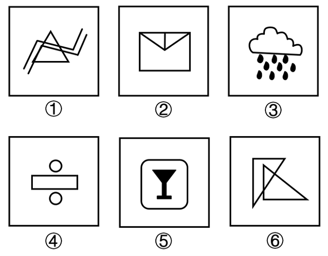
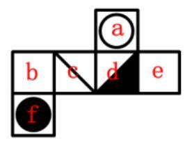
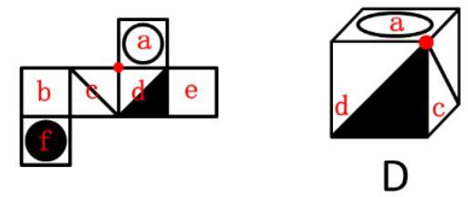
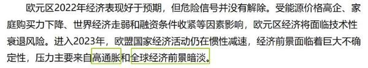
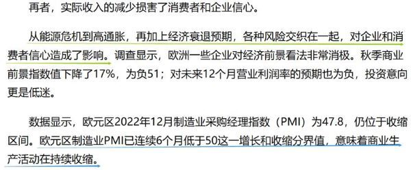

# 2023年湖北省选调生招录考试综合知识和行政职业能力测验试卷（网友回忆版）

> 判断推理 · 20 题 · 湖北 2023

## 第 1 题　qid 5496041 · 图形推理

把下面的六个图形分成两类，使每一类图形都有各自的规律和特性，分类正确的一项是：

- **A**. ①②⑤；③④⑥
- **B**. ①②⑥；③④⑤　✅
- **C**. ①③④；②⑤⑥
- **D**. ①⑤⑥；②③④

**答案**：B

**官方解析**

解法一：本题为分组分类题目。元素组成不同，出现明显生活化粗线条图形，考虑部分数。观察发现，图①②⑥均由一部分组成，图③④⑤均由多部分组成。
故正确答案为B。
解法二：元素组成不同，图④明显出现单一圆弧，考虑曲直性。观察发现，图①②⑥均为全直线图形，图③④⑤均为既有直线又有曲线图形。
故正确答案为B。
注：因为出现生活化粗线条图形，部分数的考频较高，粗线条图形很少讨论曲直性，故小粉笔本题更倾向于解法一。

---

## 第 2 题　qid 5496046 · 图形推理

一正方体沿某棱角展开的平面图形如下所示：

请根据其平面图形各面上的图案，判断这个正方体可能是：

- **A**. 

- **B**. 

- **C**. 

　✅
- **D**. 

**答案**：C

**官方解析**

本题为空间重构题。对展开图进行编号，如下图所示：

A项：选项由面a、面d和面f构成，题干展开图中面a与面f为相对面，不能同时出现，选项与题干展开图不一致，排除；

B项：选项由面a、面d和面f构成，题干展开图中面a与面f为相对面，不能同时出现，选项与题干展开图不一致，排除；

C项：选项由面a、面c和面d构成，选项与题干展开图一致，当选；

D项：选项由面a、面c和面d构成，选项中三个面的公共点（如下图红点所示）引出一条直线，题干展开图中三个面的公共点没有引出直线，选项与题干展开图不一致，排除。

故正确答案为C。

---

## 第 3 题　qid 5496047 · 定义判断

在众多生态因子中，有一种或少数几种因子是限制生物生存和繁殖的关键性因子，当这些因子的质或量低于或高于生物生存所能忍受的临界限度时，生物生长发育和繁殖就会受到限制，甚至引起死亡，这种接近或超过生物耐性上下限的生态因子被称作限制因子。
根据上述定义，下列不属于限制因子的是：

- **A**. 土壤水分对于在干旱和半干旱地区生长的植物
- **B**. 低温对于在中高纬度地区的农作物种子发芽
- **C**. 病虫害对于适宜在南方水田里生长的水稻　✅
- **D**. 土壤盐度对于在盐碱地里生长的树

**答案**：C

**官方解析**

第一步：找出定义关键词。
“有一种或少数几种因子是限制生物生存和繁殖的关键性因子”、“当这些因子的质或量低于或高于生物生存所能忍受的临界限度时”、“生物生长发育和繁殖就会受到限制，甚至引起死亡”。
第二步：逐一分析选项。
A项：该项中干旱和半干旱地区的土壤平均含水量低，当土壤水分低于植物生存所能忍受的临界限度就会影响植物的生长，甚至引起植物死亡，说明土壤水分是关键性因子，符合“有一种或少数几种因子是限制生物生存和繁殖的关键性因子”、“当这些因子的质或量低于或高于生物生存所能忍受的临界限度时”、“生物生长发育和繁殖就会受到限制，甚至引起死亡”，符合定义，排除；
B项：该项中中高纬度地区冬季气温较低，当低温低到种子发芽所需要的温度临界时，可能会影响种子发芽，说明低温是关键性因子，符合“有一种或少数几种因子是限制生物生存和繁殖的关键性因子”、“当这些因子的质或量低于或高于生物生存所能忍受的临界限度时”、“生物生长发育和繁殖就会受到限制，甚至引起死亡”，符合定义，排除；
C项：该项中水稻适宜在南方水田里生长，水稻的关键性因素应该是水田土壤、水分等，虽然病虫害可能会影响水稻生长，但与其他选项比较，更可能不是关键性因子，当选；
D项：该项中当盐碱地的土壤盐度超过树木生存所能忍受的临界限度时，会影响树木的生长，甚至引起其死亡，说明盐碱地的土壤盐度是关键性因子，符合“有一种或少数几种因子是限制生物生存和繁殖的关键性因子”、“当这些因子的质或量低于或高于生物生存所能忍受的临界限度时”、“生物生长发育和繁殖就会受到限制，甚至引起死亡”，符合定义，排除。
本题为选非题，故正确答案为C。

---

## 第 4 题　qid 5496059 · 定义判断

众筹农业是通过大众筹资开展的一种农业经营形式。能够生产优质农产品的发起人通过大众筹资让农产品消费者参与进来，消费者为了寻找优质农产品，与众筹发起人达成农产品供需协议，等农作物成熟后，将农产品交付给消费者。
根据上述定义，下列属于众筹农业的是：

- **A**. 大旺向农庄提供一笔资金，农庄按大旺的要求种植优质葡萄，成熟后交付大旺
- **B**. 农庄的草莓成熟了，晓峰带家人到农庄采摘了30斤草莓，按价付款后带走草莓
- **C**. 大牛花钱到农村租了一块地，请农民按要求种绿色蔬菜，蔬菜成熟后直接交付给他
- **D**. 农庄向20个市民募集资金种植优质枣，这20人按出资情况可获得枣树的相应收成　✅

**答案**：D

**官方解析**

第一步：找出定义关键词。
“大众筹资”、“让农产品消费者参与进来”、“等农作物成熟后，将农产品交付给消费者”。
第二步：逐一分析选项。
A项：大旺自己向农庄提供一笔资金，属于个人出资，不符合“大众筹资”，不符合定义，排除；
B项：晓峰自己带家人采摘草莓后按价付款，不符合“大众筹资”，不符合定义，排除；
C项：大牛自己花钱租地请农民种植蔬菜，不符合“大众筹资”，不符合定义，排除；
D项：农庄向20个市民募集资金，符合“大众筹资”，这20个市民可以获得相应收成，符合“让农产品消费者参与进来”、“等农作物成熟后，将农产品交付给消费者”，符合定义，当选。
故正确答案为D。

---

## 第 5 题　qid 5496063 · 定义判断

设施农业是采用人工技术手段，改变自然光温条件，创造优化动植物生长的环境因子，使之能够全天候生长的农业设施工程。
根据上述定义，下列不属于设施农业的是：

- **A**. 温棚花卉种植
- **B**. 菇房花菇种植
- **C**. 深山放养土鸡　✅
- **D**. 网箱养殖鳝鱼

**答案**：C

**官方解析**

第一步：找出定义关键词。
“采用人工技术手段”、“改变自然光温条件”、“创造优化动植物生长的环境因子”。
第二步：逐一分析选项。
A项：“温棚”能对大棚进行加温或保温，是用来培植农作物的设备，能在不适宜植物生长的季节进行种植，符合“采用人工技术手段”、“改变自然光温条件”、“创造优化动植物生长的环境因子”，符合定义，排除；
B项：“菇房”是人工栽培食用菌（食用菇、耳类等大型真菌）可人工控制温度、湿度、通风、光线环境的出菇厂房，符合“采用人工技术手段”、“改变自然光温条件”、“创造优化动植物生长的环境因子”，符合定义，排除；
C项：深山放养土鸡，并没有“采用人工技术手段”，也没有“改变自然光温条件”，不符合定义，当选；
D项：“网箱养鱼”是将由网片制成的箱笼，放置于一定水域，进行养鱼的一种生产方式，符合“采用人工技术手段”、“改变自然光温条件”，符合定义，排除。
本题为选非题，故正确答案为C。

---

## 第 6 题　qid 5496068 · 逻辑判断

社会生活中存在着确定性现象和不确定性现象。确定性现象是在一定条件下必然会发生或必然不会发生的现象。不确定性现象又称为随机现象，是在一定条件下可能发生也可能不发生的现象。
根据定义，以下为随机现象的是：

- **A**. 
在一个标准大气压条件下，纯净水加热到时会沸腾

- **B**. 
2022年卡塔尔世界杯决赛中，阿根廷队击败法国队夺得冠军
　✅
- **C**. 
2022年下半年全球经济下行，2023年全球经济发展面临挑战

- **D**. 
5G+工业互联网形成远程设备操控、无人智能巡检等应用实践

**答案**：B

**官方解析**

第一步：找出定义关键词。

确定性现象：“在一定条件下必然会发生或必然不会发生”；

不确定性现象（随机现象）：“在一定条件下可能发生也可能不发生”。

第二步：逐一进行分析。

A项：在一个标准大气压条件下，纯净水加热到时会沸腾，是必然会发生的现象，不符合“在一定条件下可能发生也可能不发生”，不符合“随机现象”定义，排除；

B项：2022年卡塔尔世界杯决赛中，阿根廷队和法国队的对战结果是不确定的，有随机性，阿根廷队击败法国队夺得冠军有可能会发生，也有可能不会发生，符合“在一定条件下可能发生也可能不发生”，符合“随机现象”定义，当选；

C项：2022年下半年全球经济下行，在此情形下会对2023年全球经济发展带来影响，无论面临的困难是大还是小，对于2023年全球经济发展来说都是挑战，不符合“在一定条件下可能发生也可能不发生”，不符合“随机现象”定义，排除；

D项：5G+工业互联网是指利用以5G为代表的新一代信息通信技术，构建与工业经济深度融合的新型基础设施、应用模式和工业生态，5G+工业互联网一定会形成相关的应用实践，不符合“在一定条件下可能发生也可能不发生”，不符合“随机现象”定义，排除。

故正确答案为B。

---

## 第 7 题　qid 5496071 · 定义判断

戏曲虚拟是指用艺术的虚来表现生活的实的过程，是戏曲表现生活的基本手法。戏曲虚拟利用舞台的假定性，灵活处理时间与空间。
根据上述定义，下列不属于戏曲虚拟的是：

- **A**. 戏台上以划桨表示水中行船
- **B**. 戏台上以空翻表示武艺高强　✅
- **C**. 戏台上以摸索代表夜晚看不见
- **D**. 戏台上演员挥动马鞭代表骑马

**答案**：B

**官方解析**

第一步：找出定义关键词。
“用艺术的虚来表现生活的实”。
第二步：逐一分析选项。
A项：利用戏台上划桨的动作让观众联想到生活中的水中行船，符合“用艺术的虚来表现生活的实”，符合定义，排除；
B项：戏台上的空翻本身就是经过训练才能较好完成的动作，能直接让观众觉得角色武艺高强，不符合“用艺术的虚来表现生活的实”，不符合定义，当选；
C项：利用戏台上摸索的动作让观众联想到夜晚看不见，符合“用艺术的虚来表现生活的实”，符合定义，排除；
D项：利用戏台上挥动马鞭的动作让观众联想到生活中的骑马，符合“用艺术的虚来表现生活的实”，符合定义，排除。
本题为选非题，故正确答案为B。

---

## 第 8 题　qid 5496073 · 类比推理

精准扶贫：乡村振兴：共同富裕

- **A**. 和平安宁：经济繁荣：公平正义
- **B**. 发展教育：提高素质：建设国家　✅
- **C**. 诚实守信：责任担当：爱岗敬业
- **D**. 闲庭信步：快马加鞭：风驰电掣

**答案**：B

**官方解析**

第一步：判断题干词语间逻辑关系。
精准扶贫是为了实现乡村振兴，乡村振兴是为了实现共同富裕，三者为方式目的的对应关系。
第二步：判断选项词语间逻辑关系。
A项：和平安宁有利于经济繁荣，经济繁荣不是为了公平正义，三者不是方式目的的对应关系，与题干逻辑关系不一致，排除；
B项：发展教育是为了提高素质，提高素质是为了建设国家，三者为方式目的的对应关系，与题干逻辑关系一致，当选；
C项：诚实守信、责任担当、爱岗敬业都是道德品质，三者为并列关系，与题干逻辑关系不一致，排除；
D项：闲庭信步形容很清闲的样子，有时也形容信心十足；快马加鞭比喻快上加快，加速前进；风驰电掣形容速度非常快。后两者为近义关系，与题干逻辑关系不一致，排除。
故正确答案为B。

---

## 第 9 题　qid 5496074 · 类比推理

中华文明：世界文明：文明

- **A**. 荆楚艺术：中国艺术：艺术　✅
- **B**. 四书五经：古代经典：经典
- **C**. 四大名著：现代名著：名著
- **D**. 插花剪纸：民间艺人：艺人

**答案**：A

**官方解析**

第一步：判断题干词语间逻辑关系。
中华文明是世界文明的一个组成部分，二者为组成关系；世界文明是文明的一种，二者为种属关系。
第二步：判断选项词语间逻辑关系。
A项：荆楚是指古域包括现今湖北全域及其周围，现指湖北省。荆楚艺术是中国艺术的一个组成部分，二者为组成关系；中国艺术是艺术的一种，二者为种属关系，与题干逻辑关系一致，当选；
B项：四书五经是我国古代经典，二者为种属关系，与题干逻辑关系不一致，排除；
C项：四大名著一般指《三国演义》《水浒传》《西游记》《红楼梦》四部中国古典长篇小说，和现代名著不是组成关系，与题干逻辑关系不一致，排除；
D项：民间艺人制作插花和剪纸作品，二者为人物和艺术成品的对应关系，与题干逻辑关系不一致，排除。
故正确答案为A。

---

## 第 10 题　qid 5496077 · 类比推理

贴窗花：挂灯笼：迎新年

- **A**. 燃烟花：年夜饭：辞旧岁
- **B**. 种小麦：插稻秧：盼丰收　✅
- **C**. 耕稻田：除杂草：割麦子
- **D**. 吹和风：下细雨：万物生

**答案**：B

**官方解析**

第一步：判断题干词语间逻辑关系。
贴窗花和挂灯笼都是为了迎新年，前两词与第三词均为方式目的的对应关系。
第二步：判断选项词语间逻辑关系。
A项：年夜饭意味着告别旧岁，迎来新岁；也代表家庭的团圆，希望新的一年里吉祥如意、幸福圆满。燃烟花和年夜饭都是为了辞旧岁，前两词与第三词均为方式目的的对应关系，与题干逻辑关系一致，保留；
B项：种小麦和插稻秧都是为了盼丰收，前两词与第三词均为方式目的的对应关系，与题干逻辑关系一致，保留；
C项：耕稻田、除杂草和割麦子都是农事活动，三者为并列关系，与题干逻辑关系不一致，排除；
D项：吹和风和下细雨都可以导致万物生，前两词与第三词均为因果的对应关系，与题干逻辑关系不一致，排除。
比较A、B两项，题干“贴窗花”、“挂灯笼”和“迎新年”都是动宾结构，B项“种小麦”、“插稻秧”和“盼丰收”也都是动宾结构，而A项“年夜饭”不是动宾结构，B项与题干逻辑关系更为一致，当选。
故正确答案为B。

---

## 第 11 题　qid 5496079 · 类比推理

倚山：傍水：农家院：袅袅炊烟

- **A**. 竹深：树密：小山村：唧唧虫鸣
- **B**. 空山：微风：不见人：声声人语
- **C**. 穿林：绕坡：山间路：隐隐磬声　✅
- **D**. 清晨：初日：照广场：翩翩舞影

**答案**：C

**官方解析**

第一步：判断题干词语间逻辑关系。
倚山和傍水为并列关系，倚山和傍水均可以用来修饰农家院，前两个词与第三个词均构成偏正关系，农家院里传来袅袅炊烟，二者为地点与具体景象的对应关系。
第二步：判断选项词语间逻辑关系。
A项：竹深和树密为并列关系，竹深和树密均可以用来修饰小山村，前两个词与第三个词均构成偏正关系，小山村里传来唧唧虫鸣，二者为地点与具体景象的对应关系，与题干逻辑关系一致，保留；
B项：空山和微风为并列关系，但空山和微风均不能用来修饰不见人，与题干逻辑关系不一致，排除；
C项：穿林和绕坡为并列关系，穿林和绕坡均可以用来修饰山间路，前两个词与第三个词均构成偏正关系，山间路上传来隐隐磬声，二者为地点与具体景象的对应关系，与题干逻辑关系一致，保留；
D项：清晨指日出前后的一段时间，初日指刚升起的太阳，二者不是并列关系，与题干逻辑关系不一致，排除。
对比A、C两项，题干中“倚山”和“傍水”均为动宾结构，A项的“竹深”和“树密”均不是动宾结构，C项的“穿林”和“绕坡”均为动宾结构，故C项与题干逻辑关系更一致，当选。
故正确答案为C。

---

## 第 12 题　qid 5496080 · 类比推理

乱云飞渡仍从容：非凡定力

- **A**. 孤帆远影碧空尽：伤情别离
- **B**. 乌衣巷口夕阳斜：人近黄昏
- **C**. 千磨万击还坚劲：顽强意志　✅
- **D**. 弄潮儿向涛头立：砥柱中流

**答案**：C

**官方解析**

第一步：判断题干词语间逻辑关系。
“乱云飞渡仍从容”意思是任凭翻腾的云雾从身边穿过，仍然泰然自若，诗句中体现出了“非凡定力”，二者为对应关系。
第二步：判断选项词语间逻辑关系。
A项：“孤帆远影碧空尽”意思是友人的孤船帆影渐渐地远去，消失在碧空的尽头，诗句中体现出了对友人的“伤情别离”，二者为对应关系，与题干逻辑关系一致，保留；
B项：“乌衣巷口夕阳斜”意思是乌衣巷口唯有夕阳斜挂，通过荒凉的景象，暗含了诗人对盛衰兴败的深沉感慨，诗句并未体现出“人近黄昏”，与题干逻辑关系不一致，排除；
C项：“千磨万击还坚劲”意思是经过无数的磨难和打击，身骨依然坚劲，诗句中体现出了“顽强意志”，二者为对应关系，与题干逻辑关系一致，保留；
D项：“弄潮儿向涛头立”意思是踏潮献技的人站在波涛上表演，通过对弄潮情景的描写，表现出弄潮健儿与大自然奋力搏斗的大无畏精神，诗句并未体现出“砥柱中流”，与题干逻辑关系不一致，排除。
对比A、C两项，A项的“伤情别离”表达的是人物情感，题干的“非凡定力”与C项的“顽强意志”表达的都是人物的品质，故C项与题干逻辑关系更一致，当选。
故正确答案为C。

---

## 第 13 题　qid 5496082 · 逻辑判断

一项包含20名受试者的研究中，所有受试者第一晚都在几乎全黑的房间入睡。第二晚，一半受试者在明亮的房间入睡，一半受试者仍然在几乎全黑的房间入睡。在受试者睡眠期间，研究人员对他们的脑电波和心率进行了记录，同时还开展了其它测试项目。结果显示，在光照环境下入睡的受试者整晚心率都偏高。研究人员由此认为，睡眠时的光照会对人的心血管产生不利影响。
以下哪项为真，最能支持研究人员的观点？

- **A**. 研究发现开灯睡觉有17%的几率导致体重增加
- **B**. 较强的光照会对睡眠者的心率产生不利影响
- **C**. 睡眠时的光照会使睡眠者的神经系统兴奋
- **D**. 研究中所有的受试者在受试前都心率正常　✅

**答案**：D

**官方解析**

第一步：找出论点和论据。
论点：睡眠时的光照会对人的心血管产生不利影响。
论据：一项包含20名受试者的研究中，所有受试者第一晚都在几乎全黑的房间入睡。第二晚，一半受试者在明亮的房间入睡，一半受试者仍然在几乎全黑的房间入睡。在受试者睡眠期间，研究人员对他们的脑电波和心率进行了记录，同时还开展了其它测试项目。结果显示，在光照环境下入睡的受试者整晚心率都偏高。
本题论点和论据均在讨论睡眠时的光照对人的心血管的影响，二者话题一致，且论据为对比实验，加强可考虑补充实验前的实验对象起点一致。
第二步：逐一分析选项。
A项：该项指出开灯睡觉有几率导致体重增加，但论点讨论的是睡眠时的光照对心血管的影响，话题不一致，无法加强，排除；
B项：该项指出睡眠时较强的光照对人的心率产生不利影响，说明睡眠时的光照会对人的心血管产生不利影响，属于补充论据，可以加强，保留；
C项：该项指出睡眠时的光照会使睡眠者的神经系统兴奋，但论点讨论的是睡眠时的光照对心血管的影响，话题不一致，无法加强，排除；
D项：该项指出研究中所有的受试者在受试前都心率正常，即补充实验前的实验对象起点一致，属于必要条件，可以加强，保留。
对比B、D两项，B项为补充论据，D项为必要条件，必要条件的加强力度大于补充论据，D项当选。
故正确答案为D。

---

## 第 14 题　qid 5496084 · 逻辑判断

研究人员招募了619人参与实验，其中200人完全放弃智能手机一周；226人将他们每天使用智能手机的时间减少一小时；193人保持原来的智能手机使用习惯而不做任何改变。在干预实验一个月和四个月后对所有参与者进行回访，以了解他们的生活习惯和幸福感。研究人员发现，完全放弃智能手机，或将其每天使用时间减少一小时都对参与者的生活方式和幸福感产生了积极影响。研究人员认为，减少而非完全放弃智能手机的日常使用，对一个人的幸福感会产生更为积极的影响。
补充以下哪项前提，研究人员的观点才能成立？

- **A**. 完全放弃智能手机的使用会影响人们的工作效率和生活质量
- **B**. 完全放弃智能手机使用的积极影响在现代社会很难长期持续
- **C**. 减少使用比完全放弃使用智能手机的积极影响更持久稳定　✅
- **D**. 减少智能手机的使用是综合平衡多方利弊后的理性选择

**答案**：C

**官方解析**

第一步：找出论点和论据。
论点：减少而非完全放弃智能手机的日常使用，对一个人的幸福感会产生更为积极的影响。
论据：完全放弃智能手机，或将其每天使用时间减少一小时都对参与者的生活方式和幸福感产生了积极影响。
本题论点和论据均在讨论“完全放弃使用或减少使用智能手机”与“幸福感”之间的关系，论点论据话题一致，加强优先考虑补充论据。
第二步：逐一分析选项。
A项：该项指出完全放弃使用智能手机会带来的影响，但不明确减少使用智能手机时间是否同样也会带来影响，即无法得知论点讨论的减少使用和完全放弃使用智能手机谁对幸福感会产生更为积极的影响，为不明确项，无法加强，排除；
B项：该项指出完全放弃使用智能手机的积极影响很难持续，但不明确减少使用智能手机时间的积极影响是否同样很难持续，即无法得知论点讨论的减少使用和完全放弃使用智能手机谁对幸福感会产生更为积极的影响，为不明确项，无法加强，排除；
C项：该项指出减少使用智能手机比完全放弃使用智能手机的“积极影响更持久稳定”，可以加强论点减少而非完全放弃智能手机的使用对一个人的“幸福感会产生更为积极的影响”，补充论据加强，当选；
D项：该项指出减少使用智能手机时间的原因，未提及它是否会对幸福感产生积极的影响，与论点讨论的减少使用和完全放弃使用智能手机谁对幸福感会产生更为积极的影响无关，话题不一致，无法加强，排除。
故正确答案为C。

---

## 第 15 题　qid 5496086 · 逻辑判断

研究人员研究了糖皮质激素在小鼠自身免疫性疾病中的作用。他们在正常小鼠和缺乏糖皮质激素受体的小鼠中诱导了脱发，两周后，研究人员看到了小鼠们之间的明显差异。正常小鼠的毛发重新长出，但没有糖皮质激素受体的小鼠几乎不能重新长出毛发。研究人员认为，小鼠的毛囊干细胞无法被激活，毛发因而不能重新长出。
以下哪项如果为真，最能支持研究人员的观点？

- **A**. 正常的小鼠体内有糖皮质激素受体
- **B**. 糖皮质激素有助于激活毛囊干细胞　✅
- **C**. 要长头发必须要有糖皮质激素
- **D**. 要长头发必须激活毛囊干细胞

**答案**：B

**官方解析**

第一步：找出论点和论据。
论点：小鼠的毛囊干细胞无法被激活，毛发因而不能重新长出。
论据：研究人员在正常小鼠和缺乏糖皮质激素受体的小鼠中诱导了脱发，两周后，正常小鼠的毛发重新长出，但没有糖皮质激素受体的小鼠几乎不能重新长出毛发。
本题论点讨论的是“毛囊干细胞”与“重新长出毛发”之间的关系，论据讨论的是“糖皮质激素受体”与“重新长出毛发”之间的关系，论点论据话题不一致，加强优先考虑搭桥，即建立“糖皮质激素受体”与“毛囊干细胞”之间的联系。
第二步：逐一分析选项。
A项：该项指出正常的小鼠体内有糖皮质激素受体，而论点讨论的是毛囊干细胞未被激活会导致毛发不能重新长出，话题不一致，无法加强，排除；
B项：该项指出糖皮质激素有助于激活毛囊干细胞，建立了“糖皮质激素”与“毛囊干细胞”之间的联系，为搭桥项，可以加强，当选；
C项：该项指出要长头发必须要有糖皮质激素，属于重复论据，而论点讨论的是毛囊干细胞未被激活会导致毛发不能重新长出，无法加强，排除；
D项：该项指出要长头发必须激活毛囊干细胞，属于重复论点，有一定的加强力度，但力度没有搭桥项力度大，排除。
故正确答案为B。

---

## 第 16 题　qid 5496104 · 逻辑判断

远古巨型食草动物灭绝是否影响了植物的进化历程？为了回答这个问题，一个德国研究团队分析了远古巨型食草动物化石和棕榈树，他们发现即使在恐龙这样的巨型食草动物灭绝之后，大果实棕榈树也很普遍，这说明体型较小的食草动物也可能吃较大果实，并通过它们的排泄物传播种子。研究人员认为，这个研究结果可以反驳之前关于植物和食草动物关系的科学假设。
之前的科学假设最有可能是：

- **A**. 在巨型食草动物灭绝之后，大果实棕榈树显著减少
- **B**. 体型较小的食草动物只会吃小果实棕榈树的小果实
- **C**. 大果实棕榈树完全依赖巨型食草动物进行种子传播　✅
- **D**. 小果实棕榈树在巨型食草动物灭绝之后迅速繁衍

**答案**：C

**官方解析**

第一步：找出论点和论据。
论据：即使在恐龙这样的巨型食草动物灭绝之后，大果实棕榈树也很普遍，这说明体型较小的食草动物也可能吃较大果实，并通过它们的排泄物传播种子。
本题问的是之前的科学假设最有可能是哪项，而文段最后说这个研究结果可以反驳之前关于植物和食草动物关系的科学假设，故可以把整个题干研究结果当成论据，将其反驳，找出能够成为之前的科学假设的选项即可。
第二步：逐一分析选项。
A项：说明巨型食草动物灭绝之后，大果实棕榈树显著减少，题干研究结果发现巨型食草动物灭绝之后，大果实棕榈树也很普遍，大果实棕榈树也很普遍说明并没有显著减少，题干研究结果可以反驳A项内容，故A项可能是之前的科学假设，保留；
B项：说明小型食草动物只会吃小果实棕榈树的小果实，题干研究结果说明体型较小的食草动物也可能吃较大果实，题干研究结果可以反驳B项内容，故B项可能是之前的科学假设，保留；
C项：说明大果实棕榈树完全依赖巨型食草动物进行种子传播，这表明如果没有大型食草动物进行种子传播，大果实棕榈树会无法传播种子，最后可能导致数量减少，题干研究结果一方面说明大果实棕榈树也很普遍，这说明并没有显著减少，另一方面说明体型较小的食草动物叶也可能吃较大果实，并用它们的排泄物传播种子，这说明大果实棕榈树并不是完全依赖巨型食草动物进行种子传播，题干研究结果可以反驳C项内容，故C项可能是之前的科学假设，保留；
D项：说明小果实棕榈树和巨型食草动物的关系，但题干研究结果讨论的是大果实棕榈树，主体不一致，题干研究结果无法反驳D项内容，故D项不是之前的科学假设，排除。
对比A、B、C三项，研究结果包含两部分，一是大果实棕榈树数量没有少，二是大果实棕榈树通过小型食草动物传播种子，A项只被一反驳，B项只被二反驳，C项被研究结果的两个部分均反驳，因此C项更合适，当选。
故正确答案为C。

---

## 第 17 题　qid 5496105 · 逻辑判断

近日发布的《全球科技创新中心发展指数2022》显示，无论是综合排名，还是在创新要素全球集聚力、科学研究全球引领力、技术创新全球策源力、产业变革全球驱动力和创新环境全球支撑力5个维度的单项排名上，全球科技创新中心均集中分布在欧洲、北美和亚太区域。综合排名前100的全球科技创新中心有34个在欧洲、30个在北美、29个在亚太。
根据以上信息最能推出的结论是：

- **A**. 全球科技创新中心分布呈现欧洲、北美和亚太三足鼎立格局　✅
- **B**. 中国科创中心强势崛起使亚太成为全球科技创新中心的一极
- **C**. 高新科技发展依赖于欧洲、北美和亚太的全球科技创新中心
- **D**. 美国排名前100的科创中心最多，领跑全球科技创新中心建设

**答案**：A

**官方解析**

日常结论题，根据题干信息逐一分析选项。
A项：根据题干可知“全球科技创新中心均集中分布在欧洲、北美和亚太区域”，可以推出全球科技创新中心分布呈现欧洲、北美和亚太三足鼎立格局，当选；
B项：题干中没有涉及到“中国科创中心”，无法推出中国科创中心是否使亚太成为全球科技创新中心的一极，无中生有，排除；
C项：题干中没有涉及到“高新科技发展”，无法推出高新科技发展是否依赖于欧洲、北美和亚太的全球科技创新中心，无中生有，排除；
D项：题干中没有涉及到“美国排名前100的科创中心”，无法推出其是否最多，也无法得知是否领跑全球科技创新中心建设，无中生有，排除。
故正确答案为A。

---

## 第 18 题　qid 5496108 · 逻辑判断

受2022年三季度实际GDP出人意料上行的影响，欧元区2022经济表现好于预期。区内19个国家全年平均增长率达3.3%。但四季度经济发展呈现下行趋势，进入2023年，经济活动仍在惯性减速。欧洲央行据此发表声明指出，2023年，欧元区将面临经济衰退的风险。
欧洲央行的观点若要增强说服力，可以补充的前提是：
①两位数的高通货膨胀率没有减弱迹象，犹如定时炸弹，随时会引爆经济危机
②制造业PMI已连续6个月低于50这一荣枯线，表明生产经营活动在持续收缩
③经济衰退预期和各种风险交织，降低了企业和消费者信心，使市场需求萎缩
④整个世界经济可能走弱，使欧元区面临外部需求不足，国际收支失离的困境

- **A**. ①②③
- **B**. ①②④
- **C**. ①③④　✅
- **D**. ②③④

**答案**：C

**官方解析**

第一步：找出论点和论据。

论点：2023年，欧元区将面临经济衰退的风险。

论据：但欧元2022年四季度经济发展呈现下行趋势，进入2023年，经济活动仍在惯性减速。

论据讨论的是欧元区2022年四季度经济下行，2023年经济活动减速，论点讨论的是欧元区2023年将面临经济衰退的风险，二者话题一致，问法为“前提”，优先考虑必要条件，其次也可以考虑补充论据。

第二步：逐一分析选项。

① ：两位数的高通货膨胀率没有减弱迹象，随时会引爆经济危机，高通胀率、经济危机都会抑制经济活动，解释了为什么欧元区将面临经济衰退的风险，补充论据，可以加强；

② ：制造业PMI表明生产经营活动在持续收缩，生产经营活动收缩可能会影响经济发展，解释了为什么欧元区将面临经济衰退的风险，补充论据，可以加强；

③ ：经济衰退预期和各种风险交织使市场需求萎缩，市场需求萎缩会影响经济发展，解释了为什么欧元区将面临经济衰退的风险，补充论据，可以加强；

④ ：整个世界经济可能走弱，使欧元区面临外部需求不足，国际收支失离的困境，而这会抑制经济活动，解释了为什么欧元区将面临经济衰退的风险，补充论据，可以加强。

对比上述四项，其中①③④是在宏观上解释欧元区为什么将要面临经济衰退的风险，其中的①和④都有原文的对应，对应如下所示：

②是在具体地说制造业的情况，且结合原文来看，②和③出现在同一个小标题的对应下，②主要是证明③的具体数据示例。

综上，①③④可以加强。

故正确答案为C。

---

## 第 19 题　qid 5496111 · 逻辑判断

每吨电子垃圾中含有200-350g金。最近，国内团队研制出一种被命名为JNM的新吸附材料。JNM可对CPU废弃物浸出液中的金离子进行5次循环吸附，并保持较高吸附率：在高浓度干扰离子作用下，JNM能对金离子保持高选择性吸附，从150个CPU废弃物中，JNM能回收0.61g金。所以，JNM是目前回收复杂废液中微量金的最高效新材料。
上述结论若要增强说服力，还需要补充的前提是：

- **A**. JNM对金的吸附量能伴随着金离子初始浓度增高而增大
- **B**. JNM对金的最大吸附量超过了国内外已知的所有吸附材料　✅
- **C**. JNM能高效回收生活污水、工业废水和海水中的微量金
- **D**. JNM在1000ppm时，对金的最大吸附量达到954mg/g

**答案**：B

**官方解析**

第一步：找出论点和论据。
论点：JNM是目前回收复杂废液中微量金的最高效新材料。
论据：JNM可对CPU废弃物浸出液中的金离子进行5次循环吸附，并保持较高吸附率：在高浓度干扰离子作用下，JNM能对金离子保持高选择性吸附，从150个CPU废弃物中，JNM能回收0.61g金。
本题的论点论据均在讨论JNM可以高效的回收微量金，论点论据话题一致，且提问方式为“前提”，加强优先考虑补充必要条件，其次也可以考虑补充论据。
第二步：逐一分析选项。
A项：该项讨论的是JNM对金的吸附量与金离子初始浓度之间的关系，而论点讨论的是JNM是否是回收复杂废液中微量金的最高效新材料，话题不一致，无法加强，排除；
B项：该项讨论的是JNM对金的最大吸附量超过了国内外已知的所有吸附材料，如果该项不成立，即JNM对金的最大吸附量没有超过国内外已知的所有吸附材料，就不能得出“JNM是最高效新材料”这个论点，因此该项是论点成立的必要条件，当选；
C项：该项讨论的是JNM能高效回收生活污水、工业废水和海水中的微量金，而论点讨论的是JNM是否是回收复杂废液中微量金的最高效新材料，无法加强，排除；
D项：该项讨论的是JNM在1000ppm时，对金的最大吸附量达到954mg/g，但不明确这个吸附量是否比其他的吸附材料都高，为不明确项，无法加强，排除。
故正确答案为B。

---

## 第 20 题　qid 5496112 · 逻辑判断

一个研究团队25年来，持续跟踪研究了1.1万名成年人，以他们血液中钠离子浓度作为体内水分是否充足的指标，浓度较高代表水分摄取量不足。尽管受试者血液中钠浓度都在135～146毫摩尔/升的正常值内，但高于144毫摩尔/升的人与低于144毫摩尔/升的人相比，衰老风险高50%，早亡风险高20%。团队发表的结论是，水分摄取不足的成年人老得更快、寿命更短。
以下各项如果为真，最能削弱以上结论的是：

- **A**. 水分摄取与成人过快衰老和过早死亡之间的关联属于“高度揣测”　✅
- **B**. 上述研究还缺乏摄取充足水分能推迟衰老、延长寿命的科学证据
- **C**. 没有直接证据证明，人体血液中钠离子浓度高代表水分摄取不足
- **D**. 有规律的运动和维持营养均衡，才是减缓衰老、延长寿命的途径

**答案**：A

**官方解析**

第一步：找出论点和论据。

论点：水分摄取不足的成年人老得更快、寿命更短。

论据：一个研究团队25年来，持续跟踪研究了1.1万名成年人，以他们血液中钠离子浓度作为体内水分是否充足的指标，浓度较高代表水分摄取量不足。尽管受试者血液中钠浓度都在135～146毫摩尔/升的正常值内，但高于144毫摩尔/升的人与低于144毫摩尔/升的人相比，衰老风险高50%，早亡风险高20%。

本题论点和论据都是在对水分摄取不足与衰老之间进行讨论，论点与论据话题一致，削弱优先考虑削弱论点。

第二步：逐一分析选项。

A项：该项指出水分摄取与过快衰老、过早死亡之间的关联属于“高度揣测”，说明水分摄取与衰老、死亡之间并不一定存在关系，否定论点，可以削弱，保留；

B项：该项指出该研究还缺少关于摄取充足水分能否推迟衰老、延长寿命的讨论，讨论的是水分摄取充足时的情况，而论点讨论的是水分摄取不足的情况，二者话题不一致，无法削弱，排除；

C项：该项指出血液中钠离子浓度高是否代表水分摄取不足是没有直接证据的，说明钠离子浓度高与水分摄取不足之间并不一定存在关系，削弱论据，可以削弱，保留；

D项：该项指出运动和营养均衡才是减缓衰老、延长寿命的途径，讨论的是延缓衰老的方法，而论点讨论的是导致衰老的原因，二者话题不一致，无法削弱，排除。

对比A、C两项，本题的论证逻辑是钠离子浓度高水分摄取不足衰老，C项削弱的是前两者的关系，在削弱论据，但本题论点着重讨论的是水分摄取不足与衰老之间的关系，A项则是直接针对后两者进行的削弱，在削弱论点，A项削弱力度更大，当选。

故正确答案为A。

---
