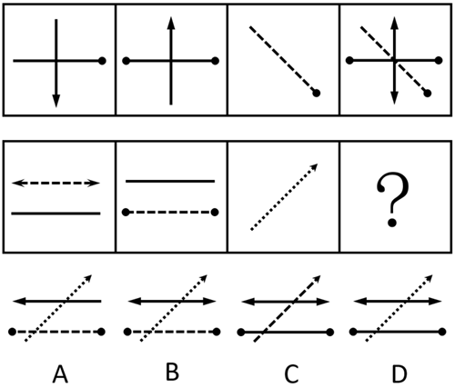
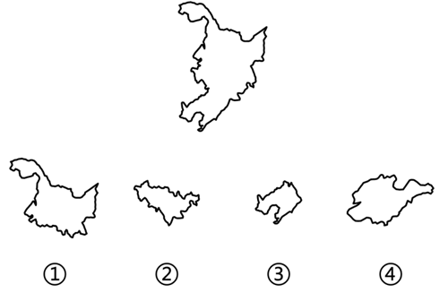
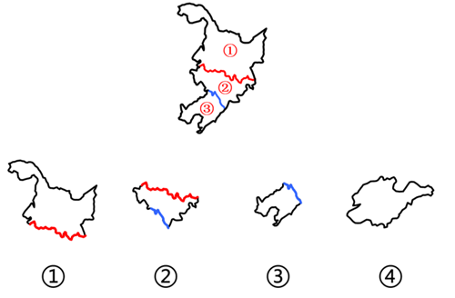
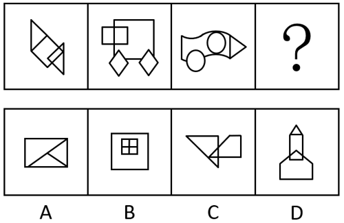
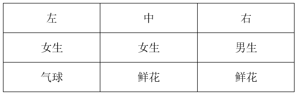

# 2023年重庆市选调优秀大学生到基层工作考试《行测》题

> 判断推理 · 30 题 · 选调 2023

## 第 1 题　qid 17058543 · 图形推理

从所给四个选项中，选择最合适的一个填入问号处，使之呈现一定规律性（    ）。

- **A**. A
- **B**. B
- **C**. C　✅
- **D**. D

**答案**：C

**官方解析**

题干每幅图均由带缺口的多边形构成，且缺口位置不同，优先考虑位置规律。观察发现，题干图形的缺口位置依次在左方、上方、右方，问号处应用此规律，缺口位置应该在下方，只有C项符合。
故正确答案为C。

---

## 第 2 题　qid 17058551 · 图形推理

从所给四个选项中，选择最合适的一个填入问号处，使之呈现一定规律性（    ）。

- **A**. A
- **B**. B
- **C**. C
- **D**. D　✅

**答案**：D

**官方解析**

元素组成相似，且相同线条重复出现，优先考虑样式规律中的加减同异。观察发现，第一行中的图1、图2和图3相加得到图4；第二行应用此规律，只有D项符合。 
故正确答案为D。

---

## 第 3 题　qid 17058547 · 图形推理

从四个选项中选择三个使之能组成题干图形（    ）。

- **A**. ①②③　✅
- **B**. ①③④
- **C**. ①②④
- **D**. ②③④

**答案**：A

**官方解析**

本题考查平面拼合，可采用平行且等长相消的方式解题。图①、图②、图③消去平行且等长的线段后进行组合即可得到题干轮廓图。平行且等长相消的方式如下图所示：

故正确答案为A。

---

## 第 4 题　qid 17058593 · 图形推理

从四个选项中选择一个填入问号处，使之能组成箭头右侧的图形（    ）。

- **A**. A
- **B**. B
- **C**. C
- **D**. D　✅

**答案**：D

**官方解析**

本题考查立体拼合。根据题干箭头右侧图形可知，总共需要2×3×4=24个小立方体进行拼合，观察题干发现，箭头左侧的3个图形分别由14个、4个、2个小立方体构成，故应补充一个由4个小立方体构成的图形，只有D项符合。具体组合方式如下图所示：

故正确答案为D。

---

## 第 5 题　qid 17058596 · 图形推理

从所给的四个选项中，选择最合适的一个填入问号处，使之呈现一定规律性（    ）。

- **A**. A
- **B**. B　✅
- **C**. C
- **D**. D

**答案**：B

**官方解析**

元素组成不同，且无明显属性规律，考虑数量规律。观察发现，题干图形封闭区域明显，优先考虑数面。题干图形的面数量均为5，问号处应用此规律，只有B项符合。
故正确答案为B。

---

## 第 6 题　qid 17058616 · 定义判断

法律条文是表达和传递立法者意图、立法目的和法典基本内容的文字载体。其中的定义性条款是对特定法律概念的内涵和外延，进行整体或单独阐释和具体说明的法律条文。概念内涵指概念所反映对象的本质属性或特有属性，外延指概念所反映的对象。
下列各项均为《中华人民共和国民法典》中的法律条文，根据上述定义，不属于定义性条款的是（    ）。

- **A**. 法人是具有民事权利能力和民事行为能力，依法独立享有民事权利和承担民事义务的组织
- **B**. 物权是权利人依法对特定的物享有直接支配和排他的权利，包括所有权、用益物权和担保物权
- **C**. 民事权利可以依据民事法律行为、事实行为、法律规定的事件或者法律规定的其他方式取得　✅
- **D**. 兄弟姐妹，包括同父母的兄弟姐妹、同父异母或者同母异父的兄弟姐妹、养兄弟姐妹、有扶养关系的继兄弟姐妹

**答案**：C

**官方解析**

第一步：找出定义关键词。
法律条文：“表达和传递立法者意图、立法目的和法典基本内容的文字载体”；
定义性条款：“对特定法律概念的内涵和外延，进行整体或单独阐释和具体说明的法律条文”；
内涵：“概念所反映对象的本质属性或特有属性”；
外延：“概念所反映的对象”。
第二步：逐一分析选项。
A项：具有民事权利能力和民事行为能力，依法独立享有民事权利和承担民事义务，是“法人”这个概念的属性，符合“概念所反映对象的本质属性或特有属性”，符合“对特定法律概念的内涵和外延，进行整体或单独阐释和具体说明的法律条文”，符合“定义性条款”定义，排除；
B项：权利人依法对特定的物直接支配和排他，是“物权”这个概念的属性，符合“概念所反映对象的本质属性或特有属性”，所有权、用益物权和担保物权是“物权”这个概念所包含的子项，符合“概念所反映的对象”，符合“对特定法律概念的内涵和外延，进行整体或单独阐释和具体说明的法律条文”，符合“定义性条款”定义，排除；
C项：该项说的是“民事权利”的获得方式，没有对其内涵和外延进行阐释和具体说明，不符合“对特定法律概念的内涵和外延，进行整体或单独阐释和具体说明的法律条文”，不符合“定义性条款”定义，当选；
D项：该项列举了“兄弟姐妹”这个概念所包含的子项，是对“兄弟姐妹”这个概念的外延进行具体说明，符合“概念所反映的对象”，符合“对特定法律概念的内涵和外延，进行整体或单独阐释和具体说明的法律条文”，符合“定义性条款”定义，排除。
本题为选非题，故正确答案为C。

---

## 第 7 题　qid 17058560 · 定义判断

她经济也称女性经济，是围绕女性形成的一种经济现象。一方面，因为越来越独立、自信、精致、自在、多元，女性成为消费需求旺盛、消费能力强大、不断引领新型消费趋势，为市场提供无限商机并推动经济持续增长的重要力量。另一方面，有关政府部门和各类市场主体纷纷针对女性需求，规划区域经济发展，开发新产品和服务。
根据上述定义，下列不涉及她经济的是（    ）。

- **A**. “十三五”以来，甲市围绕女性化妆品做强特色产业，成为了女性化妆品产业之都
- **B**. 乙市寰宇美谷集团公司成立了“女性需求”研究中心，开发特色产品和新型服务
- **C**. 新经济报告称，中国中产女性消费趋势指数达130点，远超整体平均水平115点
- **D**. 近年来丙市通过举办女性创新创业大赛，成立女性创客联盟，支持女性创业就业　✅

**答案**：D

**官方解析**

第一步：找出定义关键词。
“女性消费需求旺盛、消费能力强大、不断引领新型消费趋势”、“有关政府部门和各类市场主体针对女性需求，规划区域经济发展，开发新产品和服务”。
第二步：逐一分析选项。
A项：甲市围绕女性化妆品做强特色产业，符合“有关政府部门和各类市场主体针对女性需求，规划区域经济发展，开发新产品和服务”，符合定义，排除；
B项：乙市寰宇美谷集团公司成立了“女性需求”研究中心，开发特色产品和新型服务，符合“有关政府部门和各类市场主体针对女性需求，规划区域经济发展，开发新产品和服务”，符合定义，排除；
C项：中国中产女性消费趋势指数远超整体平均水平，符合“女性消费需求旺盛、消费能力强大、不断引领新型消费趋势”，符合定义，排除；
D项：丙市举办女性创新创业大赛，支持女性创业就业，不涉及女性消费，不符合“女性消费需求旺盛、消费能力强大、不断引领新型消费趋势”，也不涉及针对女性需求开发新产品和服务，不符合“有关政府部门和各类市场主体针对女性需求，规划区域经济发展，开发新产品和服务”，不符合定义，当选。
本题为选非题，故正确答案为D。

---

## 第 8 题　qid 17058567 · 定义判断

农村经济指农村中各项经济活动及由此产生的经济关系。在封闭式的自然经济条件下，其主要内容是种植业、家畜饲养业及家庭副业。随着商品经济的发展和城市的兴起，其发展出新内容，除农业外，还有农村工业和手工业、交通运输业、商业、信贷、生产和生活服务等。其特点是，这些经济活动都同农业有直接或间接的关系。
根据上述定义，下列不属于农村经济的是（    ）。

- **A**. 2022年夏粮产量2948亿斤，比上年增加28.7亿斤
- **B**. 农业银行上半年针对农户新增发放小额信贷415.5亿元
- **C**. 快递公司的业务已进村入户，打通了商品下行的最后一公里　✅
- **D**. 每个脱贫县已培育2至3个优势突出、变现能力强的经济作物品种

**答案**：C

**官方解析**

第一步：找出定义关键词。
“农村中各项经济活动及由此产生的经济关系”、“同农业有直接或间接的关系”。
第二步：逐一分析选项。
A项：该项指出具体的夏粮产量和增量，其中生产粮食属于种植业，是与农业直接相关的经济活动，符合“农村中各项经济活动及由此产生的经济关系”、“同农业有直接或间接的关系”，符合定义，排除；
B项：该项指出农业银行对农户发放小额信贷，针对农户的信贷说明与农业相关，属于与农业有直接或间接关系的经济活动，符合“农村中各项经济活动及由此产生的经济关系”、“同农业有直接或间接的关系”，符合定义，排除；
C项：该项指出快递业务已进村入户，未明确体现快递业务本身与农业有直接或间接的关系，不符合“同农业有直接或间接的关系”，不符合定义，当选；
D项：该项指出脱贫县已培育出变现能力强的经济作物品种，其中培育经济作物可增加农业产值，是与农业直接相关的经济活动，符合“农村中各项经济活动及由此产生的经济关系”、“同农业有直接或间接的关系”，符合定义，排除。
本题为选非题，故正确答案为C。

---

## 第 9 题　qid 17058554 · 定义判断

退化林分是指因环境变化、自然灾害、林业有害生物等因素影响，林木提前或加速进入生理衰退阶段，出现林木枯死、濒死、生长不良等现象，稳定性降低，生态防护功能退化甚至丧失，难以通过自然能力更新恢复的防护林。
根据上述定义，下列属于退化林分的是（    ）。

- **A**. 甲镇312国道两侧的速生杨树病虫害严重，起风易断，不仅降低了防风效果，还对道路安全造成隐患　✅
- **B**. 乙县今年计划实施1万亩防护林修复工程，主要栽植品质更好、档次更高的丁香、海棠、樱桃等苗木
- **C**. 丙村将原来的纯杨树林换成杨树和胡杨的混交林，起到了分层防风效果，降低了干热风对果园的侵害
- **D**. 丁防护林经40年时间，开始出现树木枯死现象，管理方将加大20万亩果园周边防护林种植修复力度

**答案**：A

**官方解析**

第一步：找出定义关键词。
“因环境变化、自然灾害、林业有害生物等因素影响”、“出现林木枯死、濒死、生长不良等现象”、“生态防护功能退化甚至丧失，难以通过自然能力更新恢复”。
第二步：逐一分析选项。
A项：甲镇312国道两侧的速生杨树病虫害严重，符合“因环境变化、自然灾害、林业有害生物等因素影响”，起风易断，降低了防风效果，符合“出现林木枯死、濒死、生长不良等现象”、“生态防护功能退化甚至丧失，难以通过自然能力更新恢复”，符合定义，当选；
B项：乙县今年计划实施1万亩防护林修复工程，栽植苗木，但不明确修复防护林的原因，不符合“因环境变化、自然灾害、林业有害生物等因素影响”，不符合定义，排除；
C项：丙村将原来的纯杨树林换成杨树和胡杨的混交林，未提到更换树木品种的原因以及树木的状况，不符合“因环境变化、自然灾害、林业有害生物等因素影响”、“出现林木枯死、濒死、生长不良等现象”，不符合定义，排除；
D项：丁防护林经40年时间，开始出现树木枯死现象，但不明确出现该现象的原因，可能是树木的自然老化，也可能是受其他因素的影响，不符合“因环境变化、自然灾害、林业有害生物等因素影响”，不符合定义，排除。
故正确答案为A。

---

## 第 10 题　qid 17058561 · 定义判断

反刍思维是指个体在经历了消极生活事件后不由自主地反复思考该事件的产生原因、经过和结果，表现为个体倾向于将负面信息与自我联系并过度解读、对事件细节和自身情绪状态过度加工、对事件思考的重复和持续等特点。
根据上述定义，下列属于反刍思维的是（    ）。

- **A**. 老王最近感觉老忘事，明明锁了门，出门后却还是控制不住再回去看看
- **B**. 小林失恋了很痛苦，他认为对方太自私太不懂得珍惜自己，每每想起都愤愤不已
- **C**. 儿子成绩下滑严重，让刘女士这段时间寝食难安，一直念叨儿子究竟是哪里出了问题
- **D**. 老孙把目前困顿的家庭经济状况归咎于自己五年前的那场失败投资，每次不自觉想起都懊悔不已　✅

**答案**：D

**官方解析**

第一步：找出定义关键词。
“在经历了消极生活事件后”、“将负面信息与自我联系并过度解读”、“对事件细节和自身情绪状态过度加工”、“对事件思考的重复和持续”。
第二步：逐一分析选项。
A项：老王最近老忘事，没有体现经历消极生活事件，不符合“在经历了消极生活事件后”，不符合定义，排除；
B项：小林失恋了很痛苦，他认为对方太自私太不懂得珍惜自己，说明小林是将失恋的原因与对方联系起来，并非将负面信息与自我联系，不符合“将负面信息与自我联系并过度解读”，不符合定义，排除；
C项：刘女士因儿子成绩下滑严重而寝食难安，没有体现刘女士将儿子成绩下滑的原因与自身联系起来，不符合“将负面信息与自我联系并过度解读”，不符合定义，排除；
D项：老孙目前家庭经济状况困顿，符合“在经历了消极生活事件后”，老孙将家庭经济状况困顿的原因归咎于自身投资失败，符合“将负面信息与自我联系并过度解读”、“对事件细节和自身情绪状态过度加工”，每次不自觉想起都会懊悔，符合“对事件思考的重复和持续”，符合定义，当选。
故正确答案为D。

---

## 第 11 题　qid 17058545 · 类比推理

尊重客观规律：发挥比较优势：完善乡村治理

- **A**. 提高斗争本领：推进自我革命：永葆生机活力
- **B**. 提振消费信心：释放社会需求：繁荣国内市场　✅
- **C**. 促进共同富裕：建设美丽中国：铸就历史伟业
- **D**. 尊重价值规律：吸取群众智慧：优化教育资源

**答案**：B

**官方解析**

第一步：判断题干词语间逻辑关系。
“发挥比较优势”必须“尊重客观规律”，“发挥比较优势”以达到“完善乡村治理”的目的，前两词为必要条件的对应关系，后两词为方式目的的对应关系。
第二步：判断选项词语间逻辑关系。
A项：“提高斗争本领”以达到“推进自我革命”的目的，“推进自我革命”以达到“永葆生机活力”的目的，前两词为方式目的的对应关系，而非必要条件的对应关系，与题干逻辑关系不一致，排除；
B项：“释放社会需求”必须“提振消费信心”，“释放社会需求”以达到“繁荣国内市场”的目的，前两词为必要条件的对应关系，后两词为方式目的的对应关系，与题干逻辑关系一致，当选；
C项：“促进共同富裕”“建设美丽中国”“铸就历史伟业”均为我国想要达成的目标，三者为并列关系，与题干逻辑关系不一致，排除；
D项：“尊重价值规律”是社会主义市场经济发展遵循的原则，“吸取群众智慧”是我党每一次理论和实践能够创新突破的原因，“优化教育资源”是发展教育的举措，三者无明显逻辑关系，与题干逻辑关系不一致，排除。
故正确答案为B。

---

## 第 12 题　qid 17058550 · 类比推理

坚定者：奋进者：搏击者

- **A**. 奉献者：索取者：畏难者
- **B**. 弘毅者：怯弱者：担当者
- **C**. 有志者：有梦者：有心者
- **D**. 犹豫者：懈怠者：躺平者　✅

**答案**：D

**官方解析**

第一步：判断题干词语间逻辑关系。
坚定者、奋进者、搏击者是三种不同类型的人，为并列关系。
第二步：判断选项词语间逻辑关系。
A项：奉献者、索取者、畏难者是三种不同类型的人，为并列关系，与题干逻辑关系一致，保留；
B项：弘毅者、怯弱者、担当者是三种不同类型的人，为并列关系，与题干逻辑关系一致，保留；
C项：有志者、有梦者、有心者是三种不同类型的人，为并列关系，与题干逻辑关系一致，保留；
D项：犹豫者、懈怠者、躺平者是三种不同类型的人，为并列关系，与题干逻辑关系一致，保留。
解法一：对比A、B、C、D四项，题干中“坚定者、奋进者、搏击者”的反义依次为D项的“犹豫者、懈怠者、躺平者”，因此D项和题干的对应更加严谨，优选D项。
故正确答案为D。
解法二：对比A、B、C、D四项，题干的“坚定者、奋进者、搏击者”均为褒义词，A项的“索取者、畏难者”为贬义词，B项的“怯弱者”为贬义词，C项的“有志者、有梦者、有心者”均为褒义词，D项的“犹豫者、懈怠者、躺平者”均为贬义词，因此C项和题干的感情色彩更为一致，优选C项。
故正确答案为C。
注：题干与D项前两个词语为习近平总书记在党的十九大报告中的讲话原文，因此，小粉笔更倾向于将正确答案给到D项。

---

## 第 13 题　qid 17058528 · 类比推理

衣服：衣领

- **A**. 窗户：窗帘
- **B**. 火箭：飞船
- **C**. 花瓶：瓷器
- **D**. 钢琴：琴键　✅

**答案**：D

**官方解析**

第一步：判断题干词语间逻辑关系。
衣领是衣服的组成部分，二者为组成关系。
第二步：判断选项词语间逻辑关系。
A项：窗帘和窗户搭配使用，二者为配套使用的对应关系，与题干逻辑关系不一致，排除；
B项：火箭是利用发动机反冲力推进的飞行器，飞船是利用运载工具从地球上发射出去，能在宇宙空间航行的飞行器，二者不是组成关系，与题干逻辑关系不一致，排除；
C项：有的花瓶是瓷器，有的花瓶不是瓷器，有的瓷器是花瓶，有的瓷器不是花瓶，二者为交叉关系，与题干逻辑关系不一致，排除；
D项：琴键是钢琴的组成部分，二者为组成关系，与题干逻辑关系一致，当选。
故正确答案为D。

---

## 第 14 题　qid 17058538 · 类比推理

国画：留白

- **A**. 诗歌：精练　✅
- **B**. 歌剧：戏剧
- **C**. 雕塑：石刻
- **D**. 书法：练习

**答案**：A

**官方解析**

第一步：判断题干词语间逻辑关系。
留白是国画中常见的一种艺术手法，国画最主要的特征之一是留白，二者为特征的对应关系。
第二步：判断选项词语间逻辑关系。
A项：诗歌具有精练的特点，诗歌最主要的特征之一是精练，二者为特征的对应关系，与题干逻辑关系一致，当选；
B项：歌剧是综合诗歌、音乐、舞蹈等艺术要素而以歌唱为主的戏剧，二者为种属关系，与题干逻辑关系不一致，排除；
C项：石刻是运用雕刻的技法在石质材料上创造出具有实在体积的各类艺术品，属于雕塑艺术，二者不是特征的对应关系，与题干逻辑关系不一致，排除；
D项：练习书法，二者为动宾关系，与题干逻辑关系不一致，排除。
故正确答案为A。

---

## 第 15 题　qid 17058530 · 类比推理

笔墨纸砚：文房四宝

- **A**. 梅兰竹菊：君子四雅
- **B**. 琴棋书画：文人四友　✅
- **C**. 望闻问切：察言观色
- **D**. 诗词歌赋：平平仄仄

**答案**：B

**官方解析**

第一步：判断题干词语间逻辑关系。
文房四宝指笔、墨、纸、砚，二者为全同关系。
第二步：判断选项词语间逻辑关系。
A项：君子四雅一般指香事、茶事、花事、画事，和梅兰竹菊无明显逻辑关系，与题干逻辑关系不一致，排除；
B项：文人四友指琴、棋、书、画，二者为全同关系，与题干逻辑关系一致，当选；
C项：望、闻、问、切是中医诊断疾病的四种基本方法，察言观色指观察言语脸色来揣摩对方心意，二者无明显逻辑关系，与题干逻辑关系不一致，排除；
D项：诗、词、歌、赋是中国传统文学的四种主要形式，大多对平仄有要求，二者为对应关系，与题干逻辑关系不一致，排除。
故正确答案为B。

---

## 第 16 题　qid 17058534 · 类比推理

容量：杯子：装水

- **A**. 面积：箱子：收纳
- **B**. 长宽：尺子：测量　✅
- **C**. 大小：数字：天平
- **D**. 高低：收益：价值

**答案**：B

**官方解析**

第一步：判断题干词语间逻辑关系。
杯子的容量决定装水的多少，装水是杯子的功能，二者为功能对应关系。
第二步：判断选项词语间逻辑关系。
A项：箱子的体积决定收纳的多少，而非面积，收纳是箱子的功能，二者为功能对应关系，与题干逻辑关系不一致，排除；
B项：尺子（如三角尺）的长宽决定测量的长度，测量是尺子的功能，二者为功能对应关系，与题干逻辑关系一致，当选；
C项：数字的大小与天平无明显关系，且天平不是数字的功能，与题干逻辑关系不一致，排除；
D项：收益的高低无法决定价值的多少，且价值不是收益的功能，与题干逻辑关系不一致，排除。
故正确答案为B。

---

## 第 17 题　qid 17058535 · 类比推理

上海：重庆：解放碑

- **A**. 陕西：西安：兵马俑
- **B**. 安徽：湖南：张家界
- **C**. 南昌：武汉：黄鹤楼　✅
- **D**. 南京：北京：天安门

**答案**：C

**官方解析**

第一步：判断题干词语间逻辑关系。
上海和重庆是两个直辖市，二者为并列关系，解放碑是重庆市的标志性建筑景点，二者为建筑景点与城市的对应关系。
第二步：判断选项词语间逻辑关系。
A项：西安是陕西省的省会城市，二者为组成关系，与题干逻辑关系不一致，排除；
B项：安徽和湖南是两个省份，二者为并列关系，张家界是湖南省的地级市，二者为组成关系，与题干逻辑关系不一致，排除；
C项：南昌和武汉是两个省会城市，二者为并列关系，黄鹤楼是武汉市的标志性建筑景点，二者为建筑景点与城市的对应关系，与题干逻辑关系一致，当选；
D项：南京是江苏省的省会城市，北京是直辖市，二者不是并列关系，与题干逻辑关系不一致，排除。
故正确答案为C。

---

## 第 18 题　qid 17058539 · 类比推理

春夏秋冬：季节

- **A**. 悲欢离合：情感
- **B**. 酸甜苦辣：味道　✅
- **C**. 老弱病残：身体
- **D**. 柴米油盐：调味

**答案**：B

**官方解析**

第一步：判断题干词语间逻辑关系。
春、夏、秋、冬是四个季节，四者为并列关系，分别与季节构成种属关系。
第二步：判断选项词语间逻辑关系。
A项：悲欢离合中的“离”和“合”的意思是“离散”和“团聚”，与情感不是种属关系，与题干逻辑关系不一致，排除；
B项：酸、甜、苦、辣是四种味道，四者为并列关系，分别与味道构成种属关系，与题干逻辑关系一致，当选；
C项：老弱病残分别指老人、弱小的幼童、病人、残疾人，与身体不是种属关系，与题干逻辑关系不一致，排除；
D项：柴、米、油、盐是四种生活用品，与调味不是种属关系，与题干逻辑关系不一致，排除。
故正确答案为B。

---

## 第 19 题　qid 17058537 · 类比推理

清秀 对于 （    ） 相当于 （    ） 对于 明媚

- **A**. 俊秀；春光
- **B**. 粗俗；阴霾　✅
- **C**. 山脉；鲜明
- **D**. 面容；天空

**答案**：B

**官方解析**

逐一代入选项。
A项：“清秀”指美丽而不俗气，“俊秀”指清秀美丽，二者为近义关系；“明媚”指（景物）鲜明可爱，“明媚”可以用来形容“春光”，二者不是近义关系，前后逻辑关系不一致，排除；
B项：“清秀”指美丽而不俗气，“粗俗”指（谈吐、举止等）粗野庸俗，二者为反义关系；“阴霾”指天气阴晦、昏暗，“明媚”指（景物）鲜明可爱，二者为反义关系，前后逻辑关系一致，当选；
C项：“清秀”指美丽而不俗气，与“山脉”无明显逻辑关系；“鲜明”指（颜色）明亮、分明而确定，“明媚”指（景物）鲜明可爱，二者无明显逻辑关系，前后逻辑关系不一致，排除；
D项：“清秀”可以用来形容“面容”，“明媚”可以用来形容“天空”，但前后词语顺序相反，前后逻辑关系不一致，排除。
故正确答案为B。

---

## 第 20 题　qid 17058542 · 类比推理

和璧隋珠 对于 （    ） 相当于 （    ） 对于 固若金汤

- **A**. 数见不鲜；壁垒森严
- **B**. 牛溲马勃：一触即溃　✅
- **C**. 精彩绝伦；奉行不悖
- **D**. 细枝末节；旗帜鲜明

**答案**：B

**官方解析**

逐一代入选项。
A项：和璧隋珠比喻极珍贵的东西，数见不鲜指常常见到，并不新奇，二者无明显逻辑关系；壁垒森严形容防守严密，也比喻界限分明，固若金汤是指坚固得像金属铸成的城墙和防守严密的护城河，形容城防非常严密，二者为近义关系，前后逻辑关系不一致，排除；
B项：和璧隋珠比喻极珍贵的东西，牛溲马勃比喻虽然微贱但是有用的东西，二者为反义关系；一触即溃是指一碰就崩溃，形容很容易被打垮，固若金汤是指坚固得像金属铸成的城墙和防守严密的护城河，形容城防非常严密，二者为反义关系，前后逻辑关系一致，当选；
C项：和璧隋珠比喻极珍贵的东西，精彩绝伦是指精彩美妙到了极点，二者无明显逻辑关系；奉行不悖是指遵照实行，不违背，不抵触，固若金汤是指坚固得像金属铸成的城墙和防守严密的护城河，形容城防非常严密，二者无明显逻辑关系，前后逻辑关系不一致，排除；
D项：和璧隋珠比喻极珍贵的东西，细枝末节形容无关紧要的细节、小事，二者无明显逻辑关系；旗帜鲜明原指古代交战时队伍军容严整，旗帜光彩鲜艳，现多用于比喻政治立场、观点、态度等十分明确，固若金汤是指坚固得像金属铸成的城墙和防守严密的护城河，形容城防非常严密，二者无明显逻辑关系，前后逻辑关系不一致，排除。
故正确答案为B。

---

## 第 21 题　qid 13871465 · 逻辑判断

某国际机构于2022年8月发布《年度气候状况报告》称，2021年大气中温室气体浓度为414.7ppm（1ppm为百万分之一），这一浓度至少在过去100万年中是最高的；2021年地球海平面连续第十年上升，创下比1993年卫星测量开始时的平均水平高出97毫米的新纪录；2021年是自19世纪中期有记录以来最热的6年之一。
根据以上叙述，报告最可能得出的结论是（    ）。

- **A**. 
气候危机不是未来的威胁，而是人类未来必须努力解决的问题

- **B**. 
尽管人们在努力遏制温室气体排放，但气候变暖趋势仍未减缓
　✅
- **C**. 
温室气体排放导致的洪水、干旱和高温等气候变化趋势不可逆

- **D**. 
将全球变暖限制在比工业化前水平高的目标不可能实现

**答案**：B

**官方解析**

逐一分析选项。

A项：题干并未提及气候危机是否为未来的威胁，是否为必须解决的问题，无中生有，无法推出，排除；

B项：题干指出2021年大气中温室气体浓度升高、海平面上升、气温极高，说明气候变暖趋势明显，可以推出尽管人们在努力遏制温室气体排放，但气候变暖趋势仍未减缓，可以推出，当选；

C项：题干并未提及洪水、干旱和高温等气候变化趋势，无中生有，无法推出，排除；

D项：题干并未提及工业化前的气候情况，无法确定将全球变暖限制在比工业化前水平高的目标能否实现，无法推出，排除。

故正确答案为B。

注：本题不够严谨，B项的“人们在努力遏制温室气体排放”在题干中没有提及，但通过结合原文和常识（近些年，人们一直在采取各种措施来减少温室气体排放），以及对比其他选项来看，只有B项可以推出。本题不作为备考重点，考生了解即可。

---

## 第 22 题　qid 13871462 · 逻辑判断

某研究团队对10个国家的1853610位成年人进行了一项研究。研究发现，与不运动的人比，常进行体育锻炼的人感染新冠病毒贝塔和德尔塔变体的风险低11%、住院风险低36%、罹患新冠肺炎重症的风险低44%、死于新冠肺炎的风险低43%。研究团队据此得出结论，常锻炼可降低新冠肺炎感染及重症风险。
以下哪项如果为真，最能削弱上述结论？

- **A**. 以上分析及其所依据的数据都源于观察性研究，且数据主要来自受试者
- **B**. 以上分析数据只涉及新冠病毒的贝塔和德尔塔变体，没有涉及奥密克戎　✅
- **C**. 以上分析及其所依据的数据仅仅来自于10个国家，缺乏广泛性和普遍性
- **D**. 以上分析数据没有涉及到坚持体育锻炼的人感染新冠肺炎的案例和比例

**答案**：B

**官方解析**

第一步：找出论点和论据。
论点：常锻炼可降低新冠肺炎感染及重症风险。
论据：某研究团队对10个国家的1853610位成年人进行了一项研究。研究发现，与不运动的人比，常进行体育锻炼的人感染新冠病毒贝塔和德尔塔变体的风险低11%、住院风险低36%、罹患新冠肺炎重症的风险低44%、死于新冠肺炎的风险低43%。
本题论点讨论的是常锻炼可降低新冠肺炎感染及重症风险，论据讨论的是10个国家的数据中，常锻炼的人感染新冠病毒贝塔和德尔塔变体的风险等更低，二者话题不一致，削弱优先考虑拆桥，即在“贝塔和德尔塔变体”和“新冠肺炎”之间断开联系。
第二步：逐一分析选项。
A项：指出以上分析及其所依据的数据都源于观察性研究，且数据主要来自受试者，但不确定这种研究方式得出的结论是否合理，以及常锻炼是否可降低新冠肺炎感染及重症风险，为不明确项，排除；
B项：指出以上分析数据只涉及新冠病毒的贝塔和德尔塔变体，没有涉及奥密克戎，断开了“贝塔和德尔塔变体”和“新冠肺炎”之间的联系，为拆桥项，可以削弱，保留；
C项：指出以上分析及其所依据的数据仅仅来自于10个国家，缺乏广泛性和普遍性，说明研究数据不具有代表性，为拆桥项，可以削弱，保留；
D项：指出以上分析数据没有涉及到坚持体育锻炼的人感染新冠肺炎的案例和比例，题干研究的是常进行体育锻炼的人与不运动的人的对比数据，无需单独考虑坚持体育锻炼的人感染新冠肺炎的案例和比例，为无关项，无法削弱，排除。
对比B、C两项，C项指出仅来自于10个国家，但对于这10个国家来说，数据可能是合理靠谱的；而B项指出数据只涉及贝塔和德尔塔变体，说明对于这10个国家来说，数据也是不合理不靠谱的，因此B项更直接、削弱力度更强，B项当选。
故正确答案为B。

---

## 第 23 题　qid 17058562 · 逻辑判断

国家气象中心最新消息，2022年夏季（6月1日至8月31日）全国平均气温，较常年同期偏高，为有完整气象观测记录以来历史同期最高。重庆等17个省（区、市）平均气温均为历史最高，全国平均高温日数14.3天，较常年同期偏多6.3天，为有完整气象观测记录以来历史同期最多。结论是，2022年夏天为1961年来最热夏天。

以下哪项如果为真，最能支持上述结论?

- **A**. 
我国从1961年开始进行完整气象观测记录
　✅
- **B**. 
2022年我国连续高温日数首次突破历史极值

- **C**. 
1057个国家气象站日最高气温达到极端高温标准

- **D**. 
设在重庆北碚的国家气象站记录的最高气温达

**答案**：A

**官方解析**

第一步：找出论点和论据。

论点：2022年夏天为1961年来最热夏天。

论据：2022年夏季全国平均气温和全国平均高温日数均为有完整气象观测记录以来历史同期最高。

本题论点说的是2022年夏天为1961年来最热夏天，论据说的是2022年夏季全国平均气温和全国平均高温日数均为有完整气象观测记录以来历史同期最高，二者话题不一致，加强优先考虑搭桥，即在“1961年以来”和“有完整气象观测记录以来”之间建立联系。

第二步：逐一分析选项。

A项：该项说的是我国从1961年开始进行完整气象观测记录，即在“1961年以来”和“有完整气象观测记录以来”之间建立联系，为搭桥项，可以加强，当选；

B项：该项说的是2022年我国连续高温日数首次突破历史极值，但不明确全国连续高温日数和全国平均高温日数之间的关系，无法加强，排除；

C项：该项说的是1057个国家气象站日最高气温达到极端高温标准，单日达到极端高温标准无法说明整个夏天的情况，故不明确2022年夏天是否为1961年来最热夏天，无法加强，排除；

D项：该项说的是设在重庆北碚的国家气象站记录的最高气温达，单次最高气温无法说明整个夏天的情况，故不明确2022年夏天是否为1961年来最热夏天，无法加强，排除。

故正确答案为A。

---

## 第 24 题　qid 13871470 · 逻辑判断

自然指数是显示国家和机构在自然科学领域科研表现的指标系统。《自然》杂志发专稿分析2022年自然指数年度榜单时指出，中国政府科研支出占国内生产总值的比例从1996年的0.56%稳步上升到2021年的2.4%。专稿综合榜单信息得出结论，中国政府对科研长期不断增长的投资正使中国及其机构科研表现强劲，科学研究结出累累硕果。
以下各项数据均来自榜单，最有可能是专稿为得出其结论而采用的信息是（    ）。
①贡献份额方面，中国位居第二，在排名前十的国家中增幅最大
②2020-2021年全球上升最快的50家科研机构中，前31家来自中国
③中科院连续10年居全球各科研机构之首，2021年得分超过第二名两倍多
④除中科院排名居首外，还有中科院大学、中科大和北京大学跻身全球前十

- **A**. ①③
- **B**. ①②④
- **C**. ①②③
- **D**. ①②③④　✅

**答案**：D

**官方解析**

第一步：找出论点和论据。
论点：中国政府对科研长期不断增长的投资正使中国及其机构科研表现强劲，科学研究结出累累硕果。
论据：中国政府科研支出占国内生产总值的比例从1996年的0.56%稳步上升到2021年的2.4%。
本题论点和论据均在讨论“中国政府对科研长期不断增长的投资”使得“中国及其机构科研表现强劲，科研成果丰硕”，论点和论据话题一致，且提问为“为得出结论而采用的信息”，加强优先考虑补充论据。
第二步：逐一分析选项。
①：指出中国科研的贡献份额排名世界第二且增幅最大，说明中国科研成果丰硕，中国科研表现强劲，补充论据，可以加强；
②：指出2020-2021年全球上升最快的50家科研机构中，前31家来自中国，说明中国科研机构的增长势头迅猛，表现强劲，补充论据，可以加强；
③：指出中科院连续10年居全球各科研机构之首，且领先幅度巨大，说明中国及其机构科研表现强劲，补充论据，可以加强；
④：指出全球排名前十的科研机构中国占四席，说明中国及其机构科研表现强劲，补充论据，可以加强。
综上，①②③④均为补充论据，可以作为为得出结论而采用的信息，对应D项。
故正确答案为D。

---

## 第 25 题　qid 17058557 · 逻辑判断

一个研究团队对非洲发现的乍得沙赫人头盖骨“图迈”的分析显示，乍得沙赫人属于人类世系，生活于700万年前。团队还对在发现图迈同一地点出土的一块大腿骨和两块前臂骨进行了分析，发现直立行走是乍得沙赫人首选的活动模式。团队发表的论文称，人类祖先700万年前就能直立行走。这个结论将人类直立行走的年代向前推进了100万年。
以下哪项如果为真，最能削弱上述结论？
①论文没有阐明这些腿骨和前臂骨是否与图迈同属一个时代
②有科学家指出，不同寻常的主张需要提供不可质疑的证据
③论文没有证明这些腿骨和前臂骨是否与图迈同属一个个体
④与该团队合作的法国科学家希望明年继续在乍得进行研究

- **A**. ①③　✅
- **B**. ②④
- **C**. ①②③
- **D**. ①②③④

**答案**：A

**官方解析**

第一步：找出论点和论据。
论点：人类祖先700万年前就能直立行走。
论据：对非洲发现的乍得沙赫人头盖骨“图迈”的分析显示，乍得沙赫人属于人类世系，生活于700万年前。团队还对在发现图迈同一地点出土的一块大腿骨和两块前臂骨进行了分析，发现直立行走是乍得沙赫人首选的活动模式。
本题论点讨论的是“人类祖先700万年前就能直立行走”，论据通过“头盖骨‘图迈’”“大腿骨和两块前臂骨”分析出人类700万年前是直立行走的，论点和论据话题一致，削弱可以考虑削弱论点和削弱论据。
第二步：逐一分析选项。
①：指出论文没有阐明这些腿骨和前臂骨是否与图迈同属一个时代，而题干说对乍得沙赫人头盖骨“图迈”的分析显示，他们生活于700万年前，若这些腿骨和前臂骨与图迈不属于同一个时代，那么这些腿骨和前臂骨可能不是出自于700万年前，也就无法得出人类祖先700万年前就能直立行走，削弱论点，可以削弱；
②：指出不同寻常的主张需要提供不可质疑的证据，但未说明题干的内容是否为不可质疑的证据，为无关项，无法削弱；
③：指出论文没有证明这些腿骨和前臂骨是否与图迈同属一个个体，而题干说乍得沙赫人头盖骨“图迈”，即表明图迈属于乍得沙赫人，若这些腿骨和前臂骨与图迈不属于同一个个体，那么这些腿骨和前臂骨就不是图迈的，也就说明这些腿骨和前臂骨可能不是乍得沙赫人的，从而无法得出直立行走是乍得沙赫人首选的活动模式，削弱论据，可以削弱；
④：指出与该团队合作的法国科学家希望明年继续在乍得进行研究，没有提到与论点和论据有关的内容，为无关项，无法削弱。
综上，能削弱的有①③。
故正确答案为A。

---

## 第 26 题　qid 13871475 · 逻辑判断

白露是9月的第一个节气。通常在白露以后一段时间内，一方面，北方来的干冷气流增多，淮河、秦岭以北地带的湿热气流向南撤退，空气中湿度大减，云量变少。另一方面，地面上在夏季积存的热量尚未完全消失，白天尤其是正午时分，气温仍然比较高。
根据以上叙述，最有可能推出的结论是（    ）。

- **A**. 白露以后一段时间内，全国部分地区通常天高云淡、昼夜温差较大　✅
- **B**. 白露以后一段时间内，全国部分地区干冷气流增多，天气明显转凉
- **C**. 白露是反映自然界气温有显著变化的节气
- **D**. 白露代表着孟秋时节结束、仲秋时节开始

**答案**：A

**官方解析**

日常结论题，根据题干信息逐一分析选项。
A项：根据题干第二、三句话可知，白露以后一段时间内云量变少，同时夏季积存的热量尚未完全消失，正午时分气温仍然比较高，可以推出“部分地区通常天高云淡、昼夜温差较大”，可以推出，当选；
B项：题干第二句话中指出白露以后一段时间内，北方来的干冷气流增多，可以推出“部分地区干冷气流增多”，但是第三句提到正午气温仍然比较高，无法得到“天气明显转凉”，无中生有，无法推出，排除；
C项：题干中没有提到白露节气后气温出现显著变化，无中生有，无法推出，排除；
D项：题干中没有提到孟秋时节与仲秋时节，无中生有，无法推出，排除。
故正确答案为A。

---

## 第 27 题　qid 13871468 · 逻辑判断

小赵、小钱和小孙或是公务员，或是大学教师，或是医生。他们分别毕业于重庆大学、四川大学和西南政法大学。通过联谊活动，四川大学毕业者认识了小赵和小钱。公务员祝贺四川大学毕业者获评高级职称。教师邀请西南政法大学毕业者参加调研课题。四川大学毕业者找教师咨询招生事宜。小赵与重庆大学毕业者联名出版了一本专著。
根据以上叙述，可以推出（    ）。

- **A**. 小钱毕业于西南政法大学
- **B**. 小钱是大学教师，小孙是医生　✅
- **C**. 小赵毕业于重庆大学，是公务员
- **D**. 小孙毕业于四川大学，是大学教师

**答案**：B

**官方解析**

第一步：分析题干条件。

（1）四川大学小赵、小钱；

（2）四川大学公务员；

（3）教师西南政法大学；

（4）四川大学教师；

（5）小赵重庆大学。

第二步：根据题干条件进行推理。

题干中“四川大学”提及次数最多，优先从此处入手进行推理。

根据条件（1）可知，小赵和小钱均不是四川大学毕业生，故小孙是四川大学毕业生。结合条件（2）（4），四川大学毕业生不是公务员，也不是教师，故四川大学毕业生是医生，那么小孙为四川大学毕业生，职业为医生。结合条件（5），小赵不是重庆大学毕业生，也不是四川大学毕业生，则小赵是西南政法大学毕业生，再结合条件（3），西南政法大学毕业生不是教师，则小赵是公务员。

综上所述，小孙=医生=四川大学毕业生，小赵=公务员=西南政法大学毕业生，则小钱=教师=重庆大学的毕业生，对应B项。

故正确答案为B。

---

## 第 28 题　qid 13871464 · 逻辑判断

研究人员开展的一项研究发现，太空中飞行超过3个月的宇航员，即使回到地球一年后，还可能出现骨恢复不完全的迹象，但在宇宙飞行期间增加更多基于抗阻的锻炼，有助于减少骨量损失。
基于上述研究，最有可能推出下列哪一论断成立？

- **A**. 执行飞行任务时长越长的宇航员其整体胫骨密度恢复得越不完全
- **B**. 执行飞行任务时长越长的宇航员其骨恢复量在回到地球一年后会更少
- **C**. 飞行期间完成了更多硬拉训练的宇航员其中位胫骨失效载荷变化不大
- **D**. 跳跃抗阻锻炼对腿部提供了高冲击动态负荷，会促进空间飞行任务中的骨形成　✅

**答案**：D

**官方解析**

日常结论题，根据题干信息逐一分析选项。
A项：题干未提及“飞行任务时长”与“整体胫骨密度恢复”之间的关系，无中生有，无法推出，排除；
B项：题干只是说太空飞行超过3个月的宇航员回地球一年后可能出现骨恢复不完全的迹象，并未提及“飞行任务时长”与“骨恢复量在回到地球一年后会更少”之间的关系，无中生有，无法推出，排除；
C项：题干与选项均没有说明“硬拉训练”是否为“基于抗阻的锻炼”，且“减少骨量损失”不确定是否与“中位胫骨失效载荷”有关，无法推出，排除；
D项：题干最后一句指出“宇宙飞行期间增加更多基于抗阻的锻炼，有助于减少骨量损失”，该项中的“跳跃抗阻锻炼”属于“基于抗阻的锻炼”，而“促进空间飞行任务中的‘骨形成’”即有助于减少骨量损失，最有可能推出，当选。
故正确答案为D。

---

## 第 29 题　qid 13871466 · 逻辑判断

三个小朋友坐成一排做游戏，坐在男生左边的两个人中至少有一个人是女生，坐在女生右边的两个人中恰好有一个也是女生，手持气球小朋友的右边两个人中至少有一个人手持鲜花，手持鲜花小朋友的左边两人中也恰好有一个手持鲜花。
根据以上叙述，可以推出三位小朋友分别是（    ）。

- **A**. 手持气球的女生、手持气球的女生，手持鲜花的男生
- **B**. 手持气球的女生、手持鲜花的男生，手持鲜花的男生
- **C**. 手持气球的女生、手持鲜花的女生、手持鲜花的男生　✅
- **D**. 手持鲜花的女生、手持鲜花的女生、手持气球的男生

**答案**：C

**官方解析**

第一步：分析题干条件。

（1）坐在男生左边的两个人中至少有一个人是女生；

（2）坐在女生右边的两个人中恰好有一个也是女生；

（3）手持气球小朋友的右边两个人中至少有一个人手持鲜花；

（4）手持鲜花小朋友的左边两人中也恰好有一个手持鲜花。

第二步：根据题干条件进行推理。

根据条件（1）和（2）可以推出，右边的小朋友为男生，左边和中间的小朋友为女生，排除B项；

根据条件（3）和（4）可以推出，左边的小朋友手持气球，中间和右边的小朋友手持鲜花，排除A、D两项，C项当选。

故正确答案为C。

---

## 第 30 题　qid 13871472 · 逻辑判断

为支持社区抗疫，赵、钱、孙、李、王、吴、郑7位志愿者，每人每周轮流值班一天，且每天仅安排一人值班，同时还需满足以下条件：
①钱周一或周日值班；
②如果赵周二值班，那么孙周三值班且王周六值班；
③如果赵周二不值班，那么吴周二值班且郑周三值班；
④如果钱周一不值班，那么吴周日值班。
若孙周五值班，则可以推出（    ）。

- **A**. 郑周四值班
- **B**. 钱周一值班　✅
- **C**. 李周五值班
- **D**. 赵周二值班

**答案**：B

**官方解析**

第一步：分析题干条件。

（1）钱周一 或 周日；

（2）赵周二孙周三 且 王周六；

（3）赵周二吴周二 且 郑周三；

（4）钱周一吴周日；

（5）孙周五。

第二步：根据题干条件进行推理。

根据条件（5）可知孙周五值班，即孙不在周三值班，是对条件（2）的“否后”，根据“否后必否前”可以推出赵不在周二值班，再根据条件（3）可以推出吴周二值班，即吴不在周日值班，是对条件（4）的“否后”，根据“否后必否前”可以推出钱在周一值班，B项当选。

故正确答案为B。

---
