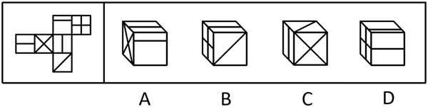
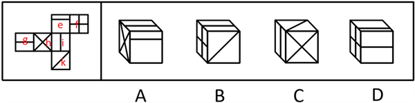
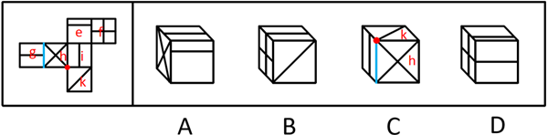
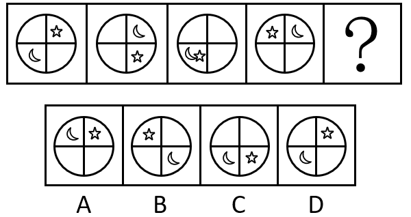
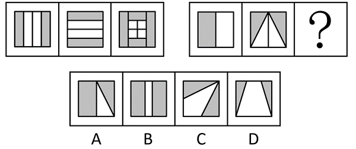
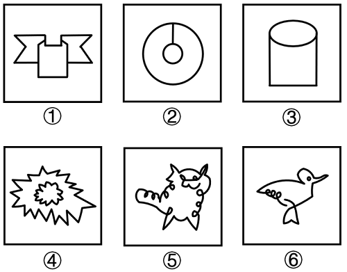

# 2024年吉林省公务员录用考试《行测》题（网友回忆版）

> 判断推理 · 25 题 · 吉林 2024

## 材料 1

        茶叶行业是中国传统的特色行业之一，具有悠久的历史和丰富的文化内涵。随着人们健康意识和消费水平的提高，茶叶行业正逐渐走向繁荣。统计数据公布后，很多网友基于此给出各种判断。

        网友甲：据统计，2021年全国茶叶出口量为36.94万吨，同比增长5.9%，进口额为22.99亿美元，同比增长12.8%，这说明，我国始终保持出口大于进口。

        网友乙：数据显示，2021年我国18-30岁茶叶消费者占比约为26%，2023年某短视频平台茶行业18岁至30岁兴趣用户占比已经提升至38.4%，这说明茶叶消费者中年轻人占比越来越大。

### 第 1 题　qid 19181476 · 类比推理

为了更好地对甲的推理进行评价，下列哪个问题最不重要？

- **A**. 2021年的出口量增长数据是否具有代表性
- **B**. 我国出口茶叶的均价是否有大幅变化
- **C**. 我国同期茶叶进口量是否也大幅增长
- **D**. 我国同期茶叶进口额是否也大幅增长　✅

**答案**：D

**官方解析**

第一步：找出论点和论据。

论点：我国始终保持出口大于进口。

论据：据统计，2021年全国茶叶出口量为36.94万吨，同比增长5.9%，进口额为22.99亿美元，同比增长12.8%。

本题论据讨论的是2021年全国茶叶“出口量”及同比增长率和“进口额”及同比增长率，论点讨论的是我国始终保持“出口”大于“进口”，且提问方式为“哪个问题最不重要”，将对“出口”与“进口”有影响的选项排除即可。

第二步：逐一分析选项。

A项：该项指出2021年的出口量增长数据是否具有代表性，如果该数据没有代表性就不能根据数据推出“我国始终保持出口大于进口”的论点，是影响论点成立的因素，有助于对甲的推理进行评价，排除；

B项：该项指出我国出口茶叶的均价是否有大幅变化，题干中给出的是“出口量”，出口额=均价×出口量，出口茶叶均价对出口额影响较大，是影响论点成立的因素，有助于对甲的推理进行评价，排除；

C项：选项指出我国同期茶叶进口量是否也大幅增长，题干中给出的是“进口额”，进口量，茶叶的进口量是影响论点成立的因素，有助于对甲的推理进行评价，排除；

D项：选项指出我国同期茶叶进口额是否也大幅增长，而论据中已经给出同期茶叶进口额的数据，无需再补充相关数据，故该项并不重要，无助于对甲的推理进行评价，当选。

本题为选非题，故正确答案为D。

---

### 第 2 题　qid 19181477 · 逻辑判断

为了更好地对乙的推理进行评价，下列哪个问题最不重要？

- **A**. 18-30岁人群的茶叶销售是否主要通过电商平台
- **B**. 兴趣用户就是真正的茶叶消费者
- **C**. 短视频平台统计数据是否有偏向
- **D**. 近三年，年轻人喜欢的茶饮品种类是否有变化　✅

**答案**：D

**官方解析**

第一步：找出论点和论据。
论点：茶叶消费者年轻人占比越来越大。
论据：数据显示，2021年我国18-30岁茶叶消费者占比约为26%，2023年某短视频平台茶行业18岁至30岁兴趣用户占比已经提升至38.4%。
本题论据说的是2023年某短视频平台茶行业18-30岁兴趣用户的占比大于2021年18-30岁茶叶消费者占比，论点说的是茶叶消费者年轻人占比越来越大，且提问方式为“哪个问题最不重要”，将可以影响“年轻的茶叶消费者占比”的因素排除即可。
第二步：逐一分析选项。
A项：该项讨论的是18-30岁人群的茶叶销售是否主要通过电商平台，论据中2023年数据来源于“某短视频平台”，若电商平台不是年轻人的主要购买平台，那么该数据就不具有代表性，无法推出结论，该项是影响论点成立的重要因素，有助于对乙的推理进行评价，排除；
B项：该项讨论的是“兴趣用户”与“真正的茶叶消费者”的关系，明确了该短视频平台上兴趣用户就是真正的茶叶消费者，说明对于该平台上数据的统计是合理的，有助于对乙的推理进行评价，排除；
C项：该项讨论的是短视频平台统计数据是否有偏向，论据中2023年数据来源于“某短视频平台”，如果该数据有偏向，就无法推出结论，该项是影响论点成立的重要因素，有助于对乙的推理进行评价，排除；
D项：该项讨论的是近三年，年轻人喜欢的茶饮品种类是否有变化，与年轻的茶叶消费者占整体消费者的比例无关，对乙的推理没有帮助，当选。
本题为选非题，故正确答案为D。

---

### 第 3 题　qid 19181439 · 图形推理

右边哪项不能由左侧展开图折叠而成？

- **A**. A
- **B**. B
- **C**. C　✅
- **D**. D

**答案**：C

**官方解析**

将题干展开图标上序号，如下图所示，逐一分析选项。

A项：选项由面e、面g和面h构成，选项与题干展开图一致，排除；

B项：选项由面f、面g和面k构成，选项与题干展开图一致，排除；

C项：选项正面为面h，顶面为面k，左侧面为面g或面i。如果选项左侧面为面g，选项中面g中的线与面g和面h的公共边平行，而题干展开图中面g中的线与二者的公共边垂直；如果选项左侧面为面i，选项中三个面的公共点引出两条线，而题干展开图中三个面的公共点仅引出一条线。两种情况下，选项与题干展开图均不一致，当选；

D项：选项由面e、面f和面g构成，选项与题干展开图一致，排除。

本题为选非题，故正确答案为C。

---

### 第 4 题　qid 19181440 · 图形推理

从所给的四个选项中，选择最合适的一个填入问号处，使之呈现一定的规律性：

- **A**. A
- **B**. B
- **C**. C
- **D**. D　✅

**答案**：D

**官方解析**

元素组成相同，优先考虑位置规律。观察发现，题干图形中的小五角星依次顺时针平移1格，小月亮依次顺时针平移2格（也看做逆时针平移2格），只有D项符合。
故正确答案为D。

---

### 第 5 题　qid 19181448 · 图形推理

从所给的四个选项中，选择最合适的一个填入问号处，使之呈现一定的规律性： 

- **A**. A　✅
- **B**. B
- **C**. C
- **D**. D

**答案**：A

**官方解析**

元素组成相似，优先考虑样式规律。观察发现，第一组图中，图1和图2相加得到图3，且遵循：图1的灰块叠加在图2的灰块和白块上；图2的灰块叠加在图1的白块上。第二组图应用此规律，只有A项符合。
故正确答案为A。

---

### 第 6 题　qid 19181445 · 图形推理

把下面的六个图形分为两类，使每一类图形都有各自的共同特征或规律，分类正确的一项是：

- **A**. ①③④，②⑤⑥
- **B**. ①②③，④⑤⑥
- **C**. ①④⑥，②③⑤　✅
- **D**. ①③⑤，②④⑥

**答案**：C

**官方解析**

本题为分组分类题目。元素组成不同，且无明显属性规律，考虑数量规律。观察发现，题干出现多个“日”字变形图，考虑笔画数。图①④⑥为两笔画图形，图②③⑤为一笔画图形，即图①④⑥为一组，图②③⑤为一组。
故正确答案为C。

---

### 第 7 题　qid 19181447 · 逻辑判断

机会成本指经济资源的所有者由于将所有的经济资源投入到某种经济活动中，放弃把这些经济资源投入到其他经济活动中所可能获得的最大利益。机会成本可分为显成本和隐成本，显成本指厂商在生产要素市场上购买或租用他人所拥有的生产要素的总支出，隐成本指厂商本身自己所拥有的且被用于企业生产过程的那些生产要素的总价格。
根据以上定义，下列说法正确的是：

- **A**. 张厂长用于办公的自家楼房是张厂长的显成本
- **B**. 张厂长支付给王工程师的年薪是张厂长的隐成本
- **C**. 张厂长发给员工的年终奖是张厂长的隐成本
- **D**. 张厂长管理工厂的应得酬劳是张厂长的隐成本　✅

**答案**：D

**官方解析**

第一步：找出定义关键词。
机会成本：“经济资源的所有者”、“将所有的经济资源投入到某种经济活动中”、“放弃把这些经济资源投入到其他经济活动中所可能获得的最大利益”；
显成本：“厂商”、“在生产要素市场上”、“购买或租用他人所拥有的生产要素的总支出”；
隐成本：“厂商”、“本身自己所拥有的”、“被用于企业生产过程的那些生产要素的总价格”。
第二步：逐一分析选项。
A项：张厂长用于办公的自家楼房，属于张厂长自己所拥有的生产要素，并非购买或租用他人所拥有的生产要素，符合“厂商”、“本身自己所拥有的”、“被用于企业生产过程的那些生产要素的总价格”，符合“隐成本”定义，不符合“显成本”定义，说法错误，排除；
B项：张厂长支付给王工程师的年薪，属于购买或租用王工程师所拥有的劳动力等生产要素的支出，符合“厂商”、“在生产要素市场上”、“购买或租用他人所拥有的生产要素的总支出”，符合“显成本”定义，不符合“隐成本”定义，说法错误，排除；
C项：张厂长发给员工的年终奖，属于购买或租用员工所拥有的劳动力等生产要素的支出，符合“厂商”、“在生产要素市场上”、“购买或租用他人所拥有的生产要素的总支出”，符合“显成本”定义，不符合“隐成本”定义，说法错误，排除；
D项：张厂长管理工厂的应得酬劳，属于张厂长将自己拥有的劳动力等生产要素用于本企业生产时所应该得到的支付，符合“厂商”、“本身自己所拥有的”、“被用于企业生产过程的那些生产要素的总价格”，符合“隐成本”定义，说法正确，当选。
故正确答案为D。

---

### 第 8 题　qid 19181446 · 定义判断

需求价格弹性是指某种商品的需求量对其价格变化所做出的反应程度，可以表示为需求量变动的百分比与其价格变动的百分比之比。
根据上述定义，下列体现了需求价格弹性的是：

- **A**. 生产技术的进步使商品供给量大幅增加，引发价格下降
- **B**. 猪肉价格大幅下降引发牛肉销量大幅下降
- **C**. 原材料价格上涨引发某商品价格攀升，从而导致该商品滞销　✅
- **D**. 消费者收入水平的提升，引发了中高端商品销量大幅增加

**答案**：C

**官方解析**

第一步：找出定义关键词。
“某种商品”、“需求量对其价格变化所做出的反应程度”。
第二步：逐一分析选项。
A项：商品供给量增加引发价格下降，说的是供应量和价格之间的关系，并非价格和需求量之间的关系，不符合“需求量对其价格变化所做出的反应程度”，不符合定义，排除；
B项：猪肉价格下降引发牛肉销量下降，猪肉和牛肉是两种不同的商品，不符合“某种商品”，不符合定义，排除；
C项：某商品价格攀升导致该商品滞销，“滞销”是该商品价格攀升后，需求量对其价格变化所做出的反应，符合“某种商品”、“需求量对其价格变化所做出的反应程度”，符合定义，当选；
D项：消费者收入水平提升引发中高端商品销量增加，说的是消费者的收入水平和商品需求量之间的关系，并非该商品的价格和需求量之间的关系，不符合“某种商品”、“需求量对其价格变化所做出的反应程度”，不符合定义，排除。
故正确答案为C。

---

### 第 9 题　qid 19181450 · 定义判断

过度矫正法是指甲在批评乙时，不仅要求乙恢复原有状态，还要求其做到优化的方法。
根据上述定义，以下符合过度矫正法的是：

- **A**. 因为你可以做到，所以你才要遵守规则
- **B**. 这种做法是错误的，这样不行重来
- **C**. 墙壁被你弄脏了，赶紧把这一整面墙都弄干净　✅
- **D**. 你不会这么不认真啊，这不像你的做事风格啊

**答案**：C

**官方解析**

第一步：找出定义关键词。
“甲在批评乙时”、“不仅要求乙恢复原有状态”、“还要求其做到优化”。
第二步：逐一分析选项。
A项：因为你可以做到，所以你才要遵守规则，是在给对方解释遵守规则的原因，没有体现批评，不符合“甲在批评乙时”，仅要求对方遵守规则，没有体现要求其做到优化，不符合“还要求其做到优化”，不符合定义，排除；
B项：这种做法是错误的，这样不行重来，是要求对方用正确的做法重新做一次，没有体现恢复原有状态，不符合“不仅要求乙恢复原有状态”，不符合定义，排除；
C项：墙壁被你弄脏了，赶紧把这一整面墙都弄干净，是批评对方把墙壁弄脏了，符合“甲在批评乙时”，要求把这一整面墙都弄干净，说明不但要求对方还原他弄脏的墙壁，还要求他把整面墙都弄干净，符合“不仅要求乙恢复原有状态”、“还要求其做到优化”，符合定义，当选；
D项：你不会这么不认真啊，这不像你的做事风格啊，只是在批评对方不认真，但并未向对方提出要求，不符合“不仅要求乙恢复原有状态”、“还要求其做到优化”，不符合定义，排除。
故正确答案为C。

---

### 第 10 题　qid 19181452 · 定义判断

工资歧视是指雇主针对既定的生产率特征支付的价格因劳动者所属的人口群体不同而呈现系统性的差别。 
根据上述定义，下列符合工资歧视的是：

- **A**. 雇主支付给技术熟练员工的工资高于市场平均水平
- **B**. 在同等条件下，客户倾向于异性销售员提供服务
- **C**. 雇主支付给女员工的工资低于同工作效率的男员工　✅
- **D**. 雇主故意给女性劳动者安排低工资的工作岗位

**答案**：C

**官方解析**

第一步：找出定义关键词。
“雇主”、“针对既定的生产率特征”、“支付的价格因劳动者所属的人口群体不同而呈现差别”。
第二步：逐一分析选项。
A项：雇主支付给技术熟练员工的工资高于市场平均水平，说明雇主支付给他们更高的工资是因为他们有更高的生产率，并非因为他们所属的人口群体不同，不符合“支付的价格因劳动者所属的人口群体不同而呈现差别”，不符合定义，排除；
B项：在同等条件下，客户倾向于异性销售员提供服务，只体现了客户对于销售员的性别倾向，未涉及雇主，不符合“雇主”，不符合定义，排除；
C项：雇主支付给女员工的工资低于同工作效率的男员工，说明在工作效率相同的情况下，男员工和女员工的工资因所属群体不同而有差别，符合“雇主”、“针对既定的生产率特征”、“支付的价格因劳动者所属的人口群体不同而呈现差别”，符合定义，当选；
D项：雇主故意给女性劳动者安排低工资的工作岗位，只体现了因性别不同，雇主会安排不同工资水平的工作岗位，并未提及不同人口群体的生产率情况，不符合“针对既定的生产率特征”，不符合定义，排除。
故正确答案为C。

---

### 第 11 题　qid 19181449 · 定义判断

交叉销售是指在一个销售交易中，销售人员向消费者推销一个产品的同时，还会推荐另一个与之相关的产品或服务。
根据上述定义，以下不属于交叉销售的是：

- **A**. 顾客在购买电视的同时，销售人员向其推荐豪华音响
- **B**. 顾客在购买汽车的同时，销售人员向其推荐车险
- **C**. 顾客在购买电脑的同时，销售人员向其推荐另一款高端电脑　✅
- **D**. 顾客在购买游戏机的同时，销售人员向其推荐电池和充电器

**答案**：C

**官方解析**

第一步：找出定义关键词。
“推销一个产品的同时，还会推荐另一个与之相关的产品或服务”。
第二步：逐一分析选项。
A项：顾客在购买电视的同时，销售人员向其推荐豪华音响，其中音响和电视可以配套使用，符合“推销一个产品的同时，还会推荐另一个与之相关的产品或服务”，符合定义，排除；
B项：顾客在购买汽车的同时，销售人员向其推荐车险，其中车险是与汽车相关的服务，符合“推销一个产品的同时，还会推荐另一个与之相关的产品或服务”，符合定义，排除；
C项：顾客在购买电脑的同时，销售人员向其推荐另一款高端电脑，但两者都属于电脑，不符合“推销一个产品的同时，还会推荐另一个与之相关的产品或服务”，不符合定义，当选；
D项：顾客在购买游戏机的同时，销售人员向其推荐电池和充电器，其中电池和充电器是游戏机正常使用的必备配件，符合“推销一个产品的同时，还会推荐另一个与之相关的产品或服务”，符合定义，排除。
本题为选非题，故正确答案为C。

---

### 第 12 题　qid 19181458 · 定义判断

一次信息是指人们通过生产、社会活动等直接获得的信息。二次信息是指人们将零散、无序、混乱的一次信息，进行提炼、浓缩和整合，以一定的逻辑顺序和科学体系加以编排存储，以系统化，从而得到的信息。
根据上述定义，以下是一次信息的是：

- **A**. 会议简报
- **B**. 全国总书目
- **C**. 读者文摘
- **D**. 实验记录　✅

**答案**：D

**官方解析**

第一步：找出定义关键词。
一次信息：“通过生产、社会活动等直接获得的信息”；
二次信息：“将零散、无序、混乱的一次信息，进行提炼、浓缩和整合”、“以一定的逻辑顺序和科学体系加以编排存储，以系统化，从而得到的信息”。
第二步：逐一分析选项。
A项：会议简报是会议期间为反映会议进展情况、会议发言中的意见和建议、会议议决事项等内容而编写的简报，需要对会议内容进行整理，不符合“通过生产、社会活动等直接获得的信息”，不符合“一次信息”的定义，排除；
B项：全国总书目是依据全国各正式出版单位每年度向中国版本图书馆缴送的样本书编纂而成的，需要对图书种类等进行整理、分类，不符合“通过生产、社会活动等直接获得的信息”，不符合“一次信息”的定义，排除；
C项：读者文摘是精选各类文章辑录而成，需要对文章进行整理、分类，不符合“通过生产、社会活动等直接获得的信息”，不符合“一次信息”的定义，排除；
D项：实验记录是实验过程中对实验数据、实验现象等的直接记录，符合“通过生产、社会活动等直接获得的信息”，符合“一次信息”的定义，当选。
故正确答案为D。

---

### 第 13 题　qid 19181456 · 定义判断

学习策略是指人们学习和生产用到的各种方法和手段。精细加工策略是指人们将新信息与头脑中的旧信息联系起来，以增加新信息的意义的方法。
以下属于精细加工策略的是：

- **A**. 学习行政执法程序时，通过画行政执法程序流程图，以区分简易程序和一般程序
- **B**. 学习《背影》课文，脑海中浮现父亲步履蹒跚的背影，以增加对文章的理解　✅
- **C**. 学习《论学习》课文，用思维导图的方法，展示要点和各要点之间的关系
- **D**. 学习质变量变关系，勾画文章重点内容以明确学习的重点

**答案**：B

**官方解析**

第一步：找出定义关键词。
学习策略：“学习和生产用到的各种方法和手段”；
精细加工策略：“将新信息与头脑中的旧信息联系起来”、“以增加新信息的意义”。
第二步：逐一分析选项。
A项：画行政执法程序流程图以区分简易程序和一般程序，没有体现联系头脑中的旧信息，不符合“将新信息与头脑中的旧信息联系起来”，不符合定义，排除；
B项：学习《背影》课文时，将文章中对父亲的描写内容与脑海中既有的父亲形象联系起来，想象出父亲步履蹒跚的背影画面，符合“将新信息与头脑中的旧信息联系起来”，以增加对文章的理解，符合“以增加新信息的意义”，符合定义，当选；
C项：用思维导图的方法展示要点和各要点之间的关系，没有体现联系头脑中的旧信息，不符合“将新信息与头脑中的旧信息联系起来”，不符合定义，排除；
D项：勾画文章重点内容以明确学习的重点，没有体现联系头脑中的旧信息，不符合“将新信息与头脑中的旧信息联系起来”，不符合定义，排除。
故正确答案为B。

---

### 第 14 题　qid 19181457 · 类比推理

人造卫星：土卫二

- **A**. 自然科学：经济学　✅
- **B**. 金融机构：银行
- **C**. 小说：五言律诗
- **D**. 干电池：家用电器

**答案**：A

**官方解析**

第一步：判断题干词语间逻辑关系。
卫星按照来源可分为天然卫星和人造卫星。“土卫二”是“天然卫星”，不是“人造卫星”，二者为反向种属关系。
第二步：判断选项词语间逻辑关系。
A项：科学可分为自然科学、社会科学、思维科学等。“经济学”是“社会科学”，不是“自然科学”，二者为反向种属关系，与题干逻辑关系一致，当选；
B项：“银行”是“金融机构”，二者为种属关系，与题干逻辑关系不一致，排除；
C项：常见的文学体裁有诗歌、小说、散文等。“五言律诗”属于“近体诗”，“近体诗”属于“诗歌”，“五言律诗”和“小说”的层级与题干“土卫二”和“人造卫星”的层级不同，与题干逻辑关系不一致，排除；
D项：“干电池”是一次性电池，可以使用在“家用电器”上，二者为对应关系，与题干逻辑关系不一致，排除。
故正确答案为A。

---

### 第 15 题　qid 19181455 · 图形推理

纸鹤：纸张：折叠

- **A**. 手链：珠子：装饰
- **B**. 玉镯：玉石：开采
- **C**. 中国结：红绳：编扎　✅
- **D**. 火柴盒：火柴：摩擦

**答案**：C

**官方解析**

第一步：判断题干词语间逻辑关系。
“纸张”可以“折叠”成“纸鹤”，三者是原材料、工艺与成品的对应关系。
第二步：判断选项词语间逻辑关系。
A项：“珠子”是“手链”的原材料，前两词是原材料与成品的对应关系，“手链”具有“装饰”的功能，第一词与第三词是功能的对应关系，与题干逻辑关系不一致，排除；
B项：“玉石”可以“打磨”成“玉镯”，而不是“开采”，第一词与第三词不是成品与工艺的对应关系，与题干逻辑关系不一致，排除；
C项：“红绳”可以“编扎”成“中国结”，三者是原材料、工艺与成品的对应关系，与题干逻辑关系一致，当选；
D项：“火柴”可以通过“摩擦”“火柴盒”的侧面来点火，三者不是原材料、工艺与成品的对应关系，与题干逻辑关系不一致，排除。
故正确答案为C。

---

### 第 16 题　qid 19181472 · 类比推理

东北虎：森林：自然资源

- **A**. 实验室：教学楼：科研机构
- **B**. 服装：折扣店：购物中心
- **C**. 阅览室：图书馆：学习场所　✅
- **D**. 车床：生产车间：工人

**答案**：C

**官方解析**

第一步：判断题干词语间逻辑关系。
“东北虎”在“森林”里，二者为地点对应关系，“东北虎”和“森林”都是“自然资源”，前两个词分别与第三个词构成种属关系。
第二步：判断选项词语间逻辑关系。
A项：“实验室”在“教学楼”里，二者为地点对应关系，“科研机构”是有明确研究方向和任务的机构，“实验室”是进行科研的地点，第一个词与第三个词不是种属关系，与题干逻辑关系不一致，排除； 
B项：“服装”既可以在“折扣店”里，也可以在“购物中心”里，第一个词分别与后两词构成地点对应关系，与题干逻辑关系不一致，排除；
C项：“阅览室”在“图书馆”里，二者为地点对应关系，“阅览室”和“图书馆”都是“学习场所”，前两个词分别与第三个词构成种属关系，与题干逻辑关系一致，当选；
D项：“车床”和“工人”都在“生产车间”里，第一个词和第三个词均与第二个词构成地点对应关系，与题干逻辑关系不一致，排除。
故正确答案为C。

---

### 第 17 题　qid 19181466 · 类比推理

房屋 对于 （    ） 相当于 （    ）对于 画笔

- **A**. 避雨 绘制
- **B**. 租金 画作
- **C**. 住宅 画具　✅
- **D**. 卧室 画刀

**答案**：C

**官方解析**

逐一代入选项。
A项：“房屋”可以用来“避雨”，二者为功能对应关系，“画笔”可以用来“绘制”，二者为功能对应关系，但前后顺序相反，前后逻辑关系不一致，排除；
B项：租住“房屋”需要缴纳“租金”，二者为对应关系，“画笔”可以用来绘制“画作”，二者为工具和成品的对应关系，前后逻辑关系不一致，排除；
C项：“住宅”指专供居住的房屋，“住宅”是一种“房屋”，二者为种属关系，“画笔”是一种“画具”，二者为种属关系，前后逻辑关系一致，当选；
D项：“卧室”是“房屋”的组成部分，二者为组成关系，“画刀”指用来混合颜料、刮干净调色板的刮刀，“画刀”和“画笔”均是画具，二者为并列关系，前后逻辑关系不一致，排除。
故正确答案为C。

---

### 第 18 题　qid 19181459 · 逻辑判断

L国留学人数下降，以某地大学为例，从2019—2022年，两所大学出国留学比例从15.3%和14.8%下降到7.1%和8.4%，下降幅度高至4—5成。有分析人士认为，这是由留学目的国的国内物价上涨造成的。
以下哪个选项最能支持上述结论？

- **A**. 除留学外，还有很多方式可以获得出国交流机会，成本更低
- **B**. 近年来，L国居民收入水平上升，相比于出国留学，国内接受教育的成本更低
- **C**. 随着国内教育水平提升，留学归国者在就业市场竞争力下降，留学归国率降低
- **D**. 近年来，留学目的国的学费和生活费普遍上升，高昂的费用使得很多有留学意愿的学生难以接受　✅

**答案**：D

**官方解析**

第一步：找出论点和论据。
论点：留学目的国的国内物价上涨造成留学人数下降。
论据：无。
本题只有论点，没有论据，加强优先考虑补充论据。
第二步：逐一分析选项。
A项：指出除留学外，还有很多成本更低的出国交流机会，但出国交流机会并不能完全等同于留学，与论点讨论的留学人数下降的原因无关，无关项，无法加强，排除； 
B项：指出近年来，相比于出国留学，国内接受教育的成本更低，但是不明确这是否会影响到出国留学的人数，不明确项，无法加强，排除；
C项：指出留学归国率降低的原因，与论点讨论的留学人数下降的原因无关，无关项，无法加强，排除；
D项：指出近年来，留学目的国的学费和生活费普遍上升，高昂的费用使得很多有留学意愿的学生难以接受，说明留学目的国的国内物价上涨造成留学人数下降，补充论据，可以加强，当选。
故正确答案为D。

---

### 第 19 题　qid 19181464 · 逻辑判断

调查发现智能手机、电视屏发出的蓝光会干扰褪黑激素产生，而褪黑激素在调节生物日常作息发挥着重要作用。有关人员据此认为，夜里眼睛接触蓝光会增加肥胖的可能性。
以下哪个选项是上述结论成立的前提条件？

- **A**. 任何来源的少量蓝光都会导致体重增加
- **B**. 褪黑激素的产生受干扰后易引发肥胖　✅
- **C**. 褪黑激素水平下降会导致人体代谢紊乱
- **D**. 褪黑激素受体基因变异对蓝光最敏感

**答案**：B

**官方解析**

第一步：找出论点和论据。
论点：夜里眼睛接触蓝光会增加肥胖的可能性。
论据：智能手机、电视屏发出的蓝光会干扰褪黑激素产生，而褪黑激素在调节生物日常作息发挥着重要作用。
本题论点说的是“蓝光”与“肥胖”之间的关系，论据说的是“蓝光”与“褪黑激素”之间的关系，二者话题不一致，且提问为“前提”，加强优先考虑搭桥，即建立“褪黑激素”与“肥胖” 之间的联系。
第二步：逐一分析选项。
A项：指出蓝光确实会导致体重增加，补充论据，可以加强，但不是论证成立的前提，排除；
B项：指出褪黑激素的产生受干扰后易引发肥胖，建立了“褪黑激素”与“肥胖”之间的联系，为搭桥项，可以加强，是论证成立的前提，当选；
C项：指出褪黑激素水平下降会导致人体代谢紊乱，但不明确人体代谢紊乱是否会影响肥胖，为不明确项，无法加强，排除；
D项：指出褪黑激素受体基因变异对蓝光最敏感，与论点讨论的夜里眼睛接触蓝光是否会增加肥胖的可能性无关，为无关项，无法加强，排除。
故正确答案为B。

---

### 第 20 题　qid 19181460 · 逻辑判断

研究发现，养猫和精神疾病风险上升有关。养猫的人患精神疾病的风险比没接触猫的高2.35倍，这是由于养猫的人群感染了弓形虫，这是一种以猫科动物为最终宿主的寄生虫，当它通过猫的排泄物感染其他中间宿主（比如人）后会传入后者的中枢神经，影响相关行为。因此，养猫会增加患精神疾病的风险。
以下哪个选项最能削弱上述观点？

- **A**. 戴手套清理猫砂并及时洗手可减少感染弓形虫的可能性
- **B**. 患精神疾病的养猫人，家族普遍具有精神病史　✅
- **C**. 精神疾病患者弓形虫感染的血清阳性较低
- **D**. 不养猫的人也可能通过直接接触等方式感染弓形虫

**答案**：B

**官方解析**

第一步：找出论点和论据。
论点：养猫会增加患精神疾病的风险。
论据：养猫的人患精神疾病的风险比没接触猫的高2.35倍，这是由于养猫的人群感染了弓形虫，这是一种以猫科动物为最终宿主的寄生虫，当它通过猫的排泄物感染其他中间宿主（比如人）后会传入后者的中枢神经，影响相关行为。
本题论点和论据都在讨论“养猫”与“患精神疾病的风险”的关系，二者话题一致，且论点中存在因果关系，削弱可以考虑削弱论点、因果倒置和他因削弱。
第二步：逐一分析选项。
A项：指出如何清理猫砂会减少感染弓形虫的可能性，说明养猫确实存在感染弓形虫的风险，补充论据，可以加强，无法削弱，排除；
B项：指出精神疾病患者除了养猫，本身还有家族精神病史，给出了同时可能增加患精神疾病的风险的其他原因，他因削弱，可以削弱，当选；
C项：指出精神疾病患者弓形虫感染的血清阳性较低，而血清阳性说明体内有对应疾病抗体的存在，说明精神疾病患者存在弓形虫感染的可能性，但不明确养猫是否会增加患精神疾病的风险，为不明确项，无法削弱，排除；
D项：指出不养猫的人也可能感染弓形虫，但论点讨论的是养猫是否会增加患精神疾病的风险，话题不一致，为无关项，无法削弱，排除。
故正确答案为B。

---

### 第 21 题　qid 19181462 · 逻辑判断

研究人员利用1992年至2020年的卫星观测数据，结合气候数据和水文模型，研究了全球1051个大型湖泊和921个水库，结果显示，整体而言，全球湖泊水库蓄水量普遍下降，年均净减少约220亿吨，水体体积累计减少了603立方千米。研究人员认为，气候是导致全球湖泊水库蓄水量减少的原因，但也有观点认为，全球湖泊水库蓄水量下降并不是气候变化导致的，上游沉积物淤积才是根本原因。
哪个选项能削弱第二种观点？

- **A**. 人类活动引起的温室气体排放是导致气候变化的最主要原因，温室气体阻止地球表面热量散发使得地球变得更温暖
- **B**. 全球湖泊水库蓄水量减少导致了人类可利用的水资源减少，致使粮食危机加剧，而粮食危机反过来又加剧对蓄水池的争夺
- **C**. 随着全球变暖，野火规模变得越来越大，它们烧毁树林，破坏土壤稳定，导致流入湖泊水库的沉积物增加　✅
- **D**. 气候变化导致全球最炎热的地区气温更高，高温使得这些地区湖泊水库水分蒸发得更快，更为缺水

**答案**：C

**官方解析**

第一步：找出论点和论据。
论点：全球湖泊水库蓄水量下降并不是气候变化导致的，上游沉积物淤积才是根本原因。
论据：无。
本题只有论点没有论据，削弱优先考虑削弱论点，即指出上游沉积物淤积不是全球湖泊水库蓄水量下降的根本原因。
第二步：逐一分析选项。
A项：指出气候变化的最主要原因是温室气体排放，而论点讨论气候变化是否导致全球湖泊水库蓄水量下降，即气候变化的影响，话题不一致，无法削弱，排除；
B项：指出全球湖泊水库蓄水量减少的负面影响，而论点讨论上游沉积物淤积是否导致全球湖泊水库蓄水量下降，即全球湖泊水库蓄水量下降的原因，话题不一致，无法削弱，排除；
C项：指出全球变暖使野火规模变大，烧毁树林以至于破坏土壤稳定，最终导致流入湖泊水库的沉积物增加，说明全球湖泊水库蓄水量下降的根本原因不是上游沉积物淤积，而是气候变化，削弱论点，可以削弱，当选；
D项：指出气候变化导致全球最炎热地区的湖泊水库水分蒸发得更快，更为缺水，但这仅限于全球最炎热地区，无法代表全球湖泊水库蓄水量的情况，不明确选项，无法削弱，排除。
故正确答案为C。

---

### 第 22 题　qid 19181475 · 逻辑判断

某科学家近日透露，一项在火星上种树以开发资源的实验正逐步推进，实验目的是使树木能够在火星超低压环境下生长。此前的一项实验在0.3个大气压环境下培养植物，与在正常大气压下生长的植物相比，两种植物并不存在明显差异。据此，科学家相信，在有生之年，在火星上植树造林最终可能实现。
以下哪项如果为真，最不能削弱上述结论？

- **A**. 火星有稀薄的大气层，其大气层95%为二氧化碳，是光合作用的基本原料　✅
- **B**. 目前实验室设备的极限是0.1个大气压，距离模拟火星的超低压环境还很遥远
- **C**. 在0.2个大气压下，树木的形状开始发生变化，生长速度明显降低
- **D**. 在低压环境下，水分会更容易蒸发，火星的大气压仅为地球的1%

**答案**：A

**官方解析**

第一步：找出论点和论据。
论点：在有生之年，在火星上植树造林最终可能实现。
论据：一项在火星上种树以开发资源的实验正逐步推进，实验目的是使树木能够在火星超低压环境下生长。此前的一项实验在0.3个大气压环境下培养植物，与在正常大气压下生长的植物相比，两种植物并不存在明显差异。
本题论点讨论的是在火星上植树造林可能实现，论据讨论的是实验中植物在0.3个大气压和正常大气压下无明显差异，二者话题不一致，削弱可以考虑拆桥、削弱论点、削弱论据等，本题为选非题，排除能削弱的选项即可。
第二步：逐一分析选项。
A项：该项指出火星的大气层95%为二氧化碳，是光合作用的基本原料，而树木的生长发育需要光合作用，因此火星的条件是有助于植树造林的，补充论据，可以加强，无法削弱，当选；
B项：该项指出目前实验室设备的极限是0.1个大气压，距离模拟火星的超低压环境还很遥远，说明无法根据当下实验结果推断出在火星超低压环境中是否可以实现植树造林，拆断了实验和火星之间的必然联系，为拆桥项，可以削弱，排除；
C项：该项指出在0.2个大气压下，树木的形状开始发生变化，生长速度明显降低，说明当下实验结果比较片面，无法推断出在火星超低压环境中是否可以实现植树造林，拆断了实验和火星之间的必然联系，为拆桥项，可以削弱，排除；
D项：该项指出在低压环境下，水分会更容易蒸发，火星的大气压仅为地球的1%，说明火星环境恶劣，极其容易造成水分的蒸发，对树木生长不利，削弱论点，可以削弱，排除。
本题为选非题，故正确答案为A。

---

### 第 23 题　qid 17058651 · 逻辑判断

某研究机构发布两项关于史前女性的研究表明，史前女性完全有能力胜任狩猎这一艰巨的体力任务，该研究表明，从新陈代谢的角度看，女性的身体更适合耐力活动，消耗同样的能量可以跑更远，因此，同史前男性比，史前女性是更优秀的猎手。
以下陈述如果为真，哪项是上述观点的前提？

- **A**. 我们关于史前女性采集的假设是错误的
- **B**. 史前男性的耐力不足以胜任长时间的狩猎
- **C**. 在其他方面，史前女性比男性更有优势
- **D**. 耐力和效率是决定狩猎成败的关键要素　✅

**答案**：D

**官方解析**

第一步：找出论点和论据。
论点：同史前男性比，史前女性是更优秀的猎手。
论据：从新陈代谢的角度看，女性的身体更适合耐力活动，消耗同样的能量可以跑更远。
本题论点说的是“史前女性”是更优秀的“猎手”，论据说的是“史前女性”更适合“耐力活动”“消耗同样的能量可以跑更远”，二者话题不一致，加强优先考虑搭桥，即在“耐力活动”“消耗同样的能量可以跑更远”与“猎手”之间建立联系。
第二步：逐一分析选项。
A项：指出关于史前女性采集的假设是错误的，而论点说的是史前女性是更优秀的猎手，话题不一致，为无关项，无法加强，排除；
B项：指出史前男性的耐力不足以胜任长时间的狩猎，但未提及女性的耐力能够胜任多长时间的狩猎，无法对史前女性和史前男性狩猎的优秀程度进行比较，无法加强，排除；
C项：指出史前女性在“其他方面”比男性有优势，而论点说的是史前女性是更优秀的猎手，话题不一致，为无关项，无法加强，排除；
D项：指出耐力和效率是决定狩猎成败的关键要素，论据中“消耗同样的能量可以跑更远”证明效率更高，即在“耐力活动”“消耗同样的能量可以跑更远”与“猎手”之间建立联系，为搭桥项，可以加强，当选。
故正确答案为D。

---

### 第 24 题　qid 19181470 · 逻辑判断

遍布各地的塑料垃圾正在对人类和其他生物造成健康威胁，塑料颗粒越小，表面积越大，其发生化学反应的可能性就越大，其危害性就越大。在自然状态下，塑料颗粒从微米大小分解到纳米大小要百年时间。最新一项研究发现，海洋中的轮虫可以加速这一进程，轮虫吞入塑料，最终排出更小的塑料颗粒。经调查发现，海洋中的轮虫极可能制作了大量的纳米颗粒。
由此可以推出：

- **A**. 纳米塑料污染是一种不可能治理的污染
- **B**. 轮虫是纳米塑料污染的重要因素　✅
- **C**. 轮虫是纳米塑料颗粒污染的罪魁祸首
- **D**. 纳米塑料污染程度已远超我们的认知

**答案**：B

**官方解析**

日常结论题，根据题干信息逐一分析选项。
A项：题干中并未提及纳米塑料污染是否可以治理，无中生有，无法推出，排除；
B项：根据题干第一句中“塑料颗粒越小，表面积越大，其发生化学反应的可能性就越大，其危害性就越大”以及最后一句“海洋中的轮虫极可能制作了大量的纳米颗粒”，可以推出轮虫是纳米塑料污染的重要因素，可以推出，当选；
C项：根据题干“海洋中的轮虫可以加速这一进程”和“海洋中的轮虫极可能制作了大量的纳米颗粒”，可以推出轮虫与纳米塑料颗粒污染有关，但无法推出其是否为“罪魁祸首”，无法推出，排除；
D项：题干中并未提及人类对纳米塑料污染程度的认知，无中生有，无法推出，排除。
故正确答案为B。

---

### 第 25 题　qid 19181471 · 类比推理

爱之深责之切，所以责之越切就代表爱的越深。
以下哪项与题干推理结构相似？

- **A**. 有意义就是好好活，所以好好活就是做有意义的事　✅
- **B**. 你不信就没效果，所以没效果就因为你不信
- **C**. 你说过不是不喜欢我，所以你就是喜欢我
- **D**. 这个人对父母很好，所以他对朋友也很好

**答案**：A

**官方解析**

第一步：分析题干推理形式。

题干推理形式为：爱之深责之切，责之越切爱的越深，逻辑结构为“肯后推肯前”。

第二步：逐一分析选项。

A项：选项翻译为：有意义好好活，好好活做有意义的事，逻辑结构为“肯后推肯前”，与题干推理形式一致，当选；

B项：选项翻译为：你不信没效果，因为你不信所以没效果，存在因果关系，与题干推理形式不一致，排除；

C项：选项理解为：不是不喜欢推出喜欢，即双重否定表肯定，与题干推理形式不一致，排除；

D项：选项翻译为：这个人对父母很好他对朋友也很好，与题干推理形式不一致，排除。

故正确答案为A。

---
