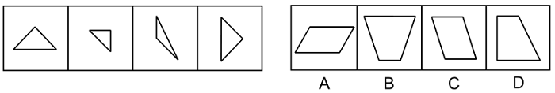
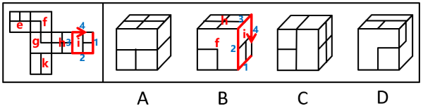
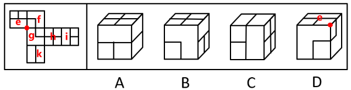
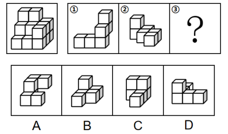
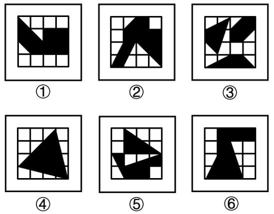
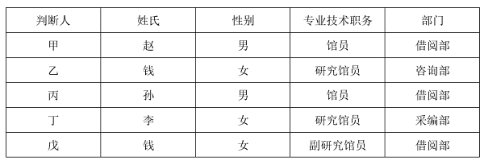
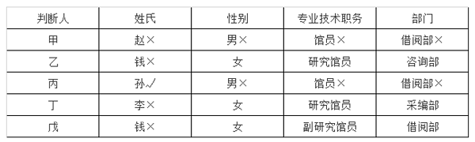

# 2024年四川省公务员录用考试《行测》试题（网友回忆版）

> 判断推理 · 30 题 · 四川 2024

## 第 1 题　qid 12536393 · 图形推理

从所给的四个选项中，选择最合适的一个填入问号处，使之呈现一定的规律性：

- **A**. A
- **B**. B
- **C**. C　✅
- **D**. D

**答案**：C

**官方解析**

元素组成不同，优先考虑属性规律。观察发现，题干图形整体无规律，所有图形均由黑球和白球构成，考虑黑白分开看。整体观察黑球没有明显规律，继续观察白球发现，题干图形中白球部分均为中心对称图形，只有C项符合。
故正确答案为C。

---

## 第 2 题　qid 12536394 · 图形推理

从所给的四个选项中，选择最合适的一个填入问号处，使之呈现一定的规律性：

- **A**. A
- **B**. B
- **C**. C
- **D**. D　✅

**答案**：D

**官方解析**

元素组成不同，且无明显属性规律，考虑数量规律。题干图形内外均由多边形构成，可考虑内外分开看。观察发现，每幅图中内部直线数=外部直线数，故？处应用此规律，只有D项符合。
故正确答案为D。

---

## 第 3 题　qid 12536397 · 图形推理

从所给的四个选项中，选择最合适的一个填入问号处，使之呈现一定的规律性：

- **A**. A
- **B**. B　✅
- **C**. C
- **D**. D

**答案**：B

**官方解析**

元素组成相似，优先考虑样式规律。题干第二行图形中有相同线条重复出现，考虑加减同异。九宫格优先看横行，第一行中，图1和图2求异后再顺时针旋转得到图3；经验证，第二行满足此规律；第三行应用此规律，故“？”处应选择一个图1和图2先求异再顺时针旋转得到的图形，只有B项符合。

故正确答案为B。

---

## 第 4 题　qid 12536406 · 图形推理

以下哪项是由下列左侧的图形不经旋转、翻转拼合起来得到的？

- **A**. A
- **B**. B
- **C**. C
- **D**. D　✅

**答案**：D

**官方解析**

本题考查平面拼合，可采用平行且等长相消的方式解题。消去平行且等长的线段后进行组合可得到轮廓图，即为D项。平行且等长相消的方式如下图所示：

故正确答案为D。

---

## 第 5 题　qid 12536419 · 图形推理

下图是给定纸盒的外表面，以下哪项能由它折叠而成？

- **A**. A
- **B**. B
- **C**. C　✅
- **D**. D

**答案**：C

**官方解析**

将题干展开图标上序号，如下图所示，逐一进行分析。

A项：选项由面h、面k和面e或面i构成，题干展开图中面h与面e为相对面，不能同时出现，故选项由面h、面k和面i构成，以面i内短线垂直的边为唯一边进行顺时针画边（如下图所示），题干展开图中边2对应面k，而选项中边4对应面k，选项与题干展开图不一致，排除；

B项：选项由面h、面g或面f和面e或面i构成，题干展开图中面h与面e为相对面，不能同时出现，面i与面g为相对面，不能同时出现，故选项由面h、面i和面f构成，以面i内短线垂直的边为唯一边进行顺时针画边（如下图所示），题干展开图中边4对应面f，而选项中边2对应面f，选项与题干展开图不一致，排除；

C项：选项由面h、面i和面k构成，选项与题干展开图一致，当选；

D项：选项由面f、面g和面e或面i构成，题干展开图中面g与面i为相对面，不能同时出现，故选项由面f、面g和面e构成，题干展开图中面f、面g和面e三个面的公共点挨着面e中的长方形，而选项中这三个面的公共点挨着面e中的小正方形，选项与题干展开图不一致，排除。

故正确答案为C。

---

## 第 6 题　qid 12536475 · 图形推理

左图给定的是由相同正方体堆叠而成多面体的视图。该多面体可以由①、②和③三个多面体组合而成，以下哪项能填入问号处？

- **A**. A　✅
- **B**. B
- **C**. C
- **D**. D

**答案**：A

**官方解析**

本题考查立体拼合。观察题干给出的多面体可知，该多面体由上至下可分为3层。观察发现，图①也有3层，可以直接拼合在多面体的左侧，如下图所示，但此时图②无论如何放置，都无法与其拼合成题干多面体。

所以只能旋转图①，使其为上下两层的形态。将图①按照下图方向旋转，此时可以将图①放在该多面体的右侧，如下图所示：

再将图②旋转后，放在该多面体的左侧，如下图所示：

综上，图③应选择一个上下两层都有3个小正方体的图形，只有A项符合。

故正确答案为A。

---

## 第 7 题　qid 12536392 · 图形推理

把下面六个图形分为两类，使每一类图形都有各自的共同特征或规律，分类正确的一项是：

- **A**. ①②⑥，③④⑤
- **B**. ①③④，②⑤⑥
- **C**. ①③⑤，②④⑥
- **D**. ①④⑤，②③⑥　✅

**答案**：D

**官方解析**

本题为分组分类题目。元素组成不同，且无属性规律，考虑数量规律。观察发现，题干每幅图形均为16宫格，且存在黑色区域。继续观察发现，图①④⑤中黑色区域的面积相同，均占7.5个格子，图②③⑥中黑色区域的面积相同，均占8.5个格子。即图①④⑤为一组，图②③⑥为一组。
故正确答案为D。

---

## 第 8 题　qid 12536388 · 定义判断

行政性社会工作是指在政府部门和群众团体中专门从事职工福利、困难人群救助、思想工作等类型的助人活动；专业性社会工作是由受过社会工作专业训练的人开展的助人活动。
根据上述定义，下列属于行政性社会工作的是：

- **A**. 小曲是社工专业的研究生，专门从事与养老等社会福利相关的政策研究
- **B**. 某企业工会根据上级文件精神，在元旦期间为每位职工发放节日慰问品　✅
- **C**. 企业家王某长期资助贫困山区的孩子，帮助很多贫困孩子实现了大学梦
- **D**. 老李退休后热心为小区内闹矛盾的家庭做思想工作，赢得邻里一致称赞

**答案**：B

**官方解析**

第一步：找出定义关键词。
行政性社会工作：“在政府部门和群众团体中”、“专门从事职工福利、困难人群救助、思想工作等类型的助人活动”；
专业性社会工作：“由受过社会工作专业训练的人开展的助人活动”。
第二步：逐一分析选项。
A项：该项中小曲为社工专业的研究生，且其从事相关研究，没有提及是否从事助人活动，不符合“专门从事职工福利、困难人群救助、思想工作等类型的助人活动”，不符合“行政性社会工作”定义，排除；
B项：该项中某企业工会为职工发放慰问品，其中工会属于群众团体，且该行为是一种职工福利，符合“在政府部门和群众团体中”、“专门从事职工福利、困难人群救助、思想工作等类型的助人活动”，符合“行政性社会工作”定义，当选；
C项：该项中企业家王某资助贫困孩子上学，但王某是企业家，不是在政府部门和群众团体中专门从事助人活动，不符合“在政府部门和群众团体中”、“专门从事职工福利、困难人群救助、思想工作等类型的助人活动”，不符合“行政性社会工作”定义，排除；
D项：该项中老李退休后热心为小区调解矛盾，说明老李已经退休，不是在政府部门和群众团体中专门从事助人活动，不符合“在政府部门和群众团体中”、“专门从事职工福利、困难人群救助、思想工作等类型的助人活动”，不符合“行政性社会工作”定义，排除。
故正确答案为B。

---

## 第 9 题　qid 12536396 · 定义判断

除法报价策略是一种价格分解术，以商品的数量或使用时间等概念为除数，以商品价格为被除数，得出一种数字很小的价格，使买主对本来不低的价格产生一种便宜、低廉的感觉。
根据上述定义，下列不属于除法报价策略的是：

- **A**. 某款笔记本电脑原价5268元，若分12期付款，每月只需439元即可入手
- **B**. 成人游泳班每节课仅需100元，10节课程结束后就可以学会蛙泳和仰泳
- **C**. 某款电动汽车售价40万元，高于同类产品，但车主每月可抵扣200元充电费用　✅
- **D**. 一份液化气保险每年保费为365元，相当于每天只交1元，如遇事故最高获得1万元理赔

**答案**：C

**官方解析**

第一步：找出定义关键词。
“以商品的数量或使用时间等概念为除数，以商品价格为被除数，得出一种数字很小的价格”、“使买主对本来不低的价格产生一种便宜、低廉的感觉”。
第二步：逐一分析选项。
A项：原价5268元的某款笔记本电脑，若分12期付款，每月只需439元即可入手，原价5268元本来价格不低，但是分期之后，每月只需要439元，这样就感觉没有那么贵了，价格可接受，符合“以商品的数量或使用时间等概念为除数，以商品价格为被除数，得出一种数字很小的价格”、“使买主对本来不低的价格产生一种便宜、低廉的感觉”，符合定义，排除；
B项：成人游泳班每节课仅需100元，10节课程结束后就可以学会蛙泳和仰泳，将总价1000元的游泳课程分解成10节课程，得到每节100元的价格，让人觉得便宜，可以接受，符合“以商品的数量或使用时间等概念为除数，以商品价格为被除数，得出一种数字很小的价格”、“使买主对本来不低的价格产生一种便宜、低廉的感觉”，符合定义，排除；
C项：某款电动汽车售价40万元，高于同类产品，但车主每月可抵扣200元充电费用，通过抵扣充电费用的方式降低买主对价格的敏感度，但并没有明确指出该款电动汽车的使用时间是多久，是否可以得到数字很小的价格，不符合“以商品的数量或使用时间等概念为除数，以商品价格为被除数，得出一种数字很小的价格”、“使买主对本来不低的价格产生一种便宜、低廉的感觉”，不符合定义，当选；
D项：每年保费为365元的液化气保险，按天计算相当于每天只交1元，符合“以商品的数量或使用时间等概念为除数，以商品价格为被除数，得出一种数字很小的价格”、“使买主对本来不低的价格产生一种便宜、低廉的感觉”，符合定义，排除。
本题为选非题，故正确答案为C。

---

## 第 10 题　qid 12536383 · 定义判断

中间指标通常表示患者在完成特定的治疗周期之后呈现的治疗效果，可揭示患者对于干预方案的反应。终点指标通常反映医疗卫生服务干预措施的长期效果，大多反映的是已经发生或者患者可以感知的疾病时间。
根据上述定义，下列属于中间指标的是：

- **A**. 肝癌手术后五年生存率大概可达30%~80%
- **B**. 烧伤患者的伤情鉴定为头面部、躯干烧伤面积达50%以上
- **C**. 改良饮水工程后居民胃液内致癌性亚硝胺的暴露水平明显下降
- **D**. 高血压患者服用一抗高血压药物后发生心脑血管事件的概率为10%　✅

**答案**：D

**官方解析**

第一步：找出定义关键词。
中间指标：“患者在完成特定的治疗周期之后”、“呈现的治疗效果”、“可揭示患者对于干预方案的反应”；
终点指标：“反映医疗卫生服务干预措施的长期效果”、“大多反映的是已经发生或者患者可以感知的疾病时间”。
第二步：逐一分析选项。
A项：肝癌手术后五年生存率反映的是治疗后的长期效果，符合“反映医疗卫生服务干预措施的长期效果”，不符合“中间指标”定义，排除；
B项：对烧伤患者的伤情进行鉴定，而不是对患者进行治疗或采取其他干预措施，不符合“患者在完成特定的治疗周期之后”、“呈现的治疗效果”，也不符合“可揭示患者对于干预方案的反应”，不符合“中间指标”定义，排除；
C项：改良饮水工程不属于治疗，且不确定居民是否为患者，不符合“患者在完成特定的治疗周期之后”，不符合“中间指标”定义，排除；
D项：高血压患者服用抗高血压药物属于完成了特定的治疗周期，符合“患者在完成特定的治疗周期之后”，发生心脑血管事件的概率反映了治疗的效果，符合“呈现的治疗效果”、“可揭示患者对于干预方案的反应”，符合“中间指标”定义，当选。
故正确答案为D。

---

## 第 11 题　qid 12536382 · 定义判断

间接融资是指资金盈余单位或个人与资金短缺单位或个人之间不发生直接关系，而是分别与金融机构发生一笔独立的交易，即资金盈余单位通过存款，或者购买银行、信托、保险等金融机构发行的有价证券，将其暂时闲置的资金先行提供给这些金融机构，然后再由这些金融机构以贷款、贴现等形式，或通过购买需要资金的单位发行的有价证券，把资金提供给需要资金的单位使用，从而实现资金融通的过程。
根据上述定义，下列不属于间接融资的是：

- **A**. 众多网民把自己的闲置资金投放到某公司理财项目中，由该理财项目借贷给需要贷款或者借款的个人
- **B**. 小李前段时间把一部分资金借给了小王，由于小王的朋友小杨的公司资金周转困难，小王便把这部分资金借给了小杨　✅
- **C**. 甲公司最近结余一笔资金，并将这部分资金存到乙银行，由于丙公司恰巧申请借贷，乙银行便把这部分资金贷款给丙公司
- **D**. 小张有一笔闲置资金，看到某借贷机构正在募集资金，便把这笔钱投入该机构，该机构将众多“小张”的资金借贷给其他人或者企业

**答案**：B

**官方解析**

第一步：找出定义关键词。
“资金盈余单位或个人与资金短缺单位或个人之间不发生直接关系，而是分别与金融机构发生一笔独立的交易”。
第二步：逐一分析选项。
A项：该项中网民把闲置资金投放到某公司理财项目中，由该理财项目借贷给需要贷款或借款的个人，符合“资金盈余单位或个人与资金短缺单位或个人之间不发生直接关系，而是分别与金融机构发生一笔独立的交易”，符合定义，排除；
B项：该项中小王将借来的资金转借给小杨，小王是个人，不是金融机构，不符合“资金盈余单位或个人与资金短缺单位或个人之间不发生直接关系，而是分别与金融机构发生一笔独立的交易”，不符合定义，当选；
C项：该项中甲公司将资金存到乙银行，乙银行把资金贷款给丙公司，符合“资金盈余单位或个人与资金短缺单位或个人之间不发生直接关系，而是分别与金融机构发生一笔独立的交易”，符合定义，排除；
D项：该项中小张将资金投入某借贷机构，该借贷机构将资金借贷给其他人或者企业，符合“资金盈余单位或个人与资金短缺单位或个人之间不发生直接关系，而是分别与金融机构发生一笔独立的交易”，符合定义，排除。
本题为选非题，故正确答案为B。

---

## 第 12 题　qid 12536384 · 定义判断

僵尸网络是指采用一种或多种传播手段，将大量主机感染病毒，从而在控制者和被感染主机之间形成一个能够“一对多”控制的网络。
根据上述定义，下列属于僵尸网络的是：

- **A**. 某单位内网感染病毒，致使大量电脑无法开机，工作陷入瘫痪
- **B**. 黑客使用病毒侵入某经理人的电脑，操纵其账号卖出大笔股票
- **C**. 某公司职员通过植入木马，远程删除多位同事电脑中的关键数据
- **D**. 某人点击病毒链接后，其邮箱自动向所有通讯录好友发送该链接　✅

**答案**：D

**官方解析**

第一步：找出定义关键词。

“将大量主机感染病毒”、“在控制者和被感染主机之间形成一个能够‘一对多’控制的网络”。

第二步：逐一分析选项。

A项：某单位内网感染病毒，致使大量电脑无法开机，无法开机并不是对于网络进行控制，不符合“在控制者和被感染主机之间形成一个能够‘一对多’控制的网络”，不符合定义，排除； 

B项：黑客使用病毒侵入某经理人的电脑，操纵其账号卖出大笔股票，代表着黑客只操控了一个人的网络，不符合“在控制者和被感染主机之间形成一个能够‘一对多’控制的网络”，不符合定义，排除；

C项：某公司职员通过植入木马，远程删除多位同事电脑中的关键数据，某公司职员一人控制多名同事的网络进行操作，符合“在控制者和被感染主机之间形成一个能够‘一对多’控制的网络”，符合定义，保留；

D项：某人点击病毒链接后，其邮箱自动向所有通讯录好友发送该链接，自动发送该链接意味着主机本身已感染病毒被操控，且一传多的这种模式意味着最初发送病毒邮件的人作为控制者，所有接收邮件并点开的主机作为感染主机，符合“将大量主机感染病毒”、“在控制者和被感染主机之间形成一个能够‘一对多’控制的网络”，符合定义，保留。

对比C、D两项，题干要求“将大量主机感染病毒”以及“在控制者和被感染主机之间形成一个能够‘一对多’控制的网络”，“大量”和“网络”，要求数量要多，而C项中是多个同事，D项是向所有通讯录好友发送该链接，D更符合大量主机的含义，再结合定义原文，其中典型案例就为利用邮件构建僵尸网络，故D项更为合适。

故正确答案为D。

---

## 第 13 题　qid 12536386 · 定义判断

肌肉记忆是指同一种动作重复多次后，身体形成的一种稳定的条件反射，即使很长时间没有重复这一动作，再次进行时也能很快熟悉。
根据上述定义，下列属于肌肉记忆的是：

- **A**. 孙先生天生左利手，虽然他平时写字、吃饭、打球都用右手，但若突然扔一个东西给他，他还是会用左手来接
- **B**. 周女士在某小区住了二十多年，每天都要在小区散步，现在就算闭上眼睛也能在每条路上准确无误地走一遍
- **C**. 钱先生小时候家里很穷，父母会摘树上的榆钱做饭，现在钱先生每次看到榆钱都会想起榆钱饭的味道
- **D**. 老赵年轻时是体操运动员，退休后经常到公园慢跑，兴致一来就到单杠上玩几个动作，大家都夸他英雄不减当年　✅

**答案**：D

**官方解析**

第一步：找出定义关键词。
“同一种动作重复多次后，身体形成的一种稳定的条件反射”、“即使很长时间没有重复这一动作，再次进行时也能很快熟悉”。
第二步：逐一分析选项。
A项：孙先生“天生”左利手，说明孙先生用左手接东西是天生的，并不是通过多次重复形成的条件反射，不符合“同一种动作重复多次后”，不符合定义，排除；
B项：周女士二十多年来每天都要在小区散步，现在就算闭上眼睛也能在每条路上准确无误地走一遍，重点体现的是周女士熟悉散步路线，而不是重复“走”的动作，也没有涉及“即使很长时间没有重复这一动作，再次进行时也能很快熟悉”，不符合定义，排除；
C项：钱先生因小时候经常吃榆钱饭，现在每次看到榆钱都会“想起”榆钱饭的味道，“想起”榆钱饭的味道并不是再次吃榆钱饭，重点体现的是榆钱饭的味道，而不是重复“吃”这个动作，不符合“同一种动作重复多次后，身体形成的一种稳定的条件反射”，也没有涉及“即使很长时间没有重复这一动作，再次进行时也能很快熟悉”，不符合定义，排除；
D项：老赵年轻时是体操运动员，说明老赵在年轻时重复了多次体操动作，符合“同一种动作重复多次后，身体形成的一种稳定的条件反射”，老赵退休后还会到单杠上玩几个动作，符合“即使很长时间没有重复这一动作，再次进行时也能很快熟悉”，符合定义，当选。
故正确答案为D。

---

## 第 14 题　qid 12536390 · 定义判断

流行病学现状研究是流行病学描述性研究的一个主要内容，主要是对特定时点（或期间）和特定范围内人群中的有关变量（因素）与疾病或健康状况的关系进行描述与分析的一项研究，因此也称横断面研究。
根据上述定义，下列不属于横断面研究的是：

- **A**. 某团队在某地集中爆发禽流感之后，分析了该病的起因、发病率、死亡率等指标
- **B**. 某团队调查了200例60岁以上的冠心病患者，研究这些患者血液中胆固醇含量与冠心病之间的关系
- **C**. 某团队研究了从1975年至1995年从事油漆镭盘与从事一般工作的工人骨肿瘤的发病率情况
- **D**. 某团队通过分析不同的埃博拉病毒毒株研究了该病毒的分型、传播途径、生物学特性和致病原理　✅

**答案**：D

**官方解析**

第一步：找出定义关键词。
“对特定时点（或期间）和特定范围内人群中的有关变量（因素）与疾病或健康状况的关系进行描述与分析”。
第二步，逐一分析选项。
A项：“某地”符合“特定范围内”，“集中爆发禽流感之后”符合“特定时点（或期间）”，对该病起因、发病率、死亡率的分析，符合“对特定时点（或期间）和特定范围内人群中的有关变量（因素）与疾病或健康状况的关系进行描述与分析”，符合定义，排除；
B项：“200例60岁以上的冠心病患者”符合“特定范围内人群”，研究该病与血液中胆固醇含量的关系，符合“对特定时点（或期间）和特定范围内人群中的有关变量（因素）与疾病或健康状况的关系进行描述与分析”，符合定义，排除；
C项：“1975年至1995年”符合“特定时点（或期间）”，“从事油漆镭盘的工人”是特定人群，研究该工作内容与骨肿瘤发病率的关系，符合“对特定时点（或期间）和特定范围内人群中的有关变量（因素）与疾病或健康状况的关系进行描述与分析”，符合定义，排除；
D项：研究对象是不同的埃博拉病毒毒株，不涉及特定时间、特定范围内人群，不符合“对特定时点（或期间）和特定范围内人群中的有关变量（因素）与疾病或健康状况的关系进行描述与分析”，不符合定义，当选。
本题为选非题，故正确答案为D。

---

## 第 15 题　qid 12536476 · 定义判断

逻辑等值是指两个命题可以互推，即A可以推出B，B也可以推出A，那么命题A和B在逻辑上就是相等的。
根据上述定义，下列选项中前后两个命题逻辑等值的是：

- **A**. “并不是只有考上大学才有出息”和“即使考上了大学也没啥出息”
- **B**. “如果你不去出差，则老王去出差”和“你或老王至少一人去出差”　✅
- **C**. “只要天上有乌云，就会下雨”和“天上没有乌云，也没有下雨”
- **D**. “我班有的同学不是党员，这话不对”和“我班有的同学是党员”

**答案**：B

**官方解析**

第一步：找出定义关键词。

“两个命题可以互推”、“A可以推出B，B也可以推出A”。

第二步：逐一分析选项。

A项：“并不是只有考上大学才有出息”意思是考不考上大学和有没有出息没有必然联系，“即使考上了大学也没啥出息”翻译为“考上大学没啥出息”，两个命题不能互推，不符合“两个命题可以互推”、“A可以推出B，B也可以推出A”，不符合定义，排除；

B项：“如果你不去出差，则老王去出差”翻译为“你出差老王出差”，“你或老王至少一人去出差”翻译为“你或老王出差”，“你或老王出差”等价于“你出差老王出差”，即两个命题可以互推，符合“两个命题可以互推”、“A可以推出B，B也可以推出A”，符合定义，当选；

C项：“只要天上有乌云，就会下雨”翻译为“天上有乌云下雨”，“天上没有乌云，也没有下雨”翻译为“天上没有乌云 且 没有下雨”，两个命题不能互推，不符合“两个命题可以互推”、“A可以推出B，B也可以推出A”，不符合定义，排除；

D项：“我班有的同学不是党员，这话不对”意味着“我班有的同学不是党员”的矛盾命题“我班所有同学都是党员”为真，即“我班有的同学不是党员，这话不对”等价于“我班所有同学都是党员”，该命题与“我班有的同学是党员”不能互推，不符合“两个命题可以互推”、“A可以推出B，B也可以推出A”，不符合定义，排除。

故正确答案为B。

---

## 第 16 题　qid 12536381 · 类比推理

开源：节流

- **A**. 反腐：倡廉　✅
- **B**. 道听：途说
- **C**. 左思：右想
- **D**. 博古：通今

**答案**：A

**官方解析**

第一步：判断题干词语间逻辑关系。
“开源”指开辟水源，比喻增加收入；“节流”指节制水流，比喻节省支出，二者为并列关系，且“开源”和“节流”是两种相反的方式。
第二步：判断选项词语间逻辑关系。
A项：“反腐”指反对腐败，“倡廉”指倡导廉政，二者为并列关系，且“反腐”和“倡廉”是两种相反的方式，与题干逻辑关系一致，当选；
B项：“道听”指路上听来的话，“途说”指路上传播的话，二者为并列关系，但“道听”和“途说”不是两种相反的方式，与题干逻辑关系不一致，排除；
C项：“左思”和“右想”指反复考虑，二者为并列关系，但“左思”和“右想”不是两种相反的方式，与题干逻辑关系不一致，排除；
D项：“博古”指对古代的事知道得很多，“通今”指通晓现代的事情，二者为并列关系，但“博古”和“通今”不是两种相反的方式，与题干逻辑关系不一致，排除。
故正确答案为A。

---

## 第 17 题　qid 12536387 · 类比推理

柴门闻犬吠：风雪夜归人

- **A**. 意欲捕鸣蝉：忽然闭口立
- **B**. 向晚意不适：驱车登古原
- **C**. 不敢高声语：恐惊天上人　✅
- **D**. 举头望明月：低头思故乡

**答案**：C

**官方解析**

第一步：判断题干词语间逻辑关系。
“柴门闻犬吠，风雪夜归人”的意思是柴门外忽传来犬吠声声，原来是有人冒着风雪归家门。因为“风雪夜归人”，所以“柴门闻犬吠”，二者为因果对应关系。
第二步：判断选项词语间逻辑关系。
A项：“意欲捕鸣蝉，忽然闭口立”的意思是牧童忽然想要捕捉树上鸣叫的知了，就马上停止唱歌，一声不响地站立在树旁。因为“意欲捕鸣蝉”，所以“忽然闭口立”，二者为因果对应关系，但与题干词语顺序相反，与题干逻辑关系不一致，排除；
B项：“向晚意不适，驱车登古原”的意思是傍晚时心情不快，驾着车登上古原。因为“向晚意不适”，所以“驱车登古原”，二者为因果对应关系，但与题干词语顺序相反，与题干逻辑关系不一致，排除；
C项：“不敢高声语，恐惊天上人”的意思是不敢高声说话，怕惊动了天上的仙人。因为“恐惊天上人”，所以“不敢高声语”，二者为因果对应关系，与题干逻辑关系一致，当选；
D项：“举头望明月，低头思故乡”的意思是我抬起头来，看那天窗外空中的明月，不由得低头沉思，想起远方的家乡。“低头思故乡”不是“举头望明月”的原因，与题干逻辑关系不一致，排除。
故正确答案为C。

---

## 第 18 题　qid 12536391 · 类比推理

塑料：盘子：陶瓷

- **A**. 面粉：馅饼：肉馅
- **B**. 皮革：鞋子：布料　✅
- **C**. 纸张：证书：印章
- **D**. 简答：试题：论述

**答案**：B

**官方解析**

第一步：判断题干词语间逻辑关系。
塑料和陶瓷是制作盘子的两种原材料，第一词与第三词为并列关系，并且均与第二词构成原材料与成品的对应关系。
第二步：判断选项词语间逻辑关系。
A项：面粉和肉馅是制作馅饼的两种原材料，第一词与第三词为并列关系，并且均与第二词构成原材料与成品的对应关系，保留；
B项：皮革和布料是制作鞋子的两种原材料，第一词与第三词为并列关系，并且均与第二词构成原材料与成品的对应关系，保留；
C项：纸张是制作证书的原材料，前两词为原材料与成品的对应关系，可以用印章在证书上盖章，二者为工具对应关系，与题干逻辑关系不一致，排除；
D项：试题可以分为“简答题”和“论述题”，“简答”和“论述”是试题的不同要求，第一词和第三词均与第二词构成对应关系，与题干逻辑关系不一致，排除。
对比A、B两项，题干中塑料和陶瓷均可以单独制作盘子，B项中皮革和布料均可以单独制作鞋子，而A项中面粉和肉馅需搭配在一起制作馅饼，故B项与题干逻辑关系更为一致，当选。
故正确答案为B。

---

## 第 19 题　qid 12536380 · 类比推理

政治家：军事家：曹操

- **A**. 固体：食品：苹果
- **B**. 直辖市：港口城市：北京
- **C**. 企业家：科学家：爱因斯坦
- **D**. 发展中国家：亚洲国家：菲律宾　✅

**答案**：D

**官方解析**

第一步：判断题干词语间逻辑关系。
有的政治家是军事家，有的政治家不是军事家，有的军事家是政治家，有的军事家不是政治家，二者为交叉关系；曹操是一个政治家，曹操是一个军事家，第三个词与前两个词均构成特指关系。
第二步：判断选项词语间逻辑关系。
A项：有的固体是食品，有的固体不是食品，有的食品是固体，有的食品不是固体，二者为交叉关系；苹果是一种固体，苹果是一种食品，第三个词与前两个词均构成种属关系，但并非特指关系，与题干逻辑关系不一致，排除；
B项：有的直辖市是港口城市，有的直辖市不是港口城市，有的港口城市是直辖市，有的港口城市不是直辖市，二者为交叉关系；北京是一个直辖市，二者为特指关系，但北京不是一个港口城市，二者并非特指关系，与题干逻辑关系不一致，排除；
C项：有的企业家是科学家，有的企业家不是科学家，有的科学家是企业家，有的科学家不是企业家，二者为交叉关系；爱因斯坦是一个科学家，二者为特指关系，但爱因斯坦不是一个企业家，二者并非特指关系，与题干逻辑关系不一致，排除；
D项：有的发展中国家是亚洲国家，有的发展中国家不是亚洲国家，有的亚洲国家是发展中国家，有的亚洲国家不是发展中国家，二者为交叉关系；菲律宾是一个发展中国家，菲律宾是一个亚洲国家，第三个词与前两个词均构成特指关系，与题干逻辑关系一致，当选。
故正确答案为D。

---

## 第 20 题　qid 12536385 · 类比推理

编剧：导演：电影

- **A**. 推广：运营：广告
- **B**. 内容：校对：文章
- **C**. 经理：编程：产品
- **D**. 编辑：设计：图书　✅

**答案**：D

**官方解析**

第一步：判断题干词语间逻辑关系。
编剧和导演均为制作电影的不同身份，且编剧对电影的内容负责，导演对电影的呈现负责，二者分别与电影构成对应关系。
第二步：判断选项词语间逻辑关系。
A项：广告是推广的一种方式，推广不是制作广告的身份，与题干逻辑关系不一致，排除；
B项：内容是文章的组成部分，不是制作文章的身份，与题干逻辑关系不一致，排除；
C项：产品和编程没有必然联系，编程不一定是制作产品的身份，与题干逻辑关系不一致，排除；
D项：编辑和设计均为制作图书的不同身份，且编辑对图书的内容负责，设计对图书的呈现负责，二者分别与图书构成对应关系，与题干逻辑关系一致，当选。
故正确答案为D。

---

## 第 21 题　qid 12536468 · 类比推理

标准 对于 （    ） 相当于 （    ） 对于 决策

- **A**. 准则；落实
- **B**. 提纲；机会
- **C**. 测量；信息　✅
- **D**. 制定；正确

**答案**：C

**官方解析**

逐一代入选项。
A项：标准是衡量事物的准则，二者是近义关系；落实决策，二者是动宾关系，前后逻辑关系不一致，排除；
B项：标准是衡量事物的准则，提纲是指（写作、发言、学习、研究、讨论等）内容的要点，二者无明显的逻辑关系；机会指恰好的时候，时机，与决策无明显的逻辑关系，前后逻辑关系不一致，排除；
C项：依据标准测量，二者为依据对应关系；依据信息决策，二者为依据对应关系，前后逻辑关系一致，当选；
D项：制定标准，二者为动宾关系；正确的决策，二者为偏正关系，前后逻辑关系不一致，排除。
故正确答案为C。

---

## 第 22 题　qid 12536469 · 类比推理

“功成不必在我”的境界必须有坚定的理想信念作为支撑。所以，年轻干部如果有“功成不必在我”的境界，一定树立了坚定的理想信念。
下列与上述论证结构最为相似的是：

- **A**. 坚强的领导，来源于正确的领导。正确的领导，来源于正确的决策。因此，只有充分掌握信息，才能做出正确的决策
- **B**. 国家发展靠人才，民族振兴靠人才。因此，如何把人才的创造热情和聪明才智充分调动起来、发挥出来，是做好新时代人才工作的应有之义
- **C**. 勇于自我革命是中国共产党最鲜明的品格。所以，深化全面从严治党必须发扬勇于自我革命的精神
- **D**. 只有在斗争中不断锤炼，才能经得起各种考验。所以，党员干部经受住了各种考验，就说明在斗争实践中得到了不断锤炼　✅

**答案**：D

**官方解析**

题干翻译为：“功成不必在我”的境界有坚定的理想信念作为支撑，

推理为：年轻干部有“功成不必在我”的境界推出树立了坚定的理想信念，

论证结构为：肯前推肯后。

A项：翻译为，坚强的领导正确的领导，正确的领导正确的决策，推理为，正确的决策推出充分掌握信息，推理中提及的“充分掌握信息”在该项的翻译中未提及，与题干论证结构不一致，排除；

B项：翻译为，国家发展人才，民族振兴人才，推理为，做好新时代人才工作推出把人才的创造热情和聪明才智充分调动起来、发挥出来，推理中提及的“把人才的创造热情和聪明才智充分调动起来、发挥出来”在该项的翻译中未提及，与题干论证结构不一致，排除；

C项：选项后段中提及的“深化全面从严治党”在选项前段未提及，与题干论证结构不一致，排除；

D项：翻译为，经得起各种考验在斗争中不断锤炼，推理为，党员干部经受住了各种考验推出在斗争实践中得到了不断锤炼，论证结构为肯前推肯后，与题干论证结构一致，当选。

故正确答案为D。

---

## 第 23 题　qid 12536472 · 逻辑判断

研究发现，吸烟、糖尿病、中风病史等都意味着患痴呆症的风险更高，男性和女性患痴呆症概率接近。但涉及血压时出现了性别差异——不论血压高低，男性患痴呆症风险都较高，而女性患痴呆症风险会随着血压升高而增加。血压高的女性用药明显多于血压低的女性。据此有研究者认为，用药越多，个体患痴呆症的风险更高。
以下哪项如果为真，最能质疑研究者的推测？

- **A**. 年龄大的女性比年龄小的女性用药更多
- **B**. 不论血压高低，男性平均用药量比女性要少　✅
- **C**. 男性和女性之间的生理差异也能造成患痴呆症风险的不同
- **D**. 用药和血压相同时，老年女性比年轻女性患痴呆症风险更高

**答案**：B

**官方解析**

第一步：找出论点和论据。
论点：用药越多，个体患痴呆症的风险更高。
论据：不论血压高低，男性患痴呆症风险都较高，而女性患痴呆症风险会随着血压升高而增加。血压高的女性用药明显多于血压低的女性。
本题论点和论据都是在讨论用药量和患痴呆症的风险之间的关系，论点论据话题一致，削弱优先考虑削弱论点。
第二步：逐一分析选项。
A项：年龄大的女性比年龄小的女性用药更多，但未指出患痴呆症的风险是否与用药量有关，为无关项，无法削弱，排除；
B项：不论血压高低，男性平均用药量比女性要少，同时论据中也指出“不论血压高低，男性患痴呆症风险都较高”，这两句结合在一起可以说明用药量和患痴呆症风险无关，削弱论点，当选；
C项：男性和女性之间的生理差异也能造成患痴呆症风险的不同，因为性别不同的生理差异造成患痴呆症的风险的不同，具体是患痴呆症的风险高还是患痴呆症的风险低并不明确，为不明确项，无法削弱，排除；
D项：用药和血压相同时，老年女性比年轻女性患痴呆症风险更高，老年女性和年轻女性的年龄不同，年龄也会影响患痴呆症的风险，无法说明用药量和患痴呆症的风险是否有关，无法削弱，排除。
故正确答案为B。

---

## 第 24 题　qid 12536473 · 逻辑判断

有科学家开发出一种低成本的“风力收割机”，可捕捉微风般柔和的风能，将其储存为电能。它不仅可以发电为设备持续供电，还可以将多余电量储存起来，以便在无风的情况下为设备长时间供电。它将有望取代当前为LED灯供电的电池。
以下哪项如果为真，最不能支持上述预期？

- **A**. 该设备的主体由纤维环氧树脂制成，主要附件由铜、铝箔和特氟龙等材料制成　✅
- **B**. 实验发现，该设备可在风速4米/秒的情况下，持续为40个LED灯供电
- **C**. 该设备尺寸仅为15厘米×20厘米，可以很容易地安装在建筑物的侧面
- **D**. 该设备只需要偶尔维护，在运行过程中不会受到天气状况的影响

**答案**：A

**官方解析**

第一步：找出论点和论据。
论点：“风力收割机”将有望取代当前为LED灯供电的电池。
论据：有科学家开发出一种低成本的“风力收割机”，可捕捉微风般柔和的风能，将其储存为电能。它不仅可以发电为设备持续供电，还可以将多余电量储存起来，以便在无风的情况下为设备长时间供电。
本题论据讨论的是“风力收割机”的工作性能，论点是根据论据而得出的预期，二者具有较强的逻辑关联性，故二者话题一致，加强优先考虑补充论据，本题为选非题，所以将可以加强的选项排除即可。
第二步：逐一分析选项。
A项：该项说的是该设备的主体和主要附件的制造材料，但没有说明这些材料相对于当前为LED灯供电的电池有何优势，无法说明该设备有望取代当前为LED灯供电的电池，无法加强，当选；
B项：该项说该设备可在微风（3.4-5.4米/秒）的情况下持续为40个LED灯供电，补充论据说明该设备能捕捉微风并且能持续供电，补充论据，可以加强，排除；
C项：该项说明了该设备的尺寸和安装方面的优势，这些优势使得该设备有望取代当前为LED灯供电的电池，补充论据，可以加强，排除；
D项：该项说明了该设备维护轻松，并且在运行过程中不会受到天气状况的影响，这些优势使得该设备有望取代当前为LED灯供电的电池，补充论据，可以加强，排除。
本题为选非题，故正确答案为A。

---

## 第 25 题　qid 12536511 · 逻辑判断

一项针对马拉松运动员的研究显示：随着运动员在数周或数月内的跑步量越来越大，虽然运动消耗的能量增加了，但运动员每天消耗的总能量反而逐步从6200卡路里降低到了4900卡路里，每日总能量消耗达到了一种平衡。据此，有人认为，既然体重的增减取决于摄入食物中的能量与身体消耗能量的差值，而每日总能量消耗又基本恒定，那么不仅运动能减肥，少吃也能减肥。
以下哪项如果为真，最能驳斥上述观点？

- **A**. 在控制饮食的同时进行体育锻炼能够更有效地减肥
- **B**. 与运动相比，节食才是肥胖者控制体重的最直接方法
- **C**. 运动消耗了摄入的能量却减少了肥胖者在休息时燃烧的热量
- **D**. 肥胖者往往有代谢困难，即使少吃也不能完全消耗每日摄入的热量　✅

**答案**：D

**官方解析**

第一步：找出论点和论据。
论点：既然体重的增减取决于摄入食物中的能量与身体消耗能量的差值，而每日总能量消耗又基本恒定，那么不仅运动能减肥，少吃也能减肥。
论据：随着运动员在数周或数月内的跑步量越来越大，虽然运动消耗的能量增加了，但运动员每天消耗的总能量反而逐步从6200卡路里降低到了4900卡路里，每日总能量消耗达到了一种平衡。
本题论点讨论的是体重的增减与能量摄入、消耗的关系，同时根据每日总能量消耗基本恒定，得出少吃也能减肥；论据讨论的是运动员跑步量变化与运动消耗的能量的关系，同时每日总能量消耗达到了一种平衡，二者话题一致，削弱可以考虑削弱论点。
第二步：逐一分析选项。
A项：该项指出“少吃”和“运动”同时进行能更有效地减肥，有一定的加强作用，无法削弱，排除；
B项：该项指出“节食”才是肥胖者控制体重的最直接的方法，说明“少吃”确实能减肥，有加强作用，无法削弱，排除；
C项：该项指出了“运动”如何影响肥胖者体内的能量，与论点讨论的“少吃”是否能减肥无关，话题不一致，无法削弱，排除；
D项：该项指出肥胖者即使“少吃”也不能完全消耗每日摄入的热量，说明“少吃”并不能减肥，削弱论点，可以削弱，当选。
故正确答案为D。

---

## 第 26 题　qid 12536512 · 逻辑判断

二溴乙烷过去常被用来去除谷物储藏过程产生的害虫，由于这种化学物品可能导致处理谷物的工人神经损害，因而被禁止使用。然而，在二溴乙烷被禁止使用两年之后，处理谷物的工人还是出现了神经损害。有专家据此断言有新的化学物质导致人们神经损害。
以下哪项如果为真，最有可能是上述专家推断的假设？

- **A**. 杀灭谷物中害虫的药品总会存在对人体有害的化学物质
- **B**. 如果是二溴乙烷导致的神经损伤，这种损伤在两年之内就会出现　✅
- **C**. 处理谷物的工人若仍使用二溴乙烷，那么他们神经受损是大概率事件
- **D**. 若有新的化学物质造成神经损伤，那么这种神经损伤与二溴乙烷所造成的损伤相似

**答案**：B

**官方解析**

第一步：找出论点和论据。
论点：有新的化学物质导致人们神经损害。
论据：在二溴乙烷被禁止使用两年之后，处理谷物的工人还是出现了神经损害。
本题论点和论据都在讨论化学物质和人们神经损害的关系，二者话题一致，且提问方式为假设，加强优先考虑必要条件。
第二步：逐一分析选项。
A项：该项指出药品总会存在对人体有害的化学物质，但是不明确这种损害是不是神经损害，也没有提到在二溴乙烷被禁止使用两年之后，工人的神经损害是否是新的化学物质导致，表述不明确，无法加强，排除；
B项：该项指出二溴乙烷导致的神经损伤，两年之内就会出现，如果二溴乙烷导致的神经损伤会在两年后出现，说明在二溴乙烷被禁止使用两年之后出现的神经损害依然有可能是二溴乙烷导致的，进而无法得出有新的化学物质导致人们神经损害，即该项不成立时论点不成立，属于必要条件，可以加强，当选；
C项：该项指出处理谷物的工人若仍使用二溴乙烷，那么他们神经受损是大概率事件，但论点讨论的是二溴乙烷被禁止使用两年之后的事情，与论点话题不一致，无法加强，排除；
D项：该项指出若有新的化学物质造成神经损伤，那么这种神经损伤与二溴乙烷所造成的损伤相似，有新的化学物质造成神经损伤是一种假设，没有指出工人的神经损害是否真的是新的化学物质导致，表述不明确，无法加强，排除。
故正确答案为B。

---

## 第 27 题　qid 12536480 · 逻辑判断

近两年，我国一些部属师范院校的专业组投档线飙升，非部属师范院校也水涨船高。专家认为，近两年高考录取中，职业稳定、社会需求大、就业前景明朗的专业更受欢迎，其中师范类和公安、司法等专项的招录情况都比较好。
以下哪项如果为真，最能支持上述论证？

- **A**. 家长是教师的考生更愿意选择师范类专业
- **B**. 近年来国家加大了对定向师范生的支持和培养力度
- **C**. 就业竞争日趋激烈，考生专业选择心态更加趋向求稳　✅
- **D**. 新兴专业如大数据、人工智能、生物医药等受到许多考生青睐

**答案**：C

**官方解析**

第一步：找出论点和论据。
论点：近两年高考录取中，职业稳定、社会需求大、就业前景明朗的专业更受欢迎，其中师范类和公安、司法等专项的招录情况都比较好。
论据：无。
本题只有论点没有论据，加强优先考虑补充论据，即解释原因或举例子。
第二步：逐一分析选项。
A项：该项讨论的是哪些考生更愿意选择师范类专业，而论点讨论的是职业稳定、社会需求大、就业前景明朗的师范类等专业更受欢迎，话题不一致，无法加强，排除；
B项：该项指出国家加大了对定向师范生的支持和培养力度，而论点讨论的是师范类等专业因职业稳定、社会需求大、就业前景明朗更受欢迎，话题不一致，无法加强，排除；
C项：该项指出就业竞争日趋激烈，考生专业选择心态更加趋向求稳，说明考生更愿意选择职业稳定的专业，补充论据，可以加强，当选；
D项：该项指出新兴专业受到许多考生青睐，而论点讨论的是职业稳定、社会需求大、就业前景明朗的师范类等专业更受欢迎，话题不一致，无法加强，排除。
故正确答案为C。

---

## 第 28 题　qid 12536483 · 逻辑判断

火星的奥林帕斯山是太阳系中已知的最高火山，高度为25000米，几乎是地球上最高峰——珠穆朗玛峰的3倍。研究人员认为奥林帕斯山具有如此令人称奇的高度，主要是因为相比地球而言，火星的重力较低且火山喷发的频率较高，造山熔岩流在火星上持续的时间比在地球上要长得多，故而形成了巨大火山。
以下哪项如果为真，最能削弱上述结论？

- **A**. 土星、木星属于气体星球，由于没有地幔运动，所以也就没有火山爆发
- **B**. 地球上的河流常会侵蚀山脉的边缘物质，引发山体滑坡，这就限制了山峰生长　✅
- **C**. 金星与地球重力相近，其火山喷发的频率极高，可谓火山密布，但火山大多不高
- **D**. 一些与火星相似的星体，虽火山喷发活跃，熔岩持续出现，但因为星体表面结构的变化，熔岩无法堆积，故不能形成大型火山

**答案**：B

**官方解析**

第一步：找出论点和论据。
论点：奥林帕斯山具有如此令人称奇的高度，主要是因为相比地球而言，火星的重力较低且火山喷发的频率较高，造山熔岩流在火星上持续的时间比在地球上要长得多，故而形成了巨大火山。
论据：无。
本题的论点讨论的是因为火星比地球重力低，火山喷发得更频繁，造山熔岩流持续时间比地球更长，因此才会有这座巨大火山，而地球则没有如此高的山峰。本题无明显论据，削弱优先考虑削弱论点，此外，论点中出现因果关系，还可以考虑因果倒置或他因削弱。
第二步：逐一分析选项。
A项：该项讨论的主体是土星、木星，而本题论点中讨论的主体是火星与地球，主体不一致，为无关项，无法削弱，排除；
B项：该项讨论的是地球上还常会发生山体滑坡这种地质灾害，限制了地球上山峰的生长，故没有像火星上奥林帕斯山这种极高的山峰，说明了除了重力等因素，还有其他因素影响地球上山峰的生长，他因削弱，可以削弱，当选；
C项：该项讨论的是金星与地球的重力相近，金星上的火山喷发频率高但火山大多不高，而论点讨论的是火星相比于地球，重力更低，火山喷发频率更高，故而火星形成这座大型火山，而地球没有这么高的火山，话题不一致，为无关项，无法削弱，排除；
D项：该项讨论的是一些与火星相似的星体虽然火山喷发频率较高，但无法形成大型火山，而论点讨论的是火星形成奥林帕斯山这种大型火山的原因，话题不一致，为无关项，无法削弱，排除。
故正确答案为B。

---

## 第 29 题　qid 12536389 · 逻辑判断

某旅游团去瓷都景德镇旅游，游客们游玩之后，纷纷购买纪念品。关于游客们是否购买了瓷器，有以下一些说法：
①游客们都买了瓷器
②该团的王女士买了白瓷
③有的游客没买瓷器
④如果该团的郑先生没买青瓷，那么该团的王女士就买了白瓷
如果上述说法两真两假，那么以下哪项一定为真？

- **A**. 该团的王女士没买瓷器
- **B**. 该团的郑先生买了青瓷　✅
- **C**. 该团的王女士买了白瓷
- **D**. 该团至少一人没买青瓷

**答案**：B

**官方解析**

第一步：分析题干找关系。

①所有游客都买了瓷器；

②王女士买了白瓷；

③有的游客没买瓷器；

④郑先生买青瓷王女士买白瓷。

分析题干条件，①、③为矛盾关系，必有一真一假。

第二步：看其余。

游客们的说法为两真两假，故②、④也必有一真一假。由“AB”=“A 或 B”可知，④“郑先生买青瓷王女士买白瓷”=“郑先生买青瓷 或 王女士买白瓷”，此时若②“王女士买了白瓷”为真，则④“郑先生买青瓷 或 王女士买白瓷”为真，与②、④必有一真一假矛盾，故②“王女士买了白瓷”为假，即王女士没有买白瓷，此时④“郑先生买青瓷 或 王女士买白瓷”为真，根据或关系的否一推一可知，郑先生买了青瓷。

故正确答案为B。

---

## 第 30 题　qid 12536474 · 逻辑判断

图书馆举行职工知识竞赛，比赛结束后，甲、乙、丙、丁、戊五个人对一等奖获得者的个人信息进行了如下判断：

实际上，这五个人关于一等奖获得者个人信息的判断都仅有一项是正确的。由此可以推出，一等奖获得者的姓氏是：

- **A**. 李　✅
- **B**. 赵
- **C**. 孙
- **D**. 钱

**答案**：A

**官方解析**

题干信息不确定，优先采用代入法。

代入A项，若一等奖获得者是李，根据每个人的判断仅有一项是正确的，可知一等奖获得者为姓氏李、性别男、副研究馆员、咨询部，符合题干要求，当选；

代入B项，若一等奖获得者是赵，那么丙判断的每一项都是错误的，不符合题干要求，排除；

代入C项，若一等奖获得者是孙，那么甲判断的每一项都是错误的，不符合题干要求，排除；

代入D项，若一等奖获得者是钱，那么专业技术职务这项信息没有任何人判断正确，不符合题干要求，排除。

故正确答案为A。

---
