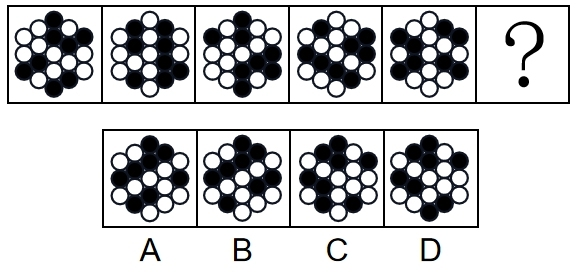
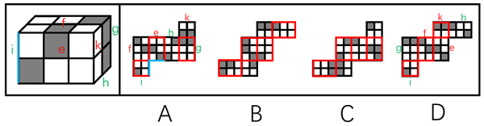
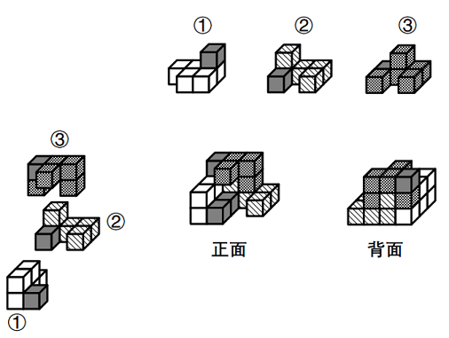
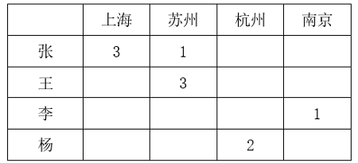

# 2024年国家公务员录用考试《行测》题（副省级网友回忆版）

> 判断推理 · 40 题 · 国考 2024

## 第 1 题　qid 5893606 · 图形推理

从所给的四个选项中，选择最合适的一项填入问号处，使之呈现一定的规律性：

- **A**. A
- **B**. B
- **C**. C
- **D**. D　✅

**答案**：D

**官方解析**

元素组成不同，且无明显属性规律，观察发现，题干图形均由黑块和白块组成，且色块分布均匀，优先考虑黑白块面积。题干图形的黑块面积依次为整体图形面积的、、、、，故？处图形的黑块面积应为整个图形的面积，即整个图形全为黑色，只有D项符合。

故正确答案为D。

---

## 第 2 题　qid 5893833 · 图形推理

从所给的四个选项中，选择最合适的一个填入问号处，使之呈现一定的规律性：

- **A**. A　✅
- **B**. B
- **C**. C
- **D**. D

**答案**：A

**官方解析**

元素组成相同，考虑位置规律。题干图形可分为内外圈，考虑内外圈分开看。位于内圈的黑球均依次顺时针平移1步，位于外圈的黑球均依次逆时针平移1步，只有A项符合。

故正确答案为A。

---

## 第 3 题　qid 5893838 · 图形推理

从所给的四个选项中，选择最合适的一个填入问号处，使之呈现一定的规律性：

- **A**. A
- **B**. B
- **C**. C　✅
- **D**. D

**答案**：C

**官方解析**

元素组成不同，且无明显属性规律，优先考虑数量规律。观察发现，题干图形均由线条和宫格构成，且线条将宫格中的小白球都分成了两部分，排除D项；继续观察发现，题干图形中两部分白球数量存在差异，个数分别为5、5和6、4交替出现，故？处图形两部分白球个数应为6、4，只有C项符合。
故正确答案为C。

---

## 第 4 题　qid 5893613 · 图形推理

从所给的四个选项中，选择最合适的一项填入问号处，使之呈现一定的规律性：

- **A**. A
- **B**. B　✅
- **C**. C
- **D**. D

**答案**：B

**官方解析**

图形元素组成相似，优先考虑样式规律。观察发现，题干图形均由黑球和白球构成，考虑黑白运算。九宫格优先横向看，第一行图形的黑白运算规律为：黑+白=白，白+白=黑，白+黑=白，黑+黑=空，第二行图形经验证符合此规律，第三行图形应用此规律，只有B项符合。
故正确答案为B。

---

## 第 5 题　qid 5895236 · 图形推理

左图为8个白色正方体和4个灰色正方体粘接而成的长方体，问以下哪一个可能是其外表面展开图？

- **A**. A
- **B**. B
- **C**. C
- **D**. D　✅

**答案**：D

**官方解析**

将长方体的外表面依次标上序号，如下图所示，面e为正面、面f为顶面、面k为右侧面、面i为左侧面、面g为背面、面h为底面，逐一进行分析。

A项：展开图的6个面与长方体的外表面可以对应（如上图所示），但在题干长方体中，面e和面i的公共边应挨着面i中的黑色方块，而A项中两面的公共边没有挨着面i中的黑色方块，选项与题干不一致，排除；

B项：展开图的6个面中，不存在面e和面f，选项与题干不一致，排除；

C项：展开图的6个面中，不存在面e和面f，选项与题干不一致，排除；

D项：展开图的6个面（如上图所示）与长方体的外表面一一对应，选项与题干一致，当选。

故正确答案为D。

---

## 第 6 题　qid 5893673 · 图形推理

上图为13个白色正方体和5个灰色正方体组合而成的多面体，现用经A、B、C三个顶点的平面对该多面体进行切割，正确的截面是：

- **A**. A
- **B**. B　✅
- **C**. C
- **D**. D

**答案**：B

**官方解析**

本题考查截面图。根据平面公理“过不在一条直线上的三点，有且只有一个平面”可以得出，A、B、C三个顶点可以确定一个唯一的截面，如下图所示：

从下往上看即可得到如下截图：

故正确答案为B。

---

## 第 7 题　qid 5894887 · 图形推理

左图为15个白色正方体和3个灰色正方体组合而成的多面体，其可以由①、②、③三个多面体组合而成，问哪项能填入问号处？

- **A**. A　✅
- **B**. B
- **C**. C
- **D**. D

**答案**：A

**官方解析**

本题考查立体拼合。如下图所示，立体图可以由①、②以及A项拼合而成。

故正确答案为A。

---

## 第 8 题　qid 5893840 · 图形推理

把下面六个图形分为两类，使每一类图形都有各自的共同特征或规律，分类正确的一项是：

- **A**. ①②⑥，③④⑤
- **B**. ①③④，②⑤⑥
- **C**. ①③⑥，②④⑤　✅
- **D**. ①③⑤，②④⑥

**答案**：C

**官方解析**

本题为分组分类题目。题干每幅图形均由三个面和一个黑块拼接而成，考虑图形间关系。观察发现，题干中黑块与图形外框均相交于边，且图①③⑥中黑块与图形外框公共边的数量均为1，图②④⑤中黑块与图形外框公共边的数量均为2，即图①③⑥为一组，图②④⑤为一组。
故正确答案为C。

---

## 第 9 题　qid 5893637 · 图形推理

把下面六个图形分为两类，使每一类图形都有各自的共同特征或规律，分类正确的一项是：

- **A**. ①④⑤，②③⑥
- **B**. ①③④，②⑤⑥
- **C**. ①⑤⑥，②③④　✅
- **D**. ①②⑥，③④⑤

**答案**：C

**官方解析**

本题为分组分类题目。元素组成不同，且无明显属性规律，考虑数量规律。观察发现，题干图形被分割，考虑面数量，但面数量无规律，且框内有明显一笔构成的线条，考虑笔画数。图①⑤⑥均为两笔画图形，图②③④均为一笔画图形，故图①⑤⑥为一组，图②③④为一组。
故正确答案为C。

---

## 第 10 题　qid 5893648 · 图形推理

把下面的六个图形分为两类，使每一类图形都有各自的共同特征或规律，分类正确的一项是：

- **A**. ①②⑥，③④⑤
- **B**. ①④⑥，②③⑤
- **C**. ①③⑤，②④⑥
- **D**. ①②③，④⑤⑥　✅

**答案**：D

**官方解析**

本题为分组分类题目。元素组成不同，且无明显属性规律，考虑数量规律。题干图形明显被分割，优先考虑面数量，题干图形均有四个白块和一个黑块，不能分组；继续观察发现，题干图形均由几个图形拼接而成，还可以考虑图形间关系。题干图形均有一个黑块，图①②③中黑块均与4个白块存在公共边，图④⑤⑥中黑块均与3个白块存在公共边。即图①②③为一组，图④⑤⑥为一组。
故正确答案为D。

---

## 第 11 题　qid 5893535 · 定义判断

慢病也称为慢性非传染性疾病，是指长期的、不能自愈的、也几乎不能被治愈的疾病。慢病自我管理是指慢病患者主动监测自己的病情，以积极态度及行动，改善健康和情绪，通过对疾病的认识，学习与疾病长期共存。
根据上述定义，下列属于慢病自我管理的是：

- **A**. 老张在患了流感后多方查阅相关信息，每天监测血氧、心率、血压等指标，不做剧烈运动，避免着凉
- **B**. 老王因慢性肾功能衰竭需定期在医院进行透析治疗，医院为其建立了慢病管理档案，追踪监测肾功能等各项指标
- **C**. 老赵的父母都因胃癌去世，老赵深知该疾病的严重后果，每年全面体检一次，定期进行胃肠镜检查，不熬夜不喝酒，规律作息
- **D**. 患II型糖尿病的老李，平日生活格外谨慎，含糖量高的食物一概不碰，每天按时服药，定期监测血糖水平　✅

**答案**：D

**官方解析**

第一步：找出定义关键词。
慢病：“慢性非传染性疾病”、“长期的、不能自愈的、也几乎不能被治愈的疾病”；
慢病自我管理：“慢病患者主动监测自己的病情，积极改善健康和情绪，学习与疾病长期共存”。
第二步：逐一分析选项。
A项：“流感”属于传染性疾病，不符合“慢性非传染性疾病”，不符合“慢病”定义，因此也不符合“慢病自我管理”定义，排除；
B项：医院为老王建立慢病管理档案并追踪监测肾功能等各项指标，不是患者老王监测自己的病情，不符合“慢病患者主动监测自己的病情，积极改善健康和情绪，学习与疾病长期共存”，不符合“慢病自我管理”定义，排除；
C项：老赵并没有患病，不是患者，不符合“慢病患者主动监测自己的病情，积极改善健康和情绪，学习与疾病长期共存”，不符合“慢病自我管理”定义，排除；
D项：II型糖尿病属于慢性非传染性疾病，患II型糖尿病的老李按时服药，定期监测血糖水平，符合“慢病患者主动监测自己的病情，积极改善健康和情绪，学习与疾病长期共存”，符合“慢病自我管理”定义，当选。
故正确答案为D。

---

## 第 12 题　qid 5893775 · 定义判断

多级养殖是指根据物种代谢产物或残余有机质的利用价值及其在食物链中所处的级次，依次放养相应生物，多级次利用营养物质的一种养殖方式。
根据上述定义，下列属于多级养殖的是：

- **A**. 将养殖过江蓠的海水用于放养贝类，以利用其中繁殖的浮游生物；再将养殖过贝类的水用于放养对虾；再以对虾代谢分解的产物养殖藻类　✅
- **B**. 将鱼、虾、贝类与藻类放在同一水槽混养，其代谢产物会为藻类提供必要的营养要素，藻类的光合作用又产生更多的溶解氧
- **C**. 在一台浮筏上，于冬春季养殖海带；至夏秋季养殖海湾扇贝或石花菜，从而更好利用海况条件，满足市场需要
- **D**. 同一池塘中，鲢、鳙生活在上层，主食浮游生物；草鱼、鳊生活在中下层，主食草类；鲤、鲫生活在底层，主食底栖动物和有机碎屑

**答案**：A

**官方解析**

第一步：找出定义关键词。
“根据物种代谢产物或残余有机质的利用价值及其在食物链中所处的级次”、“依次放养相应生物”、“多级次利用营养物质”。
第二步：逐一分析选项。
A项：养殖江蓠的海水放养贝类，再利用养殖贝类的水放养对虾，再利用对虾代谢分解的产物养殖藻类，符合“根据物种代谢产物或残余有机质的利用价值及其在食物链中所处的级次”、“依次放养相应生物”、“多级次利用营养物质”，符合定义，当选；
B项：将鱼、虾、贝类与藻类放在同一水槽混养，不符合“依次放养相应生物”等，不符合定义，排除；
C项：冬春季养殖海带，至夏秋季养殖海湾扇贝或石花菜，不符合“根据物种代谢产物或残余有机质的利用价值及其在食物链中所处的级次”、“多级次利用营养物质”，不符合定义，排除；
D项：同一池塘中生活在不同层的生物，不符合“依次放养相应生物”、“多级次利用营养物质”，不符合定义，排除。
故正确答案为A。

---

## 第 13 题　qid 5893807 · 定义判断

动态描写法是指记叙文中对人物、景物作运动状态的描写，创造具体而栩栩如生的形象的一种描写方法。动态描写法包括两类：一类是对运动着的景物的描写，一类是对静物所作的动态描写。动态描写法的目的在于赋予客观事物以运动感、活力感、变化感，克服形象的单调性，丰富形象的多样性，达到更好地表现事物、感染读者的艺术效果。
根据上述定义，下列没有体现动态描写法的是：

- **A**. 有的松树望穿秋水，不见你来，独自上到高处，斜着身子张望
- **B**. 夜阑人静，家养的大黄狗趴在院子里安静地睡了　✅
- **C**. 七股大水，从水库的桥孔跃出，仿佛七幅闪光的黄锦，直铺下去
- **D**. 一轮杏黄色的满月，悄悄从山嘴处爬出来，把倒影投入湖水中

**答案**：B

**官方解析**

第一步：找出定义关键词。
“对运动着的景物的描写”、“对静物所作的动态描写”、“目的在于赋予客观事物以运动感、活力感、变化感”。
第二步：逐一分析选项。
A项：该项中“松树上到高处，斜着身子张望”，将静态的松树写成动态，而且赋予它情感，生动形象地描绘了松树婀娜多姿的风貌，符合“对静物所作的动态描写”、“目的在于赋予客观事物以运动感、活力感、变化感”，符合定义，排除；
B项：该项中“大黄狗趴在院子里安静地睡了”，未体现动态的表达，大黄狗只是处于静止状态趴在院子里，不符合“对运动着的景物的描写”、“对静物所作的动态描写”、“目的在于赋予客观事物以运动感、活力感、变化感”，不符合定义，当选；
C项：该项中“水从桥孔跃出”，将动态的水描写得生动、壮观、有气势，符合“对运动着的景物的描写”、“目的在于赋予客观事物以运动感、活力感、变化感”，符合定义，排除；
D项：该项中“满月从山嘴处爬出来”，将月亮升起的动态生动地描绘出来，符合“对运动着的景物的描写”、“目的在于赋予客观事物以运动感、活力感、变化感”，符合定义，排除。
本题为选非题，故正确答案为B。

---

## 第 14 题　qid 5893544 · 定义判断

电力系统的电力设备根据其在运行中所起的作用，分为电力一次设备和电力二次设备。电力一次设备指的是直接参与生产、变换、传输、分配和消耗电能的设备；电力二次设备指的是为了保护并保证电力一次设备的正常运行，对其运行状态进行测量、监视、控制和调节等的设备。
根据上述定义，下列说法正确的是：

- **A**. 电路中用于升降交流电压的变压器，属于电力二次设备
- **B**. 将回路中高电压降低的电压互感器，属于电力一次设备　✅
- **C**. 由柴油驱动的发电机，属于电力二次设备
- **D**. 记录零序电流值并用于查找故障点的故障录波装置，属于电力一次设备

**答案**：B

**官方解析**

第一步：找出定义关键词。
电力一次设备：“直接参与生产、变换、传输、分配和消耗电能”；
电力二次设备：“保护并保证电力一次设备的正常运行”、“对其运行状态进行测量、监视、控制和调节等”。
第二步：逐一分析选项。
A项：用于升降交流电压的变压器，是直接参与变换电压的设备，符合“直接参与生产、变换、传输、分配和消耗电能”，符合“电力一次设备”定义，不符合“电力二次设备”定义，排除；
B项：将回路中高电压降低的电压互感器，是直接参与变换电压的设备，符合“直接参与生产、变换、传输、分配和消耗电能”，符合“电力一次设备”定义，当选；
C项：由柴油驱动的发电机，是生产电能的设备，符合“直接参与生产、变换、传输、分配和消耗电能”，符合“电力一次设备”定义，不符合“电力二次设备”定义，排除；
D项：记录零序电流值并用于查找故障点的故障录波装置，该装置是为了保护并保证电力一次设备的正常运行而对其进行监视的设备，符合“对其运行状态进行测量、监视、控制和调节等”，符合“电力二次设备”定义，不符合“电力一次设备”定义，排除。
故正确答案为B。

---

## 第 15 题　qid 5893804 · 定义判断

复杂型消费行为是指消费者对价格昂贵，品牌差异大，功能复杂的商品，由于缺乏必要的商品知识，需要慎重选择，仔细对比，以求降低风险的购买行为；多变型消费行为是指如果消费者购买的商品价格低，可供选择的品牌很多时，他们并不花太多的时间选择品牌，而是经常变换品牌。
根据上述定义，下列说法正确的是：

- **A**. 老李给儿子换了十几个钢琴老师之后，发现还是第一个钢琴老师最好，于是一次性交了一年的学费。这属于复杂型消费行为
- **B**. 小明去超市买某品牌饼干，心想上次买了巧克力口味，这次买绿茶口味，下次再试一下夹心的。这属于多变型消费行为
- **C**. 老王打算买一辆越野车，网上查阅了各种型号参数，试驾了十几款品牌之后，才做出决定。这属于复杂型消费行为　✅
- **D**. 小丽逛街的时候本来只想买一条裤子，后来发现需要搭配一件合适的上衣和配套的手提包，所以买了全套。这属于多变型消费行为

**答案**：C

**官方解析**

第一步：找出定义关键词。
复杂型消费行为：“价格昂贵，品牌差异大，功能复杂的商品”、“慎重选择，仔细对比，以求降低购买风险”；
多变型消费行为：“价格低，可选品牌多的商品”、“不花太多的时间选择品牌，经常变换品牌”。
第二步：逐一分析选项。
A项：老李给儿子更换和对比了钢琴老师，但钢琴授课服务并不属于“功能复杂的商品”，不符合“价格昂贵，品牌差异大，功能复杂的商品”，不符合“复杂型消费行为”定义，排除；
B项：小明更换的是不同口味、类型的饼干，未体现变换品牌，不符合“不花太多的时间选择品牌，经常变换品牌”，不符合“多变型消费行为”定义，排除；
C项：老王购买越野车，其中越野车符合“价格昂贵，品牌差异大，功能复杂的商品”，老王试驾十几款品牌后才做决定，符合“慎重选择，仔细对比，以求降低购买风险”，符合“复杂型消费行为”定义，当选；
D项：小丽本来只想购买裤子，后为了搭配购买了全套，未体现价格是否昂贵，以及是否更换品牌，不符合“价格低，可选品牌多的商品”、“不花太多的时间选择品牌，经常变换品牌”，不符合“多变型消费行为”定义，排除。
故正确答案为C。

---

## 第 16 题　qid 5893810 · 定义判断

森林覆盖率是指森林面积占土地总面积的百分比。郁闭度是指森林中乔木树冠在阳光直射下地面总投影面积与此林地总面积的比，其最大值为1，表示树冠层全部连接形成完全郁闭的状态。郁闭度与森林气温日变化呈负相关，与相对湿度呈正相关。立木蓄积量是指森林中所有树木材积的总和，立木包括枯立木和活立木两类；森林蓄积量是指森林中现存各种活立木的材积总量，以立方米为计算单位。
根据上述定义，下列说法正确的是：

- **A**. 森林覆盖率能够反映一个国家（或地区）森林资源分布的实际状况
- **B**. 若某森林郁闭度为0.3，其阳光直射下乔木树冠的地面总投影面积为3万公顷，则该林地总面积为10万公顷　✅
- **C**. 一般来说，郁闭度大时森林白天气温降低，气温日变化增加，相对湿度增大
- **D**. 某区域森林蓄积量为14亿立方米，则该区域立木蓄积量一定少于14亿立方米

**答案**：B

**官方解析**

第一步：找出定义关键词。
森林覆盖率：“森林面积占土地总面积的百分比”；
郁闭度：“森林中乔木树冠在阳光直射下地面总投影面积与此林地总面积的比”、“与森林气温日变化呈负相关，与相对湿度呈正相关”；
立木蓄积量：“森林中所有树木材积的总和，立木包括枯立木和活立木两类”；
森林蓄积量：“森林中现存各种活立木的材积总量”。
第二步：逐一分析选项。
A项：森林覆盖率指“森林面积占土地总面积的百分比”，即森林覆盖率反映的是森林资源“占有”土地的情况，而不是森林资源“分布”的状况，说法错误，排除；
B项：根据“郁闭度=森林中乔木树冠在阳光直射下地面总投影面积/此林地总面积”可知，当某森林郁闭度为0.3，其阳光直射下乔木树冠的地面总投影面积为3万公顷时，该林地总面积为10万公顷，说法正确，当选；
C项：根据“郁闭度与森林气温日变化呈负相关，与相对湿度呈正相关”可知，当郁闭度大时，气温日变化应“减小”，而不是“增加”，说法错误，排除；
D项：立木蓄积量指“森林中所有树木材积的总和，立木包括枯立木和活立木两类”，森林蓄积量指“森林中现存各种活立木的材积总量”，即立木蓄积量包括森林蓄积量，当某区域森林蓄积量为14亿立方米时，该区域立木蓄积量应“不少于”14亿立方米，说法错误，排除。
故正确答案为B。

---

## 第 17 题　qid 5893778 · 定义判断

附性法推理是指将同一属性分别附加在原命题的主项和谓项前面，从而形成一个新命题的推理方法，以公式表示即为：“所有S（主项）是P（谓项）所有NS是NP”（其中“N”表示某种属性）。运用这种推理必须遵守的规则是：①原命题必须断定了某个类别的所有事物的某种共性；②附加的属性概念必须保持含义的同一；③结论中的主谓项关系应与前提中的主谓项关系相同。

根据上述定义，下列符合附性法推理规则的是：

- **A**. 蝴蝶是昆虫，所以，色彩斑斓的蝴蝶是色彩斑斓的昆虫　✅
- **B**. 教师是人，所以，老教师是老人
- **C**. 有些诗人是画家，所以，有些女诗人是女画家
- **D**. 音乐家是人，所以，无天赋的音乐家是无天赋的人

**答案**：A

**官方解析**

第一步：找出定义关键词。
“原命题必须断定了某个类别的所有事物的某种共性”、“附加的属性概念必须保持含义的同一”、“结论中的主谓项关系应与前提中的主谓项关系相同”。
第二步：逐一分析选项。
A项：蝴蝶是昆虫，所以，色彩斑斓的蝴蝶是色彩斑斓的昆虫，蝴蝶和昆虫前附加的“色彩斑斓”含义均是色彩灿烂的样子，符合“原命题必须断定了某个类别的所有事物的某种共性”、“附加的属性概念必须保持含义的同一”、“结论中的主谓项关系应与前提中的主谓项关系相同”，符合定义，当选；
B项：老教师中的“老”含义是经验丰富，老人中的“老”含义是上了年纪，两者含义不同，不符合“附加的属性概念必须保持含义的同一”，不符合定义，排除；
C项：有些诗人是画家，不符合“原命题必须断定了某个类别的所有事物的某种共性”，不符合定义，排除；
D项：无天赋的音乐家中的“无天赋”含义是在音乐领域没有天赋，无天赋的人中的“无天赋”含义是在所有领域没有天赋，两者含义不同，不符合“附加的属性概念必须保持含义的同一”，不符合定义，排除。
故正确答案为A。

---

## 第 18 题　qid 5893541 · 定义判断

民俗是指一个民族或一个社会群体在长期的生产实践和社会生活中逐渐形成并世代相传、较为稳定的文化事项，可以简单概括为民间流行的风尚、习俗，具有传承性、广泛性、稳定性。
根据上述定义，下列活动属于民俗的是：

- **A**. 清明节当天，黄帝陵举行隆重的公祭活动，按照既定祀典礼仪，缅怀始祖精神，传承中华文明
- **B**. 王老伯家有一个传承三代的习惯，每到重大节日，全家都要聚在一起，交流感情，品尝美食，共享天伦
- **C**. 农历九月九日为重阳节，自古以来，河洛地区的人们每逢这天都会结伴登高山、逛庙会、赏菊花　✅
- **D**. 近年来，一些大都市的公园每周都会举办“相亲角”活动，中老年父母聚在一起替儿女相亲

**答案**：C

**官方解析**

第一步：找出定义关键词。
“一个民族或一个社会群体”、“在长期的生产实践和社会生活中逐渐形成并世代相传、较为稳定的文化事项”、“民间流行的风尚、习俗”、“具有传承性、广泛性、稳定性”。
第二步：逐一分析选项。
A项：清明节当天在黄帝陵举行的公祭活动，是以官方名义组织的有严格规模、等级和仪式的大型祭祀活动，不符合“民间流行的风尚、习俗”，不符合定义，排除；
B项：该项说明的是王老伯的家庭内部习惯，该习惯仅适用于王老伯家，不具有广泛性，不符合“具有传承性、广泛性、稳定性”，不符合定义，排除；
C项：河洛地区的人们，符合“一个民族或一个社会群体”，自古以来，每逢重阳节都会结伴登高山、逛庙会、赏菊花，说明是世代相传，具有传承性，符合“在长期的生产实践和社会生活中逐渐形成并世代相传、较为稳定的文化事项”、“具有传承性、广泛性、稳定性”，符合定义，当选；
D项：一些大都市的公园每周都会举办“相亲角”活动，不符合“在长期的生产实践和社会生活中逐渐形成并世代相传、较为稳定的文化事项”，不符合定义，排除。
故正确答案为C。

---

## 第 19 题　qid 5893601 · 定义判断

某部落的计数法只有4个符号：。每个数字至多有两位，数位从高到低的顺序为从右到左。其中右边数位从大到小依次为；而左边数位从大到小依次为。

根据上述定义，下列哪项中的数字最大？

- **A**. 

　✅
- **B**. 

- **C**. 

- **D**. 

**答案**：A

**官方解析**

第一步：找出定义关键词。

“每个数字至多有两位，数位从高到低的顺序为从右到左”、“右边数位从大到小依次为”、“左边数位从大到小依次为”。

第二步：逐一分析选项。

本题提问方式为“下列哪项中的数字最大”，故根据定义关键词对选项进行排序即可。根据“每个数字至多有两位，数位从高到低的顺序为从右到左”可知，右边数位大的数字更大，所以根据“右边数位从大到小依次为”可知，大于，排除B、D两项；再根据“左边数位从大到小依次为”可知，大于，所以A项中的数字最大。

故正确答案为A。

---

## 第 20 题　qid 5893595 · 定义判断

伪装型反侦查行为是指犯罪行为人通过采取相应措施来隐蔽自身、迷惑侦查机关侦查活动的行为，其主要表现为三类：①栽赃嫁祸，通过将赃物、违禁品暗置别人处等方式来误导侦查方向；②主动报案，通过实施“贼喊捉贼”式的行为来蒙蔽侦查机关；③制造伪证，通过假人证、不知情的人或一些特定物品，制造出虚假的不在场证明或者自己与案件无关的假象，以达到混淆视听、误导侦查视线的目的。
根据上述定义，下列没有体现上述几类伪装型反侦查行为的是：

- **A**. 甲将乙杀害后，故意在网络上散布丙与乙不和的谣言，转移警方注意力
- **B**. 甲在作案后，拿走可以证明受害人乙身份的物品，隐藏其身份　✅
- **C**. 甲酒后与乙争吵并痛下杀手，事后甲主动报警，声称自己是目击证人
- **D**. 甲作案后接受警方讯问时，拿出案发当日的火车票谎称自己当时正在火车上

**答案**：B

**官方解析**

第一步：找出定义关键词。
伪装型反侦查行为：“犯罪行为人”、“隐蔽自身、迷惑侦查机关侦查活动的行为”；
栽赃嫁祸：“将赃物、违禁品暗置别人处等方式”、“误导侦查方向”；
主动报案：“实施‘贼喊捉贼’式的行为”、“蒙蔽侦查机关”；
制造伪证：“通过假人证、不知情的人或一些特定物品”、“制造出虚假的不在场证明或者自己与案件无关的假象”、“达到混淆视听、误导侦查视线的目的”。
第二步：逐一分析选项。
A项：甲将乙杀害后，故意散布丙与乙不和的谣言，符合“嫁祸”，转移警方注意力，符合“误导侦查方向”，属于栽赃嫁祸，符合定义，排除；
B项：甲作案后，拿走能证明受害人乙身份的物品，隐藏乙的身份，不符合“隐蔽自身、迷惑侦查机关侦查活动的行为”，不符合定义，当选；
C项：甲杀人后主动报警，声称自己是目击证人，符合“实施‘贼喊捉贼’式的行为”，属于主动报案，符合定义，排除；
D项：甲作案后拿出案发当日的火车票，谎称自己当时正在火车上，符合“通过假人证、不知情的人或一些特定物品”、“制造出虚假的不在场证明或者自己与案件无关的假象”，属于制造伪证，符合定义，排除。
本题为选非题，故正确答案为B。

---

## 第 21 题　qid 5893812 · 类比推理

卫冕：夺冠

- **A**. 庄园：田园
- **B**. 追讨：诉讼
- **C**. 续约：签约　✅
- **D**. 姓名：笔名

**答案**：C

**官方解析**

第一步：判断题干词语间逻辑关系。
卫冕指竞赛中保住上次获得的冠军称号，所以卫冕是再次夺冠，二者为对应关系。
第二步：判断选项词语间逻辑关系。
A项：庄园指封建主占有和经营的大片地产，田园指田地和园圃，借指农村，二者不是对应关系，与题干逻辑关系不一致，排除；
B项：追讨指追赶讨伐，诉讼指司法机关在案件当事人和其他有关人员的参与下，按照法定程序解决案件时所进行的活动，俗称“打官司”，二者无明显逻辑关系，与题干逻辑关系不一致，排除；
C项：续约指合同、合约期满后继续签约，所以续约是再次签约，二者为对应关系，与题干逻辑关系一致，当选；
D项：姓名指人的姓氏和名字，笔名指作者发表作品时用的别名，二者不是对应关系，与题干逻辑关系不一致，排除。
故正确答案为C。

---

## 第 22 题　qid 5893567 · 类比推理

花生壳：核桃仁

- **A**. 刺梨汁：桃花扇
- **B**. 丝瓜络：石榴籽　✅
- **C**. 杏仁露：葡萄皮
- **D**. 葛根茶：芡实粉

**答案**：B

**官方解析**

第一步：判断题干词语间逻辑关系。
“花生壳”是花生的组成部分；“核桃仁”是核桃的组成部分，二者都是组成各自植物果实的一部分。
第二步：判断选项词语间逻辑关系。
A项：“刺梨汁”是一种以刺梨为原材料制成的果汁；“桃花扇”是指扇面上画有桃花的扇子，二者不是组成各自植物果实的一部分，与题干逻辑关系不一致，排除；
B项：“丝瓜络”是干燥成熟丝瓜的网状纤维，“丝瓜络”是丝瓜的组成部分；“石榴籽”是石榴的组成部分，二者都是组成各自植物果实的一部分，与题干逻辑关系一致，当选；
C项：“杏仁露”是一种以杏仁为原材料制成的饮料；“葡萄皮”是葡萄的组成部分，与题干逻辑关系不一致，排除；
D项：“葛根茶”是一种以葛根为原材料制成的茶饮料；“芡实粉”是一种以芡实为原材料磨成的粉，与题干逻辑关系不一致，排除。
故正确答案为B。

---

## 第 23 题　qid 5893573 · 类比推理

花香四溢：分子运动

- **A**. 波光粼粼：光的反射　✅
- **B**. 聚沙成塔：质量互变
- **C**. 水落石出：水的浮力
- **D**. 炉火纯青：金属炼制

**答案**：A

**官方解析**

第一步：判断题干词语间逻辑关系。
花香四溢是花朵的气味分子进入空气，扩散到周围环境中，供人们嗅觉感知。花香四溢的原理是分子运动，二者为对应关系。
第二步：判断选项词语间逻辑关系。
A项：波光粼粼是光照在动态的水面上，除少许穿透形成折射外，多数都反射回空气中从而形成的现象。波光粼粼的原理是光的反射，二者为对应关系，与题干逻辑关系一致，当选；
B项：聚沙成塔是把沙子堆成宝塔，体现了积少成多。聚沙成塔的原理不是质量互变，与题干逻辑关系不一致，排除；
C项：水落石出指水落下去，水底的石头就露出来，比喻事情的真相完全显露出来，体现了自然界中动态与静态的辩证关系。水落石出的原理不是水的浮力，与题干逻辑关系不一致，排除；
D项：炉火纯青是认为炼到炉里发出纯青色的火焰就算成功了，火焰的温度对应相应的颜色（即火焰的温度越低，颜色会偏黄；温度越高，颜色会偏蓝），后用来比喻功夫达到了纯熟完美的境界，体现的是火焰温度和颜色之间的对应关系。炉火纯青的原理不是金属炼制，与题干逻辑关系不一致，排除。
故正确答案为A。

---

## 第 24 题　qid 5893570 · 类比推理

诛禁不当：反受其央

- **A**. 为者常成：行者常至
- **B**. 君子检身：常若有过
- **C**. 其身不正：虽令不从　✅
- **D**. 麻雀虽小：五脏俱全

**答案**：C

**官方解析**

第一步：判断题干词语间逻辑关系。
诛禁不当，反受其央，意思是惩罚得不恰当，反而受其祸害。因为诛禁不当，所以反受其央，二者是因果对应关系。
第二步：判断选项词语间逻辑关系。
A项：为者常成，行者常至，意思是努力去做的人常常可以成功，不倦前行的人常常可以达到目的，二者是并列关系，与题干逻辑关系不一致，排除；
B项：君子检身，常若有过，意思是君子要时时反省检查自己，就像自己经常会有缺点过失那样，二者不是因果对应关系，与题干逻辑关系不一致，排除；
C项：其身不正，虽令不从，意思是在上位的管理者本身言行不正，即使发出命令，大家也不会服从遵守。因为其身不正，所以虽令不从，二者是因果对应关系，与题干逻辑关系一致，当选；
D项：麻雀虽小，五脏俱全，比喻事物的体积或规模虽小，具备的内容却很齐全，二者不是因果对应关系，与题干逻辑关系不一致，排除。
故正确答案为C。

---

## 第 25 题　qid 5893803 · 类比推理

酒器：尊：爵

- **A**. 门楣：门框：门槛
- **B**. 服装：礼服：常服　✅
- **C**. 人居：巢居：穴居
- **D**. 木柱：石柱：砖柱

**答案**：B

**官方解析**

第一步：判断题干词语间逻辑关系。
尊和爵是古代两种不同的酒器，二者为并列关系，分别与酒器构成种属关系。
第二步：判断选项词语间逻辑关系。
A项：门楣、门框、门槛是中国古代建筑大门的三个不同的组成部分，三者为并列关系，与题干逻辑关系不一致，排除；
B项：礼服和常服是两种不同穿着场合的服装，二者为并列关系，分别与服装构成种属关系，与题干逻辑关系一致，当选；
C项：巢居和穴居是两种不同的居住形式，二者为并列关系，分别与人居构成交叉关系，与题干逻辑关系不一致，排除；
D项：木柱、石柱、砖柱是三种不同材质的柱子，三者为并列关系，与题干逻辑关系不一致，排除。
故正确答案为B。

---

## 第 26 题　qid 5893549 · 类比推理

蚜虫：七星瓢虫：小麦

- **A**. 蛇：鸟：谷子
- **B**. 稗草：螳螂：水稻
- **C**. 蚊子：青蛙：高粱
- **D**. 老鼠：黄鼬：玉米　✅

**答案**：D

**官方解析**

第一步：判断题干词语间逻辑关系。
蚜虫会吸食小麦的汁液，二者为捕食者与被捕食对象的对应关系；七星瓢虫会捕食蚜虫，二者为捕食者与被捕食对象的对应关系。
第二步：判断选项词语间逻辑关系。
A项：有的蛇会吃鸟，有的鸟会吃蛇，二者是相互捕食的对应关系，与题干逻辑关系不一致，排除；
B项：稗草是一种常见的田间杂草，会和水稻竞争稻田里的资源，二者是竞争关系，并非捕食者与被捕食对象的对应关系，与题干逻辑关系不一致，排除；
C项：蚊子和高粱没有必然关系，与题干逻辑关系不一致，排除；
D项：老鼠吃玉米，二者为捕食者与被捕食对象的对应关系；黄鼬即黄鼠狼，会捕食老鼠，二者为捕食者与被捕食对象的对应关系，与题干逻辑关系一致，当选。
故正确答案为D。

---

## 第 27 题　qid 5893534 · 类比推理

感想：主观性：体会

- **A**. 典范：示范性：表率　✅
- **B**. 发明：创造性：方法
- **C**. 泥土：可塑性：材料
- **D**. 规律：普适性：定理

**答案**：A

**官方解析**

第一步：判断题干词语间逻辑关系。
感想是指由接触外界事物而引起的思想反应，体会指的是体验领会，二者为近义关系；感想和体会均具有主观性，与第二个词构成必然属性对应关系。
第二步：判断选项词语间逻辑关系。
A项：典范是指可以作为学习、仿效标准的人或事物，表率是指好的榜样，二者为近义关系；典范和表率均具有示范性，与第二个词构成必然属性对应关系，与题干逻辑关系一致，当选；
B项：发明需要一定的方法，二者为对应关系，与题干逻辑关系不一致，排除；
C项：泥土是一种材料，二者为种属关系；材料不一定具有可塑性，与第二个词构成或然属性对应关系，与题干逻辑关系不一致，排除；
D项：规律是指事物之间的内在必然联系，定理是指已经证明具有正确性、可以作为原则或规律的命题或公式，定理是规律的一种，二者为种属关系，与题干逻辑关系不一致，排除。
故正确答案为A。

---

## 第 28 题　qid 5893771 · 类比推理

识别敌舰：发射鱼雷：击毁目标

- **A**. 线上挂号：远程问诊：开具处方　✅
- **B**. 环境评估：铁路铺设：桥梁建造
- **C**. 立案审查：提起公诉：证据确凿
- **D**. 交通事故：保险赔付：救治伤员

**答案**：A

**官方解析**

第一步：判断题干词语间逻辑关系。
军舰在大洋中巡查时，先识别敌舰，再发射鱼雷，最后击毁目标，三者为先后顺序的对应关系。
第二步：判断选项词语间逻辑关系。
A项：网络就医一般先线上挂号，再远程问诊，最后开具处方，三者为先后顺序的对应关系，与题干逻辑关系一致，当选；
B项：铁路铺设和桥梁建造没有必然的先后顺序，与题干逻辑关系不一致，排除；
C项：在我国刑事案件一般是先立案审查，再提起公诉，但证据确凿不是动作行为，和前两词不存在动作行为的先后顺序，与题干逻辑关系不一致，排除；
D项：发生交通事故后一般先救治伤员，再进行保险赔付，先后顺序与题干不同，与题干逻辑关系不一致，排除。
故正确答案为A。

---

## 第 29 题　qid 5893805 · 类比推理

牛皮纸 对于 （    ） 相当于 （    ） 对于 背筐

- **A**. 包装；运输
- **B**. 木纤维；拎筐
- **C**. 纸袋；柳条　✅
- **D**. 羊皮纸；竹筐

**答案**：C

**官方解析**

逐一代入选项。
A项：牛皮纸可用来包装，背筐可用来运输，均为功能对应关系，但前后顺序相反，前后逻辑关系不一致，排除；
B项：木纤维是制作牛皮纸的原材料，二者为原材料对应关系；背筐指背在背上的筐，拎筐指用手拎着的筐，二者为并列关系，前后逻辑关系不一致，排除；
C项：牛皮纸是制作纸袋的原材料，柳条是制作背筐的原材料，均为原材料对应关系，前后逻辑关系一致，当选；
D项：牛皮纸和羊皮纸为并列关系；有的竹筐是背筐，有的竹筐不是背筐，有的背筐是竹筐，有的背筐不是竹筐，二者为交叉关系，前后逻辑关系不一致，排除。
故正确答案为C。

---

## 第 30 题　qid 5893815 · 类比推理

领头雁 对于 （    ） 相当于 （    ） 对于 先驱

- **A**. 领导者；拓荒牛　✅
- **B**. 鸟类；革命
- **C**. 迁徙；先锋
- **D**. 出头鸟；先行者

**答案**：A

**官方解析**

逐一代入选项。
A项：领头雁比喻在众人眼里有一定的号召力和领导能力，具有榜样力量的人，与领导者构成比喻象征关系；拓荒牛比喻开拓创新的先行者，先驱指前行开路的人，二者构成比喻象征关系，前后逻辑关系一致，当选；
B项：领头雁是鸟类，二者为种属关系；革命的先驱，二者为偏正关系，前后逻辑关系不一致，排除；
C项：迁徙是领头雁的一种习性，二者为对应关系；先锋指行军或作战时的先遣将领或先头部队，先驱指前行开路的人，二者为近义关系，前后逻辑关系不一致，排除；
D项：领头雁比喻在众人眼里有一定的号召力和领导能力，具有榜样力量的人，出头鸟比喻表现突出或领头的人，也比喻因出头露面而招人注目的人，二者是并列关系；先行者指首先倡导的人，先驱指前行开路的人，二者是近义/全同关系，前后逻辑关系不一致，排除。
故正确答案为A。

---

## 第 31 题　qid 5893802 · 逻辑判断

人民是创作的源头活水，只有扎根人民，创作才能获得取之不尽、用之不竭的源泉。文化文艺工作者要走进实践深处，观照人民生活，表达人民心声，用心用情用功抒写人民、描绘人民、歌唱人民。哲学社会科学工作者要多到实地调查研究，了解百姓生活状况，把握群众思想脉搏，着眼群众需要解疑释惑、阐明道理，把学问写进群众心坎儿里。
由此可以推出：

- **A**. 文化文艺工作者只有走进实践深处，才能观照人民生活
- **B**. 如果不扎根人民，创作就不能获得取之不尽、用之不竭的源泉　✅
- **C**. 哲学社会科学工作者只有到实地调查研究，才能了解百姓生活状况，把握群众思想脉搏
- **D**. 如果哲学社会科学工作者没有着眼群众需要解疑释惑、阐明道理，就说明他们没有进行实地调查研究

**答案**：B

**官方解析**

第一步：翻译题干。

创作获得取之不尽、用之不竭的源泉扎根人民。

第二步：逐一分析选项。

A项：翻译为“观照人民生活文化文艺工作者走进实践深处”，但是题干二者之间没有推出关系，无法推出，排除；

B项：翻译为“扎根人民创作获得取之不尽、用之不竭的源泉”，是对题干“创作获得取之不尽、用之不竭的源泉扎根人民”的否后，否后必否前，可以推出，当选；

C项：翻译为“了解百姓生活状况，把握群众思想脉搏哲学社会科学工作者到实地调查研究”，但是题干二者之间没有推出关系，无法推出，排除；

D项：翻译为“哲学社会科学工作者着眼群众需要解疑释惑、阐明道理他们进行实地调查研究”，但是题干二者之间没有推出关系，无法推出，排除。

故正确答案为B。

---

## 第 32 题　qid 5893814 · 逻辑判断

冰雪旅游是利用冰雪气候资源体验冰雪文化的旅游活动，包括冰雪观光演艺、运动竞技等内容。H地区冰雪旅游开展了五年，调查显示：在近万名受访者中，有90%的人曾以不同形式体验过冰雪旅游，平均每年有65%的人体验过1~2次冰雪旅游，有25%的人体验过3~4次，且这一比例逐年升高。这说明H地区冰雪旅游的需求较高，常态化多次消费正成为H地区越来越多人的选择。
以下哪项如果为真，最能削弱上述结论？

- **A**. 参与调查的受访者几乎都是了解或喜爱冰雪旅游的年轻人　✅
- **B**. 近五年，H地区冰雪旅游产业的年均投资额接近，没有增加
- **C**. H地区位于北半球北部，冬季较长，许多游客会来此体验冰雪旅游
- **D**. 为扩大宣传，H地区许多冰雪项目会推出优惠组合套餐，吸引人们多次消费

**答案**：A

**官方解析**

第一步：找出论点和论据。
论点：H地区冰雪旅游的需求较高，常态化多次消费正成为H地区越来越多人的选择。
论据：在近万名受访者中，有90%的人曾以不同形式体验过冰雪旅游，平均每年有65%的人体验过1~2次冰雪旅游，有25%的人体验过3~4次，且这一比例逐年升高。
本题通过调查受访者进行冰雪旅游的次数，得出H地区冰雪旅游需求较高，越来越多的人会常态化多次消费的结论，论点论据话题不一致，削弱优先考虑拆桥，即不能通过“受访者冰雪旅游次数增多”推出“H地区冰雪旅游需求较高，越来越多的人会常态化多次消费”。
第二步：逐一分析选项。
A项：选项说的是参与调查的受访者几乎都是了解或喜爱冰雪旅游的年轻人，调查的都是原本就喜爱冰雪旅游的人，那么通过受访者的冰雪旅游次数，无法得出H地区冰雪旅游需求的真实情况，为拆桥项，可以削弱，当选；
B项：选项说的是近五年H地区冰雪旅游产业的年均投资额接近，与论点讨论的选择冰雪旅游的人数是否增加无关，为无关项，无法削弱，排除；
C项：论点说的是H地区的人旅游需求高，该项说的是许多游客来H地区体验冰雪旅游，主体不一致，无法削弱，排除；
D项：选项说的是H地区许多冰雪项目推出的优惠组合套餐会吸引人们多次消费，解释了为什么越来越多的人会常态化多次消费，补充论据进行加强，无法削弱，排除。
故正确答案为A。

---

## 第 33 题　qid 5893806 · 逻辑判断

多重宇宙理论通常也称为平行宇宙理论，该理论认为有无数个宇宙与我们所在的宇宙并存，虽然我们无法意识到这一点。这些宇宙可能与我们所处的宇宙截然不同，但也可能与我们的宇宙极其相似，在更广的意义上，要证明多重宇宙存在远比单纯想象它困难得多。甚至从一开始，有一部分科学家就认为这个理论称不上是“真正意义上的科学”。因为没有人能证明多重宇宙理论是错误的——即它无法被证伪。
以下哪项可能是上述科学家论证的前提？

- **A**. 平行宇宙理论至今未获证实，只是单纯的想象
- **B**. 只有能被证伪的理论，才能称得上是“真正意义上的科学”　✅
- **C**. 平行宇宙理论即使变成现实，对于人类的文明进步也未必是坏事
- **D**. 如果平行宇宙的数量足够多，那可能意味着在我们认为的虚拟世界中发生的事情也会真实地发生在平行宇宙中

**答案**：B

**官方解析**

第一步：找出论点和论据。
论点：多重宇宙理论称不上是“真正意义上的科学”。
论据：没有人能证明多重宇宙理论是错误的——即它无法被证伪。
论点讨论的是“多重宇宙理论”和“真正意义上的科学”的关系，论据讨论的是“多重宇宙理论”和“被证伪”的关系，论点和论据话题不一致，且提问方式为“前提”，加强优先考虑搭桥，即建立“被证伪”和“真正意义上的科学”之间的联系。
第二步：逐一分析选项。
A项：该项说的是平行宇宙理论至今未获证实，与论据讨论的平行宇宙理论是否能被证伪无关，也与论点讨论的平行宇宙理论是否能称得上是“真正意义上的科学”无关，无法加强，排除；
B项：该项说的是只有能被证伪的理论，才能称得上是“真正意义上的科学”，即建立了“被证伪”和“真正意义上的科学”之间的联系，为搭桥项，是论证成立的前提，可以加强，当选；
C项：该项说的是平行宇宙理论对于人类文明的影响，与论点讨论的平行宇宙理论是否能称得上是“真正意义上的科学”无关，话题不一致，无法加强，排除；
D项：该项说的是如果平行宇宙的数量足够多会出现的情况，与论点讨论的平行宇宙理论是否能称得上是“真正意义上的科学”无关，话题不一致，无法加强，排除。
故正确答案为B。

---

## 第 34 题　qid 5894947 · 逻辑判断

今年1-4月，张、王、李、杨4人到长三角城市上海、苏州、杭州和南京调研，每个城市每人调研1个月，每个月中4人调研的城市均不同。已知：
（1）王3月在苏州调研；
（2）李1月在南京调研；
（3）杨2月在杭州调研；
（4）张1月、3月分别在苏州、上海调研。
根据以上信息，以下哪项是不可能的？

- **A**. 杨3月在南京调研
- **B**. 张4月在杭州调研
- **C**. 王4月在上海调研　✅
- **D**. 李2月在苏州调研

**答案**：C

**官方解析**

第一步：分析题干条件。

（1）王3月在苏州调研；

（2）李1月在南京调研；

（3）杨2月在杭州调研；

（4）张1月在苏州、3月在上海调研；

（5）每个城市每人调研1个月，每个月中4人调研的城市均不同。

第二步：根据题干条件进行推理。

本题信息较多，故采用列表法辅助推理。将已知信息填入表格：

根据条件（5）可得张2月和4月只能去杭州和南京调研，已知杨2月在杭州，那么张2月不能在杭州，张2月只能在南京，4月在杭州。

已知杨2月在杭州，张4月在杭州，那么王要么1月、要么3月在杭州，结合条件（1）王3月在苏州可得王1月只能在杭州，李3月在杭州。

已知王3月在苏州，1月在杭州，那么要么2月、要么4月在南京，但张2月在南京，因此王只能4月在南京，2月在上海。

已知张3月在上海，王2月在上海，那么李要么1月、要么4月在上海，但李1月在南京，因此李4月在上海，2月在苏州。

根据以上信息，可最终确定杨1月在上海，3月在南京，4月在苏州。

具体信息如下表所示：

本题为选非题，故正确答案为C。

---

## 第 35 题　qid 5893816 · 逻辑判断

墨西哥丽脂鲤是一类洞穴鱼，生活在寒冷漆黑的洞穴中，它们的身体不产生色素，因此呈现白化状态。与其他鱼类相比，墨西哥丽脂鲤的某一基因发生突变，使其难以合成酪氨酸，因此抑制了黑色素的形成。研究人员认为这一基因改变并不是生物进化中的偶然事件，而是鱼类为了生存所做出的适应性策略。
以下除哪项外，均能支持研究人员的观点？

- **A**. 酪氨酸是合成多巴胺等激素的前体，许多动物在应对生存压力时都会分泌多巴胺类物质　✅
- **B**. 与墨西哥丽脂鲤类似，一些生存在阴暗寒冷环境中的海底生物也会出现身体白化现象
- **C**. 这一基因改变促使墨西哥丽脂鲤血液中的红细胞体积更大，血红蛋白容量更高，更能应对缺氧环境
- **D**. 形成黑色素需要耗费能量，而墨西哥丽脂鲤长期处在能量匮乏的环境中，减少酪氨酸的合成有助于自身能量的储备

**答案**：A

**官方解析**

第一步：找出论点和论据。
论点：这一基因改变并不是生物进化中的偶然事件，而是鱼类为了生存所做出的适应性策略。
论据：无。
本题只有论点，没有论据，可以考虑补充论据来加强，且本题为选非题，排除加强项即可。
第二步：逐一分析选项。
A项：选项说的是许多动物在应对生存压力时会分泌多巴胺类物质，但并未提及墨西哥丽脂鲤是否也会发生相同的变化，为不明确项，无法加强，当选；
B项：选项说的是一些与墨西哥丽脂鲤生存环境相似的海底生物也会出现身体白化现象，说明墨西哥丽脂鲤的基因突变不是偶然，而是为了适应生存的环境，补充论据，可以加强，排除；
C项：选项说的是墨西哥丽脂鲤的基因突变会使其更能应对缺氧环境，说明基因突变确实是为了适应生存的环境，补充论据，可以加强，排除；
D项：选项说的是墨西哥丽脂鲤为了长期应对能量匮乏的环境，会减少酪氨酸的合成，提高自身能量储备，说明墨西哥丽脂鲤的突变基因让其难以合成酪氨酸是为了适应生存的环境，补充论据，可以加强，排除。
本题为选非题，故正确答案为A。

---

## 第 36 题　qid 5893809 · 逻辑判断

研究中，实验组小鼠每天晚上接受两小时的蓝光照射，对照组小鼠白天接受两个小时的蓝光照射。三周之后，所有小鼠进行“强迫游泳”和“糖水偏好”测试。这两项测试常用来检测小鼠是否出现了类似抑郁的症状。结果发现，相比于白天接受光照的小鼠，夜间接受光照的小鼠明显表现出类似抑郁的症状。研究者认为，长期在夜间暴露于蓝光下，人们出现抑郁情绪的风险会提高。
以下除哪项外，均能削弱研究者的观点？

- **A**. 小鼠与人的生活习性完全不同，小鼠昼伏夜出，而人类基本是白天活动，晚上休息
- **B**. 光对于小鼠是厌恶型刺激，小鼠回避光以降低被发现和捕食的风险，而人通常在光明的环境感觉更加安全
- **C**. 行为测试是否能够测试主观情绪体验，类似抑郁的症状是否等同于出现抑郁的情绪体验，尚存在争议
- **D**. 相比白天，夜间的光照更容易通过视网膜神经节细胞激活伏隔核，该脑区与负性情绪的产生有关　✅

**答案**：D

**官方解析**

第一步：找出论点和论据。
论点：长期在夜间暴露于蓝光下，人们出现抑郁情绪的风险会提高。
论据：研究中，实验组小鼠每天晚上接受两小时的蓝光照射，对照组小鼠白天接受两个小时的蓝光照射。三周之后，所有小鼠进行“强迫游泳”和“糖水偏好”测试。这两项测试常用来检测小鼠是否出现了类似抑郁的症状。结果发现，相比于白天接受光照的小鼠，夜间接受光照的小鼠明显表现出类似抑郁的症状。
本题论点讨论的是长期在夜间暴露于蓝光下，人们出现抑郁情绪的风险会提高，论据讨论的是通过两组对照实验发现夜间暴露于蓝光照射下的小鼠出现了类似抑郁的症状，论点和论据讨论的主体不一致，可以优先考虑拆桥，但本题为选非题，排除能削弱的选项即可。
第二步：逐一分析选项。
A项：该项说的是小鼠昼伏夜出，而人类白天活动，晚上休息，说明小鼠和人类的作息习惯并不相同，不能通过小鼠实验直接得出人类的情况，拆断了小鼠和人类之间的必然联系，为拆桥项，可以削弱，排除；
B项：该项说的是小鼠回避光，而人类通常在光明的环境中感觉更安全，说明小鼠和人类对于光的反应不同，不能通过小鼠实验直接得出人类的情况，拆断了小鼠和人类之间的必然联系，为拆桥项，可以削弱，排除；
C项：该项说的是类似抑郁的症状是否等同于出现抑郁情绪，此说法存在争议，说明出现了类似抑郁的症状不能直接等同于出现了抑郁情绪，拆断了论据中“实验小鼠在经过夜间蓝光照射后出现了类似抑郁的症状”和论点中“出现抑郁情绪的风险提高”之间的必然联系，为拆桥项，可以削弱，排除；
D项：该项说的是夜间光照通过视网膜神经节细胞激活了伏隔核，而伏隔核与负性情绪的产生有关，解释了夜间光照确实会提高出现抑郁情绪的风险的原因，属于补充论据，为加强项，无法削弱，当选。
本题为选非题，故正确答案为D。

---

## 第 37 题　qid 5893808 · 逻辑判断

蕨类植物是一类无性繁殖的植物，通过释放孢子进行繁殖，不会开花结果。人们发现，与开花植物相比，蕨类植物的基因组极为庞大，一种普通树蕨就拥有超过60亿个DNA碱基对。此外，与开花植物相比，蕨类植物在地球上出现的时间更为久远，因此人们认为：蕨类植物的这一特征有助于它们长期应对地球环境的变化。
以下哪项如果为真，最能支持上述观点？

- **A**. 蕨类植物寿命较长，演变得更慢，这可能是它们保留大量遗传物质的原因
- **B**. 不同生境类型中，蕨类植物的基因组大小差异显著，基因组较大的更多是附生蕨类植物
- **C**. 对于无性繁殖的植物，庞大的基因组可增加有益突变的概率，以适应环境　✅
- **D**. 与蕨类植物相比，开花植物更擅长去除多余的基因，在少量复制后缩减染色体大小

**答案**：C

**官方解析**

第一步：找出论点和论据。
论点：蕨类植物庞大的基因组有助于它们长期应对地球环境的变化。
论据：蕨类植物的基因组庞大，且在地球上出现的时间更为久远。
本题论点和论据讨论的都是蕨类植物基因组庞大，与在地球上生活时间久远能适应地球环境变化之间的关系，论点论据话题一致，加强优先考虑补充论据，即解释原因或者举例子。 
第二步：逐一分析选项。
A项：选项指出蕨类植物保留大量遗传物质的原因，而论点讨论的是蕨类植物庞大的基因组有助于它们长期应对地球环境的变化，话题不一致，无法加强，排除；
B项：选项指出不同生境类型中，蕨类植物的基因组存在显著差异，而论点讨论的是蕨类植物庞大的基因组有助于它们长期应对地球环境的变化，话题不一致，无法加强，排除；
C项：选项指出无性繁殖的植物庞大的基因组可增加有益突变的概率以适应环境，解释了为什么蕨类植物庞大的基因组有助于它们长期应对地球环境的变化，补充论据，可以加强，当选；
D项：选项指出开花植物比蕨类植物更擅长去除多余的基因，缩减染色体大小，但不明确该特性对于其应对地球环境变化的影响，为不明确项，无法加强，排除。
故正确答案为C。

---

## 第 38 题　qid 5893691 · 逻辑判断

软件通常存在漏洞，攻击者为接近并操控目标主机，往往会主动寻找漏洞，攻击者会花费大量时间区分软件中“真正危险的漏洞”和“良性漏洞”，并在找到前者后实施攻击。因此有观点认为：如果添加大量良性漏洞欺骗攻击者，使其耗尽资源去寻找和测试那些毫无攻击用途的漏洞，将会减少对软件“真正危险的漏洞”的攻击，从而保证软件不被攻击者恶意控制。
以下哪项如果为真，最能削弱上述观点？

- **A**. 与软件中“真正危险的漏洞”相比，良性漏洞被攻击后只会导致程序崩溃
- **B**. 添加漏洞意味着要更改代码，有时候代码运行不良可能会影响软件的功能
- **C**. 许多军用飞机、舰艇都配有假目标系统，与此类似，良性漏洞也将起到干扰作用
- **D**. 大量添加良性漏洞会让其呈现很多人为特征，攻击者可利用其识别并忽略良性漏洞　✅

**答案**：D

**官方解析**

第一步：找出论点和论据。
论点：如果添加大量良性漏洞欺骗攻击者，使其耗尽资源去寻找和测试那些毫无攻击用途的漏洞，将会减少对软件“真正危险的漏洞”的攻击，从而保证软件不被攻击者恶意控制。
论据：攻击者会花费大量时间区分软件中“真正危险的漏洞”和“良性漏洞”，并在找到前者后实施攻击。
本题的论点和论据讨论的都是利用良性漏洞防止软件被攻击者恶意控制的话题，二者话题一致，削弱优先考虑削弱论点。
第二步：逐一分析选项。
A项：该项说的是良性漏洞遭到攻击后对程序的影响，论点讨论的是否可以通过添加大量良性漏洞保证软件不被攻击者恶意控制，话题不一致，无法削弱，排除；
B项：该项说的是添加漏洞可能会影响软件功能，论点讨论的是否可以通过添加大量良性漏洞保证软件不被攻击者恶意控制，话题不一致，无法削弱，排除；
C项：该项说的是与军用飞机等的假目标系统类似，良性漏洞将起到干扰作用，即良性漏洞的添加有利于软件的安全，具有加强作用，无法削弱，排除；
D项：该项说的是攻击者可以利用大量添加的良性漏洞的特征来忽略它们，说明通过大量添加良性漏洞的方法无法保证软件不被攻击者恶意控制，削弱论点，可以削弱，当选。
故正确答案为D。

---

## 第 39 题　qid 5893811 · 逻辑判断

研究团队对欧洲各地发现的古代遗骸进行DNA分析，这些遗骸的年代可追溯到12000年前欧洲出现农业之前和之后的一段时期。数据显示，从狩猎—采集生活方式转变为种植农作物方式，人们的平均身高降低了约3.8厘米。因此，研究团队认为：农业的兴起是欧洲人在那一历史时期身高改变的重要因素。
以下哪项如果为真，最能支持上述观点？

- **A**. 早期农业社会的古代人类遗骸中存在海绵状及多孔性骨组织区域
- **B**. 早期狩猎—采集社会并未留下能做出规模性统计的遗址，古代人的样本量十分有限
- **C**. 欧洲工业革命后，劳动条件改善及营养的增强使欧洲人在近百年时间里平均身高迅速增加
- **D**. 相比种植农作物的生活方式，狩猎—采集生活方式下人类肉食比例较高，虽然食物总体相对缺乏，但仍能达到较高的平均身高　✅

**答案**：D

**官方解析**

第一步：找出论点和论据。
论点：农业的兴起是欧洲人在那一历史时期身高改变的重要因素。
论据：从狩猎—采集生活方式转变为种植农作物方式，人们的平均身高降低了约3.8厘米。
本题论点讨论的是农业兴起改变了欧洲人身高，论据讨论的是通过分析欧洲各地古代遗骸DNA，得到从狩猎—采集生活方式转变为种植农作物方式后人们身高降低了，故论据和论点讨论的话题一致，加强优先考虑补充论据，即解释农业兴起改变了欧洲人身高的原因或举例证明。
第二步：逐一分析选项。
A项：该项说的是古代人类遗骸中存在海绵状及多孔性骨组织区域的特点，而论点讨论的是农业兴起是否改变了身高，话题不一致，无法加强，排除；
B项：该项说早期狩猎—采集社会古代人的样本量十分有限，说明利用这些有限的样本分析出的结果不一定可靠，无法加强，排除；
C项：该项说的是欧洲工业革命后欧洲人的平均身高增加，讨论的时期为工业革命后，而论点讨论的是从狩猎—采集生活方式转变为种植农作物方式这一时期，故该项讨论的时间点与论点不一致，话题不一致，无法加强，排除；
D项：该项说的是相比种植农作物的生活方式，狩猎—采集生活方式下人类肉食比例较高能达到较高的平均身高，可以解释为什么农业兴起改变了欧洲人的身高，补充论据，可以加强，当选。
故正确答案为D。

---

## 第 40 题　qid 5894948 · 逻辑判断

甲、乙、丙、丁4人参加预选赛。对于预选赛结果，几位教练预测如下：
（1）如果甲、乙均未通过，则丙通过；
（2）如果乙、丙至少有1人通过，则丁也通过；
（3）如果甲、乙至少有1人通过，则丙也通过，但是丁不通过。
根据几位教练的预测，可以推出：

- **A**. 丙和丁通过　✅
- **B**. 甲和丁通过
- **C**. 甲和乙通过
- **D**. 乙和丙通过

**答案**：A

**官方解析**

第一步：翻译题干。

（1）甲 且 乙丙；

（2）乙 或 丙丁；

（3）甲 或 乙 丙 且 丁；

第二步：根据题干条件进行推理。

题干没有明显的确定信息，故采用假设法进行推理。

假设甲通过，由条件（3）可知，丙通过，丁不通过，“丁不通过”是对条件（2）的否后，根据“否后必否前”可知，乙和丙均未通过，此时与“丙通过”矛盾，故假设不成立，甲未通过，排除B、C两项；

同理，假设乙通过，由条件（3）可知，丙通过，丁不通过，“丁不通过”是对条件（2）的否后，根据“否后必否前”可知，乙和丙均未通过，此时与“丙通过”矛盾，故假设不成立，乙未通过，排除D项。

故正确答案为A。

---
