# 2024年国家公务员录用考试《行测》题（地市级网友回忆版）

> 判断推理 · 40 题 · 国考 2024

## 材料 1

        有甲、乙、丙、丁、戊、己6个城市，其中的两个城市在2021年结成一对友好城市，其余4个城市中的2个在2022年结成一对友好城市，剩余的2个城市在2023年也结成一对友好城市，已知：

（1）乙的结对城市不是丁

（2）甲的结对城市不是乙就是丙

（3）甲和乙均不是在2021年结对的

（4）丁和戊均不是在2023年结对的

### 第 1 题　qid 5893682 · 逻辑判断

下列哪项是可能的先后依次结对的城市名单？

- **A**. 甲和丙，丁和戊，乙和己
- **B**. 丙和丁，甲和乙，戊和己
- **C**. 丁和己，丙和戊，甲和乙　✅
- **D**. 丙和戊，甲和丁，乙和己

**答案**：C

**官方解析**

第一步：分析题干条件。
（1）乙的结对城市不是丁；
（2）甲乙/甲丙；
（3）甲和乙均不是在2021年结对的；
（4）丁和戊均不是在2023年结对的。
第二步：根据题干条件进行推理。
本题题干信息确定，选项信息充分，优先考虑排除法。
根据条件（2）“甲乙/甲丙”，排除D项；
根据条件（3）“甲和乙均不是在2021年结对”，排除A项；
根据条件（4）“丁和戊均不是在2023年结对”，排除B项。
经验证，C项满足题干所有条件，当选。
故正确答案为C。

---

### 第 2 题　qid 5893684 · 类比推理

如果己是2023年结对的，那么戊一定是和哪个城市结对的？

- **A**. 甲
- **B**. 乙
- **C**. 丙
- **D**. 丁　✅

**答案**：D

**官方解析**

第一步：分析题干条件。

（1）乙的结对城市不是丁；

（2）甲乙/甲丙；

（3）甲和乙均不是在2021年结对的；

（4）丁和戊均不是在2023年结对的；

（5）己是2023年结对的。

第二步：根据题干条件进行推理。

根据条件（2）（4）（5）可知，己的结对城市不是甲、丁、戊，即己的结对城市是乙或丙，且甲不在2023年结对；再结合条件（2）（3）可知，甲在2022年结对，结对城市是乙或丙；剩余的丁和戊只能在2021年结对，即戊一定是和丁结对的，对应D项。

故正确答案为D。

---

### 第 3 题　qid 5893686 · 类比推理

如果丁是2022年结对的，那么下列各项中，哪两个城市可能结对？

- **A**. 丙和戊　✅
- **B**. 乙和己
- **C**. 甲和戊
- **D**. 乙和戊

**答案**：A

**官方解析**

第一步：分析题干条件。
（1）乙的结对城市不是丁；
（2）甲的结对城市不是乙就是丙；
（3）甲和乙均不是在2021年结对的；
（4）丁和戊均不是在2023年结对的；
（5）在2021年2个城市结对，其余4个城市中的2个在2022年结对，剩余的2个城市在2023年结对；
（6）丁是2022年结对的。
第二步：根据题干条件进行推理。
提问方式为“可能”，优先使用代入法。
代入A项：若丙和戊结对，根据条件（2）可知，甲和乙结对，结合条件（5）（6）可知，每年只有2个城市结对，因此甲和乙不在2022年结对，再结合条件（3）可知，甲和乙在2023年结对。根据条件（5）（6）可知，丙和戊在2021年结对，此时己和丁在2022年结对，满足题干所有条件，可能为真，当选；
代入B项：若乙和己结对，根据条件（2）可知，甲和丙结对，结合条件（5）（6）可知，每年只有2个城市结对，因此甲和丙不在2022年结对，再结合条件（3）可知，甲和丙在2023年结对。根据条件（5）（6）可知，乙和己在2021年结对，此时不满足题干条件（3），不可能为真，排除；
代入C项：若甲和戊结对，不满足题干条件（2），不可能为真，排除；
代入D项：若乙和戊结对，根据条件（2）可知，甲和丙结对，结合条件（5）（6）可知，每年只有2个城市结对，因此甲和丙不在2022年结对，再结合条件（3）可知，甲和丙在2023年结对。根据条件（5）（6）可知，乙和戊在2021年结对，此时不满足题干条件（3），不可能为真，排除。
故正确答案为A。

---

### 第 4 题　qid 5893687 · 类比推理

如果甲和丙结对，下列哪一项一定为真？

- **A**. 丙是2023年结对的
- **B**. 己是2023年结对的
- **C**. 丁是2021年结对的　✅
- **D**. 戊是2021年结对的

**答案**：C

**官方解析**

第一步：分析题干条件。

（1）乙的结对城市不是丁；

（2）甲乙/甲丙；

（3）甲和乙均不是在2021年结对的；

（4）丁和戊均不是在2023年结对的；

（5）甲和丙结对。

第二步：根据题干条件进行推理。

提问方式为“一定为真”，可利用假设法进行解题。

根据条件（3）（5）可知，甲和丙在2022年或2023年结对。

假设甲和丙是在2022年结对的。根据条件（4）可知，丁和戊在2021年结对，则剩余的乙和己在2023年结对。（如下图所示）

假设甲和丙是在2023年结对的。根据条件（4）可知，丁、戊均可在2021年或2022年结对。根据条件（1）（3）可知，乙的结对城市不是丁，且乙不在2021年结对，因此，乙在2022年结对，则丁只能在2021年结对。（如下图所示）

综上，丁是2021年结对的一定为真。

故正确答案为C。

---

### 第 5 题　qid 5893689 · 类比推理

有几个城市可能是在2022年与其他城市结对的？

- **A**. 6个　✅
- **B**. 5个
- **C**. 4个
- **D**. 3个

**答案**：A

**官方解析**

第一步：分析题干条件。

（1）乙的结对城市不是丁；

（2）甲乙/甲丙；

（3）甲和乙均不是在2021年结对的；

（4）丁和戊均不是在2023年结对的。

第二步：根据题干条件进行推理。

根据条件（2）可知，甲的结对城市是乙或丙，因此可优先从甲和乙入手进行假设。

假设一：当甲和乙结对时，根据条件（3）可知，甲和乙只能在2022年或2023年结对。当甲和乙在2022年结对时，根据条件（4）可知，丁和戊在2021年结对，那么丙和己在2023年结对；当甲和乙在2023年结对时，丙、丁、戊、己均可在2021年或2022年结对。

假设二：当甲和丙结对时，根据条件（3）可知，甲和丙只能在2022年或2023年结对。当甲和丙在2022年结对时，根据条件（4）可知，丁和戊在2021年结对，那么乙和己在2023年结对；当甲和丙在2023年结对时，根据条件（1）可知，乙和丁不能结对，根据条件（3）（4）可知，丁和戊不在2023年结对，乙不在2021年结对，因此，丁/戊/己可在2021年结对，乙/戊/己可在2022年结对。

综上，6个城市均可能是在2022年与其他城市结对的。

故正确答案为A。

---

### 第 6 题　qid 5893838 · 图形推理

从所给的四个选项中，选择最合适的一个填入问号处，使之呈现一定的规律性：

- **A**. A
- **B**. B
- **C**. C　✅
- **D**. D

**答案**：C

**官方解析**

元素组成不同，且无明显属性规律，优先考虑数量规律。观察发现，题干图形均由线条和宫格构成，且线条将宫格中的小白球都分成了两部分，排除D项；继续观察发现，题干图形中两部分白球数量存在差异，个数分别为5、5和6、4交替出现，故？处图形两部分白球个数应为6、4，只有C项符合。
故正确答案为C。

---

### 第 7 题　qid 5894895 · 图形推理

从所给的四个选项中，选择最合适的一项填入问号处，使之呈现一定的规律性：

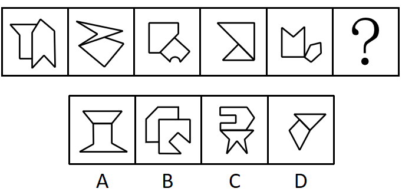

- **A**. A
- **B**. B　✅
- **C**. C
- **D**. D

**答案**：B

**官方解析**

元素组成不同，且无明显属性规律，考虑数量规律。观察发现，题干图形均由两个挨着的多边形构成，出现多边形优先考虑线数量，题干前五幅图多边形的边数量分别为（6，6）、（4，4）、（5，5）、（3，3）、（5，5），每幅图中两个封闭图形的边数相等，故？处两个多边形边数量也应相等，只有B项符合。
故正确答案为B。

---

### 第 8 题　qid 5893606 · 图形推理

从所给的四个选项中，选择最合适的一项填入问号处，使之呈现一定的规律性：

- **A**. A
- **B**. B
- **C**. C
- **D**. D　✅

**答案**：D

**官方解析**

元素组成不同，且无明显属性规律，观察发现，题干图形均由黑块和白块组成，且色块分布均匀，优先考虑黑白块面积。题干图形的黑块面积依次为整体图形面积的、、、、，故？处图形的黑块面积应为整个图形的面积，即整个图形全为黑色，只有D项符合。

故正确答案为D。

---

### 第 9 题　qid 5894974 · 图形推理

从所给的四个选项中，选择最合适的一项填入问号处，使之呈现一定的规律性：

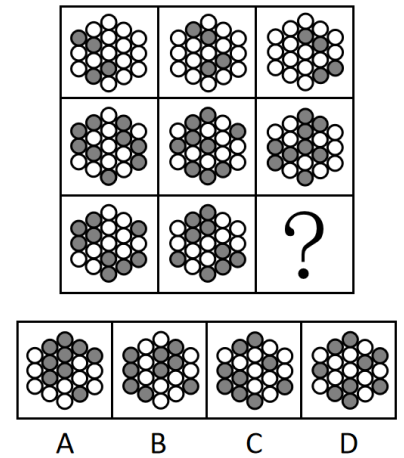

- **A**. A
- **B**. B　✅
- **C**. C
- **D**. D

**答案**：B

**官方解析**

解析一：九宫格每行元素组成相同，优先考虑位置规律。九宫格优先看横行，第一行图形中，图1所有黑球沿如下图所示方向往右上方移动一格后得图2。

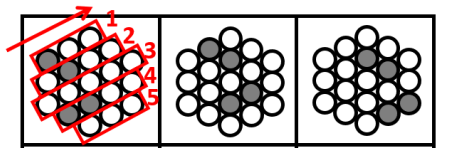

图2所有黑球沿如下图所示方向往右下方移动一格后得图3。

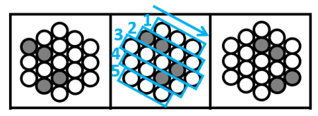

经验证，第二行满足相同的规律（到头循环走），如下图所示：

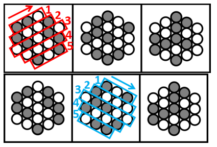

第三行应用规律，图1所有黑球沿如下图所示方向往右上方移动一格后得图2（到头循环走）。

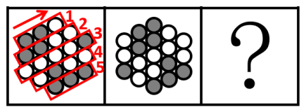

图2所有黑球沿如下图所示方向往右下方移动一格（到头循环走）得到B项。

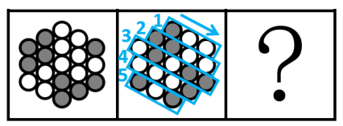

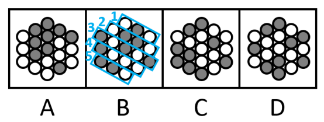

故正确答案为B。

解析二：九宫格每行元素组成相同，优先考虑位置规律。九宫格优先看横行，每横行相邻比较发现，相邻的两幅图都有一部分区域黑白球的位置摆放相同，如下图所示，以此类推，？处应选择一个和第三行图2拥有一部分区域黑白球的位置摆放相同的图形，只有B项符合。

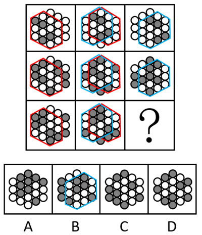

故正确答案为B。

备注：两种解析思路均可得出正确答案B，由于解析一考查的是全部黑球的平移规律，解析二相同的是部分区域，比较而言解析一的规律更为严谨，故粉笔更倾向于本题考查平移规律。

---

### 第 10 题　qid 5894980 · 图形推理

左图为13个白色正方体和5个灰色正方体组合而成的多面体，现用经A、B、C三个顶点的平面对该多面体进行切割，正确的截面是：

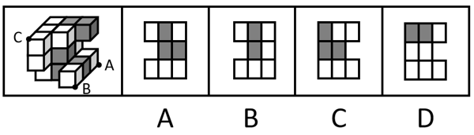

- **A**. A
- **B**. B　✅
- **C**. C
- **D**. D

**答案**：B

**官方解析**

本题考查截面图。根据平面公理“过不在一条直线上的三点，有且只有一个平面”得出A、B、C三个点可以确定一个唯一的截面，如下图所示：

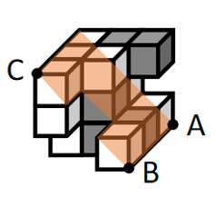

将截面上下翻转后即可得到如下截图：

故正确答案为B。

---

### 第 11 题　qid 5894887 · 图形推理

左图为15个白色正方体和3个灰色正方体组合而成的多面体，其可以由①、②、③三个多面体组合而成，问哪项能填入问号处？

- **A**. A　✅
- **B**. B
- **C**. C
- **D**. D

**答案**：A

**官方解析**

本题考查立体拼合。如下图所示，立体图可以由①、②以及A项拼合而成。

故正确答案为A。

---

### 第 12 题　qid 5893661 · 图形推理

左图为8个白色正方体和4个黑色正方体粘接而成的长方体，问以下哪一个不可能是其外表面展开图？

- **A**. A
- **B**. B
- **C**. C
- **D**. D　✅

**答案**：D

**官方解析**

将长方体的外表面依次标上序号，如下图所示，面e为正面、面f为顶面、面k为右侧面、面i为左侧面，面g为背面，面h为底面，逐一分析选项。

A项：展开图的6个面（如上图所示）与长方体的外表面一一对应，选项与题干一致，排除；

B项：展开图的6个面（如上图所示）与长方体的外表面一一对应，选项与题干一致，排除；

C项：展开图的6个面（如上图所示）与长方体的外表面一一对应，选项与题干一致，排除；

D项：展开图中左下角的面和右侧的面为无中生有的面，选项与题干不一致，当选。

本题为选非题，故正确答案为D。

---

### 第 13 题　qid 5893840 · 图形推理

把下面六个图形分为两类，使每一类图形都有各自的共同特征或规律，分类正确的一项是：

- **A**. ①②⑥，③④⑤
- **B**. ①③④，②⑤⑥
- **C**. ①③⑥，②④⑤　✅
- **D**. ①③⑤，②④⑥

**答案**：C

**官方解析**

本题为分组分类题目。题干每幅图形均由三个面和一个黑块拼接而成，考虑图形间关系。观察发现，题干中黑块与图形外框均相交于边，且图①③⑥中黑块与图形外框公共边的数量均为1，图②④⑤中黑块与图形外框公共边的数量均为2，即图①③⑥为一组，图②④⑤为一组。
故正确答案为C。

---

### 第 14 题　qid 5893637 · 图形推理

把下面六个图形分为两类，使每一类图形都有各自的共同特征或规律，分类正确的一项是：

- **A**. ①④⑤，②③⑥
- **B**. ①③④，②⑤⑥
- **C**. ①⑤⑥，②③④　✅
- **D**. ①②⑥，③④⑤

**答案**：C

**官方解析**

本题为分组分类题目。元素组成不同，且无明显属性规律，考虑数量规律。观察发现，题干图形被分割，考虑面数量，但面数量无规律，且框内有明显一笔构成的线条，考虑笔画数。图①⑤⑥均为两笔画图形，图②③④均为一笔画图形，故图①⑤⑥为一组，图②③④为一组。
故正确答案为C。

---

### 第 15 题　qid 5893648 · 图形推理

把下面的六个图形分为两类，使每一类图形都有各自的共同特征或规律，分类正确的一项是：

- **A**. ①②⑥，③④⑤
- **B**. ①④⑥，②③⑤
- **C**. ①③⑤，②④⑥
- **D**. ①②③，④⑤⑥　✅

**答案**：D

**官方解析**

本题为分组分类题目。元素组成不同，且无明显属性规律，考虑数量规律。题干图形明显被分割，优先考虑面数量，题干图形均有四个白块和一个黑块，不能分组；继续观察发现，题干图形均由几个图形拼接而成，还可以考虑图形间关系。题干图形均有一个黑块，图①②③中黑块均与4个白块存在公共边，图④⑤⑥中黑块均与3个白块存在公共边。即图①②③为一组，图④⑤⑥为一组。
故正确答案为D。

---

### 第 16 题　qid 5893775 · 定义判断

多级养殖是指根据物种代谢产物或残余有机质的利用价值及其在食物链中所处的级次，依次放养相应生物，多级次利用营养物质的一种养殖方式。
根据上述定义，下列属于多级养殖的是：

- **A**. 将养殖过江蓠的海水用于放养贝类，以利用其中繁殖的浮游生物；再将养殖过贝类的水用于放养对虾；再以对虾代谢分解的产物养殖藻类　✅
- **B**. 将鱼、虾、贝类与藻类放在同一水槽混养，其代谢产物会为藻类提供必要的营养要素，藻类的光合作用又产生更多的溶解氧
- **C**. 在一台浮筏上，于冬春季养殖海带；至夏秋季养殖海湾扇贝或石花菜，从而更好利用海况条件，满足市场需要
- **D**. 同一池塘中，鲢、鳙生活在上层，主食浮游生物；草鱼、鳊生活在中下层，主食草类；鲤、鲫生活在底层，主食底栖动物和有机碎屑

**答案**：A

**官方解析**

第一步：找出定义关键词。
“根据物种代谢产物或残余有机质的利用价值及其在食物链中所处的级次”、“依次放养相应生物”、“多级次利用营养物质”。
第二步：逐一分析选项。
A项：养殖江蓠的海水放养贝类，再利用养殖贝类的水放养对虾，再利用对虾代谢分解的产物养殖藻类，符合“根据物种代谢产物或残余有机质的利用价值及其在食物链中所处的级次”、“依次放养相应生物”、“多级次利用营养物质”，符合定义，当选；
B项：将鱼、虾、贝类与藻类放在同一水槽混养，不符合“依次放养相应生物”等，不符合定义，排除；
C项：冬春季养殖海带，至夏秋季养殖海湾扇贝或石花菜，不符合“根据物种代谢产物或残余有机质的利用价值及其在食物链中所处的级次”、“多级次利用营养物质”，不符合定义，排除；
D项：同一池塘中生活在不同层的生物，不符合“依次放养相应生物”、“多级次利用营养物质”，不符合定义，排除。
故正确答案为A。

---

### 第 17 题　qid 5893804 · 定义判断

复杂型消费行为是指消费者对价格昂贵，品牌差异大，功能复杂的商品，由于缺乏必要的商品知识，需要慎重选择，仔细对比，以求降低风险的购买行为；多变型消费行为是指如果消费者购买的商品价格低，可供选择的品牌很多时，他们并不花太多的时间选择品牌，而是经常变换品牌。
根据上述定义，下列说法正确的是：

- **A**. 老李给儿子换了十几个钢琴老师之后，发现还是第一个钢琴老师最好，于是一次性交了一年的学费。这属于复杂型消费行为
- **B**. 小明去超市买某品牌饼干，心想上次买了巧克力口味，这次买绿茶口味，下次再试一下夹心的。这属于多变型消费行为
- **C**. 老王打算买一辆越野车，网上查阅了各种型号参数，试驾了十几款品牌之后，才做出决定。这属于复杂型消费行为　✅
- **D**. 小丽逛街的时候本来只想买一条裤子，后来发现需要搭配一件合适的上衣和配套的手提包，所以买了全套。这属于多变型消费行为

**答案**：C

**官方解析**

第一步：找出定义关键词。
复杂型消费行为：“价格昂贵，品牌差异大，功能复杂的商品”、“慎重选择，仔细对比，以求降低购买风险”；
多变型消费行为：“价格低，可选品牌多的商品”、“不花太多的时间选择品牌，经常变换品牌”。
第二步：逐一分析选项。
A项：老李给儿子更换和对比了钢琴老师，但钢琴授课服务并不属于“功能复杂的商品”，不符合“价格昂贵，品牌差异大，功能复杂的商品”，不符合“复杂型消费行为”定义，排除；
B项：小明更换的是不同口味、类型的饼干，未体现变换品牌，不符合“不花太多的时间选择品牌，经常变换品牌”，不符合“多变型消费行为”定义，排除；
C项：老王购买越野车，其中越野车符合“价格昂贵，品牌差异大，功能复杂的商品”，老王试驾十几款品牌后才做决定，符合“慎重选择，仔细对比，以求降低购买风险”，符合“复杂型消费行为”定义，当选；
D项：小丽本来只想购买裤子，后为了搭配购买了全套，未体现价格是否昂贵，以及是否更换品牌，不符合“价格低，可选品牌多的商品”、“不花太多的时间选择品牌，经常变换品牌”，不符合“多变型消费行为”定义，排除。
故正确答案为C。

---

### 第 18 题　qid 5893535 · 定义判断

慢病也称为慢性非传染性疾病，是指长期的、不能自愈的、也几乎不能被治愈的疾病。慢病自我管理是指慢病患者主动监测自己的病情，以积极态度及行动，改善健康和情绪，通过对疾病的认识，学习与疾病长期共存。
根据上述定义，下列属于慢病自我管理的是：

- **A**. 老张在患了流感后多方查阅相关信息，每天监测血氧、心率、血压等指标，不做剧烈运动，避免着凉
- **B**. 老王因慢性肾功能衰竭需定期在医院进行透析治疗，医院为其建立了慢病管理档案，追踪监测肾功能等各项指标
- **C**. 老赵的父母都因胃癌去世，老赵深知该疾病的严重后果，每年全面体检一次，定期进行胃肠镜检查，不熬夜不喝酒，规律作息
- **D**. 患II型糖尿病的老李，平日生活格外谨慎，含糖量高的食物一概不碰，每天按时服药，定期监测血糖水平　✅

**答案**：D

**官方解析**

第一步：找出定义关键词。
慢病：“慢性非传染性疾病”、“长期的、不能自愈的、也几乎不能被治愈的疾病”；
慢病自我管理：“慢病患者主动监测自己的病情，积极改善健康和情绪，学习与疾病长期共存”。
第二步：逐一分析选项。
A项：“流感”属于传染性疾病，不符合“慢性非传染性疾病”，不符合“慢病”定义，因此也不符合“慢病自我管理”定义，排除；
B项：医院为老王建立慢病管理档案并追踪监测肾功能等各项指标，不是患者老王监测自己的病情，不符合“慢病患者主动监测自己的病情，积极改善健康和情绪，学习与疾病长期共存”，不符合“慢病自我管理”定义，排除；
C项：老赵并没有患病，不是患者，不符合“慢病患者主动监测自己的病情，积极改善健康和情绪，学习与疾病长期共存”，不符合“慢病自我管理”定义，排除；
D项：II型糖尿病属于慢性非传染性疾病，患II型糖尿病的老李按时服药，定期监测血糖水平，符合“慢病患者主动监测自己的病情，积极改善健康和情绪，学习与疾病长期共存”，符合“慢病自我管理”定义，当选。
故正确答案为D。

---

### 第 19 题　qid 5893605 · 定义判断

人际关系图，是用一套特定的符号来表示团体内成员之间各种关系的图形。依据前期的调查，将团体成员的关系分为“吸引”“排斥”“无关”三类。图中圆圈内的字母是团体内每一成员的代号。实线与虚线表示相互关系，其中实线表示吸引关系，虚线表示排斥关系，箭头表示方向（例如：表示A受B吸引，表示A排斥B），其中被实线箭头指向最多的人，就是处于团体中心位置的人。

根据上述定义，对下图的判断正确的是：

- **A**. 该团体中没有相互排斥的人　✅
- **B**. C是处于团体中心位置的人
- **C**. F是该团体中受排斥最多的人
- **D**. H和B是相互吸引的人

**答案**：A

**官方解析**

第一步：找出定义关键词。

实线：“表示吸引关系”；

虚线：“表示排斥关系”；

：“表示A受B吸引”；

：“表示A排斥B”；

团体中心位置的人：“被实线箭头指向最多的人”。

第二步：逐一分析选项。

A项：题干图示中没有双向虚线箭头，根据“虚线表示排斥关系”可知，该团体中没有相互排斥的人，表述正确，当选；

B项：题干图示中C被四个实线箭头指向，而B被五个实线箭头指向，根据“被实线箭头指向最多的人”可知，B是处于团体中心位置的人，而不是C，表述错误，排除；

C项：题干图示中F没有被虚线箭头指向，根据“虚线表示排斥关系”可知，F没有受到排斥，表述错误，排除；

D项：题干图示中H和B没有直接的双向实线关系，根据“实线表示吸引关系”可知，H和B不是相互吸引的人，表述错误，排除。

故正确答案为A。

---

### 第 20 题　qid 5893821 · 定义判断

电子测量是指利用电子技术为测量手段，进行电的或非电的各种测量，主要分两类：电参量的测量，是指对用电设备中用电参数的测量；非电参量的测量，是指通过不同类型的传感器将物理的、化学的、机械的非电参量转换成电信号，然后利用电子技术测出其相应的电参量，最后将其折合成非电参量数据。
根据上述定义，下列电子测量与其他三项类型不同的是：

- **A**. 利用电子仪表测量某机房电路的电压、电流　✅
- **B**. 用电子天平称出物体的重量
- **C**. 声波使话筒内的驻极体薄膜振动，产生随之变化的电压，这一电压被数据采集器接收，用于测量声音的振动频率
- **D**. 将电极放到体表采集患者心脏活动的电信号，经过放大传输到机器后形成心电图

**答案**：A

**官方解析**

第一步：找出定义关键词。
电参量的测量：“对用电设备中用电参数的测量”；
非电参量的测量：“通过不同类型的传感器将物理的、化学的、机械的非电参量转换成电信号”、“利用电子技术测出其相应的电参量并将其折合成非电参量数据”。
第二步：逐一分析选项。
A项：利用电子仪表测量某机房电路的电压、电流，符合“对用电设备中用电参数的测量”，符合“电参量的测量”定义；
B项：用电子天平称出物体的重量，是利用电磁力平衡测量被称物体的重力，符合“通过不同类型的传感器将物理的非电参量转换成电信号”、“利用电子技术测出其相应的电参量并将其折合成非电参量数据”，符合“非电参量的测量”定义；
C项：声波使话筒内的驻极体薄膜振动，产生随之变化的电压并被数据采集器接收，符合“通过不同类型的传感器将物理的非电参量转换成电信号”，用于测量声音的振动频率，符合“利用电子技术测出其相应的电参量并将其折合成非电参量数据”，符合“非电参量的测量”定义；
D项：通过电极采集心脏活动的电信号，符合“通过不同类型的传感器将物理的非电参量转换成电信号”，再经过放大传输到机器后形成心电图，符合“利用电子技术测出其相应的电参量并将其折合成非电参量数据”，符合“非电参量的测量”定义。
综上，A项为“电参量的测量”，B、C、D三项均为“非电参量的测量”，只有A项和其他三项不同。
本题为选非题，故正确答案为A。

---

### 第 21 题　qid 5893813 · 类比推理

总被引频次是指期刊自创刊以来登载的全部论文在统计当年被引用的总次数。扩散因子是一个用于评估期刊影响力的学术指标，显示总被引频次扩散的范围，具体意义为期刊当年每被引100次所涉及的期刊数，即扩散因子。

甲刊：创刊于1980年，2022年总被引频次为2000，涉及期刊800种

乙刊：创刊于2000年，2022年总被引频次为1500，涉及期刊500种

丙刊：创刊于2020年，2022年总被引频次为200，涉及期刊60种

根据定义，在2022年，上述三种期刊按照扩散因子由大到小排序正确的是：

- **A**. 丙、甲、乙
- **B**. 丙、乙、甲
- **C**. 乙、丙、甲
- **D**. 甲、乙、丙　✅

**答案**：D

**官方解析**

第一步：找出定义关键词。

总被引频次：“期刊自创刊以来登载的全部论文在统计当年被引用的总次数”；

扩散因子：“期刊当年每被引100次所涉及的期刊数”、“扩散因子”。

第二步：逐一分析选项。

甲刊扩散因子；

乙刊扩散因子；

丙刊扩散因子。

综上，三种期刊按照扩散因子由大到小排序应为甲、乙、丙。

故正确答案为D。

---

### 第 22 题　qid 5893807 · 定义判断

动态描写法是指记叙文中对人物、景物作运动状态的描写，创造具体而栩栩如生的形象的一种描写方法。动态描写法包括两类：一类是对运动着的景物的描写，一类是对静物所作的动态描写。动态描写法的目的在于赋予客观事物以运动感、活力感、变化感，克服形象的单调性，丰富形象的多样性，达到更好地表现事物、感染读者的艺术效果。
根据上述定义，下列没有体现动态描写法的是：

- **A**. 有的松树望穿秋水，不见你来，独自上到高处，斜着身子张望
- **B**. 夜阑人静，家养的大黄狗趴在院子里安静地睡了　✅
- **C**. 七股大水，从水库的桥孔跃出，仿佛七幅闪光的黄锦，直铺下去
- **D**. 一轮杏黄色的满月，悄悄从山嘴处爬出来，把倒影投入湖水中

**答案**：B

**官方解析**

第一步：找出定义关键词。
“对运动着的景物的描写”、“对静物所作的动态描写”、“目的在于赋予客观事物以运动感、活力感、变化感”。
第二步：逐一分析选项。
A项：该项中“松树上到高处，斜着身子张望”，将静态的松树写成动态，而且赋予它情感，生动形象地描绘了松树婀娜多姿的风貌，符合“对静物所作的动态描写”、“目的在于赋予客观事物以运动感、活力感、变化感”，符合定义，排除；
B项：该项中“大黄狗趴在院子里安静地睡了”，未体现动态的表达，大黄狗只是处于静止状态趴在院子里，不符合“对运动着的景物的描写”、“对静物所作的动态描写”、“目的在于赋予客观事物以运动感、活力感、变化感”，不符合定义，当选；
C项：该项中“水从桥孔跃出”，将动态的水描写得生动、壮观、有气势，符合“对运动着的景物的描写”、“目的在于赋予客观事物以运动感、活力感、变化感”，符合定义，排除；
D项：该项中“满月从山嘴处爬出来”，将月亮升起的动态生动地描绘出来，符合“对运动着的景物的描写”、“目的在于赋予客观事物以运动感、活力感、变化感”，符合定义，排除。
本题为选非题，故正确答案为B。

---

### 第 23 题　qid 5893778 · 定义判断

附性法推理是指将同一属性分别附加在原命题的主项和谓项前面，从而形成一个新命题的推理方法，以公式表示即为：“所有S（主项）是P（谓项）所有NS是NP”（其中“N”表示某种属性）。运用这种推理必须遵守的规则是：①原命题必须断定了某个类别的所有事物的某种共性；②附加的属性概念必须保持含义的同一；③结论中的主谓项关系应与前提中的主谓项关系相同。

根据上述定义，下列符合附性法推理规则的是：

- **A**. 蝴蝶是昆虫，所以，色彩斑斓的蝴蝶是色彩斑斓的昆虫　✅
- **B**. 教师是人，所以，老教师是老人
- **C**. 有些诗人是画家，所以，有些女诗人是女画家
- **D**. 音乐家是人，所以，无天赋的音乐家是无天赋的人

**答案**：A

**官方解析**

第一步：找出定义关键词。
“原命题必须断定了某个类别的所有事物的某种共性”、“附加的属性概念必须保持含义的同一”、“结论中的主谓项关系应与前提中的主谓项关系相同”。
第二步：逐一分析选项。
A项：蝴蝶是昆虫，所以，色彩斑斓的蝴蝶是色彩斑斓的昆虫，蝴蝶和昆虫前附加的“色彩斑斓”含义均是色彩灿烂的样子，符合“原命题必须断定了某个类别的所有事物的某种共性”、“附加的属性概念必须保持含义的同一”、“结论中的主谓项关系应与前提中的主谓项关系相同”，符合定义，当选；
B项：老教师中的“老”含义是经验丰富，老人中的“老”含义是上了年纪，两者含义不同，不符合“附加的属性概念必须保持含义的同一”，不符合定义，排除；
C项：有些诗人是画家，不符合“原命题必须断定了某个类别的所有事物的某种共性”，不符合定义，排除；
D项：无天赋的音乐家中的“无天赋”含义是在音乐领域没有天赋，无天赋的人中的“无天赋”含义是在所有领域没有天赋，两者含义不同，不符合“附加的属性概念必须保持含义的同一”，不符合定义，排除。
故正确答案为A。

---

### 第 24 题　qid 5893555 · 定义判断

中医七方指的是大方、小方、缓方、急方、奇方、偶方、复方七种方剂的总称。其中缓方是指药性缓和，治疗病势缓慢需长期服用的方剂；急方是指药性峻猛，治疗病势急重急于取效的方剂；奇方是指单数药物组成的方剂；偶方是指双数药物组成的方剂。
根据上述定义，下列既属于缓方又属于偶方的是：

- **A**. 参附汤：人参15克、附子30克，有回阳、益气、固脱之功，常用于元气大亏、阳气暴脱之症
- **B**. 甘草汤：甘草6克，主治少阴咽痛，兼治舌肿，有清热解毒之功效
- **C**. 四君子汤：人参、甘草、茯苓、白术各等分，主治脾胃气虚证，症见面色萎黄、语声低微、气短乏力等　✅
- **D**. 生脉散：人参9克、麦门冬9克、五味子6克，为补益剂，具有益气生津、敛阴止汗之功效

**答案**：C

**官方解析**

第一步：找出定义关键词。
缓方：“药性缓和”、“治疗病势缓慢需长期服用的方剂”；
急方：“药性峻猛”、“治疗病势急重急于取效的方剂”；
奇方：“单数药物组成的方剂”；
偶方：“双数药物组成的方剂”。
第二步：逐一分析选项。
A项：参附汤：人参15克、附子30克，符合“双数药物组成的方剂”，符合“偶方”定义；常用于元气大亏、阳气暴脱之症，说明其适用于病势急重的病症，不符合“治疗病势缓慢需长期服用的方剂”，不符合“缓方”定义，排除；
B项：甘草汤：甘草6克，不符合“双数药物组成的方剂”，不符合“偶方”定义，排除；
C项：四君子汤：人参、甘草、茯苓、白术各等分，符合“双数药物组成的方剂”，符合“偶方”定义；主治脾胃气虚证，症见面色萎黄、语声低微、气短乏力等，说明其适用于病势缓慢的病症，符合“治疗病势缓慢需长期服用的方剂”，符合“缓方”定义，当选；
D项：生脉散：人参9克、麦门冬9克、五味子6克，不符合“双数药物组成的方剂”，不符合“偶方”定义，排除。
故正确答案为C。

---

### 第 25 题　qid 5893817 · 定义判断

在图书馆统计指标中，文献流通数是指实际被阅读者借阅、利用的文献数。文献流通率是指文献流通数与馆藏中提供流通的文献数的比率。文献利用率是指文献流通数与馆藏文献总数的比率。文献拒借率是指读者未能借到的文献数与读者合理要求借阅的文献数的比率，即索书条拒借数占索书条总数的百分比。文献保障率是指图书馆提供读者借阅、利用的文献数与图书馆拥有的读者数的比率。
根据上述定义，下列说法正确的是：

- **A**. 对一个图书馆来说，文献流通率一定不低于文献利用率　✅
- **B**. 对一个图书馆来说，文献流通率反映了图书馆馆藏文献的规模及读者的需求
- **C**. 当文献拒借率越高时，文献保障率就越低
- **D**. 文献流通数越多而馆藏中提供流通的文献数越少，文献利用率就越高

**答案**：A

**官方解析**

第一步：找出定义关键词。

文献流通数：“实际被阅读者借阅、利用的文献数”；

文献流通率：“文献流通数与馆藏中提供流通的文献数的比率”；

文献利用率：“文献流通数与馆藏文献总数的比率”；

文献拒借率：“读者未能借到的文献数与读者合理要求借阅的文献数的比率”、“索书条拒借数占索书条总数的百分比”；

文献保障率：“图书馆提供读者借阅、利用的文献数与图书馆拥有的读者数的比率”。

第二步：逐一分析选项。

A项：文献流通率，文献利用率，二者的分子相同，但馆藏中提供流通的文献数一定小于或等于馆藏文献总数，即文献流通率的分母一定小于或等于文献利用率的分母，故文献流通率一定不低于文献利用率，说法正确，当选；

B项：文献流通率，无法体现图书馆馆藏文献的规模及读者的需求，说法错误，排除；

C项：文献拒借率，文献保障率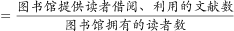，文献拒借率越高时，无法确定文献保障率的高低，说法错误，排除；

D项：文献利用率，当文献流通数越多而馆藏中提供流通的文献数越少时，因不确定馆藏文献总数的情况，故无法确定文献利用率的高低，说法错误，排除。

故正确答案为A。

---

### 第 26 题　qid 5893812 · 类比推理

卫冕：夺冠

- **A**. 庄园：田园
- **B**. 追讨：诉讼
- **C**. 续约：签约　✅
- **D**. 姓名：笔名

**答案**：C

**官方解析**

第一步：判断题干词语间逻辑关系。
卫冕指竞赛中保住上次获得的冠军称号，所以卫冕是再次夺冠，二者为对应关系。
第二步：判断选项词语间逻辑关系。
A项：庄园指封建主占有和经营的大片地产，田园指田地和园圃，借指农村，二者不是对应关系，与题干逻辑关系不一致，排除；
B项：追讨指追赶讨伐，诉讼指司法机关在案件当事人和其他有关人员的参与下，按照法定程序解决案件时所进行的活动，俗称“打官司”，二者无明显逻辑关系，与题干逻辑关系不一致，排除；
C项：续约指合同、合约期满后继续签约，所以续约是再次签约，二者为对应关系，与题干逻辑关系一致，当选；
D项：姓名指人的姓氏和名字，笔名指作者发表作品时用的别名，二者不是对应关系，与题干逻辑关系不一致，排除。
故正确答案为C。

---

### 第 27 题　qid 5893567 · 类比推理

花生壳：核桃仁

- **A**. 刺梨汁：桃花扇
- **B**. 丝瓜络：石榴籽　✅
- **C**. 杏仁露：葡萄皮
- **D**. 葛根茶：芡实粉

**答案**：B

**官方解析**

第一步：判断题干词语间逻辑关系。
“花生壳”是花生的组成部分；“核桃仁”是核桃的组成部分，二者都是组成各自植物果实的一部分。
第二步：判断选项词语间逻辑关系。
A项：“刺梨汁”是一种以刺梨为原材料制成的果汁；“桃花扇”是指扇面上画有桃花的扇子，二者不是组成各自植物果实的一部分，与题干逻辑关系不一致，排除；
B项：“丝瓜络”是干燥成熟丝瓜的网状纤维，“丝瓜络”是丝瓜的组成部分；“石榴籽”是石榴的组成部分，二者都是组成各自植物果实的一部分，与题干逻辑关系一致，当选；
C项：“杏仁露”是一种以杏仁为原材料制成的饮料；“葡萄皮”是葡萄的组成部分，与题干逻辑关系不一致，排除；
D项：“葛根茶”是一种以葛根为原材料制成的茶饮料；“芡实粉”是一种以芡实为原材料磨成的粉，与题干逻辑关系不一致，排除。
故正确答案为B。

---

### 第 28 题　qid 5893570 · 类比推理

诛禁不当：反受其央

- **A**. 为者常成：行者常至
- **B**. 君子检身：常若有过
- **C**. 其身不正：虽令不从　✅
- **D**. 麻雀虽小：五脏俱全

**答案**：C

**官方解析**

第一步：判断题干词语间逻辑关系。
诛禁不当，反受其央，意思是惩罚得不恰当，反而受其祸害。因为诛禁不当，所以反受其央，二者是因果对应关系。
第二步：判断选项词语间逻辑关系。
A项：为者常成，行者常至，意思是努力去做的人常常可以成功，不倦前行的人常常可以达到目的，二者是并列关系，与题干逻辑关系不一致，排除；
B项：君子检身，常若有过，意思是君子要时时反省检查自己，就像自己经常会有缺点过失那样，二者不是因果对应关系，与题干逻辑关系不一致，排除；
C项：其身不正，虽令不从，意思是在上位的管理者本身言行不正，即使发出命令，大家也不会服从遵守。因为其身不正，所以虽令不从，二者是因果对应关系，与题干逻辑关系一致，当选；
D项：麻雀虽小，五脏俱全，比喻事物的体积或规模虽小，具备的内容却很齐全，二者不是因果对应关系，与题干逻辑关系不一致，排除。
故正确答案为C。

---

### 第 29 题　qid 5893819 · 类比推理

明辨是非：静待成败

- **A**. 判若云泥：开释左右
- **B**. 洞鉴古今：博观始终　✅
- **C**. 一争高低：弱肉强食
- **D**. 惩恶劝善：天差地别

**答案**：B

**官方解析**

第一步：判断题干词语间逻辑关系。
“明辨是非”指把是非分清楚，“静待成败”指安静地等待成功或失败，二者没有明显的语义关系，考虑拆分，两个词语中的第三个字和第四个字（即“是”和“非”、“成”和“败”）均是反义关系。
第二步：判断选项词语间逻辑关系。
A项：“判若云泥”指高低差别好像天上的云彩和地下的泥土的距离那样远，形容差别极大，“开释左右”指用劝慰、开导的话消除对方的忧愁、疑虑和烦恼，但第一个词语中的第三个字和第四个字（即“云”和“泥”）并不是反义关系，与题干逻辑关系不一致，排除；
B项：“洞鉴古今”指深入透彻地了解历史与现实世事，“博观始终”指广博地观察事物的始终，两个词语中的第三个字和第四个字（即“古”和“今”、“始”和“终”）均是反义关系，与题干逻辑关系一致，当选；
C项：“一争高低”指争一争，谁的本事高，“弱肉强食”指动物中弱者被强者吃掉，泛指弱者被强者欺凌、吞并，但第二个词语中的第三个字和第四个字（即“强”和“食”）并不是反义关系，与题干逻辑关系不一致，排除；
D项：“惩恶劝善”指惩罚坏人，奖励好人，“天差地别”指两种或多种事物之间的差距很大，就像天和地之间的距离一样，但两个词语中的第三个字和第四个字（即“劝”和“善”、“地”和“别”）均不是反义关系，与题干逻辑关系不一致，排除。
故正确答案为B。

---

### 第 30 题　qid 5893549 · 类比推理

蚜虫：七星瓢虫：小麦

- **A**. 蛇：鸟：谷子
- **B**. 稗草：螳螂：水稻
- **C**. 蚊子：青蛙：高粱
- **D**. 老鼠：黄鼬：玉米　✅

**答案**：D

**官方解析**

第一步：判断题干词语间逻辑关系。
蚜虫会吸食小麦的汁液，二者为捕食者与被捕食对象的对应关系；七星瓢虫会捕食蚜虫，二者为捕食者与被捕食对象的对应关系。
第二步：判断选项词语间逻辑关系。
A项：有的蛇会吃鸟，有的鸟会吃蛇，二者是相互捕食的对应关系，与题干逻辑关系不一致，排除；
B项：稗草是一种常见的田间杂草，会和水稻竞争稻田里的资源，二者是竞争关系，并非捕食者与被捕食对象的对应关系，与题干逻辑关系不一致，排除；
C项：蚊子和高粱没有必然关系，与题干逻辑关系不一致，排除；
D项：老鼠吃玉米，二者为捕食者与被捕食对象的对应关系；黄鼬即黄鼠狼，会捕食老鼠，二者为捕食者与被捕食对象的对应关系，与题干逻辑关系一致，当选。
故正确答案为D。

---

### 第 31 题　qid 5893534 · 类比推理

感想：主观性：体会

- **A**. 典范：示范性：表率　✅
- **B**. 发明：创造性：方法
- **C**. 泥土：可塑性：材料
- **D**. 规律：普适性：定理

**答案**：A

**官方解析**

第一步：判断题干词语间逻辑关系。
感想是指由接触外界事物而引起的思想反应，体会指的是体验领会，二者为近义关系；感想和体会均具有主观性，与第二个词构成必然属性对应关系。
第二步：判断选项词语间逻辑关系。
A项：典范是指可以作为学习、仿效标准的人或事物，表率是指好的榜样，二者为近义关系；典范和表率均具有示范性，与第二个词构成必然属性对应关系，与题干逻辑关系一致，当选；
B项：发明需要一定的方法，二者为对应关系，与题干逻辑关系不一致，排除；
C项：泥土是一种材料，二者为种属关系；材料不一定具有可塑性，与第二个词构成或然属性对应关系，与题干逻辑关系不一致，排除；
D项：规律是指事物之间的内在必然联系，定理是指已经证明具有正确性、可以作为原则或规律的命题或公式，定理是规律的一种，二者为种属关系，与题干逻辑关系不一致，排除。
故正确答案为A。

---

### 第 32 题　qid 5893822 · 类比推理

自发裂变：核裂变：诱发裂变

- **A**. 波浪能：太阳能：可再生能源
- **B**. 铁路交通：现代交通：公路交通
- **C**. 贸易逆差：贸易平衡：贸易顺差
- **D**. 负有理数：负实数：负无理数　✅

**答案**：D

**官方解析**

第一步：判断题干词语间逻辑关系。
“核裂变”是指由重的原子核分裂成两个或多个质量较小的原子的一种核反应形式。“核裂变”分为“自发裂变”和“诱发裂变”两种。前者指在无外部激发情况下，重核自发裂变；后者指重核受到中子或其它粒子激发而发生的裂变。因此，第一词和第三词为矛盾关系，与第二词均为种属关系。
第二步：判断选项词语间逻辑关系。
A项：“波浪能”和“太阳能”都是“可再生能源”的一种，前两词为反对关系，与第三词均为种属关系，与题干逻辑关系不一致，排除；
B项：“铁路交通”和“公路交通”都是“现代交通”的一种，第一词和第三词为反对关系，与第二词均为种属关系，与题干逻辑关系不一致，排除；
C项：“贸易逆差”指进口总值大于出口总值，“贸易平衡”指出口总值与进口总值相等，“贸易顺差”指出口总值大于进口总值，三者为反对关系，与题干逻辑关系不一致，排除；
D项：“负实数”分为“负有理数”和“负无理数”，第一词和第三词为矛盾关系，与第二词均为种属关系，与题干逻辑关系一致，当选。
故正确答案为D。

---

### 第 33 题　qid 5893820 · 类比推理

轮作休耕：耕地保护：严禁占用

- **A**. 植树造林：碳中和：节能减排　✅
- **B**. 登月计划：空间站：太空探索
- **C**. 商品交换：国际贸易：技术服务
- **D**. 观众评选：荣获大奖：出类拔萃

**答案**：A

**官方解析**

第一步：判断题干词语间逻辑关系。
轮作休耕和严禁占用的目的都是耕地保护，第一个词和第三个词分别与第二个词构成方式目的的对应关系。
第二步：判断选项词语间逻辑关系。
A项：植树造林和节能减排的目的都是实现碳中和，第一个词和第三个词分别与第二个词构成方式目的的对应关系，与题干逻辑关系一致，当选；
B项：空间站是在近地轨道上运行的载人航天器，可以在登月计划中发挥作用，但登月计划的目的不是空间站，前两个词不是方式目的的对应关系，与题干逻辑关系不一致，排除；
C项：国际贸易是指商品和劳务的国际交换活动，国际贸易是商品交换的一种形式，前两个词不是方式目的的对应关系，与题干逻辑关系不一致，排除；
D项：观众评选的目的不是荣获大奖，前两个词不是方式目的的对应关系，与题干逻辑关系不一致，排除。
故正确答案为A。

---

### 第 34 题　qid 5893815 · 类比推理

领头雁 对于 （    ） 相当于 （    ） 对于 先驱

- **A**. 领导者；拓荒牛　✅
- **B**. 鸟类；革命
- **C**. 迁徙；先锋
- **D**. 出头鸟；先行者

**答案**：A

**官方解析**

逐一代入选项。
A项：领头雁比喻在众人眼里有一定的号召力和领导能力，具有榜样力量的人，与领导者构成比喻象征关系；拓荒牛比喻开拓创新的先行者，先驱指前行开路的人，二者构成比喻象征关系，前后逻辑关系一致，当选；
B项：领头雁是鸟类，二者为种属关系；革命的先驱，二者为偏正关系，前后逻辑关系不一致，排除；
C项：迁徙是领头雁的一种习性，二者为对应关系；先锋指行军或作战时的先遣将领或先头部队，先驱指前行开路的人，二者为近义关系，前后逻辑关系不一致，排除；
D项：领头雁比喻在众人眼里有一定的号召力和领导能力，具有榜样力量的人，出头鸟比喻表现突出或领头的人，也比喻因出头露面而招人注目的人，二者是并列关系；先行者指首先倡导的人，先驱指前行开路的人，二者是近义/全同关系，前后逻辑关系不一致，排除。
故正确答案为A。

---

### 第 35 题　qid 5893582 · 类比推理

重型战机 对于 （    ） 相当于 （    ） 对于 分辨率

- **A**. 隐形战机 清晰度
- **B**. 战斗机 性能指标
- **C**. 轻型战机 订单量
- **D**. 载弹量 显示器　✅

**答案**：D

**官方解析**

逐一代入选项。
A项：重型战机是指战斗机中体型相对较大，航程相对较远，载弹量相对较大的战斗机，隐形战机是指雷达一般探测不到的战斗机，有的重型战机是隐形战机，有的重型战机不是隐形战机，有的隐形战机是重型战机，有的隐形战机不是重型战机，二者是交叉关系；分辨率是表征清晰度的一个因素，二者是对应关系，前后逻辑关系不一致，排除；
B项：重型战机是指战斗机中体型相对较大，航程相对较远，载弹量相对较大的战斗机，二者是种属关系；分辨率是一种性能指标，二者是种属关系，但顺序反了，前后逻辑关系不一致，排除；
C项：重型战机与轻型战机是并列关系；分辨率可能会影响订单量，二者为对应关系，前后逻辑关系不一致，排除；
D项：载弹量是重型战机的一个性能指标，二者为对应关系；分辨率是显示器的一个性能指标，二者为对应关系，前后逻辑关系一致，当选。
故正确答案为D。

---

### 第 36 题　qid 5893814 · 逻辑判断

冰雪旅游是利用冰雪气候资源体验冰雪文化的旅游活动，包括冰雪观光演艺、运动竞技等内容。H地区冰雪旅游开展了五年，调查显示：在近万名受访者中，有90%的人曾以不同形式体验过冰雪旅游，平均每年有65%的人体验过1~2次冰雪旅游，有25%的人体验过3~4次，且这一比例逐年升高。这说明H地区冰雪旅游的需求较高，常态化多次消费正成为H地区越来越多人的选择。
以下哪项如果为真，最能削弱上述结论？

- **A**. 参与调查的受访者几乎都是了解或喜爱冰雪旅游的年轻人　✅
- **B**. 近五年，H地区冰雪旅游产业的年均投资额接近，没有增加
- **C**. H地区位于北半球北部，冬季较长，许多游客会来此体验冰雪旅游
- **D**. 为扩大宣传，H地区许多冰雪项目会推出优惠组合套餐，吸引人们多次消费

**答案**：A

**官方解析**

第一步：找出论点和论据。
论点：H地区冰雪旅游的需求较高，常态化多次消费正成为H地区越来越多人的选择。
论据：在近万名受访者中，有90%的人曾以不同形式体验过冰雪旅游，平均每年有65%的人体验过1~2次冰雪旅游，有25%的人体验过3~4次，且这一比例逐年升高。
本题通过调查受访者进行冰雪旅游的次数，得出H地区冰雪旅游需求较高，越来越多的人会常态化多次消费的结论，论点论据话题不一致，削弱优先考虑拆桥，即不能通过“受访者冰雪旅游次数增多”推出“H地区冰雪旅游需求较高，越来越多的人会常态化多次消费”。
第二步：逐一分析选项。
A项：选项说的是参与调查的受访者几乎都是了解或喜爱冰雪旅游的年轻人，调查的都是原本就喜爱冰雪旅游的人，那么通过受访者的冰雪旅游次数，无法得出H地区冰雪旅游需求的真实情况，为拆桥项，可以削弱，当选；
B项：选项说的是近五年H地区冰雪旅游产业的年均投资额接近，与论点讨论的选择冰雪旅游的人数是否增加无关，为无关项，无法削弱，排除；
C项：论点说的是H地区的人旅游需求高，该项说的是许多游客来H地区体验冰雪旅游，主体不一致，无法削弱，排除；
D项：选项说的是H地区许多冰雪项目推出的优惠组合套餐会吸引人们多次消费，解释了为什么越来越多的人会常态化多次消费，补充论据进行加强，无法削弱，排除。
故正确答案为A。

---

### 第 37 题　qid 5893806 · 逻辑判断

多重宇宙理论通常也称为平行宇宙理论，该理论认为有无数个宇宙与我们所在的宇宙并存，虽然我们无法意识到这一点。这些宇宙可能与我们所处的宇宙截然不同，但也可能与我们的宇宙极其相似，在更广的意义上，要证明多重宇宙存在远比单纯想象它困难得多。甚至从一开始，有一部分科学家就认为这个理论称不上是“真正意义上的科学”。因为没有人能证明多重宇宙理论是错误的——即它无法被证伪。
以下哪项可能是上述科学家论证的前提？

- **A**. 平行宇宙理论至今未获证实，只是单纯的想象
- **B**. 只有能被证伪的理论，才能称得上是“真正意义上的科学”　✅
- **C**. 平行宇宙理论即使变成现实，对于人类的文明进步也未必是坏事
- **D**. 如果平行宇宙的数量足够多，那可能意味着在我们认为的虚拟世界中发生的事情也会真实地发生在平行宇宙中

**答案**：B

**官方解析**

第一步：找出论点和论据。
论点：多重宇宙理论称不上是“真正意义上的科学”。
论据：没有人能证明多重宇宙理论是错误的——即它无法被证伪。
论点讨论的是“多重宇宙理论”和“真正意义上的科学”的关系，论据讨论的是“多重宇宙理论”和“被证伪”的关系，论点和论据话题不一致，且提问方式为“前提”，加强优先考虑搭桥，即建立“被证伪”和“真正意义上的科学”之间的联系。
第二步：逐一分析选项。
A项：该项说的是平行宇宙理论至今未获证实，与论据讨论的平行宇宙理论是否能被证伪无关，也与论点讨论的平行宇宙理论是否能称得上是“真正意义上的科学”无关，无法加强，排除；
B项：该项说的是只有能被证伪的理论，才能称得上是“真正意义上的科学”，即建立了“被证伪”和“真正意义上的科学”之间的联系，为搭桥项，是论证成立的前提，可以加强，当选；
C项：该项说的是平行宇宙理论对于人类文明的影响，与论点讨论的平行宇宙理论是否能称得上是“真正意义上的科学”无关，话题不一致，无法加强，排除；
D项：该项说的是如果平行宇宙的数量足够多会出现的情况，与论点讨论的平行宇宙理论是否能称得上是“真正意义上的科学”无关，话题不一致，无法加强，排除。
故正确答案为B。

---

### 第 38 题　qid 5893688 · 逻辑判断

在过去，药物的研发主要来自于陆地生物，这与陆地生物更被熟知且容易获得有关。近几十年来，越来越多的药物开始从海洋生物中产生，海洋生态环境极具复杂性，因而海洋生物相比于陆地生物有着更为广泛的多样性。有人据此认为，海洋生物产业潜力巨大，海洋生物更有可能是未来新型抗生素、抗癌药物的来源。
以下除哪项外，均能支持上述观点？

- **A**. 目前抗生素都来源于陆地微生物，病菌耐药性不断上升，而海洋微生物药物已经对一些感染性疾病提供了替代性疗法
- **B**. 借助计算机工具，人们已经将庞大的生物基因组库和具有生物活性的化合物库进行关联，用以探索新药物　✅
- **C**. 一些海洋生物如鲸、鲨等终身不得癌症，有近300种海洋生物含有抗肿瘤物质，它们是研究抗癌药物的重要资源
- **D**. 当前已经发现的3.5万个海洋天然产物中有一半以上都具有生物活性，还有更多数以万计的未知海洋天然产物亟待开发

**答案**：B

**官方解析**

第一步：找出论点和论据。
论点：海洋生物产业潜力巨大，海洋生物更有可能是未来新型抗生素、抗癌药物的来源。
论据：近几十年来，越来越多的药物开始从海洋生物中产生，海洋生态环境极具复杂性，因而海洋生物相比于陆地生物有着更为广泛的多样性。
本题论点说的是“海洋生物”更有可能是“未来抗生素、抗癌药物的来源”，论据是越来越多的“药物”开始从“海洋生物”中产生，且海洋生物有着更为广泛的多样性。论点论据话题一致，因为本题是选非题，找到可加强的选项排除即可。
第二步：逐一分析选项。
A项：该项指出陆地微生物生产抗生素的不足，而海洋微生物提供了替代性疗法，举例说明海洋微生物确实可能是新型抗生素的来源，补充论据，可以加强，排除；
B项：该项说明人们将庞大的“生物基因组库”和“具有生物活性的化合物库”进行关联，用以探索新药物，并未说明“海洋生物”是否是“未来抗生素，抗癌药物的来源”，话题不一致，无法加强，当选；
C项：该项用“鲸、鲨”等海洋生物终身不得癌症，并且有近300种海洋生物含有抗肿瘤物质，举例说明海洋生物是研究抗癌药物的重要资源，补充论据，可以加强，排除；
D项：该项说明大量海洋天然产物具有生物活性，还有很多海洋天然产物亟待开发，这就说明海洋生物产业潜力巨大，补充论据，可以加强，排除。
本题为选非题，故正确答案为B。

---

### 第 39 题　qid 5893809 · 逻辑判断

研究中，实验组小鼠每天晚上接受两小时的蓝光照射，对照组小鼠白天接受两个小时的蓝光照射。三周之后，所有小鼠进行“强迫游泳”和“糖水偏好”测试。这两项测试常用来检测小鼠是否出现了类似抑郁的症状。结果发现，相比于白天接受光照的小鼠，夜间接受光照的小鼠明显表现出类似抑郁的症状。研究者认为，长期在夜间暴露于蓝光下，人们出现抑郁情绪的风险会提高。
以下除哪项外，均能削弱研究者的观点？

- **A**. 小鼠与人的生活习性完全不同，小鼠昼伏夜出，而人类基本是白天活动，晚上休息
- **B**. 光对于小鼠是厌恶型刺激，小鼠回避光以降低被发现和捕食的风险，而人通常在光明的环境感觉更加安全
- **C**. 行为测试是否能够测试主观情绪体验，类似抑郁的症状是否等同于出现抑郁的情绪体验，尚存在争议
- **D**. 相比白天，夜间的光照更容易通过视网膜神经节细胞激活伏隔核，该脑区与负性情绪的产生有关　✅

**答案**：D

**官方解析**

第一步：找出论点和论据。
论点：长期在夜间暴露于蓝光下，人们出现抑郁情绪的风险会提高。
论据：研究中，实验组小鼠每天晚上接受两小时的蓝光照射，对照组小鼠白天接受两个小时的蓝光照射。三周之后，所有小鼠进行“强迫游泳”和“糖水偏好”测试。这两项测试常用来检测小鼠是否出现了类似抑郁的症状。结果发现，相比于白天接受光照的小鼠，夜间接受光照的小鼠明显表现出类似抑郁的症状。
本题论点讨论的是长期在夜间暴露于蓝光下，人们出现抑郁情绪的风险会提高，论据讨论的是通过两组对照实验发现夜间暴露于蓝光照射下的小鼠出现了类似抑郁的症状，论点和论据讨论的主体不一致，可以优先考虑拆桥，但本题为选非题，排除能削弱的选项即可。
第二步：逐一分析选项。
A项：该项说的是小鼠昼伏夜出，而人类白天活动，晚上休息，说明小鼠和人类的作息习惯并不相同，不能通过小鼠实验直接得出人类的情况，拆断了小鼠和人类之间的必然联系，为拆桥项，可以削弱，排除；
B项：该项说的是小鼠回避光，而人类通常在光明的环境中感觉更安全，说明小鼠和人类对于光的反应不同，不能通过小鼠实验直接得出人类的情况，拆断了小鼠和人类之间的必然联系，为拆桥项，可以削弱，排除；
C项：该项说的是类似抑郁的症状是否等同于出现抑郁情绪，此说法存在争议，说明出现了类似抑郁的症状不能直接等同于出现了抑郁情绪，拆断了论据中“实验小鼠在经过夜间蓝光照射后出现了类似抑郁的症状”和论点中“出现抑郁情绪的风险提高”之间的必然联系，为拆桥项，可以削弱，排除；
D项：该项说的是夜间光照通过视网膜神经节细胞激活了伏隔核，而伏隔核与负性情绪的产生有关，解释了夜间光照确实会提高出现抑郁情绪的风险的原因，属于补充论据，为加强项，无法削弱，当选。
本题为选非题，故正确答案为D。

---

### 第 40 题　qid 5893692 · 逻辑判断

研究发现，一种被称为EPAS1的特殊基因能调节机体生理状态，使人类适应缺氧环境。考古研究表明这种特殊基因最早可追溯至16万年前已居住于青藏高原的古人类。由于16万年前全国同时生活着尼安德特人、丹尼索瓦人及古老的直立人，其中只有丹尼索瓦人拥有这一基因，考古学家推测丹尼索瓦人很有可能在16万年前居住于青藏高原。
以下除哪项外，均能支持考古学家的推测？

- **A**. 通过对牙齿形态的扫描，发现青藏高原古人类的牙齿齿列和丹尼索瓦人最为相似
- **B**. 分析青藏高原人骨化石中的蛋白质序列，发现这些人类与丹尼索瓦人同属一类
- **C**. 考古人员在青藏高原东北部的白石崖溶洞遗址提取到丹尼索瓦人的线粒体DNA
- **D**. 丹尼索瓦人曾在亚洲广泛分布，他们曾在西伯利亚生活过，可耐受高寒环境　✅

**答案**：D

**官方解析**

第一步：找出论点和论据。
论点：丹尼索瓦人很有可能在16万年前居住于青藏高原。
论据：研究发现，一种被称为EPAS1的特殊基因能调节机体生理状态，使人类适应缺氧环境。考古研究表明这种特殊基因最早可追溯至16万年前已居住于青藏高原的古人类。由于16万年前全国同时生活着尼安德特人、丹尼索瓦人及古老的直立人，其中只有丹尼索瓦人拥有这一基因。
本题论点和论据话题一致，都在讨论“丹尼索瓦人”与“青藏高原”的关系，加强优先考虑补充论据。本题为选非题，将可以加强的选项排除即可。
第二步：逐一分析选项。
A项：该项指出青藏高原古人类的牙齿齿列和丹尼索瓦人最为相似，说明二者存在相似之处，则丹尼索瓦人很有可能曾居住于青藏高原，补充论据，可以加强，排除；
B项：该项指出青藏高原人骨化石中的蛋白质序列与丹尼索瓦人同属一类，说明二者存在相似之处，则丹尼索瓦人很有可能曾居住于青藏高原，补充论据，可以加强，排除；
C项：该项指出在青藏高原的白石崖溶洞遗址提取到丹尼索瓦人的线粒体DNA，说明丹尼索瓦人曾在青藏高原出现过，则丹尼索瓦人很有可能曾居住于青藏高原，补充论据，可以加强，排除；
D项：该项指出丹尼索瓦人曾在亚洲广泛分布，曾在西伯利亚生活过，可耐受高寒环境，没有提及丹尼索瓦人是否曾居住于青藏高原，无法加强，当选。
本题为选非题，故正确答案为D。

---
