# 2024年国家公务员录用考试《行测》题（行政执法卷网友回忆版）

> 判断推理 · 40 题 · 国考 2024

## 材料 1

        有甲、乙、丙、丁、戊、己6个城市，其中的两个城市在2021年结成一对友好城市，其余4个城市中的2个在2022年结成一对友好城市，剩余的2个城市在2023年也结成一对友好城市，已知：

（1）乙的结对城市不是丁

（2）甲的结对城市不是乙就是丙

（3）甲和乙均不是在2021年结对的

（4）丁和戊均不是在2023年结对的

### 第 1 题　qid 5893682 · 逻辑判断

下列哪项是可能的先后依次结对的城市名单？

- **A**. 甲和丙，丁和戊，乙和己
- **B**. 丙和丁，甲和乙，戊和己
- **C**. 丁和己，丙和戊，甲和乙　✅
- **D**. 丙和戊，甲和丁，乙和己

**答案**：C

**官方解析**

第一步：分析题干条件。
（1）乙的结对城市不是丁；
（2）甲乙/甲丙；
（3）甲和乙均不是在2021年结对的；
（4）丁和戊均不是在2023年结对的。
第二步：根据题干条件进行推理。
本题题干信息确定，选项信息充分，优先考虑排除法。
根据条件（2）“甲乙/甲丙”，排除D项；
根据条件（3）“甲和乙均不是在2021年结对”，排除A项；
根据条件（4）“丁和戊均不是在2023年结对”，排除B项。
经验证，C项满足题干所有条件，当选。
故正确答案为C。

---

### 第 2 题　qid 5893684 · 类比推理

如果己是2023年结对的，那么戊一定是和哪个城市结对的？

- **A**. 甲
- **B**. 乙
- **C**. 丙
- **D**. 丁　✅

**答案**：D

**官方解析**

第一步：分析题干条件。

（1）乙的结对城市不是丁；

（2）甲乙/甲丙；

（3）甲和乙均不是在2021年结对的；

（4）丁和戊均不是在2023年结对的；

（5）己是2023年结对的。

第二步：根据题干条件进行推理。

根据条件（2）（4）（5）可知，己的结对城市不是甲、丁、戊，即己的结对城市是乙或丙，且甲不在2023年结对；再结合条件（2）（3）可知，甲在2022年结对，结对城市是乙或丙；剩余的丁和戊只能在2021年结对，即戊一定是和丁结对的，对应D项。

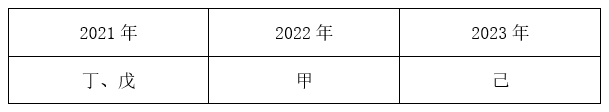

故正确答案为D。

---

### 第 3 题　qid 5893686 · 类比推理

如果丁是2022年结对的，那么下列各项中，哪两个城市可能结对？

- **A**. 丙和戊　✅
- **B**. 乙和己
- **C**. 甲和戊
- **D**. 乙和戊

**答案**：A

**官方解析**

第一步：分析题干条件。
（1）乙的结对城市不是丁；
（2）甲的结对城市不是乙就是丙；
（3）甲和乙均不是在2021年结对的；
（4）丁和戊均不是在2023年结对的；
（5）在2021年2个城市结对，其余4个城市中的2个在2022年结对，剩余的2个城市在2023年结对；
（6）丁是2022年结对的。
第二步：根据题干条件进行推理。
提问方式为“可能”，优先使用代入法。
代入A项：若丙和戊结对，根据条件（2）可知，甲和乙结对，结合条件（5）（6）可知，每年只有2个城市结对，因此甲和乙不在2022年结对，再结合条件（3）可知，甲和乙在2023年结对。根据条件（5）（6）可知，丙和戊在2021年结对，此时己和丁在2022年结对，满足题干所有条件，可能为真，当选；
代入B项：若乙和己结对，根据条件（2）可知，甲和丙结对，结合条件（5）（6）可知，每年只有2个城市结对，因此甲和丙不在2022年结对，再结合条件（3）可知，甲和丙在2023年结对。根据条件（5）（6）可知，乙和己在2021年结对，此时不满足题干条件（3），不可能为真，排除；
代入C项：若甲和戊结对，不满足题干条件（2），不可能为真，排除；
代入D项：若乙和戊结对，根据条件（2）可知，甲和丙结对，结合条件（5）（6）可知，每年只有2个城市结对，因此甲和丙不在2022年结对，再结合条件（3）可知，甲和丙在2023年结对。根据条件（5）（6）可知，乙和戊在2021年结对，此时不满足题干条件（3），不可能为真，排除。
故正确答案为A。

---

### 第 4 题　qid 5893687 · 类比推理

如果甲和丙结对，下列哪一项一定为真？

- **A**. 丙是2023年结对的
- **B**. 己是2023年结对的
- **C**. 丁是2021年结对的　✅
- **D**. 戊是2021年结对的

**答案**：C

**官方解析**

第一步：分析题干条件。

（1）乙的结对城市不是丁；

（2）甲乙/甲丙；

（3）甲和乙均不是在2021年结对的；

（4）丁和戊均不是在2023年结对的；

（5）甲和丙结对。

第二步：根据题干条件进行推理。

提问方式为“一定为真”，可利用假设法进行解题。

根据条件（3）（5）可知，甲和丙在2022年或2023年结对。

假设甲和丙是在2022年结对的。根据条件（4）可知，丁和戊在2021年结对，则剩余的乙和己在2023年结对。（如下图所示）

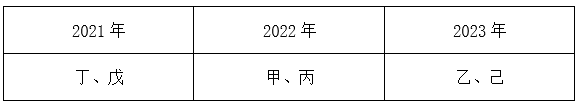

假设甲和丙是在2023年结对的。根据条件（4）可知，丁、戊均可在2021年或2022年结对。根据条件（1）（3）可知，乙的结对城市不是丁，且乙不在2021年结对，因此，乙在2022年结对，则丁只能在2021年结对。（如下图所示）

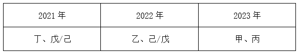

综上，丁是2021年结对的一定为真。

故正确答案为C。

---

### 第 5 题　qid 5893689 · 类比推理

有几个城市可能是在2022年与其他城市结对的？

- **A**. 6个　✅
- **B**. 5个
- **C**. 4个
- **D**. 3个

**答案**：A

**官方解析**

第一步：分析题干条件。

（1）乙的结对城市不是丁；

（2）甲乙/甲丙；

（3）甲和乙均不是在2021年结对的；

（4）丁和戊均不是在2023年结对的。

第二步：根据题干条件进行推理。

根据条件（2）可知，甲的结对城市是乙或丙，因此可优先从甲和乙入手进行假设。

假设一：当甲和乙结对时，根据条件（3）可知，甲和乙只能在2022年或2023年结对。当甲和乙在2022年结对时，根据条件（4）可知，丁和戊在2021年结对，那么丙和己在2023年结对；当甲和乙在2023年结对时，丙、丁、戊、己均可在2021年或2022年结对。

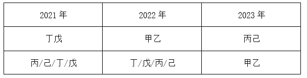

假设二：当甲和丙结对时，根据条件（3）可知，甲和丙只能在2022年或2023年结对。当甲和丙在2022年结对时，根据条件（4）可知，丁和戊在2021年结对，那么乙和己在2023年结对；当甲和丙在2023年结对时，根据条件（1）可知，乙和丁不能结对，根据条件（3）（4）可知，丁和戊不在2023年结对，乙不在2021年结对，因此，丁/戊/己可在2021年结对，乙/戊/己可在2022年结对。

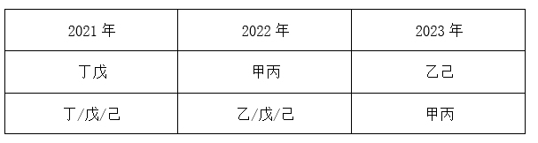

综上，6个城市均可能是在2022年与其他城市结对的。

故正确答案为A。

---

### 第 6 题　qid 5893617 · 图形推理

从所给的四个选项中，选择最合适的一项填入问号处，使之呈现一定的规律性：

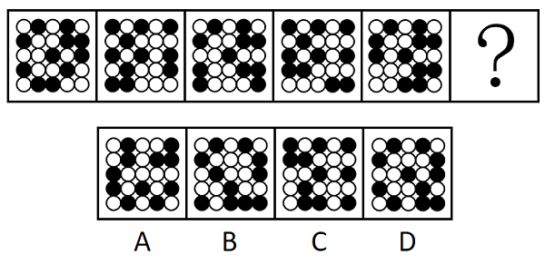

- **A**. A
- **B**. B
- **C**. C　✅
- **D**. D

**答案**：C

**官方解析**

元素组成相同，优先考虑位置规律。题干图形均出现了二十五宫格，且中间黑块数量相同，优先考虑内外圈分开看平移。观察发现，内圈九宫格最中心黑块位置不变，其余两个黑块每次顺（逆）时针移动4格（也可以看成两个黑块左右两边位置交替），最外圈黑块每次顺时针平移1格，只有C项符合。

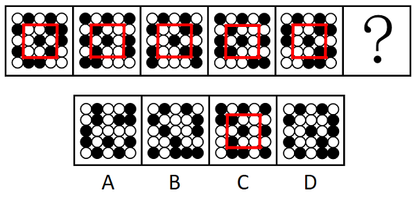

故正确答案为C。

---

### 第 7 题　qid 5893606 · 图形推理

从所给的四个选项中，选择最合适的一项填入问号处，使之呈现一定的规律性：

- **A**. A
- **B**. B
- **C**. C
- **D**. D　✅

**答案**：D

**官方解析**

元素组成不同，且无明显属性规律，观察发现，题干图形均由黑块和白块组成，且色块分布均匀，优先考虑黑白块面积。题干图形的黑块面积依次为整体图形面积的、、、、，故？处图形的黑块面积应为整个图形的面积，即整个图形全为黑色，只有D项符合。

故正确答案为D。

---

### 第 8 题　qid 5893610 · 图形推理

从所给的四个选项中，选择最合适的一项填入问号处，使之呈现一定的规律性：

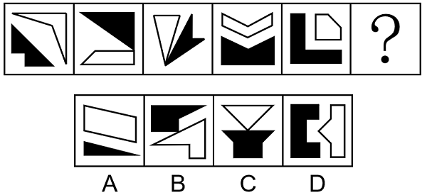

- **A**. A　✅
- **B**. B
- **C**. C
- **D**. D

**答案**：A

**官方解析**

元素组成不同，且无明显属性规律，考虑数量规律。观察发现，图形均由黑色图形和白色图形构成，可以考虑分开看，每个图形都是简单多边形，可以优先考虑数黑色图形和白色图形的边数。题干中黑色图形的边数依次为5、3、4、5、6，白色图形的边数依次为4、4、3、6、5，单看无规律，考虑运算发现，图1、图3、图5中黑色图形边数-白色图形边数=1，图2、图4中白色图形边数-黑色图形边数=1，为交替规律，故？处图形的白色图形边数-黑色图形边数=1，只有A项符合。
故正确答案为A。

---

### 第 9 题　qid 5893613 · 图形推理

从所给的四个选项中，选择最合适的一项填入问号处，使之呈现一定的规律性：

- **A**. A
- **B**. B　✅
- **C**. C
- **D**. D

**答案**：B

**官方解析**

图形元素组成相似，优先考虑样式规律。观察发现，题干图形均由黑球和白球构成，考虑黑白运算。九宫格优先横向看，第一行图形的黑白运算规律为：黑+白=白，白+白=黑，白+黑=白，黑+黑=空，第二行图形经验证符合此规律，第三行图形应用此规律，只有B项符合。
故正确答案为B。

---

### 第 10 题　qid 5893669 · 图形推理

左图为15个白色正方体和3个灰色正方体组合而成的多面体，其可以由①、②和③三个多面体组合而成，问哪项能填入问号处？

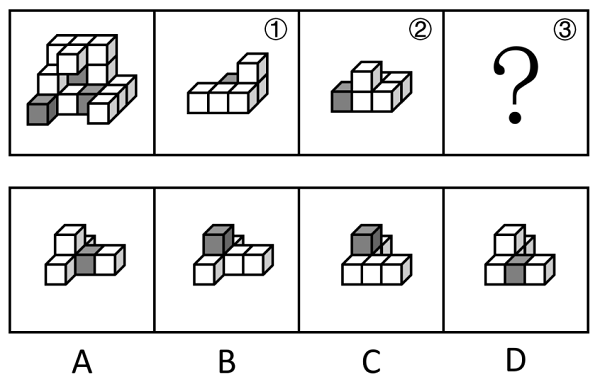

- **A**. A　✅
- **B**. B
- **C**. C
- **D**. D

**答案**：A

**官方解析**

本题考查立体拼合，如下图所示，立体图形可由①、②以及A项拼合而成。

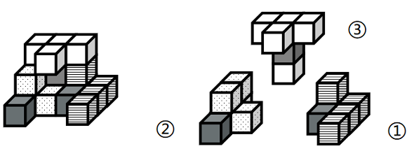

故正确答案为A。

---

### 第 11 题　qid 5893661 · 图形推理

左图为8个白色正方体和4个黑色正方体粘接而成的长方体，问以下哪一个不可能是其外表面展开图？

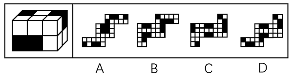

- **A**. A
- **B**. B
- **C**. C
- **D**. D　✅

**答案**：D

**官方解析**

将长方体的外表面依次标上序号，如下图所示，面e为正面、面f为顶面、面k为右侧面、面i为左侧面，面g为背面，面h为底面，逐一分析选项。

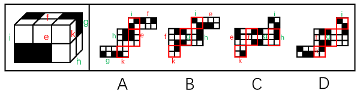

A项：展开图的6个面（如上图所示）与长方体的外表面一一对应，选项与题干一致，排除；

B项：展开图的6个面（如上图所示）与长方体的外表面一一对应，选项与题干一致，排除；

C项：展开图的6个面（如上图所示）与长方体的外表面一一对应，选项与题干一致，排除；

D项：展开图中左下角的面和右侧的面为无中生有的面，选项与题干不一致，当选。

本题为选非题，故正确答案为D。

---

### 第 12 题　qid 5893673 · 图形推理

上图为13个白色正方体和5个灰色正方体组合而成的多面体，现用经A、B、C三个顶点的平面对该多面体进行切割，正确的截面是：

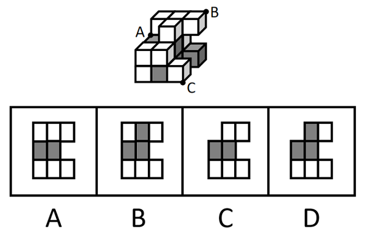

- **A**. A
- **B**. B　✅
- **C**. C
- **D**. D

**答案**：B

**官方解析**

本题考查截面图。根据平面公理“过不在一条直线上的三点，有且只有一个平面”可以得出，A、B、C三个顶点可以确定一个唯一的截面，如下图所示：

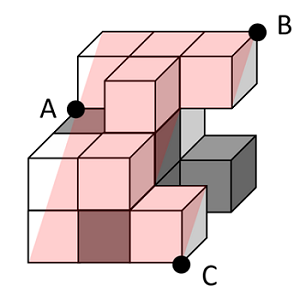

从下往上看即可得到如下截图：

故正确答案为B。

---

### 第 13 题　qid 5893637 · 图形推理

把下面六个图形分为两类，使每一类图形都有各自的共同特征或规律，分类正确的一项是：

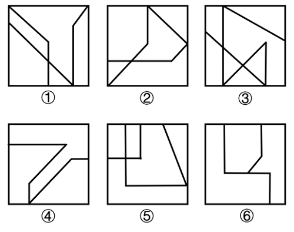

- **A**. ①④⑤，②③⑥
- **B**. ①③④，②⑤⑥
- **C**. ①⑤⑥，②③④　✅
- **D**. ①②⑥，③④⑤

**答案**：C

**官方解析**

本题为分组分类题目。元素组成不同，且无明显属性规律，考虑数量规律。观察发现，题干图形被分割，考虑面数量，但面数量无规律，且框内有明显一笔构成的线条，考虑笔画数。图①⑤⑥均为两笔画图形，图②③④均为一笔画图形，故图①⑤⑥为一组，图②③④为一组。
故正确答案为C。

---

### 第 14 题　qid 5893647 · 图形推理

把下面的六个图形分为两类，使每一类图形都有各自的共同特征或规律，分类正确的一项是：

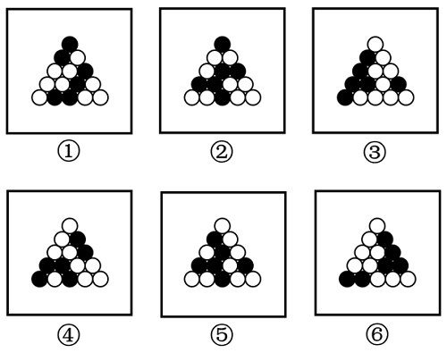

- **A**. ①④⑥，②③⑤　✅
- **B**. ①⑤⑥，②③④
- **C**. ①②⑥，③④⑤
- **D**. ①③⑥，②④⑤

**答案**：A

**官方解析**

本题为分组分类题目。元素组成相同，但无明显位置规律和属性规律，考虑数量规律。观察发现，题干图形的黑球均被分隔为两部分，考虑每部分的黑球个数。图①④⑥中，黑球个数均按2、4分为两部分；图②③⑤中，黑球个数均按1、5分为两部分。即图①④⑥为一组，图②③⑤为一组。
故正确答案为A。

---

### 第 15 题　qid 5893648 · 图形推理

把下面的六个图形分为两类，使每一类图形都有各自的共同特征或规律，分类正确的一项是：

- **A**. ①②⑥，③④⑤
- **B**. ①④⑥，②③⑤
- **C**. ①③⑤，②④⑥
- **D**. ①②③，④⑤⑥　✅

**答案**：D

**官方解析**

本题为分组分类题目。元素组成不同，且无明显属性规律，考虑数量规律。题干图形明显被分割，优先考虑面数量，题干图形均有四个白块和一个黑块，不能分组；继续观察发现，题干图形均由几个图形拼接而成，还可以考虑图形间关系。题干图形均有一个黑块，图①②③中黑块均与4个白块存在公共边，图④⑤⑥中黑块均与3个白块存在公共边。即图①②③为一组，图④⑤⑥为一组。
故正确答案为D。

---

### 第 16 题　qid 5893595 · 定义判断

伪装型反侦查行为是指犯罪行为人通过采取相应措施来隐蔽自身、迷惑侦查机关侦查活动的行为，其主要表现为三类：①栽赃嫁祸，通过将赃物、违禁品暗置别人处等方式来误导侦查方向；②主动报案，通过实施“贼喊捉贼”式的行为来蒙蔽侦查机关；③制造伪证，通过假人证、不知情的人或一些特定物品，制造出虚假的不在场证明或者自己与案件无关的假象，以达到混淆视听、误导侦查视线的目的。
根据上述定义，下列没有体现上述几类伪装型反侦查行为的是：

- **A**. 甲将乙杀害后，故意在网络上散布丙与乙不和的谣言，转移警方注意力
- **B**. 甲在作案后，拿走可以证明受害人乙身份的物品，隐藏其身份　✅
- **C**. 甲酒后与乙争吵并痛下杀手，事后甲主动报警，声称自己是目击证人
- **D**. 甲作案后接受警方讯问时，拿出案发当日的火车票谎称自己当时正在火车上

**答案**：B

**官方解析**

第一步：找出定义关键词。
伪装型反侦查行为：“犯罪行为人”、“隐蔽自身、迷惑侦查机关侦查活动的行为”；
栽赃嫁祸：“将赃物、违禁品暗置别人处等方式”、“误导侦查方向”；
主动报案：“实施‘贼喊捉贼’式的行为”、“蒙蔽侦查机关”；
制造伪证：“通过假人证、不知情的人或一些特定物品”、“制造出虚假的不在场证明或者自己与案件无关的假象”、“达到混淆视听、误导侦查视线的目的”。
第二步：逐一分析选项。
A项：甲将乙杀害后，故意散布丙与乙不和的谣言，符合“嫁祸”，转移警方注意力，符合“误导侦查方向”，属于栽赃嫁祸，符合定义，排除；
B项：甲作案后，拿走能证明受害人乙身份的物品，隐藏乙的身份，不符合“隐蔽自身、迷惑侦查机关侦查活动的行为”，不符合定义，当选；
C项：甲杀人后主动报警，声称自己是目击证人，符合“实施‘贼喊捉贼’式的行为”，属于主动报案，符合定义，排除；
D项：甲作案后拿出案发当日的火车票，谎称自己当时正在火车上，符合“通过假人证、不知情的人或一些特定物品”、“制造出虚假的不在场证明或者自己与案件无关的假象”，属于制造伪证，符合定义，排除。
本题为选非题，故正确答案为B。

---

### 第 17 题　qid 5893596 · 定义判断

动物的战斗行为在进化中演变出一种既能决定胜负又能减少伤亡的相对固定的方式，这种方式被称为仪式化战斗。
根据上述定义，下列不属于仪式化战斗的是：

- **A**. 偶蹄动物通常用角互相推顶以比试力量，但并不攻击对方的要害部位
- **B**. 蟾蜍被其他动物捕食时，其体表会分泌毒液使捕食者产生不适，从而将其吐出　✅
- **C**. 蜜蚁发生争斗时，会鼓起并翘起腹部，使自己看起来更大一些，直至对方投降
- **D**. 响尾蛇争斗时，采用颈部侧贴并互相压制的方式，并不使用毒牙和毒液

**答案**：B

**官方解析**

第一步：找出定义关键词。
“动物的战斗行为”、“在进化中”、“能决定胜负又能减少伤亡”。
第二步：逐一分析选项。
A项：偶蹄动物用角推顶比试力量，符合“动物的战斗行为”，但不攻击对方的要害部位，符合“能决定胜负又能减少伤亡”，符合定义，排除；
B项：蟾蜍被其他动物捕食时，其毒液能对捕食者造成伤害，不符合“能决定胜负又能减少伤亡”，不符合定义，当选；
C项：蜜蚁发生争斗时，符合“动物的战斗行为”，通过鼓起并翘起腹部的方式使对方投降，没有对对方产生伤害，符合“能决定胜负又能减少伤亡”，符合定义，排除；
D项：响尾蛇争斗时，符合“动物的战斗行为”，采用颈部侧贴并互相压制的方式，并不使用毒牙和毒液，符合“能决定胜负又能减少伤亡”，符合定义，排除。
本题为选非题，故正确答案为B。

---

### 第 18 题　qid 5893597 · 定义判断

品牌延伸是将著名或成名品牌使用到与原产品不同类型的产品上，是企业在推出新产品过程中经常采用的策略。如果品牌延伸到一个与原产品相对立或易引起消费者反感的产品上，就会对消费者造成心理冲突。消费者只会购买其一，或两者都不买，从而损害原有品牌的形象。
根据上述定义，下列情形属于品牌延伸导致消费者心理冲突的是：

- **A**. 某著名雪糕品牌“白雪”跟著名白酒品牌“九里香”合作推出一款雪糕新产品“雪里香”，很多家长以为这款雪糕含酒精，不敢买给孩子吃
- **B**. 某奢侈品手提包品牌突然走平民路线，推出百元手提包，还印上了该品牌商标，不少消费者放弃了该品牌
- **C**. 某世界知名服装品牌为打开甲国市场，特地将甲国标志性的动物印在新款服饰上，但被指伤害了该国民众的民族感情，遭到了严重抵制
- **D**. 某知名厨卫清洁品牌深受消费者喜爱，后该品牌又进军食品行业，推出功能饮料产品，消费者一时难以接受　✅

**答案**：D

**官方解析**

第一步：找出定义关键词。

品牌延伸：“将著名或成名品牌使用到与原产品不同类型的产品上”；

品牌延伸导致消费者心理冲突：“品牌延伸到一个与原产品相对立或易引起消费者反感的产品上”、“对消费者造成心理冲突”。

第二步：逐一分析选项。

A项：将著名白酒品牌延伸到雪糕的新产品上，其中白酒和雪糕都属于食品，并非是相对立的产品，二者结合一般不会引起消费者的反感，不符合“品牌延伸到一个与原产品相对立或易引起消费者反感的产品上”，不符合“品牌延伸导致消费者心理冲突”的定义，排除；

B项：奢侈品手提包品牌推出百元手提包，此处很多同学觉得都是手提包，所以不符合关键词“不同类型的产品”，其实不然，站在企业角度，百元包和万元包面向的客群不同，是属于“不同类型的产品”，通过此点排除B项并不严谨；提问是“品牌延伸导致消费者心理冲突”，B项的结果是直接放弃了，放弃了那就不纠结了，没有明确体现“心理冲突”，纠结先放着，对比择优；

C项：知名服装品牌将甲国标志性的动物印在新款服饰上，其中新款服饰与原服装产品属于同类型的产品，不符合“将著名或成名品牌使用到与原产品不同类型的产品上”，不符合“品牌延伸”的定义，也不符合“品牌延伸导致消费者心理冲突”的定义，排除；

D项：将知名厨卫清洁品牌延伸到食品行业，并推出功能饮料产品，其中厨卫清洁用品是不能喝的，而功能饮料产品是能喝的，二者的差异让消费者难以接受，符合“品牌延伸到一个与原产品相对立或易引起消费者反感的产品上”，难以接受，说明内心纠结、矛盾，可以体现出“心理冲突”。

对比B、D两项，其实B、D两项都符合“品牌延伸”，区别就是最后导致的结果，谁更能体现“心理冲突”，B项“放弃了该品牌”和D项的“难以接受”，前者很直接干脆，不买了那就不纠结了，而后者“难以接受，说明内心矛盾”更能体现“心理冲突”。

另外，小粉笔再次多渠道查询，如下图所示，在原文中，B项属于品牌延伸导致“损害原品牌的高品质形象”，D项属于品牌延伸导致“消费者心理冲突”，二者虽然都属于“品牌延伸”，但导致的结果是不同的，本题考查的结果是“导致消费者心理冲突”，因此择优选择D项。

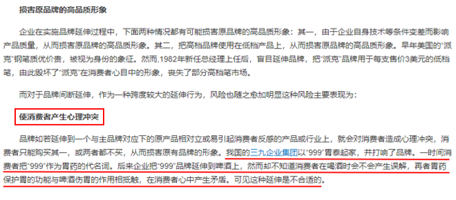

故正确答案为D。

---

### 第 19 题　qid 5893601 · 定义判断

某部落的计数法只有4个符号：。每个数字至多有两位，数位从高到低的顺序为从右到左。其中右边数位从大到小依次为；而左边数位从大到小依次为。

根据上述定义，下列哪项中的数字最大？

- **A**. 

　✅
- **B**. 

- **C**. 

- **D**. 

**答案**：A

**官方解析**

第一步：找出定义关键词。

“每个数字至多有两位，数位从高到低的顺序为从右到左”、“右边数位从大到小依次为”、“左边数位从大到小依次为”。

第二步：逐一分析选项。

本题提问方式为“下列哪项中的数字最大”，故根据定义关键词对选项进行排序即可。根据“每个数字至多有两位，数位从高到低的顺序为从右到左”可知，右边数位大的数字更大，所以根据“右边数位从大到小依次为”可知，大于，排除B、D两项；再根据“左边数位从大到小依次为”可知，大于，所以A项中的数字最大。

故正确答案为A。

---

### 第 20 题　qid 5893605 · 定义判断

人际关系图，是用一套特定的符号来表示团体内成员之间各种关系的图形。依据前期的调查，将团体成员的关系分为“吸引”“排斥”“无关”三类。图中圆圈内的字母是团体内每一成员的代号。实线与虚线表示相互关系，其中实线表示吸引关系，虚线表示排斥关系，箭头表示方向（例如：表示A受B吸引，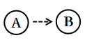表示A排斥B），其中被实线箭头指向最多的人，就是处于团体中心位置的人。

根据上述定义，对下图的判断正确的是：

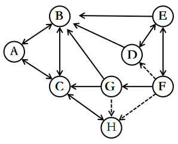

- **A**. 该团体中没有相互排斥的人　✅
- **B**. C是处于团体中心位置的人
- **C**. F是该团体中受排斥最多的人
- **D**. H和B是相互吸引的人

**答案**：A

**官方解析**

第一步：找出定义关键词。

实线：“表示吸引关系”；

虚线：“表示排斥关系”；

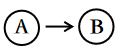：“表示A受B吸引”；

：“表示A排斥B”；

团体中心位置的人：“被实线箭头指向最多的人”。

第二步：逐一分析选项。

A项：题干图示中没有双向虚线箭头，根据“虚线表示排斥关系”可知，该团体中没有相互排斥的人，表述正确，当选；

B项：题干图示中C被四个实线箭头指向，而B被五个实线箭头指向，根据“被实线箭头指向最多的人”可知，B是处于团体中心位置的人，而不是C，表述错误，排除；

C项：题干图示中F没有被虚线箭头指向，根据“虚线表示排斥关系”可知，F没有受到排斥，表述错误，排除；

D项：题干图示中H和B没有直接的双向实线关系，根据“实线表示吸引关系”可知，H和B不是相互吸引的人，表述错误，排除。

故正确答案为A。

---

### 第 21 题　qid 5893535 · 定义判断

慢病也称为慢性非传染性疾病，是指长期的、不能自愈的、也几乎不能被治愈的疾病。慢病自我管理是指慢病患者主动监测自己的病情，以积极态度及行动，改善健康和情绪，通过对疾病的认识，学习与疾病长期共存。
根据上述定义，下列属于慢病自我管理的是：

- **A**. 老张在患了流感后多方查阅相关信息，每天监测血氧、心率、血压等指标，不做剧烈运动，避免着凉
- **B**. 老王因慢性肾功能衰竭需定期在医院进行透析治疗，医院为其建立了慢病管理档案，追踪监测肾功能等各项指标
- **C**. 老赵的父母都因胃癌去世，老赵深知该疾病的严重后果，每年全面体检一次，定期进行胃肠镜检查，不熬夜不喝酒，规律作息
- **D**. 患II型糖尿病的老李，平日生活格外谨慎，含糖量高的食物一概不碰，每天按时服药，定期监测血糖水平　✅

**答案**：D

**官方解析**

第一步：找出定义关键词。
慢病：“慢性非传染性疾病”、“长期的、不能自愈的、也几乎不能被治愈的疾病”；
慢病自我管理：“慢病患者主动监测自己的病情，积极改善健康和情绪，学习与疾病长期共存”。
第二步：逐一分析选项。
A项：“流感”属于传染性疾病，不符合“慢性非传染性疾病”，不符合“慢病”定义，因此也不符合“慢病自我管理”定义，排除；
B项：医院为老王建立慢病管理档案并追踪监测肾功能等各项指标，不是患者老王监测自己的病情，不符合“慢病患者主动监测自己的病情，积极改善健康和情绪，学习与疾病长期共存”，不符合“慢病自我管理”定义，排除；
C项：老赵并没有患病，不是患者，不符合“慢病患者主动监测自己的病情，积极改善健康和情绪，学习与疾病长期共存”，不符合“慢病自我管理”定义，排除；
D项：II型糖尿病属于慢性非传染性疾病，患II型糖尿病的老李按时服药，定期监测血糖水平，符合“慢病患者主动监测自己的病情，积极改善健康和情绪，学习与疾病长期共存”，符合“慢病自我管理”定义，当选。
故正确答案为D。

---

### 第 22 题　qid 5893541 · 定义判断

民俗是指一个民族或一个社会群体在长期的生产实践和社会生活中逐渐形成并世代相传、较为稳定的文化事项，可以简单概括为民间流行的风尚、习俗，具有传承性、广泛性、稳定性。
根据上述定义，下列活动属于民俗的是：

- **A**. 清明节当天，黄帝陵举行隆重的公祭活动，按照既定祀典礼仪，缅怀始祖精神，传承中华文明
- **B**. 王老伯家有一个传承三代的习惯，每到重大节日，全家都要聚在一起，交流感情，品尝美食，共享天伦
- **C**. 农历九月九日为重阳节，自古以来，河洛地区的人们每逢这天都会结伴登高山、逛庙会、赏菊花　✅
- **D**. 近年来，一些大都市的公园每周都会举办“相亲角”活动，中老年父母聚在一起替儿女相亲

**答案**：C

**官方解析**

第一步：找出定义关键词。
“一个民族或一个社会群体”、“在长期的生产实践和社会生活中逐渐形成并世代相传、较为稳定的文化事项”、“民间流行的风尚、习俗”、“具有传承性、广泛性、稳定性”。
第二步：逐一分析选项。
A项：清明节当天在黄帝陵举行的公祭活动，是以官方名义组织的有严格规模、等级和仪式的大型祭祀活动，不符合“民间流行的风尚、习俗”，不符合定义，排除；
B项：该项说明的是王老伯的家庭内部习惯，该习惯仅适用于王老伯家，不具有广泛性，不符合“具有传承性、广泛性、稳定性”，不符合定义，排除；
C项：河洛地区的人们，符合“一个民族或一个社会群体”，自古以来，每逢重阳节都会结伴登高山、逛庙会、赏菊花，说明是世代相传，具有传承性，符合“在长期的生产实践和社会生活中逐渐形成并世代相传、较为稳定的文化事项”、“具有传承性、广泛性、稳定性”，符合定义，当选；
D项：一些大都市的公园每周都会举办“相亲角”活动，不符合“在长期的生产实践和社会生活中逐渐形成并世代相传、较为稳定的文化事项”，不符合定义，排除。
故正确答案为C。

---

### 第 23 题　qid 5893544 · 定义判断

电力系统的电力设备根据其在运行中所起的作用，分为电力一次设备和电力二次设备。电力一次设备指的是直接参与生产、变换、传输、分配和消耗电能的设备；电力二次设备指的是为了保护并保证电力一次设备的正常运行，对其运行状态进行测量、监视、控制和调节等的设备。
根据上述定义，下列说法正确的是：

- **A**. 电路中用于升降交流电压的变压器，属于电力二次设备
- **B**. 将回路中高电压降低的电压互感器，属于电力一次设备　✅
- **C**. 由柴油驱动的发电机，属于电力二次设备
- **D**. 记录零序电流值并用于查找故障点的故障录波装置，属于电力一次设备

**答案**：B

**官方解析**

第一步：找出定义关键词。
电力一次设备：“直接参与生产、变换、传输、分配和消耗电能”；
电力二次设备：“保护并保证电力一次设备的正常运行”、“对其运行状态进行测量、监视、控制和调节等”。
第二步：逐一分析选项。
A项：用于升降交流电压的变压器，是直接参与变换电压的设备，符合“直接参与生产、变换、传输、分配和消耗电能”，符合“电力一次设备”定义，不符合“电力二次设备”定义，排除；
B项：将回路中高电压降低的电压互感器，是直接参与变换电压的设备，符合“直接参与生产、变换、传输、分配和消耗电能”，符合“电力一次设备”定义，当选；
C项：由柴油驱动的发电机，是生产电能的设备，符合“直接参与生产、变换、传输、分配和消耗电能”，符合“电力一次设备”定义，不符合“电力二次设备”定义，排除；
D项：记录零序电流值并用于查找故障点的故障录波装置，该装置是为了保护并保证电力一次设备的正常运行而对其进行监视的设备，符合“对其运行状态进行测量、监视、控制和调节等”，符合“电力二次设备”定义，不符合“电力一次设备”定义，排除。
故正确答案为B。

---

### 第 24 题　qid 5893546 · 定义判断

甲类对象如果全部属于乙类对象，就把表达甲类对象的概念称为种概念，表达乙类对象的概念称为属概念。属种定义是一种明确概念的定义方法，其定义方法是首先找出与被定义概念相邻近的上位属概念，然后找出被定义概念与该邻近属概念下其他种概念之间的差别，以此来定义该概念。
根据上述定义，下列属于属种定义的是：

- **A**. 葛布是用葛的纤维织成的布　✅
- **B**. 吃香即受欢迎
- **C**. 摩天大厦指的是诸如上海金茂大厦、迪拜哈利法塔那样的高楼大厦
- **D**. 竹林七贤指的是魏晋时期的阮籍、嵇康、山涛、刘伶、阮咸、向秀和王戎等七位名士

**答案**：A

**官方解析**

第一步：找出定义关键词。
种概念：“甲类对象如果全部属于乙类对象，就把表达甲类对象的概念称为种概念”；
属概念：“甲类对象如果全部属于乙类对象，就把表达乙类对象的概念称为属概念”；
属种定义：“找出与被定义概念相邻近的上位属概念”、“找出被定义概念与该邻近属概念下其他种概念之间的差别，以此来定义该概念”。
第二步：逐一分析选项。
A项：葛布是用葛的纤维织成的布，其中被定义概念为“葛布”，与被定义概念相邻近的上位属概念为“布”，“用葛的纤维织成的”是被定义概念与该邻近属概念下其他种概念（如麻布）之间的差别，符合“属种定义”，当选；
B项：吃香即受欢迎，其中“吃香”与“受欢迎”表达的意思相同，“受欢迎”不是上位属概念，不符合“找出与被定义概念相邻近的上位属概念”，不符合“属种定义”，排除；
C项：摩天大厦指的是诸如上海金茂大厦、迪拜哈利法塔那样的高楼大厦，其中被定义概念为“摩天大厦”，与被定义概念相邻近的上位属概念为“高楼大厦”，但“上海金茂大厦、迪拜哈利法塔”是对摩天大厦的举例，不存在被定义概念与该邻近属概念下其他种概念之间的差别，不符合“找出被定义概念与该邻近属概念下其他种概念之间的差别，以此来定义该概念”，不符合“属种定义”，排除；
D项：竹林七贤指的是魏晋时期的阮籍、嵇康、山涛、刘伶、阮咸、向秀和王戎等七位名士，其中被定义概念为“竹林七贤”，与被定义概念相邻近的上位属概念为“名士”，但该定义只指出了竹林七贤所包含的全部对象，并没有指出被定义概念与该邻近属概念下其他种概念之间的差别，不符合“找出被定义概念与该邻近属概念下其他种概念之间的差别，以此来定义该概念”，不符合“属种定义”，排除。
故正确答案为A。

---

### 第 25 题　qid 5893555 · 定义判断

中医七方指的是大方、小方、缓方、急方、奇方、偶方、复方七种方剂的总称。其中缓方是指药性缓和，治疗病势缓慢需长期服用的方剂；急方是指药性峻猛，治疗病势急重急于取效的方剂；奇方是指单数药物组成的方剂；偶方是指双数药物组成的方剂。
根据上述定义，下列既属于缓方又属于偶方的是：

- **A**. 参附汤：人参15克、附子30克，有回阳、益气、固脱之功，常用于元气大亏、阳气暴脱之症
- **B**. 甘草汤：甘草6克，主治少阴咽痛，兼治舌肿，有清热解毒之功效
- **C**. 四君子汤：人参、甘草、茯苓、白术各等分，主治脾胃气虚证，症见面色萎黄、语声低微、气短乏力等　✅
- **D**. 生脉散：人参9克、麦门冬9克、五味子6克，为补益剂，具有益气生津、敛阴止汗之功效

**答案**：C

**官方解析**

第一步：找出定义关键词。
缓方：“药性缓和”、“治疗病势缓慢需长期服用的方剂”；
急方：“药性峻猛”、“治疗病势急重急于取效的方剂”；
奇方：“单数药物组成的方剂”；
偶方：“双数药物组成的方剂”。
第二步：逐一分析选项。
A项：参附汤：人参15克、附子30克，符合“双数药物组成的方剂”，符合“偶方”定义；常用于元气大亏、阳气暴脱之症，说明其适用于病势急重的病症，不符合“治疗病势缓慢需长期服用的方剂”，不符合“缓方”定义，排除；
B项：甘草汤：甘草6克，不符合“双数药物组成的方剂”，不符合“偶方”定义，排除；
C项：四君子汤：人参、甘草、茯苓、白术各等分，符合“双数药物组成的方剂”，符合“偶方”定义；主治脾胃气虚证，症见面色萎黄、语声低微、气短乏力等，说明其适用于病势缓慢的病症，符合“治疗病势缓慢需长期服用的方剂”，符合“缓方”定义，当选；
D项：生脉散：人参9克、麦门冬9克、五味子6克，不符合“双数药物组成的方剂”，不符合“偶方”定义，排除。
故正确答案为C。

---

### 第 26 题　qid 5893565 · 类比推理

质证：法庭

- **A**. 缴费：窗口
- **B**. 监狱：拘役
- **C**. 监考：考场　✅
- **D**. 采访：现场

**答案**：C

**官方解析**

第一步：判断题干词语间逻辑关系。
“质证”是指诉讼中，在法庭上对证人证言进一步提出问题，要求证人做进一步的陈述，以解除疑义，确认证言的证明作用。在“法庭”“质证”，二者为地点和动作的对应关系。
第二步：判断选项词语间逻辑关系。
A项：在“窗口”“缴费”，二者为地点和动作的对应关系，与题干逻辑关系一致，保留；
B项：“监狱”不是“拘役”的地点，二者不是地点和动作的对应关系，与题干逻辑关系不一致，排除；
C项：在“考场”“监考”，二者为地点和动作的对应关系，与题干逻辑关系一致，保留；
D项：在“现场”“采访”，二者为地点和动作的对应关系，与题干逻辑关系一致，保留。
对比A、C、D三项，题干“质证”一定发生在“法庭”，且“法庭”是“质证”的指定地点，C项“监考”一定发生在“考场”，且“考场”是“监考”的指定地点，而A项“缴费”并不一定发生在“窗口”，还可以线上缴费，D项“采访”并不一定发生在“现场”，还可以在摄影棚里采访，故C项与题干逻辑关系更为一致，当选。
故正确答案为C。

---

### 第 27 题　qid 5893567 · 类比推理

花生壳：核桃仁

- **A**. 刺梨汁：桃花扇
- **B**. 丝瓜络：石榴籽　✅
- **C**. 杏仁露：葡萄皮
- **D**. 葛根茶：芡实粉

**答案**：B

**官方解析**

第一步：判断题干词语间逻辑关系。
“花生壳”是花生的组成部分；“核桃仁”是核桃的组成部分，二者都是组成各自植物果实的一部分。
第二步：判断选项词语间逻辑关系。
A项：“刺梨汁”是一种以刺梨为原材料制成的果汁；“桃花扇”是指扇面上画有桃花的扇子，二者不是组成各自植物果实的一部分，与题干逻辑关系不一致，排除；
B项：“丝瓜络”是干燥成熟丝瓜的网状纤维，“丝瓜络”是丝瓜的组成部分；“石榴籽”是石榴的组成部分，二者都是组成各自植物果实的一部分，与题干逻辑关系一致，当选；
C项：“杏仁露”是一种以杏仁为原材料制成的饮料；“葡萄皮”是葡萄的组成部分，与题干逻辑关系不一致，排除；
D项：“葛根茶”是一种以葛根为原材料制成的茶饮料；“芡实粉”是一种以芡实为原材料磨成的粉，与题干逻辑关系不一致，排除。
故正确答案为B。

---

### 第 28 题　qid 5893570 · 类比推理

诛禁不当：反受其央

- **A**. 为者常成：行者常至
- **B**. 君子检身：常若有过
- **C**. 其身不正：虽令不从　✅
- **D**. 麻雀虽小：五脏俱全

**答案**：C

**官方解析**

第一步：判断题干词语间逻辑关系。
诛禁不当，反受其央，意思是惩罚得不恰当，反而受其祸害。因为诛禁不当，所以反受其央，二者是因果对应关系。
第二步：判断选项词语间逻辑关系。
A项：为者常成，行者常至，意思是努力去做的人常常可以成功，不倦前行的人常常可以达到目的，二者是并列关系，与题干逻辑关系不一致，排除；
B项：君子检身，常若有过，意思是君子要时时反省检查自己，就像自己经常会有缺点过失那样，二者不是因果对应关系，与题干逻辑关系不一致，排除；
C项：其身不正，虽令不从，意思是在上位的管理者本身言行不正，即使发出命令，大家也不会服从遵守。因为其身不正，所以虽令不从，二者是因果对应关系，与题干逻辑关系一致，当选；
D项：麻雀虽小，五脏俱全，比喻事物的体积或规模虽小，具备的内容却很齐全，二者不是因果对应关系，与题干逻辑关系不一致，排除。
故正确答案为C。

---

### 第 29 题　qid 5893573 · 类比推理

花香四溢：分子运动

- **A**. 波光粼粼：光的反射　✅
- **B**. 聚沙成塔：质量互变
- **C**. 水落石出：水的浮力
- **D**. 炉火纯青：金属炼制

**答案**：A

**官方解析**

第一步：判断题干词语间逻辑关系。
花香四溢是花朵的气味分子进入空气，扩散到周围环境中，供人们嗅觉感知。花香四溢的原理是分子运动，二者为对应关系。
第二步：判断选项词语间逻辑关系。
A项：波光粼粼是光照在动态的水面上，除少许穿透形成折射外，多数都反射回空气中从而形成的现象。波光粼粼的原理是光的反射，二者为对应关系，与题干逻辑关系一致，当选；
B项：聚沙成塔是把沙子堆成宝塔，体现了积少成多。聚沙成塔的原理不是质量互变，与题干逻辑关系不一致，排除；
C项：水落石出指水落下去，水底的石头就露出来，比喻事情的真相完全显露出来，体现了自然界中动态与静态的辩证关系。水落石出的原理不是水的浮力，与题干逻辑关系不一致，排除；
D项：炉火纯青是认为炼到炉里发出纯青色的火焰就算成功了，火焰的温度对应相应的颜色（即火焰的温度越低，颜色会偏黄；温度越高，颜色会偏蓝），后用来比喻功夫达到了纯熟完美的境界，体现的是火焰温度和颜色之间的对应关系。炉火纯青的原理不是金属炼制，与题干逻辑关系不一致，排除。
故正确答案为A。

---

### 第 30 题　qid 5893578 · 类比推理

发酵：灌装：生产红酒

- **A**. 摇晃：搅拌：冲泡奶粉
- **B**. 下载：打印：检索资料
- **C**. 养殖：运输：销售对虾
- **D**. 折叠：粘合：制作信封　✅

**答案**：D

**官方解析**

第一步：判断题干词语间逻辑关系。
生产红酒的过程包括发酵和灌装，前两词与第三词构成组成关系；且先发酵再灌装，前两词构成时间先后顺序的对应关系。
第二步：判断选项词语间逻辑关系。
A项：冲泡奶粉的过程需要摇晃和搅拌，但摇晃和搅拌没有必然的先后顺序，与题干逻辑关系不一致，排除；
B项：检索资料的过程并不包括下载和打印，与题干逻辑关系不一致，排除；
C项：销售对虾的过程包括运输，但是并不包括养殖，与题干逻辑关系不一致，排除；
D项：制作信封的过程包括折叠和粘合，前两词与第三词构成组成关系；且先折叠再粘合，前两词构成时间先后顺序的对应关系，与题干逻辑关系一致，当选。
故正确答案为D。

---

### 第 31 题　qid 5893549 · 类比推理

蚜虫：七星瓢虫：小麦

- **A**. 蛇：鸟：谷子
- **B**. 稗草：螳螂：水稻
- **C**. 蚊子：青蛙：高粱
- **D**. 老鼠：黄鼬：玉米　✅

**答案**：D

**官方解析**

第一步：判断题干词语间逻辑关系。
蚜虫会吸食小麦的汁液，二者为捕食者与被捕食对象的对应关系；七星瓢虫会捕食蚜虫，二者为捕食者与被捕食对象的对应关系。
第二步：判断选项词语间逻辑关系。
A项：有的蛇会吃鸟，有的鸟会吃蛇，二者是相互捕食的对应关系，与题干逻辑关系不一致，排除；
B项：稗草是一种常见的田间杂草，会和水稻竞争稻田里的资源，二者是竞争关系，并非捕食者与被捕食对象的对应关系，与题干逻辑关系不一致，排除；
C项：蚊子和高粱没有必然关系，与题干逻辑关系不一致，排除；
D项：老鼠吃玉米，二者为捕食者与被捕食对象的对应关系；黄鼬即黄鼠狼，会捕食老鼠，二者为捕食者与被捕食对象的对应关系，与题干逻辑关系一致，当选。
故正确答案为D。

---

### 第 32 题　qid 5893534 · 类比推理

感想：主观性：体会

- **A**. 典范：示范性：表率　✅
- **B**. 发明：创造性：方法
- **C**. 泥土：可塑性：材料
- **D**. 规律：普适性：定理

**答案**：A

**官方解析**

第一步：判断题干词语间逻辑关系。
感想是指由接触外界事物而引起的思想反应，体会指的是体验领会，二者为近义关系；感想和体会均具有主观性，与第二个词构成必然属性对应关系。
第二步：判断选项词语间逻辑关系。
A项：典范是指可以作为学习、仿效标准的人或事物，表率是指好的榜样，二者为近义关系；典范和表率均具有示范性，与第二个词构成必然属性对应关系，与题干逻辑关系一致，当选；
B项：发明需要一定的方法，二者为对应关系，与题干逻辑关系不一致，排除；
C项：泥土是一种材料，二者为种属关系；材料不一定具有可塑性，与第二个词构成或然属性对应关系，与题干逻辑关系不一致，排除；
D项：规律是指事物之间的内在必然联系，定理是指已经证明具有正确性、可以作为原则或规律的命题或公式，定理是规律的一种，二者为种属关系，与题干逻辑关系不一致，排除。
故正确答案为A。

---

### 第 33 题　qid 5893609 · 类比推理

放养过密：饲喂不当：鱼病发生

- **A**. 任务繁重：临时加班：积劳成疾
- **B**. 材料审核：实地考核：评估通过
- **C**. 地基下沉：结构老化：房屋倾斜　✅
- **D**. 市场饱和：利润下降：分红减少

**答案**：C

**官方解析**

第一步：判断题干词语间逻辑关系。
“放养过密”和“饲喂不当”都是不科学的饲养方式，二者为反对关系，二者都是导致“鱼病发生”的原因，前两词与第三词是因果关系。
第二步：判断选项词语间逻辑关系。
A项：因为“任务繁重”，所以“临时加班”，二者为因果关系，“任务繁重”导致“积劳成疾”，二者为因果关系，与题干逻辑关系不一致，排除；
B项：“材料审核”和“实地考核”都是审核的一种，二者为并列关系，但“材料审核”和“实地考核”都是“评估通过”的条件，前两词与第三词是条件对应关系，与题干逻辑关系不一致，排除；
C项：“地基下沉”和“结构老化”都是建筑的问题，二者为反对关系，二者都是导致“房屋倾斜”的原因，前两词与第三词是因果关系，与题干逻辑关系一致，当选；
D项：“市场饱和”导致“利润下降”，二者为因果关系，“利润下降”导致“分红减少”，二者为因果关系，与题干逻辑关系不一致，排除。
故正确答案为C。

---

### 第 34 题　qid 5893592 · 类比推理

嬗变 对于 （    ） 相当于 （    ） 对于 生肖

- **A**. 改变；中国
- **B**. 演变；属相　✅
- **C**. 剧变；动物
- **D**. 巨变；传统

**答案**：B

**官方解析**

逐一代入选项。
A项：嬗变指蜕变、演变，与改变是近义关系；生肖指十二生肖，又叫属相，是中国与十二地支相配以人出生年份的十二种动物，与中国是对应关系，前后逻辑关系不一致，排除；
B项：嬗变指蜕变、演变，与演变意思相同；属相也叫生肖，与生肖意思相同，前后逻辑关系一致，当选；
C项：剧变指急剧的变化，与嬗变均有改变的意思，二者是近义关系；生肖特指与十二地支相配以人出生年份的十二种动物，与动物是对应关系，前后逻辑关系不一致，排除；
D项：巨变指巨大或剧烈的变化，与嬗变均有改变的意思，二者是近义关系；生肖是中国传统文化的重要组成部分，与传统是包容关系，前后逻辑关系不一致，排除。
故正确答案为B。

---

### 第 35 题　qid 5893582 · 类比推理

重型战机 对于 （    ） 相当于 （    ） 对于 分辨率

- **A**. 隐形战机 清晰度
- **B**. 战斗机 性能指标
- **C**. 轻型战机 订单量
- **D**. 载弹量 显示器　✅

**答案**：D

**官方解析**

逐一代入选项。
A项：重型战机是指战斗机中体型相对较大，航程相对较远，载弹量相对较大的战斗机，隐形战机是指雷达一般探测不到的战斗机，有的重型战机是隐形战机，有的重型战机不是隐形战机，有的隐形战机是重型战机，有的隐形战机不是重型战机，二者是交叉关系；分辨率是表征清晰度的一个因素，二者是对应关系，前后逻辑关系不一致，排除；
B项：重型战机是指战斗机中体型相对较大，航程相对较远，载弹量相对较大的战斗机，二者是种属关系；分辨率是一种性能指标，二者是种属关系，但顺序反了，前后逻辑关系不一致，排除；
C项：重型战机与轻型战机是并列关系；分辨率可能会影响订单量，二者为对应关系，前后逻辑关系不一致，排除；
D项：载弹量是重型战机的一个性能指标，二者为对应关系；分辨率是显示器的一个性能指标，二者为对应关系，前后逻辑关系一致，当选。
故正确答案为D。

---

### 第 36 题　qid 5893685 · 逻辑判断

对体外环境的感知是人类生存、交流和进化的基本能力。人体的味觉系统是信息感知的重要组成部分。有学者认为，苦味的感知是人类长期进化的一种防御机制，这意味其担负着保护人体免于摄入有毒物质的预警任务。
以下哪项最可能是上述学者论述的前提？

- **A**. 苦味受体能监测味觉分子并将信号传递至大脑
- **B**. 已发现人体的25种苦味受体分布于舌头的不同部位
- **C**. 苦味分子与苦味受体结合，激活大脑味觉皮层，产生味觉感知
- **D**. 已有研究表明，自然界的大部分有毒物质是苦的　✅

**答案**：D

**官方解析**

第一步：找出论点和论据。
论点：苦味的感知担负着保护人体免于摄入有毒物质的预警任务。
论据：苦味的感知是人类长期进化的一种防御机制。
论点说的是“苦味的感知”担负着“免于摄入有毒物质的预警任务”，论据说的是“苦味的感知”是一种“防御机制”，“免于摄入有毒物质的预警任务”和“防御机制”二者联系紧密，故论点论据话题一致，且本题提问方式为“前提”，优先考虑必要条件。
第二步：逐一分析选项。
A项：该项讨论的是苦味受体如何将信号传递到大脑，而论点讨论的是苦味的感知担负着保护人体免于摄入有毒物质的预警任务，话题不一致，无法加强，排除；
B项：该项讨论的是苦味受体分布在舌头不同部位，而论点讨论的是苦味的感知担负着保护人体免于摄入有毒物质的预警任务，话题不一致，无法加强，排除；
C项：该项讨论的是苦味分子与苦味受体如何激活大脑皮层，产生味觉感知，而论点讨论的是苦味的感知担负着保护人体免于摄入有毒物质的预警任务，话题不一致，无法加强，排除；
D项：该项指出自然界的大部分有毒物质是苦的，否定代入，如果自然界的大部分有毒物质不是苦的，那么苦味的感知就不能担负着保护人体免于摄入有毒物质的预警任务，即该项不成立则论点不成立，故该项为论点成立的必要条件，可以加强，当选。
故正确答案为D。

---

### 第 37 题　qid 5893688 · 逻辑判断

在过去，药物的研发主要来自于陆地生物，这与陆地生物更被熟知且容易获得有关。近几十年来，越来越多的药物开始从海洋生物中产生，海洋生态环境极具复杂性，因而海洋生物相比于陆地生物有着更为广泛的多样性。有人据此认为，海洋生物产业潜力巨大，海洋生物更有可能是未来新型抗生素、抗癌药物的来源。
以下除哪项外，均能支持上述观点？

- **A**. 目前抗生素都来源于陆地微生物，病菌耐药性不断上升，而海洋微生物药物已经对一些感染性疾病提供了替代性疗法
- **B**. 借助计算机工具，人们已经将庞大的生物基因组库和具有生物活性的化合物库进行关联，用以探索新药物　✅
- **C**. 一些海洋生物如鲸、鲨等终身不得癌症，有近300种海洋生物含有抗肿瘤物质，它们是研究抗癌药物的重要资源
- **D**. 当前已经发现的3.5万个海洋天然产物中有一半以上都具有生物活性，还有更多数以万计的未知海洋天然产物亟待开发

**答案**：B

**官方解析**

第一步：找出论点和论据。
论点：海洋生物产业潜力巨大，海洋生物更有可能是未来新型抗生素、抗癌药物的来源。
论据：近几十年来，越来越多的药物开始从海洋生物中产生，海洋生态环境极具复杂性，因而海洋生物相比于陆地生物有着更为广泛的多样性。
本题论点说的是“海洋生物”更有可能是“未来抗生素、抗癌药物的来源”，论据是越来越多的“药物”开始从“海洋生物”中产生，且海洋生物有着更为广泛的多样性。论点论据话题一致，因为本题是选非题，找到可加强的选项排除即可。
第二步：逐一分析选项。
A项：该项指出陆地微生物生产抗生素的不足，而海洋微生物提供了替代性疗法，举例说明海洋微生物确实可能是新型抗生素的来源，补充论据，可以加强，排除；
B项：该项说明人们将庞大的“生物基因组库”和“具有生物活性的化合物库”进行关联，用以探索新药物，并未说明“海洋生物”是否是“未来抗生素，抗癌药物的来源”，话题不一致，无法加强，当选；
C项：该项用“鲸、鲨”等海洋生物终身不得癌症，并且有近300种海洋生物含有抗肿瘤物质，举例说明海洋生物是研究抗癌药物的重要资源，补充论据，可以加强，排除；
D项：该项说明大量海洋天然产物具有生物活性，还有很多海洋天然产物亟待开发，这就说明海洋生物产业潜力巨大，补充论据，可以加强，排除。
本题为选非题，故正确答案为B。

---

### 第 38 题　qid 5893690 · 逻辑判断

W国对咖啡领域的调查显示，过去W国咖啡领域的融资金额高达5亿元，该国许多知名企业跨界进入咖啡领域，本土咖啡品牌在快速崛起。然而经过去年一年的销售发现，W国线下咖啡门店的总数量虽然有所增加，但咖啡销量与往年相比并未明显增加，因此有人认为：咖啡在W国居民中不是很受欢迎。
以下哪项如果为真，最能削弱上述观点？

- **A**. W国个别线下门店提供的速溶咖啡添加了植脂末、白砂糖等成分，摄入过多不利于身体健康
- **B**. 与一些咖啡销量高的国家相比，W国咖啡的单价过高，在一定程度上阻碍了消费欲望　✅
- **C**. W国的一些企业开始倾向咖啡液、速溶咖啡、袋泡咖啡等全品类进军
- **D**. 当前，W国的咖啡文化并不成熟，作为消费主体的年轻人喝咖啡也大多是赶潮流

**答案**：B

**官方解析**

第一步：找出论点和论据。
论点：咖啡在W国居民中不是很受欢迎。
论据：经过去年一年的销售发现，W国线下咖啡门店的总数量虽然有所增加，但咖啡销量与往年相比并未明显增加。
本题论据描述了W国线下咖啡门店增加但销量并未增加的现象，论点是基于此得出的咖啡在W国不受欢迎，二者话题一致，削弱优先考虑削弱论点。
第二步：逐一分析选项。
A项：选项指出W国“个别门店”的速溶咖啡添加的某些成分摄入过多对身体健康不利，只是“个别门店”，不确定对整体是否有影响，即使产生影响也是对咖啡在W国的受欢迎程度产生不利影响，无法削弱，排除；
B项：选项指出W国线下咖啡门店增加但销量并未增加是因为咖啡单价过高，说明不是咖啡不受欢迎，而是咖啡太贵降低了居民的消费欲望，削弱论点，可以削弱，当选；
C项：选项指出W国的一些企业“开始倾向”咖啡液等全品类咖啡产品，题干讨论的是“去年一年”的销量，时间不重叠，且未说明咖啡液等全品类咖啡产品是否在线下门店销售，无法削弱，排除；
D项：选项指出W国的咖啡文化不成熟，消费主体喝咖啡大多是赶潮流，这对咖啡在W国的受欢迎程度有不利影响，具有加强作用，无法削弱，排除。
故正确答案为B。

---

### 第 39 题　qid 5893691 · 逻辑判断

软件通常存在漏洞，攻击者为接近并操控目标主机，往往会主动寻找漏洞，攻击者会花费大量时间区分软件中“真正危险的漏洞”和“良性漏洞”，并在找到前者后实施攻击。因此有观点认为：如果添加大量良性漏洞欺骗攻击者，使其耗尽资源去寻找和测试那些毫无攻击用途的漏洞，将会减少对软件“真正危险的漏洞”的攻击，从而保证软件不被攻击者恶意控制。
以下哪项如果为真，最能削弱上述观点？

- **A**. 与软件中“真正危险的漏洞”相比，良性漏洞被攻击后只会导致程序崩溃
- **B**. 添加漏洞意味着要更改代码，有时候代码运行不良可能会影响软件的功能
- **C**. 许多军用飞机、舰艇都配有假目标系统，与此类似，良性漏洞也将起到干扰作用
- **D**. 大量添加良性漏洞会让其呈现很多人为特征，攻击者可利用其识别并忽略良性漏洞　✅

**答案**：D

**官方解析**

第一步：找出论点和论据。
论点：如果添加大量良性漏洞欺骗攻击者，使其耗尽资源去寻找和测试那些毫无攻击用途的漏洞，将会减少对软件“真正危险的漏洞”的攻击，从而保证软件不被攻击者恶意控制。
论据：攻击者会花费大量时间区分软件中“真正危险的漏洞”和“良性漏洞”，并在找到前者后实施攻击。
本题的论点和论据讨论的都是利用良性漏洞防止软件被攻击者恶意控制的话题，二者话题一致，削弱优先考虑削弱论点。
第二步：逐一分析选项。
A项：该项说的是良性漏洞遭到攻击后对程序的影响，论点讨论的是否可以通过添加大量良性漏洞保证软件不被攻击者恶意控制，话题不一致，无法削弱，排除；
B项：该项说的是添加漏洞可能会影响软件功能，论点讨论的是否可以通过添加大量良性漏洞保证软件不被攻击者恶意控制，话题不一致，无法削弱，排除；
C项：该项说的是与军用飞机等的假目标系统类似，良性漏洞将起到干扰作用，即良性漏洞的添加有利于软件的安全，具有加强作用，无法削弱，排除；
D项：该项说的是攻击者可以利用大量添加的良性漏洞的特征来忽略它们，说明通过大量添加良性漏洞的方法无法保证软件不被攻击者恶意控制，削弱论点，可以削弱，当选。
故正确答案为D。

---

### 第 40 题　qid 5893692 · 逻辑判断

研究发现，一种被称为EPAS1的特殊基因能调节机体生理状态，使人类适应缺氧环境。考古研究表明这种特殊基因最早可追溯至16万年前已居住于青藏高原的古人类。由于16万年前全国同时生活着尼安德特人、丹尼索瓦人及古老的直立人，其中只有丹尼索瓦人拥有这一基因，考古学家推测丹尼索瓦人很有可能在16万年前居住于青藏高原。
以下除哪项外，均能支持考古学家的推测？

- **A**. 通过对牙齿形态的扫描，发现青藏高原古人类的牙齿齿列和丹尼索瓦人最为相似
- **B**. 分析青藏高原人骨化石中的蛋白质序列，发现这些人类与丹尼索瓦人同属一类
- **C**. 考古人员在青藏高原东北部的白石崖溶洞遗址提取到丹尼索瓦人的线粒体DNA
- **D**. 丹尼索瓦人曾在亚洲广泛分布，他们曾在西伯利亚生活过，可耐受高寒环境　✅

**答案**：D

**官方解析**

第一步：找出论点和论据。
论点：丹尼索瓦人很有可能在16万年前居住于青藏高原。
论据：研究发现，一种被称为EPAS1的特殊基因能调节机体生理状态，使人类适应缺氧环境。考古研究表明这种特殊基因最早可追溯至16万年前已居住于青藏高原的古人类。由于16万年前全国同时生活着尼安德特人、丹尼索瓦人及古老的直立人，其中只有丹尼索瓦人拥有这一基因。
本题论点和论据话题一致，都在讨论“丹尼索瓦人”与“青藏高原”的关系，加强优先考虑补充论据。本题为选非题，将可以加强的选项排除即可。
第二步：逐一分析选项。
A项：该项指出青藏高原古人类的牙齿齿列和丹尼索瓦人最为相似，说明二者存在相似之处，则丹尼索瓦人很有可能曾居住于青藏高原，补充论据，可以加强，排除；
B项：该项指出青藏高原人骨化石中的蛋白质序列与丹尼索瓦人同属一类，说明二者存在相似之处，则丹尼索瓦人很有可能曾居住于青藏高原，补充论据，可以加强，排除；
C项：该项指出在青藏高原的白石崖溶洞遗址提取到丹尼索瓦人的线粒体DNA，说明丹尼索瓦人曾在青藏高原出现过，则丹尼索瓦人很有可能曾居住于青藏高原，补充论据，可以加强，排除；
D项：该项指出丹尼索瓦人曾在亚洲广泛分布，曾在西伯利亚生活过，可耐受高寒环境，没有提及丹尼索瓦人是否曾居住于青藏高原，无法加强，当选。
本题为选非题，故正确答案为D。

---
