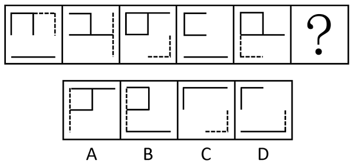
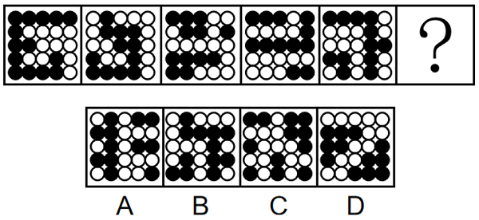
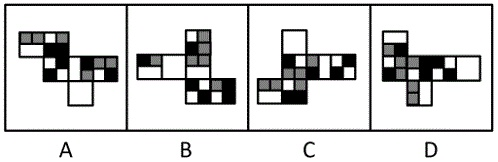

# 2024年宁夏公务员录用考试《行测》题（网友回忆版）

> 判断推理 · 35 题 · 宁夏 2024

## 第 1 题　qid 16593143 · 图形推理

从所给的四个选项中，选择最合适的一个填入问号处，使之呈现一定的规律性：

- **A**. A　✅
- **B**. B
- **C**. C
- **D**. D

**答案**：A

**官方解析**

元素组成基本相同，优先考虑位置规律。观察发现，如下图所示，题干每幅图中的虚线依次顺时针移动其半条边长的距离，长实线依次向上循环移动其半条边长的距离，“U”字形图形依次顺时针旋转，只有A项符合规律。

故正确答案为A。

---

## 第 2 题　qid 10204454 · 图形推理

请从所给的四个选项中，选择最合适的一个填入问号处，使之呈现一定的规律性：

- **A**. A
- **B**. B
- **C**. C　✅
- **D**. D

**答案**：C

**官方解析**

元素组成不同，且无明显属性规律，考虑数量规律。观察发现，题干图形均由黑球和白球构成，且黑白球分割明显，考虑部分数。题干图形中，黑球部分数依次为1、1、3、3、2，白球部分数依次为1、2、1、2、4，单独看无规律，考虑运算。黑球部分数+白球部分数依次为2、3、4、5、6，故问号处应选择一个黑球部分数+白球部分数为7的图形，只有C项符合。
故正确答案为C。

---

## 第 3 题　qid 16593173 · 图形推理

下列纸盒的外表面展开图中，哪一个折叠成的纸盒和其他三个不一样？

- **A**. A
- **B**. B　✅
- **C**. C
- **D**. D

**答案**：B

**官方解析**

将选项展开图标上序号，如下图所示（各选项面都相同，故相同的面用相同字母表示），逐一进行分析。

A项：面b、面c相邻，公共边紧邻面b与面c的黑块（如上图所示）； 

B项：面b、面c相邻，公共边没有紧邻面b的黑块（如上图所示）；

C项：面b、面c相邻，公共边紧邻面b与面c的黑块（如上图所示）；

D项：面b、面c相邻，公共边紧邻面b与面c的黑块（如上图所示）。

综上，只有B项与其他三项不同。

本题为选非题，故正确答案为B。

---

## 第 4 题　qid 10204457 · 图形推理

把下面的六个图形分为两类，使每一类图形都有各自的共同特征或规律，分类正确的一项是：

- **A**. ①③④，②⑤⑥
- **B**. ①③⑤，②④⑥
- **C**. ①⑤⑥，②③④　✅
- **D**. ①④⑥，②③⑤

**答案**：C

**官方解析**

本题为分组分类题目。观察发现，题干图形内部被线条分割，优先考虑面数量，所有图形面数量均为5，且均明显存在最大面，最大面出现等腰元素，可优先考虑最大面的对称性，图①⑤⑥最大面均为中心对称图形，图②③④最大面均为轴对称图形，即图①⑤⑥一组，图②③④一组。
故正确答案为C。

---

## 第 5 题　qid 16593168 · 图形推理

下图为15个白色和5个灰色正方体组合而成的多面体，右边哪一个不可能是其某个角度的视图？

- **A**. A
- **B**. B　✅
- **C**. C
- **D**. D

**答案**：B

**官方解析**

本题考查三视图，逐一分析选项。

A项：题干立体图形从仰视（即从下往上）的视角可以看到下图的图形，再将视角顺时针或逆时针旋转后，即为A项视图，排除；

B项：该项不是题干立体图形的视图，当选；

C项：题干立体图形从右视（即从右往左）的视角可以看到下图的图形，再将视角旋转后，即为C项视图，排除；

D项：题干立体图形从后视（即从后往前）的视角可以看到下图的图形，再将视角顺时针旋转后，即为D项视图，排除。

本题为选非题，故正确答案为B。

---

## 第 6 题　qid 16593136 · 定义判断

职场义警是指认为自己在没有正式授权的情况下，能够监控周围环境中是否存在违反公司规范的迹象，并在自认为适当或合理的时候对感知到的违规同事进行直接或间接处罚的人。
根据上述定义，下列属于职场义警的是：

- **A**. 小张认为公司强制加班的行为违反了劳动法，于是向公司主管部门进行实名举报
- **B**. 戴红袖标的居委会王阿姨在斑马线义务执勤时，对乱闯红灯的行人进行口头批评
- **C**. 有同事利用上班时间闲聊，老周看不过去，瞅准机会找到这位同事进行批评教育　✅
- **D**. 保卫科小刘专门就公司员工安全意识弱现象向领导进行汇报，建议领导通报批评

**答案**：C

**官方解析**

第一步：找出定义关键词。
“在没有正式授权的情况下”、“监控到违反公司规范的迹象”、“自认为适当或合理的时候对违规同事进行处罚”。
第二步：逐一分析选项。
A项：小张认为公司行为违反劳动法，于是向公司主管部门进行实名举报，其中举报行为并非惩罚行为，不符合“自认为适当或合理的时候对违规同事进行处罚”，不符合定义，排除；
B项：居委会王阿姨对违反交通规则的行人进行批评是发生在其义务执勤期间，监督行人遵守交通规则是王阿姨的工作内容，不符合“在没有正式授权的情况下”，不符合定义，排除；
C项：老周对上班闲聊的同事进行批评教育，但并未提及老周的身份是领导，所以他并没有权力批评教育该同事，符合“在没有正式授权的情况下”，老周瞅准机会直接批评上班闲聊的同事，符合“自认为适当或合理的时候对违规同事进行处罚”，符合定义，当选；
D项：关注员工安全意识的问题在保卫科小刘的工作范围之内，不符合“在没有正式授权的情况下”，不符合定义，排除。
故正确答案为C。

---

## 第 7 题　qid 16593131 · 定义判断

警觉性市场学习是指企业或组织为提高深度市场洞察而提前建立预警系统，并保持注意力集中以预测市场变化或感知客户需求微弱信号的学习行为。
根据上述定义，下列属于警觉性市场学习的是：

- **A**. 公司提醒小吴要想在职场中保持优势地位，避免被淘汰，就必须利用业余时间多学习
- **B**. 阳阳上课时注意力不集中，为帮他养成良好学习习惯，家长聘请了心理专家进行干预
- **C**. 某知名企业组建市场调研部，定期监测市场动向，积极培训员工，努力规避潜在风险　✅
- **D**. 某房地产开发商通过暂缓开发或拖延施工进度等方式，试图化解可能面临的发展危机

**答案**：C

**官方解析**

第一步：找出定义关键词。
“企业或组织”、“为提高深度市场洞察而提前建立预警系统”、“预测市场变化或感知客户需求”。
第二步：逐一分析选项。
A项：公司提醒小吴利用业余时间多学习避免被淘汰，是公司对员工的提醒，不属于对市场变化的预测和对客户需求的感知，不符合“预测市场变化或感知客户需求”，不符合定义，排除；
B项：家长聘请心理专家帮助阳阳养成良好的学习习惯，其中阳阳的家长不属于企业或组织，不符合“企业或组织”，不符合定义，排除；
C项：某知名企业组建市场调研部，定期监测市场动向，符合“企业或组织”、“为提高深度市场洞察而提前建立预警系统”、“预测市场变化或感知客户需求”，符合定义，当选；
D项：某房地产开发商使用暂缓开发或拖延施工进度等方式，是为了化解可能面临的发展危机，而不是对市场变化的预测和对客户需求的感知，不符合“预测市场变化或感知客户需求”，不符合定义，排除。
故正确答案为C。

---

## 第 8 题　qid 16593160 · 定义判断

积极独处是个体主动选择与他人的交际分离，选择自我自由并投入到有意义的、愉快的活动中，从而产生的一种内在积极体验。
根据上述定义，下列属于积极独处的是：

- **A**. 小孙睡眠质量不好，外出工作时一般都不和同事一起住
- **B**. 小钱已经锁定了晚上的演唱会门票，谢绝了同事下班后聚餐的邀请
- **C**. 为了准备研究生入学考试，小赵几乎不参加社交活动，他感到很充实　✅
- **D**. 小周适应不了职场人际关系，辞职后不愿出去找工作，整日在家刷视频

**答案**：C

**官方解析**

第一步：找出定义关键词。
“个体主动选择与他人的交际分离”、“选择自我自由并投入到有意义的、愉快的活动中”、“产生内在积极体验”。
第二步：逐一分析选项。
A项：选项指出小孙因为睡眠质量不好所以在外出工作时不和同事一起住，小孙只是晚上不和同事一起住，并不是要和同事“交际分离”，不符合“个体主动选择与他人的交际分离”，不符合定义，排除；
B项：选项指出小钱因为晚上要看演唱会所以谢绝了当晚的聚餐邀请，并不是要和同事“交际分离”，不符合“个体主动选择与他人的交际分离”，不符合定义，排除；
C项：选项指出小赵为了准备研究生入学考试几乎不参加社交活动，符合“个体主动选择与他人的交际分离”、“选择自我自由并投入到有意义的、愉快的活动中”，他感到很充实，符合“产生内在积极体验”，符合定义，当选；
D项：选项指出小周适应不了职场人际关系而不愿出去找工作，并且整日在家刷视频，“整日刷视频”不是有意义的活动，不符合“选择自我自由并投入到有意义的、愉快的活动中”，不符合定义，排除。
故正确答案为C。

---

## 第 9 题　qid 16593139 · 定义判断

矛盾职业认同是指从业者对自身职业兼具认同和不认同，或认同职业某一方面而不认同其他方面，反映了个体对自身职业的复杂情感。
根据上述定义，下列属于矛盾职业认同的是：

- **A**. 小强对未来就业感到迷茫，一方面认为本专业相对好就业，另一方面觉得工作压力会很大
- **B**. 虽然觉得社会上有很多人对网络主播并不认同，但小飞却决定将主播当作一生的事业来做
- **C**. 小刚的父母希望他毕业后考公务员，但小刚自己却更喜欢做一名教师
- **D**. 老汪觉得送快递很累，但工作时间相对自由，因此他还是决定干下去　✅

**答案**：D

**官方解析**

第一步：找出定义关键词。
“从业者”、“对自身职业兼具认同和不认同”、“认同职业某一方面而不认同其他方面”。
第二步：逐一分析选项。
A项：小强还未就业，不符合“从业者”，不符合定义，排除；
B项：社会上有很多人对网络主播并不认同，但小飞本人却对主播事业很坚定，仅体现出小飞对于主播事业的认同，不符合“对自身职业兼具认同和不认同”、“认同职业某一方面而不认同其他方面”，不符合定义，排除；
C项：父母希望小刚考公务员，小刚自己却更喜欢做一名教师，不明确小刚是否为从业者，并且仅体现了父母和小刚关于小刚未来职业的想法不同，不符合“对自身职业兼具认同和不认同”、“认同职业某一方面而不认同其他方面”，不符合定义，排除；
D项：老汪是快递员，符合“从业者”，他觉得送快递很累，但工作时间相对自由，符合“对自身职业兼具认同和不认同”、“认同职业某一方面而不认同其他方面”，符合定义，当选。
故正确答案为D。

---

## 第 10 题　qid 16593146 · 定义判断

即兴能力是企业在紧急、不可预测环境下，计划与行动同时进行，通过对资源进行利用和整合呈现出创造性，从而自发地实现预期目标的能力。
根据上述定义，下列属于即兴能力的是：

- **A**. 企业聚餐，员工老杨一杯酒下肚，情绪立即高涨起来，即兴为大家表演了诗朗诵
- **B**. 负责公司招聘的人力资源部通过对考生即兴演讲效果的比较，确定最终录用人员
- **C**. 某企业面对技术封锁，边调整发展规划，边创新研发技术，最终成长为行业巨头　✅
- **D**. 为应对未来劳动力成本大幅攀升的不利影响，企业启动了机器设备升级换代工作

**答案**：C

**官方解析**

第一步：找出定义关键词。
“企业在紧急、不可预测环境下”、“计划与行动同时进行”、“通过对资源进行利用和整合呈现出创造性”、“自发地实现预期目标”。
第二步：逐一分析选项。
A项：该项中员工老杨在企业聚餐时的表现属于个人行为，不符合“企业在紧急、不可预测环境下”，不符合定义，排除；
B项：该项中负责公司招聘的人力资源部对考生的考核和录用属于人力资源部的日常工作，不符合“企业在紧急、不可预测环境下”，也未表现出计划和行动情况，不符合“计划与行动同时进行”，不符合定义，排除；
C项：该项中某企业面对技术封锁，符合“企业在紧急、不可预测环境下”，调整发展规划，创新研发技术，符合“计划与行动同时进行”、“通过对资源进行利用和整合呈现出创造性”，最终成长为行业巨头，符合“自发地实现预期目标”，符合定义，当选；
D项：该项中为应对未来劳动力成本大幅攀升的不利影响，企业采取了一些措施，说明已经预知未来如何，不符合“企业在紧急、不可预测环境下”，不符合定义，排除。
故正确答案为C。

---

## 第 11 题　qid 10204471 · 定义判断

邻里效应是指在一定的空间范围内，经验丰富的邻里行为会对其他个体的社会经济行为产生影响，从而吸引其他个体出于收益考虑，向其学习、模仿和跟从。
根据上述定义，下列属于邻里效应的是:

- **A**. 老赵去年种的玉米格外高产，今年村里的邻居都跟着他家买一样的种子　✅
- **B**. 老孙的儿子初中毕业后选择上职高，这吸引了村里其他孩子也进了职高
- **C**. 村东的小张新买了一辆小轿车，村西的小李看到后，也买了一辆
- **D**. 小冯看了网上的装修图后很心动，也照图装修了自己家

**答案**：A

**官方解析**

第一步：找出定义关键词。
“经验丰富的邻里行为会对其他个体的社会经济行为产生影响”、“吸引其他个体出于收益考虑”、“向其学习、模仿和跟从”。
第二步：逐一分析选项。
A项：老赵去年种的玉米格外高产，符合“经验丰富的邻里行为会对其他个体的社会经济行为产生影响”，邻居都跟着他家买一样的种子，符合“吸引其他个体出于收益考虑”、“向其学习、模仿和跟从”，符合定义，当选； 
B项：村里其他孩子和老孙的儿子一样选择了上职高，不符合“对其他个体的社会经济行为产生影响”、“吸引其他个体出于收益考虑”，不符合定义，排除；
C项：小李只是效仿小张买了一辆小轿车，未体现出小李购买小轿车的目的，不符合“吸引其他个体出于收益考虑”，不符合定义，排除；
D项：小冯按照网上的装修图装修了自己家，不符合“经验丰富的邻里行为”，不符合定义，排除。
故正确答案为A。

---

## 第 12 题　qid 16593140 · 定义判断

逆向选择性监管是指在某些监管领域中，监管者对违规程度较低的目标群体严加监管，对违规程度更高的监管对象却相对宽松，使得监管强度与对象违规程度成反比的组织现象。
根据上述定义，下列属于逆向选择性监管的是：

- **A**. 监管部门对证照齐全的大中型校外培训机构严加管控，却对问题突出的个体培训疏于管控　✅
- **B**. 候车时，守序排队的人上车没有座位，而插队的人却有座位，对此公交车司机却不加干预
- **C**. 班主任把易犯错误且屡教不改的学生座位调整在前排，以便任课老师监督
- **D**. 在每年的消费者权益保护日晚会上，监管部门都会重点曝光一些违规产品

**答案**：A

**官方解析**

第一步：找出定义关键词。
“在监管领域中”、“对违规程度较低的目标群体严加监管”、“对违规程度更高的监管对象相对宽松”。
第二步：逐一分析选项。
A项：监管部门对证照齐全的培训机构严加管控，证照齐全说明其违规程度相对较低，但却严加管控，符合“在监管领域中”、“对违规程度较低的目标群体严加监管”，对问题突出的个体培训疏于管控，问题突出说明违规程度更高，符合“对违规程度更高的监管对象相对宽松”，符合定义，当选；
B项：司机对守序排队和插队行为都不加干预，说明根本就不存在监管，不符合“对违规程度较低的目标群体严加监管”、“对违规程度更高的监管对象相对宽松”，不符合定义，排除；
C项：班主任调整易犯错误且屡教不改的学生的座位，以便任课老师监督，说明是对违规程度更高的对象严加看管，不符合“对违规程度更高的监管对象相对宽松”，不符合定义，排除；
D项：监管部门重点曝光一些违规产品，没有体现对不同群体的区别监管，不符合“对违规程度较低的目标群体严加监管”、“对违规程度更高的监管对象相对宽松”，不符合定义，排除。
故正确答案为A。

---

## 第 13 题　qid 16593142 · 定义判断

领导负面反馈是指领导对员工当前行为或绩效未达到目标或标准时所给予员工的指示、否定或批评，其目的是激励员工更加努力工作或改变行为方式以减小差距。
根据上述定义，下列属于领导负面反馈的是：

- **A**. 人力资源部王部长对总经理说，员工小李的工作能力实在太差，建议合同到期后不再续聘
- **B**. 厨师小徐因为炒菜口味问题被顾客多次投诉，厨师长对他进行了严肃批评并帮他寻找原因　✅
- **C**. 在单位年终总结会上，小冯为激励自己进步，积极就自身工作不足向同事们征求批评意见
- **D**. 办公室侯主任把年度考核不合格的员工名单递交给人事处，人事处向员工通报了处理结果

**答案**：B

**官方解析**

第一步：找出定义关键词。
“领导对员工当前行为或绩效未达到目标或标准时所给予员工的指示、否定或批评”、“激励员工更加努力工作或改变行为方式以减小差距”。
第二步：逐一分析选项。
A项：人力资源部长对总经理说员工小李的工作能力差，符合“领导对员工当前行为或绩效未达到目标或标准时所给予员工的指示、否定或批评”，但他建议合同到期后不续聘，不符合“激励员工更加努力工作或改变行为方式以减小差距”，不符合定义，排除；
B项：小徐因为炒菜口味问题被顾客多次投诉，厨师长对小徐进行了严肃批评，符合“领导对员工当前行为或绩效未达到目标或标准时所给予员工的指示、否定或批评”，帮助他寻找被投诉的原因，符合“激励员工更加努力工作或改变行为方式以减小差距”，符合定义，当选；
C项：小冯为激励自己进步，向同事们征求批评意见，不符合“领导对员工当前行为或绩效未达到目标或标准时所给予员工的指示、否定或批评”，不符合定义，排除；
D项：办公室侯主任把年度考核不合格的员工名单递交给人事处，由人事处向员工通报处理结果，不符合“领导对员工当前行为或绩效未达到目标或标准时所给予员工的指示、否定或批评”，不符合定义，排除。
故正确答案为B。

---

## 第 14 题　qid 10204460 · 定义判断

适应性绩效是指个体应对、响应和支持变化的行为表现，具有一定动态发展性，它对于个人、团队和企业的创新以及维持企业在动态变化的环境中持续高效运作均具有重要意义。
根据上述定义，下列属于适应性绩效的是：

- **A**. 企业为适应市场环境，加速剥离非核心业务，以维持主营业务的竞争力
- **B**. 为响应绿色低碳生产要求，公司董事会决定关闭高污染高耗能生产项目
- **C**. 50多岁的赵老师对人工智能技术产生了很大兴趣，专门学习了有关课程
- **D**. 为了适应公司海外市场的快速拓展，销售骨干小刘开始学起了第二外语　✅

**答案**：D

**官方解析**

第一步：找出定义关键词。
“个体”、“应对、响应和支持变化的行为表现”。
第二步：逐一分析选项。
A项：企业为适应市场环境，加速剥离非核心业务，主体是企业，不符合“个体”，不符合定义，排除；
B项：公司董事会决定关闭高污染高耗能生产项目，主体是公司董事会，不符合“个体”，不符合定义，排除；
C项：50多岁的赵老师，符合“个体”，但他因为对人工智能技术感兴趣而学习有关课程，不符合“应对、响应和支持变化的行为表现”，不符合定义，排除；
D项：销售骨干小刘，符合“个体”，他为了适应公司海外市场的快速拓展，开始学起了第二外语，符合“应对、响应和支持变化的行为表现”，符合定义，当选。
故正确答案为D。

---

## 第 15 题　qid 16593141 · 定义判断

领导者对下属或员工的过错惩罚有两种，权变惩罚与非权变惩罚，领导权变惩罚是指领导根据下属的过失程度酌情采取惩罚；领导非权变惩罚是指因下属的过失行为，领导施加了与下属实际绩效和表现不相符的过度惩罚。
根据上述定义，下列属于领导非权变惩罚的是：

- **A**. 小刘操作机床时，故意违反操作规程造成机床主机严重受损，公司根据相关规定对其进行加重处罚
- **B**. 因甲方无法如期履行合同义务，乙方领导指示法务部门根据合同约定条款严肃追究甲方的违约责任
- **C**. 刘律师因疏忽大意错过了案件上诉期，尽管其已获得委托人谅解，但律所仍对刘律师施以顶格处罚
- **D**. 小郑不小心给客户少发了部分产品，发现后及时补发，按规定只需罚款，但是经理却坚持要将他开除　✅

**答案**：D

**官方解析**

第一步：找出定义关键词。
领导权变惩罚：“领导根据下属的过失程度酌情采取惩罚”；
领导非权变惩罚：“领导根据下属的过失，施加了与下属实际绩效和表现不相符的过度惩罚”。
第二步：逐一分析选项。
A项：小刘故意违反操作造成机床主机严重受损，公司对其加重处罚是依据公司的规定，不符合“领导根据下属的过失，施加了与下属实际绩效和表现不相符的过度惩罚”，不符合“领导非权变惩罚”定义，排除；
B项：乙方领导追究甲方的违约责任，其中甲方不属于乙方的下属，且追究违约责任是依据合同约定的条款，不符合“领导根据下属的过失，施加了与下属实际绩效和表现不相符的过度惩罚”，不符合“领导非权变惩罚”定义，排除；
C项：刘律师因自身疏忽错过了案件上诉期，虽获得委托人谅解，但刘律师的行为属于失职，故律所对刘律师施以顶格处罚也是合理的，不符合“领导根据下属的过失，施加了与下属实际绩效和表现不相符的过度惩罚”，不符合“领导非权变惩罚”定义，排除；
D项：小郑在发现给客户少发了产品后及时补发，按规定只需罚款，但经理却要坚持开除小郑，这种惩罚是过度的，符合“领导根据下属的过失，施加了与下属实际绩效和表现不相符的过度惩罚”，符合“领导非权变惩罚”定义，当选。
故正确答案为D。

---

## 第 16 题　qid 16593162 · 类比推理

前因后果：因果

- **A**. 内忧外患：忧患
- **B**. 南征北战：征战
- **C**. 左顾右盼：顾盼
- **D**. 有始无终：始终　✅

**答案**：D

**官方解析**

第一步：判断题干词语间逻辑关系。
前因后果指的是事物的因果报应，后泛指整个事件；因果指的是原因与结果的关系，二者没有语义关系，考虑拆分。“前”和“后”是反义关系，“因”和“果”组成第二个词，分别代表原因和结果两个不同的方面，且先“因”后“果”。
第二步：判断选项词语间逻辑关系。
A项：“内”和“外”是反义关系，但是“忧”和“患”指的都是忧虑的事情，二者为近义关系，与题干逻辑关系不一致，排除；
B项：“南”和“北”是反义关系，但是“征”和“战”指的都是出发去作战，二者为近义关系，与题干逻辑关系不一致，排除；
C项：“左”和“右”是反义关系，但是“顾”和“盼”指的都是看，二者为近义关系，与题干逻辑关系不一致，排除；
D项：“有”和“无”是反义关系，“始”和“终”组成第二个词，分别代表开始和结束两个不同的方面，且先“始”后“终”，与题干逻辑关系一致，当选。
故正确答案为D。

---

## 第 17 题　qid 16593145 · 类比推理

飞机：机库：机场

- **A**. 课桌：桌椅：桌面
- **B**. 药品：药盒：药箱　✅
- **C**. 乘客：客车：车站
- **D**. 汽车：车轮：车轴

**答案**：B

**官方解析**

第一步：判断题干词语间逻辑关系。
飞机停在机库里，二者是存放地点对应关系；飞机停在机场里，二者是存放地点对应关系。
第二步：判断选项词语间逻辑关系。
A项：桌面是课桌的一部分，二者不是存放地点对应关系，与题干逻辑关系不一致，排除；
B项：药品放在药盒里，二者是存放地点对应关系；药品放在药箱里，二者是存放地点对应关系，与题干逻辑关系一致，当选；
C项：客车运输乘客，二者不是存放地点对应关系，与题干逻辑关系不一致，排除；
D项：车轮是汽车的组成部分，二者不是存放地点对应关系，与题干逻辑关系不一致，排除。
故正确答案为B。

---

## 第 18 题　qid 16593151 · 类比推理

风吹：草低：见牛羊

- **A**. 浪打：船摇：靠舵手
- **B**. 光照：叶肥：促生长
- **C**. 游人：如织：显道窄
- **D**. 雨淋：花落：闻余香　✅

**答案**：D

**官方解析**

第一步：判断题干词语间逻辑关系。
风吹导致草低，草低导致见牛羊，第一词和第二词、第二词和第三词之间分别构成因果对应关系。
第二步：判断选项词语间逻辑关系。
A项：浪打导致船摇，二者构成因果对应关系，但船摇需要靠舵手，二者不构成因果对应关系，与题干逻辑关系不一致，排除；
B项：光照导致叶肥，叶肥是促生长的结果，与题干逻辑关系不一致，排除；
C项：游人如织形容游人多得像织布的线一样，密密麻麻，如织是用来形容游人的，二者不构成因果对应关系，与题干逻辑关系不一致，排除；
D项：雨淋导致花落，花落导致闻余香，第一词和第二词、第二词和第三词之间分别构成因果对应关系，与题干逻辑关系一致，当选。
故正确答案为D。

---

## 第 19 题　qid 16593147 · 类比推理

制造：中国制造：智能化中国制造

- **A**. 小说：长篇小说：中长篇科幻小说
- **B**. 批评：自我批评：剖析式自我批评　✅
- **C**. 学习：深度学习：机器人深度学习
- **D**. 锻炼：体育锻炼：有意识体育锻炼

**答案**：B

**官方解析**

第一步：判断题干词语间逻辑关系。
中国制造是制造的一种，前两词构成种属关系；智能化中国制造是中国制造的一种，后两词构成种属关系，且“智能化”是对中国制造具体属性的描述。
第二步：判断选项词语间逻辑关系。
A项：长篇小说是小说的一种，前两词构成种属关系；中长篇科幻小说是中长篇小说的一种，不是长篇小说，后两词不构成种属关系，与题干逻辑关系不一致，排除；
B项：自我批评是批评的一种，前两词构成种属关系；剖析式自我批评是自我批评的一种，后两词构成种属关系，且“剖析式”是对自我批评具体属性的描述，与题干逻辑关系一致，保留；
C项：深度学习是学习的一种，前两词构成种属关系；机器人深度学习是指机器人利用深度学习技术进行学习，与“深度学习”不构成种属关系，与题干逻辑关系不一致，排除；
D项：体育锻炼是锻炼的一种，前两词构成种属关系；有意识体育锻炼是体育锻炼的一种，后两词构成种属关系，且“有意识”是对体育锻炼具体属性的描述，与题干逻辑关系一致，保留。
对比B、D两项，题干中“中国制造”与B项中“自我批评”都是主谓结构，D项中“体育锻炼”不是主谓结构，且题干中“智能化”与B项中“剖析式”结构一致，而D项中“有意识”与题干结构不同，故B项与题干逻辑关系更为一致。
故正确答案为B。

---

## 第 20 题　qid 16593133 · 类比推理

文字：汉字

- **A**. 判断：概念
- **B**. 宇宙：恒星
- **C**. 中国：北京
- **D**. 工人：矿工　✅

**答案**：D

**官方解析**

第一步：判断题干词语间逻辑关系。
汉字是记录汉语的文字，二者是种属关系。
第二步：判断选项词语间逻辑关系。
A项：概念不是判断的一种，二者不是种属关系，与题干逻辑关系不一致，排除；
B项：宇宙是包括一切天体的无限空间，恒星是本身能发出光和热的天体，恒星是宇宙的组成部分，二者是组成关系，与题干逻辑关系不一致，排除；
C项：北京是中国的组成部分，二者是组成关系，与题干逻辑关系不一致，排除；
D项：矿工是开采矿物的工人，二者是种属关系，与题干逻辑关系一致，当选。
故正确答案为D。

---

## 第 21 题　qid 16593155 · 类比推理

窗户：窗帘：遮光

- **A**. 桌子：桌布：防污　✅
- **B**. 电脑：鼠标：操作
- **C**. 座椅：座垫：美观
- **D**. 茶杯：茶叶：茶水

**答案**：A

**官方解析**

第一步：判断题干词语间逻辑关系。
窗帘挂在窗户上，二者为配套使用的对应关系；遮光是窗帘的功能，二者为功能对应关系。
第二步：判断选项词语间逻辑关系。
A项：桌布铺在桌子上，二者为配套使用的对应关系；防污是桌布的功能，二者为功能对应关系，与题干逻辑关系一致，当选；
B项：鼠标连接在电脑上，二者为配套使用的对应关系；操作鼠标，二者为动宾关系，与题干逻辑关系不一致，排除；
C项：座垫铺在座椅上，二者为配套使用的对应关系；美观是座垫的或然属性，二者为属性对应关系，与题干逻辑关系不一致，排除；
D项：茶叶是制作茶水的原材料，二者是原材料对应关系，与题干逻辑关系不一致，排除。
故正确答案为A。

---

## 第 22 题　qid 10204461 · 类比推理

政治家：文学家：思想家

- **A**. 污染物：氧化物：硫化物
- **B**. 科幻片：纪录片：故事片　✅
- **C**. 马铃薯：西红柿：农作物
- **D**. 运动员：跆拳道：大学生

**答案**：B

**官方解析**

第一步：判断题干词语间逻辑关系。
政治家、文学家和思想家是人的三种不同身份，三者互为交叉关系。
第二步：判断选项词语间逻辑关系。
A项：氧化物与硫化物为并列关系，二者分别与污染物构成交叉关系，与题干逻辑关系不一致，排除；
B项：科幻片、纪录片和故事片是对影视作品从三个不同的角度划分的，三者互为交叉关系，与题干逻辑关系一致，当选；
C项：马铃薯和西红柿是两种不同的农作物，前两词是并列关系，且分别与第三词构成种属关系，与题干逻辑关系不一致，排除；
D项：有的大学生是运动员，有的大学生不是运动员，有的运动员是大学生，有的运动员不是大学生，二者构成交叉关系，但是跆拳道是一种运动，与其余两词不构成交叉关系，与题干逻辑关系不一致，排除。
故正确答案为B。

---

## 第 23 题　qid 16593169 · 类比推理

信息科技：生物科技：科技

- **A**. 机械工业：智能工业：工业　✅
- **B**. 纺织产业：物流产业：产业
- **C**. 公共交通：城市交通：交通
- **D**. 商品住房：保障住房：住房

**答案**：A

**官方解析**

第一步：判断题干词语间逻辑关系。
信息科技会利用生物科技，生物科技会利用信息科技，二者为相互利用、相互融合的关系，信息科技和生物科技都是科技的一种，前两词分别与第三词构成种属关系。
第二步：判断选项词语间逻辑关系。
A项：机械工业会利用智能工业，智能工业会利用机械工业，二者为相互利用、相互融合的关系，机械工业和智能工业都是工业的一种，前两词分别与第三词构成种属关系，与题干逻辑关系一致，当选；
B项：纺织产业会利用物流产业，但物流产业不会利用纺织产业，二者不是相互利用、相互融合的关系，与题干逻辑关系不一致，排除；
C项：有的公共交通是城市交通，有的公共交通不是城市交通，有的城市交通是公共交通，有的城市交通不是公共交通，二者为交叉关系，不是相互利用、相互融合的关系，与题干逻辑关系不一致，排除；
D项：商品住房和保障住房（保障性住房），二者不是相互利用、相互融合的关系，与题干逻辑关系不一致，排除。
故正确答案为A。

---

## 第 24 题　qid 10204459 · 类比推理

山西：陈醋：粮食

- **A**. 甘肃：秦艽：植物
- **B**. 河南：汝瓷：瓷土　✅
- **C**. 四川：蜀绣：丝绸
- **D**. 陕西：剪纸：纸张

**答案**：B

**官方解析**

第一步：判断题干词语间逻辑关系。
陈醋是山西的特产，二者为特产和产地的对应关系，粮食是制作陈醋的原材料，二者为原材料的对应关系，且粮食经过发酵做成陈醋，发酵是化学变化。
第二步：判断选项词语间逻辑关系。
A项：秦艽是一种植物，也是中药，分布在蒙古，俄罗斯西伯利亚和远东地区，中国大陆的内蒙古、宁夏、河北、陕西、新疆、东北、山西等地，秦艽和甘肃不是特产和产地的对应关系，与题干逻辑关系不一致，排除；
B项：汝瓷是河南特产，二者为特产和产地的对应关系，瓷土是汝瓷的原材料，且瓷土需经过塑形后烧制做成汝瓷，烧制是化学变化，与题干逻辑关系一致，当选；
C项：蜀绣是巴蜀地区流行的一种民间工艺，对应的产地是四川，二者为特产和产地的对应关系，蜀绣的原材料是丝绸，但是在丝绸上用蚕丝线绣花纹做蜀绣的过程发生的是物理变化，与题干逻辑关系不一致，排除；
D项：剪纸是一种用剪刀或刻刀在纸上剪刻花纹，用于装点生活或配合其他民俗活动的民间艺术，剪纸不是陕西特产，与题干逻辑关系不一致，排除。
故正确答案为B。

---

## 第 25 题　qid 10204468 · 类比推理

（    ） 对于 主演 相当于 顾客 对于 （    ）

- **A**. 配角；消费者
- **B**. 主角；主顾　✅
- **C**. 男主角；客户
- **D**. 导演；店主

**答案**：B

**官方解析**

逐一代入选项。
A项：配角指戏剧、影视等艺术表演中的次要角色或次要演员，主演指扮演戏剧或影视剧中主角的人，二者为并列关系；顾客与消费者为交叉关系，前后逻辑关系不一致，排除；
B项：主角指戏剧、影视等艺术表演中的主要角色或主要演员，主演指扮演戏剧或影视剧中主角的人，二者为全同关系；主顾即顾客，二者为全同关系，前后逻辑关系一致，当选；
C项：主演指扮演戏剧或影视剧中主角的人，男主角是主演，二者为种属关系；客户与顾客为全同关系，前后逻辑关系不一致，排除；
D项：主演指扮演戏剧或影视剧中主角的人，导演是负责组织和指导演出工作的人，主演配合导演，二者为工作的对应关系；店主和顾客是买卖关系中的双方，二者为交易的对应关系，前后逻辑关系不一致，排除。
故正确答案为B。

---

## 第 26 题　qid 16593134 · 类比推理

小赵、小李、小周、小孙、小钱五人一起参与“谁是卧底”的游戏。已知五人中有两人是卧底，且存在以下情况：
①小赵、小李两人中至少有一人是卧底
②如果小李是卧底，小周一定是卧底
③只有在小孙是卧底时，小钱才是卧底
④如果小钱不是卧底，那么小赵也不是卧底
⑤小孙不是卧底
则卧底是：

- **A**. 小赵和小钱
- **B**. 小钱和小李
- **C**. 小李和小周　✅
- **D**. 小赵和小周

**答案**：C

**官方解析**

第一步：分析题干条件。

①小赵 或 小李是卧底；

②小李是卧底小周是卧底；

③小钱是卧底小孙是卧底；

④小赵是卧底小钱是卧底；

⑤小孙不是卧底；

⑥五人中有两人是卧底。

第二步：根据题干条件进行推理。

条件⑤为确定信息，从确定信息开始推理。结合条件③，根据“否后必否前”可以得出小钱不是卧底。结合条件④，根据“否后必否前”可知，小赵不是卧底。结合条件①，根据“或关系否一推一”可以得出小李是卧底，再结合条件②，根据“肯前必肯后”可以得出小周是卧底，对应C项。

故正确答案为C。

---

## 第 27 题　qid 16593157 · 逻辑判断

某高校针对去年起图书馆的图书借阅情况做了调查，数据显示，文学类书籍的借阅量大大超过了科技类书籍。因此，文学类书籍的受欢迎程度要高于科技类书籍。
以下哪项如果为真，最能削弱上述论证？

- **A**. 科技类书籍学习难度较大
- **B**. 文学类书籍占该校图书馆馆藏一半以上　✅
- **C**. 该校就读文科专业的学生接近三分之二
- **D**. 除了文学类书籍，法律、哲学类书籍也很受欢迎

**答案**：B

**官方解析**

第一步：找出论点和论据。
论点：文学类书籍的受欢迎程度要高于科技类书籍。
论据：某高校针对去年起图书馆的图书借阅情况做了调查，数据显示，文学类书籍的借阅量大大超过了科技类书籍。
本题论点探讨的是文学类书籍受欢迎程度更高，论据探讨的文学类书籍的借阅量更大，论点论据话题不一致，削弱优先考虑拆桥，即说明借阅量大不等于受欢迎程度高。
第二步：逐一分析选项。
A项：科技类书籍的学习难度较大会导致其受欢迎程度较低，解释了论点成立的原因，为加强项，无法削弱，排除；
B项：文学类书籍占该校图书馆馆藏一半以上，即图书馆中文学类书籍的总量超过了科技类书籍，两类书籍的总量不一致，在两类书籍总量不一致的情况下，借阅量无法准确反映受欢迎程度，为拆桥项，可以削弱，当选；
C项：该校有接近三分之二的学生就读“文科”专业（教学上哲学、历史、政治、法律等学科均属于“文科”专业），论点论据探讨的是“文学类”书籍，而非“文科”书籍，因此无法确定就读“文科”专业对借阅“文学类”书籍的影响，选项与题干话题不一致，无法削弱，排除；
D项：指出该校法律、哲学类书籍的情况，与论点探讨的话题无关，为无关项，无法削弱，排除。
故正确答案为B。

---

## 第 28 题　qid 16593175 · 逻辑判断

帕金森病作为一种严重的神经变性疾病，其背后发生的潜在原因尚不清楚，尽管遗传突变已经成为诱发帕金森病的一种已知原因，但90%的病例仍然是零星发生的，且没有明确的遗传起源，最新研究发现，环境因素如肠道微生物代谢产物会破坏人类产生多巴胺的神经元，导致类似帕金森病的症状出现，这一发现表明潜在的环境因素是帕金森病的诱因之一。
以下哪项如果为真，最能支持上述观点？

- **A**. 人类微生物组可能影响神经退行性疾病
- **B**. 帕金森病患者的肠道微生物组环境与健康人不同
- **C**. 帕金森病诱因的发现为开发新型疗法提供了方向
- **D**. 杀虫剂和工业化学物质等与机体神经退化之间存在明显关联　✅

**答案**：D

**官方解析**

第一步：找出论点和论据。
论点：潜在的环境因素是帕金森病的诱因之一。
论据：环境因素如肠道微生物代谢产物会破坏人类产生多巴胺的神经元，导致类似帕金森病的症状出现。
本题论据在讨论环境因素中的肠道因素会导致类似帕金森病的症状出现，论点在讨论潜在的环境因素是帕金森病的诱因之一，论点论据均在讨论环境因素导致帕金森病，二者话题一致，加强优先考虑补充论据。
第二步：逐一分析选项。
A项：该项说的人类微生物组可能影响神经退行性疾病，帕金森病是最常见的神经退行性疾病之一，说明人类微生物组可能会对帕金森病有影响，具有可能的加强作用，保留；
B项：该项说的是帕金森病患者的肠道微生物组环境与健康人不同，说明由于两类人的肠道微生物不同，所以有可能是肠道微生物引发的帕金森，有一定的加强力度，保留；
C项：该项说的是帕金森病诱因发现的现实意义，与题干讨论的潜在的环境因素是否是帕金森病诱因的话题无关，为无关项，无法加强，排除；
D项：该项说的是杀虫剂和工业化学物质等与机体神经退化之间存在明显关联，而杀虫剂和工业化学物质确实是生活环境中存在的，举例说明环境因素是帕金森病的诱因，补充论据，可以加强，保留。
对比A、B、D三项，A项和B项均为可能性的加强，而D项是明确的举例加强，D项的加强力度大于A、B两项。
故正确答案为D。

---

## 第 29 题　qid 10204463 · 逻辑判断

前不久，某地烧烤突然在网上火爆出圈，线上“山呼海啸”般的流量迅速转化为线下高度集聚的客流，一时间，某地烧烤成为现象级“民众盛宴”。最近，网上开始出现一些某地烧烤“凉了”的帖子，依据有三：一是客流量下降，二是一些烧烤店开始转让门面，三是网络搜索热度大不如前。
以下哪项组合如果为真，最能质疑上述帖子的观点?
①与其说是“凉了”，不如说是回归常态。眼下，某地烧烤虽然“降温”，但相较“火”起来前还是热得多
②某地烧烤的火爆吸引了众多入局者，品味和服务好的店铺依然客流不息，有些店面转让出局很正常
③互联网制造热点具有更新换代快、生命周期短等特点。任何网红的热度都难以持续，但这并不等于“凉了”
④一场让全民或围观或参与的烧烤让更多人认识了某地，良好的消费环境和优质的公共服务令人印象深刻

- **A**. ①②
- **B**. ③④
- **C**. ①②③　✅
- **D**. ①②③④

**答案**：C

**官方解析**

第一步：找出论点和论据。
论点：某地烧烤“凉了”。
论据：一是客流量下降，二是一些烧烤店开始转让门面，三是网络搜索热度大不如前。
本题论点讨论的是某地烧烤“凉了”，论据讨论的是“凉了”的原因，要求从选项中选择有削弱力度的多项，可以先不预设。
第二步：逐一分析选项。
①指出该地的烧烤只是回归常态，火热程度“降温”，但比“火”之前还是“热”，因此不是“凉了”，可以削弱；
②指出品味和服务好的店铺依然客流不息，即没有“凉”，指出有些店面转让出局很正常，因此论据中第二条所提出的一些烧烤店铺转让，也不等于“凉了”，可以削弱；
③指出互联网制造的热点正常而言是难以持续的，但难以持续不等于“凉了”，因此论据中第三条所指的网络搜索热度大不如前，不等于“凉了”，可以削弱；
④指出烧烤让更多人认识了该地，消费环境和公共服务给人留下了深刻印象，但没有提及现在该地烧烤业的发展情况，话题不一致，无法削弱。
综上，能削弱的有①②③。
故正确答案为C。

---

## 第 30 题　qid 16593174 · 逻辑判断

视觉（光）是哺乳动物重要的感知，其促进幼年大脑发育的功能得到了广泛关注。在发育过程中视网膜自感光神经节细胞是最早具有感光功能的视网膜感光细胞，专家认为它可能是介导光促进幼年大脑发育最关键的感光细胞。
以下哪项如果为真，最能支持专家的观点？

- **A**. 蜻蜓拥有近乎三百六十度的视野，它们不用频繁地扭动头部，就可以发现目标猎物
- **B**. 新生儿出生前视网膜已经发育，随着婴儿月龄增加，追物能力变强，视野扩大，多增加光环境可以促进新生儿大脑发育
- **C**. 细胞光感受的缺失，会导致幼鼠在学习速度上的缺陷，但这种缺陷可以被幼年时人为激活该细胞或视上核的催产素神经元所弥补　✅
- **D**. 小蝙蝠的视杆细胞主要用于感受暗光，虽然它们具有视力，但回声定位能力却是其感知周围环境的主要手段，可以忽略视觉对它的重要性

**答案**：C

**官方解析**

第一步：找出论点和论据。
论点：它（视网膜自感光神经节细胞）可能是介导光促进幼年大脑发育最关键的感光细胞。
论据：在发育过程中视网膜自感光神经节细胞是最早具有感光功能的视网膜感光细胞。
本题论点和论据均在讨论视网膜自感光神经节细胞和感光的关系，论点论据话题一致，加强优先考虑补充论据，即解释原因或举例子。
第二步：逐一分析选项。
A项：选项讨论的是蜻蜓可利用近三百六十度的视野来发现目标猎物，而论点讨论的是视网膜自感光神经节细胞对幼年大脑发育的影响，话题不一致，无法加强，排除；
B项：选项讨论的是多增加光环境可以促进新生儿大脑发育，而论点讨论的是视网膜自感光神经节细胞对幼年大脑发育的影响，话题不一致，无法加强，排除；
C项：选项指出幼鼠在学习速度上的缺陷可以被幼年时人为激活视网膜自感光神经节细胞所弥补，说明该细胞确实能介导光促进幼年大脑发育，补充论据，可以加强，当选；
D项：该项指出小蝙蝠的视杆细胞主要用于感受暗光，而论点讨论的是视网膜自感光神经节细胞对幼年大脑发育的影响，话题不一致，无法加强，排除。
故正确答案为C。

---

## 第 31 题　qid 16593159 · 逻辑判断

有研究报告指出，当前地球上有近一半的开花植物受到灭绝的威胁，数量超过10万种。而鉴于90%的药物来自植物，因此人类可能会失去大多数药物来源。
以下哪项如果为真最能质疑上述观点？

- **A**. 动物以及真菌类也是重要的药物来源
- **B**. 植物受威胁甚至濒临灭绝的情况明显超过动物
- **C**. 地球上的植物大概有40万种，当前开发为药用植物的有1万多种　✅
- **D**. 植物的药用价值也正是其濒临灭绝的主要原因，亟需寻找可替代药物

**答案**：C

**官方解析**

第一步：找出论点和论据。
论点：人类可能会失去大多数药物来源。
论据：人类90%的药物来自植物，而当前地球上有近一半的开花植物受到灭绝的威胁，数量超过10万种。
本题论点讨论的是人类可能会失去大多数药物来源，论据讨论的是人类90%的药物来自植物，而近一半的开花植物受到灭绝的威胁，故论点论据话题不一致，削弱优先考虑拆桥，即在“近一半的开花植物灭绝”和“人类失去大多数药物来源”之间断开联系即可。
第二步：逐一分析选项。
A项：动物以及真菌类也是重要的药物来源，只是重要的药物来源，但不清楚动物以及真菌类在药物来源中的占比，无法削弱论点中的“大多数药物来源”，为不明确项，无法削弱，排除；
B项：植物受威胁甚至濒临灭绝的情况明显超过动物，比较植物和动物濒临灭绝的情况，与论点人类可能会失去大多数药物来源无关，为无关项，无法削弱，排除；
C项：地球上的植物大概有40万种，当前开发为药用植物的有1万多种，即地球上的植物足够多，尽管近一半的开花植物受到灭绝的威胁，人类只开发药用植物一万多种，还剩很多植物可以开发为药用植物，即在“近一半的开花植物灭绝”和“人类失去大多数药物来源”之间断开联系，为拆桥项，可以削弱，当选；
D项：植物的药用价值也正是其濒临灭绝的主要原因，是在谈论植物濒临灭绝的原因，与论点人类可能会失去大多数药物来源无关，为无关项，无法削弱，排除。
故正确答案为C。

---

## 第 32 题　qid 16593130 · 类比推理

某单位邀请7位评标专家甲、乙、丙、丁、戊、己、庚参加评标工作，7位评标专家随机被分成两组，其中第一组3人，第二组4人，但分组须符合以下要求：
①甲和丙不能在同一个小组
②如果乙在第一组，那么丁必须在第一组
③如果戊在第一组，那么丙必须在第二组
④己必须在第二组
如果丙、戊在同一组，那么不可能在同一组的是：

- **A**. 甲和乙
- **B**. 甲和丁
- **C**. 乙和庚　✅
- **D**. 丙和庚

**答案**：C

**官方解析**

第一步：分析题干条件。

（1）甲和丙不能在同一个小组；

（2）乙在第一组丁在第一组；

（3）戊在第一组丙在第二组；

（4）己在第二组；

（5）丙、戊在同一组；

（6）第一组3人，第二组4人。

第二步：根据题干条件进行推理。

根据条件（3），如果戊在第一组，那么丙应该在第二组，与条件（5）“丙、戊在同一组”矛盾，所以戊在第二组，则丙也在第二组。此时结合条件（1）可知，甲在第一组；结合条件（4）己在第二组和条件（6）可得表格如下。此时还余乙、丁、庚3人未分组。

结合条件（2），假设乙在第一组，则丁也在第一组，此时甲、乙、丁在第一组，丙、戊、己、庚在第二组；假设乙在第二组，此时甲、丁、庚在第一组，乙、戊、丙、己在第二组。综上，乙和庚一定不可能在同一组。

本题为选非题，故正确答案为C。

---

## 第 33 题　qid 10204472 · 逻辑判断

科学家一直在对珠峰顶部积雪的厚度进行测量研究，过去由于没有探地雷达，测量研究结果具有不确定性，一般认为珠峰顶部积雪深度在0.92到3.5米之间。最近，中国研究人员在珠峰北坡，利用探地雷达沿着海拔7000米以上的山脊设置了26个测量点，通过采集大量数据得出结论，珠峰顶部积雪比以前认为的要深得多，平均达9.5米。
以下哪项如果为真，最能支持上述结论?

- **A**. 探地雷达的测量结果证明了珠峰山脊的地形相对平坦
- **B**. 集中于珠峰山脊的26个测量点显示，各点积雪深度均为9.5米
- **C**. 探地雷达对珠峰北坡海拔7000米以上山脊反复测量的结果可靠
- **D**. 雪和岩石表面差异很大，探地雷达可准确确定这两种物质的边界　✅

**答案**：D

**官方解析**

第一步：找出论点和论据。
论点：中国研究人员在珠峰北坡利用探地雷达沿着海拔7000米以上的山脊设置了26个测量点，通过采集大量数据得出结论，珠峰顶部积雪比以前认为的要深得多，平均达9.5米。
论据：无。
本题只有论点，没有论据，加强优先考虑必要条件或补充论据，即可利用探地雷达得出珠峰顶部积雪平均厚度，或补充能够证明论点成立的依据。
第二步：逐一分析选项。
A项：该项是说探地雷达的测量结果证明了珠峰山脊的地形相对平坦，但论点讨论的是利用探地雷达是否可以得出珠峰顶部积雪的平均厚度，话题不一致，无关选项，无法加强，排除；
B项：该项是说珠峰山脊的26个测量点显示，各点积雪的深度均为9.5米，补充了实验数据，证明珠峰顶部积雪的平均深度可能达到9.5米，补充论据，可以加强，保留；
C项：该项是说探地雷达对珠峰海拔7000米以上山脊反复测量的结果可靠，说明可以利用探地雷达测量积雪深度，补充论据，可以加强，保留；
D项：该项是说雪和岩石表面差异很大，探地雷达可准确确定这两种物质的边界，如果探地雷达不能准确确定这两种物质的边界，那么利用探地雷达就无法准确测量积雪的深度，故该项是论点成立的必要条件，可以加强，保留；
对比B、C、D三项，B项只是补充了测量点位的数据，且论点是说珠峰的顶部积雪深度平均达到9.5米，而题干中只是通过26个观测点得出的珠峰顶部积雪深度，是局部推出了整体，故26个观测点的积雪深度均为9.5米不是论点成立的必要条件，C项只是说明雷达测量的结果可靠，而D项具体说明了探地雷达确实可以测量积雪的原理，综上，必要条件大于补充论据，且D项比C项表述更明确，故D项力度更强。
故正确答案为D。

---

## 第 34 题　qid 16593166 · 逻辑判断

世界上一些棉花种植区域的虫害导致全球棉花价格大幅上涨，相比之下，大豆的价格长期保持稳定，由于棉花成熟快，甲国许多大豆种植者计划停止大豆种植而改种棉花。所以，至少在未来几年内，棉花价格的高涨将大幅提高棉花种植者的收入。
以下哪项如果为真，最能削弱上述论证？

- **A**. 过去几年大豆种植成本显著增加，预计将继续攀升
- **B**. 很少有消费者愿意为棉织品支付比现在更高的价格
- **C**. 甲国新研发的杀虫剂价格低廉，还能有效杀死棉花害虫
- **D**. 未来几年，甲国的棉花和棉花制品需求量不会急剧增加　✅

**答案**：D

**官方解析**

第一步：找出论点和论据。
论点：至少在未来几年内，棉花价格的高涨将大幅提高棉花种植者的收入。
论据：世界上一些棉花种植区域的虫害导致全球棉花价格大幅上涨，相比之下，大豆的价格长期保持稳定，由于棉花成熟快，甲国许多大豆种植者计划停止大豆种植而改种棉花。
本题论点讨论的是棉花价格的高涨将大幅提高棉花种植者的收入，论据讨论的是因全球棉花价格大幅上涨及棉花成熟快，甲国许多大豆种植者认为种棉花的收入会更高，从而计划停止大豆种植而改种棉花，论点论据都在讨论种棉花会提高种植者的收入，二者话题一致，削弱可以考虑削弱论点。
第二步：逐一分析选项。
A项：该项指出大豆种植成本预计将继续攀升，而论点讨论的是种棉花是否会提高种植者的收入，话题不一致，无法削弱，排除；
B项：该项指出很少有消费者愿意为棉织品支付比现在更高的价格，说明消费者不愿意买单，所以种棉花挣不了钱，可以削弱，保留；
C项：该项指出甲国新研发的杀虫剂价格低廉，还能有效杀死棉花害虫，结合题干开头提及的棉花因虫害而涨价，说明由于甲国有便宜杀虫剂，所以就没有虫害，产量也不会下降，棉花就不会涨价进而不会提高种植者收入，可以削弱，保留；
D项：该项指出未来几年，甲国的棉花和棉花制品需求量不会急剧增加，而收入是由棉花价格和销量共同决定的，甲国消费者需求量不会急剧增加，故甲国棉花及棉花制品销量和价格可能不会有明显增加，从而将不会大幅提高棉花种植者的收入，削弱论点，可以削弱，保留。
对比B、C、D三项，D项中通过“未来几年”、“需求量”与论点中的“未来几年”、“收入”相呼应，与题干关系更紧密，而B、C两项均未提及具体时间，反驳“收入增加”的内容不如D项更直接。
本题的主要争议点在CD项：
1.有同学质疑D项觉得虽然需求量不会急剧增加，但是“棉花价格会大幅上涨”，那就大幅提高棉花种植者的收入了呀。注意，在种棉花的人多了，需求不会急剧增加的情况下，棉花价格就不可能大幅上涨，所以“价格会大幅上涨”这个假设就不成立。
已知种棉花的人多了，且“收入=价格*销量”，D项说“需求量不会急剧增加”，可以推出“棉花价格不会大幅上涨”且“销量不会急剧增加”，那么最终“种植者收入也就不会大幅提高”，D项可以削弱论点；
C项因为有杀虫剂，所以棉花的价格不会大幅上涨，但是没有提到需求量，也就是没有考虑到“销量”问题，此处没有D项全面。
2.题干认为棉花价格上涨是因为“虫害”，C项强调甲国新研发的杀虫剂价格低廉，能有效杀死棉花害虫，即可以解决虫害问题，题干的问题被解决了，那么棉花价格也就不会上涨，最终“种植者收入就不会大幅提高”，从与题干内容的相关性上，C项的“杀虫剂”更贴合论证内容，这点C项比D项好。
综上，本题是争议题，CD项各有道理，在这道题中主要学习的思路有：
一是“因为收入=价格*销量，所以讨论收入是否会提高时，价格和销量两方面都能考虑到的选项更优”；
二是“哪个选项跟文段讨论的话题更相关更接近，哪个选项的力度更强”。
一般这两种选项不会同时出现，因为这道题一起出现了，所以就有了争议，争议题不纠结，不作为备考重点，学习基本思路即可。
故正确答案为D。

---

## 第 35 题　qid 16593138 · 逻辑判断

借助水文气象卫星20年采集的数据，科学家看到全球56%的海水变得越来越绿，这些海水都处在南纬40度和北纬40度之间的热带和亚热带水域，海水颜色由上层海水所含物质决定，深蓝色意味着海洋中没有太多生物，绿色则代表海里存在着以浮游植物为基础的生态系统，科学家据此认为，气候变暖让这片海域变得越来越绿。
以下哪项如果为真，最能支持上述结论？

- **A**. 变绿海域都处在热带和亚热带，特别是赤道附近
- **B**. 如果海洋持续变暖，海洋变绿现象会持续地加剧
- **C**. 气候变暖会大大加速热带和亚热带海洋浮游植物生长　✅
- **D**. 模拟海洋生态系统证明气候变暖与海水变绿之间存在正相关关系

**答案**：C

**官方解析**

第一步：找出论点和论据。
论点：气候变暖让热带和亚热带海域变得越来越绿。
论据：全球56%的海水变得越来越绿，这些海水都处在南纬40度和北纬40度之间的热带和亚热带水域，海水颜色由上层海水所含物质决定，深蓝色意味着海洋中没有太多生物，绿色则代表海里存在着以浮游植物为基础的生态系统。
本题论点讨论的是气候变暖让热带和亚热带海域变得越来越绿，论据讨论的是绿色则代表海里存在着以浮游植物为基础的生态系统，论据和论点话题不一致，加强优先考虑搭桥，即在“浮游植物”和“气候变暖”之间建立联系。
第二步：逐一分析选项。
A项：该项说的是变绿海域处在何地，论点说的是海域变得越来越绿的原因，话题不一致，无法加强，排除；
B项：该项说的是如果海洋持续变暖，海洋变绿现象会持续地加剧，说明气候变暖会导致海洋持续变暖，进而导致海洋变绿，补充论据，可以加强，保留；
C项：该项说的是气候变暖会大大加速热带和亚热带海洋浮游植物生长，在“浮游植物”和“气候变暖”之间建立联系，为搭桥项，可以加强，保留；
D项：该项说的是模拟海洋系统证明气候变暖与海洋变绿之间存在正相关关系，补充论据，可以加强，保留。
对比B、C、D三项，C项为搭桥项，B项和D项均为补充论据，C项的加强力度大于B、D两项。
故正确答案为C。

---
