# 2024年山东省公务员录用考试《行测》试题（网友回忆版）

> 判断推理 · 40 题 · 山东 2024

## 第 1 题　qid 5908616 · 图形推理

从所给的四个选项中，选择最合适的一个填入问号处，使之呈现一定的规律性：

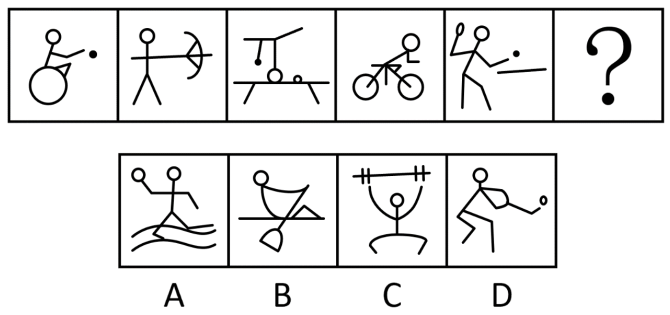

- **A**. A
- **B**. B
- **C**. C
- **D**. D　✅

**答案**：D

**官方解析**

元素组成不同，且无明显属性规律，考虑数量规律。题干每幅图形均出现直线，且直线数量较多，考虑直线数。题干图形的直线数依次为5、6、7、8、9，故“？”处图形的直线数应为10，只有D项符合。
故正确答案为D。

---

## 第 2 题　qid 5908625 · 图形推理

从所给的四个选项中，选择最合适的一个填入问号处，使之呈现一定的规律性：

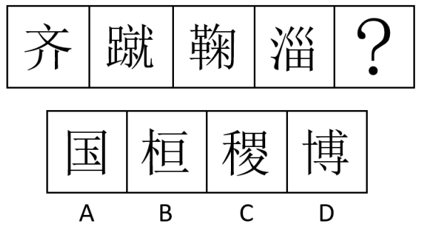

- **A**. A
- **B**. B
- **C**. C　✅
- **D**. D

**答案**：C

**官方解析**

元素组成不同，且无明显属性规律，优先考虑数量规律。观察发现，题干图形均为汉字，且有明显的封闭空间，优先考虑面数量。题干图形的面数量依次为1、2、3、4，故“？”处图形的面数量应为5，只有C项符合。
故正确答案为C。

---

## 第 3 题　qid 5908604 · 图形推理

从所给的四个选项中，选择最合适的一项填入问号处，使之呈现一定的规律性: 

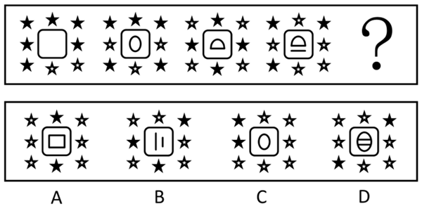

- **A**. A　✅
- **B**. B
- **C**. C
- **D**. D

**答案**：A

**官方解析**

元素组成不同，且无明显属性规律，考虑数量规律。观察发现，题干图形分为内外两部分，考虑分开看，题干图形外部白色五角星的数量依次为2、3、4、5，所以？处图形外部应有6个白色五角星，排除B项；再次观察发现，题干图形内部线条数量依次为0、1、2、3，故？处图形的内部线条数量应为4，只有A项符合。
故正确答案为A。

---

## 第 4 题　qid 5908612 · 图形推理

从所给的四个选项中，选择最合适的一个填入问号处，使之呈现一定的规律性：

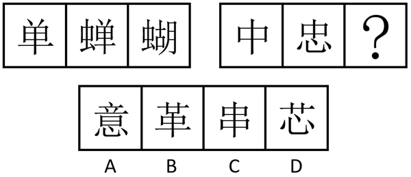

- **A**. A　✅
- **B**. B
- **C**. C
- **D**. D

**答案**：A

**官方解析**

元素组成不同，且无明显属性规律，优先考虑数量规律。观察发现，第一组图中图1和图2均出现“单”，图2和图3均出现“虫”，即相邻图形存在相同元素，且相同元素并不相同；第二组图中图1和图2均出现“中”，故图2与“？”处图形应均出现“心”，排除B、C两项。再次观察发现，第一组图中每幅图可拆成的单字个数分别为1、2、3，第二组图中前两幅图可拆成的单字个数分别为1、2，故“？”处图形可拆成的单字个数应为3，只有A项符合。
故正确答案为A。

---

## 第 5 题　qid 5908619 · 图形推理

从所给的四个选项中，选择最合适的一个填入问号处，使之呈现一定的规律性：

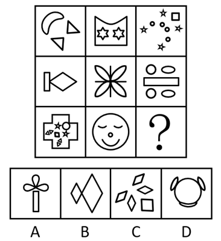

- **A**. A
- **B**. B
- **C**. C　✅
- **D**. D

**答案**：C

**官方解析**

元素组成不同，优先考虑属性规律。观察发现，题干图形出现等腰三角形、菱形、五角星等多个等腰元素，优先考虑对称性。题干图形均为轴对称图形，且对称轴如下图所示，九宫格图形呈“米”字型对称，只有C项符合。

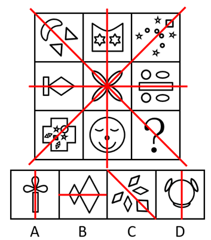

故正确答案为C。

---

## 第 6 题　qid 5908646 · 图形推理

从所给的四个选项中，选择最合适的一个填入问号处，使之呈现一定的规律性：

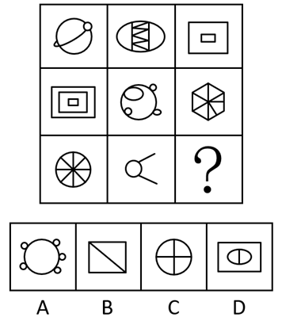

- **A**. A　✅
- **B**. B
- **C**. C
- **D**. D

**答案**：A

**官方解析**

元素组成不同，且无明显属性规律，考虑数量规律。观察发现，题干图形的封闭面明显，优先考虑数面。第一行中，面数量分别为4、9、2，和为15；第二行中，面数量分别为3、5、7，和为15；第三行应用此规律，前两幅图的面数量分别为8、1，故？处图形的面数量应为6，只有A项符合。
故正确答案为A。

---

## 第 7 题　qid 5908629 · 图形推理

左图是给定纸盒的外表面展开图，下面哪一项能由它折叠而成？

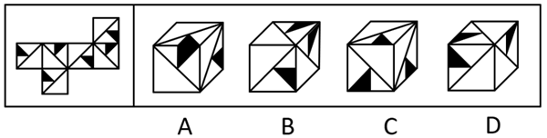

- **A**. A
- **B**. B　✅
- **C**. C
- **D**. D

**答案**：B

**官方解析**

将题干展开图标上序号，如下图所示，逐一分析选项。

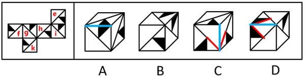

A项：如上图所示，题干展开图中不存在两个面内的黑色三角形的直角边有公共边，而选项中正面和顶面内的黑色三角形的直角边有公共边，选项与题干展开图不一致，排除；

B项：选项为面e、f、g或面e、h、i或面f、i、k，选项与题干展开图一致，当选；

C项：如上图所示，题干展开图中不存在两个面内的最小白色三角形的斜边均朝向公共边，而选项中正面和侧面内的最小白色三角形的斜边均朝向公共边，选项与题干展开图不一致，排除；

D项：如上图所示，题干展开图中不存在两个面内的黑色三角形的斜边均朝向公共边，而选项中正面和顶面内的黑色三角形的斜边均朝向公共边，选项与题干展开图不一致，排除。

故正确答案为B。

---

## 第 8 题　qid 5908635 · 图形推理

下图四个小多面体均由等大的正方体组成。下面哪一项无法由①~④在使用一次的情况下拼出？

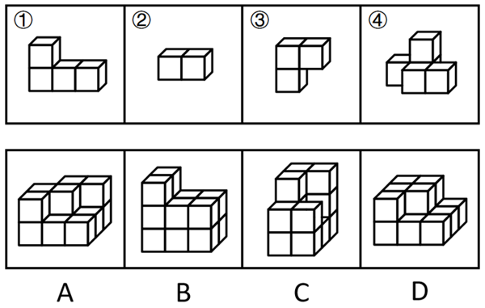

- **A**. A　✅
- **B**. B
- **C**. C
- **D**. D

**答案**：A

**官方解析**

本题考查立体拼合。B、C、D三项均可以由①~④在使用一次的情况下拼出，拼合方式如下图所示。

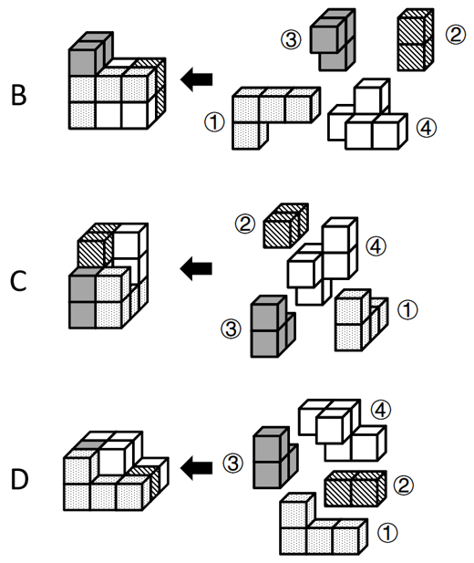

对于A项，由于视角问题，无法确定A项最下层的左上角（如箭头所示）是否有正方体。如果此处有正方体，则A项可以由①~④在使用一次的情况下拼出，拼合方式如下图所示；如果此处没有正方体，则A项无法拼出，因此，粉笔更倾向于选择A项。

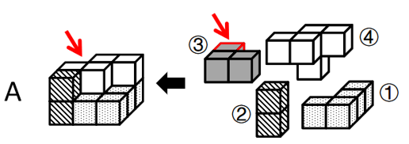

本题为选非题，故正确答案为A。

注：本题为争议题，大家了解基本解题思路即可，无需作为备考重点。

---

## 第 9 题　qid 5908638 · 图形推理

把下面六个图形分为两类，使每一类图形都有各自的共同特征或规律，分类正确的一项是：

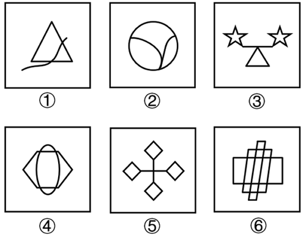

- **A**. ①④⑤，②③⑥
- **B**. ①②④，③⑤⑥　✅
- **C**. ①④⑥，②③⑤
- **D**. ①③⑤，②④⑥

**答案**：B

**官方解析**

本题为分组分类题目。元素组成不同，优先考虑属性规律。观察发现，图①②④均为含有曲线的图形，图③⑤⑥均为全直线的图形，故图①②④为一组，图③⑤⑥为一组。
故正确答案为B。

---

## 第 10 题　qid 5908642 · 图形推理

把下面六个图形分为两类，使每一类图形都有各自的共同特征或规律，分类正确的一项是：

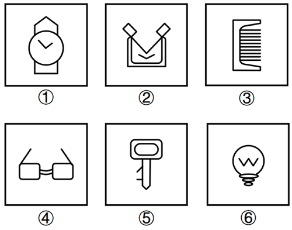

- **A**. ①②③，④⑤⑥
- **B**. ①②④，③⑤⑥
- **C**. ①②⑥，③④⑤　✅
- **D**. ①③④，②⑤⑥

**答案**：C

**官方解析**

本题为分组分类题目。元素组成不同，优先考虑属性规律。题干出现若干生活化图形，且存在明显封闭与开放，优先考虑开闭性。观察发现，图①②⑥为全封闭图形，图③④⑤为半开半闭图形，故图①②⑥为一组，图③④⑤为一组。
故正确答案为C。

---

## 第 11 题　qid 13648278 · 定义判断

雪球抽样样本是一种非随机抽样，指为了后续研究需要，已确定的研究对象需协助调查者指认与自身相似的其他对象进而保证本调查研究有足够数量的样本。
根据上述定义，下列最适合作为雪球抽样样本的是：

- **A**. 股票经纪人
- **B**. 基层干部
- **C**. 奥运冠军
- **D**. 吸毒者　✅

**答案**：D

**官方解析**

第一步：找出定义关键词。
“已确定的研究对象需协助调查者指认与自身相似的其他对象”、“保证本调查研究有足够数量的样本”。
第二步：逐一分析选项。
A项：股票经纪人是指在证券交易所中接受客户指令买卖证券，充当交易双方中介并收取佣金的证券商。在针对股票经纪人进行抽样调查时，直接在证券公司等股票经纪人的工作场所进行抽样调查，即可确保足够数量的调查样本，不需要通过让已确定的股票经纪人协助调查者指认其他股票经纪人来确保足够数量的样本，不符合“已确定的研究对象需协助调查者指认与自身相似的其他对象”、“保证本调查研究有足够数量的样本”，不符合定义，排除；
B项：在针对基层干部进行抽样调查时，直接在基层单位进行抽样调查，即可确保足够数量的调查样本，不需要通过让已确定的基层干部协助调查者指认其他基层干部来确保足够数量的样本，不符合“已确定的研究对象需协助调查者指认与自身相似的其他对象”、“保证本调查研究有足够数量的样本”，不符合定义，排除；
C项：在针对奥运冠军进行抽样调查时，直接根据官方名录进行抽样调查，即可确保足够数量的调查样本，不需要通过让已确定的奥运冠军协助调查者指认其他奥运冠军来确保足够数量的样本，不符合“已确定的研究对象需协助调查者指认与自身相似的其他对象”、“保证本调查研究有足够数量的样本”，不符合定义，排除；
D项：在针对吸毒者进行抽样调查时，调查者很难整体性获取足够数量的调查样本，往往需要调查者找到一位吸毒者作为起始点，与他建立信任关系，通过他获取更多其他吸毒者的信息，并邀请他们参与调查，以确保有足够数量的样本，符合“已确定的研究对象需协助调查者指认与自身相似的其他对象”、“保证本调查研究有足够数量的样本”，符合定义，当选。
故正确答案为D。

---

## 第 12 题　qid 13648281 · 定义判断

沙盒监管是指先要划定一个范围，对在“盒子”里面的企业，采取包容审慎的监管措施，同时杜绝将问题扩散到“盒子”外面，实行容错纠错机制，并由监管部门对运行过程进行全过程监管，以保证测试的安全性并作出最终的评价。
根据上述定义，下列属于沙盒监管的是：

- **A**. 某市政府创设“银行业务创新监管互动机制”为金融科技的创新与监管提供制度支持　✅
- **B**. 某市生态环境局对非法排污的某化工厂处以责令停产整治的行政处罚
- **C**. 某地金融监管局要求信贷机构强化对小微企业和三农领域等重点对象的信贷支持
- **D**. 某县市场监管局对肉类食品公司开展专项整治活动以保障人民群众“舌尖上的安全”

**答案**：A

**官方解析**

第一步：找出定义关键词。
“划定一个范围”、“对在‘盒子’里面的企业，采取包容审慎的监管措施”、“杜绝将问题扩散到‘盒子’外面”、“由监管部门对运行过程进行全过程监管”。
第二步：逐一分析选项。
A项：某市政府创设“银行业务创新监管互动机制”，说明划定了银行业务这个范围，符合“划定一个范围”，为金融科技的创新与监管提供制度支持，说明该制度涉及监管机制，符合“对在‘盒子’里面的企业，采取包容审慎的监管措施”、“由监管部门对运行过程进行全过程监管”，符合定义，当选；
B项：某市生态环境局对某化工厂处以行政处罚，其中行政处罚是一种惩戒行为，并未体现监管措施，不符合“对在‘盒子’里面的企业，采取包容审慎的监管措施”、“由监管部门对运行过程进行全过程监管”，不符合定义，排除；
C项：某地金融监管局要求信贷机构强化对重点对象的信贷支持，其中金融监管局提出具体要求，并未体现监管措施，不符合“对在‘盒子’里面的企业，采取包容审慎的监管措施”、“由监管部门对运行过程进行全过程监管”，不符合定义，排除；
D项：某县市场监管局对肉类食品公司开展专项整治活动，其中专项整治活动是一种解决问题的举措，并未体现监管措施，不符合“对在‘盒子’里面的企业，采取包容审慎的监管措施”、“由监管部门对运行过程进行全过程监管”，不符合定义，排除。
故正确答案为A。

---

## 第 13 题　qid 13648277 · 定义判断

居家养老服务是指政府和社会力量依托社区为居家的老年人提供生活照料、家政服务、康复护理和精神慰藉等方面服务的一种形式。它是对传统家庭养老模式的补充与更新，是我国发展社区服务、建立养老服务体系的一项重要内容。
根据上述定义，下列属于居家养老服务的是：

- **A**. 陈医生经常利用休息时间为社区的居家老人免费提供医疗服务
- **B**. 大学生志愿者以一对一的形式照料着社区里的每一位居家老人
- **C**. 社区通过老年人信息库发布老年人服务需求信息和社会服务供给信息　✅
- **D**. 社区陈爷爷的近亲属轮流回家照顾他的生活起居，并进行精神慰藉

**答案**：C

**官方解析**

第一步：找出定义关键词。
“政府和社会力量”、“依托社区”、“为居家的老年人提供生活照料、家政服务、康复护理和精神慰藉”。
第二步：逐一分析选项。
A项：陈医生为社区的居家老人免费提供医疗服务，并未体现以社区为依托，不符合“依托社区”，不符合定义，排除；
B项：大学生志愿者一对一照料社区里的居家老人，并未体现以社区为依托，不符合“依托社区”，不符合定义，排除；
C项：社区通过老年人信息库发布老年人服务需求信息和社会服务供给信息，说明政府和社会力量可以依托社区，为老年人提供居家养老服务，符合“政府和社会力量”、“依托社区”、“为居家的老年人提供生活照料、家政服务、康复护理和精神慰藉”，符合定义，当选；
D项：近亲属轮流照顾陈爷爷的生活起居，其中近亲属是家人，不属于社会力量，且并未体现以社区为依托，不符合“政府和社会力量”、“依托社区”，不符合定义，排除。
故正确答案为C。

---

## 第 14 题　qid 13648276 · 定义判断

斜木桶理论是指如果木桶被搁置在一个斜坡上，那么决定盛水量的不是最短的木板，而是最长的木板。按照斜木桶理论，人们可以在不完善的游戏规则中积极寻找一个斜坡，以此发挥自己的优势，利用优势来弥补自己的不足。
根据上述定义，下列体现斜木桶理论的是：

- **A**. 某大学生在校期间成绩名列前茅，积极效仿比尔·盖茨，在大二时选择退学在计算机领域进行创业
- **B**. 某房地产企业从前年开始盲目跟风造车，却难以突破造车技术壁垒，于是今年决定放弃造车
- **C**. 大学生小李是班长，他天资聪慧、刻苦好学，有着很好的团队协作能力和奉献精神，本科毕业后顺利考取了选调生
- **D**. 高中生小王的英语和语文成绩经常不及格，但理科成绩在年级名列前茅，后来在中国数学奥林匹克竞赛中获得金牌，成功保送至某名校　✅

**答案**：D

**官方解析**

第一步：找出定义关键词。
“发挥自己的优势，利用优势来弥补自己的不足”。
第二步：逐一分析选项。
A项：某大学生在校期间成绩优异，在大二时退学创业，其中成绩优异是他的优势，但退学创业并不是发挥他自身的优势来弥补不足，不符合“发挥自己的优势，利用优势来弥补自己的不足”，不符合定义，排除；
B项：某房地产企业跟风造车，因难以突破造车技术壁垒而放弃造车，仅体现出该企业的不足之处，没有体现出该企业利用优势来弥补不足，不符合“发挥自己的优势，利用优势来弥补自己的不足”，不符合定义，排除；
C项：大学生小李天资聪慧、刻苦好学，毕业后顺利考取了选调生，仅体现出他的优势，并未体现出他的不足之处，没有体现出他利用自身优势来弥补不足，不符合“发挥自己的优势，利用优势来弥补自己的不足”，不符合定义，排除；
D项：高中生小王的英语和语文成绩经常不及格，这是他的不足之处，而理科成绩优异，这是他的优势，他通过在中国数学奥林匹克竞赛中获得金牌，成功保送至名校，说明他利用了自身优势来弥补不足，符合“发挥自己的优势，利用优势来弥补自己的不足”，符合定义，当选。
故正确答案为D。

---

## 第 15 题　qid 13648279 · 定义判断

法律证成是给一个具体法律决定提供充足理由的活动或过程，可分为内部证成和外部证成。内部证成是指法律决定必须按照一定的推理规则从相关前提中逻辑地推导出来的活动或过程。外部证成是指对法律决定所依赖的前提进行寻找、判断与论证的活动或过程。
根据上述定义，下列说法正确的是：

- **A**. 某基层人民法院法官就其裁判中所适用的公序良俗原则进行正当性论证属于外部证成　✅
- **B**. 某市监狱管理局执法人员就存在冲突的法律条文进行优先适用论证属于内部证成
- **C**. 某设区的市人大常委会就新修订法规的实施情况组织专家评估属于法律证成
- **D**. 某市公安局依据法律条文对张某散布谣言的行为处以行政拘留不涉及法律证成

**答案**：A

**官方解析**

第一步：找出定义关键词。
法律证成：“给一个具体法律决定提供充足理由的活动或过程”；
内部证成：“法律决定必须按照一定的推理规则从相关前提中逻辑地推导出来的活动或过程”；
外部证成：“对法律决定所依赖的前提进行寻找、判断与论证的活动或过程”。
第二步：逐一分析选项。
A项：法官就其裁判中所适用的公序良俗原则进行正当性论证，“公序良俗原则”是法律决定依赖的前提，对该前提进行正当性论证，符合“对法律决定所依赖的前提进行寻找、判断与论证的活动或过程”，符合“外部证成”定义，说法正确，当选；
B项：执法人员就存在冲突的法律条文进行优先适用论证，需要按照法律条文的等级、新旧等原则选择出优先使用的法律条文，“使用的法律条文”是法律决定依赖的前提，对使用的法律条文进行优先适用论证，符合“对法律决定所依赖的前提进行寻找、判断与论证的活动或过程”，符合“外部证成”定义，不符合“内部证成”定义，说法错误，排除；
C项：就新修订法规的实施情况组织专家评估，只是评估实施情况，并不是给具体法律决定提供充足理由的活动或过程，不符合“给一个具体法律决定提供充足理由的活动或过程”，不符合“法律证成”定义，说法错误，排除；
D项：对张某散布谣言的行为处以行政拘留，是一个具体的法律决定，依据法律条文进行拘留，是给这个具体法律决定提供理由，符合“给一个具体法律决定提供充足理由的活动或过程”，符合“法律证成”定义，说法错误，排除。
故正确答案为A。

---

## 第 16 题　qid 13648280 · 定义判断

似真推理是一种认知推理，它是由似真前提或似真推论导出似真结论，尽管无法得到确定性的真结论，但也暂时没有理由支持结论为假，这就使得结论似然为真。
根据上述定义，下列不属于似真推理的是：

- **A**. 员工小王到济南出差，在住酒店、坐公交车、逛商场时感受到山东人的服务态度都很好，因此他说：“山东人就是热情好客！”
- **B**. 股民小张经常把两只股票进行对比，发现其中一只股票价格上涨，便预测另一只股票价格也可能会上涨
- **C**. 警察小李对某案情分析如下：如果受害者没有与凶手搏斗，那么手指不会折断；受害者手指折断，所以他与凶手搏斗了　✅
- **D**. 经理小赵在演讲中说：“如果保证产品质量，那么就会增加产品的销量；现在我们的产品销量增加了，说明我们保证了产品质量。”

**答案**：C

**官方解析**

第一步：找出定义关键词。
“无法得到确定性的真结论”。
第二步：逐一分析选项。
A项：员工小王根据自己的经历得出“山东人就是热情好客”的结论，该结论不必然为真，即得到了不确定为真的结论，符合“无法得到确定性的真结论”，符合定义，排除；
B项：股民小张根据一只股票价格上涨得到“另一只股票价格也可能会上涨”的结论，该结论不必然为真，即得到了不确定为真的结论，符合“无法得到确定性的真结论”，符合定义，排除；
C项：警察小李在案情分析中说“如果受害者没有与凶手搏斗，那么手指不会折断”，而“受害者手指折断”属于否后，根据否后必否前，可以推出“受害者与凶手搏斗”，因此结论“受害者与凶手搏斗了”必然为真，不符合“无法得到确定性的真结论”，不符合定义，当选；
D项：经理小赵在演讲中说“如果保证产品质量，那么就会增加产品的销量”，而“我们的产品销量增加”属于肯后，由于肯后无必然结论，因此“我们保证了产品质量”不必然为真，即得到了不确定为真的结论，符合“无法得到确定性的真结论”，符合定义，排除。
本题为选非题，故正确答案为C。

---

## 第 17 题　qid 13648283 · 定义判断

睡眠-觉醒节律紊乱，也称昼夜节律睡眠-觉醒障碍，指个体的睡眠与其现实要求或大部分人所遵循的节律不符的觉醒紊乱。
根据上述定义，下列不属于睡眠-觉醒节律紊乱的是：

- **A**. 小张入睡时间在凌晨2~6点，不能在正常时间起床
- **B**. 老李睡眠时间比正常人早，经常在傍晚就感到困倦
- **C**. 小王因次日要参加重要考试，当晚久久不能入睡　✅
- **D**. 老赵因居住环境拥挤嘈杂，晚上常处于时睡时醒状态

**答案**：C

**官方解析**

第一步：找出定义关键词。
“个体的睡眠与其现实要求或大部分人所遵循的节律不符的觉醒紊乱”。
第二步：逐一分析选项。
A项：小张入睡时间在凌晨，且不能在正常时间起床，说明小张的睡眠与大部分人所遵循的节律不符，符合“个体的睡眠与其现实要求或大部分人所遵循的节律不符的觉醒紊乱”，符合定义，排除；
B项：老李睡眠时间比正常人早，经常在傍晚就感到困倦，说明老李的睡眠与大部分人所遵循的节律不符，符合“个体的睡眠与其现实要求或大部分人所遵循的节律不符的觉醒紊乱”，符合定义，排除；
C项：小王因次日要参加重要考试，当晚久久不能入睡，这属于特殊情况，不是小王的睡眠所遵循的节律，不符合“个体的睡眠与其现实要求或大部分人所遵循的节律不符的觉醒紊乱”，不符合定义，当选；
D项：老赵因居住环境拥挤嘈杂，晚上常处于时睡时醒状态，说明老赵的睡眠与大部分人所遵循的节律不符，符合“个体的睡眠与其现实要求或大部分人所遵循的节律不符的觉醒紊乱”，符合定义，排除。
本题为选非题，故正确答案为C。

---

## 第 18 题　qid 13648282 · 定义判断

新闻是对客观事实进行报道和传播而形成的信息。但是，客观事实本身不是新闻，被报道出来的新闻是在报道者对客观事实进行主观反映之后形成的观念性的信息。新闻报道是对客观事实的报道，按照传播手段，可划分为口头新闻、文字新闻、广播新闻和电视新闻等。
根据上述定义，下列不属于新闻报道的是：

- **A**. 外交部新闻发言人在新闻发布会上发表讲话，并回答中外记者的提问
- **B**. 中国女篮以73-71力克日本队，夺取了2023年女篮亚洲杯冠军　✅
- **C**. 村委会通过村务公开栏张贴和大喇叭公告两种形式宣传“中央一号文件”
- **D**. 全国各地电视台都在第一时间实况转播了全国“两会”的开幕式盛况

**答案**：B

**官方解析**

第一步：找出定义关键词。
新闻：“对客观事实进行报道和传播而形成的信息”；
新闻报道：“对客观事实的报道”。
第二步：逐一分析选项。
A项：外交部新闻发言人在发布会上发表讲话并回答记者的提问，是对外交方面客观事实的报道，符合“对客观事实的报道”，符合“新闻报道”定义，排除；
B项：中国女篮夺取女篮亚洲杯冠军，是客观事实，未体现报道，不符合“对客观事实的报道”，不符合“新闻报道”定义，当选；
C项：村委会通过村务公开栏张贴和大喇叭公告两种形式宣传“中央一号文件”，是对“中央一号文件”这个客观事实的报道，符合“对客观事实的报道”，符合“新闻报道”定义，排除；
D项：全国各地电视台实况转播全国“两会”的开幕式，是对全国“两会”开幕式这个客观事实的报道，符合“对客观事实的报道”，符合“新闻报道”定义，排除。
本题为选非题，故正确答案为B。

---

## 第 19 题　qid 13648285 · 定义判断

侔式推理是指从一个命题通过“侔”的方法，即在这一命题的主项和谓项上附加齐等的词项可得出另一命题，从而使得两辞相比而俱行。也就是说，侔式推理就是附加齐等词项的直接推理。
根据上述定义，下列属于侔式推理的是：

- **A**. “三日入厨下，洗手作羹汤。未谙姑食性，先遣小姑尝。”
- **B**. “信言不美，美言不信。善者不辩，辩者不善。”
- **C**. “树在道边而多子，此必苦李。”
- **D**. “白马，马也；乘白马，乘马也。”　✅

**答案**：D

**官方解析**

第一步：找出定义关键词。

“附加齐等词项的直接推理”。

第二步：逐一分析选项。

A项：意思为新婚三天来到厨房，洗手亲自来做羹汤，不知婆婆什么口味，做好先让小姑品尝，没有体现推理过程，不符合“附加齐等词项的直接推理”，不符合定义，排除；

B项：意思为真实可信的话不漂亮，漂亮的话不真实，善良的人不巧说，巧说的人不善良，选项前半部分的推理过程为“信言不美，美言不信”，后半部分的推理过程为“善者不辩，辩者不善”，选项前后没有附加齐等词项，不符合“附加齐等词项的直接推理”，不符合定义，排除；

C项：意思为李树在路边竟然还有这么多李子，这一定是苦李子，选项的推理过程为“树在道边而多子苦李”，选项只有一个命题，且前后没有附加齐等词项，不符合“附加齐等词项的直接推理”，不符合定义，排除；

D项：意思为白马是马，乘白马是乘马，选项前半部分的推理过程为“白马马”，后半部分的推理过程为“乘白马乘马”，附加了齐等词项“乘”，符合“附加齐等词项的直接推理”，符合定义，当选。

故正确答案为D。

---

## 第 20 题　qid 13648286 · 定义判断

封闭性问题指具有标准答案的问题，这类问题除了标准答案之外的解答，均被认为是错误解答。
根据上述定义，下列属于封闭性问题的是：

- **A**. 什么是幸福生活
- **B**. 宇宙中有外星人吗　✅
- **C**. 我应该报考哪所大学
- **D**. 世界上最美丽的城市是哪座

**答案**：B

**官方解析**

第一步：找出定义关键词。
“具有标准答案的问题”、“除了标准答案之外的解答，均被认为是错误解答”。
第二步：逐一分析选项。
A项：“什么是幸福生活”这一问题没有标准答案，因为每个人心目中的幸福生活是不同的，不符合“具有标准答案的问题”、“除了标准答案之外的解答，均被认为是错误解答”，不符合定义，排除；
B项：“宇宙中有外星人吗”这一问题具有标准答案，即要么有外星人，要么没有外星人，符合“具有标准答案的问题”、“除了标准答案之外的解答，均被认为是错误解答”，符合定义，当选；
C项：“我应该报考哪所大学”问题中的“我”指代的是每一个看到这个问题的人，因此该问题没有标准答案，因为每个人能报考的大学是不同的，不符合“具有标准答案的问题”、“除了标准答案之外的解答，均被认为是错误解答”，不符合定义，排除；
D项：“世界上最美丽的城市是哪座”这一问题没有标准答案，因为每个人心目中最美丽的城市是不同的，不符合“具有标准答案的问题”、“除了标准答案之外的解答，均被认为是错误解答”，不符合定义，排除。
故正确答案为B。

---

## 第 21 题　qid 5908627 · 类比推理

聊斋志异：马骥

- **A**. 三国演义：诸葛亮
- **B**. 平凡的世界：孙少平
- **C**. 源氏物语：紫式部
- **D**. 红楼梦：贾宝玉　✅

**答案**：D

**官方解析**

第一步：判断题干词语间逻辑关系。
“马骥”是《聊斋志异》中描写的人物，二者是作品与其描写人物的对应关系。
第二步：判断选项词语间逻辑关系。
A项：“诸葛亮”是《三国演义》中描写的人物，二者是作品与其描写人物的对应关系，与题干逻辑关系一致，保留；
B项：“孙少平”是《平凡的世界》中描写的人物，二者是作品与其描写人物的对应关系，与题干逻辑关系一致，保留；
C项：“紫式部”是《源氏物语》的作者，二者是作品与其作者的对应关系，与题干逻辑关系不一致，排除；
D项：“贾宝玉”是《红楼梦》中描写的人物，二者是作品与其描写人物的对应关系，与题干逻辑关系一致，保留。
对比A、B、D三项，题干的《聊斋志异》是清代的作品，马骥是作品中虚构的人物；A项的《三国演义》是元末明初的作品，诸葛亮是历史上真实存在的人物；B项的《平凡的世界》是20世纪80年代的作品，孙少平是作品中虚构的人物；D项的《红楼梦》是清代的作品，贾宝玉是作品中虚构的人物，因此D项与题干的逻辑关系更为一致，当选。
注：也有些同学选择A项，认为《聊斋志异》是由很多故事组成的，马骥只是其中一篇《罗刹海市》中的主人公，并非贯穿整本小说的主人公，A项中的诸葛亮也并非贯穿整本小说的主人公，而B项中的孙少平和D项中的贾宝玉都是贯穿整本小说的主人公。这样理解确实有一定道理，但是对于诸葛亮算不算贯穿《三国演义》的主人公，各方说法存在争议，所以小粉笔更倾向于D项。
本题为争议题，我们重点学习出现作品和人物时可能考查的两种关系即可。
故正确答案为D。

---

## 第 22 题　qid 5908632 · 类比推理

星舰发射：火星移民

- **A**. 个性消费：网红经济
- **B**. 风洞试验：飞机定性　✅
- **C**. 降低利率：调控经济
- **D**. 宜居安居：城市更新

**答案**：B

**官方解析**

第一步：判断题干词语间逻辑关系。
通过“星舰发射”可以达到“火星移民”的目的，二者是方式目的的对应关系。
第二步：判断选项词语间逻辑关系。
A项：个性消费是指消费者购买商品不再只是满足对物的需求，而主要是看重商品的个性特征，希望通过购物来展示自我，以达到精神上的满足；网红经济是以网红的品味和眼光为主导，依托庞大的粉丝群体进行定向营销，从而将粉丝转化为购买力的一个过程，二者没有明显的逻辑关系，与题干逻辑关系不一致，排除；
B项：通过“风洞试验”可以达到给“飞机定性”的目的，二者是方式目的的对应关系，与题干逻辑关系一致，保留；
C项：通过“降低利率”可以达到“调控经济”的目的，二者是方式目的的对应关系，与题干逻辑关系一致，保留；
D项：城市更新是一种对城市中已经不适应现代化城市社会生活的地区进行的必要的、有计划的改建活动，因此通过“城市更新”可以达到让城市“宜居安居”的目的，二者是方式目的的对应关系，但词语顺序与题干相反，与题干逻辑关系不一致，排除。
对比B、C两项，题干中“星舰发射”和“火星移民”均为“名词在前，动作在后”的结构，B项中“风洞试验”和“飞机定性”均为“名词在前，动作在后”的结构，C项中“降低利率”和“调控经济”均为“动作在前，名词在后”的结构，因此B项与题干逻辑关系更为一致，当选。
故正确答案为B。

---

## 第 23 题　qid 5908633 · 类比推理

颁奖人：获奖者

- **A**. 参会人：主持人
- **B**. 纳税人：税务局
- **C**. 纪录片：观众
- **D**. 绑架者：人质　✅

**答案**：D

**官方解析**

第一步：判断题干词语间逻辑关系。
颁奖人颁奖的对象是获奖者，二者是动作发出者与对象的对应关系。
第二步：判断选项词语间逻辑关系。
A项：参会人和主持人不是动作发出者与对象的对应关系，与题干逻辑关系不一致，排除；
B项：纳税人纳税的对象是税务局，二者是动作发出者与对象的对应关系，与题干逻辑关系一致，保留；
C项：观众观看的对象是纪录片，二者是动作发出者与对象的对应关系，但词语顺序与题干相反，与题干逻辑关系不一致，排除；
D项：绑架者绑架的对象是人质，二者是动作发出者与对象的对应关系，与题干逻辑关系一致，保留。
对比B、D两项，题干中的“获奖者”和D项中的“人质”均指“人”，而B项中的税务局是“政府机关”，因此D项与题干的逻辑关系更为一致，当选。
故正确答案为D。

---

## 第 24 题　qid 5908636 · 类比推理

鳄鱼：鱼

- **A**. 镭：金属
- **B**. 蜗牛：昆虫　✅
- **C**. 小熊猫：浣熊
- **D**. 蝮蛇：蛇

**答案**：B

**官方解析**

第一步：判断题干词语间逻辑关系。
鳄鱼是爬行动物，不是鱼，二者为反向种属关系。
第二步：判断选项词语间逻辑关系。
A项：镭是金属，二者为种属关系，与题干逻辑关系不一致，排除；
B项：蜗牛是软体动物，不是昆虫，二者为反向种属关系，与题干逻辑关系一致，当选；
C项：小熊猫和浣熊是两种不同的哺乳动物，二者为并列关系，与题干逻辑关系不一致，排除；
D项：蝮蛇是蛇，二者为种属关系，与题干逻辑关系不一致，排除。
故正确答案为B。

---

## 第 25 题　qid 5908595 · 类比推理

铁锅：炒菜：生锈

- **A**. 炸药：爆破：爆炸　✅
- **B**. 玻璃：瓶子：折射
- **C**. 清水：饮用：结冰
- **D**. 飞机：运输：乘坐

**答案**：A

**官方解析**

第一步：判断题干词语间逻辑关系。
铁锅可以用来炒菜，二者为功能的对应关系；铁锅具有会生锈的特点，二者为属性的对应关系。
第二步：判断选项词语间逻辑关系。
A项：炸药可以用来爆破，二者为功能的对应关系；炸药具有会爆炸的特点，二者为属性的对应关系，与题干逻辑关系一致，保留；
B项：玻璃是用来制造瓶子的原材料，二者为原材料和成品的对应关系，与题干逻辑关系不一致，排除；
C项：清水可以用来饮用，二者为功能的对应关系；清水具有会结冰的特点，二者为属性的对应关系，与题干逻辑关系一致，保留；
D项：飞机可以用来运输，也可以用来乘坐，运输、乘坐和飞机都是功能的对应关系，与题干逻辑关系不一致，排除。
对比A、C两项，题干中的铁锅为人造产物，生锈为化学反应；A项中的炸药为人造产物，爆炸为化学反应；C项中的清水为自然界中本来就存在的物质，结冰为物理反应。因此A项与题干逻辑关系更为一致，当选。
故正确答案为A。

---

## 第 26 题　qid 5908606 · 类比推理

明：囦：岩

- **A**. 汉：囩：导
- **B**. 科：闪：崽
- **C**. 鹛：困：穹　✅
- **D**. 群：田：至

**答案**：C

**官方解析**

第一步：判断题干词语间逻辑关系。
 “明”为左右结构，“囦”为全包围结构，“岩”为上下结构。
第二步：判断选项词语间逻辑关系。
A项：“汉”为左右结构，“囩”为全包围结构，“导”为上下结构，与题干逻辑关系一致，保留；
B项：“科”为左右结构，但“闪”为半包围结构，与题干逻辑关系不一致，排除；
C项：“鹛”为左右结构，“困”为全包围结构，“穹”为上下结构，与题干逻辑关系一致，保留；
D项：“群”为左右结构，但“田”是独体字，即以笔画为直接单位构成的汉字，作为一个囫囵整体切分不开，并非全包围结构，与题干逻辑关系不一致，排除。
解法一：对比A、C两项，题干中“明”（日+月）、“囦”（囗+水）、“岩”（山+石）均可拆分为2个独立汉字，C项中“鹛”（眉+鸟）、“困”（囗+木）、“穹”（穴+弓）也可拆分为2个独立汉字，A项中“囩”（囗+云）、“导”（巳+寸）可拆分为2个独立汉字，但“汉”无法拆分为2个独立汉字，因此C项与题干逻辑关系更为一致，当选。
故正确答案为C。
解法二：对比A、C两项，题干中“明”字的部首“日”在左边，“囦”字的部首“囗”在外边，“岩”的部首“山”在上边，A项中“汉”字的部首“氵”在左边，“囩”字的部首“囗”在外边，“导”字的部首“巳”在上边，而C项中“鹛”字的部首“鸟”在右边，因此A项与题干逻辑关系更为一致，当选。
故正确答案为A。
上述两种解法都有道理，小粉笔建议不用太过纠结，学习一下解题思路即可。

---

## 第 27 题　qid 5908613 · 类比推理

证人：出庭：陈述

- **A**. 军队：排练：阅兵
- **B**. 医生：查房：出诊
- **C**. 编导：拍摄：采访
- **D**. 乘客：购票：乘车　✅

**答案**：D

**官方解析**

第一步：判断题干词语间逻辑关系。
证人先出庭，再陈述，后两词存在时间先后顺序的对应关系。
第二步：判断选项词语间逻辑关系。
A项：军队先排练，再被阅兵，后两词存在时间先后顺序的对应关系，与题干逻辑关系一致，保留；
B项：医生查房和出诊之间没有必然的时间先后顺序，与题干逻辑关系不一致，排除；
C项：编导拍摄和采访之间没有必然的时间先后顺序，与题干逻辑关系不一致，排除；
D项：乘客先购票，再乘车，后两词存在时间先后顺序的对应关系，与题干逻辑关系一致，保留。
对比A、D两项，题干中“出庭”和“陈述”的主体均为证人，D项中“购票”和“乘车”的主体均为乘客，而A项中“阅兵”的主体不是军队，因此D项与题干逻辑关系更为一致，当选。
故正确答案为D。

---

## 第 28 题　qid 5908599 · 类比推理

城市气候：热岛效应：气温变化

- **A**. 赤潮：绿藻增殖：水体污染
- **B**. 生物：遗传物质：DNA遗传
- **C**. 法律：国家机器：捍卫权益
- **D**. 灾害：气象灾害：经济损失　✅

**答案**：D

**官方解析**

第一步：判断题干词语间逻辑关系。
“热岛效应”是城市热岛效应的简称，是指城市气温高于郊区的现象。“热岛效应”是一种“城市气候”，二者为种属关系，一般来说，“气温变化”会导致“热岛效应”，但这么理解本题无答案，而“热岛效应”也会加剧“气温变化”，二者也可以看为因果的对应关系。
第二步：判断选项词语间逻辑关系。
A项：“赤潮”是在特定的环境条件下，藻类等爆发性增殖或高度聚集而引起水体变色的一种有害生态现象。“绿藻增殖”不是一种“赤潮”，二者不是种属关系，与题干逻辑关系不一致，排除；
B项：“遗传物质”即亲代与子代之间传递遗传信息的物质。“生物”具备“遗传物质”，二者不是种属关系，与题干逻辑关系不一致，排除；
C项：“国家机器”是马克思主义经典作家对国家形象化的称呼，主要指军队、警察、法庭、监狱等。“国家机器”不是一种“法律”，二者不是种属关系，与题干逻辑关系不一致，排除；
D项：“气象灾害”是一种“灾害”，二者为种属关系，“气象灾害”会导致“经济损失”，二者为因果的对应关系，与题干逻辑关系一致，当选。
故正确答案为D。

---

## 第 29 题　qid 5908626 · 类比推理

（    ） 对于 裁缝 相当于 （    ） 对于 司机

- **A**. 方格尺 网约车　✅
- **B**. 宿舍 车库
- **C**. 工作服 千斤顶
- **D**. 车间 4S店

**答案**：A

**官方解析**

逐一代入选项。
A项：方格尺是裁缝工作时需要使用的工具，二者为工具与职业的对应关系；网约车是司机工作时需要使用的工具，二者为工具与职业的对应关系，前后逻辑关系一致，当选；
B项：裁缝住在宿舍里，二者为职业与住宿地点的对应关系；司机将车停在车库里，二者为职业与工具存放地点的对应关系，前后逻辑关系不一致，排除；
C项：裁缝工作时穿着工作服，二者为职业与穿着的对应关系；千斤顶是一种起重设备，是司机维修车辆时可能会用到的工具，二者为工具与职业的对应关系，前后逻辑关系不一致，排除；
D项：裁缝在车间工作，二者为职业与工作地点的对应关系；司机和4S店无必然联系，前后逻辑关系不一致，排除。
故正确答案为A。

---

## 第 30 题　qid 5908637 · 类比推理

蝉噪林逾静 对于 （    ） 相当于 （    ） 对于 满架蔷薇一院香

- **A**. 菊花从此不须开 谷鸟吟晴日
- **B**. 蒌蒿满地芦芽短 雁行遥上月
- **C**. 石榴开遍透帘明 卢橘垂金弹　✅
- **D**. 千里莺啼绿映红 燕草如碧丝

**答案**：C

**官方解析**

逐一代入选项。
A项：“蝉噪林逾静”出自王籍《入若耶溪》，意思是蝉鸣阵阵，林间愈见幽静，“菊花从此不须开”出自杜甫《九日五首·其一》，意思是菊花也没有必要开放，两句诗分别描绘夏天和秋天的景象；“谷鸟吟晴日”出自李白《江夏别宋之悌》，意思是天气晴朗时山间的鸟不停地鸣叫，“满架蔷薇一院香”出自高骈《山亭夏日》，意思是满架的蔷薇花开，香气弥漫整个院子，两句诗均描绘夏天的景象，前后逻辑关系不一致，排除；
B项：“蝉噪林逾静”出自王籍《入若耶溪》，意思是蝉鸣阵阵，林间愈见幽静，“蒌蒿满地芦芽短”出自苏轼《惠崇春江晚景二首·其一》，意思是遍地蒌蒿，芦苇露出短芽，两句诗分别描绘夏天和春天的景象；“雁行遥上月”出自李百药《送别》，意思是飞雁的行列映着遥远的月亮，“满架蔷薇一院香”出自高骈《山亭夏日》，意思是满架的蔷薇花开，香气弥漫整个院子，两句诗分别描绘秋天和夏天的景象，前后逻辑关系不一致，排除；
C项：“蝉噪林逾静”出自王籍《入若耶溪》，意思是蝉鸣阵阵，林间愈见幽静，“石榴开遍透帘明”出自苏舜钦《夏意》，意思是穿透帘子看见石榴花开得正艳，两句诗均描绘夏天的景象；“卢橘垂金弹”出自樊珣《状江南·仲夏》，意思是卢橘挂果，仿佛金灿灿的弹珠，“满架蔷薇一院香”出自高骈《山亭夏日》，意思是满架的蔷薇花开，香气弥漫整个院子，两句诗均描绘夏天的景象，前后诗句均描绘相同季节，前后逻辑关系一致，当选；
D项：“蝉噪林逾静”出自王籍《入若耶溪》，意思是蝉鸣阵阵，林间愈见幽静，“千里莺啼绿映红”出自杜牧《江南春》，意思是辽阔的千里江南，黄莺在欢乐地歌唱，丛丛绿树映着簇簇红花，两句诗分别描绘夏天和春天的景象；“燕草如碧丝”出自李白《春思》，意思是燕地小草像碧丝般青绿，“满架蔷薇一院香”出自高骈《山亭夏日》，意思是满架的蔷薇花开，香气弥漫整个院子，两句诗分别描绘春天和夏天的景象，前后逻辑关系不一致，排除。
故正确答案为C。

---

## 第 31 题　qid 13648288 · 逻辑判断

作为中国离海最远的内陆省份，坐拥沙漠和戈壁滩的新疆利用现代技术，让海鲜“搬家”到这里谋生，实现了海鲜和陆地养殖的“双向奔赴”。然而业内专家指出，尽管利用盐碱地和半咸水开展水产养殖的新疆海鲜火爆出圈，但海水养殖和河口养殖仍难以被轻易替代。
以下哪项如果为真，最能支持上述观点？

- **A**. 陆养海鲜面临养殖周期短、成本高、运输困难等问题　✅
- **B**. 新疆尼勒克县的三文鱼除了供应国内市场外，也会出口新加坡等国家
- **C**. 从阿克苏市赶来的东风惠民市场客商们赶早抢购南美白对虾，趁着鲜活上市售卖
- **D**. 麦盖提县天然的碱性水质养出了个头肥硕、体型饱满的澳洲淡水龙虾

**答案**：A

**官方解析**

第一步：找出论点和论据。
论点：海水养殖和河口养殖仍难以被轻易替代。
论据：无。
本题只有论点没有论据，加强优先考虑补充论据，即解释原因或举例子。
第二步：逐一分析选项。
A项：该项指出陆养海鲜面临很多问题，说明海水养殖和河口养殖的确难以被轻易替代，补充论据，可以加强，当选；
B项：该项指出三文鱼的供应市场包含国内外，而论点说的是海水养殖和河口养殖仍难以被轻易替代，话题不一致，无法加强，排除；
C项：该项指出新疆养殖的海鲜被客商们争相抢购，而论点说的是海水养殖和河口养殖仍难以被轻易替代，话题不一致，无法加强，排除；
D项：该项指出麦盖提县天然的碱性水质养出了澳洲淡水龙虾，说明海水养殖和河口养殖可以被替代，削弱论点，无法加强，排除。
故正确答案为A。

---

## 第 32 题　qid 13648287 · 逻辑判断

原子制造是以原子为原料制造所需的材料和器件产品。它是近来被高度关注的原子级制造技术体系中的核心部分之一，将史无前例地实现对原子的逐一精确操控，将原子按需垒砌，构筑原子级细锐、精准、完美，而且具备从物理上远超常规块材物性的产品。因此，有观点认为，原子制造将会成为微纳制造后人类制造技术继续微缩发展的趋势，也将成为新物质创制中的极限，对于现有制造业具有颠覆性意义。
以下哪项如果为真，最能削弱上述观点？

- **A**. 当今微纳制造的芯片能力正在趋于极限，而原子制造能够突破这一极限
- **B**. 原子制造是传统的纳米化制造，是现在制造技术的线性化发展　✅
- **C**. 原子制造操控技术不成熟，其技术精致化仍面临重大挑战
- **D**. 原子制造可以使材料学家获得真正具有应用价值的新材料

**答案**：B

**官方解析**

第一步：找出论点和论据。
论点：原子制造将会成为微纳制造后人类制造技术继续微缩发展的趋势，也将成为新物质创制中的极限，对于现有制造业具有颠覆性意义。
论据：原子制造是近来被高度关注的原子级制造技术体系中的核心部分之一，将史无前例地实现对原子的逐一精确操控，将原子按需垒砌，构筑原子级细锐、精准、完美，而且具备从物理上远超常规块材物性的产品。
本题论点讨论的是原子制造对于现有制造业具有“颠覆性意义”，而论据讨论的是原子制造将“史无前例”地实现对原子的逐一精确操控，而且构筑具备从物理上远超常规块材物性的产品，论点和论据话题一致，削弱优先考虑削弱论点。
第二步：逐一分析选项。
A项：该项指出原子制造能够突破当今芯片能力的极限，说明原子制造可能对于现有制造业具有颠覆性意义，具有加强作用，无法削弱，排除；
B项：该项指出原子制造是“传统”的纳米化制造，是现在制造技术的线性化发展，说明原子制造不具有颠覆性，削弱论点，可以削弱，当选；
C项：该项指出原子制造技术仍面临重大挑战，只能说明原子制造的技术还有待进步，而论点讨论的是原子制造对于现有制造业具有颠覆性意义，话题不一致，无法削弱，排除；
D项：该项指出原子制造可以使材料学家获得真正具有应用价值的新材料，但无法判断新材料是否能证明原子制造对于现有制造业具有颠覆性意义，不明确项，无法削弱，排除。
故正确答案为B。

---

## 第 33 题　qid 13648289 · 逻辑判断

在工作和生活中，人们遇到拿不准的问题总是习惯于请教专家。人们常常认为，某一领域的专家对该领域了解得更多，相关知识更丰富，经验更多，因此，对该领域相关问题的判断比外行更准确，而专家们对自己的判断通常也非常自信。人们（包括专家自己）对于专家的这一信念被一些人称为“专家幻觉”。
以下哪项如果为真，最能解释上述现象？

- **A**. 对那些与人的情感和性格涉及不多或影响不大的领域，专家预测的准确性较强
- **B**. 当事件的可预测性低时，专家比一般人更自信，反而降低了专家的预测水平
- **C**. 专门知识的拥有量、经验的丰富程度与判断的准确性之间并不存在必然正相关性　✅
- **D**. 由于专家在其研究的领域具有较强专业性，人们对专家有一种习惯性信赖

**答案**：C

**官方解析**

第一步：找出题干矛盾。
人们（包括专家自己）对于专家的这一信念被一些人称为“专家幻觉”，认为前面题干的内容是假的，即实际上专家并不会因为对某一领域了解得更多，相关知识更丰富，经验更多而判断得更准确。
第二步：逐一分析选项。
A项：选项指出部分领域的专家预测比较准确，但并没有解释为什么前面题干的内容是“专家幻觉”，不能解释题干矛盾，排除；
B项：选项指出当事件的可预测性低时专家预测水平更低的原因，并没有解释为什么前面题干的内容是“专家幻觉”，不能解释题干矛盾，排除；
C项：选项指出专门知识的拥有量、经验的丰富程度与判断的准确性不存在必然的正相关性，解释为什么专家并不会因为对某一领域了解得更多，相关知识更丰富，经验更多而判断得更准确，即解释了前面题干的内容为什么是“专家幻觉”，可以解释题干矛盾，当选；
D项：选项指出人们对专家信赖的原因，并没有解释为什么前面题干的内容是“专家幻觉”，不能解释题干矛盾，排除。
故正确答案为C。

---

## 第 34 题　qid 13648291 · 逻辑判断

人类早期是从丛林中走出来的，后来又从农村走向了城市。在这个过程中，我们身上带着很多看不见的老朋友——微生物。然而，在进入城市后，室内生活的增加使得人类与自然的接触大大减少，我们身上的微生物与自然界微生物的交换机会也大大减少，这不可避免地会带来一些健康问题。因此，有研究者指出，城市绿色空间的构建，应强化基于自然的解决方案，突出自然和人工的有机耦合，实现良好的微生态循环。
以下哪项如果为真，最能支持上述结论？

- **A**. 大量采样表明城市里绝大部分的微生物来自人类
- **B**. 通过调控人居环境微生物的组成可以有效改善人体免疫力　✅
- **C**. 当前人类身上的微生物不断在人口高度集中的环境中循环
- **D**. 城市的绿色生态景观能够明显稀释以人类自身微生物为主的微生物体系

**答案**：B

**官方解析**

第一步：找出论点和论据。
论点：城市绿色空间的构建，应强化基于自然的解决方案，突出自然和人工的有机耦合，实现良好的微生态循环。
论据：在进入城市后，室内生活的增加使得人类与自然的接触大大减少，我们身上的微生物与自然界微生物的交换机会也大大减少，这不可避免地会带来一些健康问题。
本题论点和论据说的都是城市使得人类与自然界微生物交换变少，二者话题一致，加强优先考虑补充论据。
第二步：逐一分析选项。
A项：该项指出城市里绝大部分微生物的来源，而论点讨论的是城市绿色空间应如何构建，话题不一致，无法加强，排除；
B项：该项指出调控人居环境微生物的组成可以有效改善人体免疫力，说明城市绿色空间的构建可以减少微生物给人类带来的健康问题，补充论据，可以加强，当选；
C项：该项指出人类身上的微生物不断在人口高度集中的环境中循环，而论点讨论的是城市绿色空间应如何构建，话题不一致，无法加强，排除；
D项：该项指出城市的绿色生态景观能够稀释以人类自身微生物为主的微生物体系，但无法判断是否可以减少因缺乏微生物的交换而给人类带来的健康问题，无法加强，排除。
故正确答案为B。

---

## 第 35 题　qid 13648290 · 类比推理

国家要繁荣富强，必须科技腾飞；科技要想腾飞，关键在于人才。因此，国家繁荣富强迫切需要大批优秀的科技人才。
下列选项与上述推理结构形式最为相似的是：

- **A**. 1号仓库中储存小麦，2号仓库中储存大豆。因此，1号仓库中不可能储存大豆
- **B**. 乡村要振兴，必须产业振兴；产业要振兴，关键在组织。因此，乡村急需产业振兴
- **C**. 小张个头比小王高，小王个头比小李高。因此，小张个头比小李高
- **D**. 只有勤奋才会取得优秀成绩，勤奋需要意志支撑。因此，要取得优秀成绩必须具有坚强意志　✅

**答案**：D

**官方解析**

第一步：分析题干推理结构。

题干翻译为：国家繁荣富强科技腾飞，科技腾飞人才。因此，国家繁荣富强人才，即12，23，因此13。

第二步：逐一分析选项。

A项：翻译为：1号小麦，2号大豆。因此，1号大豆，即12，34，因此14，与题干推理结构不一致，排除；

B项：翻译为：乡村振兴产业振兴，产业振兴组织。因此，乡村产业振兴，即12，23，因此42，与题干推理结构不一致，排除；

C项：翻译为：小张&gt;小王，小王&gt;小李。因此，小张&gt;小李，即1&gt;2，2&gt;3，因此1&gt;3，与题干推理结构不一致，排除；

D项：翻译为：取得优秀成绩勤奋，勤奋意志支撑。因此，取得优秀成绩坚强意志，即12，23，因此13，与题干推理结构一致，当选。

故正确答案为D。

---

## 第 36 题　qid 13648292 · 逻辑判断

盐湖是由不同矿物离子富集而形成的湖泊。合适的构造、丰富的物源，加上持续干旱的气候，导致湖水大量蒸发浓缩，各类元素不断在盆地中富集，经过长时间演化，最终形成了高矿化度的盐湖。如果补给水源减少或消失，盐湖将进一步浓缩，甚至可能形成地表水较少或没有地表水的干盐湖，或者最终埋藏在地下而形成古代盐湖。因此，有观点认为，盐湖在流域水文生态系统中对于维持水-盐动态平衡具有重要作用。
以下哪项如果为真，最能支持上述观点？

- **A**. 盐湖虽然含盐量高，但水中仍然生活着大量嗜盐和耐盐微生物
- **B**. 盐湖地区淡水资源短缺，植被覆盖度低，生态环境十分脆弱
- **C**. 盐湖地区的地表水与周围地下水之间存在密切的水力联系　✅
- **D**. 有的盐湖在一年内绝大部分时间是干枯的，只有潮湿季节才有暂时性的表面卤水

**答案**：C

**官方解析**

第一步：找出论点和论据。
论点：盐湖在流域水文生态系统中对于维持水-盐动态平衡具有重要作用。
论据：如果补给水源减少或消失，盐湖将进一步浓缩，甚至可能形成地表水较少或没有地表水的干盐湖，或者最终埋藏在地下而形成古代盐湖。
本题论点说的是盐湖对于维持水-盐动态平衡具有重要作用，论据说的是水源的动态变化对盐湖地表水位的影响，二者话题一致，加强优先考虑补充论据。
第二步：逐一分析选项。
A项：该项指出盐湖中生活着大量嗜盐和耐盐微生物，并未提及盐湖能否维持水-盐动态平衡，属于无关项，无法加强，排除；
B项：该项指出盐湖地区生态环境十分脆弱，并未提及盐湖能否维持水-盐动态平衡，属于无关项，无法加强，排除；
C项：该项指出盐湖地区的地表水与周围地下水之间存在水力联系，解释了为什么盐湖能够维持水-盐动态平衡，补充论据，可以加强，当选；
D项：该项指出有的盐湖在只有潮湿季节才有暂时性的表面卤水，并未提及盐湖能否维持水-盐动态平衡，属于无关项，无法加强，排除。
故正确答案为C。

---

## 第 37 题　qid 13648296 · 逻辑判断

在超大特大城市积极稳步实施城中村改造是改善民生、扩大内需、推动城市高质量发展的一项重要举措。落实这一重要举措的一个必备的战略思路是要坚持稳中求进、积极稳妥，优先对群众需求迫切、城市安全和社会治理隐患多的城中村进行改造。
由此可以推出：

- **A**. 如果不在超大特大城市积极稳步实施城中村改造，就不能改善民生、扩大内需、推动城市高质量发展
- **B**. 如果要改善民生、扩大内需、推动城市高质量发展，就要在超大特大城市积极稳步实施城中村改造
- **C**. 如果坚持稳中求进、积极稳妥，优先对群众需求迫切、城市安全和社会治理隐患多的城中村进行改造，就能够在超大特大城市积极稳步实施城中村改造
- **D**. 如果不坚持稳中求进、积极稳妥，优先对群众需求迫切、城市安全和社会治理隐患多的城中村进行改造，就不能在超大特大城市积极稳步实施城中村改造　✅

**答案**：D

**官方解析**

第一步：翻译题干。

落实这一重要举措（在超大特大城市积极稳步实施城中村改造）坚持稳中求进、积极稳妥，优先对群众需求迫切、城市安全和社会治理隐患多的城中村进行改造。

第二步：逐一分析选项。

A项：翻译为：在超大特大城市积极稳步实施城中村改造改善民生、扩大内需、推动城市高质量发展，二者不存在逻辑关系，无法推出，排除；

B项：翻译为：改善民生、扩大内需、推动城市高质量发展在超大特大城市积极稳步实施城中村改造，二者不存在逻辑关系，无法推出，排除；

C项：翻译为：坚持稳中求进、积极稳妥，优先对群众需求迫切、城市安全和社会治理隐患多的城中村进行改造在超大特大城市积极稳步实施城中村改造，是对题干推出关系的肯后，肯后得不到确定结论，无法推出，排除；

D项：翻译为：坚持稳中求进、积极稳妥，优先对群众需求迫切、城市安全和社会治理隐患多的城中村进行改造在超大特大城市积极稳步实施城中村改造，是对题干推出关系的否后，否后必否前，可以推出，当选。

故正确答案为D。

---

## 第 38 题　qid 13648294 · 逻辑判断

外来物种入侵已成为当前急需解决的生态环境问题，在国内环境下，由于外来物种没有天敌，放生或弃养的鳄雀鳝已对相关水域水生生物多样性以及生态安全造成重大影响。捕捞鳄雀鳝已成为相当棘手的问题。对此，有人认为，可以通过从国外引进天敌来制约外来物种。
以下哪项如果为真，最能反驳上述结论？

- **A**. 外来物种的天敌并不适宜中国国内的生存环境
- **B**. 引入外来物种的天敌将对国内生态环境造成更大破坏　✅
- **C**. 外来物种天敌的引入需要经过复杂的论证
- **D**. 我国每年对外来物种入侵的治理投入难以估算

**答案**：B

**官方解析**

第一步：找出论点和论据。
论点：可以通过从国外引进天敌来制约外来物种。
论据：外来物种入侵已成为当前急需解决的生态环境问题，在国内环境下，由于外来物种没有天敌，放生或弃养的鳄雀鳝已对相关水域水生生物多样性以及生态安全造成重大影响。捕捞鳄雀鳝已成为相当棘手的问题。
本题论点说的是可以通过从国外引进天敌来制约外来物种，论据以鳄雀鳝为例，说的是没有天敌的外来物种对生态环境造成重大影响，二者话题紧密相关，可以理解为话题一致，削弱优先考虑削弱论点。
第二步：逐一分析选项。
A项：该项指出外来物种的天敌并不适宜中国国内的生存环境，说明外来物种的天敌在国内可能无法生存，也就无法制约外来物种，削弱论点，保留；
B项：该项指出引入外来物种的天敌将对国内生态环境造成更大破坏，说明通过引进天敌来制约外来物种无法达到保护生态环境的目的，削弱论点，保留；
C项：该项指出外来物种天敌的引入需要经过复杂的论证，讨论的是引入外来物种天敌前需要做的工作，而论点是通过从国外引进天敌来制约外来物种，话题不一致，无法削弱，排除；
D项：该项指出我国每年对外来物种入侵的治理投入难以估算，说的是治理外来物种的投入多，而论点是通过从国外引进天敌来制约外来物种，话题不一致，无法削弱，排除。
对比A、B两项，A项仅说明外来物种的天敌并不适宜中国国内的生存环境，可能无法制约外来物种；B项直接指明无法通过从国外引进天敌制约外来物种来达到保护生态环境的目的，与题干论证的联系更紧密、更确定，B项削弱力度大于A项，当选。
故正确答案为B。

---

## 第 39 题　qid 13648295 · 逻辑判断

欧洲晴雨表网站的调查表明，英国民众对欧盟的支持是波动的，苏格兰和威尔士的支持程度一直稳定且偏高，在法国和德国拒绝入侵伊拉克之后，英国对欧盟的总体支持达到最低点，英国政府推迟了涉及多数表决的新宪法的所有提议。然而，英国政府支持进一步扩大欧盟——为了削弱法国和德国的主导地位。
由此可以推出：

- **A**. 法德两国在欧盟的地位影响了英国政府的某些决策　✅
- **B**. 英国政府此前对“扩大欧盟”的支持与法德两国有关
- **C**. 苏格兰对欧盟的支持程度一直高于英国
- **D**. 苏格兰和威尔士并不担忧法德两国在欧盟的地位

**答案**：A

**官方解析**

日常结论题，根据题干信息逐一分析选项。
A项：题干最后一句指出英国政府为了削弱法国和德国的主导地位支持进一步扩大欧盟，证明了法德两国在欧盟的地位影响了英国政府的某些决策，可以推出，当选；
B项：题干中没有涉及“此前”英国政府的情况，无中生有，无法推出，排除；
C项：题干只是指出“苏格兰和威尔士的支持程度一直稳定且偏高”，并没有与英国比较，无法推出，排除；
D项：题干未提及苏格兰和威尔士是否担忧法德两国在欧盟的地位，无中生有，无法推出，排除。
故正确答案为A。

---

## 第 40 题　qid 13648297 · 逻辑判断

学生小赵、小钱、小孙、小李和小周，他们都想选某老师作为自己的指导老师，现已知：
（1）5名学生中有3名属于20岁以下年龄段，2名属于20岁及以上年龄段；
（2）有2名学生的专业是哲学，其他3名学生的专业是文学；
（3）小赵和小孙的年龄段相同，小李和小周的年龄段不同；
（4）小钱和小周的专业相同，小孙和小李的专业不同；
（5）最终结果为，该老师选择了一名年龄大于20岁的哲学专业学生。
由此可以推出，这名学生是：

- **A**. 小赵
- **B**. 小钱
- **C**. 小孙
- **D**. 小李　✅

**答案**：D

**官方解析**

第一步：分析题干条件。
（1）5名学生中有3名20岁以下，2名20岁及以上；
（2）2名学生的专业是哲学，3名学生的专业是文学；
（3）小赵和小孙的年龄段相同，小李和小周的年龄段不同；
（4）小钱和小周的专业相同，小孙和小李的专业不同；
（5）最终选择了一名年龄大于20岁的哲学专业学生。
第二步：根据题干条件进行推理。
根据条件（3）小李和小周的年龄段不同，可知小李和小周中必有一个人与条件（3）中小赵和小孙的年龄段相同，根据条件（1）有3名20岁以下，2名20岁及以上，可以推出小赵和小孙一定是20岁以下，排除A、C两项；
根据条件（4）小孙和小李的专业不同，可知小孙和小李中必有一个人与条件（4）中小钱和小周的专业相同，根据条件（2）2名学生的专业是哲学，3名学生的专业是文学，可以推出小钱和小周的专业一定是文学，排除B项，D项当选。
故正确答案为D。

---
