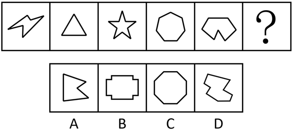
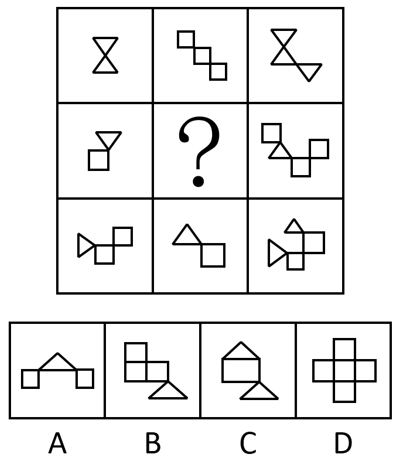
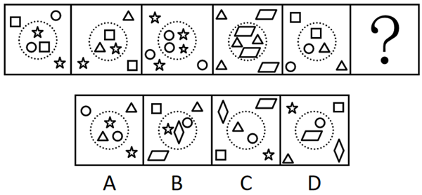
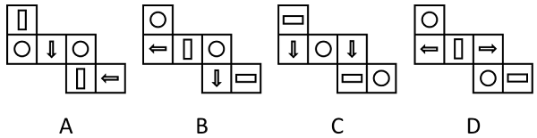
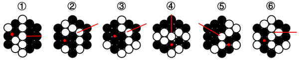
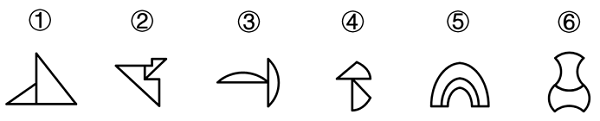
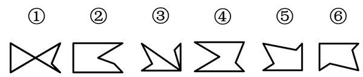
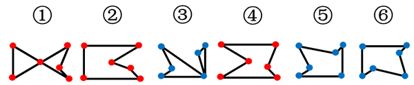
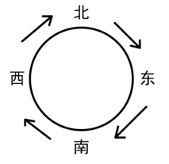
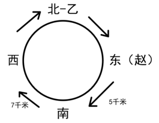

# 2024年山西省县级纪委监委公务员录用考试《行测》题（网友回忆版）

> 判断推理 · 40 题 · 山西 2024

## 第 1 题　qid 17097244 · 图形推理

从所给的四个选项中，选择最合适的一个填入问号处，使之呈现一定的规律性：

- **A**. A
- **B**. B
- **C**. C
- **D**. D　✅

**答案**：D

**官方解析**

元素组成不同，且无明显属性规律，考虑数量规律。观察发现，题干图1和图3为“日”字变形图，且图3出现了出头端点，考虑笔画数。题干图形均为一笔画图形，故？处图形也应为一笔画图形，只有D项符合。
故正确答案为D。

---

## 第 2 题　qid 17097246 · 图形推理

从所给的四个选项中，选择最合适的一个填入问号处，使之呈现一定的规律性：

- **A**. A
- **B**. B
- **C**. C　✅
- **D**. D

**答案**：C

**官方解析**

元素组成相同，优先考虑位置规律。观察发现，黑色方块沿外框每次逆时针移动1格，排除A、B两项；小黑点沿外框每次逆时针移动1格、2格、3格、4格，故从图5到？处小黑点应沿外框逆时针移动5格，只有C项符合。
故正确答案为C。

---

## 第 3 题　qid 17097264 · 图形推理

从所给的四个选项中，选择最合适的一个填入问号处，使之呈现一定的规律性：

- **A**. A
- **B**. B
- **C**. C　✅
- **D**. D

**答案**：C

**官方解析**

题干图形均为多边形，观察发现，题干中凹多边形和凸多边形交替出现，因此？处应为凸多边形，只有C项符合。
故正确答案为C。

---

## 第 4 题　qid 17097275 · 图形推理

从所给的四个选项中，选择最合适的一个填入问号处，使之呈现一定的规律性：

- **A**. A　✅
- **B**. B
- **C**. C
- **D**. D

**答案**：A

**官方解析**

元素组成不同，且每幅图均由多个封闭图形组成，优先考虑图形间关系。观察发现，题干所有封闭图形均相交于点，只有A项符合。
故正确答案为A。

---

## 第 5 题　qid 17097243 · 图形推理

从所给的四个选项中，选择最合适的一个填入问号处，使之呈现一定的规律性：

- **A**. A　✅
- **B**. B
- **C**. C
- **D**. D

**答案**：A

**官方解析**

元素组成不同，且无明显属性规律，考虑数量规律。每幅图由若干小元素组成，且均被虚线圆分为内外两部分，观察发现，每幅图中虚线圆的内外小元素均相同，只有A项符合。
故正确答案为A。

---

## 第 6 题　qid 17097750 · 图形推理

以下为4个正方体的外表面展开图。其中哪个折成的正方体和其他3个不一样？

- **A**. A
- **B**. B　✅
- **C**. C
- **D**. D

**答案**：B

**官方解析**

本题为空间重构题。A、C、D三项中，构成相对面的两个面图案均相同，但B项中，“”面与“”面构成相对面，图案不同，只有B项与其他三项不同。

本题为选非题，故正确答案为B。

---

## 第 7 题　qid 17097263 · 图形推理

将一个正方体从中间挖去一个圆柱，得到如左图所示的新立体图形，从任意面剖开，右边哪一项不可能是该立体图形的截面？

- **A**. A
- **B**. B　✅
- **C**. C
- **D**. D

**答案**：B

**官方解析**

本题考查截面图，如下图所示，A、C、D三项均可截出，只有B项无法截出。

本题为选非题，故正确答案为B。

---

## 第 8 题　qid 17097245 · 图形推理

把下面六个图形分为两类，使每一类图形都有各自的共同特征或规律，分类正确的一项是：

- **A**. ①②③，④⑤⑥
- **B**. ①②④，③⑤⑥
- **C**. ①③⑥，②④⑤
- **D**. ①④⑤，②③⑥　✅

**答案**：D

**官方解析**

本题为分组分类题目。元素组成不同，且黑白球的个数没有规律。观察发现，题干图形的黑球都被分成两个部分，且图②、图④和图⑤中都出现了明显的箭头图形，考虑分开看对称性。图①④⑤中黑球个数多的部分是轴对称图形，黑球个数少的部分是中心对称图形，图②③⑥中黑球个数少的部分是轴对称图形，黑球个数多的部分是中心对称图形，如下图所示，即图①④⑤为一组，图②③⑥为一组。

故正确答案为D。

---

## 第 9 题　qid 17097266 · 图形推理

把下面六个图形分为两类，使每一类图形都有各自的共同特征或规律，分类正确的一项是：

- **A**. ①②③，④⑤⑥
- **B**. ①②⑤，③④⑥　✅
- **C**. ①③⑤，②④⑥
- **D**. ①④⑥，②③⑤

**答案**：B

**官方解析**

本题为分组分类题目。元素组成不同，且无明显属性规律，考虑数量规律。观察发现，题干图形均由两个面组成，且图①②⑤中，两个面相似（形状相同、大小不同），图③④⑥中，两个面全同（形状、大小均相同）。即图①②⑤为一组，图③④⑥为一组。
故正确答案为B。

---

## 第 10 题　qid 17097256 · 图形推理

把下面六个图形分为两类，使每一类图形都有各自的共同特征或规律，分类正确的一项是：

- **A**. ①②④，③⑤⑥　✅
- **B**. ①②⑤，③④⑥
- **C**. ①③⑤，②④⑥
- **D**. ①③⑥，②④⑤

**答案**：A

**官方解析**

本题为分组分类题目。元素组成不同，且无明显属性规律，考虑数量规律。观察发现，每幅图线条交叉明显，考虑交点数。每幅图的交点数均为6，无法分组，继续观察发现，图①②④中6个交点的分布位置相同，图③⑤⑥中6个交点的分布位置也相同，故图①②④为一组，图③⑤⑥为一组。

故正确答案为A。

---

## 第 11 题　qid 17097272 · 定义判断

实有判断又称“质的判断”，是断定某个或某类事物具有某种普遍性质的判断；反思判断是从此事物和别的事物的关系中断定该事物具有某种性质的判断。
根据上述定义，下列说法正确的是：

- **A**. “人固有一死”属于反思判断
- **B**. “地球是围绕太阳旋转的”属于实有判断
- **C**. “铅是一种有害微量元素”属于反思判断　✅
- **D**. “南美肺鱼不是某种鱼就是某种两栖动物”属于实有判断

**答案**：C

**官方解析**

第一步：找出定义关键词。
实有判断：“断定某个或某类事物具有某种普遍性质的判断”；
反思判断：“从此事物和别的事物的关系中断定该事物具有某种性质的判断”。
第二步：逐一分析选项。
A项：人固有一死，是对人具有生死这一普遍性质的判断，符合“断定某个或某类事物具有某种普遍性质的判断”，符合“实有判断”定义，不符合“反思判断”定义，说法错误，排除；
B项：地球是围绕太阳旋转的，说的是地球与太阳的关系，符合“从此事物和别的事物的关系中断定该事物具有某种性质的判断”，符合“反思判断”定义，不符合“实有判断”定义，说法错误，排除；
C项：铅是一种有害微量元素，“有害”是针对其他事物的，符合“从此事物和别的事物的关系中断定该事物具有某种性质的判断”，符合“反思判断”定义，说法正确，当选；
D项：南美肺鱼不是某种鱼就是某种两栖动物，没有判断出“南美肺鱼”具有哪种性质，不符合“断定某个或某类事物具有某种普遍性质的判断”，不符合“实有判断”定义，说法错误，排除。
故正确答案为C。

---

## 第 12 题　qid 17097255 · 定义判断

物业“分红”，指物业公司利用小区共用部分、共用设施设备等合法经营，其收益除用于补充专项维修资金外，还服务于业主。
根据上述定义，下列不属于物业“分红”的是：

- **A**. 物业公司将小区内宣传栏租给企业做广告，收益用于救济困难业主
- **B**. 物业公司将沿街附设房改成小超市，补充了节日“送温暖”慰问金
- **C**. 物业公司将社会人士捐资用于购置公共健身设施，满足了业主需求　✅
- **D**. 物业公司将空置停车位出租，租金用于业主志愿者夜巡队购买夜餐

**答案**：C

**官方解析**

第一步：找出定义关键词。
“利用小区共用部分、共用设施设备等合法经营”、“收益除用于补充专项维修资金外，还服务于业主”。
第二步：逐一分析选项。
A项：物业公司将小区内宣传栏租给企业做广告，符合“利用小区共用部分、共用设施设备等合法经营”，收益用于救济困难业主，符合“收益除用于补充专项维修资金外，还服务于业主”，符合定义，排除；
B项：物业公司将沿街附设房改成小超市，“沿街附设房”属于小区公共财产，符合“利用小区共用部分、共用设施设备等合法经营”，补充了节日“送温暖”慰问金，符合“收益除用于补充专项维修资金外，还服务于业主”，符合定义，排除；
C项：物业公司将社会人士捐资用于购置公共健身设施，资金来源于社会人士的捐赠，不符合“利用小区共用部分、共用设施设备等合法经营”，不符合定义，当选；
D项：物业公司将空置停车位出租，符合“利用小区共用部分、共用设施设备等合法经营”，租金用于业主志愿者夜巡队购买夜餐，符合“收益除用于补充专项维修资金外，还服务于业主”，符合定义，排除。
本题为选非题，故正确答案为C。

---

## 第 13 题　qid 17097260 · 定义判断

当液体接触到比其沸点高得多的材料表面时，会立即蒸发形成隔热的蒸汽层，让液体悬浮在蒸汽层上，此时的摩擦力极小，所以液体能四处滑动，这一现象被称作莱顿弗罗斯特效应。
根据上述定义，下列不属于莱顿弗罗斯特效应应用的是：

- **A**. 快速把手放进液氮后抽离，手却不会冻伤
- **B**. 鸡蛋放进烧红的锅里快速翻炒，不会粘锅
- **C**. 用蘸水的手指快速捏灭蜡烛的火焰，手指不会烫伤
- **D**. 将加热后的金属工件放入水中淬火，以提高其硬度　✅

**答案**：D

**官方解析**

第一步：找出定义关键词。
“当液体接触到比其沸点高得多的材料表面时”、“立即蒸发形成隔热的蒸汽层，让液体悬浮在蒸汽层上”。
第二步：逐一分析选项。
A项：人手的温度远高于液氮的沸点，把手放进液氮，符合“当液体接触到比其沸点高得多的材料表面时”，人的手不会冻伤，是因为手的温度太高使液氮快速蒸发，形成一层蒸汽层阻隔手向液氮传热，符合“立即蒸发形成隔热的蒸汽层，让液体悬浮在蒸汽层上”，符合定义，排除；
B项：烧红的锅的温度远高于鸡蛋内液体的沸点，将鸡蛋放入烧红的锅里，符合“当液体接触到比其沸点高得多的材料表面时”，鸡蛋不会粘锅，是因为液体接触高温锅面会迅速形成蒸汽层，使鸡蛋悬浮，不与锅面直接接触，符合“立即蒸发形成隔热的蒸汽层，让液体悬浮在蒸汽层上”，符合定义，排除；
C项：蜡烛火焰的温度远高于水的沸点，用蘸水的手指捏灭蜡烛的火焰，符合“当液体接触到比其沸点高得多的材料表面时”，手指不会烫伤，是因为蜡烛的火焰会使手指表面的水迅速汽化，形成蒸汽层阻隔火焰向手指传热，符合“立即蒸发形成隔热的蒸汽层，让液体悬浮在蒸汽层上”，符合定义，排除；
D项：将加热后的金属工件放入水中淬火，是利用水的冷却作用使金属工件快速降温，并未利用蒸汽层的隔热作用，不符合“立即蒸发形成隔热的蒸汽层，让液体悬浮在蒸汽层上”，不符合定义，当选。
本题为选非题，故正确答案为D。

---

## 第 14 题　qid 17097251 · 定义判断

掠夺性定价是指企业为了把对手挤出市场或吓退试图进入市场的潜在对手，而采取大幅度降低价格的策略。
根据上述定义，下列属于掠夺性定价的是：

- **A**. 某超市为尽快清理库存，以超低价出售商品，几天之内店内商品被附近居民一抢而空
- **B**. 某服装店开展反季节大甩卖活动，价格低廉的服装吸引了众多顾客，其他商家纷纷效仿
- **C**. 某大型软件公司以低于成本价10%的价格销售产品，导致一些小企业因产品滞销而纷纷倒闭　✅
- **D**. 某商场举办家居装饰展览会，各大厂商纷纷打出“大减价”“全市最低价”“跳楼价”等广告吸引顾客

**答案**：C

**官方解析**

第一步：找出定义关键词。
“为了把对手挤出市场或吓退试图进入市场的潜在对手”、“采取大幅度降低价格的策略”。
第二步：逐一分析选项。
A项：超市为尽快清理库存而超低价出售商品，其目的是清理库存，而不是为了排挤竞争对手，不符合“为了把对手挤出市场或吓退试图进入市场的潜在对手”，不符合定义，排除；
B项：服装店开展反季节大甩卖活动，是为了处理反季商品，并不是为了排挤竞争对手，不符合“为了把对手挤出市场或吓退试图进入市场的潜在对手”，不符合定义，排除；
C项：大型软件公司以低于成本价10%的价格销售产品，符合“采取大幅度降低价格的策略”，导致一些小企业因产品滞销而纷纷倒闭，符合“为了把对手挤出市场或吓退试图进入市场的潜在对手”，符合定义，当选；
D项：各大厂商打出“大减价”等广告吸引顾客，并不是为了排挤竞争对手，不符合“为了把对手挤出市场或吓退试图进入市场的潜在对手”，不符合定义，排除。
故正确答案为C。

---

## 第 15 题　qid 17097254 · 定义判断

意定监护制度是指具有完全民事行为能力的成年人，可以与其近亲属、其他愿意担任监护人的个人或者组织事先协商，以书面形式确定自己的监护人，在自己丧失或者部分丧失民事行为能力时，由该监护人履行监护职责的制度。
根据上述定义，下列做法符合意定监护制度的是：

- **A**. 杨奶奶80多岁了，处于植物人状态多年，其儿子近来深感自己身体不好，欲将杨奶奶的侄子作为其监护人
- **B**. 小明今年七岁，其父母离婚时，小明坚决拒绝父母的任何一方做他的监护人，要求由其爷爷作为其监护人
- **C**. 龙先生将自己的外甥作为自己的监护人，其外甥由于遭遇交通事故，便将自己的监护职责托付给邻居
- **D**. 崔女士患上了渐冻症，在律师的陪同下，她在公证处办理了由其妹妹作为自己监护人的公证　✅

**答案**：D

**官方解析**

第一步：找出定义关键词。
“具有完全民事行为能力的成年人”、“与其近亲属、其他愿意担任监护人的个人或者组织事先协商，以书面形式确定自己的监护人”。
第二步：逐一分析选项。
A项：儿子想让杨奶奶的侄子当杨奶奶的监护人，不是杨奶奶确定自己的监护人，且植物人状态下的杨奶奶，不是“具有完全民事行为能力的成年人”，也不涉及“书面形式”，不符合定义，排除；
B项：只有七岁的小明，不符合“具有完全民事行为能力的成年人”，也不涉及“书面形式”，不符合定义，排除；
C项：龙先生的外甥将“龙先生”的监护职责托给邻居，不是龙先生确定自己的监护人，也没体现书面形式，不符合“与其近亲属、其他愿意担任监护人的个人或者组织事先协商，以书面形式确定自己的监护人”，不符合定义，排除；
D项：崔女士虽然是渐冻症患者，但是能在律师的陪同下办理公证，说明其病情还未影响民事行为能力，符合“具有完全民事行为能力的成年人”，公证处办理公证，体现了“书面形式”，妹妹作为自己的监护人，符合“与其近亲属、其他愿意担任监护人的个人或者组织事先协商，以书面形式确定自己的监护人”，符合定义，当选。
故正确答案为D。

---

## 第 16 题　qid 17097261 · 定义判断

兼语词组是汉语中一种特殊形式的词组，它由三个成分组成，第一个成分表示动作行为，第二个成分是前面动作行为的宾语，同时又是后面成分的主语，被称为兼语，第三个成分是第二个成分的谓语。
根据上述定义，下列不属于兼语词组的是：

- **A**. 希望他来　✅
- **B**. 无人入眠
- **C**. 派小王去
- **D**. 夸他厉害

**答案**：A

**官方解析**

第一步：找出定义关键词。
“第一个成分表示动作行为”、“第二个成分是前面动作行为的宾语，同时又是后面成分的主语”、“第三个成分是第二个成分的谓语”。
第二步：逐一分析选项。
A项：“希望”表示动作行为，“希望他”不是一个完整的词语结构，“希望他来”是动宾，“他来”是“希望”的宾语，不符合“第二个成分是前面动作行为的宾语，同时又是后面成分的主语”，不符合定义，当选；
B项：“无”表示动作行为，“无人”是动宾，“人入眠”是主谓，符合“第一个成分表示动作行为”、“第二个成分是前面动作行为的宾语，同时又是后面成分的主语”、“第三个成分是第二个成分的谓语”，符合定义，排除；
C项：“派”表示动作行为，“派小王”是动宾，“小王去”是主谓，符合“第一个成分表示动作行为”、“第二个成分是前面动作行为的宾语，同时又是后面成分的主语”、“第三个成分是第二个成分的谓语”，符合定义，排除；
D项：“夸”表示动作行为，“夸他”是动宾，“他厉害”是主谓，符合“第一个成分表示动作行为”、“第二个成分是前面动作行为的宾语，同时又是后面成分的主语”、“第三个成分是第二个成分的谓语”，符合定义，排除。
本题为选非题，故正确答案为A。

---

## 第 17 题　qid 17097248 · 定义判断

电梯法则，一般指用极具吸引力的方式，快速、简明、有效地阐述自己的观点。
根据上述定义，下列最符合“电梯法则”的是：

- **A**. 在限时演讲的开始就直奔主题，抓住关键　✅
- **B**. 写作时把观点概括为三条，分层次陈述
- **C**. 向客户推销产品时聊家常，拉近距离
- **D**. 提供心理咨询服务时营造轻松氛围

**答案**：A

**官方解析**

第一步：找出定义关键词。
“用极具吸引力的方式”、“快速、简明、有效地阐述自己的观点”。
第二步：逐一分析选项。
A项：该项中在限时演讲时，开门见山、快速、简明地阐述自己的观点，符合“用极具吸引力的方式”、“快速、简明、有效地阐述自己的观点”，符合定义，当选；
B项：该项中分层次陈述三条观点，没有体现快速和简明，不符合“快速、简明、有效地阐述自己的观点”，不符合定义，排除；
C项：该项中推销产品时聊家常，拉近距离，不符合“使用极具吸引力的方式”、“快速、简明、有效地阐述自己的观点”，不符合定义，排除；
D项：该项中营造的是轻松氛围，没有涉及阐述观点，不符合“快速、简明、有效地阐述自己的观点”，不符合定义，排除。
故正确答案为A。

---

## 第 18 题　qid 17097253 · 定义判断

头衔效应是指一个人一旦有了某种头衔，不管这种头衔是虚的还是实的，他往往都会努力去适应这一头衔的有关要求。
根据上述定义，下列反映了头衔效应的是：

- **A**. 在团队中设置一个管理岗位由团队成员轮流担当管理者
- **B**. 学校授予有突出导学育人才华的教师为星级教师、特级教师
- **C**. 因为被公司同事称为“开心果”，所以小王即使不开心也会假笑　✅
- **D**. 一些家长总是认为自己的孩子是“笨孩子”，导致孩子失去自信心

**答案**：C

**官方解析**

第一步：找出定义关键词。
“一旦有了某种头衔，不管这种头衔是虚的还是实的”、“往往都会努力去适应这一头衔的有关要求”。
第二步：逐一分析选项。
A项：该项中团队成员轮流当“管理者”，没有体现团队成员努力适应“管理者”这一头衔，不符合“往往都会努力去适应这一头衔的有关要求”，不符合定义，排除；
B项：该项中有突出导学育人才华的教师被授予了“星级教师、特级教师”，不是这些教师去适应“头衔”，不符合“往往都会努力去适应这一头衔的有关要求”，不符合定义，排除；
C项：该项中小王因为“开心果”的头衔，即使不开心也会假笑，符合“一旦有了某种头衔，不管这种头衔是虚的还是实的”、“往往都会努力去适应这一头衔的有关要求”，符合定义，当选；
D项：该项中孩子因为家长总是认为自己是“笨孩子”而失去了信心，不符合“往往都会努力去适应这一头衔的有关要求”，不符合定义，排除。
故正确答案为C。

---

## 第 19 题　qid 17591000 · 定义判断

社会认同原理是指人们乐于参照其他人的行为，经常依靠其他人的行为来决定自己应该怎么做，这种反应方式是无意识的、条件反射式的，为人们判断如何行事提供了一条捷径。
根据上述定义，下列不适合用社会认同原理解释的是：

- **A**. 情景喜剧中毫无笑点的情节配上笑声录音后观众会跟着笑
- **B**. 路人见到卖艺者身边的盒子装着不少钱，会更愿意捐钱
- **C**. 两个人童年时期的生活环境相似，很容易做出相同的选择　✅
- **D**. 出版商宣传时经常使用与“无数人都在看”类似的广告语

**答案**：C

**官方解析**

第一步：找出定义关键词。
“人们乐于参照其他人的行为，经常依靠其他人的行为来决定自己应该怎么做”、“是无意识的、条件反射式的，为人们判断如何行事提供了一条捷径”。
第二步：逐一分析选项。
A项：选项说明别人笑的话即使不好笑观众也会跟着笑，符合“人们乐于参照其他人的行为，经常依靠其他人的行为来决定自己应该怎么做”，符合定义，排除；
B项：卖艺者身边的盒子装着不少钱，说明别人愿意捐钱，路人因此更愿意捐钱，符合“人们乐于参照其他人的行为，经常依靠其他人的行为来决定自己应该怎么做”，符合定义，排除；
C项：相似的生活环境使人容易做出相同的选择，不符合“人们乐于参照其他人的行为，经常依靠其他人的行为来决定自己应该怎么做”，不符合定义，当选；
D项：“无数人都在看”体现了别人对图书的选择，出版商这样做就是利用了“人们乐于参照其他人的行为，经常依靠其他人的行为来决定自己应该怎么做”，符合定义，排除。
本题为选非题，故正确答案为C。

---

## 第 20 题　qid 17097247 · 定义判断

动作改善法是指改善人体动作的方式，减少疲劳，提高工作效率和舒适度的方法。主要包括三个方面的改善：有关于人体运用方面的；有关于工作场所的布置和环境方面的；有关于工具和设备的设计方面的。
根据上述定义，下列不属于动作改善法的是：

- **A**. 某垃圾站将其回收装置改为脚踏式
- **B**. 某公司要求办公室的台椅须高度可调
- **C**. 某装盒流水线作业中，工人直接将装好的盒子回拨下落，无需再次放回操作台上
- **D**. 某工厂在投料处的设置程序是：投料员甲喊出所投物料，投料员乙进行高声复述　✅

**答案**：D

**官方解析**

第一步：找出定义关键词。
“改善人体动作，减少疲劳，提高工作效率和舒适度”、“人体运用方面”、“工作场所的布置和环境方面”、“工具和设备的设计方面”。
第二步：逐一分析选项。
A项：某垃圾站将其回收装置改为“脚踏式”，符合“工具和设备的设计方面”，通过改变工具的操作方式来“改善人体动作，减少疲劳，提高工作效率和舒适度”，符合定义，排除；
B项：某公司通过可调节的台椅高度来提高员工的舒适度和工作效率，符合“工作场所的布置和环境方面”、“改善人体动作，减少疲劳，提高工作效率和舒适度”，符合定义，排除；
C项：工人“直接”将装好的盒子回拨下落，“无需”再次放回操作台上，通过优化工人的动作流程，减少了不必要的动作，提高了工作效率，符合“人体运用方面”、“改善人体动作，减少疲劳，提高工作效率和舒适度”，符合定义，排除；
D项：甲、乙两人是通过语言传递物料信息，不符合“改善人体动作，减少疲劳，提高工作效率和舒适度”，不符合定义，当选。
本题为选非题，故正确答案为D。

---

## 第 21 题　qid 17097257 · 类比推理

资源：配置

- **A**. 持续：工作
- **B**. 绿色：发展
- **C**. 环境：保护　✅
- **D**. 合理：分配

**答案**：C

**官方解析**

第一步：判断题干词语间逻辑关系。
配置资源，二者为动宾结构。
第二步：判断选项词语间逻辑关系。
A项：持续工作，二者为偏正结构，与题干逻辑关系不一致，排除；
B项：绿色发展，二者为偏正结构，与题干逻辑关系不一致，排除；
C项：保护环境，二者为动宾结构，与题干逻辑关系一致，当选；
D项：合理分配，二者为偏正结构，与题干逻辑关系不一致，排除。
故正确答案为C。

---

## 第 22 题　qid 17097252 · 类比推理

眼窗：防毒面具

- **A**. 齿轮：机械表　✅
- **B**. 公路：道路
- **C**. 自然数：实数
- **D**. 青霉素：抗菌素

**答案**：A

**官方解析**

第一步：判断题干词语间逻辑关系。
眼窗是防毒面具的组成部分，二者为组成关系。
第二步：判断选项词语间逻辑关系。
A项：齿轮是机械表的组成部分，二者为组成关系，与题干逻辑关系一致，当选；
B项：公路是道路的一种，二者为种属关系，与题干逻辑关系不一致，排除；
C项：自然数是实数的一种，二者为种属关系，与题干逻辑关系不一致，排除；
D项：青霉素是抗菌素的一种，二者为种属关系，与题干逻辑关系不一致，排除。
故正确答案为A。

---

## 第 23 题　qid 17097267 · 类比推理

杀鸡取卵：饮鸩止渴

- **A**. 呼风唤雨：雷厉风行
- **B**. 扬汤止沸：抱薪救火　✅
- **C**. 如出一辙：独具一格
- **D**. 峰回路转：否极泰来

**答案**：B

**官方解析**

第一步：判断题干词语间逻辑关系。
杀鸡取卵是指为了要得到鸡蛋，不惜把鸡杀了，比喻贪图眼前利益而不顾长远利益；饮鸩止渴是指喝毒酒解渴，比喻用错误的办法来解决眼前的困难而不顾严重后果，二者是近义关系。
第二步：判断选项词语间逻辑关系。
A项：呼风唤雨原指神仙道士神通广大，施展法术可以刮风下雨，后比喻运用自然或社会的力量，有时也比喻反动派进行煽动性的活动；雷厉风行形容执行政策法令等严格而迅速，也形容办事声势猛烈，行动迅速，二者不是近义关系，与题干逻辑关系不一致，排除；
B项：扬汤止沸指把锅里开着的水舀起来再倒回去，以阻止锅中水的沸腾，比喻办法不正确，不能从根本上解决问题；抱薪救火指抱着柴草去救火，比喻用错误的方法去消除灾祸，结果使灾祸反而扩大，二者是近义关系，与题干逻辑关系一致，保留；
C项：如出一辙形容两种言论或行动一模一样；独具一格指单独有一种特别的风格、格调，二者是反义关系，与题干逻辑关系不一致，排除；
D项：峰回路转形容山峰、道路曲折迂回，比喻事情经历挫折、失败后，出现新的转机；否极泰来指坏运到了头好运就来了，二者是近义关系，与题干逻辑关系一致，保留。
对比B、D两项，题干中的杀鸡和取卵，饮鸩和止渴都是动宾结构，B项中的扬汤和止沸，抱薪和救火都是动宾结构，而D项中的峰回和路转是主谓结构，故B项和题干逻辑关系更为一致，当选。
故正确答案为B。

---

## 第 24 题　qid 17097258 · 类比推理

高清摄影：人像摄影

- **A**. 手机银行：网上银行
- **B**. 电信诈骗：街头诈骗
- **C**. 商业代言：品牌代言
- **D**. 三甲医院：市级医院　✅

**答案**：D

**官方解析**

第一步：判断题干词语间逻辑关系。
有的高清摄影是人像摄影，有的高清摄影不是人像摄影，有的人像摄影是高清摄影，有的人像摄影不是高清摄影，二者为交叉关系。
第二步：判断选项词语间逻辑关系。
A项：手机银行以智能手机为载体，通过银行的官方手机应用（App）提供服务；网上银行通常通过电脑端的网页登录银行官网提供服务，手机银行和网上银行是不同的银行服务渠道，二者为并列关系，与题干逻辑关系不一致，排除；
B项：电信诈骗是通过电话、网络和短信等电信手段进行的诈骗，街头诈骗是在街头等现实场景进行的诈骗，二者诈骗的手段和场景不同，为并列关系，与题干逻辑关系不一致，排除；
C项：商业代言是指基于商业目的的代言活动，品牌代言是商业代言的一种形式，二者不是交叉关系，与题干逻辑关系不一致，排除；
D项：有的三甲医院是市级医院，有的三甲医院不是市级医院，有的市级医院是三甲医院，有的市级医院不是三甲医院，二者为交叉关系，与题干逻辑关系一致，当选。
故正确答案为D。

---

## 第 25 题　qid 17097265 · 类比推理

晴：雨：天气

- **A**. 红：绿：颜色　✅
- **B**. 多：少：质量
- **C**. 男：女：性别
- **D**. 长：短：量尺

**答案**：A

**官方解析**

第一步：判断题干词语间逻辑关系。
晴和雨是两种不同的天气，且除二者外，还存在其他天气，故前两词为并列关系中的反对关系，均与第三词构成种属关系。
第二步：判断选项词语间逻辑关系。
A项：红和绿是两种不同的颜色，且除二者外，还存在其他颜色，故前两词为并列关系中的反对关系，均与第三词构成种属关系，与题干逻辑关系一致，当选；
B项：多和少都可以用来描述数量，与质量无明显逻辑关系，与题干逻辑关系不一致，排除；
C项：男和女是两种不同的性别，但除二者外，不存在其他性别，故前两词为并列关系中的矛盾关系，与题干逻辑关系不一致，排除；
D项：长和短都可以用量尺来测量，前两词均与第三词为对应关系，与题干逻辑关系不一致，排除。
故正确答案为A。

---

## 第 26 题　qid 17097274 · 类比推理

思考：解决：问题

- **A**. 打雷：刮风：下雨
- **B**. 播种：收割：小麦　✅
- **C**. 实施：论证：方案
- **D**. 建议：意见：方法

**答案**：B

**官方解析**

第一步：判断题干词语间逻辑关系。
先思考问题，再解决问题，前两词与第三词分别构成动宾结构，且存在时间先后顺序。
第二步：判断选项词语间逻辑关系。
A项：打雷、刮风和下雨是三种不同的天气现象，三者为并列关系，与题干逻辑关系不一致，排除；
B项：先播种小麦，再收割小麦，前两词与第三词分别构成动宾结构，且存在时间先后顺序，与题干逻辑关系一致，当选；
C项：先论证方案，再实施方案，前两词与第三词分别构成动宾结构，且存在时间先后顺序，但词语顺序与题干相反，与题干逻辑关系不一致，排除；
D项：意见与方法不构成动宾结构，与题干逻辑关系不一致，排除。
故正确答案为B。

---

## 第 27 题　qid 17097276 · 类比推理

堵车：迟到：受罚

- **A**. 干活：口渴：补水
- **B**. 饥饿：进食：健康
- **C**. 懒惰：失业：贫穷　✅
- **D**. 锻炼：强身：报国

**答案**：C

**官方解析**

第一步：判断题干词语间逻辑关系。
堵车导致迟到，迟到导致受罚，前两词和后两词均是因果对应关系。
第二步：判断选项词语间逻辑关系。
A项：补水是应对口渴的一种方式，而不是口渴导致的结果，二者不是因果对应关系，与题干逻辑关系不一致，排除；
B项：进食是应对饥饿的一种方式，而不是饥饿导致的结果，二者不是因果对应关系，与题干逻辑关系不一致，排除；
C项：懒惰导致失业，失业导致贫穷，前两个词和后两个词均是因果对应关系，与题干逻辑关系一致，当选；
D项：锻炼是为了强身，二者是方式目的对应关系，与题干逻辑关系不一致，排除。
故正确答案为C。

---

## 第 28 题　qid 17097259 · 类比推理

卧室：书房：客厅

- **A**. 牙齿：牙龈：牙根
- **B**. 川剧：蒲剧：锡剧　✅
- **C**. 桌面：桌布：桌腿
- **D**. 教室：讲台：课桌

**答案**：B

**官方解析**

第一步：判断题干词语间逻辑关系。
卧室、书房和客厅是家庭场所中不同的空间，三者是并列关系。
第二步：判断选项词语间逻辑关系。
A项：牙根是牙齿的组成部分，第一个词和第三个词是组成关系，与题干逻辑关系不一致，排除；
B项：川剧、蒲剧、锡剧分别是四川、山西、江苏的地方戏曲剧种，三者是并列关系，与题干逻辑关系一致，当选；
C项：桌面和桌腿都是桌子的组成部分，二者是并列关系，但桌布不是桌子的组成部分，第二个词与其余两个词不是并列关系，与题干逻辑关系不一致，排除；
D项：教室中有讲台和课桌，第一个词和后两个词是地点对应关系，与题干逻辑关系不一致，排除。
故正确答案为B。

---

## 第 29 题　qid 17097268 · 类比推理

字母：单词：语句

- **A**. 树叶：树根：树木
- **B**. 正数：整数：实数
- **C**. 国体：政体：国家
- **D**. 细胞：组织：器官　✅

**答案**：D

**官方解析**

第一步：判断题干词语间逻辑关系。
字母是单词的组成部分，单词是语句的组成部分，前两词之间和后两词之间均构成组成关系。
第二步：判断选项词语间逻辑关系。
A项：树叶和树根均为树木的组成部分，前两词为并列关系，与题干逻辑关系不一致，排除；
B项：有的正数是整数，有的正数不是整数，有的整数是正数，有的整数不是正数，前两词为交叉关系，与题干逻辑关系不一致，排除；
C项：国体是表明国家根本性质的国家体制，政体是指国家政权的构成形式，前两词与第三词均构成对应关系，与题干逻辑关系不一致，排除；
D项：细胞是组织的组成部分，组织是器官的组成部分，前两词之间和后两词之间均构成组成关系，与题干逻辑关系一致，当选。
故正确答案为D。

---

## 第 30 题　qid 17097262 · 类比推理

言听计从 对于 （    ） 相当于 （    ） 对于 截然不同

- **A**. 闭目塞听；毫无二致
- **B**. 唯命是从；浑然一体
- **C**. 刚愎自用；泾渭分明
- **D**. 百依百顺；大相径庭　✅

**答案**：D

**官方解析**

逐一代入选项。
A项：言听计从指说的话，出的主意，都听从照办，形容对某人非常信任，闭目塞听指闭着眼睛，堵住耳朵，形容对外界事物不闻不问或不了解，二者无明显逻辑关系；毫无二致指丝毫没有什么两样，完全一样，截然不同形容两件事物毫无共同之处，二者为反义关系，前后逻辑关系不一致，排除；
B项：言听计从指说的话，出的主意，都听从照办，形容对某人非常信任，唯命是从指绝对服从命令，让怎么做，就怎么做，形容十分顺从听话，二者为近义关系；浑然一体指融合而成一个不可分割的整体，截然不同形容两件事物毫无共同之处，二者无明显逻辑关系，前后逻辑关系不一致，排除；
C项：言听计从指说的话，出的主意，都听从照办，形容对某人非常信任，刚愎自用指倔强固执，自以为是，二者为反义关系；泾渭分明比喻界限清楚或两者明显不同，截然不同形容两件事物毫无共同之处，二者为近义关系，前后逻辑关系不一致，排除；
D项：言听计从指说的话，出的主意，都听从照办，形容对某人非常信任，百依百顺形容在一切事情上都很顺从别人，二者为近义关系；大相径庭指彼此有很大差距或完全相反，截然不同形容两件事物毫无共同之处，二者为近义关系，前后逻辑关系一致，当选。
故正确答案为D。

---

## 第 31 题　qid 17097273 · 逻辑判断

中秋节是中华民族重要的传统节日，月饼也是过中秋节必不可少的节日“官配”。有人说，选购月饼的时候一定要看保质期，保质期越短，防腐剂含量就越少、月饼的质量也就越好。
以下哪项如果为真，最能削弱这一观点？

- **A**. 若想延长月饼保质期，一方面要做好抑菌，另一方面要防止脂肪的氧化
- **B**. 正规生产厂家生产的月饼使用的防腐剂均符合国家相关标准，消费者无需担心
- **C**. 食品的保质期就是安全有效期，它与原料、加工、储存以及防腐剂等多重因素有关　✅
- **D**. 月饼的保质期一般在60天左右，而消费者买到手后的食用期可能仅剩半个月左右

**答案**：C

**官方解析**

第一步：找出论点和论据。
论点：选购月饼的时候一定要看保质期，保质期越短，防腐剂含量就越少、月饼的质量也就越好。
论据：无。
本题只有论点，没有论据，削弱优先考虑削弱论点。
第二步：逐一分析选项。
A项：该项讨论的是“延长月饼保质期的方法”，与论点讨论的“月饼保质期长短与防腐剂含量、月饼质量”无关，话题不一致，为无关项，无法削弱，排除；
B项：该项讨论的是正规生产厂家生产的月饼使用的防腐剂“符合国家标准”，但并未提及“防腐剂含量与月饼保质期长短和月饼质量”之间的关系，话题不一致，无法削弱，排除；
C项：该项讨论的是“食品的保质期与多重因素有关”，说明食品的保质期长短并非仅仅由防腐剂含量决定，因此不能根据月饼的保质期越短就得出月饼的质量就越好，削弱论点，可以削弱，当选；
D项：该项讨论的是消费者买到手的“月饼食用期可能仅剩半个月左右”，与论点讨论的“月饼保质期长短与防腐剂含量、月饼质量”无关，话题不一致，为无关项，无法削弱，排除。
故正确答案为C。

---

## 第 32 题　qid 17097277 · 逻辑判断

电池及充电速度对于电动汽车至关重要。据报道，研究人员开发出一种突破性技术，将电动汽车电池的充电时间缩短为仅10分钟。有专家认为，这将大大加速电动汽车取代内燃汽车的进程。
以下哪项如果为真，最能支持上述结论？

- **A**. 现阶段电动汽车的续航里程问题，是其进一步普及的重大障碍
- **B**. 限制或禁止销售内燃汽车，使得对电动汽车的需求比以往任何时候都要大
- **C**. 新技术可以让电池变得更小、充电更快、成本更低，还可大大减少驾驶员的里程焦虑　✅
- **D**. 新技术使用一种新的电池结构，添加的超薄镍箔可自我调节电池的温度和反应性

**答案**：C

**官方解析**

第一步：找出论点和论据。
论点：这将大大加速电动汽车取代内燃汽车的进程。
论据：研究人员开发出一种突破性技术，将电动汽车电池的充电时间缩短为仅10分钟。 
本题论点讨论的是一种突破性技术可以加速电动汽车取代内燃汽车的进程，论据讨论的是该技术将电动汽车电池的充电时间缩短为仅10分钟，二者讨论的均是电动汽车及其充电技术在汽车行业的发展，话题一致，加强优先考虑补充论据。
第二步：逐一分析选项。
A项：该项指出现阶段电动汽车进一步普及的重大障碍是续航里程问题，但无法说明解决这一问题就可以加速电动汽车取代内燃汽车的进程，话题不一致，无法加强，排除；
B项：该项指出通过限制或禁止销售内燃汽车，可以大大提高电动汽车的需求，而论点讨论的是新技术能否加速电动汽车取代内燃汽车的进程，话题不一致，无法加强，排除；
C项：该项指出新技术可以让电池变得更小、充电更快、成本更低，还可减少驾驶员的里程焦虑，以上优势会让电动汽车更具竞争力，可以解释为什么该技术可以加速电动汽车取代内燃汽车的进程，解释原因，可以加强，当选；
D项：该项指出新技术的优点，但并未提及这些优点能否加快电动汽车取代内燃汽车的进程，话题不一致，无法加强，排除。
故正确答案为C。

---

## 第 33 题　qid 17097280 · 逻辑判断

某教育局要选派1~3名教师去支教，老师们争相报名。局领导拟从甲、乙、丙、丁四名老师中选取，综合考虑如下：
（1）如果选中甲，乙也会被选中；
（2）只有选中丁，甲才不会被选中；
（3）如果选中乙，丙也会被选中；
（4）甲和丙不可能都被选中。
由此可以推出：

- **A**. 甲会被选中，而丙不会
- **B**. 乙会被选中，而甲不会
- **C**. 丙会被选中，而丁不会
- **D**. 丁会被选中，而甲不会　✅

**答案**：D

**官方解析**

第一步：翻译题干。

①甲乙；

②甲丁；

③乙丙；

④甲 或 丙。

将条件②逆否可得到：丁甲，再与条件①和条件③串联，可得出条件⑤：丁甲乙丙。

第二步：根据题干条件进行推理。

根据条件⑤可知，如果甲被选中，则丙也会被选中，与条件④矛盾，故甲没有被选中，再结合条件⑤，否后必否前，可得丁被选中，根据否前无必然可知，乙和丙的情况无法确定。

故正确答案为D。

---

## 第 34 题　qid 17097269 · 逻辑判断

某国际组织通常审议的话题是国家间冲突、国际安全局势等，近年来也曾经就海平面上升问题在该组织的会议上举行过公开辩论。可见，海平面上升理应成为该组织的重要议题。
以下哪项如果为真，最能支持上述论证？

- **A**. 近年来，该国际组织所讨论的议题范围有扩大的趋势
- **B**. 自1900年以来，全球平均海平面的上升速度比过去3000年当中任何一个世纪都要快
- **C**. 近年来，与气候变化相关的议题相比，国家间冲突、国际安全局势等议题的重要性降低
- **D**. 海平面上升不仅本身是一种威胁，还会让各种威胁成倍增加，应对海平面上升对全球安全构成的毁灭性挑战，该组织应发挥关键作用　✅

**答案**：D

**官方解析**

第一步：找出论点和论据。
论点：海平面上升理应成为该组织的重要议题。
论据：某国际组织近年来也曾经就海平面上升问题在该组织的会议上举行过公开辩论。
论点讨论的是海平面上升应该成为该组织的重要议题，论据讨论的是该组织公开辩论过海平面上升这一议题，话题不一致，加强可以考虑搭桥，也可以考虑补充论据。
第二步：逐一分析选项。
A项：该项指出该国际组织所讨论的议题范围有扩大的趋势，但这并不意味着“海平面上升”就会成为该组织的“重要议题”，为不明确项，无法加强，排除；
B项：该项说的是全球平均海平面上升速度的情况，与“海平面上升”是否应该成为该组织的“重要议题”无关，话题不一致，为无关项，无法加强，排除；
C项：该项指出国家间冲突、国际安全局势等议题的重要性降低，但这并不意味着“海平面上升”就会成为该组织的“重要议题”，为不明确项，无法加强，排除；
D项：该项指出海平面上升不仅本身是一种威胁，还会让各种威胁成倍增加，且该组织在应对海平面上升对全球安全构成的毁灭性挑战中应发挥关键作用，解释了为什么“海平面上升”应该成为该组织的“重要议题”，补充论据，可以加强，当选。
故正确答案为D。

---

## 第 35 题　qid 17097270 · 逻辑判断

咖啡会影响铁的吸收，从而导致贫血。但咖啡只影响非血红素铁，即谷物和蔬菜中的那种，但是对肉类（牛羊肉、鱼类和家禽）中的血红素铁并没有影响。因此，咖啡的摄入并不会导致健康人群缺铁和贫血。
要使上述论证成立，还需要基于以下哪一前提？

- **A**. 咖啡有利于提神及解除疲劳
- **B**. 缺铁性贫血可能会让人感觉疲倦和气短
- **C**. 平时饮食中多吃瘦肉，将果蔬和咖啡分开吃
- **D**. 食物中的铁分为血红素铁和非血红素铁两种，血红素铁的生物利用率高，有效吸收率接近40%，而非血红素铁的有效吸收率仅为5%~10%　✅

**答案**：D

**官方解析**

第一步：找出论点和论据。
论点：咖啡的摄入并不会导致健康人群缺铁和贫血。
论据：咖啡只影响非血红素铁，即谷物和蔬菜中的那种，但是对肉类（牛羊肉、鱼类和家禽）中的血红素铁并没有影响。
本题论据讨论咖啡只影响非血红素铁，不影响血红素铁，论点讨论咖啡的摄入不会导致健康人群缺铁和贫血，话题不一致，且问法为“前提”，优先考虑搭桥，建立起“非血红素铁或血红素铁”与“缺铁和贫血”之间的关系。
第二步：逐一分析选项。
A项：该项指出咖啡有利于提神及解除疲劳，而论点讨论咖啡的摄入不会导致健康人群缺铁和贫血，话题不一致，为无关项，无法加强，排除；
B项：该项指出缺铁性贫血可能会让人感觉疲倦和气短，而论点讨论咖啡的摄入不会导致健康人群缺铁和贫血，话题不一致，为无关项，无法加强，排除；
C项：该项指出平时饮食中多吃瘦肉，将果蔬和咖啡分开吃，讨论的是怎么做，而论点讨论咖啡的摄入不会导致健康人群缺铁和贫血，话题不一致，为无关项，无法加强，排除；
D项：该项指出血红素铁的有效吸收率接近40%，而非血红素铁的有效吸收率仅为5%~10%，说明依靠血红素铁就能保证足够的铁的吸收，在“不影响血红素铁”和“不会导致健康人群缺铁和贫血”之间建立了联系，为搭桥项，可以加强，当选。
故正确答案为D。

---

## 第 36 题　qid 17097278 · 类比推理

大学毕业后，小曾、小刘、小李、小张四人被甲、乙、丙和丁四家单位录取（顺序未必对应）。同班级其他4位同学就他们的录取情况作了如下猜测：
同学A：小曾被丙单位录用；小李被丁单位录用。
同学B：小刘被乙单位录用；小张被甲单位录用。
同学C：小曾被丁单位录用；小李被乙单位录用。
同学D：小刘被乙单位录用；小张被丙单位录用。
如果其中3位同学的猜测都只对了一半，还有1位同学的猜测完全错了。则小曾、小刘、小李、小张4人被录取的单位可能分别是：

- **A**. 甲、乙、丁、丙
- **B**. 乙、甲、丙、丁
- **C**. 丙、乙、丁、甲
- **D**. 丙、丁、乙、甲　✅

**答案**：D

**官方解析**

第一步：分析题干条件。
（1）同学A：小曾被丙单位录用；小李被丁单位录用；
（2）同学B：小刘被乙单位录用；小张被甲单位录用；
（3）同学C：小曾被丁单位录用；小李被乙单位录用；
（4）同学D：小刘被乙单位录用；小张被丙单位录用；
（5）3位同学的猜测都只对了一半，还有1位同学的猜测完全错了。
第二步：根据题干条件进行推理。
题干信息不确定，优先考虑代入法。
代入A项：同学A、同学B均猜对了一半，同学C全错，同学D全对，与条件（5）矛盾，该情况不可能为真，排除；
代入B项：同学A、同学B、同学C、同学D均全错，与条件（5）矛盾，该情况不可能为真，排除；
代入C项：同学A、同学B均全对，同学C全错，同学D猜对了一半，与条件（5）矛盾，该情况不可能为真，排除；
代入D项：同学A、同学B、同学C均猜对了一半，同学D全错，符合条件（5），该情况可能为真，当选。
故正确答案为D。

---

## 第 37 题　qid 17097279 · 逻辑判断

人类偏肺病毒（HMPV）是一种通过人传染人传播的呼吸道病原体。2009年，研究人员在L国野生动物园的一群山地大猩猩身上发现HMPV感染症状，并最终在一只死亡山地大猩猩组织样本中检测到HMPV病毒。研究人员推测，这些山地大猩猩很可能是被人传染的。
以下哪项如果为真，不能质疑上述观点？

- **A**. 山地大猩猩之间也可以相互传染HMPV病毒
- **B**. 在接触过山地大猩猩的人身上并没有发现HMPV病毒
- **C**. 此前从未有过其他非人动物被人传染HMPV病毒的情况　✅
- **D**. 山地大猩猩感染的HMPV毒株与人体内的HMPV毒株不匹配

**答案**：C

**官方解析**

第一步：找出论点和论据。
论点：这些山地大猩猩很可能是被人传染的。
论据：人类偏肺病毒（HMPV）是一种通过人传染人传播的呼吸道病原体。2009年，研究人员在L国野生动物园的一群山地大猩猩身上发现HMPV感染症状，并最终在一只死亡山地大猩猩组织样本中检测到HMPV病毒。
本题论据说的是HMPV是人传染人的病毒，某地一群山地大猩猩身上发现HMPV感染症状及病毒，论点基于此推测山地大猩猩可能被人传染，二者话题一致，且本题为选非题，排除能削弱的选项即可。
第二步：逐一分析选项。
A项：该项指出山地大猩猩之间也可以相互传染HMPV病毒，说明这些有症状的山地大猩猩可能是被体内有HMPV病毒的山地大猩猩所传染，而不是被人传染，削弱论点，可以削弱，排除；
B项：该项指出在接触过山地大猩猩的人身上并没有发现HMPV病毒，说明这些山地大猩猩不是被人传染的，削弱论点，可以削弱，排除；
C项：该项指出此前从未有过其他非人动物被人传染HMPV病毒的情况，此前没有不能说明现在的情况，而且其他非人动物的情况也不能说明山地大猩猩的致病原因，不明确山地大猩猩是否为被人传染，为不明确项，无法削弱，当选；
D项：该项指出山地大猩猩感染的HMPV毒株与人体内的HMPV毒株不匹配，说明这些山地大猩猩不是被人传染的，削弱论点，可以削弱，排除。
本题为选非题，故正确答案为C。

---

## 第 38 题　qid 17097281 · 类比推理

某青少年活动中心制定了近五年的发展计划：
（1）如果设立天文兴趣小组或建设科技探索馆，则要开展星空观测实践活动；
（2）如果开设人工智能课堂或开展星空观测实践活动，则要建设科技探索馆；
（3）如果不设立天文兴趣小组，就开设人工智能课堂；
（4）如果开展星空观测实践活动，则要引进天文设备。
如果该青少年活动中心的规划得以实施，则可以得出：

- **A**. 该中心会设立天文兴趣小组
- **B**. 该中心会引进天文设备　✅
- **C**. 该中心不会建设科技探索馆
- **D**. 该中心不会开设人工智能课堂

**答案**：B

**官方解析**

第一步：翻译题干。

（1）设立天文兴趣小组 或 建设科技探索馆开展星空观测实践活动；

（2）开设人工智能课堂 或 开展星空观测实践活动建设科技探索馆；

（3）设立天文兴趣小组开设人工智能课堂；

（4）开展星空观测实践活动引进天文设备。

第二步：根据题干条件进行推理。

题干没有确定信息，但条件中分别出现了“设立天文兴趣小组”和“不设立天文兴趣小组”，可以考虑优先从此入手进行假设。

假设“设立天文兴趣小组”，是对条件（1）的肯前，肯前必肯后可得开展星空观测实践活动，这是对条件（2）（4）的肯前，可得建设科技探索馆、引进天文设备；

假设“不设立天文兴趣小组”，是对条件（3）的肯前，可得开设人工智能课堂，这是对条件（2）的肯前，可得建设科技探索馆，这是对（1）的肯前，可得开展星空观测实践活动，结合条件（4）可得引进天文设备。

综上可知，如果AB，AB，那么B一定为真，即可以推出“建设科技探索馆”“开展星空观测实践活动”“引进天文设备”。

故正确答案为B。

---

## 第 39 题　qid 17097250 · 逻辑判断

人类学家发现，在旧石器时代晚期，人类在文化上出现了革命性变化，前所未见的壁画艺术与符号文化开始蓬勃发展。与此同时，由于开始用火，人类平均寿命显著增加，老年人口的数量也大幅增加了。有人因此认为，壁画艺术的发展正是源于老年人口数量的激增——不适合外出打猎的老年人只能从事壁画创作等非体力活动。
以下哪项如果为真，最能削弱上述论证？

- **A**. 在某旧石器时代的洞穴遗址中发现了壁画，但遗址范围内的遗骸均为年轻人　✅
- **B**. 旧石器时代的壁画有描绘狩猎的场景，而参与狩猎活动的人寿命普遍较短
- **C**. 年轻人在绘画方面往往有更丰富的想象力，作品更有艺术价值
- **D**. 由于生存条件限制，旧石器时代老年人患病死亡的概率高

**答案**：A

**官方解析**

第一步：找出论点和论据。
论点：壁画艺术的发展正是源于老年人口数量的激增——不适合外出打猎的老年人只能从事壁画创作等非体力活动。
论据：在旧石器时代晚期，人类在文化上出现了革命性变化，前所未见的壁画艺术与符号文化开始蓬勃发展。与此同时，由于开始用火，人类平均寿命显著增加，老年人口的数量也大幅增加了。
本题论点和论据都是在讨论“老年人口”与“壁画创作”之间的关系，二者话题一致，削弱优先考虑削弱论点。
第二步：逐一判断选项。
A项：该项指出在某旧石器时代的洞穴遗址中发现了壁画，但遗址范围内的遗骸均为年轻人，说明该洞穴遗址中的壁画艺术可能并非由老年人创作，而是由年轻人创作，举反例削弱论点，可以削弱，当选；
B项：该项指出壁画的内容涉及狩猎，而狩猎者的寿命普遍较短，讨论的是壁画中“狩猎者”寿命的长短，而论点讨论的是“壁画创作者”是老年人还是年轻人，话题不一致，无法削弱，排除；
C项：该项指出年轻人在绘画方面往往有更丰富的想象力，作品更有艺术价值，讨论的是“年轻人在绘画方面的优势”，而论点讨论的是“壁画艺术的发展源于老年人口数量激增”，话题不一致，无法削弱，排除；
D项：该项指出由于生存条件限制，旧石器时代老年人患病死亡的概率高，说明旧石器时代老年人的死亡原因可能是患病，但并未提及“壁画创作者是否为老年人”，与论点讨论的话题不一致，无法削弱，排除。
故正确答案为A。

---

## 第 40 题　qid 17097271 · 逻辑判断

某市拟举办一场环湖长跑比赛，安排运动员围绕景观湖顺时针方向长跑。为了更好服务运动员，举办方在湖边设置了甲、乙、丙、丁四个服务点。服务人员张、王、李、赵四人随机安排至甲、乙、丙、丁四个服务点，每个服务点均有一人。各服务点之间的距离并不相等，其距离分别为4千米、5千米、6千米、7千米。已知：
（1）湖东、西、南、北边各有一个服务点；
（2）北边的乙服务点与相邻服务点之间的距离不是7千米；
（3）甲服务点与下一服务点之间的距离为6千米；
（4）过了赵所在的服务点之后，运动员朝西南方向前进5千米后到达下一服务点。
根据上述信息，可以得出以下哪项?

- **A**. 甲与上一服务点相隔5千米
- **B**. 乙与上一服务点相隔6千米　✅
- **C**. 丙与上一服务点相隔7千米
- **D**. 丁与上一服务点相隔4千米

**答案**：B

**官方解析**

第一步：分析题干条件。

（1）湖东、西、南、北边各有一个服务点；

（2）北边的乙服务点与相邻服务点之间的距离不是7千米；

（3）甲服务点与下一服务点之间的距离为6千米；

（4）过了赵所在的服务点之后，运动员朝西南方向前进5千米后到达下一服务点；

（5）顺时针方向长跑，各服务点之间的距离分别为4千米、5千米、6千米、7千米。

第二步：根据题干条件进行推理。

根据条件（5）可知，运动员沿顺时针方向长跑，其运动轨迹应为“北东南西北”的循环路径，如下图所示：

根据条件（2）可知，北边的服务点为乙，且“西北”、“北东”两条路径的距离均不是7千米，说明距离为7千米的路径要么是“东南”要么是“南西”。根据条件（4）可知，过了赵所在的服务点后，运动员的后续运动方向为西南方向，说明赵此刻位于东边，其下一站应为南边，而“东南”两个服务点之间的距离为5千米，说明距离为7千米的路径为“南西”，具体情况如下图所示：

根据条件（3）可知，甲服务点与下一服务点之间的距离为6千米，说明甲服务点只能位于西边，而剩余的丙、丁两个服务点只能位于东边和南边，但具体二者如何分配无法得知。具体情况如下图所示：

逐一验证选项。

A项：甲与上一服务点相隔5千米。如图所示，甲的上一个服务点位于南边，二者相隔7千米，无法得出该结论，排除；

B项：乙与上一服务点相隔6千米。如图所示，乙的上一个服务点是位于西边的甲服务点，二者相隔6千米，可以得出该结论，当选；

C项：丙与上一服务点相隔7千米。如图所示，丙服务点要么位于东边要么位于南边，当位于东边时，丙的上一个服务点是位于北边的乙，二者相隔4千米，而当位于南边时，丙的上一个服务点位于东边，二者相隔5千米，无法得出该结论，排除；

D项：丁与上一服务点相隔4千米。如图所示，丁服务点要么位于东边要么位于南边，当位于东边时，丁的上一个服务点是位于北边的乙，二者相隔4千米，而当位于南边时，丁的上一个服务点位于东边，二者相隔5千米，具体无法确定，无法得出该结论，排除。

故正确答案为B。

---
