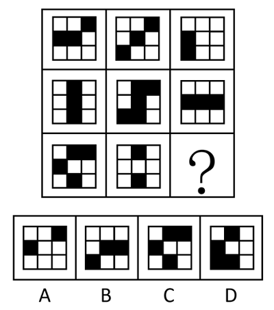
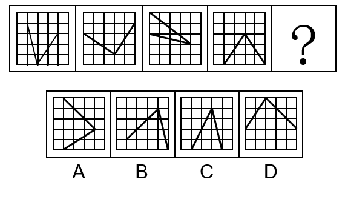
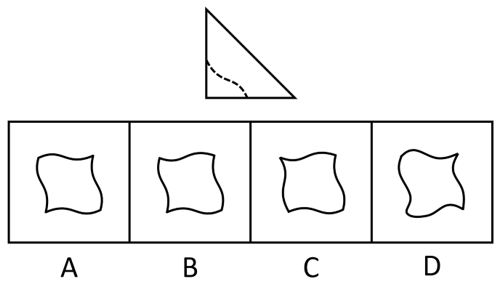
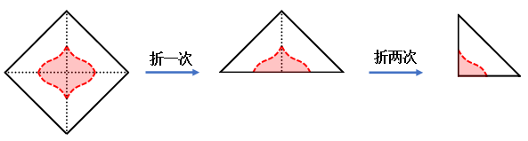
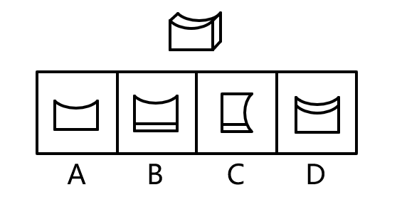
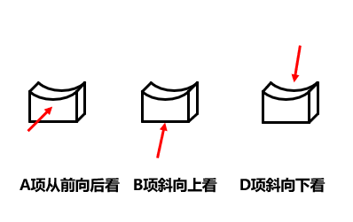
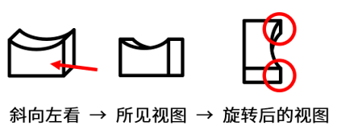
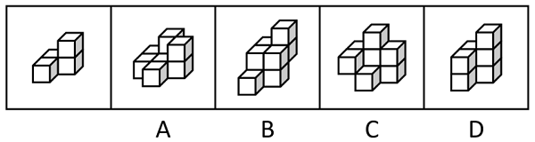
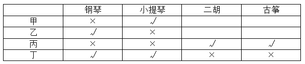

# 2024年广东省公务员录用考试《行测》题（网友回忆版）

> 判断推理 · 20 题 · 广东 2024

## 第 1 题　qid 16593250 · 图形推理

下列选项中最符合所给图形规律的是（    ）。

- **A**. A
- **B**. B　✅
- **C**. C
- **D**. D

**答案**：B

**官方解析**

元素组成相似，优先考虑样式规律。题干图形轮廓和分割区域相同，黑块数量不同，优先考虑黑白运算。九宫格横向看无规律，考虑纵向看，观察第一列发现，运算规律为：黑+黑=白，黑+白=黑，白+黑=黑，白+白=白；经验证，第二列符合此规律；第三列应用此规律，只有B项符合。
故正确答案为B。

---

## 第 2 题　qid 16593241 · 图形推理

下列选项中最符合所给图形规律的是（    ）。

- **A**. A
- **B**. B
- **C**. C　✅
- **D**. D

**答案**：C

**官方解析**

元素组成相同，但无明显位置规律，考虑数量规律。观察发现，题干图形中的两条直线共经过了8个格子，故？处应选择两条直线共经过8个格子的图形，只有C项符合。
故正确答案为C。

---

## 第 3 题　qid 16593278 · 图形推理

如图所示，正方形卡片沿对角线折叠两次后得到一个三角形，沿着虚线裁剪后，再展开卡片，则展开的图形最有可能是（    ）。

- **A**. A　✅
- **B**. B
- **C**. C
- **D**. D

**答案**：A

**官方解析**

由题干可知，正方形卡片沿对角线折叠两次后依照虚线进行裁剪，裁剪后再展开的图案至少有两条相互垂直的对称轴，即该图案应为既轴对称又中心对称图形，如下图所示，只有A项符合。

故正确答案为A。

---

## 第 4 题　qid 16593280 · 图形推理

下图为给定的立体图形，从任一角度看，下列选项最不可能是该立体图形视图的是（    ）。

- **A**. A
- **B**. B
- **C**. C　✅
- **D**. D

**答案**：C

**官方解析**

本题考查三视图。如下图所示，A、B、D三项按图中箭头方向观察，均可看到。

C项可按下图中箭头方向观察，但视图应如下图所示，上半部分的右侧应存在曲线，下半部分应为矩形，而非曲线图形，C项图形错误，不是该立体图形视图，当选。

本题为选非题，故正确答案为C。

---

## 第 5 题　qid 16593237 · 图形推理

下列立体图形，最不可能由两个左侧立体图形拼接成的是（    ）。

- **A**. A
- **B**. B
- **C**. C
- **D**. D　✅

**答案**：D

**官方解析**

本题考查立体拼合。

A项：如下图所示，可以由两个左侧立体图形拼接成，排除；

B项：如下图所示，可以由两个左侧立体图形拼接成，排除；

C项：如下图所示，可以由两个左侧立体图形拼接成，排除；

D项：左侧立体图形为4个小方块，由两个左侧立体图形拼接成的立体图形应为8个小方块，而该项只有7个小方块，无法由两个左侧立体图形拼接成，当选。

本题为选非题，故正确答案为D。

---

## 第 6 题　qid 16593245 · 逻辑判断

如果某地不禁止在鱼类繁衍季节捕鱼，当地的鱼类资源就会枯竭。如果鱼类资源枯竭了，当地渔民的渔业生涯就会终结。只有鱼类资源良性循环，渔民的收入才能得到保障。
由此可以推出（    ）。

- **A**. 如果某地的鱼类资源没有枯竭，那么当地渔民的收入就能得到保障
- **B**. 如果某地禁止在鱼类繁衍季节捕鱼，那么当地渔民的收入就能得到保障
- **C**. 如果某地渔民的渔业生涯没有终结，那么当地一定禁止在鱼类繁衍季节捕鱼　✅
- **D**. 如果某地渔民的收入没有得到保障，那么当地的鱼类资源一定不能良性循环

**答案**：C

**官方解析**

第一步：翻译题干。

（1）禁止在鱼类繁衍季节捕鱼鱼类资源枯竭；

（2）鱼类资源枯竭渔民的渔业生涯终结；

（3）渔民的收入得到保障鱼类资源良性循环（即：鱼类资源枯竭）；

将（1）（2）串联可得（4）：禁止在鱼类繁衍季节捕鱼鱼类资源枯竭渔民的渔业生涯终结；

将（3）逆否和（1）串联可得（5）：禁止在鱼类繁衍季节捕鱼鱼类资源枯竭渔民的收入得到保障。

第二步：逐一分析选项。

A项：翻译为：鱼类资源枯竭渔民的收入得到保障，是对（5）的否前，否前无必然结论，无法推出，排除；

B项：翻译为：禁止在鱼类繁衍季节捕鱼渔民的收入得到保障，是对（5）的否前，否前无必然结论，无法推出，排除；

C项：翻译为：渔民的渔业生涯终结禁止在鱼类繁衍季节捕鱼，是对（4）的否后，否后必否前，可以推出，当选；

D项：翻译为：渔民的收入得到保障鱼类资源良性循环，是对（5）的肯后，肯后无必然结论，无法推出，排除。

故正确答案为C。

---

## 第 7 题　qid 16593281 · 逻辑判断

如今，越来越多的消费者习惯在第三方平台查看商家的好评率与他人对商家的具体评价，再作出消费选择。一直以来，甲餐厅的好评率始终略高于乙餐厅，但是乙餐厅的日营业额却远远超过甲餐厅。
下列选项如果为真，最能解释这一现象的是（    ）。

- **A**. 与乙餐厅相比，甲餐厅有更多的常客
- **B**. 乙餐厅的人均消费金额远高于甲餐厅　✅
- **C**. 甲餐厅无法为消费者提供免费停车服务
- **D**. 许多消费者在平台上表达了对乙餐厅菜品的喜爱

**答案**：B

**官方解析**

第一步：找出题干矛盾。
越来越多的消费者习惯查看商家的好评率再作出消费选择，一直以来，甲餐厅的好评率始终略高于乙餐厅，但是乙餐厅的日营业额却远远超过甲餐厅。
第二步：逐一分析选项。
A项：该项指出与乙餐厅相比，甲餐厅有更多的常客，甲餐厅常客多，按理说甲餐厅的日营业额应该更多，不能解释为什么乙餐厅的日营业额却远远超过甲餐厅，不能解释题干矛盾，排除；
B项：该项指出乙餐厅的人均消费金额远高于甲餐厅，日营业额=人均消费金额×日消费人次，即使甲餐厅的好评率高，但乙餐厅的平均交易单价远高于甲餐厅，人均消费金额较高可能导致乙餐厅的日营业额远远超过甲餐厅，可以解释题干矛盾，当选；
C项：该项指出甲餐厅无法为消费者提供免费停车服务，但不清楚乙餐厅是否有免费停车服务，不能解释为什么甲餐厅的好评率始终略高于乙餐厅，但是乙餐厅的日营业额却远远超过甲餐厅，不能解释题干矛盾，排除；
D项：该项指出许多消费者在平台上表达了对乙餐厅菜品的喜爱，只能说明有消费者喜欢乙餐厅，不能解释为什么甲餐厅的好评率始终略高于乙餐厅，但是乙餐厅的日营业额却远远超过甲餐厅，不能解释题干矛盾，排除。
故正确答案为B。

---

## 第 8 题　qid 16593270 · 逻辑判断

过去，直播带货中虚假宣传、销售假冒伪劣产品等违法现象层出不穷。最近，针对直播“乱象”，相关部门拓宽了消费者的投诉渠道，因此，直播带货中违法现象将有所减少。
要使上述推理成立，需要补充的前提条件是（    ）。

- **A**. 拓宽消费者投诉渠道有助于遏制直播带货中的违法现象　✅
- **B**. 投诉能促使直播带货平台严格把关上架产品的质量
- **C**. 从事直播带货经营活动需要承担相应的法律责任
- **D**. 所有消费者都能准确识别侵权行为

**答案**：A

**官方解析**

第一步：找出论点和论据。
论点：直播带货中违法现象将有所减少。
论据：针对直播“乱象”，相关部门拓宽了消费者的投诉渠道。
论点讨论的是“直播带货中违法现象将有所减少”，论据讨论的是“拓宽了消费者的投诉渠道”，二者话题不一致，加强优先考虑搭桥，即在“拓宽投诉渠道”与“违法现象减少”之间建立联系。
第二步：逐一分析选项。
A项：该项指出拓宽消费者投诉渠道有助于遏制直播带货中的违法现象，即在“拓宽投诉渠道”与“违法现象减少”之间建立了联系，为搭桥项，可以加强，当选；
B项：该项指出投诉能促使平台把关产品质量，而论点讨论的是“直播带货中违法现象将有所减少”，话题不一致，无法加强，排除；
C项：该项指出从事直播带货经营活动需要承担相应的法律责任，而论点讨论的是“直播带货中违法现象将有所减少”，话题不一致，无法加强，排除；
D项：该项指出所有消费者都能准确识别侵权行为，而论点讨论的是“直播带货中违法现象将有所减少”，话题不一致，无法加强，排除。
故正确答案为A。

---

## 第 9 题　qid 16593252 · 逻辑判断

去年9月起，某高校图书馆开设了通宵学习室。该学习室受到许多学生的欢迎，在4个月后，由于使用人数大幅减少，图书馆关闭了通宵学习室。
以下各项如果为真，最能解释这一现象的是（    ）。

- **A**. 许多学生认为，通宵学习不可持续
- **B**. 通宵学习室座位少，能容纳的学生有限
- **C**. 图书馆需要为通宵学习室配备专门的管理人员
- **D**. 通宵学习的学生大多在备考12月的研究生入学考试　✅

**答案**：D

**官方解析**

第一步：找出题干矛盾。
通宵学习室很受欢迎，但4个月后由于使用人数变少被关闭。
第二步：逐一分析选项。
A项：只能说明有的学生不认同通宵学习，但并没有说明使用通宵学习室的人数为什么4个月后大幅减少，不能解释题干矛盾，排除；
B项：通宵学习室容纳学生有限是一直存在的现象，但并没有说明通宵学习室为什么开始受欢迎但4个月后人数大幅减少，不能解释题干矛盾，排除；
C项：图书馆要配备专门的管理人员，是针对图书馆管理方面的，但并没有说明使用通宵学习室的人数为什么4个月后大幅减少，不能解释题干矛盾，排除；
D项：通宵学习的学生大多备考12月的考试，因此4个月后，大多数的学生不再需要通宵学习，因此也就很好地解释了为什么4个月后使用人数会大幅减少，可以解释题干矛盾，当选。
故正确答案为D。

---

## 第 10 题　qid 16593239 · 逻辑判断

某单位派出小李、小王、小杨、小张四人参加技能比赛。小李和小王的得分之和大于小杨和小张的得分之和，小李和小张的得分之和大于小王和小杨的得分之和，小王和小张的得分之和大于小李和小杨的得分之和。
由此可以推出，四个人中得分最低的是（    ）。

- **A**. 小李
- **B**. 小王
- **C**. 小杨　✅
- **D**. 小张

**答案**：C

**官方解析**

第一步：分析题干条件。
①小李+小王&gt;小杨+小张；
②小李+小张&gt;小王+小杨；
③小王+小张&gt;小李+小杨。
第二步：根据题干条件进行推理。
①+②：2小李+小王+小张&gt;2小杨+小王+小张。去掉相同项可知：2小李&gt;2小杨，即小李&gt;小杨；
②+③：2小张+小李+小王&gt;2小杨+小李+小王。去掉相同项可知：2小张&gt;2小杨，即小张&gt;小杨；
①+③：2小王+小李+小张&gt;2小杨+小李+小张。去掉相同项可知：2小王&gt;2小杨，即小王&gt;小杨。
小李、小张、小王的得分均大于小杨，即小杨得分最低。
故正确答案为C。

---

## 第 11 题　qid 16593238 · 定义判断

对于要不要读《红楼梦》，许多学者认为：读《红楼梦》有助于了解中国传统文化，因此年轻人都应该读《红楼梦》。
以下属于这一推论暗含前提的是（    ）。

- **A**. 《红楼梦》是中国古典文学著作
- **B**. 年轻人都应该了解中国传统文化　✅
- **C**. 大部分学者都读过《红楼梦》
- **D**. 《红楼梦》与中国文化相辅相成

**答案**：B

**官方解析**

第一步：找出论点和论据。
论点：年轻人都应该读《红楼梦》。
论据：读《红楼梦》有助于了解中国传统文化。
本题论点讨论的是年轻人都应该读《红楼梦》，论据讨论的是读《红楼梦》有助于了解中国传统文化，二者话题不一致，且提问方式为“前提”，加强优先考虑搭桥，即在“年轻人”与“了解中国传统文化”之间建立联系。
第二步：逐一分析选项。
A项：该项指出《红楼梦》是中国古典文学著作，与论点中年轻人应该读《红楼梦》无关，话题不一致，无法加强，排除；
B项：该项指出年轻人都应该了解中国传统文化，建立了“年轻人”与“了解中国传统文化”之间的关系，为搭桥项，可以加强，保留；
C项：该项指出大部分学者都读过《红楼梦》，与论点中年轻人应该读《红楼梦》无关，话题不一致，无法加强，排除；
D项：该项指出《红楼梦》与中国文化相辅相成，能够支持读《红楼梦》的确有助于了解中国文化，补充论据，可以加强，保留。
对比B、D两项，B项的搭桥加强力度大于D项的补充论据，B项当选。
故正确答案为B。

---

## 第 12 题　qid 16593251 · 类比推理

水火是无情的，人不是水火，所以人不是无情的。
下列选项所犯的逻辑错误与题干最相似的是（    ）。

- **A**. 所有羊都是白色的，羊毛是白色的，所以羊毛是羊
- **B**. 蛋糕都是圆的，蛋糕里面添加了鸡蛋，所以鸡蛋也是圆的
- **C**. 水星是星球，水星上没有人类；地球是星球，所以地球上也没有人类
- **D**. 所有不遵守规则的司机都会被处罚，司机小陈一直遵守规则，所以他不会被处罚　✅

**答案**：D

**官方解析**

第一步：分析题干推理形式。

题干翻译为：水火无情，人不是水火（即“否前”），所以，人不是无情的（即“否后”），逻辑结构为“否前推否后”。

第二步：逐一分析选项。

A项：选项翻译为：羊白色，羊毛是白色的（即“肯后”），所以，羊毛是羊（即“肯前”），逻辑结构为“肯后推肯前”，所犯逻辑错误与题干不一致，排除；

B项：选项翻译为：蛋糕圆，“蛋糕里面添加了鸡蛋”无法翻译，与题干结构不同，所犯逻辑错误与题干不一致，排除；

C项：选项翻译为：水星星球，水星没人类；地球星球，所以，地球没人类，逻辑结构为“错误类比”，所犯逻辑错误与题干不一致，排除；

D项：选项翻译为：不遵守规则的司机被处罚，司机小陈遵守规则（即“否前”），所以，他不会被处罚（即“否后”），逻辑结构为“否前推否后”，所犯逻辑错误与题干一致，当选。

故正确答案为D。

---

## 第 13 题　qid 16593254 · 逻辑判断

甲、乙、丙、丁4人每人都会演奏钢琴、小提琴、二胡和古筝4种乐器中的2种，且每种乐器都有2人会演奏。已知：
①甲不会演奏钢琴；
②丁不会演奏古筝；
③丙不会演奏钢琴和小提琴；
④乙和丙会演奏的乐器中有且仅有1种相同。
由此可以推出（    ）。

- **A**. 甲会演奏小提琴　✅
- **B**. 甲不会演奏二胡
- **C**. 乙会演奏古筝
- **D**. 甲和丁会演奏的乐器完全不同

**答案**：A

**官方解析**

第一步：分析题干条件。

①甲不会演奏钢琴；

②丁不会演奏古筝；

③丙不会演奏钢琴和小提琴；

④乙和丙会演奏的乐器中有且仅有1种相同；

⑤每人都会演奏钢琴、小提琴、二胡和古筝中的2种，每种乐器都有2人会演奏。

第二步：根据题干条件进行推理。

根据条件①③可知，甲、丙不会演奏钢琴，结合条件⑤“每种乐器都有2人会演奏”可知，乙、丁会演奏钢琴。根据条件③⑤可知，丙会演奏二胡、古筝，结合条件④“乙和丙会演奏的乐器中有且仅有1种相同”可知，乙会演奏二胡或古筝，又已知乙会演奏钢琴，且每人只会演奏2种乐器，那么乙一定不会演奏小提琴，结合条件③“丙不会演奏钢琴和小提琴”，那么甲、丁会演奏小提琴。确定可推出的信息如下表所示：

故正确答案为A。

---

## 第 14 题　qid 16593243 · 逻辑判断

研究表明，购物行为能够刺激大脑的多个区域，使人们感到幸福。进一步研究发现，在别人身上花的钱占购物支出的比例越大的人，其幸福感越强；但在自己身上花钱的多少和幸福感的关系则不那么明显。有人因此认为，为了提高个人幸福感，在购物时，应该给别人花更多的钱。
下列选项如果为真，最能反驳这一结论的是（    ）。

- **A**. 向他人推荐的商品如果受到了他人的认可，人们也会感到幸福
- **B**. 如果为他人购买的商品没有受到他人的喜爱，容易使人变得沮丧
- **C**. 购物带来的快乐很短暂，个人所面对的困难和压力不会因为购物而消失
- **D**. 与他人关系好的人往往更加幸福，且更愿意在购物时为他人花更多的钱　✅

**答案**：D

**官方解析**

第一步：找出论点和论据。
论点：为了提高个人幸福感，在购物时，应该给别人花更多的钱。
论据：在别人身上花的钱占购物支出的比例越大的人，其幸福感越强；但在自己身上花钱的多少和幸福感的关系则不那么明显。
本题论点、论据讨论的都是给别人花钱能够获得幸福感，二者话题一致，削弱优先考虑削弱论点。
第二步：逐一分析选项。
A项：该项说向他人推荐的商品被认可后也会感到幸福，讨论的是向他人推荐商品能否获得幸福感，而论点讨论的是购物时给别人花钱能够获得幸福感，话题不一致，无法削弱，排除；
B项：该项说如果为他人购买的商品不被喜欢，容易让人变得沮丧，说明购物时给他人花钱购买商品，不一定会获得幸福感，具有一定的削弱力度，保留；
C项：该项说个人所面对的困难和压力不会因为购物而消失，讨论的是购物能否减轻压力，而论点讨论的是购物时给别人花钱能够获得幸福感，话题不一致，无法削弱，排除；
D项：该项说与他人关系好的人“往往更加幸福”，同时也“更愿意在购物时为他人花更多的钱”，即证明“幸福”与“更愿意在购物时为他人花更多的钱”同时出现，二者是并列关系，所以彼此之间不存在因果关系，削弱论点，保留。
比较B、D两项，B项只提到了为他人购买商品的其中一种情况，不够全面，不如D项直接削弱论点，且B项的表述不如D项更贴近论点，故D项削弱力度更强。
故正确答案为D。

---

## 第 15 题　qid 16593283 · 类比推理

建设生态公园可以保护生态环境，保护生态环境有利于经济社会的绿色发展，所以建设生态公园有利于经济社会的绿色发展。
以下选项的逻辑结构与题干最为相似的是（    ）。

- **A**. 诚实的人被尊敬，虚伪的人被疏远，所以，诚实的人不会被疏远
- **B**. 运动有利于身体健康，跑步有利于身体健康，所以跑步是一种运动
- **C**. 新能源汽车使用清洁能源，使用清洁能源是绿色环保的，所以新能源汽车是绿色环保的　✅
- **D**. 正直的人做的事都是合法的，不正直的人才会做不合法的事，所以，做事是否合法是判断正直与否的标准

**答案**：C

**官方解析**

第一步：分析题干逻辑关系。

建设生态公园（a）可以保护生态环境（b），保护生态环境（b）有利于经济社会的绿色发展（c），所以建设生态公园（a）有利于经济社会的绿色发展（c）。

题干论证结构为：a有利于b，b有利于c，所以a有利于c，根据a与b、b与c之间的关系，推断a与c之间的关系。

第二步：分析选项逻辑关系。

A项：诚实的人（a）被尊敬（b），虚伪的人（a）被疏远（c），所以诚实的人（a）不会被疏远（c）。论证结构为：a导致b，a导致c，所以a导致c，与题干推理结构不一致，排除；

B项：运动（a）有利于身体健康（b），跑步（c）有利于身体健康（b），所以跑步（c）是一种运动（a），论证结构为：a有利于b，c有利于b，所以c是a，与题干推理结构不一致，排除；

C项：新能源汽车（a）使用清洁能源（b），使用清洁能源（b）是绿色环保的（c），所以新能源汽车（a）是绿色环保的（c），论证结构为：a使用b，b是c，所以a是c，根据a与b、b与c之间的关系，推断a与c之间的关系，与题干推理结构一致，当选；

D项：正直的人（a）做的事都是合法的（b），不正直的人（a）才会做不合法的事（b），所以做事是否合法（b）是判断正直（a）与否的标准，论证结构为：a是b，b是a，所以b是判断a的标准，与题干推理结构不一致，排除。

故正确答案为C。

---

## 第 16 题　qid 16593255 · 逻辑判断

有研究发现，即使经过多次清洗，塑料水壶瓶身的化学成分还是会释放到水中。而在用清洁剂清洗水壶后，不但没有解决问题，水壶内还增加了多种来自清洁剂的化学成分。有人因此认为，与金属材质水壶相比，塑料水壶更不利于人体健康。
下列选项如果为真，最能质疑上述观点的是：

- **A**. 如果使用不当，金属材质水壶可能会生锈
- **B**. 在多数情况下，人们不会用清洁剂清洗塑料水壶
- **C**. 由于剂量低，这些化学成分无法对人体产生任何影响　✅
- **D**. 不同种类的塑料水壶，其瓶身的化学成分具有显著差异

**答案**：C

**官方解析**

第一步：找出论点和论据。
论点：与金属材质水壶相比，塑料水壶更不利于人体健康。
论据：即使经过多次清洗，塑料水壶瓶身的化学成分还是会释放到水中。而在用清洁剂清洗水壶后，不但没有解决问题，水壶内还增加了多种来自清洁剂的化学成分。
论点说的是塑料水壶不利于人体健康，论据说的是塑料瓶身本就含有化学成分，清洗塑料瓶的清洁剂也会在塑料瓶中残留化学成分，论点论据话题不一致，削弱优先考虑拆桥，即“塑料瓶身及清洁剂残留的化学成分”不等于“不利于人体健康”。
第二步：逐一分析选项。
A项：该项说的是金属材质的水壶，并不是论点中的塑料水壶，并且并不明确生锈是否会影响健康，话题不一致，无法削弱，排除；
B项：该项说的是人们不会用清洁剂清洗塑料水壶，但没说塑料水壶自身释放到水中的化学成分是否会影响健康，话题不一致，无法削弱，排除；
C项：该项说的是释放到水中的化学成分无法对人体产生任何影响，即断开“塑料瓶身及清洁剂残留的化学成分”与“不利于人体健康”之间的联系，说明即使存在这些化学成分，也不会不利于健康，拆桥项，可以削弱，当选；
D项：该项说的是不同塑料水壶瓶身的化学成分有差异，但没有提及这些化学成分是否影响健康，话题不一致，无法削弱，排除。
故正确答案为C。

---

## 第 17 题　qid 16593249 · 类比推理

最近，市场上中药材的价格有所下降。据调查，中药材产量的增加是价格下降的主要原因。由于近年来中药材种植业蓬勃发展，而野生中药材的产量没有显著增加，因此中药材产量的增加主要缘于中药材种植业的蓬勃发展。
要使上述推理成立，需要补充的前提条件是：

- **A**. 多种中药材的产量大幅增加
- **B**. 一些消费者偏好野生中药材
- **C**. 部分中药材已经实现规模化种植
- **D**. 中药材只能通过种植和野外采集获得　✅

**答案**：D

**官方解析**

第一步：找出论点和论据。
论点：中药材产量的增加主要缘于中药材种植业的蓬勃发展。
论据：中药材产量的增加是价格下降的主要原因。由于近年来中药材种植业蓬勃发展，而野生中药材的产量没有显著增加。
本题论点和论据均在讨论“中药材产量的增加”与“中药材种植业的蓬勃发展”之间的关系，论点论据话题一致，且提问方式为“前提”，优先考虑必要条件。
第二步：逐一分析选项。
A项：该项说的是多种中药材的产量增加，但没有说明产量增加的原因，而论点讨论的是中药材产量的增加主要缘于中药材种植业的蓬勃发展，话题不一致，无法加强，排除；
B项：该项说的是一些消费者买药材时偏好野生中药材，而论点讨论的是中药材产量的增加主要缘于中药材种植业的蓬勃发展，话题不一致，无法加强，排除；
C项：该项说的是部分中药材已经实现规模化种植，但具体产量多少并不明确，无法证明中药材产量的增加主要缘于中药材种植业的蓬勃发展，为不明确项，无法加强，排除；
D项：该项指出中药材只能通过种植和野外采集两种方式获得，因此当中药材总量增加，而野生中药材产量没有显著增加时，能够说明中药材产量的增加确实与种植中药材的产量有关，如果还有其他途径能够获得中药材，那么中药材产量的增加可能与中药材种植业的蓬勃发展无关，是论点成立的必要条件，可以加强，当选。
故正确答案为D。

---

## 第 18 题　qid 16593284 · 类比推理

成年人读书，既可以提升专业技能，又能提升个人修养；儿童读书，不仅可以开阔视野，还能提高阅读写作能力。所以，读书没有年龄的限制，任何人读书都有好处。
以下选项的逻辑结构与题干最为相似的是（    ）。

- **A**. 无论是一线还是二、三线城市，有人就有商机。因此，无论在哪一座城市，人口数量都是商业发展的决定性因素
- **B**. 冬季家中的温度计，量出来的不只是室内温度，更是民生的“温度”。民众越是费心，越说明政府工作没有用心；民众越是舒心，越体现政府工作的暖心
- **C**. 经济工作千头万绪，善于抓住并集中力量解决主要矛盾、关键问题，就能在错综复杂的局面中育新机、开新局。所以，局面越是复杂，越需要团结协力
- **D**. 劳动者懂法，可以在个人利益受到侵犯时，运用法律武器维护自身权益；用人单位懂法，可以减少劳动纠纷，使劳动关系更加和谐。所以，懂法对劳动关系双方都是有益的　✅

**答案**：D

**官方解析**

第一步：分析题干的推理结构。
题干中主要涉及到成年人读书、儿童读书与任何人读书这三部分之间的关系。具体来说，题干先指出成年人读书有好处，然后指出儿童读书有好处，这两个并列主体结合组成了任何人，因此得出结论，任何人读书有好处。简化题干的推理结构为：根据A有好处，B有好处，得出C（由AB组成）有好处。
第二步：逐一分析选项。
A项：该项涉及一线、二线、三线城市，是三个并列的主体，而题干是两个并列主体，而且也没有提及带来的好处，与题干推理结构不同，排除；
B项：该项涉及民众这一个主体，而且是通过民众的状态反映政府工作的结果，也没有提及其带来的好处，与题干推理结构不同，排除；
C项：该项在说解决经济工作的对策，而不是其好处，与题干推理结构不同，排除；
D项：该项指出劳动者懂法的好处，以及用人单位懂法的好处，这两个并列主体结合组成了劳动关系双方，因此得出结论，懂法对劳动关系双方有好处，推理结构为：根据A有好处，B有好处，得出C（由AB组成）有好处，与题干推理结构最为相似，当选。
故正确答案为D。

---

## 第 19 题　qid 16593244 · 逻辑判断

某团队开展了一项关于预防中风的研究。研究对象分为两组，一组食用低钠盐（约75%的氯化钠和25%的氯化钾），一组食用普通盐（约97%的氯化钠）。在5年的跟踪调查中发现，食用低钠盐的群体，其中风发病率显著低于食用普通盐的群体。因此，减少钠的摄入有助于预防中风。
以下各项如果为真，最不能支持这一结论的是（    ）。

- **A**. 食用低钠盐的中风患者的死亡率远低于食用普通盐的中风患者　✅
- **B**. 两组研究对象在性别、年龄等方面不存在明显差异
- **C**. 研究期间，两组研究对象每日摄入的盐含量接近
- **D**. 摄入氯化钾不会影响中风发病率

**答案**：A

**官方解析**

第一步：找出论点和论据。
论点：减少钠的摄入有助于预防中风。
论据：研究对象分为两组，一组食用低钠盐（约75%的氯化钠和25%的氯化钾），一组食用普通盐（约97%的氯化钠）。在5年的跟踪调查中发现，食用低钠盐的群体，其中风发病率显著低于食用普通盐的群体。
本题论点和论据讨论的都是食用钠盐和预防中风之间的关系，二者话题一致，加强优先考虑补充论据，且本题为选非题，排除能够加强的选项即可。
第二步：逐一分析选项。
A项：选项说的是得了中风之后的死亡率，而论点讨论的是预防中风，说的是中风之前，话题不一致，无法加强，当选；
B项：选项说的是两组研究对象在性别、年龄等方面不存在明显差异，排除了性别、年龄等方面对实验结果的干扰，使得实验结果更可靠，补充论据，可以加强，排除；
C项：选项说的是两组研究对象每日摄入的盐含量接近，排除了摄入的盐含量对实验结果的干扰，使得实验结果更可靠，补充论据，可以加强，排除；
D项：选项说的是摄入氯化钾不会影响中风发病率，实验中一组食用低钠盐，而低钠盐含有的25%的氯化钾，故排除了氯化钾对实验结果的干扰，使得实验结果更可靠，补充论据，可以加强，排除。
本题为选非题，故正确答案为A。

---

## 第 20 题　qid 16593260 · 逻辑判断

为降低景区人流量负荷，某景区从原先的窗口售票制改为网上预约制，每个时段限量放票，游客仅可在网上预约的时段进入景区。实行网上预约制一段时间后，许多时间段里景区依然拥挤，游客的旅游体验并未得到明显改善。
以下各项如果为真，最不能解释这一现象的是（    ）。

- **A**. 该景区各时段放票数量过多，超过了景区承载能力
- **B**. 该景区门票预约系统操作繁琐，许多游客反映预约体验不佳　✅
- **C**. 该景区未规定游客离开的时间，许多游客在景区内长时间逗留
- **D**. 游客预约的时段过于集中，一些时段人满为患、一些时段无人预约

**答案**：B

**官方解析**

第一步：找出题干矛盾。
某景区从原先的窗口售票制改为网上预约制，每个时段限量放票，游客仅可在网上预约的时段进入景区。但实行网上预约制一段时间后，许多时间段里景区依然拥挤，游客的旅游体验并未得到明显改善。
第二步：逐一分析选项。
A项：该景区各时段放票数量过多，超过了景区承载能力，说明各时段进入景区的游客数量均大于景区能够承载的游客数量，可以解释为什么实行了网上预约制后，景区依然拥挤，游客的旅游体验并未得到明显改善，可以解释题干矛盾，排除；
B项：该景区门票预约系统操作繁琐，游客预约体验不佳，说的是进入景区前预约操作的体验情况，无法解释为什么许多时间段里景区依然拥挤，游客的旅游体验并未得到明显改善，不能解释题干矛盾，当选；
C项：该景区未规定游客离开的时间，许多游客在景区内长时间逗留，说明会存在不同时段的游客叠加在一起，导致某时段的游客总量大于该时段的放票数量，可以解释为什么实行了网上预约制后，景区依然拥挤，游客的旅游体验并未得到明显改善，可以解释题干矛盾，排除；
D项：游客预约的时段过于集中，一些时段人满为患，说明这些时段内的游客数量确实很多，可以解释为什么实行了网上预约制后，景区依然拥挤，游客的旅游体验并未得到明显改善，可以解释题干矛盾，排除。
本题为选非题，故正确答案为B。

---
