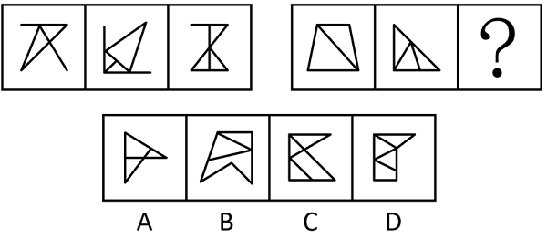
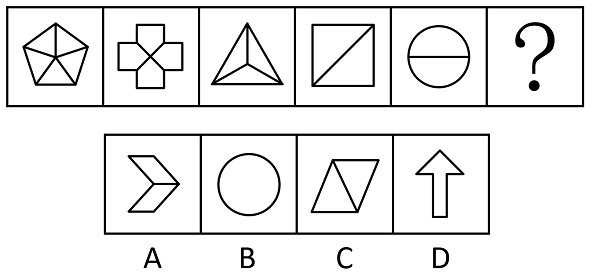
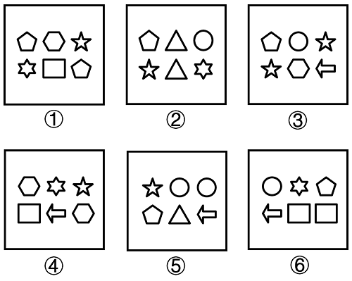
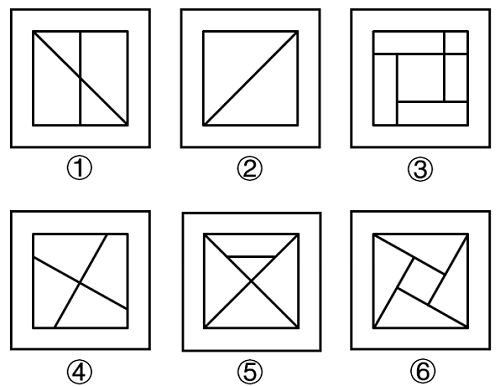
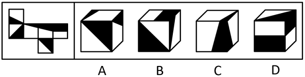
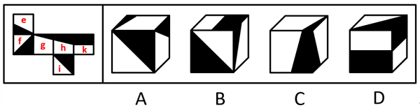
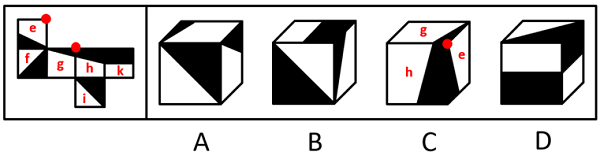

# 2024年度浙江省党政机关选调应届优秀大学毕业生《行测》题（网友回忆版）

> 判断推理 · 15 题 · 浙江 2024

## 第 1 题　qid 12561807 · 类比推理

林业：第二产业：金融业

- **A**. 小号：铜管乐器：小提琴
- **B**. 登山鞋：运动鞋：休闲鞋
- **C**. 越南：南美洲：尼日利亚　✅
- **D**. 物理：高等数学：化学

**答案**：C

**官方解析**

第一步：判断题干词语间逻辑关系。
“林业”是第一产业，“金融业”是第三产业，二者都不是“第二产业”，第一个词和第三个词分别与第二个词为反向种属关系。
第二步：判断选项词语间逻辑关系。
A项：“小号”是“铜管乐器”的一种，前两个词为种属关系；“小提琴”是弦乐器的一种，不是“铜管乐器”，后两个词为反向种属关系，与题干逻辑关系不一致，排除；
B项：“登山鞋”是户外“运动鞋”的一种，前两个词为种属关系；“运动鞋”与“休闲鞋”是两种不同的鞋，后两个词为并列关系，与题干逻辑关系不一致，排除；
C项：“越南”是亚洲的组成部分，“尼日利亚”是非洲的组成部分，二者都不是“南美洲”的组成部分，第一个词和第三个词分别与第二个词为反向组成关系，在此需要注意，在没有更好答案的情况下，反向种属关系和反向组成关系都属于反向包容关系，与题干逻辑关系一致，当选；
D项：“高等数学”不是“物理”，二者为反向种属关系，但词语顺序与题干相反，与题干逻辑关系不一致，排除。
故正确答案为C。
注：本题的考法在历年极个别真题中也曾考查过，重点学习思维即可，即如果题干是反向种属关系，选项没有反向种属关系，可以择优选择反向组成关系。

---

## 第 2 题　qid 12561810 · 类比推理

智取：生辰纲

- **A**. 拳打：镇关西　✅
- **B**. 倒拔：垂杨柳
- **C**. 大破：连环马
- **D**. 雪夜：上梁山

**答案**：A

**官方解析**

第一步：判断题干词语间逻辑关系。
“智取生辰纲”是长篇小说《水浒传》中的经典情节。写的是北宋宣和年间，大名府留守梁中书为了给岳父蔡京庆生，筹备价值十万贯的金银珠宝作为生辰纲，委托杨志押送至东京，在途中（黄泥冈）被晁盖、吴用等人用计夺取的故事情节。“智取”与“生辰纲”构成动宾关系，且“智取”是用“智”去“取”，拆分后是方式和目的的对应关系。
第二步：判断选项词语间逻辑关系。
A项：“拳打镇关西” 是长篇小说《水浒传》中的经典情节。写的是鲁达得知金翠莲被郑屠（绰号“镇关西”）强骗后十分愤怒，以切肉末为由挑衅镇关西，待镇关西被激怒后三拳打死镇关西的故事情节。“拳打”与“镇关西”构成动宾关系，且“拳打”是用“拳”去“打”，拆分后是方式和目的的对应关系，且与题干逻辑关系一致，当选；
B项：“倒拔垂杨柳”是长篇小说《水浒传》中的经典情节。写的是鲁智深为了收服一众泼皮，竟将杨柳树连根拔起的故事情节。“倒拔”与“垂杨柳”构成动宾关系，但“倒拔”拆分后为“倒”和“拔”，不是用“倒”去“拔”，不是方式与目的的对应关系，与题干逻辑关系不一致，排除；
C项：“大破连环马”是长篇小说《水浒传》中的经典情节，写的是梁山好汉最终大破连环马阵法（战马用铁环相连，冲击力极强），杀得呼延灼全军覆没，落荒而逃的故事情节。“大破”与“连环马”构成动宾关系，但“大破”拆分后不是用“大”去“破”，不是方式与目的的对应关系，与题干逻辑关系不一致，排除；
D项：“雪夜上梁山”是长篇小说《水浒传》中的经典情节。写的是林冲遭高俅父子多次陷害，被刺配沧州后，仍遭追杀。林冲侥幸逃脱，在风雪之夜走投无路，经柴进推荐，最终下定决心前往梁山。他冒雪赶路，毅然上了梁山，开启了落草为寇的生涯。“雪夜”与“上梁山”不构成动宾关系，与题干逻辑关系不一致，排除。
故正确答案为A。
注：本题有争议，有同学选择C项，理由是“智取生辰纲”是晁盖、吴用等人使用计谋夺取梁中书送给蔡京的生日礼物的事件，强调智慧策略。同样，“大破连环马”是宋江、吴用等人使用钩镰枪计谋破解呼延灼的连环马阵法，也强调智谋和团队合作，认为C项跟题干更为一致，这个想法也有道理。
C项跟题干“内容”上更相似，而A项跟题干“结构”上更相似，从历年考点和本题出题特征来看，出题人把“智取”和“生辰纲”做了拆分，考查“结构”的可能性更大，故小粉笔更倾向答案为A项，争议题不纠结，重点学习这种特征的题可以从“结构”和“内容”两个角度去思考即可，考场上有哪个选哪个。

---

## 第 3 题　qid 12561818 · 类比推理

火箭军 对于 （    ） 相当于 （    ） 对于 氨气

- **A**. 第二炮兵 惰性气体
- **B**. 东风快递 稀有气体
- **C**. 解放军 导热性
- **D**. 陆军 氙气　✅

**答案**：D

**官方解析**

逐一代入选项。
A项：“火箭军”是由“第二炮兵”更名而来，二者是全同关系；“氨气”不是“惰性气体”，二者是反向种属关系，前后逻辑关系不一致，排除；
B项：“东风快递”是中国人民解放军“火箭军”在新浪微博平台上开通的实名认证官方微博账号，二者是对应关系；“氨气”不是“稀有气体”，二者是反向种属关系，前后逻辑关系不一致，排除；
C项：“火箭军”是中国人民“解放军”的军种，二者是种属关系；“氨气”具有“导热性”，二者是属性对应关系，前后逻辑关系不一致，排除；
D项：“火箭军”和“陆军”是两种不同的中国人民解放军军种，二者是并列关系中的反对关系；“氨气”和“氙气”是两种不同的气体，二者是并列关系中的反对关系，前后逻辑关系一致，当选。
故正确答案为D。

---

## 第 4 题　qid 12561827 · 类比推理

（    ） 对于 钱塘江 相当于 芯片 对于 （    ）

- **A**. 潮涌 卡脖子
- **B**. 杭州 硅
- **C**. 水 智能手机　✅
- **D**. 松花江 集成电路

**答案**：C

**官方解析**

逐一代入选项。
A项：“潮涌”有两种理解方式：①杭州第19届亚运会会徽名为“潮涌”，会徽主体图形由扇面、钱塘江、钱江潮头、赛道、互联网符号及象征亚洲奥林匹克理事会的太阳图形六个元素组成，“钱塘江”图形元素是会徽“潮涌”的一个组成部分，二者为组成关系；②“潮涌”也可以理解为一种自然现象，“钱塘江”会出现“潮涌”现象，二者为地点与自然现象的对应关系；我国“芯片”行业面临“卡脖子”的难题，二者为对应关系，“潮涌”不管是哪种理解方式，前后逻辑关系都不一致，排除；
B项：“钱塘江”位于“杭州”，二者为地点对应关系；“硅”是制造“芯片”的重要原材料，二者为原材料对应关系，前后逻辑关系不一致，排除；
C项：“水”是“钱塘江”的组成部分，二者为组成关系；“芯片”是“智能手机”的组成部分，二者为组成关系，前后逻辑关系一致，当选；
D项：“松花江”和“钱塘江”是两条不同的河流，二者为并列关系；“芯片”又称“集成电路”，是指内含集成电路的硅片，二者为全同关系，前后逻辑关系不一致，排除。
故正确答案为C。

---

## 第 5 题　qid 12561832 · 类比推理

（    ） 对于 连锁店 相当于 山珍 对于 （    ）

- **A**. 总店 野山参
- **B**. 便利店 蘑菇　✅
- **C**. 零售店 海味
- **D**. 店员 药材

**答案**：B

**官方解析**

逐一代入选项。
A项：“连锁店”指一个公司或集团开设的经营业务相关、方式相同的若干个商店，“总店”指商店的总部，现在世界上的连锁店大多是“前总店，后分店”模式，一般总店创建时间较早，分店分布在各个地方。“总店”是“连锁店”的组成部分，二者为组成关系；“野山参”是“山珍”的一种，二者为种属关系，前后逻辑关系不一致，排除；
B项：有的“便利店”是“连锁店”，有的“便利店”不是“连锁店”，有的“连锁店”是“便利店”，有的“连锁店”不是“便利店”，二者为交叉关系；有的“山珍”是“蘑菇”，有的“山珍”不是“蘑菇”，有的“蘑菇”是“山珍”，有的“蘑菇”不是“山珍”，二者为交叉关系，前后逻辑关系一致，当选；
C项：有的“零售店”是“连锁店”，有的“零售店”不是“连锁店”，有的“连锁店”是“零售店”，有的“连锁店”不是“零售店”，二者为交叉关系；“山珍”和“海味”为并列关系，前后逻辑关系不一致，排除；
D项：“店员”在“连锁店”工作，二者为对应关系；有的“山珍”是“药材”，有的“山珍”不是“药材”，有的“药材”是“山珍”，有的“药材”不是“山珍”，二者为交叉关系，前后逻辑关系不一致，排除。
故正确答案为B。

---

## 第 6 题　qid 12561847 · 图形推理

从所给的四个选项中，选择最合适的一个填入问号处，使之呈现一定的规律性：

- **A**. A　✅
- **B**. B
- **C**. C
- **D**. D

**答案**：A

**官方解析**

元素组成不同，且无明显属性规律，考虑数量规律。观察发现，图形线条交叉明显，考虑数交点数。第一组图中，题干图形交点数依次为4、5、6；第二组图中，前两幅图的交点数依次为4、5，故？处应该选择一个交点数为6的图形，只有A项符合。
故正确答案为A。

---

## 第 7 题　qid 12561860 · 图形推理

从所给的四个选项中，选择最合适的一个填入问号处，使之呈现一定的规律性：

- **A**. A
- **B**. B
- **C**. C
- **D**. D　✅

**答案**：D

**官方解析**

元素组成不同，优先考虑属性规律。观察发现，题干图形均为轴对称图形，对称轴的数量依次为5、4、3、2、2、？，无规律；进一步观察发现，题干图形封闭区域明显，考虑数面，面数量依次为5、4、3、2、2、？，即每幅图形面数量与对称轴数量相等，只有D项符合。
故正确答案为D。

---

## 第 8 题　qid 12561867 · 图形推理

把下面的六个图形分为两类，使每一类图形都有各自的共同特征或规律，分类正确的一项是：

- **A**. ①②③，④⑤⑥
- **B**. ①③⑤，②④⑥
- **C**. ①③④，②⑤⑥　✅
- **D**. ①②⑤，③④⑥

**答案**：C

**官方解析**

本题为分组分类题目。元素组成不同，且无明显属性规律，考虑数量规律。观察发现，每幅图均有6个元素，且均存在两个相同元素，图①③④中，两个相同元素位置相对，图②⑤⑥中，两个相同元素位置相邻，即图①③④为一组，图②⑤⑥为一组。
故正确答案为C。

---

## 第 9 题　qid 12561900 · 图形推理

把下面的六个图形分为两类，使每一类图形都有各自的共同特征或规律，分类正确的一项是：

- **A**. ①②③，④⑤⑥
- **B**. ①②④，③⑤⑥　✅
- **C**. ①③⑤，②④⑥
- **D**. ①④⑥，②③⑤

**答案**：B

**官方解析**

本题为分组分类题目。元素组成不同，且无明显属性规律，考虑数量规律。观察发现，题干图形均存在多个面，图①②④中，所有面都与外框有公共边，图③⑤⑥中，中间的1个面与外框不相连，其余面都与外框有公共边，即图①②④为一组，图③⑤⑥为一组。
故正确答案为B。

---

## 第 10 题　qid 12561915 · 图形推理

左边给定的是纸盒的外表面，右边哪项能够由它折叠而成?

- **A**. A
- **B**. B　✅
- **C**. C
- **D**. D

**答案**：B

**官方解析**

对题干展开图进行编号，如下图所示，逐一分析选项。

A项：选项右侧面为面e，面e和面i是相对面，不能同时出现，故选项由面f、面g和面e构成。题干展开图中，这三个面的公共点挨着面f中的黑色锐角，而选项中，这三个面的公共点挨着面f中的黑色直角，选项与题干展开图不一致，排除；

B项：选项由面f、面k和面e构成，选项与题干展开图一致，当选；

C项：选项由面h、面g和面e构成，题干展开图中，这三个面的公共点没有挨着面e中的黑色三角形，而选项中，这三个面的公共点挨着面e中的黑色三角形，选项与题干展开图不一致，排除；

D项：选项中出现了两个有黑色矩形的面，而题干展开图中只有一个有黑色矩形的面（面k），选项与题干展开图不一致，排除。

故正确答案为B。

---

## 第 11 题　qid 12561890 · 逻辑判断

纪检监察干部犹如“医者”，在日常工作中，应当严格遵循“惩前毖后、治病救人”的工作原则。对监督检查中发现的违纪违规行为，唯有坚持有“研”在先、精准施“治”，方能最终达到教育人、挽救人、感化人的预期目标。若不能提前入手、吃透政策，必将陷入“胡子眉毛一把抓”的被动境地，不仅不能达到监督效果，也会对被监督者的日常工作造成一定影响。
如果以上判断正确，则必定成立的是：

- **A**. 如果监督效果达到了，说明监察干部提前入手并吃透了政策　✅
- **B**. 如果没有达到预期目标，说明没有坚持有“研”在先、精准施“治”
- **C**. 如果陷入“胡子眉毛一把抓”的被动境地，说明监察干部没有吃透政策
- **D**. 只要严格遵守“惩前毖后、治病救人”的工作原则，就能做好监督工作

**答案**：A

**官方解析**

第一步：翻译题干。

①达到教育人、挽救人、感化人的预期目标坚持有“研”在先 且 精准施“治”；

②（提前入手 且 吃透政策）陷入“胡子眉毛一把抓”的被动境地；

③（提前入手 且 吃透政策）达到监督效果；

④（提前入手 且 吃透政策）对被监督者的日常工作造成一定影响。

第二步：逐一分析选项。

A项：翻译为：达到监督效果提前入手 且 吃透政策，是对条件③的否后，根据“否后必否前”，可以推出“提前入手 且 吃透政策”，可以推出，当选；

B项：翻译为：达到预期目标（坚持有“研”在先 且 精准施“治”），是对条件①的否前，否前无必然结论，无法推出，排除；

C项：翻译为：陷入“胡子眉毛一把抓”的被动境地吃透政策，是对条件②的肯后，肯后无必然结论，无法推出，排除；

D项：翻译为：严格遵守“惩前毖后、治病救人”的工作原则做好监督工作，题干中“严格遵循‘惩前毖后、治病救人’的工作原则”和“做好监督工作”之间不存在推出关系，无法推出，排除。

故正确答案为A。

---

## 第 12 题　qid 12561973 · 逻辑判断

某公司组织参观活动，甲、乙、丙、丁四人在一起谈论此事。
甲说：只有丁去，我才去；
乙说：我和丙都不去；
丙说：除非甲去，否则乙不去；
丁说：甲和丙两个人至少有一个人去。
实际出发后，发现只有一个人说法是真的，根据以上信息可以得出去参观的人是：

- **A**. 甲
- **B**. 乙　✅
- **C**. 丙
- **D**. 丁

**答案**：B

**官方解析**

第一步：分析题干条件。

（1）甲：甲丁；

（2）乙：乙 且 丙；

（3）丙：乙甲；

（4）丁：甲 或 丙。

第二步：根据题干条件进行推理。

题干条件中没有明显的矛盾关系，可考虑假设法。

由于“甲”出现的次数最多，可优先考虑假设“甲”的情况。

假设甲去参观活动：

对于条件（1），“甲丁”等价于“甲 或 丁”，因不确定丁的情况，则该条件无法确定真假；对于条件（3），“乙甲”等价于“乙 或 甲”，“甲去”是对或关系其中一项的肯定，则该条件必然为真；对于条件（4），“甲 或 丙”，“甲去”是对或关系其中一项的肯定，则该条件必然为真，此时条件（3）和条件（4）均为真，与“只有一个人说法是真的”矛盾，因此可以得出，甲不去参观活动。

再根据条件（1），“甲丁”等价于“甲 或 丁”可知，“甲不去”是对或关系其中一项的肯定，则该条件必然为真，此时条件（2）（3）（4）应均为假，即条件（2）（3）（4）的矛盾命题均为真，即“乙 或 丙”、“乙 且 甲”、“甲 且 丙”均为真，继续推理可知，乙去参观活动，丙不去参观活动，丁的情况不确定，对应B项。

故正确答案为B。

---

## 第 13 题　qid 17527504 · 逻辑判断

美妆品牌营销借助新媒体已是大势所趋，除社交平台外，许多美妆品牌入驻短视频平台，在短视频平台投入的营销费用越来越高。与此同时，这些品牌的营销额也有明显增长。有人认为，美妆品牌销售额的增长得益于短视频平台的推广作用。
以下哪项如果为真，最能削弱上述结论？

- **A**. 社交平台的用户数量多于短视频平台的用户数量
- **B**. 在美妆品牌的消费者中，关注这些品牌短视频的比例很低　✅
- **C**. 有人在短视频平台看到美妆品牌的广告后，就会购买相应的产品
- **D**. 这些品牌在短视频平台的营销费用并没有比在其他平台的营销费用多

**答案**：B

**官方解析**

第一步：找出论点和论据。
论点：美妆品牌销售额的增长得益于短视频平台的推广作用。
论据：许多美妆品牌入驻短视频平台，在短视频平台投入的营销费用越来越高。与此同时，这些品牌的营销额也有明显增长。
本题论点和论据都在讨论短视频平台推广对美妆品牌销售额的影响，论点和论据话题一致，削弱优先考虑削弱论点。
第二步：逐一分析选项。
A项：该项说的是社交平台的用户数量多于短视频平台的用户数量，而平台用户数量多不等于销售额高，与论点讨论的短视频平台推广是否能提高美妆品牌销售额无关，无法削弱，排除；
B项：该项说的是美妆品牌的消费者关注这些品牌短视频的比例很低，说明购买美妆品牌的人大多不看这些品牌的短视频，即美妆品牌销售额的增长与短视频平台推广的关系不大，削弱论点，可以削弱，当选；
C项：该项说的是有人在短视频平台看到美妆品牌的广告后会购买相应的产品，说明短视频平台的推广能提高美妆品牌的销售额，为加强项，无法削弱，排除；
D项：该项说的是这些品牌在短视频平台的营销费用不比其他平台多，与论点讨论的短视频平台推广是否能提高美妆品牌销售额无关，无法削弱，排除。
故正确答案为B。

---

## 第 14 题　qid 17527517 · 逻辑判断

一项统计显示，孕妇做B超检查孕囊会产生长、宽、厚三个数据。当这三个数据呈现一定比例时，即可确定胎儿的性别准确率达到70%。有专家据此认为，孕囊的长、宽、厚三个数据与胎儿的性别紧密联系。
以下哪项如果为真，最不能削弱专家的观点？

- **A**. 孕囊的长宽厚的比例会随胎儿月龄的增长而不断变化
- **B**. 该统计的样本来自某县级医院，该医院成立不到两年
- **C**. 同月龄不同性别的胎儿，孕囊的形状和大小差异较为明显　✅
- **D**. 孕囊内主要是羊水易受压变形，影响其尺寸因素众多

**答案**：C

**官方解析**

第一步：找出论点和论据。
论点：孕囊的长、宽、厚三个数据与胎儿的性别紧密联系。
论据：一项统计显示，孕妇做B超检查孕囊会产生长、宽、厚三个数据。当这三个数据呈现一定比例时，即可确定胎儿的性别准确率达到70%。
本题论点讨论的是孕囊的长、宽、厚三个数据与胎儿的性别紧密联系，论据讨论的是孕囊的长、宽、厚三个数据呈现一定比例时确定胎儿性别的准确率达到70%，论点和论据话题一致，削弱可以考虑削弱论点或削弱论据，且本题为选非题，排除能削弱的选项即可。
第二步：逐一分析选项。
A项：该项指出孕囊的长宽厚比例会不断变化，说明孕囊的长宽厚比例会受其他因素影响，与性别并非紧密联系，削弱论点，可以削弱，排除；
B项：该项指出统计的样本来自某个成立不到两年的县级医院，说明统计样本数量有限且范围较小，这意味样本数量不足且不具代表性，削弱了统计结果的可靠性，削弱论据，可以削弱，排除；
C项：该项指出同月龄不同性别的胎儿，孕囊的形状和大小有差异，证明孕囊的形状和大小确实与胎儿的性别紧密联系，可以加强，无法削弱，当选；
D项：该项指出影响孕囊尺寸的因素众多，影响因素越多，通过孕囊尺寸判断胎儿性别的可能性越小，孕囊尺寸与胎儿性别的联系越不紧密，削弱论点，可以削弱，排除。
本题为选非题，故正确答案为C。

---

## 第 15 题　qid 17527551 · 逻辑判断

臆想症是指对自身感觉或征象作出不切实际的病态解释，致使整个心身被由此产生的疑惑、烦恼和恐惧所占据的一种精神疾病，有研究发现，臆想症患者的性格往往敏感多疑、主观、固执、孤僻，以自我为中心。研究者认为，性格有可能是导致臆想症的原因。
以下哪项如果为真，最能支持研究者的观点？

- **A**. 某统计数据显示女性臆想症患者比例高于男性
- **B**. 某地区民众不重视心理健康，得臆想症的较多
- **C**. 快节奏的生活导致城市白领成为臆想症的高发人群
- **D**. 性格孤僻的人变得愿意和他人交流后，臆想症有所缓解　✅

**答案**：D

**官方解析**

第一步：找出论点和论据。
论点：性格有可能是导致臆想症的原因。
论据：有研究发现，臆想症患者的性格往往敏感多疑、主观、固执、孤僻，以自我为中心。
本题论点讨论的是性格有可能是导致臆想症的原因，论据讨论的是臆想症患者的性格往往敏感多疑、主观、固执、孤僻，以自我为中心，二者都在讨论臆想症与性格的关系，话题一致，加强优先考虑补充论据。
第二步：逐一分析选项。
A项：该项指出女性臆想症患者比例高于男性，讨论的是臆想症患者的性别差异，而论点讨论的是导致臆想症的原因，话题不一致，无法加强，排除；
B项：该项指出某地区民众不重视心理健康，得臆想症的较多，说明不重视心理健康与臆想症可能存在联系，而论点讨论的是性格与臆想症的联系，话题不一致，无法加强，排除；
C项：该项指出快节奏的生活导致城市白领成为臆想症的高发人群，说明生活节奏与臆想症可能存在联系，而论点讨论的是性格与臆想症的联系，话题不一致，无法加强，排除；
D项：该项指出性格孤僻的人变得愿意和他人交流后，臆想症有所缓解，说明改变孤僻的性格能缓解臆想症，补充论据，可以加强，当选。
故正确答案为D。

---
