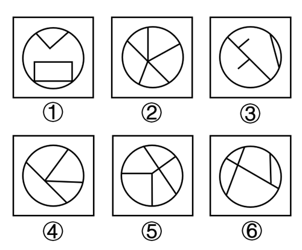
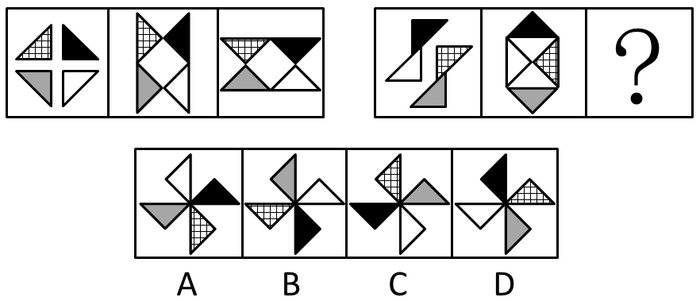
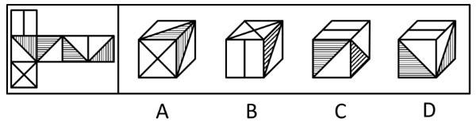
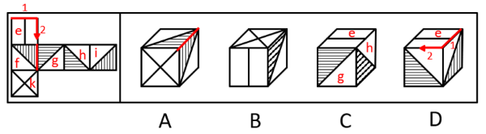
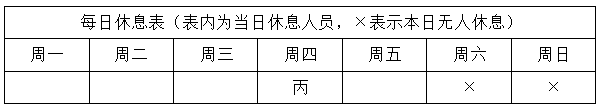
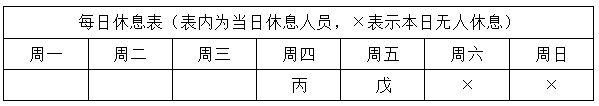

# 2024年江苏名校优生选调素质测试（网友回忆版）

> 判断推理 · 13 题 · 选调 2024

## 第 1 题　qid 19591529 · 类比推理

雄风：重振

- **A**. 炊烟：又见
- **B**. 业绩：倍增
- **C**. 老友：重逢
- **D**. 佳绩：再创　✅

**答案**：D

**官方解析**

第一步：判断题干词语间逻辑关系。
重振雄风，指再次获得往日的威风，二者为动宾关系。
第二步：判断选项词语间逻辑关系。
A项：又见炊烟，指再次看到炊烟升起，二者为动宾关系，与题干逻辑关系一致，保留；
B项：业绩倍增，指业绩增加，二者为主谓关系，与题干逻辑关系不一致，排除；
C项：重逢老友，指再次遇见老友，二者为动宾关系，与题干逻辑关系一致，保留；
D项：再创佳绩，指再次取得优异的成绩，二者为动宾关系，与题干逻辑关系一致，保留。
对比A、C、D三项，题干“重振雄风”和D项“再创佳绩”均强调恢复某种状态或重新取得某种成果，而A项“又见炊烟”和C项“重逢老友”只体现了再次看到或遇到某种情形，因此D项与题干逻辑关系更为一致，当选。
故正确答案为D。

---

## 第 2 题　qid 19591531 · 类比推理

简历：求职

- **A**. 学历：上学
- **B**. 病历：求医　✅
- **C**. 日历：日期
- **D**. 经历：历练

**答案**：B

**官方解析**

第一步：判断题干词语间逻辑关系。
求职需要简历，二者为条件对应关系。
第二步：判断选项词语间逻辑关系。
A项：上学为了获得学历，二者为方式目的的对应关系，与题干逻辑关系不一致，排除；
B项：求医需要病历，二者为条件对应关系，与题干逻辑关系一致，当选；
C项：日历上有日期，二者为组成关系，与题干逻辑关系不一致，排除；
D项：经历指亲身见过、做过或遇到过，历练指经历世事、锻炼，历练是一种经历，二者为种属关系，与题干逻辑关系不一致，排除。
故正确答案为B。

---

## 第 3 题　qid 19591536 · 类比推理

谋事：成事

- **A**. 表率：示范
- **B**. 信心：胆量
- **C**. 调查：发言　✅
- **D**. 出生：教育

**答案**：C

**官方解析**

第一步：判断题干词语间逻辑关系。
先谋事，后成事，谋事是成事的基础，成事是谋事的结果，二者为时间先后顺序的对应关系。
第二步：判断选项词语间逻辑关系。
A项：表率指好榜样，示范指做出某种可供大家学习的典范，二者为近义关系，与题干逻辑关系不一致，排除；
B项：信心和胆量是两种不同的心理状态，二者为并列关系，与题干逻辑关系不一致，排除；
C项：先调查，后发言，调查是发言的基础，发言是调查的结果，二者为时间先后顺序的对应关系，与题干逻辑关系一致，当选；
D项：先出生，后教育，但教育不是出生的结果，与题干逻辑关系不一致，排除。
故正确答案为C。

---

## 第 4 题　qid 19591530 · 类比推理

运动员：运动会：亚运会

- **A**. 南京人：大城市：南京市　✅
- **B**. 淡水鱼：淡水湖：青海湖
- **C**. 杭州人：志愿者：举办者
- **D**. 驾驶人：燃油车：电动车

**答案**：A

**官方解析**

第一步：判断题干词语间逻辑关系。
亚运会是一种运动会，二者为种属关系；运动员是运动会的参与者，二者为对应关系。
第二步：判断选项词语间逻辑关系。
A项：南京市是大城市，二者为种属关系；南京人是大城市的居民，二者为对应关系，与题干逻辑关系一致，当选；
B项：青海湖是咸水湖，而非淡水湖，二者是反向种属关系，与题干逻辑关系不一致，排除；
C项：有的杭州人是志愿者，有的杭州人不是志愿者，有的志愿者是杭州人，有的志愿者不是杭州人，二者为交叉关系，与题干逻辑关系不一致，排除；
D项：燃油车和电动车是两种动力不同的车辆类型，二者为并列关系，与题干逻辑关系不一致，排除。
故正确答案为A。

---

## 第 5 题　qid 19591542 · 类比推理

买菜：就餐：烹饪

- **A**. 出生：教育：养育
- **B**. 赚钱：消费：浪费
- **C**. 订票：出站：检票
- **D**. 入伍：转业：退役　✅

**答案**：D

**官方解析**

第一步：判断题干词语间逻辑关系。
先买菜，再烹饪，最后就餐，三者为时间先后顺序的对应关系。
第二步：判断选项词语间逻辑关系。
A项：教育和养育可以同时进行，二者不存在时间先后顺序的对应关系，与题干逻辑关系不一致，排除；
B项：浪费是消费中可能出现的结果，二者不存在时间先后顺序的对应关系，与题干逻辑关系不一致，排除；
C项：先订票，再检票，最后出站，三者为时间先后顺序的对应关系，与题干逻辑关系一致，保留；
D项：先入伍，再退役，最后转业，三者为时间先后顺序的对应关系，与题干逻辑关系一致，保留。
对比C、D两项，题干中买菜、就餐、烹饪的主体可以一致，D项中入伍、转业、退役的主体可以一致，而C项中订票、出站、检票的主体可以不一致，因此D项与题干逻辑关系更为一致，当选。
故正确答案为D。

---

## 第 6 题　qid 19591540 · 图形推理

把下面的六个图形分为两类，使每一类图形都有各自的共同特征或规律，分类正确的一项是：

- **A**. ①④⑥，②③⑤
- **B**. ①②③，④⑤⑥
- **C**. ①③④，②⑤⑥　✅
- **D**. ①③⑥，②④⑤

**答案**：C

**官方解析**

本题为分组分类题目。元素组成不同，且无明显属性规律，考虑数量规律。观察发现，题干每幅图线条交叉明显，且都有圆形外框，内部线条与外框有明显相交，考虑数框上交点，图①③④框上交点数为4，图②⑤⑥框上交点数为5，即图①③④为一组，图②⑤⑥为一组。
故正确答案为C。

---

## 第 7 题　qid 1787214 · 图形推理

从所给四个选项中，选择最合适的一个填入问号处，使之呈现一定的规律性：

- **A**. A
- **B**. B
- **C**. C
- **D**. D　✅

**答案**：D

**官方解析**

元素组成相同，优先考虑位置规律。第一组图中，图1到图2方格三角形与白色三角形逆时针旋转，黑色三角形与灰色三角形顺时针旋转，图2到图3方格三角形与白色三角形顺时针旋转，黑色三角形与灰色三角形逆时针旋转；第二组图应遵循相同的规律，只有D项符合。

故正确答案为D。

---

## 第 8 题　qid 19591546 · 图形推理

左边给定的是正方体的外表面展开图，右边哪一项能由它折叠而成？

- **A**. A
- **B**. B
- **C**. C　✅
- **D**. D

**答案**：C

**官方解析**

将题干展开图标上序号，如下图所示，逐一进行分析。

A项：选项顶面和右侧面的公共边与面内三角形的内部线条均垂直，但展开图中不存在两个面的公共边与面内三角形的内部线条均垂直的情况，选项与题干展开图不一致，排除；

B项：选项出现了面e和面k，展开图中面e和面k是相对面，相对面不能同时出现，选项与题干展开图不一致，排除；

C项：选项由面e、面h和面g构成，选项与题干展开图一致，当选；

D项：选项出现了面e，正面和右侧面的公共边挨着两个白色三角形的直角边，因此正面和右侧面分别为面h和面i，在展开图和选项中分别以面e内线条垂直的边为起始边，顺时针在面e内画边，展开图中边2挨着面g中的阴影三角形，而选项中边2挨着白色三角形，选项与题干展开图不一致，排除。

故正确答案为C。

---

## 第 9 题　qid 19591535 · 类比推理

小王要买自行车，已知：
（1）预算充足买公路车
（2）预算不足买山地车
（3）买山地车或者码表就买锁头
（4）买公路车或者码表就买头盔
（5）买头盔或者锁头就买智能手环
由此可推出：

- **A**. 买了山地车
- **B**. 买了公路车
- **C**. 买了头盔
- **D**. 买了智能手环　✅

**答案**：D

**官方解析**

第一步：翻译题干。

（1）预算充足公路车；

（2）预算充足山地车；

（3）山地车 或 码表锁头；

（4）公路车 或 码表头盔；

（5）头盔 或 锁头智能手环。

第二步：根据题干条件进行推理。

题干没有确定信息，但条件中分别出现了“预算充足”和“预算充足”，可以考虑优先从此入手进行假设。

假设“预算充足”，是对条件（1）的肯前，肯前必肯后，可得“买了公路车”，这是对条件（4）的肯前，可得“买了头盔”，这是对条件（5）的肯前，可得“买了智能手环”，即“预算充足公路车头盔智能手环”；

假设“预算充足”，是对条件（2）的肯前，肯前必肯后，可得“买了山地车”，这是对条件（3）的肯前，可得“买了锁头”，这是对条件（5）的肯前，可得“买了智能手环”，即“预算充足山地车锁头智能手环”。

综上可知，根据二难推理“如果AB，AB，那么B一定为真”，即可以推出“买了智能手环”一定为真。

故正确答案为D。

---

## 第 10 题　qid 19591539 · 逻辑判断

老王不爱跑步，老李爱跑步。有天老王看到老李被急救车拉走，老王心想：经常跑步的人不一定健康，不跑步的人不一定不健康。
以下哪项能反驳老王？

- **A**. 老张一直坚持跑步，身体十分健康
- **B**. 剧烈运动容易给心脏带来负担
- **C**. 研究证明跑步对身体的好处有增强人体新陈代谢、改善心肺功能、降低体脂率　✅
- **D**. 不同人对经常跑步的标准不一样

**答案**：C

**官方解析**

第一步：找出论点和论据。
论点：经常跑步的人不一定健康，不跑步的人不一定不健康。
论据：老王不爱跑步，老李爱跑步。有天老王看到老李被急救车拉走。
论据讨论的是不爱跑步的老王看见爱跑步的老李被急救车拉走，从而老王得出结论，经常跑步的人不一定健康，不跑步的人不一定不健康，论据可以自然地推出论点，即论点、论据讨论的话题一致，削弱优先考虑削弱论点。
第二步：逐一判断选项。
A项：该项指出老张一直坚持跑步，身体十分健康，用老张举例说明经常跑步的人也会健康，但老王的观点是“经常跑步的人不一定健康”，即“经常跑步的人有可能健康，也有可能不健康”，选项与老王的观点并不冲突，无法削弱，排除；
B项：该项指出剧烈运动容易给心脏带来负担，说明经常跑步确实可能损害健康，补充论据支持老王的观点“经常跑步的人不一定健康”，无法削弱，排除；
C项：该项指出跑步对身体有诸多好处，通过科学证据直接指出“经常跑步”与“健康”之间呈正相关，说明经常跑步确实有益健康，削弱了老王的观点，可以削弱，当选；
D项：该项指出不同人对经常跑步的标准不一样，讨论的是如何定义“经常跑步”，而论点讨论的是“经常跑步”与“健康”之间的关系，话题不一致，为无关项，无法削弱，排除。
故正确答案为C。

---

## 第 11 题　qid 19591537 · 逻辑判断

农忙时节，甲、乙、丙、丁、戊五人帮助收割庄稼，一周之内，五人均只休息一天，周六周日不休息，恰好五天均有人休息。并且已知：
（1）丙周四休息
（2）甲和丁休息日相邻
（3）甲乙丁三人共同连续工作四天
问以下哪项正确？

- **A**. 甲周一休息
- **B**. 乙周二休息
- **C**. 丁周三休息
- **D**. 戊周五休息　✅

**答案**：D

**官方解析**

第一步：分析题干条件。

（1）丙周四休息；

（2）甲和丁休息日相邻；

（3）甲乙丁三人共同连续工作四天；

（4）一周之内，五人均只休息一天，周六周日不休息，恰好五天均有人休息。

第二步：根据题干条件进行推理。

根据条件（1）（4）可知，丙周四休息且周六周日无人休息，此时休息日只剩下周一、周二、周三和周五4天（如下表所示）。

结合条件（3）可知，甲乙丁3人共同连续工作4天，说明7天中有连续4天甲乙丁3人都不能休息（即连续4天3人均不出现在休息表内），再结合条件（4）可知，每人都要有一天休息，故甲乙丁3人要在周一、周二、周三、周五中选3天休息，且保证有连续4天这三人都不休息。

此时只有甲乙丁在周一、周二和周三休息才能保证3人在周四至周日这4天连续工作（即连续4天不出现在休息表内），此时无法确定甲乙丁休息日的具体顺序，只需保证甲丁在周一周二或周二周三休息即可满足条件（2），结合条件（1）（4）可知，此时剩下的戊只能在周五休息，对应D项。

故正确答案为D。

---

## 第 12 题　qid 19591544 · 逻辑判断

当代年轻人之间流行“随手拍”，律师提醒虽然是无意间拍摄，但是未经被拍摄人允许，将其照片或视频发布到网上，可能会侵犯肖像权和隐私权，需要根据情况承担民事、行政或刑事责任。因此律师建议，为了规避风险，最好不要随手拍。
以下哪项如果为真，最能支持律师的结论？

- **A**. 如果随手拍了他人的照片和视频，但是并未在网上公布，就不会侵犯肖像权和隐私权
- **B**. 年轻人喜欢街拍已经形成了习惯，很难改变
- **C**. 尽管没有营利目的，但是未经同意公开他人照片和视频仍然构成侵权　✅
- **D**. 被拍者大多比较敏感，不愿意自己的照片和视频在网上传播

**答案**：C

**官方解析**

第一步：找出论点和论据。
论点：为了规避风险，最好不要随手拍。
论据：当代年轻人之间流行“随手拍”，律师提醒虽然是无意间拍摄，但是未经被拍摄人允许，将其照片或视频发布到网上，可能会侵犯肖像权和隐私权，需要根据情况承担民事、行政或刑事责任。
本题论据讨论随手拍可能会侵犯他人权利，进而承担法律责任，论点讨论为了规避风险，最好不要随手拍，二者话题一致，加强优先考虑补充论据。
第二步：逐一分析选项。
A项：该项指出随手拍若并未在网上公布就不会侵犯肖像权和隐私权，即随手拍可能不违法，但论点讨论的是为了规避风险，不要随手拍，即随手拍有风险，可以削弱，无法加强，排除；
B项：该项指出年轻人的街拍习惯很难改变，即不随手拍很难，与论点讨论的随手拍是否有风险无关，话题不一致，为无关项，无法加强，排除；
C项：该项指出尽管没有营利目的，但是未经同意公开他人照片和视频仍然构成侵权，说明随手拍确实有侵权风险，解释了为什么为了规避风险，不要随手拍，补充论据，可以加强，当选；
D项：该项指出被拍者不愿意自己的照片和视频在网上传播，但并不清楚这是否会给拍摄者带来风险，为不明确项，无法加强，排除。
故正确答案为C。

---

## 第 13 题　qid 19591543 · 逻辑判断

甲、乙、丙三个人参加运动会，其中有一个人受伤弃赛，一个人得奖。三个人说了以下三个信息：
（1）甲：乙参加了比赛
（2）乙：丙是参加比赛但没得奖的人
（3）丙：甲获奖了
已知只有弃赛的人说的是真话，可以推出：

- **A**. 甲获奖了
- **B**. 乙弃赛了
- **C**. 丙是参赛但没得奖的人
- **D**. 乙是参赛但没得奖的人　✅

**答案**：D

**官方解析**

第一步：分析题干条件。
（1）甲：乙参加了比赛；
（2）乙：丙是参加比赛但没得奖的人；
（3）丙：甲获奖了；
（4）有一个人受伤弃赛，一个人得奖，一人参赛但没得奖。
根据“只有弃赛的人说的是真话”可知，其余人说的是假话，但是无法根据题干条件知道谁是弃赛的人，且条件中没有明显的矛盾关系，所以优先采用假设法。
第二步：根据题干条件进行推理。
假设甲是弃赛的人，那么甲说真话，乙和丙说假话。根据甲是弃赛的人，可以推出，乙和丙都参加了比赛；再根据乙说假话可以推出，丙不是参加比赛但没得奖的人，由于丙参加了比赛，故丙只能是参加比赛且得奖的人，那么乙是参加比赛但没得奖的人，满足题干所有信息，假设成立，对应D项；
假设乙是弃赛的人，那么乙说真话，甲和丙说假话。根据乙是弃赛的人，可以推出，甲和丙都参加了比赛；再根据丙说假话可以推出，甲没获奖，那么甲是参加比赛但没得奖的人，由于乙是弃赛的人，那么丙只能是获奖的人，此时，“丙获奖”与乙说的真话“丙是参加比赛但没得奖的人”矛盾，故假设错误，该情况不成立；
假设丙是弃赛的人，那么丙说真话，甲和乙说假话。根据丙是弃赛的人，可以推出，甲和乙都参加了比赛；此时，“乙参加了比赛”说明甲说的是真话，与“甲说假话”矛盾，故假设错误，该情况不成立。
综上，甲是弃赛的人，乙是参加比赛但没得奖的人，丙是获奖的人，D项正确。
故正确答案为D。

---
