# 2024年江苏省公务员录用考试《行测》题（A类）（网友回忆版）

> 判断推理 · 46 题 · 江苏 2024

## 材料 1

某企业的生产部、研发部和财务部分别需要招聘1名员工，有3名博士生、3名硕士生和3名本科生前来应聘。该公司人事部小王对招聘结果做了如下预测：

（1）如果生产部录用本科生，那么研发部录用硕士生；

（2）如果研发部录用博士生，那么生产部录用博士生；

（3）如果财务部录用本科生或者硕士生，那么研发部录用本科生。

### 第 1 题　qid 16095257 · 逻辑判断

如果3个部门录用的人员学历各不相同，那么以下哪种情况符合小王的预测？

- **A**. 生产部录用硕士生，财务部录用本科生
- **B**. 研发部录用博士生，财务部录用硕士生
- **C**. 生产部录用博士生，研发部录用本科生　✅
- **D**. 财务部录用本科生，研发部录用硕士生

**答案**：C

**官方解析**

第一步：分析题干条件。

（1）生产部录用本科生研发部录用硕士生；

（2）研发部录用博士生生产部录用博士生；

（3）财务部录用本科生 或 财务部录用硕士生研发部录用本科生；

（4）有3名博士生、3名硕士生和3名本科生；

（5）3个部门录用的人员学历各不相同。

第二步：根据题干条件进行推理。

根据条件（2）和条件（5）可以推出研发部没有录用博士生，因为如果“研发部录用博士生”，根据条件（2）可以推出生产部也录用博士生，与条件（5）矛盾，所以研发部没有录用博士生，排除B项；

根据条件（3）和条件（5）可以推出财务部没有录用本科生，因为如果“财务部录用本科生”，根据条件（3）可以推出研发部也录用本科生，与条件（5）矛盾，所以财务部没用录用本科生，排除A、D两项。

故正确答案为C。

---

### 第 2 题　qid 16095260 · 类比推理

如果研发部录用硕士生，那么以下哪种情况不符合小王的预测？

- **A**. 生产部录用博士生
- **B**. 财务部录用博士生
- **C**. 生产部录用本科生
- **D**. 财务部录用硕士生　✅

**答案**：D

**官方解析**

第一步：分析题干条件。

（1）生产部录用本科生研发部录用硕士生；

（2）研发部录用博士生生产部录用博士生；

（3）财务部录用本科生 或 财务部录用硕士生研发部录用本科生；

（4）有3名博士生、3名硕士生和3名本科生；

（5）研发部录用硕士生。

第二步：根据题干条件进行推理。

条件（5）为确定信息，以此为起点开始推理。

根据条件（5）“研发部录用硕士生”以及题干条件“每个部门只招聘1名员工”，可以推出“研发部没有录用本科生”，是对条件（3）的否后，否后必否前，可以推出“财务部没有录用本科生 且 财务部没有录用硕士生”，即财务部只能录用博士生，D项不符合小王的预测，当选。

本题为选非题，故正确答案为D。

---

## 材料 2

市住建局3名工作人员小郑、小周、小刘打算参加“青年党员下基层”调研活动。可选的有小微堵点改造、跨区断头路建设、小型城市客厅打造、历史街区微改造4个调研项目。指导调研的有王教授、钱教授、马教授，且他们只能指导上述三位工作人员，已知：

（1）每位工作人员参加的项目都必须有教授指导，每位教授至少指导一位工作人员；

（2）每位工作人员只能参加一个项目，提倡多人合作；

（3）每位教授只能指导一个项目，一个项目也可由多位教授共同指导；

（4）小郑参加小微堵点改造或跨区断头路建设项目，钱教授指导历史街区微改造项目。

### 第 3 题　qid 16095254 · 类比推理

参加或指导小微堵点改造项目的不可能同时有以下哪两个人？

- **A**. 王教授和马教授
- **B**. 马教授和小刘
- **C**. 小刘和小周　✅
- **D**. 小周和王教授

**答案**：C

**官方解析**

第一步：分析题干条件。
（1）每位工作人员参加的项目都必须有教授指导，每位教授至少指导一位工作人员；
（2）每位工作人员只能参加一个项目，提倡多人合作；
（3）每位教授只能指导一个项目，一个项目也可由多位教授共同指导；
（4）小郑参加小微堵点改造或跨区断头路建设项目，钱教授指导历史街区微改造项目。
第二步：根据题干条件进行推理。
提问方式为“不可能”，优先考虑代入法。
代入A项，若指导小微堵点改造项目的是王教授和马教授，由条件（4）可知，指导历史街区微改造项目的是钱教授，结合条件（1）中的“每位教授至少指导一位工作人员”可知，历史街区微改造项目必须有工作人员参加，此时只要这两个项目都分别有至少一位工作人员参加即可，与题干条件不矛盾，该项可能成立，排除；
代入B项，若指导小微堵点改造项目的是马教授，参加小微堵点改造项目的是小刘，由条件（4）可知，指导历史街区微改造项目的是钱教授，结合条件（1）中的“每位教授至少指导一位工作人员”可知，历史街区微改造项目必须有工作人员参加，小郑参加小微堵点改造或跨区断头路建设项目，那么此时小周参加历史街区微改造项目即可，与题干条件不矛盾，该项可能成立，排除；
代入C项，若参加小微堵点改造项目的是小刘和小周，由条件（4）可知，小郑参加小微堵点改造或跨区断头路建设项目，此时3名工作人员中没有人可以参加由钱教授指导的历史街区微改造项目，不符合条件（1）中的“每位教授至少指导一位工作人员”，该项不可能成立，当选；
代入D项，若参加小微堵点改造项目的是小周，指导小微堵点改造项目的是王教授，由条件（4）可知，小郑参加小微堵点改造或跨区断头路建设项目，钱教授指导历史街区微改造项目，结合条件（1）中的“每位教授至少指导一位工作人员”可知，历史街区微改造项目必须有工作人员参加，此时小刘参加历史街区微改造项目即可，与题干条件不矛盾，该项可能成立，排除。
本题为选非题，故正确答案为C。

---

### 第 4 题　qid 16095256 · 类比推理

如果小周参加小型城市客厅打造项目，则以下哪一项一定为真？

- **A**. 小刘参加历史街区微改造项目　✅
- **B**. 王教授指导小型城市客厅打造项目
- **C**. 马教授指导小微堵点改造项目
- **D**. 小郑参加跨区断头路建设项目

**答案**：A

**官方解析**

第一步：分析题干条件。
（1）每位工作人员参加的项目都必须有教授指导，每位教授至少指导一位工作人员；
（2）每位工作人员只能参加一个项目，提倡多人合作；
（3）每位教授只能指导一个项目，一个项目也可由多位教授共同指导；
（4）小郑参加小微堵点改造或跨区断头路建设项目，钱教授指导历史街区微改造项目；
（5）小周参加小型城市客厅打造项目。
第二步：根据题干条件进行推理。
条件（4）与条件（5）中有确定信息，优先从确定信息入手推理。由条件（4）可知，钱教授指导历史街区微改造项目，结合条件（1）中的“每位教授至少指导一位工作人员”可知，历史街区微改造项目一定有工作人员参加；由条件（4）可知，小郑参加小微堵点改造或跨区断头路建设项目，由条件（5）可知，小周参加小型城市客厅打造项目，结合条件（2）中的“每位工作人员只能参加一个项目”可知，参加历史街区微改造项目的工作人员不可能是小郑、小周，且只有3名工作人员，所以小刘一定参加历史街区微改造项目，对应A项。
故正确答案为A。

---

### 第 5 题　qid 5919637 · 类比推理

保护知识产权：保护创新

- **A**. 人之初：性本善
- **B**. 德不孤：必有邻
- **C**. 勤有功：戏无益
- **D**. 经一事：长一智　✅

**答案**：D

**官方解析**

第一步：判断题干词语间逻辑关系。
“保护知识产权”是“保护创新”的重要手段和举措，通过“保护知识产权”能达到“保护创新”的目的，二者为方式与目的的对应关系。
第二步：判断选项词语间逻辑关系。
A项：“人之初，性本善”的意思是人出生之初，禀性本身都是善良的。“人之初”与“性本善”不是方式与目的的对应关系，与题干逻辑关系不一致，排除。
B项：“德不孤，必有邻”的意思是有道德的人是不会孤单的，必定会有志同道合的人来与他为伴。“德不孤”与“必有邻”不是方式与目的的对应关系，与题干逻辑关系不一致，排除。
C项：“勤有功，戏无益”的意思是人只要勤奋努力，就会有所成就；而嬉戏贪玩则对人没有任何好处。“勤有功”与“戏无益”不是方式与目的的对应关系，与题干逻辑关系不一致，排除。
D项：“经一事，长一智”的意思是亲身经历了某件事情，就能增长关于这方面的知识。通过“经一事”能达到“长一智”的目的，二者为方式与目的的对应关系，与题干逻辑关系一致，当选。
故正确答案为D。

---

### 第 6 题　qid 5919659 · 类比推理

年华未暮：容貌先秋

- **A**. 十年树木：百年树人
- **B**. 宁为玉碎：不为瓦全
- **C**. 言者无心：听者有意　✅
- **D**. 人无远虑：必有近忧

**答案**：C

**官方解析**

第一步：判断题干词语间逻辑关系。
“年华未暮，容貌先秋”的意思是未到衰老的年纪，而容颜已经老去，虽然“年华未暮”，但是“容貌先秋”，二者为转折的对应关系。
第二步：判断选项词语间逻辑关系。
A项：“十年树木，百年树人”的意思是培植树木需要十年，培育人才需要百年，指培养人才很不容易，二者为并列关系，与题干逻辑关系不一致，排除；
B项：“宁为玉碎，不为瓦全”的意思是宁愿做高贵的玉器而破碎，也不愿做低贱的瓦器得以保全，比喻宁为正义事业而牺牲，也不苟且偷生，二者为并列关系，与题干逻辑关系不一致，排除；
C项：“言者无心，听者有意”的意思是说话的人不注意，而听话的人却很留神，虽然“言者无心”，但是“听者有意”，二者为转折的对应关系，与题干逻辑关系一致，当选；
D项：“人无远虑，必有近忧”的意思是人若没有长远的谋虑，一定很快就有忧患，二者为条件的对应关系，与题干逻辑关系不一致，排除。
故正确答案为C。

---

### 第 7 题　qid 5919643 · 类比推理

吴王好剑客：百姓多创瘢

- **A**. 白日依山尽：黄河入海流
- **B**. 问君何能尔：心远地自偏
- **C**. 海上生明月：天涯共此时
- **D**. 烽火连三月：家书抵万金　✅

**答案**：D

**官方解析**

第一步：判断题干词语间逻辑关系。
“吴王好剑客，百姓多创瘢”的意思是吴王喜爱精通剑术的侠客，为此老百姓身上伤痕累累。因为“吴王好剑客”，所以“百姓多创瘢”，二者为因果对应关系。
第二步：判断选项词语间逻辑关系。
A项：“白日依山尽，黄河入海流”的意思是太阳依傍着西山慢慢地沉落，滔滔黄河朝着大海汹涌奔流。“白日依山尽”与“黄河入海流”为并列关系，与题干逻辑关系不一致，排除。
B项：“问君何能尔？心远地自偏”的意思是问我如何能做到这样，只要心中所想远离世俗，自然就会觉得所处地方僻静了。“问君何能尔”不是“心远地自偏”的原因，二者不是因果对应关系，与题干逻辑关系不一致，排除。
C项：“海上生明月，天涯共此时”的意思是茫茫的海上升起一轮明月，使人忆起远隔天涯海角的亲友，此时应该都在望着这轮明月。“海上生明月”不是“天涯共此时”的原因，二者不是因果对应关系，与题干逻辑关系不一致，排除。
D项：“烽火连三月，家书抵万金”的意思是连绵的战火已经持续很长时间了，家书难得，一封抵得上万两黄金。因为“烽火连三月”，所以“家书抵万金”，二者为因果对应关系，与题干逻辑关系一致，当选。
故正确答案为D。

---

### 第 8 题　qid 12334408 · 类比推理

停：行：止

- **A**. 日：月：星
- **B**. 满：亏：盈
- **C**. 没：有：无　✅
- **D**. 萌：荣：枯

**答案**：C

**官方解析**

第一步：判断题干词语间逻辑关系。
“停”和“止”均指“停止”，第一词与第三词为全同关系，“行”指“走、移动”，“停”、“止”与“行”是两种不同的状态，且除了“停（止）”就是“行”，第一词和第三词均与第二词构成矛盾关系。
第二步：判断选项词语间逻辑关系。
A项：“日”、“月”、“星”三者为并列关系，与题干逻辑关系不一致，排除；
B项：“满”指“达到容量的极点”，“盈”指“充满、多出来”，第一词与第三词为近义关系，“亏”指“受损失、欠缺”，“盈”和“亏”语义相反，第二词与第三词构成反义关系，且生意除了“盈”和“亏”外还有“不盈不亏”，第一词和第三词与第二词并不构成矛盾关系，与题干逻辑关系不一致，排除；
C项：“没”和“无”均指“没有、不存在”，第一词与第三词为全同关系，“有”指“存在”，“没”、“无”与“有”是两种不同的状态，且除了“没（无）”就是“有”，第一词和第三词均与第二词构成矛盾关系，与题干逻辑关系一致，当选；
D项：“萌”、“荣”、“枯”分别指植物或草木“发芽”、“茂盛”、“失去水分”，三者为状态先后顺序的对应关系，与题干逻辑关系不一致，排除。
故正确答案为C。

---

### 第 9 题　qid 5919658 · 类比推理

球赛：球员：裁判

- **A**. 教学：教师：家长
- **B**. 庭审：被告：法官　✅
- **C**. 球场：球员：观众
- **D**. 手术：患者：护士

**答案**：B

**官方解析**

第一步：判断题干词语间逻辑关系。
“球员”参与“球赛”，二者为活动与主体的对应关系；“裁判”判罚“球员”，二者为主体与被判罚对象的对应关系。
第二步：判断选项词语间逻辑关系。
A项：“教师”参与“教学”，二者为活动与主体的对应关系，但“家长”不能判罚“教师”，与题干逻辑关系不一致，排除。
B项：“被告”参与“庭审”，二者为活动与主体的对应关系；“法官”判罚“被告”，二者为主体与被判罚对象的对应关系。与题干逻辑关系一致，当选。
C项：“球员”在“球场”打球，二者是地点与主体的对应关系，与题干逻辑关系不一致，排除。
D项：“患者”接受“手术”，而不是参与“手术”，且“护士”不能判罚“患者”，与题干逻辑关系不一致，排除。
故正确答案为B。

---

### 第 10 题　qid 17900967 · 类比推理

戏剧：壁画：生活

- **A**. 陈设：衣饰：性格　✅
- **B**. 字形：字音：情感
- **C**. 文章：书法：人品
- **D**. 时针：钟表：时间

**答案**：A

**官方解析**

第一步：判断题干词语间逻辑关系。
“戏剧”和“壁画”是两种不同的艺术形式，二者为并列关系中的反对关系；“戏剧”和“壁画”都能够反映“生活”，前两个词分别与第三个词构成反映对象的对应关系。
第二步：判断选项词语间逻辑关系。
A项：“陈设”和“衣饰”是两种不同的外在表现，二者为并列关系中的反对关系；“陈设”和“衣饰”都能够反映“性格”，前两个词分别与第三个词构成反映对象的对应关系。与题干逻辑关系一致，当选。
B项：“字形”指字的形体，“字音”指字的读音，二者为并列关系中的反对关系，但二者均不能反映“情感”，与题干逻辑关系不一致，排除。
C项：“文章”和“书法”是两种不同的艺术作品，二者为并列关系中的反对关系，但“书法”不能反映“人品”，与题干逻辑关系不一致，排除。
D项：“时针”是“钟表”的组成部分，二者为包容关系中的组成关系，与题干逻辑关系不一致，排除。
故正确答案为A。

---

### 第 11 题　qid 17900968 · 类比推理

海军装备：军事装备：维护

- **A**. 田径比赛：跳高比赛：举行
- **B**. 舞蹈表演：艺术表演：观赏　✅
- **C**. 购车补贴：购房补贴：发放
- **D**. 数字贸易：新兴贸易：互惠

**答案**：B

**官方解析**

第一步：判断题干词语间逻辑关系。
“海军装备”是一种“军事装备”，二者为包容关系中的种属关系；“维护海军装备”“维护军事装备”，第三个词与前两个词分别构成动宾关系。
第二步：判断选项词语间逻辑关系。
A项：“跳高比赛”是一种“田径比赛”，二者为包容关系中的种属关系，但词语顺序与题干相反，与题干逻辑关系不一致，排除。
B项：“舞蹈表演”是一种“艺术表演”，二者为包容关系中的种属关系；“观赏舞蹈表演”“观赏艺术表演”，第三个词与前两个词分别构成动宾关系。与题干逻辑关系一致，当选。
C项：“购车补贴”和“购房补贴”是两种不同的补贴，二者为并列关系，与题干逻辑关系不一致，排除。
D项：“数字贸易”是一种“新兴贸易”，二者为包容关系中的种属关系；“互惠”是贸易的特点，第三个词与前两个词分别构成属性对应关系。与题干逻辑关系不一致，排除。
故正确答案为B。

---

### 第 12 题　qid 17900969 · 类比推理

实践成果：阶段成果：理论成果

- **A**. 经济创新：文化创新：政治创新
- **B**. 阅读辅导：读写辅导：写作辅导
- **C**. 环岛旅行：红色旅行：太空旅行
- **D**. 物质文明：现代文明：精神文明　✅

**答案**：D

**官方解析**

第一步：判断题干词语间逻辑关系。
根据获取途径的不同，成果可分为“实践成果”和“理论成果”，二者为矛盾关系；“阶段成果”指一定时间或任务阶段取得的工作成果，与“实践成果”和“理论成果”分别构成交叉关系。
第二步：判断选项词语间逻辑关系。
A项：创新可分为“经济创新”“文化创新”“政治创新”等，三者为并列关系，与题干逻辑关系不一致，排除。
B项：“读写辅导”是针对阅读、写作开展的辅导，由“阅读辅导”和“写作辅导”组成，第二个词与第一、三个词分别构成组成关系，与题干逻辑关系不一致，排除。
C项：根据旅行的目的地不同，旅行可分为“环岛旅行”“太空旅行”等，二者为反对关系，与题干逻辑关系不一致，排除。
D项：根据形式不同，文明可分为“物质文明”和“精神文明”，二者为矛盾关系；“现代文明”与“物质文明”和“精神文明”分别构成交叉关系。与题干逻辑关系一致，当选。
故正确答案为D。

---

### 第 13 题　qid 5919649 · 类比推理

杞人忧天 之于 （    ） 相当于  （    ） 之于 自不量力

- **A**. 庸人自扰；螳臂当车　✅
- **B**. 局促不安；蜉蝣撼树
- **C**. 叶公好龙；夜郎自大
- **D**. 郑人买履；自以为是

**答案**：A

**官方解析**

逐一代入选项。
A项：“杞人忧天”借指为不必要忧虑的事情而忧虑，“庸人自扰”指本来没有问题而自己瞎着急或自找麻烦，二者为近义关系；“螳臂当车”比喻不正确估计自己的力量，去做办不到的事情，必然招致失败，“自不量力”指不能正确估计自己的力量（多指做力不能及的事情），二者为近义关系。前后逻辑关系一致，当选。
B项：“杞人忧天”借指为不必要忧虑的事情而忧虑，“局促不安”的意思是拘谨不自然，形容举止拘束，心中不安，二者无明显逻辑关系；“蜉蝣撼树”比喻通过贬低他人来抬高自己，“自不量力”指不能正确估计自己的力量（多指做力不能及的事情），二者无明显逻辑关系。前后逻辑关系不一致，排除。
C项：“杞人忧天”借指为不必要忧虑的事情而忧虑，“叶公好龙”比喻说是爱好某事物，其实并不真爱好，二者无明显逻辑关系；“夜郎自大”指妄自尊大，“自不量力”指不能正确估计自己的力量（多指做力不能及的事情），二者为近义关系。前后逻辑关系不一致，排除。
D项：“杞人忧天”借指为不必要忧虑的事情而忧虑，“郑人买履”指照搬条文，不考虑客观实际的教条做法，二者无明显逻辑关系；“自以为是”指认为自己的看法和做法都正确，不接受别人的意见，“自不量力”指不能正确估计自己的力量（多指做力不能及的事情），二者无明显逻辑关系。前后逻辑关系不一致，排除。
故正确答案为A。

---

### 第 14 题　qid 5919655 · 类比推理

牙齿磨损 之于 （    ） 相当于 （    ） 之于 经济活力

- **A**. 年龄大小；用电总量　✅
- **B**. 牙齿脱落；社会效益
- **C**. 骨骼磨损；发展指数
- **D**. 坚硬食物；经济疲软

**答案**：A

**官方解析**

逐一代入选项。
A项：牙齿磨损程度可以反映年龄大小，用电总量大小可以反映经济活力，二者均为对应关系，前后逻辑关系一致，当选；
B项：牙齿磨损可能会导致牙齿脱落，二者为因果关系；经济活力是指一国一定时期内经济中总供给和总需求的增长速度及其潜力，社会效益是指各种经济活动及科学技术、教育、文学、艺术等在社会上产生的非经济性效果和利益，与经济活力为并列关系，前后逻辑关系不一致，排除；
C项：牙齿磨损不是一种骨骼磨损，二者无明显逻辑关系；经济活力是指一国一定时期内经济中总供给和总需求的增长速度及其潜力，而发展指数是指衡量某一领域发展程度的一种数据标准，经济活力会影响发展指数，二者为对应关系，前后逻辑关系不一致，排除；
D项：食用坚硬食物会导致牙齿磨损，二者为因果关系；经济疲软说明经济活力低，二者为对应关系，前后逻辑关系不一致，排除。
故正确答案为A。

---

### 第 15 题　qid 17900833 · 图形推理

从所给的四个选项中，选择最合适的一个填入问号处，使之呈现一定的规律性。

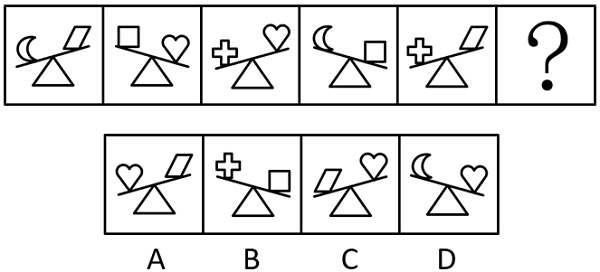

- **A**. A
- **B**. B
- **C**. C
- **D**. D　✅

**答案**：D

**官方解析**

元素组成不同，且无明显属性规律，考虑数量规律。观察发现，图形中出现类似天平的示意图，将两端小元素转化为质量关系，可得：&gt;，&gt;，&gt;，&gt;，&gt;。串联后可得：&gt;&gt;&gt;&gt;。故问号处图形中两个小元素也应符合此规律，排除B、C两项。继续观察发现，题干图形中天平依次倾向于左侧、右侧、左侧、右侧、左侧、？，故问号处图形中的天平应倾向于右侧，只有D项符合。

故正确答案为D。

---

### 第 16 题　qid 16095253 · 图形推理

请从四个选项中选出最恰当的一项填入问号处，使题干图形呈现一定的规律性。

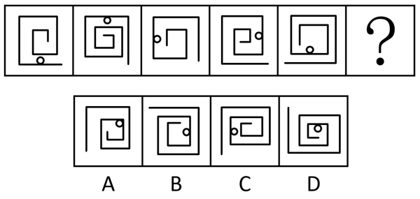

- **A**. A
- **B**. B　✅
- **C**. C
- **D**. D

**答案**：B

**官方解析**

元素组成基本相同，题干每幅图形都是由直线和小白圆组成，考虑功能元素的标记作用。观察发现，小白圆只标记1条线，且若把每幅图的最外面那条线当作第1条线，那么小白圆依次标记在第1条线、第2条线、第3条线、第4条线、第5条线上，故？处图形中的小白圆应只标记在第6条线上，只有B项符合。
故正确答案为B。

---

### 第 17 题　qid 12334416 · 图形推理

从所给的四个选项中，选择最合适的一个填入问号处，使之呈现一定的规律性。

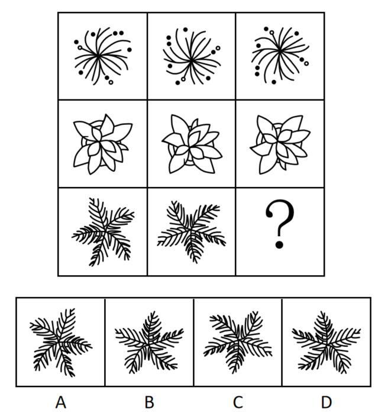

- **A**. A
- **B**. B　✅
- **C**. C
- **D**. D

**答案**：B

**官方解析**

元素组成相同，优先考虑位置规律。九宫格优先横向看，第一行中，图一经过逆时针旋转得到图二，图二经过上下翻转得到图三；第二行经验证，符合该规律；第三行应用规律，只有B项符合。

故正确答案为B。

---

### 第 18 题　qid 10975255 · 图形推理

从所给的四个选项中，选择最合适的一个填入问号处，使之呈现一定的规律性。

- **A**. A　✅
- **B**. B
- **C**. C
- **D**. D

**答案**：A

**官方解析**

元素组成相同，但无位置规律和属性规律，考虑数量规律。九宫格优先横向看，观察发现，题干已知图形中黑球的数量均为7，排除B项。继续观察发现，题干已知图形中黑球和白球分堆明显，考虑部分数，题干已知图形中黑球和白球的部分数均为3，问号处图形也应遵循此规律，只有A项符合。
故正确答案为A。

---

### 第 19 题　qid 17900966 · 图形推理

从所给的四个选项中，选择最合适的一个填入问号处，使之呈现一定的规律性。

- **A**. A
- **B**. B　✅
- **C**. C
- **D**. D

**答案**：B

**官方解析**

元素组成相同，优先考虑位置规律。观察发现，题干已知图形均可看作九宫格，考虑内、外圈分开看。从第一幅图到第五幅图，外圈的依次顺时针移动1、2、3、4格，故从第五幅图到问号处图形，外圈的应顺时针移动5格，排除C、D两项；内部的依次顺时针旋转90°，只有B项符合。

故正确答案为B。

---

### 第 20 题　qid 17900982 · 图形推理

选项四个图形中，只有一个是由题干的四个图形拼合（只能通过上、下、左、右平移）而成的，请把它找出来。

- **A**. A　✅
- **B**. B
- **C**. C
- **D**. D

**答案**：A

**官方解析**

本题考查平面拼合，可采用平行且等长相消的方法解题。消去平行且等长的线段后进行拼合可得到轮廓图，即为A项。平行且等长相消的方式如下图所示。

故正确答案为A。

---

### 第 21 题　qid 10975247 · 图形推理

选项四个图形中，只有一个是由题干的四个图形拼合（只能通过上、下、左、右平移）而成的，请把它找出来。

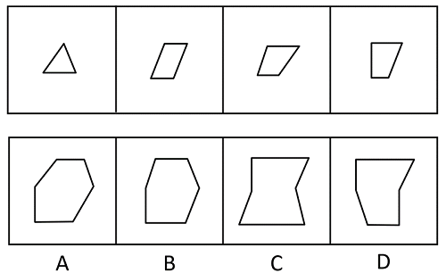

- **A**. A
- **B**. B　✅
- **C**. C
- **D**. D

**答案**：B

**官方解析**

本题考查平面拼合，可采用平行且等长相消的方法解题。消去平行且等长的线段后进行拼合可得到轮廓图，即为B项。平行且等长相消的方式如下图所示。

故正确答案为B。

---

### 第 22 题　qid 16095258 · 图形推理

选项四个图形中，只有一个是由题干的四个图形拼合（只能通过上、下、左、右平移）而成的，请把它找出来。

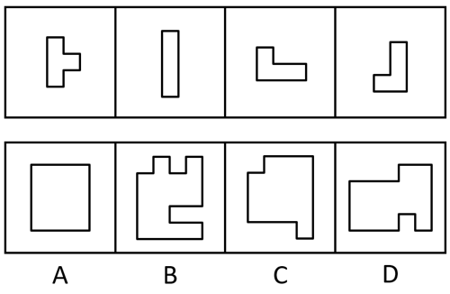

- **A**. A
- **B**. B　✅
- **C**. C
- **D**. D

**答案**：B

**官方解析**

本题考查平面拼合，可采用平行且等长相消的方法解题。消去平行且等长的线段后进行组合可得到轮廓图，即为B项。平行且等长相消的方式如下图所示。

故正确答案为B。

---

### 第 23 题　qid 17900987 · 图形推理

选项四个图形中，只有一个是由题干的四个图形拼合（只能通过上、下、左、右平移）而成的，请把它找出来。

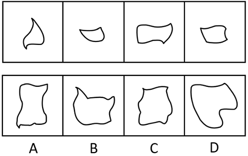

- **A**. A
- **B**. B
- **C**. C
- **D**. D　✅

**答案**：D

**官方解析**

本题考查平面拼合。曲线类图形，消去弯曲程度一致且等长的线条后进行拼合可得到轮廓图，即为D项，拼合方式如下图所示。

故正确答案为D。

---

### 第 24 题　qid 10975248 · 图形推理

左边图形恰好可以分割为右边的某三个图形（可以平移、旋转，但不可翻转），请找出不属于分割所得的图形。

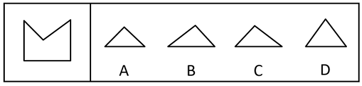

- **A**. A
- **B**. B　✅
- **C**. C
- **D**. D

**答案**：B

**官方解析**

本题考查平面拼合。A、D两项图形旋转后与C项图形进行拼合，可得到题干轮廓图，拼合方式如下图所示。

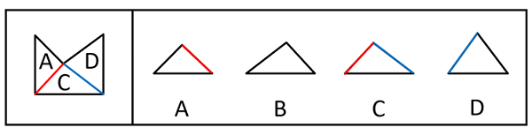

本题为选非题，故正确答案为B。

---

### 第 25 题　qid 10975249 · 图形推理

左边给定的是六面体的外表面展开图，右边哪一项能由它折叠而成？

- **A**. A　✅
- **B**. B
- **C**. C
- **D**. D

**答案**：A

**官方解析**

将题干展开图中的面依次标上序号，如下图所示，逐一分析选项。

A项：选项由面a、面e与面f构成，选项与题干展开图一致，当选。

B项：选项由面a、面b与面e构成，题干展开图中面e内“旦”字的单一长横线紧挨着面f，而选项中面e内“旦”字的单一长横线紧挨着面b，选项与题干展开图不一致，排除。

C项：选项由面c、面d与面f构成，题干展开图中面c与面d的公共边不挨着面d内“占”字上半部分的短横线，而选项中面c与面d的公共边挨着面d内“占”字上半部分的短横线，选项与题干展开图不一致，排除。

D项：选项由面a、面c与面f构成，题干展开图中面c与面f的公共边与面f内“由”字的最长线垂直，而选项中面c与面f的公共边与面f内“由”字的最长线平行，选项与题干展开图不一致，排除。

故正确答案为A。

---

### 第 26 题　qid 10975257 · 图形推理

下列是四个正方体的外表面展开图，其中哪个展开图还原成正方体后，存在同一个公共顶点的三个面上的数字之和为8？

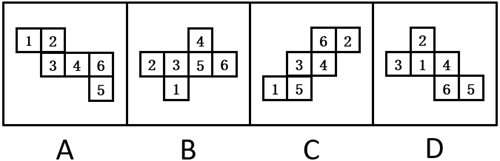

- **A**. A
- **B**. B
- **C**. C　✅
- **D**. D

**答案**：C

**官方解析**

若想展开图还原成正方体后，存在同一个公共顶点的三个面上的数字之和为8，需要“面1、面2、面5”或者“面1、面3、面4”相邻，即三个面存在公共点。
A项：面1和面4为相对面，故面1、面3和面4不存在公共点；面2和面5为相对面，故面1、面2和面5不存在公共点。两种情况均不符合要求，排除。
B项：面1和面4为相对面，故面1、面3和面4不存在公共点；面2和面5为相对面，故面1、面2和面5不存在公共点。两种情况均不符合要求，排除。
C项：面1、面2和面5两两相邻，即三个面存在公共点，符合要求，当选。
D项：面3和面4为相对面，故面1、面3和面4不存在公共点；面1和面5为相对面，故面1、面2和面5不存在公共点。两种情况均不符合要求，排除。
故正确答案为C。

---

### 第 27 题　qid 16095252 · 图形推理

将下列三棱锥的展开图还原成三棱锥后，有一个与其他三个不一样，请把它找出来。

- **A**. A
- **B**. B
- **C**. C
- **D**. D　✅

**答案**：D

**官方解析**

本题考查空间重构。在选项展开图中，以只有两个扇形的面上的空白顶点作为起始点，进行顺时针画边，如下图所示，逐一分析选项。

A项：选项中右边两个面为图案一样的面，边1不挨着其中任意一个面中的小扇形。

B项：选项中最左边和最右边两个面为图案一样的面，边1不挨着其中任意一个面中的小扇形。

C项：选项中最上边和左下边为图案一样的面，边1不挨着其中任意一个面中的小扇形。

D项：选项中最上边和右下边为图案一样的面，边1与最上边面中的小扇形有公共点。

本题为选非题，故正确答案为D。

---

### 第 28 题　qid 17900755 · 图形推理

下列立体图形的视图不可能是所给四个选项中的哪一个？

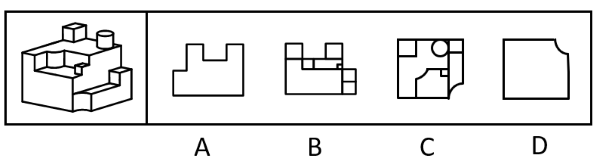

- **A**. A　✅
- **B**. B
- **C**. C
- **D**. D

**答案**：A

**官方解析**

本题考查三视图。B、C、D三项：如下图所示，按图中箭头方向观察，均可看到，排除。

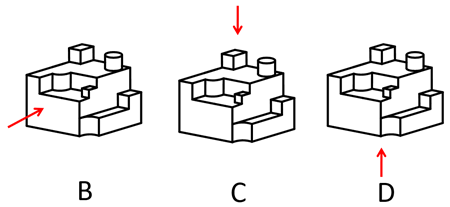

A项：如下图所示，按图中箭头方向观察立体图形，圆柱与下方立体图形的连接处应有一条横线，故该项不是题干立体图形的视图，当选。

本题为选非题，故正确答案为A。

---

### 第 29 题　qid 12304865 · 逻辑判断

一只鸟除非两翼健壮并以共同的力量来推动身体，否则它不能飞向天空。根据以上陈述，可以推出以下哪些结论？
①一只鸟如果两翼健壮并以共同的力量来推动身体，那么它能够飞向天空
②一只鸟如果能够飞向天空，那么它两翼健壮并以共同的力量来推动身体
③一只鸟若两翼不健壮或不能以共同的力量来推动身体，那么它不能飞向天空
④一只鸟如果不能飞向天空，那么它两翼不健壮或不能以共同力量来推动身体

- **A**. ①②
- **B**. ②③　✅
- **C**. ③④
- **D**. ②④

**答案**：B

**官方解析**

第一步：翻译题干。

题干翻译为：飞向天空两翼健壮 且 以共同的力量来推动身体。

第二步：逐一分析选项。

①翻译为：两翼健壮 且 以共同的力量来推动身体飞向天空，是对题干逻辑关系的肯后，肯后无必然结论，无法推出；

②翻译为：飞向天空两翼健壮 且 以共同的力量来推动身体，是对题干逻辑关系的肯前，肯前必肯后，可以推出；

③翻译为：两翼健壮 或 以共同的力量来推动身体飞向天空，是对题干逻辑关系的否后，否后必否前，可以推出；

④翻译为：飞向天空两翼健壮 或 以共同的力量来推动身体，是对题干逻辑关系的否前，否前无必然结论，无法推出。

综上所述，②③可以推出，对应B项。

故正确答案为B。

---

### 第 30 题　qid 10975246 · 逻辑判断

某学校模拟派出骨干教师指导山区教师人才培训项目。甲、乙、丙、丁四位教师积极报名参加，学校决定从他们四人中挑选出若干人员，考虑到各方面情况，派出人员要符合以下要求：
①只有乙参加，甲才参加；
②如果丙参加，那么丁不参加；
③如果乙参加，那么丙也参加。
根据以上信息，以下哪项不可能为真？

- **A**. 甲和丙参加
- **B**. 丁参加，乙不参加
- **C**. 甲和丁参加　✅
- **D**. 甲参加，丁不参加

**答案**：C

**官方解析**

第一步：翻译题干条件。

（1）甲乙；

（2）丙丁；

（3）乙丙。

将（1）（2）（3）串联可得：（4）甲乙丙丁。

第二步：根据题干条件进行推理。

根据条件（4）可知，甲参加时丁一定不参加，因此C项不可能为真。

本题为选非题，故正确答案为C。

---

### 第 31 题　qid 2579002 · 逻辑判断

马王堆汉墓由长沙国丞相及其妻儿三座墓组成，在墓群中出土的帛书《道德经》与传世本《道德经》存在文字出入，如帛书中的“道可道非恒道，名可名非恒名”，在传世本中为“道可道非常道，名可名非常名”，考虑到古代存在帝王讳名制，有学者据此断定帛书《道德经》至少问世于汉文帝刘恒在位（公元前179-公元前157年）之前。
以下哪项为真，可以支持该学者？

- **A**. 长沙国丞相死于公元前186年
- **B**. 长沙国丞相的妻儿死于公元前168年之后
- **C**. “道可道非恒道，名可名非恒名”与“道可道非常道，名可名非常名”同义
- **D**. 帝王讳名制在秦朝从宗族内部扩展到社会整体，汉朝继承了秦朝的许多制度　✅

**答案**：D

**官方解析**

第一步：找出论点和论据。
论点：帛书《道德经》至少问世于汉文帝刘恒在位（公元前179-公元前157年）之前。
论据：在墓群中出土的帛书《道德经》与传世本《道德经》存在文字出入，如帛书中的“道可道非恒道，名可名非恒名”，在传世本中为“道可道非常道，名可名非常名”，考虑到古代存在帝王讳名制。
本题论点指出帛书《道德经》至少问世于刘恒在位之前，论据是帛书《道德经》并没有避讳刘恒的名字，且古代存在帝王讳名制，论点论据话题紧密，可以理解为话题一致，加强优先考虑补充论据。
第二步：逐一分析选项。
A项：指出长沙国丞相死于公元前186年，即在刘恒在位之前去世，但根据去世时间无法判断墓中物品的问世时间，不能加强，排除；
B项：指出长沙国丞相的妻儿死于公元前168年之后，无法确定死亡时间，且根据去世时间无法判断墓中物品的问世时间，不能加强，排除；
C项：指出帛书《道德经》与传世本《道德经》的两句话含义相同，无法确定“恒”改为“常”的原因，也无法确定帛书《道德经》的问世时间，话题不一致，不能加强，排除；
D项：指出帝王讳名制是秦朝的制度，而汉朝继承了秦朝的许多制度，即汉朝很可能存在帝王讳名制，而帛书《道德经》中没有避讳刘恒的名字，那就很可能出现在汉文帝刘恒在位之前，有利于论点的成立，补充论据，当选。
故正确答案为D。

---

### 第 32 题　qid 2172762 · 逻辑判断

近年来，V国巴沙鱼因在进口时已完成分割、切块、去刺等工序，加工成本比国产黑鱼低，一直是制作酸菜鱼的重要原料。但今年酸菜鱼市场对V国巴沙鱼的需求减弱，其份额逐渐被国产黑鱼占据。
以下哪项为真，最能解释上述现象？

- **A**. 随着国产黑鱼产、供、销体系完善，其价格降低　✅
- **B**. V国巴沙鱼进入中国需要经有关部门食品安全检测，需较长时间
- **C**. 过去几年爆火的以V国巴沙鱼为原料的酸菜鱼预制菜今年销售份额降低
- **D**. 以国产黑鱼为原料的酸菜鱼味道更鲜美，受到对价格不敏感的消费者喜爱

**答案**：A

**官方解析**

第一步：找出题干矛盾。
V国巴沙鱼加工成本比国产黑鱼低，一直是制作酸菜鱼的重要原料，但今年酸菜鱼市场对V国巴沙鱼的需求减弱，其份额逐渐被国产黑鱼占据。
第二步：逐一分析选项。
A项：该项指出国产黑鱼价格降低了，之前对V国巴沙鱼需求强是因为加工成本低，而现在随着国产黑鱼价格的降低，V国巴沙鱼逐渐失去价格优势，因此酸菜鱼市场就会减少对V国巴沙鱼的需求，其份额逐渐被价格降低的国产黑鱼占据，可以解释题干矛盾，当选；
B项：该项指出V国巴沙鱼进入中国需要较长的检测时间，但该问题一直存在，无法解释为何“今年”酸菜鱼市场对V国巴沙鱼的需求减弱，其份额逐渐被国产黑鱼占据，无法解释题干矛盾，排除；
C项：该项指出今年以V国巴沙鱼为原料的酸菜鱼预制菜销售份额降低，可以导致对V国巴沙鱼的一部分需求减弱，但不能解释为什么其份额逐渐被国产黑鱼占据，无法解释题干矛盾，排除；
D项：该项指出以国产黑鱼为原料的酸菜鱼味道更鲜美，受到对价格不敏感的消费者喜爱，但该情况一直存在，不只出现在“今年”，且无法判断“对价格不敏感的消费者”数量多少，是否可以代表全部消费者，无法解释题干矛盾，排除。
故正确答案为A。

---

### 第 33 题　qid 17900831 · 逻辑判断

人体总能量代谢主要由静息代谢水平和活动能量代谢水平决定。静息代谢指人体在静止状态下消耗的能量，活动能量代谢指人们在日常活动或运动状态下所消耗的能量。近年来，M市成年人的总能量代谢水平呈现下降趋势。有人据此认为，M市成年人的静息代谢水平近年来也呈下降趋势。
以下哪项如果为真，最能支持上述人士的观点？

- **A**. 近年来，M市成年人逐渐重视饮食结构均衡，减少各种高能量食物摄入
- **B**. 近年来，M市成年人开始重视身体锻炼，平均每天的锻炼时长有所增加　✅
- **C**. 近年来，M市成年人劳动强度普遍降低，许多人不再从事高强度体力劳动
- **D**. 近年来，M市成年人总能量代谢水平下降幅度比活动能量代谢水平下降幅度小

**答案**：B

**官方解析**

第一步：找出论点和论据。
论点：M市成年人的静息代谢水平近年来也呈下降趋势。
论据：人体总能量代谢主要由静息代谢水平和活动能量代谢水平决定。近年来，M市成年人的总能量代谢水平呈现下降趋势。
本题论点说的是“静息代谢水平呈下降趋势”，即部分下降，而论据说的是“总能量代谢水平呈下降趋势”，即整体下降，加强优先考虑补充论据，即说明另一部分（活动能量代谢水平）的情况。
第二步：逐一分析选项。
A项：该项指出M市的成年人减少高能量食物摄入，而论点说的是静息代谢水平呈下降趋势，话题不一致，无法加强，排除。
B项：该项指出M市的成年人平均每天的锻炼时长有所增加，说明活动能量代谢水平在上升，结合论据中总能量代谢水平下降，可以推出静息代谢水平下降，补充论据，可以加强，当选。
C项：该项指出M市的成年人劳动强度降低，说明活动能量代谢水平在下降，结合论据中总能量代谢水平下降，无法推出静息代谢水平一定下降了（静息代谢水平也可能上升了，但上升幅度小于活动能量代谢水平的下降幅度），为不明确项，无法加强，排除。
D项：该项指出M市成年人总能量代谢水平下降幅度比活动能量代谢水平下降幅度小，当整体下降的幅度小于一个因素下降的幅度时，另一个因素的变化情况无法确定，为不明确项，无法加强，排除。
故正确答案为B。

---

### 第 34 题　qid 16095272 · 类比推理

甲：小明十岁就能用英语与英国人流利对话，语言天赋真是出类拔萃。
乙：小明跟着父母在英国住了两年，能流利对话不足为奇。
以下哪项与题干对话方式最为相似？

- **A**. 
甲：这款热水器的价格比市面上常见的热水器高出一倍，太不划算了

乙：这款产品用的是航天级别的材料，在同材质热水器中性价比很高
　✅
- **B**. 
甲：小李以前容易冲动，进入职场一年后稳重多了

乙：小李承担了单位大量重要工作，变得稳重一点理所当然

- **C**. 
甲：小张的数学一直很好，进入高中后，物理、化学等科目的学习很轻松

乙：数学强调科学思维，掌握科学思维的人学习物理、化学当然没有难度

- **D**. 
甲：小刘在过去的一年中连续犯下三起盗窃案，真是无可救药

乙：人非圣贤，孰能无过，相信在经过改造之后他会洗心革面

**答案**：A

**官方解析**

第一步：分析题干逻辑关系。
甲根据“小明十岁就能用英语与英国人流利对话”的现象，得出“小明的语言天赋出类拔萃”的结论，而乙提出“小明跟着父母在英国住了两年”的理由来解释现象，用“能流利对话不足为奇”来否定甲的结论。
第二步：逐一分析选项。
A项：甲根据“这款热水器的价格比市面上常见的热水器高出一倍”的现象，得出“这款热水器不划算”的结论，乙提出“这款产品用的是航天级别的材料”的理由来解释现象，用“在同材质热水器中性价比很高”来否定甲的结论，与题干对话方式一致，当选；
B项：甲提出“小李以前容易冲动，进入职场一年后稳重多了”的结论，乙提出“小李承担了单位大量重要工作，变得稳重一点理所当然”的理由来解释甲的结论，与题干对话方式不一致，排除；
C项：甲提出“小张的数学一直很好，进入高中后，物理、化学等科目的学习很轻松”的结论，乙提出“数学强调科学思维，掌握科学思维的人学习物理、化学当然没有难度”的理由来解释甲的结论，与题干对话方式不一致，排除；
D项：甲根据“小刘在过去的一年中连续犯下三起盗窃案”的现象，得出“小刘无可救药”的结论，乙得出的观点“相信在经过改造之后小刘会洗心革面”是一种预测，而非事实，用预测否定甲的结论，与题干对话方式不一致，排除。
故正确答案为A。

---

### 第 35 题　qid 12304873 · 逻辑判断

卖早点、修家电、配钥匙·····老百姓家门口的社区商业，是以社区居民为服务对象、服务半径为步行15分钟左右范围内的商业形态。近年来，许多城市大力推进社区商业建设，以更好地满足居民的消费需求。不过，也有专家担忧，家门口商业服务的完善，在给居民生活带来便利的同时可能也会使快递业逐步萎缩。
以下哪项如果为真，最能缓解上述专家的担忧？

- **A**. 为了方便居民，很多城市推进社区商业建设时，都将快递驿站作为社区商业的重要组成部分
- **B**. 社区商业主要提供汽车保养、幼儿托管等服务类业态，社区购物在居民整体购物消费中占比很少　✅
- **C**. 社会经济发展必然包含新旧行业的更迭，社区商业作为新的消费增长点，吸纳了大量传统行业的劳动者就业
- **D**. 许多大型商超组建了自己的配送车队，可为周边5公里范围内居民提供商品一小时送达服务

**答案**：B

**官方解析**

第一步：找出论点和论据。
论点：家门口商业服务的完善，在给居民生活带来便利的同时可能也会使快递业逐步萎缩。
论据：无。
本题提问为“缓解上述专家的担忧”即削弱上述专家的担忧，且只有论点没有论据，削弱优先考虑削弱论点，即说明家门口商业服务的完善不会使快递业逐步萎缩。
第二步：逐一分析选项。
A项：该项说的是很多城市将快递驿站作为社区商业的重要组成部分，说明家门口商业服务完善后快递驿站依然很重要，可能不会使快递业逐步萎缩，削弱论点，可以削弱，保留；
B项：该项说的是社区购物在居民整体购物消费中占比很少，说明社区商业的建设对居民原有的购物方式影响不大，也就不会使快递业逐步萎缩，削弱论点，可以削弱，保留；
C项：该项说的是社区商业吸纳了大量传统行业的劳动者就业，是在说社区商业促进了就业，并未提及对快递业的影响，为无关项，无法削弱，排除；
D项：该项说的是许多大型商超提供限时配送服务，大型商超不属于社区商业，提供的配送服务不属于快递业，为无关项，无法削弱，排除。
对比A、B两项，A项说的是快递驿站的重要性，但是快递驿站重要并不能明确说明快递业的情况，而B项明确说明了对居民原有的购物方式影响不大，即不会对快递业有影响，综合对比，B项比A项更加明确，因此优选B项。
故正确答案为B。

---

### 第 36 题　qid 10975252 · 逻辑判断

某学校举办田径运动会，所有参加800米跑的运动员都参加了100米跑，所有参加100米跑的运动员都参加了跳高，有些参加跳远的运动员参加了投掷链球，所有参加跳远的运动员都没有参加跳高。
根据以上陈述，不能推出以下哪项？

- **A**. 所有参加800米跑的运动员都参加了跳高
- **B**. 所有参加投掷链球的运动员都没有参加跳高
- **C**. 所有参加跳远的运动员都没有参加100米跑
- **D**. 有些参加800米跑的运动员参加了跳远　✅

**答案**：D

**官方解析**

第一步：翻译题干。

（1）参加800米跑参加100米跑；

（2）参加100米跑参加跳高；

（3）有的参加跳远参加投掷链球；

（4）参加跳远参加跳高。

将（1）（2）（4）串联可得：（5）参加800米跑参加100米跑参加跳高参加跳远。

第二步：逐一分析选项。

A项：翻译为“参加800米跑参加跳高”，“参加800米跑”是对条件（5）的肯前，肯前必肯后，可以推出，排除。

B项：翻译为“参加投掷链球参加跳高”，将条件（3）换位可得“有的参加投掷链球参加跳远”，与条件（4）串联可得“有的参加投掷链球参加跳远参加跳高”，“有的”无法推出“所有”，即“所有参加投掷链球的运动员都没有参加跳高”可能为真，也可能为假，保留。

C项：翻译为“参加跳远参加100米跑”，“参加跳远”是对条件（5）的否后，否后必否前，可以推出，排除。

D项：翻译为“有的参加800米跑参加跳远”，与条件（5）矛盾，无法推出，保留。

对比B、D两项，B项可能为真，D项一定为假，择优选D项。

本题为选非题，故正确答案为D。

---

### 第 37 题　qid 16095269 · 逻辑判断

评价某份试卷中的试题质量通常有难度和区分度等指标，一道单选题的难度通常用正确选择试题答案的人数与参加测验的总人数的比值来表示。区分度指的是试题对考生实际水平的区分程度和区分的有效性，一道单选题的区分度指数D的计算公式为：，其中为高分组（试卷总得分排在前27%的考生）该题的难度，为低分组（试卷总得分排在后27%的考生）该题的难度。

根据以上陈述，可以推出以下哪项？

- **A**. 一道难度为1的单选题区分度指数为0.1
- **B**. 任一单选题的区分度指数不可能为负值
- **C**. 一道难度为0.27的单选题的最大区分度指数为0.5
- **D**. 一道单选题的难度也可以表示为该题的平均得分与该题分值的比值　✅

**答案**：D

**官方解析**

日常结论题，根据题干信息逐一分析选项。

A项：若一道单选题的难度为1，意味着参加测验的所有人都答对了，则高分组和低分组的人都答对了，说明高分组该题的难度，低分组该题的难度，则区分度指数D=0，而不是0.1，该项表述错误，排除；

B项：若有一道题高分组答对的人数少于低分组，此时高分组该题的难度小于低分组该题的难度，即，则这道题的区分度指数D为负数，该项表述错误，排除；

C项：若一道单选题的难度为0.27，说明正确选择试题答案的人数与参加测验的总人数的比值为0.27，假设参加测验的总人数为100人，则正确选择试题答案的人数为27人，并且此时高分组与低分组均各有27人，如果想要计算最大区分度指数，则需要使的值尽可能大，即尽可能取最大值，同时尽可能取最小值，即需要使正确选择试题答案的27人均属于高分组，即，同时，低分组全部答错，即，则此时这道题的最大区分度指数，而不是0.5，该项表述错误，排除；

D项：，该项表述正确，当选。

故正确答案为D。

---

### 第 38 题　qid 12304874 · 逻辑判断

一项研究发现，成年小白鼠去除一个关键生物钟基因后，昼夜节律完全消失，虽然生活质量有所下降，但寿命并未受到显著影响，心血管健康状况甚至有所改善。据此，研究人员推断昼夜节律缺失对健康的危害可能没有我们想象得那么大。
回答以下哪个问题最有助于评价上述研究人员所做出的推断？

- **A**. 成年小白鼠去除生物钟基因后出现的心血管情况改善是否会延长小白鼠的寿命
- **B**. 成年小白鼠去除生物钟基因之后的休息时间是否与未去除之前的休息时间相同
- **C**. 成年小白鼠去除生物钟基因后的寿命和心血管健康状况能否代表整体健康状况　✅
- **D**. 成年小白鼠去除生物钟基因之后的生活质量是否会影响小白鼠的整体健康状况

**答案**：C

**官方解析**

第一步：找出论点和论据。
论点：昼夜节律缺失对健康的危害可能没有我们想象得那么大。
论据：成年小白鼠去除一个关键生物钟基因后，昼夜节律完全消失，虽然生活质量有所下降，但寿命并未受到显著影响，心血管健康状况甚至有所改善。
本题论点讨论的是“昼夜节律缺失”和“整体健康状况”之间的关系，论据讨论的是“昼夜节律缺失”和“寿命、心血管健康状况”之间的关系，二者话题不一致，且提问方式为“最有助于”评价研究人员的推断，可以考虑搭桥，即建立“寿命、心血管健康状况”与“整体健康状况”之间的关系。
第二步：逐一分析选项。
A项：该项讨论的是“心血管健康状况”与“寿命”之间的关系，而不是“寿命、心血管健康状况”与“整体健康状况”之间的关系，即使心血管状况改善能够延长寿命，仍无法得知整体健康状况如何，无助于评价研究人员的推断，排除；
B项：该项讨论的是“去除生物钟基因前后的休息时间”，论点说的是“昼夜节律缺失”和“整体健康状况”的关系，话题不一致，无助于评价研究人员的推断，排除；
C项：该项讨论的是“寿命、心血管健康状况”与“整体健康状况”之间的关系，如果寿命和心血管健康状况能代表整体健康状况，则说明研究人员的推断成立，有助于评价研究人员的推断，当选；
D项：该项讨论的是“生活质量”与“整体健康状况”之间的关系，但研究人员是通过“寿命”与“心血管健康状况”得出的论点，不如C项更有助于评价研究人员的推断，排除。
故正确答案为C。

---

### 第 39 题　qid 16095268 · 定义判断

迭代学习：指学习者通过不间断的目标训练，更好地理解学习内容，不断提升技能完善自身能力的学习方式。
下列不属于迭代学习的是：

- **A**. 小周参加专业技能大赛，实操环节丢了不少分，他不断强化训练，再次参加就获得了二等奖。又经过一年训练，综合技能有了显著提高，自己也十分自信
- **B**. 学习者要熟练掌握数学运算需经历数年大致相同的过程，先是加减法，之后是乘除法，接下来是混合运算，逐渐进入更高阶的运算
- **C**. 李教授经常深入社区举办科普讲座，最初因为专业性过强，听众很少，后来引入了市民关注的鲜活案例，听众越来越多；最近又融入了不少优秀传统文化元素，感染力越来越强
- **D**. 多家公司推出了各自的AI自然语言处理模型，有的只能与人进行简单对话，有的能在收到指令后几秒钟内交出一份质量不错的作业，有些已经能够针对各种问题给出比较专业的建议　✅

**答案**：D

**官方解析**

第一步：找出定义关键词。
“学习者”、“通过不间断的目标训练”、“更好地理解学习内容，不断提升技能完善自身能力”。
第二步：逐一分析选项。
A项：小周通过不断强化训练，从一开始参加专业技能大赛的实操环节丢不少分，到再次参加获得二等奖，到最后综合技能显著提高，符合“学习者”、“通过不间断的目标训练”、“更好地理解学习内容，不断提升技能完善自身能力”，符合定义，排除；
B项：学习者通过不断的学习，掌握的数学运算从一开始的加减法、乘除法到混合运算，到最后进入更高阶的运算，符合“学习者”、“通过不间断的目标训练”、“更好地理解学习内容，不断提升技能完善自身能力”，符合定义，排除；
C项：李教授的科普讲座从一开始的专业性强、听众少到引入市民关注的案例后听众越来越多，到最后融入文化元素、感染力越来越强，符合“学习者”、“通过不间断的目标训练”、“更好地理解学习内容，不断提升技能完善自身能力”，符合定义，排除；
D项：多家公司推出各自的AI自然语言处理模型，有的只能简单与人对话，有的能写作业，有的已能给出比较专业的建议，这些是不同AI对于自然语言处理的不同结果，并没有体现AI不间断学习的过程，不符合“学习者”、“通过不间断的目标训练”、“更好地理解学习内容，不断提升技能完善自身能力”，不符合定义，当选。
本题为选非题，故正确答案为D。

---

### 第 40 题　qid 10975250 · 定义判断

钝感力：指在工作、生活中能够尽快摆脱消极情绪或困扰，从容应对外部压力，或者冷静面对个人成绩，坚持既定目标的心理防御机制。
下列不属于钝感力的是：

- **A**. 谷先生每次回顾自己的创业经历，都把成功归因于百折不挠的韧劲：无论碰到多少磨难，始终没有被困难打倒，一直沿着目标不断地向前
- **B**. 邱奶奶已经90岁，眼不花，耳不聋，腿脚麻利。她的体会是：人生在世，不如意事十之八九，迅速忘掉不愉快的事，保持乐观情绪就能长寿
- **C**. 杜先生从去年开始坚持在健身中心锻炼，提高身体素质，缓解工作压力。现在再也不像以前那样容易感冒，即使工作到深夜也不觉得累　✅
- **D**. 钟先生性格稳重，听到表扬从不得意忘形，遇到批评也不垂头丧气，心无旁骛地钻研业务，近几年取得了很多令人羡慕的专业成就

**答案**：C

**官方解析**

第一步：找出定义关键词。
“能够尽快摆脱消极情绪或困扰，从容应对外部压力”“冷静面对个人成绩，坚持既定目标”。
第二步：逐一分析选项。
A项：谷先生创业时始终没有被困难打倒，一直沿着目标不断地向前，说明其没有因困难长期处于消极情绪之中，符合“能够尽快摆脱消极情绪或困扰，从容应对外部压力”，符合定义，排除。
B项：邱奶奶认为自己长寿的秘诀是迅速忘掉不愉快的事，保持乐观情绪，符合“能够尽快摆脱消极情绪或困扰，从容应对外部压力”，符合定义，排除。
C项：杜先生坚持健身，身体素质明显提高，未提及心理和思想方面的感受，不符合“能够尽快摆脱消极情绪或困扰，从容应对外部压力”“冷静面对个人成绩，坚持既定目标”，不符合定义，当选。
D项：钟先生听到表扬从不得意忘形，符合“冷静面对个人成绩，坚持既定目标”，遇到批评也不垂头丧气，符合“能够尽快摆脱消极情绪或困扰，从容应对外部压力”，符合定义，排除。
本题为选非题，故正确答案为C。

---

### 第 41 题　qid 10975251 · 定义判断

潮汐式管理：指管理者根据时间的不同，差异化、精细化管理特定公共资源，最大限度开发和利用现有资源，有效提升公众幸福指数的管理方法。
下列不属于潮汐式管理的是：

- **A**. 某市在主城区的一些特定道路上划定特殊停车位，实行“夜停晨走”制度，老城区停车位不足的问题得到了有效缓解
- **B**. 某街道对摆摊经营实行定时定点画线管理，商贩按指定时间、地点出摊，既不影响交通，又方便了周围居民生活
- **C**. 每年的旅游旺季，某景区附近的居民小区让外地游客免费使用地下停车场车位，大家在网上对此纷纷点赞　✅
- **D**. 某市实行居民电动汽车充电桩分时电价政策，峰谷收费标准不同。高峰时段按照正常标准，低谷时段则按照不同的优惠幅度收费

**答案**：C

**官方解析**

第一步：找出定义关键词。
“管理者根据时间的不同”、“差异化、精细化管理特定公共资源”、“最大限度开发和利用现有资源，有效提升公众幸福指数”。
第二步：逐一分析选项。
A项：某市划定特殊停车位，实行“夜停晨走”制度，符合“管理者根据时间的不同”、“差异化、精细化管理特定公共资源”，停车位不足的问题得到了有效缓解，符合“最大限度开发和利用现有资源，有效提升公众幸福指数”，符合定义，排除。
B项：某街道对摆摊经营实行定时定点画线管理，符合“管理者根据时间的不同”、“差异化、精细化管理特定公共资源”，商贩出摊既不影响交通又方便了周围居民生活，符合“最大限度开发和利用现有资源，有效提升公众幸福指数”，符合定义，排除。
C项：某居民小区让外地游客免费使用地下停车场车位，该举措是小区做的，没有提及管理者管理公共资源，不符合“管理者根据时间的不同”、“差异化、精细化管理特定公共资源”，并且只是免费使用了车位，体现不出对资源的最大限度开发，不符合“最大限度开发和利用现有资源，有效提升公众幸福指数”，不符合定义，当选。
D项：某市实行居民电动汽车充电桩分时电价政策，峰谷收费标准不同，符合“管理者根据时间的不同”、“差异化、精细化管理特定公共资源”，低谷时段优惠收费，符合“最大限度开发和利用现有资源，有效提升公众幸福指数”，符合定义，排除。
本题为选非题，故正确答案为C。

---

### 第 42 题　qid 10975253 · 定义判断

城市漫游：指按照预定主题和路线，漫步城市街区，在向导带领下深度体验城市变迁或历史文化的旅游方式。
下列属于城市漫游的是：

- **A**. 韩先生周末带外地同学游览本市的步行街——河西大道，聊得口干舌燥，买了两杯竹筒奶茶，在“我在河西大道很想你”路牌下拍了很多照片
- **B**. 小方周六日经常把年迈的父母接到城里游玩。由于父母腿脚不太利索，一天通常只游玩一两个景点。周围邻居都夸小方很孝顺
- **C**. 在外漂泊多年的任女士今年回到了故乡，昔日一览无余的小城现在到处高楼林立，为了寻找童年的记忆，她已经走遍了这里的大街小巷
- **D**. 某地旅行社推出了主打“像本地人一样行走在运河边”的新产品，三四个小时的穿城徒步让游客累得抬不起腿，大家仍觉得意犹未尽　✅

**答案**：D

**官方解析**

第一步：找出定义关键词。
“漫步城市街区”、“在向导带领下”、“深度体验城市变迁或历史文化”。
第二步：逐一分析选项。
A项：韩先生带外地同学游览步行街，并不是向导带领，不符合“在向导带领下”，且只是在路牌下拍照，没有深度体验城市变迁或历史文化，不符合“深度体验城市变迁或历史文化”，不符合定义，排除。
B项：小方父母是在小方的陪同下游玩景点，不符合“在向导带领下”，且游玩的景点不确定是否在城市街区，不符合“漫步城市街区”，不符合定义，排除。
C项：任女士回到故乡并自己走遍了大街小巷，并没有向导带领，不符合“在向导带领下”，不符合定义，排除。
D项：某旅行社推出了穿城徒步的产品，且该产品让游客像本地人一样体验当地文化，符合“漫步城市街区”、“在向导带领下”、“深度体验城市变迁或历史文化”，符合定义，当选。
故正确答案为D。

---

### 第 43 题　qid 10975254 · 定义判断

数字游民：指工作时间不受限制，地域可以自主选择，利用网络数字手段完成本职工作的从业人员。
下列属于数字游民的是：

- **A**. 小雷辞职后游走在不同的城市，白天在市区游玩特色街区，晚上到热闹的广场跟着市民一起跳舞，随时随地向天南地北的粉丝直播，月收入比以前多得多　✅
- **B**. 康女士居住在很远的小区，每天通勤时间差不多需要三四个小时，工作十分辛苦。最近，她的居家办公申请得到了批准，不用天天去公司打卡了
- **C**. 黄先生年初被公司派驻到某山区工作，闲暇之余利用微信公众号帮助当地乡亲销售土特产，并通过网络众筹建起了雪乡旅舍，有时亲自担任导游。默默无闻的小山村很快变成了远近闻名的旅游村
- **D**. 潮玩设计师周先生到新公司后，再也不担心迟到早退。昨天也许还是短裤、T恤和凉鞋，明天就换成了密不透风的户外运动装。他要做的只是每天晚上将自己的灵感、新想法报告给部门主管

**答案**：A

**官方解析**

第一步：找出定义关键词。
“工作时间不受限制”、“地域可以自主选择”、“利用网络数字手段完成本职工作”。
第二步：逐一分析选项。
A项：小雷作为自媒体从业者，游走在不同城市，符合“地域可以自主选择”，随时随地向粉丝直播，说明其工作并不受时间的限制，且利用互联网完成工作，符合“工作时间不受限制”、“利用网络数字手段完成本职工作”，符合定义，当选。
B项：康女士因通勤时间很长申请了居家办公，说明其工作地点虽然是家里但还是受公司管理，工作时间受到限制，不符合“工作时间不受限制”，不符合定义，排除。
C项：黄先生被公司派驻到某山区工作，说明其工作地点比较固定，不符合“地域可以自主选择”，不符合定义，排除。
D项：周先生的新工作不需要考虑迟到早退，但仍需要每天晚上汇报工作，说明其工作时间仍受到一定的限制，不符合“工作时间不受限制”，同时，未明确体现周先生可自由选择办公地点，不符合“地域可以自主选择”，不符合定义，排除。
故正确答案为A。

---

### 第 44 题　qid 10975256 · 定义判断

代际责任：指在不超出自身能力的前提下，相邻两代人的一方向另一方主动提供经济帮扶、生活照顾、健康保障、精神抚慰等各种支持的行为。
下列不属于代际责任的是：

- **A**. 苏女士把父母接到身边后，忙乎了一个多月，带着父母熟悉小区健身器材，到社区老年活动中心打牌下棋，在公园找人聊天，终于帮他们重新找到了“组织”
- **B**. 邵先生和妻子一直在城里忙于打拼，女儿正在读小学。每到寒暑假，邵先生的父母都会专程赶到城里，把孙女接回农村老家痛痛快快地玩上整个假期
- **C**. 罗奶奶像无数为孩子婚事发愁的长辈一样，每到周末就去附近公园的相亲角浏览展板上的照片、简历，觉得合适的就记下基本情况、电话号码。虽然快三十岁的孙女根本不着急，她却一直乐此不疲　✅
- **D**. 毛先生喜欢第一时间把遇到的趣事分享到家族微信群，却很少得到期待的回应，一怒之下退了群。后来，儿子又把他请回，还邀约了几位有同样爱好的长辈，群里逐渐热闹起来，他也时不时点赞或评论几句

**答案**：C

**官方解析**

第一步：找出定义关键词。
“不超出自身能力的前提下”、“相邻两代人”、“一方向另一方主动提供经济帮扶、生活照顾、健康保障、精神抚慰等各种支持”。
第二步：逐一分析选项。
A项：苏女士将把父母接到身边，且主动协助他们适应环境、找到“组织”，符合“相邻两代人”、“一方向另一方主动提供经济帮扶、生活照顾、健康保障、精神抚慰等各种支持”，符合定义，排除。
B项：邵先生的父母会在寒暑假时专程把孙女接回农村老家，这减轻了忙于工作的邵先生夫妇的负担，符合“相邻两代人”、“一方向另一方主动提供经济帮扶、生活照顾、健康保障、精神抚慰等各种支持”，符合定义，排除。
C项：罗奶奶乐此不疲地去相亲角浏览照片、简历以帮助孙女完成婚事，但这属于祖孙之间的支持，不符合“相邻两代人”，不符合定义，当选。
D项：毛先生因不能得到期待的回应而生气退群，儿子请回他，且邀约了几位有同样爱好的长辈，使父亲情绪好转，符合“相邻两代人”、“一方向另一方主动提供经济帮扶、生活照顾、健康保障、精神抚慰等各种支持”，符合定义，排除。
本题为选非题，故正确答案为C。

---

### 第 45 题　qid 16095273 · 定义判断

消费者教育：指通过有计划的宣传或培训，引导民众更新消费观念，掌握消费技能，培养消费习惯，使其形成产品购买的合理预期。
下列属于消费者教育的是：

- **A**. 丁先生根据亲身经历写出了一份新疆自驾游的攻略，包括具体线路、沿途景点门票、酒店、美食等，还推荐了几个口碑很好的当地导游，发布到了多家网站上，大批网友经过验证后给予了好评
- **B**. 某网站的帖子图文并茂地分析了各种榨汁机、豆浆机、养生壶、料理机的优缺点，推荐了一款黑科技“破壁机”，详细介绍了它的材质、功能、操作方法以及明星的使用体验，最后还附上了商家的二维码　✅
- **C**. 某购物网站邀请网络写手连载长篇小说，让员工发动亲朋好友评论转发，大批粉丝追更到凌晨，网站贴心地附上了缓解眼睛疲劳的新产品供大家免费试用，两三个月后，访问量和营业额都有了显著提高
- **D**. 某知名品牌菜刀拍蒜后刀身断裂的视频在多个社交网站引发网友吐槽，厂家回应称视频中的菜刀属于高科技新品，硬度高，材质脆，受横向冲击时容易断裂，不适合拍蒜

**答案**：B

**官方解析**

第一步：找出定义关键词。
“有计划的宣传或培训”、“引导民众更新消费观念，掌握消费技能，培养消费习惯”、“形成产品购买的合理预期”。
第二步：逐一分析选项。
A项：丁先生写出新疆自驾游攻略，目的是为了方便大家更便捷的出游，并非为了引导民众更新消费观念，不符合“引导民众更新消费观念，掌握消费技能，培养消费习惯”，不符合定义，排除；
B项：某网站分析了一些小家电的优缺点，让消费者了解相关产品的不同性能，符合“有计划的宣传或培训”，其中推荐了一款“破壁机”，并附上商家的二维码，目的是为了让消费者选择购买，符合“引导民众更新消费观念，掌握消费技能，培养消费习惯”、“形成产品购买的合理预期”，符合定义，当选；
C项：某购物网站邀请网络写手连载长篇小说，并为熬夜追更的粉丝免费提供缓解眼睛疲劳的新产品，目的是为了提高网站的访问量和营业额，并非为了引导民众更新消费观念，不符合“引导民众更新消费观念，掌握消费技能，培养消费习惯”，不符合定义，排除；
D项：厂家对菜刀质量问题的回应，目的是为了解释菜刀因拍蒜而刀身断裂的原因，并非为了引导民众更新消费观念，不符合“引导民众更新消费观念，掌握消费技能，培养消费习惯”，不符合定义，排除。
故正确答案为B。

---

### 第 46 题　qid 16095297 · 定义判断

灯谜是独具特色的中华优秀传统文化，可以根据谜面和谜底的关系分为多种类型。其中，摘顶格指去掉谜底的共同部首就扣合谜面；秋千格指从后往前读谜底就扣合谜面；白头格指谜底的第一个字作谐音读就扣合谜面。
根据上述定义，对下列三个灯谜的类型判断正确的是：
（1）谜面：黄昏（打一地名）。谜底：洛阳
（2）谜面：郎貌（打一花名）。谜底：芙蓉
（3）谜面：思量（打一文具）。谜底：算盘

- **A**. （1）秋千格，（2）白头格，（3）摘顶格
- **B**. （1）白头格，（2）摘顶格，（3）秋千格　✅
- **C**. （1）白头格，（2）秋千格，（3）摘顶格
- **D**. （1）秋千格，（2）摘顶格，（3）白头格

**答案**：B

**官方解析**

第一步：找出定义关键词。
摘顶格：“去掉谜底的共同部首就扣合谜面”；
秋千格：“从后往前读谜底就扣合谜面”；
白头格：“谜底的第一个字作谐音读就扣合谜面”。
第二步：逐一分析选项。
（1）“洛”谐音“落”，太阳落下就是黄昏，符合“谜底的第一个字作谐音读就扣合谜面”，属于白头格。
（2）“芙蓉”去掉共同部首“艹”即为夫容，也就是郎貌，符合“去掉谜底的共同部首就扣合谜面”，属于摘顶格。
（3）“算盘”从后往前读即为“盘算”，“盘算”有思量的意思，符合“从后往前读谜底就扣合谜面”，属于秋千格。
综上，（1）为白头格，（2）为摘顶格，（3）为秋千格。
故正确答案为B。

---
