# 2024年江苏省公务员录用考试《行测》题（B类）（网友回忆版）

> 判断推理 · 50 题 · 江苏 2024

## 材料 1

某企业的生产部、研发部和财务部分别需要招聘1名员工，有3名博士生、3名硕士生和3名本科生前来应聘。该公司人事部小王对招聘结果做了如下预测：

（1）如果生产部录用本科生，那么研发部录用硕士生；

（2）如果研发部录用博士生，那么生产部录用博士生；

（3）如果财务部录用本科生或者硕士生，那么研发部录用本科生。

### 第 1 题　qid 16095257 · 逻辑判断

如果3个部门录用的人员学历各不相同，那么以下哪种情况符合小王的预测？

- **A**. 生产部录用硕士生，财务部录用本科生
- **B**. 研发部录用博士生，财务部录用硕士生
- **C**. 生产部录用博士生，研发部录用本科生　✅
- **D**. 财务部录用本科生，研发部录用硕士生

**答案**：C

**官方解析**

第一步：分析题干条件。

（1）生产部录用本科生研发部录用硕士生；

（2）研发部录用博士生生产部录用博士生；

（3）财务部录用本科生 或 财务部录用硕士生研发部录用本科生；

（4）有3名博士生、3名硕士生和3名本科生；

（5）3个部门录用的人员学历各不相同。

第二步：根据题干条件进行推理。

根据条件（2）和条件（5）可以推出研发部没有录用博士生，因为如果“研发部录用博士生”，根据条件（2）可以推出生产部也录用博士生，与条件（5）矛盾，所以研发部没有录用博士生，排除B项；

根据条件（3）和条件（5）可以推出财务部没有录用本科生，因为如果“财务部录用本科生”，根据条件（3）可以推出研发部也录用本科生，与条件（5）矛盾，所以财务部没用录用本科生，排除A、D两项。

故正确答案为C。

---

### 第 2 题　qid 16095260 · 类比推理

如果研发部录用硕士生，那么以下哪种情况不符合小王的预测？

- **A**. 生产部录用博士生
- **B**. 财务部录用博士生
- **C**. 生产部录用本科生
- **D**. 财务部录用硕士生　✅

**答案**：D

**官方解析**

第一步：分析题干条件。

（1）生产部录用本科生研发部录用硕士生；

（2）研发部录用博士生生产部录用博士生；

（3）财务部录用本科生 或 财务部录用硕士生研发部录用本科生；

（4）有3名博士生、3名硕士生和3名本科生；

（5）研发部录用硕士生。

第二步：根据题干条件进行推理。

条件（5）为确定信息，以此为起点开始推理。

根据条件（5）“研发部录用硕士生”以及题干条件“每个部门只招聘1名员工”，可以推出“研发部没有录用本科生”，是对条件（3）的否后，否后必否前，可以推出“财务部没有录用本科生 且 财务部没有录用硕士生”，即财务部只能录用博士生，D项不符合小王的预测，当选。

本题为选非题，故正确答案为D。

---

## 材料 2

市住建局3名工作人员小郑、小周、小刘打算参加“青年党员下基层”调研活动。可选的有小微堵点改造、跨区断头路建设、小型城市客厅打造、历史街区微改造4个调研项目。指导调研的有王教授、钱教授、马教授，且他们只能指导上述三位工作人员，已知：

（1）每位工作人员参加的项目都必须有教授指导，每位教授至少指导一位工作人员；

（2）每位工作人员只能参加一个项目，提倡多人合作；

（3）每位教授只能指导一个项目，一个项目也可由多位教授共同指导；

（4）小郑参加小微堵点改造或跨区断头路建设项目，钱教授指导历史街区微改造项目。

### 第 3 题　qid 16095254 · 类比推理

参加或指导小微堵点改造项目的不可能同时有以下哪两个人？

- **A**. 王教授和马教授
- **B**. 马教授和小刘
- **C**. 小刘和小周　✅
- **D**. 小周和王教授

**答案**：C

**官方解析**

第一步：分析题干条件。
（1）每位工作人员参加的项目都必须有教授指导，每位教授至少指导一位工作人员；
（2）每位工作人员只能参加一个项目，提倡多人合作；
（3）每位教授只能指导一个项目，一个项目也可由多位教授共同指导；
（4）小郑参加小微堵点改造或跨区断头路建设项目，钱教授指导历史街区微改造项目。
第二步：根据题干条件进行推理。
提问方式为“不可能”，优先考虑代入法。
代入A项，若指导小微堵点改造项目的是王教授和马教授，由条件（4）可知，指导历史街区微改造项目的是钱教授，结合条件（1）中的“每位教授至少指导一位工作人员”可知，历史街区微改造项目必须有工作人员参加，此时只要这两个项目都分别有至少一位工作人员参加即可，与题干条件不矛盾，该项可能成立，排除；
代入B项，若指导小微堵点改造项目的是马教授，参加小微堵点改造项目的是小刘，由条件（4）可知，指导历史街区微改造项目的是钱教授，结合条件（1）中的“每位教授至少指导一位工作人员”可知，历史街区微改造项目必须有工作人员参加，小郑参加小微堵点改造或跨区断头路建设项目，那么此时小周参加历史街区微改造项目即可，与题干条件不矛盾，该项可能成立，排除；
代入C项，若参加小微堵点改造项目的是小刘和小周，由条件（4）可知，小郑参加小微堵点改造或跨区断头路建设项目，此时3名工作人员中没有人可以参加由钱教授指导的历史街区微改造项目，不符合条件（1）中的“每位教授至少指导一位工作人员”，该项不可能成立，当选；
代入D项，若参加小微堵点改造项目的是小周，指导小微堵点改造项目的是王教授，由条件（4）可知，小郑参加小微堵点改造或跨区断头路建设项目，钱教授指导历史街区微改造项目，结合条件（1）中的“每位教授至少指导一位工作人员”可知，历史街区微改造项目必须有工作人员参加，此时小刘参加历史街区微改造项目即可，与题干条件不矛盾，该项可能成立，排除。
本题为选非题，故正确答案为C。

---

### 第 4 题　qid 16095256 · 类比推理

如果小周参加小型城市客厅打造项目，则以下哪一项一定为真？

- **A**. 小刘参加历史街区微改造项目　✅
- **B**. 王教授指导小型城市客厅打造项目
- **C**. 马教授指导小微堵点改造项目
- **D**. 小郑参加跨区断头路建设项目

**答案**：A

**官方解析**

第一步：分析题干条件。
（1）每位工作人员参加的项目都必须有教授指导，每位教授至少指导一位工作人员；
（2）每位工作人员只能参加一个项目，提倡多人合作；
（3）每位教授只能指导一个项目，一个项目也可由多位教授共同指导；
（4）小郑参加小微堵点改造或跨区断头路建设项目，钱教授指导历史街区微改造项目；
（5）小周参加小型城市客厅打造项目。
第二步：根据题干条件进行推理。
条件（4）与条件（5）中有确定信息，优先从确定信息入手推理。由条件（4）可知，钱教授指导历史街区微改造项目，结合条件（1）中的“每位教授至少指导一位工作人员”可知，历史街区微改造项目一定有工作人员参加；由条件（4）可知，小郑参加小微堵点改造或跨区断头路建设项目，由条件（5）可知，小周参加小型城市客厅打造项目，结合条件（2）中的“每位工作人员只能参加一个项目”可知，参加历史街区微改造项目的工作人员不可能是小郑、小周，且只有3名工作人员，所以小刘一定参加历史街区微改造项目，对应A项。
故正确答案为A。

---

### 第 5 题　qid 5919628 · 类比推理

合作：共赢

- **A**. 写作：发表
- **B**. 投入：产出　✅
- **C**. 就业：招聘
- **D**. 纳税：退税

**答案**：B

**官方解析**

第一步：判断题干词语间逻辑关系。
合作是为了共赢，二者为方式目的对应关系。
第二步：判断选项词语间逻辑关系。
A项：写作是为了发表，二者为方式目的对应关系，与题干逻辑关系一致，保留；
B项：投入是为了产出，二者为方式目的对应关系，与题干逻辑关系一致，保留；
C项：招聘可以让人就业，二者不是方式目的对应关系，与题干逻辑关系不一致，排除；
D项：纳税不是为了退税，二者不是方式目的对应关系，与题干逻辑关系不一致，排除。
比较A、B两项，题干中合作“一定”是为了共赢，二者之间的关系是必然的，A项写作“可能”是为了发表，二者之间的关系是或然的，B项投入“一定”是为了产出，二者之间的关系是必然的，故B项与题干逻辑关系更为一致。
故正确答案为B。

---

### 第 6 题　qid 5919626 · 类比推理

开汽车：方向盘

- **A**. 做笔记：笔记本
- **B**. 扫卫生：鸡毛掸
- **C**. 打台球：台球杆　✅
- **D**. 煮稀饭：压力锅

**答案**：C

**官方解析**

第一步：判断题干词语间逻辑关系。
用方向盘开汽车，二者是工具对应关系，且方向盘是开汽车必需的工具。
第二步：判断选项词语间逻辑关系。
A项：用笔记本做笔记，二者是工具对应关系，但笔记本不是做笔记必需的工具，与题干逻辑关系不一致，排除；
B项：用鸡毛掸扫卫生，二者是工具对应关系，但鸡毛掸不是扫卫生必需的工具，与题干逻辑关系不一致，排除；
C项：用台球杆打台球，二者是工具对应关系，且台球杆是打台球必需的工具，与题干逻辑关系一致，当选；
D项：用压力锅煮稀饭，二者是工具对应关系，但压力锅不是煮稀饭必需的工具，与题干逻辑关系不一致，排除。
故正确答案为C。

---

### 第 7 题　qid 5919659 · 类比推理

年华未暮：容貌先秋

- **A**. 十年树木：百年树人
- **B**. 宁为玉碎：不为瓦全
- **C**. 言者无心：听者有意　✅
- **D**. 人无远虑：必有近忧

**答案**：C

**官方解析**

第一步：判断题干词语间逻辑关系。
“年华未暮，容貌先秋”的意思是未到衰老的年纪，而容颜已经老去，虽然“年华未暮”，但是“容貌先秋”，二者为转折的对应关系。
第二步：判断选项词语间逻辑关系。
A项：“十年树木，百年树人”的意思是培植树木需要十年，培育人才需要百年，指培养人才很不容易，二者为并列关系，与题干逻辑关系不一致，排除；
B项：“宁为玉碎，不为瓦全”的意思是宁愿做高贵的玉器而破碎，也不愿做低贱的瓦器得以保全，比喻宁为正义事业而牺牲，也不苟且偷生，二者为并列关系，与题干逻辑关系不一致，排除；
C项：“言者无心，听者有意”的意思是说话的人不注意，而听话的人却很留神，虽然“言者无心”，但是“听者有意”，二者为转折的对应关系，与题干逻辑关系一致，当选；
D项：“人无远虑，必有近忧”的意思是人若没有长远的谋虑，一定很快就有忧患，二者为条件的对应关系，与题干逻辑关系不一致，排除。
故正确答案为C。

---

### 第 8 题　qid 16095251 · 类比推理

雷击：停电：电梯停运

- **A**. 生病：住院：四肢酸疼
- **B**. 通胀：加息：资金回流　✅
- **C**. 增收：免签：航班增加
- **D**. 奋斗：成长：自立自强

**答案**：B

**官方解析**

第一步：判断题干词语间逻辑关系。
“雷击”导致“停电”，“停电”导致“电梯停运”，三者为因果对应关系。
第二步：判断选项词语间逻辑关系。
A项：“生病”导致“住院”，二者为因果对应关系，但“住院”一般不会导致“四肢酸疼”，二者不是因果对应关系，与题干逻辑关系不一致，排除；
B项：“通胀”指通货膨胀，“加息”指央行提高利息的行为，“通胀”时货币购买力下降，投资者为避免所持货币贬值，往往会兑换成其他货币，造成资金外流，此时各国央行往往会用“加息”来激励储蓄、抑制交易，进而应对“通胀”，“加息”后利率变高，会吸引投资者将货币兑换回来，造成“资金回流”。“通胀”导致“加息”，“加息”导致“资金回流”，三者为因果对应关系，与题干逻辑关系一致，保留；
C项：“免签”指外籍人士过境时，不必申请签证即可过境，由于“免签”简化了过境程序，可能吸引外籍游客入境，因此“免签”会导致“航班增加”，“航班增加”会导致“增收”，三者为因果对应关系，但词语顺序与题干不一致，与题干逻辑关系不一致，排除；
D项：“奋斗”使人“成长”，“成长”使人“自立自强”，三者为因果对应关系，与题干逻辑关系一致，保留。
对比B、D两项，题干的“电梯停运”和B项的“资金回流”均为主谓结构，而D项的“自立自强”为并列结构，因此B项与题干逻辑关系更为一致，当选。
故正确答案为B。

---

### 第 9 题　qid 5919632 · 类比推理

海：海沟：海量

- **A**. 天：天眼：天堑
- **B**. 碑：碑座：碑林
- **C**. 火：火焰：火气　✅
- **D**. 心：心房：心腹

**答案**：C

**官方解析**

第一步：判断题干词语间逻辑关系。
“海沟”指深度超过6000米的狭长的海底凹地，其中“海”是指海洋，是海的本义；“海量”指极大的数量、很大的酒量或宽宏的度量，其中“海”指像海一样，是海的引申义。二者含义不同，且第二个词为本义，第三个词为引申义。
第二步：判断选项词语间逻辑关系。
A项：“天眼”指佛教所说五眼之一、道教所说天神之眼，其中“天”指天空，是天的本义；“天堑”指天然形成的隔断交通的大沟，其中“天”指天然的，不是天的引申义，与题干逻辑关系不一致，排除；
B项：“碑座”指石碑下边的底座，“碑林”指聚集在一起的众多石碑，其中“碑”均指刻着文字或图画，竖起来作为纪念物或标记的石头，均是碑的本义，与题干逻辑关系不一致，排除；
C项：“火焰”指燃烧着的可燃气体，其中“火”指物体燃烧时所发出的光和焰，是火的本义；“火气”多指怒气、暴躁的脾气，其中“火”指像火一样，是火的引申义。二者含义不同，且第二个词为本义，第三个词为引申义，与题干逻辑关系一致，当选；
D项：“心房”指心脏内部上面左右两个空腔，也指人的内心，其中“心”是指心脏，是心的本义；“心腹”指亲信的人，其中“心”不是指像心一样，与题干逻辑关系不一致，排除。
故正确答案为C。

---

### 第 10 题　qid 12304866 · 类比推理

学习：求知的钥匙：钥匙

- **A**. 腊味：时间的味道：味道
- **B**. 背诵：记忆的根本：根本
- **C**. 理想：人生的灯塔：灯塔　✅
- **D**. 勤奋：成才的秘诀：秘诀

**答案**：C

**官方解析**

第一步：判断题干词语间逻辑关系。
“学习”可以比喻成“求知的钥匙”，二者为比喻象征关系；“求知的钥匙”并非真实的“钥匙”，二者为对应关系。
第二步：判断选项词语间逻辑关系。
A项：“腊味”是腊鱼、腊肉、腊肠、腊鸡等食品的统称，可以比喻成“时间的味道”，二者为比喻象征关系；“时间的味道”并非真实的“味道”，二者为对应关系，与题干逻辑关系一致，保留；
B项：“背诵”是“记忆的根本”，二者不是比喻象征关系，与题干逻辑关系不一致，排除；
C项：“理想”可以比喻成“人生的灯塔”，二者为比喻象征关系；“人生的灯塔”并非真实的“灯塔”，二者为对应关系，与题干逻辑关系一致，保留；
D项：“勤奋”是“成才的秘诀”，二者不是比喻象征关系，与题干逻辑关系不一致，排除。
对比A、C两项，题干的“学习”和C项的“理想”都是抽象的，而A项的“腊味”是实物，且题干的“钥匙”和C项的“灯塔”都是实物，而A项的“味道”是抽象的，故C项与题干逻辑关系更为一致，当选。
故正确答案为C。

---

### 第 11 题　qid 16095259 · 类比推理

手术机器人：医疗设备：高新装备

- **A**. 公办中学：事业单位：教育机构　✅
- **B**. 重大项目：在建工程：跨境设施
- **C**. 耄耋老人：健康老人：高龄老人
- **D**. 管理成本：人力成本：生产成本

**答案**：A

**官方解析**

第一步：判断题干词语间逻辑关系。
手术机器人既是医疗设备，又是高新装备，第一词与后两词均是种属关系；有的医疗设备是高新装备，有的医疗设备不是高新装备，有的高新装备是医疗设备，有的高新装备不是医疗设备，后两词是交叉关系。
第二步：判断选项词语间逻辑关系。
A项：事业单位指接受国家或地方财政拨款，从事教育、科技、文化、卫生等活动，具备法人条件的社会服务组织。公办中学既是事业单位，又是教育机构，第一词与后两词均是种属关系；有的事业单位是教育机构，有的事业单位不是教育机构，有的教育机构是事业单位，有的教育机构不是事业单位，后两词是交叉关系，与题干逻辑关系一致，当选；
B项：有的重大项目是在建工程，有的重大项目不是在建工程，有的在建工程是重大项目，有的在建工程不是重大项目，前两词是交叉关系，与题干逻辑关系不一致，排除；
C项：耄耋老人指八九十岁的老人，有的耄耋老人是健康老人，有的耄耋老人不是健康老人，有的健康老人是耄耋老人，有的健康老人不是耄耋老人，前两词是交叉关系，与题干逻辑关系不一致，排除；
D项：管理成本与生产成本是并列关系，与题干逻辑关系不一致，排除。
故正确答案为A。

---

### 第 12 题　qid 16095262 · 逻辑判断

要戒满，满则招损：要戒急，急则不达

- **A**. 要戒贪，不贪难腐：要戒抄，抄袭无创
- **B**. 要戒浮，不浮则深：要戒夸，夸则常虚
- **C**. 要戒骄，骄则无识：要戒躁，不躁则稳
- **D**. 要戒粗，粗则易错：要戒惰，惰则无进　✅

**答案**：D

**官方解析**

第一步：判断题干词语间逻辑关系。
“要戒满，满则招损”指要警惕自满，骄傲自满则会招致损害，“要戒急，急则不达”指要警惕性急，急于求成反而干不好事，二者为并列关系，且结构相同，结构都是“要戒某事，该事会产生某种后果”。
第二步：判断选项词语间逻辑关系。
A项：“要戒贪，不贪难腐”指要警惕贪婪，不贪婪很难产生腐败，“要戒抄，抄袭无创”指要警惕抄袭，抄袭就不会有创新，二者为并列关系，但第一句“要戒贪，不贪难腐”的结构是“要戒某事，没有该事就不容易产生某种后果”，与题干的结构不同，与题干逻辑关系不一致，排除；
B项：“要戒浮，不浮则深”指要警惕浮躁，不浮躁就能理解得更深刻，“要戒夸，夸则常虚”指要警惕虚夸不实，常常虚夸就会不真实，二者为并列关系，但第一句“要戒浮，不浮则深”的结构是“要戒某事，没有该事就能获得某种好处”，与题干的结构不同，与题干逻辑关系不一致，排除；
C项：“要戒骄，骄则无识”指要警惕产生骄傲自满的情绪，骄傲就会没有见识，“要戒躁，不躁则稳”指要警惕产生急躁、浮躁的情绪，不浮躁则能行稳致远，二者为并列关系，但第二句“要戒躁，不躁则稳”的结构是“要戒某事，没有该事就能获得某种好处”，与题干的结构不同，与题干逻辑关系不一致，排除；
D项：“要戒粗，粗则易错”指要警惕粗心大意，粗心就容易出错，“要戒惰，惰则无进”指要警惕懒惰，懒惰就不会有进步，二者为并列关系，且结构相同，结构都是“要戒某事，该事会产生某种后果”，与题干逻辑关系一致，当选。
故正确答案为D。

---

### 第 13 题　qid 5919631 · 类比推理

敬重 之于 （    ） 相当于 （    ） 之于 拘谨

- **A**. 尊重；谨慎
- **B**. 蔑视；拘束
- **C**. 尊崇；豪放
- **D**. 鄙视；洒脱　✅

**答案**：D

**官方解析**

逐一代入选项。
A项：“敬重”指恭敬尊重，“尊重”指尊敬，敬重，二者为近义关系；“谨慎”指对外界事物或自己的言行密切注意，以免发生不利或不幸的事情，“拘谨”指（言语、行动）过分谨慎，拘束，二者无明显逻辑关系，前后逻辑关系不一致，排除；
B项：“敬重”指恭敬尊重，“蔑视”指轻视、小看，二者为反义关系；“拘束”指过分约束自己，显得不自然，“拘谨”指（言语、行动）过分谨慎，拘束，二者为近义关系，前后逻辑关系不一致，排除；
C项：“敬重”指恭敬尊重，“尊崇”指尊敬推崇，二者为近义关系；“豪放”指气魄大而无所拘束，“拘谨”指（言语、行动）过分谨慎，拘束，二者为反义关系，前后逻辑关系不一致，排除；
D项：“敬重”指恭敬尊重，“鄙视”指轻视、看不起，二者为反义关系；“洒脱”指（言谈、举止、风格）自然、不拘束，“拘谨”指（言语、行动）过分谨慎，拘束，二者为反义关系，前后逻辑关系一致，当选。
故正确答案为D。

---

### 第 14 题　qid 5919655 · 类比推理

牙齿磨损 之于 （    ） 相当于 （    ） 之于 经济活力

- **A**. 年龄大小；用电总量　✅
- **B**. 牙齿脱落；社会效益
- **C**. 骨骼磨损；发展指数
- **D**. 坚硬食物；经济疲软

**答案**：A

**官方解析**

逐一代入选项。
A项：牙齿磨损程度可以反映年龄大小，用电总量大小可以反映经济活力，二者均为对应关系，前后逻辑关系一致，当选；
B项：牙齿磨损可能会导致牙齿脱落，二者为因果关系；经济活力是指一国一定时期内经济中总供给和总需求的增长速度及其潜力，社会效益是指各种经济活动及科学技术、教育、文学、艺术等在社会上产生的非经济性效果和利益，与经济活力为并列关系，前后逻辑关系不一致，排除；
C项：牙齿磨损不是一种骨骼磨损，二者无明显逻辑关系；经济活力是指一国一定时期内经济中总供给和总需求的增长速度及其潜力，而发展指数是指衡量某一领域发展程度的一种数据标准，经济活力会影响发展指数，二者为对应关系，前后逻辑关系不一致，排除；
D项：食用坚硬食物会导致牙齿磨损，二者为因果关系；经济疲软说明经济活力低，二者为对应关系，前后逻辑关系不一致，排除。
故正确答案为A。

---

### 第 15 题　qid 16095265 · 图形推理

请从四个选项中选出最恰当的一项填入问号处，使题干图形呈现一定的规律性。

- **A**. A
- **B**. B
- **C**. C
- **D**. D　✅

**答案**：D

**官方解析**

元素组成不同，优先考虑属性规律。题干图形整体比较规整，优先考虑对称性。观察发现，题干图形均为轴对称图形，且对称轴依次逆时针旋转。故？处图形也应为轴对称图形，且对称轴为水平方向，只有D项符合。

故正确答案为D。

---

### 第 16 题　qid 16095270 · 图形推理

请从四个选项中选出最恰当的一项填入问号处，使题干图形呈现一定的规律性。

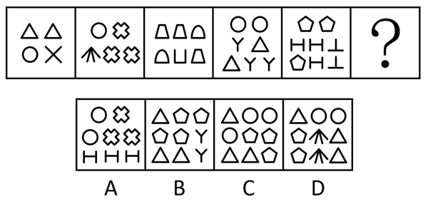

- **A**. A
- **B**. B　✅
- **C**. C
- **D**. D

**答案**：B

**官方解析**

元素组成不同，且每幅图均由小元素构成，优先考虑元素的种类和个数。观察发现，题干图形的元素个数依次为4、5、6、7、8，元素的种类数均为3，则？处图形的元素个数应为9，种类数应为3，排除A、D两项。继续观察发现，题干图形均有全开放小元素，排除C项。
故正确答案为B。

---

### 第 17 题　qid 16095253 · 图形推理

请从四个选项中选出最恰当的一项填入问号处，使题干图形呈现一定的规律性。

- **A**. A
- **B**. B　✅
- **C**. C
- **D**. D

**答案**：B

**官方解析**

元素组成基本相同，题干每幅图形都是由直线和小白圆组成，考虑功能元素的标记作用。观察发现，小白圆只标记1条线，且若把每幅图的最外面那条线当作第1条线，那么小白圆依次标记在第1条线、第2条线、第3条线、第4条线、第5条线上，故？处图形中的小白圆应只标记在第6条线上，只有B项符合。
故正确答案为B。

---

### 第 18 题　qid 16095263 · 图形推理

请从四个选项中选出最恰当的一项填入问号处，使题干图形呈现一定的规律性。

- **A**. A　✅
- **B**. B
- **C**. C
- **D**. D

**答案**：A

**官方解析**

元素组成不同，且属性规律没有答案，考虑数量规律。题干图形均由直线构成，考虑直线数，但整体数直线没有规律，继续观察发现，题干每幅图都仅有1组平行线，则？处图形也应仅有1组平行线，只有A项符合。

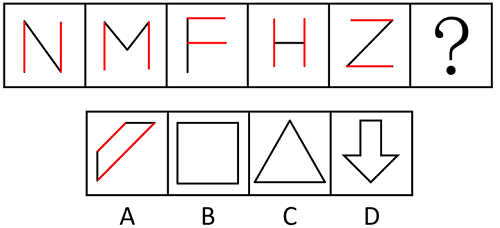

故正确答案为A。

---

### 第 19 题　qid 12304867 · 图形推理

请从四个选项中选出最恰当的一项填入问号处，使题干图形呈现一定的规律性。

- **A**. A
- **B**. B
- **C**. C
- **D**. D　✅

**答案**：D

**官方解析**

元素组成不同，优先考虑属性规律。观察发现，题干出现全直线、全曲线图形，可以考虑曲直性。九宫格优先看横行，第一行图形分别为有曲有直图形、全曲线图形、全直线图形；经验证，第二行符合此规律；第三行应用此规律，故“？”处图形应是全直线图形，排除B项；继续观察发现，题干图形出现明显封闭空间，考虑面数量，第一行图形面数量均为1，第二行图形面数量均为2，第三行前两幅图形面数量均为3，故“？”处图形面数量应为3，排除C项；对比A、D两项，A项图形部分数为2，D项图形部分数为1，题干图形部分数均为1，只有D项符合。
故正确答案为D。

---

### 第 20 题　qid 12304868 · 图形推理

请从四个选项中选出最恰当的一项填入问号处，使题干图形呈现一定的规律性。

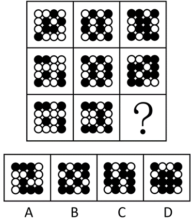

- **A**. A
- **B**. B
- **C**. C　✅
- **D**. D

**答案**：C

**官方解析**

元素组成不同，优先考虑属性规律。观察发现，题干图形中黑白球整体较为规整，优先考虑对称性。九宫格优先看横行，第一行依次为斜轴对称图形、横轴对称图形和仅中心对称图形，经验证，第二行符合此规律，第三行应用此规律，故？处应为仅中心对称图形，排除B、D两项；继续观察发现，第一行每幅图形黑球的个数分别为6、8、10，经验证，第二行符合此规律，第三行应用规律，故？处图形黑球的个数应为10，只有C项符合。
故正确答案为C。

---

### 第 21 题　qid 16095267 · 图形推理

下边四个图形中，只有一个是由上边的四个图形拼合（只能通过上、下、左、右平移）而成的，请把它找出来。

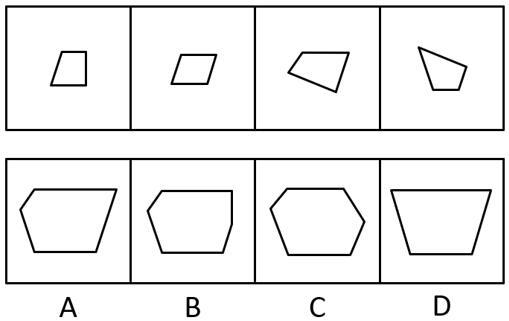

- **A**. A
- **B**. B　✅
- **C**. C
- **D**. D

**答案**：B

**官方解析**

本题考查平面拼合，可采用平行且等长相消的方式解题。消去平行且等长的线段后进行组合即可得到轮廓图，即为B项。平行且等长相消的方式如下图所示：

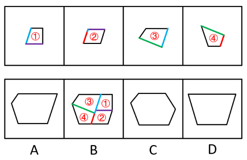

故正确答案为B。

---

### 第 22 题　qid 16095271 · 图形推理

下边四个图形中，只有一个是由上边的四个图形拼合（只能通过上、下、左、右平移）而成的，请把它找出来。

- **A**. A　✅
- **B**. B
- **C**. C
- **D**. D

**答案**：A

**官方解析**

本题考查平面拼合，可采用平行且等长相消的方式解题。消去平行且等长的线段后进行组合即可得到轮廓图，即为A项。平行且等长相消的方式如下图所示：

故正确答案为A。

---

### 第 23 题　qid 16095258 · 图形推理

选项四个图形中，只有一个是由题干的四个图形拼合（只能通过上、下、左、右平移）而成的，请把它找出来。

- **A**. A
- **B**. B　✅
- **C**. C
- **D**. D

**答案**：B

**官方解析**

本题考查平面拼合，可采用平行且等长相消的方法解题。消去平行且等长的线段后进行组合可得到轮廓图，即为B项。平行且等长相消的方式如下图所示。

故正确答案为B。

---

### 第 24 题　qid 16095266 · 图形推理

下边四个图形中，只有一个是由上边的四个图形拼合（只能通过上、下、左、右平移）而成的，请把它找出来。

- **A**. A
- **B**. B　✅
- **C**. C
- **D**. D

**答案**：B

**官方解析**

本题考查平面拼合，消去弯曲程度一致且等长的曲线后进行拼合，即可得到轮廓图，即为B项。具体拼合方式如下图所示：

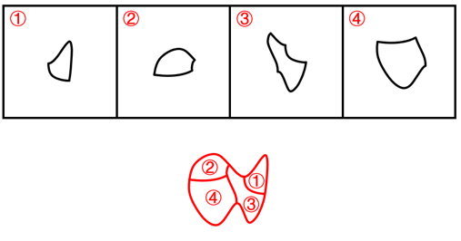

故正确答案为B。

---

### 第 25 题　qid 12304870 · 图形推理

左边图形恰好可以分割为右边的某三个图形（可以平移、旋转，但不可翻转），请找出不属于分割所得的图形。

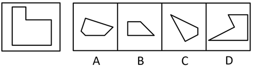

- **A**. A
- **B**. B
- **C**. C　✅
- **D**. D

**答案**：C

**官方解析**

本题考查平面拼合，可采用平行且等长相消的方式解题。A项、B项与D项消去平行且等长的线段后进行组合即可得到题干轮廓图。平行且等长相消的方式如下图所示：

本题为选非题，故正确答案为C。

---

### 第 26 题　qid 16095261 · 图形推理

左边给定的是六面体的外表面展开图，右边哪一项能由它折叠而成？

- **A**. A
- **B**. B
- **C**. C　✅
- **D**. D

**答案**：C

**官方解析**

本题考查空间重构，逐一分析选项。

A项：选项由E面、L面与V面构成，题干展开图中E面字母的开口对着F面，而选项中E面字母的开口对着L面，选项与题干展开图不一致，排除；

B项：选项由E面、F面与Y面构成，题干展开图中Y面字母的小开口对着T面，而选项中Y面字母的小开口对着E面，选项与题干展开图不一致，排除；

C项：选项由E面、Y面与L面构成，选项与题干展开图一致，当选；

D项：选项由F面、T面与V面构成，题干展开图中V面字母的开口对着T面，而选项中V面字母的尖角对着T面，选项与题干展开图不一致，排除。

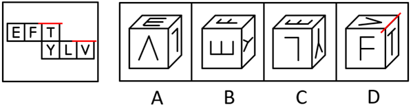

故正确答案为C。

---

### 第 27 题　qid 12304871 · 图形推理

下列是四个正方体的外表面展开图，其中哪个展开图还原成正方体后，存在有同一个公共顶点的三个面，且其上的数字之和为8？

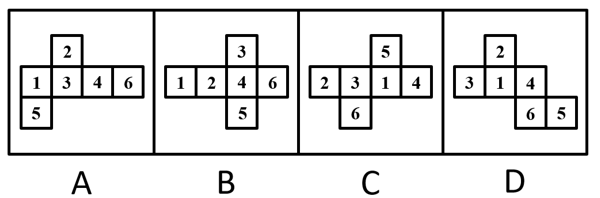

- **A**. A
- **B**. B　✅
- **C**. C
- **D**. D

**答案**：B

**官方解析**

观察发现，选项展开图的六个面中出现的数字均分别为1-6，若想在1-6中选出3个数字相加刚好是8，只有两种情况：①面1、面2和面5两两相邻；②面1、面3和面4两两相邻。逐一分析选项：

A项：面1和面4为相对面，故面1、面3和面4无法两两相邻；面2和面5为相对面，故面1、面2和面5无法两两相邻。两种情况均不符合要求，排除；

B项：面1、面2和面5两两相邻，存在同一个公共顶点（如下图所示），且其上的数字之和为8，满足要求，当选；

C项：面3和面4为相对面，故面1、面3和面4无法两两相邻；面1和面2为相对面，故面1、面2和面5无法两两相邻。两种情况均不符合要求，排除；

D项：面3和面4为相对面，故面1、面3和面4无法两两相邻；面1和面5为相对面，故面1、面2和面5无法两两相邻。两种情况均不符合要求，排除。

故正确答案为B。

---

### 第 28 题　qid 16095252 · 图形推理

将下列三棱锥的展开图还原成三棱锥后，有一个与其他三个不一样，请把它找出来。

- **A**. A
- **B**. B
- **C**. C
- **D**. D　✅

**答案**：D

**官方解析**

本题考查空间重构。在选项展开图中，以只有两个扇形的面上的空白顶点作为起始点，进行顺时针画边，如下图所示，逐一分析选项。

A项：选项中右边两个面为图案一样的面，边1不挨着其中任意一个面中的小扇形。

B项：选项中最左边和最右边两个面为图案一样的面，边1不挨着其中任意一个面中的小扇形。

C项：选项中最上边和左下边为图案一样的面，边1不挨着其中任意一个面中的小扇形。

D项：选项中最上边和右下边为图案一样的面，边1与最上边面中的小扇形有公共点。

本题为选非题，故正确答案为D。

---

### 第 29 题　qid 12304861 · 图形推理

左图是由14个黑白小正方体组成的立体图形，右面四个选项中有一项不是该立体图形的视图，请把它找出来。

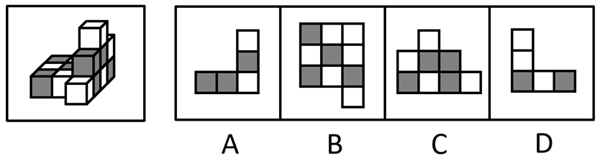

- **A**. A　✅
- **B**. B
- **C**. C
- **D**. D

**答案**：A

**官方解析**

本题考查三视图。

A项：该项不是该立体图形的视图，若为轮廓一致的主视图，应如下图所示，当选；

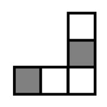

B项：从上往下可以看到，为俯视图，排除；

C项：从左往右可以看到，为左视图，排除；

D项：从后往前可以看到，为后视图，排除。

本题为选非题，故正确答案为A。

---

### 第 30 题　qid 12304865 · 逻辑判断

一只鸟除非两翼健壮并以共同的力量来推动身体，否则它不能飞向天空。根据以上陈述，可以推出以下哪些结论？
①一只鸟如果两翼健壮并以共同的力量来推动身体，那么它能够飞向天空
②一只鸟如果能够飞向天空，那么它两翼健壮并以共同的力量来推动身体
③一只鸟若两翼不健壮或不能以共同的力量来推动身体，那么它不能飞向天空
④一只鸟如果不能飞向天空，那么它两翼不健壮或不能以共同力量来推动身体

- **A**. ①②
- **B**. ②③　✅
- **C**. ③④
- **D**. ②④

**答案**：B

**官方解析**

第一步：翻译题干。

题干翻译为：飞向天空两翼健壮 且 以共同的力量来推动身体。

第二步：逐一分析选项。

①翻译为：两翼健壮 且 以共同的力量来推动身体飞向天空，是对题干逻辑关系的肯后，肯后无必然结论，无法推出；

②翻译为：飞向天空两翼健壮 且 以共同的力量来推动身体，是对题干逻辑关系的肯前，肯前必肯后，可以推出；

③翻译为：两翼健壮 或 以共同的力量来推动身体飞向天空，是对题干逻辑关系的否后，否后必否前，可以推出；

④翻译为：飞向天空两翼健壮 或 以共同的力量来推动身体，是对题干逻辑关系的否前，否前无必然结论，无法推出。

综上所述，②③可以推出，对应B项。

故正确答案为B。

---

### 第 31 题　qid 12304860 · 逻辑判断

古代战场，两军对峙。攻方统帅召集将军商讨破敌之策，甲、乙、丙三位将军意见如下：
甲：正面攻敌和烧敌粮草都要实施；
乙：或者不烧敌粮草，或者侧面奇袭；
丙：或者正面攻敌和烧敌粮草不都实施，或者实施侧面奇袭。
最终只有一位将军的意见被统帅采纳。
根据以上陈述，攻方采取的行动中不可能包含以下哪项？

- **A**. 实施烧敌粮草
- **B**. 实施侧面奇袭　✅
- **C**. 实施正面攻敌
- **D**. 不实施正面攻敌

**答案**：B

**官方解析**

第一步：分析题干条件。

（1）甲：正面攻敌 且 烧敌粮草；

（2）乙：烧敌粮草 或 侧面奇袭；

（3）丙：（正面攻敌 或 烧敌粮草） 或 侧面奇袭。

第二步：根据题干条件进行推理。

提问为“不可能”，优先采用代入法。

代入A项：甲的意见可能被采纳，乙、丙的意见可能不被采纳，有符合题干要求“只有一位将军的意见被统帅采纳”的可能，排除；

代入B项：乙和丙的意见均被采纳，不符合题干要求“只有一位将军的意见被统帅采纳”，当选；

代入C项：甲的意见可能被采纳，乙、丙的意见可能不被采纳，有符合题干要求“只有一位将军的意见被统帅采纳”的可能，排除；

代入D项：甲的意见没被采纳，丙的意见被采纳，乙的意见可能不被采纳，有符合题干要求“只有一位将军的意见被统帅采纳”的可能，排除。

本题为选非题，故正确答案为B。

---

### 第 32 题　qid 12304864 · 逻辑判断

大学通常是一个城市重要的文化中心，很多人期待大学校园能够向公众开放，让公众感受城市的文化氛围。然而，有些高校管理者认为，大学是高校师生学习研究的主要场所。如果向公众开放，很多人会涌入校园，破坏学校的教学科研秩序。
以下哪项如果为真，最能削弱上述高校管理者的观点？

- **A**. 只要加强校园精细化管理，即使打开校门也能有效避免因开放带来的问题　✅
- **B**. 有不少大学是没有围墙的，这些学校的教学科研秩序并未受到明显的影响
- **C**. 大学只有开放，与外界共享文化资源才能发挥文化引领、服务社会的功能
- **D**. 许多人进入校园不仅想感受文化氛围，更想进入图书馆阅读或到教室听课

**答案**：A

**官方解析**

第一步：找出论点和论据。
论点：大学是高校师生学习研究的主要场所。如果向公众开放，很多人会涌入校园，破坏学校的教学科研秩序。
论据：无。
本题只有论点没有论据，削弱优先考虑削弱论点。
第二步：逐一分析选项。
A项：指出加强精细化管理就能有效避免开放校园带来的问题，说明开放不会破坏教学科研秩序，削弱论点，保留；
B项：指出不少大学没有围墙，教学科研秩序也没有受到明显的影响，没有围墙说明这些学校是向公众开放的，举反例说明开放不会破坏教学科研秩序，削弱论点，保留；
C项：指出开放大学校园的好处，并未提及开放校园是否会破坏教学科研秩序，话题不一致，无法削弱，排除；
D项：指出许多人想进入校园的原因，并未提及开放校园是否会破坏教学科研秩序，话题不一致，无法削弱，排除。
对比A、B两项，A项是整体性削弱，B项是部分削弱，A项的削弱力度大于B项，A项当选。
故正确答案为A。

---

### 第 33 题　qid 12304869 · 逻辑判断

疫苗的作用原理是通过刺激免疫系统制造保护性抗体，以抵御未来的感染。传统疫苗的生产需要大规模细胞培养，但当流行性疫病爆发时，资源密集型生产方式限制了疫苗应对疫情的及时性和有效性。因此，亟需研究人员开发独立于细胞培养的疫苗生产技术，以应对可能爆发的大规模流行性疫病。
以下哪项不是上述论证成立所必需的假设？

- **A**. 开发疫苗是人类防御流行性疫病的有效手段之一
- **B**. 需要大规模细胞培养的疫苗技术都是资源密集型的
- **C**. 资源密集型生产中的不确定因素会影响疫苗研发的速度与质量
- **D**. 独立于细胞培养技术生产的疫苗不需要刺激免疫系统制造保护性抗体　✅

**答案**：D

**官方解析**

第一步：找出论点和论据。
论点：亟需研究人员开发独立于细胞培养的疫苗生产技术，以应对可能爆发的大规模流行性疫病。
论据：传统疫苗的生产需要大规模细胞培养，但当流行性疫病爆发时，资源密集型生产方式限制了疫苗应对疫情的及时性和有效性。
本题为选非题，找出论证成立必需的假设排除即可。
第二步：逐一分析选项。
A项：该项是说开发疫苗是人类防御流行性疫病的有效手段之一，如果选项不成立，那么开发疫苗包括独立于细胞培养的疫苗生产技术，是无法应对可能爆发的大规模流行性疫病的，即选项不成立论点也不成立，是论证成立必需的假设，排除；
B项：该项是说需要大规模细胞培养的疫苗技术都是资源密集型的，如果选项不成立，那么需要大规模细胞培养的传统疫苗生产方式就可能不是资源密集型的，也就不会受限，因此也就没有必要去开发独立于细胞培养的疫苗生产技术，选项不成立论点也不成立，是论证成立必需的假设，排除；
C项：该项是说资源密集型生产中的不确定因素会影响疫苗研发的速度与质量，如果选项不成立，那么传统疫苗生产方式就不会受限，因此也就没有必要去开发独立于细胞培养的疫苗生产技术，选项不成立论点也不成立，是论证成立必需的假设，排除；
D项：该项是说独立于细胞培养技术生产的疫苗不需要刺激免疫系统制造保护性抗体，其中“刺激免疫系统制造保护性抗体”是疫苗的作用原理，题干论证是通过生产工艺受限得出开发独立于细胞培养的疫苗生产技术的论点，作用原理与生产技术话题不一致，不是论证成立必需的假设，当选。
本题为选非题，故正确答案为D。

---

### 第 34 题　qid 12304873 · 逻辑判断

卖早点、修家电、配钥匙·····老百姓家门口的社区商业，是以社区居民为服务对象、服务半径为步行15分钟左右范围内的商业形态。近年来，许多城市大力推进社区商业建设，以更好地满足居民的消费需求。不过，也有专家担忧，家门口商业服务的完善，在给居民生活带来便利的同时可能也会使快递业逐步萎缩。
以下哪项如果为真，最能缓解上述专家的担忧？

- **A**. 为了方便居民，很多城市推进社区商业建设时，都将快递驿站作为社区商业的重要组成部分
- **B**. 社区商业主要提供汽车保养、幼儿托管等服务类业态，社区购物在居民整体购物消费中占比很少　✅
- **C**. 社会经济发展必然包含新旧行业的更迭，社区商业作为新的消费增长点，吸纳了大量传统行业的劳动者就业
- **D**. 许多大型商超组建了自己的配送车队，可为周边5公里范围内居民提供商品一小时送达服务

**答案**：B

**官方解析**

第一步：找出论点和论据。
论点：家门口商业服务的完善，在给居民生活带来便利的同时可能也会使快递业逐步萎缩。
论据：无。
本题提问为“缓解上述专家的担忧”即削弱上述专家的担忧，且只有论点没有论据，削弱优先考虑削弱论点，即说明家门口商业服务的完善不会使快递业逐步萎缩。
第二步：逐一分析选项。
A项：该项说的是很多城市将快递驿站作为社区商业的重要组成部分，说明家门口商业服务完善后快递驿站依然很重要，可能不会使快递业逐步萎缩，削弱论点，可以削弱，保留；
B项：该项说的是社区购物在居民整体购物消费中占比很少，说明社区商业的建设对居民原有的购物方式影响不大，也就不会使快递业逐步萎缩，削弱论点，可以削弱，保留；
C项：该项说的是社区商业吸纳了大量传统行业的劳动者就业，是在说社区商业促进了就业，并未提及对快递业的影响，为无关项，无法削弱，排除；
D项：该项说的是许多大型商超提供限时配送服务，大型商超不属于社区商业，提供的配送服务不属于快递业，为无关项，无法削弱，排除。
对比A、B两项，A项说的是快递驿站的重要性，但是快递驿站重要并不能明确说明快递业的情况，而B项明确说明了对居民原有的购物方式影响不大，即不会对快递业有影响，综合对比，B项比A项更加明确，因此优选B项。
故正确答案为B。

---

### 第 35 题　qid 17900750 · 逻辑判断

某高校准备进行青年大学生宣传活动。拟从张、王、李3位男士和赵、陈、丁3位女士中挑出3人组成宣讲小组，要求既要有男性又要有女性。已知：
（1）若选张，则也选陈；
（2）王、李之中至多选1人；
（3）赵、丁之中至少选1人。
根据上述信息，不能推出以下哪项？

- **A**. 陈、丁之中至少选1人
- **B**. 张、王之中至多选1人
- **C**. 赵、陈之中至少选1人
- **D**. 李、赵之中至多选1人　✅

**答案**：D

**官方解析**

第一步：分析题干条件。

（1）张（男）陈（女）；

（2）王（男） 或 李（男）；

（3）赵（女） 或 丁（女）；

（4）6人中选3人，既要有男性又要有女性。

第二步：根据题干条件进行推理。

提问方式为“不能推出”，优先考虑代入法。

选项不是确定信息，且涉及“至少”“至多”，可以考虑反向代入，即否定选项后代入题干条件，若与题干矛盾，则说明该项成立，若满足题干条件，则说明该项不成立。

A项：假设A项不成立，即（陈 或 丁），等价于陈 且 丁，根据条件（4）可以推出赵入选；根据条件（1）可知“陈张”，可以推出张不入选，此时为满足条件（4）6人中选3人，王、李均入选，但与条件（2）矛盾，假设不成立，故该项为真，排除。

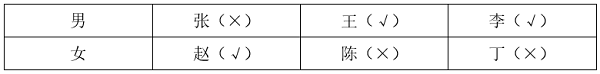

B项：假设B项不成立，即张 且 王，根据条件（1）可知“张陈”，此时已满足条件（4）6人中选3人，则其余李、赵、丁均未入选，与条件（3）矛盾，假设不成立，故该项为真，排除。

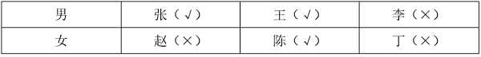

C项：假设C项不成立，即（赵 或 陈），等价于赵 且 陈，根据条件（4）可以推出丁入选；根据条件（1）可知“陈张”，可以推出张不入选，此时为满足条件（4）6人中选3人，王、李均入选，与条件（2）矛盾，假设不成立，故该项为真，排除。

D项：假设D项不成立，即李 且 赵，根据条件（2）可以推出王不入选，根据条件（1）可知，若张入选，则陈也入选，此时入选4人，不满足条件（4），故张不入选，陈、丁中任意一位入选均满足题干条件，即假设成立，故该项为假，当选。

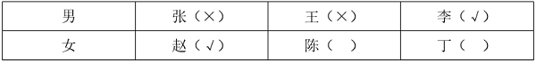

本题为选非题，故正确答案为D。

---

### 第 36 题　qid 12304874 · 逻辑判断

一项研究发现，成年小白鼠去除一个关键生物钟基因后，昼夜节律完全消失，虽然生活质量有所下降，但寿命并未受到显著影响，心血管健康状况甚至有所改善。据此，研究人员推断昼夜节律缺失对健康的危害可能没有我们想象得那么大。
回答以下哪个问题最有助于评价上述研究人员所做出的推断？

- **A**. 成年小白鼠去除生物钟基因后出现的心血管情况改善是否会延长小白鼠的寿命
- **B**. 成年小白鼠去除生物钟基因之后的休息时间是否与未去除之前的休息时间相同
- **C**. 成年小白鼠去除生物钟基因后的寿命和心血管健康状况能否代表整体健康状况　✅
- **D**. 成年小白鼠去除生物钟基因之后的生活质量是否会影响小白鼠的整体健康状况

**答案**：C

**官方解析**

第一步：找出论点和论据。
论点：昼夜节律缺失对健康的危害可能没有我们想象得那么大。
论据：成年小白鼠去除一个关键生物钟基因后，昼夜节律完全消失，虽然生活质量有所下降，但寿命并未受到显著影响，心血管健康状况甚至有所改善。
本题论点讨论的是“昼夜节律缺失”和“整体健康状况”之间的关系，论据讨论的是“昼夜节律缺失”和“寿命、心血管健康状况”之间的关系，二者话题不一致，且提问方式为“最有助于”评价研究人员的推断，可以考虑搭桥，即建立“寿命、心血管健康状况”与“整体健康状况”之间的关系。
第二步：逐一分析选项。
A项：该项讨论的是“心血管健康状况”与“寿命”之间的关系，而不是“寿命、心血管健康状况”与“整体健康状况”之间的关系，即使心血管状况改善能够延长寿命，仍无法得知整体健康状况如何，无助于评价研究人员的推断，排除；
B项：该项讨论的是“去除生物钟基因前后的休息时间”，论点说的是“昼夜节律缺失”和“整体健康状况”的关系，话题不一致，无助于评价研究人员的推断，排除；
C项：该项讨论的是“寿命、心血管健康状况”与“整体健康状况”之间的关系，如果寿命和心血管健康状况能代表整体健康状况，则说明研究人员的推断成立，有助于评价研究人员的推断，当选；
D项：该项讨论的是“生活质量”与“整体健康状况”之间的关系，但研究人员是通过“寿命”与“心血管健康状况”得出的论点，不如C项更有助于评价研究人员的推断，排除。
故正确答案为C。

---

### 第 37 题　qid 12304862 · 逻辑判断

宋朝以前，中国人的烹饪方式主要是蒸、煮、烤。到了宋朝，炒菜开始大行其道。宋朝为什么流行炒菜？学界有三种解释：“铁锅论”者认为，铁锅始现于宋朝，有了铁锅才能炒菜；“劈柴论”者认为，蒸煮比煎炒耗费更多的劈柴，宋朝劈柴较稀缺，老百姓只好改蒸煮为煎炒；“植物油论”者认为，宋朝植物油供应充足，用植物油炒菜才流行起来。
以下哪项如果为真，最能支持“植物油论”者的观点？

- **A**. 早在战国时期，既能煮菜又能炒菜的铁锅就已经出现，传至宋朝并不奇怪
- **B**. 烧烤比蒸煮更耗费燃料，但宋朝人除了偏好炒菜之外也非常热衷于烧烤
- **C**. 南北朝时期著名典籍《齐民要术》中已载有胡麻油等植物油的榨取方法
- **D**. 宋朝的榨油工艺已经成熟，原材料种植面积大幅增加，植物油价格下降　✅

**答案**：D

**官方解析**

第一步：找出论点和论据。
论点：宋朝植物油供应充足，用植物油炒菜才流行起来。
论据：无。
本题只有论点没有论据，加强优先考虑补充论据，即解释原因或举例子。
第二步：逐一分析选项。
A项：该项讨论的是铁锅早在战国时期就已经出现，传至宋朝并不奇怪，而论点讨论的是宋朝植物油供应充足，用植物油炒菜才流行起来，话题不一致，无法加强，排除；
B项：该项讨论的是烧烤比蒸煮更费燃料，且宋朝人也热衷于烧烤，而论点讨论的是宋朝植物油供应充足，用植物油炒菜才流行起来，话题不一致，无法加强，排除；
C项：该项讨论的是南北朝时期就已记载植物油的榨取方法，出现不代表普及，也不代表供应充足，无法判断宋朝植物油的情况，为不明确项，无法加强，排除；
D项：该项讨论的是宋朝榨油工艺已成熟，且原材料种植面积增加，植物油价格下降，解释了为什么宋朝植物油供应充足，补充论据，可以加强，当选。
故正确答案为D。

---

### 第 38 题　qid 12304863 · 逻辑判断

某车间共有18人，他们分别来自山东、江苏、浙江、安徽和福建5省。在18人中，每省至少有1人，且来自各省的人数均不相同。已知：
来自山东和江苏的共有5人；
来自江苏和浙江的共有6人；
来自浙江和福建的共有7人；
根据上述信息，可以推出以下哪项？

- **A**. 18人中来自山东的有1人
- **B**. 18人中来自浙江的有2人
- **C**. 18人中来自福建的有5人
- **D**. 18人中来自安徽的有6人　✅

**答案**：D

**官方解析**

第一步：分析题干条件。
（1）山东+江苏=5；
（2）江苏+浙江=6；
（3）浙江+福建=7；
（4）山东+江苏+浙江+安徽+福建=18；
（5）在18人中，每省至少有1人，且来自各省的人数均不相同。
第二步：根据题干条件进行推理。
将条件（1）和（3）相加可得条件（6）：山东+江苏+浙江+福建=12。
再用条件（4）与条件（6）相减可得：安徽=6，对应D项。
故正确答案为D。

---

### 第 39 题　qid 16095269 · 逻辑判断

评价某份试卷中的试题质量通常有难度和区分度等指标，一道单选题的难度通常用正确选择试题答案的人数与参加测验的总人数的比值来表示。区分度指的是试题对考生实际水平的区分程度和区分的有效性，一道单选题的区分度指数D的计算公式为：，其中为高分组（试卷总得分排在前27%的考生）该题的难度，为低分组（试卷总得分排在后27%的考生）该题的难度。

根据以上陈述，可以推出以下哪项？

- **A**. 一道难度为1的单选题区分度指数为0.1
- **B**. 任一单选题的区分度指数不可能为负值
- **C**. 一道难度为0.27的单选题的最大区分度指数为0.5
- **D**. 一道单选题的难度也可以表示为该题的平均得分与该题分值的比值　✅

**答案**：D

**官方解析**

日常结论题，根据题干信息逐一分析选项。

A项：若一道单选题的难度为1，意味着参加测验的所有人都答对了，则高分组和低分组的人都答对了，说明高分组该题的难度，低分组该题的难度，则区分度指数D=0，而不是0.1，该项表述错误，排除；

B项：若有一道题高分组答对的人数少于低分组，此时高分组该题的难度小于低分组该题的难度，即，则这道题的区分度指数D为负数，该项表述错误，排除；

C项：若一道单选题的难度为0.27，说明正确选择试题答案的人数与参加测验的总人数的比值为0.27，假设参加测验的总人数为100人，则正确选择试题答案的人数为27人，并且此时高分组与低分组均各有27人，如果想要计算最大区分度指数，则需要使的值尽可能大，即尽可能取最大值，同时尽可能取最小值，即需要使正确选择试题答案的27人均属于高分组，即，同时，低分组全部答错，即，则此时这道题的最大区分度指数，而不是0.5，该项表述错误，排除；

D项：，该项表述正确，当选。

故正确答案为D。

---

### 第 40 题　qid 16095272 · 类比推理

甲：小明十岁就能用英语与英国人流利对话，语言天赋真是出类拔萃。
乙：小明跟着父母在英国住了两年，能流利对话不足为奇。
以下哪项与题干对话方式最为相似？

- **A**. 
甲：这款热水器的价格比市面上常见的热水器高出一倍，太不划算了

乙：这款产品用的是航天级别的材料，在同材质热水器中性价比很高
　✅
- **B**. 
甲：小李以前容易冲动，进入职场一年后稳重多了

乙：小李承担了单位大量重要工作，变得稳重一点理所当然

- **C**. 
甲：小张的数学一直很好，进入高中后，物理、化学等科目的学习很轻松

乙：数学强调科学思维，掌握科学思维的人学习物理、化学当然没有难度

- **D**. 
甲：小刘在过去的一年中连续犯下三起盗窃案，真是无可救药

乙：人非圣贤，孰能无过，相信在经过改造之后他会洗心革面

**答案**：A

**官方解析**

第一步：分析题干逻辑关系。
甲根据“小明十岁就能用英语与英国人流利对话”的现象，得出“小明的语言天赋出类拔萃”的结论，而乙提出“小明跟着父母在英国住了两年”的理由来解释现象，用“能流利对话不足为奇”来否定甲的结论。
第二步：逐一分析选项。
A项：甲根据“这款热水器的价格比市面上常见的热水器高出一倍”的现象，得出“这款热水器不划算”的结论，乙提出“这款产品用的是航天级别的材料”的理由来解释现象，用“在同材质热水器中性价比很高”来否定甲的结论，与题干对话方式一致，当选；
B项：甲提出“小李以前容易冲动，进入职场一年后稳重多了”的结论，乙提出“小李承担了单位大量重要工作，变得稳重一点理所当然”的理由来解释甲的结论，与题干对话方式不一致，排除；
C项：甲提出“小张的数学一直很好，进入高中后，物理、化学等科目的学习很轻松”的结论，乙提出“数学强调科学思维，掌握科学思维的人学习物理、化学当然没有难度”的理由来解释甲的结论，与题干对话方式不一致，排除；
D项：甲根据“小刘在过去的一年中连续犯下三起盗窃案”的现象，得出“小刘无可救药”的结论，乙得出的观点“相信在经过改造之后小刘会洗心革面”是一种预测，而非事实，用预测否定甲的结论，与题干对话方式不一致，排除。
故正确答案为A。

---

### 第 41 题　qid 16095255 · 定义判断

温情执法：指执法人员在依法查处违法行为的过程中，综合考量各种特殊因素，对违法者进行灵活处置以体现法治温度的执法行为。
下列不属于温情执法的是：

- **A**. 冬天，许多菜农在路边叫卖，给城市交通卫生带来了挑战。区城管部门调研后划出28个覆盖全区的固定销售点，与菜农签订“摊前三包”协议，菜农卖得更安心了，城市面貌大有改观　✅
- **B**. 民警发现电信诈骗嫌疑人王某潜回家中后迅速抓捕。当时，王某刚把4岁女儿从幼儿园接回家。民警为避免小女孩受惊，迅速收起警察证和手铐。以吃饭为名把王某带了出去
- **C**. 交警小周在公路上进行安全巡逻时，发现一辆电动三轮车严重超员。处罚过程中得知因为老人突然生病，全家人带他到县城治疗，小周用警车把他们送到医院
- **D**. 某县卫生健康执法人员在查处无证行医过程中，发现郑某正在出租屋行医。得知小诊所是他家最主要的经济来源，郑某已考取职业资格证书，县卫生部门协助他办理了医生执业证书和执业许可证

**答案**：A

**官方解析**

第一步：找出定义关键词。
“执法人员”、“在依法查处违法行为的过程中”、“对违法者进行灵活处置以体现法治温度”。
第二步：逐一分析选项。
A项：区城管部门所做的工作是“调研后划出28个覆盖全区的固定销售点，与菜农签订‘摊前三包’协议”，并非查处违法行为，不符合“在依法查处违法行为的过程中”，不符合定义，当选；
B项：民警抓捕诈骗嫌疑人王某，符合“执法人员”、“在依法查处违法行为的过程中”，为避免小女孩受惊，民警迅速收起警察证和手铐，以吃饭为名把王某带了出去，符合“对违法者进行灵活处置以体现法治温度”，符合定义，排除；
C项：交警小周在巡逻时处罚电动三轮车严重超员行为，符合“执法人员”、“在依法查处违法行为的过程中”，小周得知超员的原因是老人突然生病，便用警车把他们送到医院，符合“对违法者进行灵活处置以体现法治温度”，符合定义，排除；
D项：卫生健康执法人员在查处无证行医过程中，符合“执法人员”、“在依法查处违法行为的过程中”，得知郑某的难处，县卫生部门协助他办理了医生执业证书和执业许可证，符合“对违法者进行灵活处置以体现法治温度”，符合定义，排除。
本题为选非题，故正确答案为A。

---

### 第 42 题　qid 16095264 · 定义判断

选择支持效应：指人们做出某一选择后，就会找出多种理由来证明它的正确性，并排斥其他可能选择的现象。
下列属于选择支持效应的是：

- **A**. 孔女士周末喜欢开车带小孩到周边景点亲子游，每次总会带上同事朱女士的女儿。她认为两人是朋友，这样的活动既可以开阔孩子视野，又可以密切两家关系。朱女士偶尔也会一同去
- **B**. 钱先生的餐馆开业后，顾客首次进店消费享受8折优惠，第二次以后7折优惠。家人都担心会亏本，他却坚信只要有了回头客，生意一定会越来越好
- **C**. 曹女士常常到小商店买日用品，觉得既省钱又省心。儿子发现她刚买的运动鞋几天就穿坏了，劝她到商场买品牌运动鞋，她不以为然，认为这鞋便宜，穿着又很舒服，自己身体硬朗，不会出什么事儿　✅
- **D**. 某野生动物园为了保护自然生态及游客安全，分片区建了许多防护围栏，有网友抱怨：“参观这个动物园要走不少冤枉路”。景区很快就规划出最佳游览线路图并在园内各处作了醒目“标记”

**答案**：C

**官方解析**

第一步：找出定义关键词。
“人们做出某一选择后”、“会找出多种理由来证明它的正确性”、“排斥其他可能选择”。
第二步：逐一分析选项。
A项：孔女士周末喜欢开车带小孩到周边景点亲子游，每次总会带上同事朱女士的女儿，符合“人们做出某一选择后”，孔女士认为两人是朋友，这样的活动既可以开阔孩子视野，又可以密切两家关系，符合“会找出多种理由来证明它的正确性”，但并没有体现“排斥其他可能选择”，不符合定义，排除；
B项：钱先生的餐馆开业后，采取了一些优惠措施，符合“人们做出某一选择后”，钱先生坚信只要有了回头客，生意就会越来越好，只体现了“有回头客”这一种理由，不符合“会找出多种理由来证明它的正确性”，不符合定义，排除；
C项：曹女士常常到小商店买日用品，符合“人们做出某一选择后”，她认为小商店买的运动鞋便宜，穿着又很舒服，自己身体硬朗，不会出什么事儿，符合“会找出多种理由来证明它的正确性”，儿子劝曹女士到商场买品牌运动鞋，她不以为然，符合“排斥其他可能选择”，符合定义，当选；
D项：某野生动物园分片区建了许多防护围栏，符合“人们做出某一选择后”，有网友抱怨动物园的缺点，景区很快就做出改进，不符合“排斥其他可能选择”，不符合定义，排除。
故正确答案为C。

---

### 第 43 题　qid 16095268 · 定义判断

迭代学习：指学习者通过不间断的目标训练，更好地理解学习内容，不断提升技能完善自身能力的学习方式。
下列不属于迭代学习的是：

- **A**. 小周参加专业技能大赛，实操环节丢了不少分，他不断强化训练，再次参加就获得了二等奖。又经过一年训练，综合技能有了显著提高，自己也十分自信
- **B**. 学习者要熟练掌握数学运算需经历数年大致相同的过程，先是加减法，之后是乘除法，接下来是混合运算，逐渐进入更高阶的运算
- **C**. 李教授经常深入社区举办科普讲座，最初因为专业性过强，听众很少，后来引入了市民关注的鲜活案例，听众越来越多；最近又融入了不少优秀传统文化元素，感染力越来越强
- **D**. 多家公司推出了各自的AI自然语言处理模型，有的只能与人进行简单对话，有的能在收到指令后几秒钟内交出一份质量不错的作业，有些已经能够针对各种问题给出比较专业的建议　✅

**答案**：D

**官方解析**

第一步：找出定义关键词。
“学习者”、“通过不间断的目标训练”、“更好地理解学习内容，不断提升技能完善自身能力”。
第二步：逐一分析选项。
A项：小周通过不断强化训练，从一开始参加专业技能大赛的实操环节丢不少分，到再次参加获得二等奖，到最后综合技能显著提高，符合“学习者”、“通过不间断的目标训练”、“更好地理解学习内容，不断提升技能完善自身能力”，符合定义，排除；
B项：学习者通过不断的学习，掌握的数学运算从一开始的加减法、乘除法到混合运算，到最后进入更高阶的运算，符合“学习者”、“通过不间断的目标训练”、“更好地理解学习内容，不断提升技能完善自身能力”，符合定义，排除；
C项：李教授的科普讲座从一开始的专业性强、听众少到引入市民关注的案例后听众越来越多，到最后融入文化元素、感染力越来越强，符合“学习者”、“通过不间断的目标训练”、“更好地理解学习内容，不断提升技能完善自身能力”，符合定义，排除；
D项：多家公司推出各自的AI自然语言处理模型，有的只能简单与人对话，有的能写作业，有的已能给出比较专业的建议，这些是不同AI对于自然语言处理的不同结果，并没有体现AI不间断学习的过程，不符合“学习者”、“通过不间断的目标训练”、“更好地理解学习内容，不断提升技能完善自身能力”，不符合定义，当选。
本题为选非题，故正确答案为D。

---

### 第 44 题　qid 16095273 · 定义判断

消费者教育：指通过有计划的宣传或培训，引导民众更新消费观念，掌握消费技能，培养消费习惯，使其形成产品购买的合理预期。
下列属于消费者教育的是：

- **A**. 丁先生根据亲身经历写出了一份新疆自驾游的攻略，包括具体线路、沿途景点门票、酒店、美食等，还推荐了几个口碑很好的当地导游，发布到了多家网站上，大批网友经过验证后给予了好评
- **B**. 某网站的帖子图文并茂地分析了各种榨汁机、豆浆机、养生壶、料理机的优缺点，推荐了一款黑科技“破壁机”，详细介绍了它的材质、功能、操作方法以及明星的使用体验，最后还附上了商家的二维码　✅
- **C**. 某购物网站邀请网络写手连载长篇小说，让员工发动亲朋好友评论转发，大批粉丝追更到凌晨，网站贴心地附上了缓解眼睛疲劳的新产品供大家免费试用，两三个月后，访问量和营业额都有了显著提高
- **D**. 某知名品牌菜刀拍蒜后刀身断裂的视频在多个社交网站引发网友吐槽，厂家回应称视频中的菜刀属于高科技新品，硬度高，材质脆，受横向冲击时容易断裂，不适合拍蒜

**答案**：B

**官方解析**

第一步：找出定义关键词。
“有计划的宣传或培训”、“引导民众更新消费观念，掌握消费技能，培养消费习惯”、“形成产品购买的合理预期”。
第二步：逐一分析选项。
A项：丁先生写出新疆自驾游攻略，目的是为了方便大家更便捷的出游，并非为了引导民众更新消费观念，不符合“引导民众更新消费观念，掌握消费技能，培养消费习惯”，不符合定义，排除；
B项：某网站分析了一些小家电的优缺点，让消费者了解相关产品的不同性能，符合“有计划的宣传或培训”，其中推荐了一款“破壁机”，并附上商家的二维码，目的是为了让消费者选择购买，符合“引导民众更新消费观念，掌握消费技能，培养消费习惯”、“形成产品购买的合理预期”，符合定义，当选；
C项：某购物网站邀请网络写手连载长篇小说，并为熬夜追更的粉丝免费提供缓解眼睛疲劳的新产品，目的是为了提高网站的访问量和营业额，并非为了引导民众更新消费观念，不符合“引导民众更新消费观念，掌握消费技能，培养消费习惯”，不符合定义，排除；
D项：厂家对菜刀质量问题的回应，目的是为了解释菜刀因拍蒜而刀身断裂的原因，并非为了引导民众更新消费观念，不符合“引导民众更新消费观念，掌握消费技能，培养消费习惯”，不符合定义，排除。
故正确答案为B。

---

### 第 45 题　qid 16095274 · 定义判断

风险交流：指管理者面对公共事务中某种可能出现的风险，与社会公众提前公开透明的双向交流，以赢得民众信任的管理措施。
下列属于风险交流的是：

- **A**. 区市场监督管理部门针对外卖、网购食品抽检过程中发现的质量问题，通过微信公众号连续曝光相关企业并公布相应的处罚措施，每个帖子都得到群众的点赞
- **B**. 某市计划建设一个大型铝铜冶炼项目，参加听证会的当地居民纷纷反对，相关方面话题在网络媒体上也不断发酵。有关部门决定继续进行科学评估并公布相关数据，在得到公众理解和支持前暂缓开工　✅
- **C**. 台风到来之前某市气象、水利、自然资源、交通运输等部门会及时发布灾害气象橙色预警，通过广播电视、媒体网站、手机短信等渠道提醒居民防范风险，并迅速发放了大批防灾救灾物资
- **D**. 某小区物业最近专门发了通知，小区广场上的热身器材存在安全隐患，即将进行更换，提醒居民近期不要使用。有喜欢锻炼的业主说，总算盼到了这个消息了，已经好多天不敢去了

**答案**：B

**官方解析**

第一步：找出定义关键词。
“管理者”、“面对公共事务中某种可能出现的风险”、“与社会公众提前公开透明的双向交流”、“以赢得民众信任”。
第二步：逐一分析选项。
A项：区市场监督管理部门在抽检过程中发现质量问题，并通过微信公众号进行曝光，说明质量问题的风险已经发生，不符合“面对公共事务中某种可能出现的风险”，不符合定义，排除；
B项：某市计划建设铝铜冶炼项目，举办听证会与当地居民进行沟通，符合“管理者”、“面对公共事务中某种可能出现的风险”、“与社会公众提前公开透明的双向交流”，与会居民纷纷反对，故有关部门决定在得到公众理解和支持前暂缓开工，说明举办听证会是为了得到居民的支持，符合“以赢得民众信任”，符合定义，当选；
C项：相关部门在台风到来之前发布预警，提醒居民防范风险，同时发放防灾救灾物资，只说明了相关部门为了预防风险发生而采取的行为，并未体现居民与相关部门之间的信息交流，不符合“与社会公众提前公开透明的双向交流”，不符合定义，排除；
D项：某小区物业发布通知提醒居民，热身器材存在安全隐患近期不要使用，只说明了小区物业为了预防风险发生而采取的行为，并未体现小区居民与物业之间的信息交流，不符合“与社会公众提前公开透明的双向交流”，不符合定义，排除。
故正确答案为B。

---

### 第 46 题　qid 16095275 · 定义判断

文字讨好症：指网络对话过程中，通过调整用词、添加语气词或特定符号避免聊天时带来的冷漠与疏离，让对话变得更加轻松、愉悦、舒适。
下列属于文字讨好症的是：

- **A**. 
小胡正忙得不可开交，突然收到同事微信，请他帮忙校对文档有没有错误，小胡回复“”，同事回复道：“好，有问题随时沟通。”

- **B**. 
小刘刚把年终考核表发给人事秘书就收到回复：“格式不对，请重新修改！”小刘立即回复：“嗯嗯，好的好的，你们太能折腾了。”

- **C**. 
遇到同事吐槽领导，老赵虽然不太认同，但总是习惯性地附和；听到朋友的旅游经历，不管喜不喜欢，都会竖起大拇指：“哇哇哇！太棒了！”

- **D**. 
小秦下班到家累瘫在沙发上，突然收到客户投诉信息，立刻坐起来逐字逐句推敲回复用语，“好哒”“好滴”“”不断在屏幕上跳动
　✅

**答案**：D

**官方解析**

第一步：找出定义关键词。
“网络对话过程中”、“调整用词、添加语气词或特定符号”、“避免聊天时带来的冷漠与疏离，让对话变得更加轻松、愉悦、舒适”。
第二步：逐一分析选项。
A项：小胡正忙时接到同事请求帮助的信息，回复“OK”的表情，是用简洁的回复以节约时间，同事回复“随时沟通”，属于正常的工作交流，不符合“调整用词、添加语气词或特定符号”、“避免聊天时带来的冷漠与疏离，让对话变得更加轻松、愉悦、舒适”，不符合定义，排除；
B项：小刘收到需要修改文件格式的信息后回复“嗯嗯，好的好的，你们太能折腾了”，属于不耐烦的语气，不符合“避免聊天时带来的冷漠与疏离，让对话变得更加轻松、愉悦、舒适”，不符合定义，排除；
C项：听到朋友的旅游经历，老赵都会竖起大拇指进行附和，说明两人的对话方式为面对面，不符合“网络对话过程中”，不符合定义，排除；
D项：小秦下班后收到客户的投诉信息并回复，符合“网络对话过程中”，推敲回复用语，并发送“好哒”“好滴”的词语以及“抱拳”的表情，符合“调整用词、添加语气词或特定符号”、“避免聊天时带来的冷漠与疏离，让对话变得更加轻松、愉悦、舒适”，符合定义，当选。
故正确答案为D。

---

### 第 47 题　qid 16095292 · 定义判断

鸡蛋理论：源自一家食品公司配方齐全的蛋糕粉滞销，后来故意去掉其中的蛋黄，让顾客烘培时自行添加，蛋糕粉反而变得畅销的案例。现指对于一个物品付出的劳动或情感越多就越容易高估其价值的认知规律；也指在不增加难度的前提下，让消费者适当参与部分生产环节打造个性化产品以增加成就感，进而提高销售效果的商业经营策略。
下列不属于鸡蛋理论的是：

- **A**. 张女士周日买了鸡腿和调料包，带着五岁的儿子一起动手涂抹调料、添加葱姜、搅拌均匀，放进空气炸锅烤上几分钟，就成了香喷喷的DIY鸡腿，孩子竟一连吃了五六个
- **B**. 小梅选购毕业礼物时发现一家销售定制手环的网店，商家介绍说可以免费在手环上刻印自己姓名，她一下子买了二十多个，收到礼物的同学都很开心
- **C**. 赵先生画出设计图草稿后，总会发到部门工作群，并附上一些考虑不太成熟的小问题请大家参与评论。因为每次都会有不少人踊跃参与，最终的设计方案在公司很容易通过　✅
- **D**. 很多草莓种植户在销售期，都会开放“自采自买”模式，自己采摘的草莓自己买下。价格不一定比超市或者菜场便宜，但是顾客有满满的收获感和满足感，吃起来更香了

**答案**：C

**官方解析**

第一步：找出定义关键词。
“一个物品付出的劳动或情感越多就越容易高估其价值”、“让消费者适当参与部分生产环节打造个性化产品”、“增加成就感，提高销售效果”。
第二步：逐一分析选项。
A项：张女士带着儿子一起制作鸡腿，儿子在制作鸡腿的过程中付出了劳动且最终一连吃了五六个，符合“一个物品付出的劳动或情感越多就越容易高估其价值”，符合定义，排除；
B项：商家介绍可以在手环上刻印姓名，小梅便在网店为同学们定制了二十多个带自己姓名的手环，符合“让消费者适当参与部分生产环节打造个性化产品”、“增加成就感，提高销售效果”，符合定义，排除；
C项：赵先生将设计图草稿中的问题发到部门工作群和其他同事一起讨论，最终的设计方案很容易通过，说明部门的内部讨论可以有效完善设计方案，但没有高估设计方案的价值，不符合“一个物品付出的劳动或情感越多就越容易高估其价值”，且设计方案的内部讨论不涉及消费者，也不符合“让消费者适当参与部分生产环节打造个性化产品”、“增加成就感，提高销售效果”，不符合定义，当选；
D项：草莓种植户在销售期开放“自采自买”模式，顾客可以将自己采摘的草莓买下，符合“让消费者适当参与部分生产环节打造个性化产品”、“增加成就感，提高销售效果”，符合定义，排除。
本题为选非题，故正确答案为C。

---

### 第 48 题　qid 16095295 · 定义判断

疗愈经济：指帮助人们释放学习、工作和生活压力，以舒缓焦虑情绪，保持心理健康的商业经营活动。
下列属于疗愈经济的是：

- **A**. 整天忙忙碌碌、疲惫不堪的小兰，昨天跟着同事到了一家健身房，两三个小时下来汗流浃背，感觉更累了，但是焦虑情绪却得到了舒缓　✅
- **B**. 赵先生提交的设计方案被否决后，约了几个同事到郊区野炊，晚上还举办了篝火晚会，大伙儿的郁闷心情消失得无影无踪
- **C**. 李先生父子周末在农家乐玩了一天，回家后妻子看到他们满身泥巴，一直叨叨叨叨，李先生听后心烦意乱，一头钻进了书房
- **D**. 在农村长大的冯先生住进一家民宿后，看到墙上挂着多幅八十年代的黑白老照片，一下子就仿佛回到自己的童年，心情舒畅

**答案**：A

**官方解析**

第一步：找出定义关键词。
“帮助人们释放学习、工作和生活压力”、“舒缓焦虑情绪，保持心理健康”、“商业经营活动”。
第二步：逐一分析选项。
A项：小兰整天忙碌、疲惫不堪，去健身房健身之后焦虑情绪得到缓解，符合“帮助人们释放学习、工作和生活压力”、“舒缓焦虑情绪，保持心理健康”、“商业经营活动”，符合定义，当选；
B项：赵先生和几个同事到郊区野炊、举办篝火晚会，不属于商业经营活动，不符合“商业经营活动”，不符合定义，排除；
C项：李先生父子在前往农家乐之前是否存在学习、工作和生活压力及焦虑情绪不明确，不符合“帮助人们释放学习、工作和生活压力”、“舒缓焦虑情绪，保持心理健康”，不符合定义，排除；
D项：冯先生在住进民宿之前是否存在学习、工作和生活压力及焦虑情绪不明确，不符合“帮助人们释放学习、工作和生活压力”、“舒缓焦虑情绪，保持心理健康”，不符合定义，排除。
故正确答案为A。

---

### 第 49 题　qid 16095303 · 定义判断

温暖现实主义：指一种特定的艺术创作手法。其特征是以真实生活为背景，从现实困境中努力挖掘真善美因素，重在展示迎难而上、奋起拼搏等精神，激励人们追求光明与未来。
下列属于温暖现实主义的是：

- **A**. 某电影讲述了一个缉毒警察侦破贩毒案件的故事。其中的一些场景让观众有点喘不过气，同时也感受到了缉毒警察的艰辛和英勇
- **B**. 某长篇小说讲述了地球很快将被太阳吞没，人类克服重重困难，在地球表面建成了多台超级发动机，最终推动地球去外太空寻找美好家园的故事
- **C**. 某话剧演绎了两个大学生毕业后来到陌生城市打拼，合租在不足10平米的小阁楼中，创业成功后回到家乡，利用学到的本领带领乡亲们共同致富的故事　✅
- **D**. 某电视剧以小学教育为题材，揭示当今部分城市家庭遭遇的教育问题，展现了孩子上学的艰辛和家长的无奈，播出后引发许多年轻父母的共鸣

**答案**：C

**官方解析**

第一步：找出定义关键词。
“以真实生活为背景”、“从现实困境中努力挖掘真善美因素”、“激励人们追求光明与未来”。
第二步：逐一分析选项。
A项：电影中讲述的故事让观众感受到了缉毒警察的艰辛和英勇，但电影只讲述了缉毒警察侦破贩毒案件，不符合“从现实困境中努力挖掘真善美因素”、“激励人们追求光明与未来”，不符合定义，排除；
B项：长篇小说中讲述的地球很快将被太阳吞没，人类去外太空寻找美好家园的故事并非真实事件，不符合“以真实生活为背景”，不符合定义，排除；
C项：话剧中演绎的大学生毕业后到陌生城市打拼，符合“以真实生活为背景”，合租在小阁楼中进行创业，并在成功后带领乡亲们共同致富，符合“从现实困境中努力挖掘真善美因素”、“激励人们追求光明与未来”，符合定义，当选；
D项：电视剧中揭示了部分家庭遭遇的教育问题，展现了孩子上学的艰辛和家长的无奈，不符合“从现实困境中努力挖掘真善美因素”、“激励人们追求光明与未来”，不符合定义，排除。
故正确答案为C。

---

### 第 50 题　qid 16095297 · 定义判断

灯谜是独具特色的中华优秀传统文化，可以根据谜面和谜底的关系分为多种类型。其中，摘顶格指去掉谜底的共同部首就扣合谜面；秋千格指从后往前读谜底就扣合谜面；白头格指谜底的第一个字作谐音读就扣合谜面。
根据上述定义，对下列三个灯谜的类型判断正确的是：
（1）谜面：黄昏（打一地名）。谜底：洛阳
（2）谜面：郎貌（打一花名）。谜底：芙蓉
（3）谜面：思量（打一文具）。谜底：算盘

- **A**. （1）秋千格，（2）白头格，（3）摘顶格
- **B**. （1）白头格，（2）摘顶格，（3）秋千格　✅
- **C**. （1）白头格，（2）秋千格，（3）摘顶格
- **D**. （1）秋千格，（2）摘顶格，（3）白头格

**答案**：B

**官方解析**

第一步：找出定义关键词。
摘顶格：“去掉谜底的共同部首就扣合谜面”；
秋千格：“从后往前读谜底就扣合谜面”；
白头格：“谜底的第一个字作谐音读就扣合谜面”。
第二步：逐一分析选项。
（1）“洛”谐音“落”，太阳落下就是黄昏，符合“谜底的第一个字作谐音读就扣合谜面”，属于白头格。
（2）“芙蓉”去掉共同部首“艹”即为夫容，也就是郎貌，符合“去掉谜底的共同部首就扣合谜面”，属于摘顶格。
（3）“算盘”从后往前读即为“盘算”，“盘算”有思量的意思，符合“从后往前读谜底就扣合谜面”，属于秋千格。
综上，（1）为白头格，（2）为摘顶格，（3）为秋千格。
故正确答案为B。

---
