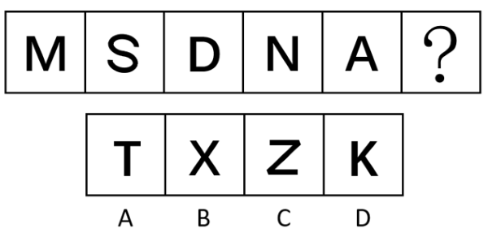
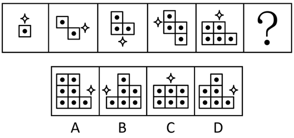
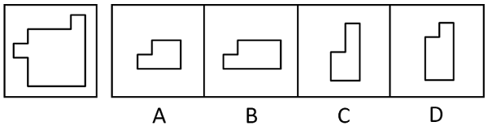
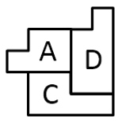
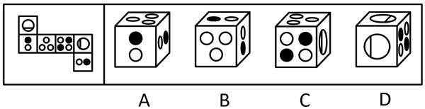
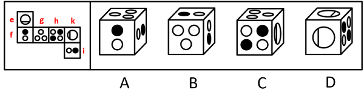
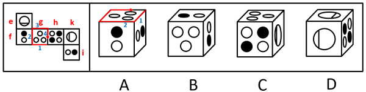
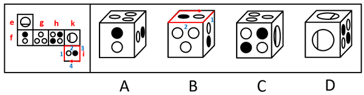

# 2024年江苏省公务员录用考试《行测》题（C类）（网友回忆版）

> 判断推理 · 45 题 · 江苏 2024

## 材料 1

市住建局3名工作人员小郑、小周、小刘打算参加“青年党员下基层”调研活动。可选的有小微堵点改造、跨区断头路建设、小型城市客厅打造、历史街区微改造4个调研项目。指导调研的有王教授、钱教授、马教授，且他们只能指导上述三位工作人员，已知：

（1）每位工作人员参加的项目都必须有教授指导，每位教授至少指导一位工作人员；

（2）每位工作人员只能参加一个项目，提倡多人合作；

（3）每位教授只能指导一个项目，一个项目也可由多位教授共同指导；

（4）小郑参加小微堵点改造或跨区断头路建设项目，钱教授指导历史街区微改造项目。

### 第 1 题　qid 16095254 · 类比推理

参加或指导小微堵点改造项目的不可能同时有以下哪两个人？

- **A**. 王教授和马教授
- **B**. 马教授和小刘
- **C**. 小刘和小周　✅
- **D**. 小周和王教授

**答案**：C

**官方解析**

第一步：分析题干条件。
（1）每位工作人员参加的项目都必须有教授指导，每位教授至少指导一位工作人员；
（2）每位工作人员只能参加一个项目，提倡多人合作；
（3）每位教授只能指导一个项目，一个项目也可由多位教授共同指导；
（4）小郑参加小微堵点改造或跨区断头路建设项目，钱教授指导历史街区微改造项目。
第二步：根据题干条件进行推理。
提问方式为“不可能”，优先考虑代入法。
代入A项，若指导小微堵点改造项目的是王教授和马教授，由条件（4）可知，指导历史街区微改造项目的是钱教授，结合条件（1）中的“每位教授至少指导一位工作人员”可知，历史街区微改造项目必须有工作人员参加，此时只要这两个项目都分别有至少一位工作人员参加即可，与题干条件不矛盾，该项可能成立，排除；
代入B项，若指导小微堵点改造项目的是马教授，参加小微堵点改造项目的是小刘，由条件（4）可知，指导历史街区微改造项目的是钱教授，结合条件（1）中的“每位教授至少指导一位工作人员”可知，历史街区微改造项目必须有工作人员参加，小郑参加小微堵点改造或跨区断头路建设项目，那么此时小周参加历史街区微改造项目即可，与题干条件不矛盾，该项可能成立，排除；
代入C项，若参加小微堵点改造项目的是小刘和小周，由条件（4）可知，小郑参加小微堵点改造或跨区断头路建设项目，此时3名工作人员中没有人可以参加由钱教授指导的历史街区微改造项目，不符合条件（1）中的“每位教授至少指导一位工作人员”，该项不可能成立，当选；
代入D项，若参加小微堵点改造项目的是小周，指导小微堵点改造项目的是王教授，由条件（4）可知，小郑参加小微堵点改造或跨区断头路建设项目，钱教授指导历史街区微改造项目，结合条件（1）中的“每位教授至少指导一位工作人员”可知，历史街区微改造项目必须有工作人员参加，此时小刘参加历史街区微改造项目即可，与题干条件不矛盾，该项可能成立，排除。
本题为选非题，故正确答案为C。

---

### 第 2 题　qid 16095256 · 类比推理

如果小周参加小型城市客厅打造项目，则以下哪一项一定为真？

- **A**. 小刘参加历史街区微改造项目　✅
- **B**. 王教授指导小型城市客厅打造项目
- **C**. 马教授指导小微堵点改造项目
- **D**. 小郑参加跨区断头路建设项目

**答案**：A

**官方解析**

第一步：分析题干条件。
（1）每位工作人员参加的项目都必须有教授指导，每位教授至少指导一位工作人员；
（2）每位工作人员只能参加一个项目，提倡多人合作；
（3）每位教授只能指导一个项目，一个项目也可由多位教授共同指导；
（4）小郑参加小微堵点改造或跨区断头路建设项目，钱教授指导历史街区微改造项目；
（5）小周参加小型城市客厅打造项目。
第二步：根据题干条件进行推理。
条件（4）与条件（5）中有确定信息，优先从确定信息入手推理。由条件（4）可知，钱教授指导历史街区微改造项目，结合条件（1）中的“每位教授至少指导一位工作人员”可知，历史街区微改造项目一定有工作人员参加；由条件（4）可知，小郑参加小微堵点改造或跨区断头路建设项目，由条件（5）可知，小周参加小型城市客厅打造项目，结合条件（2）中的“每位工作人员只能参加一个项目”可知，参加历史街区微改造项目的工作人员不可能是小郑、小周，且只有3名工作人员，所以小刘一定参加历史街区微改造项目，对应A项。
故正确答案为A。

---

### 第 3 题　qid 5919637 · 类比推理

保护知识产权：保护创新

- **A**. 人之初：性本善
- **B**. 德不孤：必有邻
- **C**. 勤有功：戏无益
- **D**. 经一事：长一智　✅

**答案**：D

**官方解析**

第一步：判断题干词语间逻辑关系。
“保护知识产权”是“保护创新”的重要手段和举措，通过“保护知识产权”能达到“保护创新”的目的，二者为方式与目的的对应关系。
第二步：判断选项词语间逻辑关系。
A项：“人之初，性本善”的意思是人出生之初，禀性本身都是善良的。“人之初”与“性本善”不是方式与目的的对应关系，与题干逻辑关系不一致，排除。
B项：“德不孤，必有邻”的意思是有道德的人是不会孤单的，必定会有志同道合的人来与他为伴。“德不孤”与“必有邻”不是方式与目的的对应关系，与题干逻辑关系不一致，排除。
C项：“勤有功，戏无益”的意思是人只要勤奋努力，就会有所成就；而嬉戏贪玩则对人没有任何好处。“勤有功”与“戏无益”不是方式与目的的对应关系，与题干逻辑关系不一致，排除。
D项：“经一事，长一智”的意思是亲身经历了某件事情，就能增长关于这方面的知识。通过“经一事”能达到“长一智”的目的，二者为方式与目的的对应关系，与题干逻辑关系一致，当选。
故正确答案为D。

---

### 第 4 题　qid 5919643 · 类比推理

吴王好剑客：百姓多创瘢

- **A**. 白日依山尽：黄河入海流
- **B**. 问君何能尔：心远地自偏
- **C**. 海上生明月：天涯共此时
- **D**. 烽火连三月：家书抵万金　✅

**答案**：D

**官方解析**

第一步：判断题干词语间逻辑关系。
“吴王好剑客，百姓多创瘢”的意思是吴王喜爱精通剑术的侠客，为此老百姓身上伤痕累累。因为“吴王好剑客”，所以“百姓多创瘢”，二者为因果对应关系。
第二步：判断选项词语间逻辑关系。
A项：“白日依山尽，黄河入海流”的意思是太阳依傍着西山慢慢地沉落，滔滔黄河朝着大海汹涌奔流。“白日依山尽”与“黄河入海流”为并列关系，与题干逻辑关系不一致，排除。
B项：“问君何能尔？心远地自偏”的意思是问我如何能做到这样，只要心中所想远离世俗，自然就会觉得所处地方僻静了。“问君何能尔”不是“心远地自偏”的原因，二者不是因果对应关系，与题干逻辑关系不一致，排除。
C项：“海上生明月，天涯共此时”的意思是茫茫的海上升起一轮明月，使人忆起远隔天涯海角的亲友，此时应该都在望着这轮明月。“海上生明月”不是“天涯共此时”的原因，二者不是因果对应关系，与题干逻辑关系不一致，排除。
D项：“烽火连三月，家书抵万金”的意思是连绵的战火已经持续很长时间了，家书难得，一封抵得上万两黄金。因为“烽火连三月”，所以“家书抵万金”，二者为因果对应关系，与题干逻辑关系一致，当选。
故正确答案为D。

---

### 第 5 题　qid 5919659 · 类比推理

年华未暮：容貌先秋

- **A**. 十年树木：百年树人
- **B**. 宁为玉碎：不为瓦全
- **C**. 言者无心：听者有意　✅
- **D**. 人无远虑：必有近忧

**答案**：C

**官方解析**

第一步：判断题干词语间逻辑关系。
“年华未暮，容貌先秋”的意思是未到衰老的年纪，而容颜已经老去，虽然“年华未暮”，但是“容貌先秋”，二者为转折的对应关系。
第二步：判断选项词语间逻辑关系。
A项：“十年树木，百年树人”的意思是培植树木需要十年，培育人才需要百年，指培养人才很不容易，二者为并列关系，与题干逻辑关系不一致，排除；
B项：“宁为玉碎，不为瓦全”的意思是宁愿做高贵的玉器而破碎，也不愿做低贱的瓦器得以保全，比喻宁为正义事业而牺牲，也不苟且偷生，二者为并列关系，与题干逻辑关系不一致，排除；
C项：“言者无心，听者有意”的意思是说话的人不注意，而听话的人却很留神，虽然“言者无心”，但是“听者有意”，二者为转折的对应关系，与题干逻辑关系一致，当选；
D项：“人无远虑，必有近忧”的意思是人若没有长远的谋虑，一定很快就有忧患，二者为条件的对应关系，与题干逻辑关系不一致，排除。
故正确答案为C。

---

### 第 6 题　qid 5919632 · 类比推理

海：海沟：海量

- **A**. 天：天眼：天堑
- **B**. 碑：碑座：碑林
- **C**. 火：火焰：火气　✅
- **D**. 心：心房：心腹

**答案**：C

**官方解析**

第一步：判断题干词语间逻辑关系。
“海沟”指深度超过6000米的狭长的海底凹地，其中“海”是指海洋，是海的本义；“海量”指极大的数量、很大的酒量或宽宏的度量，其中“海”指像海一样，是海的引申义。二者含义不同，且第二个词为本义，第三个词为引申义。
第二步：判断选项词语间逻辑关系。
A项：“天眼”指佛教所说五眼之一、道教所说天神之眼，其中“天”指天空，是天的本义；“天堑”指天然形成的隔断交通的大沟，其中“天”指天然的，不是天的引申义，与题干逻辑关系不一致，排除；
B项：“碑座”指石碑下边的底座，“碑林”指聚集在一起的众多石碑，其中“碑”均指刻着文字或图画，竖起来作为纪念物或标记的石头，均是碑的本义，与题干逻辑关系不一致，排除；
C项：“火焰”指燃烧着的可燃气体，其中“火”指物体燃烧时所发出的光和焰，是火的本义；“火气”多指怒气、暴躁的脾气，其中“火”指像火一样，是火的引申义。二者含义不同，且第二个词为本义，第三个词为引申义，与题干逻辑关系一致，当选；
D项：“心房”指心脏内部上面左右两个空腔，也指人的内心，其中“心”是指心脏，是心的本义；“心腹”指亲信的人，其中“心”不是指像心一样，与题干逻辑关系不一致，排除。
故正确答案为C。

---

### 第 7 题　qid 5919634 · 类比推理

梅花：梅花糕：糕

- **A**. 葡萄：葡萄酒：酒
- **B**. 珊瑚：珊瑚树：树
- **C**. 桥头：桥头堡：堡
- **D**. 面包：面包车：车　✅

**答案**：D

**官方解析**

第一步：判断题干词语间逻辑关系。
“梅花糕”因外形像“梅花”而得名，“梅花糕”是“糕”的一种，二者为种属关系。
第二步：判断选项词语间逻辑关系。
A项：“葡萄酒”因原材料为“葡萄”而得名，与题干逻辑关系不一致，排除。
B项：“珊瑚树”因外形像“珊瑚”而得名，“珊瑚树”是“树”的一种，二者为种属关系，与题干逻辑关系一致，保留。
C项：“桥头堡”指为控制重要桥梁、渡口而设立的碉堡、地堡或据点，不是因外形像什么而得名，与题干逻辑关系不一致，排除。
D项：“面包车”因外形像“面包”而得名，“面包车”是“车”的一种，二者为种属关系，与题干逻辑关系一致，保留。
对比B、D两项，题干的“梅花糕”“糕”、D项的“面包车”“车”均是人工产物，而B项的“珊瑚树”“树”均是自然产物，故D项与题干逻辑关系更一致。
故正确答案为D。

---

### 第 8 题　qid 5919658 · 类比推理

球赛：球员：裁判

- **A**. 教学：教师：家长
- **B**. 庭审：被告：法官　✅
- **C**. 球场：球员：观众
- **D**. 手术：患者：护士

**答案**：B

**官方解析**

第一步：判断题干词语间逻辑关系。
“球员”参与“球赛”，二者为活动与主体的对应关系；“裁判”判罚“球员”，二者为主体与被判罚对象的对应关系。
第二步：判断选项词语间逻辑关系。
A项：“教师”参与“教学”，二者为活动与主体的对应关系，但“家长”不能判罚“教师”，与题干逻辑关系不一致，排除。
B项：“被告”参与“庭审”，二者为活动与主体的对应关系；“法官”判罚“被告”，二者为主体与被判罚对象的对应关系。与题干逻辑关系一致，当选。
C项：“球员”在“球场”打球，二者是地点与主体的对应关系，与题干逻辑关系不一致，排除。
D项：“患者”接受“手术”，而不是参与“手术”，且“护士”不能判罚“患者”，与题干逻辑关系不一致，排除。
故正确答案为B。

---

### 第 9 题　qid 5919630 · 类比推理

期刊：月刊：目录页

- **A**. 房屋：公寓：天花板　✅
- **B**. 能源：电池：电子书
- **C**. 银行：企业：理财室
- **D**. 欧盟：法国：凯旋门

**答案**：A

**官方解析**

第一步：判断题干词语间逻辑关系。
期刊是定期出版的刊物，月刊是期刊的一种，前两词为种属关系；目录页是月刊的组成部分，后两词为组成关系。
第二步：判断选项词语间逻辑关系。
A项：公寓是房屋的一种，前两词为种属关系；天花板是公寓的组成部分，后两词为组成关系，与题干逻辑关系一致，当选；
B项：电池是一种能源，前两词为种属关系；当电子书指手持阅读器时，电池是电子书的组成部分，后两词为组成关系，但顺序与题干相反，与题干逻辑关系不一致，排除；
C项：有的银行是企业，有的银行不是企业，有的企业是银行，有的企业不是银行，前两词为交叉关系，与题干逻辑关系不一致，排除；
D项：法国是欧盟的成员国，前两词为组成关系；凯旋门是法国的代表性建筑，后两词为对应关系，与题干逻辑关系不一致，排除。
故正确答案为A。

---

### 第 10 题　qid 16095259 · 类比推理

手术机器人：医疗设备：高新装备

- **A**. 公办中学：事业单位：教育机构　✅
- **B**. 重大项目：在建工程：跨境设施
- **C**. 耄耋老人：健康老人：高龄老人
- **D**. 管理成本：人力成本：生产成本

**答案**：A

**官方解析**

第一步：判断题干词语间逻辑关系。
手术机器人既是医疗设备，又是高新装备，第一词与后两词均是种属关系；有的医疗设备是高新装备，有的医疗设备不是高新装备，有的高新装备是医疗设备，有的高新装备不是医疗设备，后两词是交叉关系。
第二步：判断选项词语间逻辑关系。
A项：事业单位指接受国家或地方财政拨款，从事教育、科技、文化、卫生等活动，具备法人条件的社会服务组织。公办中学既是事业单位，又是教育机构，第一词与后两词均是种属关系；有的事业单位是教育机构，有的事业单位不是教育机构，有的教育机构是事业单位，有的教育机构不是事业单位，后两词是交叉关系，与题干逻辑关系一致，当选；
B项：有的重大项目是在建工程，有的重大项目不是在建工程，有的在建工程是重大项目，有的在建工程不是重大项目，前两词是交叉关系，与题干逻辑关系不一致，排除；
C项：耄耋老人指八九十岁的老人，有的耄耋老人是健康老人，有的耄耋老人不是健康老人，有的健康老人是耄耋老人，有的健康老人不是耄耋老人，前两词是交叉关系，与题干逻辑关系不一致，排除；
D项：管理成本与生产成本是并列关系，与题干逻辑关系不一致，排除。
故正确答案为A。

---

### 第 11 题　qid 5919649 · 类比推理

杞人忧天 之于 （    ） 相当于  （    ） 之于 自不量力

- **A**. 庸人自扰；螳臂当车　✅
- **B**. 局促不安；蜉蝣撼树
- **C**. 叶公好龙；夜郎自大
- **D**. 郑人买履；自以为是

**答案**：A

**官方解析**

逐一代入选项。
A项：“杞人忧天”借指为不必要忧虑的事情而忧虑，“庸人自扰”指本来没有问题而自己瞎着急或自找麻烦，二者为近义关系；“螳臂当车”比喻不正确估计自己的力量，去做办不到的事情，必然招致失败，“自不量力”指不能正确估计自己的力量（多指做力不能及的事情），二者为近义关系。前后逻辑关系一致，当选。
B项：“杞人忧天”借指为不必要忧虑的事情而忧虑，“局促不安”的意思是拘谨不自然，形容举止拘束，心中不安，二者无明显逻辑关系；“蜉蝣撼树”比喻通过贬低他人来抬高自己，“自不量力”指不能正确估计自己的力量（多指做力不能及的事情），二者无明显逻辑关系。前后逻辑关系不一致，排除。
C项：“杞人忧天”借指为不必要忧虑的事情而忧虑，“叶公好龙”比喻说是爱好某事物，其实并不真爱好，二者无明显逻辑关系；“夜郎自大”指妄自尊大，“自不量力”指不能正确估计自己的力量（多指做力不能及的事情），二者为近义关系。前后逻辑关系不一致，排除。
D项：“杞人忧天”借指为不必要忧虑的事情而忧虑，“郑人买履”指照搬条文，不考虑客观实际的教条做法，二者无明显逻辑关系；“自以为是”指认为自己的看法和做法都正确，不接受别人的意见，“自不量力”指不能正确估计自己的力量（多指做力不能及的事情），二者无明显逻辑关系。前后逻辑关系不一致，排除。
故正确答案为A。

---

### 第 12 题　qid 17900824 · 类比推理

（    ） 之于 白蚁 相当于 岩羊 之于 （    ）

- **A**. 昆虫；山羊
- **B**. 树木；雪豹　✅
- **C**. 蚂蚁；老鹰
- **D**. 蚁后；羊群

**答案**：B

**官方解析**

逐一代入选项。
A项：“白蚁”是一种“昆虫”，二者为种属关系；“岩羊”和“山羊”为并列关系。前后逻辑关系不一致，排除。
B项：“白蚁”啃食“树木”，二者为捕食者和被捕食者的对应关系；“雪豹”捕食“岩羊”，二者为捕食者和被捕食者的对应关系。前后逻辑关系一致，当选。
C项：“白蚁”属于等翅目昆虫，“蚂蚁”属于膜翅目昆虫，二者为并列关系；“老鹰”捕食“岩羊”，二者为捕食者和被捕食者的对应关系。前后逻辑关系不一致，排除。
D项：有的“蚁后”是“白蚁”，有的“蚁后”不是“白蚁”，有的“白蚁”是“蚁后”，有的“白蚁”不是“蚁后”，二者为交叉关系；“岩羊”是“羊群”的组成部分，二者为组成关系。前后逻辑关系不一致，排除。
故正确答案为B。

---

### 第 13 题　qid 17900822 · 图形推理

从所给的四个选项中，选择最合适的一个填入问号处，使之呈现一定的规律性。

- **A**. A
- **B**. B
- **C**. C　✅
- **D**. D

**答案**：C

**官方解析**

元素组成不同，优先考虑属性规律。观察发现，题干已知图形均为规整的字母，考虑对称性。题干第一、三、五幅图均为只轴对称的图形，第二、四幅图均为只中心对称的图形，因此问号处应选择一个只中心对称的图形，只有C项符合。
故正确答案为C。

---

### 第 14 题　qid 17900827 · 图形推理

从所给的四个选项中，选择最合适的一个填入问号处，使之呈现一定的规律性。

- **A**. A
- **B**. B
- **C**. C
- **D**. D　✅

**答案**：D

**官方解析**

元素组成不同，优先考虑数量规律。观察发现，元素的数量依次为1、2、3、4、5、？，故问号处该元素的数量应为6，排除A项。再次观察发现，每幅图中的四角星在该图中的位置分别为上、右、下、左、上、？，因此问号处图形中四角星在该图中的位置应为右，只有D项符合。

故正确答案为D。

---

### 第 15 题　qid 17900833 · 图形推理

从所给的四个选项中，选择最合适的一个填入问号处，使之呈现一定的规律性。

- **A**. A
- **B**. B
- **C**. C
- **D**. D　✅

**答案**：D

**官方解析**

元素组成不同，且无明显属性规律，考虑数量规律。观察发现，图形中出现类似天平的示意图，将两端小元素转化为质量关系，可得：&gt;，&gt;，&gt;，&gt;，&gt;。串联后可得：&gt;&gt;&gt;&gt;。故问号处图形中两个小元素也应符合此规律，排除B、C两项。继续观察发现，题干图形中天平依次倾向于左侧、右侧、左侧、右侧、左侧、？，故问号处图形中的天平应倾向于右侧，只有D项符合。

故正确答案为D。

---

### 第 16 题　qid 16095253 · 图形推理

请从四个选项中选出最恰当的一项填入问号处，使题干图形呈现一定的规律性。

- **A**. A
- **B**. B　✅
- **C**. C
- **D**. D

**答案**：B

**官方解析**

元素组成基本相同，题干每幅图形都是由直线和小白圆组成，考虑功能元素的标记作用。观察发现，小白圆只标记1条线，且若把每幅图的最外面那条线当作第1条线，那么小白圆依次标记在第1条线、第2条线、第3条线、第4条线、第5条线上，故？处图形中的小白圆应只标记在第6条线上，只有B项符合。
故正确答案为B。

---

### 第 17 题　qid 12304867 · 图形推理

请从四个选项中选出最恰当的一项填入问号处，使题干图形呈现一定的规律性。

- **A**. A
- **B**. B
- **C**. C
- **D**. D　✅

**答案**：D

**官方解析**

元素组成不同，优先考虑属性规律。观察发现，题干出现全直线、全曲线图形，可以考虑曲直性。九宫格优先看横行，第一行图形分别为有曲有直图形、全曲线图形、全直线图形；经验证，第二行符合此规律；第三行应用此规律，故“？”处图形应是全直线图形，排除B项；继续观察发现，题干图形出现明显封闭空间，考虑面数量，第一行图形面数量均为1，第二行图形面数量均为2，第三行前两幅图形面数量均为3，故“？”处图形面数量应为3，排除C项；对比A、D两项，A项图形部分数为2，D项图形部分数为1，题干图形部分数均为1，只有D项符合。
故正确答案为D。

---

### 第 18 题　qid 12334416 · 图形推理

从所给的四个选项中，选择最合适的一个填入问号处，使之呈现一定的规律性。

- **A**. A
- **B**. B　✅
- **C**. C
- **D**. D

**答案**：B

**官方解析**

元素组成相同，优先考虑位置规律。九宫格优先横向看，第一行中，图一经过逆时针旋转得到图二，图二经过上下翻转得到图三；第二行经验证，符合该规律；第三行应用规律，只有B项符合。

故正确答案为B。

---

### 第 19 题　qid 16095267 · 图形推理

下边四个图形中，只有一个是由上边的四个图形拼合（只能通过上、下、左、右平移）而成的，请把它找出来。

- **A**. A
- **B**. B　✅
- **C**. C
- **D**. D

**答案**：B

**官方解析**

本题考查平面拼合，可采用平行且等长相消的方式解题。消去平行且等长的线段后进行组合即可得到轮廓图，即为B项。平行且等长相消的方式如下图所示：

故正确答案为B。

---

### 第 20 题　qid 16095271 · 图形推理

下边四个图形中，只有一个是由上边的四个图形拼合（只能通过上、下、左、右平移）而成的，请把它找出来。

- **A**. A　✅
- **B**. B
- **C**. C
- **D**. D

**答案**：A

**官方解析**

本题考查平面拼合，可采用平行且等长相消的方式解题。消去平行且等长的线段后进行组合即可得到轮廓图，即为A项。平行且等长相消的方式如下图所示：

故正确答案为A。

---

### 第 21 题　qid 16095258 · 图形推理

选项四个图形中，只有一个是由题干的四个图形拼合（只能通过上、下、左、右平移）而成的，请把它找出来。

- **A**. A
- **B**. B　✅
- **C**. C
- **D**. D

**答案**：B

**官方解析**

本题考查平面拼合，可采用平行且等长相消的方法解题。消去平行且等长的线段后进行组合可得到轮廓图，即为B项。平行且等长相消的方式如下图所示。

故正确答案为B。

---

### 第 22 题　qid 16095266 · 图形推理

下边四个图形中，只有一个是由上边的四个图形拼合（只能通过上、下、左、右平移）而成的，请把它找出来。

- **A**. A
- **B**. B　✅
- **C**. C
- **D**. D

**答案**：B

**官方解析**

本题考查平面拼合，消去弯曲程度一致且等长的曲线后进行拼合，即可得到轮廓图，即为B项。具体拼合方式如下图所示：

故正确答案为B。

---

### 第 23 题　qid 17900828 · 图形推理

左边图形恰好可以分割为右边的某三个图形（可以平移、旋转，但不能翻转），请找出不属于分割所得的图形。

- **A**. A
- **B**. B　✅
- **C**. C
- **D**. D

**答案**：B

**官方解析**

本题考查平面拼合，可采用平行且等长相消的方式解题。A项、D项与旋转后的C项消去平行且等长的线段后进行组合，可得到题干轮廓图，平行且等长相消的方式如下图所示。

本题为选非题，故正确答案为B。

---

### 第 24 题　qid 17900846 · 图形推理

左边给定的是六面体的外表面展开图，右边哪一项能由它折叠而成？

- **A**. A
- **B**. B
- **C**. C
- **D**. D　✅

**答案**：D

**官方解析**

本题为空间重构题。将题干展开图中的面依次标上序号，如下图所示，逐一分析选项。

A项：选项由面f、面g和面i构成，在题干展开图和选项中，以面g中挨着两个白色小圆的边为起始边，分别对面g顺时针画边，题干展开图中边2同时挨着面f中的白色小圆和黑色小圆，而选项中边2只挨着一个黑色小圆，选项与题干展开图不一致，排除。

B项：选项由面f、面g和面i构成，且由题干展开图中面f内小圆和面g内小圆的相对位置可知，选项中的顶面为面i。在题干展开图和选项中，以面i靠近白色小圆的边为起始边，分别对面i顺时针画边，题干展开图中边1挨着面h，而选项中边1不挨着面h，选项与题干展开图不一致，排除。

C项：选项一定有面g，面g和面k为相对面，不能同时出现在立体图中，故选项由面e、面g和面h构成。题干展开图中面e内的小弓形挨着面f，而选项中面e内的小弓形挨着面h，选项与题干展开图不一致，排除。

D项：选项由面e、面h和面k构成，选项与题干展开图一致，当选。

故正确答案为D。

---

### 第 25 题　qid 12304871 · 图形推理

下列是四个正方体的外表面展开图，其中哪个展开图还原成正方体后，存在有同一个公共顶点的三个面，且其上的数字之和为8？

- **A**. A
- **B**. B　✅
- **C**. C
- **D**. D

**答案**：B

**官方解析**

观察发现，选项展开图的六个面中出现的数字均分别为1-6，若想在1-6中选出3个数字相加刚好是8，只有两种情况：①面1、面2和面5两两相邻；②面1、面3和面4两两相邻。逐一分析选项：

A项：面1和面4为相对面，故面1、面3和面4无法两两相邻；面2和面5为相对面，故面1、面2和面5无法两两相邻。两种情况均不符合要求，排除；

B项：面1、面2和面5两两相邻，存在同一个公共顶点（如下图所示），且其上的数字之和为8，满足要求，当选；

C项：面3和面4为相对面，故面1、面3和面4无法两两相邻；面1和面2为相对面，故面1、面2和面5无法两两相邻。两种情况均不符合要求，排除；

D项：面3和面4为相对面，故面1、面3和面4无法两两相邻；面1和面5为相对面，故面1、面2和面5无法两两相邻。两种情况均不符合要求，排除。

故正确答案为B。

---

### 第 26 题　qid 16095252 · 图形推理

将下列三棱锥的展开图还原成三棱锥后，有一个与其他三个不一样，请把它找出来。

- **A**. A
- **B**. B
- **C**. C
- **D**. D　✅

**答案**：D

**官方解析**

本题考查空间重构。在选项展开图中，以只有两个扇形的面上的空白顶点作为起始点，进行顺时针画边，如下图所示，逐一分析选项。

A项：选项中右边两个面为图案一样的面，边1不挨着其中任意一个面中的小扇形。

B项：选项中最左边和最右边两个面为图案一样的面，边1不挨着其中任意一个面中的小扇形。

C项：选项中最上边和左下边为图案一样的面，边1不挨着其中任意一个面中的小扇形。

D项：选项中最上边和右下边为图案一样的面，边1与最上边面中的小扇形有公共点。

本题为选非题，故正确答案为D。

---

### 第 27 题　qid 12304861 · 图形推理

左图是由14个黑白小正方体组成的立体图形，右面四个选项中有一项不是该立体图形的视图，请把它找出来。

- **A**. A　✅
- **B**. B
- **C**. C
- **D**. D

**答案**：A

**官方解析**

本题考查三视图。

A项：该项不是该立体图形的视图，若为轮廓一致的主视图，应如下图所示，当选；

B项：从上往下可以看到，为俯视图，排除；

C项：从左往右可以看到，为左视图，排除；

D项：从后往前可以看到，为后视图，排除。

本题为选非题，故正确答案为A。

---

### 第 28 题　qid 12304865 · 逻辑判断

一只鸟除非两翼健壮并以共同的力量来推动身体，否则它不能飞向天空。根据以上陈述，可以推出以下哪些结论？
①一只鸟如果两翼健壮并以共同的力量来推动身体，那么它能够飞向天空
②一只鸟如果能够飞向天空，那么它两翼健壮并以共同的力量来推动身体
③一只鸟若两翼不健壮或不能以共同的力量来推动身体，那么它不能飞向天空
④一只鸟如果不能飞向天空，那么它两翼不健壮或不能以共同力量来推动身体

- **A**. ①②
- **B**. ②③　✅
- **C**. ③④
- **D**. ②④

**答案**：B

**官方解析**

第一步：翻译题干。

题干翻译为：飞向天空两翼健壮 且 以共同的力量来推动身体。

第二步：逐一分析选项。

①翻译为：两翼健壮 且 以共同的力量来推动身体飞向天空，是对题干逻辑关系的肯后，肯后无必然结论，无法推出；

②翻译为：飞向天空两翼健壮 且 以共同的力量来推动身体，是对题干逻辑关系的肯前，肯前必肯后，可以推出；

③翻译为：两翼健壮 或 以共同的力量来推动身体飞向天空，是对题干逻辑关系的否后，否后必否前，可以推出；

④翻译为：飞向天空两翼健壮 或 以共同的力量来推动身体，是对题干逻辑关系的否前，否前无必然结论，无法推出。

综上所述，②③可以推出，对应B项。

故正确答案为B。

---

### 第 29 题　qid 10975246 · 逻辑判断

某学校模拟派出骨干教师指导山区教师人才培训项目。甲、乙、丙、丁四位教师积极报名参加，学校决定从他们四人中挑选出若干人员，考虑到各方面情况，派出人员要符合以下要求：
①只有乙参加，甲才参加；
②如果丙参加，那么丁不参加；
③如果乙参加，那么丙也参加。
根据以上信息，以下哪项不可能为真？

- **A**. 甲和丙参加
- **B**. 丁参加，乙不参加
- **C**. 甲和丁参加　✅
- **D**. 甲参加，丁不参加

**答案**：C

**官方解析**

第一步：翻译题干条件。

（1）甲乙；

（2）丙丁；

（3）乙丙。

将（1）（2）（3）串联可得：（4）甲乙丙丁。

第二步：根据题干条件进行推理。

根据条件（4）可知，甲参加时丁一定不参加，因此C项不可能为真。

本题为选非题，故正确答案为C。

---

### 第 30 题　qid 17900831 · 逻辑判断

人体总能量代谢主要由静息代谢水平和活动能量代谢水平决定。静息代谢指人体在静止状态下消耗的能量，活动能量代谢指人们在日常活动或运动状态下所消耗的能量。近年来，M市成年人的总能量代谢水平呈现下降趋势。有人据此认为，M市成年人的静息代谢水平近年来也呈下降趋势。
以下哪项如果为真，最能支持上述人士的观点？

- **A**. 近年来，M市成年人逐渐重视饮食结构均衡，减少各种高能量食物摄入
- **B**. 近年来，M市成年人开始重视身体锻炼，平均每天的锻炼时长有所增加　✅
- **C**. 近年来，M市成年人劳动强度普遍降低，许多人不再从事高强度体力劳动
- **D**. 近年来，M市成年人总能量代谢水平下降幅度比活动能量代谢水平下降幅度小

**答案**：B

**官方解析**

第一步：找出论点和论据。
论点：M市成年人的静息代谢水平近年来也呈下降趋势。
论据：人体总能量代谢主要由静息代谢水平和活动能量代谢水平决定。近年来，M市成年人的总能量代谢水平呈现下降趋势。
本题论点说的是“静息代谢水平呈下降趋势”，即部分下降，而论据说的是“总能量代谢水平呈下降趋势”，即整体下降，加强优先考虑补充论据，即说明另一部分（活动能量代谢水平）的情况。
第二步：逐一分析选项。
A项：该项指出M市的成年人减少高能量食物摄入，而论点说的是静息代谢水平呈下降趋势，话题不一致，无法加强，排除。
B项：该项指出M市的成年人平均每天的锻炼时长有所增加，说明活动能量代谢水平在上升，结合论据中总能量代谢水平下降，可以推出静息代谢水平下降，补充论据，可以加强，当选。
C项：该项指出M市的成年人劳动强度降低，说明活动能量代谢水平在下降，结合论据中总能量代谢水平下降，无法推出静息代谢水平一定下降了（静息代谢水平也可能上升了，但上升幅度小于活动能量代谢水平的下降幅度），为不明确项，无法加强，排除。
D项：该项指出M市成年人总能量代谢水平下降幅度比活动能量代谢水平下降幅度小，当整体下降的幅度小于一个因素下降的幅度时，另一个因素的变化情况无法确定，为不明确项，无法加强，排除。
故正确答案为B。

---

### 第 31 题　qid 10975252 · 逻辑判断

某学校举办田径运动会，所有参加800米跑的运动员都参加了100米跑，所有参加100米跑的运动员都参加了跳高，有些参加跳远的运动员参加了投掷链球，所有参加跳远的运动员都没有参加跳高。
根据以上陈述，不能推出以下哪项？

- **A**. 所有参加800米跑的运动员都参加了跳高
- **B**. 所有参加投掷链球的运动员都没有参加跳高
- **C**. 所有参加跳远的运动员都没有参加100米跑
- **D**. 有些参加800米跑的运动员参加了跳远　✅

**答案**：D

**官方解析**

第一步：翻译题干。

（1）参加800米跑参加100米跑；

（2）参加100米跑参加跳高；

（3）有的参加跳远参加投掷链球；

（4）参加跳远参加跳高。

将（1）（2）（4）串联可得：（5）参加800米跑参加100米跑参加跳高参加跳远。

第二步：逐一分析选项。

A项：翻译为“参加800米跑参加跳高”，“参加800米跑”是对条件（5）的肯前，肯前必肯后，可以推出，排除。

B项：翻译为“参加投掷链球参加跳高”，将条件（3）换位可得“有的参加投掷链球参加跳远”，与条件（4）串联可得“有的参加投掷链球参加跳远参加跳高”，“有的”无法推出“所有”，即“所有参加投掷链球的运动员都没有参加跳高”可能为真，也可能为假，保留。

C项：翻译为“参加跳远参加100米跑”，“参加跳远”是对条件（5）的否后，否后必否前，可以推出，排除。

D项：翻译为“有的参加800米跑参加跳远”，与条件（5）矛盾，无法推出，保留。

对比B、D两项，B项可能为真，D项一定为假，择优选D项。

本题为选非题，故正确答案为D。

---

### 第 32 题　qid 12304863 · 逻辑判断

某车间共有18人，他们分别来自山东、江苏、浙江、安徽和福建5省。在18人中，每省至少有1人，且来自各省的人数均不相同。已知：
来自山东和江苏的共有5人；
来自江苏和浙江的共有6人；
来自浙江和福建的共有7人；
根据上述信息，可以推出以下哪项？

- **A**. 18人中来自山东的有1人
- **B**. 18人中来自浙江的有2人
- **C**. 18人中来自福建的有5人
- **D**. 18人中来自安徽的有6人　✅

**答案**：D

**官方解析**

第一步：分析题干条件。
（1）山东+江苏=5；
（2）江苏+浙江=6；
（3）浙江+福建=7；
（4）山东+江苏+浙江+安徽+福建=18；
（5）在18人中，每省至少有1人，且来自各省的人数均不相同。
第二步：根据题干条件进行推理。
将条件（1）和（3）相加可得条件（6）：山东+江苏+浙江+福建=12。
再用条件（4）与条件（6）相减可得：安徽=6，对应D项。
故正确答案为D。

---

### 第 33 题　qid 16095272 · 类比推理

甲：小明十岁就能用英语与英国人流利对话，语言天赋真是出类拔萃。
乙：小明跟着父母在英国住了两年，能流利对话不足为奇。
以下哪项与题干对话方式最为相似？

- **A**. 
甲：这款热水器的价格比市面上常见的热水器高出一倍，太不划算了

乙：这款产品用的是航天级别的材料，在同材质热水器中性价比很高
　✅
- **B**. 
甲：小李以前容易冲动，进入职场一年后稳重多了

乙：小李承担了单位大量重要工作，变得稳重一点理所当然

- **C**. 
甲：小张的数学一直很好，进入高中后，物理、化学等科目的学习很轻松

乙：数学强调科学思维，掌握科学思维的人学习物理、化学当然没有难度

- **D**. 
甲：小刘在过去的一年中连续犯下三起盗窃案，真是无可救药

乙：人非圣贤，孰能无过，相信在经过改造之后他会洗心革面

**答案**：A

**官方解析**

第一步：分析题干逻辑关系。
甲根据“小明十岁就能用英语与英国人流利对话”的现象，得出“小明的语言天赋出类拔萃”的结论，而乙提出“小明跟着父母在英国住了两年”的理由来解释现象，用“能流利对话不足为奇”来否定甲的结论。
第二步：逐一分析选项。
A项：甲根据“这款热水器的价格比市面上常见的热水器高出一倍”的现象，得出“这款热水器不划算”的结论，乙提出“这款产品用的是航天级别的材料”的理由来解释现象，用“在同材质热水器中性价比很高”来否定甲的结论，与题干对话方式一致，当选；
B项：甲提出“小李以前容易冲动，进入职场一年后稳重多了”的结论，乙提出“小李承担了单位大量重要工作，变得稳重一点理所当然”的理由来解释甲的结论，与题干对话方式不一致，排除；
C项：甲提出“小张的数学一直很好，进入高中后，物理、化学等科目的学习很轻松”的结论，乙提出“数学强调科学思维，掌握科学思维的人学习物理、化学当然没有难度”的理由来解释甲的结论，与题干对话方式不一致，排除；
D项：甲根据“小刘在过去的一年中连续犯下三起盗窃案”的现象，得出“小刘无可救药”的结论，乙得出的观点“相信在经过改造之后小刘会洗心革面”是一种预测，而非事实，用预测否定甲的结论，与题干对话方式不一致，排除。
故正确答案为A。

---

### 第 34 题　qid 12304873 · 逻辑判断

卖早点、修家电、配钥匙·····老百姓家门口的社区商业，是以社区居民为服务对象、服务半径为步行15分钟左右范围内的商业形态。近年来，许多城市大力推进社区商业建设，以更好地满足居民的消费需求。不过，也有专家担忧，家门口商业服务的完善，在给居民生活带来便利的同时可能也会使快递业逐步萎缩。
以下哪项如果为真，最能缓解上述专家的担忧？

- **A**. 为了方便居民，很多城市推进社区商业建设时，都将快递驿站作为社区商业的重要组成部分
- **B**. 社区商业主要提供汽车保养、幼儿托管等服务类业态，社区购物在居民整体购物消费中占比很少　✅
- **C**. 社会经济发展必然包含新旧行业的更迭，社区商业作为新的消费增长点，吸纳了大量传统行业的劳动者就业
- **D**. 许多大型商超组建了自己的配送车队，可为周边5公里范围内居民提供商品一小时送达服务

**答案**：B

**官方解析**

第一步：找出论点和论据。
论点：家门口商业服务的完善，在给居民生活带来便利的同时可能也会使快递业逐步萎缩。
论据：无。
本题提问为“缓解上述专家的担忧”即削弱上述专家的担忧，且只有论点没有论据，削弱优先考虑削弱论点，即说明家门口商业服务的完善不会使快递业逐步萎缩。
第二步：逐一分析选项。
A项：该项说的是很多城市将快递驿站作为社区商业的重要组成部分，说明家门口商业服务完善后快递驿站依然很重要，可能不会使快递业逐步萎缩，削弱论点，可以削弱，保留；
B项：该项说的是社区购物在居民整体购物消费中占比很少，说明社区商业的建设对居民原有的购物方式影响不大，也就不会使快递业逐步萎缩，削弱论点，可以削弱，保留；
C项：该项说的是社区商业吸纳了大量传统行业的劳动者就业，是在说社区商业促进了就业，并未提及对快递业的影响，为无关项，无法削弱，排除；
D项：该项说的是许多大型商超提供限时配送服务，大型商超不属于社区商业，提供的配送服务不属于快递业，为无关项，无法削弱，排除。
对比A、B两项，A项说的是快递驿站的重要性，但是快递驿站重要并不能明确说明快递业的情况，而B项明确说明了对居民原有的购物方式影响不大，即不会对快递业有影响，综合对比，B项比A项更加明确，因此优选B项。
故正确答案为B。

---

### 第 35 题　qid 12304874 · 逻辑判断

一项研究发现，成年小白鼠去除一个关键生物钟基因后，昼夜节律完全消失，虽然生活质量有所下降，但寿命并未受到显著影响，心血管健康状况甚至有所改善。据此，研究人员推断昼夜节律缺失对健康的危害可能没有我们想象得那么大。
回答以下哪个问题最有助于评价上述研究人员所做出的推断？

- **A**. 成年小白鼠去除生物钟基因后出现的心血管情况改善是否会延长小白鼠的寿命
- **B**. 成年小白鼠去除生物钟基因之后的休息时间是否与未去除之前的休息时间相同
- **C**. 成年小白鼠去除生物钟基因后的寿命和心血管健康状况能否代表整体健康状况　✅
- **D**. 成年小白鼠去除生物钟基因之后的生活质量是否会影响小白鼠的整体健康状况

**答案**：C

**官方解析**

第一步：找出论点和论据。
论点：昼夜节律缺失对健康的危害可能没有我们想象得那么大。
论据：成年小白鼠去除一个关键生物钟基因后，昼夜节律完全消失，虽然生活质量有所下降，但寿命并未受到显著影响，心血管健康状况甚至有所改善。
本题论点讨论的是“昼夜节律缺失”和“整体健康状况”之间的关系，论据讨论的是“昼夜节律缺失”和“寿命、心血管健康状况”之间的关系，二者话题不一致，且提问方式为“最有助于”评价研究人员的推断，可以考虑搭桥，即建立“寿命、心血管健康状况”与“整体健康状况”之间的关系。
第二步：逐一分析选项。
A项：该项讨论的是“心血管健康状况”与“寿命”之间的关系，而不是“寿命、心血管健康状况”与“整体健康状况”之间的关系，即使心血管状况改善能够延长寿命，仍无法得知整体健康状况如何，无助于评价研究人员的推断，排除；
B项：该项讨论的是“去除生物钟基因前后的休息时间”，论点说的是“昼夜节律缺失”和“整体健康状况”的关系，话题不一致，无助于评价研究人员的推断，排除；
C项：该项讨论的是“寿命、心血管健康状况”与“整体健康状况”之间的关系，如果寿命和心血管健康状况能代表整体健康状况，则说明研究人员的推断成立，有助于评价研究人员的推断，当选；
D项：该项讨论的是“生活质量”与“整体健康状况”之间的关系，但研究人员是通过“寿命”与“心血管健康状况”得出的论点，不如C项更有助于评价研究人员的推断，排除。
故正确答案为C。

---

### 第 36 题　qid 17900825 · 定义判断

涉农执法：指有关行政执法部门对涉及“三农”的生产经营活动的各种问题开展的执法活动。
下列不属于涉农执法的是：

- **A**. 某食品工厂生产的饮料经抽样检测，有多项不合格，执法人员对当事人做出没收违法所得并罚款的行政处罚
- **B**. 执法大队经调查取证，查实辖区内的某农贸经营部销售假农药，依法责令其召回已售出的该农药，并对当事人做出行政处罚
- **C**. 在对某乡村猪肉交易市场进行执法检查时，发现，郑某售卖的猪肉没有检验标识，依法对他进行了处罚
- **D**. 种瓜大户老刘为了扩大销路，在瓜园门口挂上了“香瓜开园啦”的条幅。邻居张律师说，他未经批准打广告，不合法，建议他撤下横幅　✅

**答案**：D

**官方解析**

第一步：找出定义关键词。
“行政执法部门”“涉及‘三农’的生产经营活动的各种问题”。
第二步：逐一分析选项。
A项：某食品工厂生产的饮料经检测不合格，执法人员对当事人做出行政处罚，符合“行政执法部门”“涉及‘三农’的生产经营活动的各种问题”，符合定义，排除。
B项：某农贸经营部销售假农药，执法大队责令其召回并对当事人做出行政处罚，符合“行政执法部门”“涉及‘三农’的生产经营活动的各种问题”，符合定义，排除。
C项：在执法检查中，因郑某售卖的猪肉没有检验标识而对他进行了处罚，符合“行政执法部门”“涉及‘三农’的生产经营活动的各种问题”，符合定义，排除。
D项：种瓜大户老刘未经批准在瓜园门口打广告，邻居张律师认为这种行为不合法，建议他撤下横幅，张律师不是行政执法部门的人员，不符合“行政执法部门”，不符合定义，当选。
本题为选非题，故正确答案为D。

---

### 第 37 题　qid 10975254 · 定义判断

数字游民：指工作时间不受限制，地域可以自主选择，利用网络数字手段完成本职工作的从业人员。
下列属于数字游民的是：

- **A**. 小雷辞职后游走在不同的城市，白天在市区游玩特色街区，晚上到热闹的广场跟着市民一起跳舞，随时随地向天南地北的粉丝直播，月收入比以前多得多　✅
- **B**. 康女士居住在很远的小区，每天通勤时间差不多需要三四个小时，工作十分辛苦。最近，她的居家办公申请得到了批准，不用天天去公司打卡了
- **C**. 黄先生年初被公司派驻到某山区工作，闲暇之余利用微信公众号帮助当地乡亲销售土特产，并通过网络众筹建起了雪乡旅舍，有时亲自担任导游。默默无闻的小山村很快变成了远近闻名的旅游村
- **D**. 潮玩设计师周先生到新公司后，再也不担心迟到早退。昨天也许还是短裤、T恤和凉鞋，明天就换成了密不透风的户外运动装。他要做的只是每天晚上将自己的灵感、新想法报告给部门主管

**答案**：A

**官方解析**

第一步：找出定义关键词。
“工作时间不受限制”、“地域可以自主选择”、“利用网络数字手段完成本职工作”。
第二步：逐一分析选项。
A项：小雷作为自媒体从业者，游走在不同城市，符合“地域可以自主选择”，随时随地向粉丝直播，说明其工作并不受时间的限制，且利用互联网完成工作，符合“工作时间不受限制”、“利用网络数字手段完成本职工作”，符合定义，当选。
B项：康女士因通勤时间很长申请了居家办公，说明其工作地点虽然是家里但还是受公司管理，工作时间受到限制，不符合“工作时间不受限制”，不符合定义，排除。
C项：黄先生被公司派驻到某山区工作，说明其工作地点比较固定，不符合“地域可以自主选择”，不符合定义，排除。
D项：周先生的新工作不需要考虑迟到早退，但仍需要每天晚上汇报工作，说明其工作时间仍受到一定的限制，不符合“工作时间不受限制”，同时，未明确体现周先生可自由选择办公地点，不符合“地域可以自主选择”，不符合定义，排除。
故正确答案为A。

---

### 第 38 题　qid 10975256 · 定义判断

代际责任：指在不超出自身能力的前提下，相邻两代人的一方向另一方主动提供经济帮扶、生活照顾、健康保障、精神抚慰等各种支持的行为。
下列不属于代际责任的是：

- **A**. 苏女士把父母接到身边后，忙乎了一个多月，带着父母熟悉小区健身器材，到社区老年活动中心打牌下棋，在公园找人聊天，终于帮他们重新找到了“组织”
- **B**. 邵先生和妻子一直在城里忙于打拼，女儿正在读小学。每到寒暑假，邵先生的父母都会专程赶到城里，把孙女接回农村老家痛痛快快地玩上整个假期
- **C**. 罗奶奶像无数为孩子婚事发愁的长辈一样，每到周末就去附近公园的相亲角浏览展板上的照片、简历，觉得合适的就记下基本情况、电话号码。虽然快三十岁的孙女根本不着急，她却一直乐此不疲　✅
- **D**. 毛先生喜欢第一时间把遇到的趣事分享到家族微信群，却很少得到期待的回应，一怒之下退了群。后来，儿子又把他请回，还邀约了几位有同样爱好的长辈，群里逐渐热闹起来，他也时不时点赞或评论几句

**答案**：C

**官方解析**

第一步：找出定义关键词。
“不超出自身能力的前提下”、“相邻两代人”、“一方向另一方主动提供经济帮扶、生活照顾、健康保障、精神抚慰等各种支持”。
第二步：逐一分析选项。
A项：苏女士将把父母接到身边，且主动协助他们适应环境、找到“组织”，符合“相邻两代人”、“一方向另一方主动提供经济帮扶、生活照顾、健康保障、精神抚慰等各种支持”，符合定义，排除。
B项：邵先生的父母会在寒暑假时专程把孙女接回农村老家，这减轻了忙于工作的邵先生夫妇的负担，符合“相邻两代人”、“一方向另一方主动提供经济帮扶、生活照顾、健康保障、精神抚慰等各种支持”，符合定义，排除。
C项：罗奶奶乐此不疲地去相亲角浏览照片、简历以帮助孙女完成婚事，但这属于祖孙之间的支持，不符合“相邻两代人”，不符合定义，当选。
D项：毛先生因不能得到期待的回应而生气退群，儿子请回他，且邀约了几位有同样爱好的长辈，使父亲情绪好转，符合“相邻两代人”、“一方向另一方主动提供经济帮扶、生活照顾、健康保障、精神抚慰等各种支持”，符合定义，排除。
本题为选非题，故正确答案为C。

---

### 第 39 题　qid 17900844 · 定义判断

滑动门时刻：指双方交往过程中，当一方发出寻求理解和支持的信号时，对方及时予以积极回应，从而进一步提高双方关系质量的关键时机。
下列属于滑动门时刻的是：

- **A**. 小袁：“今天天气太好了，前天有个朋友说江边的风景很漂亮，花儿也开得很灿烂。”小康：“天气确实不错，要不咱们现在就去？”　✅
- **B**. 妈妈躺在床上看手机，儿子走过来，发现妈妈正在看桂林的视频，就说：“哇，桂林真漂亮啊！”妈妈马上说：“这不是我们前年一起去时拍的吗？”
- **C**. 弟弟：“每次周末都宅在家里，除了刷手机还是刷手机，无聊死了！”哥哥：“那你想干嘛？天天上班本来就很累，周末待在家就是最好的休息。”
- **D**. 余老外出旅游回来后，一到家就兴冲冲地向女儿展示手机里的风景照。正在电脑上忙乎的女儿抬起头，瞅了一眼：“好好好，这些照片拍得太有水平了！”

**答案**：A

**官方解析**

第一步：找出定义关键词。
“双方交往过程中”、“当一方发出寻求理解和支持的信号时”、“对方及时予以积极回应”。
第二步：逐一分析选项。
A项：小袁说今天天气好、江边风景漂亮，小康回应天气确实不错，并提议两人一同前往，说明小康对小袁的话做出了积极回应，符合“双方交往过程中”、“当一方发出寻求理解和支持的信号时”、“对方及时予以积极回应”，符合定义，当选。
B项：儿子说视频中的桂林很漂亮，妈妈通过反问的语气表示这是他们前年一起去时拍的，说明妈妈并没有对儿子的话给予积极回应，不符合“当一方发出寻求理解和支持的信号时”、“对方及时予以积极回应”，不符合定义，排除。
C项：弟弟抱怨周末宅在家里刷手机很无聊，哥哥通过反问的语气表示周末待在家就是最好的休息，说明哥哥并没有对弟弟的话给予积极回应，不符合“当一方发出寻求理解和支持的信号时”、“对方及时予以积极回应”，不符合定义，排除。
D项：余老兴冲冲地向女儿展示旅游时拍的风景照，正在电脑上忙乎的女儿只是抬起头，瞅了一眼，举动略显敷衍，说明她并没有对爸爸的行为给予积极回应，不符合“当一方发出寻求理解和支持的信号时”、“对方及时予以积极回应”，不符合定义，排除。
故正确答案为A。

---

### 第 40 题　qid 17900802 · 定义判断

社会纠偏：指由公众主导，不排除政府相关部门或社会团体参与，有效化解各种矛盾或冲突，以促进社会和谐的偏差纠正方式。
下列属于社会纠偏的是：

- **A**. 有关部门根据市民的提议，把竣工不久的某大型立交桥附近的一片闲置的空地改建成了绿化场地，并安装了单双杠、跑步机、乒乓球台等多种健身器材，成了周围市民喜欢的休闲娱乐广场
- **B**. 导游因强迫游客购买翡翠玉石遭到游客下车抵制的视频冲上热搜后，团队游购物陷阱等丑闻相继曝光。面对来自社会的巨大压力，旅行社、景点进行了针对性整顿，投诉大幅减少　✅
- **C**. 超市、菜市场的肉类和蔬果在商家“生鲜灯”的灯光下显得光鲜水灵，但买到家中一点也不新鲜。对此，市场监督管理总局明确规定不得使用对食品真实色泽造成明显改变的照明设施误导消费者
- **D**. 高彩礼不仅是农村青年男女结婚的障碍，也引发了大量纠纷。近年来，尽管人大代表多次提交整治高彩礼的建议，不少地方也陆续出台了彩礼最高限额的政策规定，但农村高彩礼问题仍然没有得到解决

**答案**：B

**官方解析**

第一步：找出定义关键词。
“由公众主导”“有效化解矛盾或冲突”。
第二步：逐一分析选项。
A项：有关部门根据市民的提议把空地改建成绿化场地，没有涉及矛盾或冲突，不符合“有效化解矛盾或冲突”，不符合定义，排除。
B项：因旅游乱象、丑闻相继曝光，旅行社和景点承担了来自社会的压力，符合“由公众主导”，导游强迫游客购物的行为遭到游客抵制，体现了矛盾冲突，经整顿后投诉减少，符合“有效化解矛盾或冲突”，符合定义，当选。
C项：规定“不得使用对食品真实色泽造成明显改变的照明设施误导消费者”的的主体是市场监督管理总局，未体现公众的反应，不符合“由公众主导”，不符合定义，排除。
D项：农村高彩礼引发大量纠纷，但农村高彩礼问题仍然没有得到解决，不符合“有效化解矛盾或冲突”，不符合定义，排除。
故正确答案为B。

---

### 第 41 题　qid 16095275 · 定义判断

文字讨好症：指网络对话过程中，通过调整用词、添加语气词或特定符号避免聊天时带来的冷漠与疏离，让对话变得更加轻松、愉悦、舒适。
下列属于文字讨好症的是：

- **A**. 
小胡正忙得不可开交，突然收到同事微信，请他帮忙校对文档有没有错误，小胡回复“”，同事回复道：“好，有问题随时沟通。”

- **B**. 
小刘刚把年终考核表发给人事秘书就收到回复：“格式不对，请重新修改！”小刘立即回复：“嗯嗯，好的好的，你们太能折腾了。”

- **C**. 
遇到同事吐槽领导，老赵虽然不太认同，但总是习惯性地附和；听到朋友的旅游经历，不管喜不喜欢，都会竖起大拇指：“哇哇哇！太棒了！”

- **D**. 
小秦下班到家累瘫在沙发上，突然收到客户投诉信息，立刻坐起来逐字逐句推敲回复用语，“好哒”“好滴”“”不断在屏幕上跳动
　✅

**答案**：D

**官方解析**

第一步：找出定义关键词。
“网络对话过程中”、“调整用词、添加语气词或特定符号”、“避免聊天时带来的冷漠与疏离，让对话变得更加轻松、愉悦、舒适”。
第二步：逐一分析选项。
A项：小胡正忙时接到同事请求帮助的信息，回复“OK”的表情，是用简洁的回复以节约时间，同事回复“随时沟通”，属于正常的工作交流，不符合“调整用词、添加语气词或特定符号”、“避免聊天时带来的冷漠与疏离，让对话变得更加轻松、愉悦、舒适”，不符合定义，排除；
B项：小刘收到需要修改文件格式的信息后回复“嗯嗯，好的好的，你们太能折腾了”，属于不耐烦的语气，不符合“避免聊天时带来的冷漠与疏离，让对话变得更加轻松、愉悦、舒适”，不符合定义，排除；
C项：听到朋友的旅游经历，老赵都会竖起大拇指进行附和，说明两人的对话方式为面对面，不符合“网络对话过程中”，不符合定义，排除；
D项：小秦下班后收到客户的投诉信息并回复，符合“网络对话过程中”，推敲回复用语，并发送“好哒”“好滴”的词语以及“抱拳”的表情，符合“调整用词、添加语气词或特定符号”、“避免聊天时带来的冷漠与疏离，让对话变得更加轻松、愉悦、舒适”，符合定义，当选。
故正确答案为D。

---

### 第 42 题　qid 16095273 · 定义判断

消费者教育：指通过有计划的宣传或培训，引导民众更新消费观念，掌握消费技能，培养消费习惯，使其形成产品购买的合理预期。
下列属于消费者教育的是：

- **A**. 丁先生根据亲身经历写出了一份新疆自驾游的攻略，包括具体线路、沿途景点门票、酒店、美食等，还推荐了几个口碑很好的当地导游，发布到了多家网站上，大批网友经过验证后给予了好评
- **B**. 某网站的帖子图文并茂地分析了各种榨汁机、豆浆机、养生壶、料理机的优缺点，推荐了一款黑科技“破壁机”，详细介绍了它的材质、功能、操作方法以及明星的使用体验，最后还附上了商家的二维码　✅
- **C**. 某购物网站邀请网络写手连载长篇小说，让员工发动亲朋好友评论转发，大批粉丝追更到凌晨，网站贴心地附上了缓解眼睛疲劳的新产品供大家免费试用，两三个月后，访问量和营业额都有了显著提高
- **D**. 某知名品牌菜刀拍蒜后刀身断裂的视频在多个社交网站引发网友吐槽，厂家回应称视频中的菜刀属于高科技新品，硬度高，材质脆，受横向冲击时容易断裂，不适合拍蒜

**答案**：B

**官方解析**

第一步：找出定义关键词。
“有计划的宣传或培训”、“引导民众更新消费观念，掌握消费技能，培养消费习惯”、“形成产品购买的合理预期”。
第二步：逐一分析选项。
A项：丁先生写出新疆自驾游攻略，目的是为了方便大家更便捷的出游，并非为了引导民众更新消费观念，不符合“引导民众更新消费观念，掌握消费技能，培养消费习惯”，不符合定义，排除；
B项：某网站分析了一些小家电的优缺点，让消费者了解相关产品的不同性能，符合“有计划的宣传或培训”，其中推荐了一款“破壁机”，并附上商家的二维码，目的是为了让消费者选择购买，符合“引导民众更新消费观念，掌握消费技能，培养消费习惯”、“形成产品购买的合理预期”，符合定义，当选；
C项：某购物网站邀请网络写手连载长篇小说，并为熬夜追更的粉丝免费提供缓解眼睛疲劳的新产品，目的是为了提高网站的访问量和营业额，并非为了引导民众更新消费观念，不符合“引导民众更新消费观念，掌握消费技能，培养消费习惯”，不符合定义，排除；
D项：厂家对菜刀质量问题的回应，目的是为了解释菜刀因拍蒜而刀身断裂的原因，并非为了引导民众更新消费观念，不符合“引导民众更新消费观念，掌握消费技能，培养消费习惯”，不符合定义，排除。
故正确答案为B。

---

### 第 43 题　qid 16095292 · 定义判断

鸡蛋理论：源自一家食品公司配方齐全的蛋糕粉滞销，后来故意去掉其中的蛋黄，让顾客烘培时自行添加，蛋糕粉反而变得畅销的案例。现指对于一个物品付出的劳动或情感越多就越容易高估其价值的认知规律；也指在不增加难度的前提下，让消费者适当参与部分生产环节打造个性化产品以增加成就感，进而提高销售效果的商业经营策略。
下列不属于鸡蛋理论的是：

- **A**. 张女士周日买了鸡腿和调料包，带着五岁的儿子一起动手涂抹调料、添加葱姜、搅拌均匀，放进空气炸锅烤上几分钟，就成了香喷喷的DIY鸡腿，孩子竟一连吃了五六个
- **B**. 小梅选购毕业礼物时发现一家销售定制手环的网店，商家介绍说可以免费在手环上刻印自己姓名，她一下子买了二十多个，收到礼物的同学都很开心
- **C**. 赵先生画出设计图草稿后，总会发到部门工作群，并附上一些考虑不太成熟的小问题请大家参与评论。因为每次都会有不少人踊跃参与，最终的设计方案在公司很容易通过　✅
- **D**. 很多草莓种植户在销售期，都会开放“自采自买”模式，自己采摘的草莓自己买下。价格不一定比超市或者菜场便宜，但是顾客有满满的收获感和满足感，吃起来更香了

**答案**：C

**官方解析**

第一步：找出定义关键词。
“一个物品付出的劳动或情感越多就越容易高估其价值”、“让消费者适当参与部分生产环节打造个性化产品”、“增加成就感，提高销售效果”。
第二步：逐一分析选项。
A项：张女士带着儿子一起制作鸡腿，儿子在制作鸡腿的过程中付出了劳动且最终一连吃了五六个，符合“一个物品付出的劳动或情感越多就越容易高估其价值”，符合定义，排除；
B项：商家介绍可以在手环上刻印姓名，小梅便在网店为同学们定制了二十多个带自己姓名的手环，符合“让消费者适当参与部分生产环节打造个性化产品”、“增加成就感，提高销售效果”，符合定义，排除；
C项：赵先生将设计图草稿中的问题发到部门工作群和其他同事一起讨论，最终的设计方案很容易通过，说明部门的内部讨论可以有效完善设计方案，但没有高估设计方案的价值，不符合“一个物品付出的劳动或情感越多就越容易高估其价值”，且设计方案的内部讨论不涉及消费者，也不符合“让消费者适当参与部分生产环节打造个性化产品”、“增加成就感，提高销售效果”，不符合定义，当选；
D项：草莓种植户在销售期开放“自采自买”模式，顾客可以将自己采摘的草莓买下，符合“让消费者适当参与部分生产环节打造个性化产品”、“增加成就感，提高销售效果”，符合定义，排除。
本题为选非题，故正确答案为C。

---

### 第 44 题　qid 16095264 · 定义判断

选择支持效应：指人们做出某一选择后，就会找出多种理由来证明它的正确性，并排斥其他可能选择的现象。
下列属于选择支持效应的是：

- **A**. 孔女士周末喜欢开车带小孩到周边景点亲子游，每次总会带上同事朱女士的女儿。她认为两人是朋友，这样的活动既可以开阔孩子视野，又可以密切两家关系。朱女士偶尔也会一同去
- **B**. 钱先生的餐馆开业后，顾客首次进店消费享受8折优惠，第二次以后7折优惠。家人都担心会亏本，他却坚信只要有了回头客，生意一定会越来越好
- **C**. 曹女士常常到小商店买日用品，觉得既省钱又省心。儿子发现她刚买的运动鞋几天就穿坏了，劝她到商场买品牌运动鞋，她不以为然，认为这鞋便宜，穿着又很舒服，自己身体硬朗，不会出什么事儿　✅
- **D**. 某野生动物园为了保护自然生态及游客安全，分片区建了许多防护围栏，有网友抱怨：“参观这个动物园要走不少冤枉路”。景区很快就规划出最佳游览线路图并在园内各处作了醒目“标记”

**答案**：C

**官方解析**

第一步：找出定义关键词。
“人们做出某一选择后”、“会找出多种理由来证明它的正确性”、“排斥其他可能选择”。
第二步：逐一分析选项。
A项：孔女士周末喜欢开车带小孩到周边景点亲子游，每次总会带上同事朱女士的女儿，符合“人们做出某一选择后”，孔女士认为两人是朋友，这样的活动既可以开阔孩子视野，又可以密切两家关系，符合“会找出多种理由来证明它的正确性”，但并没有体现“排斥其他可能选择”，不符合定义，排除；
B项：钱先生的餐馆开业后，采取了一些优惠措施，符合“人们做出某一选择后”，钱先生坚信只要有了回头客，生意就会越来越好，只体现了“有回头客”这一种理由，不符合“会找出多种理由来证明它的正确性”，不符合定义，排除；
C项：曹女士常常到小商店买日用品，符合“人们做出某一选择后”，她认为小商店买的运动鞋便宜，穿着又很舒服，自己身体硬朗，不会出什么事儿，符合“会找出多种理由来证明它的正确性”，儿子劝曹女士到商场买品牌运动鞋，她不以为然，符合“排斥其他可能选择”，符合定义，当选；
D项：某野生动物园分片区建了许多防护围栏，符合“人们做出某一选择后”，有网友抱怨动物园的缺点，景区很快就做出改进，不符合“排斥其他可能选择”，不符合定义，排除。
故正确答案为C。

---

### 第 45 题　qid 17900893 · 定义判断

驳岸：指用砖石、植被或混凝土等材料建造在水体边缘与陆地交界处的保护性工程设施。江河湖泊驳岸用来防止堤岸因被水流长时间冲刷而塌方；园林驳岸用于遮挡园内建筑物，增加景观层次感和丰富度。
下列不属于驳岸的是：

- **A**. 缺失题目正在全力以赴征集，将会第一时间上传。（正确答案默认设置为B项。）
- **B**. 缺失　✅
- **C**. 缺失
- **D**. 缺失

**答案**：B

**官方解析**

题目缺失，正在征集，暂以B项代替。

---
