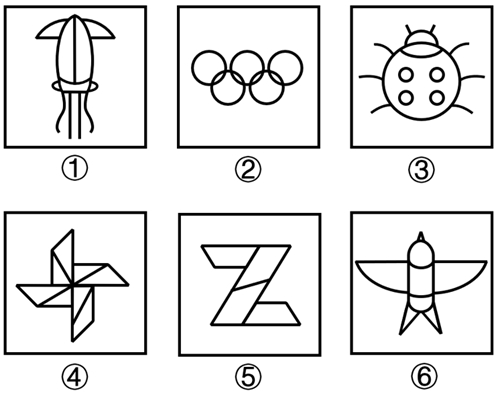
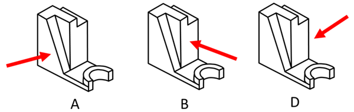
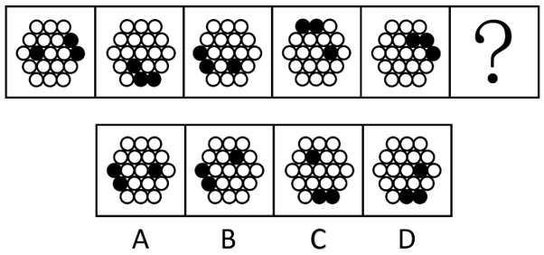
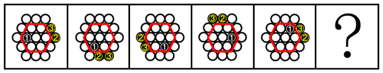

# 2024年河北省公务员录用考试《行测》题（网友回忆版）

> 判断推理 · 35 题 · 河北 2024

## 第 1 题　qid 16593051 · 图形推理

把下面的六个图形分为两类，使每一类图形都有各自的共同特征或规律，分类正确的一项是：

- **A**. ①②③，④⑤⑥
- **B**. ①②⑤，③④⑥
- **C**. ①③⑥，②④⑤　✅
- **D**. ①④⑥，②③⑤

**答案**：C

**官方解析**

解析一：
元素组成不同，优先考虑属性规律。观察发现，题干图形有曲有直，可以考虑曲直性是否存在规律。图①③⑥中，图形的线条种类均为2（图形既有直线又有曲线）；图②④⑤中，图形的线条种类均为1（图形为纯曲线或纯直线），即图①③⑥为一组，图②④⑤为一组。
故正确答案为C。
解析二：
元素组成不同，优先考虑属性规律。观察发现，图①②③⑥均为轴对称图形，图⑤为中心对称图形，图④不是对称图形，没有答案。继续观察发现，题干出现生活化图形且封闭区域明显，考虑数量规律中的面数量。题干图形的面数量依次为7、9、7、8、4、8，图①②③的面数量均为奇数，图④⑤⑥的面数量均为偶数，即图①②③为一组，图④⑤⑥为一组。
故正确答案为A。
注：本题两种规律均不是非常严谨，分组分类按曲直线条种类数和数量奇偶分组考查都较少，大家了解基本解题思路即可，无需作为备考重点。

---

## 第 2 题　qid 16593023 · 图形推理

从所给四个选项中，选择最合适的一个填入问号处，使之呈现一定的规律性。

- **A**. A
- **B**. B
- **C**. C
- **D**. D　✅

**答案**：D

**官方解析**

九宫格横行观察无规律，但竖着看发现，相同线条重复出现，优先考虑样式规律中的加减同异。第一列图1和图2求异得到图3；经验证，第二列满足此规律；第三列应用此规律，故“？”处应选择图1和图2求异得到的图形，只有D项符合。
故正确答案为D。

---

## 第 3 题　qid 16593205 · 图形推理

左边为给定的立体图形，从任一角度观看，下面哪项不是该多面体的视图？

- **A**. A
- **B**. B
- **C**. C　✅
- **D**. D

**答案**：C

**官方解析**

本题考查三视图。如下图所示，A、B、D三项按图中箭头方向观察，均可看到，排除；

C项为从上往下观察该立体图形，看到的视图正中间应为一条长横线，如下图所示，该项视图错误，当选。

本题为选非题，故正确答案为C。

---

## 第 4 题　qid 16593026 · 图形推理

把下面的六个图形分为两类，使每一类图形都有各自的共同特征或规律，分类正确的一项是：

- **A**. ①④⑥，②③⑤
- **B**. ①②③，④⑤⑥
- **C**. ①⑤⑥，②③④　✅
- **D**. ①③⑤，②④⑥

**答案**：C

**官方解析**

本题为分组分类题目。元素组成不同，且题干出现很多等腰三角形，优先考虑对称性。观察发现，图②③④均是轴对称图形，图①⑤⑥均不是轴对称图形，即图①⑤⑥为一组，图②③④为一组。

故正确答案为C。

注1：可能有部分同学根据对称轴数量是1还是3将题干分为①③⑤一组和②④⑥一组，然而本题图①、图⑥均存在由斜线构成的阴影，考虑到斜线也是图形的一部分，而斜线之间并不对称，因此认为图①和图⑥均不是轴对称图形。此外，若认为图⑤存在从右上到左下的对称轴，则画出该“对称轴”后，可以发现“对称轴”两侧的线条并不完全对应等长，图⑤也不是轴对称图形。

注2：分组分类题目优先考虑两组图形分别具有各自的规律，无法分成具有各自规律的两组时，才考虑将图形分成一组具有该规律，一组不具有该规律。

---

## 第 5 题　qid 16593031 · 图形推理

从所给四个选项中，选择最合适的一个填入问号处，使之呈现一定的规律性。

- **A**. A
- **B**. B
- **C**. C　✅
- **D**. D

**答案**：C

**官方解析**

元素组成相同，优先考虑位置规律。观察发现，题干图形内圈和外圈的黑球数量均相同，优先内外分开看。如下图所示，标记为①的黑球在内圈每次逆时针移动一格，标记为②③的黑球在外圈每次顺时针移动三格，只有C项符合规律。

故正确答案为C。

---

## 第 6 题　qid 16592937 · 定义判断

正常化偏见，就是指大家对某个事物感到习惯后，就会产生安于现状、不愿意再去尝试新事物的惰性心理。
根据上述定义，下列不属于正常化偏见的是：

- **A**. 某些喜欢看西医的病人排斥看中医
- **B**. 上了年纪的老年人更倾向去菜市场买菜
- **C**. 只要吃外卖，小张就只使用某平台下单
- **D**. 当人们试吃样品满意后更有可能进店消费　✅

**答案**：D

**官方解析**

第一步：找出定义关键词。
“对某个事物感到习惯后”、“产生安于现状、不愿意再去尝试新事物的惰性心理”。
第二步：逐一分析选项。
A项：习惯看西医的病人会不愿意去尝试看中医，符合“对某个事物感到习惯后”、“产生安于现状、不愿意再去尝试新事物的惰性心理”，符合定义，排除；
B项：老年人更倾向去菜市场买菜，即老年人习惯了去菜市场而不愿意去别的地方（商超、线上平台等）买菜，符合“对某个事物感到习惯后”、“产生安于现状、不愿意再去尝试新事物的惰性心理”，符合定义，排除；
C项：小张只使用某一个平台下单点外卖，说明小张习惯了使用该平台而不愿意使用其他平台，符合“对某个事物感到习惯后”、“产生安于现状、不愿意再去尝试新事物的惰性心理”，符合定义，排除；
D项：人们试吃样品满意后会更有可能进店消费，人们进店消费是因为“试吃样品满意”，不符合“对某个事物感到习惯后”、“产生安于现状、不愿意再去尝试新事物的惰性心理”，不符合定义，当选。
本题为选非题，故正确答案为D。

---

## 第 7 题　qid 16593213 · 定义判断

“嗜睡”是一种睡眠失调现象，患者会持续感到极端疲倦，昏昏欲睡，往往会在毫无预警的情况下睡着，甚至是在活动中途突然入睡。“醉睡”则指酒醒后并没有完全清醒的状态，“醉睡”往往伴随混乱、迷惑、甚至暴力反应和失忆。
根据上述定义，下列选项未体现“嗜睡”或“醉睡”的是：

- **A**. 昨夜雨疏风骤，浓睡不消残酒
- **B**. 终日昏昏醉梦间，忽闻春尽强登山
- **C**. 老眠早觉常残夜，病力先衰不待年　✅
- **D**. 临川税驾忽数月，嗜睡爱闲常闭门

**答案**：C

**官方解析**

第一步：找出定义关键词。
嗜睡：“睡眠失调现象”、“持续感到极端疲倦，昏昏欲睡”、“在毫无预警的情况下睡着”；
醉睡：“酒醒后并没有完全清醒的状态”、“伴随混乱、迷惑、甚至暴力反应和失忆”。
第二步：逐一分析选项。
A项：诗句意思是昨夜雨下得稀疏，风刮得很急，酣睡一夜，然而醒来之后依然觉得还有一点酒意没有消尽，符合“酒醒后并没有完全清醒的状态”，符合“醉睡”定义，排除；
B项：诗句意思是整日昏昏沉沉恍若梦中，忽然发现春天即将过去便强打精神登山赏景，符合“睡眠失调现象”、“持续感到极端疲倦，昏昏欲睡”，符合“嗜睡”定义，排除；
C项：诗句意思是人老了之后晚上睡眠很少，常常很早就醒来，坐送残夜，等待天晓，因为有病，身体早早地衰老，恐怕不到致仕之年，就要告老还乡了，说的是年老之后睡眠变少，不符合定义，当选；
D项：诗句意思是在临川休息住宿一晃几个月过去了，喜欢睡觉热爱闲适不被打扰，所以经常闭门谢客，符合“持续感到极端疲倦，昏昏欲睡”，符合“嗜睡”定义，排除。
本题为选非题，故正确答案为C。

---

## 第 8 题　qid 16593020 · 定义判断

磁滞现象指的是磁场把未带磁性的铁磁性物质（如铁、钴、镍及其合金等）磁化，使之带有磁性，但外加磁场去除后，铁磁性物质的磁性也不会马上消除，仍保有磁性的现象。
根据上述定义，下列属于磁滞现象的是：

- **A**. 当水中溶解了某些铁磁性物质，水在强磁场下流过时，周围金属物体中会产生磁感应现象，金属中有电流流过
- **B**. 由导线将电池、小灯泡、电流表、开关连接成闭合电路，闭合开关时，灯泡亮暗、电流表指针的指向等都会有变化
- **C**. 电饭锅中的温控元件都有设置好的温度值，电饭锅运行达到一定温度后，感温磁钢会消磁，依靠弹簧的反作用力断开电源
- **D**. 把烧红的铁片放置在子午线的方向，使铁分子顺着地球磁场方向排列，达到磁化目的，之后挪动铁片，铁分子仍然按照磁场方向排列　✅

**答案**：D

**官方解析**

第一步：找出定义关键词。
“磁场把未带磁性的铁磁性物质(如铁、钴、镍及其合金等）磁化”、“外加磁场去除后，铁磁性物质的磁性也不会马上消除”。
第二步：逐一分析选项。
A项：带有铁磁性物质的水在强磁场下流过时，周围的金属物体会产生磁感应现象，但未提及磁场去除后，是否还会有磁感应现象，不符合“外加磁场去除后，铁磁性物质的磁性也不会马上消除”，不符合定义，排除；
B项：由导线将电池、小灯泡、电流表、开关连接成闭合电路，闭合开关时，灯泡亮暗、电流表指针指向会有变化，没有涉及磁化，不符合“磁场把未带磁性的铁磁性物质(如铁、钴、镍及其合金等）磁化”，不符合定义，排除；
C项：电饭锅运行达到设定温度后，感温磁钢会消磁，说明感温磁钢本身具有磁性，不符合“磁场把未带磁性的铁磁性物质(如铁、钴、镍及其合金等）磁化”，不符合定义，排除；
D项：把烧红的铁片放置在子午线方向，铁分子顺着地球磁场方向排列，磁场使铁片磁化，符合“磁场把未带磁性的铁磁性物质(如铁、钴、镍及其合金等）磁化”，挪动铁片后铁分子仍然按照磁场方向排列，说明铁片磁性没有马上消除，符合“外加磁场去除后，铁磁性物质的磁性也不会马上消除”，符合定义，当选。
故正确答案为D。

---

## 第 9 题　qid 16593013 · 定义判断

在统计学中，生态谬误是指用一种高层次的分析单位做调查，却用另一种低层次的分析单位做结论，即运用数据时错误地将整组的汇总结果应用到组内的单位中。
根据以上定义，下列属于生态谬误的是：

- **A**. 一项调研发现甲地居民的收入普遍比乙地居民的收入更高，由此认为甲地教师的收入高于乙地教师的收入　✅
- **B**. 服务业占比大的区域比服务业占比小的区域更容易吸引高层次人才，由此认为服务业占比大的区域高层次人才更多
- **C**. 某杂志开设了读者意见反馈邮箱，几天后收到28个不喜欢时装栏目的反馈邮件。某编辑认为有读者不喜欢，就一定有读者喜欢
- **D**. 某公司规定，上一年工资数额在公司前6%的要降低工资，小王上一年的工资低于公司的平均水平，可以推出小王今年的工资可能降低

**答案**：A

**官方解析**

第一步：找出定义关键词。
“运用数据时错误地将整组的汇总结果应用到组内的单位中”。
第二步：逐一分析选项。
A项：根据“甲地居民普遍比乙地居民的收入高”，得到“甲地教师比乙地教师的收入高”，即将整组数据的结果用来得到部分个体的结论，符合“运用数据时错误地将整组的汇总结果应用到组内的单位中”，符合定义，当选；
B项：根据“服务业占比大的区域更容易吸引高层次人才”，得到“服务业占比大的区域高层次人才更多”，前后均为服务业占比大的区域和服务业占比小的区域的对比，不符合“运用数据时错误地将整组的汇总结果应用到组内的单位中”，不符合定义，排除；
C项：根据“有28个不喜欢时装栏目的反馈邮件”，得到“有读者不喜欢，就一定有读者喜欢”，不涉及数据间的错误运用，不符合“运用数据时错误地将整组的汇总结果应用到组内的单位中”，不符合定义，排除；
D项：根据“小王上一年的工资低于公司的平均水平”，得到“小王今年的工资可能降低”，前后均为小王的工资，是根据过去的数据推导现在的情况，不符合“运用数据时错误地将整组的汇总结果应用到组内的单位中”，不符合定义，排除。
故正确答案为A。

---

## 第 10 题　qid 16593022 · 定义判断

湖陆风是指湖陆之间相互转换的热力环流现象。入夜以后，陆地降温速度比湖水快，近地面空气变冷变重，而湖水降温慢，温度比陆地高，空气暖而轻，形成上升气流，陆上气流流向湖心形成陆风。太阳升起后，陆地吸热和升温速度比湖水快，直至陆上空气升温形成上升气流，湖面空气流向陆地形成湖风。
根据上述定义，下列诗句最能体现湖陆风现象的是：

- **A**. 轮台九月风夜吼，一川碎石大如斗，随风满地石乱走
- **B**. 潮没具区薮，潦深云梦田。朝随北风去，暮逐南风旋　✅
- **C**. 鸱枭养子庭树上，曲墙空屋多旋风
- **D**. 鹊飞山月曙，蝉噪野风秋

**答案**：B

**官方解析**

第一步：找出定义关键词。
“湖陆之间相互转换的热力环流现象”。
第二步：逐一分析选项。
A项：诗句的意思是轮台九月整夜里狂风怒号，到处的碎石块块大如斗，狂风吹得斗大乱石满地走。诗句只涉及陆地上的风，没有涉及湖水，不符合“湖陆之间相互转换的热力环流现象”，不符合定义，排除；
B项：诗句的意思是潮水沉没于太湖，潮水沉没于云梦泽里的田地，早上顺着北风驾船进入湖中打鱼采菱，傍晚乘着南风，可以毫不费力地驾船回家。诗句描写了湖水和陆地之间风的形成情况，符合“湖陆之间相互转换的热力环流现象”，符合定义，当选；
C项：诗句的意思是庭院里的树上，凶猛的猫头鹰都养出了小雏；曲折的院墙，空荡的房屋，多有旋风翻卷。诗句只涉及陆地上的风，没有涉及湖水，不符合“湖陆之间相互转换的热力环流现象”，不符合定义，排除；
D项：诗句的意思是曙光微明，月挂西山，鹊鸟出林，寒蝉在初秋的野外晨风中嘶声噪鸣。诗句只涉及陆地上的风，没有涉及湖水，不符合“湖陆之间相互转换的热力环流现象”，不符合定义，排除。
故正确答案为B。

---

## 第 11 题　qid 16593009 · 定义判断

肿瘤侵犯，指的是肿块发展后引起相邻部位的反应和变化。肿瘤浸润，是指肿瘤细胞发展扩大透过原发部位的浆膜层转移到相邻组织和器官。肿瘤转移，指肿瘤由原发器官通过血液、淋巴等方式到达另一个远处器官。
根据上述定义，下列属于肿瘤侵犯的是：

- **A**. 宋阿姨近期体检发现患有乳腺癌，医生告知癌细胞已到达胸壁组织
- **B**. 经检查，老赵的肺部有五个毛玻璃结节，医生提醒他要定期复查
- **C**. 老王的胰腺肿瘤经过三个月的无效治疗已经蔓延到肝脏
- **D**. 老张肺部的肿块碰触心脏薄膜，引起心包积液　✅

**答案**：D

**官方解析**

第一步：找出定义关键词。
肿瘤侵犯：“肿块发展后引起相邻部位的反应和变化”；
肿瘤浸润：“肿瘤细胞发展扩大透过原发部位的浆膜层转移到相邻组织和器官”；
肿瘤转移：“肿瘤由原发器官通过血液、淋巴等方式到达另一个远处器官”。
第二步：逐一分析选项。
A项：癌细胞到达了胸壁组织，但无法确定是否引起了胸壁组织的反应和变化，不符合“引起相邻部位的反应和变化”，不符合“肿瘤侵犯”定义，排除；
B项：检查出老赵的肺部有结节，并未涉及其他部位，不符合“肿块发展后引起相邻部位的反应和变化”，不符合“肿瘤侵犯”定义，排除；
C项：胰腺肿瘤蔓延到了肝脏，但无法确定是否引起了肝脏的反应和变化，不符合“引起相邻部位的反应和变化”，不符合“肿瘤侵犯”定义，排除；
D项：肺部肿块碰触心脏薄膜，符合“肿块发展”，引起心包积液，符合“引起相邻部位的反应和变化”，符合“肿瘤侵犯”定义，当选。
故正确答案为D。

---

## 第 12 题　qid 16592981 · 定义判断

合同法大多属于缺省规则，当事人可以就同一事项做出不同约定，只有在没有约定时，才把合同法规定填补到合同中。缺省规则包括两种类型：一种是符合当事人预期的正向缺省规则，当事人无需事无巨细地对合同进行约定，只要适用合同法规定就能实现合同目的，有利于节约订立合同的成本；另一种是与当事人预期相悖的反向缺省规则，适用该类缺省规则会产生与合同目的相反的结果，以督促当事人事先对相关事项做出约定。
根据上述定义，下列属于反向缺省规则的是：

- **A**. 标的数量没有约定的，视为合同没有成立　✅
- **B**. 质量要求没有约定的，按照强制性国家标准履行
- **C**. 价款没有约定的，按照缔约时履行地的市场价格履行
- **D**. 履行方式没有约定的，按照有利于实现合同目的的方式履行

**答案**：A

**官方解析**

第一步：找出定义关键词。
正向缺省规则：“当事人无需事无巨细地对合同进行约定”、“只要适用合同法规定就能实现合同目的”；
反向缺省规则：“与当事人预期相悖”、“适用该类缺省规则会产生与合同目的相反的结果”。
第二步：逐一分析选项。
A项：标的数量没有约定的，视为合同没有成立，当事人签订合同，应是期望合同可以继续生效，符合“与当事人预期相悖”、“适用该类缺省规则会产生与合同目的相反的结果”，符合“反向缺省规则”定义，当选；
B项：质量要求没有约定的，按照强制性国家标准履行，说明合同对这方面即便是没有做出约定，该情况下也可以使用合同法规定继续履行合同，符合“当事人无需事无巨细地对合同进行约定”、“只要适用合同法规定就能实现合同目的”，符合“正向缺省规则”定义，不符合“反向缺省规则”定义，排除；
C项：价款没有约定的，按照缔约时履行地的市场价格履行，说明合同对这方面即便是没有做出约定，该情况下也可以使用合同法规定继续履行合同，符合“当事人无需事无巨细地对合同进行约定”、“只要适用合同法规定就能实现合同目的”，符合“正向缺省规则”定义，不符合“反向缺省规则”定义，排除；
D项：履行方式没有约定的，按照有利于实现合同目的的方式履行，说明合同对这方面即便是没有做出约定，该情况下也可以使用合同法规定继续履行合同，符合“当事人无需事无巨细地对合同进行约定”、“只要适用合同法规定就能实现合同目的”，符合“正向缺省规则”定义，不符合“反向缺省规则”定义，排除。
故正确答案为A。

---

## 第 13 题　qid 16593209 · 定义判断

政策合成谬误，是指从各部门来看，每项政策都是对的，组合起来实施时却是错的。政策分解谬误，是指不该分解的系统性任务被分解了，有的分解到各部门、各地方，有的分解到各个时间段。
根据上述定义，下列属于政策分解谬误的是：

- **A**. 为了让居民买得起房，某省各部门实施了一系列举措调控房价，几年后该省的房地产商数量明显减少
- **B**. 为了推动乡村振兴，某乡镇决定帮扶辖区内村民养殖黑山羊，一年后黑山羊数量剧增，导致附近山林遭到破坏
- **C**. 为了加快新能源产业的发展，某省出台政策鼓励居民购买电动汽车，半年后发现，该省范围内充电桩数量严重不足
- **D**. 某地政府欲出台一部环境卫生管理条例，其中各部分内容被分配到相关部门草拟，但最终统筹草案后发现各部分之间难以衔接　✅

**答案**：D

**官方解析**

第一步：找出定义关键词。
政策合成谬误：“从各部门来看，每项政策都是对的”、“组合起来实施时却是错的”；
政策分解谬误：“不该分解的系统性任务被分解了”、“有的分解到各部门、各地方，有的分解到各个时间段”。
第二步：逐一分析选项。
A项：为了让居民买得起房，某省各部门实施了一系列举措调控房价，符合“从各部门来看，每项政策都是对的”，但几年后该省的房地产商数量明显减少，说明最终的结果可能并不好，符合“组合起来实施时却是错的”，符合“政策合成谬误”定义，不符合“政策分解谬误”定义，排除；
B项：某乡镇决定帮扶辖区内村民养殖黑山羊，没有体现出政策被分解，不符合“不该分解的系统性任务被分解了”，不符合“政策分解谬误”定义，排除；
C项：某省出台政策鼓励居民购买电动汽车，没有体现出政策被分解，不符合“不该分解的系统性任务被分解了”，不符合“政策分解谬误”定义，排除；
D项：某地政府欲出台一部环境卫生管理条例，是一个系统性的任务，其中各部分内容被分配到相关部门草拟，符合“有的分解到各部门、各地方，有的分解到各个时间段”，但最终统筹后发现各部分难以衔接，说明该任务不应该被分解，符合“不该分解的系统性任务被分解了”，符合“政策分解谬误”定义，当选。
故正确答案为D。

---

## 第 14 题　qid 16592979 · 定义判断

相变指的是物质微观粒子在不同聚集状态间的转变。在等温等压条件下，从一相转变为另一相时吸收或放出的热量是相变潜热。第一类相变是指伴有相变潜热和体积突变的相变。第二类相变则不伴有相变潜热和体积突变，但有热容跃变。
根据上述定义，下列属于第一类相变的是：

- **A**. 
热致变色印刷工艺采用遇热可产生色变的物质，如金属碘化物、络合物等，制成油墨在印品上形成色变层

- **B**. 
在1个大气压的情况下，1公斤的冰转变成同温度的水，要吸收79.6千卡的热量，与此同时体积亦收缩
　✅
- **C**. 
含羞草叶茎部的叶褥含有很多水分，当叶片振动时，叶褥中的水分流向其它地方，叶片逐渐干瘪蜷缩到一起

- **D**. 
核磁共振成像是通过使人体本身的磁场和仪器自身的磁性物质相互作用形成检测显影，进而查看到病变的位置

**答案**：B

**官方解析**

第一步：找出定义关键词。

相变：“物质微观粒子在不同聚集状态间的转变”；

相变潜热：“在等温等压条件下”、“从一相转变为另一相时”、“吸收或放出的热量”；

第一类相变：“伴有相变潜热和体积突变的相变”；

第二类相变：“不伴有相变潜热和体积突变，但有热容跃变”。

第二步：逐一分析选项。

A项：热致变色印刷工艺采用“遇热”可产生色变的物质，“遇热”表明温度发生了变化，不符合“在等温等压条件下”，不符合“相变潜热”定义，故也不符合“伴有相变潜热和体积突变的相变”，不符合“第一类相变”定义，排除；

B项：在1个大气压的情况下，符合“在等温等压条件下”，1公斤的冰转变成同温度的水，符合“从一相转变为另一相时”，要吸收79.6千卡的热量，符合“吸收或放出的热量”，符合“相变潜热”定义，与此同时体积亦收缩，符合“伴有相变潜热和体积突变的相变”，符合“第一类相变”定义，当选；

C项：当含羞草的叶片振动时，叶褥中的水分流向其它地方，叶片逐渐干瘪蜷缩到一起，不符合“物质微观粒子在不同聚集状态间的转变”，不符合“相变”定义，故也不符合“第一类相变”定义，排除；

D项：核磁共振成像是通过使人体本身的磁场和仪器自身的磁性物质相互作用形成检测显影，进而查看到病变的位置，不符合“物质微观粒子在不同聚集状态间的转变”，不符合“相变”定义，故也不符合“第一类相变”定义，排除。

故正确答案为B。

---

## 第 15 题　qid 16592930 · 定义判断

生物学重复是指对不同生物个体或者不同生物群体的样品采用相同的处理方式进行实验。技术重复则是指对同一样品进行的多次相同实验。
根据上述定义，下列属于生物学重复的是：

- **A**. 采集小王的血样一次并采用三种不同方式分别进行一次检测
- **B**. 采用三种不同方式对分三次采集的小王血样各进行一次检测
- **C**. 采集小王、小李、小张三人的血样并用同样方式分别进行一次检测　✅
- **D**. 采集小王、小李、小张三人的血样混合后用三种方式进行三次检测

**答案**：C

**官方解析**

第一步：找出定义关键词。
生物学重复：“不同生物个体或者不同生物群体的样品”、“采用相同的处理方式”；
技术重复：“同一样品”、“多次相同实验”。
第二步：逐一分析选项。
A项：仅采集小王的血样一次，不符合“不同生物个体或者不同生物群体的样品”，采用三种不同方式，不符合“采用相同的处理方式”，不符合“生物学重复”定义，排除；
B项：采用三种不同方式，不符合“采用相同的处理方式”，分三次采集的都是小王血样，不符合“不同生物个体或者不同生物群体的样品”，不符合“生物学重复”定义，排除；
C项：采集小王、小李、小张三人的血样，符合“不同生物个体或者不同生物群体的样品”，用同样方式分别进行一次检测，符合“采用相同的处理方式”，符合“生物学重复”定义，当选；
D项：用三种方式进行三次检测，不符合“采用相同的处理方式”，不符合“生物学重复”定义，排除。
故正确答案为C。

---

## 第 16 题　qid 16593092 · 类比推理

政通人和：国泰民安

- **A**. 深思熟虑：不假思索
- **B**. 星罗棋布：漫山遍野
- **C**. 心领神会：心照不宣
- **D**. 奋起直追：迎头赶上　✅

**答案**：D

**官方解析**

第一步：判断题干词语间逻辑关系。
政通人和是指政事通达，人心和顺，形容国家稳定，人民安乐；国泰民安是指国家太平，人民安乐，二者为近义关系。
第二步：判断选项词语间逻辑关系。
A项：深思熟虑是指反复深入细致地考虑；不假思索形容做事答话敏捷、熟练，用不着考虑，二者为反义关系，与题干逻辑关系不一致，排除；
B项：星罗棋布是指像天空的星星和棋盘上的棋子那样分布着，形容数量很多，分布很广；漫山遍野是指山上和田野里到处都是，形容极多，二者为近义关系，与题干逻辑关系一致，保留；
C项：心领神会是指对方没有明说，心里已经领会；心照不宣是指彼此心里明白，而不公开说出来，二者是近义关系，与题干逻辑关系一致，保留；
D项：奋起直追是指振作起来，紧紧赶上去；迎头赶上是指加紧追过最前面的，二者是近义关系，与题干逻辑关系一致，保留。
对比B、C、D三项，题干政通人和、国泰民安均为褒义词，B项星罗棋布、漫山遍野均为中性词，C项心领神会是褒义词，心照不宣是中性词，D项奋起直追、迎头赶上均为褒义词，故D项和题干逻辑关系更为一致。
故正确答案为D。

---

## 第 17 题　qid 16593027 · 类比推理

兵符：信物

- **A**. 七律：绝句
- **B**. 汉字：偏旁
- **C**. 干戈：战争
- **D**. 寒露：节气　✅

**答案**：D

**官方解析**

第一步：判断题干词语间逻辑关系。
兵符是古代帝王授予兵权和调发军队的信物，兵符是一种信物，二者为种属关系。
第二步：判断选项词语间逻辑关系。
A项：七律是律诗的一种，绝句和律诗均是格律诗的一种，七律和绝句不是种属关系，与题干逻辑关系不一致，排除；
B项：偏旁是组成汉字的一部分，二者为组成关系，与题干逻辑关系不一致，排除；
C项：干为防具，戈为武器，二者均为古代兵器，因此后以“干戈”用作兵器的通称，后来引申为指战争，干戈和战争为比喻象征义，与题干逻辑关系不一致，排除；
D项：寒露，是二十四节气之第十七个节气，秋季的第五个节气，寒露是一种节气，二者为种属关系，与题干逻辑关系一致，当选。
故正确答案为D。

---

## 第 18 题　qid 16593162 · 类比推理

前因后果：因果

- **A**. 内忧外患：忧患
- **B**. 南征北战：征战
- **C**. 左顾右盼：顾盼
- **D**. 有始无终：始终　✅

**答案**：D

**官方解析**

第一步：判断题干词语间逻辑关系。
前因后果指的是事物的因果报应，后泛指整个事件；因果指的是原因与结果的关系，二者没有语义关系，考虑拆分。“前”和“后”是反义关系，“因”和“果”组成第二个词，分别代表原因和结果两个不同的方面，且先“因”后“果”。
第二步：判断选项词语间逻辑关系。
A项：“内”和“外”是反义关系，但是“忧”和“患”指的都是忧虑的事情，二者为近义关系，与题干逻辑关系不一致，排除；
B项：“南”和“北”是反义关系，但是“征”和“战”指的都是出发去作战，二者为近义关系，与题干逻辑关系不一致，排除；
C项：“左”和“右”是反义关系，但是“顾”和“盼”指的都是看，二者为近义关系，与题干逻辑关系不一致，排除；
D项：“有”和“无”是反义关系，“始”和“终”组成第二个词，分别代表开始和结束两个不同的方面，且先“始”后“终”，与题干逻辑关系一致，当选。
故正确答案为D。

---

## 第 19 题　qid 16593036 · 类比推理

牡丹花：牵牛花

- **A**. 金枪鱼：八爪鱼
- **B**. 东北菜：黄花菜
- **C**. 布谷鸟：啄木鸟　✅
- **D**. 变色龙：霸王龙

**答案**：C

**官方解析**

第一步：判断题干词语间逻辑关系。
“牡丹花”和“牵牛花”是两种不同的花，二者为并列关系。
第二步：判断选项词语间逻辑关系。
A项：“金枪鱼”是鱼类，而“八爪鱼”是软体动物，二者不是并列关系，与题干逻辑关系不一致，排除；
B项：“东北菜”是东北地区的本土菜系，“黄花菜”是一种可以食用的植物，二者不是并列关系，与题干逻辑关系不一致，排除；
C项：“布谷鸟”和“啄木鸟”是两种不同的鸟，二者为并列关系，与题干逻辑关系一致，当选；
D项：“变色龙”是一种爬行动物，“霸王龙”是一种恐龙，而变色龙不是恐龙，二者不是并列关系，与题干逻辑关系不一致，排除。
故正确答案为C。

---

## 第 20 题　qid 16593007 · 类比推理

锁骨：肋骨：坐骨

- **A**. 头脑：头皮：头发
- **B**. 腹腔：口腔：鼻腔
- **C**. 盲肠：大肠：直肠
- **D**. 颈椎：胸椎：腰椎　✅

**答案**：D

**官方解析**

第一步：判断题干词语间逻辑关系。
锁骨、肋骨、坐骨是三种不同的人体骨骼，三者为并列关系。
第二步：判断选项词语间逻辑关系。
A项：头脑由头发、头皮、肌肉、骨骼和脑体组成，后两词均与第一词构成组成关系，与题干逻辑关系不一致，排除；
B项：腹腔、口腔、鼻腔是三种不同的人体部位，三者为并列关系，与题干逻辑关系一致，保留；
C项：大肠是消化管的下段，可分为盲肠、阑尾、结肠、直肠和肛管5部分，第一词与第三词为并列关系，且均与第二词构成组成关系，与题干逻辑关系不一致，排除；
D项：颈椎、胸椎、腰椎是三种不同的椎骨，三者为并列关系，与题干逻辑关系一致，保留。
对比B、D两项，题干中锁骨、肋骨、坐骨所在的位置依次为从上到下，B项中腹腔、口腔、鼻腔所在的位置依次为从下到上，而D项中颈椎、胸椎、腰椎所在的位置依次为从上到下，因此D项与题干逻辑关系更为一致，当选。
故正确答案为D。

---

## 第 21 题　qid 16593015 · 类比推理

服装：唐装：西装

- **A**. 刷牙：牙刷：牙膏
- **B**. 豪车：赛车：轿车
- **C**. 旗帜：国旗：红旗
- **D**. 武术：太极拳：咏春拳　✅

**答案**：D

**官方解析**

第一步：判断题干词语间逻辑关系。
唐装和西装是两种不同的服装，后两词为并列关系，且均与第一词构成种属关系。
第二步：判断选项词语间逻辑关系。
A项：牙刷和牙膏是刷牙时配套使用的工具，后两词为配套使用关系，与题干逻辑关系不一致，排除；
B项：豪车、赛车和轿车是从不同的划分角度命名的汽车，三者互为交叉关系，与题干逻辑关系不一致，排除；
C项：有的国旗是红旗，有的国旗不是红旗，有的红旗是国旗，有的红旗不是国旗，后两词为交叉关系，与题干逻辑关系不一致，排除；
D项：太极拳和咏春拳是两种不同的武术，后两词为并列关系，且均与第一词构成种属关系，与题干逻辑关系一致，当选。
故正确答案为D。

---

## 第 22 题　qid 16593206 · 类比推理

泡沫经济：实体经济：通货膨胀

- **A**. 生态农业：传统农业：稻田养鱼
- **B**. 清洁能源：传统能源：污染减少　✅
- **C**. 生理反应：心理反应：望梅止渴
- **D**. 自然现象：社会现象：火山爆发

**答案**：B

**官方解析**

第一步：判断题干词语间逻辑关系。
泡沫经济指因投机交易极度活跃，金融证券、房地产等的市场价格脱离实际价值大幅上涨，造成表面繁荣的经济现象；实体经济指一个国家生产的商品价值总量，是人们通过思想、使用工具在地球上创造的经济；当泡沫经济越多而实体经济越少时，就会产生通货膨胀的现象，三者为因果对应关系。
第二步：判断选项词语间逻辑关系。
A项：生态农业是指按照生态学原理，应用现代科学技术进行集约经营管理的综合农业生产体系，传统农业是指采用传统手工劳动方式和生产技术的农业，二者为并列关系，稻田养鱼是一种生态农业，二者为种属关系，与题干逻辑关系不一致，排除；
B项：清洁能源是指开发利用过程中不产生或很少产生污染物的能源，如风能、水能、太阳能、地热能等，传统能源是指已经大规模生产和广泛利用的能源，当使用的清洁能源越多而传统能源越少时，能让污染减少，三者为因果对应关系，与题干逻辑关系一致，当选；
C项：生理反应是个体受到外界刺激而使机体有所反应的一种紧张状态，心理反应是指人们在面对客观事物时产生的主观体验，包括情感、思维和行为等方面的变化，二者为并列关系，望梅止渴是一种生理反应，二者为种属关系，与题干逻辑关系不一致，排除；
D项：自然现象是指自然界中由于大自然的运作规律自发形成的某种状况，社会现象是指所有与同物种共同体有关的活动产生、存在和发展密切联系的现象，二者为并列关系，火山爆发是一种自然现象，二者为种属关系，与题干逻辑关系不一致，排除。
故正确答案为B。

---

## 第 23 题　qid 16592936 · 类比推理

热传递：热传导：热辐射

- **A**. 隔离：冷却：灭火
- **B**. 混合物：化合物：纯净物
- **C**. 播种：撒播：条播　✅
- **D**. 说明文：举例子：作比较

**答案**：C

**官方解析**

第一步：判断题干词语间逻辑关系。
热传递是物理学上的一个物理现象，是指由于温度差引起的热能传递现象，热传递主要存在三种基本形式：热传导、热辐射和热对流。热传导和热辐射为并列关系，分别与热传递构成种属关系。
第二步：判断选项词语间逻辑关系。
A项：隔离和冷却是两种不同的灭火方式，二者为并列关系，与题干逻辑关系不一致，排除；
B项：混合物是指由两种或两种以上的单质或化合物混合而成的物质，化合物是指由两种或两种以上不同元素组成的纯净物，纯净物是指由一种单质或一种化合物组成的聚合物。混合物与纯净物为并列关系，化合物与纯净物为种属关系，与题干逻辑关系不一致，排除；
C项：撒播是指把作物的种子均匀地撒在地里，必要时进行覆土的播种方式，条播是指沿着一条浅犁沟撒布种子的播种方式。撒播和条播是两种不同的播种方式，二者为并列关系，分别与播种构成种属关系，与题干逻辑关系一致，当选；
D项：举例子和作比较是写说明文采用的两种不同的写作手法，二者为并列关系，分别与说明文构成对应关系，与题干逻辑关系不一致，排除。
故正确答案为C。

---

## 第 24 题　qid 16593000 · 类比推理

缘木求鱼 对于 （    ） 相当于 （    ） 对于 抱薪救火

- **A**. 事与愿违 抽薪止沸
- **B**. 南辕北辙 通宵达旦
- **C**. 刻舟求剑 纵风止燎　✅
- **D**. 扬汤止沸 凿壁偷光

**答案**：C

**官方解析**

逐一代入选项。
A项：“缘木求鱼”指爬上树去找鱼，比喻行事的方向、方法不对，一定达不到目的，“事与愿违”指事情的发展与主观愿望相反，二者无明显逻辑关系；“抽薪止沸”意思是抽掉锅底下的柴火，使锅里的水不再翻滚，比喻从根本上解决问题，“抱薪救火”比喻因为方法不对，虽然有心消灭祸患，结果反而使祸患扩大，二者是反义关系，前后逻辑关系不一致，排除；
B项：“缘木求鱼”指爬上树去找鱼，比喻行事的方向、方法不对，一定达不到目的，“南辕北辙”指心里想往南去，却驾车往北走，比喻行动和目的相反，二者无明显逻辑关系；“通宵达旦”指的是从入夜直到天亮，“抱薪救火”比喻因为方法不对，虽然有心消灭祸患，结果反而使祸患扩大，二者无明显逻辑关系，前后逻辑关系不一致，排除；
C项：“缘木求鱼”指爬上树去找鱼，比喻行事的方向、方法不对，一定达不到目的，“刻舟求剑”比喻看问题做事情死板不灵活，不知情随势变，二者是近义关系；“纵风止燎”指的是用鼓风的方法灭火，比喻本欲消弭其事，却反而助长其声势，“抱薪救火”比喻因为方法不对，虽然有心消灭祸患，结果反而使祸患扩大，二者是近义关系，前后逻辑关系一致，当选；
D项：“缘木求鱼”指爬上树去找鱼，比喻行事的方向、方法不对，一定达不到目的，“扬汤止沸”指把锅里烧的沸水舀起来再倒回去，想叫它不沸腾，比喻办法不对头，不能从根本上解决问题，二者是近义关系；“凿壁偷光”原指西汉匡衡凿穿墙壁引邻舍之烛光读书，后用来形容家贫而读书刻苦，“抱薪救火”比喻因为方法不对，虽然有心消灭祸患，结果反而使祸患扩大，二者无明显逻辑关系，前后逻辑关系不一致，排除。
故正确答案为C。

---

## 第 25 题　qid 16593030 · 类比推理

数字经济 对于 （    ） 相当于 （    ） 对于 人工智能

- **A**. 信息工具 家用电器
- **B**. 信息技术 无人驾驶　✅
- **C**. 数字资源 现代农业
- **D**. 数字货币 远程医疗

**答案**：B

**官方解析**

逐一代入选项。
A项：数字经济是以新一代信息技术为依托的一种新经济形态，数字经济一定需要利用信息工具，二者为必然利用的对应关系；家用电器可能需要利用人工智能，二者为或然利用的对应关系，前后逻辑关系不一致，排除；
B项：数字经济一定需要利用信息技术，二者为必然利用的对应关系；无人驾驶一定需要利用人工智能，二者为必然利用的对应关系，前后逻辑关系一致，当选；
C项：数字经济一定需要利用数字资源，二者为必然利用的对应关系；现代农业可能需要利用人工智能，二者为或然利用的对应关系，前后逻辑关系不一致，排除；
D项：数字经济的发展导致了数字货币的产生，二者为产物的对应关系；远程医疗可能需要利用人工智能，二者为或然利用的对应关系，前后逻辑关系不一致，排除。
故正确答案为B。

---

## 第 26 题　qid 16592994 · 逻辑判断

白居易在《荔枝图序》中言道：“若离本枝，一日而色变，二日而香变，三日而味变，四五日外，色香味尽去矣。”研究表明，荔枝难以保鲜是因为果实的呼吸强度很高，导致果实品质急剧下降。
以下哪项如果为真，最能支持上述研究结论？

- **A**. 荔枝的可食用部位不是像桃子那样的果皮，而是“假果皮”，它与外皮之间没有直接的维管束相连，外皮失水时不能直接从果肉处获得补充
- **B**. 荔枝离枝后会继续分解糖分：氧气充足时，糖分会分解为二氧化碳；氧气不足时，糖分会转化为一些影响风味的醇、醛类物质　✅
- **C**. 荔枝自身会不断产生乙烯，加速果实成熟甚至腐烂，自然更容易变质
- **D**. 荔枝花能产生花蜜，并且它们的蜜腺很发达，是很好的蜜源植物

**答案**：B

**官方解析**

第一步：找出论点和论据。
论点：荔枝难以保鲜是因为果实的呼吸强度很高，导致果实品质急剧下降。
论据：无。
本题只有论点没有论据，加强优先考虑补充论据，即解释原因或举例子。
第二步：逐一分析选项。
A项：该项讨论的是荔枝的可食用部位是“假果皮”以及外皮失水时的情况，但外皮失水与论点中果实的呼吸强度无明确关联，话题不一致，无法加强，排除；
B项：该项讨论的是荔枝离枝后会继续分解糖分，以及分别在氧气充足时和氧气不足时的糖分转化情况，说明荔枝的果实确实存在呼吸作用，补充论据，可以加强，当选；
C项：该项讨论的是荔枝自身不断产生的乙烯会导致其变质，但乙烯的产生与论点中果实的呼吸强度无明确关联，话题不一致，无法加强，排除；
D项：该项讨论的是荔枝花能产生花蜜，与论点中果实的呼吸强度完全无关，话题不一致，无法加强，排除。
故正确答案为B。

---

## 第 27 题　qid 16593211 · 类比推理

学校计划开展暑期夏令营活动，就陈老师和林老师是否担任夏令营带队老师，几个家长纷纷猜测：
吴妈妈：如果陈老师没去带队，林老师肯定也没去；
李妈妈：陈老师是这个夏令营活动的策划者，她一定会去带队；
郑妈妈：你们等着看吧，陈老师和林老师至少有一个人会去；
张妈妈：我认为林老师会去带队，陈老师要回家探亲不会去。
结果发现其中两个妈妈猜对了，两个妈妈猜错了。请问猜对了的妈妈是：

- **A**. 李妈妈和郑妈妈
- **B**. 吴妈妈和张妈妈
- **C**. 吴妈妈和李妈妈
- **D**. 郑妈妈和张妈妈　✅

**答案**：D

**官方解析**

第一步：分析题干找关系。

吴妈妈：陈老师带队林老师带队；

李妈妈：陈老师带队；

郑妈妈：陈老师带队 或 林老师带队；

张妈妈：林老师带队 且 陈老师带队。

吴妈妈和张妈妈的猜测为矛盾关系，必有一真一假。

第二步：看其余。

根据题干可知，四人的猜测为两真两假，故李妈妈和郑妈妈也必有一真一假。若李妈妈的猜测为真，那么郑妈妈的猜测也为真，不符合一真一假，因此李妈妈的猜测为假，郑妈妈的猜测为真，即陈老师没带队，再结合“或关系否一推一”可知，林老师带队，进而可以得出张妈妈的猜测为真。

故正确答案为D。

---

## 第 28 题　qid 16593021 · 逻辑判断

对世界上最常见的火山类型而言，含水量较高的岩浆往往储存在地壳更深处。水在很大程度上引发并助长了火山爆发，岩浆的含水量越多，岩浆上升得越快，喷发就越猛烈。此时，岩浆的浮力不再是岩浆喷发的关键，岩浆中越多的水分含量才意味着越多的气泡和潜在更猛烈的喷发。
以下哪项如果为真，最能加强上述研究发现？

- **A**. 岩浆之所以能通过地壳裂缝上升，是因为岩浆比周围岩石的浮力更大
- **B**. 若除水外还有额外的浮力，也会在火山被触发时将更多的岩浆带到地面
- **C**. 水和岩浆的混合物在上升过程中有时会发生脱气现象，使混合物变得更加粘稠，导致上升缓慢甚至停滞
- **D**. 水和岩浆的混合物储存在火山中，当岩浆上升到地表附近后，压力下降就会形成气泡，气泡迅速膨胀导致岩浆喷射而出　✅

**答案**：D

**官方解析**

第一步：找出论点和论据。
论点：水在很大程度上引发并助长了火山爆发，岩浆的含水量越多，岩浆上升得越快，喷发就越猛烈。此时，岩浆的浮力不再是岩浆喷发的关键，岩浆中越多的水分含量才意味着越多的气泡和潜在更猛烈的喷发。
论据：无。
本题只有论点，没有论据，加强优先考虑补充论据。
第二步：逐一分析选项。
A项：该项说的是因为岩浆浮力更大，所以岩浆能上升，强调了浮力对岩浆上升的重要性，而论点说的是岩浆的含水量越多则岩浆喷发得越猛烈，浮力并不是岩浆喷发的关键，削弱论点，无法加强，排除；
B项：该项说的是除水之外的浮力对岩浆喷发的影响，而论点讨论的是岩浆的含水量对岩浆喷发的影响，为无关项，无法加强，排除；
C项：该项说的是水和岩浆的混合物有时会导致岩浆上升缓慢，而论点说的是岩浆的含水量越多则岩浆喷发得越猛烈，削弱论点，无法加强，排除；
D项：该项说的是水和岩浆的混合物在上升到地表附近后会因为压力下降形成气泡，气泡迅速膨胀导致岩浆喷射，解释了水越多就意味着气泡越多，进而会造成岩浆的猛烈喷发，补充论据，可以加强，当选。
故正确答案为D。

---

## 第 29 题　qid 16593005 · 逻辑判断

长期只给中老年人提供一些对大脑神经系统有益的营养素，如DHA、抗氧化剂等，对预防脑力衰老似乎没有明显的效果，但改变整体的膳食模式则有利于延缓中老年人的认知退化。研究者发现地中海膳食和得舒膳食模式能保护老年人的认知能力。绿叶蔬菜、鱼类和全谷物是这两种膳食模式强调要充分摄入的三类核心食物。此外，还要严格限制油炸、高盐、甜食饮料等，因为它们不利于预防肥胖和三高，而这些则都是加剧认知退化的重要因素。
以下哪项如果为真，最能支持上述研究发现？

- **A**. 食用蔬果总量高的老年人认知能力保持得较好
- **B**. 地中海膳食、得舒膳食等饮食模式有利于延缓认知退化
- **C**. 预防脑力衰老仅靠摄入营养素或改变整体的膳食模式是不够的
- **D**. 全谷物有利于控制血糖，绿叶蔬菜有利于改善血脂，鱼类所含的脂肪酸更易消化　✅

**答案**：D

**官方解析**

第一步：找出论点和论据。
论点：地中海膳食和得舒膳食模式能保护老年人的认知能力。
论据：绿叶蔬菜、鱼类和全谷物是这两种膳食模式强调要充分摄入的三类核心食物。此外，还要严格限制油炸、高盐、甜食饮料等，因为它们不利于预防肥胖和三高，而这些则都是加剧认知退化的重要因素。
本题论点和论据都在说地中海膳食和得舒膳食模式与老年人认知之间的关系，二者话题一致，加强优先考虑补充论据。
第二步：逐一分析选项。
A项：该项说的是蔬果总量高的老年人认知能力保持得较好，但论点中的地中海膳食和得舒膳食模式并没有强调摄入的蔬果总量要高，话题不一致，无法加强，排除；
B项：该项说的是地中海膳食、得舒膳食等饮食模式有利于延缓认知退化，但没有详细展开说明这两种饮膳食模式如何延缓认知退化，只是简单对论点进行重复，可以加强，保留；
C项：该项说的是预防脑力衰老不能仅靠摄入营养素或改变整体的膳食模式，而论点说的是地中海膳食和得舒膳食模式能否保护老年人的认知能力，话题不一致，无法加强，排除；
D项：该项说的是全谷物、绿叶蔬菜、鱼类三种食物分别可以控制血糖、改善血脂、易被消化，说明按照论点中的两种膳食模式摄入的三类核心食物可以帮助控制三高（高血压、高血糖、高血脂），而论据中提到“三高是加剧认知退化的重要因素”，这表明地中海膳食和得舒膳食模式确实能延缓认知退化、保护老年人的认知能力，解释原因，可以加强，保留。
对比B、D两项，B项只是重复论点，而D项解释说明了“膳食模式中的三类核心食物”与“三高”之间的关系，是对论证逻辑的补充，加强力度强于简单重复论点，故D项更为合适。
故正确答案为D。

---

## 第 30 题　qid 16593011 · 类比推理

某单位由于工作需要，本周六必须安排赵、钱、孙、李、周、吴、郑7名工作人员值班，每个人都要值半天班，上午安排4人一起值班，下午安排3人一起值班。值班人员的分配满足下列条件：
(1）赵和孙不在一起值班；
(2）周和孙不在一起值班；
(3）如果郑在下午值班，那么赵和李也在下午值班；
(4）或者钱在上午值班，或者郑在下午值班。
根据以上信息，必须在上午值班的工作人员是：

- **A**. 钱和郑　✅
- **B**. 赵和郑
- **C**. 赵和周
- **D**. 吴和孙

**答案**：A

**官方解析**

第一步：分析题干条件。

(1）赵和孙不在一起值班；

(2）周和孙不在一起值班；

(3）郑下午值班赵 且 李下午值班；

(4）钱上午值班 或 郑下午值班；

(5）上午4人值班，下午3人值班。

第二步：根据题干条件进行推理。

根据条件（1）（2）可知，赵和孙不在一起值班，周和孙也不在一起值班，那么赵和周在一起值班；结合条件（3），如果郑在下午值班，那么赵和李也在下午值班，此时周也应该在下午值班，下午值班的人数为4，与条件（5）矛盾，因此郑一定在上午值班；再结合条件（4），钱上午值班或郑下午值班，根据或关系“否一推一”可知，钱一定在上午值班，即钱和郑在上午值班。

故正确答案为A。

---

## 第 31 题　qid 16593029 · 逻辑判断

河西走廊西部的荒原地处内陆，气候干燥，大部分地方都是戈壁沙漠，绿洲面积仅占总面积的很小一部分。千百年来，这里留下了一座又一座的古城址，它们有的彼此连缀，仿佛庞大的星座，有的则间断闪耀，形成多层结构。专家认为，水源变化是形成多个古城址的原因。
以下哪项如果为真，最能支持上述专家的观点？

- **A**. 河西走廊西部的部分地区素有“世界风库”之称，每年三分之一的时间刮着七级以上大风
- **B**. 一旦水量减少，耕地很快会沙化，古城烟火无以为继，人们就会寻找新的绿洲再建一座城　✅
- **C**. 在1000多年的时间中，河西走廊骆驼城的地下水位下降了几十米
- **D**. 在河西走廊，古城都是依水而建

**答案**：B

**官方解析**

第一步：找出论点和论据。
论点：水源变化是形成多个古城址的原因。
论据：无。
本题只有论点，没有论据，加强优先考虑补充论据，即解释原因或举例子。
第二步：逐一分析选项。
A项：该项讨论的是河西走廊部分地区每年的刮风情况，而论点讨论的是水源变化是否是形成多个古城址的原因，话题不一致，无法加强，排除；
B项：该项讨论的是水量减少会引起耕地沙化，人们就会寻找新的绿洲再建一座城，所以一旦水源变化，那么就要换新城址，解释了为什么水源变化是形成多个古城址的原因，补充论据，可以加强，当选；
C项：该项讨论的是在1000多年中，河西走廊骆驼城地下水位的变化，但是不明确其他城址的水源变化，无法判断水源变化是否是形成多个古城址的原因，为不明确项，无法加强，排除；
D项：该项讨论的是在河西走廊，古城都是依水而建，说明河西走廊的古城都坐落在水源的附近，但是无法判断水源变化是否是形成多个古城址的原因，为不明确项，无法加强，排除。
故正确答案为B。

---

## 第 32 题　qid 16593018 · 逻辑判断

心理学家曾做过一个实验，将被试者分为两组，给他们看同一张交通事故的照片，并询问有关车速的问题。对第一组问“你认为是以多快的速度相撞的”，而对第二组则问“你认为是以多快的速度猛烈撞击到一起的”。后者是让人想到撞击非常猛烈的表达方式。一周后，再询问被试者“汽车的挡风玻璃是否撞碎了”（实际上并没有撞碎）。结果显示，回答“是”的人，第二组的比例比第一组多两倍以上。心理学家由此得出结论：人类的记忆并不是固定的，而是根据之后获取的信息而变化。
以下哪项如果为真，最能削弱心理学家的结论？

- **A**. 第二组被试者的人数比第一组的多
- **B**. 第二组被试者的记忆力本来就偏弱　✅
- **C**. 时隔一周再询问的合理性有待斟酌
- **D**. 两组被试者在认知水平上没有差距

**答案**：B

**官方解析**

第一步：找出论点和论据。
论点：人类的记忆并不是固定的，而是根据之后获取的信息而变化。
论据：让两组被试者看同一张交通事故的照片，并询问有关车速的问题。第二组的问题是让人想到撞击非常猛烈的表达方式。一周后，再询问被试者“汽车的挡风玻璃是否撞碎了”（实际上并没有撞碎）。结果显示，回答“是”的人，第二组的比例比第一组多两倍以上。
本题论据是用实验表明回答不同的问题对人的记忆力存在影响，论点是基于此得出的结论，二者话题一致，削弱优先考虑削弱论点，且论据是对比实验，也可指出实验起点不一致或实验不可靠。
第二步：逐一分析选项。
A项：该项指出两组被试者的人数存在差异，但实验对比的是各组中回答“是”的比例，与各组被试者的人数无关，为无关项，无法削弱，排除；
B项：该项指出第二组被试者的记忆力本来就“偏弱”，说明两组被试者的“记忆力”本身就存在差异，即实验起点不一致，可以削弱，当选；
C项：该项指出时隔一周再询问的合理性“有待斟酌”，不明确时隔一周再询问对被试者的回答是否会产生影响，为不明确项，无法削弱，排除；
D项：该项指出两组被试者在认知水平上没有差距，说明实验起点一致，为加强项，无法削弱，排除。
故正确答案为B。

---

## 第 33 题　qid 16592978 · 逻辑判断

与储存能量的白色脂肪细胞不同，棕色脂肪细胞会将能量以热的形式消耗掉。实验发现，正在死亡的棕色脂肪细胞会分泌出大量肌苷。接收到肌苷分子信号后，不仅周围的棕色细胞被激活，就连周围的白色脂肪细胞也被转化成棕色脂肪细胞。但是肌苷转运蛋白能将肌苷转至细胞内降低了细胞外的肌苷浓度，致使肌苷的“促燃”作用大打折扣。对照实验证实，喂食高能量饮食并同时使用肌苷转运蛋白抑制剂的小鼠仍然较瘦，且免受糖尿病的困扰。
由此可以推出：

- **A**. 肌苷能调节棕色脂肪细胞在生物体中的产热过程
- **B**. 棕色脂肪细胞有助于身体维持体温，抵御寒冬
- **C**. 刺激棕色脂肪细胞，能够增加身体能量燃烧　✅
- **D**. 干扰转运蛋白活性的物质可用于肥胖症治疗

**答案**：C

**官方解析**

日常结论题，根据题干信息逐一分析选项。
A项：根据第四句话“肌苷转运蛋白能将肌苷转至细胞内降低了细胞外的肌苷浓度，致使肌苷的‘促燃’作用大打折扣”可知，是“肌苷转运蛋白”可以调节产热过程，而不是“肌苷”，偷换概念，无法推出，排除；
B项：根据第一句话“棕色脂肪细胞会将能量以热的形式消耗掉”可知，没有提及是否能维持体温，无中生有，无法推出，排除；
C项：根据第一句话“棕色脂肪细胞会将能量以热的形式消耗掉”和第三句话“接收到肌苷分子信号后，不仅周围的棕色细胞被激活”可知，刺激棕色细胞后，棕色细胞会将能量燃烧，可以推出，当选；
D项：题干讨论的是“肌苷转运蛋白”，但该项讨论的是“转运蛋白”，因此无法推出，排除。
故正确答案为C。

---

## 第 34 题　qid 16592934 · 逻辑判断

人的跖趾关节将其脚趾与脚的其他部位相连，使得双脚在行走和跑步中更加平稳，动作更加迅速。有研究认为，当跖趾关节向上弯曲时，连接着脚趾骨和跟骨的足底腱膜会变得更加紧绷，产生一个向上的力，来抵消脚纵弓承受的一部分压力，从而让双脚在前进中更加稳定。因此，一些常见的运动鞋或者老年健步鞋会有一个特征——具有鞋尖翘度。当人们穿上一双鞋尖向上翘起的鞋时，跖趾关节会顺着鞋尖翘起的弧度向上翘起，产生相似的效果。
以下哪项如果为真，最能削弱上述研究者的观点？

- **A**. 这些具有足弓支持、缓冲等作用的鞋出现的时间并不长
- **B**. 脚发力过程中，鞋尖翘度会明显影响跖趾关节的弯曲范围，限制其活动
- **C**. 穿上鞋尖有翘度的鞋行走感觉更轻盈，这是由于脚纵弓承受的压力减少所导致的
- **D**. 跖趾关节向上弯曲产生的向上力虽可抵消脚纵弓承受的一部分压力，但十分微弱，对人类稳定行走的影响不大　✅

**答案**：D

**官方解析**

第一步：找出论点和论据。
论点：当人们穿上一双鞋尖向上翘起的鞋时，跖趾关节会顺着鞋尖翘起的弧度向上翘起，产生相似的效果（即会抵消脚纵弓承受的一部分压力，从而让双脚在前进中更加稳定）。
论据：当跖趾关节向上弯曲时，连接着脚趾骨和跟骨的足底腱膜会变得更加紧绷，产生一个向上的力，来抵消脚纵弓承受的一部分压力，从而让双脚在前进中更加稳定。
本题论点和论据均在说当跖趾关节向上弯曲时，可以让双脚在前进中更加稳定，论点论据话题一致，削弱可以考虑削弱论点和削弱论据。
第二步：逐一分析选项。
A项：指出具有足弓支持、缓冲等作用的鞋出现的时间并不长，但论点讨论的是鞋尖翘度导致的跖趾关节向上弯曲能否让双脚在前进中更加稳定，话题不一致，不能削弱，排除；
B项：指出脚发力过程中，鞋尖翘度会限制跖趾关节的活动，但论点讨论的是鞋尖翘度导致的跖趾关节向上弯曲能否让双脚在前进中更加稳定，话题不一致，不能削弱，排除；
C项：指出穿上鞋尖有翘度的鞋行走感觉更轻盈是由于脚纵弓承受的压力减少所导致的，说明当跖趾关节向上弯曲时，会抵消脚纵弓承受的一部分压力，为加强项，不能削弱，排除；
D项：指出跖趾关节向上弯曲产生的向上力所抵消的脚纵弓承受的压力十分微弱，对人类稳定行走的影响不大，削弱论据，当选。
故正确答案为D。

---

## 第 35 题　qid 16592940 · 逻辑判断

某智库调查表明，某省2022年的长租房成交量呈不断上涨的趋势，排在全国前列，成交总量超过3000套，较去年增长超过40%，有效解决了新市民、青年人等群体的住房难题。因此有专家认为，加快发展长租房市场是我国解决住房难题的一剂良药。
以下哪项如果为真，最能削弱上述结论？

- **A**. 长租房市场发展时间短，目前缺乏有效监管
- **B**. 2022年，我国的长租房市场规模已达1.73万亿元
- **C**. 长租房无法享受与购房者同等的公共服务，在一二线城市难以推广　✅
- **D**. 有数据表明，我国租赁人口约有2.2亿，占流动人口总数的90%左右

**答案**：C

**官方解析**

第一步：找出论点和论据。
论点：加快发展长租房市场是我国解决住房难题的一剂良药。
论据：某省2022年的长租房成交量呈不断上涨的趋势，排在全国前列，成交总量超过3000套，较去年增长超过40%，有效解决了新市民、青年人等群体的住房难题。
本题的论点和论据均在讨论发展长租房能有效解决住房难题，二者话题一致，削弱优先考虑削弱论点。
第二步：逐一分析选项。
A项：该项说的是长租房市场缺乏有效监管，论点说的是发展长租房能有效解决住房难题，话题不一致，无法削弱，排除；
B项：该项说的是我国长租房市场的规模比较大，论点说的是发展长租房能有效解决住房难题，话题不一致，无法削弱，排除；
C项：该项说的是长租房在一二线城市难以推广，说明发展长租房无法解决我国一二线城市的住房难题，削弱论点，可以削弱，当选；
D项：该项说的是我国租赁人口多、占流动人口的比例大，说明我国租房需求大，需要发展租赁市场，补充论据，无法削弱，排除。
故正确答案为C。

---
