# 2024年浙江省公务员录用考试《行测》题（C类）（网友回忆版）

> 判断推理 · 35 题 · 浙江 2024

## 第 1 题　qid 5911321 · 图形推理

从所给的四个选项中，选择最合适的一个填入问号处，使之呈现一定的规律性：

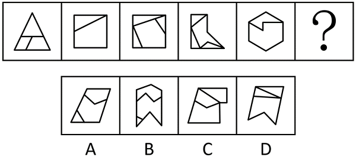

- **A**. A
- **B**. B　✅
- **C**. C
- **D**. D

**答案**：B

**官方解析**

元素组成不同，且无明显属性规律，考虑数量规律。题干图形分割明显，优先考虑面数量，但整体数面无规律。继续观察发现，题干图形均存在最大面，且最大面的边数依次为3、4、5、6、7，故？处图形最大面的边数应为8，只有B项符合。
故正确答案为B。

---

## 第 2 题　qid 5911323 · 图形推理

从所给的四个选项中，选择最合适的一个填入问号处，使之呈现一定的规律性：

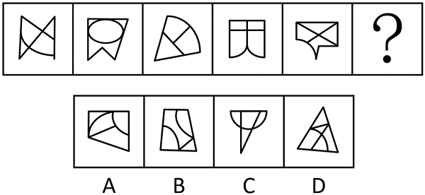

- **A**. A
- **B**. B
- **C**. C
- **D**. D　✅

**答案**：D

**官方解析**

元素组成不同，且无明显属性规律，考虑数量规律。观察发现，题干图形均由直线和曲线构成，且直线和曲线出现明显相交，考虑曲直交点数。题干图形的曲直交点数均为3，故？处图形的曲直交点数应为3，只有D项符合。
故正确答案为D。

---

## 第 3 题　qid 5911326 · 图形推理

从所给的四个选项中，选择最合适的一个填入问号处，使之呈现一定的规律性：

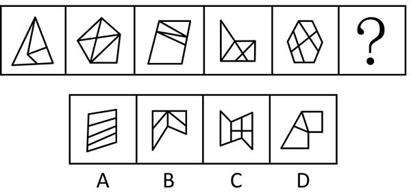

- **A**. A　✅
- **B**. B
- **C**. C
- **D**. D

**答案**：A

**官方解析**

元素组成不同，且无明显属性规律，考虑数量规律。观察发现，题干图形封闭区域明显，优先考虑数面，题干图形的面数量依次为3、5、4、5、6，单独数面无规律。继续观察发现，题干图形的外框均为多边形，考虑外框直线数，外框直线数依次为3、5、4、5、6，可知面数量与外框直线数量相等，只有A项符合。
故正确答案为A。

---

## 第 4 题　qid 5911335 · 图形推理

把下面的六个图形分为两类，使每一类图形都有各自的共同特征或规律，分类正确的一项是：

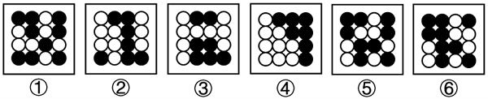

- **A**. ①②③，④⑤⑥
- **B**. ①③④，②⑤⑥
- **C**. ①④⑥，②③⑤
- **D**. ①⑤⑥，②③④　✅

**答案**：D

**官方解析**

本题为分组分类题目。图形元素组成不同，且无明显属性规律，考虑数量规律。观察发现，图①⑤⑥中的黑球数量均为9，图②③④中的黑球数量均为7，即图①⑤⑥为一组，图②③④为一组。
故正确答案为D。

---

## 第 5 题　qid 5911337 · 图形推理

把下面的六个图形分为两类，使每一类图形都有各自的共同特征或规律，分类正确的一项是：

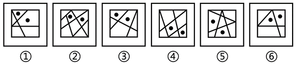

- **A**. ①②⑥，③④⑤
- **B**. ①③④，②⑤⑥
- **C**. ①③⑥，②④⑤　✅
- **D**. ①④⑥，②③⑤

**答案**：C

**官方解析**

本题为分组分类题目。观察发现，每幅图形都有两个小黑点，优先考虑功能元素。图①③⑥中两个小黑点标记的两个面均相交于边，图②④⑤中两个小黑点标记的两个面均相交于点，即图①③⑥为一组，图②④⑤为一组。
故正确答案为C。

---

## 第 6 题　qid 5911298 · 图形推理

把下面的六个图形分为两类，使每一类图形都有各自的共同特征或规律，分类正确的一项是：

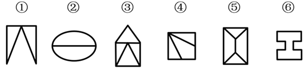

- **A**. ①③④，②⑤⑥　✅
- **B**. ①③⑥，②④⑤
- **C**. ①②⑤，③④⑥
- **D**. ①④⑥，②③⑤

**答案**：A

**官方解析**

本题为分组分类题目。元素组成不同，且题干出现等腰元素，优先考虑对称性。观察发现，图①③④均是轴对称图形，且均只有一条对称轴，图②⑤⑥均是既轴对称又中心对称图形，且均有两条互相垂直的对称轴。即图①③④为一组，图②⑤⑥为一组。
故正确答案为A。

---

## 第 7 题　qid 5911304 · 图形推理

左边给定的是纸盒的外表面展开图，右边哪项能够由它折叠而成？

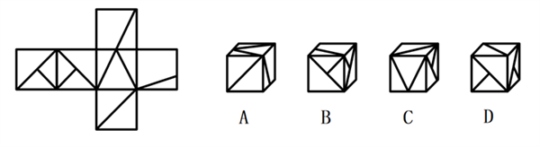

- **A**. A
- **B**. B
- **C**. C　✅
- **D**. D

**答案**：C

**官方解析**

对题干展开图进行编号，如下图所示，逐一分析选项：

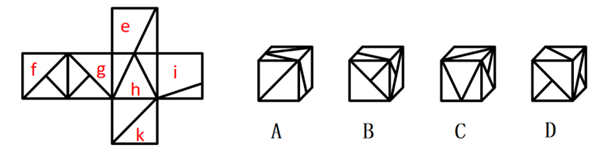

A项：选项出现面h、面k，题干展开图中这两个面的公共边对应面h内大三角形的边，选项中这两个面的公共边对应面h内小直角三角形的直角边，选项与题干展开图不一致，排除；

B项：选项由面f、面g、面e构成，题干展开图中这三个面的公共点与面e中的斜线不相交，而选项中这三个面的公共点与面e中的斜线相交，选项与题干展开图不一致，排除；

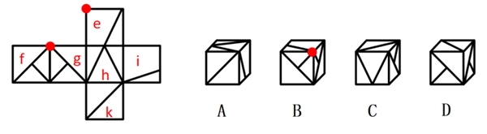

C项：选项由面h、面k和面g（不可能是面f，因面h与面f为相对面，相对面不能同时出现）构成，选项与题干展开图一致，当选；

D项：选项由面f、面g和面k构成，题干展开图中面f和面g的公共边分别挨着两个面中的小三角形，而选项中面f与面g的公共边分别挨着两个面中的大三角形，选项与题干展开图不一致，排除。

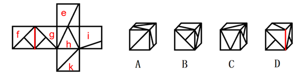

故正确答案为C。

---

## 第 8 题　qid 5911307 · 图形推理

左边的立体图形是由①、②和③组成的，下列哪项可以填入问号处？

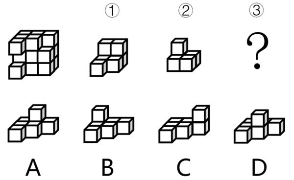

- **A**. A　✅
- **B**. B
- **C**. C
- **D**. D

**答案**：A

**官方解析**

本题考查立体拼合。如下图所示，题干立体图形可以由①、②以及A项拼合而成。

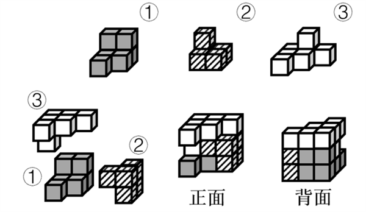

故正确答案为A。

---

## 第 9 题　qid 5911310 · 定义判断

素数是指在大于1的自然数中，除了1和它本身以外不再有其他因数的自然数，孪生素数是指两个相差为2的素数。
根据上述定义，下列均属于孪生素数的是：

- **A**. 2和3；101和103
- **B**. 29和31；41和43　✅
- **C**. 5和7；623和625
- **D**. 11和13；69和71

**答案**：B

**官方解析**

第一步：找出定义关键词。
素数：“大于1的自然数”、“除了1和它本身以外不再有其他因数”；
孪生素数：“两个相差为2的素数”。
第二步：逐一分析选项。
A项：2和3相差为1，不符合“两个相差为2的素数”，不符合定义，排除；
B项：29、31、41、43这4个数字均符合“大于1的自然数”、“除了1和它本身以外不再有其他因数”，因此这4个数字均为素数，且29和31、41和43的差均为2，符合“两个相差为2的素数”，故29和31、41和43均为孪生素数，符合定义，当选；
C项：623的因数包括1、7、89、623，625的因数包括1、5、25、125、625，二者均不符合“除了1和它本身以外不再有其他因数”，不符合“素数”定义，也就不符合“两个相差为2的素数”，不符合定义，排除；
D项：69的因数包括1、3、23、69，不符合“除了1和它本身以外不再有其他因数”，不符合“素数”定义，也就不符合“两个相差为2的素数”，不符合定义，排除。
故正确答案为B。

---

## 第 10 题　qid 5911315 · 定义判断

军事威慑是指国家或政治集团，通过显示武力或表示准备用武力的决心，迫使对方屈从于自己的意志，不敢采取或升级敌对行动的军事行动。
根据上述定义，下列情形不属于军事威慑的是：

- **A**. 在关系紧张的国家周边进行军事演习
- **B**. 对外宣布正在研发某项高端军事技术
- **C**. 对关系紧张国家的战略物资实施禁运　✅
- **D**. 有针对性地大规模部署军事进攻设施

**答案**：C

**官方解析**

第一步：找出定义关键词。
“国家或政治集团”、“通过显示武力或表示准备用武力的决心”、“迫使对方屈从于自己的意志，不敢采取或升级敌对行动的军事行动”。
第二步：逐一分析选项。
A项：在关系紧张的国家周边进行军事演习，这是显示武力的一种形式，符合“国家或政治集团”、“通过显示武力或表示准备用武力的决心”，军事演习的目的是震慑对方，符合“迫使对方屈从于自己的意志，不敢采取或升级敌对行动的军事行动”，符合定义，排除；
B项：对外宣布正在研发某项高端军事技术，其中高端军事技术是军事实力的一种表现，符合“国家或政治集团”、“通过显示武力或表示准备用武力的决心”，对外宣布的目的是震慑对方，符合“迫使对方屈从于自己的意志，不敢采取或升级敌对行动的军事行动”，符合定义，排除；
C项：对关系紧张国家的战略物资实施禁运，这是一种经济遏制的手段，不是军事行动，不符合“通过显示武力或表示准备用武力的决心”、“迫使对方屈从于自己的意志，不敢采取或升级敌对行动的军事行动”，不符合定义，当选；
D项：有针对性地大规模部署军事进攻设施，这显示了武力或准备用武力的决心，符合“国家或政治集团”、“通过显示武力或表示准备用武力的决心”，部署军事进攻设施的目的是震慑对方，符合“迫使对方屈从于自己的意志，不敢采取或升级敌对行动的军事行动”，符合定义，排除。
本题为选非题，故正确答案为C。

---

## 第 11 题　qid 5911168 · 定义判断

述补短语是由述语和补语前后两部分组成的，补语用来补充说明述语的动作行为的情况、结果、处所、数量、时间等；述宾短语是由述语和宾语前后两部分组成的，宾语是述语所表示的动作或现象所支配或关涉到的对象。
根据上述定义，下列属于述补短语的是：

- **A**. 力度刚好
- **B**. 打开电脑
- **C**. 反应强烈　✅
- **D**. 大江东去

**答案**：C

**官方解析**

第一步：找出定义关键词。
述补短语：“由述语和补语前后两部分组成”、“补语用来补充说明述语的动作行为的情况、结果、处所、数量、时间等”；
述宾短语：“由述语和宾语前后两部分组成”、“宾语是述语所表示的动作或现象所支配或关涉到的对象”。
第二步：逐一分析选项。
A项：“力度刚好”的前后两部分为“力度”和“刚好”，“刚好”用来说明“力度”的情况，但“力度”是指力量的强度，它不是动作行为，不符合“补语用来补充说明述语的动作行为的情况、结果、处所、数量、时间等”，不符合“述补短语”的定义，排除；
B项：“打开电脑”的前后两部分为“打开”和“电脑”，“打开”是动作，“电脑”是“打开”的对象，符合“由述语和宾语前后两部分组成”、“宾语是述语所表示的动作或现象所支配或关涉到的对象”，符合“述宾短语”的定义，不符合“述补短语”的定义，排除；
C项：“反应强烈”的前后两部分为“反应”和“强烈”，“反应”是动作，“强烈”用来补充说明“反应”的情况，符合“由述语和补语前后两部分组成”、“补语用来补充说明述语的动作行为的情况、结果、处所、数量、时间等”，符合“述补短语”的定义，当选；
D项：“大江东去”的前后两部分为“大江”和“东去”，“东去”用来说明“大江”的情况，但“大江”不是动作行为，不符合“补语用来补充说明述语的动作行为的情况、结果、处所、数量、时间等”，不符合“述补短语”的定义，排除。
故正确答案为C。

---

## 第 12 题　qid 5911170 · 定义判断

外向投射是指将自己不喜欢的观念、冲动或品质夸张性地归于他人，以避免或减轻内心的不安与痛苦的心理防御机制。
根据上述定义，下列属于外向投射的是：

- **A**. 小赵考试没有考好愤而撕了试卷
- **B**. 小钱做了坏事后，为减轻内疚感，转而投身慈善事业
- **C**. 小孙其实很自卑，但在实际行动和言谈中却表现出过分自信
- **D**. 小李骨折住院时常常焦躁不安，动辄发怒，责怪家人照料不周，埋怨医务人员未尽心尽责　✅

**答案**：D

**官方解析**

第一步：找出定义关键词。
“将自己不喜欢的观念、冲动或品质夸张性地归于他人”、“以避免或减轻内心的不安与痛苦”。
第二步：逐一分析选项。
A项：小赵因没考好而撕了试卷，并不涉及他人，不符合“将自己不喜欢的观念、冲动或品质夸张性地归于他人”，不符合定义，排除；
B项：小钱做了坏事后，通过投身慈善事业来减轻内疚感，并非是将自己不喜欢的观念归于他人，不符合“将自己不喜欢的观念、冲动或品质夸张性地归于他人”，不符合定义，排除；
C项：小孙虽然自卑但行动和言语中表现出过分自信，并非是将自己不喜欢的观念归于他人，不符合“将自己不喜欢的观念、冲动或品质夸张性地归于他人”，不符合定义，排除；
D项：小李住院时焦躁不安，动辄发怒，并责怪家人和医务人员，符合“将自己不喜欢的观念、冲动或品质夸张性地归于他人”、“以避免或减轻内心的不安与痛苦”，符合定义，当选。
故正确答案为D。

---

## 第 13 题　qid 5911179 · 定义判断

20世纪60年代，已是制成品出口主要国家的荷兰发现大量天然气，荷兰政府大力发展天然气业，出口剧增，国际收入出现顺差，经济显现繁荣景象，但蓬勃发展的天然气业却严重打击了荷兰的农业和其他工业部门，削弱了制成品出口行业的国际竞争力。到20世纪70年代，荷兰遭受到通货膨胀上升、制成品出口下降、收入增长率降低、失业率增加的困扰。这种资源产业在繁荣时期价格膨胀是以牺牲其他行业为代价的现象，国际上称之为“荷兰病”。
根据上述定义，下列属于“荷兰病”的是：

- **A**. 经济极不发达的甲国在其国境内发现了大油田，创造了大量就业机会，大大提高了国民收入水平
- **B**. 十年前，乙国的经济支柱产业是汽车制造业，目前该国已转型为金融大国，汽车制造行业不断萎缩
- **C**. 丙国经济常年依赖农产品出口，在农业上投入了大量劳动力，导致该国其他行业的发展一直停滞不前
- **D**. 重工业国家丁国发现了大量矿藏资源，大批工人向采矿业转移，导致工业人才流失，工业生产力逐年下降，供求矛盾加剧　✅

**答案**：D

**官方解析**

第一步：找出定义关键词。
“资源产业在繁荣时期价格膨胀”、“以牺牲其他行业为代价”。
第二步：逐一分析选项。
A项：经济极不发达的甲国在其国境内发现了大油田，创造了大量就业机会，提高了国民收入水平，并未提及影响其他行业，不符合“以牺牲其他行业为代价”，不符合定义，排除；
B项：乙国从经济支柱产业是汽车制造业转型为金融大国，说明该国发展的是金融产业，而非资源产业，不符合“资源产业在繁荣时期价格膨胀”，不符合定义，排除；
C项：丙国经济常年依赖农产品出口，在农业上投入大量劳动力，说明该国农业较为繁荣，符合“资源产业在繁荣时期价格膨胀”，导致该国其他行业的发展一直停滞不前，说明发展农业牺牲了其他行业的发展，符合“以牺牲其他行业为代价”，符合定义，保留；
D项：重工业国家丁国发现了大量矿藏资源，大批工人向采矿业转移，说明该国采矿业较为繁荣，符合“资源产业在繁荣时期价格膨胀”，最终导致工业人才流失，工业生产力逐年下降，说明发展采矿业导致其他行业衰落，符合“以牺牲其他行业为代价”，符合定义，保留。
对比C、D两项，题干的故事背景是围绕“荷兰发现大量天然气”展开的，为发展该产业，牺牲了其他产业的发展，故本题所表达的“资源”应该更接近于石油、天然气、矿产等狭义的资源，D项明确的提到了“矿藏资源”，跟题干表述的内容更贴近与匹配，对比择优，D项当选。
故正确答案为D。

---

## 第 14 题　qid 5911262 · 定义判断

防卫不适时，是指在不法侵害行为尚未开始，或者已经结束的情况下，对不法侵害者实行的防卫行为；假想防卫，是指行为人由于主观认识上的错误，误认为有不法侵害的存在，实施防卫行为结果造成损害的行为；挑拨防卫，是指以挑拨寻衅等不正当手段，故意激怒对方，引诱对方对自己进行侵害，然后以“正当防卫”为借口，实行加害的行为。
根据上述定义，下列说法正确的是：

- **A**. 甲和乙驾车行驶时发生剐蹭，二人下车后发生口角，甲从车内拿出裁纸刀，乙见状立刻回到车内，驾车将甲撞伤，乙的行为属于挑拨防卫
- **B**. 甲因住楼上的乙家经常发出噪音，上楼与乙理论未果，二人不欢而散。翌日，甲、乙迎面碰见，乙认为甲要伺机报复，便先袭击了甲，乙的行为属于防卫不适时
- **C**. 甲、乙二人在饭店吃饭，酒后发生肢体冲突，此时乙的朋友丙进入饭店，试图劝阻二人，甲认为丙是乙叫来的打手，便拿起酒瓶将乙和丙打伤，甲的行为属于假想防卫　✅
- **D**. 甲将自己的房屋出租给乙，租期一年，三个月后甲、乙因设施损坏问题发生争吵，争吵间甲说乙如果敢动手就不退还押金，乙气不过，将甲打成重伤，甲的行为属于挑拨防卫

**答案**：C

**官方解析**

第一步：找出定义关键词。
防卫不适时：“在不法侵害行为尚未开始，或者已经结束的情况下”、“对不法侵害者实行的防卫行为”；
假想防卫：“行为人由于主观认识上的错误”、“误认为有不法侵害的存在”、“造成损害”；
挑拨防卫：“以挑拨寻衅等不正当手段”、“故意激怒对方”、“引诱对方对自己进行侵害”、“以‘正当防卫’为借口，实行加害”。
第二步：逐一分析选项。
A项：乙与甲争吵后，见甲拿出裁纸刀，乙回到车内，驾车将甲撞伤，其中并没有体现乙使用了不正当手段去激怒甲，不符合“以挑拨寻衅等不正当手段”、“故意激怒对方”，也没有体现乙是故意引诱甲来侵害自己，不符合“引诱对方对自己进行侵害”，乙的行为不属于挑拨防卫，该项说法错误，排除；
B项：甲、乙争吵后再相遇，乙认为甲要报复自己便先袭击了甲，其中二人再相遇时甲并未做出任何举动，说明甲并不存在不法行为，不符合“在不法侵害行为尚未开始，或者已经结束的情况下”，乙的行为不属于防卫不适时，该项说法错误，排除；
C项：甲与乙发生冲突时，误认为前来劝架的丙是乙叫的打手，便将乙和丙二人打伤，其中丙是来劝架的，却被甲误认成打手，说明甲存在主观上的认识错误，符合“行为人由于主观认识上的错误”、“误认为有不法侵害的存在”，甲将乙和丙打伤，符合“造成损害”，甲的行为属于假想防卫，该项说法正确，当选；
D项：甲对乙说如果敢动手就不退还押金，乙随后将甲打成重伤，受伤的是甲，甲并没有对乙实行加害，不符合“以‘正当防卫’为借口，实行加害”，甲的行为不属于挑拨防卫，该项说法错误，排除。
故正确答案为C。

---

## 第 15 题　qid 5911270 · 定义判断

自然法主张一定的权利因为人类本性中的美德而固然存在，由自然赋予；成文法是指国家机关依照一定的程序制定和颁布的，表现为条文形式的法律文件；习惯法是指独立于国家制定法之外，依据某种社会权威和社会组织，具有一定强制性的行为规范的总和。
根据上述定义，下列属于习惯法的是：

- **A**. 举事以为人者，众助之；举事以自为者，众去之
- **B**. 凡教唆词讼，及为人作词状，增减情罪诬告人者，与犯人同罪
- **C**. 上圣卓然先行敬让博爱之德者，众心说而从之。从之成群，是为君矣；归而往之，是为王矣
- **D**. 议得我辈同行业者，不与现在行家弟兄亲戚，以及管账之人合伙合业，以防明充暗顶之渐，违者公罚　✅

**答案**：D

**官方解析**

第一步：找出定义关键词。
自然法：“一定的权利因为人类本性中的美德而固然存在，由自然赋予”；
成文法：“国家机关”、“依照一定的程序制定和颁布”、“表现为条文形式的法律文件”；
习惯法：“独立于国家制定法之外”、“依据某种社会权威和社会组织”、“具有一定强制性的行为规范的总和”。
第二步：逐一分析选项。
A项：出自《淮南子·兵略训》，意思为：做事情是为了众人，那么众人就会都来帮助他；做事情是为了自己，那么众人就会纷纷弃他而去。该项指出为公还是为私是能否赢得人心的关键，倡导人们为了众人而去做事情，不涉及强制性的行为规范，不符合“具有一定强制性的行为规范的总和”，不符合“习惯法”定义，排除；
B项：出自《大清律例》，意思为：教唆他人诉讼，及为他人作诉状，用来增减他人罪行，诬告人与犯人同罪。该项是国家机关颁布的法律文件，符合“国家机关”、“表现为条文形式的法律文件”，符合“成文法”定义，不符合“习惯法”定义，排除；
C项：出自《汉书·刑法志》，意思为：前代的圣人特意率先讲求恭敬谦让和博爱的道德，大众心中高兴就跟从他们了。跟从他们的人形成了群体，他们就成了君主；都争着去归附他们，他们就成了王。该项指出仁爱谦让是王道的根本，不涉及强制性的行为规范，不符合“具有一定强制性的行为规范的总和”，不符合“习惯法”定义，排除；
D项：出自《吴县纱缎业行规条约碑》，意思为：从事我们这一行业的人，不能与现在行家的弟兄亲戚、管账人合伙合业，以防止行业内部的恶性竞争，违反的人会被惩罚。该项为某一行业的内部规定，符合“独立于国家制定法之外”、“依据某种社会权威和社会组织”，违反行规条约的人会被惩罚，说明行规条约具有一定强制性，符合“具有一定强制性的行为规范的总和”，符合“习惯法”定义，当选。
故正确答案为D。

---

## 第 16 题　qid 5911279 · 定义判断

锚定效应是指当人们需要对某个事件做定量估测时，会将先前获得的某些特定数值作为起始值，起始值像锚一样制约着估测值。在做决策时，倾向于过度利用这一起始值，快速做出判断，但这种判断往往是与现实有偏差的。
根据上述定义，下列不涉及锚定效应的是：

- **A**. 小李原本6点下班，最近调整为5点下班，他觉得下班后的时间变得很长　✅
- **B**. 在奢侈品店看到一款百元包会觉得便宜，在地摊上看到同款百元包会觉得贵
- **C**. 小王听说某护肤品卖200元，但他去超市后发现，该护肤品在搞促销，只卖100元，他非常惊喜，觉得“太便宜了”，于是一次性买了5瓶
- **D**. 先让两组参与者判断尼罗河的长度是否长于5000km/短于5000km，再让两组参与者分别估计尼罗河的具体长度，结果发现，被询问“是否长于5000km”的参与者比被询问“是否短于5000km”的参与者报告的尼罗河具体长度更长

**答案**：A

**官方解析**

第一步：找出定义关键词。

“将先前获得的某些特定数值作为起始值”、“起始值像锚一样制约着估测值”、“做决策时，倾向于过度利用这一起始值”、“判断往往是与现实有偏差的”。

第二步：逐一分析选项。

A项：小李原本6点下班，最近调整为5点下班，他觉得下班后的时间变得很长，提早下班后时间确实比以前长了，他的判断没有偏差，不符合“判断往往是与现实有偏差的”，不符合定义，当选；

B项：奢侈品店看到一款百元包会觉得便宜，是因为以奢侈品高昂的价格为起始值，对比店里的百元包，会觉得便宜；在地摊上看到同款百元包会觉得贵，是因为以地摊上的其他商品为起始值，来判断地摊同款百元包，会觉得贵，但包是同款，且价格没变，改变的是对其的判断，符合“将先前获得的某些特定数值作为起始值”、“起始值像锚一样制约着估测值”、“做决策时，倾向于过度利用这一起始值”、“判断往往是与现实有偏差的”，符合定义，排除；

C项：某护肤品卖200元，但超市搞促销只卖100元，小王觉得“太便宜了”，于是一次性买了5瓶，是以过去的价格200元为起始值，来确定现在100元是便宜的，小王认为这个价格很划算，于是决定购买很多，符合“将先前获得的某些特定数值作为起始值”、“起始值像锚一样制约着估测值”、“做决策时，倾向于过度利用这一起始值”、“判断往往是与现实有偏差的”，符合定义，排除；

D项：先让两组参与者判断尼罗河的长度是否长于5000km/短于5000km，即给定一个起始值，符合“将先前获得的某些特定数值作为起始值”，再让两组参与者分别估计尼罗河的具体长度，结果发现，被询问“是否长于5000km”的参与者比被询问“是否短于5000km”的参与者报告的尼罗河具体长度更长，这是在锚（长于5000km/短于5000km）的暗示下，人们在判断具体长度时会不自觉地给予起始值过多的重视，导致两组参与者的判断存在偏差，符合“起始值像锚一样制约着估测值”、“做决策时，倾向于过度利用这一起始值”、“判断往往是与现实有偏差的”，符合定义，排除。

注：有同学可能会纠结A项的“很长”也是一种偏差，只多了一小时，是“长”而不是“很长”，但具体的感受因人而异，不好说清。经过多方查证，锚定效应又叫沉锚效应，B、C、D三项均能找到类似案例，具体如下所示：

B项案例：

C项案例：

D项案例：

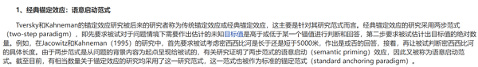

因此综合来看，A项最优。

本题为选非题，故正确答案为A。

---

## 第 17 题　qid 5911258 · 定义判断

电子官僚主义是指近些年随着电子化、信息化而产生的一种官僚主义形式，主要表现为过度依赖电子化政务、信息化管理、网上办理、台账管理等形式，不考虑实际工作问题，其实质上是脱离实际、脱离群众、高高在上。
根据上述定义，下列不属于电子官僚主义的是：

- **A**. 某县政府召集乡镇干部开会，传达上级会议和文件精神，要求无法现场参会的人员线上参会、电子签到　✅
- **B**. 某年轻干部不深入一线、不下乡调研，通过各式各样的“电子台账”，坐在办公室里就完成本部门的任务
- **C**. 某上级部门要求下级部门所有工作都要签订“项目责任书”，要求线上实时更新、反馈和上报各种材料和数据
- **D**. 某部门强调“规范审批、落实责任”，即使线下完成的审批事项也要求服务对象在信息化系统中再次提交留痕

**答案**：A

**官方解析**

第一步：找出定义关键词。
“过度依赖电子化政务、信息化管理、网上办理、台账管理等形式”、“不考虑实际工作问题”、“实质上是脱离实际、脱离群众、高高在上”。
第二步：逐一分析选项。
A项：某县政府要求无法现场参会的人员线上参会、电子签到，目的是确保乡镇干部可以及时了解到上级会议和文件精神，是对工作有帮助的表现，不符合“不考虑实际工作问题”，不符合定义，当选；
B项：某年轻干部既不深入一线，也不下乡调研，通过各种“电子台账”，只坐在办公室里完成任务，是一种脱离实际、脱离群众的行为，符合“过度依赖电子化政务、信息化管理、网上办理、台账管理等形式”、“不考虑实际工作问题”、“实质上是脱离实际、脱离群众、高高在上”，符合定义，排除；
C项：某上级部门要求下级部门针对各种材料和数据都要线上实时更新、反馈和上报，是一种过度依赖电子化政务系统的表现，符合“过度依赖电子化政务、信息化管理、网上办理、台账管理等形式”，符合定义，排除；
D项：某部门要求即使线下完成的审批事项，服务对象也要在信息化系统中再次提交留痕，该行为依赖电子化政务系统，增加了工作负担，符合“过度依赖电子化政务、信息化管理、网上办理、台账管理等形式”、“不考虑实际工作问题”，符合定义，排除。
本题为选非题，故正确答案为A。

---

## 第 18 题　qid 5911275 · 定义判断

学习重组性迁移是指重新组合原有认知系统中某些构成要素或成分，调整各成分间的关系或建立新的联系，从而应用于新情境；学习同化性迁移是指不改变原有的认知结构，直接将原有的认知经验应用到本质特征相同的一类事物中去。
根据上述定义，下列属于学习重组性迁移的是：

- **A**. 小张认为某现象符合马太效应，所以用其来分析
- **B**. 小李套用从书本上学到的数学公式解答数学应用题
- **C**. 源于西方的新发展观可直接解释东南亚国家的一些发展问题
- **D**. 将工程学的某个理论适当修改，用来解释教育领域的相关问题　✅

**答案**：D

**官方解析**

第一步：找出定义关键词。
学习重组性迁移：“重新组合原有认知系统中某些构成要素或成分，调整各成分间的关系或建立新的联系”、“应用于新情境”；
学习同化性迁移：“不改变原有的认知结构”、“直接将原有的认知经验应用到本质特征相同的一类事物”。
第二步：逐一分析选项。
A项：小张只是利用马太效应来分析符合该效应的现象，没有涉及重组、调整原有的马太效应理论，不符合“重新组合原有认知系统中某些构成要素或成分，调整各成分间的关系或建立新的联系”，不符合“学习重组性迁移”的定义，排除；
B项：小李直接将理论知识即数学公式应用于解题中，没有涉及重组、调整原有的数学公式，不符合“重新组合原有认知系统中某些构成要素或成分，调整各成分间的关系或建立新的联系”，不符合“学习重组性迁移”的定义，排除；
C项：用源于西方的新发展观直接解释东南亚国家的一些发展问题，没有涉及重组、调整原有的源于西方的新发展观，不符合“重新组合原有认知系统中某些构成要素或成分，调整各成分间的关系或建立新的联系”，不符合“学习重组性迁移”的定义，排除；
D项：将工程学的某个理论适当修改，说明对原有的工程学理论进行了调整，符合“重新组合原有认知系统中某些构成要素或成分，调整各成分间的关系或建立新的联系”，用来解释教育领域的相关问题‍，说明应用到了新情境，符合“应用于新情境”，符合“学习重组性迁移”的定义，当选。
故正确答案为D。

---

## 第 19 题　qid 5911280 · 类比推理

觉察：察觉

- **A**. 互相：相互　✅
- **B**. 和平：平和
- **C**. 黄金：金黄
- **D**. 年少：少年

**答案**：A

**官方解析**

第一步：判断题干词语间逻辑关系。
“觉察”和“察觉”均指发觉，看出来，二者是近义关系。
第二步：判断选项词语间逻辑关系。
A项：“互相”表示彼此同样对待的关系；“相互”指互相，二者是近义关系，与题干逻辑关系一致，保留；
B项：“和平”是指没有战争的状态；“平和”是指性情或言行温和，二者不是近义关系，与题干逻辑关系不一致，排除；
C项：“黄金”指金子；“金黄”指黄而微红略像金子的颜色，二者不是近义关系，与题干逻辑关系不一致，排除；
D项：“年少”形容年轻，也可指青年男子；“少年”是指人十岁左右到十五六岁的阶段，也可指青年男子，二者在指代青年男子时，可以理解为近义关系，与题干逻辑关系一致，保留。
对比A、D两项，题干两个词都是动词，A项“互相”和“相互”均为副词，而D项“年少”多用作形容词，“少年”是名词，故A项与题干逻辑关系更为一致，当选。
故正确答案为A。

---

## 第 20 题　qid 5911283 · 类比推理

米醋：米酒

- **A**. 茶壶：茶砖
- **B**. 水库：水沟
- **C**. 棉花：棉衣
- **D**. 石雕：石碑　✅

**答案**：D

**官方解析**

第一步：判断题干词语间逻辑关系。
米醋和米酒是两种由米为原材料制作而成的食品，二者的原材料相同。
第二步：判断选项词语间逻辑关系。
A项：茶砖是外形像砖一样的茶叶，与茶壶的原材料不同，与题干逻辑关系不一致，排除；
B项：水库是拦洪蓄水和调节水流的人工湖，水沟是人工挖掘的水道，但二者都不涉及原材料，与题干逻辑关系不一致，排除；
C项：棉花是制作棉衣的原材料，二者为原材料与成品的对应关系，与题干逻辑关系不一致，排除；
D项：石雕和石碑是两种由石头为原材料制作而成的物品，二者的原材料相同，与题干逻辑关系一致，当选。
故正确答案为D。

---

## 第 21 题　qid 5911290 · 类比推理

乌鸡：公鸡：雏鸡

- **A**. 军刀：钢刀：菜刀
- **B**. 城门：石门：拱门　✅
- **C**. 质数：单数：负数
- **D**. 泰山：名山：高山

**答案**：B

**官方解析**

第一步：判断题干词语间逻辑关系。
乌鸡、公鸡和雏鸡是从品种、性别、生长阶段三个不同的角度进行划分的，三者互为交叉关系。
第二步：判断选项词语间逻辑关系。
A项：军刀和菜刀是根据功能进行划分的，二者为并列关系，与题干逻辑关系不一致，排除；
B项：城门、石门和拱门是从用途、原材料、形状三个不同的角度进行划分的，三者互为交叉关系，与题干逻辑关系一致，当选；
C项：质数是指在大于1的自然数中，除了1和它本身以外不再有其他因数的自然数，单数指正的奇数，二者与负数均不是交叉关系，与题干逻辑关系不一致，排除；
D项：泰山既是名山也是高山，泰山与后两个词语均为种属关系，与题干逻辑关系不一致，排除。
故正确答案为B。

---

## 第 22 题　qid 5911205 · 类比推理

钟表：电子表：机械表

- **A**. 火车：动车：轿车
- **B**. 计算：笔算：心算　✅
- **C**. 武器：火器：兵器
- **D**. 家常菜：鲁菜：粤菜

**答案**：B

**官方解析**

第一步：判断题干词语间逻辑关系。
电子表和机械表都是钟表的一种，后两词为并列关系，与第一词均为种属关系。
第二步：判断选项词语间逻辑关系。
A项：动车是火车的一种，二者为种属关系，但火车和轿车都是交通工具，二者为并列关系，与题干逻辑关系不一致，排除；
B项：笔算和心算都是计算的一种，后两词为并列关系，与第一词均为种属关系，与题干逻辑关系一致，当选；
C项：武器别称兵器，二者为全同关系，火器也称作热武器或热兵器，与第一词和第三词均为种属关系，与题干逻辑关系不一致，排除；
D项：鲁菜和粤菜是根据菜系进行分类的，二者为并列关系，与家常菜均为交叉关系，与题干逻辑关系不一致，排除。
故正确答案为B。

---

## 第 23 题　qid 5911238 · 类比推理

茅草：草屋：屋檐

- **A**. 马匹：马车：车轮
- **B**. 茶叶：茶杯：杯盖
- **C**. 船帆：帆船：船锚
- **D**. 树木：木桌：桌腿　✅

**答案**：D

**官方解析**

第一步：判断题干词语间逻辑关系。
茅草是建造草屋的原材料，二者是原材料与成品对应关系，屋檐是草屋的组成部分，二者是包容关系中的组成关系。
第二步：判断选项词语间逻辑关系。
A项：马匹和车轮都是马车的组成部分，第一词、第三词均与第二词构成组成关系，与题干逻辑关系不一致，排除；
B项：茶杯用来泡茶叶，二者不是原材料与成品对应关系，与题干逻辑关系不一致，排除；
C项：船帆是帆船的组成部分，二者是组成关系，与题干逻辑关系不一致，排除；
D项：树木是制作木桌的原材料，二者是原材料与成品对应关系，桌腿是木桌的组成部分，二者是组成关系，与题干逻辑关系一致，当选。
故正确答案为D。

---

## 第 24 题　qid 5911248 · 类比推理

雷阵雨 对于 （    ） 相当于 （    ） 对于 金砖五国

- **A**. 极端天气 俄罗斯
- **B**. 多云转晴 东盟十国　✅
- **C**. 阵雨 合作组织
- **D**. 雷雨交加 发展中国家

**答案**：B

**官方解析**

逐一代入选项。
A项：极端天气是对罕见的、且对人类社会和生态系统产生破坏的天气现象的统称，雷阵雨不是极端天气，二者为反向种属关系；金砖五国包含巴西、俄罗斯、印度、中国和南非，俄罗斯是金砖五国的成员国，二者为组成关系，前后逻辑关系不一致，排除；
B项：雷阵雨和多云转晴是两种不同的天气现象，二者为并列关系；东盟十国和金砖五国是两个不同的国家合作组织，二者为并列关系，前后逻辑关系一致，当选；
C项：雷阵雨是伴有雷电的阵雨，二者为种属关系；金砖五国是国际合作性质的组织，二者为种属关系，但词语前后顺序相反，前后逻辑关系不一致，排除；
D项：雷阵雨具有雷雨交加的特点，二者为属性的对应关系；金砖五国的五个国家都是发展中国家，发展中国家是金砖五国的特点，二者为属性的对应关系，但词语前后顺序相反，前后逻辑关系不一致，排除。
故正确答案为B。

---

## 第 25 题　qid 5911254 · 类比推理

销售平台 对于 （    ） 相当于 （    ） 对于 剪纸艺术

- **A**. 销售渠道 文化遗产
- **B**. 商品 窗花
- **C**. 电子商铺 手工艺术　✅
- **D**. 客服人员 艺术院校

**答案**：C

**官方解析**

逐一代入选项。
A项：销售平台是销售渠道的一种，二者为种属关系；剪纸艺术是文化遗产的一种，二者为种属关系，但前后顺序相反，前后逻辑关系不一致，排除；
B项：销售平台售卖商品，二者为对应关系；窗花是剪纸艺术的一种，二者为种属关系，前后逻辑关系不一致，排除；
C项：电子商铺是销售平台的一种，二者为种属关系；剪纸艺术是手工艺术的一种，二者为种属关系，前后逻辑关系一致，当选；
D项：客服人员在销售平台工作，二者为职业和工作地点的对应关系；艺术院校和剪纸艺术没有必然联系，前后逻辑关系不一致，排除。
故正确答案为C。

---

## 第 26 题　qid 5911187 · 类比推理

某酒店张贴这样的标语：严禁携带易燃品、易爆品、危险品入住。
以下哪项陈述中所包含的逻辑错误与题干中的最相似？

- **A**. 许多农户养了鸡、鸭、家禽，大大增加了收入　✅
- **B**. 罗先生收藏了许多古代的工笔画、写意画、山水画
- **C**. 花园里开着五颜六色的红花、黄花、粉花，甚为美丽
- **D**. 小红在文具店里购买了铅笔、橡皮、小刀等学习用品

**答案**：A

**官方解析**

第一步：分析题干逻辑错误。
题干中的易燃品、易爆品均属于危险品，所犯的逻辑错误是将包容关系错误地理解为并列关系。
第二步：逐一分析选项。
A项：选项中的鸡、鸭均属于家禽，所犯的逻辑错误是将包容关系错误地理解为并列关系，与题干的逻辑错误一致，当选；
B项：选项中的工笔画和写意画是两种不同的绘画技法，但山水画是根据画面内容分类的，所犯的逻辑错误是将交叉关系错误地理解为并列关系，与题干的逻辑错误不一致，排除；
C项：选项中红花、黄花、粉花是三种不同颜色的花，属于同一层级，三者为并列关系，与题干的逻辑错误不一致，排除；
D项：选项中铅笔、橡皮、小刀均属于文具，属于同一层级，三者为并列关系，与题干的逻辑错误不一致，排除。
故正确答案为A。

---

## 第 27 题　qid 5911216 · 逻辑判断

张、王、李、赵、钱、孙6人是某单位的优秀员工，在全面深化改革方面取得了很大的成就，现有甲、乙、丙、丁四种奖项可以申报，每名员工只能申报一种奖项，且每种奖项都有1至2名员工申报，已知以下情况：
（1）申报乙奖的员工比甲奖的多；
（2）申报丁奖的员工比丙奖的多；
（3）若李、赵中至少有1名申报甲奖，则王申报丁奖；
（4）若张、李、赵中至少有1名申报乙奖，则只有钱申报丁奖；
（5）孙申报丙奖。
根据以上信息，可以得出以下哪项结论？

- **A**. 张申报丙奖
- **B**. 赵、钱申报乙奖
- **C**. 王、李申报丁奖
- **D**. 李、赵申报丁奖　✅

**答案**：D

**官方解析**

第一步：分析题干条件。

（1）申报乙奖人数&gt;申报甲奖人数；

（2）申报丁奖人数&gt;申报丙奖人数；

（3）李申报甲奖 或 赵申报甲奖王申报丁奖；

（4）张申报乙奖 或 李申报乙奖 或 赵申报乙奖只有钱申报丁奖；

（5）孙申报丙奖；

（6）张、王、李、赵、钱、孙6人，每名员工只能申报一种奖项，且每种奖项都有1至2名员工申报。

第二步：根据题干条件进行推理。

根据条件（1）、（2）、（6）可以推出，申报乙、丁两种奖项的人数均为2，申报甲、丙两种奖项的人数均为1，结合条件（5）可以推出申报丙奖的只有孙，排除A项；

根据上述“申报丁奖的人数为2”可以推出“只有钱申报丁奖”一定不成立，是对条件（4）的否后，否后必否前，可以推出张没有申报乙奖 且 李没有申报乙奖 且 赵没有申报乙奖，结合条件（5）可知，孙申报丙奖，则申报乙奖的为王、钱，排除B、C两项；

继续推理，验证D项。根据上述“申报乙奖的为王、钱”可以推出，王不申报丁奖，是对条件（3）的否后，否后必否前，可以推出李没有申报甲奖 且 赵没有申报甲奖，则申报甲奖的只能为张，李、赵只能申报丁奖。综上所述，D项为真，当选。

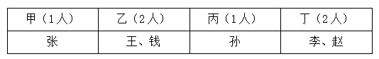

故正确答案为D。

---

## 第 28 题　qid 5911223 · 逻辑判断

市美术馆近期举办“小读者”系列活动，活动包含若干项目。报名情况如下：
（1）小读者在艺术阅读和版画实践课中至少参加了一个；
（2）小读者如果参加了艺术阅读，则没有参加书法小课堂；
（3）小苏参加了书法小课堂；
美术馆馆长知道上述情况后断定，小苏也参加了手工剪纸活动。以下哪项如果为真，可以成为美术馆馆长判断的前提？

- **A**. 小苏没有参加艺术阅读
- **B**. 小苏没有参加版画实践课
- **C**. 参加了手工剪纸活动的也参加了版画实践课
- **D**. 不参加手工剪纸活动的都不参加版画实践课　✅

**答案**：D

**官方解析**

第一步：找出论点和论据。

论点：小苏参加了手工剪纸活动。

论据：（1）艺术阅读 或 版画实践课；

（2）艺术阅读书法小课堂；

（3）小苏参加了书法小课堂。

论据（3）“小苏参加了书法小课堂”是对论据（2）“艺术阅读书法小课堂”的否后，根据“否后必否前”可以推出，小苏没有参加艺术阅读，结合论据（1）“艺术阅读 或 版画实践课”，根据“或关系否一推一”可以推出，小苏参加了版画实践课。

本题需要找出论点成立的前提，可优先考虑搭桥，即建立“小苏参加了版画实践课”和“小苏参加了手工剪纸活动”之间的联系。

第二步：逐一分析选项。

A项：“小苏没有参加艺术阅读”，根据论据（1）可知，小苏参加了版画实践课，但不能推出小苏参加了手工剪纸活动，不是论点成立的前提，排除；

B项：“小苏没有参加版画实践课”，与题干论据不符，无法推出结论，排除；

C项：该项翻译为：手工剪纸活动版画实践课，论据已经推出“小苏参加了版画实践课”，而小苏参加了版画实践课是对该项的肯后，无法推出小苏参加了手工剪纸活动，不是论点成立的前提，排除；

D项：该项翻译为：版画实践课手工剪纸活动，论据已经推出“小苏参加了版画实践课”，根据该项可知小苏也参加了手工剪纸活动，为搭桥项，是论点成立的前提，当选。

故正确答案为D。

---

## 第 29 题　qid 5911230 · 逻辑判断

“经常掰手指发出响声是一种不健康的习惯，因为掰手指发出的响声实际上是关节互相摩擦的声音，经常掰手指会磨损手指关节导致手指关节炎。”为验证这一观点，研究人员将200余名实验对象分为2组进行了严谨的对比实验，经长期观察后得出了结论：经常掰手指作响与手指关节炎没有明显的相关性。
以下哪项如果为真，最有可能是研究人员通过实验得到的论据？

- **A**. 掰手指发出的声响是关节腔中滑液气泡破裂的声音，并非关节摩擦的声音
- **B**. 与不掰手指的人相比，经常掰手指的人手部握力和关节强度均有不同程度下降
- **C**. 经统计，手指关节炎与病患年龄显著相关，年龄越大，患手指关节炎的概率越高
- **D**. 经统计，实验期间，在经常掰手指的实验组中，仅有1人因遗传因素患手指关节炎　✅

**答案**：D

**官方解析**

第一步：找出论点和论据。
论点：经常掰手指作响与手指关节炎没有明显的相关性。
论据：无。
本题问哪项最有可能是研究人员通过实验得到的论据，优先考虑补充论据。
第二步：逐一分析选项。
A项：该项指出掰手指发出的声响与关节摩擦无关，解释了论点为什么成立，但不是通过实验得到的论据，排除；
B项：该项指出经常掰手指的人手部握力和关节强度均有不同程度下降，握力和关节强度的下降不利于关节的健康，有一定的削弱作用，不是通过实验得到的论据，排除；
C项：该项指出手指关节炎与病患年龄显著相关，而论点说的是经常掰手指作响与手指关节炎的关系，话题不一致，不是通过实验得到的论据，排除；
D项：该项指出在经常掰手指的实验组中只有1人是因为遗传因素患手指关节炎，说明实验中经常掰手指组没有人因掰手指患上关节炎，即使没有提及另一组的实验结果，也能证明论点的成立，且是通过实验可以得到的论据，当选。
故正确答案为D。

---

## 第 30 题　qid 5911224 · 逻辑判断

体温调节模式假说认为，变温动物因为需要吸收外部热量调节体温，因此代谢率通常较低，而恒温动物由内部产生热量，代谢率较高，因此变温动物比恒温动物衰老速度慢。就像人们觉得老鼠衰老快，是因为它们新陈代谢率很高，而海龟衰老慢，是因为它们新陈代谢率很低。
以下哪项如果为真，最能削弱上述假说?

- **A**. 有壳这种物理特征保护，海龟的衰老速度较慢，寿命更长
- **B**. 研究显示，变温动物的衰老率远高于或远低于相似体型恒温动物的衰老率　✅
- **C**. 得出上述假说的研究主要集中在动物园的动物或少数野生动物中，且获得的证据参差不齐
- **D**. 部分变温动物的衰老可忽略不计，包括青蛙、海龟等，一旦过了繁殖期，它们死亡的可能性不会随着年龄的增长而改变

**答案**：B

**官方解析**

第一步：找出论点和论据。

论点：变温动物比恒温动物衰老速度慢。

论据：①变温动物因为需要吸收外部热量调节体温，因此代谢率通常较低，而恒温动物由内部产生热量，代谢率较高。

②人们觉得老鼠衰老快，是因为它们新陈代谢率很高，而海龟衰老慢，是因为它们新陈代谢率很低。

本题论点和论据都在讨论变温动物比恒温动物的衰老速度慢，二者话题一致，削弱优先考虑削弱论点。

第二步：逐一分析选项。

A项：该项指出海龟衰老速度较慢是因为有壳的保护，说明海龟衰老速度较慢的原因并不是新陈代谢率低，削弱论据，保留；

B项：该项指出变温动物的衰老率远高于或远低于相似体型恒温动物的衰老率，也就是说变温动物的衰老率不一定比恒温动物衰老速度慢，而论点是说变温动物比恒温动物衰老速度慢，削弱论点，保留；

C项：该项指出得出体温调节模式假说的研究涉及的动物样本数量较少，且获得的证据参差不齐，说明该研究结果可能无法真实地反映总体情况，可以削弱，保留；

D项：该项指出部分变温动物的衰老可忽略不计，说明部分变温动物的衰老速度非常慢，且未与恒温动物的衰老速度进行比较，无法削弱，排除。

对比A、B、C三项，A项为削弱论据，B项是直接削弱论点，C项是通过质疑得出论点的研究样本来削弱论点，但论点和论据中都并未直接说明研究过程，且结合下面原文来看，作者先提及了C项，后又提及了B项来削弱前面的观点，因此出题时可能更倾向于B项力度更强，所以小粉笔择优把答案定为B项。

原文内容：

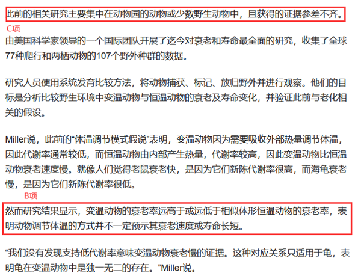

故正确答案为B。

---

## 第 31 题　qid 5911235 · 逻辑判断

近日，某地区出现一例感染性腹泻病例，经诊断为霍乱。得知此消息后，生活在该地区附近的小李提醒身边的人说：“霍乱是甲类传染病，致死率非常高，近期应该减少出门，减少感染几率。”
以下哪项如果为真，最能反驳小李的观点？

- **A**. 从2018年开始，我国霍乱病例不断下降，近5年无死亡病例
- **B**. 霍乱主要通过粪口途径传播，不会通过空气或皮肤接触传播　✅
- **C**. 接触霍乱患者或带菌者后，只要及时清洁和消毒即可避免感染
- **D**. 霍乱由于发病急、病情重、传染快、传播广泛被列为甲类传染病

**答案**：B

**官方解析**

第一步：找出论点和论据。
论点：近期应该减少出门，减少感染几率。
论据：霍乱是甲类传染病，致死率非常高。
论点和论据讨论的均与霍乱有关，话题一致，削弱优先考虑削弱论点。
第二步：逐一分析选项。
A项：指出从2018年开始，我国霍乱病例不断下降，近5年无死亡病例，举例说明霍乱致死率可能并不高，有一定的削弱力度，保留；
B项：指出霍乱主要通过粪口途径传播，不会通过空气或皮肤接触传播，说明尽管该地区附近有霍乱病例，正常出门也并不容易导致感染，因此无需通过减少出门的方式来减少感染几率，削弱论点，可以削弱，保留；
C项：指出接触霍乱患者或带菌者后，只要及时清洁和消毒即可避免感染，表明“及时清洁和消毒”可以减少感染几率，而论点讨论的是“减少出门”可以减少感染几率，话题不一致，为无关项，无法削弱，排除；
D项：指出霍乱由于发病急、病情重、传染快、传播广泛被列为甲类传染病，是对论据的重复，可以加强，无法削弱，排除。
对比A、B两项，题干论点讨论的是减少感染的问题，B项与题干的论点话题更为一致，而A项只涉及到我国近5年的情况，不够全面，且并没有涉及到感染，故B项削弱力度大于A项，当选。
故正确答案为B。

---

## 第 32 题　qid 5911237 · 逻辑判断

进入秋季以来，国际化肥价格呈爆发式上涨，氮肥、磷肥、钾肥比上一年同期都有大幅上涨。对此，有关专家表示，近期受多种因素叠加影响，化肥价格上涨明显，但价格与市场需求量相关，国内肥料价格很快就会回到正常水平。
专家最不可能基于以下哪项得出上述观点？

- **A**. 肥价过高，粮价不稳，经销商和农户购肥积极性减弱
- **B**. 农业用肥即将度过高峰期进入淡季，需求量将会下降
- **C**. 原料价格上涨，生产成本过高，多家化肥企业暂停生产　✅
- **D**. 我国延长收紧化肥出口时间，变相增加了国内化肥供应

**答案**：C

**官方解析**

第一步：找出论点和论据。
论点：价格与市场需求量相关，国内肥料价格很快就会回到正常水平。
论据：无。
本题只有论点，没有论据，加强优先考虑补充论据，且本题为选非题，排除三个能够加强的选项即可。
第二步：逐一分析选项。
A项：选项指出肥价过高会导致经销商和农户购肥积极性减弱，说明化肥需求量会下降，需求量下降会导致价格降低，因此肥料价格可能会回到正常水平，补充论据，可以加强，排除；
B项：选项指出农业用肥即将进入淡季，需求量将会下降，需求量下降会导致价格降低，因此肥料价格可能会回到正常水平，补充论据，可以加强，排除；
C项：选项指出原料价格上涨，生产成本过高，多家化肥企业暂停生产，因此供应量会减少，可能会使价格再次上涨，肥料价格无法回到正常水平，为削弱项，无法加强，当选；
D项：指出我国延长收紧化肥出口时间，变相增加了国内化肥供应，供应量增加可能会导致价格降低，因此肥料价格可能会回到正常水平，补充论据，可以加强，排除。
本题为选非题，故正确答案为C。

---

## 第 33 题　qid 5911241 · 逻辑判断

男性的性染色体为XY，Y来自父亲，X来自母亲；女性的性染色体为XX，来自父母双方。一项研究表明，决定智商的人类基因绝大部分来自X染色体。因此，男性智商只取决于母亲的智商，女性智商则取决于双亲的智商。
以下哪项如果为真，最能质疑上述结论？

- **A**. 男性发生智力障碍的概率是女性的1.4-1.9倍
- **B**. X染色体40%以上的基因在大脑中表达，这一比例远高于Y染色体
- **C**. 母亲与儿子的智商相关程度比父亲与儿子的智商相关程度高约10%　✅
- **D**. 该研究结果通过统计分析大量人类智商数据得出，并非由基因测序获得

**答案**：C

**官方解析**

第一步：找出论点和论据。
论点：男性智商只取决于母亲的智商，女性智商则取决于双亲的智商。
论据：决定智商的人类基因绝大部分来自X染色体。
本题的论据和论点都是在讨论人类智商取决于谁，二者话题一致，削弱优先考虑削弱论点。
第二步：逐一分析选项。
A项：该项讨论的是男性发生智力障碍的概率高于女性，与论点讨论的人类智商取决于谁无关，为无关项，无法削弱，排除；
B项：该项讨论的是X染色体上的基因在大脑中表达的比例远高于Y染色体，无法削弱论点讨论的人类智商取决于谁，无法削弱，排除；
C项：该项讨论的是母亲与儿子的智商相关程度比父亲与儿子的智商相关程度高约10%，说明父亲也会影响男性的智商，削弱了“男性智商只取决于母亲的智商”，削弱论点，保留；
D项：该项讨论的是该研究结果通过统计分析大量人类智商数据得出，并非由基因测序获得，而研究结果讨论的恰是基因来自哪条染色体，说明研究方法有问题，削弱论据，保留。
对比C、D两项，C项削弱论点的力度强于D项削弱论据的力度，故C项当选。
故正确答案为C。

---

## 第 34 题　qid 5911251 · 逻辑判断

近日，某款磁性笔销量大增，买家主要是中小学生。磁性笔由多个磁力小部件组成，依靠强大的磁性可任意变换出不同的造型，颇具娱乐性。磁性笔商家称，磁性笔能开发智力，寓教于乐，让孩子爱上写字，学龄以上孩子都可以安全使用。
以下哪项如果为真，最能质疑商家的说法？

- **A**. 该磁性笔磁力小部件重金属超标，可能对使用者健康造成危害　✅
- **B**. 某调查发现，初三的大部分学生认为磁性笔很无聊，是给小孩子玩的
- **C**. 家长普遍反映，孩子上课只顾着玩磁性笔，听课效率比以前下降了很多
- **D**. 一个四岁孩子在玩磁性笔时不慎吞咽了散落的磁力小部件，造成肠穿孔

**答案**：A

**官方解析**

第一步：找出论点和论据。
论点：磁性笔能开发智力，寓教于乐，让孩子爱上写字，学龄以上孩子都可以安全使用。
论据：无。
本题只有论点没有论据，削弱优先考虑削弱论点。
第二步：逐一分析选项。
A项：该项说的是磁性笔可能危害使用者健康，说明包括学龄以上孩子在内的使用者在使用磁性笔时存在安全隐患，削弱论点，可以削弱，当选；
B项：该项说的是初三大部分学生认为磁性笔无聊，而论点说的是磁性笔是否能够开发智力，让孩子爱上写字，安全使用，二者话题不一致，为无关项，不能削弱，排除；
C项：该项说的是磁性笔会影响孩子的听课效率，而论点说的是磁性笔是否能够开发智力，让孩子爱上写字，安全使用，二者话题不一致，为无关项，不能削弱，排除；
D项：该项说的是一个四岁孩子误吞磁性笔的磁力小部件造成肠穿孔，而论点说的是学龄以上孩子使用磁性笔是否安全，我国的学龄以上儿童一般为六岁以上，二者主体不一致，为无关项，不能削弱，排除。
故正确答案为A。

---

## 第 35 题　qid 5911256 · 逻辑判断

研究人员从分析受试者的呼吸开始，筛选可用于生物识别认证的化合物，共发现了28种可行的化合物。在此基础上，他们开发了一个有16个通道的嗅觉传感器阵列，每个通道都可识别特定范围的化合物。传感器数据随后被传递到机器学习系统中，分析每个人的呼吸组成，并以此区分个人的特征。研究人员根据结果表示，呼吸可作为身份验证的识别信号。
以下哪项如果为真，最能削弱上述观点？

- **A**. 实验受试者仅20人，样本量太少
- **B**. 呼吸样本波动性极高，很容易受饮食、环境甚至情绪影响　✅
- **C**. 16个嗅觉传感器通道较少，识别呼吸的个人特征时准确率并不稳定
- **D**. 即使患呼吸道疾病，一个人呼吸运动的独特性也会在很长时间内保持不变

**答案**：B

**官方解析**

第一步：找出论点和论据。
论点：呼吸可作为身份验证的识别信号。
论据：研究人员开发了一个有16个通道的嗅觉传感器阵列，每个通道都可识别特定范围的化合物。传感器数据随后被传递到机器学习系统中，分析每个人的呼吸组成，并以此区分个人的特征。
本题论点和论据均在讨论通过分析呼吸组成，可以区分个人的特征并由此进行身份验证，二者话题一致，削弱优先考虑削弱论点。
第二步：逐一分析选项。
A项：该项说实验样本量太少，说明实验不科学，可以削弱，保留；
B项：该项说呼吸样本波动性极高，很容易受饮食、环境甚至情绪影响，说明无法通过呼吸进行身份验证，可以削弱，保留；
C项：该项说实验中用到的嗅觉传感器通道数量较少，识别时准确率不稳定，说明实验设备不足，可以削弱，保留；
D项：该项说即使患呼吸道疾病，一个人呼吸运动的独特性也会在很长时间内保持不变，说明呼吸特征几乎不受疾病影响，所以可以通过呼吸进行身份验证，有一定的加强作用，无法削弱，排除。
对比A、B、C三项，A项说的是实验样本数量少，B项说的是实验对象本身存在问题，C项说的是实验的工具有问题，这三者中，B项实验本身的对象对实验的影响最大，对论点的削弱作用更强，故B项削弱力度强于A、C两项，当选。
故正确答案为B。

---
