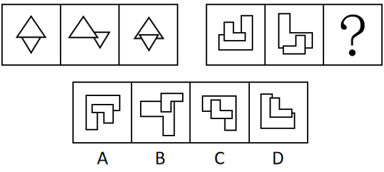
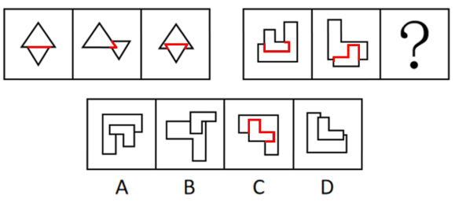
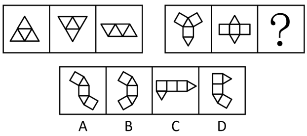
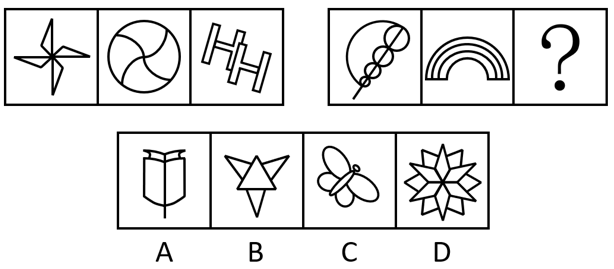
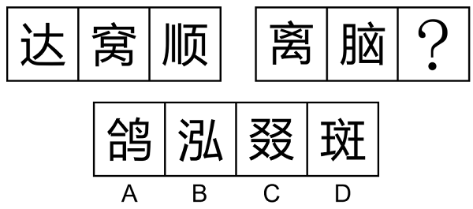
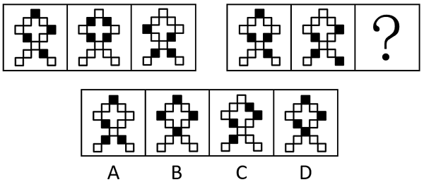
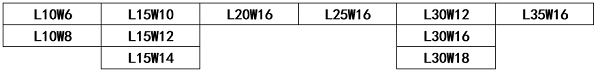

# 2024年深圳市考公务员录用考试《行测》试题（网友回忆版）

> 判断推理 · 20 题 · 深圳市考 2024

## 第 1 题　qid 12536549 · 图形推理

从四个选项中选择一个替代问号，使两套图形的规律表现出最大的相似性，最适合的是（    ）。

- **A**. A
- **B**. B
- **C**. C　✅
- **D**. D

**答案**：C

**官方解析**

元素组成不同，且每幅图均为两个小图形拼合在一起，优先考虑图形间关系。观察发现，第一组图形中，两个小图形均相交于线，考虑相交线的数量。第一组图形相交线的数量依次为：1、2、3，第二组图形相交线的数量依次为：4、5、？，故“？”处图形相交线的数量应为6，只有C项符合。

故正确答案为C。

---

## 第 2 题　qid 12536558 · 图形推理

从四个选项中选择一个替代问号，使两套图形的规律表现出最大的相似性，最适合的是（    ）。

- **A**. A　✅
- **B**. B
- **C**. C
- **D**. D

**答案**：A

**官方解析**

观察发现，第一组图形中，三个图形均为四面体的平面展开图；第二组图形应遵循此规律，前两个图形均为三棱柱的平面展开图，故“？”处应选择一个三棱柱的平面展开图，只有A项符合。
故正确答案为A。

---

## 第 3 题　qid 12536562 · 图形推理

从四个选项中选择一个替代问号，使两套图形的规律表现出最大的相似性，最适合的是（    ）。

- **A**. A
- **B**. B　✅
- **C**. C
- **D**. D

**答案**：B

**官方解析**

元素组成不同，无明显属性规律，考虑数量规律。观察发现，第一组图形中图二为“田”字变形图，优先考虑笔画数。第一组图形笔画数分别为1、2、3，第二组前两幅图形的笔画数分别为1、2，故“？”处应为三笔画图形，只有B项符合。
故正确答案为B。

---

## 第 4 题　qid 12536515 · 图形推理

从四个选项中选择一个替代问号，使两套图形的规律表现出最大的相似性，最适合的是（    ）。

- **A**. A
- **B**. B
- **C**. C
- **D**. D　✅

**答案**：D

**官方解析**

元素组成相似，优先考虑样式规律。观察发现，题干两组图中，第一组图均有“人”，第二组前两幅图均有“乂”，故“？”处也应该有“乂”，只有D项符合。
故正确答案为D。

---

## 第 5 题　qid 12536528 · 图形推理

从四个选项中选择一个替代问号，使两套图形的规律表现出最大的相似性，最适合的是（    ）。

- **A**. A
- **B**. B　✅
- **C**. C
- **D**. D

**答案**：B

**官方解析**

元素组成相同，但无明显位置规律，考虑相邻比较。观察发现，第一组图中，图1与图2有1个黑块的位置相同，图2与图3也有1个黑块的位置相同。第二组图应用此规律，图1与图2有1个黑块的位置相同，那么图2与“？”处也应有1个黑块的位置相同，只有B项符合。
故正确答案为B。

---

## 第 6 题　qid 12536538 · 类比推理

（1）忌不自信，比美徐公
（2）亲见徐公，自视弗如
（3）遍问亲友，皆称忌美
（4）王令臣谏，国力益强
（5）入朝觐见，言王之蔽

- **A**. 3-2-1-4-5
- **B**. 2-1-3-5-4
- **C**. 1-3-2-4-5
- **D**. 1-3-2-5-4　✅

**答案**：D

**官方解析**

第一步：先确定逻辑关系最为明显的逻辑顺序。
观察题干，五个事件主要是围绕着“邹忌与徐公比美”开展的。逻辑关系的先后顺序比较明显的事件是事件（1）和事件（2），先“忌不自信，比美徐公”，然后才能“亲见徐公，自视弗如”，即邹忌先想要和徐公比美，然后看见了徐公，感觉不如他美，事件（1）应该在事件（2）前面，排除A、B两项。
第二步：逐一对照选项并判断正确答案。
根据第一步的结果可以判断只有C、D两项符合，通过分析事件（4）和事件（5）可知，应先“入朝觐见，言王之蔽”，再“王令臣谏，国力益强”，因此事件（5）应该在事件（4）前面，排除C项。
故正确答案为D。

---

## 第 7 题　qid 12536521 · 类比推理

（1）开启抱团揽才
（2）优质人才集聚
（3）成立引才联盟
（4）支撑长远发展
（5）政企高效协作

- **A**. 1-3-2-5-4
- **B**. 3-1-2-5-4
- **C**. 3-5-1-2-4　✅
- **D**. 3-2-5-4-1

**答案**：C

**官方解析**

第一步：先确定逻辑关系最为明显的逻辑顺序。
观察题干，五个事件主要是围绕着“政企抱团引才”开展的。逻辑关系的先后顺序比较明显的事件是事件（1）和事件（3），先“成立引才联盟”，然后才能“开启抱团揽才”，事件（3）应该在事件（1）前面，排除A项。
第二步：逐一对照选项并判断正确答案。
根据第一步的结果可以判断只有B、C、D三项符合，通过分析事件（1）、事件（2）和事件（5）可知，应先“政企高效协作”，才能“开启抱团揽才”，然后“优质人才集聚”，因此事件（5）应该在事件（1）前面，事件（1）应该在事件（2）前面，排除B、D两项。
故正确答案为C。

---

## 第 8 题　qid 12536526 · 类比推理

（1）国际机构开展检测评估
（2）全面暂停进口日本水产
（3）排海方案引发全球担忧
（4）利用评估报告作为背书
（5）无视公共利益强行排海

- **A**. 3-5-1-4-2
- **B**. 3-1-4-5-2　✅
- **C**. 3-2-5-1-4
- **D**. 5-2-3-1-4

**答案**：B

**官方解析**

第一步：先确定逻辑关系最为明显的逻辑顺序。
观察题干，五个事件主要是围绕着“日本排放核废水”开展的。逻辑关系的先后顺序比较明显的事件是事件（2）和事件（4），结合题干中其他事件可知，日本利用评估报告作为背书，从而强行排海，所以其他国家只能全面暂停进口日本水产，即事件（2）是最终的结果，因此，事件（4）在事件（2）的前面，故事件（2）为尾句，排除C、D两项。
第二步：逐一对照选项并判断正确答案。
根据第一步的结果可以判断A、B两项均符合，排海方案引发全球担忧后，应该是先由国际机构开展检测评估，然后日本利用评估报告作为背书，从而无视公共利益强行排海，即顺序应为（1）（4）（5），排除A项。
故正确答案为B。

---

## 第 9 题　qid 10718158 · 类比推理

（1）红色信念，晚舟归航
（2）逮捕高层，持续打压
（3）技术突破，遥遥领先
（4）逆风拼搏，加速研发
（5）启动调查，无端指控

- **A**. 5-2-4-1-3　✅
- **B**. 5-4-2-3-1
- **C**. 4-2-5-1-3
- **D**. 4-5-2-3-1

**答案**：A

**官方解析**

第一步：先确定逻辑关系最为明显的逻辑顺序。
观察题干，五个事件主要围绕着“企业被打压进行反击”开展的。逻辑关系的先后顺序比较明显的是事件（5）和事件（4），要先“无端指控”，才能“逆风拼搏，加速研发”，因此事件（5）是加速研发的起因，事件（4）是对无端指控行为的反击，故事件（5）应排在首位，排除C、D两项。
第二步：逐一对照选项并判断正确答案。
根据第一步得到的结果可以判断只有A、B两项符合，通过分析事件（2）和事件（4）可得，事件（5）和事件（2）都属于加速研发的原因，因此事件（2）排在事件（4）前面，排除B项。
故正确答案为A。

---

## 第 10 题　qid 12536543 · 类比推理

（1）牧童遥指杏花村
（2）东边日出西边雨
（3）忽如一夜春风来
（4）寒露入暮愁衣单
（5）草长莺飞二月天

- **A**. 1-4-3-2-5
- **B**. 5-3-1-2-4
- **C**. 3-5-4-1-2
- **D**. 5-1-2-4-3　✅

**答案**：D

**官方解析**

观察题干，五个事件均为诗句，可根据诗句描写的时间先后进行排序。
（1）“牧童遥指杏花村”出自杜牧的《清明》，描写的是清明时节（一般在公历4月4日至6日之间变动，并不固定在某一天，但以4月5日最常见）；
（2）“东边日出西边雨”出自刘禹锡的《竹枝词二首·其一》，诗句描写的情况多出现在夏季；
（3）“忽如一夜春风来”出自岑参的《白雪歌送武判官归京》，描写的是冬季；
（4）“寒露入暮愁衣单”出自王安石的《八月十九日试院梦冲卿》，描写的是秋季；
（5）“草长莺飞二月天”出自高鼎的《村居》，描写的是农历二月。
按照时间先后排序为5-1-2-4-3，对应D项。
故正确答案为D。

---

## 第 11 题　qid 10718178 · 逻辑判断

某景区漂流项目的工作人员用扩音器循环播放注意须知：“除非年龄在55岁以下，并且穿上救生衣，否则不能漂流。”同时，出于安全考虑，有高血压或心脏病的游客不能漂流。老王穿上了救生衣，但最后工作人员没允许他去漂流。
由此可推知，以下选项一定为真的是（    ）。

- **A**. 如果老王年满55岁，则他一定有高血压或心脏病
- **B**. 老王有高血压或心脏病
- **C**. 老王年满55岁，且有高血压或心脏病
- **D**. 老王要么年满55岁，要么有高血压或心脏病　✅

**答案**：D

**官方解析**

第一步：翻译题干。

①能漂流55岁以下 且 穿上救生衣

②有高血压 或 心脏病漂流

第二步：根据题干条件进行推理。

如果老王年满55岁，是对条件①的否后，根据“否后必否前”可以得出老王不能漂流；

如果老王有高血压或心脏病，是对条件②的肯前，根据“肯前必肯后”可以得出老王不能漂流。

综上，只要满足其一，那么老王就不能漂流。

故正确答案为D。

---

## 第 12 题　qid 12536573 · 逻辑判断

蔬菜是重要的“菜篮子”产品，但其易腐烂、难贮存，长时间、远距离运输容易增加中间成本和质量安全隐患，进而影响城市蔬菜供应。可见，大中城市拥有足够面积的常年菜地存在必要性。然而，有些人对此持不同意见，认为城市寸土寸金，应该发展收益高的产业，没有必要发展农业。
下列选项如果为真，最能反驳以上意见的是（    ）。

- **A**. 越来越多城际高速公路为农产品开设“绿色通道”，保证生鲜农产品运输畅通
- **B**. 结合体验农业、观光农业等第三产业发展城市农业，既能带来高收益，还能发挥观光、休闲等生活性功能
- **C**. 在城市发展农业能解决部分“低端岗位”就业问题，促进城市低收入群体创业增收
- **D**. 一旦出现极端恶劣天气等突发情况影响运输，势必导致城市农产品供应短缺，不利于社会平稳发展　✅

**答案**：D

**官方解析**

第一步：找出论点和论据。
论点：城市寸土寸金，应该发展收益高的产业，没有必要发展农业。
论据：无。
本题只有论点没有论据，削弱优先考虑削弱论点，即说明发展城市农业存在必要性。
第二步：逐一分析选项。
A项：该项说的是城际高速公路开设的“绿色通道”保证了生鲜农产品运输畅通，则没有必要发展城市农业，为加强项，无法削弱，排除；
B项：该项说的是发展城市农业既能带来高收益，也能发挥观光、休闲等生活性功能，即发展城市农业存在一定的好处，但存在好处不等同于有发展的必要性，因此不明确发展城市农业是否必要，为不明确项，无法削弱，排除；
C项：该项说的是发展城市农业可以促进城市低收入群体创业增收，即发展城市农业存在一定的好处，但存在好处不等同于有发展的必要性，因此不明确发展城市农业是否必要，为不明确项，无法削弱，排除；
D项：该项说的是一旦出现极端恶劣天气等突发情况，城市农产品供应会短缺，不利于社会平稳发展，此时城市农业的存在可以缓解农产品供应短缺的问题，保障社会平稳，即发展城市农业存在必要性，削弱论点，可以削弱，当选。
故正确答案为D。

---

## 第 13 题　qid 12536574 · 逻辑判断

这几年报名参加社会工作者职业资格考试的人越来越多了，可以说，所有想从事专门性社会服务工作的人都想取得社会工作者职业资格证书。阿社也想取得社会工作者职业资格证书，所以，阿社一定想从事专门性社会服务工作。
下列选项如果为真，最能加强上述论证的是（    ）。

- **A**. 不想取得社会工作者职业资格证书的人，就不会报名参加社会工作者职业资格考试
- **B**. 只有想从事专门性社会服务工作的人，才想取得社会工作者职业资格证书　✅
- **C**. 只有取得了社会工作者职业资格证书的人，才有资格从事专门性社会服务工作
- **D**. 从事专门性社会服务工作的人大都持有社会工作者职业资格证书

**答案**：B

**官方解析**

第一步：找出论点和论据。

论点：阿社一定想从事专门性社会服务工作。

论据：阿社想取得社会工作者职业资格证书。

论点说的是“想从事专门性社会服务工作”，论据说的是“想取得社会工作者职业资格证书”，二者话题不一致，加强优先考虑搭桥，即在“想取得社会工作者职业资格证书”与“想从事专门性社会服务工作”之间建立联系。

第二步：逐一分析选项。

A项：可翻译为：报名参加社会工作者职业资格考试想取得社会工作者职业资格证书，没有涉及论点说的“想从事专门性社会服务工作”，无法加强，排除；

B项：可翻译为：想取得社会工作者职业资格证书想从事专门性社会服务工作，在“想取得社会工作者职业资格证书”与“想从事专门性社会服务工作”之间建立了联系，搭桥项，可以加强，当选；

C项：可翻译为：有资格从事专门性社会服务工作取得了社会工作者职业资格证书，“有资格从事专门性社会服务工作”与论点说的“想从事专门性社会服务工作”话题不一致，无法加强，排除；

D项：选项说的是“从事专门性社会服务工作”，而论点说的是“想从事专门性社会服务工作”，二者话题不一致，无法加强，排除。

故正确答案为B。

---

## 第 14 题　qid 12536575 · 类比推理

鲸鱼是动物，所以小鲸鱼是小动物。
以下选项中的逻辑错误，与题干最为相似的是（    ）。

- **A**. 掉一根头发不算秃头，再掉一根头发也不算秃头，是最后掉的一根头发造成了秃头
- **B**. 半夜被吵醒的甲对邻居乙说：“你夜半高歌，影响别人休息。”乙对甲说：“影响别人，又不影响你，关你什么事？”　✅
- **C**. 柠檬都是酸味的，百香果不是柠檬，所以百香果不是酸味的
- **D**. 船舶抛锚了就必须请求救援，这艘船破了一个大洞，但没有抛锚，所以不必请求救援

**答案**：B

**官方解析**

第一步：分析题干中的逻辑错误。
鲸鱼是动物，所以小鲸鱼是小动物，其中“小鲸鱼”中的“小”指年龄小，“小动物”中的“小”指体型小，将“年龄小”偷换为“体型小”，犯了偷换概念的逻辑错误。
第二步：逐一分析选项。
A项：题干中出现了“掉一根头发”与“秃头”两个概念，在论证过程中未发生含义变化，都是同一个意思，不存在偷换概念，与题干所犯逻辑错误不一致，排除；
B项：甲对乙说的“你夜半高歌，影响别人休息”，其中“别人”指除了乙之外的人。乙对甲说的“影响别人，又不影响你”，其中“别人”指除了甲、乙之外的人，乙将“除了乙之外的人”偷换为“除了甲、乙之外的人”，犯了偷换概念的逻辑错误，与题干所犯逻辑错误一致，当选；
C项：柠檬都是酸味的，百香果不是柠檬，所以百香果不是酸味的，犯了否前推否后的逻辑错误，且“百香果”“柠檬”“酸味”三个概念在论证过程中未发生含义变化，都是同一个意思，不涉及偷换概念，与题干所犯逻辑错误不一致，排除；
D项：船舶抛锚了就必须请求救援，这艘船没有抛锚，所以不必请求救援，犯了否前推否后的逻辑错误，且“船”“抛锚”“救援”三个概念在论证过程中未发生含义变化，都是同一个意思，不涉及偷换概念，与题干所犯逻辑错误不一致，排除。
故正确答案为B。

---

## 第 15 题　qid 10718191 · 类比推理

博物馆陈列了簪、钗、钿、篦四种清代发饰，其主要材质各不相同，有金、银、铜、玉四种发饰的主要材质，以下说法均为真：
①如果簪是金的，那么钗一定不是铜的；
②如果钗不是金的，那么篦一定是玉的；
③如果钗是金的，那么钿一定是玉的；
④如果钿是铜的，那么篦一定不是银的；
⑤如果钿不是银的，那么篦就是银的；
⑥如果篦是铜的，那么簪一定不是玉的。
由此可推知，簪的主要材质是（    ）。

- **A**. 金
- **B**. 银
- **C**. 铜　✅
- **D**. 玉

**答案**：C

**官方解析**

第一步：翻译题干。

①簪金钗铜；

②钗金篦玉；

③钗金钿玉；

④钿铜篦银；

⑤钿银篦银；

⑥篦铜簪玉。

第二步：根据题干条件进行推理。

题干条件②③涉及了钗金的所有情况，故从此处开始推理。结合条件②“钗金篦玉”和条件③“钗金钿玉”可知，无论钗是否是金的，材质为玉的一定是篦或钿；再根据条件⑤“钿银篦银”等价于“钿银 或 篦银”可知，材质为银的也一定是篦或钿，因此篦或钿的材质只能是银或玉，则簪和钗的材质只能是金或铜，假设簪是金的，根据条件①可知钗一定不是铜的，此时与前面推理的结果矛盾，因此簪是铜的，对应C项。

故正确答案为C。

---

## 第 16 题　qid 10718154 · 类比推理

某小区发生一起凶杀案，死者是一位女性，最先发现血泊中的死者尸体的人是她的邻居们，如果最先发现死者尸体的人是凶手，那么邻居们都是凶手。
以下选项中的逻辑结构，与题干最为相似的是（    ）。

- **A**. 开展“特种兵旅行”的人都是大学生，开展“特种兵旅行”的人都是精力旺盛的人，所以大学生都是精力旺盛的人　✅
- **B**. 最先到达终点的人是第一名，第一名会得到万元奖励，所以最先到达终点的人会得到万元奖励
- **C**. 凡是有理想的人都爱读书，如果小李爱读书，则说明小李有理想
- **D**. 如果最先到达灾害现场的人是医生，而且医生会把伤亡人数降到最低，那么灾害现场的伤亡人数会降到最低

**答案**：A

**官方解析**

第一步：分析题干推理形式。

题干翻译为：最先发现死者尸体邻居们，最先发现死者尸体凶手，结论：邻居们凶手。

题干逻辑结构为：12，13，结论：23。

第二步：逐一分析选项。

A项：翻译为：开展“特种兵旅行”大学生，开展“特种兵旅行”精力旺盛的人，结论：大学生精力旺盛的人，逻辑结构为：12，13，结论：23，与题干推理形式一致，当选；

B项：翻译为：最先到达终点第一名，第一名得到万元奖励，结论：最先到达终点得到万元奖励，逻辑结构为：12，23，结论：13，与题干推理形式不一致，排除；

C项：翻译为：有理想爱读书，小李爱读书，结论：小李有理想，逻辑结构为：12，32，结论：31，与题干推理形式不一致，排除；

D项：翻译为：最先到达灾害现场医生，医生把伤亡人数降到最低，结论：灾害现场伤亡人数降到最低，逻辑结构为：12，23，结论：13，与题干推理形式不一致，排除。

故正确答案为A。

---

## 第 17 题　qid 10718152 · 逻辑判断

我国数字音乐产业经历了20多年稳步发展，尽管国内数字音乐用户付费率与国际平台相比还有一定差距，但国内用户付费习惯已普遍养成，市场已经颇具规模，然而近两年，数字音乐平台面临规模缩水、用户流失的严重风险。
下列选项如果为真，最不能解释上述矛盾现象的是（    ）。

- **A**. 数字音乐用户版权意识缺失，付费意识易受免费资源冲击　✅
- **B**. 音乐市场缺乏优质音乐新作，内容陈旧导致用户黏性不足
- **C**. 数字音乐平台收费标准提高，付费音乐消费能力持续低迷
- **D**. 线上文化娱乐供给不断丰富，内容平台开启存量用户争夺

**答案**：A

**官方解析**

第一步：找出题干矛盾。
国内用户付费习惯已普遍养成，市场已经颇具规模，然而近两年，数字音乐平台面临规模缩水、用户流失的严重风险。
第二步：逐一分析选项。
A项：数字音乐用户版权意识缺失，付费意识易受免费资源冲击，与题干中“国内用户付费习惯已普遍养成”存在矛盾，无法解释为什么国内用户付费习惯已普遍养成的情况下，近两年数字音乐平台面临规模缩水、用户流失的严重风险，不能解释题干矛盾，当选；
B项：音乐作品内容陈旧导致用户黏性不足，从而导致数字音乐平台的用户流失，可以解释为什么国内用户付费习惯已普遍养成的情况下，近两年数字音乐平台面临规模缩水、用户流失的严重风险，可以解释题干矛盾，排除；
C项：数字音乐平台收费标准提高，付费音乐消费能力持续低迷，从而导致数字音乐平台的用户流失，可以解释为什么国内用户付费习惯已普遍养成的情况下，近两年数字音乐平台面临规模缩水、用户流失的严重风险，可以解释题干矛盾，排除；
D项：线上文化娱乐供给不断丰富，内容平台开启存量用户争夺，从而导致数字音乐平台的用户流失，可以解释为什么国内用户付费习惯已普遍养成的情况下，近两年数字音乐平台面临规模缩水、用户流失的严重风险，可以解释题干矛盾，排除。
本题为选非题，故正确答案为A。

---

## 第 18 题　qid 10718153 · 类比推理

桌子上摆放着11种规格的条形蛋糕模具（摆放位置如下图），张师傅悄悄地在其中一个模具下贴了一枚红星，并将“红星模具”的长度（L表示长度）告诉了徒弟小李，将宽度（W表示宽度）告诉了小范。小李和小范观察了一会儿，同时表示不知道“红星模具”是哪个，又过了一会儿，小范说：“现在我知道了。”小李听后想了想，接着说：“我也知道了。”

由此可推知，“红星模具”的规格是（    ）。

- **A**. L30W12
- **B**. L20W12
- **C**. L30W16　✅
- **D**. L15W12

**答案**：C

**官方解析**

第一步：分析题干条件。
（1）11种规格的条形蛋糕模具，其中一个模具下贴了一枚红星；
（2）小李知道“红星模具”的长度，小范知道“红星模具”的宽度；
（3）小李和小范同时表示不知道“红星模具”是哪个；
（4）又过了一会儿，小范和小李依次表示都知道了。
第二步：根据题干条件进行推理。
结合条件（1）（2）（3）可知，只知道长度或宽度无法确定“红星模具”，即说明“红星模具”的长度、宽度的数值并不唯一，结合图中数值可知，长度不唯一的数值为L10、L15、L30，宽度不唯一的数值为W12、W16，故“红星模具”可能为L15W12、L30W12、L30W16，又结合条件（4），小范表示知道了，说明这三组数值中宽度是唯一的，即只有L30W16符合。
故正确答案为C。

---

## 第 19 题　qid 12536536 · 类比推理

某地发生一起重大诈骗案，警方通过调查抓获五个犯罪嫌疑人。面对警方的讯问，五人的供述如下：
甲：“不是我，也不是丁。”
乙：“如果是我，那么丙就没参与诈骗。”
丙：“乙和丁中必有一人参与。”
丁：“只有甲参与了，戊才会参与诈骗。”
戊：“至少有三个人参与了此次诈骗。”
经证实，甲只说了一半真话，其他人说的都是真话，则罪犯是（    ）。

- **A**. 甲、乙、戊　✅
- **B**. 乙、丁、戊
- **C**. 甲、丙、丁
- **D**. 甲、乙、丙、戊

**答案**：A

**官方解析**

第一步：分析题干条件。

（1）甲：甲 且 丁；

（2）乙：乙丙；

（3）丙：乙 或 丁；

（4）丁：戊甲；

（5）戊：至少有三人参与诈骗；

（6）甲一半真话一半假话，其他人均为真话。

第二步：根据题干条件进行推理。

选项信息充分，优先考虑排除法。

根据条件（2）可知如果乙参与，则丙就没参与，排除D项；

根据条件（4）可知只有甲参与了，戊才会参与，排除B项；

余下的A、C两项中都有甲，说明甲一定是罪犯，因此“甲”为假，根据“甲只说了一半真话”可知，“丁”为真，即丁没有参与，排除C项；

经验证，A项符合所有条件。

故正确答案为A。

---

## 第 20 题　qid 12536541 · 逻辑判断

出丑效应是指这样一种现象：在公共场合中，才能平庸者固然不会受人倾慕，而全然无缺点的人也未必讨人喜欢，即最讨人喜欢的人是有才能或精明而带有小缺点的人。
根据以上定义，以下选项体现了出丑效应的是（    ）。

- **A**. 某国家科技大奖得主在接受外国记者采访时因太紧张而说话结巴，反而因其“接地气”广受网友喜爱　✅
- **B**. 某知名律师经常因过度焦虑在开庭前夜彻夜难眠，但她专业能力十分出众，很多人慕名而来找她代理案件
- **C**. 某歌手在演唱会上假唱，还在台上绊了一跤，于是他故意跌个四脚朝天，引得媒体纷纷报道
- **D**. 曾被誉为“篮球闪电侠”的老球员浑身伤病，只能作为替补上场，他被新人球员轻松晃倒在地，但现场观众仍献上掌声表示鼓励

**答案**：A

**官方解析**

第一步：找出定义关键词。
“最讨人喜欢的人”、“有才能或精明而带有小缺点”。
第二步：逐一分析选项。
A项：获得国家科技大奖说明其有才能，因紧张而说话结巴，符合“有才能或精明而带有小缺点”，广受网友喜爱，符合“最讨人喜欢的人”，符合定义，当选；
B项：某知名律师因过度焦虑在开庭前夜彻夜难眠，焦虑失眠并不是“缺点”，不符合“有才能或精明而带有小缺点”，不符合定义，排除；
C项：某歌手在演唱会上假唱，还故意跌个四脚朝天，仅体现出“缺点”，不符合“有才能或精明而带有小缺点”，且媒体纷纷报道也未体现是因“喜欢”此歌手，不符合“最讨人喜欢的人”，不符合定义，排除；
D项：老球员浑身伤病，被新人球员轻松晃倒在地，仅体现出其作为球员身体素质不强的缺点，不符合“有才能或精明而带有小缺点”，且现场观众鼓掌是为了鼓励，未体现是因“喜欢”，不符合“最讨人喜欢的人”，不符合定义，排除。
故正确答案为A。

---
