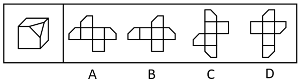
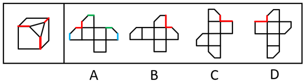
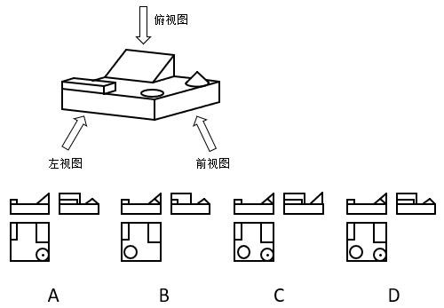
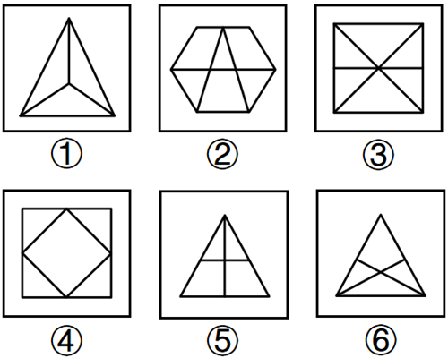
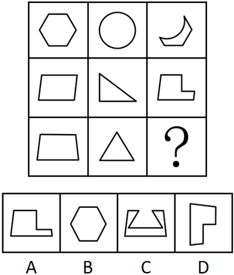
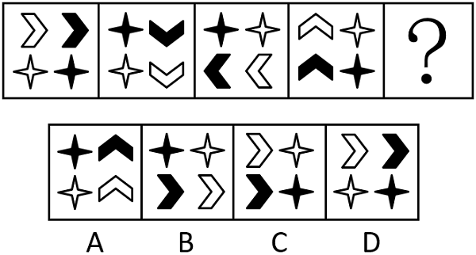

# 2024年湖北省选调生招录考试综合知识和行政职业能力测验试卷（网友回忆版）

> 判断推理 · 23 题 · 湖北 2024

## 第 1 题　qid 15137546 · 图形推理

下图一正方体纸盒切除一角，其展开图能对应的是：

- **A**. A　✅
- **B**. B
- **C**. C
- **D**. D

**答案**：A

**官方解析**

题干立体图形为切除一角的正方体纸盒，如下图所示，被切割的三个面的短边应两两相邻。

A项：被切割的三个面的短边两两相邻，选项与题干一致，当选；

B项：选项最右侧面的一条短边与另一条长边相邻，选项与题干不一致，排除；

C项：选项最上方面的一条短边与另一条长边相邻，选项与题干不一致，排除；

D项：选项最上方面的一条短边与另一条长边相邻，选项与题干不一致，排除。

故正确答案为A。

---

## 第 2 题　qid 15137577 · 图形推理

为下方立体模型绘制前视图、左视图和俯视图，正确的一项是：

- **A**. A
- **B**. B
- **C**. C
- **D**. D　✅

**答案**：D

**官方解析**

本题考查三视图，该立体图形的前视图、左视图和俯视图如下图所示，逐一分析选项。

A项：对应该立体图形的前视图缺少一条斜线，俯视图缺少一个圆形，排除；

B项：对应该立体图形的左视图小长方形比例有误，俯视图缺少一个圆形及其中心点，排除；

C项：对应该立体图形的左视图三角形形状有误，排除； 

D项：对应该立体图形前视图、左视图和俯视图均正确，当选。

故正确答案为D。

---

## 第 3 题　qid 15137567 · 图形推理

把下面的六个图形分成两类，使每一类图形都有各自的规律和特性，分类正确的一项是：

- **A**. ①②④，③⑤⑥　✅
- **B**. ①②③，④⑤⑥
- **C**. ①③④，②⑤⑥
- **D**. ①③⑥，②④⑤

**答案**：A

**官方解析**

本题为分组分类题目。元素组成不同，且无明显属性规律，考虑数量规律。题干图形封闭区域明显，优先考虑数面，面数量依次为3、6、6、5、4、4，单独看无规律；继续观察发现，题干图形均由直线构成，考虑数直线，直线数量依次为6、9、7、8、5、5，单独看无规律，考虑二者做运算。图①②④中，直线数-面数量=3，图③⑤⑥中，直线数-面数量=1。即图①②④为一组，图③⑤⑥为一组。
故正确答案为A。

---

## 第 4 题　qid 15137579 · 图形推理

从所给的四个选项中，选择最合适的一个填入问号处，使之呈现一定的规律性。

- **A**. A
- **B**. B
- **C**. C　✅
- **D**. D

**答案**：C

**官方解析**

元素组成相似，优先考虑样式规律。九宫格优先看横行，第一行中，图二覆盖住部分图一，只观察图一剩余部分的轮廓可以得到图三；经验证，第二行符合此规律；第三行应用此规律，只有C项符合。

故正确答案为C。

---

## 第 5 题　qid 15137570 · 图形推理

从所给的四个选项中，选择最合适的一个填入问号处，使之呈现一定的规律性。

- **A**. A
- **B**. B
- **C**. C
- **D**. D　✅

**答案**：D

**官方解析**

元素组成相同，优先考虑位置规律。观察发现，每幅图形的内部元素顺时针平移一步，同时自身顺时针旋转，自身颜色黑白交替可以得到下一幅图形，？处应用此规律，只有D项符合。

故正确答案为D。

---

## 第 6 题　qid 15137583 · 定义判断

第四堵墙是指在镜框式舞台上，通过人们的想象位于舞台台口的一道实际上并不存在的“墙”。通过第四堵墙，将演员与观众相对隔开，让演员潜心于舞台表演和角色的塑造。
根据上述定义，下列情形体现了第四堵墙理念的是：

- **A**. 演员在表演时眼盯着观众，并试图用眼神与观众进行交流
- **B**. 导演让演员在台上不要看观众的反应，该怎么演就怎么演　✅
- **C**. 戏剧舞台上为了演出需要时不时降下幕布
- **D**. 相声演员在表演时经常有意跟观众搭话

**答案**：B

**官方解析**

第一步：找出定义关键词。
“位于舞台台口的一道实际上并不存在的‘墙’”、“将演员与观众相对隔开”、“让演员潜心于舞台表演和角色的塑造”。
第二步：逐一分析选项。
A项：演员在表演时眼盯着观众，并试图用眼神与观众进行交流，不符合“将演员与观众相对隔开”、“让演员潜心于舞台表演和角色的塑造”，不符合定义，排除；
B项：导演让演员在台上不要看观众的反应，该怎么演就怎么演，符合“位于舞台台口的一道实际上并不存在的‘墙’”、“将演员与观众相对隔开”、“让演员潜心于舞台表演和角色的塑造”，符合定义，当选；
C项：演出时降下的幕布是实际存在的“墙”，不符合“位于舞台台口的一道实际上并不存在的‘墙’”，不符合定义，排除；
D项：相声演员在表演时经常有意跟观众搭话，不符合“将演员与观众相对隔开”、“让演员潜心于舞台表演和角色的塑造”，不符合定义，排除。
故正确答案为B。

---

## 第 7 题　qid 15137553 · 定义判断

经济学认为，商品的效用是指消费者消费物品和服务时所感受到的快乐和满足的程度。在消费行为中，消费者是主体，商品是否有用，有多大用，即效用的大小，是以消费者自己的判断和评价为转移的。
根据上述定义，下列情形体现了商品的效用的是：

- **A**. 拉斐尔的一件人物像素描，长37.5厘米，宽27.8厘米，估价1000万英镑，最终以2970万英镑拍卖成功
- **B**. 老黄通过竞拍花1000万买下一幅名家名画。他认为，竞拍成功能体现他的财富、眼光、风雅，至于画作如何他不在意
- **C**. 对某商品，小张说很有价值，愿花90元购买；小李认为价值一般，最多愿花45元购买；小刘则认为没有价值，一钱不值　✅
- **D**. 有人喜欢用小米手机，有人喜欢用华为手机，有人喜欢用其他品牌手机，各人因喜好、使用习惯和购买力决定用什么手机

**答案**：C

**官方解析**

第一步：找出定义关键词。
“商品效用的大小以消费者自己的判断和评价为转移”。
第二步：逐一分析选项。
A项：该项指出拉斐尔的一件人物像最终以2970万英镑拍卖成功，没有体现出消费者对于该人物像的判断和评价，不符合“商品效用的大小以消费者自己的判断和评价为转移”，没有体现出商品的效用，排除；
B项：该项指出老黄成功竞拍一幅名画，可以体现他的财富、眼光等，但他不在意画作本身，没有体现出老黄对于该名画的判断和评价，不符合“商品效用的大小以消费者自己的判断和评价为转移”，没有体现出商品的效用，排除；
C项：该项指出三个人对于某商品有不同的判断和评价，符合“商品效用的大小以消费者自己的判断和评价为转移”，体现了商品的效用，当选；
D项：该项指出各人因喜好、使用习惯和购买力决定用什么手机，没有体现人们对于手机的评价，不符合“商品效用的大小以消费者自己的判断和评价为转移”，没有体现出商品的效用，排除。
故正确答案为C。

---

## 第 8 题　qid 15137575 · 定义判断

心理停顿是指由人物内心的观念活动或情感需求而造成的语言停顿。心理停顿是为表示复杂而强烈的情感而作的停顿，停顿的部位和时间以体现人物复杂的内心活动为标准。
根据上述定义，下列情形属于心理停顿的是：

- **A**. 在说到母亲的不幸去世时，小雨哽咽着暂停叙说　✅
- **B**. 老师看到有学生在讲话，故意暂停了自己的朗读
- **C**. 小青读书读到激烈的战争场面时不由得屏气收声
- **D**. 突然一声巨响让正在讲话的小山吓得停了下来

**答案**：A

**官方解析**

第一步：找出定义关键词。
“由人物内心的观念活动或情感需求而造成的语言停顿”。
第二步：逐一分析选项。
A项：小雨在叙说中因说到母亲不幸去世而哽咽，说明小雨出于自身的情感，对母亲的去世而感到悲痛，符合“由人物内心的观念活动或情感需求而造成的语言停顿”，符合定义，当选；
B项：老师因看到学生讲话而故意暂停朗读，其中学生的讲话不属于老师内心的观念活动或情感需求，不符合“由人物内心的观念活动或情感需求而造成的语言停顿”，不符合定义，排除；
C项：小青在读书时因读到激烈的战争场面而屏气收声，其中激烈的战争场面不属于小青内心的观念活动或情感需求，不符合“由人物内心的观念活动或情感需求而造成的语言停顿”，不符合定义，排除；
D项：小山因巨响而停止讲话，其中巨响不属于小山内心的观念活动或情感需求，不符合“由人物内心的观念活动或情感需求而造成的语言停顿”，不符合定义，排除。
故正确答案为A。

---

## 第 9 题　qid 15137585 · 定义判断

整合营销传播是将各种传播方式有机结合起来的一种系统的传播活动。整合营销传播强调以消费者为中心，从消费者的需求和角度出发。
根据上述定义，下列情形属于整合营销传播的是：

- **A**. 公司运用线上和线下相结合的方式销售一种网红产品
- **B**. 公司根据老年消费者的实际情况采取了线下产品宣传
- **C**. 公司同时使用报纸、电视、网络等多种方式对产品进行宣传
- **D**. 公司根据目标消费者的属性综合运用网络和新媒体投放广告　✅

**答案**：D

**官方解析**

第一步：找出定义关键词。
“将各种传播方式有机结合起来”、“以消费者为中心”、“从消费者的需求和角度出发”。
第二步：逐一分析选项。
A项：公司运用线上和线下相结合的方式销售产品，未体现“以消费者为中心”、“从消费者的需求和角度出发”，不符合定义，排除；
B项：公司根据老年消费者的实际情况采取线下产品宣传，其中只涉及线下的宣传方式，不符合“将各种传播方式有机结合起来”，不符合定义，排除；
C项：公司使用多种媒介来宣传产品，未体现“以消费者为中心”、“从消费者的需求和角度出发”，不符合定义，排除；
D项：公司综合运用网络和新媒体投放广告，符合“将各种传播方式有机结合起来”，且根据目标消费者的属性投放广告，符合“以消费者为中心”、“从消费者的需求和角度出发”，符合定义，当选。
故正确答案为D。

---

## 第 10 题　qid 15137611 · 定义判断

循环信贷是指在协定的有效期内，只要企业的借款总额未超过最高限额，银行就必须满足企业任何时候提出的借款要求的一种信贷。企业享用循环信贷，要对贷款限额的未使用部分支付给银行一笔费用。
根据上述定义，下列情形属于循环信贷的是：

- **A**. 某企业按协定，2023年向银行贷款400万元，当年还清，后拖欠100万元未还，银行要求支付额外利息
- **B**. 某企业按协定，2023年向银行贷款300万元，先贷200万，余下100万可需要时再贷，但需支付银行利息　✅
- **C**. 某企业按协定，2023年向银行贷款400万元，后追加贷款100万元，银行要求追加的100万需额外支付利息
- **D**. 某企业按协定，2023年向银行贷款500万元，后因故减贷100万元，银行要求减贷的100万也需支付部分利息

**答案**：B

**官方解析**

第一步：找出定义关键词。
“在协定的有效期内”、“企业借款总额未超过最高限额”、“银行必须满足企业任何时候提出的借款要求”、“企业要对贷款限额的未使用部分支付给银行一笔费用”。
第二步：逐一分析选项。
A项：企业拖欠未还的100万元，不符合“贷款限额的未使用部分”，银行要求企业支付的额外利息，不符合“企业要对贷款限额的未使用部分支付给银行一笔费用”，不符合定义，排除；
B项：企业按协定向银行贷款300万元，说明贷款最高限额为300万元，先贷200万，符合“企业借款总额未超过最高限额”，余下100万可需要时再贷，符合“银行必须满足企业任何时候提出的借款要求”，且这100万需要额外给银行支付利息，符合“企业要对贷款限额的未使用部分支付给银行一笔费用”，符合定义，当选；
C项：企业按协定向银行贷款400万元，说明贷款最高限额为400万元，后面追加的100万元，不符合“贷款限额的未使用部分”，银行针对这100万元索要的额外利息，不符合“企业要对贷款限额的未使用部分支付给银行一笔费用”，不符合定义，排除；
D项：企业按协定向银行贷款500万元，后减贷100万元，说明减贷的100万元已不是企业的借款要求，不符合“企业任何时候提出的借款要求”、“贷款限额的未使用部分”，银行要求减贷的100万需支付利息，不符合“企业要对贷款限额的未使用部分支付给银行一笔费用”，不符合定义，排除。
故正确答案为B。

---

## 第 11 题　qid 15137560 · 类比推理

药片：药盒：药箱

- **A**. 冰棒：保鲜盒：冰箱
- **B**. 文具：文具盒：书包　✅
- **C**. 衣服：挂衣架：衣柜
- **D**. 信息：计算机：网络

**答案**：B

**官方解析**

第一步：判断题干词语间逻辑关系。
“药片”放在“药盒”里，“药盒”放在“药箱”里，三者依次为物品与容器的对应关系。
第二步：判断选项词语间逻辑关系。
A项：“冰棒”放在“冰箱”里，但是一般不放在“保鲜盒”里，二者不是物品与容器的对应关系，与题干逻辑关系不一致，排除；
B项：“文具”放在“文具盒”里，“文具盒”放在“书包”里，三者依次为物品与容器的对应关系，与题干逻辑关系一致，当选；
C项：“挂衣架”放在“衣柜”里，但是“衣服”挂在“挂衣架”上，而不是放在“挂衣架”里，二者不是物品与容器的对应关系，与题干逻辑关系不一致，排除；
D项：“信息”储存在“计算机”里，信息是抽象名词，二者为内容与载体的对应关系，与题干逻辑关系不一致，排除。
故正确答案为B。

---

## 第 12 题　qid 15137587 · 类比推理

藤椅：瓷杯：石板桌

- **A**. 枕头：棉被：木板床
- **B**. 梨树：桃花：满园春
- **C**. 竹篱：木桶：土坯房　✅
- **D**. 鸟语：花香：杉树林

**答案**：C

**官方解析**

第一步：判断题干词语间逻辑关系。
“藤椅”是用藤条编织的椅子，“瓷杯”是用陶瓷制成的杯子，“石板桌”是用石板制成的桌子，三者都是日常生活中的实物，且均是根据制作的原材料进行命名的，命名方式相同。
第二步：判断选项词语间逻辑关系。
A项：“枕头”、“棉被”、“木板床”都是日常生活中的实物，但其中“枕头”是根据其功能进行命名的，不是根据制作的原材料进行命名的，三者命名方式不相同，与题干逻辑关系不一致，排除；
B项：“梨树”和“桃花”都是日常生活中的实物，但“满园春”是一个描述景象的词汇，不是具体的实物，与题干逻辑关系不一致，排除；
C项：“竹篱”是用竹子编成的篱笆，“木桶”是用木材制成的桶，“土坯房”是用土坯建造的房屋，三者都是日常生活中的实物，且均是根据制作的原材料进行命名的，命名方式相同，与题干逻辑关系一致，当选；
D项：“鸟语”和“花香”是并列关系，且二者都是描述性的词汇，不是具体的实物，也不是根据制作的原材料进行命名的，与题干逻辑关系不一致，排除。
故正确答案为C。

---

## 第 13 题　qid 15137588 · 类比推理

挑战：对战：休战

- **A**. 买瓜：洗瓜：吃瓜　✅
- **B**. 倒酒：喝酒：品酒
- **C**. 充电：充值：通话
- **D**. 拍照：收藏：欣赏

**答案**：A

**官方解析**

第一步：判断题干词语间逻辑关系。
先“挑战”，再“对战”，最后“休战”，三者为时间先后顺序的对应关系。
第二步：判断选项词语间逻辑关系。
A项：先“买瓜”，再“洗瓜”，最后“吃瓜”，三者为时间先后顺序的对应关系，与题干逻辑关系一致，当选；
B项：先“倒酒”，再“喝酒”，但“品酒”一般是指对于各种酒类的观赏品尝，“倒酒”和“喝酒”是“品酒”过程中的步骤，与题干逻辑关系不一致，排除；
C项：“充电”、“充值”、“通话”三者没有明显的时间先后顺序，与题干逻辑关系不一致，排除；
D项：“拍照”、“收藏”、“欣赏”三者没有明显的时间先后顺序，与题干逻辑关系不一致，排除。
故正确答案为A。

---

## 第 14 题　qid 15137601 · 类比推理

主播：网红：作家

- **A**. 游戏：竞赛：通关
- **B**. 骑手：外卖：快递
- **C**. 手机：电话：电脑
- **D**. 数据：资料：文献　✅

**答案**：D

**官方解析**

第一步：判断题干词语间逻辑关系。
“主播”、“网红”、“作家”是人的三种不同身份，且用“四个有的”造句造得通，三者两两之间互为交叉关系。
第二步：判断选项词语间逻辑关系。
A项：“竞赛”指互相比赛，争取优胜，有的游戏是竞赛模式，二者为对应关系；“游戏通关”是主谓宾结构，与题干逻辑关系不一致，排除；
B项：“骑手”可以送“外卖”，也可以送“快递”，“骑手”与“外卖”和“快递”均为职业与工作对象的对应关系，与题干逻辑关系不一致，排除；
C项：“手机”是“电话”的一种，二者为种属关系，与题干逻辑关系不一致，排除；
D项：“数据”指进行各种统计、计算、科学研究或技术设计等所依据的数值；“资料”有两层含义，①指生产、生活中必需的东西；②指用作参考或依据的材料。当理解为用作参考或依据的材料时，“数据”与“资料”为交叉关系，“资料”与“文献”也为交叉关系，与题干逻辑关系一致，当选。
故正确答案为D。
注：题干两两之间互为交叉关系，并没有与题干逻辑关系完全一致的选项。综合来看，D项“数据”和“文献”虽不是交叉关系，但也是与题干匹配度最高的选项，结合对比择优的思维只能优选D项，建议考生无需将此题作为备考重点。

---

## 第 15 题　qid 15137591 · 类比推理

面团：蒸笼：馒头

- **A**. 棉纱：织机：棉布　✅
- **B**. 钢铁：工厂：汽车
- **C**. 歌曲：电台：节目
- **D**. 苹果：榨机：果汁

**答案**：A

**官方解析**

第一步：判断题干词语间逻辑关系。
“面团”是用“蒸笼”制作成“馒头”，三者为原材料、工具和成品的对应关系，且“面团”是制作“馒头”的必然原材料。
第二步：判断选项词语间逻辑关系。
A项：“棉纱”是用“织机”制作成“棉布”，三者为原材料、工具和成品的对应关系，且“棉纱”是制作“棉布”的必然原材料，与题干逻辑关系一致，当选；
B项：“钢铁”是制作“汽车”的原材料，但“工厂”不是工具，与题干逻辑关系不一致，排除；
C项：在“电台”播放“歌曲”“节目”，三者并非原材料、工具和成品的对应关系，与题干逻辑关系不一致，排除；
D项：“苹果”是用“榨机”制作成“果汁”，三者为原材料、工具和成品的对应关系，但“苹果”不是制作“果汁”的必然原材料，与题干逻辑关系不一致，排除。
故正确答案为A。

---

## 第 16 题　qid 15137600 · 逻辑判断

PBAT属于热塑性材料，是己二酸丁二醇酯和对苯二甲酸丁二醇酯的共聚物，具有良好的延展性、热稳定性和可塑性，被广泛应用于农用地膜、纺织业及食品包装等领域。但PBAT在大量使用中，也带来严重的白色污染。研究人员称，角质酶T可在两天内将PBAT分解成大碎片、小颗粒直至完全消失。
以下各项如果为真，最能支持研究人员说法的是：

- **A**. 角质酶T可以快速地分解塑料薄膜和包装物，防范和消除白色污染助力绿色发展
- **B**. 角质酶T作用PBAT的过程会产生4种碎片或颗粒，它们都在48小时里降解消失　✅
- **C**. 角质酶T对PBAT的降解还将有助于PBAT塑料制成品水解后产物的回收循环利用
- **D**. 角质酶T是国内研究团队通过长时间、大规模筛选，才找到的适合降解PBAT的酶

**答案**：B

**官方解析**

第一步：找出论点和论据。
论点：角质酶T可在两天内将PBAT分解成大碎片、小颗粒直至完全消失。
论据：无。
本题只有论点没有论据，加强优先考虑补充论据，即解释原因或举例子。
第二步：逐一分析选项。
A项：指出角质酶T可以快速地分解塑料薄膜和包装物，但PBAT属于热塑性材料，无法确定角质酶T对PBAT的分解情况，为不明确项，无法加强，排除；
B项：指出角质酶T确实能在两天（48小时）内将PBAT完全降解，补充论据，可以加强，当选；
C项：指出角质酶T降解PBAT的其他好处，并未直接说明角质酶T能在多长时间内将PBAT完全分解，话题不一致，无法加强，排除；
D项：指出角质酶T的发现过程，以及其适合降解PBAT，但没有提及降解的速度，话题不一致，无法加强，排除。
故正确答案为B。

---

## 第 17 题　qid 15137592 · 逻辑判断

为了研究某古人类遗址的燃料资源利用策略，研究人员对该遗址早期窑址和晚期房址中出土的炭化木材遗存进行了种属鉴定。所有树种被分为针叶树、阔叶树和灌木三大类，其中针叶树因其更软的质地和更优的燃烧表现被认为是更理想的选择。遗址早期窑址中的炭屑覆盖了这三个大类，且优先利用针叶树作为燃料；晚期房址中出土的炭屑中针叶树的含量极少。问题在于，晚期高强度的冶金活动应该带来了更大的燃料消费，这就使得放弃利用针叶树种变得不合逻辑。研究人员认为，遗址中的燃料资源利用策略，从早期以针叶树木质燃料优先，转变为晚期以煤炭矿石燃料为主。
以下哪项如果为真，最能支持研究人员的观点？

- **A**. 晚期地层出土煤灰的密度数倍于木材炭屑　✅
- **B**. 遗址晚期煤炭作为燃料资源释放能量更高
- **C**. 晚期遗址目前暴露出普遍的煤炭自燃现象
- **D**. 针叶林资源在遗址晚期变得越来越稀少

**答案**：A

**官方解析**

第一步：找出论点和论据。
论点：遗址中的燃料资源利用策略，从早期以针叶树木质燃料优先，转变为晚期以煤炭矿石燃料为主。
论据：遗址早期窑址中的炭屑覆盖了这三个大类，且优先利用针叶树作为燃料；晚期房址中出土的炭屑中针叶树的含量极少。
本题的论据说的是“遗址早期优先利用针叶树”和“晚期房址针叶树的含量极少”，论点说的是“从早期以针叶树木质燃料优先，转变为晚期以煤炭矿石燃料为主”，论据有利于论点的成立，二者关系紧密，可以理解为话题一致，加强优先考虑补充论据。
第二步：逐一分析选项。
A项：指出晚期地层出土煤灰的密度远大于木材炭屑，“土煤灰密度远大于木材炭屑”意味着晚期更多地使用了煤炭作为燃料，而不是以针叶树木质为主，补充论据，可以加强，当选；
B项：指出煤炭作为燃料资源存在的优势，但无法推出晚期确实使用了煤炭，无法加强，排除；
C项：指出现在的晚期遗址暴露出普遍的煤炭自燃现象，只能证明该遗址存在煤炭，无法推出晚期以煤炭矿石燃料为主，无法加强，排除；
D项：指出针叶林资源减少导致针叶树作为燃料使用减少了，但无法推出晚期以煤炭矿石燃料为主，无法加强，排除。
故正确答案为A。

---

## 第 18 题　qid 15137614 · 逻辑判断

研究人员观察一群霓虹脂鲤对捕捞行为的反应，它们在水箱里会通过狭窄开口撤离。霓虹脂鲤通过较大开口的速度快于较小开口，但倾向以恒定的速率撤出各种大小的开口——但每组最后几条鱼是例外，它们会通过得更慢。虽然它们在通过各种大小的开口前都会先聚集在周围，但并未观察到逃离的鱼之间发生物理接触。研究人员认为霓虹脂鲤在通过狭窄开口之前会等待或排队，以维系其偏好的社交距离。
以下哪项如果为真，最能削弱研究人员的观点？

- **A**. 霓虹脂鲤会根据环境调整自己的游动速度
- **B**. 霓虹脂鲤的等待或排队行为只是生物本能　✅
- **C**. 霓虹脂鲤的个体行为跟群体行为完全不同
- **D**. 霓虹脂鲤在避险时会表现出独特的行为

**答案**：B

**官方解析**

第一步：找出论点和论据。
论点：霓虹脂鲤在通过狭窄开口之前会等待或排队，以维系其偏好的社交距离。
论据：虽然霓虹脂鲤在通过各种大小的开口前都会先聚集在周围，但并未观察到逃离的鱼之间发生物理接触。
本题论据讨论的是霓虹脂鲤在通过开口前会聚集，但逃离的鱼之间并未发生物理接触，论点是基于此得出的霓虹脂鲤的等待或排队行为是为了维系其偏好的社交距离，论据与论点关系紧密，可以理解为话题一致，削弱优先考虑削弱论点。
第二步：逐一分析选项。
A项：该项指出霓虹脂鲤会根据环境调整自己的“游动速度”，但论点讨论的是霓虹脂鲤的等待或排队行为是为了维系其偏好的社交距离，话题不一致，无法削弱，排除；
B项：该项指出霓虹脂鲤的等待或排队行为“只是生物本能”，说明霓虹脂鲤的等待或排队行为并不是为了维系其偏好的社交距离，削弱论点，可以削弱，当选；
C项：该项指出霓虹脂鲤的“个体行为”跟群体行为完全不同，但论点讨论的是霓虹脂鲤的等待或排队行为，话题不一致，无法削弱，排除；
D项：该项指出霓虹脂鲤在避险时会表现出独特的行为，但并未说明“独特的行为”是什么，也并未说明这种行为是否是为了维系其偏好的社交距离，为不明确项，无法削弱，排除。
故正确答案为B。

---

## 第 19 题　qid 15137562 · 逻辑判断

研究人员召集51名年轻、健康的参与者在实验室内进行轻度体育活动，室内的温度每5分钟上升一次。研究人员利用参与者吞下的胶囊内的传感器，监测每个人内部器官的温度。研究小组还测量了参与者的心率。随着室内温度的升高，参与者的心率增加，并且在实验结束时仍在上升，这表明心血管紧张。心血管紧张总是在参与者的内部器官温度开始上升前20分钟左右开始。研究人员认为，在温度升高时，心血管紧张会导致内部器官温度上升。
以下哪项如果为真，最能反驳研究人员的观点?

- **A**. 心血管紧张必然会引起内部器官温度的上升
- **B**. 心血管紧张和内部器官温度上升的关系有待检验
- **C**. 心血管紧张和内部器官温度上升的机制并不相同
- **D**. 温度升高先后导致心血管紧张和内部器官温度上升　✅

**答案**：D

**官方解析**

第一步：找出论点和论据。
论点：在温度升高时，心血管紧张会导致内部器官温度上升。
论据：随着室内温度的升高，参与者的心率增加，并且在实验结束时仍在上升，这表明心血管紧张。心血管紧张总是在参与者的内部器官温度开始上升前20分钟左右开始。
本题论点论据讨论的均是“温度升高”、“心血管紧张”和“内部器官温度上升”之间的关系，话题一致，削弱优先考虑削弱论点。
第二步：逐一分析选项。
A项：该项指出心血管紧张“必然会引起”内部器官温度的上升，重复论点，无法削弱，排除；
B项：该项指出心血管紧张和内部器官温度上升的关系“有待检验”，不明确心血管紧张是否会导致内部器官温度上升，为不明确项，无法削弱，排除；
C项：该项指出心血管紧张和内部器官温度上升的“机制并不相同”，“机制不相同”不代表二者之间没有因果关系，话题不一致，无法削弱，排除；
D项：该项指出温度升高“先后导致”心血管紧张和内部器官温度上升，说明内部器官温度上升是温度升高导致的，而不是心血管紧张，削弱论点，可以削弱，当选。
故正确答案为D。

---

## 第 20 题　qid 15137571 · 逻辑判断

中国质量协会公布的2022年数字经济服务质量满意度研究成果显示，2022年城市数字经济服务质量满意度为84.2分，同比提高4.5分，首次突破80分大关。中国质量协会从2019年开始，连续四年开展城市数字经济服务质量满意度研究，在2022年首次开展数字乡村建设满意度研究。本次调研结果中，数字乡村建设服务质量满意度为78.7分。
根据以上叙述，研究人员最可能提出的观点是：

- **A**. 数字经济服务质量，在城市特别是中心城市比在农村高
- **B**. 我国数字经济对经济社会发展的引领支撑作用日益凸显
- **C**. 进一步加强数字乡村建设，提升数字乡村建设服务质量　✅
- **D**. 近年来，我国城乡数字经济建设取得了举世瞩目的发展成就

**答案**：C

**官方解析**

第一步：找出论点和论据。
这是一道论证考点下的特殊题型，由于本题问的是“根据以上叙述，研究人员最可能提出的观点”，所以应该把整个题干当成是一个论据，需要根据题干找出能够成为论点的选项。
论据：中国质量协会公布的2022年数字经济服务质量满意度研究成果显示，2022年城市数字经济服务质量满意度为84.2分，同比提高4.5分，首次突破80分大关。中国质量协会从2019年开始，连续四年开展城市数字经济服务质量满意度研究，在2022年首次开展数字乡村建设满意度研究。本次调研结果中，数字乡村建设服务质量满意度为78.7分。
前半段描述的是城市数字经济服务质量满意度有所提高，达84.2分，后半段描述的是首次数字乡村建设服务质量满意度为78.7分。
第二步：逐一分析选项。
A项：该项指出在城市特别是中心城市的数字经济服务质量比在农村高，但题干论据中并未提及“中心城市”，无中生有，不能成为题干论据的观点，排除；
B项：该项指出我国数字经济对经济社会发展的作用，但论据说的是城市和乡村的数字经济服务质量满意度情况，二者话题不一致，不能成为题干论据的观点，排除；
C项：该项指出需要进一步加强数字乡村建设，题干论据中城市的满意度分数高于乡村，表明需要加强数字乡村建设，以提升数字乡村建设服务质量，可以成为题干论据的观点，当选；
D项：该项指出近年来，我国城乡数字经济建设取得了举世瞩目的发展成就，题干论据中只体现了城市数字经济服务质量满意度有所提高，数字乡村建设服务质量满意度只有首次统计，无法判断是否“举世瞩目”，不能成为题干论据的观点，排除。
故正确答案为C。

---

## 第 21 题　qid 15137627 · 逻辑判断

锂被誉为绿色能源金属和“白色石油”，广泛应用于储能、化工、医药、冶金、电子工业等领域。随着全球绿色低碳转型和新能源汽车快速发展，锂资源战略地位日益凸显，各国高度关注锂资源供应安全，纷纷将之列入关键矿产目录。自然资源部2023年6月中旬发布的统计数据显示，2022年度我国锂矿探明储量同比增长57%。
根据以上叙述，最能推出的结论是：

- **A**. 我国锂资源丰富，可满足绿色低碳转型和新能源汽车发展的需要
- **B**. 锂矿探明储量增长将利于我国绿色低碳转型和新能源汽车的发展　✅
- **C**. 全球锂资源丰富，但分布不均，中国和美国锂资源储量最为丰富
- **D**. 随着新型提锂技术突破，成本大幅下降，我国锂资源供给有保障

**答案**：B

**官方解析**

日常结论题，根据题干信息逐一分析选项。
A项：题干最后一句话只是指出我国锂矿探明储量同比增长57%，但没有提及是否可满足绿色低碳转型和新能源汽车发展的需要，无中生有，无法推出，排除；
B项：根据题干第二句话“随着全球绿色低碳转型和新能源汽车快速发展，锂资源战略地位日益凸显”以及最后一句话“我国锂矿探明储量同比增长57%”，可以推出锂矿探明储量增长将利于我国绿色低碳转型和新能源汽车的发展，可以推出，当选；
C项：题干最后一句话只是指出我国锂矿探明储量同比增长57%，但没有提及中国锂资源储量最为丰富，也没有提及美国的情况，无中生有，无法推出，排除；
D项：题干中没有提及新型提锂技术以及成本的信息，无中生有，无法推出，排除。
故正确答案为B。

---

## 第 22 题　qid 15137631 · 逻辑判断

科学家从海豚哨声数据库中选择了19只雌性海豚，在1984年至2018年间，这些雌性海豚被记录下了有幼崽和没有幼崽时的情况。科学家发现，所有19只雌性海豚与幼崽一起时发出的哨声频率均高于它们独处时。研究人员认为，这些频率较高的哨声就是雌性海豚的“妈妈语”或者“婴儿语”。
以下哪项如果为真，最能支持研究人员的观点?

- **A**. 雌性海豚只有在与幼崽相处时才会发出更高频率的哨声　✅
- **B**. “妈妈语”会增进亲子关系，甚至还能促进幼崽的学习
- **C**. 雄性海豚在跟幼崽相处时不会发出更高频率的哨声
- **D**. 人类母亲跟婴儿交流时也会使用高频率的声音

**答案**：A

**官方解析**

第一步：找出论点和论据。
论点：这些频率较高的哨声就是雌性海豚的“妈妈语”或者“婴儿语”。
论据：科学家从海豚哨声数据库中选择了19只雌性海豚，在1984年至2018年间，这些雌性海豚被记录下了有幼崽和没有幼崽时的情况。科学家发现，所有19只雌性海豚与幼崽一起时发出的哨声频率均高于它们独处时。
本题论点和论据都在讨论雌性海豚发出较高频率的哨声与“妈妈语”或“婴儿语”的关系，二者话题一致，加强优先考虑补充论据。
第二步：逐一分析选项。
A项：该项指出雌性海豚只有在与幼崽相处时才会发出更高频率的哨声，证明了雌性海豚较高频率的哨声与幼崽有关，补充论据，可以加强，当选；
B项：该项指出“妈妈语”的好处，但无法证明频率较高的哨声是雌性海豚的“妈妈语”或者“婴儿语”，话题不一致，无法加强，排除；
C项：该项指出雄性海豚跟幼崽相处时不会发出更高频率的哨声，但论点讨论的是雌性海豚，主体不一致，无法加强，排除；
D项：该项指出人类母亲跟婴儿交流的情况，但论点讨论的是雌性海豚，主体不一致，无法加强，排除。
故正确答案为A。

---

## 第 23 题　qid 15137665 · 逻辑判断

科研人员研发出纳米线网络，由肉眼看不见且导电性能优异的微小银线制成，组成的电路模仿了人脑网络物理结构，纳米线就像神经元，它们相互连接的地方类似于突触。在N-Back记忆测试（从一系列猫的图像中记住一张猫的特定照片）中，与人脑得分同为7分；另外的测试证明，其学习能力与人脑在相同测试中的得分也相同。
根据以上叙述，可推出的结论是：

- **A**. 纳米线网络将使人工智能设备完全具备人脑的功能
- **B**. 纳米线网络的持续增强，能将信息整合到内存中去
- **C**. 纳米线网络可提升人工智能设备在不可预测环境中快速决策的性能
- **D**. 纳米线网络为在非生物硬件系统中模拟类脑记忆、学习奠定了基础　✅

**答案**：D

**官方解析**

日常结论题，根据题干信息逐一分析选项。
A项：选项指出纳米线网络将使人工智能设备“完全”具备人脑的功能，表述过于绝对，无法推出，排除；
B项：题干中并未提及纳米线网络能否将信息整合到内存中去，无中生有，无法推出，排除；
C项：题干中并未提及纳米线网络在不可预测环境中的性能，无中生有，无法推出，排除；
D项：根据题干可知纳米线网络与人脑存在较多相似的地方，纳米线网络的测试是在非生物硬件系统中进行的，证明纳米线网络可以为在非生物硬件系统中模拟类脑记忆、学习奠定基础，可以推出，当选。
故正确答案为D。

---
