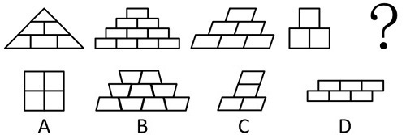
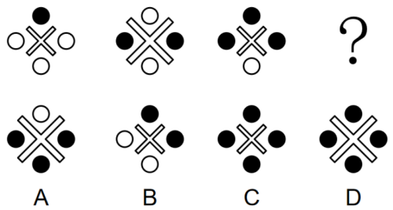
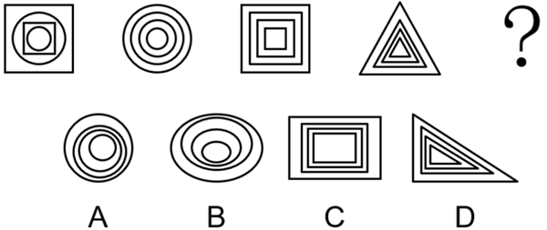
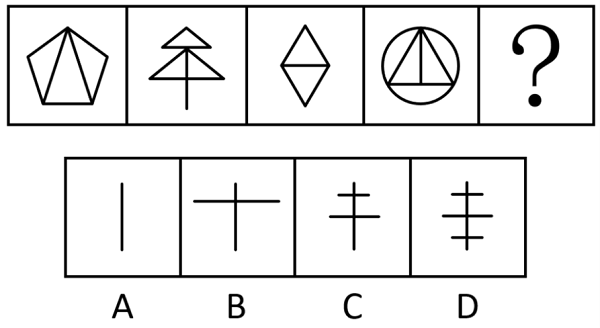
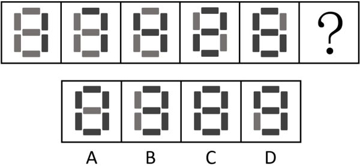
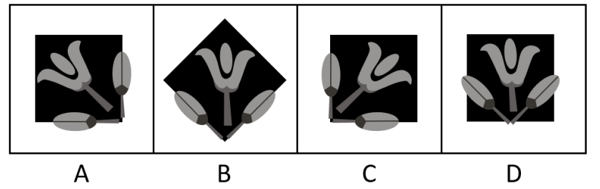
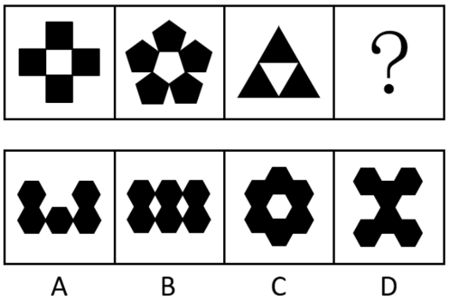
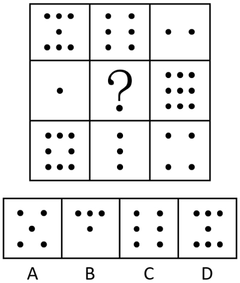
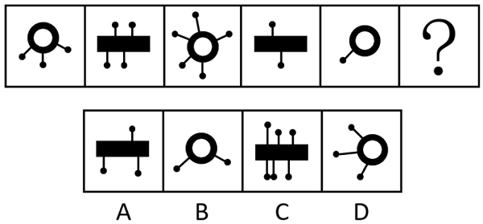

# 2024年重庆市定向选调优秀大学生到基层工作考试《行测》题

> 判断推理 · 30 题 · 选调 2024

## 材料 1

对于晨跑和夜跑哪种方式对身体更好，甲和乙有以下看法：

甲：选择晨跑的人肯定是没时间睡懒觉了，所以晨跑在一定程度上让人改掉了睡懒觉的坏习惯，也提醒其要按时吃早饭。因此晨跑比夜跑更好。

乙：夜跑可以让人更加放松，缓解忙碌一天之后的压力。夜跑有利于减肥，对脂肪的燃烧很有利。而且夜晚身体血液中的血小板数量相对较少，这就能很好地避免血栓现象。因此夜跑比晨跑更好。

### 第 1 题　qid 14993466 · 逻辑判断

以下哪项如果为真，最能支持甲的结论？

- **A**. 晨跑能让人从一夜的睡眠中清醒过来并维持全天良好身体状态　✅
- **B**. 晨跑的最佳时间根据季节而定，一般是太阳刚露脸的时候最佳
- **C**. 统计显示，选择晨跑的人比选择夜跑的人多
- **D**. 晨跑之前不能吃早餐，否则可能会引起胃病

**答案**：A

**官方解析**

第一步：找出论点和论据。
甲的论点：晨跑比夜跑更好。
甲的论据：晨跑在一定程度上让人改掉了睡懒觉的坏习惯，也提醒其要按时吃早饭。
本题论据说的是晨跑对生活习惯的改善，论点说的是晨跑比夜跑更好，通过论据可以合理得到论点，因此二者话题一致，加强优先考虑补充论据。
第二步：逐一分析选项。
A项：该项指出晨跑能让人从一夜的睡眠中清醒过来并维持全天良好身体状态，补充了晨跑的优势，说明晨跑比夜跑更好，补充论据，可以加强，当选；
B项：该项指出晨跑的最佳时间，未提及晨跑相较于夜跑的优势，与论点讨论的“晨跑比夜跑更好”无关，无法加强，排除；
C项：该项指出选择晨跑的人比夜跑多，未提及晨跑相较于夜跑的优势，与论点讨论的“晨跑比夜跑更好”无关，无法加强，排除；
D项：该项指出晨跑前吃早餐可能引发胃病，晨跑前吃早饭的副作用与晨跑本身无关，无法加强，排除。
故正确答案为A。

---

### 第 2 题　qid 14993467 · 逻辑判断

以下哪项如果为真，最能质疑乙的结论？

- **A**. 跑步出汗后皮肤毛孔打开，这时频繁吹风，容易引起感冒等疾病
- **B**. 夜晚不安全因素相对于白天增加，在夜间跑步时更容易发生意外　✅
- **C**. 数据显示，在夜间跑步的人较少
- **D**. 没有科学证据表明夜跑比晨跑好

**答案**：B

**官方解析**

第一步：找出论点和论据。
论点：夜跑比晨跑更好。
论据：夜跑可以让人更加放松，缓解忙碌一天之后的压力。夜跑有利于减肥，对脂肪的燃烧很有利。而且夜晚身体血液中的血小板数量相对较少，这就能很好地避免血栓现象。
本题论据讨论的是夜跑在放松、减肥、健康方面的优势，论点是基于这些优势得出“夜跑比晨跑更好”的结论，通过论据可以合理得到论点，因此二者话题一致，削弱优先考虑削弱论点。
第二步：逐一分析选项。
A项：该项指出跑步出汗后频繁吹风易引起感冒，但并未明确指出是晨跑还是夜跑时更容易出现这种情况，为不明确项，无法削弱，排除；
B项：该项指出夜晚不安全因素比白天多，夜跑时更容易发生意外，说明夜跑存在安全风险，指出相较于晨跑，夜跑所具有的缺点，削弱论点，可以削弱，当选；
C项：该项指出夜间跑步的人较少，但人数与夜跑是否比晨跑更好无关，无法削弱，排除；
D项：该项指出没有科学证据表明夜跑比晨跑好，但这仅能说明该结论尚未得到证实，而无法证明实际夜跑是否比晨跑更好，为不明确项，无法削弱，排除。
故正确答案为B。

---

### 第 3 题　qid 11454020 · 图形推理

从所给四个选项中，选择最合适的一个填入问号处，使之呈现一定规律性（    ）。

- **A**. A
- **B**. B　✅
- **C**. C
- **D**. D

**答案**：B

**官方解析**

元素组成不同，且无明显属性规律，考虑数量规律。观察发现，题干图形均为从上到下每行增加1个小元素，只有B项符合。
故正确答案为B。

---

### 第 4 题　qid 11454015 · 图形推理

下列5个图形中，与其他4个规律不同的是（    ）。

- **A**. A
- **B**. B
- **C**. C　✅
- **D**. D

**答案**：C

**官方解析**

观察发现，题干图形均由线条连接多个小元素构成，只有C项的线条穿过小元素内部，其他图形中线条均不穿过小元素内部，即C项与其他图形规律不同。
故正确答案为C。

---

### 第 5 题　qid 14993401 · 图形推理

从所给四个选项中，选择最合适的一个填入问号处，使之呈现一定规律性（    ）。

- **A**. A
- **B**. B
- **C**. C
- **D**. D　✅

**答案**：D

**官方解析**

元素组成相似，考虑样式规律。观察发现，题干图形中黑球元素个数依次为1、2、3，故“？”处图形中的黑球元素个数应为4，排除A、B两项。比较C、D两项发现，“×”形状相同但大小不同，题干图形中“×”依次为小、大、小，故“？”处图形中的“×”应为大，只有D项符合。
故正确答案为D。

---

### 第 6 题　qid 11454019 · 图形推理

从所给四个选项中，选择最合适的一个填入问号处，使之呈现一定规律性（    ）。

- **A**. A
- **B**. B
- **C**. C　✅
- **D**. D

**答案**：C

**官方解析**

观察发现，题干每幅图形中各元素的重心均重合于中心一点，只有C项符合。
故正确答案为C。

---

### 第 7 题　qid 11454017 · 图形推理

从所给四个选项中，选择最合适的一个填入问号处，使之呈现一定规律性（    ）。

- **A**. A　✅
- **B**. B
- **C**. C
- **D**. D

**答案**：A

**官方解析**

元素组成不同，且属性规律无答案，考虑数量规律。观察发现，题干出现“日”字形、多端点图形，考虑笔画数。题干图形均为一笔画图形，只有A项符合。
故正确答案为A。

---

### 第 8 题　qid 14993424 · 图形推理

从所给四个选项中，选择最合适的一个填入问号处，使之呈现一定规律性（    ）。

- **A**. A
- **B**. B
- **C**. C　✅
- **D**. D

**答案**：C

**官方解析**

元素组成不同，且无明显属性规律，考虑数量规律。观察发现，题干图形均由灰色矩形和黑色矩形构成，优先考虑元素的种类和个数。题干图形中黑色矩形的数量依次为2、3、4、5、6，故“？”处图形黑色矩形的数量应为7，只有C项符合。
故正确答案为C。

---

### 第 9 题　qid 14993431 · 图形推理

下列4个图形中，与其他3个规律不同的是（    ）。

- **A**. A
- **B**. B
- **C**. C
- **D**. D　✅

**答案**：D

**官方解析**

观察发现，题干图形均由花朵、叶子和黑色方块组成，A、B、C三项图形中的叶子中线均与黑色方块的边重合，而D项图形中的叶子中线与黑色方块的边不重合，即D项与其他3个图形规律不同。
故正确答案为D。

---

### 第 10 题　qid 11454021 · 图形推理

从所给四个选项中，选择最合适的一个填入问号处，使之呈现一定规律性（    ）。

- **A**. A
- **B**. B
- **C**. C　✅
- **D**. D

**答案**：C

**官方解析**

元素组成不同，且无明显属性规律，考虑数量规律。观察发现，每幅图形中均由一种黑色小元素组成，且黑色小元素的个数=黑色小元素的边数，排除A项；继续观察发现，题干图形都存在一个与黑色小元素相同的白色区域，排除B、D两项，只有C项符合。
故正确答案为C。

---

### 第 11 题　qid 14993416 · 图形推理

从所给四个选项中，选择最合适的一个填入问号处，使之呈现一定规律性（    ）。

- **A**. A　✅
- **B**. B
- **C**. C
- **D**. D

**答案**：A

**官方解析**

元素组成不同，且无明显属性规律，考虑数量规律。九宫格优先横向看，观察发现，第一行图形的黑点数依次为7、6、2，黑点数之和为15；第三行图形的黑点数依次为8、3、4，黑点数之和也为15，符合此规律；第二行应用此规律，“？”处图形的黑点数应为15-1-9=5，只有A项符合。
故正确答案为A。

---

### 第 12 题　qid 14993420 · 图形推理

从所给四个选项中，选择最合适的一个填入问号处，使之呈现一定规律性（    ）。

- **A**. A
- **B**. B
- **C**. C　✅
- **D**. D

**答案**：C

**官方解析**

元素组成不同，优先考虑样式规律。观察发现，题干图形的主体部分为“圆环”和“矩形”交替出现，故“？”处图形的主体部分应为“矩形”，排除B、D两项；继续观察发现，题干图形主体部分伸出的“线条+小黑球”数量依次为3、4、5、2、1，数量呈现奇、偶交替出现的规律，故“？”处图形主体部分伸出的“线条+小黑球”数量应为偶数，只有C项符合。
故正确答案为C。

---

### 第 13 题　qid 14993422 · 定义判断

食品安全亦称食品卫生，是指使食品符合一定的卫生学标准，及不随摄食而给人体健康带来危害的措施。关注食品是否受到生物性、化学性或放射性物质等有害物的污染，以致给消费者带来潜在或现实的健康风险。
根据上述定义，下列符合食品安全的是（    ）。

- **A**. L面包店每天都有打折销售的临期面包，而且离保质期越近价格越便宜
- **B**. M餐厅规定进入凉菜间的食材必须是符合国家卫生标准的“净菜”　✅
- **C**. N餐馆的员工擦拭油污后，简单冲洗便直接用手抓面条加工凉面
- **D**. 小李买回T厂生产的袋装饺子，煮熟食用后，肚子疼痛难忍

**答案**：B

**官方解析**

第一步：找出定义关键词。
“食品符合一定的卫生学标准”、“不随摄食而给人体健康带来危害”、“关注食品是否受生物性、化学性或放射性物质等有害物的污染”、“无潜在或现实健康风险”。
第二步：逐一分析选项。
A项：L面包店销售临期面包，“临期”代表食品接近保质期截止时间，无法直接等同于“符合卫生学标准”，无法确保“不随摄食而给人体健康带来危害”，不符合定义，排除；
B项：M餐厅规定进入凉菜间的食材必须是符合国家卫生标准的“净菜”，符合“食品符合一定卫生学标准”，符合定义，当选；
C项：N餐馆员工擦拭油污后简单冲洗就用手抓面条，手部残留的油污属于化学性污染物，简单冲洗无法清除，污染物会转移至面条，导致食品污染，不符合“关注食品是否受生物性、化学性或放射性物质等有害物的污染”、“无潜在或现实健康风险”，不符合定义，排除；
D项：小李食用T厂生产的袋装饺子后肚子疼痛，“腹痛”表明饺子存在卫生隐患，已造成现实健康危害，不符合“不随摄食而给人体健康带来危害”，不符合定义，排除。
故正确答案为B。

---

### 第 14 题　qid 14993402 · 定义判断

拜神教是以非物体的神灵为崇拜对象的宗教，人们从物体或身躯中分离出某种“主宰一切”的精神力量，予以顶礼膜拜。拜物教是指把某些特定物体想象为可支配人们命运的神而加以崇拜的宗教。某些人认为，这样的特定物体有灵性，对它祈祷、礼拜或祭献，即可获得好运与保护。
根据上述定义，下列属于拜物教的是（    ）。

- **A**. 道教信奉的尊神为：玉清元始天尊、上清灵宝天尊和太清道德天尊
- **B**. 印度教三大神为：创世之神梵天、守护之神毗湿奴和毁灭之神湿婆
- **C**. 在某处人类早期祭祀遗址中，发现了祭拜仙神的祭品遗物
- **D**. 某原始部落把雕刻的玉猪作为自己的保护神予以祭拜　✅

**答案**：D

**官方解析**

第一步：找出定义关键词。
拜神教：“以非物体的神灵为崇拜对象的宗教”、“人们从物体或身躯中分离出某种‘主宰一切’的精神力量，予以顶礼膜拜”；
拜物教：“把某些特定物体想象为可支配人们命运的神而加以崇拜的宗教”。
第二步：逐一分析选项。
A项：道教信奉的玉清元始天尊、上清灵宝天尊、太清道德天尊均属于“非物体的神灵”，崇拜的是精神力量而非具体物体，不符合“把某些特定物体想象为可支配人们命运的神而加以崇拜的宗教”，不符合拜物教定义，排除；
B项：印度教的创世之神梵天、守护之神毗湿奴、毁灭之神湿婆是象征宇宙创世、守护、毁灭职能的“非物体神灵”，崇拜的是精神力量而非具体物体，不符合“把某些特定物体想象为可支配人们命运的神而加以崇拜的宗教”，不符合拜物教定义，排除；
C项：人类早期祭祀遗址中发现的“祭拜仙神的祭品遗物”，核心崇拜对象是“仙神”，“祭品”仅为祭拜时的辅助工具，并非崇拜对象本身，不符合“把某些特定物体想象为可支配人们命运的神而加以崇拜的宗教”，不符合拜物教定义，排除；
D项：原始部落把“雕刻的玉猪”作为“保护神”祭拜，“玉猪”是具体的物体，把它作为保护神予以祭拜，符合“把某些特定物体想象为可支配人们命运的神而加以崇拜的宗教”，符合拜物教定义，当选。
故正确答案为D。

---

### 第 15 题　qid 14993419 · 定义判断

地球表面的水热条件等环境要素，沿纬度或经度方向发生递变，从而引起植被沿纬度或经度方向呈水平更替，这种现象被称为植被分布的水平地带性，植被分布的水平地带性是地球表面植被分布的基本规律之一。
根据上述定义，下列体现了植被分布的水平地带性的是（    ）。

- **A**. 根据水域环境条件的不同，水域动物可分为淡水动物群落和海洋动物群落
- **B**. 受太阳辐射影响，地球北半球从南到北形成热带、亚热带、温带、寒带等不同的气候带
- **C**. 香山的小溪中有绿藻，溪边有苔藓，岸上有草、蕨类，山坡上有桃树，山顶有松树
- **D**. 我国温带沿海地区降水量大，分布着夏绿阔叶林，离海较远地区降水减少，分布着草原植被　✅

**答案**：D

**官方解析**

第一步：找出定义关键词。
“地球表面的水热条件等环境要素”、“沿纬度或经度方向发生递变”、“从而引起植被沿纬度或经度方向呈水平更替”。
第二步：逐一分析选项。
A项：根据水域环境条件的不同，水域动物可分为淡水动物群落和海洋动物群落，其中“水域动物”不是“植被”，不符合“从而引起植被沿纬度或经度方向呈水平更替”，不符合定义，排除；
B项：地球北半球从南到北形成热带、亚热带、温带、寒带等不同的气候带，描述的是“气候带”的划分，未涉及“植被”的分布，不符合“从而引起植被沿纬度或经度方向呈水平更替”，不符合定义，排除；
C项：香山的小溪中有绿藻，溪边有苔藓，岸上有草、蕨类，山坡上有桃树，山顶有松树，描述的是从溪边到山顶的植被变化，是沿垂直高度的更替，不符合“从而引起植被沿纬度或经度方向呈水平更替”，不符合定义，排除；
D项：我国温带从沿海到内陆（沿经度方向），因降水量递变，植被从夏绿阔叶林更替为草原，符合“地球表面的水热条件等环境要素”、“沿纬度或经度方向发生递变”、“从而引起植被沿纬度或经度方向呈水平更替”，符合定义，当选。
故正确答案为D。

---

### 第 16 题　qid 14993417 · 定义判断

文化扩散分为接触扩散、等级扩散、刺激扩散。接触扩散是指某种文化现象易于为接触者所接受，几乎接触该文化现象的人，如同接触到易于传染的病菌一样，就自然地接受了这种文化现象，从而实现了其扩散；等级扩散是指该文化现象的传播，或接受该文化现象的人，在空间或人群等方面，存在等级现象；刺激扩散是指某种文化现象，受某种原因而无法在另一地存在，不得不将原文化现象做某种程度改变，使其得以在当地存在，得到传播。
根据上述定义，下列不属于文化扩散的是（    ）。

- **A**. 唐人街作为中华文化在国外的展示处，每到春节时都热闹喧腾，吸引了许多当地人前来游玩参观
- **B**. 高平镇是远近闻名的提琴技艺之乡，许多学艺者从高平镇学会了制琴技艺，到高新区附近建立了自己的提琴工厂
- **C**. 蒙古族的祖先走出额尔古纳河两岸山林地带向蒙古高原迁徙，因自然环境制约，生产方式也随之从狩猎业转变为畜牧业　✅
- **D**. 沈阳故宫始建时保留了很多满文化的特色，清入关后北京故宫以汉文化为主基调成为官式建筑的典范。沈阳故宫改建时制度化的官式做法被应用其中

**答案**：C

**官方解析**

第一步：找出定义关键词。
接触扩散：“某种文化现象易于为接触者所接受”、“几乎接触该文化现象的人，如同接触到易于传染的病菌一样，就自然地接受了这种文化现象”、“从而实现了其扩散”；
等级扩散：“该文化现象的传播，或接受该文化现象的人”、“在空间或人群等方面，存在等级现象”；
刺激扩散：“某种文化现象”、“受某种原因而无法在另一地存在，不得不将原文化现象做某种程度改变”、“使其得以在当地存在，得到传播”。
第二步：逐一分析选项。
A项：该项指出唐人街的中华文化吸引当地人参观，当地人通过接触感知中华文化，符合“某种文化现象易于为接触者所接受”、“几乎接触该文化现象的人，如同接触到易于传染的病菌一样，就自然地接受了这种文化现象”、“从而实现了其扩散”，符合“接触扩散”定义，属于文化扩散，排除；
B项：该项指出高平镇的制琴技艺被学艺者接受，符合“该文化现象的传播，或接受该文化现象的人”，从高平镇到高新区建立工厂，符合“在空间方面，存在等级现象”，符合“等级扩散”定义，属于文化扩散，排除；
C项：该项指出蒙古族祖先因自然环境制约，生产方式从狩猎业转变为畜牧业，这是一种文化适应或内部演变过程，并未涉及文化的传播，不属于文化扩散，当选；
D项：该项指出北京故宫的“制度化官式做法”传播到沈阳故宫，被沈阳故宫改建时采用，其中官式做法是制度化的，即沈阳故宫改建时不得不将原文化现象做某种程度改变，使其得以在当地存在，符合“受某种原因而无法在另一地存在，不得不将原文化现象做某种程度改变”、“使其得以在当地存在，得到传播”，符合“刺激扩散”定义，属于文化扩散，排除。
本题为选非题，故正确答案为C。

---

### 第 17 题　qid 14993406 · 定义判断

道路养护是对原有技术标准过低的路线和构筑物及沿线设施进行分期改善和添建，逐步提高道路的使用性能和服务水平，不断满足全社会对道路的要求。
根据上述定义，下列不属于道路养护的是（    ）。

- **A**. 针对急弯陡坡地段，在遇到降雪天气时，用清洁的粒砂、石屑或煤渣等物铺洒防滑
- **B**. 用水泥混凝土铺补道路两边的岩石松动处，同时设立金属网以防坠落到路面上
- **C**. 对过高并妨碍路面排水的土质路肩铲削整平，对低洼的路肩所存留的水可以及时排除
- **D**. 收集城市道路相关数据（如道路平整度、结构承载力等），建设城市道路信息管理系统　✅

**答案**：D

**官方解析**

第一步：找出定义关键词。
“对原有技术标准过低的路线和构筑物及沿线设施进行分期改善和添建”、“逐步提高道路的使用性能和服务水平”。
第二步：逐一分析选项。
A项：针对急弯陡坡地段在遇到降雪天气时用清洁的粒砂、石屑或煤渣等物铺洒防滑，符合“对原有技术标准过低的路线进行改善和添建”，符合定义，排除；
B项：用水泥混凝土铺补道路两边的岩石松动处，同时设立金属网以防坠落到路面上，符合“对原有技术标准过低的沿线设施进行改善和添建”，符合定义，排除；
C项：对过高并妨碍路面排水的土质路肩铲削整平，对低洼的路肩所存留的水可以及时排除，符合“对原有技术标准过低的沿线设施进行改善和添建”，符合定义，排除；
D项：收集数据建设城市道路信息管理系统，没有对实际的道路进行操作，不符合“对原有技术标准过低的路线和构筑物及沿线设施进行分期改善和添建”，不符合定义，当选。
本题为选非题，故正确答案为D。

---

### 第 18 题　qid 14993423 · 类比推理

智能：添：动力

- **A**. 绿色：宜：环保
- **B**. 生产：更：清洁
- **C**. 节约：促：发展　✅
- **D**. 减排：利：节能

**答案**：C

**官方解析**

第一步：判断题干词语间逻辑关系。
智能指智能化技术或智慧手段，智能可以增添动力，智能有添动力的功能，第一个词与后两个词构成功能对应关系。 
第二步：判断选项词语间逻辑关系。
A项：绿色象征着环保，二者为对应关系，与题干逻辑关系不一致，排除；
B项：生产需要更清洁的环境，第一个词与后两个词不构成功能对应关系，与题干逻辑关系不一致，排除；
C项：节约指节省、俭约的生活方式，节约可以促进发展，节约有促发展的功能，第一个词与后两个词构成功能对应关系，与题干逻辑关系一致，当选；
D项：减排和节能是两种不同的环保措施，二者为并列关系，与题干逻辑关系不一致，排除。
故正确答案为C。

---

### 第 19 题　qid 14993418 · 类比推理

耕海牧渔：海洋经济

- **A**. 大棚蔬菜：设施农业
- **B**. 植树防风：林业经济
- **C**. 通信网络：信息产业
- **D**. 治沙种粮：沙漠农业　✅

**答案**：D

**官方解析**

第一步：判断题干词语间逻辑关系。
耕海牧渔指通过人工增殖放流等方式，结合生物工程技术和现代装备，建立可持续海洋渔业资源的开发模式。海洋经济包括为开发海洋资源和依赖海洋空间而进行的生产活动，以及直接或间接开发海洋资源及空间的相关产业活动。耕海牧渔是一种海洋经济，二者为种属关系，且耕海和牧渔均为动宾结构。
第二步：判断选项词语间逻辑关系。
A项：大棚蔬菜是设施农业的产物，二者为对应关系，与题干逻辑关系不一致，排除；
B项：植树防风是一种生态建设活动，不属于林业经济，与题干逻辑关系不一致，排除；
C项：通信网络是一种信息产业，二者为种属关系，但通信和网络均不是动宾结构，与题干逻辑关系不一致，排除；
D项：治沙种粮是一种沙漠农业，二者为种属关系，且治沙和种粮均为动宾结构，与题干逻辑关系一致，当选。
故正确答案为D。

---

### 第 20 题　qid 14993415 · 类比推理

食肉动物：水生动物

- **A**. 挥拍运动：团体运动　✅
- **B**. 体育彩票：足球彩票
- **C**. 铁碳合金：铁铝合金
- **D**. 土壤监测：水质监测

**答案**：A

**官方解析**

第一步：判断题干词语间逻辑关系。
食肉动物和水生动物分别是从食物来源和生存环境的角度命名的，二者为交叉关系。
第二步：判断选项词语间逻辑关系。
A项：挥拍运动和团体运动分别是从击球动作和参与人数多少的角度命名的，二者为交叉关系，与题干逻辑关系一致，当选；
B项：足球彩票是一种体育彩票，二者为种属关系，与题干逻辑关系不一致，排除；
C项：铁碳合金和铁铝合金是两种不同的合金，二者为并列关系，与题干逻辑关系不一致，排除；
D项：土壤监测和水质监测是两种不同的环境监测类型，二者为并列关系，与题干逻辑关系不一致，排除。
故正确答案为A。

---

### 第 21 题　qid 14993421 · 类比推理

豌豆：豆菽：谷物

- **A**. 恒星：行星：卫星
- **B**. 冰雹：降水：气象　✅
- **C**. 节气：大暑：小暑
- **D**. 文化：宗教：风俗

**答案**：B

**官方解析**

第一步：判断题干词语间逻辑关系。
菽为豆类的总称，豆菽类作物包括大豆、蚕豆、豌豆、绿豆、红小豆、芸豆等，豌豆是一种豆菽，二者是种属关系。谷物包括禾谷类、豆菽类和薯类等，豆菽是一种谷物，二者是种属关系。
第二步：判断选项词语间逻辑关系。
A项：恒星、行星和卫星是宇宙中的三种不同类型的天体，三者为并列关系，与题干逻辑关系不一致，排除；
B项：冰雹是降水的一种形式，二者是种属关系；降水是一种气象现象，二者是种属关系，与题干逻辑关系一致，当选；
C项：大暑和小暑是不同的节气，二者为并列关系，分别和节气构成种属关系，与题干逻辑关系不一致，排除；
D项：宗教和风俗都属于文化的范畴，分别和文化构成种属关系，但与题干词语顺序相反，且宗教和风俗不构成种属关系，与题干逻辑关系不一致，排除。
故正确答案为B。

---

### 第 22 题　qid 14993425 · 类比推理

传统武术 对于 （    ） 相当于 （    ） 对于 天体

- **A**. 民间文学；系外行星
- **B**. 太极拳；太阳系
- **C**. 体育项目；黑洞　✅
- **D**. 竞技；宇宙

**答案**：C

**官方解析**

逐一代入选项。
A项：传统武术和民间文学没有明显逻辑关系；系外行星是一种天体，二者是种属关系，前后逻辑关系不一致，排除；
B项：太极拳是一种传统武术，二者是种属关系；天体是太阳系的组成部分，二者是组成关系，前后逻辑关系不一致，排除；
C项：传统武术是一种体育项目，二者是种属关系；黑洞是由广义相对论所预言的，存在于宇宙空间中的一种致密天体，是时空曲率大到光都无法逃脱的天体，黑洞是一种天体，二者是种属关系，前后逻辑关系一致，当选；
D项：有的传统武术可以用于竞技（例如比武），二者是对应关系；天体是宇宙的组成部分，二者是组成关系，前后逻辑关系不一致，排除。
故正确答案为C。

---

### 第 23 题　qid 14993428 · 逻辑判断

某演讲比赛最终确定了三名进入决赛的候选人，分别是楚某、沙某、秦某，对于他们中谁能够进入决赛，三位评委分别发表了各自的意见：
评委甲：秦某、沙某中只能进一个
评委乙：如果秦某不进，楚某就不进
评委丙：只有秦某或沙某不进，楚某才进
以下方案能同时满足三个评委意见的是（    ）。

- **A**. 秦某、沙某、楚某都进
- **B**. 楚某进，秦某、沙某不进
- **C**. 秦某进，沙某、楚某不进　✅
- **D**. 沙某、楚某进，秦某不进

**答案**：C

**官方解析**

第一步：分析题干条件。

（1）秦某、沙某只能进一个；

（2）秦某楚某；

（3）楚某秦某 或 沙某。

第二步：根据题干条件进行推理。

题干信息确定，选项信息充分，优先考虑排除法。

根据条件（1）可知，秦某、沙某不能同时进，排除A项；

根据条件（2）可知，当秦某不进时，楚某也不能进，排除B、D两项。

经验证，C项能同时满足三个评委的意见。

故正确答案为C。

---

### 第 24 题　qid 14993437 · 逻辑判断

某单位调查员工的特长时发现，擅长踢足球的员工，在读大学本科期间一定参加过体育类的社团。甲、乙、丙、丁均为该单位员工。
根据上述条件，下列情况一定为真的是（    ）。

- **A**. 甲大学本科毕业，且参加过体育类的社团，则甲擅长踢足球
- **B**. 乙擅长踢足球并且参加过体育类的社团，则乙一定读过大学本科
- **C**. 丙擅长踢足球，没有参加过体育类的社团，则丙没有读过大学本科　✅
- **D**. 丁不擅长踢足球，也没有参加过体育类的社团，则丁没有读过大学本科

**答案**：C

**官方解析**

第一步：翻译题干。

擅长踢足球 且 读过大学本科参加过体育类的社团；

甲、乙、丙、丁均为该单位员工。

第二步：逐一分析选项。

A项：翻译为：甲读过大学本科 且 参加过体育类的社团甲擅长踢足球，其中“参加过体育类的社团”是对题干的肯后，肯后无必然结论，无法推出，排除；

B项：翻译为：乙擅长踢足球 且 参加过体育类的社团乙读过大学本科，其中“参加过体育类的社团”是对题干的肯后，肯后无必然结论，无法推出，排除；

C项：翻译为：丙擅长踢足球 且 参加过体育类的社团丙读过大学本科，其中“参加过体育类的社团”是对题干的否后，否后必否前，可以推出：丙擅长踢足球 或 丙读过大学本科，已知“丙擅长踢足球”，根据或关系否一推一，可以推出：丙读过大学本科，可以推出，当选；

D项：翻译为：丁擅长踢足球 且 参加过体育类的社团丁读过大学本科，其中“擅长踢足球”是对题干的否前，否前无必然结论，无法推出，排除。

故正确答案为C。

---

### 第 25 题　qid 14993435 · 逻辑判断

2022年10月，某支股票的市场价格大幅度下跌。在下跌的几周内，股票的交易量也急速下跌，大大低于去年的周平均量。然而，该支股票整年的交易量与去年相比并没有明显下降。
如果下列说法正确，则能够解释上述说法中矛盾的是（    ）。

- **A**. 股票投资者往往喜欢在低价的时候购入股票
- **B**. 在2022年整年该支股票购买者的数量与去年相同
- **C**. 某年内股票交易量越大，那一年股票市场的平均价格就越低
- **D**. 在2022年的某个时期，该支股票的交易量高于该年的平均值　✅

**答案**：D

**官方解析**

第一步：找出题干矛盾。
2022年10月，某支股票在几周内的交易量大大低于去年的周平均量。然而，该支股票整年的交易量与去年相比并没有明显下降。
第二步：逐一分析选项。
A项：选项指出股票投资者往往喜欢在低价的时候购入股票，但题干已经指出该支股票的市场价格下跌时，股票的交易量也急速下跌，与题干描述违背，无法解释题干矛盾，排除；
B项：选项指出在2022年整年该支股票购买者的数量与去年相同，但股票购买者数量相同不代表股票交易量相同，交易量还与每人购买股数相关，无法解释题干矛盾，排除；
C项：选项指出某年内股票交易量越大，那一年股票市场的平均价格就越低，表明股票交易量和平均价格相关，但并未指出2022年该支股票的平均价格，无法解释题干矛盾，排除；
D项：选项指出在2022年的某个时期，该支股票的交易量高于该年的平均值，可以解释为什么2022年10月该支股票在几周内的交易量很低，但整年交易量和去年相比却没有明显下降，可以解释题干矛盾，当选。
故正确答案为D。

---

### 第 26 题　qid 14993441 · 逻辑判断

目前的中学生普遍缺乏自然科学知识的学习和积累。最近一项调查显示，中学生中喜欢和比较喜欢人工智能科技的只占到被调查人数的19%。
以下哪项如果为真，最能质疑上述观点？（    ）

- **A**. 中学生缺少对自然科学方面的指导，不懂得怎样去学习和积累
- **B**. 中学生喜欢人工智能科技与学习积累自然科学知识不能混为一谈　✅
- **C**. 一些中学生既喜欢人工智能科技，又对其他自然科学知识有兴趣
- **D**. 调查比例太小，不能反映中学生学习积累自然科学知识的真实情况

**答案**：B

**官方解析**

第一步：找出论点和论据。
论点：目前的中学生普遍缺乏自然科学知识的学习和积累。
论据：中学生中喜欢和比较喜欢人工智能科技的只占到被调查人数的19%。
本题论点讨论的是中学生缺乏“自然科学知识的学习和积累”，论据讨论的是中学生“喜欢人工智能科技”的比例，二者话题不一致，削弱优先考虑拆桥，即断开“喜欢人工智能科技”和“自然科学知识的学习和积累”之间的联系。
第二步：逐一分析选项。
A项：选项指出中学生缺少对自然科学方面的指导，不懂得怎样去学习和积累，解释了中学生普遍缺乏自然科学知识的学习和积累的原因，可以加强，无法削弱，排除；
B项：选项指出中学生喜欢人工智能科技与学习积累自然科学知识不能混为一谈，切断了“喜欢人工智能科技”和“自然科学知识的学习和积累”之间的联系，为拆桥项，可以削弱，保留；
C项：选项指出“一些”中学生既喜欢人工智能科技，又对其他自然科学知识有兴趣，但不明确中学生是否普遍缺乏自然科学知识的学习和积累，为不明确项，无法削弱，排除；
D项：选项指出调查比例太小，不能反映中学生学习积累自然科学知识的真实情况，削弱论据，可以削弱，保留。
对比B、D两项，B项为拆桥项，针对论据和论点之间的关系进行削弱，而D项仅针对论据中的调查方式进行削弱，故B项削弱力度更强，当选。
故正确答案为B。

---

### 第 27 题　qid 14993434 · 逻辑判断

有专家指出，纯净水在过滤掉有害物质的过程中，也一并将钾、镁、钙、铁等人体必需的矿物质元素给去掉了，常喝会导致缺钙。
以下哪项如果为真，最能质疑上述观点？（    ）

- **A**. 我们摄入饮用水主要是为了补充水分，而不是补钙，目前也没有研究表明喝纯净水与缺钙之间存在着必然联系　✅
- **B**. 饮用水虽然对钙元素等矿物质的摄入能起到一定贡献，但贡献程度依据水质硬度的不同，存在较大差异
- **C**. 按照每人每天饮用约1.2L水的平均水平来计算，正常情况下从饮用水中摄取的钙最多100毫克
- **D**. 很多人更喜欢喝白开水而非纯净水，认为白开水中含有人体必需的矿物质元素

**答案**：A

**官方解析**

第一步：找出论点和论据。
论点：纯净水在过滤掉有害物质的过程中，也一并将钾、镁、钙、铁等人体必需的矿物质元素给去掉了，常喝会导致缺钙。
论据：无。
本题论点讨论的是常喝纯净水会导致缺钙，只有论点，没有论据，削弱优先考虑削弱论点。
第二步：逐一分析选项。
A项：选项指出摄入饮用水主要是为了补充水分，而不是补钙，目前也没有研究表明喝纯净水与缺钙之间存在着必然联系，质疑了论点中“常喝纯净水”和“缺钙”的因果关系，削弱论点，可以削弱，当选；
B项：选项指出不同硬度的饮用水对钙元素等矿物质摄入的贡献程度有差异，但不明确纯净水减少的钙摄入量与缺钙的关系，因此不明确“常喝纯净水”是否就会导致“缺钙”，无法削弱，排除；
C项：选项指出正常情况下从饮用水中摄取的钙最多100毫克，但不明确100毫克钙与缺钙的关系，因此不明确“常喝纯净水”是否就会导致“缺钙”，无法削弱，排除；
D项：选项指出很多人更喜欢喝白开水而非纯净水，认为白开水中含有人体必需的矿物质元素，而论点讨论的是常喝纯净水是否会导致缺钙，话题不一致，无法削弱，排除。
故正确答案为A。

---

### 第 28 题　qid 14993440 · 逻辑判断

一项研究结果指出：多吃蔬菜水果的人与少吃的人相比，20年之内的死亡风险降低了7%-8%。此次大规模调查证实了富含维生素和膳食纤维的蔬菜和水果对健康非常重要。研究人员根据受访者每天的果蔬摄取量，将他们由多至少分为五组进行死亡风险的分析。结果显示，在死亡风险方面，水果摄取量最多的组比摄取量最少的组低8%。同样的，蔬菜摄取量最多的组比摄取量最少的组低7%。
以下哪项如果为真，最能质疑上述研究结果？（    ）

- **A**. 此次调查以11个地区的9.5万名40-69岁男女为对象，对他们的健康进行跟踪了解
- **B**. 研究人员根据问卷结果推算受访者的果蔬摄取量，并将其分为五组进行死亡风险分析
- **C**. 受访者在接受问卷调查过程中对实际情况有所隐瞒，果蔬摄入量与实际情况偏差较大　✅
- **D**. 除了果蔬摄入量的差别以外，受访人群的运动量、作息时间等生活习惯也有些许不同

**答案**：C

**官方解析**

第一步：找出论点和论据。
论点：富含维生素和膳食纤维的蔬菜和水果对健康非常重要。
论据：在死亡风险方面，水果摄取量最多的组比摄取量最少的组低8%。同样的，蔬菜摄取量最多的组比摄取量最少的组低7%。
本题论点在讨论蔬菜和水果对健康非常重要，论据在讨论吃蔬菜水果能够降低死亡风险，论据可以合理得到论点，因此论点和论据话题一致，削弱可以考虑削弱论点，也可以考虑削弱论据。
第二步：逐一分析选项。
A项：选项指出此次调查以11个地区的9.5万名40-69岁男女为对象，对他们的健康进行跟踪了解，仅描述调查选取的对象是怎样的，但无法对论点进行质疑，无法削弱，排除；
B项：选项指出研究人员根据问卷结果推算受访者的果蔬摄取量，并将其分为五组进行死亡风险分析，仅描述该研究方法是什么，但无法对调查本身进行质疑，也无法对论点进行质疑，无法削弱，排除；
C项：选项指出受访者在接受问卷调查过程中对实际情况有所隐瞒，果蔬摄入量与实际情况偏差较大，即指出调查所使用的指标不准确，可信度不高，质疑了调查的科学性，可以削弱，保留；
D项：选项指出除了果蔬摄入量的差别以外，受访人群的运动量、作息时间等生活习惯也有些许不同，即说明还存在其他的变量“可能”导致研究结果不准确，可以削弱，保留。
对比C、D两项，C项对调查数据的真实性进行质疑，直接削弱研究成果成立的前提；而D项并未指出“些许生活习惯的不同”与“死亡风险”的关系，即不明确存在的这些变量是否会直接影响到研究成果的成立，质疑力度较弱，故C项当选。
故正确答案为C。

---

### 第 29 题　qid 14993447 · 逻辑判断

近日有报道称，由于全球变暖导致海水升温，某国海军多艘舰艇发动机出现故障。专家认为，过于温暖的海水不仅无法起到冷却作用，反而有可能导致船舶发动机故障频发。
以下哪项如果为真，最能支持上述观点？（    ）

- **A**. 海水温度上升，船舶主机冷却系统的工作效率会降低，影响动力系统散热，船舶的维护成本会随之增加
- **B**. 海平面持续上升、极端天气频发等问题带来的一系列连锁反应，让该国港口面临被淹没的风险
- **C**. 船舶主机冷却系统的任务是确保船舶动力系统正常工作，海水冷却是冷却系统中的重要一环　✅
- **D**. 由于气候变化导致各种自然灾害频发，国际社会需加强沟通协商，合力应对气候变化挑战

**答案**：C

**官方解析**

第一步：找出论点和论据。
论点：过于温暖的海水不仅无法起到冷却作用，反而有可能导致船舶发动机故障频发。
论据：由于全球变暖导致海水升温，某国海军多艘舰艇发动机出现故障。
论点和论据均讨论“海水升温”与“船舶发动机故障”的关系，话题一致，加强优先考虑补充论据。
第二步：逐一分析选项。
A项：该项指出海水温度上升会降低船舶主机冷却系统的工作效率，影响动力系统散热，但降低冷却系统的工作效率、影响散热并不代表会导致舰艇发动机发生故障，为不明确项，无法加强，排除；
B项：该项讨论海平面上升、极端天气使港口面临淹没风险，与论点“过于温暖的海水是否会导致船舶发动机故障频发”无关，话题不一致，无法加强，排除；
C项：该项指出船舶主机冷却系统的任务是确保船舶动力系统正常工作，海水冷却是冷却系统中的重要一环，说明过于温暖的海水无法起到冷却作用，从而使船舶动力系统不能正常工作，因此故障频发，解释了为什么过于温暖的海水会导致船舶发动机故障频发，补充论据，可以加强，当选；
D项：该项指出国际社会需合力应对气候变化挑战，与论点“过于温暖的海水是否会导致船舶发动机故障频发”无关，话题不一致，无法加强，排除。
故正确答案为C。

---

### 第 30 题　qid 14993444 · 逻辑判断

最新研究发现，通过对脊髓的特定刺激脉冲恢复大脑和手臂之间的连接，能在一定程度上使瘫痪患者执行日常生活任务。为了测试这项技术，研究员训练部分手臂瘫痪的猕猴去伸手、抓住和拉动杠杆，以得到它们最喜欢的食物。实验显示，有些猴子原本无法拿到食物，但当刺激器刺激它的脊髓时，它可以实现抓住食物。因此研究人员表示此技术未来能帮助数百万患者恢复活动能力。
以下哪项如果为真，最能质疑上述观点?（    ）

- **A**. 人类的手臂神经无论是在复杂性还是灵敏度上都要强于猴子
- **B**. 目前这种通过刺激脊髓来恢复手臂行动功能的技术还无法恢复写作或弹钢琴等精细活动能力
- **C**. 实验一周后部分猴子可以抓住或拉动物体，但实验六周后，没有一只猴子能够控制自己的手指
- **D**. 即使最简单的手臂动作，人类神经系统也须协调数百块肌肉，在实验室外，用直接电刺激脊髓来取代这种复杂神经控制并非易事　✅

**答案**：D

**官方解析**

第一步：找出论点和论据。
论点：通过刺激脊髓来恢复手臂行动功能的技术，未来能帮助数百万瘫痪患者恢复活动能力。
论据：刺激手臂瘫痪的猕猴脊髓后，原本无法拿到食物的猕猴能实现抓握食物的动作。
论点讨论的是“该技术能帮助人类瘫痪患者恢复活动能力”，论据讨论的是“该技术能使原本无法拿到食物的猕猴实现抓握食物的动作”，论点侧重“使瘫痪患者执行日常生活任务”，论据基于“猕猴实验”，二者话题不一致，削弱可考虑拆桥，切断主体间的联系、切断实验与现实应用间的联系。
第二步：逐一分析选项。
A项：该项指出人类的手臂神经在复杂性和灵敏度上都要强于猴子，说明人类和猴子之间存在明显差异性，那么猴子的实验结果不一定适用于人类，即断开了“猕猴”与“人类”间的联系，为拆桥项，可以削弱，保留；
B项：该项指出技术暂时无法恢复写作、弹钢琴等“精细活动”，但论点仅提及恢复日常活动能力，精细活动不属于必要范畴，且 “目前做不到” 不代表未来无法实现，无法削弱，排除；
C项：该项指出实验一周后部分猴子可以抓住或拉动物体，实验六周后没有一只猴子能够控制自己的手指，即实验时长设置太短存在局限性，削弱论据，可以削弱，保留；
D项：该项一方面从生理层面说明人类手臂神经调控机制的复杂性，体现“猕猴”与“人类”的差异；另一方面从应用层面指出实验室的结论与现实应用之间的差异，为拆桥项，可以削弱，保留。
对比A、C、D三项，C项仅质疑猕猴实验的局限性，未涉及人类应用场景，属于削弱论据，力度最弱；A项仅体现人猴的生理差异，而D项从人猴的生理差异、实验室与现实场景的差异两个方面进行削弱，更为全面，力度最强。
故正确答案为D。

---
