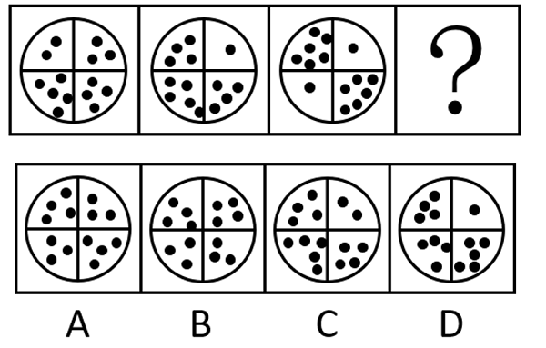
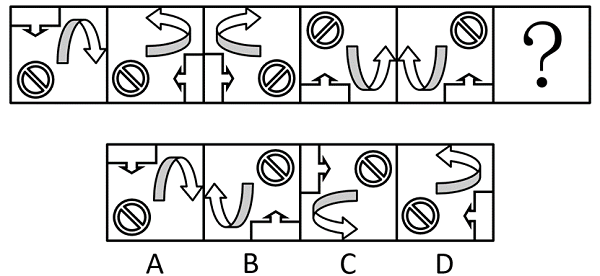
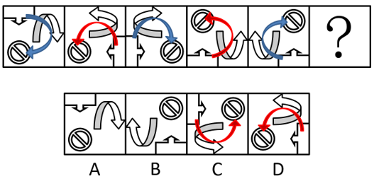
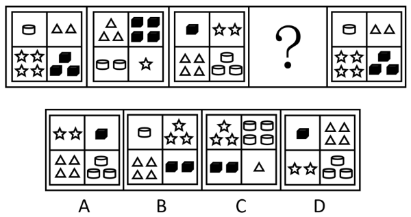
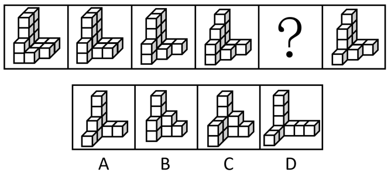
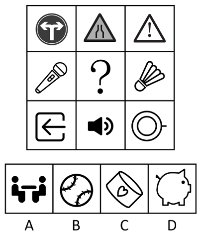
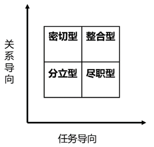

# 2024年黑龙江省公务员录用考试《行测》题（网友回忆版）

> 判断推理 · 35 题 · 黑龙江 2024

## 第 1 题　qid 10204633 · 图形推理

从所给四个选项中，选择最合适的一个填入问号处，使之呈现一定的规律性：

- **A**. A　✅
- **B**. B
- **C**. C
- **D**. D

**答案**：A

**官方解析**

题干图形均由四个格子构成，且不同格子内有一定数量的小黑球，考虑小黑球的个数，观察发现，题干图形中的小黑球数量均为14，排除C项；继续观察每个格子中的小黑球数量发现，题干图形对角线上小黑球数量的奇偶性相同，即从左下到右上的对角线上小黑球数量均为奇数，从右下到左上的对角线上小黑球数量均为偶数，只有A项符合。
故正确答案为A。

---

## 第 2 题　qid 10204614 · 图形推理

从所给四个选项中，选择最合适的一个填入问号处，使之呈现一定的规律性：

- **A**. A
- **B**. B
- **C**. C　✅
- **D**. D

**答案**：C

**官方解析**

解法一：

元素组成相同，优先考虑位置规律。根据三个图形的相对位置，可利用时针法，从至再到画时针，如下图所示，依次是顺时针、逆时针交替出现，因此？处应该是逆时针，排除A、B两项。继续观察发现，题干中的的长底边，在图1至图3、以及图3至图5中，依次沿逆时针方向平移1条边，而图2至图4中其底边沿顺时针方向平移1条边，故图4至？处也应沿顺时针方向平移1条边，只有C项符合规律。

故正确答案为C。

解法二：

元素组成相同，优先考虑位置规律。观察发现，图1经过左右翻转并顺时针旋转后得到图2，图2经过左右翻转后得到图3，图3经过左右翻转并顺时针旋转后得到图4，图4经过左右翻转后得到图5，故？处图形应为图5经过左右翻转并顺时针旋转后得到，只有C项符合规律。

故正确答案为C。

解法三：

元素组成相同，优先考虑位置规律。观察发现，图1经过顺时针旋转并上下翻转后得到图2，图2经过左右翻转后得到图3，图3经过顺时针旋转并上下翻转后得到图4，图4经过左右翻转后得到图5，故？处图形应为图5经过顺时针旋转并上下翻转后得到，只有C项符合规律。

故正确答案为C。

---

## 第 3 题　qid 10204634 · 图形推理

从所给四个选项中，选择最合适的一个填入问号处，使之呈现一定的规律性：

- **A**. A
- **B**. B
- **C**. C　✅
- **D**. D

**答案**：C

**官方解析**

观察发现，题干图形均由4种小元素组成，故考虑元素的位置规律。继续观察发现，题干每种元素依次逆时针平移1格的同时数量增加1个，到数量为4的时候从1开始循环，只有C项符合。 
故正确答案为C。

---

## 第 4 题　qid 10204584 · 图形推理

从所给四个选项中，选择最合适的一个填入问号处，使之呈现一定的规律性：

- **A**. A　✅
- **B**. B
- **C**. C
- **D**. D

**答案**：A

**官方解析**

题干图形均由小正方体叠加而成，考虑三视图。观察发现，题干图形的主视图均相同呈“L”形，只有A项的主视图与题干相同。
故正确答案为A。

---

## 第 5 题　qid 11881082 · 图形推理

从所给的四个选项中，选择最合适的一个填入问号处，使之呈现一定的规律性：

- **A**. A
- **B**. B
- **C**. C　✅
- **D**. D

**答案**：C

**官方解析**

元素组成不同，优先考虑属性规律。观察发现，题干图形较为规整，考虑对称性。九宫格优先看横行，第一行均为竖轴对称图形，第三行均为横轴对称图形，每行图形均为轴对称图形且对称轴方向相同。第二行的图1和图3均为从左下到右上的斜轴对称图形，故？处应填入一个从左下到右上的斜轴对称图形，只有C项符合。
故正确答案为C。

---

## 第 6 题　qid 11881110 · 逻辑判断

保健食品广告不得含有下列内容：（1）表示功效、安全性的断言或者保证；（2）涉及疾病预防、治疗功能；（3）声称或者暗示广告商品为保障健康所必需；（4）与药品、其他保健食品进行比较；（5）利用广告代言人作推荐、证明。
下列保健食品广告宣传语没有违反上述规定的是：

- **A**. “纯天然呵护你的心脑血管健康”
- **B**. “三十年医学专家见证”
- **C**. “不是药，安全无毒副作用”
- **D**. “科学保健养生，为健康创造无限可能”　✅

**答案**：D

**官方解析**

第一步：找出定义关键词。
“表示功效、安全性的断言或者保证”、“涉及疾病预防、治疗功能”、“声称或者暗示广告商品为保障健康所必需”、“与药品、其他保健食品进行比较”、“利用广告代言人作推荐、证明”。
第二步：逐一分析选项。
A项：“纯天然呵护你的心脑血管健康”，是在表明产品具有保障心脑血管健康的功效，符合“表示功效、安全性的断言或者保证”，也表明产品可以预防或治疗心脑血管疾病，符合“涉及疾病预防、治疗功能”，违反了上述规定，排除；
B项：“三十年医学专家见证”，其中医学专家是在广告中帮助产品进行推荐和宣传，即为产品代言，符合“利用广告代言人作推荐、证明”，违反了上述规定，排除；
C项：“不是药，安全无毒副作用”，是对产品的安全性作出保证，符合“表示功效、安全性的断言或者保证”，违反了上述规定，排除；
D项：“科学保健养生，为健康创造无限可能”，没有违反上述规定，当选。
本题为选非题，故正确答案为D。

---

## 第 7 题　qid 10204587 · 定义判断

旋造是指在同一语句中，故意将两个短语中的某些语素位置互换，使本来正常的词语组合变成超常组合，从而造成某种“谬误”的一种修辞方式。
根据上述定义，下列没有使用旋造这一修辞方式的是：

- **A**. 高江急峡雷霆斗，古木苍藤日月昏
- **B**. 酿泉为酒，泉香而酒洌
- **C**. 我心匪石，不可转也。我心匪席，不可卷也　✅
- **D**. 有别必怨，有怨必盈，使人意夺神骇，心折骨惊

**答案**：C

**官方解析**

第一步：找出定义关键词。
“在同一语句中”、“故意将两个短语中的某些语素位置互换”、“使本来正常的词语组合变成超常组合”、“造成某种‘谬误’”。
第二步：逐一分析选项。
A项：“高”应形容“峡”，“急”应形容“江”，“高江急峡雷霆斗”实为“高峡急江雷霆斗”，符合“在同一语句中”、“故意将两个短语中的某些语素位置互换”、“使本来正常的词语组合变成超常组合”，从而将山峡在波涛汹涌的江水面前的情状展现出来，峡有了江的急迫，江也有了峡的陡峭，符合“造成某种‘谬误’”，符合定义，排除；
B项：“洌”应形容“泉”，“香”应形容“酒”，“泉香而酒洌”实为“泉洌而酒香”，符合“在同一语句中”、“故意将两个短语中的某些语素位置互换”、“使本来正常的词语组合变成超常组合”，从而使泉水也具有了酒的香味，酒也像泉水一样清澈纯净，符合“造成某种‘谬误’”，符合定义，排除；
C项：“我心匪石，不可转也。我心匪席，不可卷也”意思是我的心并非石头，不能随便滚动转动；我的心并非草席，不能任意翻卷。并未将短语中的某些语素位置互换，不符合“故意将两个短语中的某些语素位置互换”，不符合定义，当选；
D项：“惊”应形容“心”，“折”应形容“骨”，“心折骨惊”实为“心惊骨折”，符合“在同一语句中”、“故意将两个短语中的某些语素位置互换”、“使本来正常的词语组合变成超常组合”，表达了离别不仅使骨头折断，而且心似乎也被折断了，使人身心交瘁，突出了离别之痛，符合“造成某种‘谬误’”，符合定义，排除。
本题为选非题，故正确答案为C。

---

## 第 8 题　qid 10204585 · 定义判断

投射效应是一种认为自己具有某种特性，他人也一定会有与自己相同的特性，进而把自己的感情、意志、特性等投射到他人身上并强加于他人的心理现象。
根据上述定义，下列体现了投射效应的是：

- **A**. 一个经常帮助别人的人会认为自己遇到困难时，别人也会伸出援手　✅
- **B**. 每次在足球比赛结束之后，就会有人声称自己早就预测到某队会赢
- **C**. 小王喜欢吃零食，他经常买很多零食带到单位和同样喜欢吃零食的同事分享
- **D**. 小张喜欢读历史书，经常给孩子讲历史书上的故事，慢慢地孩子也喜欢上了历史

**答案**：A

**官方解析**

第一步：找出定义关键词。
“认为自己具有某种特性”、“他人也一定会有与自己相同的特性”。
第二步：逐一分析选项。
A项：一个经常帮助别人的人认为别人也会在自己遇到困难时伸出援手，即这个人具有乐于助人的特性，他认为别人也一定会有乐于助人的特性，符合“认为自己具有某种特性”、“他人也一定会有与自己相同的特性”，符合定义，当选；
B项：有人声称自己早就预测到某队会赢，没有涉及到其他人，不符合“他人也一定会有与自己相同的特性”，不符合定义，排除；
C项：小王将零食带给同样喜欢吃零食的同事，即小王有爱吃零食的特性，但同事本身也具有爱吃零食的特性，并非小王认为的，不符合“认为自己具有某种特性”、“他人也一定会有与自己相同的特性”，不符合定义，排除；
D项：小张给孩子讲历史书上的故事，慢慢地孩子也喜欢上了历史，没有体现出小张认为孩子一定会有和自己一样喜欢历史的特性，不符合“认为自己具有某种特性”、“他人也一定会有与自己相同的特性”，不符合定义，排除。
故正确答案为A。

---

## 第 9 题　qid 11881120 · 定义判断

有学者用下列管理方格图表示管理人员对生产的关心程度和对人的关心程度，横坐标与纵坐标分别表示对生产的关心程度和对人的关心程度。每个方格表示的是关心生产和关心人这两个基本因素以不同程度相结合的一种领导方式。

根据上述定义，如果一个管理人员对工作极为关心，但不关心员工的需求，其领导方式属于：

- **A**. 密切型
- **B**. 整合型
- **C**. 分立型
- **D**. 尽职型　✅

**答案**：D

**官方解析**

第一步：找出定义关键词。
“横坐标与纵坐标分别表示对生产的关心程度和对人的关心程度”、“每个方格表示的是关心生产和关心人这两个基本因素以不同程度相结合的一种领导方式”。
第二步：分析并匹配选项。
提问方式为“如果一个管理人员对工作极为关心，但不关心员工的需求，其领导方式属于”，故根据定义关键词进行分析并匹配即可。根据“每个方格表示的是关心生产和关心人这两个基本因素以不同程度相结合的一种领导方式”，可知需要匹配横纵坐标；根据“横坐标表示对生产的关心程度”以及该管理人员“对工作极为关心”，可知横坐标取方格的最大值；根据“纵坐标表示对人的关心程度”以及该管理人员“不关心员工的需求”，可知纵坐标取方格的最小值，此时横纵坐标定位的方格为尽职型。
故正确答案为D。

---

## 第 10 题　qid 10204569 · 定义判断

舛互是指说话或写文章时对所要表达的对象先全部肯定后又部分否定，或先全部否定后又部分肯定的一种修辞方式。从语义上来看，全句的语义点不是前面的统称，而是后面的例外，统称只是作为铺垫或映衬来突出或强调例外。
根据上述定义，下列使用了舛互的是：

- **A**. 家乡是个贼，它能偷去你的心
- **B**. 夜幕下的田野万籁俱寂，偶尔有几声蛙鸣　✅
- **C**. 我这才明白，两年来，不，是二十二年来我全在瞎折腾
- **D**. 假如战争不发生，他的官还可以做下去——不，做上去

**答案**：B

**官方解析**

第一步：找出定义关键词。
“说话或写文章时”、“对所要表达的对象”、“先全部肯定后又部分否定”、“或先全部否定后又部分肯定”。
第二步：逐一分析选项。
A项：家乡是个贼，它能偷去你的心，说明家乡能让人怀念，先进行了肯定，但没有部分否定，不符合“先全部肯定后又部分否定”，不符合定义，排除； 
B项：夜幕下的田野万籁俱寂，说明周围的一切都非常安静，符合“先全部肯定”，偶尔有几声蛙鸣，符合“部分否定”，符合定义，当选；
C项：我这才明白，两年来，不，是二十二年来我全在瞎折腾，说明二十二年来都是虚度时光，先进行了肯定，但没有部分否定，不符合“先全部肯定后又部分否定”，不符合定义，排除；
D项：假如战争不发生，他的官还可以做下去——不，做上去，只是对他是否能继续做官这一件事情进行肯定或否定，并未涉及对全部事情和部分事情的描述，不符合定义，排除。
故正确答案为B。

---

## 第 11 题　qid 10204592 · 定义判断

能够判断真假的陈述句叫做命题，一个命题的本身称之为原命题，逆命题是指将原命题的条件和结论颠倒的新命题，否命题是指将原命题的条件和结论全否定，但不改变条件和结论的顺序的新命题。逆否命题是指将原命题的条件和结论颠倒，然后再将条件和结论全否定的新命题。
根据上述定义，下列说法正确的是：

- **A**. 
原命题为“若m+2=5，则m=3”，其逆否命题为“若m=3，则m+2=5”

- **B**. 
原命题为“若天下雨，则地面一定湿”，其逆否命题为“若天不下雨，则地面一定不湿”

- **C**. 
原命题为“若x&gt;1，则单调递增”，其否命题为“若不单调递增，则”

- **D**. 
原命题为“若甲信任乙，则乙信任甲”，其逆命题为“若乙信任甲，则甲信任乙”
　✅

**答案**：D

**官方解析**

第一步：找出定义关键词。

命题：“能够判断真假的陈述句”；

原命题：“一个命题的本身”；

逆命题：“将原命题的条件和结论颠倒”；

否命题：“将原命题的条件和结论全否定”、“不改变条件和结论的顺序”；

逆否命题：“将原命题的条件和结论颠倒”、“再将条件和结论全否定”。

第二步：逐一分析选项。

A项：原命题为“若m+2=5，则m=3”，原命题条件为“m+2=5”，结论为“m=3”。 “若m=3，则m+2=5”是将原命题的条件和结论颠倒得到的，符合“将原命题的条件和结论颠倒”，符合逆命题定义，不符合逆否命题定义，说法错误，排除；

B项：原命题为“若天下雨，则地面一定湿”，原命题条件为“天下雨”，结论为“地面一定湿”。“若天不下雨，则地面一定不湿”是将原命题的条件和结论全否定，但不改变条件和结论的顺序得到的，符合“将原命题的条件和结论全否定”、“不改变条件和结论的顺序”，符合否命题定义，不符合逆否命题定义，说法错误，排除；

C项：原命题为“若x&gt;1，则单调递增”，原命题条件为“x&gt;1”，结论为“单调递增”。“若不单调递增，则”是将原命题的条件和结论颠倒，然后再将条件和结论全否定得到的，符合“将原命题的条件和结论颠倒”、“再将条件和结论全否定”，符合逆否命题定义，不符合否命题定义，说法错误，排除；

D项：原命题为“若甲信任乙，则乙信任甲”，原命题条件为“甲信任乙”，结论为“乙信任甲”。“若乙信任甲，则甲信任乙”是将原命题的条件和结论颠倒得到的，符合“将原命题的条件和结论颠倒”，符合逆命题定义，说法正确，当选。

故正确答案为D。

---

## 第 12 题　qid 11881109 · 定义判断

眼镜蛇效应是指针对某个问题做出的解决方案，非但没有从根本上解决问题，反而使问题更加恶化的一种现象。
根据上述定义，下列体现眼镜蛇效应的是：

- **A**. 某经理想要提升订单交付率，于是决定大幅增加安全库存数量，结果发现存货越来越多，引发库存管理人员的抱怨和不满
- **B**. 某采购员发现运费太贵，想要降低采购费用，大费周章地找价格更便宜的供应商，结果整体的采购支出金额并没有省下多少钱
- **C**. 某单位为鼓励员工工作，出台加班补偿政策，晚上加班3小时以上，按一天的工资标准发放加班费，结果发现加班的人明显增加，加班费大幅攀升
- **D**. 为避免浪费，每晚某超市关门后，老板会把包装破损的食品送给员工，结果食品包装破损更多了，因为有个别员工故意破坏包装　✅

**答案**：D

**官方解析**

第一步：找出定义关键词。
“针对某个问题做出的解决方案”、“没有从根本上解决问题，使问题更加恶化”。
第二步：逐一分析选项。
A项：该项中经理为解决订单交付率低的问题所采用的方案是大幅增加安全库存数量，符合“针对某个问题做出的解决方案”，结果发现存货越来越多，引起库存管理人员不满，但不明确采取解决方案后订单交付率的情况，不符合“没有从根本上解决问题，使问题更加恶化”，不符合定义，排除；
B项：该项中采购员为解决运费太贵的问题所采用的方案是找更便宜的供应商，符合“针对某个问题做出的解决方案”，结果整体的采购支出金额并没有省下多少钱，即采购支出并没有比之前更高，不符合“没有从根本上解决问题，使问题更加恶化”，不符合定义，排除；
C项：该项中单位鼓励员工工作，可能是要解决员工工作积极性不高的问题，所采用的方案是给加班费，符合“针对某个问题做出的解决方案”，结果加班的人数明显增加，说明员工确实工作更积极了，不符合“没有从根本上解决问题，使问题更加恶化”，不符合定义，排除；
D项：该项中为解决浪费的问题老板会把包装破损的食品送给员工，符合“针对某个问题做出的解决方案”，结果有员工故意破坏包装使包装破损的食品更多了，即正常的食品被故意破坏，说明浪费的问题更加严重了，符合“没有从根本上解决问题，使问题更加恶化”，符合定义，当选。
故正确答案为D。

---

## 第 13 题　qid 10204572 · 定义判断

双趋冲突是指两种都具有吸引力的需求目标同时出现，而由于条件限制，个体无法同时满足两种需求目标所表现出的动机冲突。双避冲突是指同时有两个可能对个体具有威胁性，不利的事发生，两种都想躲避。但受条件限制，只能避开一种，接受一种，在作出选择时内心产生矛盾和痛苦的动机冲突。
根据上述定义，下列属于其中任何一种的是：

- **A**. 面对美食，想吃又怕胖，只能少吃
- **B**. 既想工资高又想不劳累，还想假期多，结果找不到工作
- **C**. 既不想背单词，又不想拉小提琴，迫于明天的考试，只好背单词　✅
- **D**. 看中了一件衣服，想买却没钱，只好放弃

**答案**：C

**官方解析**

第一步：找出定义关键词。
双趋冲突：“两种都具有吸引力的需求目标同时出现”、“由于条件限制，个体无法同时满足两种需求目标”；
双避冲突：“同时有两个可能对个体具有威胁性，不利的事发生，两种都想躲避”、“但受条件限制，只能避开一种，接受一种”。
第二步：逐一分析选项。
A项：想吃又怕胖，是有一个具有吸引力的需求，又有一个想躲避的事，不符合任何一种定义，排除；
B项：想工资高、不想劳累、想假期多，具有三个需求，不符合任何一种定义，排除；
C项：不想背单词、不想拉小提琴，符合“同时有两个可能对个体具有威胁性，不利的事发生，两种都想躲避”，但迫于明天的考试，只好背单词，符合“但受条件限制，只能避开一种，接受一种”，符合“双避冲突”定义，当选；
D项：想买却没钱，只有一个具有吸引力需求，不符合任何一种定义，排除。
故正确答案为C。

---

## 第 14 题　qid 11881043 · 定义判断

一般权利是指权利主体无特定的义务人与之相对，而以一般人（社会上的每个人）作为可能的义务人，它的内容是排除他人的侵害，通常要求一般人不得作出一定的行为。一般义务是指无例外地适用于每个人的义务，每个义务主体无特定的权利人与之相对。特殊权利是指权利主体有特定的义务人与之相对，权利主体可要求义务人作出一定行为或抑制一定行为。特殊义务是义务主体有特定的权利主体与之相对的，义务主体应当根据权利主体的合法要求作出一定行为，以其给付、协助等行为使特定权利主体的利益得以实现。
根据上述定义，下列说法错误的是：

- **A**. 公民甲的财产权是一般权利
- **B**. 公民乙的受教育义务是一般义务
- **C**. 公民丙的人身自由是特殊权利　✅
- **D**. 公民丁的赡养义务是特殊义务

**答案**：C

**官方解析**

第一步：找出定义关键词。
一般权利：“权利主体无特定的义务人”、“社会上的每个人作为可能的义务人”、“排除他人的侵害”；
一般义务：“适用于每个人的义务”、“每个义务主体无特定的权利人”；
特殊权利：“权利主体有特定的义务人”、“权利主体可要求义务人作出一定行为或抑制一定行为”；
特殊义务：“义务主体有特定的权利主体”、“义务主体应当根据权利主体的合法要求作出一定行为”。
第二步：逐一分析选项。
A项：公民甲的财产权，公民甲作为权利主体，没有特定的义务人，社会上的任何人都有不侵害其财产的义务，符合“权利主体无特定的义务人”、“社会上的每个人作为可能的义务人”、“排除他人的侵害”，符合“一般权利”定义，说法正确，排除；
B项：公民乙的受教育义务，受教育义务适用于每个人，且不存在特定的权利人，符合“适用于每个人的义务”、“每个义务主体无特定的权利人”，符合“一般义务”定义，说法正确，排除；
C项：公民丙的人身自由没有特定的义务人，社会上的任何人都有不侵害其人身自由的义务，符合“权利主体无特定的义务人”、“社会上的每个人作为可能的义务人”、“排除他人的侵害”，符合“一般权利”定义，不符合“特殊权利”定义，说法错误，当选；
D项：公民丁的赡养义务，丁赡养的长辈就是特定的权利主体，丁有赡养的义务，符合“义务主体有特定的权利主体”、“义务主体应当根据权利主体的合法要求作出一定行为”，符合“特殊义务”定义，说法正确，排除。
本题为选非题，故正确答案为C。

---

## 第 15 题　qid 10204626 · 定义判断

概念同化是指学习者利用已有概念去学习以定义的方式直接呈现的新概念，概念同化分为上位学习、下位学习和并列组合学习三种基本形式。上位学习是指新学习的内容比原有内容的包摄性和概括性高的一种学习方式，下位学习是指新学习的内容比原有内容的包摄性和概括性低的一种学习方式，并列组合学习是指新旧概念的概括程度相同，通过并列或联合关系而产生的学习方式。
根据上述定义，下列属于下位学习的是：

- **A**. 在学习了钠、镁、铝等元素的化学性质后，再学习铅、铁、锌等元素的化学性质
- **B**. 在学习了正方形、长方形的面积计算公式后，再学习平行四边形的面积计算公式
- **C**. 在学习了2、3、5等数字规律并形成了质数概念后，再学习97也是质数　✅
- **D**. 在学习了亭、台、楼、阁等建筑的特点后，再学习中国传统建筑的特点

**答案**：C

**官方解析**

第一步：找出定义关键词。
概念同化：“利用已有概念去学习以定义的方式直接呈现的新概念”；
上位学习：“新学习的内容比原有内容的包摄性和概括性高”；
下位学习：“新学习的内容比原有内容的包摄性和概括性低”；
并列组合学习：“新旧概念的概括程度相同”、“通过并列或联合关系而产生的学习方式”。
第二步：逐一分析选项。
A项：该项中“钠、镁、铝”和“铅、铁、锌”都是金属元素，二者的概念范围一致，新学习的“铅、铁、锌”和原有内容“钠、镁、铝”的概括程度相同，且为并列关系，符合“新旧概念的概括程度相同”、“通过并列或联合关系而产生的学习方式”，符合“并列组合学习”定义，不符合“下位学习”定义，排除；
B项：该项中“正方形和长方形”是特殊的“平行四边形”，其中“平行四边形”的概念范围大，“正方形和长方形”的概念范围小，新学习的“平行四边形”比原有内容“正方形和长方形”的包摄性和概括性高，符合“新学习的内容比原有内容的包摄性和概括性高”，符合“上位学习”定义，不符合“下位学习”定义，排除；
C项：该项中学习并形成“质数概念”后，再学习“质数97”，其中“质数概念”的范围更大，“质数97”只是质数中的一个，概念范围小，新学习的“质数97”比原有内容“质数概念”的包摄性和概括性低，符合“新学习的内容比原有内容的包摄性和概括性低”，符合“下位学习”定义，当选；
D项：该项中先学习了“亭、台、楼、阁”等建筑的特点后，再学习“中国传统建筑”的特点，其中“中国传统建筑”包括“亭、台、楼、阁”，范围更大，新学习的“中国传统建筑”比原有内容“亭、台、楼、阁”的包摄性和概括性高，符合“新学习的内容比原有内容的包摄性和概括性高”，符合“上位学习”定义，不符合“下位学习”定义，排除。
故正确答案为C。

---

## 第 16 题　qid 10204619 · 类比推理

兵无常势：水无常形

- **A**. 人从心发：树从根发　✅
- **B**. 从善如登：从恶如崩
- **C**. 君子检身：常若有过
- **D**. 为者常成：行者常至

**答案**：A

**官方解析**

第一步：判断题干词语间逻辑关系。
兵无常势是指用兵作战没有固定不变的方法态势，水无常形是指水流没有固定的形状，二者为并列关系，且前者是指人，后者是指物。
第二步：判断选项词语间逻辑关系。
A项：人从心发是指人要发达就会志向远大、胸怀宽广、做事严谨、待人接物讲究，树从根发是指树要是长大就会把根扎得更深更广，二者为并列关系，且前者是指人，后者是指物，与题干逻辑关系一致，当选；
B项：从善如登是指学好像登山一样，从恶如崩是指学坏像山崩一样，二者为并列关系，但前后都是指人，与题干逻辑关系不一致，排除；
C项：君子检身是指君子检点自身，随时反省，常若有过是指像常有过失一样，二者不是并列关系，与题干逻辑关系不一致，排除；
D项：为者常成是指努力去做的人常常可以成功，行者常至是指不倦前行的人常常可以达到目的，二者为并列关系，但前后都是指人，与题干逻辑关系不一致，排除。
故正确答案为A。

---

## 第 17 题　qid 10204611 · 类比推理

远在天边：近在眼前

- **A**. 上天无路：入地无门
- **B**. 取其精华：去其糟粕　✅
- **C**. 尺有所短：寸有所长
- **D**. 以子之矛：攻子之盾

**答案**：B

**官方解析**

第一步：判断题干词语间逻辑关系。
“远在天边，近在眼前”形容寻找的人或物就在面前，前后两句话构造相同，“远在天边”和“近在眼前”为并列关系，且“远”和“近”、“天边”和“眼前”均为反义关系。
第二步：判断选项词语间逻辑关系。
A项：“上天无路，入地无门”形容无路可走的窘迫处境，前后两句话构造相同，“上天无路”和“入地无门”为并列关系，但“上”和“入”、“无路”和“无门”并非反义关系，与题干逻辑关系不一致，排除；
B项：“取其精华，去其糟粕”指吸取事物中最好的东西，舍弃事物中坏的、无用的东西，前后两句话构造相同，“取其精华”和“去其糟粕”为并列关系，且“取”和“去”、“精华”和“糟粕”均为反义关系，与题干逻辑关系一致，当选；
C项：“尺有所短，寸有所长”本义指尺比寸长，但和比尺更长的东西相比，就显得短了；寸比尺短，但和比寸更短的东西相比，就显得长了，比喻各有长处，也各有短处，彼此都有可取之处，前后两句话构造相同，“尺有所短”和“寸有所长”为并列关系，但“尺”和“寸”并非反义关系，与题干逻辑关系不一致，排除；
D项：“以子之矛，攻子之盾”指用你的矛来刺你的盾，比喻用对方的观点、方法或言论等来反驳对方，但前后两句话构造不同，且“以子之矛”和“攻子之盾”为方式目的的对应关系，与题干逻辑关系不一致，排除。
故正确答案为B。

---

## 第 18 题　qid 10204630 · 类比推理

太阳：东升西落

- **A**. 珠峰：高耸入云　✅
- **B**. 桃树：花团锦簇
- **C**. 江面：风平浪静
- **D**. 道路：车水马龙

**答案**：A

**官方解析**

第一步：判断题干词语间逻辑关系。
“太阳”具有“东升西落”的特点，且“太阳”一直是“东升西落”的，二者为必然属性的对应关系。
第二步：判断选项词语间逻辑关系。
A项：“珠峰”是指珠穆朗玛峰，具有“高耸入云”的特点，且“珠峰”一直是“高耸入云”的，二者为必然属性的对应关系，与题干逻辑关系一致，当选；
B项：“桃树”具有“花团锦簇”的特点，但“桃树”并非一直是“花团锦簇”的，二者为或然属性的对应关系，与题干逻辑关系不一致，排除；
C项：“江面”具有“风平浪静”的特点，但“江面”并非一直是“风平浪静”的，二者为或然属性的对应关系，与题干逻辑关系不一致，排除；
D项：“道路”具有“车水马龙”的特点，但“道路”并非一直是“车水马龙”的，二者为或然属性的对应关系，与题干逻辑关系不一致，排除。
故正确答案为A。

---

## 第 19 题　qid 10204603 · 类比推理

编号：①②③：甲乙丙

- **A**. 热水器：进水管：出水管
- **B**. 定价：生产成本：营销成本
- **C**. 字母：大写字母：小写字母　✅
- **D**. 防晒：室内躲避：涂防晒霜

**答案**：C

**官方解析**

第一步：判断题干词语间逻辑关系。
①②③和甲乙丙是两种不同的编号，二者为并列关系，二者都是编号的一种，与编号分别构成种属关系。
第二步：判断选项词语间逻辑关系。
A项：进水管和出水管是两种不同的水管，二者为并列关系，但进水管、出水管都是热水器的组成部分，二者与热水器分别构成组成关系，与题干逻辑关系不一致，排除；
B项：生产成本和营销成本是两种不同的成本，二者为并列关系，但生产成本、营销成本均为影响定价的因素，二者与定价为影响因素与事物的对应关系，与题干逻辑关系不一致，排除；
C项：大写字母和小写字母是不同写法的字母，二者为并列关系，大写字母、小写字母都是字母的一种，二者与字母分别构成种属关系，与题干逻辑关系一致，当选；
D项：室内躲避和涂防晒霜均是防晒的方式，二者为并列关系；室内躲避和涂防晒霜的目的均是防晒，后两个词与第一个词分别构成方式与目的的对应关系，与题干逻辑关系不一致，排除。
故正确答案为C。

---

## 第 20 题　qid 10204617 · 类比推理

简繁转换：繁转简：简转繁

- **A**. 符号：单下划线：双下划线
- **B**. 文件：电子文件：纸质文件　✅
- **C**. 诊断：观发识病：观舌诊病
- **D**. 麻醉：局部麻醉：药物麻醉

**答案**：B

**官方解析**

第一步：判断题干词语间逻辑关系。
“简繁转换”仅可分为“繁转简”和“简转繁”这两种方式，后两词为矛盾关系，均与第一词构成种属关系。
第二步：判断选项词语间逻辑关系。
A项：“单下划线”和“双下划线”都是“符号”的一种，下划线除了这两种之外，还有加粗下划线、下划虚线等，后两词为反对关系，与题干逻辑关系不一致，排除；
B项：“文件”按照现代主要的载体一般可分为“电子文件”和“纸质文件”，后两词为矛盾关系，均与第一词构成种属关系，与题干逻辑关系一致，当选；
C项：“观发识病”和“观舌诊病”都是医生诊断的一种形式，除了这两种形式之外，医生还可以通过观察人的神、色、形、态、皮肤等来诊断，后两词为反对关系，与题干逻辑关系不一致，排除；
D项：“局部麻醉”和“药物麻醉”都是“麻醉”的一种形式，且有的局部麻醉是药物麻醉，有的局部麻醉不是药物麻醉，有的药物麻醉是局部麻醉，有的药物麻醉不是局部麻醉，后两词为交叉关系，与题干逻辑关系不一致，排除。
故正确答案为B。

---

## 第 21 题　qid 11881044 · 类比推理

国产灯：蘑菇灯：护眼灯

- **A**. 社区公园：迷你公园：主题公园
- **B**. 上皮细胞：扁平细胞：生殖细胞
- **C**. 自制玩偶：人形玩偶：装饰玩偶　✅
- **D**. 水生植物：喜阴植物：防风植物

**答案**：C

**官方解析**

第一步：判断题干词语间逻辑关系。
“国产灯”“蘑菇灯”“护眼灯”从灯的制作来源、外形、功能3个不同角度进行划分，三者互为交叉关系。
第二步：判断选项词语间逻辑关系。
A项：“社区公园”指为一定居住用地范围内的居民服务，具有一定活动内容和设施的集中绿地，是从服务对象的角度进行划分；“迷你公园”则是从公园规模的角度进行划分，前两词为交叉关系。“主题公园”指以营利为目的兴建的，占地、投资达到一定规模，为游客有偿提供休闲体验、文化娱乐产品或服务的园区，主要包括以大型游乐设施为主体的游乐园，大型微缩景观公园，以及提供情景模拟、环境体验为主要内容的各类影视城、动漫城等园区，主题公园规模大，与前两词均构成并列关系，与题干逻辑关系不一致，排除；
B项：“上皮细胞”是位于皮肤或腔道表层的细胞，和“生殖细胞”为并列关系，与题干逻辑关系不一致，排除；
C项：“自制玩偶”“人形玩偶”“装饰玩偶”从玩偶的制作来源、外形、功能3个不同角度进行划分，三者互为交叉关系，与题干逻辑关系一致，保留；
D项：“水生植物”“喜阴植物”“防风植物”从植物的生存环境、需要阳光的程度、防风能力的程度3个不同角度进行划分，三者互为交叉关系，与题干逻辑关系一致，保留。
对比C、D两项，题干和C项词语均依次根据制作来源、外形、功能来命名，故C项与题干逻辑关系更为一致，当选。
故正确答案为C。

---

## 第 22 题　qid 10204577 · 类比推理

望远镜：千里镜：目镜

- **A**. 牵牛花：喇叭花：花瓣　✅
- **B**. 重阳节：登高节：茱萸
- **C**. 复印机：影印机：纸张
- **D**. 紫禁城：太和殿：故宫

**答案**：A

**官方解析**

第一步：判断题干词语间逻辑关系。
望远镜也叫千里镜，二者为全同关系；目镜是望远镜的组成部分，与前两词为组成关系。
第二步：判断选项词语间逻辑关系。
A项：牵牛花又叫喇叭花，二者为全同关系；花瓣是牵牛花的组成部分，与前两词为组成关系，与题干逻辑关系一致，当选；
B项：重阳节又叫登高节，二者为全同关系；但茱萸与重阳节不是组成关系，与题干逻辑关系不一致，排除；
C项：复印机是利用静电技术进行文书复制的设备，影印机是根据半导体的光导电性、物质间的摩擦生电等原理而设计的机器，复印机和影印机是两种不同的设备，二者为并列关系；且纸张与前两词不是组成关系，与题干逻辑关系不一致，排除；
D项：太和殿是紫禁城中的一个宫殿，二者为组成关系，与题干逻辑关系不一致，排除。
故正确答案为A。

---

## 第 23 题　qid 10204600 · 类比推理

陶瓷杯：玻璃杯：咖啡杯

- **A**. 摇篮曲：催眠曲：钢琴曲
- **B**. 柳叶剑：桃木剑：长柄剑
- **C**. 牡丹园：芍药园：百花园
- **D**. 羊皮鞋：棉布鞋：儿童鞋　✅

**答案**：D

**官方解析**

第一步：判断题干词语间逻辑关系。
陶瓷杯和玻璃杯是两种由不同材料制成的杯子，二者为并列关系；咖啡杯是依据用途划分的，前两个词语与第三个词语均为交叉关系。
第二步：判断选项词语间逻辑关系。
A项：摇篮曲又称催眠曲，二者为全同关系；钢琴曲是依据弹奏乐器划分的，前两个词语与第三个词语均为交叉关系，与题干逻辑关系不一致，排除；
B项：柳叶剑是依据剑身的形状划分的，桃木剑是依据制造剑的原材料划分的，长柄剑是依据剑柄的长度划分的，三者为交叉关系，与题干逻辑关系不一致，排除；
C项：牡丹园、芍药园和百花园是三种种植不同花卉的花园，三者为并列关系，与题干逻辑关系不一致，排除；
D项：羊皮鞋和棉布鞋是两种由不同材料制成的鞋子，二者为并列关系；儿童鞋是依据适用人群划分的，前两个词语与第三个词语均为交叉关系，与题干逻辑关系一致，当选。
故正确答案为D。

---

## 第 24 题　qid 10204563 · 类比推理

（    ） 对于 生物能源 相当于 经济政策 对于 （    ）

- **A**. 太阳能；价格政策
- **B**. 植物能源；社会政策
- **C**. 氢元素；经济关系
- **D**. 清洁能源；货币政策　✅

**答案**：D

**官方解析**

逐一代入选项。
A项：太阳能和生物能源都是可再生能源，二者为并列关系；价格政策是一种微观经济政策，二者为种属关系，前后逻辑关系不一致，排除；
B项：植物能源属于生物能源，二者为种属关系；根据政策所涉及的领域划分，可分为经济政策、社会政策等，二者为并列关系，前后逻辑关系不一致，排除；
C项：氢元素是一种化学元素，与生物能源无明显逻辑关系；经济政策是国家或政府为了达到充分就业、价格水平稳定、经济快速增长、国际收支平衡等宏观经济政策的目标，为增进经济福利而制定的解决经济问题的指导原则和措施，经济关系是指人们在物质资料的生产过程中形成的社会关系，二者无明显逻辑关系，前后逻辑关系不一致，排除；
D项：生物能源是一种清洁能源，二者为种属关系；货币政策是一种宏观经济政策，二者为种属关系，前后逻辑关系一致，当选。
故正确答案为D。

---

## 第 25 题　qid 11881047 · 类比推理

程序法 对于 （    ） 相当于 （    ） 对于 个人收入

- **A**. 成文法：企业收入
- **B**. 经济法：劳动收入
- **C**. 诉讼法：合法收入
- **D**. 国内法：投资收入　✅

**答案**：D

**官方解析**

逐一代入选项。
A项：“程序法”是以保证权利和义务得以实施或职权和职责得以履行的有关程序为主的法律，如民事诉讼法、刑事诉讼法、行政诉讼法等，“成文法”是由国家特定机关制定和公布，并以成文形式出现的法律，又称制定法。有的程序法是成文法，有的程序法不是成文法，有的成文法是程序法，有的成文法不是程序法，二者为交叉关系；企业收入和个人收入是两种不同的收入，二者为并列关系，前后逻辑关系不一致，排除；
B项：“经济法”是调整国家宏观经济管理过程中所发生的社会关系的法律规范的总称，经济法是实体法，不是程序法，二者为反向包容关系；“劳动收入”是指各类劳动者通过劳动获得的各种报酬，劳动收入是个人收入，二者为种属关系，前后逻辑关系不一致，排除；
C项：“诉讼法”指规定诉讼活动的法律规范的总称，诉讼法是程序法，二者为种属关系；有的合法收入是个人收入，有的合法收入不是个人收入，有的个人收入是合法收入，有的个人收入不是合法收入，二者为交叉关系，前后逻辑关系不一致，排除；
D项：有的程序法是国内法，有的程序法不是国内法，有的国内法是程序法，有的国内法不是程序法，二者为交叉关系；有的投资收入是个人收入，有的投资收入不是个人收入，有的个人收入是投资收入，有的个人收入不是投资收入，二者为交叉关系，前后逻辑关系一致，当选。
故正确答案为D。

---

## 第 26 题　qid 11881048 · 逻辑判断

中国式现代化的区域实践遵循区域经济发展的一般规律。区域分工和产业协同是推进现代化建设的必要条件。根据区域分工理论，区域分工与合作的生产力归根结底在于其能增进各有关方的利益。中国式现代化区域实践需要因地制宜、分工协调、分类推进，且其能促进不同发展梯度的区域之间形成联动势能，就能加速实现现代化。
由此一定可以推出的是：

- **A**. 如果现代化建设没有推进，则说明区域分工和产业协同没有实现
- **B**. 如果区域分工与合作不能增进各有关方的利益，则其就不具有生命力
- **C**. 如果没有加速实现现代化，且中国式现代化区域实践实现了因地制宜、分工协作，则说明其没有促进不同发展梯度的区域之间形成联动势能　✅
- **D**. 中国式现代化区域······实现现代化

**答案**：C

**官方解析**

第一步：翻译题干。

（1）推进现代化建设区域分工 且 产业协同；

（2）因地制宜、分工协调、分类推进 且 促进不同发展梯度的区域之间形成联动势能加速实现现代化。

第二步：逐一分析选项。

A项：翻译为：推进现代化建设区域分工 且 产业协同，是对（1）的否前，否前无必然结论，无法推出，排除；

B项：翻译为：区域分工与合作不能增进各有关方的利益生命力，题干未提及“生命力”，无中生有，无法推出，排除；

C项：翻译为：加速实现现代化 且 实现了因地制宜、分工协作促进不同发展梯度的区域之间形成联动势能，是对（2）的否后，否后必否前，即：加速实现现代化因地制宜、分工协调、分类推进 或 促进不同发展梯度的区域之间形成联动势能，再结合或关系“否一推一”，可得：加速实现现代化 且 实现了因地制宜、分工协作促进不同发展梯度的区域之间形成联动势能，可以推出，当选；

D项：选项不完整，内容待补充。

故正确答案为C。

---

## 第 27 题　qid 10204620 · 逻辑判断

近年来，某国能源危机愈演愈烈，能源价格飙升。天然气、电力、汽油等产品的价格均出现大幅度上涨。有分析人士认为，该国的能源价格飙升是由全球极端天气频发导致的，在短时间内难以解决；在能源价格的持续上涨下，由于缺乏短期替代品，企业将受到能源成本上涨的巨大影响，该国可能出现经济衰退。
以下哪项如果为真，最能支持上述分析人士的观点：

- **A**. 拉尼娜和厄尔尼诺现象的交替影响引发全球气候混乱，致使全球极端天气频发
- **B**. 该国经济衰退不仅会使本国人民生活水平大幅下降，也会对全球经济稳定和发展构成威胁
- **C**. 该国对天然气等能源的对外依赖度超过90%，近年来能源输出国切断了对该国的能源输入
- **D**. 在全球极端天气影响下，该国冬季气温异常寒冷，使其对天然气等能源的需求和价格暴涨　✅

**答案**：D

**官方解析**

第一步：找出论点和论据。
论点：某国的能源价格飙升是由全球极端天气频发导致的，在短时间内难以解决；在能源价格的持续上涨下，由于缺乏短期替代品，企业将受到能源成本上涨的巨大影响，该国可能出现经济衰退。
论据：无。
本题只有论点没有论据，加强优先考虑补充论据。
第二步：逐一分析选项。
A项：该项说的是拉尼娜和厄尔尼诺现象的交替影响导致全球极端天气频发，而论点说的是全球极端天气频发导致该国的能源价格飙升，话题不一致，无法加强，排除；
B项：该项说的是该国经济衰退带来的危害，而论点讨论的是该国可能出现经济衰退的原因，话题不一致，无法加强，排除；
C项：该项说的是近年来该国的能源输入被切断，而该国本身对天然气等能源的对外依赖度很高，强调这也是该国能源价格飙升的原因，为削弱项，无法加强，排除；
D项：该项说的是全球极端天气导致该国对天然气等能源的需求和价格暴涨，解释说明了该国的能源价格飙升是由全球极端天气频发导致的，补充论据，可以加强，当选。
故正确答案为D。

---

## 第 28 题　qid 10204623 · 逻辑判断

一项研究发现牙龈炎和老年痴呆有关。研究人员招募了172名平均年龄67岁的老年人，一方面监测他们的牙龈损伤程度，另一方面通过脑部扫描来测量他们的海马体体积。研究进行了4年，结果发现牙龈的损伤程度和海马体体积的降低有直接关系。研究人员认为，对于老年人而言，预防牙龈炎有助于预防老年痴呆。
以下哪项如果为真，最能支持上述结论：

- **A**. 牙龈炎会对心脏造成影响，还会影响肺部功能或引起胃部疾病
- **B**. 导致牙龈炎的牙龈卟啉单胞菌可以入侵脑组织，并对神经细胞造成损伤　✅
- **C**. 患有老年痴呆的病人常常会忘记刷牙，从而容易引发牙龈炎
- **D**. 老年痴呆虽然是一种神经退行性疾病，但其可能是由于躯体疾病引起的

**答案**：B

**官方解析**

第一步：找出论点和论据。
论点：对于老年人而言，预防牙龈炎有助于预防老年痴呆。
论据：牙龈的损伤程度和海马体体积的降低有直接关系。
本题论点讨论的是牙龈和老年痴呆之间的关系，论据讨论的是牙龈和海马体体积之间的关系，因为海马体是大脑内专门负责记忆功能的，因此可以认为二者话题一致，加强优先考虑补充论据。
第二步：逐一分析选项。
A项：选项指出牙龈炎会对心肺和胃部造成影响，但不清楚牙龈炎是否和老年痴呆有关系，为不明确项，无法加强，排除；
B项：选项指出导致牙龈炎的牙龈卟啉单胞菌会对脑神经细胞造成损伤，说明减少牙龈卟啉单胞菌可以预防脑神经细胞损伤，进而预防老年痴呆，解释了为什么预防牙龈炎有助于预防老年痴呆，解释原因，可以加强，当选；
C项：选项指出患老年痴呆的病人经常会忘记刷牙从而引发牙龈炎，而题干讨论的是牙龈炎可能会导致老年痴呆，所以预防牙龈炎有助于预防老年痴呆，因果倒置，无法加强，排除；
D项：选项指出老年痴呆可能是由躯体疾病引起的，但不清楚是否是由牙龈炎引起的，为不明确项，无法加强，排除。
故正确答案为B。

---

## 第 29 题　qid 10204635 · 逻辑判断

研究人员指出，在2.5亿年后现在所有的陆地会合并成一个超大陆。研究人员用气候模型预测超大陆的温湿度后发现，因火山气体排放，大气二氧化碳水平将升高至现在的2倍，未来太阳也会释放出比现在多2.5%的辐射，整个未来超大陆将会超过哺乳动物热应激极限。研究人员认为，超大陆的极端高温会使哺乳动物面临灭绝的风险。
以下哪项如果为真，最能削弱上述结论：

- **A**. 
在超大陆上有8%的区域适合哺乳动物生存但种群会大幅缩小

- **B**. 
某些不确定因素的影响可能会使超大陆的形成时间提前或延后

- **C**. 
哺乳动物有避免过热的策略但温度长时间超过会导致哺乳动物死亡

- **D**. 
其他演化或人类相关活动可能会使哺乳动物在超大陆形成前灭绝
　✅

**答案**：D

**官方解析**

第一步：找出论点和论据。

论点：超大陆的极端高温会使哺乳动物面临灭绝的风险。

论据：研究人员用气候模型预测超大陆的温湿度后发现，因火山气体排放，大气二氧化碳水平将升高至现在的2倍，未来太阳也会释放出比现在多2.5%的辐射，整个未来超大陆将会超过哺乳动物热应激极限。

本题论点和论据都在讨论超大陆的极端高温对哺乳动物的影响，论点论据话题一致，削弱优先考虑削弱论点。

第二步：逐一分析选项。

A项：该项说在超大陆上有小部分区域适合哺乳动物生存，但种群会“大幅缩小”，种群“大幅缩小”说明哺乳动物确实是有灭绝的趋势，因此确实会让哺乳动物面临灭绝的风险，补充论据，为加强项，无法削弱，排除；

B项：该项说某些因素可能使超大陆的形成时间提前或延后，与论点讨论的超大陆对哺乳动物的影响无关，为无关项，无法削弱，排除；

C项：该项说温度长时间超过就会导致哺乳动物死亡，说明超大陆的“极端高温”确实会让哺乳动物面临灭绝的风险，加强项，无法削弱，排除；

D项：该项说其他演化或人类活动可能会使哺乳动物在超大陆形成前灭绝，说明等超大陆形成时，它的极端高温可能已经不会影响到哺乳动物了，削弱论点，可以削弱，当选。

故正确答案为D。

---

## 第 30 题　qid 10204636 · 逻辑判断

由于儿童对有毒、有害物质的代谢能力远低于成人，因此儿童更容易受到二手烟的危害。研究发现在二手烟暴露水平相同的情况下，儿童血液中可替宁（尼古丁代谢产物）的含量是成人的1倍以上，由于儿童的智力发育水平受到其阅读、数学和推理能力的影响，研究人员认为，儿童暴露于二手烟会影响其智力发育水平。
上述论证的成立需要补充以下哪项作为前提：

- **A**. 可替宁含量增加会导致儿童的阅读、数学和推理能力下降　✅
- **B**. 阅读、数学和推理能力是衡量儿童智力发育水平的主要标准
- **C**. 儿童血液中的可替宁含量是可以通过科学方法检验出来的
- **D**. 与成人相比，儿童更容易受到有毒、有害物质的伤害

**答案**：A

**官方解析**

第一步：找出论点和论据。
论点：儿童暴露于二手烟会影响其智力发育水平。
论据：在二手烟暴露水平相同的情况下，儿童血液中可替宁（尼古丁代谢产物）的含量是成人的1倍以上，儿童的智力发育水平又受到其阅读、数学和推理能力的影响。
论点讨论的是“二手烟”和“儿童智力发育水平”的关系，论据讨论的是“二手烟”和“儿童血液中可替宁含量”之间的关系，以及“阅读、数学和推理能力”与“儿童智力发育水平”的关系。论点和论据话题不一致，加强优先考虑搭桥，即建立“儿童血液中可替宁含量”与“儿童智力发育水平”之间的联系。但论据中已经说明“儿童的智力发育水平”与“阅读、数学和推理能力”有关系，所以搭桥也可以建立“儿童血液中可替宁含量”与“阅读、数学和推理能力”之间的联系。
第二步：逐一分析选项。
A项：该项说的是可替宁含量增加会导致儿童的阅读、数学和推理能力下降，建立了“可替宁含量”与“阅读、数学和理解能力”之间的联系，为搭桥项，可以加强，当选；
B项：该项说的是阅读、数学和推理能力是衡量儿童智力发育水平的主要标准，补充论据，可以加强，但不是论证成立的前提，排除；
C项：该项说的是儿童血液中的可替宁含量是可以通过科学方法检验出来的，与论点讨论的儿童暴露于二手烟是否会影响其智力发育水平的话题无关，为无关项，无法加强，排除；
D项：该项说的是儿童比成人更容易受到有毒、有害物质的伤害，但不明确这个伤害是否会影响其智力发育水平，为不明确项，无法加强，排除。
故正确答案为A。

---

## 第 31 题　qid 10204594 · 逻辑判断

所有单纯依靠运气成分获胜的都不能成为电竞游戏，所有虚拟环境中的智力和体力的对抗都是电竞游戏。所以，所有虚拟环境中的智力和体力的对抗都不是无规则的竞技。
上述论证的成立需要补充以下哪项作为前提：

- **A**. 所有电竞游戏都是无规则的竞技
- **B**. 有些虚拟环境中的智力和体力的对抗是单纯依靠运气成分获胜的
- **C**. 有些无规则的竞技是虚拟环境中的智力和体力的对抗
- **D**. 所有无规则的竞技都是单纯依靠运气成分获胜的　✅

**答案**：D

**官方解析**

第一步：找出论点和论据。

论点：虚拟环境中的智力和体力的对抗无规则的竞技。

论据：单纯依靠运气成分获胜电竞游戏；虚拟环境中的智力和体力的对抗电竞游戏。

根据逆否规则可将论据串联为：虚拟环境中的智力和体力的对抗电竞游戏单纯依靠运气成分获胜。

本题要想得出“虚拟环境中的智力和体力的对抗无规则的竞技”的结论，需要在“电竞游戏”与“无规则的竞技”之间建立联系，或者在“单纯依靠运气成分获胜”与“无规则的竞技”之间建立联系。

第二步：逐一分析选项。

A项：翻译为：电竞游戏无规则的竞技，与论据结合可以推出“虚拟环境中的智力和体力的对抗无规则的竞技”，无法推出论点，排除；

B项：翻译为：有的虚拟环境中的智力和体力的对抗单纯依靠运气成分获胜，与论据结合无法推出论点，排除；

C项：翻译为：有的无规则的竞技虚拟环境中的智力和体力的对抗，通过置换可以推出“有的虚拟环境中的智力和体力的对抗无规则的竞技”，与论点矛盾，排除；

D项：翻译为：无规则的竞技单纯依靠运气成分获胜，根据逆否可以得出“单纯依靠运气成分获胜无规则的竞技”，与论据结合可以推出“虚拟环境中的智力和体力的对抗无规则的竞技”，即论点成立，为搭桥项，当选。

故正确答案为D。

---

## 第 32 题　qid 10204590 · 逻辑判断

研究人员对生物医学数据库中近29万人进行了跟踪调查，发现有七种健康生活方式与降低抑郁症风险有关。其中，健康睡眠（每晚睡7~9小时）影响最大，能将抑郁症风险降低22%。不吸烟、频繁的社会联系、定期体育锻炼、不久坐、适度饮酒、健康饮食可分别将抑郁症风险降低20%、18%、14%、13%、11%和6%。研究人员据此认为，健康生活方式有助于降低患抑郁症的风险。
以下哪项如果为真，最能支持上述结论：

- **A**. 是否坚持健康生活方式以及遗传因素共同决定了患抑郁症风险的高低
- **B**. 除了上述七种方式外，健康生活方式还包括晒太阳和保持心情舒畅等
- **C**. 不良生活方式会影响免疫系统和新陈代谢，从而增加患抑郁症的可能性　✅
- **D**. 除药物治疗外，上述七种健康生活方式也有助于抑郁症患者缓解症状

**答案**：C

**官方解析**

第一步：找出论点和论据。
论点：健康生活方式有助于降低患抑郁症的风险。
论据：研究人员对生物医学数据库中近29万人进行了跟踪调查，发现健康睡眠（每晚睡7~9小时）影响最大，能将抑郁症风险降低22%。不吸烟、频繁的社会联系、定期体育锻炼、不久坐、适度饮酒、健康饮食可分别将抑郁症风险降低20%、18%、14%、13%、11%和6%。
本题论点和论据都在讨论健康生活方式和患抑郁症的风险之间的关系，二者话题一致，加强优先考虑补充论据。
第二步：逐一分析选项。
A项：该项指出健康生活方式和遗传因素共同决定了患抑郁症风险的高低，因此只有健康生活方式这一种因素时，不明确是否能降低患抑郁症的风险，为不明确项，无法加强，排除；
B项：该项指出健康生活方式还包括晒太阳和保持心情舒畅等，但未提及健康的生活方式和患抑郁症的风险之间的关系，为无关项，无法加强，排除；
C项：该项指出不良的生活方式会增加患抑郁症的可能性，说明健康生活方式与患抑郁症的风险之间存在关联，即健康生活方式会降低患抑郁症的风险，补充论据，可以加强，当选；
D项：该项指出上述七种健康生活方式也有助于抑郁症患者缓解症状，但论点说的是健康生活方式能降低患抑郁症的风险，话题不一致，无法加强，排除。
故正确答案为C。

---

## 第 33 题　qid 11881056 · 逻辑判断

有专家认为：“沟通能力是获得成功的必备软技能之一，是适应当下和应对未来发展所不可或缺的。”
下列对该专家观点的反驳中，有效的是：

- **A**. 我有沟通能力这一技能，为什么不成功
- **B**. 只有沟通能力这一技能，也不可能成功
- **C**. 不成功的人中，很多都有沟通能力这一技能
- **D**. 成功的人中，也不是都有沟通能力这一技能　✅

**答案**：D

**官方解析**

第一步：找出论点和论据。
论点：沟通能力是获得成功的必备软技能之一，是适应当下和应对未来发展所不可或缺的。
论据：无。
本题只有论点，没有论据，削弱优先考虑削弱论点，即沟通能力不是获得成功的必要条件，或者沟通能力不是适应当下和应对未来发展所不可或缺的。
第二步：逐一分析选项。
A项：该项说的是一个有沟通能力的人没有成功，说明沟通能力不是成功的充分条件，但不代表不是必要条件，无法削弱，排除；
B项：该项说的是只有沟通能力不可能成功，说明成功还需要其他能力，但不代表成功不需要沟通能力，无法证明沟通能力不是成功的必要条件，无法削弱，排除；
C项：该项说的是很多不成功的人有沟通能力，说明有沟通能力也会不成功，即沟通能力不是成功的充分条件，但不代表不是必要条件，无法削弱，排除；
D项：该项说的是有些成功的人没有沟通能力，说明没有沟通能力也会成功，即沟通能力不是成功的必要条件，削弱论点，可以削弱，当选。
故正确答案为D。

---

## 第 34 题　qid 11881060 · 逻辑判断

治理小微违法，需要从自律开始。小微违法行为的产生，或者是因为不够自律，或者是因为无知无畏，或者是因为法不责众，或者是因为随波逐流，但归根结底还是因为缺乏规则意识和守法意识。要堵住小微违法的源头，就要因地制宜地搭建并完善小微违法行为的预防制度。
由此可以推出：

- **A**. 只要从自律开始，就能有效治理小微违法行为
- **B**. 小微违法行为的产生，若是因不懂法律的无知无畏，就不是因法不责众的侥幸心理
- **C**. 小微违法行为的产生，即便是因随波逐流的羊群效应，一定也存在缺乏规则意识和守法意识的原因　✅
- **D**. 要堵住小微违法行为发生的源头，唯一的方法就是要因地制宜搭建并完善小微违法行为的预防制度

**答案**：C

**官方解析**

第一步：翻译题干。

堵住小微违法的源头因地制宜地搭建并完善小微违法行为的预防制度

第二步：逐一分析选项。

A项：题干中的第一句是“治理小微违法，需要从自律开始”并不是条件关系，无法翻译，而A项中的“只要······就······”为条件关系，过于绝对，无法推出，排除；

B项：题干第二句话中提到“小微违法行为的产生，或者是因为无知无畏，或者是因为法不责众”，由于“或者”表示至少满足一个，说明“无知无畏”和“法不责众”可以同时成立，无法推出，排除；

C项：根据题干第二句话“小微违法行为的产生······或者是因为随波逐流，但归根结底还是因为缺乏规则意识和守法意识”可知，“缺乏规则意识和守法意识”是小微违法行为产生的根本原因，因此出现该行为，无论是否存在其他原因，也一定存在缺乏规则意识和守法意识这个原因，可以推出，当选；

D项：堵住小微违法的源头，是对题干逻辑关系的肯前，肯前必肯后，但只能说明需要因地制宜地搭建并完善小微违法行为的预防制度，因此无法得知该方法是否是“唯一的”，无法推出，排除。

故正确答案为C。

---

## 第 35 题　qid 11881079 · 逻辑判断

为什么没有鸡绒羽绒服？我们常在选购羽绒服时纠结于鸭绒和鹅绒的选择，但为什么我们很少听说用鸡绒制作羽绒服呢？有人猜测，这是因为鸡绒的产量较小。
以下哪项如果为真，最能支持上述猜测：

- **A**. 鸡绒结构非常单薄，不成朵，蓬松度差，难以阻挡空气，因此保暖性较差
- **B**. 鸡绒的柄比较突出，如果用作填充物，可能会戳破面料，所以鸡绒不适合用作羽绒服填充物
- **C**. 鸡是陆禽，原产于热带和亚热带，在进化过程中为适应生活环境，产生的绒羽较少　✅
- **D**. 粉碎鸡毛，细碎的羽绒捕获空气能力差，而且容易突出外层

**答案**：C

**官方解析**

第一步：找出论点和论据。
论点：这（很少听说用鸡绒制作羽绒服）是因为鸡绒的产量较小。
论据：无。
本题只有论点，没有论据，加强优先考虑补充论据。
第二步：逐一分析选项。
A项：选项表明鸡绒的保暖性较差，指出了很少用鸡绒制作羽绒服的其他原因，他因削弱，无法加强，排除；
B项：选项表明鸡绒的柄可能会戳破面料，不适合用作羽绒服填充物，指出了很少用鸡绒制作羽绒服的其他原因，他因削弱，无法加强，排除；
C项：选项表明鸡在进化过程中为适应生活环境，产生的绒羽较少，解释了鸡绒产量较小的原因，补充论据，可以加强，当选；
D项：选项表明粉碎鸡毛，细碎的羽绒捕获空气能力差，而且容易突出外层，指出了很少用鸡绒制作羽绒服的其他原因，他因削弱，无法加强，排除。
故正确答案为C。

---
