# 2025年上海市公务员录用考试《行测》题（B类）（网友回忆版）

> 判断推理 · 30 题 · 上海 2025

## 材料 1

7月26日至30日，小陈、小孙、小梁、小马、小王5人共参加8场比赛。其中3场比赛他们中有2人共同参加，其他5场比赛他们中仅有1人参加，每人参加其中的2至3场。具体场次安排见下表。已知：

（1）小王参加的3场比赛仅安排在上午或者下午；

（2）小陈的比赛均在上午，且不在连续的两天中；

（3）若小孙不与小陈共同参加1场双人比赛，则其比赛均安排在7月26日至28日。

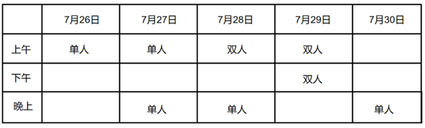

### 第 1 题　qid 11226907 · 类比推理

若7月30日参加比赛的是小孙，则可以得出（    ）。

- **A**. 小梁至少参加了1场单人比赛
- **B**. 小梁参加了7月27日的比赛
- **C**. 小马参加了7月28日的比赛
- **D**. 小王至少参加了1场单人比赛　✅

**答案**：D

**官方解析**

第一步：分析题干条件。

（1）小王参加的3场比赛仅安排在上午或者下午；

（2）小陈的比赛均在上午，且不在连续的两天中；

（3）小孙不与小陈共同参加1场双人比赛小孙的比赛均安排在7月26日至28日；

（4）小陈、小孙、小梁、小马、小王5人共参加8场比赛，其中3场比赛他们中有2人共同参加，其他5场比赛他们中仅有1人参加，每人参加其中的2至3场；

（5）7月30日参加比赛的是小孙。

第二步：根据题干条件进行推理。

根据条件（5）可知，小孙7月30日参加了比赛，是对条件（3）的否后，否后必否前，则小孙与小陈共同参加1场双人比赛，结合条件（2）可知，小孙与小陈在7月28日上午或7月29日上午参加双人比赛，而无论哪种情况，小陈必然参加上午的1场单人比赛。此时，为满足条件（1），小王必然参加上午剩下的1场单人比赛和1场双人比赛、下午的双人比赛。小马和小梁参加的比赛并不确定。

故正确答案为D。

---

### 第 2 题　qid 11226909 · 类比推理

若小马的比赛均安排在上午，则可以得出以下（    ）项一定是错误的。

- **A**. 7月27日上午小陈参加比赛
- **B**. 7月30日晚上小梁参加比赛
- **C**. 7月29日下午小孙参加比赛　✅
- **D**. 7月29日上午小马参加比赛

**答案**：C

**官方解析**

第一步：分析题干条件。

（1）小王参加的3场比赛仅安排在上午或者下午；

（2）小陈的比赛均在上午，且不在连续的两天中；

（3）小孙不与小陈共同参加1场双人比赛小孙的比赛均安排在7月26日至28日；

（4）小陈、小孙、小梁、小马、小王5人共参加8场比赛，其中3场比赛他们中有2人共同参加，其他5场比赛他们中仅有1人参加，每人参加其中的2至3场；

（5）小马的比赛均安排在上午。

第二步：根据题干条件进行推理。

代入A项：7月27日上午小陈参加比赛。结合条件（2）可得小陈参加7月29日上午的比赛。根据条件（4）（5）可得小马上午至少参加2场比赛。小王下午最多参加1场比赛，结合条件（1）可知，小王上午至少参加2场比赛。综合可得上午小陈、小马、小王各自参加2场比赛。则其可能情况如下表所示，可能正确，排除；

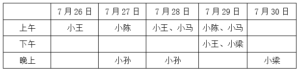

代入B项：7月30日晚上小梁参加比赛。根据A项表格，可能正确，排除；

代入C项：7月29日下午小孙参加比赛。这是对条件（3）的否后，否后必否前，可得小孙与小陈共同参加1场双人比赛，结合条件（2）可得，小孙与小陈参加7月28日或7月29日上午的双人比赛。无论哪种情况，小陈必然参加上午的1场单人比赛。结合条件（4）（5）可得，小马参加上午剩下的2场比赛，此时，小王上午和下午一共最多只能参加2场比赛，与条件（1）矛盾。因此，该项一定错误，当选；

代入D项：7月29日上午小马参加比赛。根据A项表格，可能正确，排除。

本题为选非题，故正确答案为C。

---

### 第 3 题　qid 11226886 · 图形推理

下列选项中，符合所给图形变化规律的是：

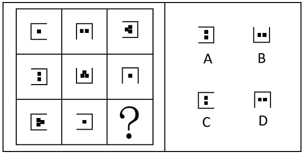

- **A**. A
- **B**. B　✅
- **C**. C
- **D**. D

**答案**：B

**官方解析**

解法一：元素组成相似，优先考虑样式规律。题干每幅图形中外部均为“U”形框，内部为小方块，九宫格优先看横行，观察发现，前两行图形中内部小方块的个数分别为1、2、3，且各出现一次，故？处图形中内部小方块的个数应为2。继续观察发现，“U”形框+1个小方块的图形和“U”形框+3个小方块的图形在第一行至第三行中，依次顺时针旋转，而“U”形框+2个小方块的图形在前两行中也顺时针旋转，故？处图形应在第二行的基础上继续顺时针旋转得到，对应B项。

解法二：元素组成相似，优先考虑样式规律。题干每幅图形中外部均为“U”形框，内部为小方块，九宫格优先看横行，观察发现，前两行图形中内部小方块的个数分别为1、2、3，且各出现一次，故？处图形中内部小方块的个数应为2。继续观察发现，第一行中，有1个小方块的图形到有2个小方块的图形，“U”形框顺时针旋转了，有2个小方块的图形到有3个小方块的图形，“U”形框又顺时针旋转了；经验证，第二行符合此规律；第三行应用此规律，故？处图形的“U”形框应在第三行有1个小方块图形“U”形框的基础上顺时针旋转得到，对应B项。

故正确答案为B。

---

### 第 4 题　qid 11226887 · 图形推理

下列选项中，符合所给图形变化规律的是：

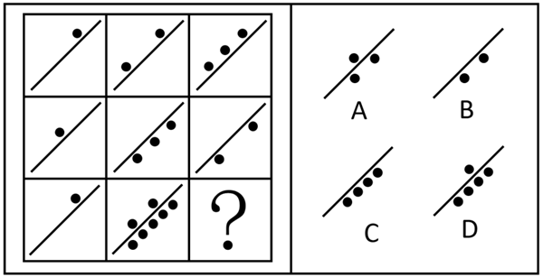

- **A**. A
- **B**. B　✅
- **C**. C
- **D**. D

**答案**：B

**官方解析**

图形中出现多个小黑球，优先考虑元素的个数。九宫格优先看横行，每个图形均被直线一分为二，在第一行中，图1中左侧的黑球数+图2中左侧的黑球数=图3中左侧的黑球数；在第二行中，图1中左侧的黑球数+图2中左侧的黑球数=1，图1中右侧的黑球数+图2中右侧的黑球数=3，此时第二行图3中只存在右侧的2个黑球，说明左右两侧的黑球数还需要做运算，即图1和图2左侧黑球相加为1，图1和图2右侧黑球相加为3，右侧比左侧多2，故图3的右侧留下2个黑球，再次验证第一行，即图1和图2左侧黑球相加为3，图1和图2右侧黑球相加为0，左侧比右侧多3，图3的左侧留下3个黑球，符合规律；第三行应用此规律，在第三行中，图1中左侧的黑球数+图2中左侧的黑球数=3，图1中右侧的黑球数+图2中右侧的黑球数=5，即图1和图2左侧黑球相加为3，图1和图2右侧黑球相加为5，右侧比左侧多2，故右侧留下2个黑球，对应B项。
故正确答案为B。

---

### 第 5 题　qid 11226892 · 图形推理

下列选项中，符合所给图形变化规律的是：

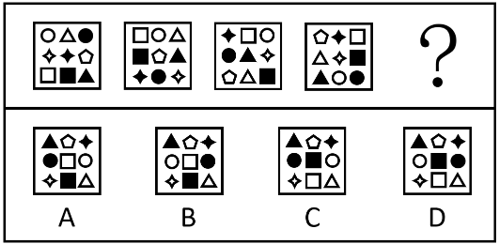

- **A**. A
- **B**. B
- **C**. C
- **D**. D　✅

**答案**：D

**官方解析**

元素组成相同，优先考虑位置规律。每个图形都由9个元素组成，分别给这9个元素的位置标为1、2、3、4、5、6、7、8、9。从图一到图二，白圆由1号移动到2号位置，白三角形由2号移动到3号位置，黑圆由3号移动到8号位置，白四角星由4号移动到9号位置，黑四角星由5号移动到7号位置，白五边形由6号移动到5号位置，白正方形由7号移动到1号位置，黑正方形由8号移动到4号位置，黑三角形由9号移动到6号位置。经验证，之后相邻的两幅图也满足小元素由1号移动到2号位置，由2号移动到3号位置，由3号移动到8号位置，由4号移动到9号位置，由5号移动到7号位置，由6号移动到5号位置，由7号移动到1号位置，由8号移动到4号位置，由9号移动到6号位置。因此从图四到？处图形也应满足此规律，只有D项符合。

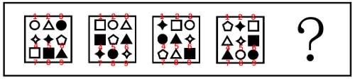

故正确答案为D。

---

### 第 6 题　qid 11226896 · 图形推理

下列选项中，符合所给图形变化规律的是：

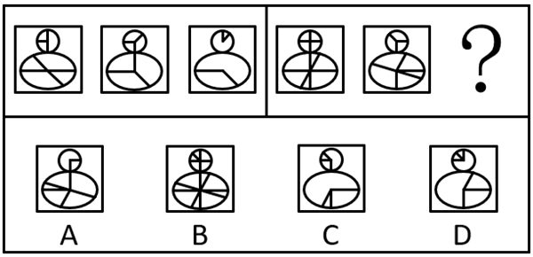

- **A**. A
- **B**. B
- **C**. C
- **D**. D　✅

**答案**：D

**官方解析**

元素组成相似，优先考虑样式规律中的加减同异。第一组图中，图1与图2上方圆形外框和下方椭圆形外框均不变，上方圆形内部线条求异，下方椭圆形内部线条求同得到图3，第二组图运用此规律，只有D项符合。
故正确答案为D。

---

### 第 7 题　qid 11226912 · 图形推理

下列选项中，符合所给图形变化规律的是<u>        </u>。

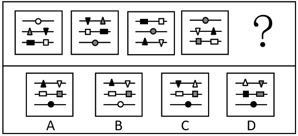

- **A**. A　✅
- **B**. B
- **C**. C
- **D**. D

**答案**：A

**官方解析**

元素组成相似，且相同元素重复出现，优先考虑样式规律中的遍历。观察发现，前一幅图形到后一幅图形，元素的位置按照“第三行第二行第一行第三行”的周期进行移动，且当一行存在两个元素时，每次移动后二者会左右互换位置，据此排除C、D两项；继续观察发现，当元素从“第一行第三行”时，元素的颜色会按照“白灰黑白”的周期进行变化，故？处第三行的圆形应为黑色，只有A项符合。

故正确答案为A。

---

### 第 8 题　qid 11226893 · 图形推理

下列选项中，符合所给图形变化规律的是：

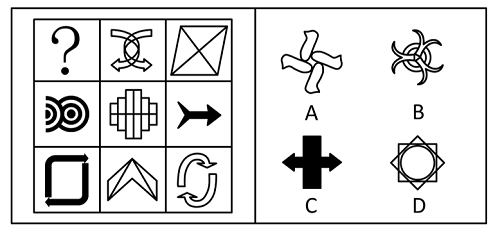

- **A**. A　✅
- **B**. B
- **C**. C
- **D**. D

**答案**：A

**官方解析**

元素组成不同，优先考虑属性规律。观察发现，题干图形较规整，且出现等腰元素，优先考虑对称性。横行和竖列单独看没有规律，且中间图形为既轴对称又中心对称图形，可以考虑“米”字型看。第二行均为横轴对称图形，第二列均为竖轴对称图形，“米”字型对角处的三个图形均为仅中心对称图形，则？处也应该选择仅中心对称图形，只有A项符合。

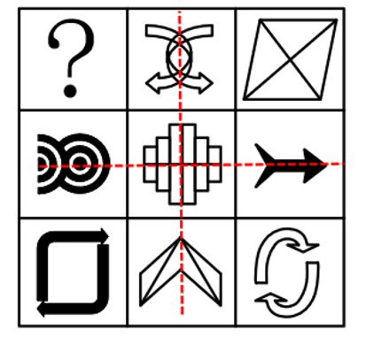

故正确答案为A。

---

### 第 9 题　qid 11226915 · 图形推理

下列选项中，符合所给图形变化规律的是： 

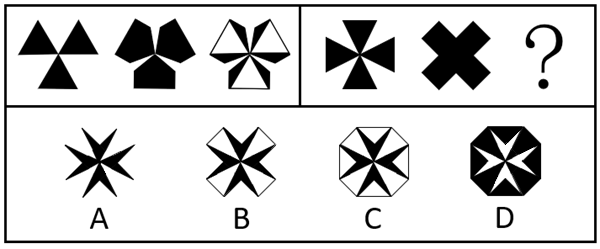

- **A**. A
- **B**. B
- **C**. C
- **D**. D　✅

**答案**：D

**官方解析**

元素组成相似，优先考虑样式规律。观察第一组图形发现，图1与图2相加后重叠的部分变为白色，即得到图3，第二组图形运用此规律，故？处的图形应为图1与图2相加后重叠的部分变为白色而得到，只有D项符合。
故正确答案为D。

---

### 第 10 题　qid 11226914 · 图形推理

下列选项中，符合所给图形变化规律的是：

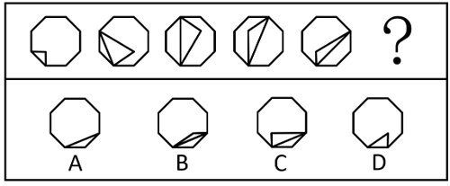

- **A**. A
- **B**. B　✅
- **C**. C
- **D**. D

**答案**：B

**官方解析**

元素组成基本相同，优先考虑位置规律。观察发现，题干图形均由一个八边形外框和内部线条构成，每幅图形中的内部线条与外框均有两个交点，如下图所示，点1的位置不变，点2沿外框每次顺时针移动一步，排除D项；继续观察发现，每幅图形中的内部交点沿着一个正方形轨迹每次逆时针移动一步，只有B项符合。

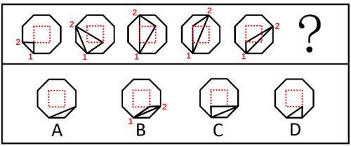

故正确答案为B。

---

### 第 11 题　qid 11226904 · 类比推理

下列选项中，与左图的关系与众不同的是：

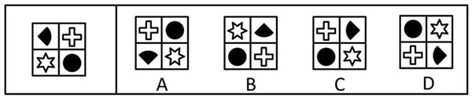

- **A**. A
- **B**. B
- **C**. C　✅
- **D**. D

**答案**：C

**官方解析**

题干和选项元素组成相同，优先考虑位置规律。对题干和选项按照的顺序画时针，观察发现，题干与A、B、D三项均为顺时针，C项为逆时针，故只有C项与题干的关系不同。

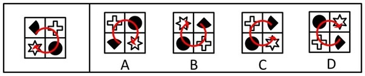

本题为选非题，故正确答案为C。

---

### 第 12 题　qid 11226898 · 图形推理

以下是同一个立方体的不同视角，则“？”处的图形是：

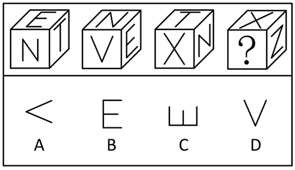

- **A**. A　✅
- **B**. B
- **C**. C
- **D**. D

**答案**：A

**官方解析**

本题为空间重构题，如下图所示。

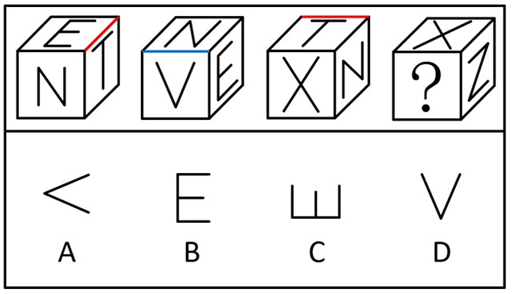

根据图1和图3中“T”字的方向可知，图1中“E”字面和“T”字面的公共边平行于“T”字面中“T”字的横线，图3中“T”字面和“X”字面的公共边垂直于“T”字面中“T”字的竖线，故“E”字面与“X”字面为相对面，同理，根据图1和图2中“E”的方向可知，“T”字面和“V”字面也为相对面。由于相对面不可能同时出现，也不可能同时不出现，故？处应为“T”字或“V”字，结合选项可知，？处应为“V”字，排除B、C两项。根据图2可知，“V”字中“V”的开口指向的面不是“X”字，排除D项，只有A项符合。

故正确答案为A。

---

### 第 13 题　qid 17674157 · 逻辑判断

某人利用同一充电宝的无线充电与有线充电功能分别给同款手机充电。充电电压视为恒定，记录的充电量与充电时间如下图所示。则下列判断正确的是：

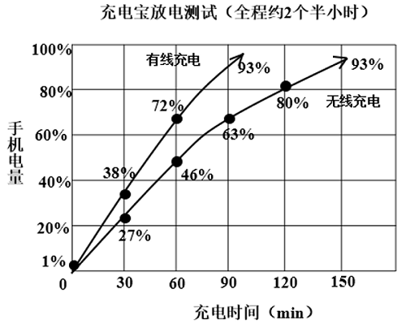

- **A**. 图中曲线和时间轴所围成的面积代表充电电流
- **B**. 图中曲线和时间轴所围成的面积代表充电电流所做的功
- **C**. 从1%充到93%，两者充入的电荷量不同
- **D**. 从1%充到93%，两者充入的电能相同　✅

**答案**：D

**官方解析**

由图可知，纵轴的手机电量为充入的电荷量，通常用Q表示，横轴为充电的时间，通常用t表示。

A项：根据电流定义公式可知，纵轴Q与横轴t的比值代表充电电流，即图线的斜率表示充电电流，并非图中曲线和时间轴所围成的面积（Qt），错误；

B项：根据电流定义公式和电流做功的公式W=UIt可知，电流做功的公式可表示为W=UQ，即充电电流所做的功等于充电电压与充入电荷量的乘积，并非图中曲线和时间轴所围成的面积（Qt），错误；

C、D两项：由于手机相同，电池的容量相同，因此从1%充到93%，两者充入的电荷量Q相同，均为92%，又因为充电电压视为恒定，充入的电能也就相同，C项错误，D项正确。

故正确答案为D。

---

### 第 14 题　qid 17674154 · 逻辑判断

“复兴号”高铁采用了多种减振降噪技术，包括优化车体结构、使用隔振材料、主动控制等。其中，隔振是通过在振动源和受保护对象之间引入弹性元件（如弹簧）和耗能元件（如阻尼器）来减小振动传递的方法。车厢可视为一个质量为M的刚体，通过4个相同的弹簧支撑在两个轮对上，每个弹簧的劲度系数为k，劲度系数k表示弹簧的刚度，k越大，弹簧越难压缩。车厢受到周期性的轨道激励，激励频率为f。为了减小车厢的振动，工程师在弹簧上并联了阻尼器，每个阻尼器的阻尼系数为e，阻尼系数e表示阻尼器对运动的阻碍程度，e越大，振动衰减得越快。
如果不考虑轮轨相互作用和其他因素，下列说法中正确的是：

- **A**. 增大弹簧劲度系数k，可以减小车厢的振动幅度
- **B**. 增大阻尼系数e，会增大车厢的振动幅度
- **C**. 车厢的固有频率只与劲度系数k有关，与质量M无关
- **D**. 当激励频率f接近车厢的固有频率时，会发生共振，车厢振动幅度最大　✅

**答案**：D

**官方解析**

A项：由题干信息“弹簧的劲度系数k越大，弹簧越难压缩”可知，高铁在行驶过程中，弹簧需要通过适当的变形来减小车厢的振幅，弹簧的劲度系数k越大，弹簧压缩越困难，形变越困难，即无法通过形变达到为车厢减震的目的，因此“增大弹簧劲度系数k，可以减小车厢的振动幅度”错误；
B项：由题干信息“阻尼系数e越大，振动衰减得越快”可知，增大阻尼系数e时，车厢的振动衰减变快，振动幅度会减小，错误；
C项：车厢的固有频率与车厢本身的材料、结构与质量有关（质量增大，结构的固有频率降低），与弹簧的劲度系数k无关，错误；
D项：共振是指机械所受的激励频率与该系统的固有频率相接近时，系统振幅显著增大的现象，因此当激励频率f接近车厢的固有频率时，会发生共振，车厢振动幅度最大，正确。
故正确答案为D。

---

### 第 15 题　qid 17674163 · 类比推理

量子隧穿是量子力学中的一种奇特现象，指粒子可以穿透本应无法逾越的势垒。假设有一个势垒，其高度为，宽度为d，一束能量为E的电子打向这个势垒。根据经典力学，只有当电子能量E大于势垒高度时，电子才能通过势垒。但根据量子力学，即使，电子也有一定概率通过势垒，这就是量子隧穿效应。量子隧穿的概率P与势垒参数有关，近似公式为：。其中，m为电子质量，h为约化普朗克常数。现有甲、乙、丙三个势垒，高度均为，宽度分别为d、2d、4d。如果一束能量为E（）的电子依次打向这三个势垒，电子隧穿概率最大的是：

- **A**. 甲势垒　✅
- **B**. 乙势垒
- **C**. 丙势垒
- **D**. 三个势垒隧穿概率相同

**答案**：A

**官方解析**

在公式：中，“”是一种数学符号，表示与某个量成正比关系，因此的值越大，概率P就越大，函数是减函数，y会随着x的增大而减小。

结合题干可知，m、、E、h均不变，即不变，d越小，的值越大，概率P也就越大，甲、乙、丙三个势垒的宽度分别为d、2d、4d，甲势垒的宽度d最小，因此电子遂穿概率最大的是甲势垒。

故正确答案为A。

---

### 第 16 题　qid 17674151 · 类比推理

地球上的山峰由于自身重力因素，导致山峰的高度存在极限。山峰越高，山体的重量就越大，山体的底部所需要承受的压力也就越大，当压力超过了岩石所能承受的极值，山体就会崩塌。假设山体下方是最坚硬的花岗岩，其抗压强度约为。假设将山体等效为一个圆锥体，山体密度约为，重力加速度，则理想情况下地球山峰极限高度约为：

- **A**. 8848m
- **B**. 20000m　✅
- **C**. 50000m
- **D**. 200000m

**答案**：B

**官方解析**

根据题干信息可知，山体的密度，花岗岩的抗压强度为。

设圆锥体山体的底面半径为r，高为h，根据圆的面积公式可知，山体的底面积为，根据圆锥的体积公式可知，山体的体积为，根据质量公式可知，山体的质量为，则此时花岗岩单位面积上承受的质量为，根据题干信息可知，花岗岩的抗压强度应小于等于，故可得，即，故山峰的极限高度为20000m。

故正确答案为B。

---

### 第 17 题　qid 17674546 · 逻辑判断

科学家们利用光的色散原理，研制出了一种新型光谱仪。这种光谱仪将待测光源发出的光通过一个特殊材料制成的三棱镜，在屏幕上形成色散图案。当待测光源发出的光中包含某种特定波长的光时，色散图案上会在对应颜色的位置出现光的吸收。利用这个原理，可以判断待测光源的成分。如果待测光源只含有红、黄、蓝三种单色光，则在屏幕上会出现下列（    ）情况。

- **A**. 在红、黄、蓝三种颜色对应的位置各出现一个暗纹　✅
- **B**. 在红、黄、蓝三种颜色之间的区域各出现一个暗纹
- **C**. 在红、黄、蓝三种颜色对应的位置出现一个宽而连续的暗纹
- **D**. 在色散图案上看不到任何暗纹

**答案**：A

**官方解析**

由题可知，待测光源只含有红、黄、蓝三种单色光。根据光谱仪的工作原理“当待测光源发出的光中包含某种特定波长的光时，色散图案上会在对应颜色的位置出现光的吸收”，则当待测光源发出的光通过光谱仪时，红、黄、蓝这三种单色光对应的波长处会发生光的吸收，即在屏幕上红、黄、蓝三种颜色对应的位置各出现一个暗纹，且这三种颜色的光由于波长离散分布，在屏幕上会表现为不连续的暗纹，A项正确，B、C、D三项均错误。
故正确答案为A。

---

### 第 18 题　qid 17674156 · 逻辑判断

买衣服的吊牌、买菜的时候标价的标签、外卖单的标签都是热敏纸，热敏纸上面涂有一种材料（结晶紫内酯），在遇热时会发生如下化学反应，从而显现出颜色。该反应是可逆反应，会由于各种原因造成褪色。根据上述信息，下列关于热敏纸小票描述正确的是：

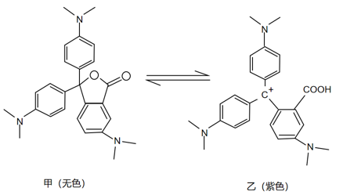

- **A**. 甲在加热时，颜色会从无色变为有色，因此刚打印的小票是热的　✅
- **B**. 乙在光照下，颜色会从有色变为无色，因为重新形成了内酯环
- **C**. 甲在紫外光照下，颜色会从无色变为有色，因此小票可以放在室外暴晒
- **D**. 乙在酸性条件下更稳定，不易褪色，因此可以将小票放在酸性环境中

**答案**：A

**官方解析**

结晶紫内酯是一种常用于热敏纸的显色材料，其颜色变化不仅受温度影响，也受到光照、酸碱性的影响。在加热或光照或酸性条件下，结晶紫内酯会发生化学反应，由无色变成紫色。
A项：热敏打印机通过局部加热，使热敏纸中无色的甲物质（结晶紫内酯）变成紫色的乙物质，从而显色，因此刚打印出的小票是热的，正确；
B项：在光照条件下，只会使热敏纸中无色的甲物质变成紫色的乙物质，无法使乙物质变成甲物质，错误；
C、D两项：在紫外线光照条件下或酸性环境下，热敏纸中无色的甲物质会变成紫色的乙物质，因此在室外暴晒或放在酸性环境中，整张小票都会变色，使小票上原本的字迹反而无法辨认，均错误。
故正确答案为A。

---

### 第 19 题　qid 17674545 · 逻辑判断

如图所示，根据科学家们的设想，太空电梯应该是从距离地面3.6万公里的地球同步卫星轨道向地面垂下一条缆绳至地面基站，并沿着这条缆绳修建往返于地球和太空之间的电梯型飞船，往来运输物资。则下列关于太空电梯说法错误的是：

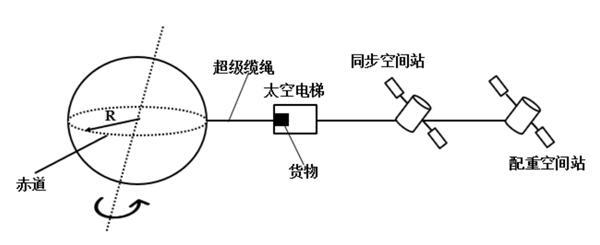

- **A**. 太空电梯的基座应设置在赤道附近最佳
- **B**. 太空电梯会和地球自转同步，且越高的地方速度越快
- **C**. 电梯缆绳的材料是制约我们建造太空电梯的主要困难之一
- **D**. 配重空间站的轨道高于同步空间站轨道的目的是用来抵消缆绳重力　✅

**答案**：D

**官方解析**

A项：由于地球同步轨道位于赤道上空，由题干信息可知，缆绳与地球同步卫星轨道垂直，因此地面基站需设置在赤道附近以保证缆绳垂直悬挂并与地球自转同步，正确；

B项：由于太空电梯通过缆绳与地球相连，因此会和地球自转同步，即与地球自转的角速度相同，根据线速度与角速度的关系可知，半径越大，线速度越大，因此越高的地方速度越快，正确；

C项：要建造如此长的太空电梯，需要强度极高、重量极轻、能够承受极大拉力等性能非常优异的材料来制作缆绳，而目前这种材料还很难找到，所以电梯缆绳的材料是制约建造太空电梯的主要困难之一，正确；

D项：由于配重空间站和同步空间站通过缆绳相连，由B项分析可知，配重空间站与同步空间站转动的角速度相同。而配重空间站的轨道更高，半径更大，根据向心力公式可知，配重空间站所需的向心力也更大，但由于配重空间站轨道更高，受到的万有引力更小，不足以提供向心力，导致配重空间站有向外做离心运动的趋势，因此就会通过缆绳为整个太空电梯系统提供向外的拉力，使缆绳处于绷紧状态，维持整套装置的稳定性，这是其主要作用，并非仅仅用来抵消缆绳重力，错误。

本题为选非题，故正确答案为D。

---

### 第 20 题　qid 17674155 · 逻辑判断

根据乙醚、正丁醇、乙二醇、乙醇、乙硫醇的结构简式和分子量，比较不同有机物的沸点。下列推断错误的是：

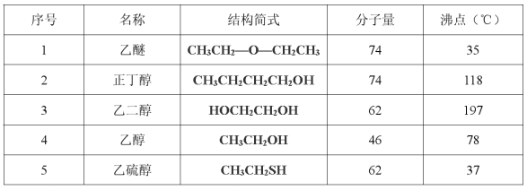

- **A**. 1和2说明：分子量相同，含有羟基（-OH）的物质的沸点更高
- **B**. 2和4说明：羟基（-OH）的数量相同时，分子量越大，沸点越高
- **C**. 2和3说明：羟基（-OH）的数量越多，沸点越高
- **D**. 4和5说明：羟基（-OH）对沸点的影响小于分子量对沸点的影响　✅

**答案**：D

**官方解析**

A项：1是乙醚（分子量74，沸点，不含羟基），2是正丁醇（分子量74，沸点，含1个羟基），二者分子量相同，含有羟基的正丁醇沸点更高，说明分子量相同，含有羟基的物质的沸点更高，正确；

B项：2是正丁醇（分子量74，沸点，含1个羟基），4是乙醇（分子量46，沸点，含1个羟基），二者含有羟基的数量相同，正丁醇的分子量更大，沸点更高，说明羟基的数量相同时，分子量越大，沸点越高，正确；

C项：2是正丁醇（分子量74，沸点，含1个羟基），3是乙二醇（分子量62，沸点，含2个羟基），乙二醇虽分子量更小，但因含有的羟基数量比正丁醇多，沸点更高，说明羟基的数量越多，沸点越高，正确；

D项：4是乙醇（分子量46，沸点，含1个羟基），5是乙硫醇（分子量62，沸点，不含羟基），乙醇虽分子量更小，但因含羟基，沸点比乙硫醇高，说明羟基对沸点的影响大于分子量对沸点的影响，错误。

本题为选非题，故正确答案为D。

---

### 第 21 题　qid 17674161 · 逻辑判断

疏水是指物质表面或分子与水之间的相互排斥作用，这种作用导致物质表面或分子不易与水接触或溶解。以下是几种基团对疏水性的影响：

烷基（如）：由于其非极性特性，烷基通常增加分子的疏水性。

苯环：非极性基团，同时苯环的大键结构，使电子分布更加均匀，导致苯环表现出疏水性。

羟基（）：极性基团，容易与水形成氢键，表现出亲水性。

现在，考虑一个有机物：3-甲基吡啶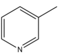，根据上述信息和化学知识，关于3-甲基吡啶的亲/疏水性描述正确的是：

- **A**. 氮原子有孤对电子，容易形成氢键，具有亲水性　✅
- **B**. 吡啶环的结构与苯环类似，具有疏水性
- **C**. 分子中含有甲基基团，具有疏水性
- **D**. 氮原子的电负性较高，具有亲水性

**答案**：A

**官方解析**

根据题意可知，非极性基团会表现出疏水性，极性基团或可以形成氢键的基团会表现出亲水性；由图可知，3-甲基吡啶是由一个吡啶环和一个甲基构成，吡啶环结构上与苯环类似，可视为苯环上的一个碳原子被一个氮原子代替，但由于氮原子最外层电子比碳原子多1个，为5电子结构，所以在吡啶环中氮原子最外层的3个电子与相邻碳原子的电子形成共价键后，仍剩余2个电子，形成孤对电子，所以吡啶环容易与水形成氢键，因而表现出亲水性。虽然甲基（烷基）具有疏水性，但在3-甲基吡啶中单个甲基的疏水作用远小于氢键的亲水作用，所以3-甲基吡啶具有亲水性，A项正确，B、C、D三项均错误。
故正确答案为A。

---

### 第 22 题　qid 17674159 · 类比推理

膜分离技术是指不同粒径分子的混合物在通过半透膜时，实现选择性分离的技术，膜分离技术在食品加工、海水淡化、纯水、超纯水制备、医药、生物、环保等领域得到了较大规模的开发和应用。下图是关于不同膜分离方法适用分离物质的信息，据此下列选项错误的是：

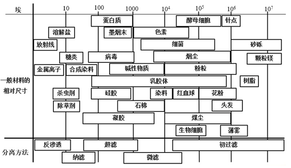

- **A**. 使用微滤技术可拦截水中的细菌
- **B**. 使用超滤技术可拦截水中的金属离子　✅
- **C**. 使用纳滤技术可拦截水中的病毒
- **D**. 使用反渗透技术可拦截水中的糖

**答案**：B

**官方解析**

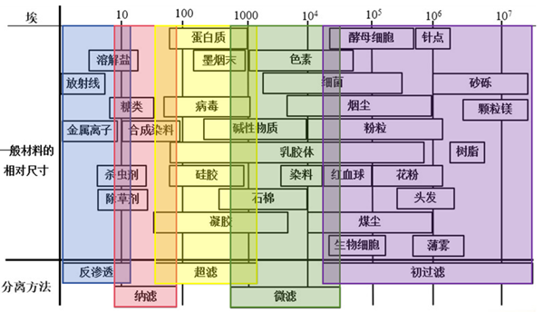

膜分离技术是指在分子水平上，不同粒径分子的混合物在通过半透膜时，实现选择性分离的技术，半透膜又称分离膜或滤膜，膜壁布满小孔，根据孔径大小可以分为：微滤膜、超滤膜、纳滤膜、反渗透膜等类型，根据半透膜类型形成对应的分离方法。

图中给出一般材料的相对尺寸及分离方法的孔径。其中，埃是一个长度单位，主要用来计量微小长度，1埃等于0.1纳米。如图所示，若分离物质的粒径大于分离方法对应的孔径，那么该物质就会被有效拦截在半透膜上。

A项：细菌的粒径大于微滤技术对应的孔径，可以被拦截，正确；

B项：金属离子的粒径小于超滤技术对应的孔径，不能被拦截，错误；

C项：病毒的粒径大于纳滤技术对应的孔径，可以被拦截，正确；

D项：糖类物质的粒径大于反渗透技术对应的孔径，可以被拦截，正确。

本题为选非题，故正确答案为B。

---

### 第 23 题　qid 11226889 · 逻辑判断

在某款风靡世界的电子竞技游戏领域里，来自中国的PLG战队与来自韩国的JEN战队被大部分玩家认为是世界上最顶尖的队伍。但这两队从未交手过，不过他们都曾经与欧洲最强G3战队有过交锋。其中PLG战队以3-2和3-1两次战胜G3，而JEN则是两次均以2-3憾负G3。因此许多玩家认为，PLG的实力强于JEN，一定会在比赛中战胜后者。
上述论点的论证方式与合理性和以下（    ）项最为类似。

- **A**. 在UFC赛场上，甲的地面技术强于乙，而丙的地面技术不如乙，因此甲的地面技术强于丙
- **B**. 作为奥数竞赛的常客，小张的竞赛成绩好于小李，而小明的竞赛成绩则不如小李。因此小张很有可能在下一次的奥数竞赛中比小明取得更好的成绩
- **C**. 在亚洲的足球队里，韩国队打越南队的战绩有压倒性优势，而中国队面对越南队则输多赢少，因此中国队应该踢不赢韩国队　✅
- **D**. 人民币升值的同时，日元正在贬值，因此现在中国人去日本旅游比以前更经济实惠

**答案**：C

**官方解析**

第一步：分析题干论证结构。
题干根据PLG战队与G3战队的对战中PLG战队的战绩更佳，G3战队与JEN战队的对战中G3战队的战绩更佳，得到结论认为PLG战队能战胜JEN战队。即通过过往对第三方的战绩串联来判断两者未来的对局结果。
第二步：逐一分析选项。
A项：该项根据甲的技术强于乙，乙的技术强于丙，得到结论认为甲的技术强于丙，即通过三人之间的技术强弱比较得出其中两人的技术强弱情况，但不是通过过去判断未来，且“技术强弱”与“战绩”“对局结果”的话题均不一致，与题干论证结构不一致，排除；
B项：该项根据小张的竞赛成绩好于小李，小李的竞赛成绩好于小明，得到结论认为下次小张的竞赛成绩好于小明，虽然是通过过往信息串联来判断未来结果，但“竞赛成绩”不涉及双方对战，与“战绩”“对局结果”的话题均不一致，与题干论证结构不一致，排除；
C项：该项根据韩国队与越南队的对战中韩国队的战绩更佳，越南队与中国队的对战中越南队的战绩更佳，得到结论认为韩国队能赢过中国队，即通过过往战绩串联来判断未来的对局结果，与题干论证结构一致，当选；
D项：该项根据人民币升值和日元贬值，得到结论认为现在中国人去日本旅游比以前更经济实惠，但不是通过过去判断未来，且“货币的升值贬值”与“战绩”“对局结果”的话题均不一致，与题干论证结构不一致，排除。
故正确答案为C。

---

### 第 24 题　qid 11226919 · 逻辑判断

微生物与农作物的生长息息相关，近期一科研小组解析了水稻细胞表面介导与微生物之间共生反应或免疫反应的关键受体蛋白X，并发现一种名为Y的调控蛋白能够约束X的活性，从而能够调节水稻对微生物的共生反应或免疫反应，不少人认为Y的发现为使用微生物提升水稻产量提供了极其有力的支持。
为了使此论点成立，需要补充的前提是：

- **A**. 微生物引起的免疫系统过度激活会导致水稻大量减产　✅
- **B**. 不是所有有助于水稻增产的微生物都可以与水稻共生
- **C**. 目前尚无使用微生物提升水稻产量的有效案例
- **D**. 微生物共生是与肥料及基因编辑同样强大的农作物增产方式

**答案**：A

**官方解析**

第一步：找出论点和论据。
论点：Y的发现为使用微生物提升水稻产量提供了极其有力的支持。
论据：科研小组解析了水稻细胞表面介导与微生物之间共生反应或免疫反应的关键受体蛋白X，并发现一种名为Y的调控蛋白能够约束X的活性，从而能够调节水稻对微生物的共生反应或免疫反应。
本题论点在讨论“Y”和“水稻产量”的关系，论据在讨论“Y”和“共生反应或免疫反应”的关系，论点论据话题不一致，且提问方式为“前提”，优先考虑搭桥，可直接寻找同时包含“水稻产量”和“共生反应或免疫反应”的选项。
第二步：逐一分析选项。
A项：该项指出微生物引起的免疫系统过度激活会导致水稻大量减产，即在“水稻产量”和“免疫反应”之间建立联系，为搭桥项，可以加强，当选；
B项：该项指出不是所有有助于水稻增产的微生物都可以与水稻共生，讨论的是微生物与水稻共生的话题，而论点讨论的是Y的发现为使用微生物提升水稻产量提供了支持，话题不一致，为无关项，无法加强，排除；
C项：该项指出目前尚无使用微生物提升水稻产量的有效案例，无法说明使用微生物提升水稻产量是否可行，未来是否能够提供支持，为不明确项，无法加强，排除；
D项：该项指出微生物共生是与肥料及基因编辑同样强大的农作物增产方式，在比较微生物共生与其他方式的增产能力，而论点讨论的是Y的发现为使用微生物提升水稻产量提供了支持，话题不一致，为无关项，无法加强，排除。
故正确答案为A。

---

### 第 25 题　qid 11226900 · 逻辑判断

大约3.75亿年前，长相滑稽的提塔利克鱼利用一种新颖的适应环境的方式冒险上了岸：有裂片的鳍推动它在陆地上“行走”，咽喉的气囊（原始的肺）让它能在空气中“呼吸”。提塔利克鱼实际上也有鳃，而且被认为是已知最早的四足动物的共同祖先，在数亿年的时间里，四足动物衍生出无数物种，包括智人。那么如果人类是从鱼进化而来的，为什么没有鳃呢？其中的一个较弱的解释是因为肺对于陆地生活具有显著优势。
以下（    ）项如果为真，最能支持上述解释。

- **A**. 只有有肺的鱼才能上岸到达陆地，并在陆地上存活下来　✅
- **B**. 人类胚胎有一个生理特征：类似鳃的被称为咽弓的细小褶皱
- **C**. 鳃有很大的表面积和数以千计的微小血管，使氧气很容易进入血液
- **D**. 虽然鳃擅长从水中提取氧气，但它提供的氧气量较少，不适合体型较大的动物

**答案**：A

**官方解析**

第一步：找出论点和论据。
论点：人类从鱼进化而来却没有鳃的原因是肺对于陆地生活具有显著优势。
论据：无。
本题只有论点，没有论据，加强优先考虑补充论据。
第二步：逐一分析选项。
A项：该项指出只有有肺的鱼才能上岸到达陆地，并在陆地上存活下来，说明靠鳃无法在陆地存活，突出肺对于陆地生活更有优势，补充论据，可以加强，当选；
B项：该项指出人类胚胎有类似鳃的生理特征，而论点讨论的是人类没有鳃的原因是肺对于陆地生活更有优势，为无关项，无法加强，排除；
C项：该项指出鳃使得氧气很容易进入血液的原理，而论点讨论的是人类没有鳃的原因是肺对于陆地生活更有优势，为无关项，无法加强，排除；
D项：该项指出鳃提供的氧气量较少，不适合体型较大的动物，仅说明鳃的不足，即供氧量不适合大体型动物，没有体现与肺的比较以及肺对于陆地生活是否更具优势，而A项直接说明了肺对于陆地生活的优势，D项加强力度不如A项，排除。
故正确答案为A。

---

### 第 26 题　qid 11226916 · 逻辑判断

著名的德国哲学家康德把人类用来表达知识的一切命题划分为“先验”与“后验”两种类型。所谓的“先验命题”是指命题的真假不需要凭借任何实际经验的检验就可以断定，而“后验命题”则是指命题的真假需要基于某种实际经验的检验才能得到断定。有人认为，由于人类知识命题中的一切概念最终都起源自实际经验，所以“先验命题”其实并不存在。
如果以下选项为真，（    ）项最能够削弱上述论点。

- **A**. 许多哲学家并不是康德主义者，先验与后验之分只是康德个人的观点
- **B**. 许多数学家认为，包括数学命题在内的所有命题都不是先验命题
- **C**. 概念最初来自于现实经验，但经验总是有限的，而命题可以有无限多
- **D**. 命题表达的仅仅是概念之间的关系，而概念往往可以不借助经验而得到定义　✅

**答案**：D

**官方解析**

第一步：找出论点和论据。
论点：“先验命题”其实并不存在。
论据：无。
文段前面是在下定义，告诉我们什么是“先验和后验命题”,所以本题只有论点，削弱优先考虑削弱论点，即“先验命题”是存在的。
第二步：逐一判断选项。
A项：该项指出先验与后验之分只是康德个人的观点，但与论点讨论的“‘先验命题’是否存在”无关，二者讨论的话题不一致，无法削弱，排除；
B项：该项指出许多数学家认为所有命题都不是先验命题，说明有许多数学家认为“先验命题”并不存在，补充论据，为加强项，无法削弱，排除；
C项：该项指出经验是有限的，而命题数量却是无限的，说明经验和命题在数量上并不对等，讨论的是“经验”与“命题”在数量上的差距，但与论点讨论的“‘先验命题’是否存在”无关，二者讨论的话题不一致，排除；
D项：该项指出命题表达的仅仅是概念之间的关系，而概念往往可以不借助经验而得到定义，说明存在不借助经验的命题，即“先验命题”是可能存在的，削弱论点，可以削弱，当选。
故正确答案为D。

---

### 第 27 题　qid 11226899 · 逻辑判断

所有经济学专业的学生都必须修读微观经济学课程；所有修读微观经济学课程的学生都参加了期末考试。有些金融学专业的学生也修读了微观经济学课程。所有统计学专业的学生都没有修读微观经济学课程。
如果以上判定为真，以下（    ）项说法一定为假。

- **A**. 一个学生参加了期末考试，但并非是统计学专业的学生
- **B**. 一个统计学专业的学生没有修读微观经济学课程
- **C**. 一个金融学专业的学生参加了期末考试
- **D**. 一个统计学专业的学生修读了微观经济学课程　✅

**答案**：D

**官方解析**

第一步：翻译题干。

（1）经济学专业学生修读微观经济学课程； 

（2）修读微观经济学课程参加期末考试；

（3）有的金融学专业学生修读微观经济学课程；

（4）统计学专业学生修读微观经济学课程。

第二步：逐一分析选项。

A项：将条件（2）等价换位为“有的参加期末考试修读微观经济学课程”，将条件（4）逆否等价为“修读微观经济学课程统计学专业学生”，二者进行串联可得条件（5）：有的参加期末考试修读微观经济学课程统计学专业学生。因此可得一个学生参加了期末考试，但并非是统计学专业的学生，故该项表述为真，排除；

B项：统计学专业学生是对条件（4）的肯前，肯前必肯后，可得该学生没有修读微观经济学课程，故该项表述为真，排除；

C项：将条件（2）和（3）进行串联可得条件（6）：有的金融学专业学生修读微观经济学课程参加期末考试。因此可得一个金融学专业的学生参加了期末考试，故该项表述为真，排除；

D项：统计学专业学生是对条件（4）的肯前，肯前必肯后，可得该学生没有修读微观经济学课程，该项表述一定为假，当选。

本题为选非题，故正确答案为D。

---

### 第 28 题　qid 11226901 · 逻辑判断

尽管越来越多的人已经认识到中西医各有优势，未来可更多地走向融合与互相补充，但在中医拥趸者和西医拥趸者之间依然经常发生激烈地辩论想要证明中医优于西医或者西医优于中医。一些中医拥趸者认为，中医是经过数千年实践验证的科学。古代没有西医，中国古人就是靠中医治病的，这是中医有效的历史证明，而且中医不光治标而且治本，能解决西医无法解决的问题。一些西医拥趸者认为，中医的基础理论是经验的、非科学的，中国古代人的平均寿命只有30多岁，正是有了西医之后中国人寿命才大幅提升。
如果西医拥趸者的理由是有效的，则以下除（    ）项外，都是蕴含在其陈述中的逻辑前提。

- **A**. 医疗水平高低是决定寿命长短的最关键因素
- **B**. 中国古代人的平均寿命低是由于中医效果差造成的
- **C**. 科学的医疗在于能够把握疾病的规律　✅
- **D**. 中医治病的效果没有西医好

**答案**：C

**官方解析**

第一步：找出论点和论据。
论点：中医的基础理论是经验的、非科学的，中国古代人的平均寿命只有30多岁，正是有了西医之后中国人寿命才大幅提升。
论据：无。
本题只有论点，没有论据，且提问方式为“前提”，加强优先考虑必要条件。
第二步：逐一分析选项。
A项：如果医疗水平高低不是决定寿命长短的最关键因素，则西医拥趸者就无法通过中国古代人的平均寿命低，就得出中医的基础理论是经验的、非科学的，该项是论点成立的必要条件，可以加强，排除；
B项：如果中国古代人的平均寿命低不是由于中医效果差造成的，则西医拥趸者就无法根据中国古代人的平均寿命低来贬低中医的治病效果，该项是论点成立的必要条件，可以加强，排除；
C项：该项指出科学的医疗在于能够把握疾病的规律，而论点讨论的是中医和西医对寿命长短的影响以及中医理论是否科学，话题不一致，当选；
D项：该项说中医治病的效果没有西医好，说明西医更好，补充论据，可以加强，排除。
本题为选非题，故正确答案为C。

---

### 第 29 题　qid 11226905 · 类比推理

某媒体以《中国科学家算出月球年龄：20.3亿岁！》为题，对中国科学家团队通过对嫦娥五号采集的月球样品的研究作了报道。报道中提到，中国的研究者精确测定了嫦娥五号采集的月壤中的玄武岩样品的年龄是20.3亿年。而科学界普遍认为，月球的实际年龄在40亿年以上，且接近45亿年。
以下（    ）项最能说明中国科学家的研究与科学界关于月球年龄的普遍认识不冲突，该媒体报道有偏差。

- **A**. 嫦娥五号采集的月壤地质年龄太短
- **B**. 月壤年龄和月球年龄不是一回事　✅
- **C**. 中国的研究者对月壤年龄的测定是错误的
- **D**. 科学界关于月球实际年龄的普遍认识是错误的

**答案**：B

**官方解析**

第一步：找出题干矛盾。
提问方式为：说明“中国科学家”的研究与“科学界”关于月球年龄的普遍认识不冲突，该媒体报道有偏差。
其中“中国科学家”的研究结论是：精确测定了嫦娥五号采集的月壤中的玄武岩样品的年龄是20.3亿年；
而“科学界”普遍认为：月球的实际年龄在40亿年以上，且接近45亿年。
总结矛盾：中国科学家精确测定了“月壤”的年龄是20.3亿年，科学界普遍认为“月球”的实际年龄在40亿年以上，且接近45亿年，这两者为什么不冲突。
第二步：逐一分析选项。
A项：该项指出嫦娥五号采集的月壤地质年龄太短，但没有说明月壤年龄和月球年龄之间的关系，不能解释题干矛盾，排除；
B项：该项指出月壤年龄和月球年龄不是一回事，说明中国科学家测定的20.3亿年是月壤的年龄，而科学界普遍认为的40亿年以上是月球的实际年龄，两者并不相同，因此中国科学家的研究与科学界的普遍认识之间并不冲突，媒体报道确实存在偏差，可以解释题干矛盾，当选；
C项：该项指出中国研究者对月壤年龄的测定是错误的，那么就无法确定月壤的真实年龄，但无法解释与科学界的普遍认识之间不冲突的原因，不能解释题干矛盾，排除；
D项：该项指出科学界关于月球实际年龄的普遍认识是错误的，那么就无法确定月球的真实年龄，但无法解释与中国研究者对月壤年龄的测定之间不冲突的原因，不能解释题干矛盾，排除。
故正确答案为B。

---

### 第 30 题　qid 11226902 · 逻辑判断

为了使孩子能够得到更好的培养，一对年轻的夫妇比较了4个有相同课程设置的培训机构之后得出以下结论：
①甲培训机构的儿童运动课程是最好的，而且儿童思维课程不比丙培训机构差
②乙培训机构的绘画课程比甲培训机构好，而且音乐课程也比甲培训机构好
③丙培训机构的儿童思维课程最差，但音乐课程比乙培训机构好
④丁培训机构的绘画课程比乙培训机构好，而且儿童运动课程也比甲培训机构好
进一步调查后，他们发现以上结论中有一个是假的，则关于四个培训机构，下列说法一定为真的是（    ）项。

- **A**. 甲培训机构的儿童运动课程是最好的
- **B**. 甲培训机构的儿童思维课程不比丙培训机构差　✅
- **C**. 丁培训机构的绘画课程比乙培训机构好
- **D**. 丁培训机构的儿童运动课程比甲培训机构好

**答案**：B

**官方解析**

第一步：分析题干条件。

将课程的质量从高到低进行排序：

①儿童运动：甲最好；儿童思维：甲丙；

②绘画：乙＞甲；音乐：乙＞甲；

③儿童思维：丙最差；音乐：丙＞乙；

④绘画：丁＞乙；儿童运动：丁＞甲；

⑤4个结论中有1个是假的。

第二步：根据题干条件进行推理。

根据条件⑤可知，①④两个结论不能同时为真（如果儿童运动课程中甲是最好的，那么丁不可能比甲好），即①④两个结论中，有一个为真，一个为假，所以可以推出结论②③均为真。

结合结论②③可将课程的质量从高到低进行排序：

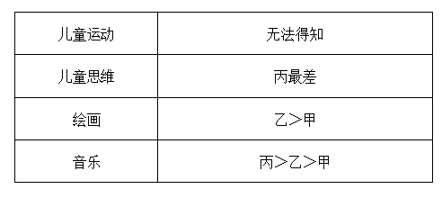

综上，只有B项的说法一定为真。

故正确答案为B。

---
