# 2025年四川省考/选调公务员录用考试《行测》试题（网友回忆版）

> 判断推理 · 30 题 · 四川 2025

## 第 1 题　qid 10297403 · 图形推理

从所给四个选项中，选择最合适的一个填入问号处，使之呈现一定规律性：

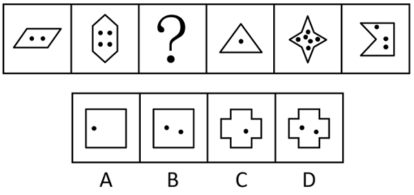

- **A**. A
- **B**. B　✅
- **C**. C
- **D**. D

**答案**：B

**官方解析**

元素组成不同，且无明显属性规律，优先考虑数量规律。观察发现，题干图形均由外框和内部黑点组成，考虑内外两者之间的关系。题干图形外框边数分别为4、6、？、3、8、5，内部黑点个数分别为2、4、？、1、6、3，每幅图形均符合“外框边数-黑点个数=2”，故？处应填入一个“外框边数-黑点个数=2”的图形，只有B项符合。
故正确答案为B。

---

## 第 2 题　qid 10297398 · 图形推理

从所给四个选项中，选择最合适的一个填入问号处，使之呈现一定规律性：

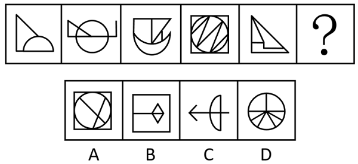

- **A**. A
- **B**. B　✅
- **C**. C
- **D**. D

**答案**：B

**官方解析**

元素组成不同，且无明显属性规律，优先考虑数量规律。观察发现，题干图形均存在小直角三角形或垂直关系的图形，考虑直角数，数量依次为：1、2、3、4、5，呈递增规律，故？处直角数量应为6，只有B项符合。
故正确答案为B。

---

## 第 3 题　qid 10297399 · 图形推理

从所给四个选项中，选择最合适的一个填入问号处，使之呈现一定规律性：

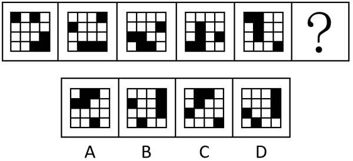

- **A**. A　✅
- **B**. B
- **C**. C
- **D**. D

**答案**：A

**官方解析**

元素组成相同，优先考虑位置规律。观察发现，黑块位置发生变化，优先考虑平移。如下图所示，1号黑块依次向下平移一格（到头时循环走），2号黑块在外圈沿顺时针方向依次平移一格，3号、4号、5号黑块在右侧3×4在最左侧一列宫格中，沿顺时针方向依次平移一格，只有A项符合。

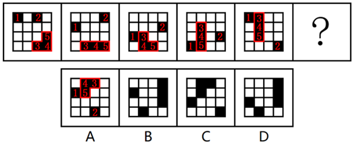

故正确答案为A。

---

## 第 4 题　qid 10297407 · 图形推理

从所给四个选项中，选择最合适的一个填入问号处，使之呈现一定规律性：

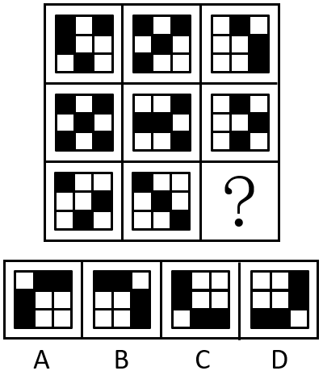

- **A**. A　✅
- **B**. B
- **C**. C
- **D**. D

**答案**：A

**官方解析**

元素组成相似，优先考虑样式规律。题干图形轮廓和分割区域相同，且黑块数量不成规律，考虑黑白运算。九宫格优先看横行，第一行运算规律为：黑+黑=白，白+白=黑，黑+白=白，白+黑=白；经验证，第二行符合此规律；第三行应用此规律，只有A项符合。
故正确答案为A。

---

## 第 5 题　qid 10297408 · 图形推理

下边四个图形，可以拼合（只能通过上、下、左、右平移）成选项中的哪一个图形？

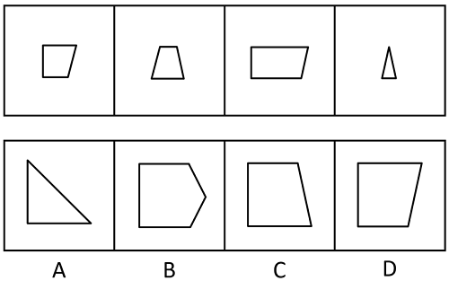

- **A**. A
- **B**. B
- **C**. C　✅
- **D**. D

**答案**：C

**官方解析**

本题考查平面拼合，可采用平行且等长相消的方式解题。消去平行且等长的线段后进行组合即可得到轮廓图，即为C项。平行且等长相消的方式如下图所示：

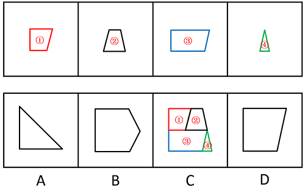

故正确答案为C。

---

## 第 6 题　qid 10297444 · 图形推理

将一长方形纸沿左图虚线折叠后，沿右图虚线裁剪，得到的窗花是：

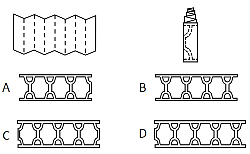

- **A**. A
- **B**. B　✅
- **C**. C
- **D**. D

**答案**：B

**官方解析**

观察图形，将左侧长方形纸沿虚线折叠后，形成8个形状大小完全相等的长方形，两两一组，共分为4组，后按照右图虚线花纹进行裁剪，得到4个镂空完整的花纹图案，只有B项符合。
故正确答案为B。

---

## 第 7 题　qid 10297423 · 图形推理

左图给定的是由等大的15个白色正方体和3个黑色正方体堆叠而成的多面体的正视图和后视图，该多面体可以由①、②和③三个多面体拼合而成，问以下哪一项能填入问号处？

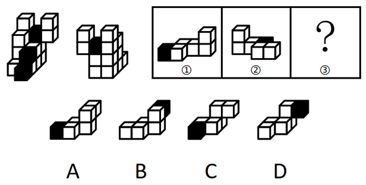

- **A**. A
- **B**. B
- **C**. C
- **D**. D　✅

**答案**：D

**官方解析**

本题考查立体拼合。题干立体图形可以由①、②以及D项旋转拼合而成，如下图所示：

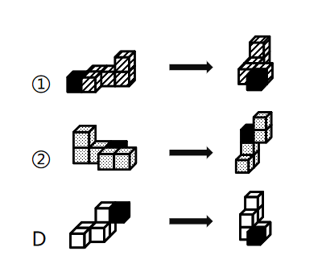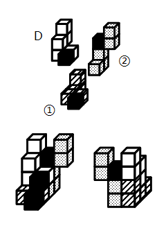

故正确答案为D。

---

## 第 8 题　qid 10297422 · 图形推理

把下面的六个图形分为两类，使每一类图形都有各自的共同特征或规律，分类正确的一项是：

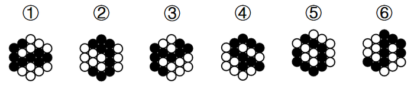

- **A**. ①③④；②⑤⑥
- **B**. ①⑤⑥；②③④　✅
- **C**. ①②⑥；③④⑤
- **D**. ①④⑥；②③⑤

**答案**：B

**官方解析**

本题为分组分类题目。元素组成相同，但无明显位置规律和属性规律，优先考虑数量规律。观察发现，题干图形均由黑球和白球构成，且有部分白球被分隔开，考虑数部分数。题干图形黑球均是由一部分构成，白球均是由两部分构成，无法分组。继续观察白球每部分含有的小球个数，发现图①⑤⑥中每个白色部分均含有5个小球，图②③④中两个白色部分含有的小球数分别是3和7。即图①⑤⑥为一组，图②③④为一组。
故正确答案为B。

---

## 第 9 题　qid 10297413 · 定义判断

词的同一性是指同一个词形可以表示不同的意义，但这些不同的意义之间存在着内在联系的现象。
根据上述定义，下列划线的词不属于词的同一性现象的是：

- **A**. 
他的态度很<u>端正</u>  大家要<u>端正</u>态度

- **B**. 
他是我们的<u>领导</u>  在D的<u>领导</u>下奋勇前进

- **C**. 
这个人<u>仪表</u>堂堂  在重要场合要注意<u>仪表</u>
　✅
- **D**. 
这是一门<u>科学</u>  处理问题的方法很<u>科学</u>

**答案**：C

**官方解析**

第一步：找出定义关键词。
“同一个词形可以表示不同的意义”、“这些不同的意义之间存在着内在联系”。
第二步：逐一分析选项。
A项：“态度很端正”中的“端正”为形容词，意思是正派、正确，“端正态度”中的“端正”为动词，意思是使端正，两个“端正”表示的是不同的意义，且两个不同意义间存在联系，符合“同一个词形可以表示不同的意义”、“这些不同的意义之间存在着内在联系”，符合定义，排除；
B项：“他是我们的领导”中的“领导”为名词，指的是担任领导工作的人，“在D的领导下奋勇前进”中的“领导”为动词，意思是率领并引导，两个“领导”表示的是不同的意义，且两个不同意义间存在联系，符合“同一个词形可以表示不同的意义”、“这些不同的意义之间存在着内在联系”，符合定义，排除；
C项：“仪表堂堂”中的“仪表”为名词，指的是人的外表（包括容貌、姿态、风度等），与“注意仪表”中的“仪表”词性、词义一致，不符合“同一个词形可以表示不同的意义”，不符合定义，当选；
D项：“一门科学”中的“科学”为名词，指的是反映自然、社会、思维等的客观规律的分科的知识体系，“方法很科学”中的“科学”为形容词，意思是合乎科学的，两个“科学”表示的是不同的意义，且两个不同意义间存在联系，符合“同一个词形可以表示不同的意义”、“这些不同的意义之间存在着内在联系”，符合定义，排除。
本题为选非题，故正确答案为C。

---

## 第 10 题　qid 10297411 · 定义判断

生产性固定资产是指在物质资料生产过程中能长期发挥作用而不改变其实物形态的劳动资料。它不同于非生产性固定资产，非生产性固定资产可分两类，一类是纯消费性的，没有盈利，投资不能收回，其再投资依靠社会积累，另一类是可转化为无形商品的，有盈利，可以收回投资，甚至可实现增值和积累。
根据上述定义，以下投资能形成生产性固定资产的是：

- **A**. 对影剧院、电视台、咨询公司等的投资
- **B**. 对面粉厂的机器、设备和厂房等的投资　✅
- **C**. 对学校、国防安全、社会福利设施等的投资
- **D**. 对快餐店的家禽、蔬菜、大米等原材料的投资

**答案**：B

**官方解析**

第一步：找出定义关键词。
生产性固定资产：“在物质资料生产过程中”、“长期发挥作用”、“不改变其实物形态”；
非生产性固定资产：“纯消费性的，没有盈利，投资不能收回”、“可转化为无形商品的，有盈利，可以收回投资”。
第二步：逐一分析选项。
A项：对影剧院、电视台、咨询公司等的投资，可以盈利、收回投资，符合“可转化为无形商品的，有盈利，可以收回投资”，符合“非生产性固定资产”定义，不符合“生产性固定资产”定义，排除；
B项：面粉厂的机器、设备和厂房属于可长期使用的实物，符合“在物质资料生产过程中”、“长期发挥作用”、“不改变其实物形态”，符合“生产性固定资产”定义，当选；
C项：对学校、国防安全、社会福利设施等的投资，符合“纯消费性的，没有盈利，投资不能收回”，符合“非生产性固定资产”定义，不符合“生产性固定资产”定义，排除；
D项：家禽、蔬菜、大米等原材料在使用时，会被消耗减少且也可能被制作成其他商品，不符合“长期发挥作用”、“不改变其实物形态”，不符合“生产性固定资产”定义，排除。
故正确答案为B。

---

## 第 11 题　qid 10297412 · 定义判断

内疚式教育是指在家庭生活中，父母企图通过自己的某种行为让孩子产生内疚感，从而使其听从自己的安排。
根据上述定义，下列属于内疚式教育的是：

- **A**. 小强爷爷病重住院，小强父母为了不影响小强学习就没有告诉他，但小强无意中发现了此事，还是偷偷去医院探望了爷爷
- **B**. 小刚不小心删除了爸爸电脑中的文件，导致爸爸通宵加班补救，小刚对此十分自责，下决心再也不碰爸爸的电脑了
- **C**. 妈妈每天早上五点就起来给小红准备早餐，经常对吃着早餐的小红念叨，只要你好好学习，妈妈就是再辛苦也心甘情愿　✅
- **D**. 爸爸在下雪天骑车给小林送衣物时不慎摔伤，看着爸爸打着厚厚石膏的胳膊，小林暗想长大以后一定要好好孝顺爸爸

**答案**：C

**官方解析**

第一步：找出定义关键词。
“通过自己的某种行为让孩子产生内疚感”、“使其听从自己的安排”。
第二步：逐一分析选项。
A项：父母向小强隐瞒爷爷病重住院的事情，是为了不影响小强学习，并非是为了让小强产生内疚感并听从安排，不符合“通过自己的某种行为让孩子产生内疚感”、“使其听从自己的安排”，不符合定义，排除；
B项：小刚的自责来源于爸爸为小刚的错误通宵补救，爸爸实施这一行为并非为了让小刚产生内疚感并听从安排，不符合“通过自己的某种行为让孩子产生内疚感”、“使其听从自己的安排”，不符合定义，排除；
C项：妈妈为小红早起做早餐，并经常向小红说明自己的辛苦，是为了让小红产生内疚感，并且好好学习，符合“通过自己的某种行为让孩子产生内疚感”、“使其听从自己的安排”，符合定义，当选；
D项：爸爸在为小林雪天送衣物时摔伤，爸爸的行为并非是为了让小林产生内疚感并听从安排，不符合“通过自己的某种行为让孩子产生内疚感”、“使其听从自己的安排”，不符合定义，排除。
故正确答案为C。

---

## 第 12 题　qid 10297414 · 定义判断

过度管理是指某些管理者过分相信自己的能力、精力和眼光，认为缺少自己的指挥就达不到预期效果，或凡事亲力亲为，让自己整日陷于忙碌之中。
根据上述定义，下列不属于过度管理的是：

- **A**. 班主任陶老师对学生要求十分严格，每天都到班级督促学生学习和锻炼，常常严厉批评犯错误的同学　✅
- **B**. 龚经理总是对下属不放心，公司职员小张出差两天，龚经理打了10多个电话指导工作，弄得小张压力很大
- **C**. 饭店高老板习惯每天下班时和保洁员工一起打扫卫生，他觉得只有这样才能保证餐厅整洁，不留任何卫生死角
- **D**. 办公室许主任每次分派工作都十分具体，如对会议室桌椅的摆放数量和位置等细节都交代得十分清楚，让下属没有一点发挥的余地

**答案**：A

**官方解析**

第一步：找出定义关键词。
“管理者过分相信自己的能力、精力和眼光”、“认为缺少自己的指挥就达不到预期效果”、“凡事亲力亲为”、“让自己整日陷于忙碌之中”。
第二步：逐一分析选项。
A项：班主任陶老师对学生要求十分严格，每天都到班级督促学生学习和锻炼，常常严厉批评犯错误的同学，陶老师的行为属于比较严格的教育行为，但并未体现陶老师过分相信自己眼光，也未体现陶老师认为学生离开自己就无法学习，不符合“管理者过分相信自己的能力、精力和眼光”、“认为缺少自己的指挥就达不到预期效果”，不符合定义，当选；
B项：龚经理总是对下属不放心，职员小张出差两天，打了10多个电话指导工作，说明龚经理认为小张缺少自己的指导，就无法完成工作，符合“认为缺少自己的指挥就达不到预期效果”，符合定义，排除；
C项：饭店高老板每天下班时和保洁员工一起打扫卫生，他觉得只有这样才能保证餐厅整洁，说明高老板认为缺少自己的参与，员工就无法完成保洁工作，符合“认为缺少自己的指挥就达不到预期效果”，符合定义，排除；
D项：许主任每次分派工作都十分具体，让下属没有一点发挥的余地，说明许主任凡事亲力亲为，符合“凡事亲力亲为”，符合定义，排除。
本题为选非题，故正确答案为A。

---

## 第 13 题　qid 10297416 · 定义判断

国际法上的先占是指一国有意识地占有无主地，并对其实行有效的行政管理，从而取得该领土的行为。
根据上述定义，下列属于先占行为的是：

- **A**. 甲国的探险队在海上发现了一个从未有人踏足的新岛屿
- **B**. 乙国在某一仅有游牧民族长期生活的土地上援建一条铁路
- **C**. 丙国通过战争，迫使另一国将一个无人居住的区域，割让给自己
- **D**. 丁国在公海发现了一无人岛，迅速向该地派遣人员，建立了行政机关　✅

**答案**：D

**官方解析**

第一步：找出定义关键词。
“一国有意识地占有无主地”、“实行有效的行政管理”、“取得该领土的行为”。
第二步：逐一分析选项。
A项：甲国探险队发现新岛屿，仅仅是“发现”而不是“占有”，不符合“一国有意识地占有无主地”、“实行有效的行政管理”、“取得该领土的行为”，不符合定义，排除；
B项：乙国援建铁路，“援建”是支援建设，而不是“占有”，不符合“一国有意识地占有无主地”、“实行有效的行政管理”、“取得该领土的行为”，不符合定义，排除；
C项：丙国通过战争迫使另一国割让无人居住的区域，割让的区域为另一国所有，不是无主地，不符合“一国有意识地占有无主地”，不符合定义，排除；
D项：丁国在公海发现无人岛，派遣人员建立了行政机关，符合“一国有意识地占有无主地”、“实行有效的行政管理”、“取得该领土的行为”，符合定义，当选。
故正确答案为D。

---

## 第 14 题　qid 10297426 · 定义判断

太师椅是我国古代唯一用官职来命名的椅子，它体态宽大，靠背与扶手连成一片，形成一个三扇、五扇或多扇的围屏。
根据上述定义，下列图片中是太师椅的是：

- **A**. 
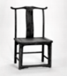

- **B**. 
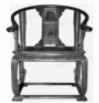
　✅
- **C**. 
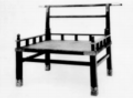

- **D**. 
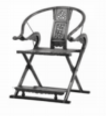

**答案**：B

**官方解析**

第一步：找出定义关键词。
“体态宽大”、“靠背与扶手连成一片”、“形成一个三扇、五扇或多扇的围屏”。
第二步：逐一分析选项。
A项：该图中的椅子没有扶手，不符合“靠背与扶手连成一片”，不符合定义，排除；
B项：该图中的椅子符合“体态宽大”、“靠背与扶手连成一片”、“形成一个三扇、五扇或多扇的围屏”，符合定义，当选；
C项：该图中的椅子靠背与扶手高度相差悬殊，未连成一片，不符合“靠背与扶手连成一片”，不符合定义，排除；
D项：该图中的椅子体态较窄，不符合“体态宽大”，不符合定义，排除。
故正确答案为B。

---

## 第 15 题　qid 10297420 · 定义判断

语言通胀是指当前社会中，由于词语使用过度夸张、描述超过事实而造成词义掉价、情感弱化、指称范围夸大，甚至可能导致信息理解错误的语言泡沫化现象。
根据上述定义，下列没有体现语言通胀的是：

- **A**. “美女”一词原指“年轻貌美的女子”，具有称赞之意，但如今“美女”已变成很多人对女性的日常称呼
- **B**. 社交网络上人们用词仿佛达成了一种“默契”，实用效果不错的东西都叫“神器”，说起好吃的东西都是“好吃哭了”
- **C**. 微信聊天时，最初用“哈哈”表示高兴，现在，年轻人经常会用很夸张的动态表情图来表示自己高兴的心情，有些图让人忍俊不禁　✅
- **D**. 小李向顾客介绍说自己是理发店的首席设计师，顾客发现价目表上写着“首席设计师38元，设计总监68元，创意总监98元”

**答案**：C

**官方解析**

第一步：找出定义关键词。
“词语使用过度夸张、描述超过事实”、“造成词义掉价、情感弱化、指称范围夸大”、“甚至可能导致信息理解错误”。
第二步：逐一分析选项。
A项：“美女”由“年轻貌美的女子”变为对女性的日常称呼，符合“词语使用过度夸张、描述超过事实”、“造成词义掉价、情感弱化、指称范围夸大”，符合定义，排除；
B项：“神器”原指中国神话中有其超自然的威力或能力的兵器法宝，而现在只要实用效果不错的一般器具都叫“神器”，“好吃哭了”原用于特别好吃以致于十分感动，而现在只要好吃都说“好吃哭了”，过于夸张，符合“词语使用过度夸张、描述超过事实”、“造成词义掉价、情感弱化、指称范围夸大”，符合定义，排除；
C项：微信聊天时，最初用“哈哈”表示高兴，现在，年轻人经常会用很夸张的动态表情图来表示自己高兴的心情，一个是语言，一个是图片，不符合“词语使用过度夸张、描述超过事实”、“造成词义掉价、情感弱化、指称范围夸大”，不符合定义，当选；
D项：首席设计师原指在一个设计机构的设计师群体中排在第一位的，现为理发店单价最低等的理发师，符合“词语使用过度夸张、描述超过事实”、“造成词义掉价、情感弱化、指称范围夸大”、“甚至可能导致信息理解错误”，符合定义，排除。
本题为选非题，故正确答案为C。

---

## 第 16 题　qid 10297431 · 定义判断

功能性自治是指在解决问题的过程中，某些子目标的达成刺激当事人产生进一步发展的动力，不受最初设定问题的限制，诱发思维进入更高级发展阶段的过程。
根据上述定义，下列属于功能性自治的是：

- **A**. 某婴儿想要触碰稍远处的玩具，在此过程中学会了控制手臂，之后他根据有时能触碰到、有时不能触碰到的体验，逐渐建立了“距离”的概念　✅
- **B**. 某中学生立志获得学校跨栏比赛的冠军，经过刻苦练习终于实现目标，这赋予了他更大的勇气和自信，此后他更加努力并入选国家队
- **C**. 某医学生为掌握神经解剖技术大量练习，在控制手部精细操作的过程中，他意识到自己的兴趣在雕塑，于是下定决心转入艺术系
- **D**. 某工程师退休之后回想人生，意识到自己年轻时立下的职业理想已实现，但有些人生目标尚未实现，因而生发出许多感慨

**答案**：A

**官方解析**

第一步：找出定义关键词。
“解决问题的过程中”、“子目标的达成”、“思维进入更高级发展阶段”。
第二步：逐一分析选项。
A项：婴儿想要碰触玩具，符合“解决问题的过程中”，学会控制手臂，符合“子目标的达成”，建立“距离”的概念，符合“思维进入更高级发展阶段”，符合定义，当选；
B项：学生立志获得校比赛冠军，符合“解决问题的过程中”，刻苦练习实现目标，属于原本的目标，不符合“子目标的达成”，此后更加努力加入国家队，也不是思维方面的问题，不符合“思维进入更高级发展阶段”，不符合定义，排除；
C项：学生为掌握神经解剖技术，符合“解决问题的过程中”，控制手部精细操作，符合“子目标的达成”，但是由学医转入艺术系，只是更换了兴趣和专业，不符合“思维进入更高级发展阶段”，不符合定义，排除；
D项：工程师退休后回想人生，不符合“解决问题的过程中”，不符合定义，排除。
故正确答案为A。

---

## 第 17 题　qid 10297427 · 定义判断

沉浸式演艺是指某些旅游景区或机构摒弃传统游览模式，将人们喜爱的、脑海中留存或想象的场景通过艺术表演的方式转变为现实，让游客产生一种身临其境的体验。
根据上述定义，下列不属于沉浸式演艺的是：

- **A**. 某市的电影主题公园利用较为成熟的虚拟现实技术，让游客进行角色扮演，参与情节互动
- **B**. 某旅游餐厅向就餐的游客推出近距离魔术表演，魔术师的精彩演出让观看的游客惊叹不已　✅
- **C**. 某景区推出由3D技术支撑的大型演出剧目，游客们置身其中，仿佛在与古人面对面交流
- **D**. 某影视城建有许多仿古建筑，并安排身穿古装的演员穿梭其中，游客游览时会有穿越时空之感

**答案**：B

**官方解析**

第一步：找出定义关键词。
“将人们喜爱的、脑海中留存或想象的场景通过艺术表演的方式转变为现实”、“让游客产生一种身临其境的体验”。
第二步：逐一分析选项。
A项：电影主题公园利用虚拟现实技术让游客进行角色表演，符合“将人们喜爱的、脑海中留存或想象的场景通过艺术表演的方式转变为现实”，游客参与情节互动，符合“让游客产生一种身临其境的体验”，符合定义，排除；
B项：旅游餐厅向游客推出近距离魔术表演，不符合“将人们喜爱的、脑海中留存或想象的场景通过艺术表演的方式转变为现实”，游客只是惊叹不已并未互动，不符合“让游客产生一种身临其境的体验”，不符合定义，当选；
C项：景区推出由3D技术支撑的大型演出剧目，游客们置身其中，符合“将人们喜爱的、脑海中留存或想象的场景通过艺术表演的方式转变为现实”，游客们仿佛在与古人面对面交流，符合“让游客产生一种身临其境的体验”，符合定义，排除；
D项：影视城安排身穿古装的演员穿梭在仿古建筑群中，符合“将人们喜爱的、脑海中留存或想象的场景通过艺术表演的方式转变为现实”，游客游览时会有穿越时空之感，符合“让游客产生一种身临其境的体验”，符合定义，排除。
本题为选非题，故正确答案为B。

---

## 第 18 题　qid 10297421 · 类比推理

提纲：挈领

- **A**. 抚今：追昔
- **B**. 扶老：携幼
- **C**. 追本：溯源　✅
- **D**. 上行：下效

**答案**：C

**官方解析**

第一步：判断题干词语间逻辑关系。
“提纲挈领”的意思是抓住要领，简明扼要。提纲：抓住网的总绳，挈领：提起衣服的领子，两者都有抓住关键、要领的意思，为近义关系。
第二步：判断选项词语间逻辑关系。
A项：“抚今追昔”的意思是接触当前的事物而回想过去，“抚今”是感受当下，“追昔”是回忆过去。两者意思不同，不是近义关系，与题干逻辑关系不一致，排除；
B项：“扶老携幼”的意思是搀扶着老人，带领着小孩，形容民众成群结队而行。“扶老”是照顾老人，“携幼”是带着小孩。两者意思不同，不是近义关系，与题干逻辑关系不一致，排除；
C项：“追本溯源”的意思是追究根本，探索源头，比喻追寻根源。“追本”和“溯源”都有追寻根本、源头的意思，两者是近义关系，与题干逻辑关系一致，当选；
D项：“上行下效”本义是指上面或上辈的人怎样做，下面或下辈的人就学着怎样做。“上行”指上面或上辈的行为，“下效”指下面或下辈的效仿，两者意思不同，不是近义关系，与题干逻辑关系不一致，排除。
故正确答案为C。

---

## 第 19 题　qid 10297424 · 类比推理

火炉：蒲扇

- **A**. 斗笠：蓑衣
- **B**. 暖气：空调
- **C**. 油门：刹车　✅
- **D**. 出租车：私家车

**答案**：C

**官方解析**

第一步：判断题干词语间逻辑关系。
火炉和蒲扇是两种不同的用于调节温度的工具，二者为并列关系；且火炉的功能是取暖，蒲扇的功能是降温，二者的功能相反。
第二步：判断选项词语间逻辑关系。
A项：斗笠是用竹篾夹油纸或箬竹的叶子等制成的遮阳光和雨的帽子，蓑衣是用草或棕毛制成的、披在身上的防雨用具，二者为并列关系，但二者的功能不相反，与题干逻辑关系不一致，排除；
B项：暖气和空调是两种不同的用于调节温度的工具，二者为并列关系；暖气的功能是取暖，空调既可用于取暖，也可用于制冷，二者的功能不完全相反，与题干逻辑关系不一致，排除；
C项：油门是控制发动机功率（推力）的操纵装置，刹车是机动车的制动器，二者均为机动车的组成装置，为并列关系；且油门的功能是使机动车加速，刹车的功能是使机动车减速，二者的功能相反，与题干逻辑关系一致，当选；
D项：出租车和私家车是从车辆拥有者的角度划分的两种不同的车，二者为并列关系，但二者的功能均为交通运输，功能不相反，与题干逻辑关系不一致，排除。
故正确答案为C。

---

## 第 20 题　qid 10297433 · 类比推理

扩散：化合：化学反应

- **A**. 闪烁：朝霞：光学现象
- **B**. 液化：氧化：物理反应
- **C**. 广告：直销：经销方式　✅
- **D**. 证明：反驳：逻辑推理

**答案**：C

**官方解析**

第一步：判断题干词语间逻辑关系。
扩散是指分子或粒子从高浓度区域向低浓度区域的净移动，是一种物理反应类型，第一个词和第三个词是反向种属关系，化合是指由两种或两种以上的物质（单质或化合物），形成一个成分较复杂的化合物的反应，是一种化学反应类型，第二个词和第三个词是种属关系。
第二步：判断选项词语间逻辑关系。
A项：闪烁和朝霞都是光学现象，前两个词与第三个词均为种属关系，与题干逻辑关系不一致，排除；
B项：液化是指物质由气态转变为液态的过程，是物理反应，第一个词和第三个词是种属关系，氧化是一种化学反应类型，第二个词和第三个词是反向种属关系，但顺序与题干相反，与题干逻辑关系不一致，排除；
C项：广告是指广而告之，即向社会广大公众告知某件事物，是一种营销方式，并不是经销方式，第一个词和第三个词是反向种属关系，直销是经销方式的一种，第二个词和第三个词是种属关系，与题干逻辑关系一致，当选；
D项：证明和反驳都是逻辑推理的方式，前两个词和第三个词均构成种属关系，与题干逻辑关系不一致，排除。
故正确答案为C。

---

## 第 21 题　qid 10297428 · 类比推理

炭火：烤架：烧烤

- **A**. 扳手：电钻：修理
- **B**. 鞋柜：皮鞋：收纳
- **C**. 酒精：棉签：消毒　✅
- **D**. 手枪：子弹：击发

**答案**：C

**官方解析**

第一步：判断题干词语间逻辑关系。
炭火和烤架可以搭配用来烧烤，前两词是配套使用的对应关系，且烧烤主要用的是炭火，烤架是辅助工具。
第二步：判断选项词语间逻辑关系。
A项：扳手和电钻是两个不同的工具，且都可以用来修理，前两词是功能一致的并列关系，与题干逻辑关系不一致，排除；
B项：皮鞋放在鞋柜里，前两词是位置对应关系，不是配套使用的对应关系，与题干逻辑关系不一致，排除；
C项：酒精和棉签可以搭配用来消毒，前两词是配套使用的对应关系，且消毒主要用的是酒精，棉签是辅助工具，与题干逻辑关系一致，当选；
D项：手枪和子弹是配套使用的关系，但是击发必须是枪+子弹，二者缺一不可，与题干逻辑关系不一致，排除。
故正确答案为C。

---

## 第 22 题　qid 10297432 · 类比推理

健身 对于 （    ） 相当于 （    ） 对于 眼罩

- **A**. 运动；口罩
- **B**. 增肌；遮光
- **C**. 健步走；丝绸
- **D**. 跑步机；睡眠　✅

**答案**：D

**官方解析**

逐一代入选项。
A项：“运动”有“健身”的作用，二者为功能对应关系；“口罩”和“眼罩”是两种不同的用具，二者为并列关系，前后逻辑关系不一致，排除；
B项：“健身”有“增肌”的作用，二者为功能对应关系；“眼罩”有“遮光”的作用，二者为功能对应关系，但前后词语顺序相反，前后逻辑关系不一致，排除；
C项：“健步走”是一种“健身”方式，二者为种属关系；“丝绸”是制作“眼罩”的原材料，二者为原材料和成品的对应关系，前后逻辑关系不一致，排除；
D项：“健身”的时候可能会用到“跑步机”，二者为工具对应关系；“睡眠”的时候可能会用到“眼罩”，二者为工具对应关系，前后逻辑关系一致，当选。
故正确答案为D。

---

## 第 23 题　qid 10297435 · 逻辑判断

为有效减轻义务教育阶段学生过重作业负担和校外培训负担，国家推出“双减政策”。目前“双减政策”已经初见成效，不过有些家长担心，自己的孩子会因减负落后于其他同学。
以下哪项如果为真，最能说明上述家长的担心是不必要的？

- **A**. 孩子的学习成绩因个体原因总存在差异
- **B**. “双减政策”对孩子和其他同学的影响都是一样的　✅
- **C**. 过多的作业负担和培训负担不利于孩子的健康成长
- **D**. 在“双减政策”要求下，学校会大力提升教学质量

**答案**：B

**官方解析**

第一步：找出论点和论据。
论点：自己的孩子会因减负落后于其他同学。
论据：无。
本题只有论点，没有论据，削弱优先考虑否定论点。
第二步：逐一分析选项。
A项：该项指出不同孩子学习成绩有差异的原因，但论点讨论的是减负对孩子学习的影响，话题不一致，无法削弱，排除；
B项：该项指出了政策影响的普遍性，如果所有孩子都受到相同影响，说明自己的孩子不会因为减负导致学习落后于其他同学，削弱论点，可以削弱，当选；
C项：该项指出过重的负担对孩子健康成长的影响，但论点讨论的是减负对孩子学习的影响，话题不一致，无法削弱，排除；
D项：该项指出学校在减负的同时提升教学质量，但一方面未明确说明各学校提升后的教学质量是否相同，另一方面未说明在提升教学质量后学生能否保持或提升学习水平，是否会落后于其他同学，无法削弱，排除。
故正确答案为B。

---

## 第 24 题　qid 10297436 · 逻辑判断

近年来，“手术机器人”在一些地区的医院应用广泛，但一些外科手术病人在选择机器人手术时面临很大的心理障碍。有研究者认为外科手术仍应以医生为主导，因为机器人不完全具备医生的学习能力，又缺少了医生的敏锐触觉。
以下哪项如果为真，最能反驳上述研究者的观点？

- **A**. 机器人手术价格高昂，性价比不高
- **B**. “手术机器人”只是“机械臂”，只能给外科医生当助手
- **C**. 外科手术的成功率与操作“手术机器人”的外科医生有关
- **D**. 人工智能的发展使“手术机器人”的智能化和精确度日益提高　✅

**答案**：D

**官方解析**

第一步：找出论点和论据。
论点：外科手术仍应以医生为主导。
论据：机器人不完全具备医生的学习能力，又缺少了医生的敏锐触觉。
本题论点说的是外科手术仍应以医生为主导，论据说的是应以医生为主导的原因，由论据得出论点，话题一致，削弱可以考虑削弱论点或削弱论据。
第二步：逐一分析选项。
A项：指出机器人手术价格高昂，性价比不高，说明不会优先选择“手术机器人”，因此外科手术仍应以医生为主导，为加强项，无法削弱，排除；
B项：指出“手术机器人”只能给外科医生当助手，说明“手术机器人”无法主导外科手术，为加强项，无法削弱，排除；
C项：指出外科手术的成功率与操作“手术机器人”的外科医生有关，但是不明确外科手术是否以医生为主导，不明确项，无法削弱，排除；
D项：指出人工智能的发展使“手术机器人”的智能化和精确度日益提高，说明手术机器人可能具备医生的学习能力和敏锐触觉，可能性削弱，保留。
本题问法为“最能反驳研究者观点”，只有D项为可能性削弱，对比择优选择D项。
故正确答案为D。

---

## 第 25 题　qid 10297437 · 逻辑判断

近年来，名牌稻米和普通稻米之间的价格差距变得非常大，以至于越来越多的消费者转而购买普通稻米，尽管名牌稻米因质量更好而享有盛誉。为了吸引消费者，一些名牌稻米生产商计划采用精简物流等方法降低成本，缩小名牌稻米和普通稻米之间的价格差距，使其与普通稻米的价格接近甚至持平。有人指出，生产商的这一计划难以实现。
以下哪项如果为真，最能支持上述观点？

- **A**. 各生产商生产的名牌稻米销售价格没有明显差异
- **B**. 普通稻米的成品售价已经低于名牌稻米的收购价　✅
- **C**. 转而购买普通稻米的消费者普遍对这些稻米的质量感到满意
- **D**. 名牌稻米拥有一批稳定的消费者，他们认为名牌稻米的质量更好

**答案**：B

**官方解析**

第一步：找出论点和论据。
论点：生产商的这一计划（采用精简物流等方法降低成本，缩小名牌稻米和普通稻米之间的价格差距，使其与普通稻米的价格接近甚至持平）难以实现。
论据：无。
本题只有论点，没有论据，加强优先考虑补充论据，即解释原因或举例。
第二步：逐一分析选项。
A项：选项指出各生产商生产的名牌稻米销售价格没有明显差异，讨论的是“名牌稻米”之间的价格差异，但论点讨论的是能否通过精简物流等方法降低成本，进而缩小“名牌稻米和普通稻米”之间的价格差距，话题不一致，为无关项，无法加强，排除；
B项：选项指出普通稻米的成品售价已经低于名牌稻米的收购价，即就算生产商降低了物流等成本，也难以在不亏损的情况下，使名牌稻米的成品售价与普通稻米接近甚至持平，说明生产商的计划难以实现，补充论据，可以加强，当选；
C项：选项指出转而购买普通稻米的消费者普遍对这些稻米的质量感到满意，但论点讨论的是能否通过精简物流等方法降低成本，进而缩小名牌稻米和普通稻米之间的价格差距，话题不一致，为无关项，无法加强，排除；
D项：选项指出名牌稻米拥有一批稳定的消费者，但论点讨论的是能否通过精简物流等方法降低成本，进而缩小名牌稻米和普通稻米之间的价格差距，话题不一致，为无关项，无法加强，排除。
故正确答案为B。

---

## 第 26 题　qid 10297438 · 逻辑判断

电商平台个人信息泄露问题日益受到人们的关注。目前，一些电商平台和物流企业相继推出隐私号码保护功能，收件人下单时的真实手机号码将被隐藏，商家、物流和消费者之间将通过系统生成的虚拟号码联系，交易完成一段时间后，该虚拟号便自动失效。有人认为这一功能将大大改善电商平台个人信息泄露的问题。
以下哪项如果为真，最能质疑上述观点？

- **A**. 事前对提供个人信息授权的范围加以审慎考虑，比事后使用一次性的虚拟信息来降低影响效果更好
- **B**. 大部分的个人信息泄露并非发生在物流阶段，而是在用户将个人信息填写于网络平台的那一刻就已经发生　✅
- **C**. 个人信息一旦被收集，传递给其他人，实际上就已经被泄露了，即便事后采取了惩治手段，也很难再去弥补
- **D**. 后台运营由电商平台掌控，网购消费者无法得知自己有哪些信息、在什么环节被对方掌握，在权益受到侵犯时举证困难、成本高昂

**答案**：B

**官方解析**

第一步：找出论点和论据。
论点：电商平台和物流企业相继推出隐私号码保护功能将大大改善电商平台个人信息泄露的问题。
论据：无。
本题只有论点，没有论据，削弱优先考虑削弱论点，即电商平台和物流企业相继推出隐私号码保护功能无法改善电商平台个人信息泄露的问题。
第二步：逐一分析选项。
A项：该项是对事前信息授权范围审慎考虑和事后使用虚拟信息降低影响的效果进行比较，讨论哪种方法更好，但是没有明确说明使用一次性虚拟信息是否能够改善个人信息泄露的问题，无法削弱，排除;
B项：该项说明隐私泄露是从填写信息时就发生了，而不是物流阶段，故单纯在物流阶段使用隐私号码保护功能并不能避免用户个人信息泄露，削弱论点，当选;
C项：该项说明个人信息被收集，传递给其他人，就已经被泄露了，事后惩治手段无法弥补，与论点隐私号码保护功能能够改善个人信息泄露的问题无关，无法削弱，排除;
D项：该项强调消费者无法在受到侵犯时进行举证，与论点隐私号码保护功能能够改善个人信息泄露的问题无关，无法削弱，排除。
故正确答案为B。

---

## 第 27 题　qid 10297439 · 逻辑判断

一项关于烟草依赖影响因素的调查中，研究者选取了近10万名吸烟者，追踪了多年，结果发现：近一半吸烟者存在烟草依赖，而且开始吸烟的年龄越小，烟草依赖的状况越严重，两者相关高达70%以上。因此研究者认为：控制吸烟起始时间（即尽早控烟）是减少人对烟草依赖程度的最重要举措。
以下哪项如果为真，最能质疑上述研究者的观点？

- **A**. 研究显示，群体吸烟率高的地域不一定烟草依赖率高
- **B**. 调查人群中，男性群体的数量和对烟草的依赖度均明显高于女性群体
- **C**. 开始吸烟往往发生在青少年，这一时期的控制与引导可减少成年后的烟草依赖度
- **D**. 相比吸烟开始时间早、剂量少的人群，吸烟晚但摄烟量大的群体更易出现烟草依赖　✅

**答案**：D

**官方解析**

第一步：找出论点和论据。
论点：控制吸烟起始时间（即尽早控烟）是减少人对烟草依赖程度的最重要举措。
论据：关于烟草依赖影响因素的调查中发现：近一半吸烟者存在烟草依赖，而且开始吸烟的年龄越小，烟草依赖的状况越严重，两者相关高达70%以上。
本题论点说的是尽早控烟是减少人对烟草依赖程度的最重要举措，论据说的是开始吸烟的年龄越小对烟草依赖的状况越严重，二者话题一致，削弱优先考虑否定论点，即尽早控烟不是减少人对烟草依赖程度的最重要举措。
第二步：逐一分析选项。
A项：该项说的是群体吸烟率高的地域不一定烟草依赖率高，而论点说的是尽早控烟能减少人对烟草依赖程度，话题不一致，无法削弱，排除；
B项：该项说的是男性群体与女性群体对烟草依赖的程度不同，而论点说的是尽早控烟能减少人对烟草依赖程度，话题不一致，无法削弱，排除；
C项：该项说的是对青少年时期吸烟的控制与引导可减少成年后的烟草依赖度，论点讨论的也是尽早控烟能减少人对烟草依赖程度，为加强项，无法削弱，排除；
D项：该项说的相比吸烟开始时间早、但剂量少的人群，吸烟晚但摄烟量大的群体更容易出现烟草依赖，讨论的是相比吸烟早晚，吸烟剂量的大小才是影响烟草依赖的更重要的因素，即尽早控烟不是减少人对烟草依赖程度的最重要举措，直接削弱论点，可以削弱，当选。
故正确答案为D。

---

## 第 28 题　qid 10297440 · 逻辑判断

普通食盐主要成分为氯化钠，过量摄入钠盐容易引发高血压和心脑血管疾病。近百年来，心脏病患者被告知要减少钠盐的摄入量，但最近一项研究表明，减少钠盐摄入量并没有减少心力衰竭患者的急诊、住院或死亡风险。据此，有人认为心脏病患者无需减少钠盐摄入量。
以下哪项如果为真，最不能质疑上述观点？

- **A**. 长期过量摄入钠盐会增加心脏病人中风的风险
- **B**. 心脏病人减少钠盐的摄入量后可能会导致低钠血症　✅
- **C**. 长期过量摄入钠盐会加重心脏病人的肝脏和肾脏负担
- **D**. 低钠盐饮食能够改善心脏病患者的肿胀、疲劳等症状

**答案**：B

**官方解析**

第一步：找出论点和论据。
论点：心脏病患者无需减少钠盐摄入量。
论据：减少钠盐摄入量并没有减少心力衰竭患者的急诊、住院或死亡风险。
论点和论据讨论的都是心脏病患者无需减少钠盐摄入量，二者话题一致，本题为削弱选非题，排除能够削弱的选项即可。
第二步：逐一分析选项。
A项：指出长期过量摄入钠盐会增加心脏病人中风的风险，因此证明心脏病患者需要减少钠盐摄入量，可以削弱，排除；
B项：指出心脏病人减少钠盐的摄入量后可能会导致低钠血症，因此对心脏病患者就不能减少钠盐摄入量，为加强项，无法削弱，当选；
C项：指出长期过量摄入钠盐会加重心脏病人的肝脏和肾脏负担，因此证明心脏病患者需要减少钠盐摄入量，可以削弱，排除；
D项：指出低钠盐饮食能够改善心脏病患者的肿胀、疲劳等症状，说明了低钠盐饮食对心脏病患者有帮助，因此证明心脏病患者需要减少钠盐摄入量，可以削弱，排除。
本题为选非题，故正确答案为B。

---

## 第 29 题　qid 10297445 · 类比推理

某大学毕业班甲、乙、丙、丁、戊、己、庚7位同学对于未来的打算包括就业、考研、留学3种情况，每位同学只选择了其中一种，且每种情况都有上述7位同学中的2~3人选择。已知：
（1）如果甲、丙两人中至少有一人选择就业或留学，则乙和戊选择考研；
（2）如果乙、丁两人中至少有一人选择就业或考研，则己和庚选择留学；
（3）如果戊、己两人中至少有一人选择考研或留学，则乙和丙选择就业。
根据上述信息可以得出，选择留学的同学有：

- **A**. 甲和乙
- **B**. 丙和戊
- **C**. 乙和丁　✅
- **D**. 丁和庚

**答案**：C

**官方解析**

第一步：分析题干条件。

①（甲就业或留学） 或 （丙就业或留学）乙考研 且 戊考研

②（乙就业或考研） 或 （丁就业或考研）己留学 且 庚留学

③（戊考研或留学） 或 （己考研或留学）乙就业 且 丙就业

④每位同学只选择了其中一种，且每种情况都有上述7位同学中的2~3人选择

第二步：根据题干条件进行推理。

本题没有确定信息，从最大信息入手。乙出现次数最多，为最大信息，因此从乙入手进行假设。乙有就业、考研或者留学三种情况，但是若想要利用条件②，则优先假设“乙就业或考研”。

“乙就业或考研”是对条件②的肯前，肯前必肯后，可以推出“己留学 且 庚留学”。“己留学”是对条件③的肯前，肯前必肯后，可以推出“乙就业 且 丙就业”。“丙就业”是对条件①的肯前，肯前必肯后，可以推出“乙考研 且 戊考研”。此时得到的两个结论“乙就业”和“乙考研”矛盾（因为条件④每位同学只选择了其中一种）。因此乙不能选择就业。

“乙不就业”是对条件③的否后，否后必否前，得到“戊不考研且不留学” 且 “己不考研且不留学”，那么戊和己选择就业。

“己就业”是对条件②的否后，否后必否前，则得到“乙不就业且不考研” 且 “丁不就业且不考研”，那么乙和丁选择留学。只有C项符合。

故正确答案为C。

---

## 第 30 题　qid 10297447 · 逻辑判断

老高、老胡、老杨、老陈围坐在一张方桌前，相对而坐的两人均是夫妻。这4人穿的上衣颜色各不相同，有蓝色、黄色、粉色和红色。其中，坐在老杨左手边的老陈上衣不是蓝色，穿蓝色上衣的人右手边是老胡，穿黄色上衣的人坐在老杨对面，穿黄色上衣的不是老胡。
由此可以推出：

- **A**. 穿红色和穿粉色上衣的是夫妻　✅
- **B**. 老陈和穿黄色上衣的相对而坐
- **C**. 穿红色上衣的人是老胡
- **D**. 老高和老杨相邻而坐

**答案**：A

**官方解析**

第一步：分析题干条件。

（1）老高、老胡、老杨、老陈围坐在一张方桌前，相对而坐的两人均是夫妻；

（2）4人上衣颜色各不相同，有蓝色、黄色、粉色和红色；

（3）坐在老杨左手边的老陈上衣不是蓝色；

（4）穿蓝色上衣的人右手边是老胡；

（5）穿黄色上衣的人坐在老杨对面，穿黄色上衣的不是老胡。

第二步：根据题干条件进行推理。

条件（3）和（5）都涉及关于老杨的确定信息，故可从老杨入手推理。由条件（3）可知，老陈坐在老杨的左手边，再结合条件（5）可知，坐在老杨对面的人既不是老陈、也不是老胡，则只能是老高，进而可知坐在老杨右手边的人是老胡，如下图所示（只表示四人之间的左右手关系，不明确四人东南西北的位置）：

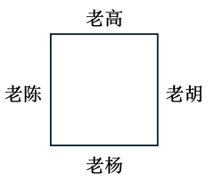

根据条件（4）和上图可知，老杨的右手边是老胡，所以老杨穿蓝色上衣；根据条件（5）和上图可知，老高坐在老杨对面，所以老高穿黄色上衣。老陈和老胡谁穿粉色谁穿红色根据题干条件无法推出，如下图所示：

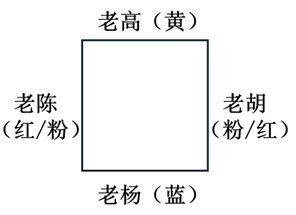

由条件（1）和上图可知，A项正确。

故正确答案为A。

---
