# 2025年国家公务员录用考试《行测》题（副省级网友回忆版）

> 判断推理 · 35 题 · 国考 2025

## 第 1 题　qid 19283910 · 图形推理

从所给的四个选项中，选择最合适的一个填入问号处，使之呈现一定的规律性：

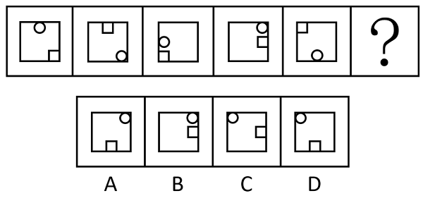

- **A**. A
- **B**. B
- **C**. C
- **D**. D　✅

**答案**：D

**官方解析**

元素组成相同，优先考虑位置规律。如下图所示，在正方形外框上标记8个位置，观察发现，圆形每次顺时针移动3步，方块每次逆时针移动3步，只有D项符合。

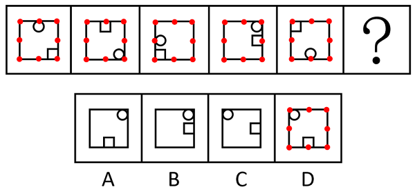

故正确答案为D。

---

## 第 2 题　qid 19283815 · 图形推理

从所给的四个选项中，选择最合适的一项填入问号处，使之呈现一定的规律性：

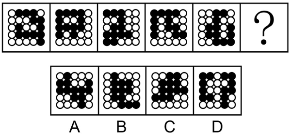

- **A**. A
- **B**. B　✅
- **C**. C
- **D**. D

**答案**：B

**官方解析**

解法一：
元素组成相同，但无位置规律和属性规律，考虑数量规律。观察发现，题干图形中黑球和白球分堆明显，考虑部分数，题干图形中黑球部分数均为1，白球部分数均为2，？处图形也应遵循此规律，只有B项符合。
解法二：
元素组成相同，但无位置规律和属性规律，考虑数量规律。观察发现，题干图形中黑球和白球分堆明显，考虑部分数，题干图形中白球部分数均为2，且两部分的白球数量分别为12、1，11、2，10、3，9、4，8、5，一部分数量递减，另一部分数量递增，？处图形白球两部分数量应为7和6，只有B项符合。
故正确答案为B。

---

## 第 3 题　qid 19283957 · 图形推理

从所给的四个选项中，选择最合适的一个填入问号处，使之呈现一定的规律性：

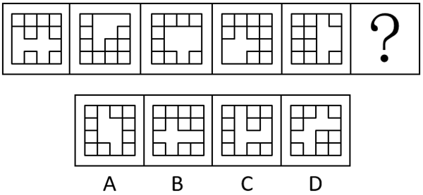

- **A**. A
- **B**. B
- **C**. C
- **D**. D　✅

**答案**：D

**官方解析**

元素组成不同，优先考虑属性规律。观察发现，题干图形均出现规整的空白区域，考虑空白区域的对称性。题干图形空白区域对称轴方向依次顺时针旋转，故问号处应选择空白区域对称轴方向由左上到右下倾斜的，只有D项符合。

故正确答案为D。

---

## 第 4 题　qid 19283837 · 图形推理

从所给的四个选项中，选择最合适的一个填入问号处，使之呈现一定的规律性：

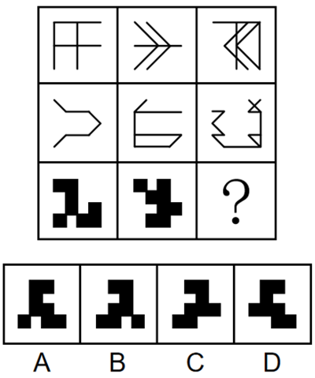

- **A**. A　✅
- **B**. B
- **C**. C
- **D**. D

**答案**：A

**官方解析**

元素组成相似，优先考虑样式规律。九宫格优先看横行。观察发现，第一行图形中，图一和图二先求异，再将求异后的图形左右翻转，得到图三；经验证，第二行符合此规律；第三行应用此规律，图一和图二先求异，再将求异后的图形左右翻转，只有A项符合。
故正确答案为A。

---

## 第 5 题　qid 19283916 · 图形推理

左边为15个白色和3个灰色正方体组合而成多面体的正、反两面直观图，其可以由①、②和③三个多面体组合而成，问哪一项能填入问号处？

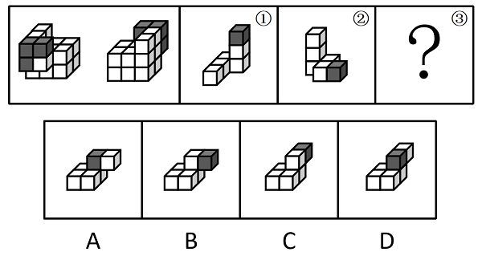

- **A**. A
- **B**. B　✅
- **C**. C
- **D**. D

**答案**：B

**官方解析**

本题考查立体拼合。题干立体图形可以由①、②以及B项旋转后拼合而成，如下图所示：

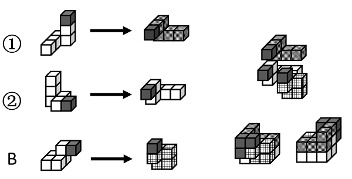

故正确答案为B。

---

## 第 6 题　qid 19283952 · 图形推理

下图为4个黑色、8个白色正方体粘接成的长方体，问哪一项可能是其正确的外表面展开图?

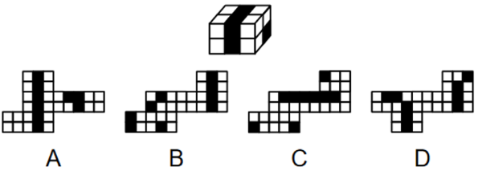

- **A**. A
- **B**. B
- **C**. C
- **D**. D　✅

**答案**：D

**官方解析**

本题为空间重构题，可以通过公共边进行判断，由构成直角的两条边为公共边可知，公共边两侧对应的黑白块颜色应相同，逐一进行分析。

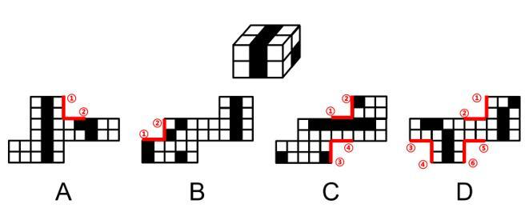

A项：公共边①和②两侧黑白块颜色不同，选项与题干不一致，排除；

B项：公共边①和②两侧黑白块颜色不同，选项与题干不一致，排除；

C项：公共边①和②、③和④两侧黑白块颜色不同，选项与题干不一致，排除；

D项：公共边①和②、③和④、⑤和⑥两侧黑白块颜色均相同，选项与题干一致，当选。

故正确答案为D。 

---

## 第 7 题　qid 19283965 · 图形推理

左边为给定的多面体，现用经P、Q、R三个顶点的平面对其进行切割，问哪个选项是其切面？

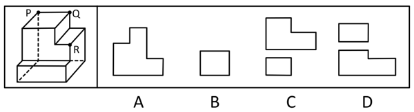

- **A**. A
- **B**. B　✅
- **C**. C
- **D**. D

**答案**：B

**官方解析**

本题考查截面图。根据平面公理“过不在一条直线上的三点，有且只有一个平面”可以得出，经过P、Q、R三点可以确定唯一的平面，即切面为B项，如下图所示：

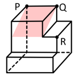

故正确答案为B。

---

## 第 8 题　qid 19283883 · 图形推理

把下面的六个图形分为两类，使每一类图形都有各自的共同特征或规律，分类正确的一项是：

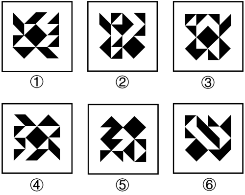

- **A**. ①②④，③⑤⑥
- **B**. ①③⑤，②④⑥
- **C**. ①③④，②⑤⑥　✅
- **D**. ①③⑥，②④⑤

**答案**：C

**官方解析**

本题为分组分类题目。元素组成相同，但整体看没有明显的位置规律。观察发现，每幅图中均有一个正方形，且图①③④中的正方形在图形的中心位置，图②⑤⑥中的正方形在图形的四周位置。故图①③④为一组，图②⑤⑥为一组。
故正确答案为C。

---

## 第 9 题　qid 19283870 · 图形推理

把下面的六个图形分为两类，使每一类图形都有各自的共同特征或规律，分类正确的一项是：

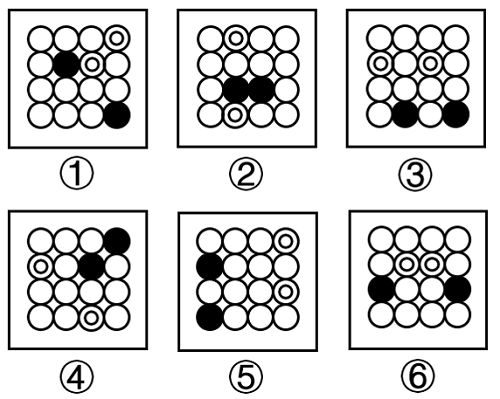

- **A**. ①②③，④⑤⑥
- **B**. ①⑤⑥，②③④
- **C**. ①②④，③⑤⑥　✅
- **D**. ①③⑤，②④⑥

**答案**：C

**官方解析**

本题为分组分类题目。观察发现，题干图形均出现黑球与白球，且每幅图均有两个黑球和两个套圈白球，虽然元素组成相同，但黑球与套圈白球的位置无规律，考虑两点确定一条直线，将两个黑球连线，两个套圈白球连线，观察连线的规律。观察发现，图①②④中，黑球连线与套圈白球连线互相垂直，图③⑤⑥中，黑球连线与套圈白球连线互相平行，即图①②④为一组，图③⑤⑥为一组。
故正确答案为C。

---

## 第 10 题　qid 19283956 · 图形推理

把下面的六个图形分为两类，使每一类图形都有各自的共同特征或规律，分类正确的一项是：

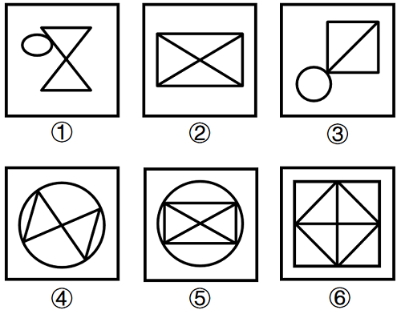

- **A**. ①②④，③⑤⑥
- **B**. ①③④，②⑤⑥　✅
- **C**. ①②⑤，③④⑥
- **D**. ①④⑤，②③⑥

**答案**：B

**官方解析**

本题为分组分类题目。元素组成不同，且无明显属性规律，考虑数量规律。观察发现，图②为“田”字的变形图，图③有“日”字的变形图，考虑笔画数。图①③④为一笔画图形，图②⑤⑥为两笔画图形，即图①③④为一组，图②⑤⑥为一组。
故正确答案为B。

---

## 第 11 题　qid 19283846 · 定义判断

后视错觉是个体的一种认知偏差，是指在一件事情已经发生之后，即使个体之前没有对此做过预判，也认为自己“早就知道会这样”。
根据上述定义，下列符合后视错觉的是：

- **A**. 小瑾是一个悲观的人，她申请升职失败后，灰心丧气地说：“我早就知道，我什么都不如别人，什么也做不好。”
- **B**. 朋友邀阿欣去爬山，阿欣说高温预警不宜爬山，朋友坚持去，才到半山腰就汗流浃背，阿欣说：“我早就说会很热啊。”
- **C**. 晓琳参加一个重要会议迟到了。她懊悔地说：“我早该想到周一早上会堵车，不该按周末的情况预估通勤时间。”
- **D**. 晓菲在股票大跌之后，懊恼地说：“我早就觉察到那些信号了，觉得走势不太好，怎么就没有早卖出啊。”　✅

**答案**：D

**官方解析**

第一步：找出定义关键词。
“在一件事情已经发生之后”、“个体之前没有对此做过预判”、“认为自己‘早就知道会这样’”。
第二步：逐一分析选项。
A项：小瑾是一个“悲观”的人，说明她对自己升职的申请不抱有希望，认为自己会失败，在事情发生之前就预判了失败的结果，不符合“个体之前没有对此做过预判”，不符合定义，排除；
B项：阿欣在爬山前说高温预警不宜爬山，是朋友坚持爬山，说明在事情发生之前阿欣已经对“爬山会很热”做出了预判，不符合“个体之前没有对此做过预判”，不符合定义，排除；
C项：晓琳参加一个重要会议迟到了，符合“在一件事情已经发生之后”，她懊悔地说“我早该想到周一早上会堵车，不该按周末的情况预估通勤时间”，说明她在对“自己没有想到周一早上会堵车”这件事懊悔，不符合“认为自己‘早就知道会这样’”，不符合定义，排除；
D项：晓菲在股票大跌之后，符合“在一件事情已经发生之后”，懊恼地说“我早就觉察到那些信号了，觉得走势不太好”，说明晓菲认为自己早就觉察到股票会下跌，符合“认为自己‘早就知道会这样’”，符合定义，当选。
故正确答案为D。

---

## 第 12 题　qid 19283915 · 定义判断

回应型预算要求政府基于与人民的民主协商作出预算决策，相关责任部门应当及时反应并积极回复人民的质疑和诉求。
根据上述定义，下列属于回应型预算的是：

- **A**. 甲国突发大规模严重旱情，财政部门从中央及各级政府应急预算中，通过多种财政政策安排，保障应急救援经费
- **B**. 乙省是地质灾害高发地区，年初该省编制《乙省地质灾害应急中心XX年度部门预算公开说明》并在官网上发布
- **C**. 丙市在年初将上一年度的地方预算执行情况在官网进行公布，诚邀广大市民和社会公众踊跃监督并提出意见
- **D**. 丁区实行预算听证制度，对与公共服务和社会民生相关的重大支出项目开展听证，并就意见和建议进行书面答复　✅

**答案**：D

**官方解析**

第一步：找出定义关键词。
“政府基于与人民的民主协商作出预算决策”、“相关责任部门及时反应并积极回复人民的质疑和诉求”。
第二步：逐一分析选项。
A项：甲国财政部门从应急预算中安排保障应急救援经费，只是在应对旱情时进行经费安排，未体现出基于与人民的民主协商作出预算决策，也没有涉及回复人民的质疑和诉求，不符合“政府基于与人民的民主协商作出预算决策”、“相关责任部门及时反应并积极回复人民的质疑和诉求”，不符合定义，排除；
B项：乙省编制并发布预算公开说明，只是将预算情况公开，没有体现出基于与人民的民主协商作出预算决策以及回复人民的质疑和诉求，不符合“政府基于与人民的民主协商作出预算决策”、“相关责任部门及时反应并积极回复人民的质疑和诉求”，不符合定义，排除；
C项：丙市是将上一年度的地方预算执行情况公布并邀请监督、提出意见，但这是对上一年度已执行情况的公开，并非作出预算决策的过程，不符合“政府基于与人民的民主协商作出预算决策”，不符合定义，排除；
D项：丁区实行预算听证制度，开展听证意味着是与人民进行民主协商的过程，符合“政府基于与人民的民主协商作出预算决策”，对相关重大支出项目听取意见，并且就意见和建议进行书面答复，体现了相关责任部门及时反应并积极回复人民的质疑和诉求，符合“相关责任部门及时反应并积极回复人民的质疑和诉求”，符合定义，当选。
故正确答案为D。

---

## 第 13 题　qid 19283832 · 定义判断

选择或然率理论解释的是影响受众对大众传播内容选择的决定性因素。该理论的核心公式是：选择或然率=报偿的保证/费力的程度。其中，报偿的保证指的是传播内容满足选择者需要的程度，即内容对于受众的吸引力和实用性；费力的程度指的是获取传播内容和使用传播途径的难度。
根据上述定义，下列属于提高选择或然率的传播行为的是：

- **A**. 视频号平台借助数据分析和个性化算法，给用户推荐符合其偏好的视频　✅
- **B**. 时下流行的某影视作品在播放之前被插入一段2分钟的广告
- **C**. 某商家优化了商品布局，将畅销商品放在出口处，顾客可直接扫码支付
- **D**. 电视内置视频播放软件，开机后须先注册登录，才可搜索相关内容观看

**答案**：A

**官方解析**

第一步：找出定义关键词。
选择或然率理论：“影响受众对大众传播内容选择的决定性因素”、“该理论的核心公式是：选择或然率=报偿的保证/费力的程度”；
报偿的保证：“传播内容满足选择者需要的程度”、“内容对于受众的吸引力和实用性”；
费力的程度：“获取传播内容和使用传播途径的难度”。
第二步：逐一分析选项。
A项：平台推荐用户偏好的视频，说明传播内容贴近用户需求，对用户具有吸引力，提高了“传播内容满足选择者需要的程度”和“内容对于受众的吸引力和实用性”，即“报偿的保证”提高了，平台推荐说明用户获取传播途径的难度小，降低了“获取传播内容和使用传播途径的难度”，即“费力的程度”降低了，而“选择或然率=报偿的保证/费力的程度”，因此属于提高选择或然率的传播行为，符合定义，当选；
B项：影视作品在播放之前被插入一段2分钟的广告，增加了用户观看影视作品的难度，提高了“获取传播内容和使用传播途径的难度”，即“费力的程度”提高了，而“选择或然率=报偿的保证/费力的程度”，因此属于降低选择或然率的传播行为，不符合定义，排除；
C项：某商家将畅销商品放在出口处，不涉及传播内容，不符合“影响受众对大众传播内容选择的决定性因素”，不符合定义，排除；
D项：电视内置视频播放软件，开机后须先注册登录，才可搜索相关内容观看，增加了用户看视频的难度，提高了“获取传播内容和使用传播途径的难度”，即“费力的程度”提高了，而“选择或然率=报偿的保证/费力的程度”，因此属于降低选择或然率的传播行为，不符合定义，排除。
故正确答案为A。

---

## 第 14 题　qid 19283817 · 定义判断

三维反求是测量技术、数据处理技术、图形处理技术和加工技术相结合的综合性技术，是指用一定的测量方法对实物进行测量，根据测量数据通过三维几何建模方法重构实物的数字化模型的过程。
根据上述定义，下列关于三维反求工程的步骤，排序正确的是：
①通过制造样品来验证模型是否满足精度和其他性能指标
②通过一定的算法，从测量数据中提取零件的设计与加工特征
③使用高精度的三维测量技术获取零件表面各点的空间坐标
④使用计算机辅助设计软件将数据与特征重构为三维模型

- **A**. ①③④②
- **B**. ①④③②
- **C**. ③①②④
- **D**. ③②④①　✅

**答案**：D

**官方解析**

第一步：找出定义关键词。
“用一定的测量方法对实物进行测量”、“根据测量数据通过三维几何建模方法重构实物的数字化模型”。
第二步：逐一对照选项并判断正确答案。
根据定义可知，三维反求工程的步骤应先“对实物进行测量”，再“根据测量数据通过三维几何建模方法重构实物的数字化模型”，故步骤③应位于首句，排除A、B两项。继续分析步骤①和步骤④可知，应先“重构三维模型”再“验证模型”，故步骤④应在步骤①之前，排除C项。
故正确答案为D。

---

## 第 15 题　qid 19283917 · 定义判断

形象史学是指把形与象作为主要材料，用以研究历史的一门学问。具体来说，是指把传世的包括出土（水）的具有研究价值的石刻、陶塑、壁画、雕砖、铜玉、织绣、漆器、木器、绘画等历史实物、文本图像以及文化史迹作为主要研究对象，并结合传统文献来综合考察历史的一种新的史学研究模式。
根据上述定义，下列属于形象史学研究范畴的是：

- **A**. 结合《晋书》等史书，通过对吉林集安长川1号墓礼佛图主佛形象及莲花纹的考察，研究三燕文化对高句丽佛教产生的影响　✅
- **B**. 通过对现存的汉画像石（汉代人雕刻在墓室、祠堂四壁的装饰石刻壁画）的实地考察，分析汉画像石的雕刻风格和雕刻技法
- **C**. 根据史诗《伊利亚特》的记载，找到特洛伊城的遗址，并在其中发掘出王冠、银瓶、短剑等大量器物
- **D**. 通过对二十世纪二三十年代齐白石、傅抱石等人具有代表性的国画作品进行研究，分析当时国画中所蕴含的思想意境

**答案**：A

**官方解析**

第一步：找出定义关键词。
“把传世的包括出土（水）的具有研究价值的石刻、陶塑、壁画、雕砖、铜玉、织绣、漆器、木器、绘画等历史实物、文本图像以及文化史迹作为主要研究对象”、“结合传统文献”、“综合考察历史”。
第二步：逐一分析选项。
A项：结合《晋书》等史书，符合“结合传统文献”，对吉林集安长川1号墓礼佛图主佛形象及莲花纹的考察，符合“把传世的包括出土（水）的具有研究价值的石刻、陶塑、壁画、雕砖、铜玉、织绣、漆器、木器、绘画等历史实物、文本图像以及文化史迹作为主要研究对象”，研究三燕文化对高句丽佛教产生的影响，符合“综合考察历史”，符合定义，当选；
B项：只有对现存的汉画像石的实地考察，没有结合文献资料，不符合“结合传统文献”，分析汉画像石的雕刻风格和雕刻技法，不符合“综合考察历史”，不符合定义，排除；
C项：根据史诗《伊利亚特》的记载，找到特洛伊城的遗址，目的是发掘出王冠、银瓶、短剑等大量器物，而不是结合出土的器物考察历史，不符合“把传世的包括出土（水）的具有研究价值的石刻、陶塑、壁画、雕砖、铜玉、织绣、漆器、木器、绘画等历史实物、文本图像以及文化史迹作为主要研究对象”、“综合考察历史”，不符合定义，排除；
D项：只是对齐白石、傅抱石等人的国画作品进行研究，没有结合文献资料，不符合“结合传统文献”，分析当时国画中所蕴含的思想意境，不符合“综合考察历史”，不符合定义，排除。
故正确答案为A。

---

## 第 16 题　qid 19283926 · 定义判断

深度优先搜索是指从初始节点出发，按照一定的顺序扩展到下一个节点，然后从下一个节点出发继续扩展到新的节点，不断递归执行这个过程，直到某个节点不能再扩展到下一个节点，此时返回上一个节点重新寻找一个新的节点继续扩展，如此搜索下去，直到找到目标节点，或者搜索完所有节点为止。

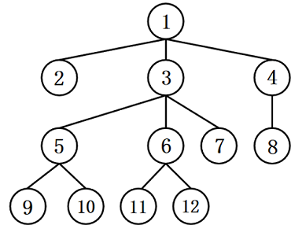

根据上述定义，如果以“1”为初始节点，“12”为目标节点，下列搜索路径符合深度优先搜索的是：

- **A**. 
121361112

- **B**. 
148413612
　✅
- **C**. 
135373612

- **D**. 
135105313612

**答案**：B

**官方解析**

第一步：找出定义关键词。

“从初始节点出发，按照一定的顺序不断扩展到下一个节点，直到不能再扩展”、“此时返回上一个节点重新寻找一个新的节点继续扩展，直到找到目标节点，或者搜索完所有节点为止”。

第二步：逐一分析选项。

A项：121361112，图中显示，扩展到节点11时已无法继续扩展，且未找到目标节点，此时应返回到上一个节点6，而该项直接扩展到同级的节点12，不符合“此时返回上一个节点重新寻找一个新的节点继续扩展，如此搜索下去，直到找到目标节点，或者搜索完所有节点为止”，不符合定义，排除；

B项：148413612，图中显示，从初始节点1出发，扩展到下一个节点4，继续扩展到下一个节点8，此时已无法继续扩展，且未找到目标节点，应返回到上一个节点4，同理继续返回上一个节点1，扩展到下一个节点3，继续扩展到下一个节点6，再扩展到下一个节点12，此时已找到目标节点，搜索完成，符合“从初始节点出发，按照一定的顺序不断扩展到下一个节点，直到不能再扩展”、“此时返回上一个节点重新寻找一个新的节点继续扩展，直到找到目标节点，或者搜索完所有节点为止”，符合定义，当选；

C项：135373612，图中显示，扩展到节点5时直接返回到上一个节点3，而节点5含有节点9和节点10两个下级节点，属于扩展不完整，不符合“从初始节点出发，按照一定的顺序不断扩展到下一个节点，直到不能再扩展”，不符合定义，排除；

D项：135105313612，图中显示，从节点10返回到节点5时又返回到节点3，而节点5还含有节点9这一下级节点，返回到节点5时需要继续扩展到节点9，因此扩展顺序有误，不符合“此时返回上一个节点重新寻找一个新的节点继续扩展，如此搜索下去，直到找到目标节点，或者搜索完所有节点为止”，不符合定义，排除。

故正确答案为B。

---

## 第 17 题　qid 19283981 · 定义判断

元科学也称元理论，是一种以科学为研究对象的学科，它研究科学的性质、特征、形成和发展规律。科学概念是“科学内部”出现的概念，如“质量”“频率”等；而元科学概念是“谈论科学的”，表示科学的陈述或活动特征的概念。
根据上述定义，下列说法正确的是:

- **A**. “黑洞”是科学概念，“量子”是元科学概念
- **B**. “物质波”“科学”都是科学概念
- **C**. “理论”“确证”都是元科学概念　✅
- **D**. “经验”是科学概念，“宇宙”是元科学概念

**答案**：C

**官方解析**

第一步：找出定义关键词。
元科学：“是一种以科学为研究对象的学科”、“它研究科学的性质、特征、形成和发展规律”；
科学概念：“‘科学内部’出现的概念”；
元科学概念：“是‘谈论科学的’，表示科学的陈述或活动特征的概念”。
第二步：逐一分析选项。
A项：“黑洞”“量子”都是“科学内部”出现的概念，符合“科学概念”，排除；
B项：“物质波”是“科学内部”出现的概念，符合“科学概念”；“科学”是元科学的研究对象，不是“科学内部”出现的概念，不符合“科学概念”，排除；
C项：“理论”“确证”都是用来“谈论科学的”，表示科学的陈述或活动特征，符合“元科学概念”，当选；
D项：“经验”不是“科学内部”出现的概念，不符合“科学概念”；“宇宙”是“科学内部”出现的概念，符合“科学概念”，排除。
故正确答案为C。

---

## 第 18 题　qid 19283886 · 定义判断

同一认定是指侦查中具有专门知识的人或了解客体特征的人，通过比较先后出现的客体的特征而对客体是否同一做出的判断。这里所说的客体是指与案件有关联的人或物。
根据上述定义，下列属于同一认定的是：

- **A**. 通过对手机中所存储的信息进行检查，确定其是否为报案人所丢失的手机
- **B**. 通过对犯罪现场提取的DNA信息与DNA信息库进行比对，查找犯罪嫌疑人　✅
- **C**. 通过对走私案中所缴获的走私物品进行多次鉴定，认定其是否为国外某厂家所生产
- **D**. 通过对犯罪嫌疑人车上所收缴的各类物品进行检验，判断其是否属于违禁物品

**答案**：B

**官方解析**

第一步：找出定义关键词。
“侦查中具有专门知识的人或了解客体特征的人”、“通过比较先后出现的客体的特征”、“对客体是否同一做出的判断”。
第二步：逐一分析选项。
A项：通过对手机中所存储的信息进行检查，只是检查手机存储的信息，不符合“通过比较先后出现的客体的特征”，不符合定义，排除；
B项：通过对犯罪现场提取的DNA信息与DNA信息库进行比对，把现场提取的DNA信息与先录入到DNA信息库中的进行比对，符合“通过比较先后出现的客体的特征”，通过DNA比对查找犯罪嫌疑人，即判断现场提取的DNA信息与DNA信息库中储存的信息是否为同一人，符合“对客体是否同一做出的判断”，符合定义，当选；
C项：通过对走私案中所缴获的走私物品进行多次鉴定，判断是否是国外某厂家生产的物品，只能证明这些物品是否产自于国外某厂家，无法证明该物品与其他物品为同一个物品，不符合“对客体是否同一做出的判断”，不符合定义，排除；
D项：通过对犯罪嫌疑人车上所收缴的各类物品进行检验，只是检查收缴的物品，不符合“通过比较先后出现的客体的特征”，不符合定义，排除。
故正确答案为B。

---

## 第 19 题　qid 19283823 · 定义判断

流域内降雨或融冰化雪都可以引起河水显著上涨。春季，气候转暖，流域内的季节性积雪融化、河流解冻或春雨，引起河水上涨称春汛。因正值桃花盛开时节，故亦称桃汛。我国北方，把春季河冰解冻引起的涨水现象专称为凌汛。夏季，流域内的暴雨或高山冰川和积雪融化，使河水急剧上涨，称夏汛。我国习惯上把发生在夏季三伏前后的汛水称为伏汛。秋季由于暴雨，河水发生急剧上涨称秋汛。
根据上述定义，下列判断错误的是：

- **A**. 春汛包含凌汛
- **B**. 夏汛包含伏汛
- **C**. 伏汛在凌汛前　✅
- **D**. 春汛就是桃汛

**答案**：C

**官方解析**

第一步：找出定义关键词。
春汛、桃汛：“春季，流域内的季节性积雪融化、河流解冻或春雨，引起河水上涨”、“因正值桃花盛开时节，故亦称桃汛”；
凌汛：“春季河冰解冻引起的涨水现象”；
夏汛：“夏季，流域内的暴雨或高山冰川和积雪融化，使河水急剧上涨”；
伏汛：“发生在夏季三伏前后的汛水”；
秋汛：“秋季由于暴雨，河水发生急剧上涨”。
第二步：逐一分析选项。
A项：凌汛是春季河冰解冻引起的涨水现象，说明是在春季因河流解冻引起的河水上涨，属于春汛的一种，所以春汛包含凌汛，判断正确，排除；
B项：伏汛是发生在夏季三伏前后的汛水，说明是在夏季发生的河水上涨，属于夏汛的一种，所以夏汛包含伏汛，判断正确，排除；
C项：伏汛是发生在夏季三伏前后的汛水，凌汛是春季河冰解冻引起的涨水现象，夏季在春季后，所以伏汛在凌汛后，判断错误，当选；
D项：春汛的发生因正值桃花盛开时节，故亦称桃汛，所以春汛就是桃汛，判断正确，排除。
本题为选非题，故正确答案为C。

---

## 第 20 题　qid 19283978 · 定义判断

具有包含与被包含关系的三个概念，如植物、乔木、水杉等，可至少形成三个正确的命题：所有的水杉都是乔木，所有的乔木都是植物，所有的水杉都是植物，由“所有的乔木都是植物”“所有的水杉都是植物”而得出“所有的水杉都是乔木”，这样的推理被称为排序推理。
根据上述定义，下列属于排序推理的是：

- **A**. 所有的平行四边形都是四边形，所有的菱形都是四边形，所以，所有的菱形都是平行四边形　✅
- **B**. 所有的昆虫都是动物，所有的蝴蝶都是昆虫，所以，所有的蝴蝶都是动物
- **C**. 所有的文字都是符号，所有的文字都是图形，所以，所有的符号都是图形
- **D**. 这个花园的花都是迎春花，迎春花都在冬、春季开放，所以，这个花园的花都在冬、春季开放

**答案**：A

**官方解析**

第一步：找出定义关键词。
“具有包含与被包含关系的三个概念”。
题干“排序推理”的例子可以理解为：由“所有的乔木（a）都是植物（b），所有的水杉（c）都是植物（b）”而得出“所有的水杉（c）都是乔木（a）”，即逻辑结构为：“所有a都是b，所有c都是b，所以，所有c都是a”。
第二步：逐一分析选项。
A项：菱形、平行四边形、四边形符合“具有包含与被包含关系的三个概念”，选项可以理解为：“所有的平行四边形（a）都是四边形（b），所有的菱形（c）都是四边形（b），所以，所有的菱形（c）都是平行四边形（a）”，即逻辑结构为：“所有a都是b，所有c都是b，所以，所有c都是a”，符合定义，当选；
B项：蝴蝶、昆虫、动物符合“具有包含与被包含关系的三个概念”，选项可以理解为：“所有的昆虫（a）都是动物（b），所有的蝴蝶（c）都是昆虫（a），所以，所有的蝴蝶（c）都是动物（b）”，即逻辑结构为：“所有a都是b，所有c都是a，所以，所有c都是b”，不符合定义，排除；
C项：文字、符号、图形不符合“具有包含与被包含关系的三个概念”，不符合定义，排除；
D项：这个花园的花、迎春花、冬春季开放的花不符合“具有包含与被包含关系的三个概念”，不符合定义，排除。
故正确答案为A。

---

## 第 21 题　qid 19283774 · 类比推理

逐客令：挡箭牌

- **A**. 急先锋：领航者
- **B**. 避风港：马后炮
- **C**. 敲门砖：绊脚石　✅
- **D**. 鸿门宴：攻心计

**答案**：C

**官方解析**

第一步：判断题干词语间逻辑关系。
“逐客令”本为驱逐客卿的命令，后用于指主人对客人不欢迎时，用明说或暗示的方式，催客人离去。“挡箭牌”指古代防御武器中可以抵挡刀箭的盾牌，比喻推掉事情的借口或可以掩护的东西。“逐客令”与“挡箭牌”均根据功能进行命名。
第二步：判断选项词语间逻辑关系。
A项：“急先锋”比喻冲锋在前或积极领头的人。“领航者”通常指的是在特定领域或活动中，为其他人或组织提供指导和方向的人。其中“急先锋”不是根据功能进行命名，与题干逻辑关系不一致，排除；
B项：“避风港”意思是供船只躲避大风浪的港湾，比喻供躲避激烈斗争的地方。“马后炮”是象棋术语，比喻事后才采取措施，但已无济于事。其中“马后炮”不是根据功能进行命名，与题干逻辑关系不一致，排除；
C项：“敲门砖”是指敲门的砖石，比喻借以谋取名利的工具，目的一旦达到就被抛弃。“绊脚石”是指行走时使脚受阻而跌倒的石块，喻指前进道路上的障碍物。“敲门砖”与“绊脚石”均根据功能进行命名，与题干逻辑关系一致，当选；
D项：“鸿门宴”意指不怀好意、居心不良的邀宴，比喻想要加害客人的宴会。“攻心计”指的是从心理上、精神上分析对方，从而瓦解对方，达到目的的一种心理战术。其中“鸿门宴”不是根据功能进行命名，与题干逻辑关系不一致，排除。
故正确答案为C。

---

## 第 22 题　qid 19283727 · 类比推理

嘤其鸣矣：求其友声

- **A**. 遏其生气：以求重价　✅
- **B**. 求之其本：经旬必得
- **C**. 道不拾遗：夜不闭户
- **D**. 避其锐气：击其惰归

**答案**：A

**官方解析**

第一步：判断题干词语间逻辑关系。
“嘤其鸣矣，求其友声”指小鸟那嘤嘤的叫声，是为了寻求知音，二者为方式目的的对应关系。
第二步：判断选项词语间逻辑关系。
A项：“遏其生气，以求重价”指阻抑它（梅花）的生机，这样做是为了谋求高价，二者为方式目的的对应关系，与题干逻辑关系一致，当选；
B项：“求之其本，经旬必得”指做事情如果从根本做起，经过一段时间必定能够收效，二者为条件对应关系，与题干逻辑关系不一致，排除；
C项：“道不拾遗，夜不闭户”指东西丢在路上没有人拾走，夜里睡觉都不需要关门防盗，二者为并列关系，与题干逻辑关系不一致，排除；
D项：“避其锐气，击其惰归”指先避开敌人初来时的气势，等敌人疲惫时再狠狠打击，二者为时间先后顺序的对应关系，与题干逻辑关系不一致，排除。
故正确答案为A。

---

## 第 23 题　qid 19283777 · 类比推理

直观性：即时性：网络直播

- **A**. 等边性：对称性：等腰梯形
- **B**. 公开性：权威性：行政法律　✅
- **C**. 周期性：延展性：机械钟摆
- **D**. 挥发性：保温性：石棉纤维

**答案**：B

**官方解析**

第一步：判断题干词语间逻辑关系。
网络直播具有直观性和即时性，前两词与第三词构成属性对应关系。
第二步：判断选项词语间逻辑关系。
A项：等边性是指图形中各边的长度都相等，等腰梯形只有一组对边相等，不具有等边性，与题干逻辑关系不一致，排除；
B项：行政法律具有公开性和权威性，前两词与第三词构成属性对应关系，与题干逻辑关系一致，当选；
C项：延展性是表示材料在受力而产生破裂之前，其塑性变形的能力，机械钟摆作为一个整体装置，不具有延展性，与题干逻辑关系不一致，排除；
D项：挥发性是指液态物质在低于沸点的温度条件下转变成气态的能力，以及一些气体溶质从溶液中逸出的能力，石棉纤维是天然纤维状的硅质矿物的泛称，不具有挥发性，与题干逻辑关系不一致，排除。
故正确答案为B。

---

## 第 24 题　qid 19283775 · 类比推理

光伏电站：电池板：发电

- **A**. 跨海大桥：桥墩支架：交通　✅
- **B**. 射电望远镜：电磁波：信号
- **C**. 海底气田：油气管道：钻井
- **D**. 游乐设施：球幕电影：娱乐

**答案**：A

**官方解析**

第一步：判断题干词语间逻辑关系。
电池板是光伏电站的组成部分，前两词为组成关系，光伏电站具有发电的功能，第一个词和第三个词为功能对应关系。
第二步：判断选项词语间逻辑关系。
A项：桥墩支架是跨海大桥的组成部分，前两词为组成关系，跨海大桥具有交通功能，第一个词和第三个词为功能对应关系，与题干逻辑关系一致，当选；
B项：射电望远镜的工作原理是接收来自宇宙空间的电磁波，二者不是组成关系，与题干逻辑关系不一致，排除；
C项：油气管道是海底气田开发生产系统的组成部分，但钻井是开发海底气田的一项工程，二者不是功能对应关系，与题干逻辑关系不一致，排除；
D项：球幕电影是一种电影形式，游乐设施是指用于经营目的，承载游客游乐的载体，二者不是组成关系，与题干逻辑关系不一致，排除。
故正确答案为A。

---

## 第 25 题　qid 19283778 · 类比推理

稀树草原 对于 （    ） 相当于 （    ） 对于 国际公约

- **A**. 物种多样性；缔约国家
- **B**. 落叶阔叶林；多边条约
- **C**. 气候变迁；政治协调
- **D**. 植被类型；联合国宪章　✅

**答案**：D

**官方解析**

逐一代入选项。
A项：稀树草原是炎热、季节性干旱气候条件下长成的植被类型，稀树草原物种丰富，具有物种多样性，二者为属性对应关系；缔约国家是条约制定国以及自愿加入或者遵守并同意签约的其他主权国家，只有签订国际公约才是缔约国家，二者为条件对应关系，前后逻辑关系不一致，排除；
B项：稀树草原是炎热、季节性干旱气候条件下长成的植被类型，落叶阔叶林也是一种植被类型，二者为并列关系；国际公约是国家之间签署的公约，多边条约是指外交条约，国际公约是外交条约，二者为种属关系，前后逻辑关系不一致，排除；
C项：气候变迁可能会导致形成稀树草原，二者为因果对应关系；国际公约有政治协调的功能，二者为功能对应关系，前后逻辑关系不一致，排除；
D项：稀树草原是炎热、季节性干旱气候条件下长成的植被类型，二者为种属关系；联合国宪章是联合国的基本大法，是国际公约，二者为种属关系，前后逻辑关系一致，当选。
故正确答案为D。

---

## 第 26 题　qid 19283905 · 逻辑判断

某企业对于如何进行产教融合，形成如下两种方案：一是“做深”，企业自建培训中心，成立专职和兼职的企业培训师队伍，并根据企业需求，制定专门的培训大纲和计划，该中心与毕业生未来形成签约。二是“做浅”，在学校设立“冠名班”和“订单班”，以学校教育为主，企业与学生当前没有签约意向，但随时保持互相选择的权利。
以下理由中，能够支持企业选择第二方案的是：

- **A**. 企业必须付出人力成本，人力资源自带“稀缺”和“增值”属性，在企业面临竞争压力时尤其要重视
- **B**. 企业订单量并不是稳定的，遇到订单量突然增加需要扩产的时候，才临时需要大量的人参与进来　✅
- **C**. 该企业生产使用的是特种专业设备，竞争对手稀少，不具备从市场上挖掘技术人员的条件
- **D**. 学校教育内容具有普适性，而自建培训中心有利于企业保障准员工的培养质量，提前锁定毕业生

**答案**：B

**官方解析**

第一步：找出论点和论据。
论点：企业选择产教融合的第二种方案：“做浅”，在学校设立“冠名班”和“订单班”，以学校教育为主，企业与学生当前没有签约意向，但随时保持互相选择的权利。
论据：无。
本题的论点说的是企业与学校合作，培养企业需要的人，随时需求随时签约。本题只有论点，没有论据，加强考虑补充论据。
第二步：逐一分析选项。
A项：企业付出人力成本，与论点讨论的企业和学校合作无关，话题不一致，无法加强，排除；
B项：企业订单不稳定，订单突然增加时才需要大量人员，那么可以和学校签约“订单班”，随时和学生互相选择，能支持选择第二方案，补充论据，可以加强，当选；
C项：企业生产使用特种专业设备，不具有从市场挖人的条件，与论点讨论的企业和学校合作无关，话题不一致，无法加强，排除；
D项：自建培训中心比学校教育更有利，支持第一方案，反而削弱第二方案，无法加强，排除。
故正确答案为B。

---

## 第 27 题　qid 19283919 · 逻辑判断

海山是海面下的岛屿，与岛屿中的火山岛有相同的起源和相似的形态，以往的海山生物调查发现，海山岩石上的生物群落与海山周边的软底沉积和深海平原上的生物群落大不相同。而且，一些海山之间的生物群落在物种构成上较少重叠。因此，有一些学者认为，相对孤立的海山存在独特的生物群落且拥有高度特有的动物群。
以下哪项如果为真，最能反驳上述学者的观点？

- **A**. 远离大陆的孤岛，因为海洋的分割往往会形成相对孤立且独特的岛屿生物群
- **B**. 物理隔离海洋的现象在海洋中很少出现，所以海山不可能长期被隔离成水下孤岛
- **C**. 早期一些海山中发现的高度特有物种其实是采样不足造成的，很多海山都有相同的生物来源　✅
- **D**. 地形和海流的相互作用在某些海山顶部形成封闭环流，使栖息其上的生物幼体难以扩散

**答案**：C

**官方解析**

第一步：找出论点和论据。
论点：相对孤立的海山存在独特的生物群落且拥有高度特有的动物群。
论据：以往的海山生物调查发现，海山岩石上的生物群落与海山周边的软底沉积和深海平原上的生物群落大不相同。而且，一些海山之间的生物群落在物种构成上较少重叠。
本题论点和论据说的都是海山的生物群落比较独特，话题一致，削弱可以考虑削弱论点或削弱论据。
第二步：逐一分析选项。
A项：指出远离大陆的孤岛因为海洋的分割往往会形成相对孤立且独特的岛屿生物群，但论点讨论的是海山，海山并不都是远离大陆的孤岛，话题不一致，无法削弱，排除；
B项：指出海山不可能长期被隔离成水下孤岛，但论点讨论的是海山是否存在独特的生物群落且拥有高度特有的动物群，话题不一致，无法削弱，排除；
C项：指出早期一些海山中发现的高度特有物种其实是采样不足造成的，很多海山都有相同的生物来源，说明论据里面的调查并不全面，削弱论据，可以削弱，当选；
D项：指出某些海山顶部形成封闭环流，使栖息其上的生物幼体难以扩散，讨论的是生物幼体难以扩散的原因，但论点讨论的是海山是否存在独特的生物群落且拥有高度特有的动物群，话题不一致，无法削弱，排除。
故正确答案为C。

---

## 第 28 题　qid 19283976 · 逻辑判断

飞行信息记录系统，也就是俗称的黑匣子，在空难事故调查中的重要作用不需赘言，但无论在陆上还是海上的空难事故中，搜寻黑匣子都极其不易。有人建议，可利用现在飞速发展的互联技术，把黑匣子升级成为“云匣子”，那么飞机在空中就能够实时与地面进行信息交互，使空难事故的分析变得更加便捷。
以下哪项如果为真，最能质疑上述建议？

- **A**. 飞机接入互联网，其信号稳定性受到太多外界不可控因素的影响　✅
- **B**. 空难是极小概率事件，投入高昂的数据管理成本不如直接用于提升飞行安全
- **C**. 即使救援人员能够顺利搜寻到黑匣子，想要依靠其揭开事故真相也绝非易事
- **D**. 实时同步每一架飞机的海量数据，对飞行管理并无帮助，更无必要

**答案**：A

**官方解析**

第一步：找出论点和论据。
论点：可利用现在飞速发展的互联技术，把黑匣子升级成为“云匣子”，那么飞机在空中就能够实时与地面进行信息交互，使空难事故的分析变得更加便捷。
论据：无。
本题只有论点，没有论据，削弱优先考虑削弱论点。
第二步：逐一分析选项。
A项：该项指出飞机接入互联网的信号稳定性受到太多外界不可控因素的影响，说明把黑匣子升级成为“云匣子”也无法实现飞机实时与地面进行信息交互，直接否定论点，可以削弱，当选；
B项：该项指出投入高昂的数据管理成本不如直接用于提升飞行安全，但不明确把黑匣子升级成为“云匣子”的成本是否高昂，也不明确把黑匣子升级成为“云匣子”能否使空难事故的分析变得更加便捷，为不明确项，无法削弱，排除；
C项：该项指出即使能顺利搜寻到黑匣子也难以揭开事故真相，讨论的是依靠黑匣子能否揭开事故真相，而论点讨论的是把黑匣子升级成为“云匣子”能否使空难事故的分析变得更加便捷，话题不一致，无法削弱，排除；
D项：该项指出实时同步每一架飞机的海量数据对飞行管理并无帮助，讨论的是同步每一架飞机数据对飞行管理的影响，而论点讨论的是把黑匣子升级成为“云匣子”能否使空难事故的分析变得更加便捷，话题不一致，无法削弱，排除。
故正确答案为A。

---

## 第 29 题　qid 19283852 · 逻辑判断

某项研究显示，与未接触空气污染的人相比，暴露于空气污染中的人死于乳腺癌的风险增加了80%，死于其他各类癌症的风险增加了22%。该研究团队由此认为，这可能与空气污染物中的PM2.5有关，因为PM2.5会导致脏器的炎症和氧化应激反应。
以下哪项如果为真，最可能是上述专家预设的前提？

- **A**. 脏器的炎症和氧化应激反应是明确的致癌危险因素　✅
- **B**. PM2.5在大气成分中含量较少，但对空气质量有重要影响
- **C**. 吸食香烟和电子烟等都可以将PM2.5直接输送到肺部
- **D**. 女性更易接触烹饪油烟，其中含有大量的PM2.5

**答案**：A

**官方解析**

第一步：找出论点和论据。
论点：死于癌症的风险增加可能与空气污染物中的PM2.5有关。
论据：PM2.5会导致脏器的炎症和氧化应激反应。
本题论点讨论的是“PM2.5”和“死于癌症的风险”之间的关系，论据讨论的是“PM2.5”和“脏器的炎症和氧化应激反应”之间的关系，二者话题不一致，加强优先考虑搭桥，即在“脏器的炎症和氧化应激反应”与“死于癌症的风险”之间建立联系。
第二步：逐一分析选项。
A项：该项指出脏器的炎症和氧化应激反应是明确的致癌危险因素，即在“脏器的炎症和氧化应激反应”与“死于癌症的风险”之间建立了联系，为搭桥项，可以加强，当选；
B项：该项指出PM2.5在大气中的情况，而论点讨论的是死于癌症的风险与PM2.5是否有关，话题不一致，无法加强，排除；
C项：该项指出吸烟会将PM2.5直接输送到肺部，但最终死于癌症的风险是否会增加并未明确指出，为不明确项，无法加强，排除；
D项：该项指出女性更容易接触烹饪油烟，其中有PM2.5，但最终死于癌症的风险是否会增加并未明确指出，为不明确项，无法加强，排除。
故正确答案为A。

---

## 第 30 题　qid 19283980 · 类比推理

甲、乙、丙、丁4人按顺时针依次围坐在四方桌前，每人坐一面，4人中只有1人说真话。
甲：坐在东面的人说谎；
乙：坐在南面的人说谎；
丙：我坐在西面或者北面；
丁：我坐在北面。
根据以上陈述，可以得出：

- **A**. 甲坐在北面　✅
- **B**. 甲坐在东面
- **C**. 乙坐在西面
- **D**. 乙坐在南面

**答案**：A

**官方解析**

第一步：分析题干条件。
（1）甲：东面的人说谎；
（2）乙：南面的人说谎；
（3）丙：丙西面 或 丙北面；
（4）丁：丁北面；
（5）4人按顺时针顺序依次围坐，每人坐一面；
（6）4人中只有1人说真话。
第二步：根据题干条件进行推理。
根据条件（6）可知，甲乙不能同时说假话（如果甲乙都说假话，那么坐在东面和南面的人都说真话，与条件（6）矛盾），即甲、乙当中1人说真话，1人说假话，所以可以推出丙、丁都说假话。
丙说假话意味着，丙不坐在西面也不坐在北面，即丙要么坐在东面，要么坐在南面。
假设丙坐在东面，结合条件（5）可知，丁坐在南面，此时坐在东面和南面的人都说假话，即甲、乙都说真话，与条件（6）矛盾，故假设不成立，丙不坐在东面，而坐在南面。此时，甲坐在北面，乙坐在东面，丁坐在西面。
故正确答案为A。

---

## 第 31 题　qid 19283839 · 逻辑判断

随着通货膨胀的蔓延，H国电子企业主要产品的原材料价格大幅上涨。该国最大的电子企业公报显示，今年该企业智能手机应用处理器价格较上年上涨30%，用于智能手机的相机模块价格上涨11%，用于电视和显示器的面板价格上涨9%。H国经济界认为，电子企业原材料价格居高不下，将严重削弱该国电子企业在国际市场上的竞争力。
以下哪项如果为真，最能支持上述结论？

- **A**. 近年来，无论是国际还是国内，硅化合物价格始终呈上涨趋势，这是导致H国电子企业主要产品原材料价格大幅上涨的原因
- **B**. 在H国电子企业主要产品的原材料价格大幅上涨的同时，由于购买力下降等原因，电子产品的全球消费需求在缩减
- **C**. 其他国家电子企业都在通过科技创新降低产品原材料价格上涨的影响，以求通过低价在竞争激烈的国际电子产品市场中脱颖而出　✅
- **D**. 一直以来，H国电子企业生产的产品以其卓越的技术和质量优势在国际市场上极具竞争力，近年来这种竞争优势在逐渐减弱

**答案**：C

**官方解析**

第一步：找出论点和论据。
论点：电子企业原材料价格居高不下，将严重削弱该国电子企业在国际市场上的竞争力。
论据：随着通货膨胀的蔓延，H国电子企业主要产品的原材料价格大幅上涨。该国最大的电子企业公报显示，今年该企业智能手机应用处理器价格较上年上涨30%，用于智能手机的相机模块价格上涨11%，用于电视和显示器的面板价格上涨9%。
本题论点讨论的是H国电子企业原材料价格上涨与国际市场竞争力之间的关系，论据讨论的是H国最大的电子企业原材料价格上涨，故论点和论据的话题一致，加强优先考虑补充论据，即解释H国电子企业原材料价格上涨将削弱其在国际市场上的竞争力的原因或举例证明。
第二步：逐一分析选项。
A项：该项讨论的是电子企业主要产品原材料价格大幅上涨的原因，而论点讨论的是H国电子企业原材料价格上涨与国际市场竞争力之间的关系，话题不一致，无法加强，排除；
B项：该项讨论的是电子产品的全球消费需求在缩减的原因，而论点讨论的是H国电子企业原材料价格上涨与国际市场竞争力之间的关系，话题不一致，无法加强，排除；
C项：该项讨论的是其他国家电子企业通过科技创新降低产品原材料价格上涨的影响，以求通过低价在国际市场中脱颖而出，说明H国的电子企业相较于其他国家的电子企业，可能因原材料价格更高，在国际市场上的竞争中处于劣势，补充论据，可以加强，当选；
D项：该项讨论的是近年来H国电子企业的产品在技术和质量上的竞争优势正在逐渐减弱，但不明确原材料价格上涨是否会进一步削弱其在国际市场上的竞争力，为不明确项，无法加强，排除。
故正确答案为C。

---

## 第 32 题　qid 19283920 · 逻辑判断

我军军语惯于将数字1、2、7、9、0变读为幺、两、拐、勾、洞，这些数字有个共同特点，即其原本的发音部位与发音方法使得在读这些数字时无法发出较大声音，在噪声干扰较为强烈的战场上，通信兵使用通讯设备进行情报交流时，话筒对这些数字的实际增音效果并不明显，可能会影响信息的准确性。因此，在军语中将这些数字变读，是为了符合实际需要。
以下哪项如果为真，不能支持上述结论？

- **A**. 常规数字念法中1、7的韵尾相同，发音相似，在嘈杂的战场环境中容易混淆，造成信息传达错误
- **B**. 士兵一般都来自不同的兵源地，不可避免地带有家乡口音，将数字变读可以避免口音问题
- **C**. 在国际无线电通话中，也会对字母读音进行变读，如将A读成Alpha，将D读成Delta　✅
- **D**. 将0读成“洞”时，更容易提高声音，同时也使声音更加干脆清晰，确保信息的准确性

**答案**：C

**官方解析**

第一步：找出论点和论据。
论点：在军语中将这些数字变读，是为了符合实际需要。
论据：我军军语惯于将数字1、2、7、9、0变读为幺、两、拐、勾、洞，这些数字有个共同特点，即其原本的发音部位与发音方法使得在读这些数字时无法发出较大声音，在噪声干扰较为强烈的战场上，通信兵使用通讯设备进行情报交流时，话筒对这些数字的实际增音效果并不明显，可能会影响信息的准确性。
本题论点说的是军语中将部分数字变读的原因，论据说的是这些数字的原本发音会影响信息的准确性。论点、论据话题一致，且本题为选非题，找到可加强的选项排除即可。
第二步：逐一分析选项。
A项：该项指出常规数字念法中1、7的韵尾相同，发音相似，说明了原发音在战场上可能导致信息传达错误，而变读可以避免错误，是为了符合实际需要，补充论据，可以加强，排除；
B项：该项指出变读可以避免口音问题，减少误解，是为了符合实际需要，补充论据，可以加强，排除；
C项：该项指出“在国际无线电通话中”，也会对“字母”读音进行变读，而论点说的是在“军语”中将“数字”变读，话题不一致，不能加强，当选；
D项：该项指将0读成“洞”时，更容易提高声音，举例说明变读能确保信息的准确性，是为了符合实际需要，补充论据，可以加强，排除。
本题为选非题，故正确答案为C。

---

## 第 33 题　qid 19283979 · 逻辑判断

国内市场只有形成完备的市场体系与商业规则环境，才能为企业参与出口竞争提供真正的市场根基，要形成完备的市场体系，必须深化要素市场化配置体制机制改革，只有促进要素自主有序流动，且提高要素配置效率，才能深化要素市场化配置体制机制改革，要形成完备的商业规则环境，必须推进全方位开放并建立全国统一大市场，且加强执法效率和司法保障。
根据以上陈述，可以推出下列哪项？

- **A**. 只要深化要素市场化配置体制机制改革就能形成完备的市场体系
- **B**. 如果加强执法效率和司法保障，就能推进全方位开放并建立全国统一大市场
- **C**. 只有促进要素自主有序流动，且提高要素配置效率，才能使国内市场形成完备的商业规则环境
- **D**. 除非推进全方位开放并建立全国统一大市场，且加强执法效率和司法保障，否则不能为企业参与出口竞争提供真正的市场根基　✅

**答案**：D

**官方解析**

第一步：翻译题干。

①为企业参与出口竞争提供真正的市场根基形成完备的市场体系与商业规则环境；

②形成完备的市场体系深化要素市场化配置体制机制改革；

③深化要素市场化配置体制机制改革促进要素自主有序流动 且 提高要素配置效率；

④形成完备的商业规则环境推进全方位开放并建立全国统一大市场 且 加强执法效率和司法保障；

将①②③串联可得到⑤：为企业参与出口竞争提供真正的市场根基形成完备的市场体系深化要素市场化配置体制机制改革促进要素自主有序流动 且 提高要素配置效率；

将①④串联可得到⑥：为企业参与出口竞争提供真正的市场根基形成完备的商业规则环境推进全方位开放并建立全国统一大市场 且 加强执法效率和司法保障。

第二步：逐一分析选项。

A项：翻译为：深化要素市场化配置体制机制改革形成完备的市场体系，是对条件②的肯后，肯后无必然结论，无法推出，排除；

B项：翻译为：加强执法效率和司法保障推进全方位开放并建立全国统一大市场，二者之间无推出关系，无法推出，排除；

C项：翻译为：国内市场形成完备的商业规则环境促进要素自主有序流动 且 提高要素配置效率，二者之间无法建立联系，无法推出，排除；

D项：翻译为：为企业参与出口竞争提供真正的市场根基推进全方位开放并建立全国统一大市场 且 加强执法效率和司法保障，是对条件⑥的肯前，根据“肯前必肯后”，可以推出，当选。

故正确答案为D。

---

## 第 34 题　qid 19283974 · 逻辑判断

红霉素是一种抗生素，最早从放线菌糖多孢红霉菌的分泌物中发现，最新研究中，人们发现一种名为文蛤的贝类体内也会分泌红霉素。红霉素主要由微生物合成，此前从未在动物体内发现，研究者据此推测，文蛤合成红霉素的能力应当源于文蛤体内的微生物，正是这些微生物帮助文蛤合成了红霉素。
以下哪项如果为真，最能削弱研究者的推测？

- **A**. 文蛤的基因组中具有红霉素合成基因，该基因表达在文蛤外套膜的粘液细胞中　✅
- **B**. 文蛤贝壳下有一层外套膜，膜的上皮内分布着粘液细胞，它们能存储红霉素
- **C**. 通过对文蛤体内的所有微生物进行检测，并没有发现糖多孢红霉菌
- **D**. 研究者在其他贝类体内也发现了类似红霉素的抗生素

**答案**：A

**官方解析**

第一步：找出论点和论据。
论点：文蛤合成红霉素的能力应当源于文蛤体内的微生物，正是这些微生物帮助文蛤合成了红霉素。
论据：红霉素主要由微生物合成，此前从未在动物体内发现。
本题论点讨论的是文蛤合成红霉素的能力来源于其体内的微生物，论据讨论的是红霉素主要由微生物合成，且此前从未在动物体内发现，二者话题一致，削弱可以考虑削弱论点。
第二步：逐一分析选项。
A项：选项指出文蛤具有红霉素合成基因，即文蛤自身具有合成红霉素的能力，说明其合成红霉素的能力不是来源于体内的微生物，削弱论点，可以削弱，当选；
B项：选项指出文蛤贝壳的外套膜可以“存储”红霉素，而论点讨论的是“合成”红霉素能力的来源，二者话题不一致，无关选项，无法削弱，排除；
C项：选项指出文蛤体内没有发现糖多孢红霉菌，但红霉素只是最早从糖多孢红霉菌的分泌物中发现，并不是只有这种微生物能合成红霉素，因此不明确文蛤合成红霉素的能力是否来源于其它微生物，无法削弱，排除；
D项：选项指出在其他贝类体内发现了类似红霉素的抗生素，但论点讨论的是“文蛤”，二者讨论的主体不一致，无关选项，无法削弱，排除。
故正确答案为A。

---

## 第 35 题　qid 19283975 · 类比推理

甲、乙、丙、丁、戊、己、庚7人报名参加象棋比赛，对于比赛结果，大家预测如下：
（1）戊、己、庚至少有2人获奖；
（2）如果甲、丙、戊至少有1人获奖，则丁、己均不获奖；
（3）如果乙、戊、己至少有1人获奖，则丁获奖而丙不获奖。
比赛结束后，发现上述预测完全正确。
根据上述信息，一定获奖的是：

- **A**. 甲
- **B**. 乙
- **C**. 丙
- **D**. 丁　✅

**答案**：D

**官方解析**

第一步：分析题干条件。

（1）戊、己、庚至少有2人获奖；

（2）甲、丙、戊至少有1人获奖丁获奖 且 己获奖；

（3）乙、戊、己至少有1人获奖丁获奖 且 丙获奖。

第二步：根据题干条件进行推理。

题干中“戊、己”提及次数最多，可优先从此处入手进行推理。

根据条件（1）“戊、己、庚至少有2人获奖”可知，戊、己至少有1人获奖，因此乙、戊、己也至少有1人获奖，这是对条件（3）的肯前，根据“肯前必肯后”可知，丁获奖而丙不获奖，因此一定获奖的是丁，对应D项。

故正确答案为D。

---
