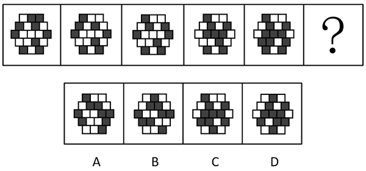
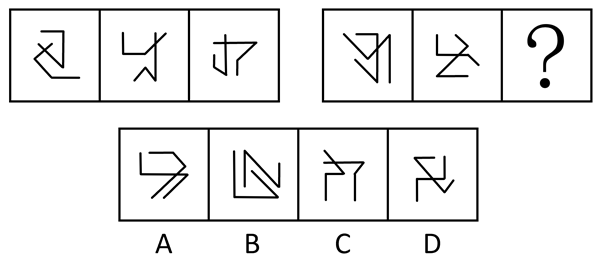
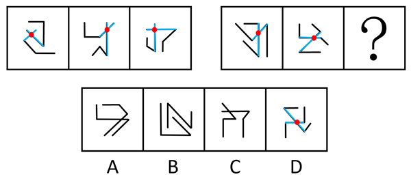
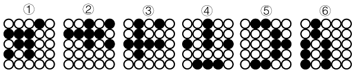
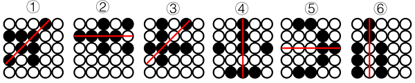
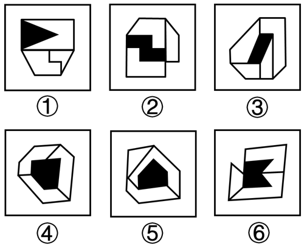

# 2025年国家公务员录用考试《行测》题（地市级网友回忆版）

> 判断推理 · 35 题 · 国考 2025

## 材料 1

某科研机构今年拟举办甲、乙、丙、丁、戊、己、庚、辛8次学术会议，每个季度最多举办3次，且各次会议举办时间不重叠。具体安排要求如下：

（1）丁、辛安排在第二季度；

（2）甲、戊安排在同一个季度；

（3）丁在乙之后丙之前举办；

（4）丙在甲之前己之后举办。

### 第 1 题　qid 19283866 · 类比推理

下列哪2次会议可以安排在第一季度？

- **A**. 甲和戊
- **B**. 丙和丁
- **C**. 丁和己
- **D**. 己和庚　✅

**答案**：D

**官方解析**

第一步：分析题干条件。
（1）丁、辛在第二季度；
（2）甲、戊在同一个季度；
（3）丁在乙之后丙之前举办；
（4）丙在甲之前己之后举办；
（5）甲、乙、丙、丁、戊、己、庚、辛8次学术会议，每个季度最多举办3次。
第二步：根据题干条件进行推理。
根据条件（1）可知，丁在第二季度举办，排除B、C两项；根据条件（3）和（4）可知，甲的前面一定有乙、丁、己、丙4次会议，结合条件（5）“每个季度最多举办3次”可知，甲一定不在第一季度举办，排除A项，只有D项符合。
故正确答案为D。

---

### 第 2 题　qid 19283855 · 类比推理

如果第二季度只安排2次会议，那么以下哪次会议一定安排在第一季度？

- **A**. 甲
- **B**. 乙　✅
- **C**. 庚
- **D**. 丙

**答案**：B

**官方解析**

第一步：分析题干条件。
（1）丁、辛在第二季度；
（2）甲、戊在同一个季度；
（3）丁在乙之后丙之前举办；
（4）丙在甲之前己之后举办；
（5）第二季度只安排2次会议。
第二步：根据题干条件进行推理。
根据条件（1）和（5）可知，第二季度只安排了丁、辛两次会议，结合条件（3）可知，丁在乙之后举办，因此乙会议一定在第一季度举办，对应B项。
故正确答案为B。

---

### 第 3 题　qid 19283868 · 类比推理

如果丙、戊安排在第四季度，下列哪2次会议可以安排在第三季度？

- **A**. 甲和庚
- **B**. 乙和丁
- **C**. 乙和己
- **D**. 己和庚　✅

**答案**：D

**官方解析**

第一步：分析题干条件。
（1）丁、辛在第二季度；
（2）甲、戊同一季度；
（3）丁在乙之后，在丙之前；
（4）丙在甲之前，在己之后；
（5）乙、丙、丁、戊、己、庚、辛8次学术会议，每个季度最多举办3次；
（6）丙、戊在第四季度。
第二步：根据题干条件进行推理。
本题题干信息确定，选项信息充分，优先考虑排除法。
根据条件（1）（3）可知，乙在第二季度或者之前，不可能安排在第三季度，排除B、C两项；
根据条件（2）（6）可知，甲一定在第四季度，排除A项。
经验证，D项满足题干所有条件，当选。
故正确答案为D。

---

### 第 4 题　qid 19283867 · 类比推理

如果每个季度至少安排1次会议，并且最后一个季度仅安排1次会议，下列哪2次会议一定安排在第三季度？

- **A**. 甲和戊　✅
- **B**. 乙和丙
- **C**. 丙和己
- **D**. 己和庚

**答案**：A

**官方解析**

第一步：分析题干条件。
（1）丁、辛在第二季度；
（2）甲、戊在同一个季度；
（3）丁在乙之后丙之前举办；
（4）丙在甲之前己之后举办；
（5）甲、乙、丙、丁、戊、己、庚、辛8次学术会议，每个季度最多举办3次；
（6）每个季度至少安排1次会议；
（7）第四季度仅安排1次会议。
第二步：根据题干条件进行推理。 
根据条件（1）（2）（5）可知，甲和戊不可能安排在第二季度；此时结合条件（7）可知，甲和戊不可能安排在第四季度；再结合条件（4）可知，甲前面已经有己、丙，而每个季度最多举办3次，所以甲和戊在同一季度的情况下，不可能安排在第一季度，因此甲和戊只能安排在第三季度，对应A项。
故正确答案为A。

---

### 第 5 题　qid 19283869 · 类比推理

如果甲安排在第三季度，第四季度不安排会议，庚不可能和哪次会议安排在同一个季度？

- **A**. 乙
- **B**. 丙　✅
- **C**. 己
- **D**. 辛

**答案**：B

**官方解析**

第一步：分析题干条件。

（1）丁、辛在第二季度；

（2）甲、戊同一季度；

（3）丁在乙之后，在丙之前；

（4）丙在甲之前，在己之后；

（5）甲、乙、丙、丁、戊、己、庚、辛8次学术会议，每个季度最多举办3次；

（6）甲在第三季度，第四季度不安排会议。

第二步：根据题干条件进行推理。

根据题干条件（3）和条件（4）可知，丙前有乙、丁和己，情况较少，因此可优先从丙入手进行假设。

假设丙被安排在第一季度，由条件（1）可知，丁、辛在第二季度，此时，丙在第一季度，丁在第二季度，不符合条件（3），因此，丙不能安排在第一季度。

假设丙被安排在第二季度，由条件（1）（2）（6）可知，丁、辛在第二季度，甲、戊在第三季度。结合条件（3）（4）（5）可知，乙和己在丙之前的第一季度，此时第一季度和第三季度均可安排庚，庚可能和乙、己、甲、戊安排在同一个季度。

假设丙被安排在第三季度，由条件（1）（2）（6）可知，丁、辛在第二季度，甲、戊在第三季度。结合条件（3）（4）（5）可知，乙和己在丙之前的第一季度或第二季度（如下图所示）。此时第一季度和第二季度均可安排庚，庚可能和乙、己、丁、辛安排在同一个季度。

或或

综上，庚不可能和丙安排在同一个季度。

本题为选非题，故正确答案为B。

---

### 第 6 题　qid 19283847 · 图形推理

从所给的四个选项中，选择最合适的一个填入问号处，使之呈现一定的规律性：

- **A**. A
- **B**. B
- **C**. C
- **D**. D　✅

**答案**：D

**官方解析**

元素组成不同，且无明显属性规律，考虑数量规律。观察发现，题干图形封闭面较多，优先考虑数面，但整体数面无规律。继续观察发现，题干图形均明显存在最大面，且最大面均为轴对称图形，只有D项符合。
故正确答案为D。

---

### 第 7 题　qid 19283910 · 图形推理

从所给的四个选项中，选择最合适的一个填入问号处，使之呈现一定的规律性：

- **A**. A
- **B**. B
- **C**. C
- **D**. D　✅

**答案**：D

**官方解析**

元素组成相同，优先考虑位置规律。如下图所示，在正方形外框上标记8个位置，观察发现，圆形每次顺时针移动3步，方块每次逆时针移动3步，只有D项符合。

故正确答案为D。

---

### 第 8 题　qid 19283925 · 图形推理

从所给的四个选项中，选择最合适的一个填入问号处，使之呈现一定的规律性：

- **A**. A
- **B**. B
- **C**. C　✅
- **D**. D

**答案**：C

**官方解析**

观察题干图形，整体无规律，通过相邻比较发现，图1和图2只有第一行黑块位置不同（第一行黑白块颜色互换），其他四行黑块位置相同；图2和图3只有第二行黑块位置不同（第二行黑白块颜色互换），其他四行黑块位置相同；图3和图4只有第三行黑块位置不同（第三行黑白块颜色互换），其他四行黑块位置相同；图4和图5只有第四行黑块位置不同（第四行黑白块颜色互换），其他四行黑块位置相同，以此类推，？处应该选择一个和图5只有第五行黑块位置不同（第五行黑白块颜色互换），其他四行黑块位置相同的图形，只有C项符合。
故正确答案为C。

---

### 第 9 题　qid 19283914 · 图形推理

从所给的四个选项中，选择最合适的一个填入问号处，使之呈现一定的规律性：

- **A**. A
- **B**. B
- **C**. C
- **D**. D　✅

**答案**：D

**官方解析**

元素组成不同，且无明显属性规律，考虑数量规律。观察发现，题干第一组图形均是由3条线段组成的两条折线相交在一起，且相交的位置均在折线的一端；第二组图形中的前两幅图形均是由3条线段组成的两条折线相交在一起，且相交的位置均在折线的中间线段处，只有D项符合。

故正确答案为D。

---

### 第 10 题　qid 19283859 · 图形推理

左边为给定的多面体，现用经P、Q、R三点的平面对其进行切割，问哪个选项是其切面？

- **A**. A　✅
- **B**. B
- **C**. C
- **D**. D

**答案**：A

**官方解析**

本题考查截面图。根据平面公理“过不在一条直线上的三点，有且只有一个平面”可以得出，经过P、Q、R三点可以确定的唯一切面（即截面），即为A项，如下图所示：

故正确答案为A。

---

### 第 11 题　qid 19283952 · 图形推理

下图为4个黑色、8个白色正方体粘接成的长方体，问哪一项可能是其正确的外表面展开图?

- **A**. A
- **B**. B
- **C**. C
- **D**. D　✅

**答案**：D

**官方解析**

本题为空间重构题，可以通过公共边进行判断，由构成直角的两条边为公共边可知，公共边两侧对应的黑白块颜色应相同，逐一进行分析。

A项：公共边①和②两侧黑白块颜色不同，选项与题干不一致，排除；

B项：公共边①和②两侧黑白块颜色不同，选项与题干不一致，排除；

C项：公共边①和②、③和④两侧黑白块颜色不同，选项与题干不一致，排除；

D项：公共边①和②、③和④、⑤和⑥两侧黑白块颜色均相同，选项与题干一致，当选。

故正确答案为D。 

---

### 第 12 题　qid 19283916 · 图形推理

左边为15个白色和3个灰色正方体组合而成多面体的正、反两面直观图，其可以由①、②和③三个多面体组合而成，问哪一项能填入问号处？

- **A**. A
- **B**. B　✅
- **C**. C
- **D**. D

**答案**：B

**官方解析**

本题考查立体拼合。题干立体图形可以由①、②以及B项旋转后拼合而成，如下图所示：

故正确答案为B。

---

### 第 13 题　qid 19283951 · 图形推理

把下面的六个图形分为两类，使每一类图形都有各自的共同特征或规律，分类正确的一项是：

- **A**. ①②⑥，③④⑤
- **B**. ①②④，③⑤⑥　✅
- **C**. ①③⑥，②④⑤
- **D**. ①④⑤，②③⑥

**答案**：B

**官方解析**

本题为分组分类题目。元素组成相同，且无明显位置规律，考虑属性规律。观察发现，题干图形均由黑球和白球构成，且黑球分布较为规整，考虑对称性。题干图形的黑球部分均为轴对称图形，且图①②④的对称轴均经过四个黑球，图③⑤⑥的对称轴均经过两个黑球，即图①②④为一组，图③⑤⑥为一组。

故正确答案为B。

---

### 第 14 题　qid 19283909 · 图形推理

把下面的六个图形分为两类，使每一类图形都有各自的共同特征或规律，分类正确的一项是：

- **A**. ①②⑥，③④⑤　✅
- **B**. ①③⑥，②④⑤
- **C**. ①②③，④⑤⑥
- **D**. ①②⑤，③④⑥

**答案**：A

**官方解析**

本题为分组分类题目。题干每幅图形均由多个面和一个黑块拼接而成，考虑图形间关系。观察发现，图①②⑥中黑块与图形外框均有1条公共边，图③④⑤中黑块与图形外框均有0条公共边，即图①②⑥为一组，图③④⑤为一组。
故正确答案为A。

---

### 第 15 题　qid 19283874 · 图形推理

把下面的六个图形分为两类，使每一类图形都有各自的共同特征或规律，分类正确的一项是：

- **A**. ①②⑥，③④⑤
- **B**. ①③④，②⑤⑥　✅
- **C**. ①③⑤，②④⑥
- **D**. ①④⑥，②③⑤

**答案**：B

**官方解析**

本题为分组分类题目。元素组成不同，且无明显属性规律，考虑数量规律。观察发现，图③为多端点图形，考虑笔画数。图①③④均为一笔画图形，图②⑤⑥均为两笔画图形。即图①③④为一组，图②⑤⑥为一组。
故正确答案为B。

---

### 第 16 题　qid 19283825 · 定义判断

土地监测是利用遥感、遥测技术，对一个国家或地区土地利用状况的动态变化进行定期或不定期的监视和测定，目的在于为国家和地区有关部门提供准确的土地利用变化情况，及时进行土地利用数据更新与对比分析，以便编制土地利用变化图解等。
根据上述定义，下列属于土地监测的是:

- **A**. 通过量化多时相遥感图像空间域、时间域、光谱域的耦合特征，获得土地变化的类型、位置和数量　✅
- **B**. 利用定期现场踏勘的方式标绘各土地使用单位及各类型土地的界线，对变化的地物界线作出修正
- **C**. 通过某地区土地权属变更资料的分析，梳理该地区土地所有权、使用权的变化，以及土地纠纷调解情况
- **D**. 利用植被具有红光强吸收特点，通过遥感设备监测植被的生长状态，并绘制植被的生长周期图

**答案**：A

**官方解析**

第一步：找出定义关键词。
“利用遥感、遥测技术，对一个国家或地区土地利用状况的动态变化进行定期或不定期的监视和测定”、“目的在于为国家和地区有关部门提供准确的土地利用变化情况，及时进行土地利用数据更新与对比分析，以便编制土地利用变化图解等”。
第二步：逐一分析选项。
A项：该项说的是通过遥感技术获得了土地变化的类型、位置和数量，即通过遥感技术获得土地利用情况，符合“利用遥感、遥测技术，对一个国家或地区土地利用状况的动态变化进行定期或不定期的监视和测定”、“目的在于为国家和地区有关部门提供准确的土地利用变化情况，及时进行土地利用数据更新与对比分析，以便编制土地利用变化图解等”，符合定义，当选；
B项：该项说的是定期现场踏勘土地使用单位及各类型土地的界线，没有提及是否运用了遥感、遥测技术，也未涉及土地利用情况，不符合“利用遥感、遥测技术，对一个国家或地区土地利用状况的动态变化进行定期或不定期的监视和测定”、“目的在于为国家和地区有关部门提供准确的土地利用变化情况，及时进行土地利用数据更新与对比分析，以便编制土地利用变化图解等”，不符合定义，排除；
C项：该项说的是土地的权属情况，未涉及土地利用情况，也未涉及遥感、遥测技术，不符合“利用遥感、遥测技术，对一个国家或地区土地利用状况的动态变化进行定期或不定期的监视和测定”、“目的在于为国家和地区有关部门提供准确的土地利用变化情况，及时进行土地利用数据更新与对比分析，以便编制土地利用变化图解等”，不符合定义，排除；
D项：该项说的是通过遥感设备监测植被的生长状态，并绘制植被的生长周期图，涉及的是植被情况，不是土地利用情况，不符合“利用遥感、遥测技术，对一个国家或地区土地利用状况的动态变化进行定期或不定期的监视和测定”、“目的在于为国家和地区有关部门提供准确的土地利用变化情况，及时进行土地利用数据更新与对比分析，以便编制土地利用变化图解等”，不符合定义，排除。
故正确答案为A。

---

### 第 17 题　qid 19283902 · 定义判断

主体间性是指人对他人意图的判断与推测。主体间性有不同的级别，一级主体间性即人对另一个人意图的判断与推测，二级主体间性即人对另一人关于其他人意图的判断与推测的认知的认识。
根据上述定义，下列体现了二级主体间性的是：

- **A**. 小明饿了，去问妈妈饭做好没有，妈妈说爸爸正在做
- **B**. 老师知道学生们不喜欢做作业，周五就在班级群里通知本周末不留作业
- **C**. 小王知道老板爱挑毛病，每次提交的总结都得仔细检查好几遍
- **D**. 小花看见妈妈冲爸爸使了个眼色后，爸爸尴尬地放下酒杯，小花偷偷地笑了　✅

**答案**：D

**官方解析**

第一步：找出定义关键词。
主体间性：“人对他人意图的判断与推测”；
一级主体间性：“人对另一个人意图的判断与推测”；
二级主体间性：“人对另一人关于其他人意图的判断与推测的认知的认识”。
第二步：逐一分析选项。
A项：妈妈说爸爸正在做饭，做饭是客观事实而非某人的意图，所以该项不存在对他人意图的判断与推测，不符合“人对另一人关于其他人意图的判断与推测的认知的认识”，不符合“二级主体间性”定义，排除；
B项：老师知道学生们不喜欢做作业，说明老师对学生的意图有所判断，但未体现出第三个主体，即没有体现学生对其他人意图的判断与推测，不符合“人对另一人关于其他人意图的判断与推测的认知的认识”，不符合“二级主体间性”定义，排除；
C项：小王知道老板爱挑毛病，说明小王对老板的意图有所判断，但未体现出第三个主体，即没有体现老板对其他人意图的判断与推测，不符合“人对另一人关于其他人意图的判断与推测的认知的认识”，不符合“二级主体间性”定义，排除；
D项：妈妈冲爸爸使眼色后，爸爸尴尬地放下酒杯，说明爸爸对妈妈的意图有所判断，而小花看到这些偷偷笑了，说明小花认识到了爸爸知道妈妈的意图，符合“人对另一人关于其他人意图的判断与推测的认知的认识”，符合“二级主体间性”定义，当选。
故正确答案为D。

---

### 第 18 题　qid 19283915 · 定义判断

回应型预算要求政府基于与人民的民主协商作出预算决策，相关责任部门应当及时反应并积极回复人民的质疑和诉求。
根据上述定义，下列属于回应型预算的是：

- **A**. 甲国突发大规模严重旱情，财政部门从中央及各级政府应急预算中，通过多种财政政策安排，保障应急救援经费
- **B**. 乙省是地质灾害高发地区，年初该省编制《乙省地质灾害应急中心XX年度部门预算公开说明》并在官网上发布
- **C**. 丙市在年初将上一年度的地方预算执行情况在官网进行公布，诚邀广大市民和社会公众踊跃监督并提出意见
- **D**. 丁区实行预算听证制度，对与公共服务和社会民生相关的重大支出项目开展听证，并就意见和建议进行书面答复　✅

**答案**：D

**官方解析**

第一步：找出定义关键词。
“政府基于与人民的民主协商作出预算决策”、“相关责任部门及时反应并积极回复人民的质疑和诉求”。
第二步：逐一分析选项。
A项：甲国财政部门从应急预算中安排保障应急救援经费，只是在应对旱情时进行经费安排，未体现出基于与人民的民主协商作出预算决策，也没有涉及回复人民的质疑和诉求，不符合“政府基于与人民的民主协商作出预算决策”、“相关责任部门及时反应并积极回复人民的质疑和诉求”，不符合定义，排除；
B项：乙省编制并发布预算公开说明，只是将预算情况公开，没有体现出基于与人民的民主协商作出预算决策以及回复人民的质疑和诉求，不符合“政府基于与人民的民主协商作出预算决策”、“相关责任部门及时反应并积极回复人民的质疑和诉求”，不符合定义，排除；
C项：丙市是将上一年度的地方预算执行情况公布并邀请监督、提出意见，但这是对上一年度已执行情况的公开，并非作出预算决策的过程，不符合“政府基于与人民的民主协商作出预算决策”，不符合定义，排除；
D项：丁区实行预算听证制度，开展听证意味着是与人民进行民主协商的过程，符合“政府基于与人民的民主协商作出预算决策”，对相关重大支出项目听取意见，并且就意见和建议进行书面答复，体现了相关责任部门及时反应并积极回复人民的质疑和诉求，符合“相关责任部门及时反应并积极回复人民的质疑和诉求”，符合定义，当选。
故正确答案为D。

---

### 第 19 题　qid 19283953 · 定义判断

温度习服是指机体长期在高温或低温环境中，逐渐产生的对环境温度的耐受现象，包括热习服和冷习服。热习服是指机体长期生活或工作在炎热或高温环境后产生的适应性变化；冷习服是指机体长期暴露于寒冷环境后逐渐出现的适应性变化。
根据上述定义，下列属于温度习服的是：

- **A**. 长期接受滑雪训练的人都会穿着防水防风、透气保暖的滑雪服进行运动
- **B**. 生活在北极的因纽特人常表现出较高的基础代谢率以维持体温　✅
- **C**. 生活在缺氧、干燥、紫外线照射强烈的高原地区的人，脸部呈现出“高原红”特征
- **D**. 在寒冷天气进行体育锻炼的人，倾向于增加热身时间以适应气温

**答案**：B

**官方解析**

第一步：找出定义关键词。
温度习服：“机体长期在高温或低温环境中”、“产生的对环境温度的耐受现象”；
热习服：“机体长期生活或工作在炎热或高温环境”、“产生的适应性变化”；
冷习服：“机体长期暴露于寒冷环境”、“逐渐出现的适应性变化”。
第二步：逐一分析选项。
A项：穿着防水防风、透气保暖的滑雪服，是为了滑雪时保暖，而不是身体本身形成的耐受，不符合“对环境温度的耐受现象”，不符合“温度习服”定义，排除；
B项：因纽特人生活在北极，而北极地区的温度终年较低，符合“机体长期在高温或低温环境中”，因纽特人常表现出较高的基础代谢率以维持体温，符合“产生的对环境温度的耐受现象”，符合“温度习服”定义，当选；
C项：高原地区的人，脸部呈现出“高原红”的特征，是因为缺氧、干燥、紫外线照射强烈，没有提到高原地区温度的影响，不符合“长期在高温或低温环境中”，不符合“温度习服”定义，排除；
D项：增加热身时间以适应气温，是为了运动时避免伤害，而不是身体本身形成的耐受，不符合“对环境温度的耐受现象”，不符合“温度习服”定义，排除。
故正确答案为B。

---

### 第 20 题　qid 19283917 · 定义判断

形象史学是指把形与象作为主要材料，用以研究历史的一门学问。具体来说，是指把传世的包括出土（水）的具有研究价值的石刻、陶塑、壁画、雕砖、铜玉、织绣、漆器、木器、绘画等历史实物、文本图像以及文化史迹作为主要研究对象，并结合传统文献来综合考察历史的一种新的史学研究模式。
根据上述定义，下列属于形象史学研究范畴的是：

- **A**. 结合《晋书》等史书，通过对吉林集安长川1号墓礼佛图主佛形象及莲花纹的考察，研究三燕文化对高句丽佛教产生的影响　✅
- **B**. 通过对现存的汉画像石（汉代人雕刻在墓室、祠堂四壁的装饰石刻壁画）的实地考察，分析汉画像石的雕刻风格和雕刻技法
- **C**. 根据史诗《伊利亚特》的记载，找到特洛伊城的遗址，并在其中发掘出王冠、银瓶、短剑等大量器物
- **D**. 通过对二十世纪二三十年代齐白石、傅抱石等人具有代表性的国画作品进行研究，分析当时国画中所蕴含的思想意境

**答案**：A

**官方解析**

第一步：找出定义关键词。
“把传世的包括出土（水）的具有研究价值的石刻、陶塑、壁画、雕砖、铜玉、织绣、漆器、木器、绘画等历史实物、文本图像以及文化史迹作为主要研究对象”、“结合传统文献”、“综合考察历史”。
第二步：逐一分析选项。
A项：结合《晋书》等史书，符合“结合传统文献”，对吉林集安长川1号墓礼佛图主佛形象及莲花纹的考察，符合“把传世的包括出土（水）的具有研究价值的石刻、陶塑、壁画、雕砖、铜玉、织绣、漆器、木器、绘画等历史实物、文本图像以及文化史迹作为主要研究对象”，研究三燕文化对高句丽佛教产生的影响，符合“综合考察历史”，符合定义，当选；
B项：只有对现存的汉画像石的实地考察，没有结合文献资料，不符合“结合传统文献”，分析汉画像石的雕刻风格和雕刻技法，不符合“综合考察历史”，不符合定义，排除；
C项：根据史诗《伊利亚特》的记载，找到特洛伊城的遗址，目的是发掘出王冠、银瓶、短剑等大量器物，而不是结合出土的器物考察历史，不符合“把传世的包括出土（水）的具有研究价值的石刻、陶塑、壁画、雕砖、铜玉、织绣、漆器、木器、绘画等历史实物、文本图像以及文化史迹作为主要研究对象”、“综合考察历史”，不符合定义，排除；
D项：只是对齐白石、傅抱石等人的国画作品进行研究，没有结合文献资料，不符合“结合传统文献”，分析当时国画中所蕴含的思想意境，不符合“综合考察历史”，不符合定义，排除。
故正确答案为A。

---

### 第 21 题　qid 19283903 · 定义判断

求证思维是指用自己掌握的知识和经验去验证某一结论的思维。转化思维是指在解决问题的过程中遇到障碍时，把问题转换成另一种形式，使问题变得更简单、更清晰。集中思维是指从许多资料中找出合乎逻辑的联系，从而导出一定的结论，或者对几种解决方案加以比较研究，进而导出一种解决办法。
根据上述定义，下列说法正确的是：

- **A**. 数学家根据自己所学，从多角度证明某一命题是否成立。这体现了求证思维　✅
- **B**. 修建铁路时，工程师依据施工方案采用爆破的方法开山劈岭，完成线路铺设。这体现了集中思维
- **C**. 当发现改变滚珠形状无法减少轴承摩擦时，有人设计出使旋转轴呈悬浮状的空气轴承。这体现了集中思维
- **D**. 商家通过分析药店互联网化的不同方案，权衡利弊后最终选定线上线下相结合的模式。这体现了转化思维

**答案**：A

**官方解析**

第一步：找出定义关键词。
求证思维：“用自己掌握的知识和经验”、“去验证某一结论”；
转化思维：“在解决问题的过程中遇到障碍时”、“把问题转换成另一种形式”、“使问题变得更简单、更清晰”；
集中思维：“从许多资料中找出合乎逻辑的联系，从而导出一定的结论”、“对几种解决方案加以比较研究，进而导出一种解决办法”。
第二步：逐一分析选项。
A项：数学家根据自己所学，符合“用自己掌握的知识和经验”，从多角度证明某一命题是否成立，符合“去验证某一结论”，符合“求证思维”定义，说法正确，当选；
B项：工程师依据施工方案完成一系列工作，其中施工方案属于明确的材料，不符合“从许多资料中找出合乎逻辑的联系，从而导出一定的结论”、“对几种解决方案加以比较研究，进而导出一种解决办法”，不符合“集中思维”定义，说法错误，排除；
C项：针对遇到的问题设计出相应的解决方案，并未体现“从许多资料中找出合乎逻辑的联系，从而导出一定的结论”、“对几种解决方案加以比较研究，进而导出一种解决办法”，不符合“集中思维”定义，说法错误，排除；
D项：商家通过分析药店互联网化的不同方案，最终选定线上线下相结合的模式，并未体现“在解决问题的过程中遇到障碍时”、“把问题转换成另一种形式”、“使问题变得更简单、更清晰”，不符合“转化思维”定义，说法错误，排除。
故正确答案为A。

---

### 第 22 题　qid 19283831 · 定义判断

自动投案是指犯罪事实或者犯罪嫌疑人未被司法机关发觉，或者虽被发觉，但犯罪嫌疑人尚未受到讯问、未被采取强制措施时，主动、直接向公安机关、人民检察院或者人民法院投案。
根据上述定义，下列不属于自动投案的是：

- **A**. 甲实施多起电信诈骗，获利十余万元，在公安机关进行的一次隐患排查入户走访中，发现甲形迹可疑，经盘问甲主动交代了自己的罪行
- **B**. 乙致人重伤后潜逃，在公安机关经侦查确认乙为该案的犯罪嫌疑人时，乙正因酒后驾驶被行政拘留，经公安机关讯问后，乙交代了自己的罪行　✅
- **C**. 丙多次挪用公款，其父母发现异常后，多次规劝其投案自首无效，直至单位发现款项异常开始查账后，丙才到公安机关交代自己的罪行
- **D**. 丁因入室盗窃被判处有期徒刑，在服刑期间，丁主动向公安机关交代自己系公安机关久未破获的“7·26”走私案的主谋之一

**答案**：B

**官方解析**

第一步：找出定义关键词。
“犯罪事实或者犯罪嫌疑人未被司法机关发觉，或者虽被发觉，但犯罪嫌疑人尚未受到讯问、未被采取强制措施时”、“主动、直接向公安机关、人民检察院或者人民法院投案”。
第二步：逐一分析选项。
A项：甲实施多起电信诈骗，公安机关在入户走访中发现甲形迹可疑，对甲进行盘问，符合“犯罪事实或者犯罪嫌疑人未被司法机关发觉，或者虽被发觉，但犯罪嫌疑人尚未受到讯问、未被采取强制措施时”，甲主动交代了自己的罪行，符合“主动、直接向公安机关、人民检察院或者人民法院投案”，符合定义，排除；
B项：乙致人重伤后潜逃且被公安机关确认为该案的犯罪嫌疑人，后因酒后驾驶被行政拘留，经公安机关讯问后交代了自己的罪行，不符合“犯罪事实或者犯罪嫌疑人未被司法机关发觉，或者虽被发觉，但犯罪嫌疑人尚未受到讯问、未被采取强制措施时”，不符合定义，当选；
C项：丙多次挪用公款，其所在单位发现款项异常开始查账，符合“犯罪事实或者犯罪嫌疑人未被司法机关发觉，或者虽被发觉，但犯罪嫌疑人尚未受到讯问、未被采取强制措施时”，丙到公安机关交代自己的罪行，符合“主动、直接向公安机关、人民检察院或者人民法院投案”，符合定义，排除；
D项：丁在入室盗窃服刑期间，主动向公安机关交代自己系公安机关久未破获的“7·26”走私案的主谋之一，符合“犯罪事实或者犯罪嫌疑人未被司法机关发觉，或者虽被发觉，但犯罪嫌疑人尚未受到讯问、未被采取强制措施时”、“主动、直接向公安机关、人民检察院或者人民法院投案”，符合定义，排除。
本题为选非题，故正确答案为B。

---

### 第 23 题　qid 19283926 · 定义判断

深度优先搜索是指从初始节点出发，按照一定的顺序扩展到下一个节点，然后从下一个节点出发继续扩展到新的节点，不断递归执行这个过程，直到某个节点不能再扩展到下一个节点，此时返回上一个节点重新寻找一个新的节点继续扩展，如此搜索下去，直到找到目标节点，或者搜索完所有节点为止。

根据上述定义，如果以“1”为初始节点，“12”为目标节点，下列搜索路径符合深度优先搜索的是：

- **A**. 
121361112

- **B**. 
148413612
　✅
- **C**. 
135373612

- **D**. 
135105313612

**答案**：B

**官方解析**

第一步：找出定义关键词。

“从初始节点出发，按照一定的顺序不断扩展到下一个节点，直到不能再扩展”、“此时返回上一个节点重新寻找一个新的节点继续扩展，直到找到目标节点，或者搜索完所有节点为止”。

第二步：逐一分析选项。

A项：121361112，图中显示，扩展到节点11时已无法继续扩展，且未找到目标节点，此时应返回到上一个节点6，而该项直接扩展到同级的节点12，不符合“此时返回上一个节点重新寻找一个新的节点继续扩展，如此搜索下去，直到找到目标节点，或者搜索完所有节点为止”，不符合定义，排除；

B项：148413612，图中显示，从初始节点1出发，扩展到下一个节点4，继续扩展到下一个节点8，此时已无法继续扩展，且未找到目标节点，应返回到上一个节点4，同理继续返回上一个节点1，扩展到下一个节点3，继续扩展到下一个节点6，再扩展到下一个节点12，此时已找到目标节点，搜索完成，符合“从初始节点出发，按照一定的顺序不断扩展到下一个节点，直到不能再扩展”、“此时返回上一个节点重新寻找一个新的节点继续扩展，直到找到目标节点，或者搜索完所有节点为止”，符合定义，当选；

C项：135373612，图中显示，扩展到节点5时直接返回到上一个节点3，而节点5含有节点9和节点10两个下级节点，属于扩展不完整，不符合“从初始节点出发，按照一定的顺序不断扩展到下一个节点，直到不能再扩展”，不符合定义，排除；

D项：135105313612，图中显示，从节点10返回到节点5时又返回到节点3，而节点5还含有节点9这一下级节点，返回到节点5时需要继续扩展到节点9，因此扩展顺序有误，不符合“此时返回上一个节点重新寻找一个新的节点继续扩展，如此搜索下去，直到找到目标节点，或者搜索完所有节点为止”，不符合定义，排除。

故正确答案为B。

---

### 第 24 题　qid 19283906 · 定义判断

企业薪酬策略主要包括两个方面：一是体现企业支付标准的策略，即薪酬水平策略，其本质是在市场既定的薪酬水平上设定一个对公司有利的最优报酬水平；二是体现企业支付差异的策略，即薪酬结构策略，其通过企业的工资等级和工资幅度、加薪条件、晋升降级、小时工资、加班休假、工作时间等方面的薪酬政策表现出来。
根据上述定义，下列说法正确的是：

- **A**. 甲企业根据市场调查结果，设定行政岗位的薪酬标准。这体现了薪酬结构策略
- **B**. 乙企业今年赢利颇丰，企业将全员工资普遍调高。这体现了薪酬水平策略　✅
- **C**. 丙企业工资分为基本工资和绩效工资两部分，绩效工资与员工绩效挂钩。这体现了薪酬水平策略
- **D**. 丁企业采取不同方式调整高、中、低三个职位层次人员的薪酬。这体现了薪酬水平策略

**答案**：B

**官方解析**

第一步：找出定义关键词。
薪酬水平策略：“体现企业支付标准”、“在市场既定的薪酬水平上”、“对公司有利的最优报酬水平”；
薪酬结构策略：“体现企业支付差异”、“通过企业的工资等级和工资幅度、加薪条件、晋升降级、小时工资、加班休假、工作时间等方面的薪酬政策表现”。
第二步：逐一分析选项。
A项：甲企业根据市场调查结果设定薪酬标准，符合“在市场既定的薪酬水平上”、“对公司有利的最优报酬水平”，符合“薪酬水平策略”定义，不符合“薪酬结构策略”定义，排除； 
B项：乙企业因今年赢利提高全员工资，符合“体现企业支付标准”、“在市场既定的薪酬水平上”、“对公司有利的最优报酬水平”，符合“薪酬水平策略”定义，当选；
C项：丙企业员工工资分为两部分，且绩效工资与员工绩效挂钩，符合“体现企业支付差异”、“通过企业的工资等级和工资幅度、加薪条件、晋升降级、小时工资、加班休假、工作时间等方面的薪酬政策表现”，符合“薪酬结构策略”定义，不符合“薪酬水平策略”定义，排除；
D项：丁企业采取不同方式调整三个职位层次的人员薪酬，符合“体现企业支付差异”、“通过企业的工资等级和工资幅度、加薪条件、晋升降级、小时工资、加班休假、工作时间等方面的薪酬政策表现”，符合“薪酬结构策略”定义，不符合“薪酬水平策略”定义，排除。
故正确答案为B。

---

### 第 25 题　qid 19283840 · 定义判断

断取是修辞格的一种，引用词语时，只截取其中部分字眼的意义，而置其余于不顾，是一种“断章取义”的修辞方式。
根据上述定义，下列没有采用断取修辞方式的是:

- **A**. 相较于他之前见过的大阵仗，眼前的情形在他眼中就是“小儿科”
- **B**. 小林一心扑在科研项目上，他至今还是一个“光杆司令”呢
- **C**. 山林发生火灾，消防员“上刀山下火海”，奋力保卫人民的生命和财产安全
- **D**. 实在走投无路，他最终还是找老师“开药方”，问询这一困局的破解之道　✅

**答案**：D

**官方解析**

第一步：找出定义关键词。
“引用词语时，只截取其中部分字眼的意义，而置其余于不顾”。
第二步：逐一分析选项。
A项：该项引用“小儿科”时，只取“小”义而舍“儿科”义，表明了眼前的情形在他眼中只是小阵仗，符合“引用词语时，只截取其中部分字眼的意义，而置其余于不顾”，符合定义，排除；
B项：该项引用“光杆司令”时，只取“光杆”义而舍“司令”义，表明了小林因搞科研而至今未成婚，仍独身一人，符合“引用词语时，只截取其中部分字眼的意义，而置其余于不顾”，符合定义，排除；
C项：该项引用“上刀山下火海”时，只取“下火海”义而舍“上刀山”义，突出了消防员在扑救大火时不畏艰难险阻的勇敢精神，符合“引用词语时，只截取其中部分字眼的意义，而置其余于不顾”，符合定义，排除；
D项：该项引用“开药方”时，用了其完整的意思，表明了他在走投无路时，找老师寻求解决方法，不符合“引用词语时，只截取其中部分字眼的意义，而置其余于不顾”，不符合定义，当选。
本题为选非题，故正确答案为D。

---

### 第 26 题　qid 19283814 · 类比推理

殚精竭虑：费尽心机

- **A**. 狐假虎威：虚张声势
- **B**. 舍生忘死：死里逃生
- **C**. 侃侃而谈：喋喋不休　✅
- **D**. 光怪陆离：五光十色

**答案**：C

**官方解析**

第一步：判断题干词语间逻辑关系。
“殚精竭虑”指用尽精力、费尽心思，“费尽心机”指挖空心思、想尽办法，二者是近义关系。
第二步：判断选项词语间逻辑关系。
A项：“狐假虎威”指狐狸假借老虎的威势吓跑百兽，比喻倚仗别人的势力来欺压、恐吓人，“虚张声势”形容假装出强大的气势，指假造声势，借以吓人，二者是近义关系，与题干逻辑关系一致，保留；
B项：“舍生忘死”形容不顾性命危险，“死里逃生”指从极其危险的境地中逃脱，二者不是近义关系，与题干逻辑关系不一致，排除；
C项：“侃侃而谈”指理直气壮、不慌不忙地说话，“喋喋不休”指说话唠唠叨叨、没完没了，二者是近义关系，与题干逻辑关系一致，保留；
D项：“光怪陆离”形容现象奇异、色彩繁杂，“五光十色”形容色彩鲜艳、样式繁多，二者是近义关系，与题干逻辑关系一致，保留。
比较A、C、D三项，题干中“殚精竭虑”是褒义词，“费尽心机”是贬义词，A项中“狐假虎威”和“虚张声势”都是贬义词，D项中“光怪陆离”是中性词，“五光十色”是褒义词，C项中“侃侃而谈”是褒义词，“喋喋不休”是贬义词，故C项更为合适。
故正确答案为C。

---

### 第 27 题　qid 19283774 · 类比推理

逐客令：挡箭牌

- **A**. 急先锋：领航者
- **B**. 避风港：马后炮
- **C**. 敲门砖：绊脚石　✅
- **D**. 鸿门宴：攻心计

**答案**：C

**官方解析**

第一步：判断题干词语间逻辑关系。
“逐客令”本为驱逐客卿的命令，后用于指主人对客人不欢迎时，用明说或暗示的方式，催客人离去。“挡箭牌”指古代防御武器中可以抵挡刀箭的盾牌，比喻推掉事情的借口或可以掩护的东西。“逐客令”与“挡箭牌”均根据功能进行命名。
第二步：判断选项词语间逻辑关系。
A项：“急先锋”比喻冲锋在前或积极领头的人。“领航者”通常指的是在特定领域或活动中，为其他人或组织提供指导和方向的人。其中“急先锋”不是根据功能进行命名，与题干逻辑关系不一致，排除；
B项：“避风港”意思是供船只躲避大风浪的港湾，比喻供躲避激烈斗争的地方。“马后炮”是象棋术语，比喻事后才采取措施，但已无济于事。其中“马后炮”不是根据功能进行命名，与题干逻辑关系不一致，排除；
C项：“敲门砖”是指敲门的砖石，比喻借以谋取名利的工具，目的一旦达到就被抛弃。“绊脚石”是指行走时使脚受阻而跌倒的石块，喻指前进道路上的障碍物。“敲门砖”与“绊脚石”均根据功能进行命名，与题干逻辑关系一致，当选；
D项：“鸿门宴”意指不怀好意、居心不良的邀宴，比喻想要加害客人的宴会。“攻心计”指的是从心理上、精神上分析对方，从而瓦解对方，达到目的的一种心理战术。其中“鸿门宴”不是根据功能进行命名，与题干逻辑关系不一致，排除。
故正确答案为C。

---

### 第 28 题　qid 19283777 · 类比推理

直观性：即时性：网络直播

- **A**. 等边性：对称性：等腰梯形
- **B**. 公开性：权威性：行政法律　✅
- **C**. 周期性：延展性：机械钟摆
- **D**. 挥发性：保温性：石棉纤维

**答案**：B

**官方解析**

第一步：判断题干词语间逻辑关系。
网络直播具有直观性和即时性，前两词与第三词构成属性对应关系。
第二步：判断选项词语间逻辑关系。
A项：等边性是指图形中各边的长度都相等，等腰梯形只有一组对边相等，不具有等边性，与题干逻辑关系不一致，排除；
B项：行政法律具有公开性和权威性，前两词与第三词构成属性对应关系，与题干逻辑关系一致，当选；
C项：延展性是表示材料在受力而产生破裂之前，其塑性变形的能力，机械钟摆作为一个整体装置，不具有延展性，与题干逻辑关系不一致，排除；
D项：挥发性是指液态物质在低于沸点的温度条件下转变成气态的能力，以及一些气体溶质从溶液中逸出的能力，石棉纤维是天然纤维状的硅质矿物的泛称，不具有挥发性，与题干逻辑关系不一致，排除。
故正确答案为B。

---

### 第 29 题　qid 19283730 · 类比推理

群众来访：窗口接访：调查督办

- **A**. 地面试验：点火飞行：燃料加注
- **B**. 支付本币：兑换外币：确认汇率
- **C**. 建造堤坝：潮汐发电：送电入户　✅
- **D**. 重启谈判：临时休战：边境冲突

**答案**：C

**官方解析**

第一步：判断题干词语间逻辑关系。
先群众来访，再窗口接访，最后调查督办，三者为时间先后顺序的对应关系。
第二步：判断选项词语间逻辑关系。
A项：先燃料加注，再点火飞行，第二词和第三词的时间先后顺序与题干不同，与题干逻辑关系不一致，排除；
B项：一般是先确认汇率，再兑换外币，第二词和第三词的时间先后顺序与题干不同，与题干逻辑关系不一致，排除；
C项：先建造堤坝，再潮汐发电，最后送电入户，三者为时间先后顺序的对应关系，与题干逻辑关系一致，当选；
D项：先临时休战，再重启谈判，第一词和第二词的时间先后顺序与题干不同，与题干逻辑关系不一致，排除。
故正确答案为C。

---

### 第 30 题　qid 19283778 · 类比推理

稀树草原 对于 （    ） 相当于 （    ） 对于 国际公约

- **A**. 物种多样性；缔约国家
- **B**. 落叶阔叶林；多边条约
- **C**. 气候变迁；政治协调
- **D**. 植被类型；联合国宪章　✅

**答案**：D

**官方解析**

逐一代入选项。
A项：稀树草原是炎热、季节性干旱气候条件下长成的植被类型，稀树草原物种丰富，具有物种多样性，二者为属性对应关系；缔约国家是条约制定国以及自愿加入或者遵守并同意签约的其他主权国家，只有签订国际公约才是缔约国家，二者为条件对应关系，前后逻辑关系不一致，排除；
B项：稀树草原是炎热、季节性干旱气候条件下长成的植被类型，落叶阔叶林也是一种植被类型，二者为并列关系；国际公约是国家之间签署的公约，多边条约是指外交条约，国际公约是外交条约，二者为种属关系，前后逻辑关系不一致，排除；
C项：气候变迁可能会导致形成稀树草原，二者为因果对应关系；国际公约有政治协调的功能，二者为功能对应关系，前后逻辑关系不一致，排除；
D项：稀树草原是炎热、季节性干旱气候条件下长成的植被类型，二者为种属关系；联合国宪章是联合国的基本大法，是国际公约，二者为种属关系，前后逻辑关系一致，当选。
故正确答案为D。

---

### 第 31 题　qid 19283830 · 逻辑判断

研究者设计了一个“拔河比赛”的实验，要求被试分别在单独和群体的情境下拔河，同时用仪器来测量他们的拉力。结果发现随着被试人数的增加，平均每个被试使出的力减少了。据此研究者认为，提高团队业绩的最佳途径就是减少团队人数。
下列选项如果为真，除哪项外均能质疑上述研究者的观点？

- **A**. 团队合作中各取所长很重要，人数过少效率也会随之下降
- **B**. 团队一起工作时，个人的贡献不被凸显，很容易失去积极性　✅
- **C**. 团队的合作与管理方式要比拔河复杂得多，不能一概而论
- **D**. 增强个体对团队的归属感、责任感，能够更好地提高团队业绩

**答案**：B

**官方解析**

第一步：找出论点和论据。
论点：提高团队业绩的最佳途径就是减少团队人数。
论据：随着被试人数的增加，平均每个被试使出的力减少了。
本题论点讨论的是减少团队人数是提高团队业绩的最佳途径。论据讨论的是在“拔河比赛”的实验中被试人数增加，则平均每个被试使出的力会减少，即人数减少有利于每个被试使出的力增加。二者话题不一致，削弱可以考虑拆桥、削弱论点、削弱论据等。本题为选非题，排除能削弱的选项即可。
第二步：逐一分析选项。
A项：团队中人数过少则效率也会随之下降，说明减少团队人数可能不会提高团队业绩，削弱论点，可以削弱，排除；
B项：团队中个人的贡献不被凸显，很容易失去积极性，解释了为什么随着被试人数的增加，平均每个被试使出的力减少了，为加强项，无法削弱，当选；
C项：团队的合作和管理方式比拔河更复杂，说明不能将拔河得到的结论应用在团队合作中，拆断了拔河比赛与团队合作、管理方式之间的联系，为拆桥项，可以削弱，排除；
D项：增强个体对团队的归属感、责任感能更好地提高团队业绩，说明减少团队人数并非提高团队业绩的最佳途径，削弱论点，可以削弱，排除。
本题为选非题，故正确答案为B。

---

### 第 32 题　qid 19283848 · 逻辑判断

考古人员发现了近300枚16亿年前的丝状体生物化石，这些丝状体均由巨型细胞组成，直径20~194微米不等。化石中，有些丝状体直径保持不变，细胞呈短柱状至长柱状；有些丝状体整体向一端均匀收缩，细胞呈柱状、桶状或杯状；而有的丝状体仅一端变细，形态呈现了一定的复杂性。考古人员据此认为，这些丝状体很可能属于真核生物。
以下各项如果为真，除哪项外均能支持上述观点？

- **A**. 这些化石中被发现有类似于现生繁殖细胞——孢子一样的圆形结构，这一结构只出现在真核生物中
- **B**. 原核生物细胞的直径一般小于2微米，而真核生物细胞的直径一般在10~100微米之间
- **C**. 在目前已知的原核生物中，大多数的丝状体形态都比较简单，只有个别呈现出过渡期形态　✅
- **D**. 经比对，该化石中丝状体与一些现生绿藻（一种真核生物）的藻丝体形态、细胞大小分布和繁殖方式等最为接近

**答案**：C

**官方解析**

第一步：找出论点和论据。
论点：这些丝状体很可能属于真核生物。
论据：这些丝状体均由巨型细胞组成，直径20~194微米不等。化石中，有些丝状体直径保持不变，细胞呈短柱状至长柱状；有些丝状体整体向一端均匀收缩，细胞呈柱状、桶状或杯状；而有的丝状体仅一端变细，形态呈现了一定的复杂性。
本题论点说的是这些丝状体很可能属于真核生物，而论据说的是这些丝状体化石有哪些形态特征，论点和论据话题不一致，加强优先考虑搭桥，且本题为选非题，将可以加强的选项排除即可。
第二步：逐一分析选项。
A项：该项说的是这些丝状体生物化石中发现了类似于真核生物的圆形结构，建立了论据中“丝状体化石”与论点中“真核生物”的联系，为搭桥项，可以加强，排除；
B项：该项说的是真核生物细胞的直径一般在10~100微米之间，与丝状体生物化石中的巨型细胞直径20~194微米范围类似，建立了论据中“丝状体化石”与论点中“真核生物”的联系，为搭桥项，可以加强，排除；
C项：该项说的是原核生物的形态特点，与论点讨论的真核生物以及论据讨论的丝状体化石均无关系，为无关项，无法加强，当选；
D项：该项说的是化石中丝状体的形态等特征与一种真核生物绿藻相似，建立了论据中“丝状体化石”与论点中“真核生物”的联系，为搭桥项，可以加强，排除。
本题为选非题，故正确答案为C。

---

### 第 33 题　qid 19283905 · 逻辑判断

某企业对于如何进行产教融合，形成如下两种方案：一是“做深”，企业自建培训中心，成立专职和兼职的企业培训师队伍，并根据企业需求，制定专门的培训大纲和计划，该中心与毕业生未来形成签约。二是“做浅”，在学校设立“冠名班”和“订单班”，以学校教育为主，企业与学生当前没有签约意向，但随时保持互相选择的权利。
以下理由中，能够支持企业选择第二方案的是：

- **A**. 企业必须付出人力成本，人力资源自带“稀缺”和“增值”属性，在企业面临竞争压力时尤其要重视
- **B**. 企业订单量并不是稳定的，遇到订单量突然增加需要扩产的时候，才临时需要大量的人参与进来　✅
- **C**. 该企业生产使用的是特种专业设备，竞争对手稀少，不具备从市场上挖掘技术人员的条件
- **D**. 学校教育内容具有普适性，而自建培训中心有利于企业保障准员工的培养质量，提前锁定毕业生

**答案**：B

**官方解析**

第一步：找出论点和论据。
论点：企业选择产教融合的第二种方案：“做浅”，在学校设立“冠名班”和“订单班”，以学校教育为主，企业与学生当前没有签约意向，但随时保持互相选择的权利。
论据：无。
本题的论点说的是企业与学校合作，培养企业需要的人，随时需求随时签约。本题只有论点，没有论据，加强考虑补充论据。
第二步：逐一分析选项。
A项：企业付出人力成本，与论点讨论的企业和学校合作无关，话题不一致，无法加强，排除；
B项：企业订单不稳定，订单突然增加时才需要大量人员，那么可以和学校签约“订单班”，随时和学生互相选择，能支持选择第二方案，补充论据，可以加强，当选；
C项：企业生产使用特种专业设备，不具有从市场挖人的条件，与论点讨论的企业和学校合作无关，话题不一致，无法加强，排除；
D项：自建培训中心比学校教育更有利，支持第一方案，反而削弱第二方案，无法加强，排除。
故正确答案为B。

---

### 第 34 题　qid 19283920 · 逻辑判断

我军军语惯于将数字1、2、7、9、0变读为幺、两、拐、勾、洞，这些数字有个共同特点，即其原本的发音部位与发音方法使得在读这些数字时无法发出较大声音，在噪声干扰较为强烈的战场上，通信兵使用通讯设备进行情报交流时，话筒对这些数字的实际增音效果并不明显，可能会影响信息的准确性。因此，在军语中将这些数字变读，是为了符合实际需要。
以下哪项如果为真，不能支持上述结论？

- **A**. 常规数字念法中1、7的韵尾相同，发音相似，在嘈杂的战场环境中容易混淆，造成信息传达错误
- **B**. 士兵一般都来自不同的兵源地，不可避免地带有家乡口音，将数字变读可以避免口音问题
- **C**. 在国际无线电通话中，也会对字母读音进行变读，如将A读成Alpha，将D读成Delta　✅
- **D**. 将0读成“洞”时，更容易提高声音，同时也使声音更加干脆清晰，确保信息的准确性

**答案**：C

**官方解析**

第一步：找出论点和论据。
论点：在军语中将这些数字变读，是为了符合实际需要。
论据：我军军语惯于将数字1、2、7、9、0变读为幺、两、拐、勾、洞，这些数字有个共同特点，即其原本的发音部位与发音方法使得在读这些数字时无法发出较大声音，在噪声干扰较为强烈的战场上，通信兵使用通讯设备进行情报交流时，话筒对这些数字的实际增音效果并不明显，可能会影响信息的准确性。
本题论点说的是军语中将部分数字变读的原因，论据说的是这些数字的原本发音会影响信息的准确性。论点、论据话题一致，且本题为选非题，找到可加强的选项排除即可。
第二步：逐一分析选项。
A项：该项指出常规数字念法中1、7的韵尾相同，发音相似，说明了原发音在战场上可能导致信息传达错误，而变读可以避免错误，是为了符合实际需要，补充论据，可以加强，排除；
B项：该项指出变读可以避免口音问题，减少误解，是为了符合实际需要，补充论据，可以加强，排除；
C项：该项指出“在国际无线电通话中”，也会对“字母”读音进行变读，而论点说的是在“军语”中将“数字”变读，话题不一致，不能加强，当选；
D项：该项指将0读成“洞”时，更容易提高声音，举例说明变读能确保信息的准确性，是为了符合实际需要，补充论据，可以加强，排除。
本题为选非题，故正确答案为C。

---

### 第 35 题　qid 19283919 · 逻辑判断

海山是海面下的岛屿，与岛屿中的火山岛有相同的起源和相似的形态，以往的海山生物调查发现，海山岩石上的生物群落与海山周边的软底沉积和深海平原上的生物群落大不相同。而且，一些海山之间的生物群落在物种构成上较少重叠。因此，有一些学者认为，相对孤立的海山存在独特的生物群落且拥有高度特有的动物群。
以下哪项如果为真，最能反驳上述学者的观点？

- **A**. 远离大陆的孤岛，因为海洋的分割往往会形成相对孤立且独特的岛屿生物群
- **B**. 物理隔离海洋的现象在海洋中很少出现，所以海山不可能长期被隔离成水下孤岛
- **C**. 早期一些海山中发现的高度特有物种其实是采样不足造成的，很多海山都有相同的生物来源　✅
- **D**. 地形和海流的相互作用在某些海山顶部形成封闭环流，使栖息其上的生物幼体难以扩散

**答案**：C

**官方解析**

第一步：找出论点和论据。
论点：相对孤立的海山存在独特的生物群落且拥有高度特有的动物群。
论据：以往的海山生物调查发现，海山岩石上的生物群落与海山周边的软底沉积和深海平原上的生物群落大不相同。而且，一些海山之间的生物群落在物种构成上较少重叠。
本题论点和论据说的都是海山的生物群落比较独特，话题一致，削弱可以考虑削弱论点或削弱论据。
第二步：逐一分析选项。
A项：指出远离大陆的孤岛因为海洋的分割往往会形成相对孤立且独特的岛屿生物群，但论点讨论的是海山，海山并不都是远离大陆的孤岛，话题不一致，无法削弱，排除；
B项：指出海山不可能长期被隔离成水下孤岛，但论点讨论的是海山是否存在独特的生物群落且拥有高度特有的动物群，话题不一致，无法削弱，排除；
C项：指出早期一些海山中发现的高度特有物种其实是采样不足造成的，很多海山都有相同的生物来源，说明论据里面的调查并不全面，削弱论据，可以削弱，当选；
D项：指出某些海山顶部形成封闭环流，使栖息其上的生物幼体难以扩散，讨论的是生物幼体难以扩散的原因，但论点讨论的是海山是否存在独特的生物群落且拥有高度特有的动物群，话题不一致，无法削弱，排除。
故正确答案为C。

---
