# 2025年国家公务员录用考试《行测》题（行政执法卷网友回忆版）

> 判断推理 · 35 题 · 国考 2025

## 材料 1

某科研机构今年拟举办甲、乙、丙、丁、戊、己、庚、辛8次学术会议，每个季度最多举办3次，且各次会议举办时间不重叠。具体安排要求如下：

（1）丁、辛安排在第二季度；

（2）甲、戊安排在同一个季度；

（3）丁在乙之后丙之前举办；

（4）丙在甲之前己之后举办。

### 第 1 题　qid 19283855 · 类比推理

如果第二季度只安排2次会议，那么以下哪次会议一定安排在第一季度？

- **A**. 甲
- **B**. 乙　✅
- **C**. 庚
- **D**. 丙

**答案**：B

**官方解析**

第一步：分析题干条件。
（1）丁、辛在第二季度；
（2）甲、戊在同一个季度；
（3）丁在乙之后丙之前举办；
（4）丙在甲之前己之后举办；
（5）第二季度只安排2次会议。
第二步：根据题干条件进行推理。
根据条件（1）和（5）可知，第二季度只安排了丁、辛两次会议，结合条件（3）可知，丁在乙之后举办，因此乙会议一定在第一季度举办，对应B项。
故正确答案为B。

---

### 第 2 题　qid 19283866 · 类比推理

下列哪2次会议可以安排在第一季度？

- **A**. 甲和戊
- **B**. 丙和丁
- **C**. 丁和己
- **D**. 己和庚　✅

**答案**：D

**官方解析**

第一步：分析题干条件。
（1）丁、辛在第二季度；
（2）甲、戊在同一个季度；
（3）丁在乙之后丙之前举办；
（4）丙在甲之前己之后举办；
（5）甲、乙、丙、丁、戊、己、庚、辛8次学术会议，每个季度最多举办3次。
第二步：根据题干条件进行推理。
根据条件（1）可知，丁在第二季度举办，排除B、C两项；根据条件（3）和（4）可知，甲的前面一定有乙、丁、己、丙4次会议，结合条件（5）“每个季度最多举办3次”可知，甲一定不在第一季度举办，排除A项，只有D项符合。
故正确答案为D。

---

### 第 3 题　qid 19283867 · 类比推理

如果每个季度至少安排1次会议，并且最后一个季度仅安排1次会议，下列哪2次会议一定安排在第三季度？

- **A**. 甲和戊　✅
- **B**. 乙和丙
- **C**. 丙和己
- **D**. 己和庚

**答案**：A

**官方解析**

第一步：分析题干条件。
（1）丁、辛在第二季度；
（2）甲、戊在同一个季度；
（3）丁在乙之后丙之前举办；
（4）丙在甲之前己之后举办；
（5）甲、乙、丙、丁、戊、己、庚、辛8次学术会议，每个季度最多举办3次；
（6）每个季度至少安排1次会议；
（7）第四季度仅安排1次会议。
第二步：根据题干条件进行推理。 
根据条件（1）（2）（5）可知，甲和戊不可能安排在第二季度；此时结合条件（7）可知，甲和戊不可能安排在第四季度；再结合条件（4）可知，甲前面已经有己、丙，而每个季度最多举办3次，所以甲和戊在同一季度的情况下，不可能安排在第一季度，因此甲和戊只能安排在第三季度，对应A项。
故正确答案为A。

---

### 第 4 题　qid 19283868 · 类比推理

如果丙、戊安排在第四季度，下列哪2次会议可以安排在第三季度？

- **A**. 甲和庚
- **B**. 乙和丁
- **C**. 乙和己
- **D**. 己和庚　✅

**答案**：D

**官方解析**

第一步：分析题干条件。
（1）丁、辛在第二季度；
（2）甲、戊同一季度；
（3）丁在乙之后，在丙之前；
（4）丙在甲之前，在己之后；
（5）乙、丙、丁、戊、己、庚、辛8次学术会议，每个季度最多举办3次；
（6）丙、戊在第四季度。
第二步：根据题干条件进行推理。
本题题干信息确定，选项信息充分，优先考虑排除法。
根据条件（1）（3）可知，乙在第二季度或者之前，不可能安排在第三季度，排除B、C两项；
根据条件（2）（6）可知，甲一定在第四季度，排除A项。
经验证，D项满足题干所有条件，当选。
故正确答案为D。

---

### 第 5 题　qid 19283869 · 类比推理

如果甲安排在第三季度，第四季度不安排会议，庚不可能和哪次会议安排在同一个季度？

- **A**. 乙
- **B**. 丙　✅
- **C**. 己
- **D**. 辛

**答案**：B

**官方解析**

第一步：分析题干条件。

（1）丁、辛在第二季度；

（2）甲、戊同一季度；

（3）丁在乙之后，在丙之前；

（4）丙在甲之前，在己之后；

（5）甲、乙、丙、丁、戊、己、庚、辛8次学术会议，每个季度最多举办3次；

（6）甲在第三季度，第四季度不安排会议。

第二步：根据题干条件进行推理。

根据题干条件（3）和条件（4）可知，丙前有乙、丁和己，情况较少，因此可优先从丙入手进行假设。

假设丙被安排在第一季度，由条件（1）可知，丁、辛在第二季度，此时，丙在第一季度，丁在第二季度，不符合条件（3），因此，丙不能安排在第一季度。

假设丙被安排在第二季度，由条件（1）（2）（6）可知，丁、辛在第二季度，甲、戊在第三季度。结合条件（3）（4）（5）可知，乙和己在丙之前的第一季度，此时第一季度和第三季度均可安排庚，庚可能和乙、己、甲、戊安排在同一个季度。

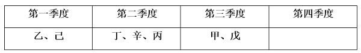

假设丙被安排在第三季度，由条件（1）（2）（6）可知，丁、辛在第二季度，甲、戊在第三季度。结合条件（3）（4）（5）可知，乙和己在丙之前的第一季度或第二季度（如下图所示）。此时第一季度和第二季度均可安排庚，庚可能和乙、己、丁、辛安排在同一个季度。

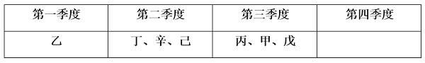或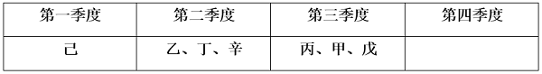或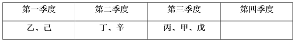

综上，庚不可能和丙安排在同一个季度。

本题为选非题，故正确答案为B。

---

### 第 6 题　qid 19283847 · 图形推理

从所给的四个选项中，选择最合适的一个填入问号处，使之呈现一定的规律性：

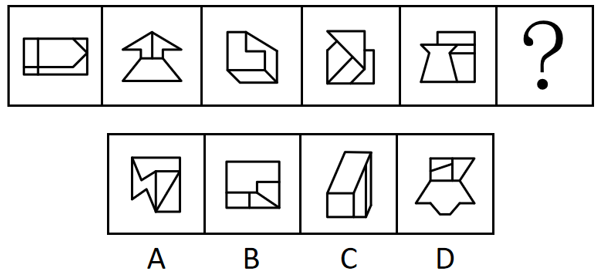

- **A**. A
- **B**. B
- **C**. C
- **D**. D　✅

**答案**：D

**官方解析**

元素组成不同，且无明显属性规律，考虑数量规律。观察发现，题干图形封闭面较多，优先考虑数面，但整体数面无规律。继续观察发现，题干图形均明显存在最大面，且最大面均为轴对称图形，只有D项符合。
故正确答案为D。

---

### 第 7 题　qid 19283818 · 图形推理

从所给的四个选项中，选择最合适的一个填入问号处，使之呈现一定的规律性：

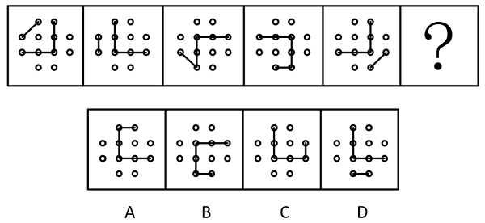

- **A**. A
- **B**. B
- **C**. C　✅
- **D**. D

**答案**：C

**官方解析**

元素组成相同，优先考虑位置规律。观察发现，小短线在外圈依次逆时针平移1格，折线的拐点在内圈依次顺时针平移1格，折线整体依次顺时针旋转了，只有C项符合。

故正确答案为C。

---

### 第 8 题　qid 19283815 · 图形推理

从所给的四个选项中，选择最合适的一项填入问号处，使之呈现一定的规律性：

- **A**. A
- **B**. B　✅
- **C**. C
- **D**. D

**答案**：B

**官方解析**

解法一：
元素组成相同，但无位置规律和属性规律，考虑数量规律。观察发现，题干图形中黑球和白球分堆明显，考虑部分数，题干图形中黑球部分数均为1，白球部分数均为2，？处图形也应遵循此规律，只有B项符合。
解法二：
元素组成相同，但无位置规律和属性规律，考虑数量规律。观察发现，题干图形中黑球和白球分堆明显，考虑部分数，题干图形中白球部分数均为2，且两部分的白球数量分别为12、1，11、2，10、3，9、4，8、5，一部分数量递减，另一部分数量递增，？处图形白球两部分数量应为7和6，只有B项符合。
故正确答案为B。

---

### 第 9 题　qid 19283837 · 图形推理

从所给的四个选项中，选择最合适的一个填入问号处，使之呈现一定的规律性：

- **A**. A　✅
- **B**. B
- **C**. C
- **D**. D

**答案**：A

**官方解析**

元素组成相似，优先考虑样式规律。九宫格优先看横行。观察发现，第一行图形中，图一和图二先求异，再将求异后的图形左右翻转，得到图三；经验证，第二行符合此规律；第三行应用此规律，图一和图二先求异，再将求异后的图形左右翻转，只有A项符合。
故正确答案为A。

---

### 第 10 题　qid 19283859 · 图形推理

左边为给定的多面体，现用经P、Q、R三点的平面对其进行切割，问哪个选项是其切面？

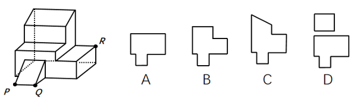

- **A**. A　✅
- **B**. B
- **C**. C
- **D**. D

**答案**：A

**官方解析**

本题考查截面图。根据平面公理“过不在一条直线上的三点，有且只有一个平面”可以得出，经过P、Q、R三点可以确定的唯一切面（即截面），即为A项，如下图所示：

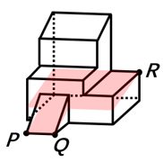

故正确答案为A。

---

### 第 11 题　qid 19283877 · 图形推理

以下为4个由若干棱长为1的正方体拼成的多面体，将它们在3×3×4空间内进行拼接，不可能拼成以下四个选项中的哪一个多面体？

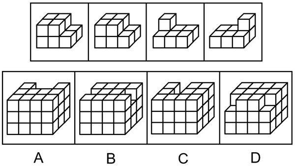

- **A**. A
- **B**. B
- **C**. C　✅
- **D**. D

**答案**：C

**官方解析**

本题考查立体拼合。如下图所示，A、B、D三项均能由题干多面体拼接而成。

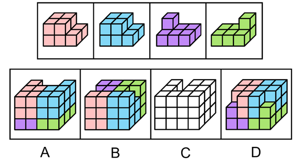

本题为选非题，故正确答案为C。

---

### 第 12 题　qid 19283845 · 图形推理

以下除哪项外，都是同一正方体纸盒的外表面展开图？

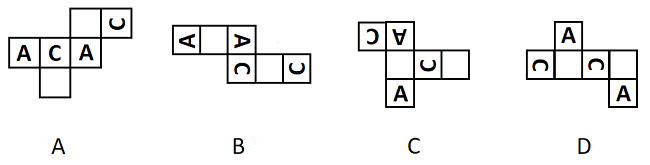

- **A**. A
- **B**. B
- **C**. C
- **D**. D　✅

**答案**：D

**官方解析**

解法一：本题为空间重构题，如下图所示，A、B、C项中，两个“C”的开口方向一致，但D项中，两个“C”的开口方向不一致，因此D项折成的纸盒与其他三个不同。

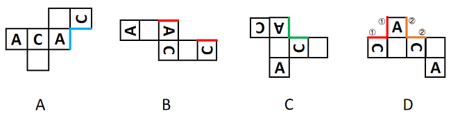

解法二：本题为空间重构题，如下图所示，A、B、C项中，“A”的左右分别与“C”的开口和后背相邻，但D项中，一个“A”的左右均与“C”的后背相邻，另一个“A”的左右均与“C”的开口相邻，因此D项折成的纸盒与其他三个不同。

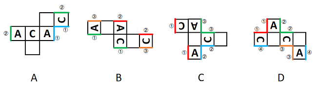

本题为选非题，故正确答案为D。

---

### 第 13 题　qid 19283883 · 图形推理

把下面的六个图形分为两类，使每一类图形都有各自的共同特征或规律，分类正确的一项是：

- **A**. ①②④，③⑤⑥
- **B**. ①③⑤，②④⑥
- **C**. ①③④，②⑤⑥　✅
- **D**. ①③⑥，②④⑤

**答案**：C

**官方解析**

本题为分组分类题目。元素组成相同，但整体看没有明显的位置规律。观察发现，每幅图中均有一个正方形，且图①③④中的正方形在图形的中心位置，图②⑤⑥中的正方形在图形的四周位置。故图①③④为一组，图②⑤⑥为一组。
故正确答案为C。

---

### 第 14 题　qid 19283870 · 图形推理

把下面的六个图形分为两类，使每一类图形都有各自的共同特征或规律，分类正确的一项是：

- **A**. ①②③，④⑤⑥
- **B**. ①⑤⑥，②③④
- **C**. ①②④，③⑤⑥　✅
- **D**. ①③⑤，②④⑥

**答案**：C

**官方解析**

本题为分组分类题目。观察发现，题干图形均出现黑球与白球，且每幅图均有两个黑球和两个套圈白球，虽然元素组成相同，但黑球与套圈白球的位置无规律，考虑两点确定一条直线，将两个黑球连线，两个套圈白球连线，观察连线的规律。观察发现，图①②④中，黑球连线与套圈白球连线互相垂直，图③⑤⑥中，黑球连线与套圈白球连线互相平行，即图①②④为一组，图③⑤⑥为一组。
故正确答案为C。

---

### 第 15 题　qid 19283874 · 图形推理

把下面的六个图形分为两类，使每一类图形都有各自的共同特征或规律，分类正确的一项是：

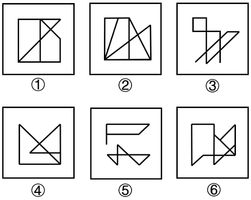

- **A**. ①②⑥，③④⑤
- **B**. ①③④，②⑤⑥　✅
- **C**. ①③⑤，②④⑥
- **D**. ①④⑥，②③⑤

**答案**：B

**官方解析**

本题为分组分类题目。元素组成不同，且无明显属性规律，考虑数量规律。观察发现，图③为多端点图形，考虑笔画数。图①③④均为一笔画图形，图②⑤⑥均为两笔画图形。即图①③④为一组，图②⑤⑥为一组。
故正确答案为B。

---

### 第 16 题　qid 19283846 · 定义判断

后视错觉是个体的一种认知偏差，是指在一件事情已经发生之后，即使个体之前没有对此做过预判，也认为自己“早就知道会这样”。
根据上述定义，下列符合后视错觉的是：

- **A**. 小瑾是一个悲观的人，她申请升职失败后，灰心丧气地说：“我早就知道，我什么都不如别人，什么也做不好。”
- **B**. 朋友邀阿欣去爬山，阿欣说高温预警不宜爬山，朋友坚持去，才到半山腰就汗流浃背，阿欣说：“我早就说会很热啊。”
- **C**. 晓琳参加一个重要会议迟到了。她懊悔地说：“我早该想到周一早上会堵车，不该按周末的情况预估通勤时间。”
- **D**. 晓菲在股票大跌之后，懊恼地说：“我早就觉察到那些信号了，觉得走势不太好，怎么就没有早卖出啊。”　✅

**答案**：D

**官方解析**

第一步：找出定义关键词。
“在一件事情已经发生之后”、“个体之前没有对此做过预判”、“认为自己‘早就知道会这样’”。
第二步：逐一分析选项。
A项：小瑾是一个“悲观”的人，说明她对自己升职的申请不抱有希望，认为自己会失败，在事情发生之前就预判了失败的结果，不符合“个体之前没有对此做过预判”，不符合定义，排除；
B项：阿欣在爬山前说高温预警不宜爬山，是朋友坚持爬山，说明在事情发生之前阿欣已经对“爬山会很热”做出了预判，不符合“个体之前没有对此做过预判”，不符合定义，排除；
C项：晓琳参加一个重要会议迟到了，符合“在一件事情已经发生之后”，她懊悔地说“我早该想到周一早上会堵车，不该按周末的情况预估通勤时间”，说明她在对“自己没有想到周一早上会堵车”这件事懊悔，不符合“认为自己‘早就知道会这样’”，不符合定义，排除；
D项：晓菲在股票大跌之后，符合“在一件事情已经发生之后”，懊恼地说“我早就觉察到那些信号了，觉得走势不太好”，说明晓菲认为自己早就觉察到股票会下跌，符合“认为自己‘早就知道会这样’”，符合定义，当选。
故正确答案为D。

---

### 第 17 题　qid 19283832 · 定义判断

选择或然率理论解释的是影响受众对大众传播内容选择的决定性因素。该理论的核心公式是：选择或然率=报偿的保证/费力的程度。其中，报偿的保证指的是传播内容满足选择者需要的程度，即内容对于受众的吸引力和实用性；费力的程度指的是获取传播内容和使用传播途径的难度。
根据上述定义，下列属于提高选择或然率的传播行为的是：

- **A**. 视频号平台借助数据分析和个性化算法，给用户推荐符合其偏好的视频　✅
- **B**. 时下流行的某影视作品在播放之前被插入一段2分钟的广告
- **C**. 某商家优化了商品布局，将畅销商品放在出口处，顾客可直接扫码支付
- **D**. 电视内置视频播放软件，开机后须先注册登录，才可搜索相关内容观看

**答案**：A

**官方解析**

第一步：找出定义关键词。
选择或然率理论：“影响受众对大众传播内容选择的决定性因素”、“该理论的核心公式是：选择或然率=报偿的保证/费力的程度”；
报偿的保证：“传播内容满足选择者需要的程度”、“内容对于受众的吸引力和实用性”；
费力的程度：“获取传播内容和使用传播途径的难度”。
第二步：逐一分析选项。
A项：平台推荐用户偏好的视频，说明传播内容贴近用户需求，对用户具有吸引力，提高了“传播内容满足选择者需要的程度”和“内容对于受众的吸引力和实用性”，即“报偿的保证”提高了，平台推荐说明用户获取传播途径的难度小，降低了“获取传播内容和使用传播途径的难度”，即“费力的程度”降低了，而“选择或然率=报偿的保证/费力的程度”，因此属于提高选择或然率的传播行为，符合定义，当选；
B项：影视作品在播放之前被插入一段2分钟的广告，增加了用户观看影视作品的难度，提高了“获取传播内容和使用传播途径的难度”，即“费力的程度”提高了，而“选择或然率=报偿的保证/费力的程度”，因此属于降低选择或然率的传播行为，不符合定义，排除；
C项：某商家将畅销商品放在出口处，不涉及传播内容，不符合“影响受众对大众传播内容选择的决定性因素”，不符合定义，排除；
D项：电视内置视频播放软件，开机后须先注册登录，才可搜索相关内容观看，增加了用户看视频的难度，提高了“获取传播内容和使用传播途径的难度”，即“费力的程度”提高了，而“选择或然率=报偿的保证/费力的程度”，因此属于降低选择或然率的传播行为，不符合定义，排除。
故正确答案为A。

---

### 第 18 题　qid 19283831 · 定义判断

自动投案是指犯罪事实或者犯罪嫌疑人未被司法机关发觉，或者虽被发觉，但犯罪嫌疑人尚未受到讯问、未被采取强制措施时，主动、直接向公安机关、人民检察院或者人民法院投案。
根据上述定义，下列不属于自动投案的是：

- **A**. 甲实施多起电信诈骗，获利十余万元，在公安机关进行的一次隐患排查入户走访中，发现甲形迹可疑，经盘问甲主动交代了自己的罪行
- **B**. 乙致人重伤后潜逃，在公安机关经侦查确认乙为该案的犯罪嫌疑人时，乙正因酒后驾驶被行政拘留，经公安机关讯问后，乙交代了自己的罪行　✅
- **C**. 丙多次挪用公款，其父母发现异常后，多次规劝其投案自首无效，直至单位发现款项异常开始查账后，丙才到公安机关交代自己的罪行
- **D**. 丁因入室盗窃被判处有期徒刑，在服刑期间，丁主动向公安机关交代自己系公安机关久未破获的“7·26”走私案的主谋之一

**答案**：B

**官方解析**

第一步：找出定义关键词。
“犯罪事实或者犯罪嫌疑人未被司法机关发觉，或者虽被发觉，但犯罪嫌疑人尚未受到讯问、未被采取强制措施时”、“主动、直接向公安机关、人民检察院或者人民法院投案”。
第二步：逐一分析选项。
A项：甲实施多起电信诈骗，公安机关在入户走访中发现甲形迹可疑，对甲进行盘问，符合“犯罪事实或者犯罪嫌疑人未被司法机关发觉，或者虽被发觉，但犯罪嫌疑人尚未受到讯问、未被采取强制措施时”，甲主动交代了自己的罪行，符合“主动、直接向公安机关、人民检察院或者人民法院投案”，符合定义，排除；
B项：乙致人重伤后潜逃且被公安机关确认为该案的犯罪嫌疑人，后因酒后驾驶被行政拘留，经公安机关讯问后交代了自己的罪行，不符合“犯罪事实或者犯罪嫌疑人未被司法机关发觉，或者虽被发觉，但犯罪嫌疑人尚未受到讯问、未被采取强制措施时”，不符合定义，当选；
C项：丙多次挪用公款，其所在单位发现款项异常开始查账，符合“犯罪事实或者犯罪嫌疑人未被司法机关发觉，或者虽被发觉，但犯罪嫌疑人尚未受到讯问、未被采取强制措施时”，丙到公安机关交代自己的罪行，符合“主动、直接向公安机关、人民检察院或者人民法院投案”，符合定义，排除；
D项：丁在入室盗窃服刑期间，主动向公安机关交代自己系公安机关久未破获的“7·26”走私案的主谋之一，符合“犯罪事实或者犯罪嫌疑人未被司法机关发觉，或者虽被发觉，但犯罪嫌疑人尚未受到讯问、未被采取强制措施时”、“主动、直接向公安机关、人民检察院或者人民法院投案”，符合定义，排除。
本题为选非题，故正确答案为B。

---

### 第 19 题　qid 19283817 · 定义判断

三维反求是测量技术、数据处理技术、图形处理技术和加工技术相结合的综合性技术，是指用一定的测量方法对实物进行测量，根据测量数据通过三维几何建模方法重构实物的数字化模型的过程。
根据上述定义，下列关于三维反求工程的步骤，排序正确的是：
①通过制造样品来验证模型是否满足精度和其他性能指标
②通过一定的算法，从测量数据中提取零件的设计与加工特征
③使用高精度的三维测量技术获取零件表面各点的空间坐标
④使用计算机辅助设计软件将数据与特征重构为三维模型

- **A**. ①③④②
- **B**. ①④③②
- **C**. ③①②④
- **D**. ③②④①　✅

**答案**：D

**官方解析**

第一步：找出定义关键词。
“用一定的测量方法对实物进行测量”、“根据测量数据通过三维几何建模方法重构实物的数字化模型”。
第二步：逐一对照选项并判断正确答案。
根据定义可知，三维反求工程的步骤应先“对实物进行测量”，再“根据测量数据通过三维几何建模方法重构实物的数字化模型”，故步骤③应位于首句，排除A、B两项。继续分析步骤①和步骤④可知，应先“重构三维模型”再“验证模型”，故步骤④应在步骤①之前，排除C项。
故正确答案为D。

---

### 第 20 题　qid 19283850 · 逻辑判断

都、国、鄙、邑四个词在古汉语中表示不同的概念。“国”既可以指诸侯的封地，又可以指天子或诸侯的都城。“都”本义是大城邑，后引申为具有重要政治地位的大城邑。“鄙”在古汉语中是指边邑，即边远的小城。“邑”在古汉语中是指城镇。
下列图示对上述概念关系的描述，正确的是：

- **A**. 
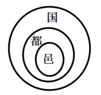

- **B**. 
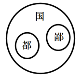

- **C**. 
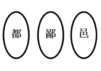

- **D**. 
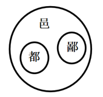
　✅

**答案**：D

**官方解析**

第一步：找出定义关键词。

国：“天子或诸侯的都城”；

都：“具有重要政治地位的大城邑”；

鄙：“边远的小城”；

邑：“城镇”。

图示中，

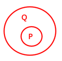表示：P包含于Q；

表示：Q和P是并列关系。

第二步：逐一分析选项。

A项：“都”指具有重要政治地位的大城邑，“邑”指城镇，“都”包含于“邑”，而图片表示为“邑”包含于“都”，图示关系错误，排除；

B项：“国”指天子或诸侯的都城，“都”指具有重要政治地位的大城邑，有些“国”是“都”，有些“国”不是“都”，有些“都”是“国”，有些“都”不是“国”，“国”和“都”是交叉关系，而图片表示为“都”包含于“国”，图示关系错误，排除；

C项：“都”指具有重要政治地位的大城邑，“邑”指城镇，“都”包含于“邑”，而图片表示为“邑”和“都”是并列关系，图示关系错误，排除；

D项：“都”指具有重要政治地位的大城邑，“邑”指城镇，“鄙”指边远的小城，“都”包含于“邑”，“鄙”包含于“邑”，“都”和“鄙”是并列关系，图示关系正确，当选。

故正确答案为D。

---

### 第 21 题　qid 19283823 · 定义判断

流域内降雨或融冰化雪都可以引起河水显著上涨。春季，气候转暖，流域内的季节性积雪融化、河流解冻或春雨，引起河水上涨称春汛。因正值桃花盛开时节，故亦称桃汛。我国北方，把春季河冰解冻引起的涨水现象专称为凌汛。夏季，流域内的暴雨或高山冰川和积雪融化，使河水急剧上涨，称夏汛。我国习惯上把发生在夏季三伏前后的汛水称为伏汛。秋季由于暴雨，河水发生急剧上涨称秋汛。
根据上述定义，下列判断错误的是：

- **A**. 春汛包含凌汛
- **B**. 夏汛包含伏汛
- **C**. 伏汛在凌汛前　✅
- **D**. 春汛就是桃汛

**答案**：C

**官方解析**

第一步：找出定义关键词。
春汛、桃汛：“春季，流域内的季节性积雪融化、河流解冻或春雨，引起河水上涨”、“因正值桃花盛开时节，故亦称桃汛”；
凌汛：“春季河冰解冻引起的涨水现象”；
夏汛：“夏季，流域内的暴雨或高山冰川和积雪融化，使河水急剧上涨”；
伏汛：“发生在夏季三伏前后的汛水”；
秋汛：“秋季由于暴雨，河水发生急剧上涨”。
第二步：逐一分析选项。
A项：凌汛是春季河冰解冻引起的涨水现象，说明是在春季因河流解冻引起的河水上涨，属于春汛的一种，所以春汛包含凌汛，判断正确，排除；
B项：伏汛是发生在夏季三伏前后的汛水，说明是在夏季发生的河水上涨，属于夏汛的一种，所以夏汛包含伏汛，判断正确，排除；
C项：伏汛是发生在夏季三伏前后的汛水，凌汛是春季河冰解冻引起的涨水现象，夏季在春季后，所以伏汛在凌汛后，判断错误，当选；
D项：春汛的发生因正值桃花盛开时节，故亦称桃汛，所以春汛就是桃汛，判断正确，排除。
本题为选非题，故正确答案为C。

---

### 第 22 题　qid 19283840 · 定义判断

断取是修辞格的一种，引用词语时，只截取其中部分字眼的意义，而置其余于不顾，是一种“断章取义”的修辞方式。
根据上述定义，下列没有采用断取修辞方式的是:

- **A**. 相较于他之前见过的大阵仗，眼前的情形在他眼中就是“小儿科”
- **B**. 小林一心扑在科研项目上，他至今还是一个“光杆司令”呢
- **C**. 山林发生火灾，消防员“上刀山下火海”，奋力保卫人民的生命和财产安全
- **D**. 实在走投无路，他最终还是找老师“开药方”，问询这一困局的破解之道　✅

**答案**：D

**官方解析**

第一步：找出定义关键词。
“引用词语时，只截取其中部分字眼的意义，而置其余于不顾”。
第二步：逐一分析选项。
A项：该项引用“小儿科”时，只取“小”义而舍“儿科”义，表明了眼前的情形在他眼中只是小阵仗，符合“引用词语时，只截取其中部分字眼的意义，而置其余于不顾”，符合定义，排除；
B项：该项引用“光杆司令”时，只取“光杆”义而舍“司令”义，表明了小林因搞科研而至今未成婚，仍独身一人，符合“引用词语时，只截取其中部分字眼的意义，而置其余于不顾”，符合定义，排除；
C项：该项引用“上刀山下火海”时，只取“下火海”义而舍“上刀山”义，突出了消防员在扑救大火时不畏艰难险阻的勇敢精神，符合“引用词语时，只截取其中部分字眼的意义，而置其余于不顾”，符合定义，排除；
D项：该项引用“开药方”时，用了其完整的意思，表明了他在走投无路时，找老师寻求解决方法，不符合“引用词语时，只截取其中部分字眼的意义，而置其余于不顾”，不符合定义，当选。
本题为选非题，故正确答案为D。

---

### 第 23 题　qid 19283853 · 定义判断

细胞化学是研究细胞的化学成分及其在细胞活动中的变化和定位的学科。具体来说，细胞化学是在不破坏细胞形态结构的状况下，用生化的和物理的技术对细胞的各种组分做定量分析，研究其动态变化，了解细胞代谢过程中各种细胞组分的作用。
根据上述定义，下列属于细胞化学研究范围的是：

- **A**. 观察玉米根系细胞从周围环境中摄取营养的能力以及受环境影响产生的活动
- **B**. 根据哺乳动物细胞内核酸、蛋白质吸收不同紫外光的特点，分析其含量　✅
- **C**. 抽取患者骨髓液，根据显微镜下骨髓细胞的不同形态，判断患者的疾病种类
- **D**. 研究小鼠免疫细胞受病原体侵入后，病原体释放毒素杀死免疫细胞的动态过程

**答案**：B

**官方解析**

第一步：找出定义关键词。
“研究细胞的化学成分及其在细胞活动中的变化和定位”、“在不破坏细胞形态结构的状况下”、“对细胞的各种组分做定量分析”、“了解细胞代谢过程中各种细胞组分的作用”。
第二步：逐一分析选项。
A项：观察玉米根系细胞摄取营养的能力及受环境影响产生的活动，不涉及细胞的化学成分，也没有对细胞的各种组分做定量分析，不符合“研究细胞的化学成分及其在细胞活动中的变化和定位”、“对细胞的各种组分做定量分析”，不符合定义，排除；
B项：分析哺乳动物细胞内核酸、蛋白质的含量，是对细胞内化学成分“核酸”和“蛋白质”做定量分析，符合“研究细胞的化学成分及其在细胞活动中的变化和定位”、“对细胞的各种组分做定量分析”，符合定义，当选；
C项：根据显微镜下“骨髓细胞的不同形态”来判断患者的疾病种类，不是研究细胞的化学成分，也没有对细胞的各种组分做定量分析，不符合“研究细胞的化学成分及其在细胞活动中的变化和定位”、“对细胞的各种组分做定量分析”，不符合定义，排除；
D项：研究小鼠免疫细胞被病原体杀死的动态过程，其研究的是“病原体”释放毒素杀死免疫细胞的过程，不是研究免疫细胞的各种组分，不符合“研究细胞的化学成分及其在细胞活动中的变化和定位”、“对细胞的各种组分做定量分析”，不符合定义，排除。
故正确答案为B。

---

### 第 24 题　qid 19283886 · 定义判断

同一认定是指侦查中具有专门知识的人或了解客体特征的人，通过比较先后出现的客体的特征而对客体是否同一做出的判断。这里所说的客体是指与案件有关联的人或物。
根据上述定义，下列属于同一认定的是：

- **A**. 通过对手机中所存储的信息进行检查，确定其是否为报案人所丢失的手机
- **B**. 通过对犯罪现场提取的DNA信息与DNA信息库进行比对，查找犯罪嫌疑人　✅
- **C**. 通过对走私案中所缴获的走私物品进行多次鉴定，认定其是否为国外某厂家所生产
- **D**. 通过对犯罪嫌疑人车上所收缴的各类物品进行检验，判断其是否属于违禁物品

**答案**：B

**官方解析**

第一步：找出定义关键词。
“侦查中具有专门知识的人或了解客体特征的人”、“通过比较先后出现的客体的特征”、“对客体是否同一做出的判断”。
第二步：逐一分析选项。
A项：通过对手机中所存储的信息进行检查，只是检查手机存储的信息，不符合“通过比较先后出现的客体的特征”，不符合定义，排除；
B项：通过对犯罪现场提取的DNA信息与DNA信息库进行比对，把现场提取的DNA信息与先录入到DNA信息库中的进行比对，符合“通过比较先后出现的客体的特征”，通过DNA比对查找犯罪嫌疑人，即判断现场提取的DNA信息与DNA信息库中储存的信息是否为同一人，符合“对客体是否同一做出的判断”，符合定义，当选；
C项：通过对走私案中所缴获的走私物品进行多次鉴定，判断是否是国外某厂家生产的物品，只能证明这些物品是否产自于国外某厂家，无法证明该物品与其他物品为同一个物品，不符合“对客体是否同一做出的判断”，不符合定义，排除；
D项：通过对犯罪嫌疑人车上所收缴的各类物品进行检验，只是检查收缴的物品，不符合“通过比较先后出现的客体的特征”，不符合定义，排除。
故正确答案为B。

---

### 第 25 题　qid 19283825 · 定义判断

土地监测是利用遥感、遥测技术，对一个国家或地区土地利用状况的动态变化进行定期或不定期的监视和测定，目的在于为国家和地区有关部门提供准确的土地利用变化情况，及时进行土地利用数据更新与对比分析，以便编制土地利用变化图解等。
根据上述定义，下列属于土地监测的是:

- **A**. 通过量化多时相遥感图像空间域、时间域、光谱域的耦合特征，获得土地变化的类型、位置和数量　✅
- **B**. 利用定期现场踏勘的方式标绘各土地使用单位及各类型土地的界线，对变化的地物界线作出修正
- **C**. 通过某地区土地权属变更资料的分析，梳理该地区土地所有权、使用权的变化，以及土地纠纷调解情况
- **D**. 利用植被具有红光强吸收特点，通过遥感设备监测植被的生长状态，并绘制植被的生长周期图

**答案**：A

**官方解析**

第一步：找出定义关键词。
“利用遥感、遥测技术，对一个国家或地区土地利用状况的动态变化进行定期或不定期的监视和测定”、“目的在于为国家和地区有关部门提供准确的土地利用变化情况，及时进行土地利用数据更新与对比分析，以便编制土地利用变化图解等”。
第二步：逐一分析选项。
A项：该项说的是通过遥感技术获得了土地变化的类型、位置和数量，即通过遥感技术获得土地利用情况，符合“利用遥感、遥测技术，对一个国家或地区土地利用状况的动态变化进行定期或不定期的监视和测定”、“目的在于为国家和地区有关部门提供准确的土地利用变化情况，及时进行土地利用数据更新与对比分析，以便编制土地利用变化图解等”，符合定义，当选；
B项：该项说的是定期现场踏勘土地使用单位及各类型土地的界线，没有提及是否运用了遥感、遥测技术，也未涉及土地利用情况，不符合“利用遥感、遥测技术，对一个国家或地区土地利用状况的动态变化进行定期或不定期的监视和测定”、“目的在于为国家和地区有关部门提供准确的土地利用变化情况，及时进行土地利用数据更新与对比分析，以便编制土地利用变化图解等”，不符合定义，排除；
C项：该项说的是土地的权属情况，未涉及土地利用情况，也未涉及遥感、遥测技术，不符合“利用遥感、遥测技术，对一个国家或地区土地利用状况的动态变化进行定期或不定期的监视和测定”、“目的在于为国家和地区有关部门提供准确的土地利用变化情况，及时进行土地利用数据更新与对比分析，以便编制土地利用变化图解等”，不符合定义，排除；
D项：该项说的是通过遥感设备监测植被的生长状态，并绘制植被的生长周期图，涉及的是植被情况，不是土地利用情况，不符合“利用遥感、遥测技术，对一个国家或地区土地利用状况的动态变化进行定期或不定期的监视和测定”、“目的在于为国家和地区有关部门提供准确的土地利用变化情况，及时进行土地利用数据更新与对比分析，以便编制土地利用变化图解等”，不符合定义，排除。
故正确答案为A。

---

### 第 26 题　qid 19283727 · 类比推理

嘤其鸣矣：求其友声

- **A**. 遏其生气：以求重价　✅
- **B**. 求之其本：经旬必得
- **C**. 道不拾遗：夜不闭户
- **D**. 避其锐气：击其惰归

**答案**：A

**官方解析**

第一步：判断题干词语间逻辑关系。
“嘤其鸣矣，求其友声”指小鸟那嘤嘤的叫声，是为了寻求知音，二者为方式目的的对应关系。
第二步：判断选项词语间逻辑关系。
A项：“遏其生气，以求重价”指阻抑它（梅花）的生机，这样做是为了谋求高价，二者为方式目的的对应关系，与题干逻辑关系一致，当选；
B项：“求之其本，经旬必得”指做事情如果从根本做起，经过一段时间必定能够收效，二者为条件对应关系，与题干逻辑关系不一致，排除；
C项：“道不拾遗，夜不闭户”指东西丢在路上没有人拾走，夜里睡觉都不需要关门防盗，二者为并列关系，与题干逻辑关系不一致，排除；
D项：“避其锐气，击其惰归”指先避开敌人初来时的气势，等敌人疲惫时再狠狠打击，二者为时间先后顺序的对应关系，与题干逻辑关系不一致，排除。
故正确答案为A。

---

### 第 27 题　qid 19283814 · 类比推理

殚精竭虑：费尽心机

- **A**. 狐假虎威：虚张声势
- **B**. 舍生忘死：死里逃生
- **C**. 侃侃而谈：喋喋不休　✅
- **D**. 光怪陆离：五光十色

**答案**：C

**官方解析**

第一步：判断题干词语间逻辑关系。
“殚精竭虑”指用尽精力、费尽心思，“费尽心机”指挖空心思、想尽办法，二者是近义关系。
第二步：判断选项词语间逻辑关系。
A项：“狐假虎威”指狐狸假借老虎的威势吓跑百兽，比喻倚仗别人的势力来欺压、恐吓人，“虚张声势”形容假装出强大的气势，指假造声势，借以吓人，二者是近义关系，与题干逻辑关系一致，保留；
B项：“舍生忘死”形容不顾性命危险，“死里逃生”指从极其危险的境地中逃脱，二者不是近义关系，与题干逻辑关系不一致，排除；
C项：“侃侃而谈”指理直气壮、不慌不忙地说话，“喋喋不休”指说话唠唠叨叨、没完没了，二者是近义关系，与题干逻辑关系一致，保留；
D项：“光怪陆离”形容现象奇异、色彩繁杂，“五光十色”形容色彩鲜艳、样式繁多，二者是近义关系，与题干逻辑关系一致，保留。
比较A、C、D三项，题干中“殚精竭虑”是褒义词，“费尽心机”是贬义词，A项中“狐假虎威”和“虚张声势”都是贬义词，D项中“光怪陆离”是中性词，“五光十色”是褒义词，C项中“侃侃而谈”是褒义词，“喋喋不休”是贬义词，故C项更为合适。
故正确答案为C。

---

### 第 28 题　qid 19283730 · 类比推理

群众来访：窗口接访：调查督办

- **A**. 地面试验：点火飞行：燃料加注
- **B**. 支付本币：兑换外币：确认汇率
- **C**. 建造堤坝：潮汐发电：送电入户　✅
- **D**. 重启谈判：临时休战：边境冲突

**答案**：C

**官方解析**

第一步：判断题干词语间逻辑关系。
先群众来访，再窗口接访，最后调查督办，三者为时间先后顺序的对应关系。
第二步：判断选项词语间逻辑关系。
A项：先燃料加注，再点火飞行，第二词和第三词的时间先后顺序与题干不同，与题干逻辑关系不一致，排除；
B项：一般是先确认汇率，再兑换外币，第二词和第三词的时间先后顺序与题干不同，与题干逻辑关系不一致，排除；
C项：先建造堤坝，再潮汐发电，最后送电入户，三者为时间先后顺序的对应关系，与题干逻辑关系一致，当选；
D项：先临时休战，再重启谈判，第一词和第二词的时间先后顺序与题干不同，与题干逻辑关系不一致，排除。
故正确答案为C。

---

### 第 29 题　qid 19283739 · 类比推理

收集罪证：提取指纹：透明胶

- **A**. 温度不当：叶子发黄：营养液
- **B**. 逃生自救：敲碎车窗：安全锤　✅
- **C**. 道路施工：设置防护：混凝土
- **D**. 冷风侵入：肩周疼痛：艾草贴

**答案**：B

**官方解析**

第一步：判断题干词语间逻辑关系。
提取指纹是为了收集罪证，二者为方式目的的对应关系；透明胶是提取指纹的工具，二者为工具对应关系。
第二步：判断选项词语间逻辑关系。
A项：温度不当会导致叶子发黄，二者为因果对应关系，与题干逻辑关系不一致，排除；
B项：敲碎车窗是为了逃生自救，二者为方式目的的对应关系；安全锤是敲碎车窗的工具，二者为工具对应关系，与题干逻辑关系一致，当选；
C项：设置防护是为了道路施工，二者为方式目的的对应关系，但混凝土不是设置防护的工具，二者不是工具对应关系，与题干逻辑关系不一致，排除；
D项：冷风侵入会导致肩周疼痛，二者为因果对应关系，与题干逻辑关系不一致，排除。
故正确答案为B。

---

### 第 30 题　qid 19283736 · 类比推理

行政文书 对于 （    ） 相当于 （    ） 对于 汇编语言

- **A**. 行政机关；编程人员
- **B**. 行政管理；传送指令
- **C**. 商务文书；符号语言
- **D**. 监管函；计算机语言　✅

**答案**：D

**官方解析**

逐一代入选项。
A项：行政文书是国家行政机关处理公务所形成的具有特定格式的文字材料，行政机关发布行政文书，二者构成主宾关系；汇编语言是任何一种用于电子计算机、微处理器、微控制器或其他可编程器件的低级语言，编程人员编写汇编语言，二者构成主宾关系，但词语前后顺序相反，前后逻辑关系不一致，排除；
B项：利用行政文书进行行政管理，二者为工具对应关系；利用汇编语言传送指令，二者为工具对应关系，但词语前后顺序相反，前后逻辑关系不一致，排除；
C项：行政文书是国家行政机关处理公务所形成的具有特定格式的文字材料，商务文书是指企业在经营运作、贸易往来、开拓发展等一系列商务活动中所使用的各种文书的总称，二者为并列关系；汇编语言又被称为符号语言，二者为全同关系，前后逻辑关系不一致，排除；
D项：监管函是一种由监管部门向被监管对象发出的书面通知，旨在告知其存在的违规事实或风险状况，并要求其及时补救、改正或防范，监管函是一种行政文书，二者为种属关系；汇编语言是一种计算机语言，二者为种属关系，前后逻辑关系一致，当选。
故正确答案为D。

---

### 第 31 题　qid 19283830 · 逻辑判断

研究者设计了一个“拔河比赛”的实验，要求被试分别在单独和群体的情境下拔河，同时用仪器来测量他们的拉力。结果发现随着被试人数的增加，平均每个被试使出的力减少了。据此研究者认为，提高团队业绩的最佳途径就是减少团队人数。
下列选项如果为真，除哪项外均能质疑上述研究者的观点？

- **A**. 团队合作中各取所长很重要，人数过少效率也会随之下降
- **B**. 团队一起工作时，个人的贡献不被凸显，很容易失去积极性　✅
- **C**. 团队的合作与管理方式要比拔河复杂得多，不能一概而论
- **D**. 增强个体对团队的归属感、责任感，能够更好地提高团队业绩

**答案**：B

**官方解析**

第一步：找出论点和论据。
论点：提高团队业绩的最佳途径就是减少团队人数。
论据：随着被试人数的增加，平均每个被试使出的力减少了。
本题论点讨论的是减少团队人数是提高团队业绩的最佳途径。论据讨论的是在“拔河比赛”的实验中被试人数增加，则平均每个被试使出的力会减少，即人数减少有利于每个被试使出的力增加。二者话题不一致，削弱可以考虑拆桥、削弱论点、削弱论据等。本题为选非题，排除能削弱的选项即可。
第二步：逐一分析选项。
A项：团队中人数过少则效率也会随之下降，说明减少团队人数可能不会提高团队业绩，削弱论点，可以削弱，排除；
B项：团队中个人的贡献不被凸显，很容易失去积极性，解释了为什么随着被试人数的增加，平均每个被试使出的力减少了，为加强项，无法削弱，当选；
C项：团队的合作和管理方式比拔河更复杂，说明不能将拔河得到的结论应用在团队合作中，拆断了拔河比赛与团队合作、管理方式之间的联系，为拆桥项，可以削弱，排除；
D项：增强个体对团队的归属感、责任感能更好地提高团队业绩，说明减少团队人数并非提高团队业绩的最佳途径，削弱论点，可以削弱，排除。
本题为选非题，故正确答案为B。

---

### 第 32 题　qid 19283839 · 逻辑判断

随着通货膨胀的蔓延，H国电子企业主要产品的原材料价格大幅上涨。该国最大的电子企业公报显示，今年该企业智能手机应用处理器价格较上年上涨30%，用于智能手机的相机模块价格上涨11%，用于电视和显示器的面板价格上涨9%。H国经济界认为，电子企业原材料价格居高不下，将严重削弱该国电子企业在国际市场上的竞争力。
以下哪项如果为真，最能支持上述结论？

- **A**. 近年来，无论是国际还是国内，硅化合物价格始终呈上涨趋势，这是导致H国电子企业主要产品原材料价格大幅上涨的原因
- **B**. 在H国电子企业主要产品的原材料价格大幅上涨的同时，由于购买力下降等原因，电子产品的全球消费需求在缩减
- **C**. 其他国家电子企业都在通过科技创新降低产品原材料价格上涨的影响，以求通过低价在竞争激烈的国际电子产品市场中脱颖而出　✅
- **D**. 一直以来，H国电子企业生产的产品以其卓越的技术和质量优势在国际市场上极具竞争力，近年来这种竞争优势在逐渐减弱

**答案**：C

**官方解析**

第一步：找出论点和论据。
论点：电子企业原材料价格居高不下，将严重削弱该国电子企业在国际市场上的竞争力。
论据：随着通货膨胀的蔓延，H国电子企业主要产品的原材料价格大幅上涨。该国最大的电子企业公报显示，今年该企业智能手机应用处理器价格较上年上涨30%，用于智能手机的相机模块价格上涨11%，用于电视和显示器的面板价格上涨9%。
本题论点讨论的是H国电子企业原材料价格上涨与国际市场竞争力之间的关系，论据讨论的是H国最大的电子企业原材料价格上涨，故论点和论据的话题一致，加强优先考虑补充论据，即解释H国电子企业原材料价格上涨将削弱其在国际市场上的竞争力的原因或举例证明。
第二步：逐一分析选项。
A项：该项讨论的是电子企业主要产品原材料价格大幅上涨的原因，而论点讨论的是H国电子企业原材料价格上涨与国际市场竞争力之间的关系，话题不一致，无法加强，排除；
B项：该项讨论的是电子产品的全球消费需求在缩减的原因，而论点讨论的是H国电子企业原材料价格上涨与国际市场竞争力之间的关系，话题不一致，无法加强，排除；
C项：该项讨论的是其他国家电子企业通过科技创新降低产品原材料价格上涨的影响，以求通过低价在国际市场中脱颖而出，说明H国的电子企业相较于其他国家的电子企业，可能因原材料价格更高，在国际市场上的竞争中处于劣势，补充论据，可以加强，当选；
D项：该项讨论的是近年来H国电子企业的产品在技术和质量上的竞争优势正在逐渐减弱，但不明确原材料价格上涨是否会进一步削弱其在国际市场上的竞争力，为不明确项，无法加强，排除。
故正确答案为C。

---

### 第 33 题　qid 19283848 · 逻辑判断

考古人员发现了近300枚16亿年前的丝状体生物化石，这些丝状体均由巨型细胞组成，直径20~194微米不等。化石中，有些丝状体直径保持不变，细胞呈短柱状至长柱状；有些丝状体整体向一端均匀收缩，细胞呈柱状、桶状或杯状；而有的丝状体仅一端变细，形态呈现了一定的复杂性。考古人员据此认为，这些丝状体很可能属于真核生物。
以下各项如果为真，除哪项外均能支持上述观点？

- **A**. 这些化石中被发现有类似于现生繁殖细胞——孢子一样的圆形结构，这一结构只出现在真核生物中
- **B**. 原核生物细胞的直径一般小于2微米，而真核生物细胞的直径一般在10~100微米之间
- **C**. 在目前已知的原核生物中，大多数的丝状体形态都比较简单，只有个别呈现出过渡期形态　✅
- **D**. 经比对，该化石中丝状体与一些现生绿藻（一种真核生物）的藻丝体形态、细胞大小分布和繁殖方式等最为接近

**答案**：C

**官方解析**

第一步：找出论点和论据。
论点：这些丝状体很可能属于真核生物。
论据：这些丝状体均由巨型细胞组成，直径20~194微米不等。化石中，有些丝状体直径保持不变，细胞呈短柱状至长柱状；有些丝状体整体向一端均匀收缩，细胞呈柱状、桶状或杯状；而有的丝状体仅一端变细，形态呈现了一定的复杂性。
本题论点说的是这些丝状体很可能属于真核生物，而论据说的是这些丝状体化石有哪些形态特征，论点和论据话题不一致，加强优先考虑搭桥，且本题为选非题，将可以加强的选项排除即可。
第二步：逐一分析选项。
A项：该项说的是这些丝状体生物化石中发现了类似于真核生物的圆形结构，建立了论据中“丝状体化石”与论点中“真核生物”的联系，为搭桥项，可以加强，排除；
B项：该项说的是真核生物细胞的直径一般在10~100微米之间，与丝状体生物化石中的巨型细胞直径20~194微米范围类似，建立了论据中“丝状体化石”与论点中“真核生物”的联系，为搭桥项，可以加强，排除；
C项：该项说的是原核生物的形态特点，与论点讨论的真核生物以及论据讨论的丝状体化石均无关系，为无关项，无法加强，当选；
D项：该项说的是化石中丝状体的形态等特征与一种真核生物绿藻相似，建立了论据中“丝状体化石”与论点中“真核生物”的联系，为搭桥项，可以加强，排除。
本题为选非题，故正确答案为C。

---

### 第 34 题　qid 19283852 · 逻辑判断

某项研究显示，与未接触空气污染的人相比，暴露于空气污染中的人死于乳腺癌的风险增加了80%，死于其他各类癌症的风险增加了22%。该研究团队由此认为，这可能与空气污染物中的PM2.5有关，因为PM2.5会导致脏器的炎症和氧化应激反应。
以下哪项如果为真，最可能是上述专家预设的前提？

- **A**. 脏器的炎症和氧化应激反应是明确的致癌危险因素　✅
- **B**. PM2.5在大气成分中含量较少，但对空气质量有重要影响
- **C**. 吸食香烟和电子烟等都可以将PM2.5直接输送到肺部
- **D**. 女性更易接触烹饪油烟，其中含有大量的PM2.5

**答案**：A

**官方解析**

第一步：找出论点和论据。
论点：死于癌症的风险增加可能与空气污染物中的PM2.5有关。
论据：PM2.5会导致脏器的炎症和氧化应激反应。
本题论点讨论的是“PM2.5”和“死于癌症的风险”之间的关系，论据讨论的是“PM2.5”和“脏器的炎症和氧化应激反应”之间的关系，二者话题不一致，加强优先考虑搭桥，即在“脏器的炎症和氧化应激反应”与“死于癌症的风险”之间建立联系。
第二步：逐一分析选项。
A项：该项指出脏器的炎症和氧化应激反应是明确的致癌危险因素，即在“脏器的炎症和氧化应激反应”与“死于癌症的风险”之间建立了联系，为搭桥项，可以加强，当选；
B项：该项指出PM2.5在大气中的情况，而论点讨论的是死于癌症的风险与PM2.5是否有关，话题不一致，无法加强，排除；
C项：该项指出吸烟会将PM2.5直接输送到肺部，但最终死于癌症的风险是否会增加并未明确指出，为不明确项，无法加强，排除；
D项：该项指出女性更容易接触烹饪油烟，其中有PM2.5，但最终死于癌症的风险是否会增加并未明确指出，为不明确项，无法加强，排除。
故正确答案为A。

---

### 第 35 题　qid 19283887 · 逻辑判断

某桃园5月份对其种植的蟠桃进行套袋。6月份，桃果出现异常，50克左右的大果很少；10余克的小果特别多，约占75%。正常情况下，此时果实应重50克左右。有人推测，今年出现小果占比过大是由于套袋较早造成的，因为过早套袋会使果实失去营养竞争力，在营养供应不足的情况下，果实竞争不过新梢。
以下哪项如果为真，最能削弱上述推测？

- **A**. 今年套果袋时果实大小基本一致，并且期间无病虫危害
- **B**. 纸袋的遮光作用影响果实光合能力，进而影响甜度
- **C**. 今年在没有分出大小果时就完成了疏除冗余幼果的操作，留下的不一定是优质大果
- **D**. 今年桃树长得太快，加之萌芽肥、花后肥都没有追施，导致后期果实营养供应不足　✅

**答案**：D

**官方解析**

第一步：找出论点和论据。
论点：今年出现小果占比过大是由于套袋较早造成的。
论据：过早套袋会使果实失去营养竞争力，在营养供应不足的情况下，果实竞争不过新梢。
本题论据说的是过早套袋会使果实失去营养竞争力，进而导致果实竞争不过新梢，即小果占比大；论点是基于此得出的小果占比过大的原因是套袋较早，二者话题一致，削弱优先考虑否定论点，即小果占比过大不是由于套袋较早造成的。
第二步：逐一分析选项。
A项：该项指出今年套果袋时果实大小基本一致，并且期间无病虫危害，只能说明病虫危害不是导致小果占比过大的原因，但是否存在其他的原因导致小果占比过大不明确，为不明确项，无法削弱，排除；
B项：该项指出纸袋的遮光作用影响果实光合能力，进而影响甜度，只能说明套袋影响甜度，而论点讨论的是小果占比过大的原因，话题不一致，无法削弱，排除；
C项：该项指出今年在没有分出大小果时就完成了疏除冗余幼果的操作，留下的不一定是优质大果，说明小果占比过大可能是由于没有分出大小果时就完成了疏除冗余幼果的操作造成的，把优质大果去掉了，保留下小果，直接否定论点，可以削弱，保留；
D项：该项指出今年桃树长得太快，加之萌芽肥、花后肥都没有追施，导致后期果实营养供应不足，说明果实营养供应不足是桃树长得太快，没有追肥造成的，进而导致小果占比过大，直接否定论点，可以削弱，保留。
对比C、D两项，C项表述为“不一定”，为可能性削弱，D项为肯定性削弱，削弱力度更强，D项当选。
故正确答案为D。

---
