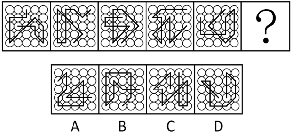
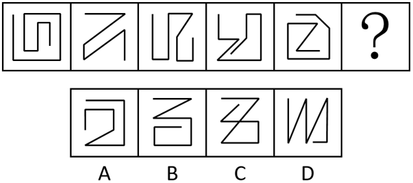
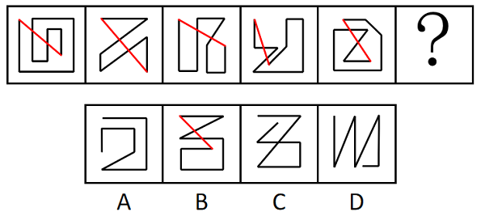
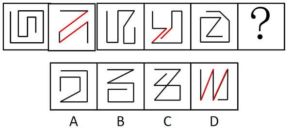
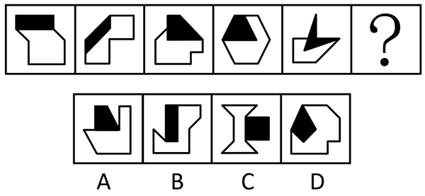
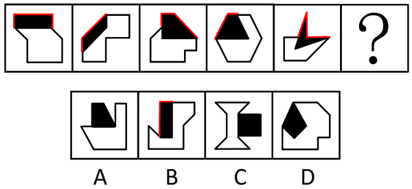
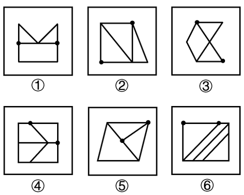
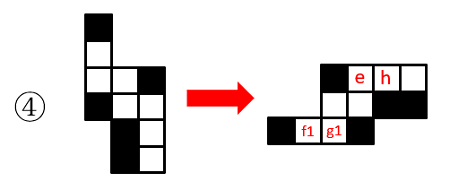
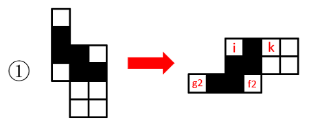

# 2025年天津市公务员录用考试《行测》题（网友回忆版）

> 判断推理 · 35 题 · 天津 2025

## 第 1 题　qid 10297050 · 图形推理

从所给的四个选项中，选择最合适的一个填入问号处，使之呈现一定的规律性：

- **A**. A　✅
- **B**. B
- **C**. C
- **D**. D

**答案**：A

**官方解析**

元素组成不同，且无明显属性规律，考虑数量规律。观察发现，题干每幅图形都有线条穿过小白球，考虑线条穿过小白球的数量，数量均为16个，故？处应选择一个线条穿过16个小白球的图形，只有A项符合。
故正确答案为A。

---

## 第 2 题　qid 10297148 · 图形推理

从所给的四个选项中，选择最合适的一个填入问号处使之呈现一定的规律性：

- **A**. A
- **B**. B　✅
- **C**. C
- **D**. D

**答案**：B

**官方解析**

思路一：元素组成不同，且属性规律无法选出唯一答案，考虑数量规律。观察发现，题干图形均由直线构成，但整体数直线并无规律。继续观察发现，题干图形线条的端点相连均穿过两条线，如下图所示，故？处的图形端点连线应穿过两条线，只有B项符合。

故正确答案为B。

思路二：元素组成不同，且属性规律无法选出唯一答案，考虑数量规律。观察发现，题干图形均由直线构成，但整体数直线并无规律，考虑直线的细化考点。再次观察发现，题干图形出现较多平行线，考虑平行线，其中斜向平行线的组数分别为0、1、0、1、0，如下图所示，故？处的图形斜向平行线组数应为1，只有D项符合。

故正确答案为D。

注：观察图形规律时，优先观察整体性规律，思路一的题干中所有的图形均满足端点相连穿过两条线，而思路二的规律是平行线的组数间隔出现，故粉笔更倾向于思路一。

---

## 第 3 题　qid 10297127 · 图形推理

从所给的四个选项中，选择最合适的一个填入问号处，使之呈现一定的规律性：

- **A**. A
- **B**. B　✅
- **C**. C
- **D**. D

**答案**：B

**官方解析**

元素组成不同，且每幅图形均有黑白两个图形相交，考虑图形间关系。观察发现，题干黑色图形中均存在与白色图形不相交的边，数量分别为3、2、3、2、3，如下图所示，故？处应选择一个黑色图形与白色图形有2条边不相交的图形，只有B项符合。

故正确答案为B。

---

## 第 4 题　qid 10297098 · 图形推理

把下面的六个图形分为两类，使每一类都有各自的共同特征或规律，分类正确的一项是：

- **A**. ①②③，④⑤⑥
- **B**. ①⑤⑥，②③④
- **C**. ①③⑤，②④⑥
- **D**. ①④⑤，②③⑥　✅

**答案**：D

**官方解析**

本题为分组分类题目。观察发现，每幅图中均有两个黑点，优先考虑功能元素。图①④⑤中，黑点标记的两个交点均发射出3条线，图②③⑥中，黑点标记的一个交点发射出3条线，另一个交点发射出2条线，即图①④⑤为一组，图②③⑥为一组。
故正确答案为D。

---

## 第 5 题　qid 10297111 · 图形推理

左图为正方体纸盒的外表面展开图，问以下4个部分中，哪两个可以组合成同样正方体的外表面展开图？

- **A**. ①和②
- **B**. ③和④
- **C**. ①和④　✅
- **D**. ②和③

**答案**：C

**官方解析**

将图①和图④分别逆时针旋转后，按照下图所示的方式拼合在一起即可得到题干外表面展开图（g1和g2拼成了原展开图中的面g，f1和f2拼成了原展开图中的面f）。

故正确答案为C。

---

## 第 6 题　qid 10297048 · 定义判断

一级预防是指在疾病尚未发生时针对病因（或危险因素）所采取的措施，即“防病于未然”。一级预防包括健康促进和健康保护两方面内容，其中，健康促进是促使人们维护和改善他们自身健康的过程；健康保护是对有明确病因（或危险因素）或具备特异预防手段的疾病所采取的措施。
根据上述定义，下列说法正确的是：

- **A**. 采用湿式作业来减少矿工中尘肺的发生率，这属于健康保护　✅
- **B**. 接种乙肝疫苗来预防乙型肝炎，这属于健康促进
- **C**. 产前检查发现胎儿染色体异常并做出诊断进而终止妊娠，这属于一级预防
- **D**. 利用短视频平台向公众普及如何降低“三高”，这属于健康保护

**答案**：A

**官方解析**

第一步：找出定义关键词。
一级预防：“在疾病尚未发生时”、“针对病因（或危险因素）所采取的措施”、“防病于未然”；
健康促进：“促使人们维护和改善他们自身健康”；
健康保护：“对有明确病因（或危险因素）或具备特异预防手段的疾病所采取的措施”。
第二步：逐一分析选项。
A项：选采用湿式作业来减少矿工中尘肺的发生率，长期吸入粉尘是导致尘肺的危险因素，采用湿式作业可以减少粉尘吸入、预防尘肺，符合“对有明确病因（或危险因素）或具备特异预防手段的疾病所采取的措施”，符合“健康保护”定义，说法正确，当选；
B项：接种乙肝疫苗来预防乙型肝炎，符合“对有明确病因（或危险因素）或具备特异预防手段的疾病所采取的措施”，符合“健康保护”定义，不符合“健康促进”定义，说法错误，排除；
C项：产前检查发现胎儿染色体异常并做出诊断进而终止妊娠，是在胎儿疾病发生后采取的措施，不符合“在疾病尚未发生时”、“防病于未然”，不符合“一级预防”定义，说法错误，排除；
D项：利用短视频平台向公众普及如何降低“三高”，符合“促使人们维护和改善他们自身健康”，符合“健康促进”定义，不符合“健康保护”定义，说法错误，排除。
故正确答案为A。

---

## 第 7 题　qid 10297059 · 定义判断

特种医学是运用医学科学的基本原理和技术方法以及自然科学相关理论与实践知识，研究在特殊环境条件下从业或从事其它活动的所有人群特有的卫生保健需求，解决在实践中涉及到的各种特殊医学问题。特种医学的最终目的是从分子、细胞与整体水平认识特殊环境条件作用于人体所引起的生理、心理及病理变化的现象及规律。
根据上述定义，下列不属于特种医学研究范畴的是：

- **A**. 研究潜水对人体带来的生理变化以及潜水人员在水下环境中所面临的健康风险
- **B**. 研究太空环境对航天员的心理影响，探索能够改善航天员心理状况的措施
- **C**. 分析人在热带地区的机体变化，研究热带病的诊断、预防和治疗
- **D**. 以骨癌为研究对象，探究遗传因素、基因突变、化学因素等在发病中起的作用　✅

**答案**：D

**官方解析**

第一步：找出定义关键词。
“在特殊环境条件下”、“所引起的生理、心理及病理变化”。
第二步：逐一分析选项。
A项：“潜水”说明“在特殊环境条件下”，研究潜水对人体带来的生理变化以及潜水人员在水下环境中所面临的健康风险，说明研究的对象是在特殊环境下“所引起的生理、心理及病理变化”，符合定义，排除；
B项：“太空环境”说明“在特殊环境条件下”，研究太空环境对航天员的心理影响，说明研究的对象是在特殊环境下“所引起的生理、心理及病理变化”，符合定义，排除；
C项：“热带地区”说明“在特殊环境条件下”，分析人在热带地区的机体变化，研究热带病的诊断、预防和治疗，说明研究的对象是在特殊环境下“所引起的生理、心理及病理变化”，符合定义，排除；
D项：“骨癌”不属于特殊环境，不符合“在特殊环境条件下”、“所引起的生理、心理及病理变化”，不符合定义，当选。
本题为选非题，故正确答案为D。

---

## 第 8 题　qid 10297108 · 定义判断

全球史观研究的是全球而不是某一个国家或地区的历史；关注的是整个人类，而不是局限于西方人或非西方人。其基本特征是：视世界为一个整体，并从宏观的、联系的角度考察人类社会历史演变走向。
根据上述定义，下列没有体现全球史观的是：

- **A**. 游牧生活方式、奴隶制度、封建制度不是与某地区相联系的特殊制度，而是人类社会制度演化的几种可能
- **B**. 伴随着殖民扩张而来的资本主义生产方式，比封建生产方式要先进得多，更能适应生产力的发展要求
- **C**. 奥杜威峡谷猿人、克罗马农人和北京人代表了人类演化史上的不同阶段，可以帮助我们更好地了解人类起源
- **D**. 鸦片战争反映了大英帝国与清帝国这两个文化中心的激烈碰撞及双方中心——边缘观念的转变　✅

**答案**：D

**官方解析**

第一步：找出定义关键词。
“研究的是全球而不是某一个国家或地区的历史”、“关注的是整个人类，而不是局限于西方人或非西方人”、“视世界为一个整体”、“从宏观的、联系的角度考察人类社会历史演变”。
第二步：逐一分析选项。
A项：游牧生活方式、奴隶制度、封建制度不是与某地区相联系的特殊制度，符合“研究的是全球而不是某一个国家或地区的历史”，而是人类社会制度演化的几种可能，符合“关注的是整个人类”、“视世界为一个整体”、“从宏观的、联系的角度考察人类社会历史演变”，符合定义，排除；
B项：伴随着殖民扩张而来的资本主义生产方式，说明资本主义生产方式随着殖民活动扩展到了更多的地方，符合“研究的是全球而不是某一个国家或地区的历史”、“关注的是整个人类”、“不是局限于西方人或非西方人”，比封建生产方式要先进得多，更能适应生产力的发展要求，符合“视世界为一个整体”、“从宏观的、联系的角度考察人类社会历史演变”，符合定义，排除；
C项：奥杜威峡谷猿人、克罗马农人和北京人代表了人类演化史上的不同阶段，符合“研究的是全球而不是某一个国家或地区的历史”、“关注的是整个人类，而不是局限于西方人或非西方人”，帮助我们更好地了解人类起源，符合“视世界为一个整体”、“从宏观的、联系的角度考察人类社会历史演变”，符合定义，排除；
D项：鸦片战争反映了大英帝国与清帝国这两个文化中心的激烈碰撞及双方中心——边缘观念的转变，大英帝国和清帝国是两个具体国家的角度去看待鸦片战争，不符合“研究的是全球而不是某一个国家或地区的历史”、“关注的是整个人类，而不是局限于西方人或非西方人”，不符合定义，当选。
本题为选非题，故正确答案为D。

---

## 第 9 题　qid 10297122 · 定义判断

探索性调研是在调研专题的内容与性质不太明确时，调查人员为了了解问题的性质，确定调研方向与范围而进行的收集初步资料的调查；描述性调研是对市场上存在的客观情况如实地加以描述和反映，从中找出各种因素的内在联系，回答“是什么”的问题。
根据上述定义，下列属于探索性调研的是：

- **A**. 某APP通过让顾客填写在线问卷，同时收集客户后台数据，了解到其主要顾客为18~35岁群体
- **B**. 某咖啡品牌发现，只要在线上推出团购链接，其销售额就会显著增加，因此得出结论，团购会促进营业额上升
- **C**. 某研究人员对高校辍学现象比较感兴趣，于是访谈了学校辅导员、教师和辍学学生，而后确定了具体的研究方向　✅
- **D**. 研究者通过分析5000万条最频繁检索的词汇，与季节性流感传播时期的数据进行比较，成功预测了冬季流感的传播趋势

**答案**：C

**官方解析**

第一步：找出定义关键词。
探索性调研：“在调研专题的内容与性质不太明确时”、“为了了解问题的性质，确定调研方向与范围而进行的收集初步资料的调查”；
描述性调研：“对市场上存在的客观情况如实地加以描述和反映”、“从中找出各种因素的内在联系”。
第二步：逐一分析选项。
A项：某APP通过让顾客填写在线问卷和收集客户后台数据，了解到其主要顾客为18~35岁群体，只是对顾客年龄段这个客观情况如实地加以描述，符合“对市场上存在的客观情况如实地加以描述和反映”、“从中找出各种因素的内在联系”，符合“描述性调研”定义，不符合“探索性调研”定义，排除；
B项：某咖啡品牌发现，只要在线上推出团购链接，其销售额就会显著增加，不明确是否为主动调研，不符合“在调研专题的内容与性质不太明确时”、“为了了解问题的性质，确定调研方向与范围而进行的收集初步资料的调查”，不符合“探索性调研”定义，排除；
C项：某研究人员对高校辍学现象比较感兴趣，不明确具体调研关于高校辍学的哪些内容，符合“在调研专题的内容与性质不太明确时”，于是访谈了学校辅导员、教师和辍学学生，而后确定了具体的研究方向，符合“为了了解问题的性质，确定调研方向与范围而进行的收集初步资料的调查”，符合“探索性调研”定义，当选；
D项：研究者通过分析5000万条最频繁检索的词汇，与季节性流感传播时期的数据进行比较，调研的目的就是为了预测冬季流感的传播趋势，不符合“在调研专题的内容与性质不太明确时”，不符合“探索性调研”定义，排除。
故正确答案为C。

---

## 第 10 题　qid 10297117 · 定义判断

查全率是指检索出的相关文献量与检索系统中相关文献总量的百分比。查准率是指检索出的相关文献量与检索出的文献总量的百分比。检索时间是指根据特定条件搜索或查找特定信息或数据所需的时间，检索时间受到检索系统的性能、数据量的大小、搜索条件的复杂性等多种因素的影响。一般来说，搜索条件越多，检索时间越长。
根据上述定义，下列说法正确的是：

- **A**. 要提高查全率，就要提高查准率
- **B**. 检索某一课题时，若数据库中共有相关文献40篇，但只检索出30篇，则查全率为75%　✅
- **C**. 检索时间越长，查全率和查准率必然会越高
- **D**. 若检索出的相关文献量有60篇，检索出的文献总量有300篇，则查准率为50%

**答案**：B

**官方解析**

第一步：找出定义关键词。
查全率：“检索出的相关文献量与检索系统中相关文献总量的百分比”；
查准率：“检索出的相关文献量与检索出的文献总量的百分比”；
检索时间：“根据特定条件搜索或查找特定信息或数据所需的时间”、“搜索条件越多，检索时间越长”。
第二步：逐一分析选项。
A项：根据“查全率”定义“检索出的相关文献量与检索系统中相关文献总量的百分比”可知，提高查全率需要增加检索出的相关文献量或减少检索系统中相关文献总量，而一方面检索系统中相关文献总量与“查准率”无关，另一方面增加检索出的相关文献量也不意味着需要提高查准率，因此要提高查全率不一定要提高查准率，说法错误，排除；
B项：数据库中共有相关文献40篇，只检索出30篇，结合“查全率”定义“检索出的相关文献量与检索系统中相关文献总量的百分比”，可得查全率=30÷40×100%=75%，说法正确，当选；
C项：结合“查全率”“查准率”定义可知，二者仅与检索出的相关文献量、检索系统中相关文献总量、检索出的文献总量有关，与检索时间无关，说法错误，排除；
D项：检索出的相关文献量有60篇，检索出的文献总量有300篇，结合“查准率”定义“检索出的相关文献量与检索出的文献总量的百分比”，可得查准率=60÷300×100%=20%，说法错误，排除。
故正确答案为B。

---

## 第 11 题　qid 10297125 · 定义判断

植物第一性生产是指绿色植物通过光合作用固定太阳光能并转化为储存在植物有机体中的化学潜能的过程；植物第二性生产是指动物、微生物利用植物第一性生产量进行的同化、生长、发育和繁殖后代的过程。
根据上述定义，下列属于植物第二性生产的是：

- **A**. 细菌在植物根部周围的腐殖质中增殖并吸收营养　✅
- **B**. 细菌分解土壤中的有机物质并利用其进行繁殖
- **C**. 蚂蚁在洞穴中贮存食物供其群体消耗
- **D**. 仙人掌在沙漠中吸收水分，将吸收的水分储存在细胞组织中

**答案**：A

**官方解析**

第一步：找出定义关键词。
植物第一性生产：“绿色植物”、“通过光合作用固定太阳光能并转化为储存在植物有机体中的化学潜能的过程”；
植物第二性生产：“动物、微生物”、“利用植物第一性生产量进行的同化、生长、发育和繁殖后代的过程”。
第二步：逐一分析选项。
A项：细菌在植物根部周围的腐殖质中进行增殖并吸收营养，细菌符合“动物、微生物”、植物根部周围的腐殖质符合“利用植物第一性生产量进行的同化、生长、发育和繁殖后代的过程”，符合定义，当选；
B项：细菌分解的是土壤中的有机物质，不明确“土壤中的有机物质”是否为“植物第一性生产量”，不符合“利用植物第一性生产量进行的同化、生长、发育和繁殖后代的过程”，不符合定义，排除；
C项：蚂蚁在洞穴中贮存食物供其群体消耗，不明确该食物是否为“植物第一性生产量”，且贮存食物没有明确体现出同化、生长、发育和繁殖后代的过程，不符合“利用植物第一性生产量进行的同化、生长、发育和繁殖后代的过程”，不符合定义，排除；
D项：仙人掌不符合“动物、微生物”，不符合定义，排除。
注：本题中A项也不明确植物根部周围的腐殖质是否一定是植物第一性生产量转化而来，但对比择优，只有A项和植物第一性生产量关联度最大，因此择优选择A项。
故正确答案为A。

---

## 第 12 题　qid 10297136 · 定义判断

本证是指负有证明责任的当事人提出的用以证明其主张的证据材料；反证是指不负证明责任的当事人为推翻对方的主张，提出的证明相反事实存在的证据材料。
根据上述定义，下列乙方提出的证据材料属于反证的是：

- **A**. 甲指控乙提供的服务未达到合同约定的标准，提交了服务合同和现场照片，乙回应称服务过程中存在不可抗力因素，提交了相关新闻报道
- **B**. 甲投资者指控乙公司在财务报告中进行虚假陈述，导致其投资亏损，乙公司提交了与财务报告相关的独立审计报告、银行流水和税务记录等　✅
- **C**. 甲主张被告乙在社交媒体上发布了损害其名誉的言论，乙则提交了甲之前在其他社交媒体上发布的类似或更恶劣的言论截图
- **D**. 甲公司诉乙未按时交货，提交合同文本为证，乙回应称已交货，提供了交货给丙公司的相关凭证

**答案**：B

**官方解析**

第一步：找出定义关键词。
本证：“负有证明责任的当事人”、“提出的用以证明其主张的证据材料”；
反证：“不负证明责任的当事人”、“提出的证明相反事实存在的证据材料”。
第二步：逐一分析选项。
A项：甲指控乙提供的服务未达到合同约定的标准，故甲负有举证责任，乙符合“不负证明责任的当事人”，乙方提出的证据材料是不可抗力因素相关新闻报道，无法证明乙是否达到合同约定的标准，不符合“提出的证明相反事实存在的证据材料”，不符合“反证”定义，排除；
B项：甲指控乙在财务报告中进行虚假陈述，故甲负有举证责任，乙符合“不负证明责任的当事人”，乙方提出的证据材料是与财务报告相关的独立审计报告、银行流水和税务记录等，其目的是通过展示公司财务的规范和真实情况，反驳甲主张的“乙公司在财务报告中进行虚假陈述”这一事实，即证明该相反事实存在，符合“提出的证明相反事实存在的证据材料”，符合“反证”定义，当选；
C项：甲主张乙在社交媒体上发布了损害其名誉的言论，故甲负有举证责任，乙符合“不负证明责任的当事人”，乙方提出的证据材料是甲发布过的类似或更恶劣的言论截图，无法证明乙是否损害甲的名誉，不符合“提出的证明相反事实存在的证据材料”，不符合“反证”定义，排除；
D项：甲诉乙未按时交货，故甲负有举证责任，乙符合“不负证明责任的当事人”，乙方提出的证据材料是交货给丙公司的相关凭证，并未提出交货给甲的凭证，不符合“提出的证明相反事实存在的证据材料”，不符合“反证”定义，排除。
故正确答案为B。

---

## 第 13 题　qid 10297081 · 定义判断

纵向谈判是指在确定谈判的主要问题后，逐个讨论每一问题和条款，讨论一个问题，解决一个问题，一直到谈判结束。横向谈判是指在确定谈判所涉及的主要问题后，开始逐个讨论预先确定的问题，在某一问题上出现矛盾或分歧时，就把这一问题放在后面，讨论其他问题，如此周而复始地讨论下去，直到所有内容都谈妥为止。
根据上述定义，下列属于纵向谈判的是：

- **A**. 产品采购方和供货方进行谈判，采购方明确产品质量必须高标准，任何谈判条件都让位于质量
- **B**. 在资金借贷谈判中，涉及金额、利率、期限、担保等问题，双方在贷款期限上未达成一致意见，便先讨论其他问题，最后再讨论贷款期限
- **C**. 一项产品交易谈判，双方确定了价格、质量、运输、保险、索赔等几项内容后，开始就价格进行磋商，如果价格确定不下来，就不谈其他条款　✅
- **D**. K国和F国谈判时，内容涉及领土、贸易往来、科技、医疗等多个领域，双方决定从较不关键的领域开始谈起，争取达成一致建立善意

**答案**：C

**官方解析**

第一步：找出定义关键词。
纵向谈判：“在确定谈判的主要问题后，逐个讨论每一问题和条款”、“讨论一个问题，解决一个问题，一直到谈判结束”；
横向谈判：“在确定谈判所涉及的主要问题后，开始逐个讨论预先确定的问题”、“在某一问题上出现矛盾或分歧时，就把这一问题放在后面，讨论其他问题，如此周而复始地讨论下去，直到所有内容都谈妥为止”。
第二步：逐一分析选项。
A项：采购方明确产品质量必须高标准，任何谈判条件都让位于质量，但不明确是否为讨论一个问题，解决一个问题，不符合“讨论一个问题，解决一个问题，一直到谈判结束”，不符合“纵向谈判”定义，排除；
B项：双方在贷款期限上未达成一致意见，便先讨论其他问题，最后再讨论贷款期限，不符合“讨论一个问题，解决一个问题，一直到谈判结束”，不符合“纵向谈判”定义，排除；
C项：一项产品交易谈判，双方确定了价格、质量、运输、保险、索赔等几项内容后，开始就价格进行磋商，符合“在确定谈判的主要问题后，逐个讨论每一问题和条款”，如果价格确定不下来，就不谈其他条款，符合“讨论一个问题，解决一个问题，一直到谈判结束”，符合“纵向谈判”定义，当选；
D项：K国和F国决定从较不关键的领域开始谈起，争取达成一致建立善意，但不明确是否为讨论一个问题，解决一个问题，不符合“讨论一个问题，解决一个问题，一直到谈判结束”，不符合“纵向谈判”定义，排除。
故正确答案为C。

---

## 第 14 题　qid 10297105 · 定义判断

证明性广告是以有力的证据来让消费者确信产品质量的真实性、可靠性，主要分为两类：①感性证明：借用一定事物，从理性的角度、感性的表达来证明产品的功效；②纯理性论证：借助科学鉴定结论和专家学者的评价，或消费者的现身说法，或实际表演、操作，或借助电视现场直播形式的广告来证明产品的功效。
根据上述定义，下列不属于证明性广告的是：

- **A**. 某手表广告中，一位男士把手表放到鱼缸里浸泡后再拿出来，以证明手表的防水性
- **B**. 某地板广告中，舞者在地板上跳踢踏舞，鞋被磨穿但地板完好如初，以证明地板的品质
- **C**. 某床垫广告中，床垫被卡车来来回回地辗轧却弹性依旧，以证明床垫的质量之高
- **D**. 某牙膏广告中，展示了海外工厂生产的流水线，以证明牙膏的制作和工艺均符合标准　✅

**答案**：D

**官方解析**

第一步：找出定义关键词。
证明性广告：“以有力的证据来让消费者确信产品质量的真实性、可靠性”；
感性证明：“借用一定事物，从理性的角度、感性的表达来证明产品的功效”；
纯理性论证：“借助科学鉴定结论和专家学者的评价”、“消费者的现身说法”、“实际表演、操作”、“借助电视现场直播形式”、“证明产品的功效”。
第二步：逐一分析选项。
A项：广告中男士把手表放到鱼缸里浸泡后再拿出来以证明手表的防水性，属于用实际表演、操作来证明产品的功效，符合“以有力的证据来让消费者确信产品质量的真实性、可靠性”、“实际表演、操作”、“证明产品的功效”，符合“证明性广告”定义，排除；
B项：广告中舞者在地板上跳舞以证明地板的品质，属于用略带夸张的表现手法来体现地板的质量，符合“以有力的证据来让消费者确信产品质量的真实性、可靠性”、“借用一定事物，从理性的角度、感性的表达来证明产品的功效”，符合“证明性广告”定义，排除；
C项：广告中床垫被卡车来回辗轧以证明床垫的质量之高，属于用实际表演、操作来证明产品的功效，符合“以有力的证据来让消费者确信产品质量的真实性、可靠性”、“实际表演、操作”、“证明产品的功效”，符合“证明性广告”定义，排除；
D项：广告中展示海外工厂生产的流水线以证明牙膏的制作和工艺均符合标准，该操作只能证明牙膏生产符合标准，但不能证明牙膏的功效，不符合“以有力的证据来让消费者确信产品质量的真实性、可靠性”、“借用一定事物，从理性的角度、感性的表达来证明产品的功效”、“证明产品的功效”，不符合“证明性广告”定义，当选。
本题为选非题，故正确答案为D。

---

## 第 15 题　qid 10297114 · 定义判断

载损鉴定是指船方为了明确所承运的货物是否发生了残损，以及残损责任是否属于船方，而向商检机构申请在其卸货过程中检查货物情况，给予公正的鉴定。
根据上述定义，下列属于载损鉴定范畴的是：

- **A**. 甲船向商检机构申请检查船舶卸货前舱口、风筒的封盖和封识情况，以鉴定货物受损的原因　✅
- **B**. 乙船向商检机构申请检查舱内货物清单是否与报关清单一致，鉴定货物是否完整
- **C**. 丙船向商检机构申请对比装船储罐前检尺及储罐后检尺，以计算输油软管破裂造成的油品泄漏量
- **D**. 丁船与戊船相撞后，向商检机构申请检查船体的故障原因，评估船体的技术状况

**答案**：A

**官方解析**

第一步：找出定义关键词。
“为了明确所承运的货物是否发生了残损，以及残损责任是否属于船方”。
第二步：逐一分析选项。
A项：甲船向商检机构申请检查船舶卸货前舱口、风筒的封盖和封识情况，以鉴定货物受损的原因，是为了明确残损的责任方，符合“为了明确所承运的货物是否发生了残损，以及残损责任是否属于船方”，符合定义，当选；
B项：乙船向商检机构申请检查舱内货物清单是否与报关清单一致，检查的是清单，而不是货物本身，不是为了明确货物是否发生了残损以及残损责任方，不符合“为了明确所承运的货物是否发生了残损，以及残损责任是否属于船方”，不符合定义，排除；
C项：丙船向商检机构申请对比装船储罐前检尺及储罐后检尺，是为了计算输油软管破裂造成的油品泄漏量，并不是为了明确残损责任方，不符合“为了明确所承运的货物是否发生了残损，以及残损责任是否属于船方”，不符合定义，排除；
D项：丁船向商检机构申请检查船体的故障原因，是为了评估船体的技术状况，并不是为了明确残损责任方，不符合“为了明确所承运的货物是否发生了残损，以及残损责任是否属于船方”，不符合定义，排除。
故正确答案为A。

---

## 第 16 题　qid 10297112 · 图形推理

稻田养鱼：立体农业

- **A**. 吊销许可：行政处罚　✅
- **B**. 鞋底花纹：强摩擦力
- **C**. 节日促销：礼品赠送
- **D**. 农民增收：乡村旅游

**答案**：A

**官方解析**

第一步：判断题干词语间逻辑关系。
“稻田养鱼”是一种“立体农业”，二者为种属关系。
第二步：判断选项词语间逻辑关系。
A项：“吊销许可”是一种“行政处罚”，二者为种属关系，与题干逻辑关系一致，当选；
B项：“鞋底花纹”具有“强摩擦力”，二者为属性对应关系，与题干逻辑关系不一致，排除；
C项：“礼品赠送”是一种“节日促销”的辅助手段，二者为种属关系，但顺序与题干相反，排除；
D项：“乡村旅游”是一种“农民增收”的手段，二者为种属关系，但顺序与题干相反，排除。
故正确答案为A。

---

## 第 17 题　qid 10297123 · 类比推理

春水煮茶：松花酿酒

- **A**. 神龙摆尾：锦鲤成群
- **B**. 夏雨裹粽：蒲草织席　✅
- **C**. 摘叶题诗：春风拂面
- **D**. 梅雨初晴：老马识途

**答案**：B

**官方解析**

第一步：判断题干词语间逻辑关系。
“春水煮茶”是指用春天的河水煮茶，“春水”是“煮茶”所用到的原材料，“煮”为工艺，“茶”为成品，“春水煮茶”为原材料、工艺与成品的对应关系。“松花酿酒”是指用松花来酿酒，“松花”即松树的花，“松花”是“酿酒”所用到的原材料，“酿”为工艺，“酒”为成品，“松花酿酒”为原材料、工艺与成品的对应关系。
第二步：判断选项词语间逻辑关系。
A项：“神龙”不是“摆尾”的原材料，“锦鲤”不是“成群”的原材料，与题干逻辑关系不一致，排除；
B项：“夏雨裹粽”是指用夏天的雨水包裹粽子，“夏雨”是“裹粽”所用到的原材料，“裹”为工艺，“粽”为成品，“夏雨裹粽”为原材料、工艺与成品的对应关系。“蒲草织席”是指用蒲草编织草席，“蒲草”是“织席”所用到的原材料，“织”为工艺，“席”为成品，“蒲草织席”为原材料、工艺与成品的对应关系，与题干逻辑关系一致，当选；
C项：“摘叶”不是“题诗”的原材料，“春风”不是“拂面”的原材料，与题干逻辑关系不一致，排除；
D项：“梅雨”不是“初晴”的原材料，“老马”不是“识途”的原材料，与题干逻辑关系不一致，排除。
故正确答案为B。

---

## 第 18 题　qid 10297124 · 类比推理

当局者迷：旁观者清

- **A**. 送君千里：终须一别
- **B**. 东向而望：不见西墙
- **C**. 道远知骥：世伪知贤
- **D**. 冬寒抱冰：夏热握火　✅

**答案**：D

**官方解析**

第一步：判断题干词语间逻辑关系。
“当局者迷，旁观者清”比喻当事人往往因为对利害得失的考虑太多，认识不客观，反而不及旁观的人看得清楚，二者为并列关系。同时，“迷”和“清”构成反义关系。
第二步：判断选项词语间逻辑关系。
A项：“送君千里，终须一别”意思是尽管伴送千里，也终有分别之时，即使“送君千里”，但仍“终须一别”，二者为转折对应关系，与题干逻辑关系不一致，排除；
B项：“东向而望，不见西墙”意思是向东面看，看不到西面的墙，因为“东向而望”，所以“不见西墙”，二者为因果对应关系，与题干逻辑关系不一致，排除；
C项：“道远知骥，世伪知贤”意思是路途遥远才可以辨别良马，世间的虚伪狡诈才能鉴别贤才，二者为并列关系，但“骥”和“贤”不构成反义关系，与题干逻辑关系不一致，排除；
D项：“冬寒抱冰，夏热握火”意思是冬天寒冷却要抱冰，夏天炎热却要握火，二者为并列关系。同时，“冰”和“火”构成反义关系，与题干逻辑关系一致，当选。
故正确答案为D。

---

## 第 19 题　qid 10297055 · 类比推理

备：德才兼备：戒备森严

- **A**. 狼：狼吞虎咽：狼奔豕突
- **B**. 兵：短兵相接：草木皆兵　✅
- **C**. 绳：结绳而治：绳锯木断
- **D**. 假：狐假虎威：不假思索

**答案**：B

**官方解析**

第一步：判断题干词语间逻辑关系。
“德才兼备”指既有好的思想品质，又有工作的才干和能力，其中“备”的意思是“具备”；“戒备森严”指警戒防备极其严密，其中“备”的意思是“防备”。“备”在后两词中的含义不同。
第二步：判断选项词语间逻辑关系。
A项：“狼吞虎咽”指像狼和虎那样吞咽东西；“狼奔豕突”指如狼和猪那样奔跑冲撞，后两词中“狼”的意思均是“像狼那样”，含义相同，与题干逻辑关系不一致，排除；
B项：“短兵相接”指敌我逼近，用短兵器交战，其中“兵”的意思是“兵器”；“草木皆兵”指把山上的野草和树木都当作敌兵，其中“兵”的意思是“战士、军队”，“兵”在后两词中的含义不同，与题干逻辑关系一致，当选；
C项：“结绳而治”指上古没有文字，用结绳记事的方法治理天下，其中“结绳”指将两根绳子扎接起来；“绳锯木断”指以绳当锯，也能锯断木头，后两词中“绳”的意思均是“用两股以上的棉麻纤维或棕草等拧成的条状物”，含义相同，与题干逻辑关系不一致，排除；
D项：“狐假虎威”指狐狸借着老虎的威风去吓唬其他野兽；“不假思索”形容做事答话敏捷、熟练，用不着考虑，后两词中“假”的意思均是“借用、利用”，含义相同，与题干逻辑关系不一致，排除。
故正确答案为B。

---

## 第 20 题　qid 10297110 · 类比推理

搜索引擎：互联网：检索技术

- **A**. 心电图机：医疗机构：设备
- **B**. 子网掩码：主机地址：符号
- **C**. 劳动合同：劳动关系：契约　✅
- **D**. 工业船舶：工业港口：交通

**答案**：C

**官方解析**

第一步：判断题干词语间逻辑关系。
“搜索引擎”是一种基于“互联网”产生的“检索技术”，前两词构成对应关系，第一词和第三词构成包容关系。
第二步：判断选项词语间逻辑关系。
A项：“心电图机”是一种“设备”，但“心电图机”不是基于“医疗机构”产生的，而是基于“疾病或医疗需求”产生的，与题干逻辑关系不一致，排除；
B项：“子网掩码”是一种“符号”，用于将IP地址划分成网络地址和“主机地址”，与题干逻辑关系不一致，排除；
C项：“劳动合同”是一种基于“劳动关系”产生的“契约”，前两词构成对应关系，第一词和第三词构成包容关系，与题干逻辑关系一致，当选；
D项：“工业船舶”是一种交通工具，而不是“交通”，与题干逻辑关系不一致，排除。
故正确答案为C。

---

## 第 21 题　qid 10297083 · 类比推理

党纪教育：正风肃纪：党员

- **A**. 病例会诊：诊断救治：患者　✅
- **B**. 大气校正：环境监测：气候
- **C**. 户外拓展：强身健体：操场
- **D**. 应急演练：检验预案：警报

**答案**：A

**官方解析**

第一步：判断题干词语间逻辑关系。
党纪教育是为了正风肃纪，二者是方式目的对应关系，党纪教育和正风肃纪的相关对象是党员，是行为与对象的对应关系。
第二步：判断选项词语间逻辑关系。
A项：病例会诊是为了诊断救治，二者是方式目的对应关系，病例会诊和诊断救治的相关对象是患者，是行为与对象的对应关系，与题干逻辑关系一致，当选；
B项：传感器最终测得的地面目标的总辐射亮度并不是地表真实反射率的反映，其中包含了由大气吸收，尤其是散射作用造成的辐射量误差，大气校正是消除这些由大气影响所造成的辐射误差，反演地物真实的表面反射率的过程。大气校正不是为了环境监测，二者不是方式目的对应关系，与题干逻辑关系不一致，排除；
C项：户外拓展是为了强身健体，二者是方式目的对应关系，但操场是户外拓展的地点，二者是地点对应关系，与题干逻辑关系不一致，排除；
D项：应急演练是为了检验预案，二者是方式目的对应关系，但警报不是应急演练的对象，与题干逻辑关系不一致，排除。
故正确答案为A。

---

## 第 22 题　qid 10297092 · 类比推理

采样瓶：窄口瓶：金属瓶

- **A**. 针灸针：绣花针：皮肤针
- **B**. 躺椅：方条椅：皮椅　✅
- **C**. 灭火栓：螺栓：门栓
- **D**. 推进舱：返回舱：实验舱

**答案**：B

**官方解析**

第一步：判断题干词语间逻辑关系。
采样瓶是用于样品采集的瓶子，是根据功能命名的，窄口瓶是根据形状命名的，金属瓶是根据原材料命名的，三者之间均为交叉关系。
第二步：判断选项词语间逻辑关系。
A项：针灸针和绣花针都是根据功能命名的，二者为并列关系中的反对关系；皮肤针是根据作用对象命名的，与题干逻辑关系不一致，排除；
B项：躺椅是根据功能命名的，方条椅是根据形状命名的，皮椅是根据原材料命名的，三者之间均为交叉关系，与题干逻辑关系一致，当选；
C项：灭火栓是根据功能命名的，螺栓具有螺纹，是根据形状命名的，门栓是根据作用对象命名的，且三者是三种不同的物品，并非交叉关系，与题干逻辑关系不一致，排除；
D项：推进舱、返回舱和实验舱均是根据功能命名的，其中推进舱是为飞船提供调整姿态等所需动力的舱体，返回舱是航天员往返太空时乘坐的舱段，三者为并列关系中的反对关系，与题干逻辑关系不一致，排除。
故正确答案为B。

---

## 第 23 题　qid 10297053 · 类比推理

弹道导弹：射程：弹头数量

- **A**. 近视眼镜：瞳距：散瞳时间
- **B**. 发射重量：运载火箭：推力
- **C**. 节能冰箱：气温：能效等级
- **D**. 游戏电脑：散热性能：内存　✅

**答案**：D

**官方解析**

第一步：判断题干词语间逻辑关系。
射程和弹头数量是衡量弹道导弹性能的两个指标，二者为并列关系中的反对关系，分别与弹道导弹为对应关系。
第二步：判断选项词语间逻辑关系。
A项：瞳距是指人双眼瞳孔之间的距离，散瞳是在应用药物使眼睛的睫状肌完全麻痹，使之失去调节作用的情况下进行的验光，散瞳时间是对应的验光时间，二者并不是衡量近视眼镜性能的指标，与题干逻辑关系不一致，排除；
B项：发射重量和推力是衡量运载火箭性能的两个指标，但词语顺序与题干相反，与题干逻辑关系不一致，排除；
C项：能效等级是衡量节能冰箱性能的指标之一，但节能冰箱和气温没有必然联系，与题干逻辑关系不一致，排除；
D项：散热性能和内存是衡量游戏电脑性能的两个指标，二者为并列关系中的反对关系，分别与游戏电脑为对应关系，与题干逻辑关系一致，当选。
故正确答案为D。

---

## 第 24 题　qid 10297068 · 类比推理

货币资金 对于 （    ） 相当于 （    ） 对于 民事合同

- **A**. 银行存款 民事责任
- **B**. 机器设备 赠与合同
- **C**. 流动资产 借款合同　✅
- **D**. 价值储藏 权益保障

**答案**：C

**官方解析**

逐一代入选项。
A项：银行存款是储存在银行的款项，货币资金包括银行存款，二者为包容关系，违反民事合同需要承担民事责任，二者是违反后果对应关系，前后逻辑关系不一致，排除；
B项：货币资金与机器设备没有明显的逻辑关系，赠与合同是一种民事合同，二者为种属关系，前后逻辑关系不一致，排除；
C项：货币资金是一种流动资产，借款合同是一种民事合同，二者均为种属关系，前后逻辑关系一致，当选；
D项：货币资金有价值储藏的功能，民事合同有权益保障的功能，二者均为功能对应关系，但前后逻辑顺序不一致，排除。
故正确答案为C。

---

## 第 25 题　qid 10297089 · 类比推理

航天器 对于 （    ） 相当于 数据库 对于 （    ）

- **A**. 飞行轨道 电子文件
- **B**. 空间站 信息系统
- **C**. 密封舱 数据表　✅
- **D**. 太阳系 云计算

**答案**：C

**官方解析**

逐一代入选项。
A项：航天器按照飞行轨道飞行，二者为对应关系；电子文件是数据库的一部分，二者为包容关系中的组成关系，前后逻辑关系不一致，排除；
B项：空间站是一种在近地轨道长时间运行，可供多名航天员巡访、长期工作和生活的载人航天器，二者为包容关系中的种属关系；数据库是信息系统的一部分，二者是包容关系中的组成关系，前后逻辑关系不一致，排除；
C项：密封舱是航天器的组成部分，二者为包容关系中的组成关系；数据表是数据库的组成部分，二者为包容关系中的组成关系，前后逻辑关系一致，当选；
D项：航天器在太阳系中航行，二者为工具与使用地点对应关系；云计算可以将数据库部署在云端，二者为技术对应关系，前后逻辑关系不一致，排除。
故正确答案为C。

---

## 第 26 题　qid 10297093 · 逻辑判断

没有农业农村现代化，就没有整个国家现代化。只有推动农业经营模式的变革，才能实现农业农村现代化。只有培育新型农业经营主体，且发展农产品加工业等多元化产业，才能推动农业经营模式的变革。
由此可以推出：

- **A**. 如果实现了农业农村现代化，就能实现整个国家现代化
- **B**. 只要推动农业经营模式的变革，就能实现农业农村现代化
- **C**. 除非发展农产品加工业等多元化产业，否则无法培育新型农业经营主体
- **D**. 只有培育新型农业经营主体，且发展农产品加工业等多元化产业，才能实现整个国家现代化　✅

**答案**：D

**官方解析**

第一步：翻译题干。

①国家现代化农业农村现代化；

②农业农村现代化农业经营模式的变革；

③农业经营模式的变革培育新型农业经营主体 且 发展农产品加工业等多元化产业。

①②③串联得到：④国家现代化农业农村现代化农业经营模式的变革培育新型农业经营主体 且 发展农产品加工业等多元化产业。

第二步：逐一分析选项。

A项：翻译为农业农村现代化国家现代化，是对①的肯后，但肯后得不到确定性的结论，排除；

B项：翻译为农业经营模式的变革农业农村现代化，是对②的肯后，但肯后得不到确定性的结论，排除；

C项：翻译为培育新型农业经营主体发展农产品加工业等多元化产业，是③箭头后且关系的两个方面，二者在题干中不存在推出关系，排除；

D项：翻译为国家现代化培育新型农业经营主体 且 发展农产品加工业等多元化产业，是对④的肯前，肯前必肯后，可以推出，当选。

故正确答案为D。

---

## 第 27 题　qid 10297131 · 逻辑判断

为了解市民对话剧的爱好程度，J市连续三年进行了网络调查。调查结果表明，近三年，宣称自己每月都会去看话剧演出的市民人数占市民总人数的比例不断增加，由5%增加到15%。然而，分析J市大剧院的票房数据，却发现近三年来，来剧院观看话剧的观众人数其实是减少的。
以下哪项如果为真，不能解释上述现象？

- **A**. 近三年里，市民当中不是每月都会去看话剧的人数量在减少
- **B**. 为了吸引更多的观众，该市的话剧演出票价比之前调低了一些　✅
- **C**. J市有很多年轻人会选择去小剧场或学校的礼堂观看话剧
- **D**. 剧本杀、密室逃脱等新兴娱乐项目在一定程度上分流了话剧的观众

**答案**：B

**官方解析**

第一步：找出题干矛盾。
近三年，宣称自己每月都会去看话剧演出的市民人数占市民总人数的比例不断增加。然而，分析J市大剧院的票房数据，却发现近三年来，来剧院观看话剧的观众人数其实是减少的。
第二步：逐一分析选项。
A项：选项指出近三年里，市民当中不是每月都会去看话剧的人数量在减少，也就是说，近三年，虽然每月都会去看话剧的人数量在增加，但看话剧的人员构成还包括“不是每月都会去看话剧的人”，这些人的数量在减少，可以解释为什么宣称自己每月都会去看话剧演出人数的比例增加，但来剧院观看话剧的观众人数其实是减少的，可以解释题干矛盾，排除；
B项：选项指出为了吸引观众，该市的话剧演出票价比之前调低了，调低价格理论上应该吸引更多的顾客，不能解释为什么宣称自己每月都会去看话剧演出人数增加，但去剧院看话剧的观众人数其实是减少的，不能解释题干矛盾，当选；
C项：选项指出J市很多年轻人会选择去小剧场或学校的礼堂观看话剧，说明小剧场和礼堂分流了来大剧院看话剧的观众，解释了为什么宣称自己每月都会去看话剧演出人数的比例增加，但来“大剧院”观看话剧的观众人数却在减少，可以解释题干矛盾，排除；
D项：选项指出剧本杀、密室逃脱等新兴娱乐项目在一定程度上分流了话剧的观众，解释了为什么来剧院观看话剧的观众是减少的，相比较AC项，D项解释得比较片面，但是B项更不能解释，对比择优，D项优于B项。
本题为选非题，故正确答案为B。

---

## 第 28 题　qid 10297085 · 逻辑判断

一项研究重建了过去25年来鸟类在20多万个地点创造的声音景观，结果发现，现今鸟类的声音强度已经出现了普遍的下降，且不如过去那般高低起伏、动听悦耳。研究者认为，这种现象主要是气候变化导致的。但反对者认为，这与气候无关，主要是因为鸟类社群的组成发生了变化，致使物种减少导致。
以下哪项如果为真，最能支持研究者的观点？

- **A**. 日益严重的变暖趋势导致鸟类社群物种缩窄　✅
- **B**. 鸟类的声音变得越来越简单且异质性越来越小
- **C**. 一些歌声动听婉转的鸟类正在向高纬度迁移
- **D**. 一般来说，体型较小的物种灭绝风险较高

**答案**：A

**官方解析**

第一步：找出论点和论据。
论点：这种现象（鸟类的声音强度已经出现了普遍的下降，且不如过去那般高低起伏、动听悦耳）主要是气候变化导致的。
论据：无。
本题只有论点没有论据，加强优先考虑补充论据，且本题中“研究者”和“反对者”的观点相反，如果能反驳反对者观点，也可以起到支持研究者观点的效果。
第二步：逐一分析选项。
A项：该项说日益严重的变暖趋势导致鸟类社群物种缩窄，说明鸟类社群变化的原因是气候变化，也就意味着导致鸟类的声音强度出现普遍的下降的根本原因是气候变化，削弱了“反对者”观点，即支持了“研究者”观点，可以加强，当选；
B项：该项说鸟类的声音变得越来越简单且异质性越来越小，强调鸟类声音变化趋势，与论点讨论的鸟类声音强度下降的原因无关，为无关项，无法加强，排除；
C项：该项说一些歌声动听婉转的鸟类正向高纬度迁移，强调鸟类的迁移情况，与论点讨论的鸟类声音强度下降的原因无关，为无关项，无法加强，排除；
D项：该项说体型较小的物种灭绝风险较高，鸟类的体型一般较小，说明其灭绝风险可能较高，但与论点讨论的鸟类声音强度下降的原因无关，为无关项，无法加强，排除。
故正确答案为A。

---

## 第 29 题　qid 10297087 · 逻辑判断

卫星在低地球轨道运行，随着时间的推移会逐渐失去高度，最终在与大气层剧烈摩擦中燃烧解体。数年来，在地球大气层中燃烧的卫星数量不断增长。卫星主要由铝构成，当卫星燃烧时，铝会转化成铝的氧化物。因此，研究人员认为，不断发射的卫星会给地球大气层带来危害。
以下哪项如果为真，最能支持上述结论？

- **A**. 据有关部门统计，每天都会有一个老化的卫星在地球大气层中解体
- **B**. 在足够浓度下，氧化铝能够催化臭氧与氯气的破坏性反应，导致臭氧分子分裂　✅
- **C**. 目前发射的卫星多是大量卫星群构成的星链卫星，卫星之间产生的化学反应无法预测
- **D**. 卫星发射后的残骸会逐渐分解为粒子，这些粒子有的会长期停留在地球大气层

**答案**：B

**官方解析**

第一步：找出论点和论据。
论点：不断发射的卫星会给地球大气层带来危害。
论据：数年来，在地球大气层中燃烧的卫星数量不断增长。卫星主要由铝构成，当卫星燃烧时，铝会转化成铝的氧化物。
本题论点说的是“卫星”和“危害大气层”之间的关系，论据说的是“卫星”和“铝的氧化物”之间的关系，二者话题不一致，加强优先考虑搭桥，即建立“铝的氧化物”与“危害大气层”之间的联系。
第二步：逐一分析选项。
A项：选项指出每天都会有一个老化的卫星在大气层中解体，但不明确解体是否会给大气层带来危害，为不明确项，无法加强，排除；
B项：选项指出足够浓度的氧化铝能催化臭氧和氯气的破坏性反应，导致臭氧分子分裂，建立了“铝的氧化物”与“危害大气层”之间的联系，为搭桥项，可以加强，当选；
C项：选项指出目前发射的卫星多是大量卫星群构成的星链卫星，卫星之间产生的化学反应无法预测，不明确这些化学反应是否会给大气层带来危害，为不明确项，无法加强，排除；
D项：选项指出卫星发射后的残骸会逐渐分解为粒子，这些粒子有的会长期停留在大气层，但不明确长期停留在大气层的粒子是否会给大气层带来危害，为不明确项，无法加强，排除。
故正确答案为B。

---

## 第 30 题　qid 10297113 · 逻辑判断

动物体内会存在一些机会致病菌，牙龈卟啉单胞菌就是其中的一种。研究人员发现，如果将牙龈卟啉单胞菌喂给小鼠，它们大脑中的-淀粉样蛋白（）沉积会增加，脑内的炎症也会更严重。因此，研究人员认为，牙龈卟啉单胞菌极有可能导致小鼠患上阿尔茨海默症。

要支持上述研究人员的观点，需要补充的重要前提是：

- **A**. 
阿尔茨海默症小鼠血脑屏障的通透性增加，细菌容易侵入大脑

- **B**. 
牙龈卟啉单胞菌会感染口腔引发牙周炎，干扰神经系统

- **C**. 
研究者曾在阿尔茨海默症患者的脑组织中，发现了牙龈卟啉单胞菌

- **D**. 
-淀粉样蛋白的沉积是形成阿尔茨海默症的重要一环
　✅

**答案**：D

**官方解析**

第一步：找出论点和论据。

论点：牙龈卟啉单胞菌极有可能导致小鼠患上阿尔茨海默症。

论据：如果将牙龈卟啉单胞菌喂给小鼠，它们大脑中的-淀粉样蛋白（）沉积会增加，脑内的炎症也会更严重。

本题论点说的是“牙龈卟啉单胞菌”和“患上阿尔茨海默症”的关系，论据说的是“牙龈卟啉单胞菌”和“-淀粉样蛋白沉积”的关系，二者话题不一致，加强优先考虑搭桥，即建立“-淀粉样蛋白沉积”和“患上阿尔茨海默症”之间的联系。

第二步：逐一分析选项。

A项：该项讨论的是阿尔茨海默症小鼠血脑屏障的通透性增加，细菌容易侵入大脑，与论点讨论的牙龈卟啉单胞菌导致小鼠患上阿尔茨海默症无关，为无关项，无法加强，排除；

B项：该项讨论的是牙龈卟啉单胞菌会感染口腔引发牙周炎，干扰神经系统，但并不明确干扰神经系统与患上阿尔茨海默症之间的关系，为不明确项，无法加强，排除；

C项：该项讨论的是曾在阿尔茨海默症患者的脑组织中，发现了牙龈卟啉单胞菌，但并不明确牙龈卟啉单胞菌与患上阿尔茨海默症的因果关系，为不明确项，无法加强，排除；

D项：该项讨论的是-淀粉样蛋白的沉积是形成阿尔茨海默症的重要一环，即建立了“-淀粉样蛋白沉积”和“患上阿尔茨海默症”之间的联系，为搭桥项，是论证成立的前提，当选。

故正确答案为D。

---

## 第 31 题　qid 10297049 · 逻辑判断

为分析烧烤类食物对口腔疾病的影响，研究机构针对健康成年人开展了一项长期的追踪研究。结果发现，经常食用烧烤类食物且摄入量较多的健康成年人，未来患上牙龈炎的比例更高。研究机构据此得出结论，频繁、大量食用烧烤类食物是人们罹患牙龈炎的重要因素。
以下哪项如果为真，最能削弱上述结论？

- **A**. 一般来说，父母中如果有一人患牙龈炎，子女患该病的几率将提高20%
- **B**. 长期食用煮熟的肉类和长期食用烧烤类食物的人群患牙龈炎的比例接近
- **C**. 研究中大量且经常食用烧烤类食物的人有80%都喜欢一边喝啤酒一边吃烧烤　✅
- **D**. 研究中男性患牙龈炎的比例比女性高约30%

**答案**：C

**官方解析**

第一步：找出论点和论据。
论点：频繁、大量食用烧烤类食物是人们罹患牙龈炎的重要因素。
论据：经常食用烧烤类食物且摄入量较多的健康成年人，未来患上牙龈炎的比例更高。
本题论点和论据都在讨论“食用烧烤类食物”和“罹患牙龈炎”的关系，二者话题一致，且论点中存在因果关系，削弱可以考虑削弱论点、因果倒置和他因削弱。
第二步：逐一分析选项。
A项：该项指出遗传因素会提高患牙龈炎的几率，与论点讨论的食用烧烤类食物是否更容易患牙龈炎无关，为无关项，无法削弱，排除；
B项：该项指出长期食用煮熟的肉类和烧烤类食物的人群患牙龈炎的比例相当，与论点讨论的食用烧烤类食物是否更容易患牙龈炎无关，为无关项，无法削弱，排除；
C项：该项指出大量食用烧烤类食物的人同时有喝啤酒的习惯，在大量食用烧烤类食物的基础上增加了“喝啤酒”这一原因，为他因削弱，可以削弱，当选；
D项：该项指出研究中男性比女性患牙龈炎的比例高，与论点讨论的食用烧烤类食物是否更容易患牙龈炎无关，为无关项，无法削弱，排除。
故正确答案为C。

---

## 第 32 题　qid 10297076 · 逻辑判断

在非洲东南部稀树草原的林地，每年约有8个月为旱季，雨季极为短暂。这里生活着一种非洲鳉鱼，其胚胎遭遇旱季时细胞会停止分裂，新陈代谢高度减缓，出现“胚胎滞育”现象，直到雨季到来再次生长。人们发现，非洲鳉鱼的胚胎表面有一层特殊的蛋白质纤丝结构，该结构透水性极差，减少了胚胎在干旱条件下的水分流失。有人据此认为，蛋白质纤丝结构是非洲鳉鱼可以在干旱条件下存活很久的主要原因。
以下哪项如果为真，没有削弱上述结论？

- **A**. 在完全没有氧气的条件下，非洲鳉鱼胚胎也能存活约60天　✅
- **B**. 非洲鳉鱼体内有一种特殊基因，可以降低干旱期胚胎内细胞的耗氧量和其他活动
- **C**. 蛋白质纤丝结构在一些不能耐受干旱的鱼类胚胎中也存在
- **D**. 非洲鳉鱼个体差异较大，一些非洲鳉鱼的胚胎中不具有这种蛋白质纤丝结构

**答案**：A

**官方解析**

第一步：找出论点和论据。
论点：蛋白质纤丝结构是非洲鳉鱼可以在干旱条件下存活很久的主要原因。
论据：人们发现，非洲鳉鱼的胚胎表面有一层特殊的蛋白质纤丝结构，该结构透水性极差，减少了胚胎在干旱条件下的水分流失。
本题论点和论据都在讨论“非洲鳉鱼的蛋白质纤丝结构”和“在干旱条件下存活”的关系，二者话题一致，本题为选非题，排除能削弱的选项即可。
第二步：逐一分析选项。
A项：该项说的是无氧条件下鳉鱼胚胎存活的天数，而论点说的是蛋白质纤丝结构是不是它在干旱条件下存活的原因，二者话题不一致，为无关项，无法削弱，当选；
B项：该项说的是鳉鱼体内的特殊基因可以降低干旱期胚胎内细胞的耗氧量和其他活动，说明可能是鳉鱼体内的这种特殊基因导致其在干旱条件下存活得更久，削弱论点，可以削弱，排除；
C项：该项说的是有些不能耐受干旱的鱼类胚胎中也有蛋白质纤丝结构，举反例说明蛋白质纤丝结构和在干旱条件下存活之间没有必然的关系，削弱论点，可以削弱，排除；
D项：该项说的是一些非洲鳉鱼的胚胎中不具有这种蛋白质纤丝结构，举反例说明蛋白质纤丝结构不是非洲鳉鱼在干旱条件下存活的原因，削弱论点，可以削弱，排除。
本题为选非题，故正确答案为A。

---

## 第 33 题　qid 10297058 · 逻辑判断

王博士、李博士、徐博士、黄博士是某实验室的四位实验员。该实验室中有四个玻片标本，编号为①、②、③、④。关于标本，四位实验员有如下说法：
王博士：四个标本中都没有细胞壁；
李博士：四个标本中有的标本有细胞壁；
徐博士：②和④号标本至少有一个没有细胞壁；
黄博士：④号标本没有细胞壁。
若四个人中有两人说真话，两人说假话，可以推出：

- **A**. 说真话的是王博士和黄博士
- **B**. 说真话的是李博士和黄博士
- **C**. 说真话的是王博士和徐博士
- **D**. 说真话的是李博士和徐博士　✅

**答案**：D

**官方解析**

第一步：分析题干找关系。

王：所有的标本都没有细胞壁；

李：有的标本有细胞壁；

徐：② 或 ④；

黄：④。

根据题干条件可知，王和李的说法为矛盾关系，必有一真一假。

第二步：看其余。

根据题干条件可知，四人所说的话中有两真两假，故徐和黄的说法也必为一真一假。若黄的说法为真，那么徐的说法也为真，不符合一真一假，与题干条件违背，因此黄的说法为假，徐的说法为真，即④号标本有细胞壁，进而可以得出有的标本有细胞壁，因此李的说法为真，王的说法为假。故说真话的是李博士和徐博士。

故正确答案为D。

---

## 第 34 题　qid 10297149 · 逻辑判断

某环境部门对甲、乙、丙、丁、戊五个地区进行了水质采样和评测，在评测结果出来之前，该部门的五位同志做出了如下预测：
小宋：甲地区是Ⅱ类水质，乙地区是Ⅲ类水质：
小韩：丙地区是Ⅳ类水质，丁地区是Ⅱ类水质；
小刘：丙地区是Ⅰ类水质，戊地区是Ⅴ类水质；
小禾：戊地区是Ⅳ类水质，丁地区是Ⅲ类水质；
小赵：乙地区是Ⅱ类水质，甲地区是Ⅴ类水质。
结果出来，五位同志都只猜对了一半。由此可以推出：

- **A**. 丁地区Ⅰ类水质，乙地区Ⅱ类水质，丙地区Ⅲ类水质，甲地区Ⅳ类水质，戊地区Ⅴ类水质
- **B**. 乙地区Ⅰ类水质，戊地区Ⅱ类水质，丙地区Ⅲ类水质，丁地区Ⅳ类水质，甲地区Ⅴ类水质
- **C**. 丙地区Ⅰ类水质，丁地区Ⅱ类水质，乙地区Ⅲ类水质，戊地区Ⅳ类水质，甲地区Ⅴ类水质　✅
- **D**. 甲地区Ⅰ类水质，丁地区Ⅱ类水质，乙地区Ⅲ类水质，丙地区Ⅳ类水质，戊地区Ⅴ类水质

**答案**：C

**官方解析**

题干信息不确定，优先考虑代入法。
代入A项：小宋的猜测都是错的，不符合题干要求，排除；
代入B项：小宋的猜测都是错的，不符合题干要求，排除；
代入C项：每个人的猜测都对了一半，符合题干要求，当选；
代入D项：小韩的猜测都是对的，不符合题干要求，排除。
故正确答案为C。

---

## 第 35 题　qid 10297139 · 类比推理

某公司决定从甲、乙、丙、丁、戊、己6个景点中选择其中3个作为团建地点，且有以下要求：如果选甲，就不能选择乙；除非选丙，否则不能选甲；只要选丁，就一定要选戊。据此，有以下四个推论：
①如果选甲，一定会选己；
②这三个景点可能选乙、丁、戊，也可能选甲、丙、己；
③如果没选丁，那一定也没选戊；
④如果没选甲，可能会选丙。
上述推论正确的有几项?

- **A**. 1项
- **B**. 2项　✅
- **C**. 3项
- **D**. 4项

**答案**：B

**官方解析**

第一步：翻译题干。

①甲乙；

②甲丙；

③丁戊。

第二步：逐一分析选项。

①：翻译为甲己，如果选择甲，根据条件①可得一定不选择乙，根据②可得一定会选择丙，为满足6个景点中选择其中3个作为团建地点，剩下一个地点可以选择己还可以选择戊，所以如果选甲，不一定会选己，①推论错误；

②：当选择丁时，根据条件③可知，一定会选择戊，剩下一个地点有可能会选择乙，此时没有违背题干条件，因此可能选乙、丁、戊。当选择甲时，一定会选择丙而不选择乙，剩下一个地点可以选择己，此时没有违背题干条件，因此可能选甲、丙、己，故②推论正确；

③：翻译为丁戊，丁是对③的否前，但否前得不到确定性的结论，所以戊有可能会被选择，当选择甲、丙、戊时，可以不选丁但选择戊，此时没有和题干违背，故③推论错误；

④：当没有选择甲时，是对条件①和条件②的否前，否前得不到确定性结论，所以丙有可能会被选择，当选择丙、丁、戊时，可以不选择甲有可能选择丙，④推论正确。

综上，②④推论正确，共2项。

故正确答案为B。

---
