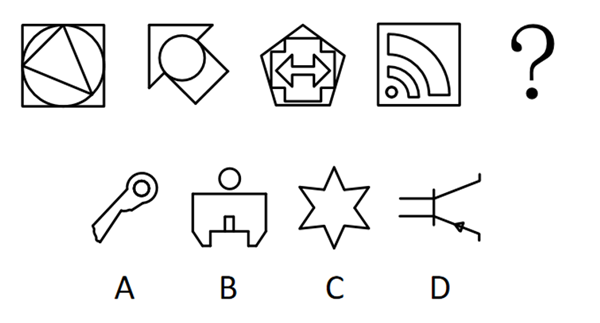
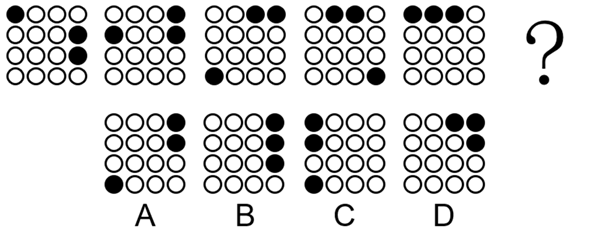
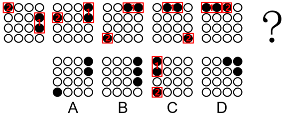
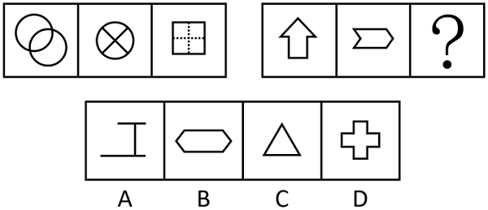
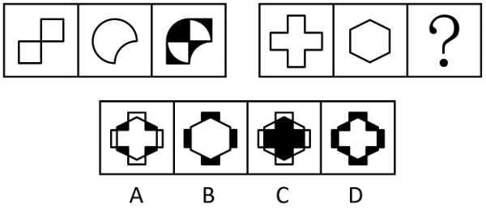
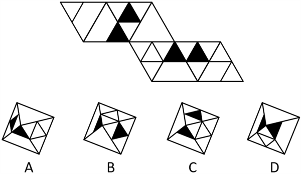
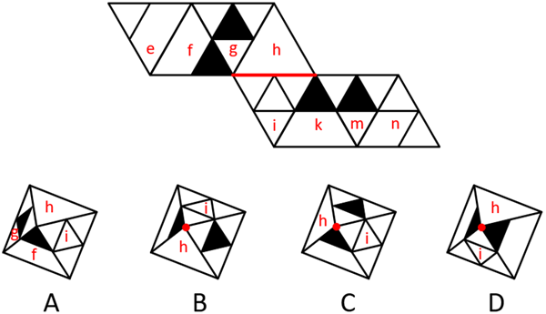
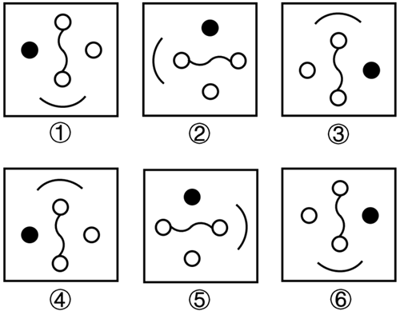
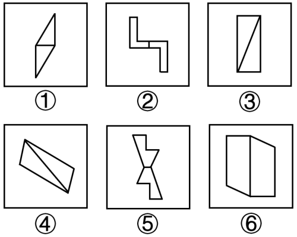
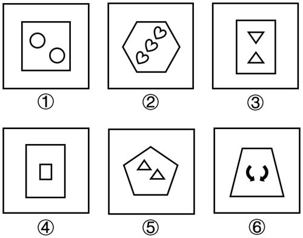

# 2025年山东省公务员录用考试《行测》试题（网友回忆版）

> 判断推理 · 33 题 · 山东 2025

## 第 1 题　qid 14403693 · 图形推理

下列选项最符合所给图形规律的是：

- **A**. A
- **B**. B　✅
- **C**. C
- **D**. D

**答案**：B

**官方解析**

元素组成不同，优先考虑属性规律。观察发现，题干图形出现多个等腰元素，考虑对称性，题干图形均为只有一条对称轴的轴对称图形，故？处应用此规律，只有B项符合。
故正确答案为B。

---

## 第 2 题　qid 14403690 · 图形推理

下列选项最符合所给图形规律的是：

- **A**. A
- **B**. B
- **C**. C　✅
- **D**. D

**答案**：C

**官方解析**

元素组成相同，优先考虑位置规律。如下图所示，标1的两个黑球沿外圈每次逆时针平移1格，标2的黑球沿外圈依次逆时针平移1、2、3、4格，故图5中标1的两个黑球沿外圈逆时针平移1格，标2的黑球沿外圈逆时针平移5格得到？处图形，只有C项符合。

故正确答案为C。

---

## 第 3 题　qid 14403696 · 图形推理

下列选项最符合所给图形规律的是：

- **A**. A
- **B**. B
- **C**. C　✅
- **D**. D

**答案**：C

**官方解析**

元素组成不同，优先考虑属性规律。题干图形较规整，且出现等腰元素，考虑对称性。观察发现，第一组图形均为既轴对称又中心对称图形，第二组图形中的前两幅图形均为仅轴对称图形，故？处应为仅轴对称图形，只有C项符合。
故正确答案为C。

---

## 第 4 题　qid 14403686 · 图形推理

下列选项最符合所给图形规律的是：

- **A**. A
- **B**. B
- **C**. C
- **D**. D　✅

**答案**：D

**官方解析**

元素组成相似，且相同线条重复出现，优先考虑样式规律中的加减同异。观察第一组图形发现，图1与图2叠加后，重叠的部分为白色，不重叠的部分变为黑色，从而得到图3；第二组图形应用此规律，只有D项符合。
故正确答案为D。

---

## 第 5 题　qid 10886447 · 图形推理

下图为给定的多面体的外表面展开图，四个选项中哪一个可以由展开图折叠而成？

- **A**. A　✅
- **B**. B
- **C**. C
- **D**. D

**答案**：A

**官方解析**

本题为空间重构题。将题干展开图和选项中的面标上序号，如下图所示：

题干展开图中，面h和面i存在公共边，但在B、C、D三项中，面h和面i均以点相接，并不存在公共边，与题干展开图不一致，只有A项符合。

故正确答案为A。

---

## 第 6 题　qid 14403688 · 图形推理

把下面的六个图形分为两类，使每一类图形都有各自的共同特征或规律，分类正确的一项是：

- **A**. ①⑤⑥，②③④
- **B**. ①②③，④⑤⑥　✅
- **C**. ①③④，②⑤⑥
- **D**. ①②⑤，③④⑥

**答案**：B

**官方解析**

本题为分组分类题目。元素组成相同，优先考虑位置规律。观察发现，图①②③形状均相同，可以通过相互旋转得到，图④⑤⑥形状均相同，可以通过相互旋转得到，故图①②③为一组，图④⑤⑥为一组。
故正确答案为B。

---

## 第 7 题　qid 14403692 · 图形推理

把下面的六个图形分为两类，使每一类图形都有各自的共同特征或规律，分类正确的一项是：

- **A**. ①④⑥，②③⑤
- **B**. ①③⑤，②④⑥
- **C**. ①②⑤，③④⑥　✅
- **D**. ①②⑥，③④⑤

**答案**：C

**官方解析**

本题为分组分类题目。观察发现，题干图形均出现连在一起的两个面，考虑图形间关系。图①②⑤中两个面相交于最短边，图③④⑥中两个面相交于最长边。即图①②⑤为一组，图③④⑥为一组。
故正确答案为C。

---

## 第 8 题　qid 14403697 · 图形推理

把下面的六个图形分为两类，使每一类图形都有各自的共同特征或规律，分类正确的一项是：

- **A**. ①⑤⑥，②③④
- **B**. ①②⑥，③④⑤
- **C**. ①③⑥，②④⑤　✅
- **D**. ①③④，②⑤⑥

**答案**：C

**官方解析**

本题为分组分类题目。元素组成不同，且无明显属性规律，优先考虑数量规律。观察发现，题干图形外框均为多边形，考虑数线，外框边数分别为4、6、4、4、5、4；继续观察发现，题干图形框内均由小元素组成，考虑数素，内部元素数量分别为2、3、2、1、2、2；单看均无规律，考虑运算发现，图①③⑥中，外框边数-内部元素数=2，图②④⑤中，外框边数-内部元素数=3，即图①③⑥为一组，图②④⑤为一组。
故正确答案为C。

---

## 第 9 题　qid 16157487 · 定义判断

绿色计算是一种对环境可支撑的计算方式。它所使用的计算部件、通信网络和机房设施等均能高效运行而对环境产生较小或不产生有害影响。
根据上述定义，下列属于绿色计算的是：

- **A**. 某高校实行校区网络全覆盖，全体师生在校园内都可以实现无线上网
- **B**. 某校大数据中心将办公楼建在校区以减少外部环境对中心运行的影响
- **C**. 某市才算中心全部用笔记本电脑取代台式电脑
- **D**. 某研究院运算中心计算设备全部用太阳能发电取代传统电能驱动，降低能耗　✅

**答案**：D

**官方解析**

第一步：找出定义关键词。
“所使用的计算部件、通信网络和机房设施等均能高效运行”、“对环境产生较小或不产生有害影响”。
第二步：逐一分析选项。
A项：该高校实行校区网络全覆盖，未涉及对环境的影响，不符合“对环境产生较小或不产生有害影响”，不符合定义，排除；
B项：大数据中心办公楼建在校区，只涉及办公楼地点，未体现“所使用的计算部件、通信网络和机房设施等均能高效运行”，减少的是“外部环境对中心运行的影响”，未涉及“对环境产生较小或不产生有害影响”，不符合定义，排除；
C项：全部用笔记本电脑取代台式电脑，未涉及对环境的影响，不符合“对环境产生较小或不产生有害影响”，不符合定义，排除；
D项：计算设备全部用太阳能发电取代传统电能驱动，降低能耗，符合“所使用的计算部件、通信网络和机房设施等均能高效运行”、“对环境产生较小或不产生有害影响”，符合定义，当选。
故正确答案为D。

---

## 第 10 题　qid 16157432 · 定义判断

新型数字劳动是数字用户消耗在数字平台上的一种创造性劳动。其特点为用户的在线时间成为潜在的劳动时间，劳动过程不具有雇佣关系。涵盖人们日常的休闲、娱乐、劳动过程，不受时空限制，并表现为一种轻松愉悦的劳动形式。
根据上述定义，下列属于新型数字劳动的是：

- **A**. 某小区居民用手机在数字设备上观看视频和购物　✅
- **B**. 某广告公司设计师用电脑给客户做预算和设计广告牌
- **C**. 某互联网企业程序员用电脑完成程序
- **D**. 某平台网约车司机根据客户不同需求安排路线

**答案**：A

**官方解析**

第一步：找出定义关键词。
“用户消耗在数字平台上的创造性劳动”、“用户的在线时间成为潜在的劳动时间”、“劳动过程不具有雇佣关系”、“轻松愉悦的劳动形式”。
第二步：逐一分析选项。
A项：居民在数字设备上观看视频和购物，其中观看视频和购物分别会产生流量数据和消费数据，符合“用户消耗在数字平台上的创造性劳动”、“用户的在线时间成为潜在的劳动时间”，居民和数字平台之间不存在雇佣关系，符合“劳动过程不具有雇佣关系”，且观看视频和购物也是常见的放松方式，符合“轻松愉悦的劳动形式”，符合定义，当选；
B项：设计师用电脑工作，不明确是否涉及“数字平台”，且设计师与广告公司之间存在明确的雇佣关系，不符合“劳动过程不具有雇佣关系”，不符合定义，排除；
C项：程序员用电脑完成程序，不明确是否涉及“数字平台”，且程序员与互联网企业之间存在明确的雇佣关系，不符合“劳动过程不具有雇佣关系”，不符合定义，排除；
D项：网约车司机的工作内容是搭载客户到目的地，即在线下为客户提供运输服务，不符合“用户消耗在数字平台上的创造性劳动”，且网约车工作会出现收入结构复杂、工作强度高、职业压力显著等情况，不符合“轻松愉悦的劳动形式”，不符合定义，排除。
故正确答案为A。

---

## 第 11 题　qid 16157427 · 定义判断

家庭体育是一人或几人在家庭生活中安排的或自愿以家庭名义参与的，以身体练习为基本手段，以获得运动知识技能、满足兴趣爱好、丰富家庭生活、实现强身健体和促进家庭稳定等为主要目的的教育过程和文化活动。
根据上述定义，下列属于家庭体育的是：

- **A**. 小梅在家帮助父亲，锻炼他受伤的腿部伸展运动
- **B**. 王经理下班后，经常和儿子一起在校园里打篮球　✅
- **C**. 父母为使小李在比赛中获胜，监督他每天运动
- **D**. 小明经常参加他同学父母组织的乒乓球比赛

**答案**：B

**官方解析**

第一步：找出定义关键词。
“在家庭生活中安排的或自愿以家庭名义参与的”、“以身体练习为基本手段”、“以获得运动知识技能、满足兴趣爱好、丰富家庭生活、实现强身健体和促进家庭稳定等为主要目的”、“教育过程和文化活动”。
第二步：逐一分析选项。
A项：选项指出小梅在家帮助父亲锻炼他受伤的腿，锻炼的目的是为了康复，且该活动与教育或文化无关，不符合“以获得运动知识技能、满足兴趣爱好、丰富家庭生活、实现强身健体和促进家庭稳定等为主要目的”、“教育过程和文化活动”，不符合定义，排除；
B项：选项指出王经理经常和儿子一起打篮球，符合“在家庭生活中安排的或自愿以家庭名义参与的”、“以身体练习为基本手段”、“以获得运动知识技能、满足兴趣爱好、丰富家庭生活、实现强身健体和促进家庭稳定等为主要目的”、“教育过程和文化活动”，符合定义，当选；
C项：选项指出父母为使小李在比赛中获胜，监督他每天运动，小李的运动不是以家庭名义参与的，且运动的目的是为了赢得比赛，不符合“在家庭生活中安排的或自愿以家庭名义参与的”、“以获得运动知识技能、满足兴趣爱好、丰富家庭生活、实现强身健体和促进家庭稳定等为主要目的”，不符合定义，排除；
D项：选项指出小明经常参加他同学父母组织的乒乓球比赛，该比赛不是在家庭生活中开展的，不符合“在家庭生活中安排的或自愿以家庭名义参与的”，不符合定义，排除。
故正确答案为B。

---

## 第 12 题　qid 16157446 · 定义判断

目标中心战是指通过对目标节点的打击，削弱敌目标体系聚合力，达到快速瘫痪或瓦解对手作战体系的目的，或通过对关键目标施压，削弱对方抵抗意志，达到“小战”或“局战”而屈人之兵战略战役目的的一种战术。
根据上述定义，下列军事演习中没有运用目标中心战战术的是：

- **A**. 红方通过远程导弹攻击蓝方辎重运输车队
- **B**. 红方通过高科技干扰蓝方指挥通讯
- **C**. 蓝方侦察分队向红方的腹地进行重点的目标侦察　✅
- **D**. 蓝方通过无人机3分钟捣毁红方指挥部

**答案**：C

**官方解析**

第一步：找出定义关键词。
“通过对目标节点的打击”、“快速瘫痪或瓦解对手作战体系”、“通过对关键目标施压”、“达到‘小战’或‘局战’而屈人之兵”。
第二步：逐一分析选项。
A项：辎重运输车队是指军队后勤运送物资的车队，红方通过远程导弹攻击蓝方辎重运输车队，符合“通过对关键目标施压”、“达到‘小战’或‘局战’而屈人之兵”，符合定义，排除；
B项：指挥通讯是作战时的关键步骤和重要节点，红方通过高科技干扰蓝方指挥通讯，会让敌方军队丧失一定战斗能力，符合“通过对目标节点的打击”、“快速瘫痪或瓦解对手作战体系”，符合定义，排除；
C项：蓝方侦察分队向红方的腹地进行重点的目标侦察，只是进行侦察，没有进行打击或干扰，不符合“通过对目标节点的打击”、“快速瘫痪或瓦解对手作战体系”、“通过对关键目标施压”、“达到‘小战’或‘局战’而屈人之兵”，不符合定义，当选；
D项：指挥部在作战中起着至关重要的作用，蓝方通过无人机3分钟捣毁红方指挥部，符合“通过对目标节点的打击”、“快速瘫痪或瓦解对手作战体系”，符合定义，排除。
本题为选非题，故正确答案为C。

---

## 第 13 题　qid 16157448 · 定义判断

公共责任是指国家公共管理部门的行政人员，在工作中必须对国家权力主体负责，必须提高自身职责的履行，来为国民谋利益。
根据上述定义，下列属于履行公共责任的是：

- **A**. 某市交通局小王遇到一个老人突发心脏病，协助路面的车辆将老人送到医院
- **B**. 某市税务局小张审核纳税记录时，发现一个企业漏报了税项，随即要求企业进行补缴　✅
- **C**. 某市民政局小石上班途中，发现一个儿童溺水，立刻跳到水中进行营救
- **D**. 某市检察院小李和老同学吃饭聊天，发现其受贿，劝其立刻向组织交代

**答案**：B

**官方解析**

第一步：找出定义关键词。
“国家公共管理部门的行政人员”、“在工作中”、“对国家权力主体负责，提高自身职责的履行”。
第二步：逐一分析选项。
A项：交通局小王协助路面的车辆将突发心脏病的老人送到医院，其中“协助将老人送去医院”不属于自身的职责，不符合“对国家权力主体负责，提高自身职责的履行”，不符合定义，排除；
B项：税务局小张，符合“国家公共管理部门的行政人员”，审核纳税记录时，符合“在工作中”，要求漏报税项的企业进行补缴，符合“对国家权力主体负责，提高自身职责的履行”，符合定义，当选；
C项：民政局上班的小石营救溺水儿童，其中“营救溺水儿童”不属于民政局职工自身的职责，不符合“对国家权力主体负责，提高自身职责的履行”，不符合定义，排除；
D项：检察院的小李在吃饭聊天时，劝说受贿的老同学向组织交代，“吃饭聊天”说明小李不是在工作中，不符合“在工作中”，不符合定义，排除。
故正确答案为B。

---

## 第 14 题　qid 18507957 · 定义判断

祖先崇拜是广泛存在于人类社会中的一种文化现象。它具有以下特点：一是将本族的祖先神化并对之祭拜，具有本族认同性和异族排斥性；二是相信其祖先神灵具有神奇超凡的威力，会庇佑后代族人并与之沟通互感；三是不再用动植物等图腾象征或生殖象征来作为其氏族部落的标志，而代之以其氏族祖先的名字。
根据上述定义，下列属于祖先崇拜的是：

- **A**. 古人视龙为吉祥，将自己定义为龙的传人求庇佑
- **B**. 古人认为，黄帝带领他们进入文明时代，将自己定义为炎黄子孙，并且为其立庙祭祀　✅
- **C**. 简狄吞下玄鸟蛋后生下阏伯
- **D**. 古人定义雷公电母，希望他们保佑风调雨顺

**答案**：B

**官方解析**

第一步：找出定义关键词。
“将本族的祖先神化并对之祭拜，具有本族认同性和异族排斥性”、“相信其祖先神灵具有神奇超凡的威力，会庇佑后代族人并与之沟通互感”、“不再用动植物等图腾象征或生殖象征来作为其氏族部落的标志，而代之以其氏族祖先的名字”。
第二步：逐一分析选项。
A项：古人视龙为吉祥，将自己定义为龙的传人求庇佑，说明是将龙作为其氏族部落的标志，并寻求龙的庇护，龙是动物，不符合“不再用动植物等图腾象征或生殖象征来作为其氏族部落的标志，而代之以其氏族祖先的名字”，不符合定义，排除；
B项：古人认为黄帝带领他们进入文明时代，将自己定义为炎黄子孙，说明是将本族祖先“黄帝”的名字作为氏族部落的标志，符合“不再用动植物等图腾象征或生殖象征来作为其氏族部落的标志，而代之以其氏族祖先的名字”，为黄帝立庙祭祀，说明是在祭拜本族祖先“黄帝”，符合“将本族的祖先神化并对之祭拜，具有本族认同性和异族排斥性”、“相信其祖先神灵具有神奇超凡的威力，会庇佑后代族人并与之沟通互感”，符合定义，当选；
C项：简狄吞下玄鸟蛋后生下阏伯，说的是玄鸟生商的故事，是指一个叫简狄的女人，吞服“玄鸟”下的蛋后，怀孕生下一个儿子叫契，即传说中的商之始祖“阏伯”，这体现了他们对玄鸟的崇拜，认为部落的繁衍与玄鸟相关，其中“玄鸟”是动物，不符合“不再用动植物等图腾象征或生殖象征来作为其氏族部落的标志，而代之以其氏族祖先的名字”，不符合定义，排除；
D项：古人定义雷公电母，希望他们保佑风调雨顺，其中雷公电母不是他们的祖先，不符合“将本族的祖先神化并对之祭拜，具有本族认同性和异族排斥性”，不符合定义，排除。
故正确答案为B。

---

## 第 15 题　qid 10886442 · 定义判断

多模态是指利用两种或两种以上感官同时进行信息交互的方式。在人工智能领域，多模态技术通过融合来自不同感官的数据和信息，提升人工智能系统对复杂信息的理解和处理能力，从而提高性能和扩大应用范围。
根据上述定义，下列不属于多模态应用的是：

- **A**. 语音助手同时接收语音指令和图像输入来回答问题
- **B**. 自动驾驶系统结合摄像头、雷达和激光雷达数据感知环境
- **C**. 智能家居系统通过语音控制灯光并分析用户表情调节氛围
- **D**. 自然语言文本的多种方面，智能处理文本数据并且生成文本回复　✅

**答案**：D

**官方解析**

第一步：找出定义关键词。
“利用两种或两种以上感官同时进行信息交互”。
第二步：逐一分析选项。
A项：语音助手同时接收语音指令（听觉感官）和图像输入（视觉感官）来回答问题，涉及两种不同感官的信息交互，符合“利用两种或两种以上感官同时进行信息交互”，符合定义，排除；
B项：自动驾驶系统结合摄像头（视觉感官）、雷达（距离/速度感知维度）和激光雷达（三维空间感知维度）的数据感知环境，涉及不同的感知维度，符合“利用两种或两种以上感官同时进行信息交互”，符合定义，排除；
C项：智能家居系统通过语音控制（听觉感官）和分析用户表情（视觉感官）实现功能，涉及两种不同感官的信息交互，符合“利用两种或两种以上感官同时进行信息交互”，符合定义，排除；
D项：自然语言文本的多种方面，智能处理文本数据并且生成文本回复，只涉及文本一种信息形式，不符合“利用两种或两种以上感官同时进行信息交互”，不符合定义，当选。
本题为选非题，故正确答案为D。

---

## 第 16 题　qid 10886454 · 定义判断

运动视差是指视觉系统与某空间点产生相对位移时，该点在视觉系统所成画面中的坐标与原坐标产生的偏移。在做相对位移的时候，视线看到不同距离的物体效果是不同的，近的物体看起来运动得快，远的物体看起来运动得慢。
根据上述定义，下列没有体现运动视差的是：

- **A**. 坐在行驶的火车上，看到近处的树木快速后退，而远处的山移动缓慢
- **B**. 驾驶汽车时，路边的电线杆飞速掠过，而远处的建筑缓慢后退
- **C**. 同向行驶的两辆汽车，当两者保持速度一致时，从一辆车上观察另一辆车，后者似乎是静止不动的　✅
- **D**. 站在地面上观察天上的云彩，发现云朵移动的速度比飞机慢很多

**答案**：C

**官方解析**

第一步：找出定义关键词。
“视觉系统与某空间点产生相对位移时”、“该点在视觉系统所成画面中的坐标与原坐标产生的偏移”、“视线看到不同距离的物体效果是不同的，近的物体看起来运动得快，远的物体看起来运动得慢”。
第二步：逐一分析选项。
A项：坐在行驶的火车上，看到近处的树木快速后退，而远处的山移动缓慢，符合“视觉系统与某空间点产生相对位移时”、“该点在视觉系统所成画面中的坐标与原坐标产生的偏移”、“视线看到不同距离的物体效果是不同的，近的物体看起来运动得快，远的物体看起来运动得慢”，符合定义，排除； 
B项：驾驶汽车时，路边的电线杆飞速掠过，而远处的建筑缓慢后退，符合“视觉系统与某空间点产生相对位移时”、“该点在视觉系统所成画面中的坐标与原坐标产生的偏移”、“视线看到不同距离的物体效果是不同的，近的物体看起来运动得快，远的物体看起来运动得慢”，符合定义，排除；
C项：同向行驶的两辆汽车，当两者保持速度一致时，从一辆车上观察另一辆车，不符合“视觉系统与某空间点产生相对位移时”，后者似乎是静止不动的，不符合“视线看到不同距离的物体效果是不同的，近的物体看起来运动得快，远的物体看起来运动得慢”，不符合定义，当选；
D项：站在地面上观察天上的云彩，符合“视觉系统与某空间点产生相对位移时”，发现云朵移动的速度比飞机慢很多，符合“该点在视觉系统所成画面中的坐标与原坐标产生的偏移”、“视线看到不同距离的物体效果是不同的，近的物体看起来运动得快，远的物体看起来运动得慢”，符合定义，排除。
本题为选非题，故正确答案为C。

---

## 第 17 题　qid 16157451 · 定义判断

概念赘余是指在句中使用了在内涵或外延上发生重复或多余的概念。概念混淆是把两个含义相近或读音相同的词所表达的不同概念，在内涵和外延上没有严格区别而造成的逻辑错误。
根据上述定义，下列属于概念赘余的是：

- **A**. 故宫、颐和园和南京长江大桥，都是中外游客向往的名胜古迹
- **B**. 自从退休之后，他每月15日都会持卡到银行取退休金工资　✅
- **C**. 他出生在印尼，如今是法国籍······出生在国外的华侨如此热爱自己的祖国
- **D**. 山东的景区是一天看不完的，趵突泉是山东的景区，所以趵突泉是一天看不完的

**答案**：B

**官方解析**

第一步：找出定义关键词。
概念赘余：“在句中使用了在内涵或外延上发生重复或多余的概念”；
概念混淆：“把两个含义相近或读音相同的词所表达的不同概念，在内涵和外延上没有严格区别而造成的逻辑错误”。
第二步：逐一分析选项。
A项：“名胜古迹”指风景优美和有古代遗迹的著名地方，南京长江大桥是现代产物，不属于“名胜古迹”，错在不清楚“名胜古迹”的具体意思，不符合“在句中使用了在内涵或外延上发生重复或多余的概念”，不符合定义，排除；
B项：“退休金”指在劳动者年老或丧失劳动能力后，根据他们对社会所作的贡献和所具备的享受养老保险资格或退休条件，由基本养老保险基金以货币形式支付的养老保险待遇，“工资”指作为劳动报酬按期付给劳动者的货币或实物，二者均含有给付货币的意思，符合“在句中使用了在内涵或外延上发生重复或多余的概念”，符合定义，当选；
C项：“华侨”指旅居国外的中国人，仍为中国国籍，该项中的“他”是法国国籍，因此“他”不属于“华侨”，而属于“华人”或“华裔”，错在分不清意思相近的词语，符合“把两个含义相近或读音相同的词所表达的不同概念，在内涵和外延上没有严格区别而造成的逻辑错误”，符合“概念混淆”的定义，不符合“概念赘余”的定义，排除；
D项：“山东的景区”“趵突泉”的概念都始终如一，不存在重复、多余，不符合“在句中使用了在内涵或外延上发生重复或多余的概念”，不符合定义，排除。
故正确答案为B。

---

## 第 18 题　qid 16157449 · 定义判断

乏氧性缺氧是指因肺泡氧分压降低或静脉血分流入动脉，血液从肺摄取的氧减少，以致血氧分压降低；血液性缺氧是指因红细胞数量和血红蛋白含量减少或血红蛋白性质改变，使血液携氧能力降低，导致组织缺氧；循环性缺氧是指因血液流速减慢，单位时间内供给组织的氧量减少而引起的缺氧；组织性缺氧是指因组织细胞利用氧的能力减弱而引起的缺氧。
根据上述定义，下列说法正确的是：

- **A**. 小王在青藏高原徒步时出现高原反应，属于血液性缺氧
- **B**. 小刘长期大量食用腌菜出现呼吸不畅，属于组织性缺氧
- **C**. 小吴因心动过缓而常常感到呼吸困难，属于循环性缺氧　✅
- **D**. 小李因呼吸酶合成减少导致呼吸困难，属于乏氧性缺氧

**答案**：C

**官方解析**

第一步：找出定义关键词。
乏氧性缺氧：“肺泡氧分压降低或静脉血分流入动脉，血液从肺摄取的氧减少，以致血氧分压降低”；
血液性缺氧：“红细胞数量和血红蛋白含量减少或血红蛋白性质改变，使血液携氧能力降低，导致组织缺氧”；
循环性缺氧：“血液流速减慢，单位时间内供给组织的氧量减少而引起的缺氧”；
组织性缺氧：“组织细胞利用氧的能力减弱而引起的缺氧”。
第二步：逐一分析选项。
A项：小王在青藏高原徒步时出现高原反应，是由于在高原环境，大气中氧分压减少，造成人体供氧不足，符合“肺泡氧分压降低或静脉血分流入动脉，血液从肺摄取的氧减少，以致血氧分压降低”，符合‌“乏氧性缺氧”定义，不符合“血液性缺氧”定义，说法错误，排除；
B项：小刘长期大量食用腌菜出现呼吸不畅，是由于腌菜中含有大量的亚硝酸盐，而亚硝酸盐进入到血液之后会使人体具有运输氧气功能的低铁血红蛋白氧化成高铁血红蛋白，从而降低血液的输氧能力，符合“红细胞数量和血红蛋白含量减少或血红蛋白性质改变，使血液携氧能力降低，导致组织缺氧”，符合‌“血液性缺氧”定义，不符合“组织性缺氧”定义，说法错误，排除；
C项：小吴因心动过缓而常常感到呼吸困难，而心动过缓会导致体内血液流速变慢，符合“血液流速减慢，单位时间内供给组织的氧量减少而引起的缺氧”，符合“循环性缺氧”定义，说法正确，当选；
D项：小李因呼吸酶合成减少导致呼吸困难，其中呼吸酶是指与细胞呼吸相关的酶，合成减少说明组织细胞的呼吸作用减弱，人体利用氧气的能力因此减弱，符合“组织细胞利用氧的能力减弱而引起的缺氧”，符合‌“组织性缺氧”定义，不符合“乏氧性缺氧”定义，说法错误，排除。
故正确答案为C。

---

## 第 19 题　qid 16157486 · 类比推理

明眸：善睐

- **A**. 扬汤：止沸
- **B**. 础润：知雨
- **C**. 十拿：九稳
- **D**. 老马：识途　✅

**答案**：D

**官方解析**

第一步：判断题干词语间逻辑关系。
“明眸善睐”是指明亮的眼睛善于顾盼传情，即“善睐”是“明眸”的一个特点，二者是对应关系，且“明眸”是偏正结构。
第二步：判断选项词语间逻辑关系。
A项：“扬汤止沸”是指把锅里开着的水舀起来再倒回去，使它凉下来不沸腾，“扬汤”是为了“止沸”，二者是方式目的的对应关系，与题干逻辑关系不一致，排除；
B项：“础润知雨”是指看到柱子的基石润湿了，就是要下雨的征兆，因为“础润”，所以“知雨”，二者是因果关系，与题干逻辑关系不一致，排除；
C项：“十拿九稳”是指动手拿十次，有九次稳当得手，用来比喻很有把握，二者不是特点的对应关系，且“十拿”也不是偏正结构，与题干逻辑关系不一致，排除；
D项：“老马识途”是指老马认识走过的道路，比喻有经验的人对事情比较熟悉，“识途”是“老马”的一个特点，二者为对应关系，且“老马”是老的马，为偏正结构，与题干逻辑关系一致，当选。
故正确答案为D。

---

## 第 20 题　qid 16157474 · 类比推理

理性投资：稳健收益

- **A**. 绿色经济：低碳环保　✅
- **B**. 自然选择：物种进化
- **C**. 基因剪辑：生物工程
- **D**. 智能汽车：自动驾驶

**答案**：A

**官方解析**

第一步：判断题干词语间逻辑关系。
理性投资是为了稳健收益，二者是方式目的的对应关系。
第二步：判断选项词语间逻辑关系。
A项：绿色经济是为了低碳环保，二者是方式目的的对应关系，与题干逻辑关系一致，当选；
B项：自然选择是生物进化的一种机制，它决定了物种进化的方向和速度，二者是条件对应关系，与题干逻辑关系不一致，排除；
C项：基因剪辑是生物工程领域中一项关键技术，二者是技术与应用领域的对应关系，与题干逻辑关系不一致，排除；
D项：自动驾驶是智能汽车的一个重要特点，二者是属性对应关系，与题干逻辑关系不一致，排除。
故正确答案为A。

---

## 第 21 题　qid 18507967 · 类比推理

睡眠不足：血压升高

- **A**. 工匠精神：精益求精
- **B**. 车辆增加：交通拥堵　✅
- **C**. 太阳照射：地表升温
- **D**. 经济发展：基建提速

**答案**：B

**官方解析**

第一步：判断题干词语间逻辑关系。
“睡眠不足”会导致“血压升高”，二者为因果对应关系，且“睡眠不足”是人为原因。
第二步：判断选项词语间逻辑关系。
A项：“工匠精神”就是追求卓越的创造精神、精益求精的品质精神、用户至上的服务精神，“精益求精”是“工匠精神”的内涵之一，二者不是因果对应关系，与题干逻辑关系不一致，排除；
B项：“车辆增加”会导致“交通拥堵”，二者为因果对应关系，且“车辆增加”是人为原因，与题干逻辑关系一致，当选；
C项：“太阳照射”会导致“地表升温”，二者为因果对应关系，但“太阳照射”是自然原因，与题干逻辑关系不一致，排除；
D项：“基建提速”有助于促进“经济发展”，二者为因果对应关系，但词语顺序与题干相反，排除。
故正确答案为B。

---

## 第 22 题　qid 18507959 · 类比推理

芝兰之室：鲍鱼之肆

- **A**. 惊弓之鸟：漏网之鱼
- **B**. 再造之恩：犬马之劳
- **C**. 莫逆之交：乌合之众　✅
- **D**. 诛心之论：绕梁之音

**答案**：C

**官方解析**

第一步：判断题干词语间逻辑关系。
芝兰之室指美好的环境；鲍鱼之肆比喻不良的、恶劣的环境，二者为反义关系。
第二步：判断选项词语间逻辑关系。
A项：惊弓之鸟指被弓箭吓怕了的鸟，比喻受过惊吓后遇到一点动静就十分害怕的人；漏网之鱼指逃脱鱼网的鱼，比喻侥幸逃脱的罪犯或敌人，二者无明显语义关系，与题干逻辑关系不一致，排除；
B项：再造之恩指像使自己再生一样的恩情，形容恩情极大；犬马之劳指像犬马那样所做的操劳，表示心甘情愿受人驱使，为人效劳，二者无明显语义关系，与题干逻辑关系不一致，排除；
C项：莫逆之交指志同道合或情投意合的交谊，也指有这样交谊的朋友；乌合之众指临时杂凑、毫无组织纪律的一群人，二者为反义关系，与题干逻辑关系一致，当选；
D项：诛心之论意思是不问罪行，只根据其用心以认定罪状，也指揭穿动机的评论；绕梁之音指美妙动听的音乐，二者无明显语义关系，与题干逻辑关系不一致，排除。
故正确答案为C。

---

## 第 23 题　qid 18507981 · 类比推理

银：铝：氧

- **A**. 速降：攀岩：跑酷
- **B**. 中山装：马面裙：燕尾服　✅
- **C**. 油菜：菠菜：青菜
- **D**. 花猫：黑猫：波斯猫

**答案**：B

**官方解析**

第一步：判断题干词语间逻辑关系。
从金属角度来看，银和铝均为金属元素，二者为并列关系，氧不是金属元素，第三词与前两词不是并列关系。
第二步：判断选项词语间逻辑关系。
A项：速降、攀岩和跑酷为三种不同的运动形式，三者为并列关系，与题干逻辑关系不一致，排除；
B项：从所属文化体系来看，中山装与马面裙均为中式服装，二者为并列关系，燕尾服是西式服装，第三词与前两词不是并列关系，与题干逻辑关系一致，当选；
C项：青菜别名小白菜，油菜、菠菜和青菜均为蔬菜，三者为并列关系，与题干逻辑关系不一致（注：当青菜理解成绿色菜的统称时，前两词与第三词为包容关系，此时也与题干逻辑关系不一致），排除；
D项：花猫和黑猫是以猫的颜色划分的，二者为并列关系，波斯猫是以猫的品种划分的，第三词与前两词为交叉关系，与题干逻辑关系不一致，排除。
故正确答案为B。

---

## 第 24 题　qid 18507995 · 类比推理

火：烧烤：烘焙

- **A**. 水：瓢泼：嘀嗒
- **B**. 木：梁柱：床柜
- **C**. 金：铜钱：银针　✅
- **D**. 土：坡地：坷垃

**答案**：C

**官方解析**

第一步：判断题干词语间逻辑关系。
烧烤和烘焙是两种不同的烹饪方式，二者是并列关系；制作烧烤和烘焙的过程中都会用到“火”，其中烧、烤、烘、焙这四个字的偏旁均为“火”。
第二步：判断选项词语间逻辑关系。
A项：瓢泼形容雨下得非常大，嘀嗒形容水滴落下或钟表摆动的声音，二者都可以用来形容雨水的下落状态，二者是并列关系，但瓢、嘀、嗒的偏旁均不为“水”，与题干逻辑关系不一致，排除；
B项：梁柱和床柜是两种不同的房屋部件，二者是并列关系；制作梁柱和床柜的过程中都会用到“木”，但床的偏旁为“广”，与题干逻辑关系不一致，排除；
C项：铜钱和银针是两种不同的金属制品，二者是并列关系；金可指金属，通常指金、银、铜、铁、锡等，制作铜钱和银针的过程中都会用到“金”，其中铜、钱、银、针这四个字的偏旁均为“钅（即金）”，与题干逻辑关系一致，当选；
D项：坡地指山坡上倾斜的田地，坷垃指土块，坷垃是坡地的组成部分，二者是组成关系，与题干逻辑关系不一致，排除。
故正确答案为C。

---

## 第 25 题　qid 18507996 · 类比推理

拜师：学艺：出师

- **A**. 规划：实施：总结　✅
- **B**. 破晓：日暮：日中
- **C**. 奠基：建造：开发
- **D**. 剪刻：构图：装裱

**答案**：A

**官方解析**

第一步：判断题干词语间逻辑关系。
先拜师，然后学艺，最后出师，三者为时间先后顺序的对应关系。
第二步：判断选项词语间逻辑关系。
A项：先规划，然后实施，最后总结，三者为时间先后顺序的对应关系，与题干逻辑关系一致，当选；
B项：先破晓（即黎明时分)，然后日中（即中午），最后日暮（即太阳落山时分），三者为时间先后顺序的对应关系，但词语顺序与题干不一致，与题干逻辑关系不一致，排除；
C项：开发指以荒地、矿山、森林、水力等自然资源为对象进行劳动，以达到利用的目的。先奠基，然后建造，二者都是开发的具体环节，前两词与第三词不是时间先后顺序的对应关系，与题干逻辑关系不一致，排除；
D项：先构图，然后剪刻，最后装裱，三者为时间先后顺序的对应关系，但词语顺序与题干不一致，与题干逻辑关系不一致，排除。
故正确答案为A。

---

## 第 26 题　qid 18508000 · 类比推理

公共汽车：汽车：交通工具

- **A**. 年工资：月工资：工资
- **B**. 实词：名词：专有名词
- **C**. 济南市：山东省：中国
- **D**. 单独概念：概念：思维形式　✅

**答案**：D

**官方解析**

第一步：判断题干词语间逻辑关系。
公共汽车是汽车的一种，汽车是交通工具的一种，三者为层层种属关系。
第二步：判断选项词语间逻辑关系。
A项：年工资与月工资都属于不同时间段工资总额的描述，二者为并列关系，与题干逻辑关系不一致，排除；
B项：专有名词是名词的一种，名词是实词的一种，三者为层层种属关系，但词语顺序与题干不一致，排除；
C项：济南市是山东省的一部分，山东省是中国的一部分，三者为层层组成关系，与题干逻辑关系不一致，排除；
D项：单独概念是概念的一种，概念是思维形式的一种，三者为层层种属关系，与题干逻辑关系一致，当选。
故正确答案为D。

---

## 第 27 题　qid 18508006 · 类比推理

文字 对于 （    ） 相当于 说话 对于 （    ）

- **A**. 珠圆玉润；绘声绘色　✅
- **B**. 气势磅礴；窃窃私语
- **C**. 奇文共赏；指手画脚
- **D**. 舞文弄墨；口若悬河

**答案**：A

**官方解析**

逐一代入选项。
A项：“珠圆玉润”形容歌声婉转优美或文字流畅明快，珠圆玉润的文字，二者为偏正关系；“绘声绘色”形容叙述或描写生动逼真，绘声绘色地说话，二者为偏正关系，前后逻辑关系一致，当选；
B项：“气势磅礴”形容气势雄伟壮大，也可以指文字或文学作品展现出雄浑气魄，气势磅礴的文字，二者为偏正关系；“窃窃私语”指私下里小声交谈，窃窃私语是一种说话的形式，二者为种属关系，前后逻辑关系不一致，排除；
C项：“奇文共赏”指少见的好文章大家一道欣赏，与文字没有明显的逻辑关系；“指手画脚”形容说话时兼用手势示意，指手画脚地说话，二者为偏正关系，前后逻辑关系不一致，排除；
D项：“舞文弄墨”指玩弄文字技巧，二者是对应关系；“口若悬河”指说话像瀑布流泻一样滔滔不绝，形容能言善辩，口若悬河地说话，二者为偏正关系，前后逻辑关系不一致，排除。
故正确答案为A。

---

## 第 28 题　qid 18508013 · 类比推理

教务主任 对于 （    ） 相当于 （    ） 对于 育种技术

- **A**. 校规校纪；农机技术
- **B**. 教师任免；科技人才
- **C**. 在校学生；土壤条件
- **D**. 学籍管理；农业专家　✅

**答案**：D

**官方解析**

逐一代入选项。
A项：教务主任是校长领导下的学校教学的具体组织者和管理者，可以参与制定校规校纪，二者为职业与工作内容的对应关系；农机技术是指在种植业和畜牧业生产过程中使用各种机械的相关技术，育种技术是培育优良动植物新品种的技术，二者为并列关系，前后逻辑关系不一致，排除；
B项：教务主任是校长领导下的学校教学的具体组织者和管理者，教师任免不是教务主任的工作职责，二者无明显逻辑关系；科技人才是掌握知识或生产工艺技能并有较大社会贡献的人，育种技术是培育优良动植物新品种的技术，科技人才可以研发育种技术，二者为主体与工作成果的对应关系，前后逻辑关系不一致，排除；
C项：教务主任是校长领导下的学校教学的具体组织者和管理者，在校学生是教务主任的管理对象，二者为职业与对象的对应关系；育种技术是培育优良动植物新品种的技术，育种技术会受到土壤条件的影响，二者为条件对应关系，前后逻辑关系不一致，排除；
D项：教务主任是校长领导下的学校教学的具体组织者和管理者，学籍管理是教务主任的工作内容之一，二者为职业与工作内容的对应关系；育种技术是培育优良动植物新品种的技术，是农业专家的工作内容之一，二者为职业与工作内容的对应关系，前后逻辑关系一致，当选。
故正确答案为D。

---

## 第 29 题　qid 10886459 · 类比推理

学校筹集到一笔资金用于对场地进行重新建设，对于资金的分配，有老师有以下观点：
甲：或者建设体育场，或者建设实验楼；
乙：不是建设体育场，也不是建设实验楼；
丙：或者建设实验楼，或者不建设教学楼。
最后只有一位老师的说法正确，请问这笔资金用于建设什么场地？

- **A**. 体育场
- **B**. 实验楼
- **C**. 教学楼　✅
- **D**. 体育场和教学楼

**答案**：C

**官方解析**

第一步：找出题干矛盾命题。

甲：体育场 或 实验楼；

乙：体育场 且 实验楼；

丙：实验楼 或 教学楼。

分析题干条件可知，甲和乙的说法为矛盾关系，必有一真一假。

第二步：根据题干条件推理。

根据题干条件可知，只有一位老师的说法正确，则说法为真的人一定在甲和乙之间，可知丙的说法为假，说明丙的矛盾为真，即“实验楼 且 教学楼”为真，此时无法确定甲和乙的说法谁真谁假，即无法推出这笔资金是否用于建设体育场，故仅可推出这笔资金用于建设教学楼。

故正确答案为C。

---

## 第 30 题　qid 10886462 · 逻辑判断

物业为了防止小区电动车上楼进户进而引起火灾，所以安装了“阻拒”系统，该系统发现一旦小区电梯中进入电动车，就会自动报警，小区物业认为该系统能够有效防止电动车上楼。反对者认为，该措施不一定能够有效。
以下哪项不能支持反对者的观点？

- **A**. 部分住户可能会故意遮挡电动车，使其不被系统识别
- **B**. 该小区的电动车棚的面积和充电桩的数量都不能满足用户需要
- **C**. 系统存在误报情况，可能引发住户不满　✅
- **D**. 系统仅能报警，无法强制阻止电动车上楼

**答案**：C

**官方解析**

第一步：找出论点和论据。
论点：安装了“阻拒”系统不一定能有效防止电动车上楼。
论据：无。
本题只有论点，没有论据，加强优先考虑补充论据，且本题为选非题，找出可以加强的选项排除即可。
第二步：逐一分析选项。
A项：该项指出系统无法识别被用户故意遮挡的电动车，说明安装了“阻拒”系统也不一定能有效防止电动车上楼，补充论据，可以加强，排除；
B项：该项指出该小区电动车棚的面积和充电桩的数量都不能满足用户需要，说明部分用户可能会将电动车在楼上停放或充电，因此即使系统报警，这些用户仍可能因无视或躲避报警而让电动车上楼，即安装了“阻拒”系统也不一定能有效防止电动车上楼，补充论据，可以加强，排除；
C项：该项指出系统存在误报情况，可能会引发住户不满，说明当该系统将其它物品错误识别为电动车时，会给住户造成困扰，但这样的误报本身并不影响该系统识别真实的电动车并阻止其上楼，因此安装了“阻拒”系统可以有效防止电动车上楼，无法加强，当选；
D项：该项指出系统仅能报警，无法强制阻止电动车上楼，说明住户若无视警报，电动车仍然可以上楼进户，即安装了“阻拒”系统也不一定能有效防止电动车上楼，补充论据，可以加强，排除。
本题为选非题，故正确答案为C。

---

## 第 31 题　qid 10886461 · 逻辑判断

人体中需要维持血糖适度平衡。糖尿病患者血糖升高后，胰腺中有细胞分泌胰岛素，以控制血液中血糖维持在平衡范围内。有研究人员发现，有一部分细胞能够先比其他细胞更加敏锐地对血糖的升高做出反应，他们称该种类型的细胞为第一细胞。他们认为，第一细胞发生血糖反应之后，其他跟随细胞才会紧接着分泌胰岛素，对血糖进行调节。

以下哪项能够支持研究人员的观点？

- **A**. 第一细胞开始反应之后，其他跟随细胞滞后发生释放胰岛素反应
- **B**. 当血糖水平升高时，抑制第一细胞的活性会导致其他跟随细胞无法及时分泌胰岛素　✅
- **C**. 即使第一细胞被移除，其他跟随细胞对血糖的反应不变
- **D**. 第一细胞的数量远少于其他跟随细胞，但对血糖变化的敏感度显著更高

**答案**：B

**官方解析**

第一步：找出论点和论据。
论点：第一细胞发生血糖反应之后，其他跟随细胞才会紧接着分泌胰岛素，对血糖进行调节。
论据：有一部分细胞能够先比其他细胞更加敏锐地对血糖的升高做出反应，他们称该种类型的细胞为第一细胞。
本题论点和论据均在讨论第一细胞先于其他跟随细胞对血糖进行调节，二者话题一致，加强优先考虑补充论据。
第二步：逐一分析选项。
A项：该项指出第一细胞先于其他跟随细胞发生反应，是对论点的重复，可以加强，保留；
B项：该项指出抑制第一细胞的活性，其他跟随细胞会无法及时分泌胰岛素，说明只有第一细胞发生反应后，其他跟随细胞才会分泌胰岛素，第一细胞先于其他跟随细胞发生反应，补充论据，可以加强，保留；
C项：该项指出移除第一细胞后其他跟随细胞反应不变，直接否定了第一细胞的作用，说明第一细胞发生反应并非其他跟随细胞发生反应的前提，可以削弱，无法加强，排除；
D项：该项指出第一细胞具有敏感度高的特性，即第一细胞对血糖变化的反应更灵敏，但与论点讨论的第一细胞是否先于其他跟随细胞对血糖进行调节的话题无关，为无关项，无法加强，排除。
对比A、B两项，A项是对论点的简单重复，B项是补充论据，B项的加强力度更强，当选。
故正确答案为B。

---

## 第 32 题　qid 14403695 · 逻辑判断

当下人们普遍认为饮水是保持身体健康的重要方式。然而一些研究表明，过量饮水可能导致低钠血症。低钠血症是指血液中的钠离子含量过低，可能引发头痛，呕吐抽搐，甚至昏迷等症状。
以下哪项如果为真，最能支持题干观点？

- **A**. 坚持锻炼有助于增强体质和免疫力，与饮水量无直接关系
- **B**. 过量饮水会增加肾脏负担，导致排尿能力下降，从而引发水中毒　✅
- **C**. 低钠血症的发生率较低，是因为大多数人不会一次性摄入大量水分
- **D**. 急性肾功能衰竭不是低钠血症的直接表现症状之一

**答案**：B

**官方解析**

第一步：找出论点和论据。
论点：过量饮水可能导致低钠血症。
论据：无。
本题论点指出过量饮水可能导致低钠血症，只有论点，没有论据，加强考虑补充论据。
第二步：逐一分析选项。
A项：选项指出坚持锻炼与饮水量无直接关系，讨论的是“锻炼、饮水量”与“体质”之间的关系，而论点讨论的是“过量饮水”是否会引起“低钠血症”，话题不一致，无法加强，排除；
B项：选项指出大量饮水会增加肾脏负担，引发水中毒，解释了“过量饮水”是如何导致“水中毒”的（这里有个小常识，水中毒又称稀释性低钠血症），解释原因，可以加强，保留；
C项：选项指出低钠血症发生率较低，是因为人们不会一次性摄入大量水分，即从反面说明了大量饮水容易引起低钠血症，补充论据，可以加强，保留；
D项：选项指出急性肾功能衰竭不是低钠血症的直接表现症状之一，讨论的是“急性肾功能衰竭”和“低钠血症”的关系，而论点讨论的是“过量饮水”和“低钠血症”的关系，话题不一致，无法加强，排除。
对比B、C两项，B项直接正面解释了“大量饮水”造成“低钠血症”的原因，而C项是通过补充反面论据说明“低钠血症发生率低”和“大量饮水人少”有联系，不如B项正面直接，根据力度比较原则，直接＞间接，B项力度更强。
注：有的同学可能觉得B项的水中毒与论点中的低钠血症话题不一致，是因为本题涉及到了常识性问题，水中毒又称稀释性低钠血症。选项是将论点中的词语进行了同义替换，与论点讨论的话题是一致的。就像如果论点讨论的是母亲，而选项讨论的是妈妈，两词是同义替换，故二者讨论话题是一致的。
故正确答案为B。

---

## 第 33 题　qid 10886464 · 逻辑判断

根据心理学家研究，人们在面对挑战时，往往会出现不同的心理应对机制。研究表明，在面对笔试或面试等压力挑战下，人们往往会采用“回避”或“躲避”的应对策略，而在面对相对简单的任务时，往往采用积极应对和主动解决的策略。
由此可以推出：

- **A**. 心理应对策略的选择与任务的难易程度无关
- **B**. 在面对压力挑战时，人们会更倾向于选择消极的心理应对方式　✅
- **C**. 所有人在面对压力时都会本能地采取回避策略
- **D**. 简单任务能完全消除人们的消极应对倾向

**答案**：B

**官方解析**

日常结论题，根据题干信息逐一分析选项。
A项：根据题干中“在面对笔试或面试等压力挑战下，人们往往会采用‘回避’或‘躲避’的应对策略，而在面对相对简单的任务时，往往采用积极应对和主动解决的策略”可知，心理应对策略的选择与任务的难易程度有关，无法推出，排除；
B项：“面对压力时会选择消极的心理应对方式”是对题干中“在面对笔试或面试等压力挑战下，人们往往会采用‘回避’或‘躲避’的应对策略”的同义替换，可以推出，当选；
C项：题干说的是“在面对笔试或面试等压力挑战下，人们往往会采用‘回避’或‘躲避’的应对策略”，但“往往”只是一个倾向性的描述，不代表所有人都会采取回避策略，说法过于绝对，无法推出，排除；
D项：题干说的是“在面对相对简单的任务时，往往采用积极应对和主动解决的策略”，即往往能消除消极应对倾向，但“往往”只是一个倾向性的描述，不代表完全消除了消极应对倾向，说法过于绝对，无法推出，排除。
故正确答案为B。

---
